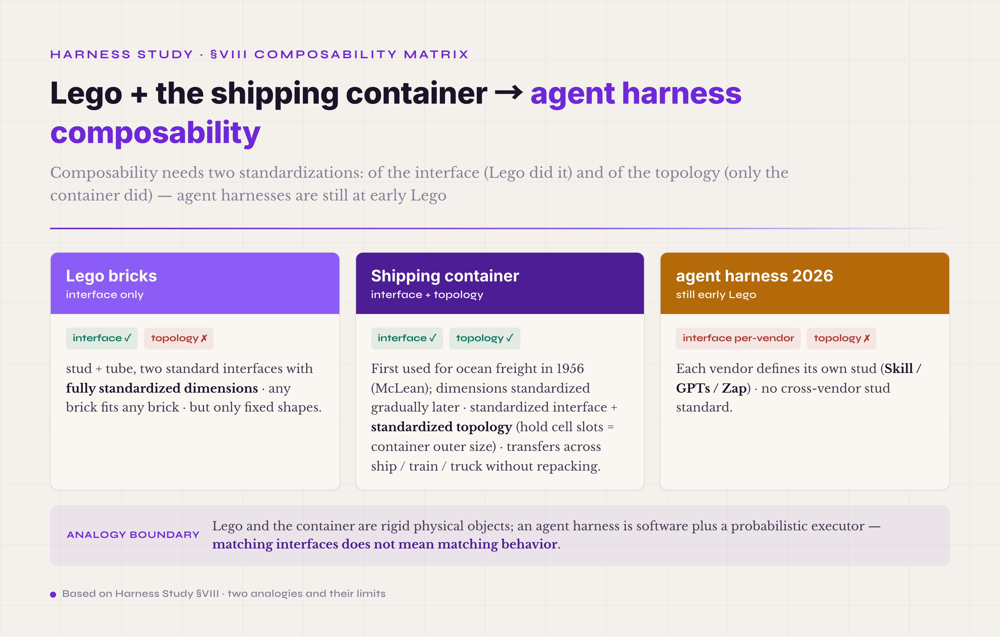
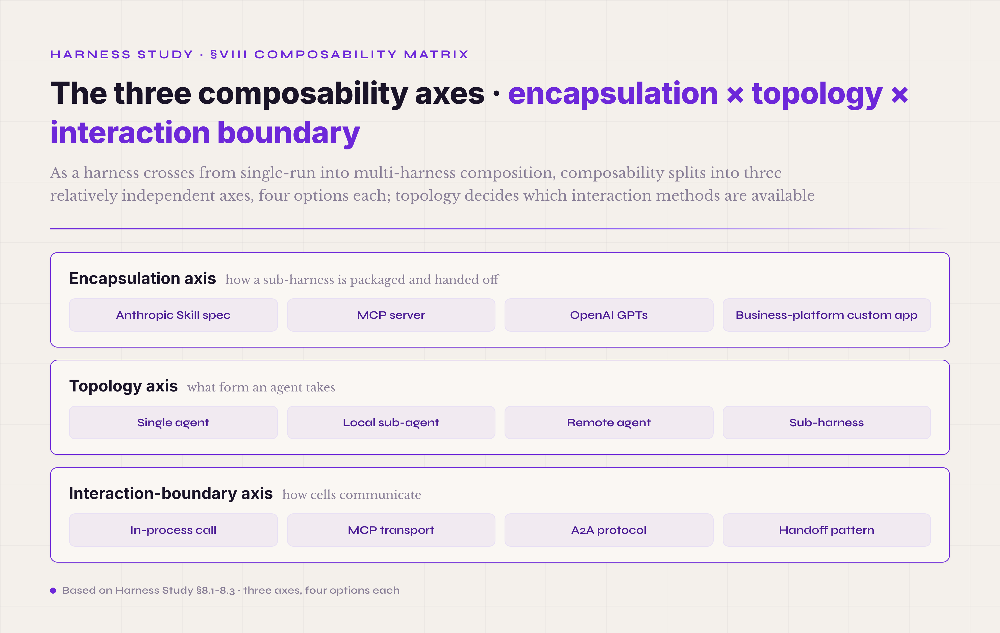
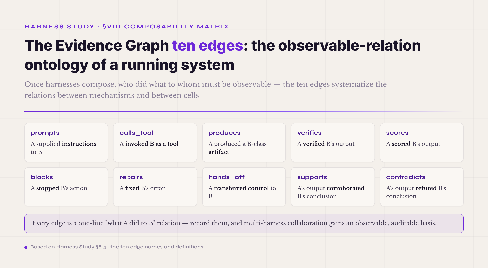
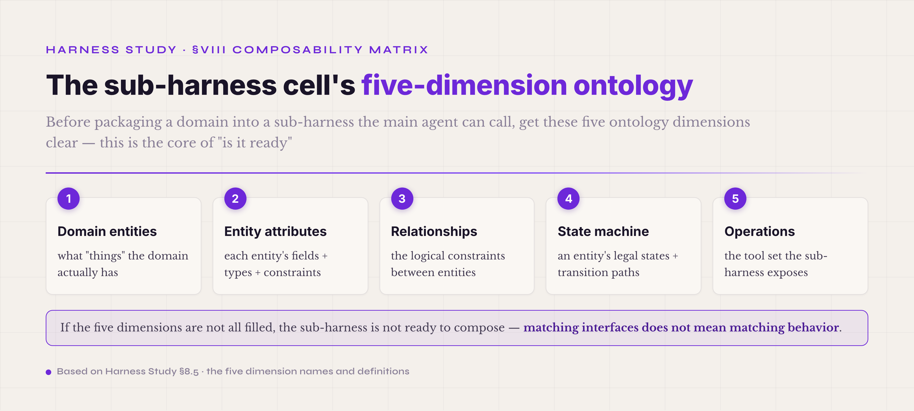

# §VIII · Composability matrix — encapsulation × topology × interaction boundary

§V through §VII covered everything an agent harness needs to get through one run: 8 runtime mechanisms, 1 Safety control plane, the engineering patterns, and the Harness Lab workbench. One engineering question is still open. Once a harness works, how do you "package it and hand it to someone else," how does it "get called inside another harness," and how does it "combine with other harnesses into a larger system"? In 2026 the industry has no consensus on this:

- Protocols: MCP, A2A, and handoff, each pushed by its own vendors;
- Packaging formats: Anthropic Skill, OpenAI GPTs, Zapier zaps, and n8n workflows, each with its own loyal users;
- Multi-agent frameworks: CrewAI, AutoGen, and Letta, each making different topology choices.

With the overall model of a harness built up over the first seven chapters, you should be able to see this fragmentation for what it is. It is not a passing phase. It is a structural problem inherent in agent harness engineering once it moves beyond a single run into cross-harness composition. This chapter splits that structure into three axes.

The most intuitive analogy for composability is **Lego plus the shipping container**. Lego bricks connect through two standard interfaces, the stud and the tube, and any brick fits any other because the interface dimensions are fully standardized (spacing, cylinder diameter, and height tolerance are all locked down). But Lego only builds fixed shapes: what you assemble does not grow new interfaces of its own. The shipping container spread from 1956, when Malcolm McLean began using it for ocean freight, and its dimensions were standardized gradually after that (20 or 40 feet long, 8 feet wide, 8.5 feet high, plus corner castings and twist-locks). Any cargo can then move between ship, train, and truck without repacking. What matters about the container is not what it carries. It is that the interface and the topology were standardized together (the cell slots in a ship's hold match the container's outer dimensions exactly), and only with both in place could the global supply chain run. In 2026, agent harness composability is still at the early-Lego stage: several vendors each define their own "studs" (Skill, GPTs, and Zap formats), but there is no cross-vendor standard. So you cannot assume that "hand a sub-harness to someone else and it just runs" has a solution. That is where this chapter's three-axis breakdown starts.

The analogy has limits. Lego and containers are rigid physical objects, while an agent harness is software plus a probabilistic executor, and matching interfaces do not guarantee matching behavior. That is why, beyond the three axes, this chapter also gives the Evidence Graph and the five-dimension ontology their own treatment.

*Figure 8.1 · Lego and the shipping container: interface standardization and topology standardization*

The engineering value of composability does not come from having many components. It comes from **pairing an encapsulation boundary with interoperability across it**. The boundary lets a harness evolve on its own without polluting other harnesses. Interoperability lets the independently evolved parts come back together to run an end-to-end task. You need both. With boundaries but no interoperability, the system is a pile of islands; with interoperability but no boundaries, change one place and the whole system shakes. The chapter's three axes correspond to three relatively independent engineering decisions:

- **Encapsulation axis**: how packaging and transfer are standardized;
- **Topology axis**: what form it takes when deployed and running;
- **Interaction-boundary axis**: how it communicates across the boundary.

This is the core framework for agent harness engineering as it moves from a single run into multi-harness composition.

*Figure 8.2 · The three composability axes: encapsulation × topology × interaction boundary*

#### 8.0 Terms first used in this section

Terms already explained in §I–§VII (the harness mechanisms, Tool Registry, Skill, fork-join, and so on) are not repeated. Listed here are only the terms that appear for the first time in this chapter.

**Encapsulation-axis terms**

- **bundle**: a configuration packaging format, as opposed to a code binary. It packs a sub-harness's five-dimension ontology, tool selection, prompt assets, and verifier configuration into one transferable unit. It sits at the same abstraction layer as a Docker image but holds different contents.
- **Skill spec**: Anthropic's [Agent Skills](https://agentskills.io), first released in 2025-10 and made an open standard on 2025-12-18. It has two parts, frontmatter and body. In the frontmatter only name and description are required, with a few optional fields such as allowed-tools and metadata. The author uses it as a simplified carrier for the sub-harness ontology.
- **MCP server**: [Model Context Protocol](https://modelcontextprotocol.io), introduced by Anthropic in 2024-11. It standardizes three kinds of capability: tools, resources, and prompts.
- **OA custom app**: a custom API workflow on an office-automation (OA) platform such as DingTalk, Feishu, or WeCom. It is a common way to host a sub-harness in office settings in China.

**Topology-axis terms**

- **topology**: the form an agent or harness takes, and how the pieces connect. It is relatively independent of the packaging format: one package can run in different topologies, and one topology can hold different packages.
- **single agent**: one harness running on its own, with no sub-agents. This is the starting form of mainstream coding agents in 2026.
- **local sub-agent**: spawned by fork-join, running in the same process as the main agent with the same harness configuration (see §6.6).
- **remote agent**: a separate process or service that communicates over the network, such as the A2A protocol, Anthropic Claude Code Bridge, or OpenAI Responses API.
- **sub-harness**: another harness, deployed on its own, carrying its own five-dimension ontology. The difference from a sub-agent: a sub-agent shares the main harness's process and configuration, while a sub-harness has a different configuration.

A note: the sub-harness and the five-dimension ontology below are engineering concepts this book proposes, not standard industry terms. The industry has similar practices (domain-specialized agent packaging, Anthropic Skill, and so on) but no shared name for them. In this book, "sub-harness" means **a child harness invoked per task and carrying domain rules: the minimal complete unit of a domain-specialized harness**.

**Interaction-boundary terms**

- **in-process call**: a function call within the same process. It is the fastest and the most tightly coupled, and in engineering terms it falls in the same category as the sub-agent.
- **MCP transport**: how an MCP server and its host communicate. There are only two standard transports, stdio and Streamable HTTP (from the 2025-03-26 spec onward, Streamable HTTP replaced the original HTTP+SSE).
- **A2A protocol** (Agent-to-Agent Protocol): a cross-vendor agent interoperability protocol, proposed by Google in 2025, now hosted by the Linux Foundation, and still evolving.
- **handoff pattern**: the multi-agent collaboration pattern OpenAI Agents SDK introduced in 2025-03; its predecessor was Swarm, an experimental project from 2024-10. Agent A hands control to agent B. This is a transfer of control flow, not a function call.
- **the Evidence Graph ten edges**: a set of ten edge types that describe the relations between mechanisms and between cells in an agent system: prompts, calls_tool, produces, verifies, scores, blocks, repairs, hands_off, supports, and contradicts. It does not belong to the protocol axis; it is a separate "observable-relation ontology."

**Five-dimension ontology terms**

- **ontology**: a term borrowed from knowledge engineering, where it means a formal system of concepts, relations, and semantic constraints. This book uses it to mean **the schema of a domain model**.
- **sub-harness cell**: the minimal complete unit of a domain-specialized harness. It counts as a cell only when all five ontology dimensions are present; with any dimension missing, it does not.
- **five-dimension ontology**: domain entities, entity attributes, relationships, state machine, and operations. It is the core schema of a sub-harness, and the opposite of the "catch-all prompt" anti-pattern.
- **business-workflow agent**: one of the six agent types this book distinguishes (type C), alongside the coding agent, office-automation agent, customer-service agent, RAG, and multi-agent systems. A bid-processing sub-harness (a state machine with 9 states), travel-order processing, and a data-governance sub-harness are typical examples.

#### 8.1 Axis one · encapsulation · how a sub-harness is packaged and handed off

**In engineering terms, encapsulation is the packaging format: how everything a sub-harness needs to run, including its five-dimension ontology, tool selection, prompt assets, and verifier configuration, fits into one transferable unit.** Practice in productizing sub-harnesses makes one thing clear: **what you pass along is not code; more likely it is a configuration bundle.** That turns the encapsulation question from "how do I ship a binary" into "how do I ship a configuration." The first is a deployment problem; the second is an engineering interface problem.

The core mechanism is a pair of substitutions, **configuration in place of code and a standardized schema in place of free form**:

- With configuration in place of code, the sub-harness is not tied to any one runtime implementation. The same Skill spec running on different providers such as Anthropic Claude, OpenAI GPT, and DeepSeek V4 should behave the same (in practice it drifts, as covered later).
- With a standardized schema, the LLM can recognize the sub-harness's boundary. When to invoke this Skill, what arguments to pass, and what output to expect all come from explicit fields rather than vague inference.

Together, the two turn "a transferable sub-harness" from a vague idea into something you can engineer: send someone a Skill bundle file, they mount it in their own harness, and the sub-harness runs.

Four main packaging formats are in use in 2026, drawn from office settings and coding settings:

1. **Anthropic Skill spec** (first version 2025-10, open standard 2025-12-18, two parts: frontmatter and body). It began as Claude Code's persistent instructions and later extended to the whole Claude product line. Skill frontmatter has few fields (name and description required; allowed-tools, metadata, and a few others optional), so the author treats it as a simplified carrier for the five-dimension ontology. Expressing the full ontology relies on the body text and the attached tool set, not on the frontmatter fields themselves.
2. **MCP server** (introduced by Anthropic in 2024-11; provides three kinds of capability, tools, resources, and prompts; the standard transports are stdio and Streamable HTTP). It began in IDE integration and later grew into a general capability interface for agents. MCP's core idea is **separating provider from consumer**: the server provides a capability, the host decides how to use it, and the two agree through the JSON-RPC protocol.
3. **OpenAI GPTs / Custom GPTs** (introduced in 2023-11; made of three parts: instructions, tools, and knowledge). It began on the ChatGPT platform and is the largest consumer-side sub-harness experiment. The key difference from Skill is that GPTs are tightly bound to the ChatGPT runtime and cannot be ported to another provider.
4. **Business-platform custom apps** (DingTalk, Feishu, WeCom, Zapier, n8n, Make, and the like). They began as SaaS workflows and were not designed for agents, yet in practice they fill the sub-harness role in B2B office settings. The key difference from the first three is **workflow first, agent second**: orchestration comes first, the LLM call after.

Which of the four to use as the primary packaging path depends on what the harness runs and where it is deployed:

- Coding agent on an Anthropic or OpenAI provider: prefer Skill or MCP. Both were designed as standardized packaging for agents and map directly onto the five-dimension ontology.
- B2B office setting where the customer already has a DingTalk or Feishu integration: prefer a business-platform custom app. Do not route around infrastructure the enterprise already has.
- Transfer across several providers: MCP is the closest thing to a cross-vendor option today (though real cross-vendor adoption is still early), with your own JSON schema as the fallback.
- GPTs: not recommended as the primary packaging for now. They are too tightly bound and not portable.

This selection process is not an abstract discussion. It answers a practical question: **when someone else uses my sub-harness, how do they mount it?**

The encapsulation axis has two anti-patterns.

**The first: choosing a packaging format the way you would choose a programming language.** The industry often debates "is Skill or MCP better" the way people debate "is Python or Rust better," treating the two as opposing options. The problem is that Skill and MCP sit at different abstraction layers. Skill is a packaging format for **instructions plus their tools** (a Skill describes "what to do and with which tools"). MCP is a transport protocol for **tool capability** (an MCP server provides tools but carries no instructions). A sub-harness can perfectly well use a Skill to describe intent and then call tools provided by an MCP server. How to decide: when someone debates "Skill or MCP," first ask them to answer "is your sub-harness missing instruction packaging or tool capability?" Most of the time it is missing both, and the answer is to use both.

**The second: underrating business-platform custom apps.** When the tech crowd discusses agent packaging, DingTalk, Feishu, and WeCom custom apps barely come up. Yet in the B2B projects the author has observed, most agents run on the customer's existing OA or collaboration platform rather than as standalone deployments. The blind spot exists because engineers naturally prefer things where "the code is in my hands and I can change it," and a custom app on an enterprise SaaS platform looks like configuration, not code. Refuse to accept this reality and you fall out of step with real B2B settings. How to decide: if a sub-harness is going to enterprise customers, do not route around the OA or collaboration platform they already have, or deployment friction will keep the project from ever going live.

#### 8.2 Axis two · topology · what form an agent takes

**Topology is a matter of deployment form: the shape an agent or harness takes in production, and how the pieces connect.** Engineering practice is clear on this point too: **sub-harness deployment is modular.** A standalone agent, a programmatic interface, a background module, and a general conversational interface are all legitimate forms, and picking one is itself a product decision. The encapsulation and topology axes are relatively independent, but with constraints. One package can run in different topologies (a Skill can run inline or as a standalone service), and one topology can hold different packages (a sub-agent process can mount a Skill or MCP). Topology, however, limits which interaction methods are available (§8.3 goes into this).

Every topology choice comes down to **a trade between "independence" and "collaboration tightness."** A single agent is the least independent (it does everything itself) and the most tightly collaborative (all state lives in one process, with no cross-boundary overhead). A remote agent is the most independent (fully separate deployment, its own lifecycle) and the least tightly collaborative (every cross-boundary message is an IPC or RPC). So the topology question cannot be answered with "which one is best." It can only be answered with "where does my harness sit on this tradeoff":

- A coding agent running a single task: a single agent is fastest and simplest; do not add sub-agents.
- An agent spanning several domains: a sub-agent or sub-harness is necessary, because one agent's context cannot hold all the domain knowledge.
- An agent crossing enterprise boundaries: a remote agent plus A2A is the only option, because in-process calls cannot cross organizations.

By 2026, topologies have settled into four stable forms, each matching a different engineering setting:

1. **single agent**: one harness running on its own, with no sub-agents and no cross-process communication. This is the starting form of mainstream coding agents in 2026 (Claude Code, Codex, and Cursor all default to a single agent). As §5.1.5 noted, Anthropic's 2025-06 data shows multi-agent systems using about 15 times the tokens of an ordinary chat. That cost gap makes "when to add a sub-agent" a high-bar decision; it should not be the default.
2. **local sub-agent**: spawned by fork-join, sharing the main agent's process and configuration, and splitting the task's scope to gain parallelism. §6.6 already covered this: the payoff is positive when 3–5 subtasks write code in parallel, and negative for a task like writing one piece of code, where splitting only adds tokens.
3. **remote agent**: a separate process or service that communicates over the network and has its lifecycle managed separately. Examples include Anthropic Claude Code Bridge (cross-machine agent collaboration), OpenAI Responses API (agent as a service), and LangGraph Cloud (agent runtime hosting). Its key engineering problem is that the ways it can fail double (network failures on top of agent failures), so retries, circuit breakers, and fallbacks all have to be in place.
4. **sub-harness**: another harness, deployed on its own with its own five-dimension ontology, that works with the main harness through handoff, MCP, or A2A. This is the core form for productizing sub-harnesses. A PPT harness and an Excel harness are two different sub-harnesses, each with its own five-dimension ontology, and the main harness invokes them through handoff. The key difference from a sub-agent: a sub-agent is "same configuration, different task scope," while a sub-harness is "different configuration, different domain ontology."

Choosing a topology means answering four questions in order:

1. Does the sub-harness run a single-domain or a cross-domain task? For a single domain, start with a single agent.
2. Within a single domain, do you need parallel subtasks for speed? If so, and the subtasks are truly independent and the token cost is acceptable, add a local sub-agent. Otherwise stay with a single agent.
3. Across domains, does the sub-harness need its own lifecycle? If so, use a sub-harness. If not (you are only splitting task scope), a local sub-agent is enough.
4. Where is the sub-harness deployed? Same machine and same process: mount it inline. A different service within the same organization: use a remote agent. Across organizations: use the A2A protocol (though A2A is still evolving, so be conservative about cross-organization collaboration).

The order matters. Answer the questions backward and you tend to skip the most important judgment, "is a single agent already enough?" Jumping straight to multi-agent is the most common over-engineering in the field.

Topology has two anti-patterns of its own.

**The first: treating "more agents is more advanced" as an engineering standard.** Industry demos often show elaborate architectures with five to seven collaborating agents. They look advanced, but a single agent often does the same task better and more cheaply. The reason is that adding agents brings three costs: context synchronization, decision routing, and error propagation. When agents communicate pairwise, the synchronization cost grows with the square of their number (n agents have n(n−1)/2 communication links). The criterion: consider multi-agent only when all three conditions below hold; otherwise a single agent is better.

- The subtasks are independent of each other and do not need each other's intermediate results;
- One agent's context cannot hold the information the task needs;
- The time saved by running in parallel is worth the extra token cost.

**The second: not distinguishing a sub-harness from a sub-agent.** A lot of technical discussion uses the two interchangeably, but they are two different engineering decisions. A sub-agent shares all of the main harness's configuration (same model, same tool registry, same prompt assets). A sub-harness carries its own five-dimension ontology (a different domain, a different tool set, a different prompt strategy). How to decide: do you need to split by "task scope" or by "domain knowledge"? The first calls for a sub-agent, the second for a sub-harness. Mixing them up has a cost. Force domain knowledge into a sub-agent and the main harness's context blows up; split same-domain tasks into sub-harnesses and handoff overhead eats the performance.

#### 8.3 Axis three · interaction boundary · how cells communicate

**The third axis, the interaction boundary, is the communication protocol layer: how one harness cell passes data and control to another cell (a sub-agent, a sub-harness, a remote agent, or an external tool).** The encapsulation axis covers the packaging format, the topology axis the deployment form, and the interaction-boundary axis communication across the boundary. The three axes are relatively independent, but with a constraint: topology decides which interaction methods are available. With the same package and the same topology, there are usually still several interaction methods to choose from. But a local sub-agent in the same process has no use for A2A, and a remote agent across organizations cannot use an in-process call.

Choosing an interaction method means **trading "coupling tightness" against "boundary clarity."** An in-process call is the most tightly coupled (same address space, direct function calls, shared data) and has the least clear boundary (an error in one component easily pollutes another). Handoff has the clearest boundary in control flow: every handoff is an explicit event that transfers control. It does not isolate data, though. OpenAI Agents SDK passes the full conversation history to the receiver by default, and you need input_filter to trim it. So "which one to use when" is a concrete engineering question: the tighter the coupling, the more efficient the communication and the weaker the isolation when something fails.

The industry uses four interaction methods as of 2026, each answering a different isolation need:

1. **In-process call**: a function call within the same process, the fastest and the most tightly coupled. A local sub-agent and the main agent communicate this way, because they share a configuration and need no boundary protection. As §6.4 said about Isolation Modes, InProcess is the default starting point, and a test environment with same-process isolation is already enough.
2. **MCP transport**: the Model Context Protocol Anthropic introduced in 2024-11, which separates provider from consumer and relies on JSON-RPC as the agreement between them. There are two standard transports, stdio and Streamable HTTP (from the 2025-03-26 spec onward, Streamable HTTP replaced the original HTTP+SSE). The 2026-07-28 spec then removed the session ID (`Mcp-Session-Id`) under SEP-2567, making the protocol sessionless. MCP's key idea is **standardizing tool capability across hosts**: implement an MCP server once, and any MCP-compatible host (Claude Code, Cursor, an IDE plugin) can call it. MCP does not transfer control. The host always holds the agent loop, and the MCP server only responds to capability calls.
3. **A2A protocol** (Agent-to-Agent; proposed by Google in 2025, now hosted by the Linux Foundation, still evolving): two-way communication in which both sides are agents, each with its own reasoning loop. A2A sits one abstraction level above MCP: MCP is a host calling a capability, while A2A is agent to agent. As of 2026 the spec is still changing fast and real cross-vendor adoption is rare, so evaluate it conservatively.
4. **handoff pattern** (introduced by OpenAI Agents SDK in 2025-03; its predecessor was the experimental Swarm of 2024-10): agent A hands control entirely to agent B. It is a transfer of control flow, not a function call. The key difference from A2A is that A2A's two sides are peers, while handoff is a one-way transfer: afterward, agent A no longer holds control. Handoff's engineering advantage is a clear debugging trail (every handoff is an explicit transfer event). By default, however, the receiver gets the full conversation history, so if you need to isolate context you have to trim it yourself with input_filter.

How the interaction boundary maps onto topology:

- Single agent plus local sub-agent: an in-process call is usually enough; heavy protocols such as MCP or A2A are unnecessary.
- Remote agent and sub-harness: a protocol layer is required, chosen from MCP, A2A, and handoff.
  - **Calling a single capability provider** (a service that provides tool capability and holds no control): MCP fits best.
  - **Two-way collaboration between reasoning agents** (two agents, each with its own loop, querying each other): A2A is designed for this, but while the spec is immature, define your own JSON-RPC as a fallback.
  - **Serial task handoff** (agent A finishes one part and hands everything to agent B): handoff fits best.

This mapping is not absolute. The industry has many hybrid implementations (one system running MCP and handoff at the same time), but when starting out it is better to pick one primary protocol.

Two anti-patterns show up at the interaction boundary.

**The first: treating MCP as a general agent protocol.** Since MCP caught on, you often see claims like "agent A and agent B communicate through MCP." That puts MCP in the wrong place. MCP's design premise is that **the host holds the agent loop and the server only provides capabilities**: a server should not have its own reasoning loop and should not push control back to the host. Two agents talking to each other break this premise, because both have reasoning loops and there is no clear split between host and capability provider. How to decide: look at who holds the reasoning loop in your communication scenario. The holder is the host, and the side without one is the capability provider. Once that is sorted out, whether MCP fits becomes clear.

**The second: betting on A2A too early.** The A2A spec was proposed in 2025 and is still changing fast in 2026 (names, fields, and the state machine change almost every quarter), yet some projects have already built their entire cross-agent communication architecture on it. The reason is that A2A is trying to unify a field that has not matured (cross-vendor agent collaboration), and a spec can hardly stabilize before its adopters do. The criterion: at this stage (2026), for cross-vendor agent collaboration, define your own JSON-RPC schema and document it as an internal standard rather than tying the whole architecture to an external standard that is still evolving. Migrate once the A2A spec stabilizes (adopters converge and the spec goes half a year without a major change). One governance change is worth recording: in June 2025 A2A was [donated to the Linux Foundation](https://developers.googleblog.com/en/google-cloud-donates-a2a-to-linux-foundation/), moving from single-vendor control to neutral foundation governance. That is a positive sign for "wait until the spec stabilizes" (neutral governance is usually a precondition for adopters to converge), but as of this volume's writing the spec is still evolving, and the criterion above stands.

#### 8.4 The Evidence Graph ten edges · an observable-relation ontology

§8.1 through §8.3 covered the three axes: encapsulation, topology, and interaction boundary. One thing fits into none of them: **the relations between mechanisms and between cells**. Once an agent system runs, a web of relations forms: who called whom, who produced what, who verified what, who blocked what. That web is not a protocol (not MCP, A2A, or handoff), not a topology (not a single agent, sub-agent, or remote agent), and not a packaging format (not Skill, MCP, or GPTs). It is **the observable-relation ontology of the system once it runs**. It is independent of the three axes, so it gets its own section.

The Evidence Graph's ten edges make this web systematic. Each edge is one observable relation of the form "what A (a mechanism or a cell) did to B," and every event in the trajectory described in §5.7 can be mapped onto one of these edges. The first five:

1. **prompts**: A gave B instructions. Typical examples: the Prompt Assets mechanism prompts the Agent Loop mechanism (§5.5); the main harness prompts a sub-harness (a PPT harness receives the main harness's "make slides" instruction).
2. **calls_tool**: A invoked B as a tool. Typical examples: Agent Loop calls_tool Tool Registry; the main agent calls_tool a sub-agent through handoff.
3. **produces**: A produced an artifact of type B. Typical examples: Agent Loop produces a TrajectoryRecord; the Verifier produces a score; a sub-harness produces a report.
4. **verifies**: A verified B's output. Typical examples: the Verifier verifies the artifact the Agent Loop produced; the three verifier layers in §5.8 all correspond to verifies edges.
5. **scores**: A scored B's output. Typical examples: an Outcome Judge scores an agent run; a reward model scores a trajectory (covered in §7.3 on the Score layer).

The last five complete the other half of the relation ontology:

6. **blocks**: A stopped B's action. Typical examples: the Safety control plane blocks the Agent Loop (the ToolBlocked part of §5.9); a hook denies a tool call. A blocks edge is an important signal in the trajectory, and its absence is a signal too (as covered earlier, "a missing event is itself a bug signal"): a block that should have fired but did not is one class of bug, and a block that fired when it should not have is another.
7. **repairs**: A fixed B's error. Typical examples: the contract repair in §5.2 (the model adapter repairing a schema violation); the retry path after a fork-join failure in §6.6.
8. **hands_off**: A transferred control to B. Typical examples: the main agent hands_off a sub-harness; a subtask agent hands_off back to the main agent when it finishes. It is the observable record, in the trajectory, of the handoff pattern described in §8.3: every handoff corresponds to one hands_off edge.
9. **supports**: A's output corroborated B's conclusion. Typical examples: several verifier sources agree on one conclusion; the three evidence sources of Claw-Eval in §5.8 support one another.
10. **contradicts**: A's output refuted B's conclusion. Typical examples: the agent reports "task complete," but the verifier's conclusion contradicts it; two sub-agents reach conflicting conclusions. The contradicts edge is **one of the most valuable diagnostic signals** in an agent system: every problem in the class of silent failure or Artifact Claim Mismatch corresponds to a contradicts edge that went undetected.

*Figure 8.3 · The ten relational edges of the Evidence Graph*

Why do the ten edges stand apart instead of going into the three axes? The core reason is that they sit at a different abstraction layer. The three axes describe **how the system is put together** (static structure); the Evidence Graph describes **what happens once the system runs** (dynamic relations). One system structure can produce different Evidence Graph instances. The same main-agent-plus-sub-agent topology might produce 5 calls_tool and 2 hands_off edges on one run and 8 calls_tool and 3 hands_off edges on another. The change in the graph's shape reflects a change in the agent's actual behavior, not in the system's structure. The Evidence Graph is the core data schema for the §5.7 trajectory and for the Observe layer of the §VII Harness Lab. Every trajectory event should map onto an edge; only then is the trajectory structured relational data rather than a raw log. That is the precondition for a production-grade trajectory to support replay and ablation.

#### 8.5 The sub-harness cell's five-dimension ontology

§8.1 on the encapsulation axis said that the sub-harness's five-dimension ontology is the core schema of packaging formats such as the Skill spec and business-platform custom apps. This section spells out the five dimensions. The engineering difference between a sub-harness and a "catch-all prompt" comes down to whether all five are present.

1. **Domain entities**: the "things" that exist in the domain the sub-harness serves. A PPT-making sub-harness has five entity types: slide, layout, content_block, animation, and theme. A data-governance sub-harness has five: table, column, metric, dimension, and time_filter. Entity definitions give the LLM clear objects to work on inside the sub-harness: not a vague "make a PPT" but a precise "modify the content_block attribute of a slide entity."
2. **Entity attributes**: the fields each entity has, with their types and constraints. A slide has title (string), layout_type (enum), content (block[]), and animations (list). A column has null_pct (float, 0–1), distinct_count (int), type (sql_type), sample (string), and family (string). Attribute definitions tell the LLM, when it operates on an entity, **what it can change, what it cannot, and what a change means**, through an explicit schema rather than vague inference.
3. **Relationships**: the logical constraints between entities. The PPT sub-harness's rules: layout determines the content_block type, animation must match theme, and slide order must be continuous. The data-governance sub-harness's rules: KNOWN_PREFIXES correspond to dimension families, and CONTAMINATED_FILTERS must not appear. Relationship rules keep the LLM from violating domain constraints when it generates content. They are not enforced hard in code; they give guidance at the schema level and raise the odds that the LLM "gets it right."
4. **State machine**: an entity's legal states and the paths between them. The PPT sub-harness's state machine is slide: draft → review → approved → exported. The bid-processing sub-harness has 9 states (CREATED → BID_UPLOADED → BID_ANALYZED → … → ARCHIVED). The state machine tells the agent "which step it is on, where it can go next, and where it cannot," which stops it from skipping intermediate steps and jumping straight to the terminal state, the most common sub-harness bug.
5. **Operations**: the set of tools the sub-harness exposes. The PPT sub-harness's operations include create_slide, update_layout, apply_theme, and export_pptx. The data-governance sub-harness's operations are a set of scripts corresponding to a 6-stage pipeline. The operation set makes the sub-harness's boundary explicit: the LLM knows it **can only do these things** inside this sub-harness and does not step outside it.

*Figure 8.4 · The five-dimension ontology of a sub-harness cell*

Having all five dimensions versus only one or two makes a large engineering difference. The early design of this book's companion implementation project recorded a counter-example: **IntentRouter**. The early design let the LLM decide on its own which prompt path to take. There was no five-dimension ontology, and the LLM improvised. In practice Skill calls were frequent, Tool calls were rare, and IntentRouter added no value. The design was later changed to "Skill as sub-harness": each Skill carries frontmatter (name, description, and optional fields), and its body holds a simplified form of the five-dimension ontology. The redesign delivered on all three fronts: cross-instance consistency, evolvability, and independent iterability. This before-and-after contrast shows that the five-dimension ontology is not about conceptual correctness. It is the precondition for a sub-harness to run stably.

The five-dimension ontology relates to the three axes this way: the three axes cover **how to transfer, how to deploy, and how to communicate** (the external interface), while the five dimensions cover **what the cell holds inside** (the internal structure). A sub-harness can be engineered only when the two go together: the external interface lets others use it, and the internal structure lets you keep changing it. A common anti-pattern is to focus only on the external interface (building a Skill spec or an MCP server) and neglect the internal structure (writing no five-dimension ontology, only a prompt). This is a mistake because the real value of a sub-harness lies in the five dimensions inside. The external interface is only the surface, and a standardized interface does not mean the inside of the cell works. The criterion: **a sub-harness design is complete only when all five dimensions are present; whichever dimension is missing, add it.** That turns "is the sub-harness ready?" from a subjective judgment into a checklist you can verify item by item.

#### 8.6 Anti-patterns · three kinds in composition

In real use of the composability matrix in 2026, three anti-patterns come up most often.

**The first: a catch-all prompt in place of the five-dimension ontology.** Facing a new scenario, the common move is to write a 5,000-word system prompt describing the domain and let the LLM improvise, with no sub-harness cell and no five-dimension ontology. §8.5 already explained, with the IntentRouter counter-example, why the five-dimension ontology is more consistent than a catch-all prompt: with a prompt, the domain rules get reinterpreted on every call, while the ontology fixes the rules in a schema and runs the same copy every time. This section gives only the criterion: does the sub-harness design document contain a five-dimension ontology schema? If not, it is still at the prompt stage and does not count as a sub-harness.

**The second: over-choosing topology.** Teams reach for a multi-agent or sub-harness architecture from the start without first checking whether a single agent is enough. This happens because the tech crowd treats multi-agent as a mark of sophistication and a single agent as a "naive" starting point, and that bias makes the selection phase skip the single-agent assessment. But the single agent is the best starting point for agent engineering. In most scenarios a single agent is already enough (a judgment from experience), while multi-agent systems use about 15 times the tokens of an ordinary chat. §5.1.5 and §6.6 give the cost breakdown, along with Anthropic's point that most coding tasks have less truly parallelizable work than research tasks. The criterion: before adding a sub-agent or sub-harness, answer what the single agent's pass rate is over 10 runs of this task. If you have not run it, run the single agent first. If you have, and the pass rate is 80% or higher (rule of thumb; adjust to your scenario), do not add multi-agent. Optimizing the single agent is worth more.

**The third: choosing a protocol too early.** In cross-agent communication, teams bet on a still-evolving standard such as A2A on day one and leave themselves no fallback. The cause is that cross-vendor agent collaboration in 2026 is still early in standardization: the A2A spec changes every few months, MCP mainly serves hosts calling capabilities rather than agent-to-agent communication, and there is no stable cross-vendor protocol. Betting on an evolving standard means the system has to change every time the spec does, for very little return. The actual record: after MCP launched in 2024-11, it went through 4 dated spec versions by 2026-05 (2024-11, 2025-03, 2025-06, and 2025-11). Both 2025-03 (a new transport, plus authorization) and 2025-06 (removing JSON-RPC batching) carried breaking changes, and early adopters had to follow through several rounds of rework. The 2026-07-28 version then removed the session ID and made the protocol sessionless. The criterion: for cross-vendor agent communication at this stage (2026), define your own JSON-RPC schema and document it as an internal standard. Migrate once the external spec stabilizes (adopters converge, and half a year passes without a major change); do not bet directly on a standard that is still evolving.

#### 8.7 Getting started · four areas

**What to watch.** The biggest trap in applying the composability matrix is **composing too early**: adding sub-harnesses, multi-agent setups, and cross-vendor protocols before the main harness is stable. There are three concrete warning signs:

1. The main harness's own single-task pass rate is below 80% (a rule of thumb). Add a sub-harness now and its instability stacks on top of the main harness's, making the overall pass rate worse.
2. None of Skill, MCP server, or GPTs packaging is running stably in production yet. Debating "which packaging to use" is then pointless. Run an inline sub-harness in your own harness first (no packaging, no transfer), get it stable, and then discuss packaging.
3. There is no trajectory or Evidence Graph infrastructure. Add multi-agent now and the debugging trail for cross-component calls breaks: agents blame one another and the problem cannot be located.

If any of these signs appears, fall back to a single agent with an inline sub-harness, and do not adopt a composition architecture.

**How to design.** Introduce it **progressively in 5 stages** rather than taking on all three axes at once (the stage durations are empirical estimates):

1. **A single agent with an inline sub-harness five-dimension ontology** (write the five-dimension ontology as a schema inside the code, with no packaging or transfer; 1–2 weeks): the fastest way to validate the sub-harness approach.
2. **Package it separately as a Skill or platform custom app** (package the five-dimension ontology as a Skill spec, or as a DingTalk or Feishu custom app; 1–2 weeks): validates that the packaging format works end to end.
3. **Provide shared tools through an MCP server** (move tool capability out of inline code into an MCP server so several hosts can use it; 2–4 weeks): validates cross-host interoperability.
4. **Use local sub-agent fork-join for parallelism** (covered in §6.6; when 3–5 subtasks are truly parallelizable; 2–4 weeks): validates the parallel pattern at the topology layer.
5. **A cross-process remote agent or sub-harness** (its own lifecycle, plus handoff or custom JSON-RPC; 1–2 months): validates cross-process composition.

A sixth stage (cross-vendor A2A) is not recommended yet; wait for the spec to stabilize. This progression makes every stage solve a real problem instead of applying patterns just to fill out all three axes.

**How to test.** Testing the composability matrix is mostly **behavior testing across components and cells**, not unit testing. There are four kinds:

1. **Five-dimension ontology coverage testing**: run the sub-harness over 30 or more task instances (a rule of thumb) and check whether calls cover all five dimensions: entities, attributes, relationships, state machine, and operations. A dimension that is never used may be over-engineering, or the task set may not cover its use case.
2. **Cross-packaging portability testing**: package the same sub-harness's five-dimension ontology three ways, as a Skill, as MCP, and as a custom app, and run each on a different host. Inconsistent behavior means the encapsulation layer leaks.
3. **Topology-switch regression testing**: run the same sub-harness over the same task set under two topologies, single agent and sub-agent. A significant pass-rate difference means the topology layer has a coupling problem (in principle, the same sub-harness should give the same result under a different topology).
4. **Evidence Graph completeness testing**: replay trajectories and check whether events map onto all ten edges. An edge that never appears (no contradicts edge ever, say) means the trajectory schema is missing something, or the system design left out a key verifier.

**What prompts to write.** Prompts at the composability layer fall into two main kinds.

1. **The sub-harness's own prompt assets**: write them by the six trimming levels L0–L5 from §5.5 (L0 is core identity and safety rules, never trimmed; L5 is trimmed first), but **state the sub-harness's five-dimension ontology boundary** in the prompt, for example: "You are inside the PPT sub-harness. The only entities are slide, layout, content_block, animation, and theme, and operations can only be chosen from create_slide, update_layout, apply_theme, and export_pptx." That way the LLM knows the sub-harness's boundary and does not overstep into other domains from inside it.
2. **The routing prompt between the main harness and its sub-harnesses**: it tells the main harness's LLM "when to invoke which sub-harness." This kind of prompt follows three engineering rules:
   - Route by the entity features of the task, not by the fuzzy text of the task description ("this task involves PPT entities, route to the PPT sub-harness" is more stable than "this task looks like making a PPT, route to the PPT sub-harness");
   - Routing introduces no new sub-harness: the main harness can only invoke sub-harnesses that are already mounted and cannot create one out of nothing;
   - Every routing decision is written into the trajectory, so "why the main harness went to A and not B" can be audited.

These rules pair with the engineering rules in the §5.5 Prompt Assets chapter, so that once the composition architecture is running, its routing decisions can be explained.

---

The chapter's core conclusions come down to three points.

**First, the three axes (encapsulation × topology × interaction boundary) are the core structure for agent harness engineering as it moves from a single run into multi-harness composition.** Encapsulation covers "how to package and transfer," topology "how it is deployed and exists," and the interaction boundary "how it communicates across the boundary." The three axes are relatively independent but constrained: the same sub-harness can for the most part choose on each axis separately, but topology decides which interaction methods are available. Understanding this is the precondition for designing a sub-harness with the three-axis matrix. Choosing packaging together with topology, or topology together with protocol, locks one axis's options for no reason. Conversely, ignoring how topology constrains interaction methods leads to combinations that cannot run.

**Second, the Evidence Graph's ten edges and the sub-harness cell's five-dimension ontology are two companion abstractions outside the three axes.** The ten edges describe the dynamic relations once the system runs; the five dimensions describe the static structure inside a cell. Only the three axes, the ten edges, and the five dimensions together make a complete model of agent harness composability. Leave out any one and you cannot build a complete understanding.

**Third, industry composability in 2026 is still at the early-Lego stage.** Several vendors each make their own "studs," and there is no cross-vendor standard (Skill, GPTs, Zaps, and custom apps do not interoperate). Be clear that this fragmentation is expected. No single vendor did badly; the whole field simply has not yet converged on container-style standardization. The engineering response is **conservative bets and internal standardization**: inside your company or project, run on a sub-harness schema of your own, with the five-dimension ontology complete and at least one packaging format and at least one topology in production. Migrate once the industry's cross-vendor standards stabilize.

After this chapter, you should be able to do the following in your own project:

1. Identify which option an existing sub-harness chose on each of the three axes;
2. Judge how many of the five ontology dimensions are present, and add whichever is missing;
3. Classify abstractions such as Skill, MCP, GPTs, A2A, and handoff correctly when you meet them (which axis, which option, and whether it is still evolving);
4. Avoid the three anti-patterns: the catch-all prompt, over-choosing topology, and choosing a protocol too early;
5. Build a composable architecture progressively in 5 stages rather than all at once.

The composability matrix is not a project you finish in one go. It is engineering infrastructure built up progressively over 3–6 months (an empirical estimate), and it should be treated as a long-term direction to build toward, not a short-term deployment target.
