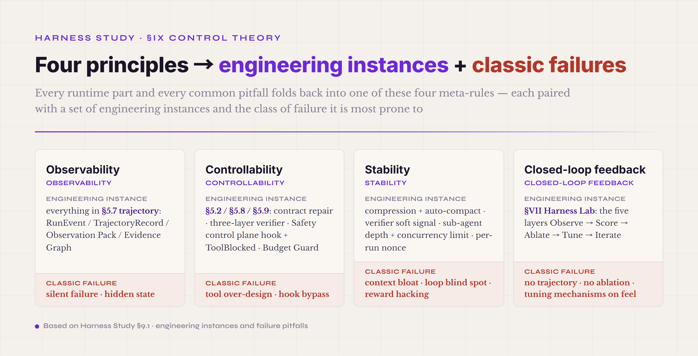
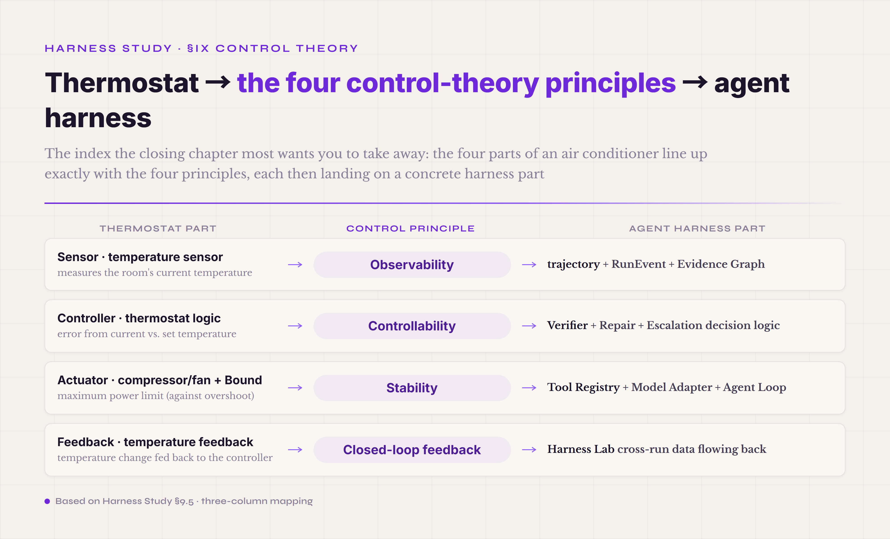

# §IX · The four principles of control theory — the meta-rules that bind the whole tutorial

By the time you reach this chapter, the concrete parts of agent harness engineering are all covered — §V the 8 runtime mechanisms plus 1 Safety control plane, §VI the engineering patterns, §VII the Harness Lab workbench, §VIII the composability matrix. Each chapter leaves you with a set of concrete mental models. But step back across the chapters and ask: behind those mental models, is there a shared set of **meta-rules** holding them together? That is where the four principles of control theory sit in this tutorial. They aren't a new mechanism, not one more runtime part — they lift the engineering discipline that runs across every chapter into one unified framing.

Control theory as a framing isn't decoration. Norbert Wiener's 1948 *Cybernetics: Or Control and Communication in the Animal and the Machine* made "the feedback system" a cross-disciplinary meta-theory (biology / machinery / society) — any system that can hold a steady state, whatever its underlying physical form, shares four structural properties. **Qian Xuesen (H. S. Tsien), in his 1954 *Engineering Cybernetics*, pushed that meta-theory from mathematics and philosophy into engineered systems** — he gave a set of principles "with direct engineering application to the design of control systems," and that engineering vantage turned control theory from an abstract theory into a design skeleton you can actually build with. This tutorial uses that design skeleton directly on the agent harness — a 70-year-old engineering control-theory frame, plus the LLM-era constraint that "the system's behavior isn't fully knowable," gives the meta-methodology of agent harness engineering.

Every part covered in §I–§VIII maps onto one of the four principles. Trajectory + RunEvent + Observation Pack are all the **observability** principle instantiated at the runtime layer. Verifier + Repair + Escalation + Budget Guard are all the **controllability** principle. Compression + bounded sub-agent + cache-safe forking + the per-run nonce are the **stability** principle. Ablation + Harness Lab are the **closed-loop feedback** principle. After this chapter you should build a cross-chapter index: take a concrete engineering problem ("what type of bug is this?") and recognize which of the four principles its root cause belongs to. That index lifts agent harness engineering from "a pile of case experience" to "engineering discipline under four principles."

#### 9.0 · Terms first used in this section

Terms already explained in §I–§VIII aren't repeated here. This lists only terms first appearing in §IX.

**Core control-theory terms** — **cybernetics** (proposed by Norbert Wiener in 1948; the cross-disciplinary meta-theory of feedback systems; four key structural properties — observable / controllable / stable / closed-loop). **engineering cybernetics** (*Engineering Cybernetics*, by Qian Xuesen in 1954; pushed Wiener's cybernetics from mathematics and philosophy into engineered systems; the key innovation is a set of principles "with direct engineering application to the design of control systems" — an engineering vantage, not a purely theoretical one). **closed-loop vs. open-loop** (closed-loop = the output feeds back into the input and joins the next decision; open-loop = the output doesn't feed back; §5.4 already used this distinction to explain long-term memory). **feedforward / feedback / iterate** (feedforward = injected up front; feedback = returned after a run; iterate = converge over many rounds; of a piece with the closed-loop principle — feedforward + feedback map onto Birgitta Böckeler's Guides/Sensors frame from Thoughtworks in April 2026, and iterate is the third member this tutorial adds).

**Terms from the Qian expansions** — **non-interacting controls of many-variable systems** (an engineering design principle in which several control signals stay independent and don't pollute one another). **control design by perturbation theory** (a method that infers an unknown system's properties through controlled perturbation plus observed response). **systems with unknown properties** (Qian's 1954 key innovation; doesn't rely on a complete mathematical model; converges via feedback + perturbation to a usable control law). **von Neumann error control** (Qian's 1954 *Engineering Cybernetics* incorporated von Neumann's error-control theory — the redundancy-plus-checking idea of building a reliable system out of unreliable parts; the starting point of modern fault-tolerant computing).

**Terms from the pitfall mapping** — **declared_vs_executed gap** (the gap between what the agent declared it did and what the tool/verifier observed it doing; a persistently high gap is an early warning that the feedback system is failing). **leading indicator** (an observable signal that warns before the feedback system actually breaks, as opposed to a lagging indicator; a core concept in trajectory engineering).

#### 9.1 · The four principles, expanded · the concrete mapping to LLM agents

**Principle one · observability.** You have to be able to see what's happening inside the system, or every judgment you make is a guess. Wiener's 1948 original definition is "the output of a system must be measurable for feedback to operate" — with no measurable output, the whole feedback loop can't be built. Mapped to the agent harness, observability is instantiated as **everything in the §5.7 trajectory chapter** — RunEvent / TrajectoryRecord / Observation Pack / the 10 edges of the Evidence Graph / the declared_vs_executed gap as a leading indicator. This principle is especially hard in the LLM era — the LLM's internal reasoning is invisible, tool calls cross a process boundary, sub-agents cross a lifecycle, and you get one notch fewer observable signals by default than in traditional software. The engineering answer is to **turn on everything that can be observed, use a schema to keep the signals structured, and treat absence as a signal too** — §5.7 covered "the absence of an expected event is itself a signal." The classic pitfall of failed observability is silent failure / hidden state — the agent goes wrong but produces no event you can trace, and you only find out when a downstream metric drops.

**Principle two · controllability.** When you see a failure you have to be able to intervene; you can't just watch it crash. Controllability is instantiated as **the parts in §5.2 / §5.8 / §5.9** — the model adapter's contract repair, the three-layer verifier, the Safety control plane's hooks plus ToolBlocked, the Budget Guard. The key framing of controllability is that **the strength of the intervention has to match what the system can take** — pointed out in §5.4 on compression: too weak (the threshold too high) and context overflows; too strong (the threshold too low) and information is lost. That trade-off exists in every controllable mechanism — a verifier too weak lets false passes through, too strict it deadlocks legitimate cases; a retry budget too small leaves no room to recover, too large it loops forever and burns tokens; a human-approval threshold too low tires the user out, too high it lets a risky action slip through. The classic pitfall of failed controllability is tool over-design (control granularity so fine the LLM doesn't know which to use) plus hook bypass (the control point exists but gets routed around — §5.9, AP13).

**Principle three · stability.** A feedback system under disturbance must not diverge or oscillate; it has to converge to a steady state. Wiener in 1948 defined stability as "system response to bounded input remains bounded" — bounded input, bounded output. Mapped to the agent harness, stability is instantiated **across several chapters** — §5.4 compression + auto-compact against context blow-up; §5.8 verifier soft signal against reward-hacking gaming; §6.6 sub-agent depth + concurrency limit against fork-join resource blow-up; §7.4 the per-run nonce against cache collusion. Stability is especially hard in the LLM era — the LLM is a nonlinear system, where a small change in input can cause a large change in output (pointed out in §5.1 on ReAct); the agent loop is closed-loop, with a high risk of self-excited oscillation (the loop blind-spot pitfall); the trajectory accumulates across turns, and the state space grows unbounded. The engineering answer is that **every mechanism must have a bound, and every bound must be monitorable** — max_turn / max_token / max_depth / max_retry are not decoration; they are stability guarantees instantiated. The classic pitfalls of failed stability are context bloat + loop blind spot + reward hacking, each covered in the three earlier chapters.

**Principle four · closed-loop feedback.** Every change has to be validated against comparison data; you can't go on instinct. Its relation to the first three: the first three are about the feedback loop of a single run (the system's internal feedback), the fourth about the feedback loop across runs (the system's evolution feedback). Closed-loop feedback is instantiated as **the whole §VII Harness Lab** — the five layers Observe → Score → Ablate → Tune → Iterate are engineered closed-loop feedback. Its hard constraint at the discipline level is **no ablation data, no change to a harness mechanism** — stressed over and over in §VII. The classic pitfall of failed closed-loop feedback is no trajectory + no ablation + tuning mechanisms on feel — every "why this mechanism is designed this way" in §I–§V must be backed by ablation data, and saying "I think this is better" with no data is a closed-loop failure.

*Figure 9.1 · The four control-theory principles — engineering instances and classic failures*

#### 9.2 · The four principles vs. the common pitfalls

Map every common pitfall in the tutorial back onto the four principles — and after reading this you should be able to take any agent harness bug and judge straight away which of the four principles it failed. This map isn't exhaustive; it's a cross-chapter diagnostic framework.

**Failed observability** — silent failure (§5.7, AP10: try/catch swallows the exception, the error produces no event). AP04 artifact-claim mismatch (the agent declared it changed an artifact but the verifier got no matching change; §5.8). A persistently high declared_vs_executed gap (the feedback system's early warning — a declared-vs-executed gap that stays at or above 10% is a sign of failed observability, even with no concrete bug showing). Hidden state (internal agent state with no matching event; §5.4 on why context state must be trajectory-ized).

The declared_vs_executed gap has one more virtue — it is computable, with no new instrumentation. The edges of §8.4's Evidence Graph already suffice: declared = the set of products and actions the agent claims completed in its replies and plan (extracted from the closing turn's text plus the claim side of produces edges); executed = the set backed by artifact_write / tool_result evidence in the trajectory; gap = the difference as a share of declared. Compute it once per run, aggregate weekly into a trend line, alert when it stays at or above 10% — and the leading indicator goes from slogan to a line on a dashboard, with nothing in between but a set difference.

**Failed controllability** — AP07 tool over-design (tool granularity so fine the LLM can't pick well; §5.3). AP13 hook / allowlist bypass (the control point exists but gets routed around — e.g. `cargo checkpoint` slipping through as `cargo check`; OWASP LLM01 prompt injection; §5.9). AP15 excessive agency (the agent holds more permission than it actually needs; OWASP LLM06 + LLM10; §5.9). AP06 fake-landed mechanism (the mechanism's protocol is in the repo but the production path is a noop; §5.9 — it looks controlled but isn't, the most hidden controllability failure).

**Failed stability** — AP08 context bloat (context accumulates unbounded, lost in the middle; §5.4). AP14 memory pollution (long-term memory pollution accumulates; §5.4c). AP11 loop blind spot (the agent doesn't know it's looping; §5.6). AP01 cache collusion (N>1 reruns that aren't i.i.d.; §7.4 — a special form of failed stability: stable in a single run but irreproducible across runs). AP03 reward hacking, the 7 patterns (the agent drifts to unintended behavior under the reward signal; §7.4 — the form failed stability takes at the reward layer).

**Failed closed-loop feedback** — AP17 premature optimization (tuning mechanisms on feel, with no ablation data; §7.8 / §X). AP05 fixture / path-classifier bug (a bug in the data infrastructure makes the closed-loop feedback data itself untrustworthy; §7.8). AP18 stage inflation (every part is marked production-ready but the engineering isn't actually landed; the "mark complete" action of closed-loop feedback has no real bar; §7.8). AP12 sub-agent depth explosion (fork-join with no depth limit; the budget control of closed-loop feedback fails; §5.9 / §6.6).

The declared_vs_executed gap, as a **leading indicator** spanning all four principles, deserves its own paragraph. Its definition: what the agent declared in the trajectory ("I created file X" / "I modified config Y") versus the action the verifier or tool actually observed. A persistently high gap (industry rule of thumb: ≥10% of turns) means at least one of three things has failed. **First** — failed observability: the declared event produced no matching executed event, the trajectory schema missed it. **Second** — failed controllability: the agent took some action without going through a tool or verifier, there's a bypass in the control layer. **Third** — failed stability: reward hacking has made the declarations untrue (the agent learned that "declaring is enough, no need to actually do it"). That a single metric can warn of three different failures makes the declared_vs_executed gap the highest-ROI monitoring metric in trajectory engineering — it doesn't depend on business logic, needs no labeled data, and applies across every task type. In practice this metric deserves to be a front-line engineering discipline, and a production agent should give it a top spot on the dashboard.

#### 9.3 · The engineering vantage of Qian Xuesen's *Engineering Cybernetics* (1954)

The source of control theory is Norbert Wiener's 1948 *Cybernetics* — making "feedback" a cross-disciplinary meta-theory (biology / machinery / society / economics), describing the universal properties of feedback systems in mathematical language (integral-differential equations plus Lyapunov stability). Wiener's vantage is the mathematician's and the philosopher's — concerned with the theory's universality and its cross-disciplinary explanatory power, not with handing engineers an operable design method. That route pushed cybernetics to a philosophical height, but it also left engineers without a design skeleton they could use directly — read *Cybernetics* (1948) and you grasp the essence of feedback systems, but you don't know how to design a concrete feedback controller next.

**Qian Xuesen's 1954 *Engineering Cybernetics* fills that gap.** Qian's vantage is the engineer's — concerned with the part that has "direct engineering application to the design of control systems," converging cybernetics from an abstract meta-theory to an operable engineering methodology. The key difference between the two vantages: Wiener in 1948 spends 200+ pages on the mathematical essence of feedback systems and their cross-disciplinary mappings; Qian in 1954 spends 18 chapters systematically on control-law design methods an engineer can use directly. After returning to China in 1955, Qian applied this engineering vantage to the design of China's space, missile, and industrial-automation programs, and over the next 70 years the frame was validated again and again — industrial control, signal processing, robotics, self-driving, large software systems, and **now the agent harness** — and that cross-domain reuse is itself hard evidence for the control-theory framing.

The most load-bearing innovation in *Engineering Cybernetics* is **a new set of design principles for systems whose properties and characteristics are mostly unknown** — an innovation that maps directly onto the core constraint of the LLM-agent era. Classical control theory assumes you know the controlled system's transfer function / state equations / steady-state characteristics — that knowledge turns controller design into a mathematical optimization problem. But engineering reality often meets systems whose properties are mostly unknown — an engine's internal combustion dynamics are hard to solve analytically, a large aircraft's response across speed regimes is unknown, **and an LLM agent's internal reasoning is entirely invisible.** Qian's method is to **not rely on a complete model and instead converge to a usable control law via feedback + perturbation** — a methodology completely isomorphic to today's agent harness practice: you don't know how the LLM works inside, but you can observe the trajectory + design a perturbation experiment (exactly what §VII Harness Lab Ablate covers) + tune the harness configuration with feedback. A 70-year-old methodology still applies 70 years on.

*Engineering Cybernetics* has three concrete techniques that map directly onto agent harness practice. **First · non-interacting controls of many-variable systems** — an engineering design principle in which several control signals stay independent and don't pollute one another. Mapped to the agent harness, this maps directly onto **the relationship in §5.9 between the Safety control plane and the 8 runtime parts** — the Safety control plane, being cross-cutting, must stay orthogonal and independent of the 8 runtime parts, so Safety's decisions don't pollute the runtime decisions (which is why §5.9 is pulled out as its own part, not folded into any runtime part). The same principle maps onto **the three orthogonal axes of §VIII** — encapsulation / topology / interaction boundary are mutually independent and independently selectable — and that orthogonality isn't framing tidiness, it's a hard engineering constraint from control theory. **Second · control design by perturbation theory** — inferring an unknown system's characteristics by controlled perturbation plus observed response. Mapped to the agent harness, this maps directly onto **the Ablate stage of §VII Harness Lab** — Phase A grouped ablation + Phase B single-point ablation + Phase C second-order interaction are perturbation theory instantiated over the agent harness configuration space — perturbing a single configuration (compression on/off, verifier strict/loose, safety policy permissive/strict) and observing Δᵢ to infer each mechanism's real contribution — a method essentially isomorphic to the engineering method Qian gave 70 years ago. **Third · von Neumann error control** (Qian's 1954 *Engineering Cybernetics* incorporated von Neumann's error-control theory) — redundancy plus checking to build a reliable system from unreliable parts and stop a single-point error from propagating. Mapped to the agent harness, this maps directly onto **the three-layer verifier of §5.8 + multi-layer safety of §5.9 + contract repair of §5.2** — hard gate + outcome judge + PRM, three redundant layers, any one of which blocks; it depends on no single part being bug-free, a redundancy design essentially isomorphic to von Neumann's fault-tolerance principle from 70 years ago.

The framing of *Engineering Cybernetics* for LLM-agent practice closes like this — **cybernetics 1948 gave the meta-theory, engineering cybernetics 1954 gave the operable method, and the agent harness 2026 is the continuation of that methodology in AI engineering.** Seventy years ago Qian, in the preface to *Engineering Cybernetics*, placed the discipline as the study of the parts of cybernetics with direct engineering application to designing controlled and guided systems — engineering control systems, giving engineers operable design principles. Seventy years on, agent harness engineering does the same thing — turning the agent runtime from the craft of "tuning hundreds of prompts" into "engineering discipline under four principles + 8 runtime mechanisms + engineering patterns + the Harness Lab." That upgrade is the same type of methodological evolution as control theory's 70-years-ago move from Wiener's mathematics to Qian's engineering, happening again in the agent era. After this passage you should be clear — the engineering discipline of this tutorial wasn't dreamed up on the spot in 2026; it's control-theory methodology instantiated in the new AI-engineering stage 70 years on. Read that historical thread and the "why do it this way" of agent harness engineering stands up completely.

#### 9.4 · The engineering vantage of Qian Xuesen's meta-synthesis (1990) · qualitative-quantitative synthesis

Qian's 1954 *Engineering Cybernetics* converged control theory from Wiener's meta-theory to an engineering methodology — and in the late 1980s he pushed that route one notch further, to a class of objects **fundamentally impossible to fully model mathematically, containing human subjects, and involving value judgments** — economic systems, social systems, national-defense strategy, urban planning. In 1990 Qian, with Yu Jingyuan and Dai Ruwei, published "A New Scientific Field — Open Complex Giant Systems and Their Methodology" in *Ziran Zazhi (Nature Journal)* — proposing the concept of the **Open Complex Giant System (OCGS)** and the **qualitative-quantitative meta-synthesis** method. This theory is the second leap of Qian's control-theory system — the first (1954) handles systems "engineerable but with partly unknown behavior," the second (1990) handles systems "with mostly unknown behavior + containing human subjects + involving value judgments." The previous passage tied the 1954 engineering vantage to the agent harness's 70-year methodological continuity; this one ties the 1990 meta-synthesis vantage directly to the frontier problem of agent harness evaluation.

OCGS has four traits — **giant** (subsystems numbering from thousands to hundreds of millions; Qian's own words are "thousands upon thousands, even hundreds of millions") plus **open** (a continuous exchange of matter / energy / information with the environment) plus **multi-level** (the subsystems are themselves complex systems) plus **emergence** (whole-system properties can't be inferred from the subsystems). The key verdict of the 1990 paper — reductionism, classical systems engineering, and large-systems theory, three mature methodologies, **all fail** on OCGS — reductionism loses emergence, classical systems engineering assumes mathematical modelability, large-systems theory assumes a known structure. The only viable methodology for OCGS is **qualitative-quantitative meta-synthesis** — an "organic combination" of human expert wisdom plus data plus computer simulation plus scientific theory; not addition, but synergistic amplification. The one core innovation — admitting that experts' tacit knowledge and value judgments can't be replaced by an algorithm, but can be organized as engineering to work alongside the algorithm. That framing is completely isomorphic to the situation of today's LLM-agent engineering — the LLM's internal reasoning is invisible, the agent's decisions carry value judgments, and a single-layer quantitative verifier is easily bypassed — and Qian's 70-years-ago verdict on OCGS, "reductionism fails, large-systems theory fails, you must use meta-synthesis," still applies 1:1 in 2026 agent engineering.

In 1992 Qian proposed the **Hall for Workshop of Metasynthetic Engineering (HWMSE)** as the engineering vehicle of meta-synthesis. Qian stressed over and over that HWMSE's core proposition is "people first" — the core of the workshop system is still people, the expert group, and the system's effectiveness depends on the experts' state — a framing that makes HWMSE not a bolting-together of an expert system plus a database, but **a people-first, human-machine-combined** instantiation of the methodology. HWMSE's mainstream architecture is **a combination of three systems** (the authoritative formulation from the Dai Ruwei / Yu Jingyuan / Tang Xijin surveys of the 1990s–2010s and the Wang Danli / Zheng Nan / Liu Chenglin survey in *Acta Automatica Sinica*, 2021) — a **machine system** (computer simulation + database + knowledge graph + decision support system) plus an **expert system** (the domain-expert group + decision-makers + users) plus a **knowledge system** (existing theory + experiential knowledge + the literature + historical data) — three organically combined, not chained in series. The operating flow is an iterative closed loop — "ask → experts give distributed qualitative judgments → the machine simulates and gives quantitative data → integrate and compare → revise the qualitative judgments → simulate again → converge."

The key differences between HWMSE and the three Western mainstream methodologies are worth drawing out. **The RAND Delphi method** (Helmer / Dalkey, from the 1950s) — anonymous experts plus multi-round feedback convergence plus no direct debate — its weakness is that quantitative integration relies on averages or medians, losing the cognitive collision between experts. **Tetlock's Superforecasters** (IARPA's Good Judgment Project, 2011–2015) — amateur generalists plus algorithmic weighting, about 30% more accurate than intelligence analysts with classified access — its weakness is reducing expert wisdom to a probability number, losing the qualitative reasoning. **Bohm Dialogue** (David Bohm, 1990s) — suspended judgment plus collective emergence of meaning — its weakness is no quantitative loop, no engineerable convergence. HWMSE's key difference from all three — meta-synthesis **carries qualitative + quantitative + iterate at once** — it doesn't force expert anonymity (it lets the cognitive collision happen), doesn't reduce to a number (it keeps the reasoning), and pairs with a simulation closed loop (it doesn't stop at dialogue). That three-way contrast shows HWMSE's value in the LLM-agent era — agent harness evaluation needs exactly a methodology with all three at once.

Map meta-synthesis and HWMSE onto agent harness practice and you find at least five concrete scenarios where "pure quantitative judgment won't do."

**First · the three-layer limits of the verifier** — a hard gate is easily passed by cheating, an LLM-as-judge is self-correlated (*One Token to Fool LLM-as-a-Judge*[^one-token-fool-2025] shows a master-key injection like ":" or "Thought process:" can fool an LLM judge into a false positive with no real reasoning at all), a PRM overfits (only valid on the training distribution). Meta-synthesis's answer is a workshop-style verifier — several independent verifiers, the qualitative reasoning made explicit, iterate to convergence, never leaning on any single layer to catch everything.

**Second · the three common pitfalls of gamed evaluation signals** — cache collusion (§7.4) / leakage (§5.8) / reward hacking (§7.4) are all a single quantitative signal being gamed; a high pass rate doesn't equal actually doing it right — you must pair it with trajectory spot-checks, counterfactual perturbation, and cross-run comparison. This is Qian's "qualitative-quantitative meta-synthesis" instantiated in agent harness engineering — the pulse-taking covered in the Harness Lab chapter is one more concrete landing of this instantiation: classifying behavior is qualitative, validating the prediction's hit rate by ablation is quantitative, and going back to fix the probe when the prediction misses is iterate; all three together reuse meta-synthesis's "qualitative → quantitative → converge" loop for model diagnosis.

**Third · cross-agent conflict arbitration** — in a multi-agent system, sub-agents give conflicting conclusions, and a majority vote degenerates into the Delphi average that loses the reasoning. HWMSE's answer is workshop-style arbitration — make the conflict explicit, have each side give a qualitative argument, and let the main agent act as facilitator to iterate to convergence or explicitly escalate to human review.

**Fourth · cross-run self-evolution with no ground truth** — the core difficulty of harness self-evolution is "if you change the configuration, how do you know it's better." Meta-synthesis's answer is to periodically bring in domain experts to review a number of trajectories and give a qualitative ranking, compare it against the self-evaluation's quantitative signal, and trigger manual calibration when the deviation crosses a threshold.

**Fifth · value-judgment / cultural / philosophical tasks** — "does this commit message match the team's style," "is the framing of this legal analysis appropriate" — these can't be fully quantified by a verifier. You must reserve a qualitative expert workshop as the ground truth, with the quantitative signal only as a supplement.

Qian's 1990 meta-synthesis and the 1954 engineering cybernetics of the previous passage are two leaps from the same methodological root — 1954 gives "engineering design principles for systems with unknown properties," 1990 gives "a methodology for open complex giant systems that contain people and value judgments." Together the two leaps cover the whole frontier of agent harness engineering — the first maps onto the quantifiable engineering-discipline layer (trajectory / verifier / Harness Lab ablation), the second onto the evaluation layer that must combine human and machine (cross-run self-evolution / value judgments / multi-agent arbitration). The two-leap methodology Qian gave 70 years ago turns out to be exactly what the 2026 agent era needs at once — and that cross-era reuse is itself hard evidence of the living force of control-theory methodology. The next passage takes the thermostat analogy to drive the four principles home on a single-loop system — but the complexity of a real LLM-agent scenario far exceeds a single-loop thermostat, and that gap is exactly the concrete appearance, in the 2026 agent era, of the foresight Qian's 1990 meta-synthesis gave back in 1990.

#### 9.5 · The analogies, expanded · the thermostat and the four parts of a car

The classic analogy for control theory is the **thermostat** — used in almost every piece of control-theory teaching material, because it presses the four principles onto a minimal physical object. A thermostat is the minimal complete closed loop of four parts: sensor + controller + actuator + feedback loop. The sensor (a temperature sensor) measures the room's current temperature — the **observability** principle: with no sensor, the air conditioner doesn't know whether to turn on. The controller (the thermostat logic, current temperature vs. set temperature) computes the error — the **controllability** principle: the air conditioner can decide, from the error, whether to cool, heat, or do nothing. The actuator (compressor / fan) executes the decision, plus a bound (the compressor's maximum power limit) against overshoot — the **stability** principle: the compressor can't run at unlimited power, or the room temperature will oscillate back and forth; too little power and it can't reach the set temperature. The feedback (the temperature change fed back to the controller) makes the next decision rest on a new observation — the **closed-loop feedback** principle: an open-loop air conditioner (on a schedule, ignoring temperature) can never hold a precise temperature.

*Figure 9.2 · The thermostat analogy: the four parts of control theory*

Map the thermostat analogy onto the agent harness and the four parts correspond — Sensor = trajectory + RunEvent + Evidence Graph; Controller = the Verifier + Repair + Escalation decision logic; Actuator = Tool Registry + Model Adapter + Agent Loop; Feedback = the Harness Lab's cross-run data flowing back. The boundary of the analogy — the thermostat's controlled object (room temperature) is continuous + linear + mathematically modelable, while the agent harness's controlled object (agent behavior) is discrete + nonlinear + mostly not mathematically modelable — and that gap is the instantiation of the key difference between Qian's 1954 *Engineering Cybernetics* and Wiener's 1948 *Cybernetics* — the LLM era must use Qian's "engineering design method for systems with unknown properties" to run, because Wiener's classical mathematical control-theory method doesn't fit directly.

The four-parts-of-a-car auxiliary analogy (engine / transmission / suspension / brakes) supplies what a single-loop thermostat can't cover — the structure of **several sub-systems each closed-loop and also cooperating with one another.** Each of the four car parts is itself a closed loop in the control-theory sense — the engine has a fuel-injection feedback loop, the transmission a transmission-control feedback loop, the suspension an active-suspension feedback loop, the brakes an ABS feedback loop. But the four also cooperate — hit the brakes and the transmission downshifts, the engine cuts throttle, the suspension firms up. Mapped to the agent harness, the 8 runtime mechanisms + 1 Safety control plane + the engineering patterns are each closed-loop subsystems while also cooperating across parts through the trajectory + the Evidence Graph. Anthropic and Codex take the same 8 parts and build different agents — Claude Code turns up prompt caching + IDE-integrated experience, Codex turns up sandbox isolation + server-side reasoning — the result of the same components with different controller tuning, an analogy that makes "why different harnesses can build different products on the same underlying parts" clear. The boundary of the analogy — a car's four parts are physical engineering with highly standardized cross-vendor interfaces (the CAN bus's ISO 11898, and the like), while the agent harness's cross-vendor interfaces are still in the early-Lego stage in 2026 (covered in §VIII) — and that standardization lag is the key gap between agent harness engineering and mature industrial-control engineering.

#### 9.6 · The industry framing · feedforward + feedback + iterate

Thoughtworks' Birgitta Böckeler, in *Harness Engineering for Coding Agent Users* (April 2026), gave an LLM-era control-theory framing — treat the harness as a cybernetic governor, using **Guides (feedforward control) + Sensors (feedback control)** to steer the codebase toward its target state. This tutorial adds a third member on top of her two — **iterate** (convergence over many rounds) — for a feedforward + feedback + iterate triple of control-flow patterns, retelling control-theory principles in vocabulary an LLM engineer can land directly. **Feedforward** (injected up front, loading known information into the controller before the system starts) corresponds to **precompensation** in control theory — everything in §5.5 Prompt Assets is feedforward: before the agent runs, the system prompt + skills + tool descriptions + agent identity are loaded; these are precompensation signals before the controller runs. **Feedback** (returned after a run, looking at the output after one run and adjusting the next input) corresponds to **classical closed-loop feedback** in control theory — §5.7 trajectory + §5.8 verifier + §VII Harness Lab are all feedback. **Iterate** (converging over many rounds, repeating feedback until the goal is met) corresponds to the **convergence** principle in control theory — the agent loop itself + the five Harness Lab layers + the L5 Iterate convergence test are all iterate.

The engineering value of Böckeler's April 2026 framing — it pushes control theory from abstract principles to three control-flow patterns an LLM agent engineer can **recognize at once and land at once.** Read Wiener's 1948 *Cybernetics* and the engineer doesn't know what to do next; read Qian's 1954 *Engineering Cybernetics* and the engineer knows the methodology but has to map it himself; read Böckeler's April 2026 *Harness Engineering for Coding Agent Users* and the engineer knows directly — feedforward is loading the prompt asset, feedback is reading the trajectory + verifier, iterate is the agent loop + the Harness Lab. That localization of the vocabulary makes a 70-year-old control-theory methodology immediately applicable in a 2026 agent engineer's hands. This tutorial uses the three framings alongside the four principles — the four principles give the meta-rules, feedforward-feedback-iterate gives the operable control-flow vocabulary — so a reader who builds both can, on any agent harness problem, both place it at the principle layer and place it at the control-flow layer.

---

§IX's core framing of the four control-theory principles closes on three points. **First** — the four principles (observable / controllable / stable / closed-loop feedback) aren't decoration or abstract philosophy; they are the meta-rules running across the whole tutorial. Every part in §V (8 runtime mechanisms) + §VI (engineering patterns) + §VII (Harness Lab) + §VIII (composability matrix) maps onto one of them — observable to the trajectory + Evidence Graph parts, controllable to the verifier + safety + repair parts, stable to the compression + bound + nonce parts, closed-loop feedback to the Harness Lab's cross-run data flowing back. That map lifts agent harness engineering from "a pile of case experience" to "engineering discipline under four principles" — take any bug and you can recognize which of the four it failed. **Second** — the engineering vantage of Qian's 1954 *Engineering Cybernetics* is the methodological support of the agent harness era. Wiener 1948 gave the meta-theory, Qian 1954 gave the operable engineering method plus the key innovation, "engineering design principles for systems with unknown properties" — an innovation that maps directly onto the LLM-agent era's core constraint (model behavior not fully knowable). The 70-year-old frame (non-interacting controls + perturbation theory + von Neumann error control) still applies 1:1 in 2026 agent harness engineering — and that cross-era reuse is itself hard evidence for the control-theory framing. **Third** — feedforward + feedback + iterate (the first two from Böckeler's April 2026 Guides/Sensors at Thoughtworks, iterate added by this tutorial) gives a control-flow vocabulary an LLM engineer can recognize at once — used alongside the four principles and Qian's 70-year-old methodology, it lets a reader place any agent harness problem both at the principle layer and at the operable control-flow layer.

After this chapter you should build a cross-chapter diagnostic framework, and in your own project: first, take any agent harness bug and recognize which of the four principles it failed; second, watch the declared_vs_executed gap as a leading indicator — a persistently high one (≥10%) means at least one of observable / controllable / stable has failed; third, use feedforward / feedback / iterate as a control-flow vocabulary, and when designing any new mechanism ask "is this feedforward, feedback, or iterate" — if it fits none, the design has a problem; fourth, keep the engineering vantage of *Engineering Cybernetics* (1954) on hand as a meta-rule reference when writing the next agent harness design doc — that reference keeps the design from staying at the vibe-coding stage and pushes it to the discipline layer. The four control-theory principles aren't filler for a closing chapter; they are the methodological root of the whole tutorial — and by this chapter you should be clear that every part covered in §I–§VIII is a concrete instantiation of this methodology.

One last echo — the abstract of the same-period parallel survey *Code as Agent Harness*[^code-as-agent-harness-survey-2026], cited at the end of §4.5, enumerates 6 open challenges: evaluation beyond final task success / verification under incomplete feedback / regression-free harness improvement / consistent shared state across multi-agents / human oversight for safety-critical / multimodal extensions (the paper body, §5.2, lists a seventh, the meta challenge "Toward a Science of Harness Engineering"). Map those 6 open challenges back onto the four control-theory principles — the first two, evaluation + verification, are the open frontier of the **observability** principle at the trajectory + verifier layer; regression-free harness improvement is the open frontier of the **closed-loop feedback** principle at the cross-run evolution layer; consistent shared state is the open frontier of the **stability** principle at the multi-agent topology layer; human oversight is the open frontier of the **controllability** principle at the Safety control plane; multimodal is an extension dimension spanning all four. That map shows the reader that **all 6 of the industry's 2026-acknowledged agent harness open frontiers map onto one of the four control-theory principles** — the 70-year-old frame isn't historical decoration, it's the placement coordinate system for the 2026 industry's consensus open challenges. Take any new agent harness problem, ask first which of the four it belongs to, then ask what known gap that principle has on the current frontier — that placement gives agent harness frontier exploration methodological support, instead of staying at the level of chasing the new paper by paper. Continual Harness (2026-05) / AHE (2026-04) / Meta-Harness (2026-03), the representative papers, can all be placed this way — each pushes the frontier of one of the four principles, not an independent new trend of its own.

---

## Footnotes

[^one-token-fool-2025]: One Token to Fool LLM-as-a-Judge · arxiv 2507.08794 · 2025 · preprint
[^code-as-agent-harness-survey-2026]: Code as Agent Harness · arxiv 2605.18747 · Ning / Tieu / Fu et al. (42 authors) · UIUC + Meta + Stanford · 2026-05-18 · preprint
