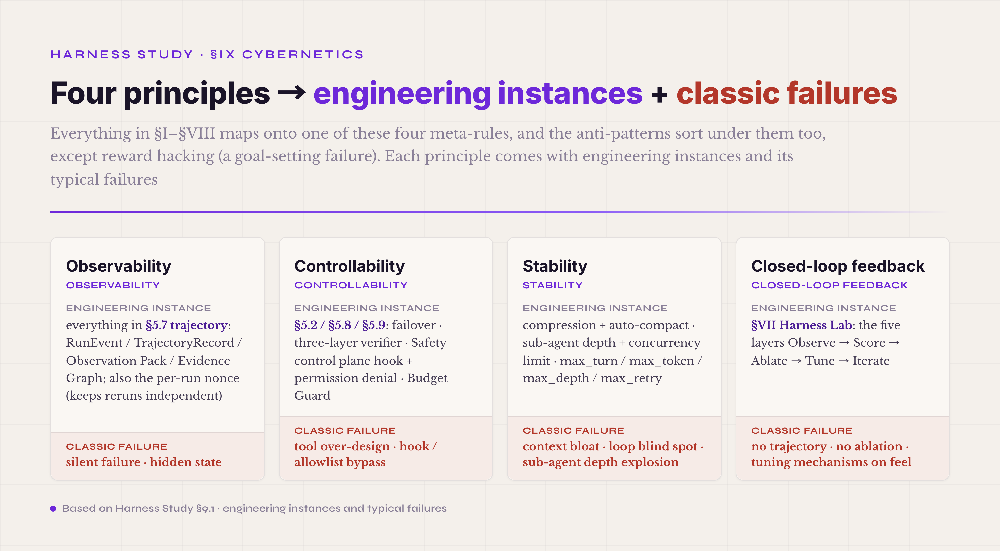
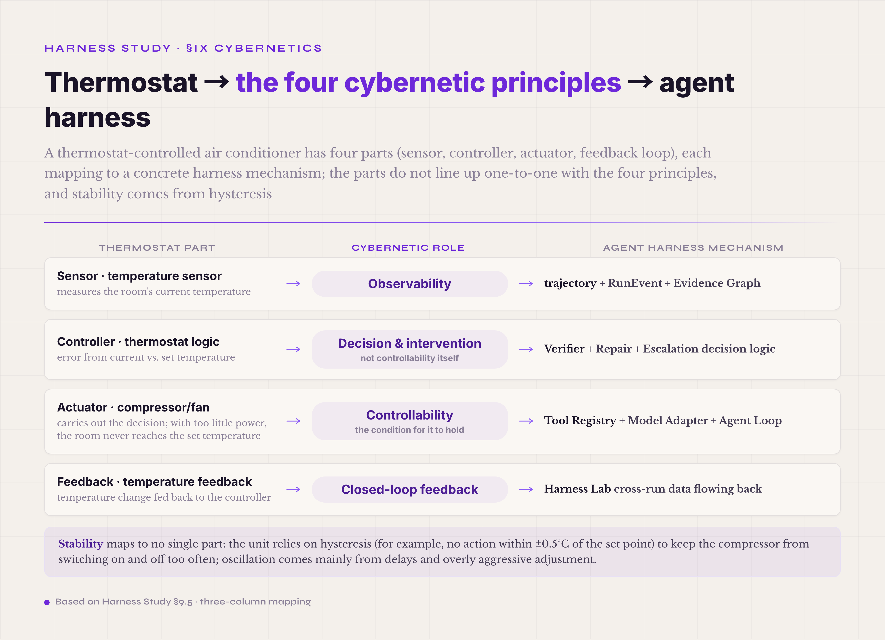

# §IX · Four principles of control theory — the meta-rules that bind the whole tutorial

By this chapter, the concrete material of agent harness engineering has all been covered. §V presented the 8 runtime mechanisms and the Safety control plane, §VI the engineering patterns, §VII the Harness Lab workbench, and §VIII the composability matrix. Each chapter left you with a concrete understanding of its own. Now step back and look across the chapters. Is there a shared set of **meta-rules** behind those understandings? That is where the four principles of control theory sit in this book. They are not a new mechanism, and they add no new runtime component. They gather the engineering principles that run through every chapter into a single framework.

Cybernetics serves as that framework for a reason, not as decoration. First, where it comes from: **this book borrows several concepts from cybernetics as analogies, and the "four principles" are this book's own synthesis.** They organize a few core concepts from cybernetics and control theory into four organizing principles; no single scholar ever proposed them as a set. The four concepts each have their own source:

- **Feedback and the closed loop**: Norbert Wiener's 1948 *Cybernetics: Or Control and Communication in the Animal and the Machine* put feedback at the center, as a unified way to understand control and communication in animals and machines.
- **Stability**: the central problem of classical control theory.
- **Observability and controllability**: introduced by Rudolf Kalman in 1960, in his paper "On the general theory of control systems" at the first IFAC congress.

**Qian Xuesen (H. S. Tsien), in his 1954 *Engineering Cybernetics*, carried cybernetics from mathematics and philosophy into engineered systems.** His book deals with the parts of cybernetics that have "direct engineering application to the design of control systems." That focus turned cybernetics from an abstract theory into a framework you can design with. This book borrows that framework to look at the agent harness. The 1954 framework of engineering cybernetics, plus a constraint peculiar to the LLM era (the system's behavior is not fully knowable), makes up the methodology of agent harness engineering.

Everything covered in §I–§VIII maps onto one of the four principles:

- The trajectory, RunEvent, and the observation pack are instances of the **observability** principle at the runtime layer. Practices such as the per-run nonce, which keep reruns independent of one another, protect the measurement itself from distortion, so they belong to this principle too.
- Verifier, Repair, Escalation, and Budget Guard belong to the **controllability** principle.
- Context compression, bounded sub-agents, and cache-safe forking belong to the **stability** principle.
- Ablation and the Harness Lab belong to the **closed-loop feedback** principle.

After this chapter you should be able to build a cross-chapter index. Given a concrete engineering problem ("what type of bug is this?"), you can tell which of the four principles broke down at its root. With that index, agent harness engineering stops being "a pile of case experience" and becomes "engineering principles organized under four principles."

#### 9.0 · Terms first used in this section

Terms already explained in §I–§VIII aren't repeated here. This list covers only the terms that first appear in this chapter.

**Core cybernetics terms**

- **cybernetics**: proposed by Norbert Wiener in 1948; the study of control and communication in animals and machines, with feedback at its core. This book borrows several of its concepts as analogies.
- **Qian Xuesen's engineering cybernetics** (*Engineering Cybernetics*): written by Qian Xuesen in 1954. It carried cybernetics from mathematics and philosophy into engineered systems and focused on the parts with "direct engineering application to the design of control systems." Its vantage is an engineer's, not a pure theorist's.
- **closed-loop and open-loop**: in a closed loop, the output feeds back into the input and takes part in the next decision; in an open loop, the output does not feed back. §5.4 already used this distinction when discussing long-term memory.
- **feedforward, feedback, iterate**: feedforward means injecting information in advance, feedback means correcting from the results after a run, and iterate means correcting over many rounds until the result converges. Feedforward and feedback come from the Guides and Sensors framework that Birgitta Böckeler of Thoughtworks proposed in April 2026, and the analogy is hers. Iterate is a third item this book adds; its closest counterpart in control theory is iterative learning control (ILC).
- **law of requisite variety**: stated by W. Ross Ashby in *An Introduction to Cybernetics* (1956). The variety of a regulator must be no less than the variety of the disturbances acting on what it regulates. §9.2 uses it to explain why a single-layer verifier can't stop the many forms of reward hacking.

**Terms from *Engineering Cybernetics***

- **non-interacting control**: Chapter 5 of *Engineering Cybernetics*. In a multivariable system, you design the controller so that each input affects only its own output; in other words, decoupling control. This book uses it only as an analogy for separation of responsibilities.
- **control design by perturbation theory**: Chapter 13 of *Engineering Cybernetics*. Perturbation theory (which an earlier Chinese version of this book rendered as "disturbance theory") is a mathematical method that expands around a nominal solution to find an approximate one. It is a different thing from an ablation experiment.
- **system identification**: inferring a system's properties by applying inputs and observing outputs. In control-theory terms, ablation and behavioral probing (which this book also calls "taking the model's pulse"; see §VII) correspond to system identification, or to controlled experiments.
- **systems with unknown properties**: a class of objects that *Engineering Cybernetics* addresses. The approach does not depend on a complete mathematical model; it uses feedback to keep the system within a range that is usable in engineering terms.
- **von Neumann error control**: *Engineering Cybernetics* incorporated von Neumann's theory of error control, the idea of using redundancy and checking to build a reliable system out of unreliable components. It is one of the early sources of fault-tolerant computing.

**Terms from the anti-pattern mapping**

- **declared_vs_executed gap**: the gap between what the agent claims it did and what the tools or the verifier actually observed it doing. §9.2 shows how to compute it. A gap that stays high is an early signal that the feedback system is failing.
- **leading indicator**: an observable signal that warns before the feedback system breaks, as opposed to a lagging indicator. It is a core concept in trajectory engineering.

#### 9.1 · The four principles, expanded · the concrete mapping to LLM agents

The AP numbers in parentheses below refer to the anti-pattern quick reference in Appendix F.

**Principle one: observability** (used here in its engineering sense, being able to see what the system is doing; in control theory it means whether the system's internal state can be inferred from its outputs). You have to be able to see what is happening inside the system, or every judgment you make is a guess. Without a measurable output, no feedback loop can be built. In the agent harness, the engineering instance of observability is **everything in the §5.7 trajectory chapter**: RunEvent, TrajectoryRecord, the observation pack, the ten edges of the Evidence Graph, and the declared_vs_executed gap as a leading indicator. This principle is especially hard to achieve for LLM agents. The LLM's internal reasoning is invisible, tool calls cross process boundaries, and sub-agents cross lifecycles, so by default you get one level fewer observable signals than traditional software gives you. The engineering response is to **turn on every signal you can, structure the signals with a schema, and treat absence as a signal too** (§5.7 made the point that an expected event that never appears is itself a signal). Failed observability typically shows up as silent failure and hidden state: the agent goes wrong but produces no event you can trace, and you only find out when a downstream metric drops.

**Principle two: controllability** (used here in its engineering sense, whether you can intervene when something goes wrong; in control theory it means whether inputs can drive the system's state to any target state). When you see a failure, you have to be able to intervene, not just watch it crash. The engineering instances of controllability are **the mechanisms covered in §5.2, §5.8, and §5.9**: the model adapter's contract repair, the three-layer verifier, the Safety control plane's hooks and ToolBlocked, and the Budget Guard. The key to controllability is that **the strength of an intervention has to match what the system can bear**. §5.4 raised this for compression: compress too weakly (threshold too high) and the context overflows; compress too strongly (threshold too low) and information is lost. The same trade-off exists in every controllable mechanism:

- a verifier that is too weak misses false passes, and one that is too strict blocks legitimate cases;
- a retry budget that is too small leaves no chance to repair, and one that is too large falls into endless loops and burns tokens for nothing;
- a human-approval threshold set too low wears users out, and one set too high lets high-risk actions slip through.

Failed controllability typically shows up in two ways. One is Tool Over-Design (AP07, see Appendix F): control is so fine-grained that the LLM doesn't know which tool to use. The other is Hook / Allowlist Bypass (AP13): the control point exists but gets routed around (covered in §5.9).

**Principle three: stability** (in control theory, it means that a system under disturbance neither diverges nor keeps oscillating, and eventually settles to a steady state. For linear systems the usual notion is BIBO stability, where a bounded input produces a bounded output; it is the standard definition in linear systems theory and took shape gradually over the 1950s and 1960s. This book borrows the term in an engineering sense: the loop can stop, and the cost stays under control). In the agent harness, the engineering instances of stability are spread across several chapters:

- §5.4's compression and auto-compact, which keep the context from blowing up;
- §6.6's caps on sub-agent depth and concurrency, which keep fork-join from blowing up resource use;
- caps such as max_turn, max_token, max_depth, and max_retry.

Stability is especially hard to guarantee in the LLM era. An LLM is a nonlinear system, where a small change in input can cause a large change in output (noted in §5.1 on ReAct). The agent loop is itself a closed loop, so it runs the risk of self-excited oscillation. And the trajectory accumulates turn after turn, so the state space keeps growing. The engineering response is that **every mechanism needs a cap, and every cap needs to be monitorable**. The caps listed above are how stability is implemented in engineering, not decoration. Failed stability typically shows up in three ways, each covered in an earlier chapter: Context Bloat (AP08), Loop Blind Spot (AP11), and Sub-agent Depth Explosion (AP12).

Two things do not belong under stability: results that can't be reproduced across runs, and reward hacking. The first is a measurement problem and belongs to observability. The second is a goal-setting problem, which §9.2 treats separately.

**Principle four: closed-loop feedback.** Every change has to be validated against comparison data; instinct is not enough. Here is how it relates to the first three. They concern the feedback loop within a single run (feedback inside the system), while the fourth concerns the feedback loop across runs (feedback on how the system evolves). The engineering instance of closed-loop feedback is **all of §VII, the Harness Lab**. Its five layers, Observe, Score, Ablate, Tune, and Iterate, are closed-loop feedback built as engineering. In practice the principle comes down to one hard requirement: **no ablation data, no change to a harness mechanism**, a point §VII stresses again and again. Failed closed-loop feedback typically looks like no trajectory, no ablation, and mechanisms tuned by feel. Every answer to "why is this mechanism designed this way" in §I–§V needs ablation data behind it. Saying "I think this is better" with no data is a closed-loop failure.

*Figure 9.1 · The four control-theory principles: engineering instances and typical failures*

#### 9.2 · Mapping the anti-patterns onto the four principles

Map each anti-pattern in this book back onto the four principles, and you should be able to take any agent harness bug and tell which of the four it failed. The mapping doesn't aim to be exhaustive. Its purpose is a cross-chapter diagnostic framework.

**Failed observability**

- Silent Try/Catch (AP10): a try/catch swallows the exception, and the error produces no event (§6.7).
- Artifact Claim Mismatch (AP04): the agent claims it changed an artifact, but the verifier finds no matching change (§5.8).
- A declared_vs_executed gap that stays high: even with no concrete bug showing, this is a sign of failed observability (the calculation is at the end of this section).
- Hidden state: the agent's internal state has no corresponding event (as §5.4 explained, context state must go into the trajectory).
- **Measurement distortion**: Non-Independent Reruns (AP01). When the N reruns aren't independent of one another, both the pass rate and the stability are overestimated (§7.4). The sources include response caches in the client or the evaluation tool, a fixed random seed, files, memory, and workspaces shared between reruns, and word-for-word repeats caused by cache hits at temperature 0. A prefix-cache hit does not change the output on its own. Because this problem makes what you see differ from what actually happened, it belongs to observability, not stability.

**Failed controllability**

- Tool Over-Design (AP07): the tools are so fine-grained that the LLM can't pick the right one (§5.3).
- Hook / Allowlist Bypass (AP13): the control point exists but gets routed around. One case really happened in the author's companion project: the allowlist matched by string prefix, so the allow rule for `cargo check` also let `cargo checkpoint` through (Volume 2 (*Architecture & Engineering*), §2.7). Prompt injection, LLM01 in the OWASP LLM Top 10 (2025 edition), belongs here too (§5.9).
- Excessive Agency (AP15): the agent holds more permissions than it actually needs. This corresponds to LLM06, excessive agency, and LLM10, unbounded consumption, in the 2025 edition of the OWASP LLM Top 10 (§5.9).
- Fake-Landing Mechanism (AP06): the mechanism's protocol is written in the repo, but on the production path it is a no-op (§5.9). It looks like control but isn't, which makes it the hardest controllability failure to spot.

**Failed stability**

- Context Bloat (AP08): the context accumulates without limit, and the lost-in-the-middle effect sets in (§5.4).
- Memory Pollution (AP14): contamination keeps accumulating in long-term memory (§5.4c).
- Loop Blind Spot (AP11): the agent doesn't know it is going in circles (AutoGPT's infinite loops in §III; §7.8).
- Sub-agent Depth Explosion (AP12): fork-join with no depth limit and no token limit, so resource use diverges (§5.9, §6.6).

**Failed closed-loop feedback**

- Premature Optimization (AP17): tuning mechanisms by feel, with no ablation data (§7.8, §X).
- Fixture / Path Classifier Bug (AP05): a bug in the data infrastructure makes the data that closed-loop feedback relies on untrustworthy (§7.8).
- Stage Inflation (AP18): every mechanism is labeled "production-ready" while the engineering isn't actually finished, so the "mark as complete" step in the loop has no real bar (§7.8).
- Overfitting to a Fixed Test Set (AP20): prompts and rules are tuned against the same test set again and again, so the evaluation success rate is high but problems pile up after launch. The evaluation signal the loop depends on has come apart from production (§7.4).

**Failed goal-setting: why reward hacking belongs to none of the four principles**

Reward Hacking (AP03; §7.4 sums up six common forms) is not a stability problem. The agent's behavior may be perfectly stable; it is simply optimizing, stably, toward the wrong target. The root lies in goal-setting. The signal used to judge whether the work was done right disagrees with the result you actually want, and the agent learns to satisfy the signal instead of finishing the task. This book files it separately as a **goal-setting failure**.

Ashby's law of requisite variety helps here: a regulator's variety must be no less than the variety of the disturbances acting on what it regulates. Reward hacking comes in many forms (the six in §7.4 are only the known ones), while the kinds of deviation a single-layer verifier can recognize are limited. With only one layer of checks, the "regulator" is bound to have too little variety, and some technique will always slip in from a direction it doesn't cover. So the answer is not to make one verifier layer ever more elaborate. It is to make the kinds of checks keep pace with the kinds of behavior being checked. That means running several mutually independent checks together, such as Hard Gate, Outcome Judge, trajectory spot-checks, and cross-run comparison (§5.8's three-layer verifier is where this idea starts).

**The declared_vs_executed gap: how to compute it and why it warns early**

One advantage of the declared_vs_executed gap is that you can compute it directly, with no new instrumentation. The existing edges of the Evidence Graph in §8.4 are enough:

- **Declared set**: the artifacts and actions the agent claims to have completed in its replies and plans, extracted from the text of the final turn, plus the claim side of the produces edges;
- **Executed set**: the part backed by artifact_write or tool_result evidence in the trajectory;
- **Gap**: the share of the declared set that lacks execution evidence.

Compute it once at the end of each run and aggregate it weekly into a trend line. When the gap for some class of task stays above 10%, raise an alert (10% is the starting default in this book's companion project; adjust it to your setting). That turns the leading indicator from a slogan into a line on a monitoring dashboard, with only one set difference in between.

It deserves its own discussion because a gap that stays high means at least one of the following failures has happened:

1. **Failed observability**: a declared action has no matching execution event, so the trajectory schema is missing something;
2. **Failed controllability**: the agent carried out some actions without going through a tool or the verifier, so the control layer has a bypass;
3. **Failed goal-setting**: reward hacking has made the claims untrue, and the agent has learned that "claiming is enough, no need to actually do it."

One metric warns of several different failures, and it doesn't depend on business logic, needs no labeled data, and applies to every task type. This book's companion implementation project lists it as a front-line engineering requirement, and an agent in production deserves to have it in a prominent spot on the monitoring dashboard.

#### 9.3 · Qian Xuesen's *Engineering Cybernetics* (1954): the engineering vantage

Cybernetics begins with Norbert Wiener's 1948 *Cybernetics*. The book made feedback a unifying perspective across disciplines (biology, machinery, society, economics) and used mathematical language to describe the general properties of feedback systems. Wiener's vantage is a mathematician's and a philosopher's. He cared about the theory's generality and its explanatory reach across fields, and he did not directly give engineers a design method they could put into practice. That route lifted cybernetics to a philosophical height, but it also left engineers without a design framework they could use directly. Read *Cybernetics* and you understand the nature of feedback systems, yet you still don't know how to design a concrete feedback controller next.

**Qian Xuesen's 1954 *Engineering Cybernetics* closed that gap.** Qian's vantage is an engineer's. He focused on the parts with "direct engineering application to the design of control systems" and narrowed cybernetics from an abstract meta-theory into an operable engineering method. The two books differ in a key way. Wiener spends 200-plus pages on the mathematical nature of feedback systems and their parallels across disciplines, while Qian spends 18 chapters systematically laying out control design methods that engineers can use directly. After returning to China in 1955, Qian applied this engineering vantage to the design of China's space, missile, and industrial-automation programs. Over the next seventy years, the ideas of cybernetics were applied in turn to industrial control, signal processing, robotics, self-driving, and large software systems, and now they are being borrowed to understand the agent harness.

The most important point in *Engineering Cybernetics* is that it **gives design principles for systems whose properties are mostly unknown**, which corresponds precisely to the core constraint of the LLM-agent era. Traditional control design assumes you know the controlled system's transfer function, state equations, and steady-state characteristics; with that knowledge, controller design becomes a mathematical optimization problem. In engineering practice, though, you often meet systems whose properties are mostly unknown. The combustion dynamics inside an engine are hard to solve analytically. A large aircraft's response across speed regimes is unknown. **And an LLM agent's internal reasoning is entirely invisible.** Qian's approach is to **not depend on a complete model, and to use feedback to keep the system within a range that is usable in engineering terms**. That is close to how agent harness engineering works today. You don't know how the LLM works inside, but you can observe the trajectory and design controlled experiments (the Ablate layer of the §VII Harness Lab covers exactly this). Then you use feedback to tune the harness configuration.

Three parts of *Engineering Cybernetics* can serve as analogies for agent harness practice:

1. **Non-interacting control** (Qian's Chapter 5), that is, decoupling control: in a multivariable system, you design the controller so that each input affects only its own output. It can be likened to **the separation of responsibilities between the Safety control plane and the 8 runtime mechanisms in §5.9**. As a cross-cutting layer, the Safety control plane looks after its own concerns and the runtime mechanisms look after theirs, so safety decisions and runtime decisions don't interfere with each other. This is also why §5.9 pulls the Safety control plane out on its own instead of folding it into any runtime mechanism. The relationship among the three axes of §VIII, "relatively independent but constrained," can be read the same way. But this is only an analogy. Decoupling in control theory is a mathematical design over transfer functions, and it can't be treated as an engineering constraint that harness design must obey.
2. **Control design by perturbation theory** (Qian's Chapter 13): perturbation theory is a mathematical method that expands around a nominal solution to find an approximate one. It resembles ablation in name only; the two are different things. In control-theory terms, **the ablation stage of the §VII Harness Lab** (Phase A group ablation, Phase B single-point ablation, Phase C second-order interactions) corresponds to **system identification**, or controlled experiments. You change one configuration at a time (compression on or off, verifier strict or loose, safety policy permissive or strict), observe Δᵢ, and infer each mechanism's real contribution.
3. **von Neumann error control** (*Engineering Cybernetics* incorporated von Neumann's theory of error control): build a reliable system from unreliable components, using redundancy plus checking to keep a single-point error from spreading. It can be likened to **§5.8's three-layer verifier, §5.9's multi-layer safety defenses, and §5.2's contract repair**. The three layers, Hard Gate, Outcome Judge, and PRM, use different signals to cover one another's blind spots (when they are used as gates in series, a case stopped by one layer goes no further). The design does not depend on any single component being bug-free. The two lines of thinking have a lot in common.

The section comes down to one line: **cybernetics (1948) gave the meta-theory, engineering cybernetics (1954) gave the operable method, and the agent harness (2026) continues that methodology in AI engineering**. In the preface to *Engineering Cybernetics*, Qian defined the discipline as the study of those parts of cybernetics with direct engineering application to the design of controlled and guided systems. Its aim is to put control systems on an engineering footing and give engineers design principles they can put into practice. Agent harness engineering today does the same kind of thing. It turns the agent runtime from the craft of "tuning hundreds of prompt versions" into "engineering principles under the four principles, plus 8 runtime mechanisms, engineering patterns, and the Harness Lab." That upgrade is the same kind of methodological evolution as the earlier move of cybernetics from Wiener's mathematics to Qian's engineering, happening once more in the agent era. Knowing this history helps explain why this book's engineering principles are designed the way they are. They were not dreamed up on the spot in 2026; they apply the methodology of cybernetics to a new stage of AI engineering.

#### 9.4 · Qian Xuesen's meta-synthesis (1990): qualitative and quantitative together

Qian's 1954 *Engineering Cybernetics* narrowed cybernetics from Wiener's meta-theory into an engineering method. In the late 1980s he pushed one step further, toward a class of objects that **can never be fully modeled mathematically, have people among their actors, and involve value judgments**: economic systems, social systems, national-defense strategy, urban planning. In 1990, Qian, with Yu Jingyuan and Dai Ruwei, published "A New Scientific Field — Open Complex Giant Systems and Their Methodology" in *Ziran Zazhi (Nature Journal)*, vol. 13, no. 1. The paper proposed the concept of the **Open Complex Giant System (OCGS)** and the method of **meta-synthesis combining qualitative and quantitative approaches**. This was the second leap in Qian's cybernetics. The 1954 work handled systems that "can be engineered but whose behavior is partly unknown"; the 1990 work handled systems "whose behavior is mostly unknown, which have people among their actors, and which involve value judgments." §9.3 covered how the 1954 engineering vantage carries over to the agent harness. This section covers the 1990 vantage of meta-synthesis, which maps directly onto the frontier problems of agent harness evaluation.

OCGS has four characteristics:

- **Giant**: an enormous number of subsystems, in Qian's own words "thousands upon thousands, even hundreds of millions";
- **Open**: it continuously exchanges matter, energy, and information with its environment;
- **Multi-level**: the subsystems are themselves complex systems;
- **Emergent**: properties of the whole can't be inferred from the subsystems.

The key judgment of the 1990 paper is that three mature methods **do not apply** to OCGS: reductionism, classical systems engineering, and large-systems theory. Reductionism loses emergence, classical systems engineering assumes the system can be modeled mathematically, and large-systems theory assumes the structure is known. The workable method for OCGS is **qualitative-quantitative meta-synthesis**, an "organic combination" of expert wisdom, data, computer simulation, and scientific theory in which the parts amplify one another instead of simply adding up. At its core is the recognition that experts' tacit knowledge and value judgments can't be replaced by algorithms, but can be organized as engineering to work alongside them. That resembles the situation of LLM-agent engineering today: the LLM's internal reasoning is invisible, the agent's decisions involve value judgments, and a single-layer quantitative verifier is easy to bypass. The judgment that Qian and his coauthors reached on OCGS in 1990 (reductionism doesn't apply, large-systems theory doesn't apply, meta-synthesis is required) is still a useful reference for agent engineering in 2026.

In 1992 Qian proposed the **Hall for Workshop of Metasynthetic Engineering (HWMSE)** as the engineering vehicle for meta-synthesis. He stressed repeatedly that the workshop's core premise is "people first": the heart of the workshop system is still people, the group of experts, and how well the whole system works depends on the state of those experts. So HWMSE is not an expert system bolted onto a database. It is an instance of a **people-first, human-machine combined** methodology. The mainstream architecture of HWMSE is **a combination of three systems** (as described in the surveys by Dai Ruwei, Yu Jingyuan, and Tang Xijin from the 1990s to the 2010s, and in the 2021 survey by Wang Danli, Zheng Nan, and Liu Chenglin in *Acta Automatica Sinica*):

- **Machine system**: computer simulation, databases, knowledge graphs, decision support systems;
- **Expert system**: groups of domain experts, decision-makers, users;
- **Knowledge system**: existing theory, experiential knowledge, the literature, historical data.

The three are combined organically, not chained in series. The workflow is an iterative closed loop. Pose the question, have the experts give qualitative judgments separately, and let machine simulation supply quantitative data. Then compare and integrate the two, revise the qualitative judgments, and simulate again, repeating until the process converges.

It is worth being clear about how HWMSE differs from three mainstream Western methods:

- **The RAND Delphi method** (Helmer and Dalkey, from the 1950s): experts stay anonymous, converge through several rounds of feedback, and may not debate directly. Its weakness is that quantitative integration relies only on averages or medians, which loses the clash of ideas between experts.
- **Tetlock's Superforecasters** (IARPA's Good Judgment Project, 2011–2015): amateur generalists plus algorithmic weighting, about 30% more accurate than intelligence analysts with access to classified information. Its weakness is that it reduces expert wisdom to probability numbers, which loses the qualitative reasoning.
- **Bohm Dialogue** (David Bohm, 1990s): suspend judgment and let collective meaning emerge on its own. Its weakness is that it has no quantitative loop, so it can't be brought to convergence by engineering means.

The key difference from all three is that meta-synthesis **includes qualitative judgment, quantitative data, and iteration at the same time**. It doesn't require experts to be anonymous (so ideas can clash), doesn't reduce judgment to numbers (so the reasoning is kept), and adds a simulation loop (so it doesn't stop at dialogue). This three-way comparison shows HWMSE's value in the LLM-agent era: agent harness evaluation needs exactly a methodology that has all three.

Map meta-synthesis and HWMSE onto agent harness practice, and you can find at least five concrete scenarios where quantitative judgment alone won't do.

**First: the limits of the three-layer verifier.** A Hard Gate is easy to pass by cheating. An LLM-as-a-judge has a self-correlation problem (*One Token to Fool LLM-as-a-Judge*[^one-token-fool-2025] shows that injecting a "master key" such as ":" or "Thought process:" is enough to trick the judge model into a pass, with no real reasoning at all). A PRM tends to overfit (it is valid only on its training distribution). Meta-synthesis answers with a workshop-style verifier: several mutually independent verifiers, qualitative reasoning written out explicitly, and iteration until convergence, with no single layer relied on as the backstop. This is also the law of requisite variety from §9.2 at work.

**Second: three kinds of distorted evaluation signal.** Non-Independent Reruns (AP01, §7.4), Leakage (AP02, §5.8), and Reward Hacking (AP03, §7.4) all distort a single quantitative signal: a high pass rate doesn't mean the work was really done right. Non-independent reruns are a measurement distortion, while the other two are cases of the signal being gamed. On top of these, Overfitting to a Fixed Test Set (AP20, §7.4) makes evaluation results come apart from production performance. The countermeasure has to pair the signal with trajectory spot-checks, counterfactual perturbation, and cross-run comparison, which is exactly how Qian's qualitative-quantitative meta-synthesis shows up in agent harness engineering. Behavioral probing in the §VII Harness Lab (taking the model's pulse) is a more concrete application. Classifying behavior is the qualitative part, checking the prediction hit rate with ablation is the quantitative part, and going back to revise the probe when a prediction misses is the iteration. With all three present, it applies the meta-synthesis loop of qualitative judgment, quantitative data, and convergence to model diagnosis.

**Third: arbitrating conflicts between agents.** In a multi-agent system, when sub-agents reach conflicting conclusions, a majority vote degenerates into a Delphi-style average and throws away the reasoning. HWMSE's answer is workshop-style arbitration: make the conflict explicit, have each side give a qualitative argument, and let the main agent act as facilitator, iterating until convergence or explicitly escalating to human review.

**Fourth: cross-run self-evolution has no ground truth.** The core difficulty of harness self-evolution is knowing whether a configuration change actually made things better. Meta-synthesis answers this way: periodically ask domain experts to review a number of trajectories and give a qualitative ranking, then compare that ranking with the quantitative signal from self-evaluation. When the deviation crosses a threshold, trigger manual calibration.

**Fifth: tasks involving value judgments, culture, or philosophy.** For tasks like "does this commit message match the team's style?" or "is this legal analysis approaching the question from the right angle?", a verifier can't be purely quantitative. Qualitative discussion among experts has to remain the ground truth, with the quantitative signal only as support.

The 1990 meta-synthesis and the 1954 engineering cybernetics of §9.3 come from the same methodological source and form two leaps. The 1954 work gave "engineering design principles for systems with unknown properties"; the 1990 work gave "a methodology for open complex giant systems that include people and value judgments." Together they cover the main frontiers of agent harness engineering. The first maps onto the quantifiable layer of engineering principles (trajectory, verifier, Harness Lab ablation), and the second onto the evaluation layer that needs humans and machines working together (cross-run self-evolution, value judgments, multi-agent arbitration). The two steps Qian took in 1954 and 1990 turn out to be needed side by side in agent engineering in 2026. The next section uses the thermostat analogy to work through the four principles on a single-loop system. The real complexity of an LLM agent, however, goes far beyond a single-loop system like a thermostat, and that gap is the agent-era form of the very problem the 1990 meta-synthesis foresaw.

#### 9.5 · The analogies, expanded · the thermostat and the four parts of a car

The classic analogy in cybernetics is the **thermostat**, here a thermostat-controlled air conditioner. Nearly every piece of cybernetics teaching material uses it, because it compresses several core concepts into the smallest possible physical object. A thermostat-controlled air conditioner is made of four parts (a sensor, a controller, an actuator, and a feedback loop), and it is the smallest complete closed-loop system:

- The **sensor** (a temperature sensor) measures the room's current temperature. It corresponds to **observability**: without a sensor, the air conditioner doesn't know whether to turn on.
- The **controller** (the thermostat logic) compares the current temperature with the set temperature and decides whether to cool, heat, or do nothing. It is where decisions and interventions are made, but it is not controllability in itself. Controllability asks whether there are enough means to drive the room temperature to the target.
- The **actuator** (the compressor and fan) carries out the decision so that the intervention actually acts on the room. This is the condition for controllability to hold: with too little power, the room never reaches the set temperature.
- **Stability** comes from hysteresis. For example, the unit takes no action while the temperature is within ±0.5°C of the set point, which keeps the compressor from switching on and off too often. Temperature oscillation comes mainly from delays (sensor lag, the room's thermal inertia) and from overly aggressive adjustment.
- **Feedback** (the temperature change passed back to the controller) lets the next decision rest on a new observation. It corresponds to **closed-loop feedback**: an open-loop air conditioner (switched on a schedule, ignoring the temperature) can never hold a precise temperature.

*Figure 9.2 · The thermostat analogy: four correspondences in cybernetics*

Mapped onto the agent harness, the thermostat analogy looks like this:

- Sensor: the trajectory, RunEvent, and the Evidence Graph;
- Controller (decision and intervention): the decision logic of Verifier, Repair, and Escalation;
- Actuator: Tool Registry, Model Adapter, and Agent Loop;
- Feedback: the Harness Lab's cross-run data flowing back.

The analogy has a boundary. The thermostat's controlled object (room temperature) is continuous, approximately linear, and mathematically modelable. An LLM agent's controlled object (the agent's behavior) is discrete, nonlinear, and mostly impossible to model mathematically. This is exactly the kind of problem Qian addressed in *Engineering Cybernetics*: systems whose properties are mostly unknown. The design methods of classical control theory that rely on an accurate model are hard to apply directly to an LLM agent.

The four major parts of a car (engine, transmission, suspension, brakes) serve as a supporting analogy. They cover what a single-loop thermostat can't: **several subsystems that each run their own closed loop and also work together**. Each of the four is a closed loop in the cybernetic sense. The engine has a fuel-injection feedback loop, the transmission a shift-control feedback loop, the suspension an active-suspension feedback loop, and the brakes an ABS feedback loop. At the same time they cooperate: press the brake, and the transmission downshifts, the engine limits the throttle, and the suspension stiffens. In the agent harness, the 8 runtime mechanisms, the Safety control plane, and the engineering patterns are each closed-loop subsystems, and they also cooperate across components through the trajectory and the Evidence Graph. Different vendors can take the same few kinds of components and build agents with different emphases. The difference lies mainly in each component's parameters and trade-offs, which amounts to tuning the controllers of the same set of parts differently. The analogy explains why different harnesses can make different products out of the same underlying components.

This analogy has a boundary too. A car is physical engineering, with highly standardized cross-vendor interfaces (for example, ISO 11898 for the CAN bus). The cross-vendor interfaces of the agent harness are still at the early-Lego stage in 2026 (covered in §VIII). That lag in standardization is the key gap between agent harness engineering and mature industrial control engineering.

#### 9.6 · An industry framework · feedforward, feedback, iterate

In the article *Harness Engineering for Coding Agent Users* (April 2026), Birgitta Böckeler of Thoughtworks offered a cybernetic analogy aimed at the LLM era. She treats the harness as a regulator in the cybernetic sense, a cybernetic governor, that steers the codebase toward its target state with two kinds of means: **Guides (feedforward control) and Sensors (feedback control)**. This book adds a third item on top of those two, **iterate** (correcting over many rounds until convergence), which gives three control-flow patterns: feedforward, feedback, and iterate. Together they restate cybernetic principles in terms an LLM engineer can pick up and use directly.

- **Feedforward**: load known information into the controller before the system starts. In control theory, feedforward compensates for a disturbance before it reaches the output; calling up-front constraints such as system prompts and rules "feedforward" is Böckeler's analogy. Everything in the §5.5 Prompt Assets chapter falls into this category. Before the agent runs, the system prompt, Skills, tool descriptions, and agent identity are loaded, as compensation applied before the controller runs.
- **Feedback**: after the system runs once, look at the output and adjust the next input. This corresponds to **classical closed-loop feedback** in cybernetics. The §5.7 trajectory, the §5.8 verifier, and the §VII Harness Lab are all feedback.
- **Iterate**: repeat the feedback until the goal is met. Its closest counterpart in control theory is **iterative learning control** (ILC), which corrects round by round while the same task is executed repeatedly. The Harness Lab's multi-round tuning and the convergence check of its L5 Iterate layer fit this best; repeated attempts inside the agent loop are closer to an ordinary feedback loop.

The engineering value of Böckeler's framework is that it carries cybernetics from abstract principles to three control-flow patterns an LLM agent engineer can **recognize and start using right away**. Read Wiener's 1948 *Cybernetics*, and an engineer doesn't know what to do next. Read Qian's 1954 *Engineering Cybernetics*, and the engineer knows the methodology but has to do the mapping alone. Read Böckeler's April 2026 article, and the engineer knows directly: feedforward means loading the prompt assets, feedback means reading the trajectory and the verifier, and iterate means the agent loop and the Harness Lab. Localizing the vocabulary this way puts classical cybernetic methods to immediate use in the hands of agent engineers in 2026. This book uses the three patterns together with the four principles: the four principles give the meta-rules, and feedforward, feedback, and iterate give an operable control-flow vocabulary. With both in place, you can take any agent harness engineering problem and place it both at the principle layer and at the control-flow layer.

---

The chapter's core conclusions come down to three points.

**First, the four principles (observability, controllability, stability, closed-loop feedback) are meta-rules this book has synthesized, and they run through the whole book. They are neither decoration nor abstract philosophy.** The 8 runtime mechanisms of §V, the engineering patterns of §VI, the Harness Lab of §VII, and the composability matrix of §VIII all map onto one of them. Observability maps to the trajectory and the Evidence Graph, controllability to the verifier, Safety, and Repair, stability to compression and the various caps, and closed-loop feedback to the Harness Lab's cross-run data flowing back. Goal-setting problems such as reward hacking fall outside the four principles and need separate treatment. With this mapping, agent harness engineering moves from "a pile of case experience" to "engineering principles organized under four principles," and you can take any bug and tell which principle it failed.

**Second, the engineering vantage of Qian's 1954 *Engineering Cybernetics* gives the agent harness era a methodological reference point.** Wiener in 1948 gave the meta-theory, and Qian in 1954 gave an operable engineering method. A key element of that method is "design principles for systems with unknown properties," which corresponds directly to the core constraint of the LLM-agent era (model behavior is not fully knowable). The correspondences drawn in this book (non-interacting control for separation of responsibilities, von Neumann error control for multi-layer redundancy, ablation for system identification) are all analogies meant to aid understanding, not strict equivalences.

**Third, feedforward, feedback, and iterate give LLM engineers a control-flow vocabulary they can recognize right away** (the first two borrow Böckeler's April 2026 Guides and Sensors analogy; iterate is this book's addition). Used together with the four principles, it lets you place an agent harness engineering problem both at the principle layer and at the operable control-flow layer.

After this chapter you should have a cross-chapter diagnostic framework, and in your own project you should be able to:

1. take any agent harness bug and tell which of the four principles it failed, or whether it is a goal-setting problem;
2. treat the declared_vs_executed gap as a must-watch leading indicator: when it stays high (starting default: 10%), at least one of observability, controllability, or goal-setting has gone wrong;
3. when designing any new mechanism, first ask whether it is feedforward, feedback, or iterate; if it is none of the three, something is wrong at the design level;
4. when writing the design doc for your next agent harness component, keep the engineering vantage of *Engineering Cybernetics* on hand as a meta-rule reference, so the design moves past the vibe-coding stage and rests on engineering principles.

The four principles are not filler for a closing chapter; they are the methodological foundation of the whole book. By this chapter it should be clear that everything covered in §I–§VIII is a concrete application of this methodology.

One last echo: the contemporaneous survey *Code as Agent Harness*[^code-as-agent-harness-survey-2026], cited at the end of §4.5. Its abstract lists 6 open problems: evaluation beyond final task success, verification under incomplete feedback, regression-free harness improvement, consistent shared state across multiple agents, human oversight for safety-critical settings, and multimodal extensions (§5.2 of the paper's body adds a seventh, the meta-challenge "Toward a Science of Harness Engineering"). Mapped back onto the four principles:

- the first two (evaluation and verification) are the frontier of **observability** at the trajectory and verifier layer;
- regression-free harness improvement is the frontier of **closed-loop feedback** at the layer of cross-run evolution;
- consistent shared state is the frontier of **stability** at the multi-agent topology layer;
- human oversight is the frontier of **controllability** at the Safety control plane;
- multimodality is an extension that cuts across all four principles.

In other words, **every one of the 6 open problems this survey lists has a place among the four principles**. The framework of classical cybernetics is not historical decoration. It is a coordinate system for locating new problems: given a new agent harness problem, first ask which of the four principles it belongs to, then ask what known gaps that principle has at the current frontier. That gives frontier work in agent harness engineering a methodological footing, instead of leaving it at the level of chasing one new paper after another. Representative papers such as Continual Harness (2026-05), AHE (2026-04), and Meta-Harness (2026-03) can all be located this way: each pushes the frontier of one of the four principles, rather than starting a separate new trend of its own.

---

## Footnotes

[^one-token-fool-2025]: One Token to Fool LLM-as-a-Judge · arxiv 2507.08794 · 2025 · preprint
[^code-as-agent-harness-survey-2026]: Code as Agent Harness · arxiv 2605.18747 · Ning / Tieu / Fu et al. (42 authors) · UIUC + Meta + Stanford · 2026-05-18 · preprint
