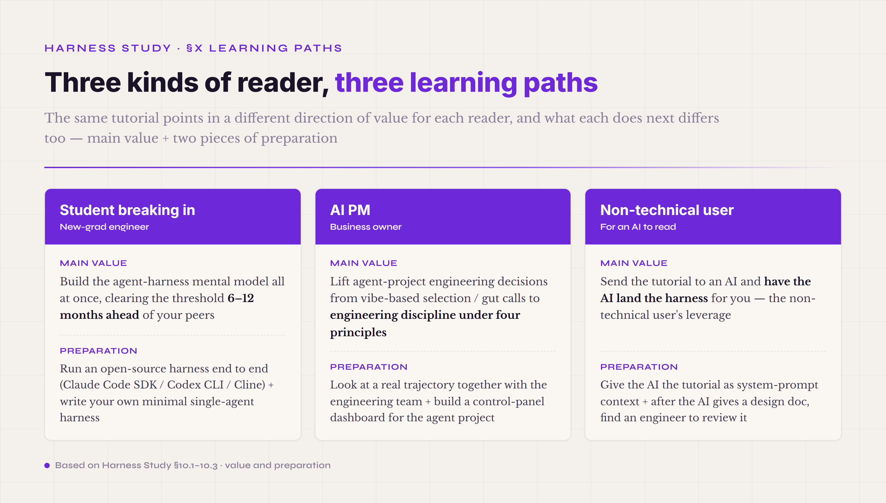

# §X · Learning paths — how three kinds of reader should use this tutorial

By this chapter you've been through every part of the tutorial — §I–§IV the introduction, §V the 8 runtime mechanisms + 1 Safety, §VI the engineering patterns, §VII the Harness Lab, §VIII the composability matrix, §IX the four control-theory principles. But the tutorial points in a different direction of value for different readers — a student trying to break into the field, an AI PM, and an AI itself (the §I signposts noted that the tutorial's hidden reader is an AI). The three kinds of reader should walk away with different things, and what each does next differs too. This chapter gives three concrete paths.

*Figure 10.1 · Three kinds of reader, three learning paths*

The learning paths don't lay out a "week one do this, week two do that" timetable — an agent harness is engineering infrastructure built up gradually over 3–12 months, and a timetable would mislead (your project running off the timetable doesn't mean you did it wrong, and doesn't mean you did it right). What this chapter gives is **the concrete engineering question each reader should be able to answer after the tutorial** — answer it and your mental model is really built; can't answer it, go back and reread the matching chapter.

#### 10.1 · Path one · the student or new-grad engineer breaking in

The **main value** of this tutorial for this reader: build the mental model of agent harness engineering all at once, instead of piecing it together from scattered blog posts and trial and error. Demand for agent-engineering roles surged in 2026, but most material still stops at the "install LangChain, run a demo" level — material that lets a reader build a systematic mental model is scarce. After this tutorial you should be able to clear the "knowing what the parts are + knowing why they're designed this way" threshold 6–12 months ahead of your peers.

The questions to answer next. **First** — take a concrete scenario (say "set up a slide-building agent for a salesperson") and fully draw out the 8 runtime mechanisms + 1 Safety + the sub-harness's five-dimension ontology + the acceptance verifier; for any part you can't draw, go back and read the matching chapter. **Second** — can you identify what trade-offs Cursor / Claude Code / Codex each made on the 8 runtime mechanisms, and why — say, which parts Cursor has covered in the Tool Registry, which Claude Code has in Prompt Assets, which Codex has in Safety; if not, read the §6.8 industry-comparison passage. **Third** — take an agent bug (say "the agent reports the task done but the file wasn't actually changed") and identify which of the four control-theory principles it failed; if not, read the §9.2 pitfall-mapping passage.

Two pieces of preparation before real engineering. **First · run an open-source agent harness end to end** — pick one of Anthropic's Claude Code SDK / OpenAI's Codex CLI / Cline (open source, Cline Bot), run it through, read a trajectory event stream once, and count how many of the 8 runtime mechanisms you can locate in the code. This experience is the entry bar of agent engineering — an engineer who has never run on production harness code has a mental model far from real production. **Second · write your own minimal single-agent harness** — don't start from a high-level framework like LangChain; call the model API directly (Claude / GPT / DeepSeek) + write a minimal Agent Loop + add 1–2 tools + add one hard-gate verifier + run one task through. This minimal harness teaches you which of the 8 runtime mechanisms are "add it or it won't run at all" and which are "add it to make it run more stably" — a tiering that matches the engineering judgment in the §III three-tier framing.

A cross-stage suggestion — pair three things: engineering practice, close reading of the tutorial, and tracking industry material. The tutorial gives the mental model, engineering practice gives hands-on calibration, tracking industry material keeps the mental model current with the field's evolution. The three together beat any one alone — the tutorial alone tends toward over-abstraction, hands-on alone tends to lack methodology, chasing industry material alone tends to sink into buzz without settling anything.

#### 10.2 · Path two · the AI PM or business owner

The **main value** of this tutorial for this reader: lift agent-project engineering decisions from "vibe-based selection / gut calls" to "engineering discipline under four principles." An AI PM doesn't need to write code, but does need, when aligning with the engineering team, to tell whether "the trade-off the engineer is describing" is reasonable or cargo cult — and the gap in that ability decides whether an agent project lands and whether it keeps improving. After this tutorial you should be able to discuss technical decisions like verifier design, cache collusion, or fork-join topology choice with engineers without being led by the nose — validating their proposals against the four principles and the pitfall map.

The questions to answer next. **First** — take an agent business requirement (say "a client wants a contract-review agent") and break out five engineering decisions — which of the 8 runtime mechanisms need what strength / the sub-harness five-dimension ontology / the verifier design / the Safety control plane / the deployment topology; if you can't, read §III three-tier + §VIII composability matrix. **Second** — can you spot the gap between an agent project's "actual progress" and its "claimed progress" — AP18 stage inflation from §7.8 (every part marked production-ready but actually 0 lines) is the pitfall an AI PM is most likely to step on — and can you require the engineering team to grade each mechanism on the L0–L5 maturity scale (from §VII), turning the "progress report" from subjective into a countable dimension. **Third** — take an agent investment decision (say "should we go multi-agent / should we stand up a Harness Lab") and evaluate the ROI using the decision lines from §6.6 + §7.9; if not, read the matching chapters.

Two pieces of preparation before a real engineering project. **First · look at a real trajectory together with the engineering team** — have an engineer export a full trajectory event stream of an agent running a task, walk through it with them, and map each event to which of the 8 runtime mechanisms + which of the 10 Evidence Graph edges. This hands-on gives an AI PM and an engineer a shared vocabulary for agent behavior — and "what is this bug" discussions go much faster afterward. **Second · build a "control panel" dashboard for the agent project** — §9.2 noted the declared_vs_executed gap is the highest-ROI leading indicator; have the engineering team turn that metric, plus 4–5 other key ones (task pass rate / verifier hard-gate pass rate / average turn count / context-overflow ratio / sub-agent depth distribution), into a dashboard, and read the dashboard instead of the weekly report. This control panel turns the agent project from "the engineer talks and the PM believes" into "the PM can see the state directly" — the closed-loop feedback principle instantiated at the management layer.

A cross-stage suggestion — pair three things: align vocabulary with engineering, refuse over-promising, and take the long-build view. Vocabulary makes discussion efficient; refusing over-promising keeps the project sustainable (§7.9 noted a Harness Lab takes 6–12 months to stand up, so short-term ROI expectations have to be calibrated); the long-build view shifts the agent project from "ship and deliver" to "keep improving" — in the field's experience it's not rare for an agent project's pass rate to rebound a few months after launch (reward hacking + context drift), and that rebound can only be held off with a continuous-improvement mechanism (the Harness Lab).

#### 10.3 · Path three · for an AI to read · the leverage of the non-technical user

In this tutorial's design, **the final reader includes the AI itself.** A non-technical user sends this tutorial to an AI and has the AI land the harness for them — a new form of "non-technical leverage" in the agent era, a notch lower in barrier than "a non-technical person learning to code," a notch broader in coverage than "a non-technical person writing prompts." After this tutorial, the **AI reader** (Claude / GPT / DeepSeek, and the like) should be able to take a non-technical user's requirement ("I want an agent that reviews contracts for me") and automatically output a landable agent harness design following the four principles + 8 runtime mechanisms + five-dimension ontology + verifier design — not "I suggest you use LangChain," but "you need these parts + the five-dimension ontology looks like this + the three verifier layers are designed like this + the Safety control plane should turn on these few."

The non-technical user's engineering delivery path. **First · give the AI the tutorial as system-prompt context** — this needs no technical skill — tell the AI "use this tutorial's methodology to help me design an agent for scenario X," and the AI will automatically give a design under the four principles. The §I signposts noted the tutorial is specially optimized for the "AI reader" — bullets and tables kept to ≤35%, each mechanism passage 200+ words, each pitfall with a decision line — so an AI taking the tutorial as context can extract structured rules. **Second · after the AI gives a design doc, find an engineer to review it** — the AI's design doc isn't directly executable; an engineer has to implement it into a concrete framework (Claude Code SDK / OpenAI Agents SDK / a hand-written Rust harness, and so on). But the engineer's workload drops from "design + implement" to just "implement," and the time saved is the non-technical user's leverage.

The common pitfalls of the non-technical user's path. **First · expecting the AI to hand over runnable code in one shot** — at the current stage (2026), an AI outputting an agent harness design doc is far more reliable than outputting runnable code — the former is structured reasoning, the AI's strength; the latter needs implementation details + framework-specific knowledge, where the AI easily hallucinates. Having the AI give the design + an engineer implement is a notch lower in risk than having the AI give the code + an engineer review. **Second · not iterating** — the AI's first design is very likely imperfect — the non-technical user shouldn't chase a perfect first draft; treat the first draft as a starting point and iterate with the AI 3–5 rounds (revise the sub-harness five-dimension ontology / tune the verifier strength / tune the Safety control plane) — only after iterating does it converge to a usable design. This iterate pattern matches the control-flow vocabulary from §IX — a non-technical user collaborating with an AI is running a feedback + iterate loop.

A cross-stage suggestion — pair three things: a non-technical user finding an engineer "partner," giving the AI the tutorial as context, and continuously maintaining the sub-harness five-dimension ontology. The engineer partner gives implementation a backstop, the tutorial-as-context automates the design, and maintaining the five-dimension ontology keeps the sub-harness aligned with how the business evolves. The core framing of this path: "non-technical leverage in the agent era isn't replacing the engineer — it's reducing the design burden the engineer carries and concentrating the engineer's energy on implementation and ops." That framing is the engineered, concrete form of this tutorial's "non-technical leverage" claim.

This "for an AI to read" path also comes with a part you can hand straight to an agent to execute — the companion *Agent Harness Landing Spec · the executable version for an agent*, included in this volume. It divides labor with the main text differently: the main text covers what the parts are and why they're designed that way, while that spec breaks the landing decisions into four phases — pulse-taking, generic runtime, scenario-narrowing, and cost structure — each with a "how to check you did it right" acceptance criterion, which the agent executes in order, not moving to the next phase until the criterion passes. A non-technical user takes the main text as methodology context and that spec as the execution checklist; the two together converge an agent to a landable result far better than tossing it one vague requirement.

#### 10.4 · The common pitfall shared by all three readers

Whichever reader you are, the pitfall you're most likely to step on after the tutorial is AP17 premature optimization — reaching for the parts that "sound sophisticated" (Harness Lab Tune / multi-agent fork-join / cross-vendor A2A) before you've got the 8 runtime mechanisms all running + the three verifier layers stable + a buildup of trajectory data. Every chapter gives a matching decision line — but after reading, a reader tends to remember "what the parts are" and forget "when not to reach for them." **The unified decision line**: if the part you're considering is from §VI engineering patterns + §VII Harness Lab + §VIII composability matrix, first answer "how many of the §V 8 runtime mechanisms + 1 Safety control plane are stable in my project?" — answer ≥6 and you can consider the later-chapter parts; answer ≤5 and go back to make the basic parts stable first, don't chase the new. That order isn't "dull engineering discipline" — it's the closed-loop feedback principle made concrete: with the earlier tier unstable, all the later tier's feedback data is noise.

The AP17 pitfall isn't only engineering discipline; it's also a way of thinking. In a January 2026 essay of mine, *Thinking Beyond the Tool — The Way of Composure in an Age of Technological Change*, I wrote that in the AI era "anxiety often comes from 'wanting to learn everything and fearing you'll miss anything'" — social media sharing the astonishing effect of a new tool every day creates the illusion that "if I don't master it right now I'll be left behind by the times" — and mapped into agent harness engineering, that anxiety is the cognitive root of the AP17 pitfall. The essay's answer is three things: first, recognize what's worth learning (not every new tool needs mastering right away; relevance to your current problem is the filter line); second, accept "good enough" over chasing "perfect" ("a solution that handles 80% of the problem may need only 20% of the learning cost" — perfectionism is a breeding ground for anxiety); third, allow yourself to "not know" (calmly accept your limits, and focus on the core need and the direction you love). Map these three onto agent harness engineering — the first matches "first look at which of the 8 runtime mechanisms aren't stable yet," the second matches doing the verifier's first two layers, hard gate + outcome judge, and holding off on PRM (the 80/20 landing path from §5.8), the third matches not chasing the field's SOTA papers and not chasing every new protocol tier (§8.3 noted not to commit to A2A yet). **The AP17 pitfall and the ability to choose with composure are two names for the same thing** — at the engineering layer it's a pitfall, at the way-of-thinking layer it's choosing with composure — and a reader who builds both is the one who isn't pushed around by the tool wave in the agent era.

After the whole tutorial you should be clear — agent harness engineering isn't a tech fad; it's Qian Xuesen's 1954 engineering-cybernetics methodology instantiated in a new stage of the LLM era. Seventy years ago aircraft / industrial control / self-driving and other fields ran this methodology through; 70 years on, agent engineering is running it again — and each tier (from Wiener's mathematics to Qian's engineering to Böckeler's control-flow vocabulary) has a step-function leap matched to the context of its time. Think of yourself as an engineer of the agent era — not the engineer who "runs the fastest demo on the latest framework," but the engineer who "instantiates 70 years of settled methodology onto a new platform" — and that framing makes every "why do it this way" of agent harness engineering stand up, and gives your career direction long-term support.

After the whole tutorial, the one thing you should carry away — an agent harness isn't the concept of one framework, one vendor, or one era; it's the continuation of control-theory methodology in AI engineering. This tutorial is the current-stage (2026) instantiation of that continuation. The next tier (2027+) will surely have new parts + new engineering patterns + new protocols — but the four principles won't change, Qian's 1954 engineering vantage won't change, the inner structure of feedback systems won't change. That unchanging part is the root of the reader's long-term leverage.
