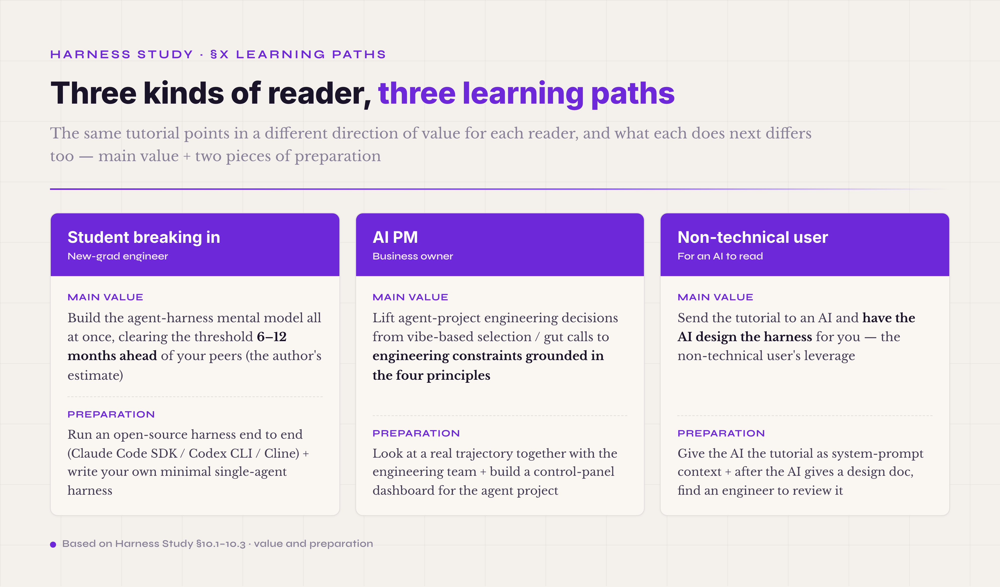

# §X · Learning paths — how three kinds of reader should use this tutorial

By this chapter you should have been through the whole tutorial. §I–§IV are the introduction. §V covers the 8 runtime mechanisms and the Safety control plane, and §VI the engineering patterns. §VII covers the Harness Lab, the outer workbench that improves a harness iteratively through evaluation, ablation, and tuning. §VIII covers the composability matrix, and §IX the four cybernetic principles (observability, controllability, stability, and closed-loop feedback). But the tutorial is worth different things to different readers. A student trying to break into the field, an AI product manager (PM), and an AI itself (the tutorial was also written with AI readers in mind; see 10.3) should each walk away with something different, and each has different work to do next. This chapter lays out three concrete paths.

*Figure 10.1 · Three kinds of reader, three learning paths*

This chapter doesn't give a timetable of the "week one, do this; week two, do that" kind. An agent harness is engineering infrastructure you build up gradually over several months to a year (a rule of thumb: 3–12 months). A timetable would mislead more than it helps, and how fast you move says nothing about whether you're doing it right. What this chapter gives instead is **the concrete engineering questions each kind of reader should answer next, after finishing the tutorial**. If you can answer them, your mental model is really in place. If you can't, go back and reread the matching chapter.

#### 10.1 · Path one · the student or new-grad engineer breaking in

For this reader, the tutorial's **main value** is building the mental model of agent harness engineering in one pass, without having to piece it together slowly from scattered blog posts and repeated trial and error. Demand for agent-engineering roles is growing fast in 2026, but most material still stays at the "install LangChain, run a demo" level, and material that helps you build a systematic understanding is scarce. After this tutorial you should cross the threshold of "knowing which mechanisms exist, and knowing why they're designed this way" sooner than engineers who started when you did (the author's estimate from experience is 6–12 months sooner).

There are three questions to answer next.

1. Take a concrete scenario, say "set up a slide-building agent for a salesperson." Can you draw all of it: the 8 runtime mechanisms, the Safety control plane, the sub-harness's five-dimension ontology, and the verifier used for acceptance? A sub-harness is a child harness called up on demand for a task, carrying domain rules. The five-dimension ontology borrows the word "ontology" to mean the sub-harness's domain-model schema, made of five parts: entities, attributes, relationships, state machine, and operations (see §8.5). For any part you can't draw, go back and read the matching chapter.
2. Can you explain the trade-offs Cursor, Claude Code, and Codex each made across the 8 runtime mechanisms, and why? For example, what Cursor's Tool Registry covers, what Claude Code's Prompt Assets cover, and what Codex's Safety covers. If you can't, see the industry comparison in §6.8.
3. Take an agent defect, say "the agent reports the task done, but the file wasn't actually changed." Can you tell which of the four cybernetic principles failed to hold? If not, see §9.2, the section that maps each kind of anti-pattern onto the four principles.

Before real engineering work, do two things to prepare.

**First, get an open-source agent harness running end to end.** Pick one of Anthropic's Claude Code SDK, OpenAI's Codex CLI, or Cline (open source, from Cline Bot) and run it. Read through the trajectory event stream it produces, then count how many of the 8 runtime mechanisms you can find in its code. This is the entry bar for agent engineering. An engineer who has never run production-grade harness code carries a mental model that sits far from real production.

**Second, write a minimal single-agent harness of your own.** Don't start from a high-level framework like LangChain. Call a model API directly (Claude, GPT, or DeepSeek all work), write a minimal Agent Loop, add 1–2 tools, and add one Hard Gate (a hard check that code can decide) as the verifier. Then run one task through it. Once you've written this minimal harness, you'll know which of the 8 mechanisms are "add it or it won't run" and which are "add it and it runs more stably." That split matches the P0, P1, and P2 priorities §V assigns to each mechanism: first get the smallest set that runs, then add the parts that make the system more stable.

The advice that holds across every stage is to combine three activities: hands-on engineering, close reading of the tutorial, and tracking industry material. The tutorial provides the mental model. Hands-on work lets you calibrate that model yourself. Tracking industry material keeps it current as the field changes. The three together beat any one alone. Reading only the tutorial tends toward over-abstraction, building only tends to lack method, and following only industry material tends to leave you chasing buzzwords with no system behind them.

#### 10.2 · Path two · the AI PM or business owner

For this reader, the tutorial's **main value** is raising the engineering decisions on an agent project from picking by feel and gut calls to engineering constraints grounded in the four principles. An AI PM doesn't need to write code. When aligning with the engineering team, though, an AI PM does need to judge whether a trade-off an engineer describes is sound, or cargo cult: copying the form without learning the reason. The gap in that judgment decides whether an agent project makes it into production and whether it keeps improving. After this tutorial, you shouldn't be led by the nose when you discuss technical decisions with engineers: verifier design, Non-Independent Reruns (AP01, see Appendix F), or fork-join topology (a main agent splits off several sub-agents that run in parallel, then merges their results; see §6.6). You should be able to check their proposals against the four principles and the anti-pattern mapping.

There are three questions to answer next.

1. Take an agent business requirement, say "a client wants a contract-review agent." Can you break out the five engineering decisions: how strong each of the 8 runtime mechanisms needs to be, the sub-harness's five-dimension ontology, how to design the verifier, how to set up the Safety control plane, and which deployment topology to choose? If you can't, go back to the priorities §V gives each mechanism and to the §VIII composability matrix.
2. Can you see the gap between an agent project's "actual progress" and its "reported progress"? Stage Inflation (AP18, see Appendix F), covered in §7.8, is the pitfall an AI PM is most likely to fall into: every mechanism is marked "production-ready" while not one line of code has actually been written. Can you require the engineering team to rate each mechanism on the L0–L5 maturity levels? This is the mechanism maturity scale proposed in Volume 2 (*Architecture & Engineering*). L1 means the project has the mechanism, and L2 means the trajectory shows events the mechanism produced; the higher the level, the closer the mechanism is to verified and production-ready. With this scale, a progress report stops being a subjective description and becomes a checklist you can verify item by item.
3. Take an agent investment decision, say "should we go multi-agent?" or "should we build a Harness Lab?" Can you weigh the return on investment with the criteria §6.6 and §7.9 give? If not, see those chapters.

Before a real project, do two things to prepare.

**First, go through a real trajectory with the engineering team.** Ask an engineer to export the full trajectory event stream of an agent running a task, and walk through it together. For each event, identify which of the 8 runtime mechanisms it belongs to and which Evidence Graph edge it corresponds to. The Evidence Graph is the set of 10 relation edge types defined in §8.4 (such as calls_tool, produces, and verifies), which describe who did what to whom while an agent runs. Once you've done this together, an AI PM and an engineer share a vocabulary for describing agent behavior, and later discussions of "what's going on with this defect" go much faster.

**Second, build a "control panel" (dashboard) for the agent project.** As §9.2 explained, a persistently high declared_vs_executed gap is a leading indicator that the feedback system is failing, and it can be computed directly from the existing Evidence Graph edges with no new instrumentation. A leading indicator is a signal that warns you before something goes wrong. This one measures the distance between the actions the agent claims to have completed and the actions the trajectory holds evidence for. Have the engineering team put this metric on a dashboard along with 4–5 other key metrics: task pass rate, the pass rate of the verifier's hard checks (Hard Gate), average turn count, context-overflow ratio, and the distribution of sub-agent nesting depth. The AI PM reads the dashboard, not the weekly report. With this panel, the agent project moves from "the engineer talks and the PM believes" to "the PM can see the state directly." That is the closed-loop feedback principle at work at the management level.

The advice across every stage is again to combine three things: share one vocabulary with the engineering team, refuse to over-promise, and treat the project as a long-term build. A shared vocabulary makes discussion efficient. Refusing to over-promise keeps the project sustainable. As §7.9 noted, a Harness Lab takes 6–12 months to stand up (a rule of thumb), so expectations of short-term return have to be calibrated to match. The long-term view changes the agent project's goal from "ship and deliver" to "keep improving." In the field's experience, it's not rare for an agent project's pass rate to slip back after a few months in operation, from causes such as reward hacking and context drift. Holding off that decline takes a continuous-improvement mechanism, which is the Harness Lab.

#### 10.3 · Path three · handing it to an AI to carry out · the leverage of the non-technical user

In this tutorial's design, **the readers also include the AI itself**. A non-technical user hands this tutorial to an AI and has the AI design the harness for them. That is a new way for non-technical users to gain leverage in the agent era, with a lower bar than "non-technical people learning to code" and a wider reach than "non-technical people writing prompts." Suppose an **AI reader** (Claude, GPT, DeepSeek, and others) that has read this tutorial receives a non-technical user's requirement: "I want an agent that reviews contracts for me." It should be able to produce an implementable agent harness design, working from the four principles, the 8 runtime mechanisms, the five-dimension ontology, and verifier design. Its answer shouldn't be "I suggest you use LangChain." It should be "you need these mechanisms, the five-dimension ontology looks like this, the three verifier layers are designed like this, and the Safety control plane needs these items turned on."

For the non-technical user, the delivery path has two steps.

**First, give the tutorial to the AI as context.** This step needs no technical skill. Hand the tutorial to the AI and tell it "use this tutorial's method to help me design an agent for scenario X," and the AI will produce a design under the four principles. The tutorial was written with AI readers specifically in mind: lists and tables are kept within 35% of the text, each mechanism gets a passage of more than 200 characters in the Chinese original, and every anti-pattern comes with a criterion for judging it. That way an AI taking the tutorial as context can extract structured rules from it.

**Second, once you have the AI's design document, find an engineer to review it.** The design document can't be executed as it stands. An engineer has to implement it in a concrete framework: the Claude Code SDK, the OpenAI Agents SDK, a harness written by hand in Rust, and so on. But the engineer's workload shrinks from "design plus implementation" to just "implementation," and the time saved is the leverage the non-technical user gains.

On this path, non-technical users tend to fall into two misconceptions.

**First, expecting the AI to deliver runnable code in one go.** At the current stage (2026), an AI is far more reliable at producing an agent harness design document than at producing runnable code. A design is structured reasoning, which is an AI's strength. Runnable code needs a great deal of implementation detail and framework-specific knowledge, and there an AI is prone to hallucinate. Having the AI produce the design and an engineer implement it carries less risk than having the AI write the code and an engineer review it.

**Second, not iterating.** The AI's first design is very likely imperfect. A non-technical user shouldn't expect the first draft to be entirely right. Treat it as a starting point and revise it with the AI over several rounds (3–5, from experience): adjust the sub-harness's five-dimension ontology, the verifier's strength, and the Safety control plane. Only after that iteration does the design converge to something usable. This way of iterating matches the three control-flow patterns in §9.6: feedforward, feedback, and iterate (the first two are borrowed from Böckeler; iterate is this book's addition). A non-technical user working with an AI is itself running a "feedback plus iterate" loop.

The advice across every stage is, once more, to combine three things: the non-technical user finds an engineer as a partner, gives the AI the tutorial as context, and keeps the sub-harness's five-dimension ontology maintained over time. The engineering partner means someone stands behind the implementation. The tutorial as context lets the design work be handed to the AI. Ongoing maintenance of the five-dimension ontology lets the sub-harness evolve along with the business. The core claim of this path is that the leverage non-technical users gain in the agent era doesn't replace engineers. It lightens the design burden engineers carry, so they can concentrate on implementation and operations. That is the concrete form of this tutorial's claim about leverage for non-technical users.

This "hand it to an AI to carry out" path also comes with a file you can give an agent to execute directly: the *Agent Harness Implementation Spec · the executable version for an agent* (Companion · Prompt), included in this volume. The Spec and the main text do different jobs. The main text covers which mechanisms exist and why they're designed this way. The Spec breaks implementation decisions into four phases: behavioral probing (which this book also calls "taking the model's pulse"), the generic runtime, scenario narrowing, and cost structure. Each phase carries a completion criterion for "how to verify it was done right." The agent works through the phases in order and doesn't start the next one until the current one meets its criterion. A non-technical user takes the main text as methodology context and the Spec as an execution checklist. Used together, the two are more likely to lead the agent to an implementable result than a single vague requirement would be.

#### 10.4 · The anti-pattern shared by all three readers

Whichever kind of reader you are, the trap you're most likely to fall into after the tutorial is Premature Optimization (AP17, see Appendix F). The 8 runtime mechanisms aren't all running yet, the three verifier layers aren't stable, and no trajectory data has built up, yet you reach for things that "sound advanced": tuning (Tune) in the Harness Lab, multi-agent fork-join, and A2A, the cross-vendor agent interoperability protocol. Every chapter of the tutorial gives the matching criteria, but readers tend to remember "what exists" and forget "when not to use it."

**The one criterion that applies throughout**: if what you're considering belongs to §VI engineering patterns, the §VII Harness Lab, or the §VIII composability matrix, first answer one question. "Of the §V 8 runtime mechanisms plus the Safety control plane, how many are already stable in my project?" If the answer is 6 or more, you can consider what the later chapters cover. If it's 5 or fewer, go back and make the basic mechanisms stable first, and don't chase the new (this dividing line is a rule of thumb). This order isn't "dull engineering rules." It is the closed-loop feedback principle made concrete: when an earlier layer is unstable, all the feedback data the next layer receives is noise.

AP17 is more than an engineering anti-pattern; it also bears on how you think. In a January 2026 essay, *Thinking Beyond the Tool — The Way of Composure in an Age of Technological Change*, the author wrote that in the AI era "anxiety often comes from 'wanting to learn everything and fearing you'll miss anything.'" Social media shares the astonishing results of new tools every day, which creates an illusion: "if I don't master this right now, I'll be left behind by the times." Carried into agent harness engineering, that anxiety is the cognitive root of AP17. The essay offers three responses:

1. Recognize what's worth learning. Not every new tool needs mastering right away; relevance to your current problem is the filter.
2. Accept "good enough" instead of chasing "perfect." "A solution that handles 80% of the problem may need only 20% of the learning cost," and perfectionism is a breeding ground for anxiety.
3. Allow yourself to "not know." Accept your limits calmly, and focus on your core needs and the directions you love.

Mapped onto agent harness engineering, the three work like this. The first means checking which of the 8 runtime mechanisms aren't stable yet. The second means building the first two verifier layers, Hard Gate and Outcome Judge (model review), and holding off on the process reward model (PRM); as the getting-started advice in §5.8.9 says, PRM, the third layer, is added only for multi-step reasoning tasks. The third means not chasing the field's latest papers or every new protocol (as §8.3 noted, don't bet on A2A for now). **AP17 and the ability to choose with composure are two names for the same thing.** At the engineering level it is an anti-pattern; at the level of how you think, it is choosing with composure. A reader needs both in place to avoid being pushed along by the wave of tools in the agent era.

After the whole tutorial, you should be clear that agent harness engineering isn't a passing technology trend. It is a new stage, in the LLM era, of the method laid out in Qian Xuesen's 1954 *Engineering Cybernetics*. Around the 1950s, fields such as aircraft, industrial control, and autopilots proved this method out; today agent engineering is working through it again. Each step, from Wiener's mathematical theory to Qian's engineering method to the feedforward and feedback control vocabulary Böckeler borrows, corresponds to a leap tied to the context of its time. You can think of yourself as an engineer of the agent era: not the engineer who "runs the fastest demo on the newest framework," but the engineer who "brings decades of accumulated methodology onto a new platform." Seen this way, every "why do it this way" in agent harness engineering has a grounding, and your career direction has long-term support.

The one understanding to carry away from the whole tutorial is this: an agent harness doesn't belong to any one framework, vendor, or era. It is the continuation of cybernetic methods in AI engineering, and this tutorial is the concrete form that continuation takes at the current stage (2026). The next stage (2027 and after) will certainly bring new mechanisms, new engineering patterns, and new protocols. But the four principles won't change, Qian Xuesen's 1954 engineering perspective won't change, and the inner structure of feedback systems won't change either. These unchanging parts are the foundation you can rely on for the long term.
