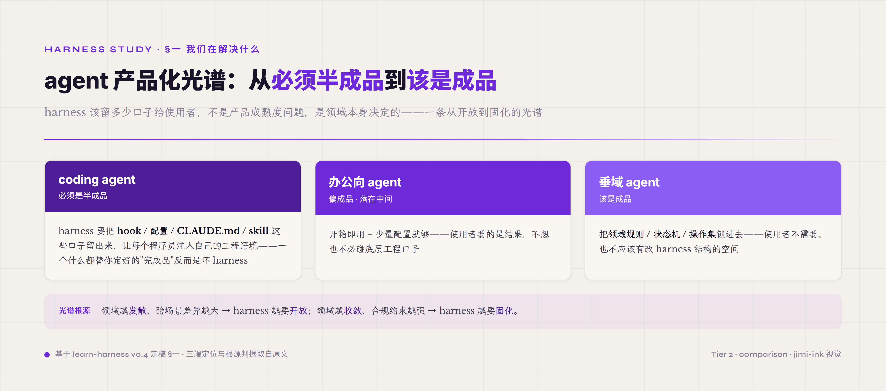

# 一、我们究竟在解决什么问题

大语言模型本质上是个"预测下一个 token"的函数。给它一段输入文本，它返回下一个 token 的概率分布，从中采样一个 token 拼回输入，再做一次预测——如此循环到模型自己生成结束符或达到输出长度上限。这整个过程在 GPU 上完成一次"前向计算"（forward pass）就结束。模型本身不持有运行态：权重在训练时已经固化下来，推理时没有任何变量能"记下"用户三分钟前说了什么；模型不打开文件，因为它没有文件 IO 的概念，输入只能从 prompt 文本里来；模型不发起网络请求，因为它的"行动"只能是生成下一个 token。

把模型当成一个**纯函数**（pure function）——这是理解 LLM 工程性质的起点。同样的输入理论上得到同样的概率分布；模型在两次调用之间不记忆任何东西，也无法对外界主动产生副作用。这件事本来不奇怪，所有数学函数都是这样——奇怪的是我们要让它干的活根本不是函数能干的活。

"帮我把这个 bug 修一下"——这件事里至少有：要读现有代码（文件 IO，读写都破坏函数纯性），要理解报错（多源信息整合），要试改一行看会不会更糟（产生中间状态），要跑测试看通不通过（外部命令的副作用与回反馈），要决定是 commit 还是继续改（基于历史的多步决策），要在改坏了的时候退回去（状态回滚）。这是一连串**有状态的、有副作用的、有错误处理的、需要持久化的**动作链。其中任何一步出错被忽略、任何一步漂移到不相关的方向、任何一次工具失败被当成"成功"传给下一步——整件事就完不成。

把这两件事并排放：模型能做的是"单步无副作用的概率预测"，任务要的是"多步有副作用的状态机驱动"。这两者之间隔着一整套工程系统——这套工程系统就是 **harness**。harness 不是一个更聪明的 prompt 能替代的东西，因为 harness 要处理的根本是 prompt 处理不了的层面：状态、副作用、错误、并发、超时、复盘。这跟当年"把关系数据库当 Redis 用"不是同一量级的问题——那种错配只是没用上数据库的高级特性，仍然在数据库该干的事情上；而 LLM 当 agent 用是要它跑出**不在它本职范围内的形态**，差的不是它没用上的特性，是它根本没有的特性。

### 三个权威定义的协奏

要把 harness 是什么这件事讲清楚，最好的办法不是给一个权威定义，而是看三个 2025-2026 在业界站住了的定义怎么递进。

**第一个 · Simon Willison（2025-09-18）**——这是迄今见过最简洁的 agent 定义：

> "An LLM agent runs tools in a loop to achieve a goal."（一个 LLM agent 在循环中调工具，以达成目标。）

短句里每个词都不是装饰。`runs tools` 说明动作面是工具调用，不是纯文本生成；`in a loop` 是关键——不是 `calls tools`（一次性调用），而是循环。循环这个词暗示了**多轮**：每轮模型看到上一轮的结果再决定下一步。循环暗示了**状态**：要知道循环是否该终止，得有某种"已经做了什么"的状态记忆。循环暗示了**终止条件**：得有判定"目标达成"的机制。Willison 这八个词的定义把"为什么 agent 需要工程脚手架"的种子全埋了——只是他没展开讲是什么样的脚手架。

**第二个 · Mitchell Hashimoto（2026-02-05 · *My AI Adoption Journey*）**——这是工程化更深一步的定义：

> "An LLM that can chat and invoke external behavior in a loop. At a bare minimum, the agent must have the ability to: read files, execute programs, and make HTTP requests."（一个能在循环中对话并调用外部行为的 LLM。最低限度，这个 agent 必须能：读文件、执行程序、发 HTTP 请求。）

Hashimoto 比 Willison 进了一层——他直接给出 agent 能力的**下限三件套**：read files / execute programs / make HTTP requests。为什么是这三件？这不是随便挑的，是 LLM 与外界交互的最小闭环：**read files** 是取信息（输入侧的副作用），**execute programs** 是产生副作用（输出侧的副作用），**HTTP requests** 是网络入口（动态信息获取加远程系统集成）。少一件 agent 都做不了像样的工程任务——把 read files 删了，agent 只能在 prompt 给的有限信息里推；把 execute programs 删了，agent 只能写代码不能跑代码；把 HTTP 删了，agent 隔绝于任何外部 API。Hashimoto 这个定义已经从"agent 是什么"过渡到"agent 至少能做什么"——它给出的不再是抽象形态，是工程可验收的能力清单。

**第三个 · Vivek Trivedy（2026-03-10 · *The Anatomy of an Agent Harness*，LangChain 博客）**——这是把概念拆开的定义：

> "Agent = Model + Harness. If you're not the model, you're the harness."（agent 等于模型加上 harness。除了模型那部分，剩下都是 harness。）

并给了 harness 本身的最简定义：

> "A harness is every piece of code, configuration, and execution logic that isn't the model itself."（harness 是一切不属于模型本身的代码、配置和执行逻辑。）

Trivedy 这两句的工程含义非常硬。第一句是**分解公式**——把 agent 这个复合对象一刀切成两部分：模型（model）和模型外的一切（harness）。第二句是**排除式定义**（exclusion-based definition）——不告诉你 harness 里有什么，而是告诉你"除了模型，其他全是"。排除式定义在工程上比包含式定义更准，因为它不留模糊地带：任何代码、任何配置、任何执行逻辑，只要不在模型权重里，都是 harness 的责任。这种二分法的力量在于它把责任边界钉死了——当一个 agent 系统出问题，你可以立刻问"这是模型的问题还是 harness 的问题"，而这个问题的边界由 Trivedy 这条排除式定义钉好了。

把三个定义放一起看会发现一种**递进**：Willison 给抽象形态（循环 + 目标），Hashimoto 给能力下限（读文件 / 执行程序 / 发 HTTP 三件套），Trivedy 给分解公式（agent = model + harness）。这个递进不是巧合，是 2025 末到 2026 初业界对 agent 工程认知收敛的真实路径——从"它是什么"到"它至少能做什么"到"它怎么拆"。一门工程实践只有走完这三步，工程师才能开始系统讨论"怎么做"。

把 agent 拆开看，**模型**是被外部调度的内核能力（推理、生成、决策的概率性引擎），**harness** 是这个能力外侧的所有工程基础——执行环境、工具、状态、约束、反馈。模型是核心，harness 是周围一整套让核心能干活的工程层。

### 一个不太恰当但够用的比方：CPU + 操作系统

理解 model 跟 harness 的关系，最直接的入门类比是 CPU 跟操作系统。

CPU 本身是个执行指令的硅片器件。给它一条机器指令，它做一次算术运算或一次内存访问，然后等下一条指令。CPU 本身不知道什么是"文件"——它只懂内存地址；它不知道什么是"进程"——它只懂寄存器和指令指针；它不知道什么是"网络"——它只懂电信号。但你日常用的电脑不是裸 CPU——是 CPU 加上操作系统。操作系统是 CPU 上面包的一整层工程：进程调度（决定哪个程序什么时候用 CPU）、内存管理（让程序看到虚拟地址而不是物理地址）、文件系统（把硬盘块抽象成文件目录）、网络协议栈（把 TCP/IP 包封装解封装）、设备驱动（让程序通过统一 API 而不是直接戳硬件）。所有这些 CPU 本身不会做的事，操作系统都干了。CPU 决定**单条指令多快**，OS 决定**整台机器能干成什么样的事**。

LLM 跟 harness 的关系跟这件事是一回事。LLM 决定单步预测多准、单次生成多有信息含量；harness 决定整个 agent 系统能不能可靠地完成多步任务、能不能从失败里恢复、能不能在 100 轮后还在做用户原来要的事。**同一颗 LLM 放在不同 harness 里，agent 能干成什么样差距巨大**——Meta-Harness[^meta-harness-2026] 最直接的实测是：固定 LLM 不动、只改外面那层 harness 代码，同一 benchmark 上能拉出 6 倍性能差，并能在自动搜索后比手工调到的 SOTA 再多挤 7.7 个百分点、同时省 4 倍 context token。反过来固定 harness 换模型也有提升——Anthropic 2024-10 报告同一套极简 agent scaffold（Bash 加 Edit 两个通用工具）下 Claude 3 Opus 22% / Claude 3.5 Sonnet (old) 33% / (new) 49%（SWE-bench Verified）。两个方向合起来说明：模型和 harness 各是一条可量化的贡献线——而 harness 这条长期被低估，它不是修辞，是能被实验测量的工程对象。

这个比方的**边界**在哪里？两处不同必须讲清，否则类比会引人走偏。

**第一处不同 · 确定性 vs 概率性配合**。OS 跟 CPU 是确定性配合。CPU 拿到一条 `MOV` 指令永远做"加载寄存器"这件事，永远不会"瞎跑"成 `ADD` 指令，也不会"幻觉"出一个不存在的内存地址。OS 调度 CPU 时心里有数——给什么指令做什么事，结果可预测。但 harness 跟 LLM 是**概率性配合**。同一份 prompt 跑两次，LLM 可能给两个不同结果；模型可能在每一步瞎说一个不存在的工具名字、可能在本来应该用 A 工具的场景里选了 B、可能"忘了"三轮前自己已经做过的事。OS 写出来是给确定性器件用的，harness 写出来是给概率性器件用的——这一字之差，让 harness 的工程难度比 OS 高出一整个维度。

**第二处不同 · 应用层确定 vs 应用层概率**。OS 之上的应用层是确定性的——程序员写的代码就是它跑出来的样子，没有"应用程序自己每一步都改自己代码"这回事。但 harness 之上的"应用层"——也就是模型每轮的推理输出——是概率性的，**模型自己每一步都可能改变下一步的方向**。同一个 agent，跑同一个任务，在第 8 步可能改成读文件 A，下一次跑可能改成读文件 B；这件事在 OS 上几乎不存在，但在 harness 上是天天发生的常态。

这两处不同导致 harness 比 OS 多了一类基础职能：**防错**。OS 不需要假设 CPU 会突然抽风给错答案，但 harness 必须假设 LLM 每一步都可能犯错。这就是为什么 harness 的 **8 件 runtime 机制加 1 件 Safety 控制面** 里，**verifier**（验证器，防模型输出错的）和 **tool policy**（工具策略，防工具调用错的）这两件是 P0 必备——一件在输出侧拦截"假完成"（模型说做完了但实际没做对），一件在输入侧拦截"乱调用"（模型想调一个不该调的工具或带不该带的参数）。这两件机制在 OS 设计里几乎找不到对应物，是 LLM 这种概率性核心被工程化的标志——读者先在概念地图上把它们的位置标好：verifier 是输出闸门，tool policy 是输入闸门。

最后还有一层更根本的不同，藏在这个类比的天花板里。CPU 永远是被动器件——给指令才算，算完就等下一条。但 harness 这层工程越做越厚，真正在支撑的是一个不那么被动的东西：一个有自己任务目标的**认知主体**——它自己挑下一步调哪个工具，自己判断任务做到什么程度算够，撞了错自己决定重试还是换条路。这个图景在 2026 还远没完全达到，LLM 的自主性仍然脆弱、仍然要靠 harness 处处兜底，所以本书大部分篇幅仍用"器件 + 工程层"这套语言来讲，够用也不夸大。但读者心里要留一根标尺：CPU 类比是此刻趁手的脚手架，把 LLM 当成能自主干预现实的认知体，才是这门工程指向的方向——harness 之所以要管控制流、要留 trajectory、要能在 agent 跑偏时凭它把消息和产物回退到正确位置、要判进度、要拦危险动作，归根到底都是在为"模型从被调用的函数长成能自主行动的主体"这条路兜底。

这层兜底工程该做多厚、留多少口子给人改，并不是所有 agent 都一样——它跟 agent 服务的领域强相关，可以排成一条光谱。

**一端是 coding agent，它的 harness 必须是个半成品**。每个程序员的项目架构、代码规范、工具链、连审美都不一样，没有哪套预设能替所有人适配好；好的 coding harness 恰恰要把 hook、配置、CLAUDE.md、skill 这些口子留出来，让每个程序员把自己的工程语境注入进去。一个什么都替你定好、不留适配空间的"完成品" coding agent，反而是个坏 harness——它把本该由程序员填的那部分锁死了。**另一端是垂域 agent，它该是个成品**。医疗、法律、民航某条具体流程，领域本体固定、合规边界硬、用户既不该也不能随意改流程，这时 harness 要把领域规则、状态机、操作集都锁进去（后面副 harness 那章讲的 5 维度本体正是干这件事），留太多口子反而是风险。**办公向 agent 落在中间、偏成品**——写邮件、排日程、做表格这类场景比写代码收敛得多，开箱即用加少量配置就够。这条光谱的根源不在产品成熟度，而在领域本身：领域越发散、跨场景差异越大（coding 是极端），harness 越要开放、把适配权交出去；领域越收敛、合规约束越强（垂域是极端），harness 越要固化、把适配权收回来。判断自己要做的 agent 该做成什么样，先问这个领域落在光谱的哪一端。

---

## 引用脚注

[^meta-harness-2026]: Meta-Harness: End-to-End Optimization of Model Harnesses · arxiv 2603.28052 · Stanford + MIT + KRAFTON · 2026
