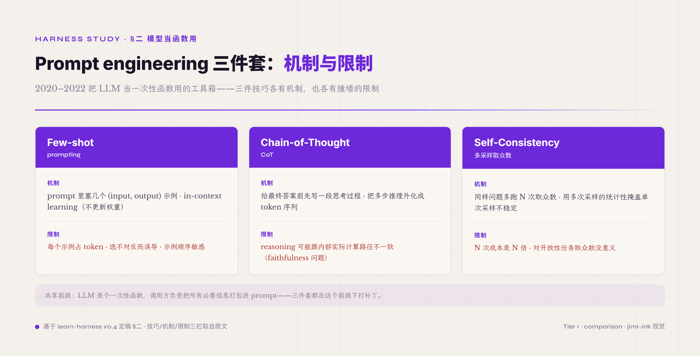

# 二、前世：模型当函数用的时代（2020–2022）

> **本节首次出现的术语** —— **trajectory**（agent 跑一次任务时每一轮动作、决策、结果、状态变化的完整事件流记录 · 通常是 JSONL 或类似格式的物理文件 · 字段定义稳定、可 replay、可 diff · 是 harness 跟早期 framework 最大的工程差别之一）。**ablation**（消融实验 · "保持其他配置不变只改一件机制看任务通过率怎么变" · 用来量化每件 harness 机制的实际贡献 · 没有 trajectory 就做不了 ablation）。**replayability**（可重放性 · 能精确按原样跑一次过去发生过的某次 run · 是 harness 跟"跑完就丢的脚本"的关键差别）。

2020 年 6 月，OpenAI 发布 GPT-3，并给出第一个公开 API。这个 API 的形态非常简洁：`completion(prompt) → text`。给一段文本输入，返回一段文本输出。整个签名没有 "messages"、没有 "tools"、没有 "session"、没有 "actions"。从工程接口的角度看，调用 GPT-3 跟调用一个翻译 API、一个分类 API、或者一个生成头像图片的 API 没有本质区别。

这个**接口形态决定了它怎么被用**。完整的工程语义被压在两个参数和一个返回值上——输入是 prompt，输出是 text，过程没有结构化中间产物。模型在内部怎么"思考"用户看不到（思考全藏在 attention 层和 weights 里）；模型可能要调什么"工具"也没法表达（接口里根本没有"工具"这个概念，function calling 是 2023-06 才推出的）；模型一次失败和成功的区分也没法明确表达（API 返回的就是 text，错的对的全是文本，要靠下游解析）。整个接口的设计哲学是把 LLM 当成一个比翻译 API 稍复杂的纯文本函数。

这一波的工程实践就建立在这个心智模型上。所谓 **prompt engineering**，本质是研究"怎么把输入写得让这个函数输出更准"——既然接口只有 prompt 一个入口，那就把所有能塞的信息都塞到 prompt 里。这一时期诞生了三件后来被无数次复用的技巧。

*图 2.1 · Prompt engineering 三件套的机制与限制*

**Few-shot prompting**[^gpt3-few-shot-2020]——在 prompt 里塞几个 (input, output) 示例，让模型从示例里"学到"任务形态再处理真实输入。机制是 **in-context learning**（ICL）：transformer 不更新权重，但能在 attention 计算中"模仿"上下文里给定的输入输出模式。这件事本身是 LLM 的一种 emergent 能力，被工程化利用之后变成 prompt engineering 的支柱。限制也清楚：每个示例占 token、示例选不对反而误导模型、示例顺序敏感（同样几个示例换个顺序输出可能完全不同）。

**Chain-of-thought**（CoT）[^cot-wei-2022]——让模型在给最终答案前先写一段"思考过程"。机制是把多步推理外化成 token 序列，让模型在生成 reasoning step 时把中间状态显式写出来。这跟后来 ReAct 是同源思想——都是"把模型推理过程从黑盒里挤出来"。CoT 的限制后来被系统研究：模型写出来的 reasoning 可能跟它内部实际计算路径不一致（faithfulness 问题），也就是说 CoT 可能是"事后找借口"而不是"真实推理"。但在 2022 那个时点，CoT 让一批本来不可解的数学题、逻辑题突然能解了，这件事本身震动很大。

**Self-consistency**[^self-consistency-wang-2022]——同样问题多跑 N 次，取答案的众数。机制是把单次概率采样的不稳定性用多次采样的统计性掩盖掉。这是 prompt 时代第一次明确承认 LLM 输出是概率性的——既然单次不稳，就跑多次取共识。但代价直接：N 次成本是 N 倍，对开放性任务取众数也没意义（不能对"写一篇文章"取众数）。

这三件加起来构成了 2020-2022 prompt engineering 的工具箱。它们都共享一个前提：**LLM 是个一次性函数，调用方负责把所有必要信息打包成 prompt**。

### 2022-10 · 两件分水岭事件

2022 年 10 月有两件事必须记住。这个时间点不是巧合——GPT-3 已经面世两年半，业界把"prompt engineering 三件套"用到了能力上限，发现"模型当函数用"的范式开始撞墙：复杂任务无法在单次 completion 里完成，需要多次调用串起来，但没有现成的工程框架来做这件事。两件事是对这堵墙的两种回应——一种**工程化封装**，一种**范式化升级**。

**第一件 · LangChain 出现**。2022-10，Harrison Chase（当时在 Robust Intelligence 工作）把"模型 + prompt 模板 + 工具调用 + 链式编排"打包成一个开源库。这是行业第一次系统性地承认"光调一次模型不够，要把多次调用串起来"，并把这个想法工业化为可被其他人复用的库。LangChain 早期的核心抽象是 **Chain**——把多次模型调用按 DAG（有向无环图）的方式连起来。需要注意，Chain 是**有向无环**的——跑完一遍就结束，没有循环。这跟后来 agent 真正需要的"基于反馈的循环 + 状态保持"还差一层。但即使如此，LangChain 是第一个工程化封装，它让多次 LLM 调用这件事从"每个项目各搞一套土法拼凑"变成"有一套大家都用的抽象"。

**第二件 · ReAct 论文发表**。Yao 等人 2022-10-06 提交到 arxiv[^react-yao-2022]，第一次正式提出让模型按 `Thought → Action → Observation → Thought → ...` 循环往下走的范式：

> "reasoning traces help the model induce, track, and update action plans as well as handle exceptions, while actions allow it to interface with external sources"

这段话的工程含义是：模型不只是输出最终答案，它要外化 reasoning（思考轨迹）、它要发起 action（动作）、它要看 observation（反馈）。比起 CoT，ReAct 多了"动作和反馈"两件事——这就把 LLM 从"思考机器"升级成了"会跟外界交互的执行体"。这是第一次明确写出"模型不仅要会答，还要会用工具、看反馈、改决定"。

LangChain 和 ReAct 同时在 2022-10 出现不是巧合是必然。两年的 prompt engineering 实践积累到了那个时点，业界已经感觉到"模型当函数用"的范式不够——无论是工程封装侧（LangChain）还是范式定义侧（ReAct），都在尝试跳出来。但这两件事本身**还没完全跳出来**——LangChain 是 DAG 不是 loop，ReAct 是范式但当时还没有配套的工程基础设施。真正的跳出要再等一年半，等业界被 AutoGPT 撞过头之后，才在反思里把 harness 这个概念磨出来。

### 为什么这一时期仍然是"模型当函数用"

这一时期的所有尝试，包括早期 LangChain、最早的 ReAct 实现、所有 prompt engineering 探索，骨子里仍然是"把模型当函数"。三个证据可以看清。

**第一 · 状态都在 Python 进程的内存里**。Chain 跑到一半 Python 进程挂了，所有状态全丢。没有可重放（replayability），没有跨 session 持久化（durability），没有显式的 trajectory 文件。这意味着复盘做不了——你不能事后看"它当时为什么这么走"；ablation 做不了——你不能精确重放某一次 run 比较两个配置；regression 做不了——你不能拿同一个 trajectory 比对两个 agent 版本的差异。状态藏在进程内存就等于状态不存在——OS 进程被 kill 一切清零。这跟 agent 需要的"持久化状态机"差着一个数据库的距离。

**第二 · 工具调用靠在 prompt 里写格式让模型按格式输出，再用正则去解析**。这一时期典型的 tool calling 长这样：在 system prompt 里告诉模型"你可以调用 `search(query)` 或 `calculate(expr)`，输出格式是 `ACTION: 工具名(参数)`"，然后模型按格式生成一行 text，外面用 regex 解析这一行抠出工具名和参数。这件事的工程缺陷一眼能看到：模型可能漏字段、可能多字段、可能改格式（昨天用 `ACTION:` 今天用 `Action:`）、可能在解释性文本里插入看似 action 的字符串误导 parser。没有 schema 校验，没有类型保证，没有结构化错误反馈。OpenAI 2023-06-13 推出 function calling 才把这件事变成"结构化契约"——但那是 8 个月后的事了。

**第三 · 失败处理靠 Python 的 try/except**。工具调用 raise exception，上层 catch 然后决定 retry 还是 abort。这种处理方式把"失败"当成"异常事件"——但在 agent 里失败是**常态**：工具会超时、API 会限流、模型会幻觉、网络会断线。把失败当异常处理就没法系统化做 retry policy、fallback strategy、graceful degradation。生产级 harness 需要的是"失败是核心运行态"——失败要进 trajectory、要触发 verifier 判定、要有分类（permanent vs transient）、要有回退路径。

这三个证据加起来说明：2020-2022 的工程实践骨子里把 LLM 当成"输入 prompt → 输出 text 的纯函数"，只不过有时候这个函数要被串成 chain、有时候要被加上 thought-action-observation 的循环装饰。但底层心智模型没有变——状态、契约、失败这三件 harness 后来必须正面处理的事，在这个时期都被绕过去了。

### 一个类比：把关系数据库当 Redis 用

这个时期的特点可以用一个类比表达：你买了一个能跑 ACID 事务、能建 B-tree 索引、能做行级锁、能做并发控制的关系数据库，但你只用它的 `GET`/`SET`——把它当 Redis 用。事务你不开（不需要原子性保证），索引你不建（直接全表扫描也能跑），并发控制你不用（应用层自己拼）。系统跑起来了，能用，但你完全没用上数据库的真正能力。

模型当函数用，跟这件事是同构的——但有一处比类比**更糟糕**。把数据库当 Redis 用是"低估了能力但仍能工作"——你做的事情仍然在数据库本职范围内，只是没用上高级特性。模型当函数用不是低估能力的问题，是**忽略了一个本质属性：不稳定性**。数据库的 GET/SET 是确定性的，每次返回同样答案；LLM 的 completion 是概率性的，每次可能返回不同答案。当你用 Chain 把多次 completion 串起来，不稳定性会在每个节点上累积——假设每个节点 95% 准确率，连起来 10 个节点准确率约 0.95^10 = 60%；连起来 20 个节点约 36%；连起来 50 个节点约 8%。这不是数学游戏，是 2023 年 AutoGPT 浪潮要撞上的硬墙。

到 2022 年底，业界还没有意识到这堵墙有多硬。当 GPT-4 在 2023-03-14 发布、各种"自主 agent"项目开始尝试用 GPT-4 跑长任务时，这堵墙才以非常戏剧化的方式撞上去。撞墙的代表项目就是 AutoGPT，2023-03-30 推上 GitHub，把"模型当函数用"这套范式推到极致——也把这套范式的极限暴露了出来。

---

## 引用脚注

[^gpt3-few-shot-2020]: Few-shot prompting / in-context learning · GPT-3 paper · Brown et al. · 2020
[^cot-wei-2022]: Chain-of-Thought Prompting · Wei et al. · 2022
[^self-consistency-wang-2022]: Self-Consistency · Wang et al. · 2022
[^react-yao-2022]: ReAct: Synergizing Reasoning and Acting in Language Models · arxiv 2210.03629 · Yao, Zhao, Yu et al.（Princeton）· ICLR 2023
