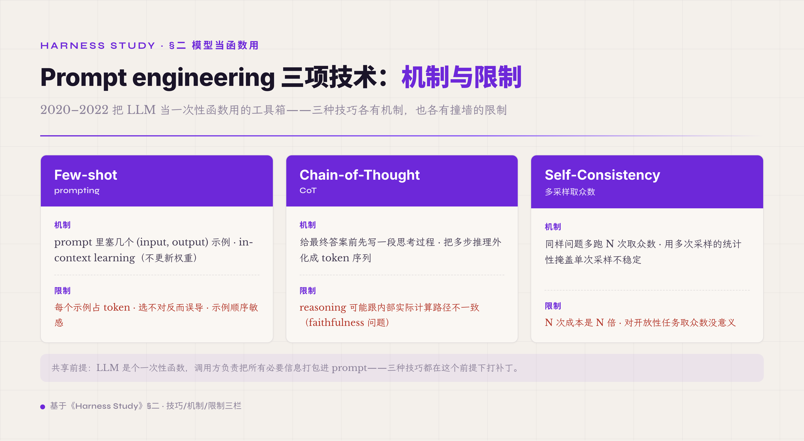

# 二、前世：模型当函数用的时代（2020–2022）

> **本节首次出现的术语**
>
> - **trajectory**（轨迹）：agent 跑一次任务时，每一轮的动作、决策、结果、状态变化的完整事件记录。通常是 JSONL 或类似格式的文件，字段定义稳定，可以回放，可以逐项比对（diff）。这是 harness 跟早期开发框架最大的工程差别之一。
> - **ablation**（消融实验）：保持其他配置不变，只关掉或改动一个机制，看任务通过率怎么变，用来量化每个 harness 机制的实际贡献。没有 trajectory 也能做消融，但只能看到分数变了，看不到为什么变。
> - **replay**（回放）与 **replayability**（可回放性）：把一次 run 录下的事件（模型的输入输出、工具结果）按原样重新走一遍，用来复盘和比对。回放的是已录制的事件，不是重新调用模型再跑一次。能不能回放，是 harness 跟"跑完就丢的脚本"的关键差别。

2020 年 6 月 11 日，OpenAI 以私测形式开放了 GPT-3 的 API（需要排队申请；2021 年 11 月 18 日才取消候补名单，面向所有开发者开放）。这个 API 的形态非常简洁：`completion(prompt) → text`。给一段文本输入，返回一段文本输出。整个签名没有 "messages"、没有 "tools"、没有 "session"、没有 "actions"。从工程接口的角度看，调用 GPT-3 跟调用一个翻译 API、一个分类 API、或者一个生成头像图片的 API 没有本质区别。

这个**接口形态决定了它怎么被用**。完整的工程语义被压在一个参数和一个返回值上：输入是 prompt，输出是 text，过程没有结构化中间产物。模型在内部怎么"思考"用户看不到（思考全藏在 attention 层和 weights 里）；模型可能要调什么"工具"也没法表达（接口里根本没有"工具"这个概念，function calling 是 2023-06 才推出的）；模型一次失败和成功的区分也没法明确表达（API 返回的就是 text，错的对的全是文本，要靠下游解析）。整个接口的设计哲学是把 LLM 当成一个比翻译 API 稍复杂的纯文本函数。

这一波的工程实践就建立在这个心智模型上。所谓**提示词工程（prompt engineering）**，本质是研究"怎么把输入写得让这个函数输出更准"：既然接口只有 prompt 一个入口，那就把所有能塞的信息都塞到 prompt 里。这一时期诞生了三种后来被无数次复用的技巧。

*图 2.1 · Prompt engineering 三件套的机制与限制*

**少样本提示（few-shot prompting）**[^gpt3-few-shot-2020]：在 prompt 里塞几个 (input, output) 示例，让模型从示例里"学到"任务形态再处理真实输入。机制是**上下文学习**（in-context learning，ICL）：transformer 不更新权重，但能在 attention 计算中"模仿"上下文里给定的输入输出模式。这件事本身是 LLM 的一种涌现（emergent）能力，被工程化利用之后变成 prompt engineering 的支柱。限制也清楚：每个示例占 token、示例选不对反而误导模型、示例顺序敏感（同样几个示例换个顺序输出可能完全不同）。

**思维链（chain-of-thought，CoT）**[^cot-wei-2022]：让模型在给最终答案前先写一段"思考过程"。机制是把多步推理外化成 token 序列，让模型在生成推理步骤时把中间状态显式写出来。这跟后来的 ReAct 是同源思想，都是"把模型推理过程从黑盒里外化出来"。CoT 的限制后来被系统研究：模型写出来的推理过程可能跟它内部实际计算路径不一致（忠实性问题，faithfulness），也就是说 CoT 可能是"事后找借口"而不是"真实推理"。但在 2022 那个时点，CoT 让一批本来不可解的数学题、逻辑题突然能解了，这件事本身影响很大。

**自洽性采样（self-consistency）**[^self-consistency-wang-2022]：同样问题多跑 N 次，取答案的众数。机制是把单次概率采样的不稳定性用多次采样的统计性掩盖掉。这是 prompt 时代第一次明确承认 LLM 输出是概率性的：既然单次不稳，就跑多次取共识。但代价直接：N 次成本是 N 倍，对开放性任务取众数也没意义（不能对"写一篇文章"取众数）。

这三种技巧加起来构成了 2020-2022 prompt engineering 的工具箱。它们都共享一个前提：**LLM 是个一次性函数，调用方负责把所有必要信息打包成 prompt**。

### 2022-10 · 两件分水岭事件

2022 年 10 月有两件事必须记住。这个时间点不是巧合。GPT-3 的 API 已经开放两年多，业界把提示词工程的这三种技巧用到了能力上限，发现"模型当函数用"的范式开始撞墙：复杂任务无法在单次 completion 里完成，需要多次调用串起来，但没有现成的工程框架来做这件事。两件事是对这堵墙的两种回应：一种**工程化封装**，一种**范式化升级**。

**第一件事：LangChain 出现**。2022 年 10 月 25 日，Harrison Chase（当时在 Robust Intelligence 工作）发布了 LangChain 0.0.1，把"模型 + prompt 模板 + 工具调用 + 链式编排"打包成一个开源库。它是最早流行起来的开源封装之一，把"光调一次模型不够，要把多次调用串起来"这个想法做成了可被其他人复用的库。LangChain 早期的核心抽象是 **Chain**：把多次模型调用按 DAG（有向无环图）的方式连起来。需要注意，Chain 是**有向无环**的：跑完一遍就结束，没有循环。这跟后来 agent 真正需要的"基于反馈的循环 + 状态保持"还差一层。但即使如此，LangChain 作为最早流行起来的工程化封装之一，让多次 LLM 调用这件事从"每个项目各写一套自己的实现"变成"有一套大家都用的抽象"。

**第二件事：ReAct 论文发表**。Yao 等人（Princeton 与 Google Research 的 Brain 团队）2022-10-06 把论文提交到 arXiv[^react-yao-2022]，提出让模型按 `Thought → Action → Observation → Thought → ...` 循环往下走。让模型调用外部工具、把多次调用串起来，在它之前已有先行工作：WebGPT（2021-12）、SayCan（2022-04）、MRKL（2022-05）、AI Chains（CHI 2022）。ReAct 是这一范式最有影响的表述。论文里的关键一句是：

> "reasoning traces help the model induce, track, and update action plans as well as handle exceptions, while actions allow it to interface with external sources"
>
> （推理轨迹帮助模型归纳、跟踪和更新行动计划，并处理异常；行动则让模型能与外部信息源交互。）

这段话的工程含义是：模型不只是输出最终答案，它要外化推理（reasoning，思考轨迹），要发起动作（action），要看反馈（observation）。比起 CoT，ReAct 多了"动作和反馈"两样东西，这就把 LLM 从"思考机器"升级成了"会跟外界交互的执行体"。ReAct 把"模型不仅要会答，还要会用工具、看反馈、改决定"写成了一个清晰、可复用的范式，这是它影响最大的地方。

LangChain 和 ReAct 在 2022-10 同时出现，并非偶然。两年的 prompt engineering 实践积累到了那个时点，业界已经感觉到"模型当函数用"的范式不够，无论是工程封装侧（LangChain）还是范式定义侧（ReAct），都在尝试跳出来。但这两件事本身**还没完全跳出来**：LangChain 的核心抽象是 DAG 而不是循环（它很快就补了 AgentExecutor 这层 ReAct 的工程封装，循环是有了，但 trajectory、policy、verifier 这些机制一个都没有，后两者见第三章开头的术语说明），ReAct 是范式但当时还没有配套的工程基础设施。真正的跳出要再等一年半，等业界被 AutoGPT 撞过头之后，才在反思里把 harness 这个概念提炼出来。

### 为什么这一时期仍然是"模型当函数用"

这一时期的所有尝试，包括早期 LangChain、最早的 ReAct 实现、所有 prompt engineering 探索，骨子里仍然是"把模型当函数"。三个证据可以看清。

**第一，状态都在 Python 进程的内存里**。Chain 跑到一半 Python 进程挂了，所有状态全丢。没有可回放（replayability），没有跨 session 持久化（durability），没有显式的 trajectory 文件。这意味着复盘做不了：你不能事后看"它当时为什么这么走"。对比实验也只能做一半：换一个配置重跑，你只能看到分数变了，看不到为什么变，因为没有两次 run 的事件记录可以逐步比对。回归比对（regression）也做不了：你不能拿同一份 trajectory 比对两个 agent 版本的差异。状态藏在进程内存里，就等于状态不存在：进程被 kill，一切清零。这跟 agent 需要的"持久化状态机"差着一个数据库的距离。

**第二，工具调用靠在 prompt 里写格式让模型按格式输出，再用正则去解析**。这一时期典型的 tool calling 长这样：在 system prompt 里告诉模型"你可以调用 `search(query)` 或 `calculate(expr)`，输出格式是 `ACTION: 工具名(参数)`"，然后模型按格式生成一行 text，外面用 regex 解析这一行抠出工具名和参数。这件事的工程缺陷一眼能看到：模型可能漏字段、可能多字段、可能改格式（昨天用 `ACTION:` 今天用 `Action:`）、可能在解释性文本里插入看似 action 的字符串误导 parser。没有 schema 校验，没有类型保证，没有结构化错误反馈。OpenAI 2023-06-13 推出 function calling 才把这件事变成"结构化契约"，但那已经是 8 个月后的事了。

**第三，失败处理靠 Python 的 try/except**。工具调用 raise exception，上层 catch 然后决定 retry 还是 abort。这种处理方式把"失败"当成"异常事件"，但在 agent 里失败是**常态**：工具会超时、API 会限流、模型会幻觉、网络会断线。把失败当异常处理就没法系统化做 retry policy、fallback strategy、graceful degradation。生产级 harness 需要的是"失败是核心运行态"：失败要进 trajectory，要触发 verifier 判定，要分类（永久性还是临时性，permanent / transient），要有回退路径。

这三个证据加起来说明：2020-2022 的工程实践骨子里把 LLM 当成"输入 prompt → 输出 text 的纯函数"，只不过有时候这个函数要被串成 chain、有时候要被加上 thought-action-observation 的循环装饰。但底层心智模型没有变：状态、契约、失败这三样 harness 后来必须正面处理的事，在这个时期都被绕过去了。

### 一个类比：把关系数据库当 Redis 用

这个时期的特点可以用一个类比表达：你买了一个能跑 ACID 事务、能建 B-tree 索引、能做行级锁、能做并发控制的关系数据库，但你只用它的 `GET`/`SET`，把它当 Redis 用。事务你不开（不需要原子性保证），索引你不建（直接全表扫描也能跑），并发控制你不用（应用层自己拼）。系统跑起来了，能用，但你完全没用上数据库的真正能力。

模型当函数用，跟这件事是一个道理，但有一处比类比**更糟糕**。把数据库当 Redis 用是"低估了能力但仍能工作"：你做的事情仍然在数据库本职范围内，只是没用上高级特性。模型当函数用不是低估能力的问题，而是**忽略了一个本质属性：不稳定性**。数据库的 GET/SET 是确定性的，每次返回同样答案；LLM 的 completion 是概率性的，每次可能返回不同答案。当你用 Chain 把多次 completion 串起来，不稳定性会在每个节点上累积。做一个粗略估算：假设每个节点有 95% 的概率做对，各节点出错互相独立，而且任何一步出错整条链就算失败，那么 10 个节点连起来成功率约 0.95^10 ≈ 60%，20 个约 36%，50 个约 8%。真实情况不完全是这样，有的错误后面能补救，有的错误会连带出更多错误；但这个估算说明了方向。harness 要做的正是截断这条链：每一步都有检查，出了错能发现、能修正，一步错不再等于全盘错。这不是数学游戏，而是 2023 年 AutoGPT 浪潮要撞上的硬墙。

到 2022 年底，业界还没有意识到这堵墙有多硬。当 GPT-4 在 2023-03-14 发布、各种"自主 agent"项目开始尝试用 GPT-4 跑长任务时，这堵墙才被真正撞上。撞墙的代表项目就是 AutoGPT，2023-03-30 推上 GitHub，把"模型当函数用"这套范式推到极致，也把这套范式的极限暴露了出来。

---

## 引用脚注

[^gpt3-few-shot-2020]: Few-shot prompting / in-context learning · GPT-3 paper · Brown et al. · 2020
[^cot-wei-2022]: Chain-of-Thought Prompting · Wei et al. · 2022
[^self-consistency-wang-2022]: Self-Consistency · Wang et al. · 2022
[^react-yao-2022]: ReAct: Synergizing Reasoning and Acting in Language Models · arxiv 2210.03629 · Yao, Zhao, Yu et al.（Princeton、Google Research Brain）· ICLR 2023
