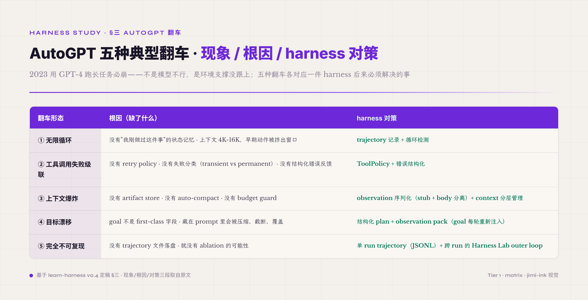
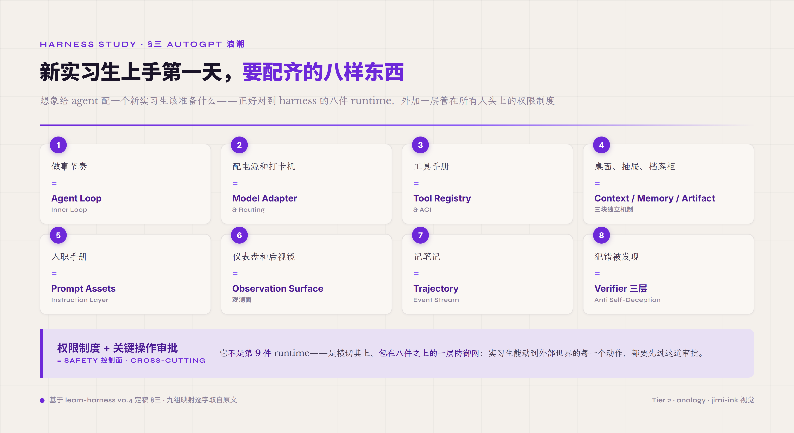

# 三、第一次大规模试错：AutoGPT 浪潮和它的翻车（2023）

> **本节首次出现的术语** —— **schema**（数据结构的形式化定义 · 约定字段名、类型、必填性、嵌套结构 · 既能给人读、也能给程序自动 validate · JSON Schema 是网上最常见的 schema 表达形式 · agent 工程里 schema 是工具契约、observation 格式、completion 返回值的统一通用语言）。**verifier**（判定 agent 一次任务输出对错的客观判定器 · 是 agent 工程里最难也最重要的一件 · SWE-bench 这种能跑测试的环境里 verifier 是单元测试 · 合同审核这种开放任务里 verifier 设计本身就是难题 · 配合 reward 才能让 agent 从"靠手感调 prompt"走向"用数据训"）。**policy**（控制 agent 行为的策略规则集 · 决定一个 tool call 能不能执行 / 要不要人工审批 / 哪些路径可读哪些不可写等 · agent 没有 policy 就是个失控的小型 root user · 后续 Safety 控制面那一节整章在拆这一机制）。

2023 年 3 月 30 日，Toran Bruce Richards（GitHub 用户名 Significant Gravitas）把 **AutoGPT** 推上 GitHub。距离 GPT-4 公开发布只过去两周（GPT-4 是 2023-03-14 发布），整个业界对"自主 agent"的期待正在飙升——既然 GPT-4 这么强，能不能让它自己规划、自己执行、自己迭代，做到完全自主？AutoGPT 的承诺直击这个期待：你给一个目标（"帮我做市场调研"），它会自己拆任务、自己调工具、自己评估进度，直到完成。BabyAGI、AgentGPT 紧随其后用类似设计推出。一时间 AGI 仿佛触手可及——AutoGPT 短期内冲到 GitHub 最快增长项目第一，几周内拿到 10 万 stars，比同期任何 LLM 应用都快。

### AutoGPT 的内部架构（看清楚再看翻车）

要看清 AutoGPT 为什么翻车，得先看它当时的内部架构是什么样。简化掉具体代码细节，AutoGPT 的核心循环大致是这样：

```
1. 用户给一个 goal
2. AutoGPT 调 LLM 把 goal 拆成"任务列表"（自然语言字符串列表）
3. 选第一个任务执行
4. LLM 决定调什么工具（prompt 里写 "ACTION: 工具名(参数)"），外面 regex 解析
5. 工具执行，结果当 text 拼回 prompt
6. LLM 评估这个任务完成没完成 / 要不要修改任务列表
7. 跳回 3，选下一个任务
```

整个循环跑在一个 Python 进程里。任务列表是个字符串数组；历史用一个不断膨胀的 prompt 拼接表示；工具调用没有 schema 校验；失败靠 try/except 拦下来重试或者跳过；没有 trajectory 文件落盘，没有 ablation 钩子，没有 verifier 独立判定，没有 policy 拦截危险动作。

这套架构的"自主性"在 demo 任务上看起来很惊艳——给一个"调研 X 公司"的目标，它真的会去 google、写文件、再 google、生成报告。前 5-10 步演示效果常常让人激动。但**这套架构没有任何机制处理多步执行的累积不稳定性**——当任务跑超过 10-15 步，五种典型翻车就会一个接一个出现。这跟上一节末尾给的数学锚（每步 95% 准确率连起来 50 节点只剩 8%）是同一件事：单步看起来够用，串起来必崩。

### 大规模翻车的五种典型形态

Wikipedia 对 AutoGPT 的失败描述很直白：

> "AutoGPT's tendency to get stuck in infinite loops"
> "AutoGPT has a tendency to hallucinate or to present false or misleading info as fact"

具体翻车形态有五种，每一种都暴露了 harness 必须解决的一件事。




**翻车一 · 无限循环**。AutoGPT 决定下一步动作时，会反复选同一个工具、问同一个问题。社区里典型的失败 session 长这样：google "市场规模" → 写到文件 → 读文件 → google "市场规模" → 写到文件 → 读文件……一小时后仍在原地。根因是 AutoGPT **没有"我刚做过这件事"的状态记忆**——它的"记忆"就是把上一轮的输出拼到下一轮的 prompt 里，而上下文窗口只有 4K-16K token，几轮之后早期的"我刚 google 过这个"已经被挤出窗口。模型每次出场都只能看到最后几千字，前面做过什么它根本看不见。harness 必须提供的对策是 **trajectory 记录加循环检测**——把每一步动作哈希后跟历史比对，连续重复同样动作要中断或换路径。

**翻车二 · 工具调用失败级联**。AutoGPT 调一个工具返回了 error——比如某个 search API 限流了，返回 `{"error": "rate limited"}`。模型不知道这个 error 是临时的（等 30 秒就好）还是永久的（API key 失效了），也不知道应不应该重试。结果通常是两种：要么 AutoGPT 把这个 error 当成"工具说了一段话"塞进 prompt 继续往下推（基于错误数据做后续推理），要么直接把整个任务标记为失败退出。**没有 retry policy、没有失败分类（transient vs permanent）、没有结构化错误反馈给模型**。harness 必须提供的对策是 **ToolPolicy 加错误结构化**——retry 几次、退避多久、什么错该 fail-fast、什么错该 fallback、什么错该停下来等人，全是 policy 层的决策，不能让模型自己拍脑袋猜。

**翻车三 · 上下文爆炸**。当时主流模型上下文是 4K-16K token。一次 google 工具返回可能是 1000 字 HTML（约 2000 token），一次 read_file 可能是 500 行代码（约 3000 token），一次模型的 reasoning 输出可能是 500 token。十几轮跑下来，光是工具结果就把窗口塞满了。AutoGPT 早期版本的应对方式很粗暴：要么直接截断（前面的关键约束、用户目标都被切掉），要么直接报错退出。**没有 artifact store 把大输出搬到外部存储、没有 auto-compact 按价值压缩、没有 budget guard 提前预警**。harness 必须提供的对策是 **observation 序列化（轻 stub 加完整 body 分离）加 context 分层管理**——大结果只把摘要进 context，完整 body 进外部 store；同时 context 跑到阈值要触发压缩，压缩按价值（任务约束、关键 ID）不按时间（早 = 该删）。

**翻车四 · 目标漂移**。用户给的目标"帮我调研 X 公司的市场"通常藏在 prompt 第一段。十几轮之后，这段已经被压缩或被截断；模型每次出场只能看到最近的几轮历史。这时如果某次工具返回了一段挑衅性的网页内容（"你应该研究 Y 公司而不是 X"），或者 AutoGPT 自己生成了一段看起来更合理的子目标（"我觉得先调研竞品更好"），原目标就被替换掉了。用户半小时后回来一看，AutoGPT 在做完全不相关的事。**根因是 goal 不是 first-class 字段，它藏在 prompt 里，跟其他 message 一样会被压缩、截断、覆盖**。harness 必须提供的对策是 **结构化 plan 加 observation pack**——目标做成持久字段每轮重新注入 context，让模型每一步都能"看见"原目标，无论历史被怎么压缩都不影响。

**翻车五 · 完全不可复现**。同一个 prompt 跑两次，结果可能完全不同——这是模型 sampling 的天然属性，温度大于零必然有随机性。但更糟的是：跑挂了之后没人能复盘"它到底是怎么走到这一步的"，因为整个执行过程没有 trajectory 文件落盘。"我们调了 5 天它跑通了一次，但不知道是哪一改起作用的"是 2023 春夏很多团队的真实遭遇。**没有 trajectory 就意味着没有 ablation 可能性**——你不能对照两个配置的差异，因为没有可比对的执行历史；你不能判定哪一件机制是正贡献，因为没有"开关这一机制看结果差多少"的实验载体。harness 必须提供的对策**首先是单 run 内的 trajectory**（JSONL 一行一事件，或单 JSON 一个 run 一文件）——所有动作、决策、压缩、verifier 判定都写进文件，让事后能复盘。但只靠单 run trajectory 还不够——agent 跑 100 次只看其中一次，没法判定"这个 harness 配置真的更好还是只是运气好"。所以还需要**跨 run 的 outer loop 机制**——per-run nonce 隔离 cache（不然两次 run 命中同一个 cache 就不是独立采样）、跑 N 次拿统计而不是看单次成败、把多次 run 的 trajectory 对照看哪件机制开关时结果差多少。这部分跨 run 的工作不属于 8 件 runtime 机制本身，而是包裹 runtime 之上的 **Harness Lab outer loop**——五段循环 Observe（用 trajectory 量化每次 run）→ Score（用 verifier 给每次 run 评分）→ Ablate（开关机制看哪件正贡献）→ Tune（调 harness config）→ Iterate（回头继续 Observe）。outer loop 跟单 run 内的 trajectory 是孪生的：trajectory 是 outer loop 的输入，outer loop 是 trajectory 的消费方。

### 把五条放一起 · 看清根本结论

把这五种翻车放一起看，结论很清楚：**模型不是问题，环境支撑才是问题**。

AutoGPT 用的是 GPT-4，跟今天 Claude Code、Cursor、Codex CLI 在用的同属 transformer LLM 这一技术世代（具体版本一路演进——GPT-4 → Claude Opus 4.7 → GPT-5.5）。但今天这些产品能可靠地完成多步任务，AutoGPT 当时跑超过 10 步就崩。差距不在模型——差距在包裹模型的工程层。

这条结论是 **harness engineering 这门工程实践存在的根据**。如果"agent 不可靠"这件事只要换更强的模型就能搞定，那就不会有 harness engineering 这门工程实践——大家等着模型升级就行了。但 2023 春到 2026 春这三年里，模型从 GPT-4 涨到 Claude Opus 4.7 和 GPT-5.5，单步能力大幅提升；可是**只要把更强的模型扔进 AutoGPT 那套环境里跑长任务，仍然会翻车**。原因是模型升级带来的是单步预测更准、reasoning 更深、tool call 更可靠，但**多步执行的可靠性不是模型能力的副产品，必须靠包裹模型的工程层独立做出来**。这是 harness engineering 与单纯"调 prompt、升级模型"路线最本质的分歧点——它把"包裹层"当成一个独立的、可被工程化、可被研究、可被自动化优化的对象。

### 一点需要澄清的事：AutoGPT 并未"彻底失败"

讲到这里需要澄清一件事，否则容易给人留下"AutoGPT 是失败项目"的错误印象。AutoGPT 这个项目本身并未彻底失败——Significant Gravitas 公司在 2023 年 10 月拿到 1200 万美元融资（Redpoint Ventures 和 GitHub 投资），项目至今仍在维护，仓库累计超过 18 万 stars，2024-2025 也在持续迭代——加上 tool schema、加上更结构化的任务管理、加上 trajectory 接口。也就是说 AutoGPT 自己从那一波翻车里也在学，慢慢往 harness 的方向收敛。

本节讲的是 **AutoGPT 在 2023 春夏的具体形态翻车**——它**暴露了**一类工程问题，让业界意识到"自主 agent 不是模型够强就行"。这是它对 harness engineering 这门工程实践最大的贡献——用一次大规模公开试错，把一个本来藏着的工程必要性暴露出来。如果没有 AutoGPT 那一波公开翻车，业界可能要再过一两年才会开始系统讨论 harness 这件事。

### 一个类比：把没经验的实习生扔进项目

可以用一个直白的类比把整件事说清楚：你把一个**完全没经验的实习生**扔进项目，让他独立做事。他可能很聪明（GPT-4 在单步推理上确实很聪明），但你做了一系列"不"——不教他做事节奏、不配电源和工位、不发工具手册、不分桌面抽屉档案柜、不发入职手册、不开仪表盘让他看反馈、不让他记笔记、不让人审他的输出、不设权限管他干危险事。在这种条件下，再聪明的实习生也必然失控。

把这个类比完整落到 **8 件 runtime 机制加 1 件 Safety 控制面** 上看，正好对应 9 个工程对象。




**"做事节奏" = Agent Loop · Inner Loop**——每一步先思考、再动手、再看反馈、再决定下一步，整套循环到完成。实习生没有这个节奏会乱跳——这是 ReAct[^react-yao-2022] 提出的 Thought-Action-Observation 三元组的工程化形态，是 agent 区别于一次性 LLM 调用的本质。

**"配电源和打卡机" = Model Adapter & Routing**——让实习生稳定接通他大脑（LLM）的渠道。每家 LLM provider 的 API 形态不一样（tool calling 字段名、token 计费口径、stream 协议各异），adapter 把这件事归一化；如果今天用 GPT-5.5、明天 failover 到 Claude，能无缝切换不污染其他流程。

**"工具手册" = Tool Registry & ACI**——每个工具有结构化定义（JSON schema）、有使用边界（permission / allowed_paths / timeout）、有出错时的标准反馈格式。让实习生知道自己能调什么、怎么调、调错了怎么办——这一机制依赖 OpenAI 2023-06 function calling 把"工具是结构化契约"这件事在模型侧解决掉。

**"桌面、抽屉、档案柜" = Context / Memory / Artifact**——把当前在用的资料放桌面（context 短期窗口），把暂时不用的放抽屉（memory 跨 turn 状态），把跨任务的产物放档案柜（artifact 持久存储）。实习生不能把所有资料都堆桌上，桌面会爆——这正是 AutoGPT 翻车三"上下文爆炸"的根因。

**"入职手册" = Prompt Assets · Instruction Layer**——持久化的系统提示词、操作规范、子流程模板。这些不是临时口头交代，是被版本化、被缓存（cache-safe）、被工程化管理的资产。AGENTS.md、CLAUDE.md 这类项目级指令文档就是 prompt assets 的具体落地。

**"仪表盘和后视镜" = Observation Surface**——让实习生看到上一步的反馈（工具结果、文件变化、错误信息）。仪表盘不是把所有信息原样塞过来，是经过摘要、分层、脱敏后的"轻 stub 加完整 body 分离"——大数据进外部 store，摘要进 context。

**"记笔记" = Trajectory · Event Stream**——每一步动作、决策、压缩、verifier 判定都写进文件，让事后能复盘、能 diff 两个配置、能 replay。这件是 outer loop（也就是上面提到的 Observe-Score-Ablate-Tune-Iterate 五段循环）能存在的前提——没有 trajectory，跨 run ablation 都做不了。

**"犯错被发现" = Verifier 三层**——每一步有独立判定，不是实习生自己说"我做完了"就算完成。三层是 hard gate（代码确定性，比如 `pytest` 通过没）/ outcome judge（LLM-as-judge，对开放性产出做语义判定）/ process soft signal（过程信号，看是否符合预期模式）。错了能 fallback、能 retry、能升级到人审。

这八件是 runtime 层的事——实习生干每一件具体活时都要走这八件机制。但 8 件之外还有一件**横切其上**的：

**"权限制度加关键操作审批" = Safety 控制面**——cross-cutting 的控制面，不是某个单 turn 内的机制，而是横切所有 turn、所有工具、所有决策的合法性边界。给实习生设权限制度、给关键操作（发邮件、删文件、push 代码、消费预算）配审批流程，让他在试错时不会真的把公司搞砸。这是 OWASP LLM08（excessive agency，过度自主）和 LLM10（unbounded consumption，无界消耗）这两个 agent 风险的工程化对策——它不像前 8 件那样在某个具体 turn 里发生，它在每一次工具调用前、每一次预算超阈值时、每一次跨 sub-agent 委托时都要被检查。把它放第 9 件不准确——它是包在 8 件之上的一层防御网。

这套 **8 件 runtime 加 1 件 Safety 控制面**（合计 9 个工程对象）对应的就是 harness engineering 这门工程实践要把工程师注意力聚焦的全部工程对象。AutoGPT 用 GPT-4 跑长任务，跟"把聪明实习生扔进没有这九件配套的环境"是同一个错误——再聪明也必然失控。harness engineering 这门工程实践要回答的正是这个问题——给定一个本身已经够聪明的实习生（模型），怎么给他配一套**让他能持续干活、能从失败里恢复、能被持续监督和改进、又不会真把公司搞砸的工程环境**。这九件不是清单，是把"模型外面那层壳"切成可被独立讨论、独立优化、独立验证的工程对象——每一件都有自己的接口形态、自己的设计取舍、自己的失败模式。

类比的边界要点一下：实习生有自主学习能力（错了能自己悟、能跨任务积累经验），LLM 没有——模型权重在训练时已经固化，今天犯的错明天还会犯。所以 harness 不只是"工程环境"，还得包含"让模型的错从环境层面被永久修复"这件事。这一点正是 Hashimoto 2026-02 给 harness engineering 的定义——"anytime you find an agent makes a mistake, you take the time to engineer a solution such that the agent never makes that mistake again"——把模型不会自学这件事用 harness 层的固化机制补上。

业界从 AutoGPT 那一波翻车里走出来花了大约三年——这三年里怎么把这套工程环境的名字、定义、组件、控制论框架一步步定下来的，是 harness 这个词收敛的真实历史。

---

## 引用脚注

[^react-yao-2022]: ReAct: Synergizing Reasoning and Acting in Language Models · arxiv 2210.03629 · Yao, Zhao, Yu et al.（Princeton）· ICLR 2023
