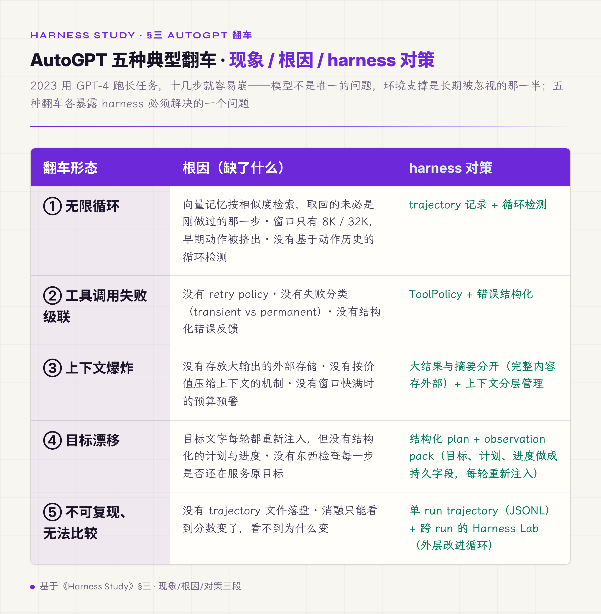
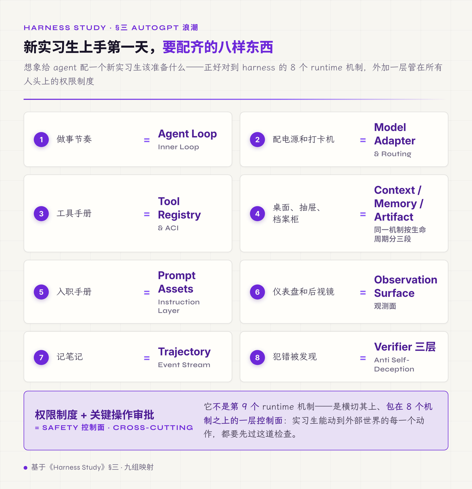

# 三、第一次大规模试错：AutoGPT 浪潮和它的翻车（2023）

> **本节首次出现的术语**
>
> - **schema**（模式）：数据结构的形式化定义，约定字段名、类型、是否必填、嵌套结构，既能给人读，也能让程序自动校验（validate）。JSON Schema 是网上最常见的写法。在 agent 工程里，工具契约、observation 格式、completion 返回值都用 schema 来描述。
> - **verifier**（验证器）：判定 agent 一次任务输出对不对的判定器，是 agent 工程里最难也最重要的机制之一。SWE-bench 这种能跑测试的环境里，verifier 就是单元测试；合同审核这种开放任务里，verifier 怎么设计本身就是难题。有了可靠的判定和奖励信号（reward），才能从"靠手感调 prompt"走向"用数据改进"。
> - **policy**（策略）：控制 agent 行为的规则集，决定一个工具调用能不能执行、要不要人工审批、哪些路径可读、哪些不可写等。没有 policy 的 agent 就像一个失控的小型 root 用户。§5.9 Safety 控制面一整节在拆这一机制。

2023 年 3 月 30 日，Toran Bruce Richards（GitHub 用户名 Significant Gravitas）把 **AutoGPT** 推上 GitHub。距离 GPT-4 公开发布只过去两周（GPT-4 是 2023-03-14 发布），整个业界对"自主 agent"的期待正在飙升：既然 GPT-4 这么强，能不能让它自己规划、自己执行、自己迭代，做到完全自主？AutoGPT 的承诺直击这个期待：你给一个目标（"帮我做市场调研"），它会自己拆任务、自己调工具、自己评估进度，直到完成。BabyAGI、AgentGPT 紧随其后用类似设计推出。一时间 AGI 仿佛触手可及，AutoGPT 短期内冲到 GitHub 最快增长项目第一，几周内拿到 10 万 stars，比同期任何 LLM 应用都快。

### AutoGPT 的内部架构（看清楚再看翻车）

要看清 AutoGPT 为什么翻车，得先看它当时的内部架构是什么样。简化掉具体代码细节，AutoGPT 的核心循环大致是这样：

```
1. 用户给一个 goal
2. AutoGPT 调 LLM 把 goal 拆成"任务列表"（自然语言字符串列表）
3. 选第一个任务执行
4. LLM 决定调什么工具（prompt 里写 "ACTION: 工具名(参数)"），外面 regex 解析
5. 工具执行，结果当 text 拼回 prompt
6. LLM 评估这个任务完成没完成 / 要不要修改任务列表
7. 跳回 3，选下一个任务
```

整个循环跑在一个 Python 进程里。它并非没有状态：

- 用户设定的目标（`ai_goals`）每一轮都作为 system 消息重新注入 prompt；
- 有一个向量记忆，可选本地文件、Pinecone 或 Redis 做后端，按相关度检索出过去的片段塞回 prompt；
- 近期历史直接拼进 prompt，窗口放不下就被挤出去。

但工程层缺的东西很多：任务列表只是个字符串数组；工具调用没有 schema 校验；失败靠 try/except 拦下来重试或者跳过；没有 trajectory 文件落盘，没有消融（ablation）钩子，没有独立的 verifier 判定，没有 policy 拦截危险动作。

这套架构的"自主性"在 demo 任务上看起来很惊艳：给一个"调研 X 公司"的目标，它真的会去 google、写文件、再 google、生成报告。前几步的演示效果常常很完整。但**这套架构没有任何机制处理多步执行的累积不稳定性**：任务跑到十几步以上，五种典型翻车就会一个接一个出现。这跟上一章末尾的粗略估算（各步出错独立、一步错全盘错时，每步 95% 准确率连起来 50 个节点只剩约 8%）是同一个道理：单步看起来够用，串起来就容易崩。

### 大规模翻车的五种典型形态

Wikipedia 对 AutoGPT 的失败描述很直白：

> "AutoGPT's tendency to get stuck in infinite loops"
> "AutoGPT has a tendency to hallucinate or to present false or misleading info as fact"
>
> （AutoGPT 容易陷入无限循环；AutoGPT 容易产生幻觉，把虚假或误导性的信息当作事实呈现。）

具体翻车形态有五种，每一种都暴露了 harness 必须解决的一个问题。



*图 3.1 · AutoGPT 五种典型翻车及其 harness 对策*

**翻车一：无限循环**。AutoGPT 决定下一步动作时，会反复选同一个工具、问同一个问题。社区里典型的失败 session 长这样：google "市场规模" → 写到文件 → 读文件 → google "市场规模" → 写到文件 → 读文件……一小时后仍在原地。根因不是 AutoGPT 完全没有记忆：它有向量记忆，也有近期历史。问题在于两点：

- **检索回来的记忆不可靠**：按语义相似度取回的片段，未必正好是"我刚 google 过这个"那一条；而上下文窗口有限（GPT-4 发布时只有 8K 和 32K 两种），几轮之后早期的动作记录就被挤出窗口。
- **没有基于动作历史的循环检测**：没有任何一层代码去比对"这一步和前几步是不是一样"，只能指望模型自己察觉。

harness 必须提供的对策是 **trajectory 记录加循环检测**：把每一步动作哈希后跟历史比对，连续重复同样动作就中断或换路径。

**翻车二：工具调用失败级联**。AutoGPT 调一个工具返回了错误，比如某个搜索 API 限流了，返回 `{"error": "rate limited"}`。模型不知道这个错误是临时的（等 30 秒就好）还是永久的（API key 失效了），也不知道应不应该重试。结果通常是两种：要么 AutoGPT 把这个错误当成"工具说了一段话"塞进 prompt 继续往下推（基于错误数据做后续推理），要么直接把整个任务标记为失败退出。**没有重试策略（retry policy），没有失败分类（临时性还是永久性），没有给模型的结构化错误反馈**。harness 必须提供的对策是 **ToolPolicy 加错误结构化**：重试几次、退避多久、什么错该立即失败（fail-fast）、什么错该走备用路径（fallback）、什么错该停下来等人，全是 policy 层的决策，不能让模型自己拍脑袋猜。

**翻车三：上下文爆炸**。GPT-4 发布时上下文窗口只有 8K 和 32K 两种。粗略估算，一次搜索工具返回的 HTML 可能有上千 token，一次 read_file 读几百行代码也是几千 token，模型每轮的推理输出还要再占几百 token。十几轮跑下来，光是工具结果就把窗口塞满了。AutoGPT 早期版本的应对方式很粗暴：要么直接截断（前面的关键约束和中间结果被切掉），要么直接报错退出。当时缺三样东西：把大输出搬到外部存储的地方，按价值压缩上下文的机制，窗口快满时提前预警的预算检查。harness 必须提供的对策是：

- **大结果与摘要分开**：上下文里只放摘要，完整内容存到外部（§5.4 的 Artifact 与 §5.6 的观测面会讲怎么拆）；
- **上下文分层管理**：用量到阈值就触发压缩，压缩按价值（任务约束、关键 ID）取舍，而不是按时间（越早越该删）取舍（§5.4 详讲）。

**翻车四：目标漂移**。AutoGPT 每一轮都把用户设定的目标（`ai_goals`）作为 system 消息重新注入，目标文字本身并没有丢。但只有一段目标文字是不够的：模型每轮看到的是目标加最近几轮历史，却看不到一份结构化的计划和进度（哪些子任务做完了，当前在做哪一步，为什么做这一步）。这时如果某次工具返回了一段带诱导性的网页内容（"你应该研究 Y 公司而不是 X"），或者 AutoGPT 自己生成了一段看起来更合理的子目标（"我觉得先调研竞品更好"），这些离得更近、更具体的内容就会把原目标架空。用户半小时后回来一看，AutoGPT 在做完全不相关的事。**根因是只有目标文本，没有结构化的计划与进度，也没有东西检查每一步是否还在服务原目标**。harness 必须提供的对策是**结构化计划加观测包（observation pack，每轮为模型重新组装的一份当前状态，§5.4 详讲）**：目标、计划和当前进度做成持久字段，每轮重新注入上下文，让模型每一步都能看见原目标和自己走到了哪一步，无论历史被怎么压缩都不影响。

**翻车五：结果既不可复现，也无法比较**。同一个 prompt 跑两次，结果可能完全不同，这是模型采样的天然属性，温度大于零就有随机性。更糟的是，跑挂了之后没人能复盘"它到底是怎么走到这一步的"，因为整个执行过程没有 trajectory 文件落盘。"我们调了 5 天它跑通了一次，但不知道是哪一处改动起作用的"，是 2023 年春夏很多团队的真实遭遇。**没有 trajectory，对比实验就只剩一个分数**：换一个配置，你只能看到分数变了，看不到为什么变；想判断哪个机制在起正作用，也没有可逐步比对的执行记录。

harness 必须提供的对策分两层：

- **单次 run 之内：trajectory。** 所有动作、决策、压缩、verifier 判定都写进文件（JSONL 一行一个事件，或一个 run 一个 JSON 文件），让事后能复盘。
- **多次 run 之间：一个外层的改进循环。** agent 跑 100 次只看其中一次，没法判定"这个配置真的更好，还是只是运气好"。所以要跑 N 次看统计，并保证这 N 次真的互相独立：不共用响应缓存和固定的随机种子，不共用文件、记忆和工作区，每次从干净的环境开始。否则 N 次复跑只是同一个结果被数了好几遍，本书称为"复跑不独立"（AP01，见附录 F）。有了独立的多次 run，再把它们的 trajectory 对照起来，看某个机制开和关时结果差多少。

这部分跨 run 的工作不属于 8 个 runtime 机制本身，而是包在 runtime 外面的一层，本书称为 **Harness Lab**（第七章详讲）。它按五步循环：Observe（用 trajectory 量化每次 run）→ Score（用 verifier 给每次 run 评分）→ Ablate（开关机制，看哪个有正贡献）→ Tune（调整 harness 配置）→ Iterate（回到 Observe 继续）。两者是配套的：trajectory 是 Harness Lab 的输入，Harness Lab 是 trajectory 的使用方。

### 把五条放一起 · 看清根本结论

把这五种翻车放一起看，结论很清楚：**模型不是唯一的问题，环境支撑是长期被忽视的那一半**。

AutoGPT 用的是 GPT-4，跟今天 Claude Code、Cursor、Codex CLI 背后的模型（如 Claude Opus 4.7、GPT-5.5）同属 transformer LLM 这一技术世代。今天这些产品能可靠地完成多步任务，AutoGPT 当时跑十几步就容易崩。这段差距两边都有贡献：模型的单步能力确实大幅提升（第一章引用的 SWE-bench Verified 数据里，同一套极简 harness 下换模型，成绩从 22% 升到 49%）；包裹模型的工程层也从几乎没有变成了一整套机制（同一章引用的 Meta-Harness 实验里，固定模型、只改 harness，能拉出 6 倍的性能差）。

这条结论是 **harness engineering 这门工程实践存在的根据**。如果"agent 不可靠"这件事只要换更强的模型就能搞定，那就不会有 harness engineering 这门工程实践，大家等着模型升级就行了。2023 年春到 2026 年春这三年里，GPT-4、Claude Opus 4.7、GPT-5.5 这些模型相继推出，单步能力大幅提升。但模型升级带来的是单步预测更准、推理更深、工具调用更可靠，**多步执行的可靠性不会随之自动到来，还要靠包裹模型的工程层专门去做**。这是 harness engineering 与单纯"调 prompt、升级模型"路线最本质的分歧点：它把"包裹层"当成一个独立的、可被工程化、可被研究、可被自动化优化的对象。

### 一点需要澄清的事：AutoGPT 并未"彻底失败"

讲到这里需要澄清一件事，否则容易给人留下"AutoGPT 是失败项目"的错误印象。AutoGPT 这个项目本身并未彻底失败：Significant Gravitas 公司在 2023 年 10 月拿到 1200 万美元融资（Redpoint Ventures 和 GitHub 投资），项目至今仍在维护，仓库累计超过 18 万 stars，2024–2025 年也在持续迭代，加上了工具 schema、更结构化的任务管理和 trajectory 接口。也就是说 AutoGPT 项目也在按那一波的教训调整，慢慢往 harness 的方向收敛。再往后看一步更有意思：2024 年之后 AutoGPT 干脆转型成了 AutoGPT Platform，一个以功能块（block）搭建的低代码工作流平台，用户把控制流显式编排成流程块（块间可带分支循环）、模型在块里干活。第一个把"给个目标全自主跑"推到极致的项目，最后自己走回了显式编排这条路。这个方向在 §5.1.6 讲动态工作流（dynamic workflow）时还会再遇到。

本节讲的是 **AutoGPT 在 2023 春夏的具体形态翻车**。它**暴露了**一类工程问题，让业界意识到"自主 agent 不是模型够强就行"。这是它对 harness engineering 这门工程实践最大的贡献：用一次大规模公开试错，把一类本来没被讨论的工程必要性暴露出来。如果没有 AutoGPT 那一波公开翻车，业界可能要再过一两年才会开始系统讨论 harness 这件事。

### 一个类比：把没经验的实习生扔进项目

可以用一个直白的类比把整件事说清楚：你把一个**完全没经验的实习生**扔进项目，让他独立做事。他可能很聪明（GPT-4 在单步推理上确实很聪明），但你做了一系列"不"：不教他做事节奏、不配电源和工位、不发工具手册、不分桌面抽屉档案柜、不发入职手册、不开仪表盘让他看反馈、不让他记笔记、不让人审他的输出、不设权限管他干危险事。在这种条件下，再聪明的实习生也必然失控。

把这个类比完整对应到 **8 个 runtime 机制加 1 个 Safety 控制面** 上看，正好对应 9 个工程对象。



*图 3.2 · 实习生类比：对应 8 个 runtime 机制与 Safety 控制面*

**"做事节奏" = Agent Loop · Inner Loop**：每一步先思考、再动手、再看反馈、再决定下一步，整套循环到完成。实习生没有这个节奏会乱跳。这是 ReAct[^react-yao-2022] 提出的 Thought-Action-Observation 三元组的工程化形态，是 agent 区别于一次性 LLM 调用的本质。

**"配电源和打卡机" = Model Adapter & Routing**：让实习生稳定接通他大脑（LLM）的渠道，打卡机则记下他用了多少（token 用量与计费）。每家 LLM provider 的 API 形态不一样（tool calling 字段名、token 计费方式、流式协议各异），adapter 把这些差异归一化；如果今天用 GPT-5.5、明天故障切换（failover）到 Claude，能无缝切换不污染其他流程。

**"工具手册" = Tool Registry & ACI**：每个工具有结构化定义（JSON schema）、有使用边界（permission / allowed_paths / timeout）、有出错时的标准反馈格式。让实习生知道自己能调什么、怎么调、调错了怎么办。这一机制依赖 OpenAI 2023-06 function calling 把"工具是结构化契约"这件事在模型侧解决掉。

**"桌面、抽屉、档案柜" = Context / Memory / Artifact**：把当前在用的资料放桌面（context，当前这一轮发给模型的上下文），把暂时不用的放抽屉（memory，harness 在模型外维护、跨多次调用可读写的状态），把跨任务的产物放档案柜（artifact 持久存储）。实习生不能把所有资料都堆桌上，桌面会爆，这正是 AutoGPT 翻车三"上下文爆炸"的根因。

**"入职手册" = Prompt Assets · Instruction Layer**：持久化的系统提示词、操作规范、子流程模板。这些不是临时口头交代，而是被版本化、对提示词缓存友好（cache-safe）、被工程化管理的资产。AGENTS.md、CLAUDE.md 这类项目级指令文档就是 prompt assets 的具体形态。

**"仪表盘和后视镜" = Observation Surface**：让实习生看到上一步的反馈（工具结果、文件变化、错误信息）。仪表盘不是把所有信息原样塞过来，而是经过摘要、分层、脱敏，把摘要和完整内容分开：大数据放外部存储，摘要进上下文。

**"记笔记" = Trajectory · Event Stream**：每一步动作、决策、压缩、verifier 判定都写进文件，让事后能复盘、能逐项比对两个配置、能回放。这一项是 Harness Lab（上面提到的 Observe → Score → Ablate → Tune → Iterate 五步循环）能存在的前提：没有 trajectory，跨 run 的消融只能看到分数变了，看不到为什么变。

**"犯错被发现" = Verifier 三层**：每一步有独立判定，不是实习生自己说"我做完了"就算完成。三层是 hard gate（代码可判定的确定性检查，比如 `pytest` 通过没有）、outcome judge（用模型作评审，对开放性产出做语义判定）、process soft signal（过程信号，看是否符合预期模式）。错了能 fallback、能 retry、能升级到人审。

这八个机制属于 runtime 层，实习生干每一项具体活时都要用到它们。但 8 个之外还有一个**横切其上**的：

**"权限制度加关键操作审批" = Safety 控制面**：这是一个横切（cross-cutting）的控制面，不是某个单 turn 内的机制，而是横切所有 turn、所有工具、所有决策的合法性边界。给实习生设权限制度，给关键操作（发邮件、删文件、push 代码、消费预算）配审批流程，让他在试错时不会真的把公司搞砸。它是 OWASP LLM Top 10（2025 版）中 LLM06 过度代理（Excessive Agency）和 LLM10 无限制消耗（Unbounded Consumption）这两项风险的工程化对策。它不像前 8 个机制那样在某个具体 turn 里发生，而是在每一次工具调用前、每一次预算超阈值时、每一次跨子 agent 委托时都要被检查。把它算作第 9 个机制并不准确：它是横切在 8 个机制之上的一层控制面。

这套 **8 个 runtime 机制加 1 个 Safety 控制面**（合计 9 个工程对象），就是 harness engineering 这门工程实践要把工程师注意力聚焦的全部工程对象。AutoGPT 用 GPT-4 跑长任务，跟"把聪明实习生扔进没有这九样配套的环境"是同一个错误：再聪明也必然失控。harness engineering 要回答的正是这个问题：给定一个本身已经够聪明的实习生（模型），怎么给他配一套**让他能持续干活、能从失败里恢复、能被持续监督和改进、又不会真把公司搞砸的工程环境**。这九个对象不是一份清单，而是把"模型外面那层"切成可被独立讨论、独立优化、独立验证的工程对象，每一个都有自己的接口形态、自己的设计取舍、自己的失败模式。

类比的边界要点一下：实习生有自主学习能力（错了能自己悟、能跨任务积累经验），LLM 没有：模型权重在训练时已经固化，今天犯的错明天还会犯。所以 harness 不只是"工程环境"，还得包含"让模型的错从环境层面被永久修复"这件事。这一点正是 Hashimoto 2026-02 给 harness engineering 的定义："anytime you find an agent makes a mistake, you take the time to engineer a solution such that the agent never makes that mistake again"（每当你发现 agent 犯了一个错，就花时间设计一个工程方案，让它再也不犯这个错）。也就是用 harness 层的固化机制，补上模型不会自学这一点。

业界从 AutoGPT 那一波翻车里走出来花了大约三年。这三年里怎么把这套工程环境的名字、定义、组件、控制论框架一步步定下来的，是 harness 这个词收敛的真实历史。

---

## 引用脚注

[^react-yao-2022]: ReAct: Synergizing Reasoning and Acting in Language Models · arxiv 2210.03629 · Yao, Zhao, Yu et al.（Princeton、Google Research Brain）· ICLR 2023
