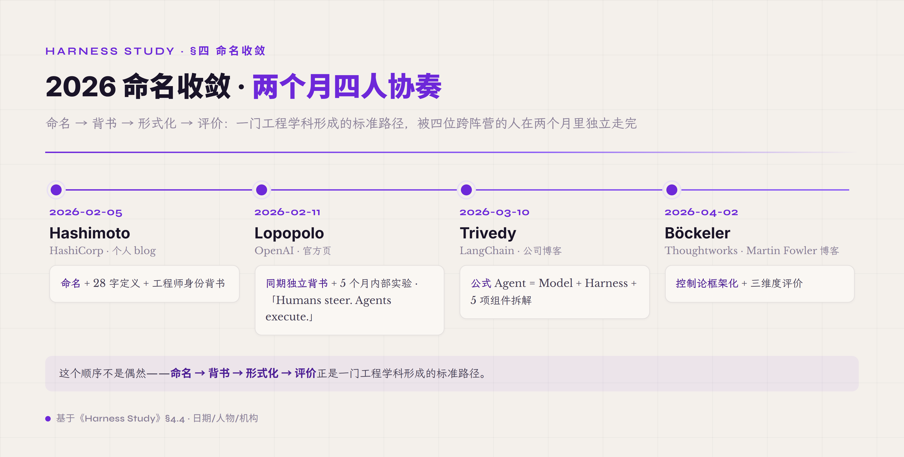
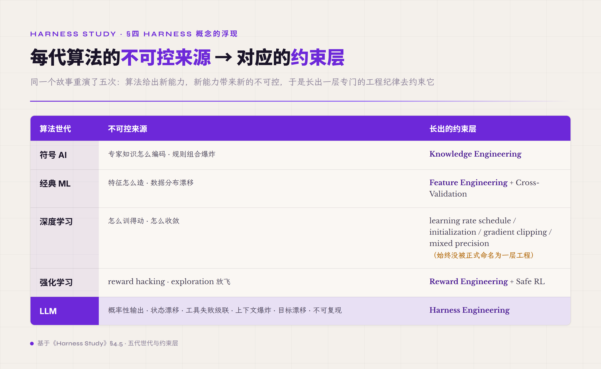
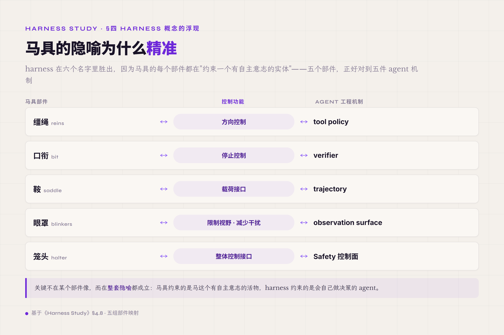

# 四、Harness 概念的浮现（2023 中–2026）

AutoGPT 那一波翻车给业界留下了一道清晰的工程命题：单纯依靠"更强的模型加更好的 prompt"做不出可靠的多步 agent，需要在模型外围搭一整套工程系统。但这套工程系统**叫什么、由哪些部分组成、谁负责什么**——这些问题从 2023 年中到 2026 年初花了大约三年才慢慢收敛清楚。这一节就讲这个收敛的过程：先澄清一个常见误解（4.1），再看 2023-2025 三年里业界用过的六个不同名字（4.2），然后看 2023-2024 两个不能跳过的工程锚点（4.3），最后看 2026 年初四位关键人物在两个月里把命名、公式、组件、控制论框架一步步定下来的过程（4.4-4.5），并把 harness 放进 AI 史的跨代视角看（4.6-4.8）。

### 4.1 一个误解先澄清：harness 不是新词

要讲 harness engineering 这件事，先得把一个常见误解清理掉——很多人第一次看到"agent harness"会以为 harness 是 2026 年凭空发明的新词。**完全不是**。harness 这个英文词在软件工程里早就存在了几十年，至少有三种成熟的用法。

**Test harness（测试外壳）** —— 1980 年代单元测试早期就出现的词。它的工程含义是：把被测代码包在一层外壳里，这层外壳负责准备 test fixture（测试数据、mock 依赖、初始状态）、运行 assertion（判定输出对错）、做 teardown（清理资源、重置全局状态）、生成测试报告。今天 Python 的 pytest、Java 的 JUnit、JavaScript 的 Jest、C 的 cmocka 都是 test harness 的具体实现。test harness 把"测试代码本身"跟"运行测试的支撑环境"分开——这个分开是软件工程里"关注点分离"原则的典型应用。

**Evaluation harness（评测外壳）** —— 在 ML 学界用了十几年的词。它的工程含义是：包装一个被评测的模型加一组标准化的基准任务，每个任务有标准答案，跑完输出可比较的指标（准确率、F1、BLEU 等）。EleutherAI 的 lm-eval-harness（开源 LLM 评测套件）、Stanford 的 HELM（Holistic Evaluation of Language Models）、OpenAI 内部的 evals 框架，这些都是 evaluation harness 的具体落地。evaluation harness 在 LLM 时代之前已经存在多年——只是 LLM 让它的曝光度突然提升，因为业界突然需要一套统一标准评估一个模型有多强。

**Training harness（训练外壳）** —— 深度学习训练框架里常见的词。它的工程含义是：包装训练 loop（forward、backward、optimizer step），同时提供数据加载、混合精度、分布式同步、checkpoint 保存、metrics 日志这些训练时必须的"支撑事项"。HuggingFace 的 Trainer 类、DeepSpeed、Megatron-LM 都是 training harness 的实现。training harness 让研究员可以专注于"模型定义加损失函数"，而不必每次自己写 GPU 分布式同步代码。

把这三种放一起看，可以发现 harness 这个词的核心语义：**包裹一个被处理的核心对象（被测代码、被评测模型、被训练模型），在它周围提供执行所需的支撑环境，把"核心做什么"跟"运行核心需要什么"分开**。这是几十年软件工程里反复出现的设计模式——关注点分离的一种形态。

所以 2026 年新出现的不是"harness 这个词"，而是两件事：

第一件 · **agent harness** —— 把 harness 这个词应用到 LLM agent 这个新对象上。LLM agent 是个新的"核心对象"——它不像被测代码那样确定性、不像被评测模型那样静态、不像被训练模型那样只跑一次。它是一个**多步执行的、有副作用的、概率性的运行体**。给这种新核心对象写"包裹"，需要全新的支撑形态——这就是 agent harness 要做的事。

第二件 · **harness engineering** —— 作为一门 agent 工程纪律的集中命名和传播。test harness / evaluation harness / training harness 各自是工具，没人会说"test harness engineering 是一门学科"。但 agent harness 不同——它复杂到必须作为一个独立的工程实践被研究：要做控制论框架、要做组件分解、要做工程模式、要做评测方法。Hashimoto 2026-02 用"harness engineering"这个词命名这件事，是把"agent harness 这个工具"提升为"agent harness engineering 这门工程实践"的关键一步。

也就是说，2026 年是 **旧词新焦点**——harness 这个词没变，但被用到一个比之前所有 harness 都更复杂、更需要系统化研究的新对象上。

### 4.2 2023–2025：术语未统一的"做但没名字"时期

在 harness engineering 被正式命名之前，业界已经在做今天叫 harness 的事——只是用六个不同的名字指称同一类工程实践。这三年是 agent 工程史上最有意思的一段：实践已经在做、产品已经在跑，但没人能用同一套词讨论它。下面这张表把这六个名字按时间顺序排出来，每个名字配上当时实际在做什么、以及这个名字漏掉了什么：

*图 4.1 · 2026 命名收敛：两个月四人协奏*

| 阶段 | 时间 | 流行术语 | 实际在做什么 | 这个名字的盲区 |
|---|---|---|---|---|
| **1. Prompt-as-app** | 2020 – 2022 中 | prompt engineering | agent = 一个长 system prompt + 几个 in-context 示例 | 假设 LLM 是函数，不处理多步 |
| **2. Framework** | 2022.10 – 2023.6 | LangChain / chain / orchestration | agent = 一个软件库的对象 | Chain 是 DAG 不是 loop，且不强加生产纪律 |
| **3. Autonomous loop** | 2023.3 – 2023.7 | autonomous agent / AGI prototype | agent = 给目标就自己干（AutoGPT 模式，翻车） | 没有 verifier / policy / trajectory，必崩 |
| **4. Function calling / Tool use** | 2023.6 – 2024 | function calling / tool use | agent = LLM API + 工具 schema | 只覆盖工具契约，不覆盖状态 / 错误 / 反馈 |
| **5. Scaffold / Agent system** | 2024 – 2026.1 | scaffold / agent system / agent infrastructure | agent = 模型 + scaffold | "scaffold" 暗示临时支撑，"agent system" 太泛 |
| **Karpathy 的两个术语** | 2025 | *context engineering* / *agentic engineering* | 各自只覆盖 context 一面、与开发者工作流一面 | 各自只覆盖一面，不是完整工程层 |

每个阶段都不是完全错——每个名字都抓到了一部分真相，只是没人抓到全部。**Prompt-as-app**（2020-2022 中）踩中的是"模型还不够强、长 prompt 加几个示例确实够用"；**Framework**（2022.10 起）的功劳是 LangChain 把"多次调用串起来"工业化；**Autonomous loop**（2023）头一回把"自主性"这个 agent 核心特性命名出来。再往后，**Function calling** 标准化了 LLM 跟工具的接口，**Scaffold** 承认了"模型外面要包东西"，**Context engineering** 点出 context 管理是核心难点之一。

但每个名字都漏了别的东西。Prompt-as-app 漏了多步执行；Framework 漏了生产纪律；Autonomous loop 漏了工程支撑；Function calling 漏了状态和反馈；Scaffold 暗示"临时支撑"（盖完楼就拆，跟生产 agent 永远在线的实情冲突）；Context engineering 只覆盖一面（compaction / 记忆 / 检索）。**直到 Hashimoto 2026-02 用 harness 这个词，才出现一个覆盖范围足够全、隐喻足够准确、能容纳整门工程实践的命名**。

这一时期的代表项目——SWE-Agent（Princeton，2024）、Claude Code（Anthropic，2024）、Codex CLI（OpenAI，2024-2025）、Cursor Composer（Cursor，2023 起）、Aider（开源，2023 起）——**不同程度具备**今天 harness 的关键组件：trajectory、tool policy、context 管理、verifier。具体覆盖范围各家不同——Claude Code 在 trajectory 和 context 管理上做得最深，Codex CLI 在 tool registry 和 sandbox 上做得最深，SWE-agent 在 trajectory 格式标准化上贡献最大。但当时 Anthropic、OpenAI、Cursor 谁都不用"harness"这个词——每家用自己的话描述：agent infrastructure / coding assistant runtime / agent loop / orchestration layer。**统一称为 harness 是 2026 年的事后归纳**——业界回过头看 2023-2025 这三年这些产品都在做同一类事，才有了一个统一名字。

这种"实践先于命名"的滞后跟其他学科一样——MLOps、Knowledge Engineering、Reward Engineering 这些名字都是先有几年实践才被命名的。这件事的工程教训是：**命名滞后不是行业懒，是必要的——名字要等到足够多的实践案例积累后才能稳定下来，否则起得太早会被实践推翻**。harness 这个词等到 2026 年才被推上来，是因为 SWE-Agent、Claude Code、Codex CLI 这一批产品到那时已经跑了将近两年生产用例，业界已经积累了足够多的"踩坑共识"——什么样的设计是好的、什么样是坏的、哪些组件必须有、哪些是可选的——命名才能稳定。

### 4.3 关键时间锚点：function calling 与 tool use

讲 2023-2025 这三年时，有两个时间点不能跳过——它们是 LLM 与工具之间的接口形态从"prompt 加 regex 解析"升级到"结构化契约"的关键节点。这两个点表面上是 API 公告，骨子里是 LLM 工程范式的两次重大跃迁，也是 harness 8 件 runtime 机制里 ToolRegistry 这一件能存在的工程前提。

**2023-06-13 · OpenAI function calling**。Simon Willison 当天的转写给出最简描述（28 字）：

> "You can now send JSON schema defining one or more functions to GPT 3.5 and GPT-4—those models will then return a blob of JSON describing a function they want you to call."

这一句话的工程含义比表面看起来重得多。在此之前，让 LLM 调工具是这样的流程：在 system prompt 里告诉模型"你可以调用 `search(query)` 或 `calculate(expr)`，输出格式是 `ACTION: 工具名(参数)`"，模型生成一行 text，外面用 regex 解析。这个流程有一堆问题——模型可能漏字段、可能多字段、可能改格式（昨天用 `ACTION:` 今天用 `Action:`）、可能在解释性文本里插入看似 action 的字符串误导 parser。每一项问题都直接打击系统稳定性——而且失败方式还很隐蔽，不是 raise exception 而是"parser 抠出一个看似合法的工具名加参数，但参数其实有问题"。

function calling 把这件事变成了**结构化契约**：你给模型一个 JSON schema（包含 function 名字、参数列表、每个参数的类型和描述），模型返回的不再是"按格式写的 text"，而是**保证符合 schema 的 JSON 对象**。这背后的实现机制是 **constrained decoding**——在 token 生成时只允许那些会让最终输出符合 schema 的 token 被采样出来，违反 schema 的 token 概率被强制压到零。从此 LLM 跟工具之间有了类型安全、有了结构化校验、有了不依赖 regex 的可靠 parsing。

这件事的战略意义在哪？function calling 之前，agent 工程师必须把大量精力花在"让模型按格式说话"这件事上——写 prompt 的诀窍一半都是在教模型怎么生成可解析的文本。function calling 之后，这件事被 OpenAI 在模型侧解决了——工程师可以把精力转向更重要的事：tool registry 该怎么设计、policy 该怎么放、verifier 该怎么写、observation 该怎么序列化。**这次升级直接释放了 agent 工程整个领域的注意力**——业界开始有余力讨论 agent 工程的高阶问题，而不是仍然纠结在"怎么 parse 模型的 text"这件低层级的事情上。

官方页面在 https://openai.com/index/function-calling-and-other-api-updates/ ，签字的工程师是 Atty Eleti、Jeff Harris、Logan Kilpatrick。公告还有一段值得记的话——OpenAI 明确指出 function calling 设计中应"对带真实世界影响的行为（发邮件、发帖、采购）在执行前向用户确认"。这是后来 harness 8 件 runtime 机制里 ToolPolicy 的 `requires_confirmation` 字段的最早源头——一个工具发起调用前必须经过 policy 检查，policy 可以决定直接执行、需要人审、或者拒绝，这一机制后来作为 P0 必备进入生产 harness 的核心组件。

**2023-11-21 · Anthropic Claude 2.1 加入 tool use beta**。同一天 Anthropic 一起做了两件事：Claude 2.1 把 context window 从 100K 扩到 200K token；同时开放 tool use beta。官方原话：

> "By popular demand, we've also added tool use, a new beta feature that allows Claude to integrate with users' existing processes, products, and APIs."

为什么要把这两件事放一起做？这不是巧合，是工程战略级动作。tool use 让模型能调外部工具——但每次工具调用的结果都要塞回 context，调用十几次 context 就爆。**只有把 context 大幅扩展，tool use 才真正可用**——否则你给了模型调工具的能力却没给它消化工具结果的空间，等于半成品。Anthropic 2023-11 一起做这两件事，是工程上理解到了 **tool use 跟 context 管理是孪生问题**——后来这件事在 harness 8 件 runtime 机制里被显式拆开：5.2 Tool Registry 跟 5.3 Context 管理是相邻的两件，需要协同设计。Tool Registry 决定"哪些工具能调、调时带什么参数"，Context 管理决定"工具返回的大输出怎么进 context 不爆窗口"——两者必须协同，否则一边的进步会被另一边的限制压死。

function calling 跟 tool use 这两件事打通后，到 2024 年中，行业基本接受了一个简化的 agent 公式：**agent = LLM + 工具 schema + 一些代码包在外面**。这个公式比 2022-2023 的"模型当函数用"已经进步了——它承认了工具是核心组件、承认了模型 API 里要有结构化的工具接口。但这"一些代码包在外面"还没人能精确描述是什么——是 LangChain？是自写的 Python 脚本？是 SWE-agent 的 trajectory 框架？是 Cursor 内部的某个 runtime？业界各家有各家的"包在外面"的实现，但没有统一名字、没有统一组件清单、没有统一控制论框架。每家自己说自己的实现像什么，互相之间无法精确比较。

这个"还差一个名字"的状态一直持续到 2026 年 2 月。2026-02-05 Hashimoto 发表 *My AI Adoption Journey* 用了 "harness engineering" 这个词，把这件事正式命名——紧接着 Trivedy、Böckeler、Lopopolo 各自补上分解公式、控制论框架、agent-first 操作模型，四个人两个月时间，把这套工程实践从"做但没名字"推到"有工程实践的完整骨架"。

### 4.4 2026 命名收敛 · 两个月四人协奏

讲 harness engineering 这门工程实践怎么命名定下来的关键事件密集发生在 2026 年 2 月初到 4 月初，大约两个月时间。这两个月里四个人各自从不同视角写出关键文章——Hashimoto 用工程师身份命名、Lopopolo 用 OpenAI 内部实验背书、Trivedy 用 LangChain 框架阵营自我反思、Böckeler 用 Thoughtworks 咨询界控制论化——把 harness engineering 从"做但没名字"快速推到"有公式、有组件、有控制论框架"的工程实践的完整骨架。

这四个人来自四个完全不同的阵营，但在两个月内独立写出高度互补的文章——这种跨阵营快速收敛不是抄袭也不是巧合，是业界已经积累了足够多的实践共识、只差一个统一名字的标志。这种"实践积累两三年、命名收敛两三个月"的模式在 IT 史上反复出现，MLOps 2015-2018 是同样的模式——下面把四个事件按时间序拆透。

#### Hashimoto 2026-02-05 · 命名的工程师身份背书

**Mitchell Hashimoto** 在 *My AI Adoption Journey* 一文中提出 / 推广 "harness engineering" 这个叫法。Hashimoto 是 HashiCorp 联合创始人、Terraform 作者——这一身份背书很重要。Terraform 不是 ML / 学术工具，是大规模分布式系统的基础设施定义语言；Hashimoto 在写 Terraform 的十几年里处理的是"大型分布式系统怎么被工程师可靠地构建和运维"这件事。当这样一个写过大型基础设施的工程师说"我把跟 agent 协作的工程实践叫做 harness engineering"时，这个命名自带工程权威性——不是 marketer 发明的术语，不是研究员的论文标题，是真正写过 production 的工程师从自己实践里提炼出来的词。

Hashimoto 的原文措辞很谨慎——他描述这是"我逐渐把这叫作 harness engineering"的工作方式，并明确指出他不确定行业是否已经有通用术语。也就是说，Hashimoto 自己**没有 claim 学科级地位**。把 harness engineering 当作"一门工程纪律"是后续 Trivedy、Böckeler、本教程的归纳——Hashimoto 给的是命名的起点，不是终点。

Hashimoto 在文章里给出 harness engineering 的核心定义，只有 28 个英文单词：

> "the idea that anytime you find an agent makes a mistake, you take the time to engineer a solution such that the agent never makes that mistake again"

这条定义看似平淡，但拆开看每一个动词都是控制论的工程对应物。**find a mistake** 对应"sensor 检测到偏差"——这要求 harness 里有 verifier、有 trajectory、有 observation 机制让你能"看见"错误。**take the time** 对应"工程意图"——agent 犯错不是 bug 修一下就完事，是需要专门花时间设计永久修复机制。**engineer a solution** 对应"反馈控制器"——不是改 prompt 让它"下次别犯"，是在 harness 层固化一个机制让这类错从结构上不再可能发生。**the agent never makes that mistake again** 对应"控制论闭环的收敛保证"——这一类错从此被消除，不再消耗未来的工程精力。

这一条定义本身就是**控制论命题在 LLM 工程上的具体形态**——agent 犯错 → 在环境里固化一个永久修复 → 这一类错不再发生。从 1948 年 Wiener 的控制论到 2026 年 Hashimoto 的 harness engineering，跨 78 年，同一套反馈闭环原理被搬到一个新的工程对象上。

需要特别注意一件事：**Hashimoto 在他的原文中并没有给出 "Agent = Model + Harness" 这个今天最广为流传的公式**。这个公式实际来自下一步——Trivedy。

#### Lopopolo 2026-02-11 · OpenAI 内部 5 个月实验的官方背书

距离 Hashimoto 文章发表 6 天，OpenAI 的 Ryan Lopopolo（Member of Technical Staff）发表 *Harness Engineering: leveraging Codex in an agent-first world*。这 6 天差距很重要——两件事不是抄袭关系，是**同期独立收敛**。Hashimoto 是个人实践的总结，Lopopolo 是 OpenAI 内部至少 5 个月实验后的官方文章。两者在同一时间窗收敛到同一个词，说明这个词的"诞生条件"在 2026 年初已经成熟。

Lopopolo 给出的 tagline 浓缩了整篇文章的工程主张：

> "Humans steer. Agents execute."（人定方向，agent 执行。）

这一句话用 6 个英文单词重新定义了 agent-first 时代工程师的角色。在传统软件开发里，工程师**亲自写代码**——每一行 if/else、每一个 SQL 查询、每一个 React 组件都由工程师手敲。在 agent-first 时代，Lopopolo 描述的工作模式是：工程师**不直接写代码**，工程师的核心工作变成三件事——**环境设计**（给 agent 配什么工具、什么 sandbox、什么权限）、**意图说明**（用什么样的 prompt / instructions / specifications 把任务描述清楚）、**feedback loop 构建**（怎么 evaluate agent 输出、怎么 ablation、怎么发现 agent 在哪些场景下还不行）。这三件事合起来就是 harness engineering——工程师从"实际敲键盘的人"转变为"agent 工作环境的设计者"。

Lopopolo 文章描述了一个 5 个月的内部实验：从空仓库起步，用 Codex 生成应用代码、测试、CI、文档、可观测性和内部工具。这个实验的关键不是 Codex 多强，而是**整个 5 个月里 OpenAI 内部 team 没有把精力主要花在调 Codex 这个模型，而是花在调它周围的 harness 上**——给 Codex 配什么样的 sandbox、什么样的工具集、什么样的 instructions、什么样的 feedback loop。这是 OpenAI 第一次官方层面承认 "harness 工程层比模型本身的训练更值得花精力优化"。

可以从 Lopopolo 这篇文章往回推 OpenAI 内部时间线——文章发表是 2026-02-11，描述 5 个月实验，那 OpenAI 内部从 2025-09 左右就在做这件事了。同时期业界其他几家（Anthropic 的 Claude Code、Cursor、Replit、Aider）也几乎一定在并行做同样性质的事——只是没有在 2025 公开命名。这就是为什么 2026 年初命名收敛会这么快——业界私下已经做了至少半年到一年。

文章的官方 URL 在 https://openai.com/index/harness-engineering/（在某些客户端抓取会有 403，本地 source notes 在 `openai-official-source-notes-2026-05-19.md`）。Lopopolo 的身份（OpenAI 工程师 not researcher）加文章发表渠道（OpenAI 官方页 not personal blog），让这篇文章在 harness engineering 工程实践形成史上是 **OpenAI 官方对 Hashimoto 命名的背书事件**。

#### Trivedy 2026-03-10 · 框架阵营的公式化与组件拆解

距离 Hashimoto 文章一个月，**Vivek Trivedy** 在 LangChain 博客发表 *The Anatomy of an Agent Harness*。Trivedy 来自 LangChain 阵营——LangChain 是 2022-10 出来的最早一波 agent framework，到 2026 年已经做了三年多 framework。Trivedy 这篇文章的工程含义是：**框架阵营主动承认 framework 不够 · 需要 harness 这一层 · 而且这一层不是 framework 的子集而是 framework 的上层**。这个承认很重要——是框架公司的 self-reflection，从"framework 就是一切"演化到"framework 只是 harness 的一种实现方式"。

Trivedy 文章里给出今天被引用最广的简洁公式：

> "Agent = Model + Harness. If you're not the model, you're the harness."（agent 等于模型加上 harness。除了模型，剩下都是 harness。）

并给出 harness 的最简定义：

> "A harness is every piece of code, configuration, and execution logic that isn't the model itself."（harness 是一切不属于模型本身的代码、配置和执行逻辑。）

这两句的工程含义在 §一三定义协奏一节已经拆过——第一句是**分解公式**把 agent 一刀切成两部分，第二句是**排除式定义**把责任边界钉死。这里要补的是 Trivedy 做了比公式化更进一步的事——他把 harness 拆成 5 项组件，第一次把"模型外面那层"具体化成可被工程师讨论的组件清单。

Trivedy 的 5 项组件是：**System Prompts**（系统提示词）/ **Tools, Skills, MCPs**（工具、技能、Model Context Protocol 集成）/ **Bundled Infrastructure**（filesystem、sandbox、browser 等运行环境）/ **Orchestration Logic**（subagent spawning、handoffs、model routing）/ **Hooks-Middleware**（compaction、continuation、lint checks）。这 5 项跟本教程后面要讲的 8 件 runtime 加 1 件 Safety 控制面不是一一对应——Trivedy 的切法粒度更粗，把本教程的 Model Adapter / Observation / Trajectory 都隐含在 "Bundled Infrastructure" 和 "Orchestration Logic" 里，把 Verifier 和 Safety 隐含在 "Hooks-Middleware" 里。但 Trivedy 的贡献是**第一次把 harness 当成可被组件化拆解的工程对象**——不再是模糊的"模型外面那层"，而是有 5 个具体责任分区的工程系统。

LangChain 阵营出来的 Trivedy 用一篇 blog 把 harness 公式化，这件事工程意义大于公式本身——它意味着 framework 阵营已经放下"framework 就是一切"的执念，主动给 harness 让出位置。从 2022-10 LangChain 出来到 2026-03-10 Trivedy 这篇文章，整整三年半，framework 阵营从"agent 就是 chain"演化到"agent = model + harness · framework 只是 harness 的一种实现方式"。这种来自框架阵营自身的概念升级，比外部学者写 paper 批判 framework 不够，工程权威性高得多。

#### Böckeler 2026-04-02 · 咨询界的控制论框架化

距离 Trivedy 文章三周左右，**Birgitta Böckeler**（Thoughtworks Distinguished Engineer）在 Martin Fowler 博客上客座撰写 *Harness Engineering for Coding Agent Users*。Böckeler 来自 Thoughtworks 咨询界——咨询界的视角跟工程师视角、框架公司视角、大厂内部视角都不一样。咨询师每年要接触几十家不同公司的工程实践，看的是"这套方法在不同 organization context 下怎么落地"。Böckeler 这篇文章把 harness engineering 框架化为可被咨询师拿去给客户讲清楚的形态——这一步是从"它是什么"到"它怎么评价改善"的跃迁。

Böckeler 在文章里把 Hashimoto / Trivedy 的概念升级为控制论形态：

> harness = **guides (feedforward controls) + sensors (feedback controls)** + humans steering iteratively based on observed failures

这一句话的工程含义是：**harness 不是被动的"代码壳"，是一套控制系统**。前馈（feedforward）是事前约束——rules、docs、tools、prompt instructions、permission boundaries——它在 agent 行动之前规定"什么能做、什么不能做、按什么形态做"。反馈（feedback）是事后检查——tests、linters、AI review、verifier、trajectory 分析——它在 agent 行动之后判定"做对了没、做错了在哪、要不要 retry"。人（humans）在循环里基于观测到的失败做迭代调整——这就是 Hashimoto "engineer a solution" 的咨询界翻译版。这套结构跟 1948 年 Wiener 控制论"前馈加反馈加迭代"完全同构——同样的反馈闭环原理被 Böckeler 用直白的工程语言重新讲了一遍，让没有读过控制论原典的工程师也能立刻把握。

Böckeler 进一步给 harness 三个评价维度：**可维护性（maintainability）**——harness 本身的代码和配置能不能被工程师持续维护？**架构契合度（architecture fitness）**——harness 跟现有系统架构是否融合，还是个孤岛？**行为（behavior）**——agent 的实际行为是否在 harness 约束下符合预期？这三个维度直接把 harness 从"工程师做的事"升级为"可被外部 review 的工程对象"——咨询师可以拿这三个维度去评估客户的 agent 项目，工程师可以拿这三个维度去自评。这种"可被评价"的属性是任何工程对象从"手艺"走向"学科"的关键标志——没有评价标准就不能讨论 better / worse，没有 better / worse 就没法形成 best practices 和教学。

#### 四人协奏的工程史含义

把这四件事按时间排开：2026-02-05 Hashimoto（HashiCorp · 个人 blog）命名加 28 字定义加工程师身份背书 → 2026-02-11 Lopopolo（OpenAI · 官方页）同期独立背书加 5 个月内部实验加 "Humans steer. Agents execute." tagline → 2026-03-10 Trivedy（LangChain · 公司博客）公式 Agent = Model + Harness 加 5 项组件拆解 → 2026-04-02 Böckeler（Thoughtworks · Martin Fowler 博客）控制论框架化加三维度评价。

短短两个月，四步把 harness engineering 从一个工程师的个人感悟变成有公式、有组件、有控制论框架、有评价维度的工程实践的完整骨架。**这四步的顺序不是巧合，是学科形成的标准路径**——先有命名（Hashimoto），再有权威背书（Lopopolo），再有形式化（Trivedy 公式 + 组件），最后有外部评价框架（Böckeler 三维度）。这跟一门工程学科该如何从手艺走向学科的"教科书路径"几乎是一一对应的。

这种跨阵营快速收敛在 IT 史上有过相同案例。最近一次是 MLOps——2015 年 Sculley 等人在 NeurIPS 发表 *Hidden Technical Debt in Machine Learning Systems* 命名问题域，2017-2018 年 Google、Uber、LinkedIn 等公司各自发表内部 ML 平台文章，2018-2019 年 Andrew Ng、Hannes Hapke 等人写出 MLOps 教科书，2020 年 MLOps 这个词已经在所有大厂的 job description 里。从命名到学科形成大约 3-4 年。harness engineering 在 2026 年 2-4 月的两个月密集事件之后，2026-2028 大概率会经历类似的快速成熟过程——这也是本教程在 2026 年中写出来的工程根据。

需要特别注意的一件事：**四个人没有一个是学术研究者**——Hashimoto 是开源工程师 / Lopopolo 是大厂内部技术员 / Trivedy 是框架公司 PM / Böckeler 是咨询师。这跟 MLOps 一样——MLOps 的奠基性论文 Sculley NeurIPS 2015 也是 Google 内部工程文章不是纯学术研究。这说明 **harness engineering 是从工程实践驱动出来的工程纪律**，不是从理论推导而来的方法论。学术 paper（比如 AHE[^ahe-2026]）随后跟上做形式化，但 harness engineering 的根基在工程实践不在 paper——这一点决定了 harness engineering 这门工程实践未来的演化方向：理论会继续向前，但实践始终领先理论 1-2 年，所有的"权威定义"都要回到生产 case 里验证才算数。

### 4.5 跨代视角 · harness 不是孤例

讲到 harness engineering 这门工程实践诞生，可以放进 70 年 AI 史里看——它不是孤例，而像是每一代算法范式都经历过的"实践积累 → 约束层命名 → 学科形成"过程的又一次重演。需要先把分寸讲清：这种"跨代循环"是一种事后归纳的视角，帮人看清 harness 所处的位置，不是一条严格的历史定律——下面就会看到，连"约束层"这件事在有的世代（比如深度学习的训练技巧）都没真正被正式命名过，硬凑成整齐的"第 N 次"反而失真。带着这个分寸，这一节把规律抽出来——三个跨代洞察、harness 跟 MLOps 的同辈关系、以及为什么这种同辈关系也有边界。

#### 三个跨代洞察

**洞察一 · 每代约束层都在回答同一个问题——这一代算法的"不可控来源"是什么？**

算法形态决定它需要什么样的工程层包围。符号 AI 不可控来源是"专家知识怎么编码、规则组合爆炸"，Knowledge Engineering 这套工具体系（rule set / inference engine / explanation system）专门回应这两个问题。经典 ML 不可控来源是"特征怎么造、数据分布漂移"，Feature Engineering 加 Cross-Validation 正好对应——前者解决特征构造，后者解决泛化能力测量。深度学习不可控来源是"怎么训得动、怎么收敛"，所以有 learning rate schedule、initialization tricks、gradient clipping、mixed precision training 等技术体系——这些没有正式命名为 "Training Engineering"，但实践上构成完整的工具链。强化学习不可控来源是"reward hacking、exploration 放飞"，Reward Engineering 加 Safe RL 正好对应——前者解决"reward function 怎么设计才不会被 agent 钻空子"，后者解决"训练过程怎么不让 agent 真的做出危险事"。这种"算法不可控来源 → 约束层职能"的对应关系不是事后回顾的描述，是工程实践层面真实的因果——**每一代算法的工程师都是被自己处理的不可控问题推着走，最后形成对应的工程体系**。

*图 4.2 · 五代算法的不可控来源与对应的约束层*

对 harness engineering 来说，LLM 这代算法的不可控来源是什么？这一点已经在前面三节反复讲过——单步预测的概率性输出、多步执行的状态漂移、工具调用的失败级联、上下文窗口的爆炸、目标漂移、不可复现。这六件构成了 harness engineering 这门工程实践要回应的工程命题。可以预见的是，当下一代算法（比如完全 multi-modal 的 reasoning agent、或者 self-improving research loop）成熟到生产用例阶段，新的不可控来源会被工程师感知到，然后业界会再发明一个新的 "X engineering" 来命名那一代的约束层。

**洞察二 · 术语的命名永远滞后于实践 2-12 年——这个滞后不是行业懒，是必要的**。

Knowledge Engineering 从 1965 年 DENDRAL 项目起步到 1977 年 Feigenbaum 命名，滞后 12 年。MLOps 从 2010s 中期 ML 上生产实践到 2018-2020 命名稳定，滞后 3-5 年。Harness Engineering 从 2023-2024 SWE-Agent / Claude Code / Codex CLI / Cursor / Aider 实践积累到 2026-02 命名，滞后约 2 年。这个滞后看起来是"行业反应慢"，实际上是工程界自我保护机制——名字要等到足够多的实践案例积累后才能稳定。如果起得太早，名字会被后续实践推翻。比如 2021 年如果有人提"prompt engineering"作为整个 LLM 工程的统一名字，到 2023 function calling 出来后，这个名字就开始装不下工具调用这件事；到 2024 trajectory / verifier / ablation 等组件成熟，prompt engineering 这个名字彻底过窄。Hashimoto 2026 年才推 harness engineering，正是因为 2024-2025 这一段实践已经验证了"模型外面那层"的具体组件清单——名字这时候推上来才能稳定，不会被后续两年的实践推翻。

这个洞察对教程读者的工程意义是：**当下一代算法出现时，不要急于给它的工程层起名字**。等业界跑两三年生产用例、积累足够多的踩坑案例后，命名自然会从工程师社区里浮上来。试图人为加速命名收敛通常会失败——名字必须长在足够厚的实践土壤上才能扎根。市场上每年都有人尝试推一个新的 "X engineering" 术语，绝大多数没站住，正因为它们起的时候实践土壤还不够厚。

**洞察三 · 术语的诞生不等于概念的诞生，但术语对学科形成是必要的**。

DENDRAL 1965 年就在做今天叫 Knowledge Engineering 的事，但那 12 年里这件事没法被系统讨论——一个研究 DENDRAL 的人跟另一个研究 MYCIN 的人开会，发现两人都在做"把专家知识编码成规则"，但没有共同名字描述这件事，所以两个项目互相借鉴的速度很慢。1977 年 Feigenbaum 把这件事命名为 Knowledge Engineering 之后，从 DENDRAL 到 MYCIN 到 R1/XCON 的知识转移速度立刻加快——因为有了共同名字，工程师可以在 paper 标题、conference 名字、教材章节里用同一个词描述自己做的事。harness engineering 在 2026 年的命名收敛，本质上也是这件事的重演——给业界这两三年积累的实践共识一个能在 paper 标题、conference 名字、招聘 JD、教材章节里复用的统一名字。

**命名是工程领域从手艺走向学科的标志**——没有名字，没法对比、没法教学、没法形成共同语言。这是为什么 Hashimoto 2026-02-05 那篇文章的工程史地位高于它的字数——它没说什么新东西（描述的实践业界已经做了两年），但它把这两年的实践命名了，让这件事从"每家自己暗中做"变成"业界共同语言"。从这个角度看，harness engineering 这门工程实践的真正生日是 2026-02-05，那一天之前业界做的事跟之后做的事在工程层面没差别，但在共同语言形成的意义上有根本区别——之前是各家做各家的手艺，之后是业界共享的工程实践。

#### Harness 跟 MLOps 是同辈关系

把 harness engineering 跟前面几代约束层比较时，最相似的同辈是 **MLOps**。两者出现在同一种工程演化情境——一类算法范式经过几年生产用例积累后，业界发现"光有算法本身不够，需要一整套工程层包围它"，于是给这层工程起了名字。这种"算法红了 → 工程层涌现 → 命名收敛"的模式，MLOps 跟 harness 走的是同一条路径。

两者结构相似在几个维度上。**算法本体**——MLOps 管 trained ML model（一个训好的分类器、回归器、嵌入模型），Harness 管 LLM（一个预训练的语言模型加上多步执行能力）。**不可控来源**——MLOps 处理数据漂移加模型衰减加部署不一致，Harness 处理概率性输出加长任务漂移加工具失败。**奠基性论点**——MLOps 是 Sculley 2015 NeurIPS *Hidden Technical Debt in Machine Learning Systems* 那句"ML code is small part of total system"，Harness 是 Trivedy 2026-03 那句 "Agent = Model + Harness"。**命名滞后**——MLOps 滞后 3-5 年（实践 2014-2017 / 命名 2018-2020），Harness 滞后约 2 年（实践 2024 / 命名 2026）。

两者最有意思的相似点是 **奠基性论点的结构同构**——Sculley 2015 那句"ML code is small part of total system" 和 Trivedy 2026 那句"Agent = Model + Harness" 在工程意义上是同一种命题——它们都在说"算法本体只是整件事的一小部分，剩下的部分本身是个独立工程实践"。这种"解构核心算法的中心位置"的命题，是约束层学科诞生时的标志性 framing。一门学科要成立，先要承认它要管的东西在已有学科里位置太边缘——MLOps 说"ML code 只占 5%"，harness engineering 说"model 只是 agent 的一部分"，两个工程实践都是从对核心算法的去中心化叙事中长出来的。

#### 但同辈关系也有边界 · MLOps 跟 Harness 的根本不同

虽然 harness engineering 跟 MLOps 是同辈，但两者管的是完全不同的事——这一点边界必须讲清，否则会让人误以为"harness 是 MLOps 的子集"或"harness 跟 MLOps 是一回事换了个名字"。这两种误解在 2026 年初业界讨论里都出现过，必须正面回应。

**MLOps 主要处理"训完模型上线之后的事"**——data versioning（数据版本管理）、model registry（模型注册中心）、feature store（特征存储）、A/B testing、model monitoring（模型监控）、drift detection（数据漂移检测）、retraining pipeline（再训练流水线）、deployment infrastructure（部署基础设施）。所有这些都发生在模型 inference 之前或 inference 之外，跟"模型如何处理单个 inference"无关。MLOps 的核心问题是"如何让一个已经训好的 ML 模型在生产环境长期可靠地工作"——重点在长期、生产、可靠这三个词上。

**Harness 主要处理"模型 inference 时每一步的事"**——tool registry 决定每一步能调什么工具、context manager 决定每一步看到什么上下文、trajectory recorder 决定每一步留什么痕、verifier 决定每一步对错怎么判、Safety 控制面决定每一步哪些动作要拦。所有这些都发生在模型每一次 inference 内部和 inference 之间，是关于"如何让 agent 在多步任务里持续可靠工作"。harness 的核心问题是"如何让一个本身概率性的、多步执行的、有副作用的 LLM agent 在任务过程中持续可控"——重点在多步、持续、可控这三个词上。

这两个核心问题完全不同，原因在 **LLM 跟传统 ML 模型最大的差异**——LLM 有 **多步执行** 这件事。传统 ML 模型（分类器、回归器、嵌入模型）做的是"输入一份数据 → 输出一份预测"，是一次性 inference；LLM agent 做的是"接到目标 → 自己拆任务 → 调工具 → 看反馈 → 改决定 → 直到完成"，是持续多步过程。多步过程引入了 MLOps 完全没处理的工程命题——状态管理、错误处理、循环检测、上下文压缩、轨迹回写、跨步验证、权限边界——这些全部是 harness 的责任，MLOps 的工具箱里没有对应件。反过来 MLOps 处理的数据漂移、模型衰减这些问题，harness 也不处理——harness 假定模型权重是固定的（推理服务侧已经搞定），只管推理过程怎么用这个模型。

也就是说，**harness 不是 MLOps 的子集，也不是 MLOps 的扩展，是一门并行工程实践**——两者解决的工程命题不同，工具体系不同，但起源模式（实践先行命名跟随）和学科形成路径（命名 → 公式 → 组件 → 控制论框架 → 评价维度）是同构的。读者把 harness 当 MLOps 的同辈而不是子集来理解，能避开两个常见误解：一是"我们已经做 MLOps 了所以不用单独做 harness"——这是错的，两者管的事根本不同，MLOps 处理 "模型怎么活" 的问题，harness 处理 "agent 怎么干活" 的问题。二是"harness 就是给 LLM 用的 MLOps"——也是错的，多步执行让 harness 必须有 MLOps 没有的件（trajectory、verifier、tool policy、Safety 控制面），而 MLOps 的核心件（feature store、drift detection、A/B testing 这些）在 harness 里几乎用不上。**两者是同辈不是父子，是并行不是串联**。

#### 同期并行综述 · Code as Agent Harness

写本教程的过程中，2026-05-18 arxiv 上传了一篇 42 作者的大综述 *Code as Agent Harness*[^code-as-agent-harness-survey-2026]，跟本教程主题完全重合，时间相差两天。这种同期并行不是巧合——它是 2026 上半年 harness engineering 命名收敛之后，业界系统化梳理集中爆发的一个信号。

综述把 harness 拆成三层——interface（code 怎么连接 reasoning、action 跟 environment modeling）、mechanisms（planning、memory、tool use 加 feedback control）、scaling（从 single-agent 到 multi-agent）。它的 abstract 枚举了六件 open challenges：评测不止看最终任务成败、反馈不完整时怎么验证、怎么让 harness 改进不带回归、多 agent 之间怎么保持共享状态一致、安全关键场景怎么留人类监督、怎么扩展到多模态（综述正文 §5.2 另展开出第七件「Toward a Science of Harness Engineering」，属 meta 方向，跟前六件具体工程挑战性质不同）。

这六件挑战跟本教程主线高度对应——后面讲 verifier 三层、Leakage 防御跟 Artifact Claim Mismatch 的部分，是「评测 + 不完整反馈下的验证」两件的工程化解答；讲 Harness Lab 那条 Observe-Score-Ablate-Tune-Iterate 闭环的部分对应「无回归改进」；讲 Safety 控制面的部分对应「人类监督」；讲可组合性跟 fork-join 的部分对应「多 agent 共享状态一致」。

两份材料的切入角度互补不冲突。**综述从 "code 作为 agent 执行 substrate" 角度切**——code 不只是 LLM 输出目标 · 是 agent reasoning + action + environment modeling + verification 的统一基础——这件 framing 强调 "code 作为统一接口"。**本教程从 "model 外工程层" 角度切**——沿用 Trivedy 2026-03 "Agent = Model + Harness" framing · 把 model 外面那一层分成 8 件 runtime + 1 件 Safety 控制面 + 工程模式 + 工作台——这件 framing 强调 "分件可独立讨论"。综述的 interface / mechanisms / scaling 三层覆盖了本教程八件 runtime 大部分内容——综述更 conceptual 一档 · 本教程更 operational 一档。读者读完本教程之后 · 推荐再读这篇综述作为同期同行验证 + 学术视角补充——两份材料读下来对 agent harness 工程的 mental model 会立体一档。

### 4.6 LangGraph 与"工程化 agent 工具"的涌现

围绕命名收敛的同时，工程化 agent 工具集体进化——这件事的工程史含义不只是"出了一批好用的工具"，更是 harness engineering 这门工程实践赖以诞生的工程素材层。命名能在 2026 年初稳定下来，正是因为 2024-2025 这两年涌现了一批跨阵营的产品，把 harness 该长成什么样验证清楚了。

#### LangGraph 的演化轨迹

LangChain 阵营自己的演化路径最能说明问题。LangChain 2022-10 出来是个 Chain（DAG）框架，到 2023-2024 业界普遍发现 Chain 不够——agent 需要循环、需要状态、需要中断恢复。LangChain 团队于是在 2024 年发布 **LangGraph 库**——明确画出 agent 状态机，把 agent 从 DAG 范式升级为有限状态机范式。这是从"chain"思路到"state machine"思路的范式跃迁，承认了 agent 是有状态的循环过程，不是无状态的单向流水线。这件事的工程含义是——LangChain 这个框架阵营自己承认了"chain 这个核心抽象不够"，需要换一套更复杂的抽象。这种自我承认 + 自我升级是个成熟工程组织的标志，但也暴露出 framework 阵营的根本限制：所有抽象都是"建议性"的，你可以用 LangGraph 写状态机也可以不用，没人强制。

LangGraph 库出来一年后，2025-05-14 LangChain 推出 **LangGraph Platform GA**——这是一个托管运行环境，提供 agent 的生产部署、监控、调试、scaling 能力。Platform GA 意味着 LangChain 团队判断 LangGraph 这套抽象已经稳定到可以作为基础设施服务来卖。同年 2025-10 LangChain 推出 **LangGraph v1.0**——版本号从 0.x 升到 1.0 意味着 API 稳定承诺。从 2024 年 LangGraph 库到 2025-10 v1.0，整整一年半的产品演化，把 agent 状态机这件事从"实验性新抽象"推到"工业级生产组件"。

但需要指出一件事——**LangGraph 仍然属于 framework 阵营，不是 harness**。LangGraph 提供的是"画 agent 状态机的能力"和"运行状态机的运行时"，但它不强加"必须有 trajectory / 必须有 verifier / 必须有 tool policy" 这种生产纪律。你可以用 LangGraph 写一个跑得通但完全没有 verifier 的 agent，LangGraph 不会阻止你；你可以用 LangGraph 跑生产但不记 trajectory，LangGraph 也不会强制你必须记。这就是为什么 Trivedy 2026-03 文章里把 "framework vs harness" 区分得那么清楚——LangGraph 是非常成熟的 framework，但 framework 跟 harness 是两件事。可以用 LangGraph 作为 harness 的实现基础，但需要工程师自己在 LangGraph 上面叠一层强制纪律才算 harness。

#### 跨阵营的代表产品

LangGraph 演化的同时，跨阵营有一批代表产品在 2024-2025 这一段密集成熟。**Anthropic 的 Claude Code** 2024-04 alpha、2024-06 GA 推出 CLI 形态，内部源码已被反编译分析（cc-sourcemap-survey / cc-rust-rewrite-blueprint）。**OpenAI 的 Codex CLI** 2024 发布，跟 OpenAI Codex 服务联动，源码开源。**Cursor 的 Composer** 2023 起内置在 IDE 里，跨多模型路由。**Aider** 2023 起的开源 CLI 工具，社区驱动迭代。这一批产品 **不同程度具备** 今天 harness 这个词覆盖的关键特征——具体每家覆盖到什么程度，需要看各家公开文档或反编译素材确认。

这些产品的共同特征可以总结成四件事，每一件都对应 harness engineering 工程实践的一个核心承诺。

**第一件 · 工具是受控资源**——权限策略、参数校验、审计日志，不是模型说调就调。Claude Code 有 4 层权限决策、有 hook 体系做策略注入；Codex CLI 有 sandbox 加 Constrained\<T\> 加工具白名单。这些都是"工具不能被模型随便调用"的工程化实现——模型每次发起 tool_call，背后都有一套独立的代码（不是模型本身）在判定该不该执行、按什么参数执行、执行后怎么记录。

**第二件 · 状态是显式资源**——trajectory 文件、session memory、context budget。Claude Code 用 JSONL trajectory 一行一事件，Codex CLI 用 Rollout 文件格式，两者都把"agent 跑了什么"做成可被外部读、可被 diff、可被 replay 的物理对象。状态不再是 Python 进程的隐式内存——它是一个有 schema、有 lifecycle、有 access pattern 的工程对象。

**第三件 · 失败是核心运行态**——retry、rollback、verifier、ablation 都是工程动作，不是异常。这些产品对工具失败、模型幻觉、循环检测都有专门设计，不是简单 raise exception 完事。失败被当成正常运行态的一部分——agent 工程不假设"一切都会顺利"，反而假设"任何一步都可能失败"，所有机制围绕这个假设构建。

**第四件 · 复盘是可执行的**——run 出来的东西能 replay、能 diff、能比对。trajectory 不是给人看的日志，是机器可读、可被自动化工具消费的事件流。这件事是 harness 跟 framework 最大的区别——framework 跑出来的东西通常只能看日志，看不到"agent 当时为什么做这个决定"；harness 跑出来的东西可以被精确 replay 到任意一步，可以被精确 diff 到任意两个 run 的差异，可以被精确 ablation 来判定每件机制的贡献。

把这四件特征合起来，就是 harness engineering 这个词在 2026 年初命名时所指的具体工程对象。**到 Hashimoto 2026-02 命名时，这套工程实践已经稳定运行 2 年**——SWE-Agent、Claude Code、Codex CLI、Cursor、Aider 这一批产品的代码库里早就有 trajectory、tool policy、verifier、ablation 这些件，只是没有统一名字。命名只是把已有的事物变成可讨论的概念——这跟前面跨代洞察三里讲的"术语对学科形成是必要的"完全对应。

### 4.7 Framework vs Harness 的根本区分

讲完 LangGraph 的演化和跨阵营产品的共同特征，必须把 **framework 跟 harness 的根本区分** 钉死——这是教程后面所有讨论的概念前提。如果读者不能区分这两个词，就会把"我们用 LangGraph 就够了" 跟 "我们做了 harness" 混为一谈，导致后续讨论全程脱靶。

#### 两个词指什么

**Framework 是开发库**——LangChain、LlamaIndex、Pydantic AI、Mastra、Vercel AI SDK 是 framework。它给你 API、抽象、便利组件，让写 agent 代码更快。但它**不强加生产纪律**——你可以用 LangChain 写出 AutoGPT 那样跑 10 步就崩的玩具，也可以用 LangChain 写出 production-grade agent。框架本身保持中立，是否上 production 取决于使用者怎么用它。framework 假设使用者是有判断力的工程师，自己知道什么时候该加 verifier、什么时候该加 trajectory——所以 framework 给的是能力不给纪律。

**Harness 是工程系统**——Claude Code、Codex CLI、Cursor、Aider（成熟度不同程度）是 harness。它把生产纪律变成强制约定——**必须有 trajectory，必须有 tool policy，必须有 verifier**，否则它根本不让你跑或者跑了也不可靠。harness 不是给你"自由选择"用什么纪律的——它已经把纪律烧进了运行时，你要么按它的纪律来，要么换一个 harness。harness 假设使用者会忘记加 verifier、会跳过 trajectory、会绕过 policy——所以 harness 把这些"应该做但容易忘"的事做成强制约定。

这两个词的根本区分在于 **"对生产纪律的态度"**——framework 是 permissive 的（允许使用者自由决定纪律深度），harness 是 prescriptive 的（强制使用者遵守纪律）。从工程治理角度看，prescriptive 比 permissive 在生产环境下更可靠，因为它从源头消除了"工程师忘记加 verifier"这类不应该发生的错误。但 prescriptive 的代价是灵活性下降——如果你确实想跑一个"不需要 verifier 的快速实验"，harness 不让你跳过 verifier 反而碍事。所以 framework 适合实验和原型阶段，harness 适合生产和长期维护阶段。

#### DOS vs Linux 类比

把这个区分用一个直白的类比说清楚——早期个人电脑可以跑 DOS，也可以跑 Linux，两者都用同一颗 CPU，但是软件生态完全不同。

**DOS 是 framework 心智的代表**。DOS 给你直接访问硬件的 API——你想直接读硬盘扇区可以，你想直接戳显存可以，你想跳过文件系统直接操作 inode 可以。DOS 不强加"必须用文件系统访问数据"或"必须用进程隔离机制"这种纪律——它给你接口，让你自由决定怎么用。DOS 上写小工具非常顺手——一个 .com 文件几十行汇编就能跑，启动速度快，没有进程切换开销。但 DOS 上跑服务器是灾难——任何一个程序的 bug 可以直接污染系统全局状态、任何一个进程可以读其他进程的内存、没有用户/权限隔离、没有进程崩溃自动恢复。DOS 跑服务器的失败模式跟 AutoGPT 跑长任务的失败模式同构——都是"环境太自由所以错误无处不在"。

**Linux 是 harness 心智的代表**。Linux **强制** 进程隔离（你想直接读其他进程的内存？除非你是 root 否则操作系统不让），强制权限模型（你想读 /etc/shadow？除非你有对应权限），强制文件系统纪律（你想跳过文件系统直接戳硬盘？要先 unmount 才能 raw 操作）。这些"强制"在写小工具时是麻烦——一个 hello world 程序也要 fork、exec、wait 这一套流程，性能开销比 DOS 的 .com 高一个数量级。但在跑服务器时是救命——一个 bug 不会污染整个系统、一个崩溃的进程不会拖死其他进程、权限边界让恶意软件不能轻易获得 root。Linux 上跑生产服务器的可靠性比 DOS 高几个数量级，不是因为 Linux 的 CPU 更快或内核更聪明，是因为 Linux 把生产环境必须的工程纪律烧进了内核。

**AutoGPT 是 DOS 上的玩具，Claude Code 是 Linux 上的服务**——两者都用同一颗 CPU（同代 GPT-4 或 Claude），但因为运行环境的工程治理纪律完全不同，能跑出的东西完全不同。AutoGPT 在没有"强制 trajectory / 强制 verifier / 强制 policy"的环境里跑，所以五种翻车都没人拦；Claude Code 在强制这些纪律的 harness 里跑，所以同代模型能可靠完成 50+ tool call 的真实工程任务。

类比的边界要点一下——OS 跟 framework / harness 的关系不是直接同构，OS 是 application 的运行时基础设施，framework / harness 是 agent 的运行时基础设施。这里 DOS vs Linux 类比借的是"工程纪律的强制性程度"这一个维度——DOS 不强制纪律（framework）、Linux 强制纪律（harness）——其他维度不一一对应。但这一维度的对应足够把 framework vs harness 的根本区分说清楚。

#### 一个工程师选什么的判断

对一个要做 agent 项目的工程师，framework 跟 harness 的选择决定了项目的工程治理强度。**如果项目是 PoC 或内部 demo**，用 framework 起步合理——LangChain 加自写 Python 一周能跑出 demo，灵活性高、上手快、社区资源多。这是 framework 最适合的场景——一次性、实验性、允许出错。**如果项目要上 production**，必须用 harness——要么自己写一个 harness 把生产纪律烧进去（Claude Code / Codex CLI 走的路），要么直接用一个已经成熟的 harness 跑业务逻辑。中间路线（"用 framework 但自己加点纪律"）通常会失败——因为没有强制约定，工程师在赶进度时一定会跳过 verifier、跳过 trajectory、跳过 policy，等到出问题时再补就来不及了。这种"我们用 LangChain 但是会自己加 verifier"的项目，在 2024-2025 的踩坑案例里反复出现，最后都收敛到要么砍掉这种自定义层换成现成 harness，要么把自定义层做厚演化成自己的 harness。

这个判断的核心是：**生产 agent 系统的可靠性不来自工程师的自觉，来自工程系统的强制**。靠工程师自觉不可靠，因为人是会疲倦、会赶进度、会在压力下做妥协的。工程系统的强制可靠，因为它在系统层面把"该做的事"做成 default-on——工程师要主动跳过才能不做，而不是要主动做才能加上。harness 这个词把"强制"这件事钉死在了概念里——它叫 harness 不叫 tool kit 不叫 helper library，正是因为它的本质是"约束有自主性的实体"，而约束必须是强制的才有意义。一个允许马随时挣脱缰绳的马具不是马具——它是装饰品；一个允许 agent 随时跳过 verifier 的工程层不是 harness——它是 framework。这一字之差决定了一个项目能不能上 production。

### 4.8 为什么是 harness 这个词胜出

回到一个核心问题：业界为什么选了 "harness" 这个词，而不是已经流行的 "framework"、"scaffold"、"agent system"、"context engineering"、"agentic engineering" 这五个候选词中的任何一个？这不是品味问题，是隐喻精确度的问题——一个被广泛采用的工程术语，它的隐喻必须精确刻画出**这件事跟其他相似事情的核心区别**。下面把 5 个候选词的隐喻盲区拆透，再讲为什么 harness 这个词的隐喻刚好精准。

#### "framework"（框架）的隐喻盲区

framework 这个词在软件工程里早就用熟了——Spring framework、React framework、Django framework。它隐含的关系是**开发者主动 · 框架被动**——开发者拿框架去写代码，框架提供 API、抽象、便利组件，但跑起来之后框架是个静态产物，所有运行时行为是开发者写的代码决定的。

但 agent 跑起来之后这种关系是**反过来的**——agent 是主动的，工程系统要主动监视它的每一步、要在它即将做坏事时干预、要在它跑偏时阻断。这种"持续监视和介入"的职能 framework 这个词完全不暗示。所以 LangChain 之所以能叫 framework，正因为它在 agent runtime 这一层提供的是"被动 API"，而不是"主动监视和介入"。当业界发现需要主动监视和介入这层时，必须找一个能暗示"持续运行时主动性"的词——framework 这个词的隐喻盲区让它无法承担这个责任。

#### "scaffold"（脚手架）的隐喻盲区

scaffold 在建筑上的本义是**临时支撑**——盖楼时用，盖完拆掉。这个词在 ML 学界用得也不少，"scaffolding" 在儿童认知发展、教学法、reinforcement learning 里都有用。

但 scaffold 的"暂时性"暗示跟生产 agent 的实情**正面冲突**——生产 agent 的工程层必须永远在线。agent 跑一辈子，包裹它的工程层就要跟一辈子。永远不会有"agent 已经成熟了所以可以把工程层拆掉"的那一天——恰恰相反，越是成熟的 agent 系统，包裹它的工程层越复杂、越严密。Claude Code 跑了两年还在加 hook、加 verifier、加 policy，没有任何"拆 scaffold"的迹象。所以 scaffold 这个词的"暂时性"暗示是个 fundamental 的隐喻错位——用一个暗示"会被拆掉"的词描述一个"永远不会被拆掉"的工程层，工程师听到这个词的第一反应就是别扭。

#### "agent system" / "agent infrastructure" 的隐喻盲区

这两个词太泛——几乎可以装任何东西。"system" 一词在 IT 圈含义包山包海（operating system、distributed system、database system、recommendation system ...），"infrastructure" 也是（network infrastructure、storage infrastructure、cloud infrastructure ...）。当你说 "agent system" 时，听众脑子里浮现的可以是任何东西——agent 跑的 Python 进程？agent 用的工具集？agent 部署的 k8s 集群？agent 接的数据库？

工程术语的力量在于**它在每个工程师脑子里浮现的是同一个具体的东西**。"verifier" 这个词在每个工程师脑子里都是 "判定 agent 输出对错的代码"，"trajectory" 在每个工程师脑子里都是 "agent 每步动作和反馈的事件流文件"。但 "agent system" 没法形成共享心智模型——每个人脑子里的 agent system 是不一样的，可能小到一个 Python 脚本，也可能大到整个公司的 AI 平台。这种命名的泛化让它无法在工程师之间形成精确讨论，工程术语的根本作用就此失效。

#### Karpathy 两个术语的隐喻盲区

Andrej Karpathy 在 2025 年提了两个相关术语，都没赢。

**"context engineering"** —— Karpathy 用这个词描述跟 agent 协作时管理 context 的工程。它的隐喻精准在 context 这一面——context 的压缩、记忆、检索、片段调度。但 harness 不只是 context 工程——harness 还包含 verifier（验证）、policy（权限）、trajectory（留痕）、ablation（消融）、observation（观察包装）、Agent Loop（推理范式）、Prompt Assets（指令资产）、Safety（安全控制面）等多件。"context engineering" 只覆盖了本教程后面要讲的 8 件 runtime 中的一件（Context / Memory / Artifact），漏了其他 7 件加 1 件 Safety 控制面。一个只能描述 1/9 的词，没法承担命名整门工程实践的任务。

**"agentic engineering"** —— Karpathy 后来又用了这个词，倾向描述 "人怎么跟 agent 协作写代码" 这种开发风格。但这是**开发者视角**，不是 **agent 工程组件视角**。"agentic" 一词强调的是 agent 这个对象的"自主性"特征，但工程组件并不是描述 agent 的特征，而是描述包裹 agent 的工程层。这两个层级被 "agentic engineering" 这个词混在一起了——你不知道它到底是讲开发者风格还是讲工程组件。命名上层级混淆是个工程术语的致命缺陷，因为它让讨论变得无法精确——两个工程师讨论 "agentic engineering 怎么做" 时，可能一个在讨论 developer 工作流，另一个在讨论 verifier 设计，但两人都以为自己在讨论同一件事。

#### "harness"（挽具/马具）的隐喻精准

把以上 5 个词的盲区列清楚后，harness 这个词的精准就显出来了。harness 在英语里的本义是**给马戴的挽具/马具**——这个隐喻在 LLM 工程上精准在三个层面，每一层都对应一个其他候选词没覆盖的关键属性。

**第一层精准 · "约束一个有自主意志的实体"**。马有自主意志——会乱跑、会被东西吓到、会犯困、会拒绝指令、会自己绕路。LLM 也有概率性的"自主"——同一份 prompt 跑两次可能给两个不同答案、模型可能在每步选错工具、模型可能"忘了"前面做过什么。其他 5 个候选词都不暗示"被约束对象有自主性"——framework 暗示开发者主动框架被动，scaffold 暗示静止支撑，infrastructure 暗示基础设施被动可用，context engineering 暗示数据处理，agentic engineering 把视角放在开发者一侧。只有 harness 这个词从头到尾在暗示**被约束的那一方有自己的脾气**。这一点跟 LLM 工程的实际经验完全吻合——任何写过 production agent 的工程师都会同意，跟 agent 协作的感觉就像驯马，不像写 React 组件。

**第二层精准 · "约束工具是一整套不是一件"**。一套完整的马具不是单件，是多件配合的工具集合——reins（缰绳，方向控制）加 bit（口衔，停止控制）加 saddle（鞍，载荷接口）加 stirrups（脚蹬，骑手支撑）加 halter（笼头，整体控制接口）加 blinkers（眼罩，限制视野以减少干扰）。这跟 agent harness 的多件机制结构同构——tool policy 是 reins，verifier 是 bit，trajectory 是 saddle，observation surface 是 blinkers，Safety 控制面是 halter——agent 工程层不是一件而是一整套配合的机制。其他候选词都不暗示"多件机制配合"——framework 隐含"一个库"，scaffold 隐含"一组临时杆件"，infrastructure 隐含"一层底座"。harness 这个词从一开始就暗示"多件配合的工具集合"，这跟 8 件 runtime 加 1 件 Safety 的实际结构完全对应。

*图 4.3 · 马具五部件与五件 agent 机制的精准映射*

**第三层精准 · "驯化是持续过程不是一次性事件"**。驯马师不是"装上 harness 就走人"——驯马师每天跟马打交道，根据马的脾气调整 harness 的扣眼松紧、根据天气调整缰绳的力度、根据训练阶段调整哪个工具加哪个工具减。这种"持续根据反馈调整"的工程纪律正是 Hashimoto 28 字定义的核心——anytime you find an agent makes a mistake, you take the time to engineer a solution。harness 这个词暗示了**这是一个工程师跟 agent 长期共处的关系**，不是一次性的项目交付。其他词都没这层暗示——framework 是"一次性引入的库"，scaffold 是"用完拆掉的杆"，infrastructure 是"建好了在那儿放着"。

Hashimoto 选这个词的直觉是对的，因为它把 LLM 工程的核心矛盾——**概率性 vs 可控性**——用一个词点出来。LLM 有概率性的"自主"，工程师要的不是"消除这种自主"（消除了就回到 GPT-3 时代的纯函数）而是"约束这种自主到可用的可控范围"。这正是驯马师对马做的事——不是把马变成机器，而是把马的自主性塑形到"可被骑乘"的形态。harness 这个词从一开始就在隐喻层面承认 LLM 的自主性是真实的、且要被约束而不是被消灭。

#### 类比的边界

但所有类比都有边界——LLM 不是真的马。**马是有意识的生物体**，有自己的情感、记忆、学习能力；**LLM 是概率性函数**，没有意识，没有跨调用的记忆（除非 harness 替它存），不会自学（除非 fine-tune）。在驯马里，马自己会变好——年纪大了脾气稳了、训练多了配合度高了、跟驯马师熟了愿意被指挥了；在 LLM 工程里，模型不会变好——同一个 GPT-4 用一年还是同一个 GPT-4，今天犯的错明天还会犯，除非 harness 层固化了一个永久修复机制。

这就是为什么 Hashimoto 的 28 字定义对 harness 这么重要——它点出了 LLM 跟马**最大的不同**：马会自己学，LLM 不会，所以 harness 必须替 LLM 把每一次错误的修复固化到环境层。这是 harness 这个比喻不完美但仍最精准的核心理由——其他词在这一点上甚至连"被约束对象的特性"都没说清，更不用说讲到"约束方式必须固化在环境层"。

#### 跨代命名的同辈关系

最后用一个跨代视角收尾。前面已经把 harness 放进 70 年 AI 史的跨代规律里详看过——每一代算法范式都需要一个新的 "X engineering" 命名它的约束层，回答"这一代的不可控来源是什么"，而且命名都滞后实践好几年才稳定。harness engineering 是同一模式的最近一次：它回应的是概率性输出、长任务漂移、工具失败、模型不会自学需要环境层固化这几样不可控来源，命名滞后约两年。这里不再逐代重述（六代的不可控来源和命名滞后年数前面三个洞察已经拆过），只把落点收回到本节的问题——为什么偏偏是 harness 这个词赢下来。

这就是 harness 这个词在 2026 年初赢下来的全部理由：它的隐喻精准刻画了 LLM 工程的核心矛盾（概率性 vs 可控性），它出现在业界已经积累足够实践共识的时刻，它由跨阵营四个人在两个月内独立背书完成命名收敛——这三件事合起来，让 harness engineering 这门工程实践正式诞生。

---

## 引用脚注

[^ahe-2026]: Agentic Harness Engineering: Observability-Driven Automatic Evolution of Coding-Agent Harnesses · arxiv 2604.25850 · 复旦 + 北大 + 奇绩智峰（11 人）· 预印本 · 2026
[^code-as-agent-harness-survey-2026]: Code as Agent Harness · arxiv 2605.18747 · UIUC + Meta + Stanford（42 人 · Xuying Ning 一作）· 预印本 · 2026-05-18
