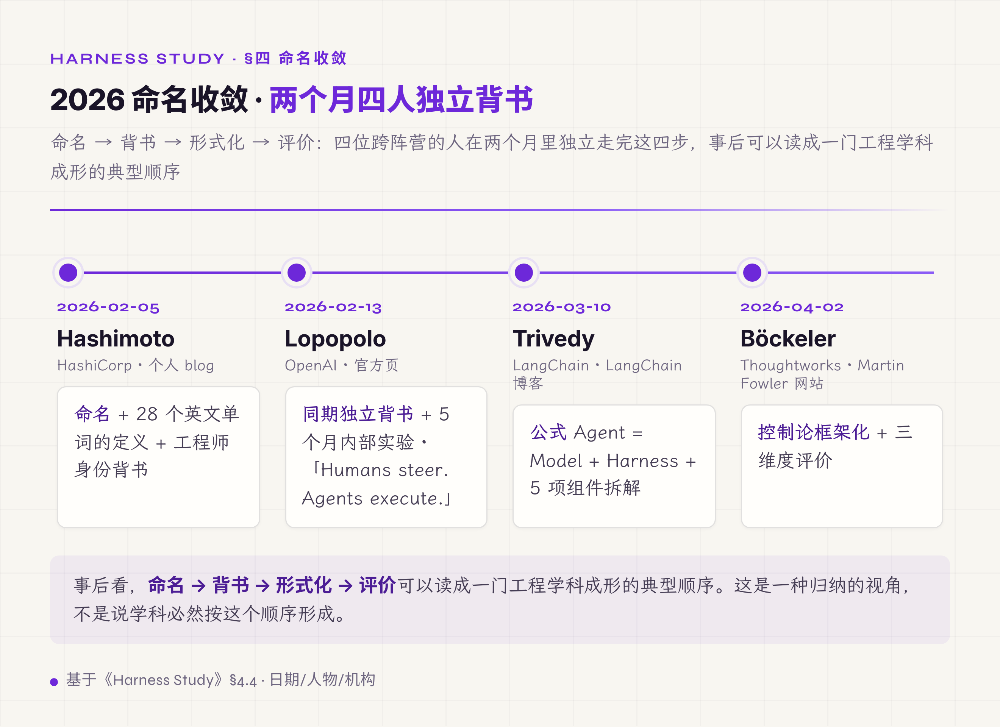
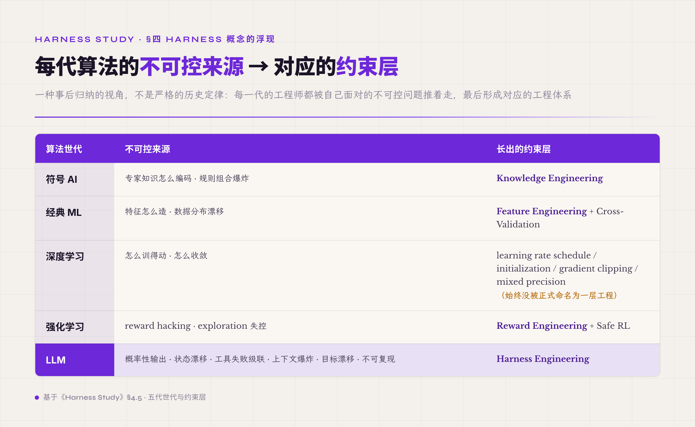

# 四、Harness 概念的浮现（2023 中–2026）

AutoGPT 那一波翻车给业界留下了一道清晰的工程命题：单靠"更强的模型加更好的 prompt"做不出可靠的多步 agent，需要在模型外围搭一整套工程系统。但这套系统**叫什么、由哪些部分组成、谁负责什么**，从 2023 年中到 2026 年初花了大约三年才慢慢清楚。本章讲这个过程：

- 先澄清一个误解：harness 不是新词（4.1）；
- 2023–2025 年业界用过的六个不同名字（4.2）；
- 两个不能跳过的工程时间点：function calling 与 tool use（4.3）；
- 2026 年初四个人在两个月里把命名、公式、组件、控制论框架逐步补齐（4.4）；
- 把 harness 放进 AI 史的跨代视角里看（4.5）；
- 工程化 agent 工具的涌现、framework 与 harness 的区分，以及为什么是 harness 这个词胜出（4.6–4.8）。

### 4.1 一个误解先澄清：harness 不是新词

很多人第一次看到"agent harness"，会以为 harness 是 2026 年凭空发明的新词。其实不然：这个词在软件工程里已经用了几十年，至少有三种成熟用法。

**测试外壳（test harness）**：单元测试早期就有的词。它把被测代码包在一层外壳里，负责准备测试夹具（test fixture，即测试数据、mock 依赖、初始状态）、运行断言、做清理（teardown），并生成测试报告。pytest、JUnit、Jest、cmocka 都是它的实现。它把"测试代码本身"和"运行测试的支撑环境"分开，是"关注点分离"的典型应用。

**评测外壳（evaluation harness）**：机器学习界用了十几年的词。它包装一个被评测的模型和一组带标准答案的基准任务，跑完输出可比较的指标（准确率、F1、BLEU 等）。EleutherAI 的 lm-eval-harness、Stanford 的 HELM、OpenAI 的 evals 都属于这一类。它在大模型时代之前就已存在，只是大模型让业界突然需要统一的标准来衡量模型有多强，它的曝光度才骤然提升。

**训练外壳（training harness）**：深度学习训练框架里常见的词。它包装训练循环（前向、反向、优化器更新），同时提供数据加载、混合精度、分布式同步、checkpoint 保存、指标日志这些支撑。HuggingFace 的 Trainer、DeepSpeed、Megatron-LM 都是它的实现，研究员因此可以专注于模型定义和损失函数。

三种放在一起看，harness 在软件工程里的词源义就清楚了：**包裹一个核心对象（被测代码、被评测模型、被训练模型），在它周围提供运行所需的支撑环境，把"核心做什么"和"运行核心需要什么"分开**。简单说，就是包裹与支撑。

所以 2026 年新出现的不是这个词，而是两件事：

1. **agent harness**：把 harness 用到一个新的核心对象上，即**跑多步任务的大模型**。这个新内核不像被测代码那样确定，不像被评测模型那样静态，也不像被训练模型那样只跑一次：它处在一种**多步执行、有副作用、带概率性**的运行形态里，需要全新的支撑方式。本书所说的 harness，就是指包在模型外面、负责上下文、工具、执行、权限与留痕的那一层程序；它连同里面的模型合起来才叫 agent（agent = model + harness，第一章已经拆过）。
2. **harness engineering**：把这层程序作为一门工程实践集中命名并传播开来。测试外壳、评测外壳、训练外壳各自是工具，没人说"test harness engineering 是一门学科"；agent harness 却复杂到需要作为独立的工程实践来研究，要有控制论框架、组件分解、工程模式、评测方法。Hashimoto 2026-02 用"harness engineering"命名这件事，是把一个工具提升为一门工程实践的关键一步。

也就是说，2026 年是**旧词新焦点**：词没变，被用到了一个比以往任何 harness 都更复杂的对象上。至于"马具"这层意思，是这个词进入 agent 语境后额外获得的隐喻，4.8 再讲。

### 4.2 2023–2025：术语未统一的"做但没名字"时期

在 harness engineering 被命名之前，业界已经在做今天叫 harness 的事，只是用六个不同的名字指称同一类工程实践：实践在做、产品在跑，但没人能用同一套词讨论它。下表按时间顺序列出这六个名字、当时实际在做什么，以及各自漏掉了什么：

*图 4.1 · 2026 命名收敛：两个月四人独立背书*

| 阶段 | 时间 | 流行术语 | 实际在做什么 | 这个名字的盲区 |
|---|---|---|---|---|
| **1. Prompt-as-app** | 2020 – 2022 中 | prompt engineering | agent = 一个长 system prompt + 几个上下文内示例 | 假设 LLM 是函数，不处理多步 |
| **2. Framework** | 2022.10 – 2023.6 | LangChain / chain / orchestration | agent = 一个软件库的对象 | Chain 是 DAG 不是循环，也不强制生产要求 |
| **3. Autonomous loop** | 2023.3 – 2023.7 | autonomous agent / AGI prototype | agent = 给目标就自己干（AutoGPT 模式，翻车） | 没有 verifier、权限策略、trajectory，必然崩溃 |
| **4. Function calling / Tool use** | 2023.6 – 2024 | function calling / tool use | agent = LLM API + 工具 schema | 只覆盖工具契约，不覆盖状态、错误、反馈 |
| **5. Scaffold / Agent system** | 2024 – 2026.1 | scaffold / agent system / agent infrastructure | agent = 模型 + scaffold | "scaffold"暗示临时支撑，"agent system"太泛 |
| **6. Context engineering 等** | 2025.6 起（context engineering） | *context engineering* / *agentic engineering* | 前者关注给模型提供恰当的上下文（含工具、记忆、检索）；后者偏开发者与 agent 协作的工作流 | 前者重心在模型看到什么，执行控制、权限、留痕不在名字里；后者是开发者视角 |

每个名字都抓到了一部分真相：Prompt-as-app 踩中了"模型还不够强，长 prompt 加几个示例确实够用"；Framework 的功劳是 LangChain 把"多次调用串起来"工业化；Autonomous loop 头一回把"自主性"这个 agent 核心特征命名出来；Function calling 标准化了 LLM 与工具的接口；Scaffold 承认了"模型外面要包东西"；Context engineering 点出上下文管理是核心难点之一。

每个名字也都漏了别的东西：Prompt-as-app 漏了多步执行；Framework 漏了生产要求；Autonomous loop 漏了工程支撑；Function calling 漏了状态和反馈；Scaffold 暗示"盖完楼就拆"，和生产 agent 长期在线的实情不符；Context engineering 的重心在模型看到什么，动作前后的控制与留痕不在它的名字里。**直到 Hashimoto 2026-02 用了 harness 这个词，才出现一个覆盖面足够全、能容纳整门工程实践的命名。**

这一时期的代表项目不同程度地具备今天 harness 的关键组件（trajectory、工具策略、上下文管理、verifier）：

- SWE-agent（Princeton，2024）；
- Claude Code（Anthropic，2025-02-24 研究预览，2025-05-22 正式发布）；
- Codex CLI（OpenAI，2025-04-16）；
- Cursor 的 Composer（0.37 版，2024-07 首见）与 agent 模式（0.43 版，2024-11）；
- Aider（开源，2023 起）。

按本书的观察，各家侧重不同：Claude Code 在 trajectory 和上下文管理上做得最深，Codex CLI 在工具注册和 sandbox 上做得最深，SWE-agent 在 trajectory 格式标准化上贡献最大。但当时各家都不用"harness"这个词，而是各说各话：agent infrastructure、coding assistant runtime、agent loop、orchestration layer。**统一称为 harness 是 2026 年的事后归纳。**

这种"实践先于命名"的滞后，知识工程、MLOps 都经历过，4.5 的洞察二会说明它为什么是必要的。到 2026 年初，早的产品（Aider、SWE-agent）已经跑了两三年，Claude Code、Codex CLI 也有了一年左右的大规模使用，踩坑经验积累够了，命名才稳得住。

### 4.3 关键时间锚点：function calling 与 tool use

2023–2025 年有两个时间点不能跳过：LLM 与工具之间的接口，在这两点上从"prompt 加正则解析"升级为"结构化契约"。它们表面上是 API 公告，实际上是大模型工程方式的两次跃迁，也是第五章 8 个 runtime 机制中工具注册（ToolRegistry）得以存在的前提。

**2023-06-13 · OpenAI function calling**。Simon Willison 当天的转述给出了最简描述：

> "You can now send JSON schema defining one or more functions to GPT 3.5 and GPT-4—those models will then return a blob of JSON describing a function they want you to call."（现在可以向 GPT-3.5 和 GPT-4 发送定义一个或多个函数的 JSON schema，模型会返回一段 JSON，描述它希望你调用的函数。）

在此之前，让 LLM 调工具的流程是：在 system prompt 里告诉模型"你可以调用 `search(query)` 或 `calculate(expr)`，输出格式是 `ACTION: 工具名(参数)`"，模型生成一行文本，外面用正则解析。模型可能漏字段、多字段、改格式（昨天用 `ACTION:`，今天用 `Action:`），还可能在解释性文字里插入看似 action 的字符串误导解析器。失败方式也很隐蔽：不抛异常，而是解析出一个看似合法、参数其实有问题的调用。

function calling 把这件事变成了**结构化契约**：你给模型一个 JSON schema（函数名、参数列表、每个参数的类型和描述），模型返回一个对着 schema 专门微调过的 JSON 对象。这里有两级跃迁要分开：

- **2023-06 给的是契约，不是保证。** 它靠微调实现，OpenAI 当时的文档就提醒，模型仍可能生成不合法的 JSON，或幻觉出不存在的参数。
- **硬保证要到 2024-08 的 Structured Outputs（严格模式）才补上。** 这一级改用约束解码（constrained decoding）：生成时只允许能让最终输出符合 schema 的 token 被采样，违反 schema 的 token 概率被压到零。

契约先行、保证后补，中间隔了一年多，5.3 讲严格与宽松 schema 时还会回到这条线。即便如此，2023-06 这一步已经把工具调用拉进了 API 的正式接口，结构化校验、不依赖正则的解析从这里开始。

它的意义在于释放了注意力。此前写 prompt 的诀窍有一半是在教模型生成可解析的文本；此后这件事由 OpenAI 在模型侧解决了，工程师可以转向工具注册怎么设计、策略放在哪里、verifier 怎么写、观察结果怎么序列化。**业界从此有余力讨论 agent 工程的高层问题。**

官方公告在 https://openai.com/index/function-calling-and-other-api-updates/ ，署名的是 Atty Eleti、Jeff Harris、Logan Kilpatrick。公告里还建议，对带真实世界影响的动作（发邮件、发帖、采购），执行前先向用户确认。这可以看作后来工具策略（ToolPolicy）里 `requires_confirmation` 字段的早期源头：工具调用前先过策略检查，由策略决定直接执行、交人审批或拒绝。这一机制后来成为生产 harness 的必备部分。

**2023-11-21 · Anthropic Claude 2.1 加入 tool use beta**。同一天 Anthropic 做了两件事：Claude 2.1 把上下文窗口从 100K 扩到 200K token，同时开放 tool use 测试版（之后 2024-04 公开测试，2024-05-30 正式发布）。官方原话：

> "By popular demand, we've also added tool use, a new beta feature that allows Claude to integrate with users' existing processes, products, and APIs."（应大家的要求，我们还加入了 tool use，这是一项测试功能，让 Claude 能接入用户现有的流程、产品和 API。）

两件事放在同一天，可以这样理解：每次工具调用的结果都要塞回上下文，调用多了窗口就会爆，**只有把上下文大幅扩展，tool use 才真正可用**。tool use 和上下文管理是一对孪生问题，第五章把它们拆成相邻的两个机制：5.3 工具注册决定"哪些工具能调、调时带什么参数"，5.4 上下文管理决定"工具返回的大输出怎么进上下文而不爆窗口"。两者必须协同设计，否则一边的进步会被另一边的限制抵消。

两者打通后，到 2024 年中，行业大体接受了一个简化公式：**agent = LLM + 工具 schema + 外面包一些代码**。它承认了工具是核心组件、模型 API 里要有结构化的工具接口，比"把模型当函数用"进了一步。但"外面包的一些代码"是什么，还没人说得清：LangChain？自写的 Python 脚本？SWE-agent 的 trajectory 框架？Cursor 内部的某个运行时？各家各有实现，没有统一名字、统一组件清单、统一的控制论框架，彼此无法精确比较。这个状态一直持续到 2026 年 2 月。

### 4.4 2026 命名收敛 · 两个月四人独立背书

harness engineering 的命名，关键事件集中在 2026 年 2 月初到 4 月初。这两个月里，四个人从各自的位置写出关键文章：

- Hashimoto 以资深工程师的身份命名；
- Lopopolo 以 OpenAI 内部实验背书；
- Trivedy 从 LangChain 这个框架阵营内部给出公式和组件拆解；
- Böckeler 从 Thoughtworks 咨询的视角做了控制论化的框架。

四人来自完全不同的阵营，却在两个月内写出高度互补的文章。这不是抄袭，也很难说是巧合，更像是业界已经积累了足够多的实践共识、只差一个统一名字的信号。"实践积累两三年，命名收敛两三个月"的模式在 IT 史上反复出现，MLOps 就是一例（4.5）。下面按时间顺序逐个看。

#### Hashimoto 2026-02-05 · 命名的工程师身份背书

**Mitchell Hashimoto** 在 *My AI Adoption Journey* 一文中提出并推广了"harness engineering"这个叫法。他是 HashiCorp 联合创始人、Terraform 作者。Terraform 不是机器学习或学术工具，而是大规模分布式系统的基础设施定义语言，Hashimoto 十几年处理的是"大型分布式系统怎样被可靠地构建和运维"。这样一位工程师说"我把跟 agent 协作的工程实践叫做 harness engineering"，这个命名自带工程分量：它不是营销造词，也不是论文标题，而是写过生产系统的人从实践里提炼出来的词。

他的措辞很谨慎：说这是自己"逐渐称为 harness engineering"的工作方式，并表示不确定行业是否已有通用术语。也就是说，他**没有宣称这是一门学科**。把它当作一门工程学科，是后来 Trivedy、Böckeler 和本书的归纳；Hashimoto 给的是命名的起点。

他给出的核心定义只有 28 个英文单词：

> "the idea that anytime you find an agent makes a mistake, you take the time to engineer a solution such that the agent never makes that mistake again"（每当发现 agent 犯了一个错误，就花时间设计一个解决办法，让 agent 再也不犯这个错误。）

这条定义可以借控制论的前馈、反馈语言来读（本书借用控制论的若干概念作类比，第九章展开）：

- **find a mistake** 像传感器检测到偏差，要求 harness 里有 verifier、trajectory、观察机制，让错误"看得见"。
- **take the time** 是工程投入：修复机制要专门花时间设计。
- **engineer a solution** 像调整控制器：不是改 prompt 求它"下次别犯"，而是在 harness 层固化一个机制，让这类错误在结构上难以再发生。
- **the agent never makes that mistake again** 是工程目标，不对应控制论意义上的闭环收敛保证：修复只覆盖已经发现的那一类错误，新的错误还会出现，所以这个过程要持续进行。

需要注意：**Hashimoto 的原文并没有给出"Agent = Model + Harness"这个流传最广的公式**，它来自后面的 Trivedy。

#### Lopopolo 2026-02-13 · OpenAI 内部 5 个月实验的官方背书

8 天后，OpenAI 的 Ryan Lopopolo（Member of Technical Staff）发表了 *Harness Engineering: leveraging Codex in an agent-first world*。两篇文章几乎同时出现：Hashimoto 是个人实践的总结，Lopopolo 是 OpenAI 内部至少 5 个月实验之后的官方文章。两者在同一时间窗落到同一个词上，说明这个词出现的条件在 2026 年初已经成熟。

Lopopolo 的口号浓缩了全文主张：

> "Humans steer. Agents execute."（人定方向，agent 执行。）

传统开发里，工程师亲手写每一行代码。Lopopolo 描述的工作方式是：工程师**不直接写代码**，核心工作变成三项：

- **环境设计**：给 agent 配什么工具、什么 sandbox、什么权限；
- **意图说明**：用什么样的 prompt、指令、规格把任务说清楚；
- **反馈回路构建**：怎么评估 agent 的输出、怎么做消融、怎么发现 agent 在哪些场景下还不行。

这三项合起来就是 harness engineering：工程师从"敲键盘的人"变成"agent 工作环境的设计者"。

文章描述了一个 5 个月的内部实验：从空仓库起步，用 Codex 生成应用代码、测试、CI、文档、可观测性和内部工具。关键在于**团队的精力主要没有花在调模型上，而是花在调模型周围的 harness 上**：配什么 sandbox、工具集、指令、反馈回路。这可以读作 OpenAI 在官方渠道承认，harness 这一层比模型本身更值得花精力优化。

从发表日期往回推，OpenAI 内部大约从 2025-09 就在做这件事。同期的 Anthropic（Claude Code）、Cursor、Replit、Aider 很可能也在做同样性质的事，只是没有公开命名。这也解释了 2026 年初命名为什么收敛得这么快：业界私下已经做了至少半年到一年。

文章的官方地址是 https://openai.com/index/harness-engineering/ （部分客户端抓取会返回 403）。作者是工程师而不是研究员，发表渠道是 OpenAI 官方页面而不是个人博客，这让它成为 **OpenAI 官方对 Hashimoto 命名的背书**。

#### Trivedy 2026-03-10 · 框架阵营的公式化与组件拆解

又过了约一个月，**Vivek Trivedy** 在 LangChain 博客发表 *The Anatomy of an Agent Harness*。LangChain 是 2022-10 出现的最早一批 agent framework，这篇文章的意义在于：**框架阵营主动承认 framework 不够，需要 harness 这一层，而且这一层在 framework 之上，而不是它的子集**。

Trivedy 给出了今天被引用最广的公式和定义：

> "Agent = Model + Harness. If you're not the model, you're the harness."（agent 等于模型加上 harness。除了模型，剩下都是 harness。）

> "A harness is every piece of code, configuration, and execution logic that isn't the model itself."（harness 是一切不属于模型本身的代码、配置和执行逻辑。）

这两句的含义在第一章"三个权威定义的递进"一节已经拆过：第一句是**分解公式**，第二句是**排除式定义**。这里要补的是，Trivedy 还把 harness 拆成 5 项组件，第一次把"模型外面那层"具体化成可讨论的组件清单：

- **System Prompts**（系统提示词）；
- **Tools, Skills, MCPs**（工具、技能、Model Context Protocol 集成）；
- **Bundled Infrastructure**（文件系统、sandbox、浏览器等运行环境）；
- **Orchestration Logic**（子 agent 派生、交接、模型路由）；
- **Hooks-Middleware**（上下文压缩、续跑、lint 检查）。

它和本书第五章的 8 个 runtime 机制加 1 个 Safety 控制面（每次工具调用都必须经过、不可绕过的检查层，见 5.9）不是一一对应的。Trivedy 的切法更粗：本书的模型适配、观察包装、trajectory 隐含在 Bundled Infrastructure 和 Orchestration Logic 里，verifier 和 Safety 隐含在 Hooks-Middleware 里。但他**第一次把 harness 当成可以按组件拆解的工程对象**，而不再是模糊的"模型外面那层"。

从 2022-10 LangChain 发布到这篇文章，三年半里框架阵营从"agent 就是 chain"走到"agent = model + harness，framework 只是 harness 的一种实现材料"。这种来自框架阵营自身的概念升级，比外部学者写论文批评 framework 不够更有分量。

#### Böckeler 2026-04-02 · 咨询界的控制论框架化

三周左右之后，**Birgitta Böckeler**（Thoughtworks Distinguished Engineer）在 Martin Fowler 的网站上客座发表 *Harness Engineering for Coding Agent Users*。咨询师每年接触几十家公司的工程实践，关心的是"这套方法在不同组织里怎么落地"。Böckeler 把 harness engineering 整理成可以给客户讲清楚的形态，完成了从"它是什么"到"怎么评价、怎么改进"的跨越。

她把 Hashimoto 和 Trivedy 的概念改写成控制论的形态：

> harness = **guides (feedforward controls) + sensors (feedback controls)** + humans steering iteratively based on observed failures
>
> （harness = 引导（前馈控制）+ 传感器（反馈控制）+ 人根据观察到的失败迭代调整方向）

意思是：**harness 不是被动的代码外壳，而是一套控制系统**。

- **前馈（feedforward）是事前约束**：规则、文档、工具、prompt 指令、权限边界，在 agent 行动之前规定什么能做、按什么形式做。
- **反馈（feedback）是事后检查**：测试、lint、AI 审查、verifier、trajectory 分析，在 agent 行动之后判断做对没有、错在哪里、要不要重试。
- **人**在循环里根据观察到的失败迭代调整，这正是 Hashimoto "engineer a solution" 的咨询版表述。

这里的前馈、反馈是借用控制论的类比（Böckeler 的说法），好处是没读过控制论原著的工程师也能立刻把握。

她还给 harness 定了三个评价维度：**可维护性（maintainability）**，即 harness 本身能否被持续维护；**架构契合度（architecture fitness）**，即它与现有系统是否融合；**行为（behavior）**，即 agent 的实际行为是否在约束下符合预期。有了这三个维度，harness 就成了可被外部评审的工程对象，咨询师可以拿它评估客户项目，工程师可以拿它自评。可评价是一个工程对象从手艺走向学科的关键标志：没有评价标准就没法比较好坏，也就形成不了最佳实践和教学。

#### 四人独立背书的工程史含义

把四件事按时间排开：

- **2026-02-05 Hashimoto**（个人博客）：命名，给出 28 个英文单词的定义；
- **2026-02-13 Lopopolo**（OpenAI 官方页）：5 个月内部实验，"Humans steer. Agents execute."；
- **2026-03-10 Trivedy**（LangChain 博客）：公式 Agent = Model + Harness，5 项组件拆解；
- **2026-04-02 Böckeler**（Martin Fowler 网站）：前馈与反馈框架，三个评价维度。

事后看，可以把这四步读成一门工程学科成形的典型顺序：先有命名，再有权威背书，再有形式化，最后有外部评价框架。这是一种归纳的视角，不是说学科必然按这个顺序形成。

还有一点值得注意：**四个人没有一个是学术研究者**，分别是开源工程师、大厂内部工程师、框架公司的员工和咨询师。这和 MLOps 相似：MLOps 的奠基论文（Sculley 等，NeurIPS 2015）也出自 Google 内部工程团队。harness engineering 是由工程实践推动出来的，而不是从理论推导出来的。学术论文（比如 AHE[^ahe-2026]）随后跟上做形式化，但实践往往走在理论前面，所有"权威定义"都要回到生产案例里验证才算数。

### 4.5 跨代视角 · harness 不是孤例

放进 70 年 AI 史里看，harness engineering 不是孤例，而像是每一代算法范式都经历过的"实践积累、约束层命名、学科形成"过程的又一次重演。先说清分寸：这是事后归纳的视角，帮人看清 harness 所处的位置，不是严格的历史定律。有的世代（比如深度学习的训练技巧）连约束层都没被正式命名过，硬凑成整齐的"第 N 次"反而失真。

#### 三个跨代洞察

**洞察一：每代约束层都在回答同一个问题，这一代算法的"不可控来源"是什么？**

可以这样看：算法形态决定了它需要什么样的工程层包围。

- **符号 AI**：不可控来源是"专家知识怎么编码、规则组合爆炸"，知识工程（Knowledge Engineering）的工具体系（规则集、推理机、解释系统）专门回应这两个问题。
- **经典机器学习**：不可控来源是"特征怎么造、数据分布漂移"，对应特征工程与交叉验证。
- **深度学习**：不可控来源是"怎么训得动、怎么收敛"，于是有学习率调度、初始化技巧、梯度裁剪、混合精度训练。它们没有被正式命名为"Training Engineering"，但实践上构成了完整的工具链。
- **强化学习**：不可控来源是"奖励投机（reward hacking）、探索失控"，对应奖励工程（Reward Engineering）与安全强化学习（Safe RL）。

从这个角度看，**每一代的工程师都是被自己面对的不可控问题推着走，最后形成对应的工程体系**。

*图 4.2 · 五代算法的不可控来源与对应的约束层*

大模型这一代的不可控来源，前面三章已经讲过：单步预测的概率性输出、多步执行的状态漂移、工具调用的失败级联、上下文窗口的爆炸、目标漂移、不可复现。这六项就是 harness engineering 要回应的工程命题。可以预见，当下一代算法（比如完全多模态的推理 agent，或能自我改进的研究循环）进入生产，新的不可控来源会出现，业界会再造一个"X engineering"来命名那一代的约束层。

**洞察二：术语的命名总是滞后于实践几年到十几年，这个滞后是必要的。**

- **知识工程**：DENDRAL 项目 1965 年启动，到 1977 年 Feigenbaum 在 IJCAI 发表讨论知识工程的论文，相隔约 12 年。
- **MLOps**：机器学习大规模进入生产在 2010 年代中期；2015 年 Sculley 等人的论文点出问题域，2017–2018 年 Google、Uber、LinkedIn 等公司陆续发表内部机器学习平台的文章，专门的教科书（Hapke & Nelson《Building Machine Learning Pipelines》，2020-07）和课程（吴恩达的 MLOps 专项课程，2021-05）出现在几年之后。
- **harness engineering**：从 Aider（2023）、SWE-agent（2024）、Cursor 的 Composer 与 agent 模式（2024-07 起），到 Claude Code（2025-02）、Codex CLI（2025-04），再到 2026-02 命名，早的实践滞后约三年，晚的只有一年左右。

滞后看起来是"行业反应慢"，其实是一种自我保护：名字要等足够多的实践案例积累之后才稳定，起得太早会被后续实践推翻。假如 2021 年有人把"prompt engineering"当作整个大模型工程的统一名字，到 2023 年 function calling 出来它就装不下工具调用，到 2024 年 trajectory、verifier、消融这些做法成熟，它就彻底过窄了。Hashimoto 2026 年才提 harness engineering，此时 2024–2025 年的实践已经验证了"模型外面那层"的组件清单，名字才稳得住。

对读者的意义是：**下一代算法出现时，不要急于给它的工程层起名字。** 等业界跑两三年生产用例、积累足够多的踩坑案例，命名自然会从工程师社区里浮上来。每隔一段时间就有人推一个新的"X engineering"，多数没被接受，原因正是实践积累还不够厚。

**洞察三：术语的诞生不等于概念的诞生，但术语对学科形成是必要的。**

DENDRAL 1965 年起就在做今天叫知识工程的事，MYCIN 在 1972–1976 年开发，但直到 1977 年 Feigenbaum 在 IJCAI 发表知识工程的论文，这类工作才有了一个可以在论文标题、会议、教材里共用的名字。harness engineering 在 2026 年的命名是同一件事的重演：给业界这几年积累的实践共识一个能在论文、会议、招聘要求、教材里通用的名字。

**命名是一个工程领域从手艺走向学科的标志**：没有名字，就没法比较、没法教学、没法形成共同语言。所以 Hashimoto 那篇文章的工程史地位高于它的篇幅：它描述的实践业界已经做了一段时间，但它给这些实践命了名。从这个角度看，2026-02-05 是 harness engineering 的真正起点：这一天前后，业界做的事在工程上没有差别，但之前是各家的手艺，之后是共享的工程实践。

#### Harness 跟 MLOps 是同辈关系

与前几代约束层相比，harness engineering 最相似的同辈是 **MLOps**。两者出现在同一种情境里：一类算法范式经过几年生产积累，业界发现光有算法不够，需要一整套工程层包围它，于是给这一层起了名字。

两者在几个维度上结构相似：

- **核心对象**：MLOps 管训练好的机器学习模型（分类器、回归器、嵌入模型）；harness 管大模型及其多步执行。
- **不可控来源**：MLOps 处理数据漂移、模型衰减、部署不一致；harness 处理概率性输出、长任务漂移、工具失败。
- **奠基性论点**：MLOps 是 Sculley 等人 2015 年在 NeurIPS 发表的 *Hidden Technical Debt in Machine Learning Systems*，文中指出真实的机器学习系统里，机器学习代码只占很小一部分（论文估计至多约 5%）；harness 是 Trivedy 2026-03 的"Agent = Model + Harness"。
- **命名滞后**：MLOps 从 2015 年那篇论文到 2020–2021 年出现专门的书和课程，前后约五六年；harness 从最早的产品实践到 2026 年命名，约一到三年。

最有意思的相似点是**奠基性论点的结构相同**：都在说"算法本体只是整件事的一小部分，剩下的部分本身就是一门独立的工程实践"。一门约束层学科要成立，先要承认它要管的东西在已有学科里位置太边缘：MLOps 说"机器学习代码只占一小部分"，harness engineering 说"模型只是 agent 的一部分"。

照 MLOps 的节奏，harness engineering 在 2026 年 2–4 月的密集事件之后，2026–2028 年可能经历类似的快速成熟，这也是本书在 2026 年中写成的依据。

#### 但同辈关系也有边界 · MLOps 跟 Harness 的根本不同

两者虽是同辈，管的却是完全不同的事。这条边界要讲清，否则会让人误以为"harness 是 MLOps 的子集"，或"两者是一回事换了个名字"，这两种误解在 2026 年初的讨论里都出现过。

**MLOps 主要处理"模型训完上线之后的事"**：数据版本管理、模型注册、特征存储、A/B 测试、模型监控、漂移检测、再训练流水线、部署基础设施。这些都发生在推理调用之前或之外，核心问题是"怎样让一个训好的模型在生产环境长期可靠地工作"。

**harness 主要处理"每一次推理调用前后的事"**：工具注册决定每一步能调什么工具，上下文管理决定每一步看到什么，trajectory 记录决定每一步留下什么，verifier 决定每一步怎么判对错，Safety 控制面决定哪些动作要拦。核心问题是"怎样让一个带概率性、多步执行、有副作用的 agent 在任务过程中持续可控"。

差别的根源在于**多步执行**。传统模型"输入一份数据，输出一份预测"，是一次性的推理调用；大模型 agent"接到目标、拆任务、调工具、看反馈、改决定，直到完成"，是持续的多步过程。多步过程带来了 MLOps 没处理过的命题：状态管理、错误处理、循环检测、上下文压缩、轨迹记录、跨步验证、权限边界。反过来，数据漂移、模型衰减 harness 也不处理：它假定模型权重固定（由推理服务侧负责），只管推理过程怎么用这个模型。

所以，**harness 不是 MLOps 的子集或扩展，而是一门并行的工程实践**，只是起源方式（实践先行、命名跟随）和成形路径相似。这样理解能避开两个误解：

- "我们已经做了 MLOps，不用单独做 harness"：错。MLOps 管"模型怎么活"，harness 管"agent 怎么干活"。
- "harness 就是给大模型用的 MLOps"：也错。harness 必须有 MLOps 没有的组件（trajectory、verifier、工具策略、Safety 控制面），而 MLOps 的核心组件（特征存储、漂移检测、A/B 测试）在 harness 里几乎用不上。

#### 同期并行综述 · Code as Agent Harness

写作本书的过程中，2026-05-18 arXiv 上出现了一篇 42 位作者的大综述 *Code as Agent Harness*[^code-as-agent-harness-survey-2026]，主题与本书高度重合，时间只差两天。这可以看作 2026 上半年命名收敛之后，业界集中做系统梳理的一个信号。

综述把 harness 拆成三层：接口（interface，代码怎样连接推理、动作与环境建模）、机制（mechanisms，规划、记忆、工具使用、反馈控制）、扩展（scaling，从单 agent 到多 agent）。它的摘要列了六项开放挑战：评测不止看最终任务成败；反馈不完整时怎么验证；怎样改进 harness 而不带来回归；多 agent 之间怎样保持共享状态一致；安全关键场景怎样保留人的监督；怎样扩展到多模态。（正文 §5.2 另外展开了第七项"Toward a Science of Harness Engineering"，属于元层面的方向，与前六项性质不同。）

这六项挑战与本书主线高度对应：

- 第五章讲 verifier 的三层划分、泄漏防御与"产物声明不符"（Artifact Claim Mismatch）的部分，回应"评测"与"不完整反馈下的验证"；
- 第七章 Harness Lab（本书对"用评测、消融、调参迭代改进 harness 的外层工作台"的命名）的"观察、打分、消融、调参、迭代"循环，对应"无回归改进"；
- Safety 控制面对应"人的监督"；
- 可组合性与 fork-join 的部分，对应"多 agent 共享状态一致"。

两份材料的切入角度互补。**综述从"代码作为 agent 的执行基底"切入**，强调代码是 agent 推理、动作、环境建模和验证的统一接口；**本书从"模型外的工程层"切入**，沿用 Trivedy 的公式，把模型外那一层分成 8 个 runtime 机制、1 个 Safety 控制面、工程模式和工作台，强调每个机制可以单独讨论。综述的三层覆盖了本书 8 个 runtime 机制的大部分内容，综述更偏概念，本书更偏操作。读完本书后，推荐再读这篇综述，作为同期的独立印证和学术视角的补充。

### 4.6 LangGraph 与"工程化 agent 工具"的涌现

在命名收敛的同时，工程化 agent 工具也在集体演进，它们正是 harness engineering 赖以成形的素材。命名能在 2026 年初稳定下来，是因为 2024–2025 年一批跨阵营的产品把 harness 该是什么形态验证清楚了。

#### LangGraph 的演化轨迹

LangChain 2022-10 发布时是一个 Chain（DAG）框架。到 2023–2024 年，业界普遍发现 Chain 不够用：agent 需要循环、状态、中断后恢复。LangChain 团队于是在 2024 年发布 **LangGraph 库**，让开发者显式画出 agent 的状态机，承认 agent 是有状态的循环过程，而不是无状态的单向流水线。框架阵营自己承认核心抽象不够并主动升级，是成熟工程组织的标志；但它也暴露出 framework 的根本限制：所有抽象都是建议性的，你可以用 LangGraph 写状态机，也可以不用。

2025-05-14，LangChain 推出 **LangGraph Platform GA**，一个提供生产部署、监控、调试和扩容的托管运行环境，说明团队判断这套抽象已经稳定到可以作为基础设施服务出售。2025-10 又推出 **LangGraph v1.0**，意味着 API 稳定承诺。一年半里，agent 状态机从实验性的新抽象变成了工业级的生产组件。

但 **LangGraph 仍然属于 framework，不是 harness**。它提供画状态机的能力和运行状态机的运行时，却不强制"必须有 trajectory、verifier、工具策略"这类生产要求：你可以用它写一个完全没有 verifier 的 agent，也可以跑生产而不记 trajectory，它都不会阻止。这就是 Trivedy 把两者区分得那么清楚的原因。LangGraph 可以作为 harness 的实现基础，但工程师要自己在上面叠一层强制约束才算 harness。

#### 跨阵营的代表产品

同一时期，一批跨阵营的代表产品密集成熟：

- **Anthropic 的 Claude Code**：2025-02-24 随 Claude 3.7 Sonnet 以研究预览形式推出，2025-05-22 随 Claude 4 正式发布，命令行形态。
- **OpenAI 的 Codex CLI**：2025-04-16 与 o3、o4-mini 同时发布，源码开源。
- **Cursor 的 Composer**：0.37 版（2024-07）以测试功能首次出现，0.43 版（2024-11）加入 agent 模式，内置在 IDE 里，可在多个模型间路由。
- **Aider**：2023 年起的开源命令行工具，社区驱动迭代。

它们**不同程度地**具备今天 harness 覆盖的关键特征，具体到什么程度要看各家的公开文档与开源代码。共同特征可以归纳为四点：

**第一，工具是受控资源**：权限策略、参数校验、审计日志，不是模型说调就调。Claude Code 有分层的权限规则（deny、ask、allow）和用来注入策略的 hook 体系；Codex CLI 有 sandbox 和审批策略。模型每次发起工具调用，背后都有一套独立于模型的代码判断该不该执行、按什么参数执行、执行后怎么记录。

**第二，状态是显式资源**：trajectory 文件、会话记忆、上下文预算。Claude Code 用 JSONL 格式的 trajectory，一行一个事件；Codex CLI 用 rollout 文件。两者都把"agent 跑了什么"做成可以被外部读取、比对（diff）、回放（replay）的实体文件，状态成了有 schema、有生命周期的工程对象，而不是进程里的隐式内存。

**第三，失败是正常运行状态**：重试、回滚、verifier、消融都是常规工程动作，而不是异常处理。这些产品对工具失败、模型幻觉、循环检测都有专门设计，默认"任何一步都可能失败"，所有机制围绕这个假设构建。

**第四，复盘是可执行的**：trajectory 不是给人看的日志，而是机器可读的事件流。这是 harness 与 framework 最大的区别之一：framework 跑出来的东西通常只能看日志，看不到 agent 当时为什么这样决定；harness 跑出来的东西可以回放到任意一步，比对任意两次 run 的差异，也可以通过消融判断每个机制的贡献。

这四点合起来，就是 harness engineering 命名时所指的工程对象。**到 Hashimoto 命名时，这套实践早的已经运行了两三年（Aider 2023 年起），Claude Code、Codex CLI 也运行了一年左右**，代码里早已有 trajectory、工具策略、验证等机制，只是没有统一名字。命名把已有的东西变成了可讨论的概念，正如 4.5 洞察三所说。

### 4.7 Framework vs Harness 的根本区分

接下来必须把 **framework 与 harness 的区分**讲清楚，这是本书后面所有讨论的概念前提。分不清这两个词，就会把"我们用了 LangGraph"和"我们做了 harness"混为一谈。

#### 两个词指什么

**framework 是开发库**：LangChain、LlamaIndex、Pydantic AI、Mastra、Vercel AI SDK 都是 framework。它提供 API、抽象和便利组件，让写 agent 更快，但**不强制生产要求**：用 LangChain 可以写出 AutoGPT 那种跑 10 步就崩的玩具，也可以写出生产级的 agent。framework 假设使用者自己知道什么时候该加 verifier、什么时候该记 trajectory，所以它给的是能力，而不是约束。

**harness 是工程系统**：Claude Code、Codex CLI、Cursor、Aider（成熟度各不相同）是 harness。它把一部分生产要求做成了默认行为：默认内置 trajectory、权限策略等，部分做法（如 verifier）仍需使用者配置。它假设使用者会忘记记 trajectory、会绕过权限策略，所以把这些"该做但容易忘"的事做成默认开启的约定。两者也不互斥：**framework 可以是 harness 的实现材料**，用 LangGraph 搭一个 harness 完全可行，关键在于上面有没有叠上这层默认约束。

根本区别在于**对生产要求的态度**：framework 是宽松的（permissive），让使用者自己决定约束到什么程度；harness 是规定性的（prescriptive），要求使用者遵守它内置的约束。规定性的做法在生产环境里更可靠，因为它从源头消除了"忘了加"这类本不该发生的错误；代价是灵活性下降，想跑一个跳过权限确认的快速实验时，默认约束反而碍事。所以 framework 适合实验和原型，harness 适合生产和长期维护。

#### DOS vs Linux 类比

早期个人电脑可以跑 DOS，也可以跑 Linux，两者用同一颗 CPU，软件生态却完全不同。

**DOS 代表 framework 的思路**。它允许程序直接访问硬件：直接读写磁盘扇区、绕过文件系统可以，直接写显存也可以。它不要求"必须通过文件系统访问数据"或"必须隔离进程"，只给接口。在 DOS 上写小工具非常顺手，一个 .com 文件几十行汇编就能跑，启动快。但拿它跑服务器是灾难：任何一个程序的 bug 都可能污染整个系统，程序能读写整块内存，没有用户和权限隔离，崩溃了也没有自动恢复。这与 AutoGPT 跑长任务的失效模式是同一类：环境太自由，错误无处不在。

**Linux 代表 harness 的思路**。它**强制**进程隔离（想读其他进程的内存，没有相应权限就不行），强制权限模型（想读 /etc/shadow，要有对应权限），直接读写磁盘设备也需要权限。每个程序都跑在独立进程和受保护的地址空间里，写小工具时多了些限制和开销；但跑服务器时这就是救命的：一个 bug 不会污染整个系统，一个崩溃的进程不会拖垮其他进程，恶意程序难以轻易拿到 root。Linux 跑生产服务器可靠得多，不是因为 CPU 更快或内核更聪明，而是因为它把生产环境必需的约束做进了内核。

**AutoGPT 像 DOS 上的玩具，Claude Code 像 Linux 上的服务**：两者用的是同一代模型，但运行环境的工程约束完全不同。AutoGPT 在没有 trajectory、权限策略、验证的环境里跑，第三章那五种翻车没人拦；Claude Code 在把这些做成默认机制的 harness 里跑，同一代模型就能可靠地完成需要长串工具调用的真实工程任务。

类比的边界：操作系统是应用程序的运行基础设施，framework 和 harness 是 agent 的运行基础设施，两者并不完全对应。这里只借"约束的强制程度"这一个维度，其他维度不一一对应，但这一个维度足以把区别说清楚。

#### 一个工程师选什么的判断

- **PoC 或内部 demo**：用 framework 起步合理。LangChain 加自写 Python，一周就能跑出 demo，灵活、上手快、社区资源多。一次性、实验性、允许出错，正是 framework 最适合的场景。
- **要上生产**：需要 harness。要么自己写一个，把生产要求做成默认约束（Claude Code、Codex CLI 走的就是这条路），要么直接用成熟的 harness 跑业务逻辑。

中间路线（"用 framework，自己再加点约束"）经常失败：没有强制约定，工程师赶进度时会跳过 verifier、trajectory、权限策略，出了问题再补就来不及了。按作者的经验，这类项目在 2024–2025 年反复出现，最后要么砍掉自定义层换成现成的 harness，要么把自定义层做厚，演化成自己的 harness。

核心在于：**生产 agent 系统的可靠性不能靠工程师的自觉，要靠工程系统的强制**。人会疲倦、会赶进度、会在压力下妥协；工程系统把该做的事设为默认开启，要主动关掉才能不做。harness 这个词把"强制"写进了概念里：它叫 harness，不叫 tool kit 或 helper library，正因为它的本质是约束一个有自主性的对象，而约束要有强制性才有意义。一副允许马随时挣脱缰绳的马具只是装饰品；一个允许 agent 随时绕过权限检查的工程层也算不上 harness，只是 framework。

### 4.8 为什么是 harness 这个词胜出

业界为什么选了"harness"，而不是已经流行的 framework、scaffold、agent system、context engineering、agentic engineering？本书的看法是，关键在隐喻是否准确：一个被广泛采用的工程术语，它的隐喻要能刻画出**这件事与相似事物的核心区别**。下面先看五个候选词的盲区，再看 harness 的隐喻为什么合适。

#### "framework"（框架）的隐喻盲区

framework 这个词在软件工程里早已用熟（Spring、React、Django），隐含的关系是**开发者主动，框架被动**：框架提供 API 和抽象，运行时行为全由开发者的代码决定。

agent 跑起来之后，这种关系**反过来了**：agent 是主动的，工程系统要监视它的每一步，在它将要越界时干预，在它跑偏时阻断。framework 这个词完全不暗示这种持续的监视和介入。LangChain 能叫 framework，正因为它在 agent 运行这一层提供的是被动的 API。

#### "scaffold"（脚手架）的隐喻盲区

scaffold 在建筑上的本义是**临时支撑**，盖完楼就拆。scaffolding 这个词在儿童认知发展、教学法、强化学习里也有用法；在 SWE-bench、METR 等 agent 评测研究中，scaffold 至今仍常用来指包在模型外面的程序，与 harness 近义。

但作为整门工程实践的名字，它的"临时性"暗示与生产 agent 的实情不符。agent 用多久，包裹它的工程层就要跟多久；越成熟的 agent 系统，工程层反而越复杂、越严密：Claude Code 发布以来一直在加 hook、加权限策略，没有任何"拆脚手架"的迹象。用一个暗示"会被拆掉"的词描述一个不会被拆掉的工程层，是隐喻上的错位。

#### "agent system" / "agent infrastructure" 的隐喻盲区

这两个词太泛。"system"在 IT 圈可以指操作系统、分布式系统、数据库系统、推荐系统，"infrastructure"也一样。说"agent system"时，听众想到的可能是 agent 跑的 Python 进程、它用的工具集、它部署的 k8s 集群，或它连的数据库。

工程术语的力量在于**每个工程师脑子里浮现的是同一个具体的东西**："verifier"就是判定 agent 输出对错的代码，"trajectory"就是 agent 每步动作和反馈的事件流文件。"agent system"小到一个脚本、大到整个公司的 AI 平台都能指，没法支撑精确讨论。

#### context engineering 与 agentic engineering 的盲区

2025 年流行过的两个相关术语，都没有胜出。

**"context engineering"（上下文工程）**：2025 年 6 月 Shopify 的 Tobi Lütke 发帖推广，Karpathy 随后附议，由此流行开来。它关注给模型提供恰当的上下文，外延并不窄，工具、记忆、检索都在其中。它的盲区在于重心：它回答的是"模型在每一步看到什么"，而 harness 还要管模型看到之后发生的事，包括动作执行前的权限检查、执行后的验证、全过程的留痕与复盘，以及用消融衡量每个机制的贡献。context engineering 是 harness 工程里很重要的一个切面，但用它命名整个工程层，执行控制这一半就没有着落。

**"agentic engineering"**：Karpathy 等人也用过这个词，偏向描述人怎样与 agent 协作写代码。这是**开发者视角**，而不是 **agent 工程组件视角**："agentic"强调 agent 的自主性，而工程组件描述的是包裹 agent 的那一层，两个层级被这个词混在了一起。两个工程师讨论"agentic engineering 怎么做"时，一个可能在谈开发工作流，另一个在谈 verifier 设计，却都以为在谈同一件事。

#### "harness"（挽具/马具）的隐喻精准

4.1 讲过，harness 在软件工程里的词源义是包裹与支撑。进入 agent 语境后，这个词又额外获得了一层隐喻：它的日常本义是**给马戴的挽具、马具**。这层隐喻在三个方面恰好贴切，每一方面都是其他候选词没有覆盖的。

**第一，约束一个有自主性的对象**。马会乱跑、会受惊、会不听指令、会自己绕路；大模型也有概率性的"自主"：同一份 prompt 跑两次可能给出两个答案，可能在某一步选错工具，可能"忘了"前面做过什么。其他候选词都不暗示被约束的对象有自主性：framework 暗示框架被动，scaffold 暗示静止的支撑，infrastructure 暗示被动可用的底座，context engineering 着眼于给模型的信息，agentic engineering 把视角放在开发者一侧。只有 harness 暗示**被约束的一方有自己的脾气**。很多写过生产 agent 的工程师都有同感：和 agent 协作更像驯马，不像写 React 组件。

**第二，约束工具是一整套，不是单件**。一套马具由缰绳（reins）、口衔（bit）、鞍（saddle）、脚蹬（stirrups）、笼头（halter）、眼罩（blinkers）等部件配合而成，与 agent harness 由多个机制配合的结构相似。framework 暗示"一个库"，scaffold 暗示"一组临时杆件"，infrastructure 暗示"一层底座"；harness 暗示"多个部件配合的一套工具"，与第五章 8 个 runtime 机制加 1 个 Safety 控制面的结构对得上。

**第三，驯化是持续过程，不是一次性事件**。驯马师每天和马打交道，根据马的脾气调扣眼松紧，根据天气调缰绳力度，根据训练阶段增减部件。这种"根据反馈持续调整"正是 Hashimoto 那条定义的核心：每当发现 agent 犯错，就花时间设计一个解决办法。harness 暗示的是**工程师与 agent 长期共处的关系**；framework 是"一次性引入的库"，scaffold 是"用完就拆的杆"，infrastructure 是"建好了放在那里"。

Hashimoto 选这个词的直觉是对的：它用一个词点出了大模型工程的核心矛盾，**概率性与可控性**。工程师要的不是消除模型的"自主"（消除了就回到 GPT-3 时代的纯函数），而是把它约束到可控范围，正如驯马师不是把马变成机器，而是把马的自主性塑造成可以骑乘的形态。

#### 类比的边界

大模型不是真的马。**马是有意识的生物**，有情感、记忆和学习能力；**大模型是概率性的函数**，没有意识，没有跨调用的记忆（除非 harness 替它存），也不会自己学习（除非微调）。马自己会变好：年纪大了脾气稳了，训练多了更配合。模型自己不会变好：同一个 GPT-4 用一年还是同一个 GPT-4，今天犯的错明天还会犯，除非 harness 层固化了修复机制。

所以 Hashimoto 的定义对 harness 格外重要：它点出了大模型与马**最大的不同**。马会自己学，大模型不会，harness 必须替模型把每一次错误的修复固化到环境里。这也是马具这个比喻虽不完美、却仍最贴切的理由：其他候选词连被约束对象的特性都没有说清，更谈不上"约束方式必须固化在环境层"。

#### 跨代命名的同辈关系

4.5 已经把 harness 放进 AI 史的跨代规律里看过：每一代算法范式都需要一个新的"X engineering"来命名它的约束层，而命名要滞后于实践几年才稳定。harness engineering 是最近的一次，它回应的是概率性输出、长任务漂移、工具失败，以及模型不会自学、需要在环境层固化修复。

harness 这个词在 2026 年初胜出，归结起来有三点：它的隐喻刻画了大模型工程的核心矛盾（概率性与可控性）；它出现在业界已经积累了足够实践共识的时刻；它由跨阵营的四个人在两个月内相继背书（4.4）。三点合起来，harness engineering 这门工程实践正式成形。

---

## 引用脚注

[^ahe-2026]: Agentic Harness Engineering: Observability-Driven Automatic Evolution of Coding-Agent Harnesses · arxiv 2604.25850 · 复旦 + 北大 + 奇绩智峰（11 人）· 预印本 · 2026
[^code-as-agent-harness-survey-2026]: Code as Agent Harness · arxiv 2605.18747 · UIUC + Meta + Stanford（42 人 · Xuying Ning 一作）· 预印本 · 2026-05-18
