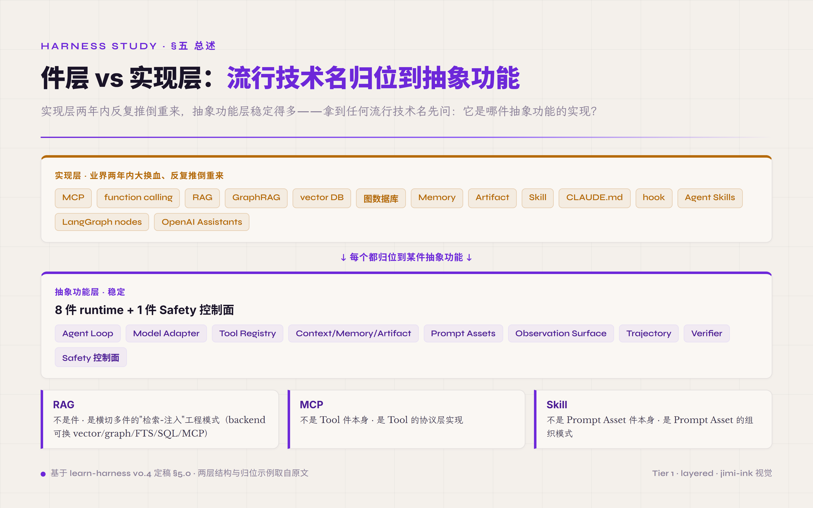

# 五、Harness 必备机制 · 8 件 runtime 加 1 件 Safety 控制面

#### ★ 两个贯穿全书的基础词：run 与 turn ★

后面大量出现 `run` 和 `turn`，先把这两个词钉死——它们是一对**层级关系**，混了会看不懂后面的状态管理和 self-evolution。

- **turn**：agent 的**一个推理回合**——一次 thought → action → observation（一次模型推理 + 它触发的工具调用 + 返回的观测）。只思考、不调工具，也算一个 turn。
- **run**：**一次完整的任务执行**——从接到任务到产出结果，中间通常包含多个 turn。

关系是 **一个 run 由多个 turn 组成**。后文的「跨 turn」指一次任务内跨回合（如 Memory 跨 turn 保留），「跨 run」指多次任务执行之间（如 Artifact、self-evolution 跨 run）。

§一到 §四 讲的是 harness 这个词的概念层——什么是 harness、它怎么从无名到有名、它跟 framework 在工程治理纪律上有什么根本差别、为什么它跟 MLOps 是同辈关系。这一节往工程层走一步：一个具体的 harness 在落地时由哪些机制构成、每件机制解决什么具体问题、件与件之间怎么协作、各自的工程优先级是什么。**这一节是设计 harness 时真正要落地的内容**——读完后读者脑子里应该能建出一个具体画面：一个生产 agent 跑一次任务，从模型发起请求、到工具被调用、到结果回到上下文、到产物被验证、到事件流落盘成 trajectory、到下一轮决策做出，背后是哪几件机制在按什么顺序协作。如果只读到 §四就停下，读者停在"harness 是个好概念"的水平——但概念能不能落地、要落地多少模块、每个模块投入多大成本，§五是回答这些问题的章节。

业界对"一个 harness 由几件机制构成"没有定论。不同工程团队给的清单从 3 件到 9 件不等，这种分歧不是行业混乱，是不同切入视角带来的合理差异——从治理目的看 harness 跟从工程组件看 harness 或从技术堆栈看 harness，自然会得到不同的机制组合。**Augment Code 走的是 3 层切法**——Constraint / Feedback Loops / Quality Gates。Constraint 回答"agent 能做什么不能做什么"，Feedback Loops 回答"agent 怎么知道自己做得对不对"，Quality Gates 回答"什么时候允许产物离开 agent"。这种切法从治理目的出发、抽象度高、概括性强；缺点是落地时每一层下面还要再拆出多个具体机制，跟代码模块不直接对应。**Vivek Trivedy 走的是 5 项切法**——System Prompts / Tools / Bundled Infrastructure / Orchestration / Hooks & Middleware。每一项直接对应 harness 代码库里能找到的模块。这种切法从工程组件出发、工程师能照着搭；缺点是 Bundled Infrastructure 是个杂物袋——里面塞了 context 管理、memory 跨 turn 状态、artifact 跨 run 产物等好几件本应各自单列的机制——粒度不均匀。**还有从具体技术堆栈出发列到 7-9 项的更细切法**——把 model interface / tool registry / context manager / planning / execution / memory / feedback / safety / orchestration 等每个工程机制单独立件（arxiv 2605.18747 Code as Agent Harness 就列了九件核心组件）。这种切法清单清晰、件件对应代码；缺点是件数多到读者不易记忆、件之间关系不显——读者看完清单仍然要花很大功夫把件与件的协作关系自己梳理出来。

本教程收敛到 **8 件 runtime + 1 件 Safety cross-cutting 控制面** 的切法，理由是这一切法同时满足三个工程约束。**第一是件数控制在认知容量上限**——少于 6 件抽象度太高，每一件下面还要再拆；多于 10 件认知负担大、件间关系混乱。心理学上人脑短期工作记忆容量是 7±2 件，8-9 件正好在合理上限附近——读者能记住每件名字、能在脑中建出件与件的协作图。**第二是每一件直接对应代码模块**——Agent Loop、Model Adapter、Tool Registry、Verifier 这些名字背后都是成熟 harness 代码库里能找到的具体目录或文件，不是抽象概念。这跟 Augment Code 3 层的抽象切法形成对比——3 层适合战略讨论（给 CTO 解释 harness 治理思想），8 件适合工程落地（给工程师写代码时的目录划分）。**第三是"控制面"跟"runtime 件"显式分层**——这是 8+1 切法跟其他所有切法的关键差异，也是这种切法独有的工程主张。Safety 不平铺成第 9 件 runtime 机制，而是单独提出"控制面"概念，跟其他 8 件做分层处理。

为什么 Safety 必须单独做控制面而不是平铺成第 9 件 runtime？因为 Safety 的工程本质是**横切关注点（cross-cutting concern）**——它不是 agent 一次 turn 里某个独立的步骤，而是渗透在每一件 runtime 机制里的策略层。一次 tool call 发起时，Safety 在判定"该不该执行 / 要不要人审 / 要不要拦截"；一次模型生成响应时，Safety 在检查"输出有没有 prompt injection 风险 / 有没有越权请求"；一次上下文拼接时，Safety 在判定"有没有泄漏敏感字段进模型"；一次 trajectory 写入时，Safety 在判定"事件流里有没有需要脱敏的字段"。它不是 turn 内的某个工位，是巡视所有工位的监管层。如果把 Safety 平铺成第 9 件 runtime，会遮蔽这个本质——读者会以为"Safety 是某一步要做的事"，但实际上它是"每一步都要做的事"。把 8+1 这套分层钉死，是为了让读者从结构上看清 Safety 跟其他 8 件的关系不是平级——它在另一个层面，跟每件 runtime 都有交互。

这套结构可以用一个具体的工业场景来理解——一条精密制造的流水线。**8 件 runtime 是流水线上 8 个有序工位**：Model Adapter 是原料进场口（接收模型响应），Agent Loop 是流水线节奏控制器（决定下一步做什么），Tool Registry 是工具调用工位（零件加工），Context / Memory / Artifact 是物料周转区（把当前批次的零件和长期库存衔接起来），Prompt Assets 是工艺规程档案室（每个工位按什么规范操作），Observation Surface 是 QC 检测台（把外部反馈数字化进系统），Trajectory 是生产日志录入工位（把每一步操作记到电子档案），Verifier 是终检工位（判定产物是否符合规格）。每个工位有明确的工艺规格、输入输出形态、上下游协议——它们按顺序协作完成一次任务。**1 件 Safety 控制面则不是流水线上的某个工位，而是质保监管员**——他不在某个工位上做加工，而是巡视所有工位、按一套独立标准判定每一步是否合规。原料进场时他检查有没有 prompt injection 污染；工具调用时他检查调用参数是否触碰禁区；上下文拼接时他检查有没有跨权限混入敏感数据；trajectory 落盘时他检查有没有按规范脱敏。监管员的工作贯穿整条流水线，但他不属于任何一个工位——所以叫"控制面"，跟"runtime 件"分两层。

*图 5.1 · 机制总览：8 件 runtime 与 1 件 Safety 控制面*

类比的边界要点一下——OS 工程里"control plane vs data plane"是一个成熟的分层抽象，Kubernetes 把它做成显式的 etcd + kubelet 架构，SDN 把它做成显式的 controller + switch 架构。harness 把 Safety 设计成控制面，是这个分层在 agent 工程里的对应。但 harness 的控制面跟 OS 的控制面不完全同构——OS 的控制面是独立进程（kubelet / controller），通过 RPC 跟数据面通信；harness 的 Safety 控制面是嵌入式 hook（每件 runtime 在关键节点上同步触发 Safety 判定），通过同步调用而不是 RPC。类比借的是"分层思想"——监管和加工要在不同抽象层上做——不是"实现细节"。在 harness 工程里，Safety 不需要独立进程，但需要独立的策略层、独立的事件接入点、独立的可观测性面板。

下面 §5.1 到 §5.9 按这套结构详写每件机制。每件机制说清四件事——**它解决什么具体问题**（在 harness 里担什么角色 / 不做会出什么错 / 替代方案为什么不行），**核心接口形状**（它对外暴露什么 API / 接收什么数据 / 产出什么数据 / 跟相邻机制怎么交接），**关键设计取舍**（设计这一机制时有哪些岔路口 / 不同岔路对应什么场景 / 业界倾向哪一个 / 倾向的工程理由），**外部公开 citation**（开源 harness 里这一机制是怎么落地的 / 一手参考资料在哪）。每件还配 **P0 / P1 / P2 优先级标注**——P0 是 MVP 必备（不做这一机制 harness 跑不起来 / 跑起来也不可靠），P1 是生产前奏（不做有故障风险但 PoC 阶段可省 / 上 production 前必补），P2 是数据闭环（不做拿不到优化反馈但能跑 / 规模化后才看出价值）。这套优先级帮读者按工程阶段判断"现在该投入哪几件"——PoC 阶段做 P0 即可，生产前补 P1，规模化后再做 P2。读者按自己当前项目所处的阶段挑相应优先级的机制对照阅读即可，不需要一次全读完。

#### ★ 件 vs 实现 · 读 §五 之前先建好这层 mental model ★

下面 §5.1 到 §5.9 讲的 8 件 runtime + 1 件 Safety 控制面 · **全部是抽象功能不是具体技术**。读者在网上能听到的所有流行名字——MCP / function calling / RAG / GraphRAG / vector DB / 图数据库 / Memory / Artifact / Skill / CLAUDE.md / hook / Agent Skills open standard / LangGraph nodes / OpenAI Assistants——**都是某件抽象功能的具体实现**。

*图 5.2 · 件 vs 实现：稳定的抽象功能层与易变的实现层*

业界两年内大换血 · 实现层会反复推倒重来 · 抽象功能层稳定得多。读者拿到任何流行技术名 · 先问一个问题：**"它属于哪件抽象功能的实现 · 解决的是哪件的什么职能？"** 不要被业界常见的"RAG vs Memory 二选一 / MCP vs function calling / Skill vs CLAUDE.md"这种**实现层并列对照表**带偏——这些对照表不是错 · 但它们站在实现层做对比 · 解决的是"我落地时用哪一套技术栈" · 不是"harness 由哪几件抽象功能构成"。两层混在一起读者就晕。

举一个最常见的混淆——业界多家口径把 RAG 跟 Memory 拉成"互补不互替"的二件并列。这种说法在实现层成立（RAG 是 stateless retrieval pipeline · Memory 是 stateful persistence 治理）· 但在件层错位——**RAG 根本不是件 · 是横切多件的"检索-注入"工程模式** · backend 换 vector / graph / FTS / SQL / MCP server 都成立。同理 MCP 不是 Tool 件本身 · 是 Tool 的协议层实现；Skill 不是 Prompt Asset 件本身 · 是 Prompt Asset 的组织模式。

入门版接下来 §5.1-§5.11 全部讲抽象功能层 · 具体业界产品的归位放在每件章末"业界归位卡片" + §99 附录 §D "件 × 业界产品归位总图"。读者读完整 §五 之后 · 应该能拿到任何新框架（LangGraph / CrewAI / Anthropic Agent Skills / OpenAI Assistants 等）秒抓它覆盖了 8 件中的哪几件 · 漏了哪几件——这是入门版应该让读者掌握的核心识别能力。
