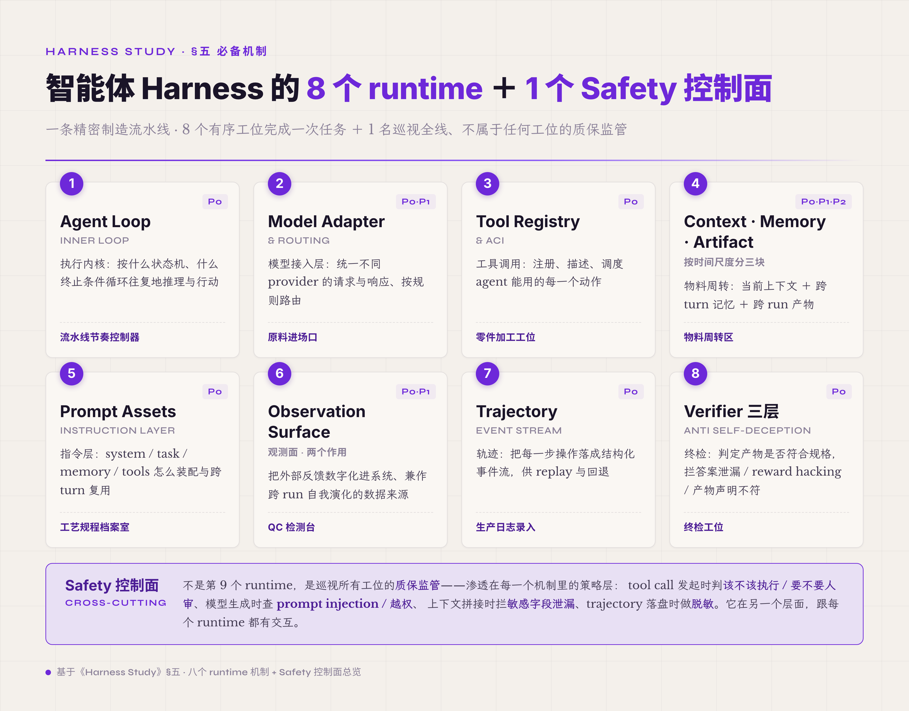
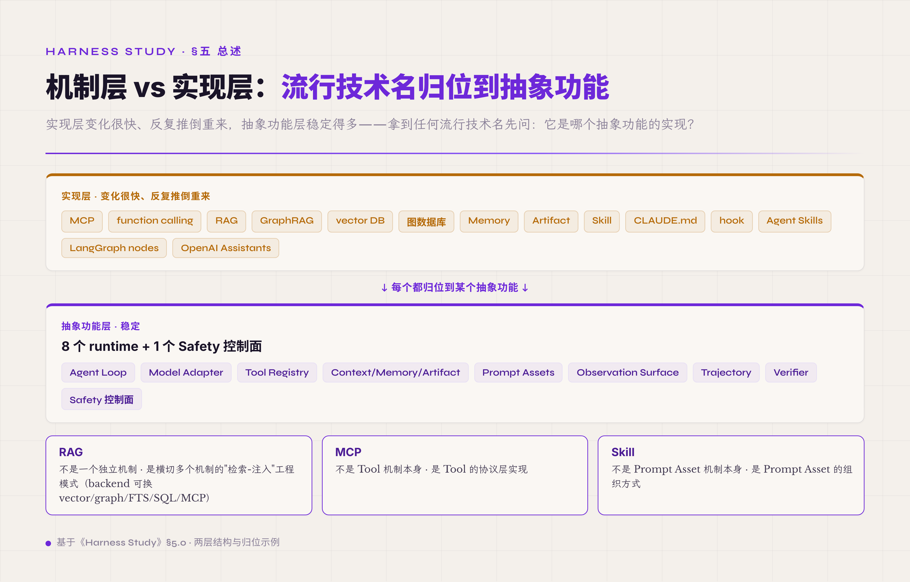

# 五、Harness 必备机制 · 8 个 runtime 机制加 1 个 Safety 控制面

#### ★ 两个贯穿全书的基础词：run 与 turn ★

后面会大量出现 `run` 和 `turn`，先把这两个词定下来。它们是一对**层级关系**，混用了会看不懂后面的状态管理和自我演化（self-evolution）。

- **turn（轮）**：一次模型调用，加上它触发的工具执行。模型读入上下文、给出回复；如果回复里有工具调用，harness 执行工具并把结果（观测）记下来，这算一轮。只思考、不调工具的一次调用也算一轮。这与 OpenAI Agents SDK、Claude Agent SDK 中 `max_turns` 的计数方式一致。
- **run（运行）**：一次任务从开始到终态（完成、失败、取消）的全过程，中间通常包含多个 turn。

关系是**一个 run 由多个 turn 组成**。两者之间还有一个常用的单位"回合"：从一条用户消息开始、到模型给出最终回复为止，一个回合包含多轮。后文的"跨 turn"指一次任务内跨越多轮（如 Memory 跨 turn 保留），"跨 run"指多次任务执行之间（如 Artifact、自我演化跨 run）。

§一到 §四 讲的是 harness 这个词的概念层：什么是 harness，它怎么从无名到有名，它跟 framework 在工程治理上有什么根本差别，为什么它跟 MLOps 是同辈关系。这一节往工程层走一步，回答四个问题：

- 一个具体的 harness 在实现时由哪些机制构成；
- 每个机制解决什么具体问题；
- 机制之间怎么协作；
- 各自的工程优先级是什么。

**这一节是设计 harness 时真正要实现的内容。** 读完后，读者脑子里应该能建出一个具体画面：一个生产 agent 跑一次任务，从模型发起请求，到工具被调用，到结果回到上下文，到产物被验证，到事件流落盘成 trajectory，再到下一轮决策做出，背后是哪几个机制在按什么顺序协作。如果读到 §四 就停下，读者会停在"harness 是个好概念"的水平；概念能不能实现、要实现多少模块、每个模块投入多大成本，要靠 §五 回答。

"一个 harness 由几个机制构成"，业界没有定论。不同工程团队给的清单从 3 项到 9 项不等。这种分歧不是行业混乱，而是切入视角不同带来的合理差异：从治理目的、从工程组件、从技术堆栈看 harness，自然会得到不同的机制组合。

- **Augment Code 按 3 层切**：Constraint / Feedback Loops / Quality Gates。Constraint 回答"agent 能做什么、不能做什么"，Feedback Loops 回答"agent 怎么知道自己做得对不对"，Quality Gates 回答"什么时候允许产物离开 agent"。这种切法从治理目的出发，抽象度高、概括性强；缺点是实现时每一层下面还要再拆出多个具体机制，跟代码模块不直接对应。
- **Vivek Trivedy 按 5 项切**：System Prompts / Tools / Bundled Infrastructure / Orchestration / Hooks & Middleware。每一项直接对应 harness 代码库里能找到的模块。这种切法从工程组件出发，工程师能照着搭；缺点是 Bundled Infrastructure 像个杂物袋，里面塞了 context 管理、memory 跨 turn 状态、artifact 跨 run 产物等好几个本应各自单列的机制，粒度不均匀。
- **还有从具体技术堆栈出发、列到 6 至 9 项的更细切法**（见附录 D.2 的对照表，其中有按九项切分的资料），把 model interface、tool registry、context manager、planning、execution、memory、feedback、safety、orchestration 等每个工程机制单独列出。这种切法清单清晰，每一项都对应代码；缺点是项数多、项与项的关系不显，读者看完清单，仍然要花很大功夫自己梳理它们怎么协作。

第四章介绍的综述 *Code as Agent Harness* 又是另一种切法：按 interface / mechanisms / scaling 三层来分。

本教程采用 **8 个 runtime 机制 + 1 个横切（cross-cutting）的 Safety 控制面** 的切法，理由是它同时满足三个工程约束。

1. **数量适中。** 8 个是在"每个对应一个代码模块"与"不至于太碎"之间的折中。切得更粗，每一项下面还要再拆；切得更细，项与项的关系就难以看清。
2. **每一个直接对应代码模块。** Agent Loop、Model Adapter、Tool Registry、Verifier 这些名字背后，都是成熟 harness 代码库里能找到的具体目录或文件，而不是抽象概念。这跟 Augment Code 的 3 层抽象切法形成对比：3 层适合战略讨论（给 CTO 解释 harness 的治理思想），8 个机制适合工程实现（给工程师写代码时划分目录）。
3. **"控制面"跟"runtime 机制"显式分层。** 这是 8+1 切法跟其他切法的关键差异，也是本书的工程主张：Safety 不平铺成第 9 个 runtime 机制，而是单独提出"控制面"，与其他 8 个机制分层处理。这里的"控制面"指每次工具调用都必须经过、不可绕过的检查层，下文会说明这个词的来源和借用边界。

为什么 Safety 要单独做控制面，而不是平铺成第 9 个 runtime 机制？因为 Safety 的工程本质是**横切关注点（cross-cutting concern）**：它不是 agent 某一轮里的一个独立步骤，而是渗透在每个 runtime 机制里的策略层。

- 发起一次工具调用时，Safety 判定该不该执行、要不要人审、要不要拦截；
- 模型生成一次响应时，Safety 检查输出有没有提示词注入（prompt injection）风险、有没有越权请求；
- 拼接一次上下文时，Safety 判定有没有把敏感字段泄漏给模型；
- 写入一次 trajectory 时，Safety 判定事件流里有没有需要脱敏的字段。

它不是轮内的某个工位，而是巡视所有工位的监管层。如果把 Safety 平铺成第 9 个 runtime 机制，就会遮蔽这个本质：读者会以为 Safety 是某一步要做的事，实际上它是每一步都要做的事。把 8+1 的分层明确下来，是为了让读者从结构上看清，Safety 跟其他 8 个机制不是平级关系：它在另一个层面，跟每个 runtime 机制都有交互。

这套结构可以用一条精密制造流水线来理解。**8 个 runtime 机制是流水线上 8 个有序工位：**

- Model Adapter 是原料进场口（接收模型响应）；
- Agent Loop 是流水线节奏控制器（决定下一步做什么）；
- Tool Registry 是工具调用工位（零件加工）；
- Context / Memory / Artifact 是物料周转区（把当前批次的零件和长期库存衔接起来）；
- Prompt Assets 是工艺规程档案室（每个工位按什么规范操作）；
- Observation Surface 是 QC 检测台（把外部反馈数字化进系统）；
- Trajectory 是生产日志录入工位（把每一步操作记进电子档案）；
- Verifier 是终检工位（判定产物是否符合规格）。

每个工位有明确的工艺规格、输入输出形态和上下游协议，它们按顺序协作完成一次任务。**Safety 控制面则不是流水线上的某个工位，而是质保监管员。** 他不在任何工位上做加工，而是巡视所有工位，按一套独立标准判定每一步是否合规：原料进场时，检查有没有提示词注入的污染；工具调用时，检查调用参数是否触碰禁区；上下文拼接时，检查有没有跨权限混入敏感数据；trajectory 落盘时，检查有没有按规范脱敏。监管员的工作贯穿整条流水线，但他不属于任何一个工位，所以叫"控制面"，跟 runtime 机制分两层。

*图 5.1 · 机制总览：8 个 runtime 机制与 1 个 Safety 控制面*

这个类比的来源和边界要交代一下。"控制面 / 数据面"（control plane / data plane）的分层源自网络设备：控制面负责决策与配置（例如计算路由），数据面负责逐包转发。后来 SDN 和 Kubernetes 沿用了这个分层：SDN 把它做成显式的控制器（controller）加交换机（switch）架构；Kubernetes 的控制面由 API server、etcd、scheduler、controller-manager 组成，每个节点上的 kubelet 则是节点侧代理，负责按控制面的决定在本机运行和管理容器。harness 把 Safety 设计成控制面，借的就是这种分层。

但两者并不同构。网络设备和 Kubernetes 的控制面是独立的组件，通过协议或 API 调用跟数据面通信；harness 的 Safety 控制面是嵌入式的 hook，每个 runtime 机制在关键节点上同步触发 Safety 判定，走的是进程内的同步调用。类比借的是"分层思想"，即监管和加工要放在不同的抽象层上做，而不是实现细节。在 harness 工程里，Safety 不需要独立进程，但需要独立的策略层、独立的事件接入点、独立的可观测性面板。

在安全领域，Safety 控制面对应的概念是**引用监视器（reference monitor）**：所有访问都必须经过、不可绕过的检查点，这一要求也叫完全仲裁（complete mediation）。

下面 §5.1 到 §5.9 按这套结构逐个详写每个机制。每个机制说清四件事：

- **它解决什么具体问题**：在 harness 里担什么角色，不做会出什么错，替代方案为什么不行；
- **核心接口形状**：对外暴露什么 API，接收什么数据、产出什么数据，跟相邻机制怎么交接；
- **关键设计取舍**：设计这个机制时有哪些岔路口，不同岔路对应什么场景，业界倾向哪一个，倾向的工程理由是什么；
- **外部公开出处**：开源 harness 里这个机制是怎么实现的，一手参考资料在哪。

每个机制还标了 **P0 / P1 / P2 优先级**：

- **P0 是最小可用版本（MVP）必备**：不做，harness 跑不起来，或者跑起来也不可靠；
- **P1 是上生产前要补的**：不做有故障风险，PoC 阶段可以省，上生产前必须补上；
- **P2 是数据闭环**：不做也能跑，但拿不到优化反馈，规模化之后才看得出价值。

这套优先级帮读者按工程阶段判断现在该投入哪几个机制：PoC 阶段做 P0 即可，上生产前补 P1，规模化后再做 P2。读者按自己项目所处的阶段，挑相应优先级的机制对照阅读即可，不需要一次读完。

#### ★ 抽象功能 vs 实现 · 读 §五 之前先建好这层心智模型 ★

下面 §5.1 到 §5.9 讲的 8 个 runtime 机制和 1 个 Safety 控制面，**全部是抽象功能，而不是具体技术**。读者在网上听到的流行名字，如 MCP、function calling、RAG、GraphRAG、vector DB、图数据库、Memory、Artifact、Skill、CLAUDE.md、hook、Agent Skills open standard、LangGraph nodes、OpenAI Assistants，**都是某个抽象功能的具体实现**。

*图 5.2 · 抽象功能 vs 实现：稳定的抽象功能层与易变的实现层*

业界的实现层变化很快，会反复推倒重来，抽象功能层则稳定得多。读者拿到任何流行技术名，先问一个问题：**"它是哪个抽象功能的实现，解决的是这个功能的哪项职能？"** 不要被常见的"RAG vs Memory 二选一""MCP vs function calling""Skill vs CLAUDE.md"这类**实现层对照表**带偏。这些对照表没有错，但它们站在实现层做对比，回答的是"我实现时用哪一套技术栈"，而不是"harness 由哪几个抽象功能构成"。两层混在一起，读者就会晕。

举一个最常见的混淆：不少资料把 RAG 跟 Memory 并列为"互补而非互替"的两项。这种说法在实现层成立（RAG 是无状态的检索流水线，Memory 是有状态的持久化治理），但放到抽象功能层就错位了：**RAG 根本不是一个独立机制，而是横切多个机制的"检索-注入"工程模式**，后端换成向量库、图数据库、全文检索、SQL 或 MCP server 都成立。同理，MCP 不是 Tool 机制本身，而是 Tool 的协议层实现；Skill 不是 Prompt Asset 机制本身，而是 Prompt Asset 的一种组织方式。再补一个读者天天在用的例子：ChatGPT 的 GPT-5（2025-08 起）在快速模型和思考模型之间做实时分流的那个路由器（router），就是 §5.2 Model Adapter & Routing 这个抽象功能的平台级实现。抽象功能早已确定，实现则以各种形态反复出现。

入门卷接下来的 §5.1 至 §5.11 全部讲抽象功能层。具体业界产品的对应关系，放在各机制章末的"业界归位卡片"和附录 D（机制与业界产品的对应总图）里。读完整个 §五 之后，读者应该能拿到任何新框架（LangGraph、CrewAI、Anthropic Agent Skills、OpenAI Assistants 等），快速判断它覆盖了 8 个机制中的哪几个、漏了哪几个。这是入门卷希望读者掌握的核心识别能力。
