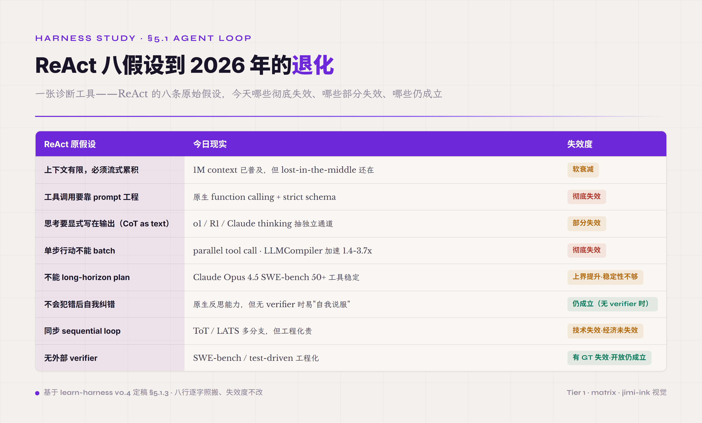
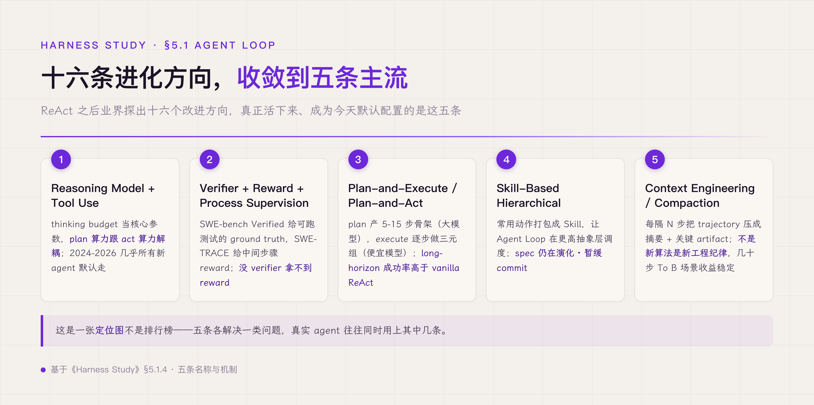
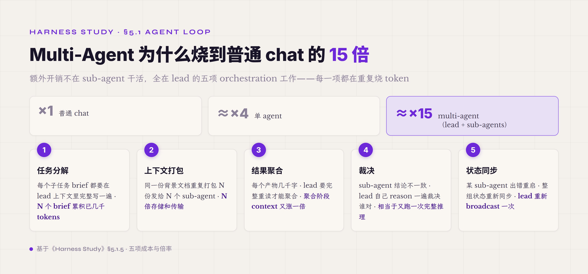
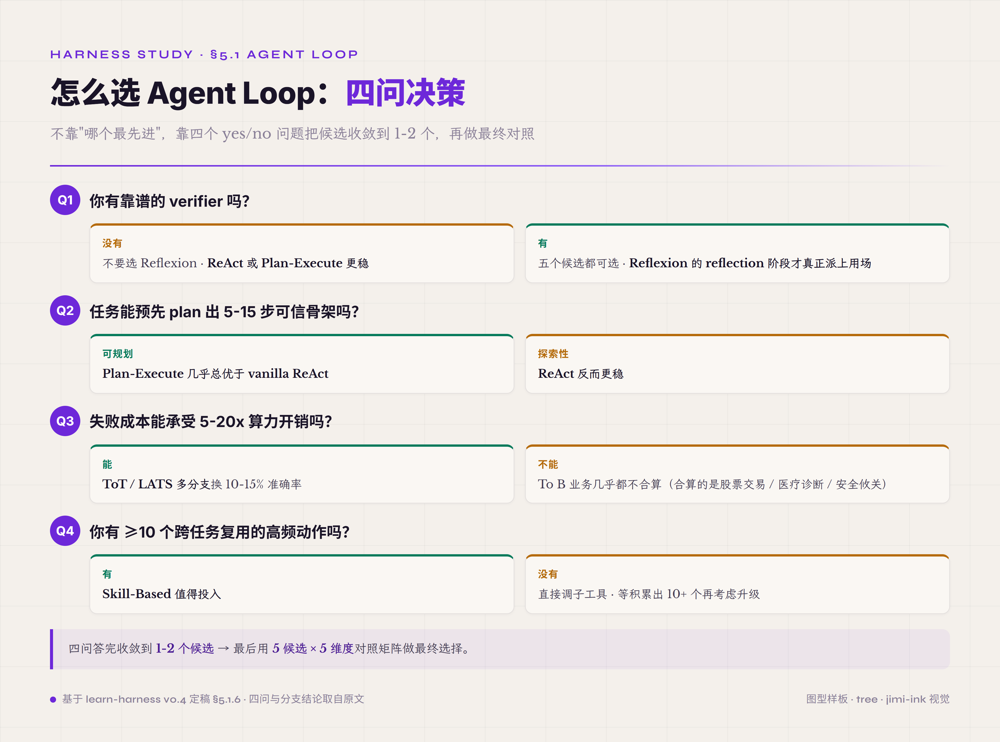

# 5.1 Agent Loop · Inner Loop · agent 的思考结构 · **P0**

第一件机制 Agent Loop 是 harness 的执行内核——它决定一个 agent 跑起来之后是按什么顺序、按什么状态机、按什么终止条件循环往复地推理和行动。其他八件机制都是围绕这个 inner loop 各自负责一件事，Agent Loop 是把它们串起来跑的那条主线。所以理解 harness 必须先理解 Agent Loop——理解错了 Agent Loop，剩下八件机制再设计精巧也接不到一起。

#### 5.1.0 本节首次出现的术语

§一-§四已经解释过的术语（CoT / schema / trajectory / verifier / ablation / policy / function calling / tool use / Adapter / Routing 等）下面不再重复。这里只列 §5.1 本节首次出现的术语。

**Loop 范式变种** —— **vanilla ReAct**（原始版本的 ReAct · 没有附加 plan / reflect / verify 等任何扩展层 · 是后续所有 ReAct-family 变种的基线参照 · "vanilla" 是英文软件圈口语里"未改装、原味"的意思）。**Plan-Execute / Plan-and-Act**（先 plan 出 5-15 步骨架再分步 execute 的两阶段 loop · plan 阶段和 execute 阶段甚至可以用不同的模型）。**Reflexion**（在 ReAct 基础上每隔 N 轮基于已有 trajectory 加一次反思 · 用反思结果指导后续 · 需靠谱 verifier 才能用 · 否则反思变自我说服）。**Skill-Based Hierarchical**（把常用动作打包成 Skill · 让 agent loop 在 Skill 这一更高抽象层调度而不是直接调原始工具 · Anthropic 2025-10 推出 Skills 功能 · 2025-12-18 升级为 open standard）。

**Reasoning model 相关** —— **thinking budget**（OpenAI o1 / DeepSeek R1 / Anthropic Claude thinking 等 reasoning model 暴露的核心参数 · 模型在产生工具调用之前可以独立"想"多少 token · 把 plan 算力跟 act 算力解耦）。**reasoning content / reasoning channel**（reasoning model 的独立推理通道 · 不出现在 output 文本里但出现在 reasoning content 字段里 · OpenAI 只给摘要 · Anthropic 部分给 · DeepSeek R1 / 国产模型有的全给）。**parallel tool call**（一次推理发出多个独立工具调用 · 让无依赖工具调用并行执行 · LLMCompiler 等编译器报 1.4-3.7x 提速）。**strict schema**（"严格 schema" · 在 inference 层强制模型输出必须符合 schema · 不符合就直接拦下或重试 · OpenAI 2024-08 起提供 strict 模式（opt-in）· Anthropic 2025-11 起原生支持 structured outputs 含 strict tool use · 替代了 2022 年那种"在 prompt 里告诉模型该输出什么格式然后正则解析"的脆弱做法）。

**终点判定相关** —— **ground truth**（任务的标准答案 · verifier 通常通过对比 agent 输出和 ground truth 给出判定 · 答案泄漏的"泄漏"指的是 verifier 见过这份 ground truth）。**process reward / process supervision**（看中间步骤合理性而不只看最终输出的 reward signal · SWE-TRACE 是典型代表）。

**失败模式** —— **lost-in-the-middle**（模型对长上下文中段的关键信息召回率系统性下降的现象 · 是 1M context 装得下但用不好的根本原因 · Stanford Nelson Liu et al. 2023 在多家模型上证实 · 关键信息放头尾的召回率明显高于放中段）。**reward hacking**（agent 学会糊弄 verifier 的判定规则、表面上得高分但没真做对任务 · RL 训练阶段尤其常见 · 跟人类员工在 KPI 考核下学会刷数据是同构现象）。**artifact-claim mismatch**（agent 在 trajectory 里声明"已完成 X"但实际产出物里没有 X · 是 verifier 设计要专门防御的常见误区 · 在长 agent loop 里特别容易出现）。**multi-agent over-decomposition**（默认"agent 不够强就拆 multi-agent"这种直觉的常见误区 · multi-agent 的 token 开销约是普通 chat 的 15x（single agent 才约 4x）· 主要烧在 orchestration · 5.1.5 详讲）。**orchestration**（一个 lead agent 把任务分给多个 sub-agent 并聚合结果时所有协调工作的统称 · 包括任务分解、上下文打包、结果聚合、不一致裁决、状态同步 · 5.1.5 拆每件的烧 token 来源）。

#### 5.1.1 不是循环代码块，是 agent 的思考结构

先从最常见的误解开始拆——很多人第一次听到 Agent Loop 会以为它就是个 `while` 循环里反复调模型。这种讲法在网上的"agent 入门"教程里几乎是标配，但它把读者引到一个错误的地方：把 Agent Loop 当成了写代码的格式问题，以为换 Agent Loop 就是换循环条件。

实际上 Agent Loop 是**agent 的思考结构**——它定义模型在 inference 时按什么形态组织自己的推理，而不是把模型嵌进什么形态的 Python 代码。这两个层次差得很远。Yao 2022 提的 ReAct[^react-yao-2022] 不是"反复调模型的循环"——它是 thought-action-observation 三元组：模型先以自然语言写出它怎么想（thought），再决定做一个结构化的动作（action），再观察这个动作的真实结果（observation）。三元组是一种**把模型推理过程外化成可审查轨迹**的设计选择，目的是让 agent 跑完之后人类工程师能逐轮看清楚"它每一步在想什么、做了什么、看到了什么"。换一种 Agent Loop——比如 plan-execute 或 reflexion——换的是模型怎么组织自己的推理（先大计划再分步执行 / 每隔 N 轮反思一次再继续），不是循环代码块的写法。

要把"思考结构"这一层讲透，需要回到一个更根本的问题：**为什么大模型用 next-token prediction 这种单步范式做不完一个真实任务？**大模型本身是个Token预测器——给一段输入，预测下一段输出，整个过程在一次 GPU 前向传播里完成，没有任何中间机制能让它"先停下来想一下再继续"。但真实任务——查资料、调工具、改文件、对比文档、给结论——是多步的、有状态的、可能某一步失败要重来的。单步预测和多步执行之间存在根本张力：单步预测一次错了就是错了；多步执行允许在中间步骤通过观察新证据修正前一步的判断。Agent Loop 是工程层面把这两件事接起来的产物——用循环把模型变成可累加的执行体，用三元组让中间步骤可观测可校正。

为了把这层结构讲到位，借两个跨域类比把它内化。第一个是 Boyd 在 1960 年代提的**OODA 环**（Observe-Orient-Decide-Act）。OODA 最初是冷战空战环境的产物：一个飞行员一秒钟做不完一次完整的决策——空战场面变化太快，他必须把决策拆成小循环逼近，每一秒钟跑一个完整的 Observe-Orient-Decide-Act 循环，循环之间用新观察校正旧判断，循环跑得比对手快就能"进入对方决策圈"——对方还没出招就被反制。OODA 里关键不是单步多聪明，而是**循环本身比单步更可靠**——单步可能失误，但循环里有 Observe 这一步在不断收集新证据校正上一步的判断。Agent Loop 借的就是这个机制：一次 next-token prediction 可能错，但一个 thought-action-observation 循环能用下一轮的 observation 校正上一轮的 thought，错误不会无限累积。OODA 的边界要点出来——OODA 强调的是"速度比对手快"（reaction time），Agent Loop 强调的是"轨迹比单步可审"（auditability），两者的循环动机不同：OODA 追求决策时效，Agent Loop 追求推理透明。这个差异不矛盾，是两种循环各自在自己领域里解决的不同问题。

第二个类比是**侦探破案**。福尔摩斯不是一开始就知道凶手是谁——他到现场看（observation：尸体姿势、脚印分布、室内陈设），从蛛丝马迹推一个假设（thought：可能是仆人 X 因金钱纠纷），再去做一件能验证或推翻假设的事（action：去 X 的住所查不在场证明），拿回新证据后看是支持还是反驳上一个假设。整个过程的终点不是预设的步数（"侦探破案必须 10 步"），是 **"案子破了"这个状态满足**——找到凶手、找到动机、能写结案报告。这一点对应 Agent Loop 里 verifier 的核心定位：循环什么时候停，不是计数到了，是 verifier 说"达到目标了"。给 agent 一个明确的 verifier，它就有侦探的终点判定；给它"跑 10 步停"这种纯计数终止，它就退化成按步数走的工人，而不是为达成目标推进的侦探。侦探类比的边界也要明示——福尔摩斯案子破了有戏剧性的明确终点（找到凶手 / 不得不承认推理错），但 agent 在实际任务里的"案子破了"是 rubric 通过 / 测试通过 / 用户接受这种更工程化、有时更模糊的终点。在 SWE-bench 这种能跑测试的环境里 verifier 很明确，在合同审核这种 open task 里 verifier 设计本身就是难题。

两个类比合起来回答的是同一件事——靠一次 next-token prediction 解决不了的问题，要拆成可累加的小步走，并且要有一个判定终点的客观机制。Agent Loop 是这件事的工程编码：循环负责小步累加，verifier 负责终点判定，thought 负责推理外化让中间步骤可审查。这三件合起来才是完整 Agent Loop，缺一不可——没有循环只能跑单步；没有 verifier 只能按步数兜底；没有 thought 跑出来只能看到最终结果看不到决策过程。

这种"Agent Loop ≠ while 循环"的观点在已发表的生产级实现里有具体证据可看。业界对 Claude Code 的源码调研显示，CC 的 inner loop 不是一个简单的 while 块——它是 async generator 拼成的事件流水线，单轮承载十步以上的小机制：四级压缩串行检查、token blocking 预算、系统 prompt 装配、流式采样、工具边流边执行、错误恢复、stop hooks 评估、token 预算 continuation、attachment 注入。源码层面用一个 State struct 跨迭代携带十个字段，并在主循环里显式标注了七个 continue 站点和十一个 terminal exit 点，每个站点都标了 transition reason。意思是说——"循环何时继续、何时终止"在这套生产代码里是 first-class 设计对象，不是"while True 加一个 break"。这跟前面讲的 thought-action-observation 三元组刚好对得上：三元组是模型层的思考结构，inner loop 是这个结构在工程层的可审化产物。

#### 5.1.2 一次 ReAct 调用的具体形态

讲完 Agent Loop 是思考结构这层抽象之后，要把它落到具体——拆一次实际的 ReAct 调用看每一轮 thought-action-observation 长什么样、prompt 里堆什么、模型每轮看到的是什么。这一段把抽象做到可感知。

假设任务：让 agent 看一份新签的合同（contract-2026.pdf），对照去年同一供应商签的那份（在归档目录 archive/ 下），找出冲突条款。一次完整 ReAct 调用大致这样跑：

**第一轮**——
- Thought：要做对比先要拿到两份合同。我先读新合同，再去找去年那份。
- Action：`read_file("contract-2026.pdf")`
- Observation：[新合同正文 12 页文本返回]

**第二轮**——
- Thought：新合同到手。去年那份在哪？用户没给路径，我搜归档目录。
- Action：`search_files(keyword="同供应商", path="archive/")`
- Observation：找到 3 个候选，最相近的是 contract-2025-q4.pdf

**第三轮**——
- Thought：q4 那份最可能是上一版。读它。
- Action：`read_file("archive/contract-2025-q4.pdf")`
- Observation：[去年合同正文 15 页文本返回]

**第四轮**——
- Thought：现在两份都有了。逐条比对，先看付款条款。
- Action：`extract_clauses(doc="contract-2026.pdf", section="付款")`
- Observation：[付款条款 4 条]

第五轮、第六轮继续比对其他条款类别。loop 什么时候停？由 verifier 决定——比如 "agent 是否给出了至少 1 条带证据的冲突点？"、或 "agent 是否声明 '比对完成无冲突' 且给了证据支撑？"。没 verifier 就只能给个步数上限当兜底（"跑 30 轮还没出结果就强制停"），这种兜底会让 agent 在边界场景下出错时无法被工程系统捕获。

这一段示例里有三个关键机制点要拎出来讲。第一，**thought 是模型外化的推理过程**——模型不是直接给 action，而是先用自然语言讲它为什么要做这个 action。外化的好处是 trajectory 可审：你看回放就能知道 agent 第三轮为什么选 q4 而不是 q1（"q4 是最近的一版，最可能是上一版"），不需要猜测。第二，**action 是结构化的工具调用**——不是自由文本"我要去读 contract-2026.pdf 这个文件"，是 `read_file("contract-2026.pdf")` 这种带 schema 的调用：function name 是 `read_file`、参数是字符串、返回类型是文本内容。strict schema 让 action 可执行（不用 NLP 解析）+ 可校验（参数类型不对在工程层就能拦下）。第三，**observation 是工具返回的真实结果回到模型上下文**——不是模型自己编的"我已经读了这个文件"，是工具实际跑完返回的真实文件内容。这一点很重要：如果允许模型自己生成 observation 而不接真实工具，agent 就退化成了"幻想自己在做事"，跑出来的 trajectory 全是模型自编的虚假证据。

另一份可对照的生产级 inner loop 是 OpenAI Codex CLI 的 Rust 实现。它的核心入口在 `run_turn()` 函数，主体走"查询编码 → 流式采样 → 工具调用分发 → 结果记录 → 收敛检测"五段。最值得注意的是几个跟"用户能不能中途打断"直接相关的设计：CancellationToken 贯穿整个 run_turn 全流程，模型采样、工具执行、持久化任意一处都能即时响应中断；流重连和工具失败用独立的 backoff 配独立的重试预算（stream_max_retries / request_max_retries）；并且 run_turn 不直接返字符串结果，而是返一个 TurnAction enum（Continue / WaitForConfirmation / Done / Error）。意思是说——"这一轮跑完之后下一步该干什么"在 Codex 的代码里是 first-class 类型层的决策点，不是上层调用方靠看字符串结果自己猜。这个细节对实习生类比就有了具体落地：实习生那张"出门前的 checklist"对应到代码里就是 TurnAction enum，每一档都对应一种明确的"下一步操作"。

但这套四轮调用还有一个常被忽略的机制层细节——**模型每一轮看到的 prompt 不是"当前轮的 thought 起点"，是所有过往三元组堆叠的历史**。第四轮模型看到的 prompt 大致是这样：system instruction + 任务描述 + thought-1 + action-1 + observation-1 + thought-2 + action-2 + observation-2 + thought-3 + action-3 + observation-3 + （空白等模型给 thought-4）。每跑一轮，prompt 就长一截。loop 跑长了上下文会膨胀——20 轮之后 prompt 可能已经几万 token，跨过 lost-in-the-middle 阈值，关键信息（比如第一轮里某个重要发现）容易被淹没在中间段里被模型忽略。这是任何 ReAct-family Agent Loop 共同的工程压力点，跟后续讨论的 context 管理纪律是配套问题——Agent Loop 决定了 context 怎么累加，context 管理决定了累加到一定程度怎么压缩、怎么放进 Memory、怎么提取出 Artifact。

这层 thought-action-observation 累加的结构对应到任何 ReAct-family 的 Agent Loop 几乎都成立。换成 Plan-Execute，plan 阶段先产 1 个大 thought（5-15 步计划），再进入 execute 阶段，execute 阶段每一步还是 thought-action-observation 三元组（只是 thought 现在受 plan 约束）。换成 Reflexion，每隔 N 轮加一次 reflection（基于已有 trajectory 反思哪步走错了），然后再继续 loop。换成 plan-and-act（ICML 2025），plan 模型和 execute 模型甚至可以选不同的模型实例，但每个 execute step 仍然是三元组。形态各异，**思考-行动-观察的累加结构是 ReAct family 的共同骨架**——所有家族里头的变种都是在这个骨架上加一层 plan、加一层 reflect、加一层 verify，骨架本身没变。

三元组讲到这里还差最后一层工程化——thought-action-observation 这个概念结构在代码里是怎么配对的。这件事其实有一条隐形的协议级不变量：**tool_call 跟 tool_result 必须紧跟配对**。意思是模型在响应里发出的工具调用 tool_call，必须在下一条 message 里紧跟着对应的 tool_result，中间不能插其他角色的消息——一旦插了，模型在后续推理里就会混乱，搞不清"我到底调过这个工具没有"。这条不变量在生产里很容易被破坏——上下文压缩这件事最危险的反例就是把"工具结果摘要"塞回主对话取代原 tool_result，模型读到一段"摘要文本"看起来跟工具结果挺像，但配对结构断了，模型就开始幻觉伪造工具执行结果。这正是为什么 Agent Loop 不只是模型层的思考结构，它同时也是协议层的契约——thought-action-observation 三元组在工程上对应到 message-toolcall-toolresult 三种角色的消息严格交替，破坏配对就破坏推理。

#### 5.1.3 ReAct 八假设的退化

把 Agent Loop 当思考结构看、把一次 ReAct 调用拆开看之后，下一个值得追问的问题是：**ReAct 2022 年提出来时建立在什么样的假设上？这些假设到 2026 年还都成立吗？**回答这个问题不是为了论证"ReAct 已过时"——而是为了定位 ReAct 在今天还能用的部分和已经必须升级的部分。

ReAct 原论文（Yao et al. 2022）背后有八条隐性假设。这些假设当时不需要明说，因为它们是 2022 年 LLM 工程环境的共同前提：上下文窗口才 4-8K、模型没有原生工具调用接口、思考过程必须写在输出文本里因为没别的地方写、单步行动不能 batch 因为 API 不支持并发工具调用……今天回看，这八条假设里**两条彻底失效、三条部分失效或软衰减、两条有条件失效（技术上失效但经济上未失效 / 有 ground truth 才失效）、一条仍成立**。

先用一张速查表快速建坐标，再展开讲机制——表本身只用来定位，机制讲清楚才能让读者判断自己场景里哪些假设还在、哪些已经走样。

| ReAct 原假设 | 今日现实 | 失效度 |
|---|---|---|
| 上下文有限必须流式累积 | 1M context 已普及，但 lost-in-the-middle 还在 | 软衰减 |
| 工具调用要靠 prompt 工程 | 原生 function calling + strict schema | **彻底失效** |
| 思考要显式写在输出（CoT as text） | o1 / R1 / Claude thinking 抽独立通道 | 部分失效 |
| 单步行动不能 batch | parallel tool call · LLMCompiler 加速 1.4-3.7x | **彻底失效** |
| 不能 long-horizon plan | Claude Opus 4.5 SWE-bench 50+ 工具稳定 | 上界提升但稳定性不够 |
| 不会犯错后自我纠错 | 原生反思能力，但无 verifier 时易"自我说服" | 仍成立（无 verifier 时） |
| 同步 sequential loop | ToT / LATS 多分支，工程化贵 | 技术失效经济未失效 |
| 无外部 verifier | SWE-bench / test-driven 工程化 | 有 ground-truth 失效，开放任务仍成立 |

*图 5.3 · ReAct 八条隐含假设及其退化*

**两条彻底失效的，机制层面发生了什么**。第一条彻底失效是"工具调用要靠 prompt 工程"。2022 年时 GPT-3.5、Llama-2 没有原生工具接口，开发者只能在 system prompt 里教模型"看到 `Action: xxx` 这种字符串就当作要调工具"，然后用正则把 action 字符串解析出来转成实际函数调用。这种做法很脆——模型可能输出 `Actoin:` 拼错字符串解析失败、可能输出 `Action: read_file ('a.pdf')` 比规定多空格解析失败、可能在多步任务里某一步突然不输出 `Action:` 直接给结论让循环卡住。OpenAI 2023-06 上线 function calling、Anthropic 2024 跟进 tool use，到 2024-2025 各家原生 strict schema 普及——模型直接输出符合 schema 的 JSON tool call，schema validation 在 inference 层完成，开发者不用再做正则解析。"工具调用靠 prompt 工程"这条假设的技术前提（"模型没有原生工具接口"）已经不存在，所以这条假设不是"减弱"是"前提没了"。

第二条彻底失效是"单步行动不能 batch"。2022 年的 inference API 是 sequential 的——每个 action 阻塞等待 observation，下一步 thought 才能产生。但 agent 在实际任务里经常有大量**无依赖的工具调用**：比如读 5 份合同对比、查 3 个供应商的资质、扫描 10 个文件夹里的特定文件——这些调用之间没有时序依赖，理论上可以并行。Anthropic 在 2024 出了 parallel tool call API，让模型在一次推理里发出多个独立工具调用、harness 并行执行后一并返回 observation。LLMCompiler[^llmcompiler-2024] 等编译器把无依赖工具调用图自动并行化，论文报 1.4-3.7x 加速。这条假设跟"工具调用靠 prompt 工程"一样是前提没了——sequential 不再是 API 限制，是开发者主动选择。

这两条之外还有一对孪生变化——"用 prompt 教推理"和"思考必须写在输出文本里"（速查表 CoT as text 一行）。thinking 通道独立化让这两件 2022 年的"必须"在 2026 年都变成了"可以但不必"——就"必须"而言前提已经没了；但表里只标部分失效，因为"推理外化成可审查轨迹"这层原始意图还在、工程实现反而退化了（下文部分失效段细讲）。这层"必须 → 可选"的转变是过去三年 agent 工程最大的范式跨越，几乎所有新型 agent 框架都默认在这几条上做了新选择。

**三条部分失效的，要看具体场景**。"上下文有限必须流式累积"这一条，1M context 让你**可以**装下整个仓库的代码或一份 200 页的合同，但 **lost-in-the-middle** 现象——模型对放在长上下文中段的关键信息召回率系统性下降——并没有随上下文窗口扩大而消失，这一点由 Stanford 的 lost-in-the-middle 研究系统化过。所以"流式累积"的工程纪律没废，废的是"必须 4K 内累积"——你可以一次塞 200K 进去。但 2026 年的实测图景是分层的：字面匹配式的单点召回（needle-in-a-haystack 一类）新一代模型已接近满分，靠语义关联的召回（NoLiMa 一类去字面重叠的基准）在长上下文仍系统性退化、多事实检索过 200K 后标称与有效能力能差出几十分。压缩因此是一笔权衡而不是反射动作——提前压缩有成本（信息丢失、改写中段破坏 cache、压缩本身引入上下文漂移），完全不压则在靠关联推理的长任务上撞 lost-in-the-middle；按任务类型定压缩时机，配上关键信息提头尾 / retrieval 替代直塞，比"无脑大 context"或"无脑早压"都强。

"CoT 必须写在输出文本里"这一条，o1 / R1 / Claude thinking 让推理 token 走独立通道（"reasoning content"字段）。模型在产生工具调用之前可以先有一段独立的 thinking——不出现在最终 output 里但出现在 reasoning channel 里。从模型效率上讲是好事（thinking 不占输出字数预算），但有个副作用：**外部 verifier 拿不到 thinking 完整内容**——OpenAI 只给摘要、Anthropic 部分给、有些供应商完全不给。这就让"思考要外化成可审查轨迹"这个 ReAct 原始设计意图反而**更难做到**：以前 thought 写在 output 里，trajectory 完整可读；现在 thought 在 reasoning channel 里，trajectory 可能丢失关键推理步。所以这一条不是失效在方法论层，是失效在工程实现层——意图还在，工程实现退化了。

"不能 long-horizon plan"这一条，Claude Opus 4.5 在 SWE-bench Verified 上能稳定调 50+ 个工具不掉链，比 2022 年 GPT-3 的 10 步上限好一个数量级。但这是**受控环境**——SWE-bench 任务结构相对规整，工具集小且语义清晰，且有测试做即时反馈。换到**开放任务**（比如复盘一份 200 页合同找所有异常条款、做一份月度审计报告），50 步之后偏差就开始累积——模型可能"忘记"了第 3 步的关键发现，可能跳过某些应该做的步骤，可能在中后段出现 trajectory drift。"能 plan" 不等于"能 plan 到完"。这条假设的失效是有条件的——任务结构越规整、verifier 越靠谱，long-horizon 越可行；任务越开放、反馈越延迟，long-horizon 越脆。

**仍成立的一条**：无 verifier 时模型自我纠错容易变成自我说服。这条机制层面没被任何技术进步推翻——你让模型自己评自己，没有外部 ground truth 校准，它倾向给自己更高分。这不是模型故意作弊，是 reasoning 链的内在动力学：模型一旦在 reasoning 中说服自己"我对了"，下一步 reasoning 就以"我对了"为前提继续推。OpenAI o1 的"思考更长就更对"已经被实验证伪——thinking budget 越大、reasoning 越长，模型也更容易构造出说服自己的虚假证据链。怎么构造一个不被 agent 自己 reasoning 影响的客观判定器，是 verifier 设计的中心问题——给 agent 一个不可被 agent 推理污染的外部 ground truth，是 agent 工程最难也最重要的一件事，这件事单独在后续 verifier 那一段详写。

这张表的实际用法不是论证 "ReAct 死了"，是**定位你 harness 的扩展点**。哪条假设在你场景里还成立，你就还能用 ReAct 那一面的设计；哪条已失效，对应方向就是你 harness 要补的件——比如你做合同审核，"long-horizon plan" 在你这是部分失效，对应方向是加 Plan-and-Execute 把粗骨架先 plan 出来；你做代码生成，"无 verifier"在你这是失效，可以引入 SWE-bench 风格的测试驱动 verifier。这张表是一个**诊断工具**，不是一个判决书。

#### 5.1.4 十六个进化方向收敛到五条主流

ReAct 2022 之后三年里，学术界和工业界至少出了十五条声称"超越 ReAct"的方向：Plan-and-Solve、Plan-and-Act、State Machine 化、Speculative Look-ahead、Reflexion、Verifier-Driven、Predictability-Driven、CodeAct、Tree of Thoughts、DSPy 类 declarative framework、Skill-Based Hierarchical、Long-context 路线、Reasoning Model + Tool Use 路线、Memory-Augmented、Multi-agent、Agentic RL Post-Training [ref: react-evolution-doc]。

这十六条不平等。有些是上面表里某条假设失效后的自然填空（比如 Reasoning Model + Tool Use 是 "CoT as text" 失效后的接续），有些是学术 paper 试一次没工程化（比如 Tree of Thoughts 论文出来后两年没看到大规模生产化），有些是工程方便但方法论上没新东西（比如部分 multi-agent 系统）。2024-2026 真正积累出动能、有 SOTA 数据 + 多家工程化复现的，只有五条。下面把这五条的内在机制讲透——读完之后你看到任何新的 "Beyond ReAct" 方向都可以判断它属于这五条里的哪一条的细化，或者根本就是研究阶段的探索。

*图 5.4 · 十六个进化方向收敛到五条主流 Agent Loop*

**第一条 · Reasoning Model + Tool Use**。OpenAI o1 / DeepSeek R1 / Anthropic Claude Opus 4 把 "thinking budget" 当成核心参数——模型在产生工具调用之前先有一段独立的推理过程，开发者可以调"想多久"（thinking tokens 数量）。这跟原始 ReAct 把 thought 写在输出文本里相比是工程升级，但更重要的是**认知架构升级**——模型在 plan 阶段拿到的算力可以远超它 act 阶段拿到的算力。原始 ReAct 里 thought 跟 action 共享一个 output budget（CoT 写得越长可用于 action 的字符就越少），而 reasoning model 把这两个 budget 拆开，相当于在 inference 时给"想"和"做"两个独立的资源池。这条方向落地很扎实，2024-2026 几乎所有新 agent 都默认走——你今天看到的 agent 论文如果没用 reasoning model 而是用纯 CoT 模型，大概率是 2024 年之前的工作。

**第二条 · Verifier + Reward + Process Supervision**。SWE-bench Verified[^swe-bench-verified] 给了一个能跑测试的 ground truth——agent 解出 GitHub issue 后跑测试看通过率，测试通过 = 任务成功，干净客观。SWE-TRACE[^swe-trace-2026] 类 process reward 路径给了"看中间步骤而不只看最终输出"的 reward signal——不只看 agent 最后做对没，还看它中间每一步走得合不合理。这条方向是 agent 工程从"prompt 调参"走向"用数据训"的关键开关——**没有 verifier，你拿不到 reward；没有 reward，你只能靠手感调 prompt**。但 verifier 设计本身有三种典型病：**答案泄漏**（verifier 见过 ground truth，等于在评一个它已经知道答案的考试）、**reward hacking**（agent 学会糊弄 verifier 的判定规则但没真做对任务）、**artifact-claim mismatch**（agent 声明"已完成"但产物里实际上没有声明的东西）。这三种各有不同对策，是 §5.8 verifier 那一段的中心议题，设计 verifier 本身就是一门工程。

**第三条 · Plan-and-Execute / Plan-and-Act**。Plan-and-Act[^plan-and-act-2025] 这篇正式工作把 plan 阶段和 execute 阶段显式拆开——plan 阶段产 5-15 步骨架，execute 阶段对每一步做 thought-action-observation。机制层面这等于承认"思考"和"行动"用同一个模型可能既不经济又不擅长——plan 需要的是全局视野和顺序推理能力（适合更强的模型，比如 o1-pro），execute 需要的是工具调用熟练度和单步执行能力（适合更便宜的工具调用模型，比如 GPT-4o-mini）。明确拆开之后两层各自优化：plan 用大而精的模型只在任务开始时跑一次，execute 用便宜模型跑很多次但每次都简单。在 long-horizon 任务上 plan-and-execute 的成功率明显高于 vanilla ReAct——因为 plan 阶段先把全局骨架建立起来，execute 阶段每一步都在骨架约束下不会大偏。

**第四条 · Skill-Based Hierarchical**。Anthropic 2025-10 开放了 Skills spec[^anthropic-skills-spec]：agent 不直接对着原始工具列表选，而是把常用动作打包成 Skill（带名字 + 输入参数 + 子工具调用流），让 Agent Loop 在更高抽象层调度。机制类比是"函数 vs 内联代码"——直接调子工具是内联（每次都从零拼装），定义成 Skill 是函数（封装一次到处复用）。一个常做 RFP 响应的团队可能有 "extract_requirements / search_past_proposals / draft_response" 三个 Skill，每个 Skill 内部封装 5-10 个子工具调用，agent 在 Skill 层调度而不是工具层调度。这条方向 2025 末开始有工程动能但 spec 还在演化——Skills spec 从 2025-10 初版改到 2025-12 open standard 才几个月，目前主要由 Anthropic 一家推动。如果 2026 把整套 harness 重写到 Skill 上，下一次 spec 改了就要全部跟改。所以工程上是"值得跟踪 + 暂缓 commit"的状态。

**第五条 · Context Engineering / Compaction**。Manus / Factory.ai / Morph 等一批工程团队在做的事：1M context 装得下但用不好，所以要在 Agent Loop 里加一个 compaction 子步骤——每隔 N 步把已有 trajectory 压缩成摘要 + 关键 artifact，让下一步推理面对的有效上下文密度高。这条方向不是新算法，是**新工程纪律**——不是有新 paper 提了新算法，是工程师在生产环境里反复踩坑后总结出的"必须做但论文里没人写"的做法。但收益稳定，特别是合同审核、长流程审批、月度报告生成这种几十步的 To B 场景——20 步之后做一次 compaction 把 trajectory 压成 1K tokens 摘要 + 5 个关键 artifact，agent 在后续步骤里推理质量明显回升。这条方向跟 §5.4 Context / Memory / Artifact 那一段紧密配合——Context Engineering 是 Agent Loop 层的工程纪律，跟 Context / Memory / Artifact 那一段的存储层组件是配套关系。

其余各条的命运可以快速过：DSPy 类 declarative framework 仍小众（声音大、生产案例少）；Predictability-Driven 缺工程化复现；Tree of Thoughts / LATS 多分支搜索算力代价 5-20x 但开放任务收益不稳定；Memory-Augmented 在 long-conversation chatbot 里有效但在 agent 工程里被 Context Engineering 部分覆盖；State Machine 化是 Workflow 这条路的一个名字；Speculative Look-ahead 在 latency 敏感场景有用但工程化复杂；Multi-agent 单独有常见误区问题（下面 5.1.5 详写）；Agentic RL Post-Training 是研究方向（OpenAI o3 / DeepSeek R1 已经在做，但开发者侧 API 还没暴露训练接口）；Reflexion 的 reflection 层在 5.1.2 / 5.1.3 已经拆过——有靠谱 verifier 才用得起来，工程上是 Verifier 路线的伴生件而不是独立路线；CodeAct 把 action 空间换成可执行代码，已被主流 coding agent 吸收为默认形态，不再作为独立路线演进。读到一篇新论文时可以拿这五条当 anchor——如果新方向能套进某条，能套得对它就是这条的细化；如果套不进任何一条，多半还在研究阶段没工程化。

#### 5.1.5 常见误区 · Multi-Agent Over-Decomposition

讲完进化方向，要面对一个在 To B 落地讨论里非常普遍的迷思：**很多人默认 "agent 不够强 → 拆 multi-agent 就够强"**。这个直觉听起来合理——一个 agent 做不了的事，让多个 agent 各管一段不就行了？但实际工程数据推翻了这个假设。

Anthropic 2025 公开过一篇内部反思[^anthropic-multi-agent-research]：他们做 multi-agent research 系统时发现，相对单 agent，并行多 agent 在某些研究任务上确实更快——**但 token 成本大幅上升：都相对普通 chat，单 agent 约烧 4 倍 token，multi-agent 约烧 15 倍**。原文还有一句很硬的话："don't use multi-agent for coding tasks"（不要把 multi-agent 用在编程任务上）。这种明确的负面建议在大厂工程 blog 里不常见——它的分量来自 Anthropic 自己量化了 token 成本之后给出的结论，而不是先验偏好。

为什么 multi-agent 能烧到 chat 的 15 倍？光看输出加起来不应该这么多——几个 sub-agent 各跑一段，输出总量也就几倍。机制层面真正烧 token 的不是"多 agent 各自思考"，是 **orchestration**——lead agent 要做这五件事，每一件都很烧 token：

*图 5.5 · Multi-Agent 烧到普通 chat 15 倍的五项成因*

第一，**任务分解的 token 成本**：lead agent 要把任务分解成子任务，每个子任务的 brief 都要在 lead 自己的上下文里完整写一遍（不写完整后续没法引用），N 个 sub-agent 的 brief 累积起来已经几千 tokens。第二，**上下文打包成本**：把每个 sub-agent 的初始上下文打包发出去——同一份背景文档可能要重复打包 N 份发给 N 个 sub-agent（因为每个 sub-agent 自己的 context 是独立的），同一份信息 N 倍重复存储和传输。第三，**结果聚合成本**：接收每个 sub-agent 返回的产物，每个产物可能几千字 lead agent 要完整重读才能聚合——这意味着 lead 的 context 在聚合阶段又涨一倍。第四，**裁决成本**：处理 sub-agent 之间不一致的结论——sub-agent A 说"风险点在条款 X"，sub-agent B 说"风险点在条款 Y 不是 X"，lead 必须自己 reason 一遍裁决谁对，相当于又跑一次完整推理。第五，**状态同步成本**：当某个 sub-agent 错了要重启时，整组 sub-agent 的状态都要重新同步——lead 要重新发布"我们之前的判断改了，请基于新的判断重新跑"，这又是一次完整 broadcast。

这五件每一件都需要 lead 反复读完整上下文，N 个 sub-agent 跑一次完整任务，lead 自己可能要在循环里跑 5-8 次完整 reasoning。multi-agent 烧到 chat 的 15 倍 token，就是这些 orchestration 开销累出来的，不是夸张数字。理解了机制就能理解为什么"拆 multi-agent" 不是免费的——你节省的是 wall-clock time（多 agent 并行确实快一些），付出的是 token cost（lead agent 自己的工作量大幅膨胀）。在生产环境里这两者的权衡通常是 token cost 占主导，因为 API token 是直接付钱的，wall-clock time 在 batch 处理里反而不重要。

不过 lead 这部分编排开销不是天然固定的——它之所以烧 token，是因为编排由 lead 在 runtime 即兴完成：每一步都要模型现场决定派谁、读完返回再想下一步，整套循环、分支和中间结果都压在 lead 自己的上下文里。但如果一个任务的控制流**可以预先确定**（哪些子任务并行、谁交叉验证谁、结果怎么聚合，在开跑前就清楚），就能把这套控制流写成一段确定性脚本：循环、分支和中间结果由脚本持有，模型推理只发生在叶子 agent 干活时，lead 的上下文最后只剩一个汇总答案[^dynamic-workflows]。这不减少 sub-agent 干活的总量——agent 该跑多少还跑多少——但把"lead 反复读完整上下文做编排"这件最烧 token 的事移出了模型推理，编排骨架本身也因此可读、可重跑。代价是它只对控制流可预知的任务成立：探索性任务的下一步本就要看上一步结果才能定，没法提前写死，仍然得让 lead 即兴编排。

判断要不要用 multi-agent，**三个条件必须同时满足**：第一，任务能被自然拆成可独立验证的子任务（不是被你强拆的——强拆的特征是"听起来能拆但每个子任务要别的子任务结果才能判定对错"）；第二，子任务并行收益（节省的 wall-clock time）≥ orchestration 开销（lead agent 多花的 token cost）；第三，每个 sub-agent 有独立的 verifier 能判子任务自己对错——没有独立 verifier 就只能 lead 自己评，又退化成 lead 一个人做的成本。

三条缺一条，单 agent + 工程优化几乎一定更划算。合同审核就是典型反例——你以为可以拆"sub-agent A 看条款一致性、sub-agent B 查合规、sub-agent C 标风险点"，但实际上三个 sub-agent 的判断会**高度耦合**：一个风险点可能来自一致性问题，合规判定也要依赖一致性结果，三者你中有我我中有你。强拆之后 lead agent 反而要花更多精力去裁决三个 sub-agent 的不一致结论——结果不是省 token 而是烧更多 token。这种场景**单 agent + 工程加固**（更好的 context engineering + 更细的 verifier 分层 + 更强的 long-horizon plan）几乎一定更划算。

这条 orchestration 失控的风险在生产级实现里其实有显式工程对策。Codex CLI 的源码给 sub-agent spawn 设计了三个工具——单个 spawn、批量 spawn（一次并发起最多 64 个）、wait 轮询——但所有 spawn 入口都强制走一道深度检查 `exceeds_thread_spawn_depth_limit()`：sub-agent 再 spawn sub-sub-agent 时深度超限直接拒绝。这等于在工程层把"agent 不能无限嵌套"做成了硬约束。这个细节侧面证实了 multi-agent over-decomposition 不是一条容易踩的坑——它是一条**生产级 harness 工程师已经掉过坑然后专门加防御**的常见误区。读者第一次设计 multi-agent 时直接复用"深度上限"这条工程纪律，能省掉自己再踩一次坑的成本。

#### 5.1.6 怎么选 · 四问决策流程

讲完 Agent Loop 是什么、ReAct 八假设退化的现状、五条主流进化方向、multi-agent 常见误区之后，最后一个问题是 **你该怎么选**——你手里这个项目用哪一种 Agent Loop？

不存在普适最优的 Agent Loop——选哪个看场景。给一个实操决策流程：按顺序回答四个问题，多半就能收敛到 1-2 个候选。

*图 5.6 · 选 Agent Loop 的四问决策流程*

**第一问：你有靠谱的 verifier 吗？**

verifier 是"agent 这次跑得对不对"的客观判定器。SWE-bench 那种能跑测试的环境是典型的靠谱 verifier；合同审核里没有这种东西。判别标准是：你能不能写出一个程序，输入 agent 的输出，输出"对/错"或一个客观分数？写得出 → 有 verifier；写不出（只能靠人审）→ 没有。

没 verifier 的情况下，**不要选 Reflexion**——它会用"模型自己评自己"代替 verifier，结果是 5.1.3 末尾讲的自我说服反复发生。ReAct 或 Plan-Execute 是更稳的起步选择。有 verifier 的情况下，五个候选都可选，但只有 Reflexion 的 reflection 阶段真正派上用场（reflection 需要有客观反馈作支撑，否则反思就是空转）。

**第二问：任务能预先 plan 出 5-15 步可信骨架吗？**

判别标准是：你把这个任务交给一个新员工，能不能给出 "先做 A 再做 B 再做 C" 的清单？给得出 → plan-able；给不出（你自己也说不清要查几步、终点是什么）→ 探索性。

plan-able 的情况下，**Plan-Execute 几乎总优于 vanilla ReAct**。合同审核（先列条款类别再逐类对比）、RFP 响应（先抽需求再匹配方案再写初稿）、月度报告生成（先抓数据再分类汇总再写 narrative）都属于 plan-able。Plan-Execute 的优势是 plan 阶段建好骨架后 execute 不会跑偏，long-horizon 稳定性比 vanilla ReAct 好一档。探索性任务里——比如"帮我看看这份调研报告里有没有跟我们项目相关的"、"找出仓库里所有跟支付相关的代码"、"调研一下竞品最近半年发了什么"——**ReAct 反而更稳**。这种任务你自己也说不清要查几步，强行 plan 反而比直接 ReAct 更糟：plan 模型会编一个不靠谱的骨架（因为它也不知道终点），execute 阶段又必须按这个骨架走结果跑偏。

**第三问：你的失败成本能承受 5-20x 算力开销吗？**

Tree of Thoughts / Language Agent Tree Search 等多分支搜索方法在每个决策点展开多个候选分支、用某种 value function 评分、回溯选优。机制层面能换 10-15% 准确率提升，但代价是 5-20x 算力（每个决策点要并行跑 N 个候选）。To B 业务流程几乎都不合算——你为合同审核多付 8 倍算力？不会。合算的场景：自动股票交易（一次决策失误几百万损失）、医疗诊断辅助 / 药物筛选（错误代价不可逆）、安全攸关决策（电力调度、空管辅助）——这些场景失败成本高到可以换算力，普通 To B 业务不要追这条。

**第四问：你有 ≥10 个跨任务复用的高频动作吗？**

Skill-Based 起步成本不低——定义 Skill schema、维护 Skill library、训练 agent 用 Skill 而不是直接调子工具、Skill 之间的依赖管理。这一套铺设成本只有在跨任务复用次数足够多时才划算。少于 10 个 Skill 时直接调子工具更轻——10 个工具直接列在 prompt 里 agent 也能调度好。有 ≥10 个高频复用动作 → Skill-Based 值得投入；没有 → 直接调子工具，等积累出 10+ 个再考虑升级。

四个问题答完，多半已经收敛到 1-2 个候选。剩下用 5 候选 × 5 维度（任务结构 / 失败成本 / 算力预算 / 可解释性 / 跟其他件配合）这个对照矩阵做最后选择。

实际项目里更常见的不是"选一个"，而是 **plan-and-execute 外壳 + ReAct 内循环 + 关键节点 verifier** 的三层 hybrid。这种 hybrid 不是不能选，但要明确知道每一层在干什么：外壳负责切分粗骨架（防完全跑偏），内循环负责单步执行的探索性决定（防 plan 过死），verifier 把关键节点的对错判断从 agent 自己手里拿走（防自我说服）。三层各自负责一个失败模式：plan 防"完全跑偏"，ReAct 防"单步死板"，verifier 防"自我说服"。这种 hybrid 是 2025-2026 工业级 agent 的事实标准——Claude Code、Codex CLI、Cursor 各自版本都在这个范式上做扩展。

这个三层 hybrid 是把 plan、ReAct、verifier 三件**静态**搭在一起。实践里还有一个更主动的方向——**让 harness 跟编排都随任务动态适配，而不是拿一套静态配置跑所有任务**。这个方向把 ReAct 当内核思维保留（单步探索、看反馈再走，开放任务上它最稳），外面补两件动态能力。一件是 **dynamic workflow**——任务里控制流可预知的部分（哪些子步并行、谁交叉验证谁、结果怎么聚合）提前写成确定性脚本交运行时编排，模型推理只发生在叶子干活时，既省掉 ReAct 每步现想编排的开销、又让编排可复现（前面讲 multi-agent 误区那节的脚注点过这种形态，Claude Code 2026 的 dynamic workflows 是业界一个信号）。另一件是 **dynamic harness**——harness 不是一套配置通吃，而是按任务动态调起对应的**副 harness**（每个副 harness 是某个领域的特化单元，自带后面§八要展开的 5 维度本体：领域实体、属性、关系规则、状态机、操作集），这件任务该挂哪些工具、走哪档 policy、配哪层 verifier，随领域切换。三者合起来的判断是：纯靠 ReAct 自主探索，在控制流可预知、领域可特化的特定任务上会浪费 LLM 能力（每步都现想，慢且不稳）；配上按任务调起的副 harness 加可预知部分的 workflow 脚本，LLM 的能力才在这类任务上真正释放出来。**ReAct + dynamic harness + dynamic workflow** 这条组合本书作者正在实践、仍在演进——这里按当前实践给方向，不当成定论。

这两件动态能力各自瞄准的场景不一样，选边的判别维度是**任务的 reward 信号强弱**[^anthropic-effective-agents]——强 reward 指产出能被机器判定收口（测试通过、schema 校验这类后面 verifier 那章要展开的 Hard Gate）或者有标定数据可对账；弱 reward 指开放性产出、没有 ground truth。**弱 reward 场景偏 dynamic workflow**：个性化、非标准化、没有数据标定的问题（开放调研、方案探索、诊断分析），流程没法提前固化，硬 verifier 也判不动，只能靠模型智能现场分解——这正是需要高自由度的地方。dynamic workflow 以工具形态出现，自由度一点不少（要不要用、编排脚本怎么写，都是 agent 现场决定），但准确性多了两道来源——确定性脚本防编排漂移；编排结构里内建交叉验证、对抗评审，拿多视角共识顶替缺位的硬 verifier[^weak-reward-rl]。**强 reward 场景偏 dynamic harness**：任务标准化、重复出现、有明确验收标准——To B 核心交付（合同审核、报告生成、工单处理）多数长这样。这类场景里模型自由度反而是负资产（不可审计、不可复现），准确性来自把领域知识固化进副 harness：领域 verifier、prompt assets、收窄的操作集整体打包，按任务路由，硬验证收口[^harness-routing-2026]。作者当前的实践判断收成一句话：**弱 reward 场景用 dynamic workflow，强 reward 场景用 dynamic harness**——前者用结构性共识在没有标定的地方构造准确性，后者用机制固化在有标定的地方锁死准确性。两者依旧正交，强 reward 的副 harness 内部照样可以跑确定性 workflow——这条判别给的是主导维度，不是二选一。

Agent Loop 这一机制是 P0——任何 harness 不可能没有 inner loop 这层就跑起来。但选哪个 loop、配几层、跟谁组合，这是工程权衡而不是技术正确性问题——本节给的 5 个候选 + 四问决策是建立这个权衡能力的最小工具集。后续 8 件 runtime 机制每一件都会跟 Agent Loop 这件配合：Tool Registry 的工具调度受 Agent Loop 形态影响，Verifier 嵌入 Agent Loop 的位置决定 reflection 怎么触发，Trajectory 的事件序列形态由 Agent Loop 决定结构，Safety 控制面在 Agent Loop 的每个决策点都要打 hook。Agent Loop 不是孤立组件，是整个 harness 的执行节奏控制器。

---

## 引用脚注

[^react-yao-2022]: ReAct: Synergizing Reasoning and Acting in Language Models · Yao, Zhao, Yu et al.（Princeton）· arxiv 2210.03629 · ICLR 2023
[^llmcompiler-2024]: LLMCompiler: An LLM Compiler for Parallel Function Calling · ICML 2024 · github.com/SqueezeAILab/LLMCompiler
[^swe-bench-verified]: SWE-bench Verified · OpenAI · 2024-08 · openai.com/index/introducing-swe-bench-verified/
[^swe-trace-2026]: SWE-TRACE（Rubric Process Reward Model）· arxiv 2604.14820 · 预印本
[^plan-and-act-2025]: Plan-and-Act: Improving Planning of Agents for Long-Horizon Tasks · Erdogan, Lee, Kim et al. · arxiv 2503.09572 · ICML 2025
[^anthropic-skills-spec]: Agent Skills · Anthropic · 2025-10-16 初版 / 2025-12-18 open standard · agentskills.io
[^anthropic-multi-agent-research]: How we built our multi-agent research system · Anthropic · 2025-06-13 · anthropic.com/engineering/multi-agent-research-system
[^dynamic-workflows]: 把多 agent 编排写成确定性脚本、交给运行时在后台执行的工程形态，2026 年的一个实例是 Claude Code 的 dynamic workflows——ultracode 模式下 Claude 会主动为复杂任务生成这类编排脚本 · research preview（需 Claude Code v2.1.154+）· code.claude.com/docs/en/workflows
[^anthropic-effective-agents]: Building effective agents · Anthropic · 2024-12-19 · anthropic.com/research/building-effective-agents——workflow（LLM 和工具走预定义代码路径，换可预测性和一致性）vs agent（模型自主导向流程，换开放问题上的灵活性）这对二分的源头文。那对二分用"任务能否预先画出决策树"选边，本段把选边判据落在 reward 信号强弱上——换的是同一对货币（确定性 vs 自由度），判据从开发时移到了运行时
[^weak-reward-rl]: RL 训练域有平行证据——RLVR 在数学 / 代码这类可自动判定的域成立，创意写作 / 主观问答这类开放性产出没有 unambiguous ground truth，业界 2025-2026 的解法正是把主观评估结构化成可验证信号：Writing-Zero 用 self-principled critique 做成对可验证 reward（arxiv 2506.00103 · 预印本）；VMR-RLVR 把 open-ended 数据重构成可验证多选题（arxiv 2511.02463 · 预印本）
[^harness-routing-2026]: 业界 2026 年 4-5 月已在收敛同方向。What Is Harness Engineering? · MindStudio · 2026-05-28 · mindstudio.ai/blog/what-is-harness-engineering-agent-wrapper——"通用 agent 通常不如多个各管窄任务的专门化 agent，外层 harness 就是 routing 住的地方；专门化 agent 的 harness 更小更聚焦——更干净的 context、更紧的工具集、更专的验证逻辑"。Agent Harness Engineering: The Rise of the AI Control Plane · Adnan Masood · 2026-04-23 · medium.com/@adnanmasood/938ead884b1d——harness 的价值是"把概率推理翻译成确定性、可审计的企业动作"，routing 决策 / sub-agent spawning 列为 harness 控制面职责
