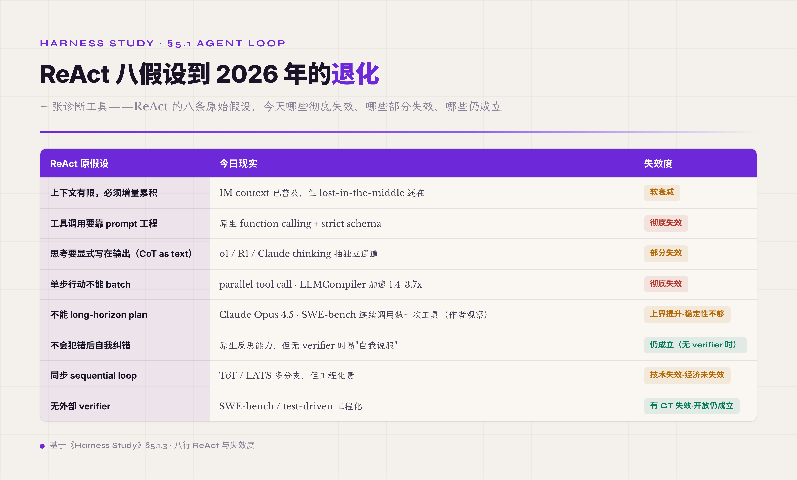
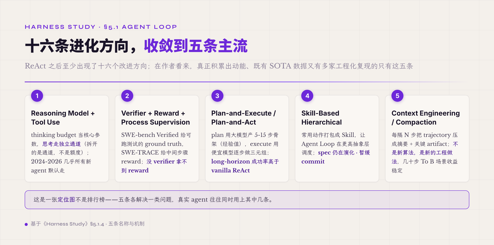
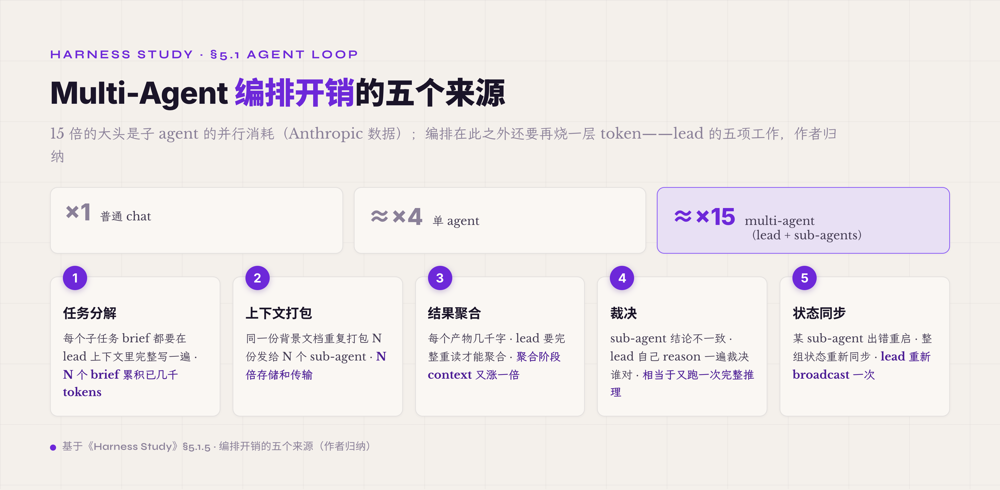
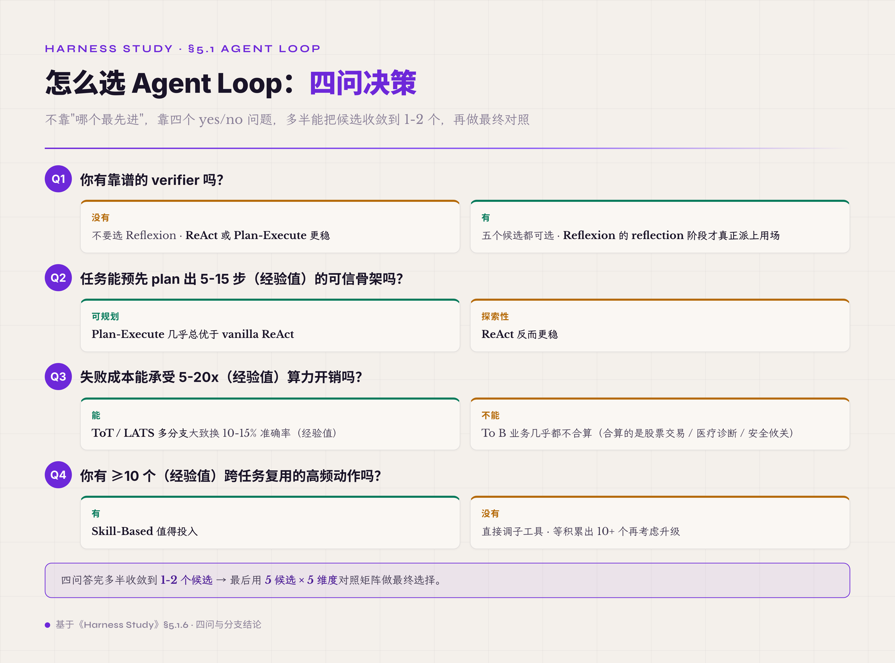

# 5.1 Agent Loop · Inner Loop · agent 的思考结构 · **P0**

第一个机制 Agent Loop 是 harness 的执行内核：它决定一个 agent 跑起来之后，按什么顺序、什么状态机、什么终止条件循环往复地推理和行动。其他八个机制各自负责一件事，都围绕这个内循环（inner loop）运转，Agent Loop 是把它们串起来的那条主线。所以理解 harness 要先理解 Agent Loop：Agent Loop 理解错了，其余机制设计得再精巧也接不到一起。

#### 5.1.0 本节首次出现的术语

§一至§四已经解释过的术语（CoT、schema、trajectory、verifier、ablation、policy、function calling、tool use、Adapter、Routing 等）下面不再重复，这里只列本节首次出现的术语。

**Loop 范式变种**

- **vanilla ReAct**：原始版本的 ReAct，没有附加 plan、reflect、verify 等任何扩展层，是后续所有 ReAct 系变种的基线参照。"vanilla"是英文软件圈的口语，意思是"未改装、原味"。
- **Plan-Execute / Plan-and-Act**：先规划出一份 5 到 15 步的骨架（经验值），再分步执行的两阶段循环；规划阶段和执行阶段甚至可以用不同的模型。
- **Reflexion**：在 ReAct 基础上，每隔 N 轮基于已有 trajectory 做一次反思，用反思结果指导后续。需要靠谱的 verifier 才能用，否则反思会变成自我说服。
- **Skill-Based Hierarchical（基于技能的分层调度）**：把常用动作打包成 Skill，让 agent loop 在 Skill 这个更高的抽象层调度，而不是直接调原始工具。Anthropic 2025-10 推出 Skills 功能，2025-12-18 将其发布为开放标准（open standard）。

**推理模型（reasoning model）相关**

- **thinking budget（思考预算）**：OpenAI o1、DeepSeek R1、Anthropic Claude 扩展思考等推理模型暴露的核心参数，即模型在产生工具调用之前可以用多少 token 来"想"。它把思考和最终输出放进不同的通道，但思考 token 通常仍计入总输出额度，并按输出 token 计费（见 5.1.4 第一条）。
- **reasoning content / reasoning channel（推理内容 / 推理通道）**：推理模型的独立推理通道，思考内容不出现在最终输出文本里，而出现在单独的推理字段里。OpenAI 只给摘要，Anthropic 部分给出，DeepSeek R1 等一些模型全部给出。
- **parallel tool call（并行工具调用）**：一次回复中发出多个互不依赖的工具调用，由 harness 并行执行。LLMCompiler 等工作把无依赖的调用自动并行化，论文报告 1.4 到 3.7 倍的提速。
- **strict schema（严格 schema）**：这里要分开两件事。
  - **模型侧严格模式**：模型生成时用约束解码（constrained decoding）屏蔽不合法的 token，保证输出符合给定的 JSON Schema（只支持 JSON Schema 的一个子集）。OpenAI 2024-08 起提供 strict 模式（需显式开启），Anthropic 2025-11 起原生支持结构化输出（structured outputs），包括严格的工具调用（strict tool use）。
  - **harness 侧参数校验**：harness 收到工具调用后，执行前再按 schema 检查参数，不符合就拦下或让模型重试。

  两者合起来，替代了 2022 年那种"在 prompt 里告诉模型该输出什么格式，再用正则解析"的脆弱做法。

**终点判定相关**

- **ground truth（标准答案）**：任务的标准答案。verifier 通常对比 agent 输出和 ground truth 给出判定；"答案泄漏"的"泄漏"，指的是 verifier 见过这份 ground truth（几类泄漏问题汇总在附录 F 的 AP02）。
- **process reward / process supervision（过程奖励 / 过程监督）**：看中间步骤是否合理、而不只看最终输出的奖励信号，SWE-TRACE 是典型代表。

**失效模式与反模式**

- **lost in the middle（中段遗失）**：关键信息位于长上下文中段时，模型的准确率明显低于放在头尾（U 形曲线）。Stanford 的 Nelson Liu 等人 2023 年在多个模型上观察到这一现象，降幅可超过 20 个百分点，新模型的效应有所减弱。它是"1M 上下文装得下、用不好"的原因之一。
- **reward hacking（奖励投机，AP03，见附录 F）**：agent 学会钻 verifier 判定规则的空子，表面上得高分，任务却没真做对。RL 训练阶段尤其常见，跟人在 KPI 考核下学会刷数据是同一类现象。
- **artifact-claim mismatch（产物声明不符，AP04，见附录 F）**：agent 在 trajectory 里声明"已完成 X"，实际产物里却没有 X。这是 verifier 设计要专门防的失效模式，在长循环里特别容易出现。
- **multi-agent over-decomposition（多 agent 过度拆分，AP09，见附录 F）**：默认"agent 不够强就拆成多 agent"的反模式。按 Anthropic 公布的数据，以普通对话为基准，agent 的 token 用量约为 4 倍，多 agent 系统约为 15 倍。5.1.5 详讲。
- **orchestration（编排）**：lead agent 把任务分给多个 sub-agent 并聚合结果时的全部协调工作，包括任务分解、上下文打包、结果聚合、不一致裁决、状态同步。5.1.5 逐项拆开看它们的 token 开销。

**进阶方向相关（5.1.7）**

- **learning by doing（做中学）**：在没有标定数据的开放领域，智能最终要从实践中来。对应 Silver 与 Sutton "经验时代"的核心主张。
- **grounded rewards（接地的奖励）**：从环境经验中得到的奖励信号（执行反馈、错误率、用户后续行为），与"来自人类预判的奖励"相对。
- **MCTS（蒙特卡洛树搜索，Monte Carlo Tree Search）**：按选择（selection）、扩展（expansion）、模拟（simulation）、回传（backpropagation）四步循环的树状搜索，AlphaGo 一系的核心算法。5.1.7 强调它的核心是回传所需的节点价值信号，而不是树本身。
- **learning progress（学习进度）**："我在这个目标上还在进步吗"这种元认知信号，用来给 agent 自己生成的目标排优先级，自动剔除"做不到"和"已掌握"两端。
- **pass@k**：采样 k 次、至少一次通过的比例。k=1 看单次命中；k 大时看模型的输出分布里有没有正确路径。

#### 5.1.1 不是循环代码块，而是 agent 的思考结构

先从最常见的误解说起。很多人第一次听到 Agent Loop，会以为它就是在 `while` 循环里反复调模型。网上的 agent 入门教程几乎都这么讲，但它把读者引到了错误的方向：把 Agent Loop 当成写代码的格式问题，以为换 Agent Loop 就是换循环条件。

实际上，Agent Loop 是 **agent 的思考结构**：它定义模型在每次调用中按什么形态组织自己的推理，而不是把模型嵌进什么形态的 Python 代码。这两个层次差得很远。Yao 等人 2022 年提出的 ReAct[^react-yao-2022] 并不是"反复调模型的循环"，而是 thought-action-observation 三元组：模型先用自然语言写出它怎么想（thought），再决定做一个结构化的动作（action），然后观察这个动作的真实结果（observation）。三元组是一种**把模型的推理过程外化成可审查轨迹**的设计选择，目的是让工程师在 agent 跑完之后，能逐轮看清它每一步在想什么、做了什么、看到了什么。换一种 Agent Loop，比如 plan-execute 或 reflexion，换的是模型怎么组织推理（先定大计划再分步执行，或每隔 N 轮反思一次再继续），而不是循环代码块的写法。

要把"思考结构"这一层讲透，需要回到一个更根本的问题：**为什么只靠下一个 token 预测（next-token prediction），大模型做不完一个真实任务？** 大模型本身是一个 token 预测器：给一段输入，预测下一个 token，每产生一个 token 做一次前向计算（forward pass），逐个 token 地写下去。在这个过程中，模型只能沿着自己已经写下的文字继续写，看不到外部世界的新证据，也没有办法中途去查一下、试一下再回来。而真实任务，比如查资料、调工具、改文件、对比文档、给结论，是多步的、有状态的，某一步失败可能要重来。单次生成和多步执行之间存在根本张力：单次生成一旦写错，只能沿着错的继续往下写；多步执行允许在中间步骤观察新证据，修正前一步的判断。Agent Loop 是在工程上把这两者接起来的产物：用循环把模型变成可以逐步累加的执行体，用三元组让中间步骤可观测、可校正。

为了把这层结构讲到位，借两个跨领域的类比。第一个是 **OODA 环**（Observe-Orient-Decide-Act，观察、判断、决策、行动），由 Boyd 在 1970 至 80 年代提出，出自他从 1976 年起宣讲的《Patterns of Conflict》。OODA 源于空战：局势变化太快，飞行员无法一次做出完整的决策，只能把决策拆成一个个小循环去逼近，循环之间用新观察校正旧判断；循环跑得比对手快，就能"进入对方的决策圈"，对方还没出招就被反制。OODA 的关键不在于单步多聪明，而在于**循环本身比单步更可靠**：单步可能失误，但循环里的 Observe 一步在不断收集新证据，校正上一步的判断。Agent Loop 借的正是这个机制：一次生成可能出错，但 thought-action-observation 循环能用下一轮的 observation 校正上一轮的 thought，错误不会无限累积。这个类比也有边界：OODA 强调比对手快（反应时间），Agent Loop 强调轨迹比单步可审（可审查性）。两者的循环动机不同，OODA 追求决策时效，Agent Loop 追求推理透明；这并不矛盾，只是两种循环在各自领域里解决不同的问题。

第二个类比是**侦探破案**。福尔摩斯并不是一开始就知道凶手是谁：他到现场观察（observation：尸体姿势、脚印分布、室内陈设），从蛛丝马迹推出一个假设（thought：可能是仆人 X 因金钱纠纷作案），再去做一件能验证或推翻假设的事（action：去 X 的住所查不在场证明），拿回新证据后，看它支持还是反驳上一个假设。整个过程的终点不是预设的步数（没有"破案必须走 10 步"这种规定），而是**"案子破了"这个状态**：找到凶手、找到动机、能写结案报告。

放到 Agent Loop 里，终点要分两层看。**基础的 ReAct 循环在模型不再请求工具时结束**：模型给出最终回复、不再发出工具调用，循环就停；步数上限只是兜底，防止循环停不下来。**verifier 是本书主张在此之上附加的判定**：模型说"做完了"，还要由一个独立的检查确认目标真的达到了。给 agent 一个明确的 verifier，它才有侦探那样的终点判定；只靠模型自己宣布完成、再加一个"跑满 N 步就停"的上限，它就容易退化成按步数干活的工人，而不是为达成目标推进的侦探。侦探类比同样有边界：福尔摩斯的案子有戏剧性的明确终点（找到凶手，或不得不承认推理错了），而 agent 在实际任务里的"案子破了"是评分标准（rubric）通过、测试通过、用户接受这类更工程化、有时也更模糊的终点。在 SWE-bench 这种能跑测试的环境里，verifier 很明确；在合同审核这类开放任务里，verifier 的设计本身就是难题。

两个类比回答的是同一件事：一次生成解决不了的问题，要拆成可累加的小步走，并且要有判定终点的机制。本书把完整的 Agent Loop 看作这件事的工程实现，它由三部分组成：

- 循环负责小步累加；
- thought 负责把推理外化，让中间步骤可审查；
- verifier 负责终点判定。

在本书看来，三者缺一不可：没有循环，只能跑单步；没有 thought，只能看到最终结果，看不到决策过程；没有 verifier，就只能靠模型自己宣布完成，再用步数上限兜底。

"Agent Loop 不等于 while 循环"这个观点，在生产级实现里有具体证据。社区对 Claude Code 实现的公开分析显示，它的内循环不是一个简单的 while 块，而是由异步生成器（async generator）拼成的事件流水线，单轮承载十步以上的小机制：四级压缩的串行检查、token 阻断预算、system prompt 装配、流式采样、工具边流边执行、错误恢复、stop hook 评估、按 token 预算续写、附件注入。<!-- 待作者补充：Claude Code 内循环结构分析的公开出处 --> 代码里用一个 State 结构体跨迭代携带十个字段，主循环里显式标出了七个继续点和十一个终止出口，每一处都注明了转移原因。可见"循环何时继续、何时终止"在这套生产代码里是需要单独设计的部分，而不是"while True 加一个 break"。这跟前面讲的三元组正好对上：三元组是模型层的思考结构，内循环是这个结构在工程层可审查的实现。

生产级循环还有一条教学示例常省略的路径：**中断与插话（steering）是循环状态机的正式输入**。agent 跑长任务时，用户中途改方向是常态而不是异常，所以状态机除了继续和终止，还要有一条"吸收外部输入、再继续"的转移路径。工程上，中断点只能放在轮与轮的边界上：每个工具调用都要有配对的工具结果（5.1.2 末尾会讲这条协议规则），如果在半轮处硬切，留下没有结果的工具调用，下一次请求会被 API 直接拒绝；即使手工补齐，也容易让模型误判哪些工具真的执行过。判断标准很直接：预计超过几分钟的任务，必须支持无损中断，即中断后 context、artifact、trajectory 三者状态一致，恢复时 agent 不需要猜刚才发生了什么。Claude Code 的消息队列、Codex 全程可取消的 CancellationToken，都是这条路径的生产实现。

#### 5.1.2 一次 ReAct 调用的具体形态

讲完 Agent Loop 是思考结构这层抽象，接下来拆一次实际的 ReAct 调用，看每一轮 thought-action-observation 长什么样、prompt 里堆了什么、模型每轮看到的是什么。

假设任务：让 agent 看一份新签的合同（contract-2026.pdf），对照去年同一供应商签的那份（在归档目录 archive/ 下），找出冲突条款。一次完整的 ReAct 调用大致这样跑：

**第一轮**
- Thought：要做对比先要拿到两份合同。我先读新合同，再去找去年那份。
- Action：`read_file("contract-2026.pdf")`
- Observation：[新合同正文 12 页文本返回]

**第二轮**
- Thought：新合同到手。去年那份在哪？用户没给路径，我搜归档目录。
- Action：`search_files(keyword="同供应商", path="archive/")`
- Observation：找到 3 个候选，最相近的是 contract-2025-q4.pdf

**第三轮**
- Thought：q4 那份最可能是上一版。读它。
- Action：`read_file("archive/contract-2025-q4.pdf")`
- Observation：[去年合同正文 15 页文本返回]

**第四轮**
- Thought：现在两份都有了。逐条比对，先看付款条款。
- Action：`extract_clauses(doc="contract-2026.pdf", section="付款")`
- Observation：[付款条款 4 条]

第五轮、第六轮继续比对其他条款类别。循环什么时候停？在基础的 ReAct 循环里，模型认为比对完成、给出最终回复而不再调用工具时，循环就结束；步数上限（比如"跑 30 轮还没出结果就强制停"）只是兜底。本书主张在此之上再加一道 verifier 判定，比如"agent 是否给出了至少一条带证据的冲突点"，或者"agent 声明'比对完成、无冲突'时，是否给了证据支撑"。如果只有模型自报完成加步数兜底，agent 在边界场景下出了错，工程系统捕获不到。

这个示例里有三个关键机制点。

- **thought 是模型外化的推理过程。** 模型不直接给 action，而是先用自然语言讲为什么要做这个 action。外化的好处是 trajectory 可审：看回放就能知道 agent 第三轮为什么选 q4 而不是 q1（"q4 是最近的一版，最可能是上一版"），不需要猜。
- **action 是结构化的工具调用。** 它不是自由文本"我要去读 contract-2026.pdf 这个文件"，而是 `read_file("contract-2026.pdf")` 这种带 schema 的调用：函数名是 `read_file`，参数是字符串，返回的是文本内容。结构化让 action 可以直接执行（不用解析自然语言），也可以校验：模型侧严格模式保证生成的调用符合 schema，harness 侧校验在执行前再检查一遍参数，类型不对就拦下。
- **observation 是工具返回的真实结果，回到模型的上下文里。** 它不是模型自己编的"我已经读了这个文件"，而是工具实际跑完返回的文件内容。这一点很重要：如果允许模型自己生成 observation、不接真实工具，agent 就退化成"幻想自己在做事"，跑出来的 trajectory 全是模型自编的虚假证据。

另一份可对照的生产级内循环是 OpenAI Codex CLI 的 Rust 实现。它的核心入口是 `run_turn()` 函数，主体分五段：查询编码、流式采样、工具调用分发、结果记录、收敛检测。最值得注意的是几个跟"用户能不能中途打断"直接相关的设计：

- CancellationToken 贯穿整个 run_turn，模型采样、工具执行、持久化任意一处都能即时响应中断；
- 流重连和工具失败各用独立的退避（backoff）策略和重试预算（stream_max_retries / request_max_retries）；
- run_turn 不直接返回字符串结果，而是返回一个 TurnAction 枚举（Continue / WaitForConfirmation / Done / Error）。

这说明"这一轮跑完之后下一步该做什么"，在 Codex 的代码里是类型层面的显式决策点，而不是由上层调用方看字符串结果自己猜。放到第三章的实习生类比里（Agent Loop 对应实习生的"做事节奏"），TurnAction 枚举就像实习生每做完一步都要对照的一张清单，每个取值对应一种明确的下一步操作。

这四轮调用还有一个常被忽略的细节：**模型每一轮看到的 prompt 不只是当前这一轮的起点，而是所有过往三元组堆叠起来的上下文**。第四轮时模型看到的 prompt 大致是：system 指令 + 任务描述 + thought-1 + action-1 + observation-1 + thought-2 + action-2 + observation-2 + thought-3 + action-3 + observation-3，然后留空，等模型写 thought-4。每跑一轮，prompt 就长一截。循环跑长了，上下文会膨胀：20 轮之后 prompt 可能已有几万 token，中段遗失的效应开始显现，关键信息（比如第一轮的某个重要发现）容易被淹没在中段、被模型忽略。这是所有 ReAct 系 Agent Loop 共同的工程压力点，与上下文管理是配套问题：Agent Loop 决定上下文怎么累加，上下文管理决定累加到一定程度后怎么压缩、怎么放进 Memory、怎么提取出 Artifact（见 §5.4）。

这种 thought-action-observation 累加的结构，几乎适用于任何 ReAct 系的 Agent Loop：

- 换成 Plan-Execute：规划阶段先产出一个大 thought（一份 5 到 15 步的计划），再进入执行阶段；执行阶段每一步仍是三元组，只是 thought 受计划约束。
- 换成 Reflexion：每隔 N 轮加一次反思（基于已有 trajectory 反思哪步走错了），然后继续循环。
- 换成 Plan-and-Act（ICML 2025）：规划模型和执行模型甚至可以是不同的模型，但每个执行步骤仍然是三元组。

形态各异，但**思考、行动、观察的累加结构是 ReAct 系的共同骨架**。各种变种都是在这个骨架上加一层 plan、一层 reflect 或一层 verify，骨架本身没变。

三元组讲到这里，还差最后一层工程化：thought-action-observation 这个概念结构，在代码里怎么配对。这里有一条协议级规则：**工具调用（tool_call）和工具结果（tool_result）必须紧跟配对**。模型在 assistant 消息里发出的每个工具调用，下一条消息里必须有对应 ID 的工具结果，中间不能插入其他消息。工具结果放在哪个角色里因厂商而异：Anthropic 放在 user 消息的 tool_result 块中，OpenAI 用 tool 角色的消息。这条规则由 API 在请求校验时强制：缺了结果、ID 对不上或顺序错了，请求会直接报错。

所以更要当心的是 API 查不出来的破坏，它通常发生在上下文压缩时：用一段摘要替换原来的 tool_result，或者把调用和结果整段换成一段摘要文本塞回对话。前一种做法配对形式还在，但模型读到的"工具结果"已经不是工具真实返回的内容；后一种能通过校验，但对话里出现了一段像工具输出、却没有对应调用的文字。两种情况下，模型都分不清哪些结果是工具真实返回的，之后可能模仿这种格式，自己编写"工具执行结果"。这也是为什么 Agent Loop 不只是模型层的思考结构，同时也是协议层的契约：thought-action-observation 三元组在工程上对应 assistant 消息（含工具调用）与工具结果消息（user 或 tool 角色）的严格交替，破坏配对就破坏推理。

#### 5.1.3 ReAct 八假设的退化

把 Agent Loop 当作思考结构来看，又拆开看了一次 ReAct 调用，下一个值得追问的问题是：**ReAct 在 2022 年提出时建立在什么假设上？这些假设到 2026 年还成立吗？** 问这个问题不是为了论证"ReAct 已过时"，而是为了分清 ReAct 今天还能用的部分和必须升级的部分。

本书把 ReAct 原论文（Yao et al. 2022）背后的隐性假设归纳为八条。这些假设当时不需要明说，因为它们是 2022 年 LLM 工程环境的共同前提：上下文窗口只有 4K 到 8K，模型没有原生的工具调用接口，思考过程只能写在输出文本里，API 也不支持一次发出多个工具调用……今天回看，这八条里**两条彻底失效，三条部分失效或逐渐减弱，两条有条件失效（技术上失效但经济上未失效，或有 ground truth 时才失效），一条仍然成立**。

先用一张速查表定位，再展开讲机制。表本身只用来定位，机制讲清楚了，读者才能判断自己的场景里哪些假设还在、哪些已经走样。

| ReAct 原假设 | 今日现实 | 失效度 |
|---|---|---|
| 上下文有限，必须增量累积 | 1M 上下文已普及，但中段遗失仍在 | 软衰减 |
| 工具调用要靠 prompt 工程 | 原生 function calling + 严格模式 | **彻底失效** |
| 思考要显式写在输出（CoT as text） | o1、R1、Claude 扩展思考有独立通道 | 部分失效 |
| 单步行动不能批量执行 | 并行工具调用；LLMCompiler 论文报告加速 1.4–3.7 倍 | **彻底失效** |
| 不能做长程规划 | 新一代模型在 SWE-bench 类任务上可连续调用数十次工具（作者观察） | 上界提升，但稳定性不够 |
| 不会犯错后自我纠错 | 有原生反思能力，但无 verifier 时易"自我说服" | 仍成立（无 verifier 时） |
| 同步串行循环 | ToT、LATS 多分支，工程化代价高 | 技术上失效，经济上未失效 |
| 无外部 verifier | SWE-bench、测试驱动已工程化 | 有 ground truth 时失效，开放任务仍成立 |

*图 5.3 · ReAct 八条隐含假设及其退化*

**两条彻底失效：机制层面发生了什么。** 第一条是"工具调用要靠 prompt 工程"。2022 年前后的模型（如 GPT-3.5）没有原生工具接口，开发者只能在 system prompt 里教模型"看到 `Action: xxx` 这种字符串就当作要调工具"，再用正则把 action 字符串解析成实际的函数调用。这种做法很脆：模型可能把 `Action:` 拼成 `Actoin:`，可能写出 `Action: read_file ('a.pdf')` 这种多了空格的格式，也可能在多步任务的某一步突然不输出 `Action:`、直接给结论，让循环卡住，这些都会让解析失败。OpenAI 2023-06 上线 function calling，Anthropic 的 tool use 2024-04 公测、2024-05-30 GA，到 2024 至 2025 年各家陆续提供严格模式：模型直接输出符合 schema 的 JSON 工具调用，开发者不用再写正则解析。这条假设的技术前提（模型没有原生工具接口）已经不存在，所以它不是"减弱"，而是"前提没了"。

第二条是"单步行动不能批量执行"。2022 年的 API 是串行的：每个 action 都要阻塞等待 observation，才能产生下一步 thought。但 agent 在实际任务里经常有大量**互不依赖的工具调用**，比如读 5 份合同做对比、查 3 个供应商的资质、扫描 10 个文件夹里的特定文件。这些调用之间没有先后依赖，理论上可以并行。OpenAI 于 2023-11-06 率先支持并行工具调用：模型在一次回复里发出多个独立的工具调用，harness 并行执行后一并返回 observation；Anthropic 的 tool use（2024-04 公测、2024-05-30 GA）也支持一次回复发出多个工具调用。LLMCompiler[^llmcompiler-2024] 等工作把无依赖的工具调用图自动并行化，论文报告 1.4 到 3.7 倍的加速。这条假设跟上一条一样是前提没了：串行不再是 API 的限制，而是开发者的主动选择。

**三条部分失效：要看具体场景。** 先看"上下文有限，必须增量累积"。1M 上下文让你**可以**装下整个仓库的代码或一份 200 页的合同，但中段遗失现象，即关键信息放在长上下文中段时模型准确率明显下降，并没有随窗口扩大而消失（Liu et al. 2023 系统研究过这一现象）。所以增量累积的做法没有废，废的是"必须在 4K 内累积"：你可以一次塞 200K 进去。2026 年的实测图景是分层的：

- 字面匹配式的单点检索（大海捞针，needle-in-a-haystack 一类），新一代模型已接近满分；
- 依赖语义关联的检索（NoLiMa 这类去掉字面重叠的基准），在长上下文下仍系统性退化；
- 多事实检索超过 200K 后，标称能力与有效能力之间的差距很明显。

因此压缩是一笔权衡，而不是条件反射。提前压缩有成本：信息丢失、改写中段会让提示词缓存失效、压缩本身会引入上下文漂移；完全不压，又会在依赖关联推理的长任务上撞上中段遗失。按任务类型决定压缩时机，再配合把关键信息提到头尾、用检索代替直接塞入，比"无脑用大上下文"或"无脑提早压缩"都好。

"CoT 必须写在输出文本里"这一条，o1、R1、Claude 的扩展思考让推理 token 走独立通道（reasoning content 字段）：模型在产生工具调用之前，可以先有一段独立的思考，它不出现在最终输出里，而出现在推理通道里。要注意，拆开的是通道，不是额度：思考 token 通常仍计入总输出额度，并按输出 token 计费。通道独立的副作用是：**外部 verifier 拿不到完整的思考内容**，OpenAI 只给摘要，Anthropic 部分给出，有些供应商完全不给。这让 ReAct"把思考外化成可审查轨迹"的原始意图反而**更难做到**：以前 thought 写在输出里，trajectory 完整可读；现在 thought 在推理通道里，trajectory 可能丢失关键的推理步骤。所以这一条失效的不是方法论，而是工程实现：意图还在，实现反而退步了。

这一条和"用 prompt 教推理"是一对。thinking 通道独立之后，这两件在 2022 年"必须"做的事都变成了"可以但不必"；就"必须"而言前提已经没了，但表里只标"部分失效"，原因就是上面说的"推理外化"这层意图仍在。作者认为，这种从"必须"到"可选"的转变，是过去三年 agent 工程最大的变化之一，几乎所有新的 agent 框架都在这几条上做了新的选择。

"不能做长程规划（long-horizon plan）"这一条，新一代模型（如 Claude Opus 4.5）在 SWE-bench Verified 这类任务上可以连续调用数十次工具而保持稳定（作者观察，经验值），比 2022 年十步左右就难以为继的情况好了数倍。但这是**受控环境**：SWE-bench 的任务结构相对规整，工具集小、语义清晰，还有测试提供即时反馈。换到**开放任务**（比如复盘一份 200 页合同、找出所有异常条款，或者做一份月度审计报告），几十步之后偏差就开始累积：模型可能"忘记"第 3 步的关键发现，可能跳过该做的步骤，也可能在中后段出现轨迹漂移（trajectory drift）。"能规划"不等于"能规划到底"。这条假设的失效是有条件的：任务结构越规整、verifier 越靠谱，长程任务越可行；任务越开放、反馈越延迟，长程任务越脆弱。

**仍然成立的一条**：没有 verifier 时，模型的自我纠错容易变成自我说服。这一条在机制层面没有被任何技术进步推翻：让模型自己评自己、又没有外部 ground truth 校准时，它倾向于给自己打高分。这不是模型故意作弊，而是推理链的内在惯性：模型一旦在推理中说服自己"我对了"，下一步推理就以"我对了"为前提继续推。"思考越长就越对"也并不普遍成立：已有研究发现，在部分任务上推理越长反而越差，即测试时计算（test-time compute）的逆向缩放（inverse scaling）；推理链越长，模型也越有机会构造出说服自己的虚假证据链。如何构造一个不受 agent 自身推理影响的判定器，是 verifier 设计的中心问题。给 agent 一个不会被它自己的推理污染的外部 ground truth，是 agent 工程最难也最重要的事之一，§5.8 Verifier 一节详写。

这张表的用途不是论证"ReAct 死了"，而是**定位你的 harness 该往哪里扩展**。哪条假设在你的场景里还成立，就还能沿用 ReAct 那一面的设计；哪条已经失效，对应的方向就是 harness 要补的机制。比如做合同审核，"长程规划"在你这里部分失效，对应的方向是加 Plan-and-Execute，先把粗骨架规划出来；做代码生成，"无外部 verifier"这条在你这里已经失效，可以引入 SWE-bench 风格的测试驱动 verifier。这张表是一个**诊断工具**，而不是判决书。

#### 5.1.4 十六个进化方向收敛到五条主流

ReAct 2022 年提出之后的三年里，学术界和工业界至少出现了十六个声称"超越 ReAct"的方向：Plan-and-Solve、Plan-and-Act、状态机化（State Machine）、推测式前瞻（Speculative Look-ahead）、Reflexion、Verifier-Driven、Predictability-Driven、CodeAct、Tree of Thoughts、DSPy 类声明式框架、Skill-Based Hierarchical、长上下文路线、Reasoning Model + Tool Use 路线、Memory-Augmented、多 agent、Agentic RL 后训练。

这十六个方向并不对等。有些是上表某条假设失效后的自然补位（比如 Reasoning Model + Tool Use 接续了"CoT as text"的失效）；有些是学术论文试过一次、没有工程化（比如 Tree of Thoughts，论文发表后两年没看到大规模生产应用）；有些是工程上方便、方法论上没有新东西（比如部分多 agent 系统）。在作者看来，2024 至 2026 年真正积累出动能、既有 SOTA 数据又有多家工程化复现的，只有五条。下面把这五条的内在机制讲透。读完之后，你看到任何新的"超越 ReAct"方向，都可以判断它是这五条中哪一条的细化，还是仍处于研究阶段的探索。

*图 5.4 · 十六个进化方向收敛到五条主流 Agent Loop*

**第一条 · Reasoning Model + Tool Use**。OpenAI o1、DeepSeek R1、Anthropic Claude Opus 4 把思考预算当作核心参数：模型在产生工具调用之前先有一段独立的推理，开发者可以调节"想多久"（思考 token 的数量）。跟原始 ReAct 把 thought 写在输出文本里相比，这是工程升级，更重要的是**认知架构的升级**：模型在规划阶段可用的算力，可以远超它在行动阶段的算力。原始 ReAct 里 thought 和 action 挤在同一段输出里，CoT 写得越长，留给 action 的篇幅就越少；推理模型把思考放进独立通道，"想"和"做"在结构上分开了。但拆开的是通道，而不是额度：思考 token 通常仍计入总的输出 token 上限（如 max_tokens），也按输出 token 计费，所以调大思考预算时，成本和总输出额度要一起算。这条方向的实际应用很扎实，2024 至 2026 年几乎所有新 agent 都默认采用；今天看到的 agent 论文如果用的是纯 CoT 模型而不是推理模型，大概率是 2024 年之前的工作。

**第二条 · Verifier + Reward + Process Supervision**。SWE-bench Verified[^swe-bench-verified] 提供了能跑测试的 ground truth：agent 解完 GitHub issue 后跑测试，测试通过即任务成功，干净客观。SWE-TRACE[^swe-trace-2026] 这类过程奖励路线提供了"看中间步骤、不只看最终输出"的奖励信号：不只看 agent 最后做对没有，还看它中间每一步走得是否合理。这条方向是 agent 工程从"调 prompt"走向"用数据训练"的关键：**没有 verifier，就拿不到奖励信号；没有奖励信号，就只能靠手感调 prompt**。但 verifier 设计本身有三种典型缺陷：

- **答案泄漏**：verifier 见过 ground truth，等于评一场它已经知道答案的考试；
- **奖励投机**：agent 学会钻判定规则的空子，任务却没真做对；
- **产物声明不符**：agent 声明"已完成"，产物里实际没有声明的东西。

三种缺陷各有对策，是 §5.8 Verifier 一节的中心议题；设计 verifier 本身就是一门工程。

**第三条 · Plan-and-Execute / Plan-and-Act**。Plan-and-Act[^plan-and-act-2025] 这项工作把规划阶段和执行阶段显式拆开：规划阶段产出 5 到 15 步的骨架，执行阶段对每一步做 thought-action-observation。机制上，这等于承认用同一个模型既"想"又"做"可能既不经济也不擅长：规划需要全局视野和顺序推理能力（适合更强的模型，比如 o1-pro），执行需要熟练调用工具、完成单步操作（适合更便宜的模型，比如 GPT-4o-mini）。拆开之后两层可以各自优化：规划用大而精的模型，只在任务开始时跑一次；执行用便宜的模型，跑很多次，但每次都简单。在长程任务上，plan-and-execute 的成功率明显高于 vanilla ReAct，因为规划阶段先把全局骨架建立起来，执行阶段每一步都受骨架约束，不会大幅偏离。

**第四条 · Skill-Based Hierarchical**。Anthropic 2025-10 开放了 Skills 规范[^anthropic-skills-spec]：agent 不再直接对着原始工具列表挑选，而是把常用动作打包成 Skill（一个目录：SKILL.md 写明名称、用途和操作步骤，可附带脚本和资源文件，步骤里编排好要调哪些子工具），让 Agent Loop 在更高的抽象层调度。机制上的类比是"函数与内联代码"：直接调子工具相当于内联代码，每次从零拼装；定义成 Skill 相当于函数，封装一次、到处复用。一个常做 RFP 响应的团队，可能有 extract_requirements、search_past_proposals、draft_response 三个 Skill，每个 Skill 内部封装 5 到 10 个子工具调用，agent 在 Skill 层而不是工具层调度。这条方向 2025 年末开始有工程动能，但规范还在演化：从 2025-10 的初版到 2025-12 成为开放标准只有几个月，目前主要由 Anthropic 一家推动。如果在 2026 年把整套 harness 重写到 Skill 上，下一次规范改动时就要全部跟着改。所以工程上的状态是"值得跟踪，暂缓投入"。

**第五条 · Context Engineering / Compaction**。这是 Manus、Factory.ai、Morph 等一批工程团队在做的事：1M 上下文装得下、用不好，所以要在 Agent Loop 里加一个压缩（compaction）子步骤，每隔 N 步把已有 trajectory 压缩成摘要加关键 artifact，让下一步推理面对的上下文信息密度更高。这条方向不是新算法，而是**新的工程做法**：不是哪篇论文提出了新算法，而是工程师在生产环境里反复踩坑后总结出的"必须做、但论文里没人写"的做法。它的收益稳定，尤其在合同审核、长流程审批、月度报告生成这类几十步的 To B 场景：比如 20 步之后压缩一次，把 trajectory 压成约 1K token 的摘要加 5 个关键 artifact（经验值，按场景调整），agent 在后续步骤里的推理质量会明显回升。这条方向与 §5.4 Context / Memory / Artifact 紧密配合：上下文工程（Context Engineering）是 Agent Loop 层的工程做法，§5.4 讲的是与之配套的存储层组件。

其余各条的走向可以快速过一遍：

- DSPy 类声明式框架仍然小众（声音大，生产案例少）；
- Predictability-Driven 缺少工程化复现；
- Tree of Thoughts、LATS 等多分支搜索的算力代价是 5 到 20 倍（经验值），开放任务上收益不稳定；
- Memory-Augmented 在长对话聊天机器人里有效，但在 agent 工程里已被上下文工程部分覆盖；
- 状态机化是 Workflow 路线的另一个名字；
- 推测式前瞻在延迟敏感的场景有用，但工程化复杂；
- 多 agent 有单独的反模式问题（下面 5.1.5 详写）；
- Agentic RL 后训练是研究方向（OpenAI o3、DeepSeek R1 已经在做，但开发者侧的 API 还没开放训练接口）；
- Reflexion 的反思层在 5.1.2、5.1.3 已经讨论过：有靠谱的 verifier 才用得起来，工程上是 Verifier 路线的附属，而不是独立路线；
- CodeAct 把动作空间换成可执行代码，已被主流编码 agent 吸收为默认形态，不再作为独立路线演进。

读到新论文时，可以拿这五条当参照：新方向能正确归入某一条，它就是这一条的细化；归不进任何一条，多半还在研究阶段、尚未工程化。

#### 5.1.5 反模式 · 多 agent 过度拆分（Multi-Agent Over-Decomposition）

讲完进化方向，再看一个在 To B 项目讨论里非常普遍的误区：**很多人默认"agent 不够强，拆成多 agent 就够强了"**。这个直觉听起来合理：一个 agent 做不了的事，让多个 agent 各管一段不就行了？但实际的工程数据不支持这个假设。

Anthropic 2025 年发表过一篇工程文章[^anthropic-multi-agent-research]，复盘他们构建多 agent 研究系统的经验。文中报告，在他们内部的研究类评测上，多 agent 系统比单 agent 的表现高 90.2%；代价是 **token 用量大幅上升：以普通对话为基准，agent 约用 4 倍 token，多 agent 系统约用 15 倍**。文章同时指出，多 agent 并不适合所有任务：多数编码任务中真正可以并行的部分比研究任务少，而目前的 LLM agent 还不擅长彼此实时协调和委派工作。这条负面建议来自一家把多 agent 做成了产品的公司，又有量化数据支撑，分量比先验偏好重得多。

为什么多 agent 会用到普通对话的 15 倍 token？按 Anthropic 原文的分析，在 BrowseComp 评测上，token 用量一项就能解释约 80% 的表现差异。多 agent 架构之所以有效，很大程度上是因为它能花掉足够多的 token：每个子 agent 在各自独立的上下文窗口里并行探索，总消耗随子 agent 的数量叠加。也就是说，15 倍的大头来自各子 agent 在独立上下文中的并行消耗。

在此之外，作者认为**编排（orchestration）**还会带来一层额外开销：lead agent 要做下面五件事，每一项都要消耗 token。

*图 5.5 · 多 agent 编排开销的五个来源（作者归纳）*

- **任务分解**：lead agent 要把任务拆成子任务，每个子任务的说明（brief）都要在 lead 自己的上下文里完整写一遍（不写完整，后面没法引用），N 个子 agent 的说明累积起来就有几千 token。
- **上下文打包**：每个子 agent 的初始上下文要打包发出。同一份背景文档可能要重复打包 N 份，发给 N 个子 agent（因为每个子 agent 的上下文彼此独立），同一份信息被重复存储和传输 N 次。
- **结果聚合**：每个子 agent 返回的产物可能有几千字，lead 要完整重读才能聚合，它的上下文在聚合阶段又涨一大截。
- **不一致裁决**：子 agent A 说"风险点在条款 X"，子 agent B 说"风险点在条款 Y，不在 X"，lead 必须自己推理一遍来裁决谁对，相当于又跑一次完整推理。
- **状态同步**：某个子 agent 出错要重启时，整组子 agent 的状态都要重新同步，lead 要重新发布"之前的判断改了，请基于新判断重跑"，这又是一次完整的广播。

这五项都要求 lead 反复读完整的上下文。据作者估计，N 个子 agent 跑一次完整任务，lead 自己可能要在循环里做 5 到 8 次完整推理（估计值，视任务而定）。理解了这些机制，就能理解为什么拆成多 agent 并不免费：各子 agent 的并行消耗加上 lead 的编排开销，换来的是更短的墙钟时间（wall-clock time，多 agent 并行确实更快），付出的是 token 成本。生产环境里，这两者的权衡通常由 token 成本主导，因为 API token 是直接付钱的，而在批处理场景里，墙钟时间反而不重要。

不过 lead 的编排开销并不是固定不变的。它之所以消耗 token，是因为编排由 lead 在运行时即兴完成：每一步都要模型现场决定派谁、读完返回再想下一步，整套循环、分支和中间结果都压在 lead 自己的上下文里。如果一个任务的控制流**可以预先确定**（哪些子任务并行、谁交叉验证谁、结果怎么聚合，开跑前就清楚），就可以把这套控制流写成一段确定性脚本：循环、分支和中间结果由脚本持有，模型推理只发生在叶子 agent 干活时，lead 的上下文最后只剩一个汇总答案[^dynamic-workflows]。这不会减少子 agent 干活的总量（agent 该跑多少还跑多少），但把"lead 反复读完整上下文做编排"这部分开销移出了模型推理，编排骨架本身也因此可读、可重跑。代价是它只适用于控制流可预知的任务：探索性任务的下一步本来就要看上一步的结果才能定，没法提前写死，仍然得由 lead 即兴编排。

判断要不要用多 agent，**三个条件必须同时满足**：

1. 任务能被自然地拆成可独立验证的子任务，而不是被你硬拆的。硬拆的特征是：听起来能拆，但每个子任务都要用到别的子任务的结果才能判定对错。
2. 子任务并行带来的收益（节省的墙钟时间）不低于多出来的 token 成本（子 agent 的并行消耗加上 lead 的编排开销）。
3. 每个子 agent 都有独立的 verifier，能判定子任务自己的对错。没有独立 verifier，就只能由 lead 自己评，又退回到 lead 一个人包办的成本。

三条缺一条，单 agent 加工程优化通常更划算。合同审核就是典型反例：你以为可以拆成"子 agent A 看条款一致性、子 agent B 查合规、子 agent C 标风险点"，但三个子 agent 的判断会**高度耦合**：一个风险点可能来自一致性问题，合规判定也依赖一致性结果，三者你中有我、我中有你。硬拆之后，lead 反而要花更多精力裁决三个子 agent 的不一致结论，结果不是省 token，而是用掉更多 token。这类场景用**单 agent 加工程加固**（更好的上下文工程、更细的 verifier 分层、更强的长程规划）几乎一定更划算。

编排失控的风险，在生产级实现里有显式的工程对策。Codex CLI 的源码给子 agent 的派生（spawn）设计了三个工具：单个派生、批量派生（一次最多并发 64 个）、wait 轮询。但所有派生入口都强制经过一道深度检查 `exceeds_thread_spawn_depth_limit()`：子 agent 再派生下一层 agent 时，深度超限就直接拒绝。这等于在工程层把"agent 不能无限嵌套"做成了硬约束。这个细节从侧面说明，多 agent 过度拆分不是纸面上的坑，而是**生产级 harness 的工程师踩过、然后专门加了防御**的反模式。第一次设计多 agent 时，直接沿用"深度上限"这条规则，能省掉自己再踩一次坑的成本。嵌套深度失控本身是另一个反模式，即子 agent 深度爆炸（Sub-agent Depth Explosion，AP12，见附录 F），§5.9 从安全角度再讲。

#### 5.1.6 怎么选 · 四问决策流程

讲完 Agent Loop 是什么、ReAct 八条假设的退化现状、五条主流进化方向和多 agent 过度拆分这个反模式，最后一个问题是**你该怎么选**：手里这个项目用哪一种 Agent Loop？

不存在普适最优的 Agent Loop，选哪个要看场景。下面给一个实操决策流程：按顺序回答四个问题，多半就能收敛到一两个候选。

*图 5.6 · 选 Agent Loop 的四问决策流程*

**第一问：你有靠谱的 verifier 吗？**

verifier 是判定"agent 这次跑得对不对"的检查器。SWE-bench 那种能跑测试的环境，是典型的靠谱 verifier；合同审核里没有这种东西。判别标准是：你能不能写出一个程序，输入 agent 的输出，输出"对/错"或一个客观分数？写得出，就是有 verifier；写不出（只能靠人审），就是没有。

没有 verifier 时，**不要选 Reflexion**：它会用"模型自己评自己"代替 verifier，结果就是 5.1.3 末尾讲的自我说服反复发生。ReAct 或 Plan-Execute 是更稳的起步选择。有 verifier 时，五个候选都可以选，但也只有这时，Reflexion 的反思阶段才真正派得上用场（反思需要客观反馈作支撑，否则就是空转）。

**第二问：任务能预先规划出 5-15 步的可信骨架吗？**

判别标准是：把这个任务交给一个新员工，你能不能给出"先做 A、再做 B、再做 C"的清单？给得出，就是可规划的（plan-able）；给不出（你自己也说不清要查几步、终点在哪），就是探索性的。5 到 15 步这个范围是经验值，按场景调整。

可规划的任务，**Plan-Execute 几乎总是优于 vanilla ReAct**。合同审核（先列条款类别，再逐类对比）、RFP 响应（先抽需求，再匹配方案，再写初稿）、月度报告生成（先抓数据，再分类汇总，再写叙述）都属于这一类。Plan-Execute 的优势是规划阶段建好骨架后，执行阶段不会跑偏，长程稳定性比 vanilla ReAct 好一个层次。探索性任务，比如"帮我看看这份调研报告里有没有跟我们项目相关的内容""找出仓库里所有跟支付相关的代码""调研一下竞品最近半年发布了什么"，**ReAct 反而更稳**。这类任务你自己也说不清要查几步，强行规划反而比直接用 ReAct 更糟：规划模型会编出一个不靠谱的骨架（因为它也不知道终点在哪），执行阶段又必须按这个骨架走，结果就跑偏了。

**第三问：你的失败成本能承受 5-20 倍的算力开销吗？**

Tree of Thoughts、Language Agent Tree Search（LATS）等多分支搜索方法，在每个决策点展开多个候选分支，用某种价值函数（value function）打分，回溯选优。按作者的经验，这类方法大致能换来 10% 到 15% 的准确率提升，代价是 5 到 20 倍的算力，因为每个决策点要并行跑 N 个候选（均为经验值，随任务差异很大）。To B 业务流程几乎都不合算：你会为合同审核多付 8 倍算力吗？不会。合算的场景是自动化股票交易（一次决策失误损失几百万）、医疗诊断辅助和药物筛选（错误代价不可逆）、安全攸关的决策（电力调度、空管辅助）。这些场景的失败成本高到值得用算力去换，普通 To B 业务不要追这条路。

这个问题里还藏着一个中间选项：**best-of-N 采样加硬性检查（Hard Gate，§5.8 详讲）**。树搜索贵在每个决策点都要展开和评估；如果任务有靠谱的硬性检查（测试能跑、schema 能校验），最便宜的做法是并行采样 N 条完整轨迹，让 verifier 挑出通过的那条。成本是 N 倍，而不是每步分叉带来的 5 到 20 倍，工程上也比树搜索简单得多；推理模型普及之后，这已经是常见做法。可以这样记：没有 verifier，多采样只是多花钱；有硬性 verifier，采样就是可以直接买到的准确率。

**第四问：你有 10 个以上跨任务复用的高频动作吗？**

Skill-Based 的起步成本不低：定义 Skill 的 schema、维护 Skill 库、让 agent 学会用 Skill 而不是直接调子工具、管理 Skill 之间的依赖。这套投入只有在跨任务复用的次数足够多时才划算。10 个是作者的经验门槛（按场景调整）：少于 10 个时，直接调子工具更轻，10 个工具直接列在 prompt 里，agent 也能调度好；有 10 个以上高频复用的动作，Skill-Based 才值得投入，否则先直接调子工具，积累到 10 个以上再考虑升级。

四个问题答完，多半已经收敛到一两个候选。剩下的，可以用 5 个候选 × 5 个维度（任务结构、失败成本、算力预算、可解释性、与其他机制的配合）的对照矩阵做最后选择。

实际项目里更常见的不是"选一个"，而是 **plan-and-execute 外壳 + ReAct 内循环 + 关键节点 verifier** 的三层混合（hybrid）。混合可以选，但要清楚每一层在做什么：

- 外壳负责切分粗骨架，防止完全跑偏；
- 内循环负责单步执行时的探索性决定，防止规划过死；
- verifier 把关键节点的对错判断从 agent 自己手里拿走，防止自我说服。

三层各防一种失效模式。在作者看来，这是 2025 至 2026 年工业级 agent 的常见形态，Claude Code、Codex CLI、Cursor 等产品各自的做法，都可以看成在这个结构上的扩展。

这个三层混合，是把规划、ReAct、verifier 三者**静态地**搭在一起。实践里还有一个更主动的方向：**让 harness 和编排都随任务动态适配，而不是用一套静态配置跑所有任务**。这个方向保留 ReAct 作为内核思维（单步探索、看反馈再走，在开放任务上最稳），在外面补两种动态能力。

第一种是**动态工作流（dynamic workflow）**：把任务里控制流可预知的部分（哪些子步骤并行、谁交叉验证谁、结果怎么聚合）提前写成确定性脚本，交给运行时编排，模型推理只发生在叶子节点干活时。这样既省掉了 ReAct 每一步现场想编排的开销，又让编排可以复现。5.1.5 讲 lead 编排开销时，脚注提到过这种形态，Claude Code 2026 年推出的 dynamic workflows 是业界的一个信号。

第二种是**动态 harness（dynamic harness）**：harness 不用一套配置通吃，而是按任务动态调起对应的**副 harness**。副 harness 是本书用语，指按任务动态调起、带领域规则的子 harness，每个副 harness 是某个领域的特化单元。它自带§八要展开的"5 维度本体"（本书借用"本体"一词，这里指领域模型的 schema）：领域实体、属性、关系规则、状态机、操作集。这个任务该挂哪些工具、用哪一级策略（policy）、配哪一层 verifier，都随领域切换。

三者合起来的判断是：纯靠 ReAct 自主探索，在控制流可预知、领域可特化的任务上会浪费 LLM 的能力（每步都现想，慢且不稳）；配上按任务调起的副 harness，再把可预知的部分写成工作流脚本，LLM 的能力才能在这类任务上真正发挥出来。**ReAct + dynamic harness + dynamic workflow** 这个组合是本书作者正在实践、仍在演进的方向，这里按当前实践给出方向，不作为定论。

这两种动态能力瞄准的场景不同，选哪一边，主要看**任务的奖励（reward）信号强弱**[^anthropic-effective-agents]。这里的"强/弱"是本书的说法：

- **强 reward**：产出可以被程序自动判定，对应可验证奖励（verifiable reward），比如测试通过、schema 校验这类 §5.8 要展开的硬性检查，或者有标定数据可以对账；
- **弱 reward**：产出是开放性的，没有 ground truth，只能由人或模型来评判。

**弱 reward 场景偏向 dynamic workflow。** 个性化、非标准化、没有标定数据的问题（开放调研、方案探索、诊断分析），流程没法提前固定，硬性 verifier 也判不动，只能靠模型现场分解，这正是需要高自由度的地方。dynamic workflow 以工具的形式出现，自由度一点不少（要不要用、编排脚本怎么写，都由 agent 现场决定），但准确性多了两个来源：确定性脚本防止编排漂移；编排结构里内建交叉验证、对抗评审，用多视角的共识顶替缺位的硬性 verifier[^weak-reward-rl]。

**强 reward 场景偏向 dynamic harness。** 任务标准化、重复出现、有明确的验收标准，To B 的核心交付（合同审核、报告生成、工单处理）大多是这样。这类场景里，模型的自由度反而是负资产（不可审计、不可复现），准确性来自把领域知识固化进副 harness：领域 verifier、prompt 资产（prompt assets）、收窄的操作集整体打包，按任务路由，最后用硬性检查收口[^harness-routing-2026]。

作者当前的实践判断可以归结为一句话：**弱 reward 场景用 dynamic workflow，强 reward 场景用 dynamic harness**。前者在没有标定的地方，用结构性的共识构造准确性；后者在有标定的地方，用固化的机制锁定准确性。两者仍然相对独立，强 reward 的副 harness 内部照样可以跑确定性的工作流。这条判别给的是主导维度，而不是二选一。

#### 5.1.7 进阶方向 · 弱 reward 的智能上限与 learning by doing

上一段的判别维度还留着一个更深的问题：弱 reward 场景的**智能上限**从哪里来？把目标往通用人工智能（AGI）的方向推，这个问题会成为主要矛盾。AGI 的应用面以弱 reward 为主，训练面却以强 reward 为基础（o1、R1 这一代推理模型的能力，是在数学、代码这些 reward 最强的领域里练出来再泛化的）。两者之间怎么迁移、弱 reward 领域的准确性怎么保持，是核心的未解问题。已有的实证大致划出了迁移的边界：能跨领域带走的是"先想再答"这个元策略，带不走的是训练信号本身；对于预训练覆盖稀疏的长尾领域（多数行业的开放性产出恰好在这里），迁移是否成立，还没有直接证据。

用人的视角说就是一句话：**"我都没做过，我哪知道。"** 没有标定数据的开放问题，人不是读完所有书就会做的，而是做了才会；agent 也一样，弱 reward 领域智能的最终来源只能是**做中学（learning by doing）**。这不只是直觉上的安慰。Silver 与 Sutton 在《Welcome to the Era of Experience》里把它表述为一次时代切换[^era-of-experience]：人类数据的红利见顶，下一代 agent 的能力主要来自从自身经验流中学习。他们提出的四个支柱里，与本节判别维度直接相关的是奖励那一条：**奖励应该从环境经验中得到（grounded rewards），而不是来自人类的预判**，后者会给 agent 的性能造成"无法突破的天花板"。这为弱 reward 的判别补上了一块重要拼图：**"做"本身就是奖励的来源之一**。agent 真正连上环境去执行，执行反馈、错误率、用户后续行为这些接地的信号就会自己出现；原本判不动的任务，有一部分会在"做"的过程中自己生成评估信号。

顺着做中学往工程上推，Tree of Thoughts、LATS 这类**树状探索**就该重新提上日程。本节前面刚说过这类方法"To B 业务流程几乎都不合算"，这个判断没变，但它的语境是强 reward 加成本敏感：有硬性 verifier 收口时，用 5 到 20 倍算力换 10% 到 15% 的准确率，多数时候不值。在弱 reward 加智能上限的语境下，价值结构变了，原因有两个。

- **探索本身就是数据生产。** 树上每个分支的展开（rollout）都是真实经验，沉淀进技能库、记忆层之后，就成了跨任务复用的资产（Voyager 用自动课程加不断生长的技能库证明过这条路[^voyager]）。成本要按"本次命中 + 经验沉淀"的双重收益来算。
- **在弱 reward 领域，多样性是资产而不是浪费。** 已有实证显示，可验证奖励强化学习（RLVR，一种训练范式）有收窄输出分布的倾向（pass@k 反转：训练后的模型在采样次数少时胜出，采样次数多时反被基座模型反超[^pass-at-k]），而开放任务需要的恰恰是多路径发散：先发散，后共识。

但树状探索成立有一个不能跳过的前提：**MCTS 的核心从来不是树，而是回传的价值信号**。选择、扩展、模拟走完，最后的回传需要每个节点都有评估值，而弱 reward 领域缺的恰恰是它。树只是搜索结构，节点评估信号才是它能跑起来的前提：节点评估用生成式 verifier 加异源评审团作为软价值[^genrm-poll]，分支优先级用学习进度、不确定性作为探索先验，叶子节点的最终判定落回前面讲的结构性共识。造不出评估信号，树就只是更贵的盲目探索。

这条线推到头，会发现它跟**主动性**汇合了。树的每一步，比如选哪个分支、何时展开、何时收手、何时把问题抛回给人，正是主动性的全部内容。换句话说，主动性不是 agent 的一种性格，而是**探索策略**：

- 学习进度信号让 agent 优先追"还学得动"的目标（MAGELLAN 把绝对学习进度作为目标采样的优先级，自动剔掉做不到的和已掌握的两端[^magellan-alp]）；
- 不确定性信号让它主动去补信息缺口；
- "向用户提一个澄清问题"本身就是树上的一个动作节点：置信度低时主动问，比自信地走错便宜得多。

这三者在树搜索框架里各对应一个组成部分：**智能 = 探索深度 × 经验沉淀，准确性 = 节点评估信号，主动性 = 探索策略**。

这一小节给的是方向，不是定论。树状探索在弱 reward 领域的工程化，包括节点评估怎么造、经验怎么入库而不被污染、主动提问的门槛设在哪里，每一项都还在演进，业界的实证多数停留在 2025 至 2026 年的预印本。入门卷在这里把问题和判别维度交代清楚就够了；规划中的后续展开卷会把"给弱 reward 领域造验证信号"的已知手段逐一过一遍。

Agent Loop 这个机制是 P0（最小可用版本必备）：任何 harness 没有内循环都跑不起来。但选哪种循环、配几层、跟谁组合，是工程权衡，而不是技术对错的问题；本节给的 5 个候选加四问决策，是建立这种权衡能力的最小工具集。后续的 runtime 机制都会跟 Agent Loop 配合：

- Tool Registry 的工具调度受 Agent Loop 形态影响；
- Verifier 嵌入 Agent Loop 的位置，决定反思怎么触发；
- Trajectory 的事件序列结构由 Agent Loop 决定；
- Safety 控制面要在 Agent Loop 的每个决策点挂钩子（hook）。

Agent Loop 不是孤立的组件，而是整个 harness 的执行内核。

---

## 引用脚注

[^react-yao-2022]: ReAct: Synergizing Reasoning and Acting in Language Models · Yao, Zhao, Yu et al.（Princeton、Google Research Brain）· arxiv 2210.03629 · ICLR 2023
[^llmcompiler-2024]: LLMCompiler: An LLM Compiler for Parallel Function Calling · ICML 2024 · github.com/SqueezeAILab/LLMCompiler
[^swe-bench-verified]: SWE-bench Verified · OpenAI · 2024-08 · openai.com/index/introducing-swe-bench-verified/
[^swe-trace-2026]: SWE-TRACE（Rubric Process Reward Model）· arxiv 2604.14820 · 预印本
[^plan-and-act-2025]: Plan-and-Act: Improving Planning of Agents for Long-Horizon Tasks · Erdogan, Lee, Kim et al. · arxiv 2503.09572 · ICML 2025
[^anthropic-skills-spec]: Agent Skills · Anthropic · 2025-10-16 初版 / 2025-12-18 open standard · agentskills.io
[^anthropic-multi-agent-research]: How we built our multi-agent research system · Anthropic · 2025-06-13 · anthropic.com/engineering/multi-agent-research-system
[^dynamic-workflows]: 把多 agent 编排写成确定性脚本、交给运行时在后台执行的工程形态，2026 年的一个实例是 Claude Code 的 dynamic workflows：ultracode 模式下 Claude 会主动为复杂任务生成这类编排脚本 · research preview（需 Claude Code v2.1.154+）· code.claude.com/docs/en/workflows
[^anthropic-effective-agents]: Building effective agents · Anthropic · 2024-12-19 · anthropic.com/research/building-effective-agents。这是 workflow 与 agent 这对二分的源头文：workflow 让 LLM 和工具走预定义的代码路径，换取可预测性和一致性；agent 由模型自主主导流程，换取开放问题上的灵活性。原文用"任务能否预先画出决策树"来选边，本段把选边依据放在 reward 信号的强弱上：交换的是同一对东西（确定性与自由度），判断的时点则从开发时移到了运行时
[^weak-reward-rl]: RL 训练领域有平行的证据：RLVR 在数学、代码这类可自动判定的领域有效，创意写作、主观问答这类开放性产出没有明确的 ground truth，2025–2026 年的一类解法正是把主观评估结构化成可验证的信号。Writing-Zero 用自我原则化的评判（self-principled critique）构造成对的可验证奖励（arxiv 2506.00103 · 预印本）；VMR-RLVR 把开放式数据重构成可验证的多选题（arxiv 2511.02463 · 预印本）
[^harness-routing-2026]: 2026 年 4–5 月有业界文章提出相近的方向。What Is Harness Engineering? · MindStudio · 2026-05-28 · mindstudio.ai/blog/what-is-harness-engineering-agent-wrapper：通用 agent 通常不如多个各管窄任务的专门化 agent，外层 harness 就是路由（routing）所在的地方；专门化 agent 的 harness 更小、更聚焦，上下文更干净、工具集更紧、验证逻辑更专。Agent Harness Engineering: The Rise of the AI Control Plane · Adnan Masood · 2026-04-23 · medium.com/@adnanmasood/938ead884b1d：harness 的价值是"把概率推理翻译成确定性、可审计的企业动作"，路由决策与 sub-agent 派生被列为 harness 控制面的职责
[^era-of-experience]: Welcome to the Era of Experience · David Silver, Richard S. Sutton · Google DeepMind · 2025 · MIT Press《Designing an Intelligence》书章预印本。经验时代的四个支柱：经验流（而非短交互片段）；行动与观察接地于环境（而非仅限人类对话）；奖励接地于环境经验（而非人类预判，原文认为依赖人类预判"通常会给 agent 的性能造成无法突破的天花板"）；基于经验做规划和推理（而非只用人类的语汇推理）
[^voyager]: Voyager: An Open-Ended Embodied Agent with Large Language Models · Wang et al.（NVIDIA）· NeurIPS 2023 · arxiv 2305.16291。自动课程（automatic curriculum，按当前能力提出"难一点"的下一个目标）加不断生长的可执行技能库，是探索产物沉淀为跨任务复用技能的最早完整样板；它的自我验证依赖 Minecraft 中可判定的世界状态，搬到没有 ground truth 的开放产出领域时，这层保障会变弱
[^pass-at-k]: Does Reinforcement Learning Really Incentivize Reasoning Capacity in LLMs Beyond the Base Model? · OpenReview 4OsgYD7em5 · 2025 在审。发现 RLVR 训练后的模型在 k 小时胜过基座模型、k 大时反被反超，提示这类训练把概率质量集中到已有的正确路径上，以输出多样性为代价。有反驳认为结论受 k 的取值与算法选择影响，并非定论；此处只取其方向性提示：开放任务的发散阶段，不要用收窄分布的策略
[^genrm-poll]: 节点软价值的两个已验证部件。Generative Verifiers: Reward Modeling as Next-Token Prediction · Google DeepMind · arxiv 2408.15240（把 verifier 做成先生成验证推理链、再下判定的生成式模型，可多链投票）；Replacing Judges with Juries · Cohere · arxiv 2404.18796（由多个不相交模型家族的小模型组成评审团，判定比单个大模型评审更准，成本低 7 倍以上）
[^magellan-alp]: MAGELLAN: Metacognitive predictions of learning progress guide autotelic LLM agents in large goal spaces · Gaven et al.（Inria Flowers 团队）· ICML 2025 · arxiv 2502.07709。agent 在线预测自身在各目标上的胜任度，以绝对学习进度 ALP = |C_t(g) − C_{t−N}(g)| 作为目标采样的优先级；在合成文本环境中验证，尚未在生产级开放任务中应用
