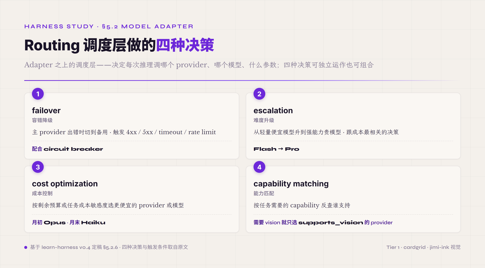

# 5.2 Model Adapter & Routing · **P0 (adapter 边界) / P1 (多 provider 抽象 + Routing)**

第二件机制 Model Adapter 是 harness 跟外部模型 API 之间的隔离层——它把"模型怎么调"这件事封装成一个内部接口，让 harness 上层代码不需要直接接触模型供应商的 SDK 细节。Routing 是 Adapter 之上的调度层，决定每次推理调哪一个 provider、哪一个具体模型、用什么参数。这两件合起来回答一个工程问题：**怎么让 harness 在模型 API 升级、模型供应商更换、模型能力提升时不需要大规模改业务代码**。这件事看起来不起眼，但是 harness 长期可维护性的根基——做得对一年内模型生态怎么变 harness 几乎不动，做得错一次 API 升级就要全员重写。

#### 5.2.0 本节首次出现的术语

§一-§四已经解释过的 Model Adapter / Routing 基础概念（实习生类比里 "Model Adapter & Routing = 配电源和打卡机"）下面会做工程加深。这里只列 §5.2 本节首次出现的术语。

**Adapter 工程模式** —— **Adapter 设计模式**（软件设计模式之一 · 在两个不兼容接口之间放一个翻译层让上层代码不用关心底层细节 · Java / C# / Python 标准设计模式 · agent harness 里用它隔离模型供应商差异）。**完整接口形态术语** —— **completion**（模型完成一次推理后的产出 · 包含输出文本、工具调用、token 使用量、终止原因等字段 · 各家 SDK 字段名略有差异）。**streaming**（模型边推理边把 token 流式返回的协议 · SSE 是常见格式 · 各家具体字段和事件名略有差异）。

**Routing 调度术语** —— **failover**（主 provider 出错时自动降级到备用 provider · 触发条件包括 4xx 客户端错误、5xx 服务端错误、timeout、rate limit）。**escalation**（根据任务难度或当前进度从轻量模型升级到强模型 · Flash 觉得搞不定就升到 Pro · 是 routing 里跟成本最相关的决策）。**cost optimization**（routing 时根据当前预算或任务成本敏感度主动选更便宜的 provider 或同 provider 内更便宜的模型）。**capability flag**（标记每个 provider / 模型支持哪些能力的布尔字段 · 比如 supports_tool_use / supports_vision / supports_streaming · 让 harness 在调用前判断当前 provider 是否支持所需能力）。**capability matching**（routing 时按当前任务需要的 capability flag 反查谁能干 · 比如任务需要 vision 就只选支持 vision 的模型）。**circuit breaker**（熔断器 · 软件工程经典模式 · 某 provider 连续失败 N 次时自动切到备用并停止再尝试主 provider 一段时间 · 防止失败级联）。

**多 provider 抽象的两条路** —— **最小公分母**（lowest common denominator · 多 provider 抽象策略之一 · 接口只暴露所有 provider 都支持的能力 · 优点简单兼容性最好 · 缺点丢掉各家的差异化能力）。**全特性暴露 + capability flag**（另一种策略 · 接口完整暴露所有 provider 的能力 · capability flag 让上层判断当前 provider 是否支持某能力 · 优点保留差异化能力 · 缺点接口复杂上层判断负担大 · 生产 harness 大多选这条）。

Adapter 边界这一机制跟前面 §5.1 末尾讲的协议层不变量是同一件事的两面——前者是 Adapter 视角下的协议发射方（系统给模型发的请求要按某 wire 协议拼），后者是 inner loop 视角下的协议接受方（系统收到模型回应里的 tool_call 要按某 wire 协议解）。OpenAI / Anthropic / DeepSeek V4 strict 三家的 wire 格式差异在两端都要被吸收掉——Adapter 处理发射端，inner loop 协议层处理接受端。读到 §5.2 这一段时回顾 §5.1 末尾的协议层一段会更容易把 Agent Loop 跟 Model Adapter 的边界对齐：这两件机制是 harness 跟外部模型供应商打交道的同一条接缝的两侧。

#### 5.2.1 解决什么问题 · 各家 API 不一样的具体工程代价

模型 API 看起来都是"传 prompt 拿 completion"的简单形态，但每家供应商在细节上都有自己的方言。tool calling 字段名 OpenAI 叫 `tool_calls` / Anthropic 在 message content blocks 里放 `tool_use` 类型 / Google Gemini 叫 `function_call` 嵌在 candidate 里 / 国产模型有的字段名是 `function_call` 跟 OpenAI 旧版对齐有的自己另立一套。token 计费口径更乱——cache hit 算不算 input token、reasoning token 算不算 output token、cached image input 怎么计费，各家定义各不相同；同一段对话发给 OpenAI 跟 Anthropic 算出来的总成本可能差出可观一块，不是因为价格差，是因为口径差。reasoning content 通道分裂也很严重——OpenAI o1 / o3 只给摘要不给完整 thinking、Anthropic Claude thinking 部分给、DeepSeek R1 全给、Qwen 系列各版本不一样。stream 协议名义上都是 SSE 但事件名 / 数据切分粒度 / 终止信号格式不同，写一份 stream parser 给 OpenAI 用拿到 Anthropic 上跑会挂掉。

如果 harness 业务代码直接 import openai 或 anthropic SDK 调模型 API，这些差异会污染到业务代码的每一处。换一家模型需要把所有调用点改一遍——业务代码里出现 `response.choices[0].message.tool_calls` 这种带 provider 烙印的字段访问，换 Anthropic 就要改成 `response.content[0].input` 这种完全不同的访问路径。更难的是模型 API 自己也会升级——Anthropic 从 2023 到 2026 大版本升级过两次 tool use 接口、OpenAI 把 function calling 改名 tool calling 还顺手改了字段结构、各家陆续加 prompt caching / reasoning channel / vision / parallel tool call 等新 capability，每次升级 SDK 都要改。**没有 Adapter 边界，模型 API 一升级整个 harness 跟着改**——这就是 Adapter 这一机制存在的工程必要性。

#### 5.2.2 核心接口形状 · 一个最小 ModelAdapter 长什么样

一个最小可用的 ModelAdapter 接口形状大致是这样：

```
ModelAdapter.complete(messages, tools, params) -> Completion

Completion {
  content: string,           // 输出文本
  tool_calls: ToolCall[],    // 模型决定调的工具列表
  usage: TokenUsage,         // input / output / cache / reasoning 各类 token 数
  finish_reason: enum,       // stop / tool_use / length / safety / ...
  reasoning: string?,        // reasoning model 的 thinking 内容 · 可选
}
```

输入侧 `messages` 是统一的对话历史格式（system / user / assistant / tool role），`tools` 是统一的工具 schema 列表，`params` 是 temperature / max_tokens / thinking_budget 等参数。输出侧 `Completion` 是一个统一的结构体，无论底层调的是 OpenAI、Anthropic、Gemini、DeepSeek 还是 Qwen，业务代码拿到的都是同样字段的 Completion。

这个接口的设计哲学是**统一形态、保留必要差异**。`content` / `tool_calls` / `usage` / `finish_reason` 是所有 provider 都有的、必须统一的字段；`reasoning` 是 reasoning model 才有的、可选的字段——通过 Optional 标记保留差异但不污染所有调用点。业务代码只在用到 reasoning 时才需要判断这个字段是否存在，不用 reasoning 的代码完全不感知这件事。`finish_reason` 是个 enum——每家 provider 的具体值不一样（OpenAI 用 `stop` / Anthropic 用 `end_turn`），Adapter 内部做映射，业务代码看到的是统一 enum。`usage` 把所有 token 类别归一化（cache hit token / reasoning token / cached image token 等都统一进 TokenUsage 结构），让 cost dashboard 不用为每家供应商写一份解析逻辑。

#### 5.2.3 关键设计取舍 1 · 单 provider 也要有 Adapter 边界

很多 harness 项目早期会有一个直觉——"我们只用 Anthropic 一家、不做 failover、不做多 provider，要 Adapter 抽象有什么用？业务代码直接 import anthropic SDK 不就行了？"这个直觉是错的，**即使只绑一家模型，把 Adapter 边界独立抽出来也是 P0 必备**。

理由有三层。第一层是**模型 API 自己会升级**——Anthropic 历史上大版本升级过两次 tool use 接口、字段结构改过几次、prompt caching 加进来时改了一次 usage 字段。如果业务代码直接 import anthropic SDK，每次 API 升级业务代码每个调用点都要跟着改；有 Adapter 边界，升级只改 Adapter 一个文件，业务代码不动。第二层是**模型生态会变化**——你 2026 年 5 月可能很确定只用 Anthropic，但半年后可能发现某个特定任务用国产模型 Qwen 3 Plus 性价比更高，或者发现 Claude Code 主线推某个新能力你想试，或者发现 multi-provider failover 在某个 high-uptime 场景必要。没有 Adapter 边界这些都得回去大改业务代码；有 Adapter 边界加一个新 provider 只是写一个新 Adapter 实现。第三层是**测试和 mock 更容易**——业务代码对的是 Adapter interface，测试时可以 mock Adapter 跑各种边界场景；直接 import SDK 的代码测试时要 mock 整个 SDK，麻烦且容易漏。

Claude Code 自己虽然只调 Anthropic API，但内部 codebase 里 Anthropic API 调用全部包在自己的 adapter 类里——业务代码访问的是这个 adapter 类，不是直接 `anthropic.Anthropic().messages.create(...)`。这种"防御性工程"思想——把外部依赖永远抽到一个内部 interface 之后，不让外部依赖的细节渗透到业务代码——是工业级 harness 跟玩具 harness 最显著的代码层差别。**Adapter 边界是个一次性的投资，长期回报巨大**。

#### 5.2.4 关键设计取舍 2 · 多 provider 抽象的两条路

当 harness 要支持多个 provider（不论是为 failover、为 A/B 模型对比、为成本优化、还是为 capability matching），多 provider 抽象就成为必须解决的设计问题。这里有两条工程路径——最小公分母 vs 全特性暴露 + capability flag——各自的利弊在工业级 harness 设计里讨论了好几年。

**最小公分母（lowest common denominator）路径**：Adapter 接口只暴露所有 provider 都共有的能力。比如所有 provider 都有 content / tool_calls / usage / finish_reason 四个基础字段，那 Adapter 接口就只暴露这四个。reasoning 这种只有 reasoning model 才有的字段不放进接口，prompt caching 这种只有 Anthropic 大力推的能力也不放进接口。优点是接口最简单、所有 provider 实现都干净、上层代码不需要做能力判断。缺点是**所有 provider 的差异化能力都丢了**——你用 Anthropic 就拿不到 prompt caching 收益、用 OpenAI o1 就拿不到 reasoning channel、用 Gemini 就拿不到 2M context 优势。最小公分母在保证兼容性的同时把每家最值得用的特性都阉割了。

**全特性暴露 + capability flag 路径**：Adapter 接口暴露完整字段集（包括 reasoning / cache / vision 等各家差异化能力），通过 capability flag 让上层代码判断当前 provider 是否支持某能力。`adapter.capabilities.supports_reasoning` 这个 bool 字段标记当前 provider 是否支持 reasoning channel，上层代码在用 reasoning 之前先判断这个 flag。优点是**各 provider 的差异化能力都保留**——你用 Anthropic 时 prompt caching 自动可用，用 reasoning model 时 thinking channel 自动可用。缺点是接口复杂、上层代码每次用差异化能力前要做 capability check、Adapter 实现要处理"如果当前 provider 不支持这个 capability，传进来怎么办"的兼容性。

生产 harness 大多选第二条——全特性暴露 + capability flag。理由是：harness 存在的目的本来就是发挥每家模型的最大能力，不是把每家阉割到最小公分母再统一。最小公分母虽然简单但放弃了 harness 的核心价值；全特性暴露虽然接口复杂但保留了能让 agent 在每家模型上都跑出最好效果的工程空间。LiteLLM、Pydantic AI 等开源多 provider 库都走第二条路径，Claude Code、Codex CLI 这种单 provider 但内部仍有 Adapter 的产品也走第二条路径（即使只暴露一家 capability flag 仍然有用——业务代码可以根据 capability flag 决定要不要用 prompt caching / reasoning）。

#### 5.2.5 关键设计取舍 3 · 统一计费口径在 Adapter 层归一化

这件事看起来是个小问题，但实际工程里反复踩坑。各家 provider 的 token usage 字段口径完全不一致——cache hit token 算不算 input token、reasoning token 算不算 output token、cached image 怎么计费、tool call 的 input/output 各怎么算，每家有自己的算法。如果 Adapter 不在这一层归一化，上层 cost dashboard 拿到不同 provider 的 usage 数据完全没法对比，budget alarm 设的阈值在某些 provider 上误触发在另一些上又漏报。

工程上做法是 Adapter 在出口处把每家的 usage 字段转换成统一定义的 `TokenUsage` 结构——比如统一定义 `input_tokens` 是"模型实际看到的输入 token 数（含 cache）"，`output_tokens` 是"模型生成的非 reasoning 输出"，`reasoning_tokens` 单独算，`cache_hit_tokens` 单独标记。各家 provider Adapter 内部按自己的口径换算成这套统一定义。这样上层 cost dashboard、budget alarm、成本归因报表都可以基于统一定义算钱，跨 provider 对比有意义。

不做归一化的代价在生产环境里特别坑——你可能上线一个新模型，几天后发现 cost 比预期高 40%，复查才发现是 cache hit 在这家 provider 算入 input token 而你以前用的 provider 不算入。一个口径差异在大规模调用下被放大成几千几万块钱的 cost 漂移，运维查起来还查不到根。Adapter 层归一化 token 口径，这种坑可以从源头堵住。

#### 5.2.6 ★ Routing 子节 · 调度层做的四种决策

Adapter 是隔离层，Routing 是 Adapter 之上的调度层——决定当前这次推理调哪一个 provider 哪一个具体模型用什么参数。Routing 远不止 failover——它至少做四种类型的调度决策，每种解决一个不同的工程问题。




**第一种 · failover 容错降级**。主 provider 出错时自动切到备用 provider。触发条件包括四类：4xx 客户端错误（认证失败 / 配额耗尽 / 请求格式错），5xx 服务端错误（provider 服务挂了），timeout（请求超过设定时长还没响应），rate limit（API 速率限制触发）。每种触发条件的处理不一样——4xx 通常不可重试（错误在请求侧），5xx 和 timeout 可以重试主 provider 几次再切备用，rate limit 适合等几秒后重试主 provider 或立刻切到一个不同账号 / 不同地区的备用 endpoint。工程实现上常配合 circuit breaker——某 provider 连续失败 N 次（比如 5 次）就熔断，停止再尝试主 provider 一段时间（比如 60 秒），让 routing 直接走备用 provider，避免每次请求都先 fail 再 fallback 浪费时延。

**第二种 · escalation 难度升级**。根据当前任务的复杂度或 agent 跑到一半的进度，从轻量便宜模型升级到强能力贵模型。最典型场景是 Flash → Pro escalation——任务一开始用 Claude Haiku 或 GPT-4o-mini 这种便宜快的模型跑、跑到某个 verifier 失败或某个 agent loop 卡住时切到 Claude Opus / o1 这种强但贵的模型重跑那一段。触发条件包括 verifier 失败超过 N 次、tool call 重复同一个失败超过 N 次、context 长度超过轻量模型的安全阈值、出现特定关键词（"复杂"、"多步骤"）等。escalation 是 routing 里跟成本最相关的决策——做得对一次任务总成本可能比纯用强模型省下一大块，做得错切换时机不对反而要付双倍成本（轻量跑废了再重跑强模型）。

**第三种 · cost optimization 成本控制**。根据当前剩余预算或任务的成本敏感度，主动选择更便宜的 provider 或更便宜的同 provider 模型。典型场景是月初预算充裕时跑 Claude Opus、月末预算快用完时切到 Claude Haiku 或国产模型。还有按 task type 区分——code review 这种需要强推理的用强模型，文档摘要这种轻型任务用便宜模型。Routing 在这种场景下需要拿到 budget tracker 和 task classifier 的输入做决策，是 harness 里跟 observability 配合最紧密的一件机制之一。

**第四种 · capability matching 能力匹配**。根据当前任务需要什么 capability，反查谁支持。比如当前任务包含图片输入，就只选 capability flag 里 supports_vision 为 true 的 provider；当前任务需要 2M+ context，就只选支持长上下文的 provider；当前任务需要 prompt caching 来省成本，就优先选 Anthropic（目前 prompt caching 最成熟的供应商）。capability matching 跟 5.2.4 的全特性暴露 + capability flag 路径是配套的——capability flag 是这件事的工程基础。

四种 routing 决策可以独立运作也可以组合。生产 harness 里 routing 模块通常是一个独立的、可配置的策略层，里面是一组规则——"如果 X 触发则切到 provider Y" 这种声明式配置，让 routing 行为不写死在代码里、可以通过配置文件调整。但 routing 本身不应该用 LLM 来做决策——routing 是工程层的确定性逻辑，用 LLM 来 routing 会引入新的不确定性，并且 routing 决策必须快（每次推理前都要做），LLM 决策的延迟和成本都不划算。"routing 用代码不用 LLM" 是这一机制的工程原则。

Routing 这一层的工程精度还可以再细一格——reasoning model 时代的"thinking on/off"开关常被设计成单档 bool，但更稳的设计是把它拆成多档 profile policy。比如 non_think（快速直觉式回答）/ think_high（标准逻辑式分析）/ think_max（推到能力边界的深推理）这种三档结构在多家 reasoning model 都出现过。关键 insight 是这几档不是模型字段而是 profile 级 policy 变量——同一个物理模型可以对应多个 profile，每个 profile 有专属用法、观测要求、升降级规则。配套的工程纪律是"升级到最贵档不是默认起点而是兜底"——一个理性的 routing 策略应该先证明轻量档顶不住才升强档，否则就是凭直觉烧钱。判定"升级时机"这件事必须靠实测数据，不能凭"参数名更高就更强"的直觉——更高的 reasoning_effort 在某些任务上会带来过度思考反而栽跟头，所以 routing 升降级决策必须配最低限度的对照测试（同一任务两档跑、看通过率和 token 消耗），跑出来再写进 routing 规则。

#### 5.2.7 常见误区 · Adapter 边界被打穿

Adapter 这一机制最常见的误区是 **adapter 边界被业务代码绕过打穿**——业务代码直接 import openai / anthropic SDK，跳过 adapter 抽象层直接调底层 SDK。

机制层面这个常见误区怎么发生的？通常是这三个原因之一：第一是**赶进度**——业务工程师在赶 ddl 时发现"我直接 import openai 三行代码就能跑通，干嘛要走 adapter 的复杂调用链"，省 30 分钟代价是埋一个长期债。第二是**临时调试**——开发时为了验证某个新 API feature 直接调 SDK 试一下，验证完忘了把代码移回 adapter 内部，留下一段绕过 adapter 的代码。第三是**不知道有 adapter 边界**——团队规模扩大、新人加入时如果没有 onboarding 提示 adapter 边界纪律，新人很自然就直接调 SDK。

这个常见误区的代价：任何 harness codebase 里如果允许 openai / anthropic SDK 直接被业务代码 import，模型 API 一升级（每年 1-3 次大版本）都会引发大规模 codebase 修改。2023-2025 期间 OpenAI function calling 改名 tool calling、Anthropic tool use 字段结构调整、各家 prompt caching 陆续加进来这几次升级里，没有 adapter 边界的项目每次都要改动大量散落的业务调用点，有 adapter 边界的项目只需改少数几个 adapter 文件。

判定线：什么场景这是常见误区，什么场景可以容忍？**PoC 阶段（任务一次性、跑通就丢、不维护）可以容忍直接 import SDK**——这种场景模型 API 升级在你扔掉这份代码之前不会发生，adapter 抽象成本超过收益。**任何要上 production / 长期维护 / 多人协作 / 跨任务复用的 harness 都必须有 adapter 边界**——这种场景必然会经历模型 API 升级，没 adapter 边界就是一个定时炸弹。PoC 通常 1-2 周完成可以容忍走捷径，但**PoC 转 production 时第一件事就是建 adapter 边界，把所有直接 import SDK 的地方清掉**。这件事在工程交接 checklist 里应该是 P0。

#### 5.2.8 业界实现对照与起步建议

业界三种典型 Adapter 实现路径，工程取舍各有不同。**LiteLLM** 这里取它的 reverse proxy 形态作对照（它同时也有 in-process SDK 模式）——一个独立的 HTTP server 暴露 OpenAI 兼容的 API，内部把请求路由到各家真正的 provider。优点是业务代码完全不知道下面是哪家 provider、所有现有的 OpenAI SDK 都能直接用；缺点是多一跳网络调用、配置和运维变复杂、流式响应有兼容性问题。适合多个独立服务都要用模型的场景，不太适合单个 harness 内部用。**Pydantic AI** 走的是库内三层抽象——provider 客户端层 / model 适配层 / agent 调度层。优点是没有额外网络跳、类型完整、capability flag 在编译期可检查；缺点是 Python 单语言、对接新 provider 要写代码不能纯配置。适合 Python harness 内部用。**Claude Code** 走的是单 provider 但仍有 adapter 边界路径——内部捆 Anthropic API、但所有 Anthropic API 调用包在自己的 adapter 类里。优点是简单、专注一家、performance 最好；缺点是切换 provider 要重写 adapter 实现。适合明确只用一家的产品级 harness。

起步建议从四个维度展开。**注意什么**——adapter 边界的最大坑是早期没有边界纪律、上线后才发现要补，那时候业务代码已经 SDK 调用满天飞；从 day 1 就要拒绝业务代码直接 import provider SDK，要 import 也只能 import 自己写的 adapter 模块。**怎么设计**——决定单 provider 还是多 provider，单 provider 选 Claude Code 模式（捆死一家但仍抽 adapter 边界），多 provider 选 LiteLLM 或 Pydantic AI 模式；接口设计走全特性暴露 + capability flag 路径不走最小公分母；usage 字段在 adapter 层归一化。**怎么测试**——adapter 接口配套写一组契约测试（每个 provider 实现都要通过同一组测试），验证 capability flag 准确、usage 归一化正确、failover 触发条件正确；用 mock adapter 跑业务代码的单元测试，确保业务代码不依赖具体 provider 行为。**写什么 prompt**——adapter 这一机制 agent 自己不需要直接知道（adapter 是上层 harness 工程师的事），但 agent 需要知道当前模型有什么 capability、剩余 budget 是多少、failover 后用的是不是它习惯的模型——这些信息通过 system prompt 注入或通过 tool 接口暴露给 agent。

Model Adapter & Routing 这一机制看起来是个工程细节，但它是 harness 跨越模型生态变化的根基。一年内模型 API 至少升级 2-3 次、新模型至少出 5-10 个、capability 格局至少变 1-2 次——没有这一机制 harness 跟着每次变都要大改，有这一机制大部分变化只动一两个文件就处理完。这就是 Adapter 边界跟 Routing 调度合起来的工程价值——让 harness 拥有一定的模型生态变化免疫力。
