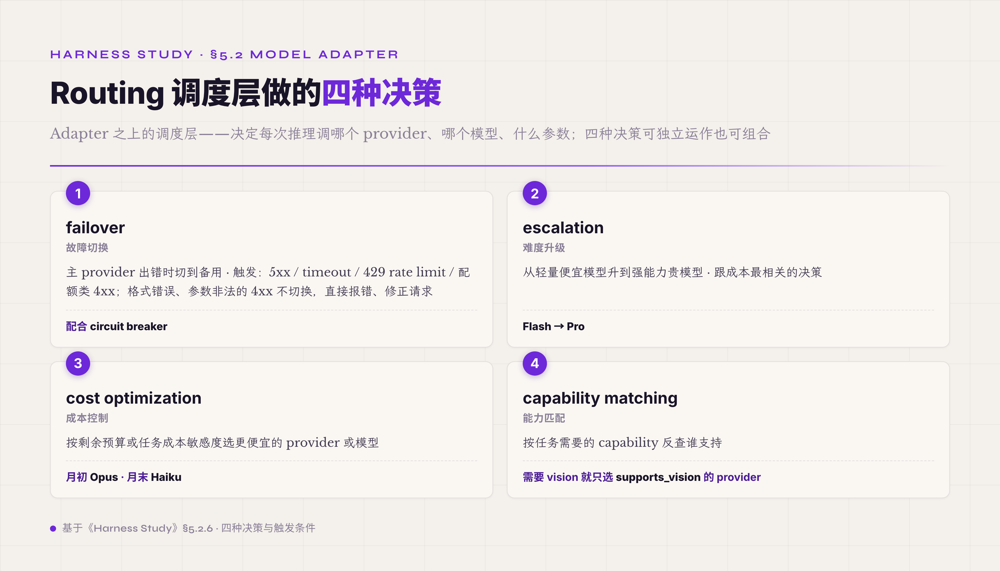

# 5.2 Model Adapter & Routing · **P0 (adapter 边界) / P1 (多 provider 抽象 + Routing)**

第二个机制 Model Adapter 是 harness 跟外部模型 API 之间的隔离层。它把"模型怎么调"这件事封装成一个内部接口，让 harness 上层代码不需要直接接触模型供应商（provider）的 SDK 细节。Routing 是 Adapter 之上的调度层，决定每次推理调哪一个 provider、哪一个具体模型、用什么参数。这两个机制合起来回答一个工程问题：**怎么让 harness 在模型 API 升级、模型供应商更换、模型能力提升时，不需要大规模改业务代码**。这件事看起来不起眼，却是 harness 长期可维护性的根基：做得对，一年内模型生态怎么变，harness 几乎不动；做得不对，一次 API 升级就要全员重写。

#### 5.2.0 本节首次出现的术语

§一至 §四 已经解释过 Model Adapter 和 Routing 的基础概念，下面做工程上的加深。第三章的实习生类比里，这一组机制对应"配电源和打卡机"：电源对应 Adapter，不管接的是哪家模型，都给实习生稳定地接通"大脑"，各家接口的差异由它吸收；打卡机对应 Routing 和用量记账，记下每次调了谁、花了多少，并据此决定下一次接到哪一路。这里只列 §5.2 首次出现的术语。

**Adapter 相关**
- **适配器模式（Adapter pattern）**：软件设计模式之一，在两个不兼容的接口之间放一个翻译层，让上层代码不用关心底层细节。Java、C#、Python 等语言里都很常见；agent harness 用它隔离模型供应商之间的差异。
- **completion**：模型完成一次推理后的产出，包含输出文本、工具调用、token 用量、终止原因等字段，各家 SDK 的字段名略有差异。
- **流式（streaming）**：模型边推理边把 token 逐段返回的协议，常见格式是 SSE，各家的具体字段和事件名略有差异。

**Routing 相关**
- **故障切换（failover）**：主 provider 出错时自动切换到备用 provider。适合切换的情况是 5xx 服务端错误、超时、429 速率限制，以及部分配额类 4xx 错误（例如某个账号的配额用完，可以换账号或换 provider）。请求格式错误、参数非法这类 4xx 错误出在请求本身，换 provider 也没用，应当直接报错、修正请求。
- **备用路径（fallback）**：主路径失败或被熔断时改走的备用 provider 或模型。failover 回答"什么情况下切"，fallback 回答"切到哪里"。
- **熔断器（circuit breaker）**：软件工程的经典模式。某个 provider 连续失败达到阈值时熔断器"打开"，在冷却期内对它的请求直接快速失败、不再真正发出；冷却期过后放少量请求试探（半开），成功了再恢复。熔断器只负责"不再往已经坏掉的下游打请求"，防止失败级联；请求改走哪里，由 fallback 决定。
- **升级（escalation）**：根据任务难度或当前进度，从轻量模型升级到强模型。例如 Flash 判定任务超出自身能力，就升到 Pro。这是 routing 里跟成本最相关的决策。
- **成本优化（cost optimization）**：routing 时根据当前预算或任务对成本的敏感度，主动选更便宜的 provider，或同一 provider 内更便宜的模型。
- **能力标记（capability flag）**：标记每个 provider 或模型支持哪些能力的布尔字段，比如 `supports_tool_use`、`supports_vision`、`supports_streaming`，让 harness 在调用前判断当前 provider 是否支持所需能力。
- **能力匹配（capability matching）**：routing 时按当前任务需要的能力标记，反查哪些模型能胜任。比如任务需要看图，就只选支持视觉输入的模型。

**多 provider 抽象的两条路**
- **最小公分母（lowest common denominator）**：接口只暴露所有 provider 都支持的能力。优点是简单、兼容性最好；缺点是丢掉了各家的差异化能力。
- **全特性暴露 + 能力标记**：接口完整暴露所有 provider 的能力，由能力标记让上层判断当前 provider 是否支持某项能力。优点是保留差异化能力；缺点是接口复杂，上层的判断负担大。生产 harness 大多选这条路。

Adapter 边界跟 §5.1 末尾讲的协议层不变量（每个 tool_call 后面必须紧跟对应的 tool_result）是同一条接缝的两侧，分工如下：

- **Adapter 负责双向翻译**：发请求时，把 harness 内部的统一格式转成各家 provider 的线上格式（wire format）；收响应时，把各家格式解析成统一的 Completion。OpenAI、Anthropic、DeepSeek V4 strict 三家线上格式的差异，全部在 Adapter 里吸收掉。
- **inner loop 只检查配对**：它拿到的已经是统一格式，不再接触各家格式，只负责检查 tool_call 与 tool_result 是否配对完整。

读 §5.2 时回头看一眼 §5.1 末尾的协议层一段，更容易把 Agent Loop 跟 Model Adapter 的边界对齐：这两个机制是 harness 跟外部模型供应商打交道的同一条接缝的两侧。

#### 5.2.1 解决什么问题 · 各家 API 不一样的具体工程代价

模型 API 看起来都是"传 prompt、拿 completion"的简单形态，但每家供应商在细节上都有自己的方言。

- **工具调用字段名不同**：OpenAI 叫 `tool_calls`；Anthropic 在消息的 content blocks 里放 `tool_use` 类型；Google Gemini 叫 `function_call`，嵌在 candidate 里；国产模型有的沿用 OpenAI 旧版的 `function_call`，有的自成一套。
- **token 计费的统计方法更乱**：缓存命中的 token 算不算输入 token，推理（reasoning）token 算不算输出 token，缓存的图片输入怎么计费，各家定义各不相同。同一段对话发给 OpenAI 和 Anthropic，算出来的总成本可能差出可观的一块，原因不在价格，而在统计方法。
- **推理内容通道分裂**：OpenAI o1、o3 只给摘要，不给完整的思考过程；Anthropic Claude 的 thinking 给一部分；DeepSeek R1 全给；Qwen 系列各版本不一样。
- **流式协议不统一**：名义上都是 SSE，但事件名、数据切分粒度、终止信号格式各不相同。给 OpenAI 写的流式解析器拿到 Anthropic 上跑，会直接出错。

如果 harness 业务代码直接 import openai 或 anthropic SDK 调模型 API，这些差异会污染业务代码的每一处。换一家模型就要把所有调用点改一遍：业务代码里出现 `response.choices[0].message.tool_calls` 这种 provider 专有的字段访问，换成 Anthropic 就要改成 `response.content[0].input` 这种完全不同的访问路径。更麻烦的是模型 API 自己也会升级：Anthropic 的 tool use 接口从公测到正式发布有过调整，之后又陆续加进缓存、思考等新字段；OpenAI 把 function calling 改名为 tool calling，同时改了字段结构；各家还陆续加入提示词缓存（prompt caching）、推理通道、视觉输入、并行工具调用等新能力，每次升级 SDK 都要改代码。**没有 Adapter 边界，模型 API 一升级，整个 harness 都要跟着改。** 这就是 Adapter 这个机制存在的工程必要性。

#### 5.2.2 核心接口形状 · 一个最小 ModelAdapter 长什么样

一个最小可用的 ModelAdapter 接口形状大致是这样：

```
ModelAdapter.complete(messages, tools, params) -> Completion

Completion {
  content: string,           // 输出文本
  tool_calls: ToolCall[],    // 模型决定调的工具列表
  usage: TokenUsage,         // input / output / cache / reasoning 各类 token 数
  finish_reason: enum,       // stop / tool_use / length / safety / ...
  reasoning: string?,        // reasoning model 的 thinking 内容 · 可选
}
```

输入侧的 `messages` 是统一的对话历史格式（system、user、assistant、tool 四种角色），`tools` 是统一的工具 schema 列表，`params` 是 temperature、max_tokens、thinking_budget 等参数。输出侧的 `Completion` 是一个统一的结构体：无论底层调的是 OpenAI、Anthropic、Gemini、DeepSeek 还是 Qwen，业务代码拿到的都是字段相同的 Completion。

这个接口的设计思路是**统一形态，保留必要差异**。

- `content`、`tool_calls`、`usage`、`finish_reason` 是所有 provider 都有、必须统一的字段。
- `reasoning` 是推理模型才有的可选字段，用可选标记保留差异，但不污染所有调用点。业务代码只在用到 reasoning 时才需要判断这个字段是否存在，不用 reasoning 的代码完全不感知它。
- `finish_reason` 是枚举，每家 provider 的具体取值不一样（OpenAI 用 `stop`，Anthropic 用 `end_turn`），由 Adapter 在解析响应时做映射，业务代码看到的是统一的枚举值。
- `usage` 把所有 token 类别归一化（缓存命中 token、推理 token、缓存图片 token 等都统一进 TokenUsage 结构），成本看板不用为每家供应商各写一份解析逻辑。

这几项映射都属于 Adapter 的响应解析，也就是上文说的"双向翻译"中的响应一侧。

#### 5.2.3 关键设计取舍 1 · 单 provider 也要有 Adapter 边界

很多 harness 项目早期会有一个直觉："我们只用 Anthropic 一家，不做 failover，不做多 provider，要 Adapter 抽象有什么用？业务代码直接 import anthropic SDK 不就行了？"这个直觉是错的。**即使只绑一家模型，把 Adapter 边界独立抽出来也是 P0 必备。**

理由有三层。

1. **模型 API 自己会升级。** Anthropic 的 tool use 接口有过调整，字段结构改过几次，加入提示词缓存时 usage 字段也多了几项。如果业务代码直接 import anthropic SDK，每次 API 升级，每个调用点都要跟着改；有 Adapter 边界，升级只改 Adapter 一个文件，业务代码不动。
2. **模型生态会变化。** 你 2026 年 5 月可能很确定只用 Anthropic，但半年后也许发现某个特定任务用国产模型 Qwen 3 Plus 性价比更高，或者想试 Claude Code 主推的某个新能力，或者在某个高可用场景下发现多 provider 故障切换是必要的。没有 Adapter 边界，这些都得回去大改业务代码；有 Adapter 边界，加一个新 provider 只是写一个新的 Adapter 实现。
3. **测试和 mock 更容易。** 业务代码面对的是 Adapter 接口，测试时可以 mock Adapter 跑各种边界场景；直接 import SDK 的代码，测试时要 mock 整个 SDK，麻烦且容易漏。

Claude Code 绑定的是 Claude 一族模型，看起来是"只用一家"的极端案例，但仅这一族就有四条 provider 通道：Anthropic API 直连、AWS Bedrock、Google Vertex AI、Microsoft Foundry，各通道的鉴权方式、endpoint、模型 ID 全都不同。所以它的代码库里，API 调用全部包在自己的 adapter 类后面，业务代码访问的是这个 adapter 类，而不是直接调 `anthropic.Anthropic().messages.create(...)`。这是"单模型族也要 Adapter 边界"最现成的例子：你以为绑死一家就用不上抽象，企业客户的部署需求会替你把多通道带回来。这种防御性工程思想，即把外部依赖始终抽到一个内部接口之后，不让外部依赖的细节渗透到业务代码，是工业级 harness 跟玩具 harness 在代码层最显著的差别。**Adapter 边界是一次性的投资，长期回报很大。**

#### 5.2.4 关键设计取舍 2 · 多 provider 抽象的两条路

当 harness 要支持多个 provider（不论是为了故障切换、A/B 模型对比、成本优化，还是能力匹配），多 provider 抽象就成了必须解决的设计问题。这里有两条工程路径：最小公分母，以及全特性暴露加能力标记。两者的利弊在工业级 harness 设计里讨论了好几年。

**最小公分母路径**：Adapter 接口只暴露所有 provider 共有的能力。比如所有 provider 都有 content、tool_calls、usage、finish_reason 四个基础字段，Adapter 接口就只暴露这四个。reasoning 这种只有推理模型才有的字段不放进接口；提示词缓存这种各家都有、但实现方式与计费各不相同的能力也不放进接口。优点是接口最简单，所有 provider 的实现都干净，上层代码不需要做能力判断。缺点是**所有 provider 的差异化能力都丢了**：用 Anthropic 时没法显式设置缓存断点，用 OpenAI o1 时拿不到推理通道，用 Gemini 时用不上 2M 上下文的优势。最小公分母在保证兼容性的同时，把每家最值得用的特性都裁掉了。

**全特性暴露 + 能力标记路径**：Adapter 接口暴露完整字段集（包括推理、缓存、视觉等各家的差异化能力），通过能力标记让上层代码判断当前 provider 是否支持某项能力。`adapter.capabilities.supports_reasoning` 这个布尔字段标记当前 provider 是否支持推理通道，上层代码在用推理通道之前先判断它。优点是**各 provider 的差异化能力都保留**：各家提示词缓存的控制方式都能用上，用推理模型时思考通道也能用上。缺点是接口复杂，上层代码每次用差异化能力前都要做能力检查，Adapter 实现也要处理"当前 provider 不支持这项能力，调用方却传进来了怎么办"的兼容问题。

生产 harness 大多选第二条路。理由是：harness 存在的目的本来就是发挥每家模型的最大能力，而不是把每家裁到最小公分母再统一。最小公分母虽然简单，却放弃了 harness 的核心价值；全特性暴露虽然接口复杂，却保留了让 agent 在每家模型上都跑出最好效果的工程空间。LiteLLM、Pydantic AI 等开源多 provider 库都走第二条路；Claude Code 这种面向单一模型族、内部仍有 Adapter 的产品也走第二条路。即使只对接一家，能力标记仍然有用：业务代码可以据此决定要不要用提示词缓存、要不要开推理。

#### 5.2.5 关键设计取舍 3 · 计费统计方法在 Adapter 层归一化

这件事看起来是个小问题，实际工程里却反复踩坑。各家 provider 的 token 用量字段，统计方法完全不一致：缓存命中的 token 算不算输入 token，推理 token 算不算输出 token，缓存图片怎么计费，工具调用的输入输出各怎么算，每家有自己的算法。如果 Adapter 不在这一层归一化，上层成本看板拿到不同 provider 的用量数据就没法对比，预算告警的阈值在某些 provider 上误触发，在另一些上又漏报。

工程上的做法是 Adapter 在出口处把每家的用量字段转换成统一定义的 `TokenUsage` 结构。比如统一规定：

- `input_tokens` 是模型实际看到的输入 token 数（含缓存部分）；
- `output_tokens` 是模型生成的非推理输出；
- `reasoning_tokens` 单独计；
- `cache_hit_tokens` 单独标记。

各家 provider 的 Adapter 在内部按自己的统计方法换算成这套统一定义。这样上层的成本看板、预算告警、成本归因报表都可以基于同一套定义算钱，跨 provider 的对比才有意义。

不做归一化的代价，在生产环境里特别难查。你可能上线一个新模型，几天后发现成本明显高于预期，复查才发现这家 provider 把缓存命中计入输入 token，而以前用的 provider 不计入。一个统计方法上的差异，在大规模调用下会被放大成可观的成本漂移，运维还很难查到根源。在 Adapter 层把 token 统计方法归一化，可以从源头堵住这类问题。

#### 5.2.6 ★ Routing 子节 · 调度层做的四种决策

Adapter 是隔离层，Routing 是 Adapter 之上的调度层，决定当前这次推理调哪一个 provider、哪一个具体模型、用什么参数。Routing 远不止故障切换，它至少做四种调度决策，每种解决一个不同的工程问题。



*图 5.7 · Routing 调度层做的四种决策*

**第一种：故障切换（failover）。** 主 provider 出错时自动切到备用 provider。不同错误的处理方式不同：

- **5xx 服务端错误和超时**：问题在 provider 一侧，可以先重试主 provider 几次，再切到备用。
- **429 速率限制**：适合等几秒后重试主 provider，或者立刻切到不同账号、不同地区的备用 endpoint。
- **配额类 4xx**（如账号额度用完）：可以切换账号或 provider，同时告警，让人去补额度。
- **格式错误、参数非法类 4xx**：错误在请求本身，重试和切换都没用，换一家 provider 大概率照样失败，应当直接报错并修正请求。认证失败属于配置问题，也要告警修配置，而不是靠切换掩盖。

工程实现上，故障切换常配合熔断器使用：某个 provider 连续失败达到阈值（例如 5 次，经验值，按场景调整）时熔断器打开，冷却期内（例如 60 秒）对它的请求直接快速失败，routing 直接走 fallback 指定的备用 provider，避免每次请求都先失败一次再切换、白白浪费时延；冷却期过后再放少量请求试探主 provider 是否恢复。这里要分清两件事：熔断器决定"还要不要往主 provider 发请求"，fallback 决定"不发的话改发到哪里"。

故障切换还要把一条边界说清楚：**它重发的是 completion 请求，completion 本身没有副作用，可以放心重试**；但同样的重试思路搬到工具执行层就危险了。一个写操作工具在"已执行、未返回"的窗口里超时，重试就是重复执行（扣两次款、发两封邮件）。所以重试策略必须分层：completion 层按上面的错误分类重试或切换；工具层的重试要么有幂等保障（给每次工具执行配一个请求指纹，重放前先查执行记录），要么对有外部副作用的工具直接快速失败、转人工处理。这条规则在 §5.3 的 ToolPolicy（每个工具关联的独立策略对象）里实现。

**第二种：难度升级（escalation）。** 根据当前任务的复杂度，或 agent 跑到一半的进度，从轻量便宜的模型升级到能力强、价格高的模型。最典型的场景是从 Flash 级升到 Pro 级：任务一开始用 Claude Haiku 或 GPT-4o-mini 这类便宜快速的模型跑，跑到某个 verifier 失败或 agent loop 卡住时，切到 Claude Opus、o1 这类强但贵的模型，重跑那一段。触发条件包括：

- verifier 失败超过 N 次；
- 工具调用在同一个失败上重复超过 N 次；
- 上下文长度超过轻量模型的安全阈值；
- 出现特定关键词（"复杂""多步骤"）等。

escalation 是 routing 里跟成本最相关的决策。做得对，一次任务的总成本可能比全程用强模型省下一大块；做得不对，切换时机不对，反而要付双倍成本（轻量模型跑废了，再用强模型重跑）。

**第三种：成本控制（cost optimization）。** 根据当前剩余预算或任务的成本敏感度，主动选择更便宜的 provider，或同一 provider 内更便宜的模型。典型场景是月初预算充裕时跑 Claude Opus，月末预算快用完时切到 Claude Haiku 或国产模型。还可以按任务类型区分：代码审查这种需要强推理的任务用强模型，文档摘要这种轻型任务用便宜模型。Routing 在这种场景下需要拿到预算追踪器和任务分类器的输入来做决策，是 harness 里跟可观测性配合最紧密的机制之一。

**第四种：能力匹配（capability matching）。** 根据当前任务需要什么能力，反查谁支持。比如当前任务包含图片输入，就只选能力标记里 `supports_vision` 为 true 的 provider；任务需要 2M 以上的上下文，就只选支持长上下文的 provider；任务要靠提示词缓存省成本，就优先选缓存机制和计费方式最适合当前调用模式的 provider（Anthropic、OpenAI、Gemini 都提供缓存，但实现方式与计费不同）。能力匹配跟 §5.2.4 的"全特性暴露 + 能力标记"路径是配套的，能力标记是这项决策的工程基础。

四种 routing 决策可以独立运作，也可以组合。生产 harness 里的 routing 模块通常是一个独立的、可配置的策略层，里面是一组"如果 X 触发，就切到 provider Y"这样的声明式规则，routing 行为不写死在代码里，可以通过配置文件调整。

routing 的决策方式要按类别来看。

- **确定性要求高的一类（故障切换、权限、预算）必须用代码。** 这些决策错一次就是事故，而且每次推理前都要做；用 LLM 来做会引入新的不确定性，延迟和成本也都不划算。
- **难度与成本这一类可以引入轻量的学习型路由器（learned router）。** 用一个小分类器判断"这个请求走便宜模型还是强模型"。RouteLLM[^routellm-2024]（LMSYS，2024 年开源）在研究上验证过这条路；平台级产品里也有类似的实时分流，例如 ChatGPT 的 GPT-5（[2025-08 发布](https://openai.com/index/introducing-gpt-5/)）在快速模型和思考模型之间按请求实时分流。引入学习型路由器有三个约束条件：决策理由进 trace、可审计；可以离线回放；延迟可控。

"routing 用代码，不用 LLM"作为默认起点仍然成立：学习型路由器是流量和数据攒够之后的进阶做法，而不是起手式。

Routing 这一层的设计还可以再细一步。推理模型时代的"思考开 / 关"开关常被设计成一个布尔值，更稳的设计是把它拆成多档的 profile 策略。比如 non_think（快速直觉式回答）、think_high（标准逻辑式分析）、think_max（推到能力边界的深度推理）这种三档结构，在多家推理模型里都出现过。要点在于，这几档不是模型字段，而是 profile 级的策略变量：同一个物理模型可以对应多个 profile，每个 profile 有专属的用法、观测要求和升降级规则。配套的工程原则是"升到最贵的档位是兜底，而不是默认起点"：一个理性的 routing 策略应该先证明轻量档位顶不住，才升到强档位，否则就是凭直觉烧钱。判断升级时机必须靠实测数据，不能凭"参数值更高就更强"的直觉。更高的 reasoning_effort 在某些任务上会因为过度思考反而出错，所以 routing 的升降级决策必须配上最低限度的对照测试（同一任务用两个档位各跑一遍，比较通过率和 token 消耗），有了结果再写进 routing 规则。

#### 模型"没发起工具调用"的三种成因 · 两种在 Adapter 这条缝上

有一类高频又难查的现象：agent 该调工具却没调，trajectory 里那一轮只有一段文本，没有 tool_call。直觉上会先怪模型能力或 prompt，但实测里成因常在 Adapter 这条接缝上。成因分三种，对策完全不同。

**第一种：模型其实调了，但调用写在正文文本里，没进结构化字段。** 有些模型（尤其是部分国产模型，以及被长 prompt 带偏时）会把工具调用以文本标签的形式输出，直接在 content 里写 `<tool_call>name<arg_key>k</arg_key><arg_value>v</arg_value></tool_call>`，而不放进 API 的结构化 `tool_calls` 字段。Adapter 的响应解析如果只认结构化字段，这种调用会被当成普通文本丢弃，表面看是"没调工具"，实际是**假阴性**。对策是 Adapter 的响应解析在结构化字段之外，再加一道文本标签的正则提取。工具调用的输出形态不只有结构化一种，各家差异很大，解析层不能想当然。

**第二种：模型真没调，因为请求侧没要求它调。** 默认的 `tool_choice: auto` 是"可调可不调"，模型觉得能直接答就直接答。某些轮次你明确需要它走工具（必须查库、必须落盘），就在请求侧把 `tool_choice` 设成 `required` / `any`，或者指定具体工具。这是 Adapter 拼请求时的一个开关，也是"防止不调工具"最直接的手段。但它有边界：长期强制 `required` 会逼模型在不该调时硬调，制造噪声调用，所以它是**按轮次、按场景打开**的策略，而不是全局常开。

**第三种：模型真没调，因为 prompt 把它带偏了。** 一个反直觉但实测反复出现的现象是：**过长的中文 prompt 会让某些模型"懒得"调工具，直接用文本作答。** 触发工具调用的指令裹在一大段中文说明里时，部分模型会忽略工具直接回答。成因在 prompt 装配侧（属于 Prompt Assets 机制的范畴），表现却落在 Adapter 这一层。对策是让"要触发工具调用"的指令短而靠前，把长说明拆开，别让关键指令淹没在长上下文里。

三种成因对应三个层次：响应解析、请求参数、prompt 装配。查"模型没调工具"时按这三处依次排除，比反复改 prompt 或换模型快得多。

#### 5.2.7 反模式 · Adapter 边界被打穿

Adapter 这个机制最常见的反模式（anti-pattern）是 **adapter 边界被业务代码绕过、打穿**：业务代码直接 import openai 或 anthropic SDK，跳过 adapter 抽象层，直接调用底层 SDK。

这个反模式通常由三个原因之一造成。

1. **赶进度。** 业务工程师赶截止日期时发现"我直接 import openai，三行代码就能跑通，何必走 adapter 那条复杂的调用链"。省下半小时，代价是埋下一笔长期债。
2. **临时调试。** 开发时为了验证某个新的 API 特性，直接调 SDK 试一下，验证完忘了把代码移回 adapter 内部，留下一段绕过 adapter 的代码。
3. **不知道有 adapter 边界。** 团队扩大、新人加入时，如果入职引导里没提 adapter 边界这条规则，新人很自然就会直接调 SDK。

这个反模式的代价是：任何 harness 代码库，只要允许业务代码直接 import openai 或 anthropic SDK，模型 API 每升级一次大版本（按经验一年会有几次），都会引发大规模的代码修改。2023 至 2026 年间，OpenAI 把 function calling 改名为 tool calling，Anthropic 调整 tool use 的字段结构，各家陆续加入提示词缓存。这几次升级中，没有 adapter 边界的项目每次都要改动大量散落的业务调用点，有 adapter 边界的项目只需改少数几个 adapter 文件。

判断标准：什么场景下这是反模式，什么场景下可以容忍？

- **PoC 阶段（任务一次性、跑通就丢、不再维护）可以容忍直接 import SDK。** 这种场景下，在你扔掉这份代码之前，模型 API 不会升级，adapter 抽象的成本超过收益。
- **任何要上生产、长期维护、多人协作、跨任务复用的 harness，都必须有 adapter 边界。** 这些场景必然会经历模型 API 升级，没有 adapter 边界就是埋了一颗定时炸弹。

PoC 通常很快完成，可以走捷径，但**PoC 转生产时的第一件事，就是建立 adapter 边界，把所有直接 import SDK 的地方清掉**。这一项在工程交接的检查清单里应该是 P0。

#### 5.2.8 业界实现对照与起步建议

业界有三种典型的 Adapter 实现路径，工程取舍各不相同。

- **LiteLLM**：这里取它的反向代理（reverse proxy）形态作对照（它同时也有进程内 SDK 模式）。它是一个独立的 HTTP 服务，对外暴露与 OpenAI 兼容的 API，内部把请求路由到各家真正的 provider。优点是业务代码完全不知道下面是哪家 provider，现有的 OpenAI SDK 都能直接用；缺点是多一跳网络调用，配置和运维变复杂，流式响应有兼容性问题。适合多个独立服务都要用模型的场景，不太适合单个 harness 内部使用。
- **Pydantic AI**：走库内三层抽象，即 provider 客户端层、模型适配层、agent 调度层。优点是没有额外的网络跳转，类型标注完整，配合静态类型检查器（如 mypy、pyright）能在运行前发现一部分能力与接口的误用；缺点是只支持 Python，对接新 provider 要写代码，不能纯靠配置。适合 Python harness 内部使用。
- **Claude Code**：走"单一模型族，但仍有 adapter 边界"的路径。内部对接 Anthropic API，但所有 API 调用都包在自己的 adapter 类里。优点是简单、专注一家、性能最好；缺点是切换到其他模型族要重写 adapter 实现。适合明确只用一家的产品级 harness。

起步建议从四个方面展开。

- **注意什么**：adapter 边界最大的坑，是早期没有这条规则，上线后才发现要补，那时业务代码里已经到处都是 SDK 调用。从第一天起就要拒绝业务代码直接 import provider SDK；要 import，也只能 import 自己写的 adapter 模块。
- **怎么设计**：先决定单 provider 还是多 provider。单 provider 选 Claude Code 模式（绑定一家，但仍抽出 adapter 边界），多 provider 选 LiteLLM 或 Pydantic AI 模式；接口设计走"全特性暴露 + 能力标记"，不走最小公分母；用量字段在 adapter 层归一化。
- **怎么测试**：给 adapter 接口配一组契约测试（每个 provider 的实现都要通过同一组测试），验证能力标记准确、用量归一化正确、故障切换的触发条件正确；用 mock adapter 跑业务代码的单元测试，确保业务代码不依赖具体 provider 的行为。
- **写什么 prompt**：adapter 这个机制，agent 自己不需要直接知道（adapter 是上层 harness 工程师的事），但 agent 需要知道当前模型有什么能力、剩余预算是多少、故障切换后用的是不是它习惯的模型。这些信息通过 system prompt 注入，或通过工具接口暴露给 agent。

Model Adapter & Routing 这个机制看起来是个工程细节，却是 harness 跨越模型生态变化的根基。按经验，一年内模型 API 会升级几次，新模型会出一批，能力格局也会变化；没有这个机制，harness 每次都要跟着大改，有了它，大部分变化只动一两个文件就能处理完。这就是 Adapter 边界与 Routing 调度合起来的工程价值：让 harness 对模型生态的变化有一定的免疫力。

[^routellm-2024]: RouteLLM: Learning to Route LLMs with Preference Data · arxiv 2406.18665 · Ong, Almahairi et al.（LMSYS + Anyscale）· 2024 · 开源框架 github.com/lm-sys/RouteLLM
