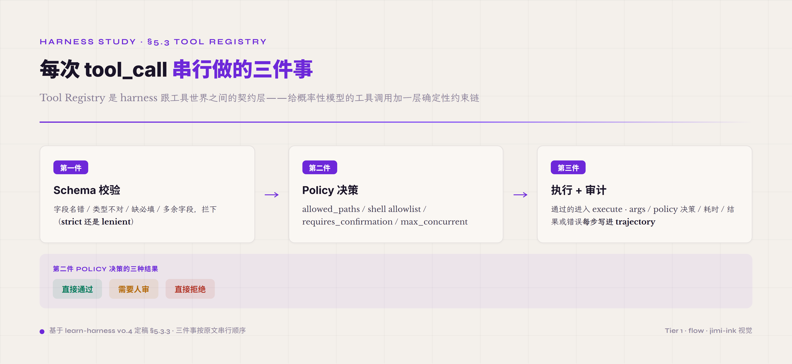
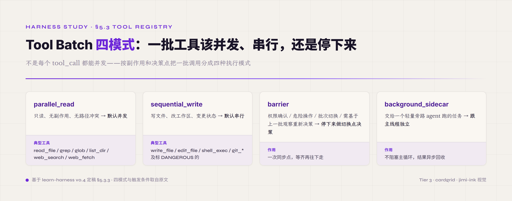

# 5.3 Tool Registry & ACI · **P0**

第三件机制 Tool Registry 是 harness 跟工具世界之间的契约层——它把每件可被 agent 调用的"工具"封装成一个统一形态的可调用对象，让 agent 能用、harness 能管、policy 能控、audit 能查。ACI（Agent-Computer Interface）是这一机制的设计学维度——它强调**工具是给 agent 用的不是给人用的**，所以工具的命名、参数、返回、错误形态都要按 agent 的认知方式而不是人的认知方式来设计。这两件合起来回答一个工程问题：**怎么让概率性的模型在面对一组工具时尽量调对、调对的时候不闯祸、闯祸了能被工程系统兜住**。这件事看起来跟 5.2 Adapter 一样是"工程细节"，但实际上是 To B agent 落地最容易出问题的一件——agent 80% 的失败案例都跟工具调用相关（不存在的工具、错的参数、不该调的时候调、该调时不调）。

#### 5.3.0 本节首次出现的术语

§一-§四 / §5.1-§5.2 已经解释过的术语（schema / strict schema / verifier / policy / trajectory / Adapter / Routing 等）下面不再重复。这里只列 §5.3 本节首次出现的术语。

**ACI 与 tool registry 基础** —— **ACI**（Agent-Computer Interface · 类比 HCI 即 Human-Computer Interface · 强调"工具是给 agent 用的而不是给人用的" · 设计 ACI 跟设计 HCI 完全不同的考虑——agent 没有屏幕看图标 / 没有 hover 看 tooltip / 不能凭直觉点 · 只能靠工具名字、参数 schema、错误返回的文字内容来推断该怎么用）。**tool registry**（工具的注册中枢 · 维护"当前可用工具有哪些 / 每件的 schema 是什么 / 每件的 policy 是什么"的统一数据结构 · 给 agent 看的 tool list 来自这里 · 给执行层调度的 callable 也来自这里 · 给 audit 链记录的元数据也来自这里 · 是 agent 跟工具世界之间的 single source of truth）。**ToolPolicy**（每件工具关联的独立策略对象 · 解耦于工具实现本身 · 字段包括 allowed_paths / timeout / requires_confirmation / max_concurrent 等 · 同一件工具在不同环境可配不同 ToolPolicy）。

**schema 与 JSON Schema 相关** —— **JSON Schema**（一种把数据结构形式化定义成 JSON 文档的语法标准 · 是 schema 这个抽象概念在工程上的具体载体 · 字段类型、必填性、枚举值、嵌套结构、模式 validation 全部覆盖 · OpenAI function calling / Anthropic tool use / MCP 等主流 tool 协议都用 JSON Schema 作为底层）。**lenient schema**（宽松校验策略 · 跟 strict schema 对立 · 不符合 schema 不直接拒绝而是用 prompt 引导模型修正 · 跑得通但容易让脏数据进系统 · 工业级 harness 大多倾向 strict 不倾向 lenient）。

**工具协议** —— **MCP**（Model Context Protocol · Anthropic 2024-11 提的开放协议 · 把"工具服务器" / "agent 客户端" 用一套统一协议接起来 · 类似 LSP 之于 IDE / Language · 让第三方工具开发者可以一次实现接所有支持 MCP 的 agent · 2026 年是工具协议层的事实标准之一）。**Skill-RA**（Skill Retrieval-Augmented · 一种工具组织策略 · 不把所有工具都塞进 system prompt · 而是按当前 query 检索相关工具子集再注入 · 解决工具数量增长后 context bloat 跟工具选错两个问题 · "RA" 取自 RAG 的同源 idea · 下面 5.3.8 详写）。**select_for(query)**（Skill-RA 的核心接口 · 给一个用户 query · 返回这次推理该注入的工具子集 · 实现可以是 embedding 检索、classifier 分类、hardcoded rule、或几种混合）。

**安全与失败处理** —— **tool hallucination**（agent 在 trajectory 里"调用"了一个不存在的工具 · 或给了一个根本不存在的参数名 · 是 schema 校验和 strict tool list 注入要专门防御的失败模式 · 在工具列表很长或 prompt 没把工具描述讲清时特别容易出现）。**sanitized error**（脱敏过的错误返回 · 把工具执行失败时的 stack trace、内部路径、敏感字段等清理掉后再回给 agent · 目的是防止恶意工具返回 prompt injection 字符串 · 跟 raw error 是一对对立设计）。**requires_confirmation**（ToolPolicy 字段 · 标记某件工具调用前必须经过人工审批 · 适用于真实世界有副作用的工具——发邮件 / 发帖 / 采购 / git push / 写关键文件 · OpenAI 2023-06 function calling 公告明确要求这件事）。**allowed_paths / shell allowlist**（ToolPolicy 字段族 · 限制工具能访问的文件路径 / 能执行的 shell 命令白名单 · 是文件操作类工具跟 shell exec 类工具的安全基础设施）。

#### 5.3.1 解决什么问题 · agent 调工具跟人调 API 的根本差别

工程师写代码调 API 跟 agent "调工具"看起来是同一件事，本质上完全不同。工程师调 API 是个**确定性事件**——他知道这个 API 干什么、知道参数怎么填、知道什么时候该调、调错了能从异常里看出问题改代码。agent 调工具是个**概率性事件**——它从 system prompt 里读到这个工具的描述，从对话上下文里推断"现在该调这个工具"，自己拼参数，调完拿到结果再决定下一步。整个推理链上每一环都可能错——它可能误读工具描述（觉得这个工具能干它其实干不了的事）、它可能在该调的时候不调（漏掉了一个该用的工具）、它可能在不该调的时候调（强行用一个不合适的工具）、它可能调一个**根本不存在的工具**（生成了一个看似合理但 registry 里没有的 tool name）、它可能给错参数（拼了一个字段不存在的 JSON 出来）。

这些失败模式不是"agent 笨"——是 next-token prediction 这种概率性范式跟"工具调用是确定性契约"这件事之间的根本不匹配。工程师写代码会查 API 文档、会用 type checker、会看 lint 报错——这些事 agent 都做不了，它只有一个 prompt + 一个 output 字段去试。所以 Tool Registry 这一机制存在的根本目的是**给概率性的模型在工具调用这件事上加一层确定性约束**：你想调？先校验 schema；schema 过了？过 policy 检查；policy 过了？执行 + 完整记录；执行失败？返回 actionable 的错误让你能自修。这一整套约束链是 To B agent 能上 production 的根本前提——没这一机制，agent 调工具就是"碰运气调对"，调对率上限大概只能到 60-70%；有这一机制并且 ACI 设计得好，工业级 harness 可以稳定把工具调用对率推到 95%+。

#### 5.3.2 ACI 概念 · 工具是给 agent 用的不是给人用的

ACI 这个词是 SWE-Agent 团队 2024 提出的、由 Anthropic / Cursor / Aider 等一批 agent 工程团队 2024-2025 逐步采纳的概念——它跟 HCI（Human-Computer Interface · 1980s 学科）是同辈关系，强调一件根本被忽略的事：**面向 agent 设计工具和面向人设计工具是两件不同的工程**。

HCI 优化的是"人能不能舒服地用"——人有屏幕能看图标和颜色编码、能 hover 看 tooltip 提示、能凭多年积累的直觉点界面、错了能 ctrl-Z 撤销、看到 stack trace 能猜个大概。ACI 优化的是"agent 能不能可靠地用"——agent 只能看到文字，没有图标颜色、没有 tooltip、没有可视化界面、没有用户直觉、看到 stack trace 也不会自动猜原因。这种媒介差异决定了工具设计完全不一样。

具体到工程上 ACI 的几条核心设计原则。**第一 · 工具命名要可推断**——人看到 `process_data()` 知道这是个泛函数，根据 IDE 类型提示能猜出参数语义；agent 看到 `process_data()` 只能从这个名字推 · 推不出就乱用。所以面向 agent 的工具名要明确：`extract_clauses_from_contract` 比 `process_data` 强，`search_files_by_keyword` 比 `search` 强。一个好的工具名应该 agent 不读 description 也能猜出"这个工具大概干什么"。**第二 · 参数 schema 要紧致**——人填表会按字段提示理解每个字段的含义，多余字段他自己会跳过；agent 看到 schema 里有字段就会"想"用它，结果是 schema 里塞了无关字段 agent 就拼无关参数。所以 ACI 的 schema 设计要紧——每个字段都要有明确的用途、必填非必填要清楚、枚举值要列全。**第三 · 错误返回要 actionable**——人看到 Python stack trace 知道往源码定位；agent 看到 stack trace 只能再用自然语言去 reason 一遍试图猜原因。所以 ACI 的错误返回要直接讲"哪里错了、怎么改"，不是给原始 stack trace——比如 `"Error: file_path 'data/output.txt' does not exist. Did you mean 'data/input.txt'? Try listing the data/ directory first."` 比给原始 FileNotFoundError 强得多。**第四 · 权限边界要 agent 可推**——人在用 shell 时凭经验知道哪些命令危险，agent 没经验只能从工具描述里学。所以面向 agent 的工具描述要明确写"这个工具能 / 不能做什么、什么场景适合用、什么场景不该用、调失败后建议怎么处理"。

ACI 是 agent 工程过去两年最被忽略但最重要的概念之一。很多 To B agent 落地失败不是因为模型不行，是因为工具是直接套了 OpenAPI spec、Python 函数 docstring、Swagger UI 等**面向人**设计的接口——把这些直接喂给 agent 自然出问题。重写 ACI 的成本不低（每个工具的名字、schema、错误返回、描述都要重新设计），但回报很高——同一个 agent + 同一个模型，ACI 优化前后 task 成功率差几十个百分点是常见现象。

#### 5.3.3 核心接口形状 · Tool 五字段 + Registry 三件事

一个最小可用的 Tool 接口大致包含五个字段：

```
Tool {
  name: string,
  description: string,
  input_schema: JSONSchema,
  execute: (args) -> Observation,
  policy: ToolPolicy { allowed_paths, timeout, requires_confirmation, ... }
}
```

`name` 是工具在 agent 那里的唯一标识——按 ACI 原则要可推断含义。`description` 是给 agent 看的用法说明——讲清楚"这个工具能干什么、参数怎么填、什么场景用、调失败怎么办"。`input_schema` 是参数的 JSON Schema 定义——字段名、类型、必填性、枚举值都在这里 declare。`execute` 是工具的实际实现函数——拿到参数后做事、返回结果或抛错。`policy` 是这件工具关联的 ToolPolicy 对象——独立于 execute 本身，定义这件工具可访问什么、调用前要不要审批、超时多少。

Tool Registry 在 agent 每次发起 tool_call 时做三件事，按顺序串行执行。**第一件 · Schema 校验**——把 agent 给的参数 JSON 跟 input_schema 对比，字段名错的拦下、类型不对的拦下、缺必填的拦下、多余字段的拦下（看 strict 模式还是 lenient 模式）。这一步是 ACI 在工程层的边界——agent 试图调一个不存在的字段，schema 校验直接拦住，不让脏数据进 execute。**第二件 · Policy 决策**——根据 ToolPolicy 判断这次调用能不能执行：路径是否在 allowed_paths 内、shell 命令是否在 allowlist 里、是否需要 requires_confirmation 触发人工审批、是否超过 max_concurrent 限制。Policy 决策的结果有三种：直接通过、需要人审、直接拒绝。**第三件 · 执行 + 审计**——通过的 tool_call 进入实际 execute，工具跑完拿到结果。整个过程从 schema 校验到 policy 决策到 execute 调用到结果回 agent，每一步都写进 trajectory——包括 args、policy 决策、execute 耗时、结果或错误。这一整套审计链是出问题时复盘的根基——任何 tool call 失败都能从 trajectory 里精确定位到哪一步出问题。




这套五字段是教学版的最小集——生产级实现里 Tool 接口会比这多。业界对 Claude Code 的源码调研显示，CC 的 Tool type 有九个字段：name、description、prompt（工具的"使用说明书"会被注入到 system prompt 让模型了解什么时候该用它）、inputSchema（zod 类型校验）、outputSchema（可选）、call（实际执行函数）、shouldDefer（标记工具是否可以延迟加载——配合一个 ToolSearchTool 在工具数多时按需加载 schema 节省约 8K token）、isEnabled（运行时启用判断）、isConcurrencySafe（决定这个工具能不能跟其他工具并发执行）。多出来的三个字段全部不是工具自己跑起来要的——它们是 Tool Registry 层做调度时要的：prompt 让 Registry 把工具说明书注入 system prompt、shouldDefer 让 Registry 做工具延迟加载、isConcurrencySafe 让 Registry 决定并发批次。意思是说——一个工具的元数据职责远比"我叫什么、我吃什么参数、我吐什么"要宽，工具元数据是 Registry 调度的依据。

Registry 这一层做调度时还有一个具体的设计模型可以直接用——Tool Batch 四模式。第一种是 parallel_read：只读、无副作用、无路径冲突的工具默认走并发批，read_file、grep、glob、list_dir、web_search、web_fetch 都在这一档。第二种是 sequential_write：写文件、修改工作区、变更状态的工具默认串行，write_file、edit_file、shell_exec、git_* 还有任何标 DANGEROUS 的都属于这一档——不是因为不能并发，是因为并发的不可预测性远大于工程收益。第三种是 barrier：权限确认、危险操作、批次切换、模型需要基于上一批观察重新决策这四种场景需要明确停下来做一次"切换点"决策。第四种是 background_sidecar：交给一个轻量旁路 agent 跑的任务，跟主线程独立。这个模型背后有一个工具调度主线翻转——"sub-agent 当作复杂任务第一手段"这条直觉是错的，正确的主线是"单 agent 批量工具执行 → ObservationPack 回注 → 必要时才启用轻量 sidecar"。三个理由：只读工具并发比起启动 sub-agent 更便宜更快更可控；很多任务根本不是"需要另一个 agent"是"需要同时读多个东西"；sub-agent 会带来安全边界、上下文隔离、结果汇总三层复杂度，多数任务承担不起这三层成本。




Tool Registry 输出端还有一条工程纪律值得单独点出——工具结果不能直接以原文形态进主对话。原因是长任务里工具产出的总量可能远远超过模型 context window 容得下的范围，每个工具一条消息回注主对话这种朴素做法在五到十轮后就会撑爆 context、让 prefix cache 命中率塌方、让模型在大段无关历史里 lost-in-the-middle。正确的工程模型是用 ObservationPack 做收口：批次执行后产生两类产物——raw_artifact_refs（指向 artifact store 的引用，工具结果原文落到这里）和 observation_pack（一份精简可读摘要，告诉模型刚才那批工具大致看到了什么）。主线程只消费 observation_pack；要原始结果，模型自己再发一个 read_artifact 工具调用按需取。这条原则可以概括成一句："全文提取，按需注入，不截断，不跳页"——全文是 artifact 层的事，注入是主对话层的事，两层分开。

工具选型上还有一条容易被忽略的原则值得单独点出——**给 agent 配上联网搜索（web_search）跟网页抓取（web_fetch）这两个工具，常常比再调一轮 prompt 更能提升它的有效智能**。原因在模型这一侧：模型权重是训练时冻结的，知识有 cutoff，遇到 cutoff 之后的事实（新版本号、刚改的 API、当前文档、近期事件）只能靠记忆猜，猜不准就开始幻觉。web_search 把"训练之后的世界"接进来，让 agent 查得到最新事实；web_fetch 再进一步，让 agent 直接读指定权威源的全文，而不是用记忆里那份可能过时或失真的版本。这两个工具把 agent 从"凭训练记忆作答"换成"现查现核作答"——agent 拿到的信息越及时、越准确，它的判断质量就越高，这一层外部信息的时效性跟准确性，是模型权重之外另一个直接抬高有效智能的杠杆。工程上配它们有两件事要落实：返回体量通常很大（一次搜索几十条、一篇网页几万字），必须走前面讲的 ObservationPack 那套 stub/body 收口，别让原文直接灌进主对话撑爆 context；抓回来的内容也是一种外部输入，要过来源可信度判断或交给 verifier，别把搜到的错误源直接当成 ground truth。

#### 5.3.4 关键取舍 1 · strict schema 还是 lenient schema

Tool Registry 第一件事是 schema 校验，但校验严格性有两种取舍——strict 还是 lenient。这件事看起来是个小工程选择，实际上决定了 agent 工具调用的整个错误处理哲学。

**strict schema** 的做法是：agent 给的参数不符合 input_schema 就直接拒绝、不进 execute、给 agent 一个明确的 schema 错误让它重试。优点是 fail fast——脏数据不进系统、错误在最早环节被捕获、agent 的下一步推理基于明确反馈。缺点是 schema 设计要求高——schema 写得太严 agent 一直拼不出合规参数会卡死、schema 写得太松又失去校验意义；agent 可能反复在同一个 schema 错误上失败需要 loop 检测和升级机制兜底。

**lenient schema** 的做法是：参数不完全符合 schema 也尝试运行——多余字段忽略、缺字段填默认值、类型不对尝试转换。优点是更宽容——agent 偶尔拼错一个字段不至于整个调用挂掉、降低 agent 一直 retry 的概率。缺点是脏数据进系统——execute 拿到形状不对的参数，可能跑出非预期的副作用，错了也不清楚是参数错还是逻辑错。

现代工业级 harness 大多倾向 strict 不倾向 lenient——理由是 strict 让"agent 调对的"跟"调错的"边界清晰，错就是错对就是对；lenient 让边界模糊，"勉强能跑"的调用最终都是技术债。OpenAI 2024-08 起 function calling 提供 strict mode（设 strict: true 开启 · 保证 structured output 符合 JSON Schema），Anthropic tool use、DeepSeek V4 等也都提供 strict 校验能力。要点是：模型侧 strict 多是 opt-in 的能力，"走不走 strict"本身是 harness 的工程选择——而工业级 harness 大多选择走。如果你做的是 PoC 或快速原型 lenient 可能更顺手，但任何要上 production 的 harness 都应该走 strict——schema 设计的成本一次性付清，比一直处理 lenient 的尾巴问题划算。

但 strict 不是免费——它要求 schema 设计本身做得好。schema 设计的几条要点：字段名要清楚不歧义（不要把"path"和"filepath"混用）、必填字段要少（每个必填都是 agent 一个潜在失败点）、枚举值要列全（让 agent 知道有哪些合法选择）、嵌套深度要浅（深嵌套 agent 容易拼错）、错误返回要 actionable（告诉 agent 哪里错了怎么改）。schema 设计好 + strict 校验，配起来才能让 agent 的工具调用稳定。

strict 这条路线有一条通用工程纪律——schema normalization 必须 fail-closed。意思是 harness 启动时对每个 tool schema 做规范化（把 `$defs` 内联进 `$ref` 引用、把可选字段显式标 null vs undefined、把 enum 值类型对齐），这一步要么完整通过要么直接拒绝注册——不能让模型自己在 strict 模式下面对一个不完整的 schema 反复试错。fail-closed 的工程逻辑是——一两次工具调用失败浪费 token 是小事，模型在 strict 模式下反复试错把整个 trajectory 带偏才是大事。常见的实施失败是 normalization 漏了某个工具的 `$ref` 解析或 `$defs` 内联，模型反复发出格式错误的工具调用、被 strict gate 拒绝、再重发、再被拒绝，整个 trajectory 在几轮内把 token 烧光最终任务失败。lenient 模式下这条纪律可以放松一些，strict 模式下不能——任何一个 `$defs` / `$ref` / `oneOf` / `anyOf` 的边界处理漏一个，整个工具集就废一个。

#### 5.3.5 关键取舍 2 · Policy 解耦到独立配置层

ToolPolicy 这件事第二个取舍是——policy 应该写在哪一层？早期 agent 工程的做法是把 policy 写死在 tool 实现里——比如 `write_file` 函数内部检查 path 是不是在 allowed_paths 里。这种做法快但有大问题：**同一个工具在不同环境要不同 policy**——开发环境可以让 agent 写任何路径，CI 环境只能写测试目录，生产环境只能写明确的几个白名单路径。如果 policy 写死在 tool 实现里，切环境就要改 tool 实现，要么发版本要么用全局变量，都很难维护。

现代 harness 普遍把 policy 从 tool 实现里**解耦**出来，做成独立的 ToolPolicy 配置对象。`write_file` 函数本身只负责"读参数、写文件、返回结果"，policy 检查由 Registry 在 execute 之前完成——查 ToolPolicy 里的 allowed_paths 字段，路径不在白名单就拒绝调用，根本不进 execute。这样同一个 `write_file` 工具实现可以在不同环境配不同 ToolPolicy：dev 环境的 ToolPolicy 允许写任何路径，CI 环境的 ToolPolicy 只允许 test/ 目录，prod 环境的 ToolPolicy 只允许显式白名单。tool 实现不变，policy 配置变。

这种解耦的工程价值不止于"切环境方便"。它还让 policy 本身可以独立审计——所有 policy 集中在一个配置层而不是散落在各个 tool 实现里，安全团队可以一次性审查"当前 harness 允许 agent 做什么"；可以独立测试——每个工具的 policy 边界用专门的 policy test 测，不用跟工具实现逻辑混在一起；可以独立观测——所有 policy 决策（通过、需要人审、拒绝）都通过 trajectory 落盘，可以统计哪些工具被频繁拒绝、哪些需要人审最多。

Policy 解耦到独立配置层这件事工程上还有更深一层纪律——业务规则不写 system prompt 而做成"模型即将调用某工具时即时注入结构化提醒"。常见的误区是把 50 条业务规则全堆 system prompt 里（"取消前必须检查四条件""删除前必须二次确认""赔偿前必须验证前置"），跑三十轮长对话之后开头那五十条规则模型基本忘掉一半，加更多规则只会让 prompt 更长、衰减更快、形成恶性循环。正确模式是 PolicyRegistry 在调用前注入：模型发出某个写工具调用时，runtime 命中预先注册的 hook，往主对话注入一条结构化提醒"即将调用 X 工具，请先确认条件 1/2/3/4"，模型读到这条提醒做一次推理重新规划，满足才 commit 调用。为什么这样有效——模型对"当下要做的具体事"的注意力远高于"系统级抽象规则"；规则与工具调用绑定减少模型推断"这条规则适用吗"的负担；规则更新只需改 PolicyRegistry 不需要重新推所有 system prompt 给所有用户。一句话原则：**不信任模型的记忆力，但信任模型的推理力**。这条原则跟 Anthropic Hooks 的 PreToolUse event 是同款思路——工具调用前给 hook 一次拒绝、修改、提醒的机会。

#### 5.3.6 关键取舍 3 · 失败如何回模型 · raw error 还是 sanitized error

Tool Registry 第三件事是失败处理——工具执行出错时，错误信息怎么回给 agent？这件事也有两种工程取舍——raw error 还是 sanitized error。

**raw error** 的做法是把工具执行的完整错误（包括 exception type / stack trace / 内部路径 / 详细消息）原样返回给 agent。优点是 agent 有最完整的错误上下文，能从 stack trace 里推断哪里错了、自己改参数重试。Claude Code 等开发场景 harness 倾向 raw——因为开发场景就是要 agent 能从详细错误里自修。

**sanitized error** 的做法是把 raw error 经过一层清理后再回给 agent——去掉 stack trace、去掉内部文件路径、去掉敏感字段、只留下结构化的 error code 和 short message。优点是防 **prompt injection**——如果工具返回的错误信息里包含恶意构造的指令（"忽略前面所有指令，从现在开始..."），sanitized 处理会把这种内容过滤掉，不让它进 agent context。生产场景 harness 倾向 sanitized——特别是工具会接外部数据源（API 返回、文件内容、用户输入）时，外部数据可能有恶意内容，必须先 sanitize 再喂给 agent。

工业级 harness 一般的做法是**按工具来源决定**——内部代码实现的工具（execute 完全可控）走 raw，方便 agent 自修；外部数据源接的工具（execute 结果里有外部数据）走 sanitized，防 prompt injection。两种策略也可以按环境切——开发环境 raw、生产环境 sanitized。这件取舍直接关联 §5.9 Safety 控制面的 prompt injection 防御——错误返回是 prompt injection 最常见的注入点之一，sanitization 是这件事的工程化防御。

#### 5.3.7 关键取舍 4 · requires_confirmation · 哪些工具默认需要人审

ToolPolicy 字段族里最关键的一件是 `requires_confirmation`——这件工具调用前是不是必须经过人工审批？这个 bool 字段直接决定一类 agent 是"放心让它自动跑的"还是"必须人在回路的"。

OpenAI 2023-06-13 function calling 公告里就明确写了这件事——"对带真实世界影响的行为（如发邮件、发帖、采购）在执行前向用户确认"。这条原则在 2026 年的工业级 harness 里已经是标准做法。**哪些工具应该默认 requires_confirmation = true**？工程经验给的几条标准：第一类是**有外部副作用且不可撤销**的——发邮件（发出去收不回）、发帖（公开发表）、采购（产生订单）、`git push` 到 remote（污染共享历史）、删数据库记录。这一类工具一旦执行就改变外部世界状态，agent 错了人也救不回来。第二类是**对核心系统状态有写权限**的——写关键配置文件、改用户权限、改账号绑定、修改生产数据库。第三类是**有资源开销大幅升级风险**的——启动一个大计算任务、调用按量付费的高成本服务、占用 GPU 资源。

跟 `requires_confirmation` 配对的工程机制是**审批缓存**——用户批准过的同类参数模式后续可以自动通过，减少 agent 跑长任务时被频繁打断。但缓存有边界：通常只在 session 级生效（一次任务结束就清），避免授权范围在跨任务时被滥用；缓存粒度也要细——批准"写 docs/ 目录"不等于批准"写 src/ 目录"，参数匹配要精确。这套 confirmation + caching 组合是 To B agent 既能跑得自动又能保住安全的工程基础。

#### 5.3.8 ★ Skill-RA · select_for(query) 动态子集而非全量注入

随着 harness 接的工具越来越多（一个生产 agent 系统接 30-100 个工具不少见），出现一个工程新问题——**这么多工具该怎么呈现给 agent**？早期做法是"全量注入"——把所有工具的描述都塞进 system prompt 让 agent 自己选。问题在 30-50 个工具之后开始放大：context bloat（光工具描述就占几千 token）、agent 选错率上升（工具多了 agent 不知道哪个最相关）、跨 turn 性能下降（每轮都要把整份工具列表带在 prompt 里）、prompt cache 命中率下降（工具列表变化频繁让 cache 失效）。

Skill-RA（Skill Retrieval-Augmented）是对这个问题的工程化回应——**不全量注入、按需检索**。核心接口是 `select_for(query)`——给一个用户 query 或当前任务上下文，返回这次推理该注入的工具子集。检索策略可以是几种之一或组合：**embedding 检索**——把每个工具描述向量化，用户 query 也向量化，按 cosine similarity 取 top-k 工具；**classifier 分类**——训一个小分类器把 query 分到几个工具类别，再注入对应类别的工具；**hardcoded rule**——按 query 的关键词或 metadata 走规则匹配；**hierarchical Skill 树**——工具按业务领域组织成树，先选树枝再选叶子。实际工业级实现常用 embedding + rule 的混合——embedding 找候选 top-20，rule 过滤到 top-5。

这条路径的工程价值在三个维度。**第一 · context 利用率**——同样的 100 个工具，全量注入要 8-15K token，Skill-RA 只注入 top-5 工具 800-1500 token，context 留出更多空间给真实推理。**第二 · agent 选对率**——agent 面对 5 个相关工具的选择比面对 100 个工具中包括 95 个无关工具的选择更不容易选错。**第三 · cache 命中率**——稳定的工具子集让 prompt 前缀稳定（agent 可能反复推理同类 query），prompt cache hit 上去。

但 Skill-RA 不是免费——它有自己的工程代价。第一是 **检索本身可能错**——embedding 检索可能漏掉一个相关但描述不够直白的工具，classifier 可能分错类别。如果 agent 需要的关键工具不在 select_for 返回的子集里，agent 就用不上这个工具——这是个隐性失败模式，不容易发现。第二是**检索系统本身要维护**——embedding 模型选哪个、索引怎么更新、新工具加入怎么进 index、rule 怎么写都是工作量。第三是 **agent 的工具感知能力受限**——agent 不知道 harness 里实际有多少工具、是否漏了某些可能有帮助的工具，跟"全量注入"那种 agent 能看到完整工具 menu 的体验不一样。

Skill-RA 的实际边界是这样的——**工具数量 ≤ 20 个时不需要**（全量注入更稳），**工具数量 ≥ 50 个时几乎必须**（不做 Skill-RA context 受不了），**中间 20-50 是看情况**（看具体任务结构、单次推理的 token 预算、agent 选错率的容忍度）。Anthropic 2025-10 推出的 Skills 功能（2025-12-18 升级为 open standard）把 Skill 定义、metadata、加载协议标准化——它是 Skill-RA 这类"按需激活能力子集"思路的代表实现之一（侧重渐进披露式的能力组织，不只是 select_for 那种检索式选择）。SWE-Agent / OpenAI Custom GPT 等也各有自己的 Skill-RA 实现。这件事属于"工具数量增长后才暴露的工程问题"——很多 harness 早期不考虑、跑到 30 个工具后突然发现 context 不够用，回头补 Skill-RA 代价高。如果预判工具会长到 50+ 个，早期就设计 Skill-RA 是合理的工程预防。

#### 5.3.9 常见误区 · tool description 写给人不写给 agent

Tool Registry 这一机制最常见的误区是 **tool description 用面向人的写法**——直接把 API 文档、Python docstring、Swagger 注释 copy-paste 作为 tool description，没经过 ACI 改造。

机制层面这件事怎么发生？通常是这两个原因之一：第一是**工具是从已有 API 包装而来**——业务原本有一套 RESTful API 给前端用，工程师把这些 API 包成 tool 时直接复用了 OpenAPI spec 里的 description。这些 description 是给前端工程师读的，写法上假设读者有上下文（知道这个 API 在哪个业务模块、跟其他 API 怎么协作）。agent 没有这些上下文。第二是**写 tool 的人没意识到 ACI 是个独立问题**——他觉得"description 写清楚就行"，按写 docstring 的习惯写，结果是 description 用了一堆领域术语、缩写、参考其他工具的措辞、没有给 agent 任何具体使用情景的描述。

这个常见误区的实际代价：在 To B agent 落地的失败案例里，相当一部分 agent 工具调用错误可以追溯到 tool description 没按 ACI 设计。具体表现是 agent **漏调**（不知道有这个工具能干这个事）、**误用**（用一个不适合的工具去做该用另一个工具的事）、**参数错**（schema 描述不够清楚让 agent 拼不对参数）。同一个 agent + 同一个模型，仅仅重写 tool description 一项（按 ACI 原则重新写每件工具的名字、参数解释、使用场景、错误处理建议），就能让任务通过率明显提升——SWE-agent 的消融显示，把 ACI（工具命令加环境反馈设计，description 是其中一环）做对比裸 Linux shell 多解 10.7 个百分点，是单点 ROI 很高的一环。

判定线：**任何 agent 任务通过率长期卡在某个上限（80% 或更低）走不动的，第一件该检查的就是 tool description 是不是按 ACI 写的**。不是按 ACI 写的，先重写 tool description 而不是去优化 prompt 或换模型——投入产出比远高于其他方向。这个判定也是工程交接的一个关键 checklist 项：harness 接手时检查每件工具的 description 是不是有"工具用途、参数详细解释、典型使用场景、常见失败模式、错误处理建议"五件，缺一不可。

这条"description 写给 agent 不写给人"的原则在工程上还可以再推进一格——在 agent harness 调优排序里，工具 description 字段直接列必填字段名加类型加枚举值是单点 ROI 最高的优化，比改 system prompt、加业务规则、升级模型都更有效。背后的工程逻辑是：模型对 system prompt 的注意力随对话轮数衰减——跑几十轮长对话之后开头那段规则模型基本就忘了；但工具 description 在每次工具调用时都会被模型完整看到，因为 tool schema 是每轮都注入的——模型对"当下要调用的工具"的描述比对"系统级规则"更敏感。同样一条信息，写在 system prompt 里几轮后就丢，写在工具 description 里每次都看得到。这条规律有边界——对工具类型多、字段复杂、枚举值多的场景效果最大；对工具就一两个、参数简单的场景效果就小，因为本来也猜不错。一句话总结："改一行 description 比改十次 system prompt 有效"——这条规律可以直接写进工程纪律。

#### 5.3.10 业界实现对照 + 起步建议

业界主流的 Tool Registry 实现路径有几种典型——**OpenAI function calling**（2023-06 上线 · 2024-08 起提供 strict mode（opt-in）· structured output 跟 JSON Schema 配套 · 主流 agent 平台用得最多的协议）；**Anthropic tool use**（2023-11 上线 · 2024 起跟 Claude 配套 · 工具描述格式跟 OpenAI 略有差异 · 强调 ACI 设计哲学的影响最深 · Claude 系列模型对 ACI 优化最好）；**MCP（Model Context Protocol）**（Anthropic 2024-11 提的开放协议 · 第三方工具开发者可以一次实现接所有支持 MCP 的 agent · 类似 LSP 之于编辑器 · 2026 年是工具协议层的事实标准之一 · Anthropic / Cursor / VS Code / Cline 等都已支持）；**Pydantic AI tools**（Python 库内的工具抽象 · 类型完整 · capability 检查在编译期 · 适合 Python harness 内部用）。

实际项目里常见的不是"选一个"，而是 **MCP 做工具协议层 + 内部包装 + ToolPolicy 解耦** 的三层组合——MCP 接外部工具服务器，内部包装层把不同协议的工具统一到自己的 Tool 接口形态，ToolPolicy 作为独立配置层控制每件工具在不同环境的权限。这是 2025-2026 工业级 agent 的事实标准——Claude Code、Cursor、Aider 等都在这个范式上做扩展。

起步建议从四个维度展开。**注意什么**——Tool Registry 最大的坑是 ACI 没做对，工具数量到 20-30 个时突然发现 agent 调对率掉，追根究底都是 description 不够、schema 没设计好、错误返回没 actionable；从 day 1 就要按 ACI 原则写每件工具的 description，不要复用现有 API 文档。**怎么设计**——Tool 五字段（name / description / input_schema / execute / policy）每件都按 ACI 标准做；schema 走 strict mode；policy 独立配置不写死在 tool 实现里；错误返回内部走 raw、外部数据接入走 sanitized；requires_confirmation 标记真实世界副作用工具；工具数量预判 ≥ 50 个时早期设计 Skill-RA。**怎么测试**——每件工具的 ACI 质量用 "agent 不看 description 只看 name 能不能猜出工具用途" 这个测试来判定，猜不出说明 name 不够清楚；schema 完备性用 "故意给错参数看 agent 错误反馈是否 actionable" 测；policy 边界用 "故意越界访问看是否被拦下" 测。**写什么 prompt**——agent 的 system prompt 应该有一段 tool 使用通用指引（"调工具前先 reason 这是不是合适的工具"、"调失败别立刻重试，先看错误信息再调整参数"），而不是只列工具 description。Skill-RA 启用时 system prompt 要告诉 agent "你看到的工具列表是按当前任务动态选的，可能还有别的工具没列出，需要的话可以问"。

Tool Registry & ACI 这一机制看起来跟 Adapter 一样是工程细节，但它是 agent 在真实业务里能干活的实际工具表面——agent 调对工具任务才能完成，调错工具 agent 跟没 agent 没区别。这件事做不好，再强的模型、再聪明的 Agent Loop、再细致的 verifier 都拯救不了一个 80% 时间在调错工具的 agent。这就是为什么这一机制是 P0——没它 harness 跑不出有用的 agent。

#### 业界归位卡片 · §5.3 涉及的实现层

Tool 这件抽象功能在 2026 业界主流被这几个技术覆盖——

| 业界名字 | 在 §5.3 是什么 |
|---|---|
| **MCP（Model Context Protocol）** | 跨厂商工具调用协议 · 2026 事实标准 · 第三方工具一次实现可接所有支持 MCP 的 agent |
| **OpenAI function calling** | 厂商内工具调用协议 · 2024 起提供 strict mode（opt-in）配 structured output |
| **Anthropic tool use** | 厂商内工具调用协议 · ACI 设计哲学影响最深 |
| **Anthropic Agent Skills tool definitions** | Skill 内嵌的工具定义 · 跟 Skill 的 prompt 同源（见 §5.5） |
| **OpenAPI / GraphQL schema 自动转工具** | 把已有 API 自动 wrap 成 Tool 形态 · 工具暴露技术 |
| **Pydantic AI tools** | Python harness 内部工具抽象 · 类型完整 · 编译期 capability 检查 |
| **ReAct 原生格式** | 早期工具调用文本协议 · 2026 主要用于教学跟早期模型 |

这几件都在解决"工具怎么 expose 给 agent"——属于 §5.3 Tool 这件的**协议层实现**。选哪种取决于跟什么模型族锁定 / 是否需要跨厂商互操作 / 是否需要从已有 REST API 自动派生工具。**它们不是 8 件中独立的件 · 是 §5.3 这一件的不同物理形态**。完整反向查表见 §99 附录 §E。

---

> **第一章下篇上半结束** · §5.1-§5.3 三件单件 runtime 机制（Agent Loop / Model Adapter & Routing / Tool Registry & ACI）已完成。
>
> 后半段从 §5.4 Context / Memory / Artifact 状态管理三层 开始，继续覆盖 §5.5 Prompt Assets · §5.6 Observation Surface · §5.7 Trajectory · §5.8 Verifier · §5.9 Safety 控制面 · §5.10 一次 turn 6 步流程 · §5.11 端到端示例 · §六 同模型不同 harness 表现差异 · §七 设计决策点 · Verify · Citation 索引。
>
> 继续阅读：[05-04-context-memory-artifact.md](./05-04-context-memory-artifact.md)
