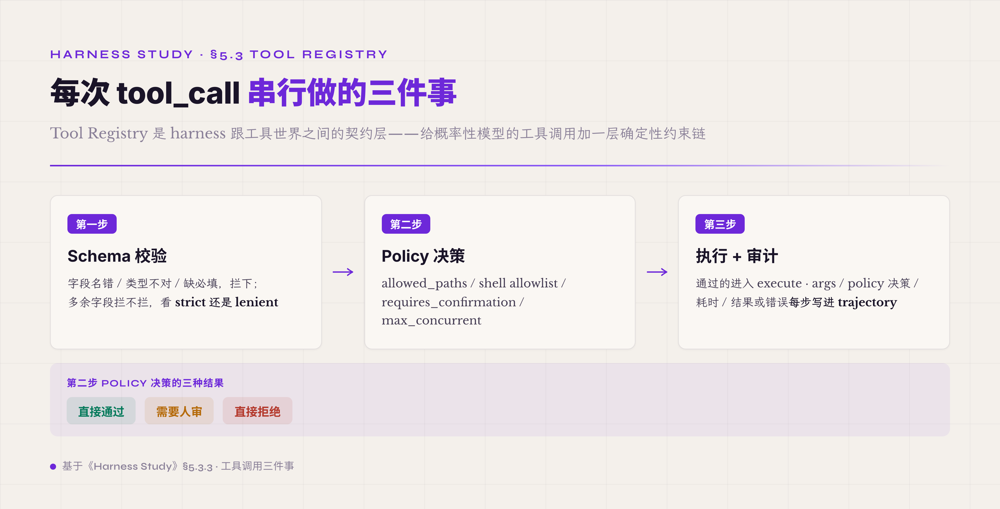
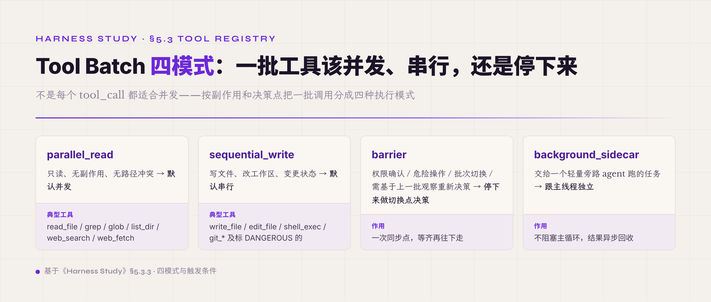

# 5.3 Tool Registry & ACI · **P0**

第三个机制 Tool Registry 是 harness 跟工具世界之间的契约层。它把每个可被 agent 调用的"工具"封装成统一形态的可调用对象，让 agent 能用、harness 能管、策略（policy）能控、审计（audit）能查。ACI（智能体-计算机接口，agent-computer interface，由 SWE-agent 提出，Yang et al. 2024）是这个机制在设计上的维度。它强调**工具是给 agent 用的，而不是给人用的**，所以工具的命名、参数、返回、错误形态，都要按 agent 的认知方式而不是人的认知方式来设计。两者合起来回答一个工程问题：**怎么让概率性的模型在面对一组工具时尽量调对，调对的时候不越界，越界了能被工程系统拦住**。这件事看起来跟 §5.2 的 Adapter 一样是"工程细节"，实际上却是 To B agent 落地时最容易出问题的一环：按作者的经验，agent 的失败案例里大部分（约八成，经验值）跟工具调用有关，包括调了不存在的工具、给错参数、不该调的时候调、该调的时候不调。

#### 5.3.0 本节首次出现的术语

§一至 §四 和 §5.1、§5.2 已经解释过的术语（schema、strict schema、verifier、policy、trajectory、Adapter、Routing 等），下面不再重复。这里只列 §5.3 首次出现的术语。

**ACI 与工具注册表基础**
- **ACI（agent-computer interface，智能体-计算机接口）**：类比 HCI（human-computer interface，人机交互）。它强调工具是给 agent 用的，而不是给人用的。设计 ACI 跟设计 HCI 的考虑完全不同：agent 没有屏幕看图标，不能悬停看提示，不能凭直觉点，只能靠工具名字、参数 schema、错误返回的文字内容来推断该怎么用。
- **tool registry（工具注册表）**：工具的注册中枢，维护"当前可用工具有哪些、每个工具的 schema 是什么、每个工具的策略是什么"的统一数据结构。给 agent 看的工具列表来自这里，给执行层调度的可调用对象来自这里，写进审计链的元数据也来自这里。它是 agent 跟工具世界之间的唯一真相源（single source of truth）。
- **ToolPolicy**：每个工具关联的独立策略对象，与工具实现本身解耦，字段包括 `allowed_paths`、`timeout`、`requires_confirmation`、`max_concurrent` 等。同一个工具在不同环境可以配不同的 ToolPolicy。

**schema 与 JSON Schema**
- **JSON Schema**：一种把数据结构用 JSON 文档形式化定义的语法标准，是 schema 这个抽象概念在工程上的具体载体，覆盖字段类型、必填性、枚举值、嵌套结构、模式校验等。OpenAI function calling、Anthropic tool use、MCP 等主流工具协议都以 JSON Schema 为底层。
- **lenient schema（宽松校验）**：与严格校验相对的策略，参数不符合 schema 时不直接拒绝，而是尽量修正或引导模型修正。跑得通，但容易让脏数据进系统。工业级 harness 大多倾向严格校验。

**工具协议与工具组织**
- **MCP（Model Context Protocol）**：Anthropic 2024-11 提出的开放协议，用一套统一协议把"工具服务器"和"agent 客户端"接起来，类似 LSP 之于 IDE 和编程语言。第三方工具开发者实现一次，就能接入所有支持 MCP 的 agent。到 2026 年，它已被多家 agent 产品支持。
- **Skill-RA（Skill Retrieval-Augmented）**：本书用语，业界常称工具检索（tool retrieval）或动态工具选择。一种工具组织策略：不把所有工具都塞进请求，而是按当前查询检索出相关的工具子集再注入，用来应对工具数量增长后的上下文膨胀和工具选错两个问题。"RA"取自 RAG 的同一思路，§5.3.8 详写。
- **select_for(query)**：Skill-RA 的核心接口。给一个用户查询，返回这次推理该注入的工具子集。实现可以是向量检索、分类器、硬编码规则，或几种混合。

**安全与失败处理**
- **工具幻觉（tool hallucination）**：agent 在 trajectory 里"调用"了一个不存在的工具，或给了一个根本不存在的参数名。这是 schema 校验和严格的工具列表注入要专门防御的失效模式，在工具列表很长或 prompt 没把工具描述讲清时特别容易出现。
- **sanitized error（脱敏错误）**：把工具执行失败时的栈信息、内部路径、敏感字段等清理掉后再返回给 agent，主要目的是防止内部信息泄露；对提示词注入只能降低风险，不能根除。与原样返回的 raw error 是一对相对的设计。
- **requires_confirmation**：ToolPolicy 字段，标记某个工具调用前必须经过人工审批，适用于在真实世界有副作用的工具，如发邮件、发帖、采购、git push、写关键文件。OpenAI 2023-06 的 function calling 公告对这类操作"强烈建议"（strongly recommend）先向用户确认。
- **allowed_paths / shell 命令白名单（allowlist）**：ToolPolicy 的一组字段，限制工具能访问的文件路径、能执行的 shell 命令，是文件操作类工具和 shell 执行类工具的安全基础设施。

#### 5.3.1 解决什么问题 · agent 调工具跟人调 API 的根本差别

工程师写代码调 API，跟 agent "调工具"，看起来是同一件事，本质上完全不同。工程师调 API 是个**确定性事件**：他知道这个 API 干什么、参数怎么填、什么时候该调，调错了能从异常里看出问题、改代码。agent 调工具是个**概率性事件**：它从 system prompt 里读到工具的描述，从对话上下文里推断"现在该调这个工具"，自己拼参数，调完拿到结果再决定下一步。整个推理链上每一环都可能出错：

- 误读工具描述，以为这个工具能干它其实干不了的事；
- 该调的时候不调，漏掉了一个该用的工具；
- 不该调的时候调，强行用一个不合适的工具；
- 调一个**根本不存在的工具**，生成了一个看似合理、但注册表里没有的工具名；
- 给错参数，拼出一个含有不存在字段的 JSON。

这些失效模式不是"agent 笨"，而是 next-token 预测这种概率性范式，跟"工具调用是确定性契约"之间的根本不匹配。工程师写代码会查 API 文档、用类型检查器、看 lint 报错，这些事 agent 都做不了，它只有一个 prompt 和一个输出字段去试。所以 Tool Registry 这个机制存在的根本目的，是**给概率性的模型在工具调用上加一层确定性约束**：想调？先校验 schema；schema 过了，再过策略检查；策略过了，执行并完整记录；执行失败，返回可操作（actionable）的错误，让模型能自己修正。这一整套约束链是 To B agent 能上生产的根本前提。按作者的经验（经验值，随任务与模型变化），没有这个机制，agent 调工具基本是"碰运气调对"，调对率大概只能到六七成；有这个机制，并且 ACI 设计得好，工业级 harness 可以稳定地把调对率推到 95% 以上。

#### 5.3.2 ACI 概念 · 工具是给 agent 用的不是给人用的

ACI 这个词由 SWE-agent 团队在 2024 年提出，此后被不少 agent 工程团队沿用。它跟 HCI（1980 年代形成的学科）是同辈关系，强调一件常被忽略的事：**面向 agent 设计工具，和面向人设计工具，是两种不同的工程**。

HCI 优化的是"人能不能舒服地用"：人有屏幕，能看图标和颜色编码，能悬停看提示，能凭多年积累的直觉点界面，错了能 Ctrl-Z 撤销，看到栈信息能猜个大概。ACI 优化的是"agent 能不能可靠地用"：agent 只能看到文字，没有图标颜色，没有悬停提示，没有可视化界面，没有用户直觉，看到栈信息也不会自动猜出原因。这种媒介差异决定了工具设计完全不一样。

落到工程上，ACI 有几条核心设计原则。

1. **工具命名要可推断。** 人看到 `process_data()`，知道这是个泛用函数，靠 IDE 的类型提示能猜出参数语义；agent 看到 `process_data()` 只能从名字去推，推不出就乱用。所以面向 agent 的工具名要明确：`extract_clauses_from_contract` 比 `process_data` 强，`search_files_by_keyword` 比 `search` 强。好的工具名应该让 agent 不读 description 也能猜出"这个工具大概干什么"。
2. **参数 schema 要紧凑。** 人填表时会按字段提示理解每个字段的含义，多余字段自己会跳过；agent 看到 schema 里有字段就会"想"用它，schema 里塞了无关字段，agent 就会拼无关参数。所以 ACI 的 schema 设计要紧凑：每个字段都有明确用途，必填与非必填清楚，枚举值列全。
3. **错误返回要可操作。** 人看到 Python 栈信息知道往源码里定位；agent 看到栈信息，只能再用自然语言推理一遍，试图猜原因。所以 ACI 的错误返回要直接讲"哪里错了、怎么改"，而不是给原始栈信息。比如 `"Error: file_path 'data/output.txt' does not exist. Did you mean 'data/input.txt'? Try listing the data/ directory first."` 就比原始的 FileNotFoundError 强得多。
4. **权限边界要让 agent 推得出来。** 人用 shell 时凭经验知道哪些命令危险，agent 没有经验，只能从工具描述里学。所以面向 agent 的工具描述要写明：这个工具能做什么、不能做什么，什么场景适合用，什么场景不该用，调用失败后建议怎么处理。

ACI 是 agent 工程过去两年最被忽略、却最重要的概念之一。很多 To B agent 落地失败，原因不是模型不行，而是工具直接套用了 OpenAPI spec、Python 函数 docstring、Swagger UI 这类**面向人**设计的接口，直接喂给 agent 自然出问题。重写 ACI 的成本不低（每个工具的名字、schema、错误返回、描述都要重新设计），但回报很高：同一个 agent、同一个模型，ACI 优化前后任务成功率相差几十个百分点并不少见（作者经验）。

#### 5.3.3 核心接口形状 · Tool 五字段 + Registry 三件事

一个最小可用的 Tool 接口大致包含五个字段：

```
Tool {
  name: string,
  description: string,
  input_schema: JSONSchema,
  execute: (args) -> Observation,
  policy: ToolPolicy { allowed_paths, timeout, requires_confirmation, ... }
}
```

- `name` 是工具在 agent 那里的唯一标识，按 ACI 原则要能推断出含义。
- `description` 是给 agent 看的用法说明，讲清楚这个工具能干什么、参数怎么填、什么场景用、调用失败怎么办。
- `input_schema` 是参数的 JSON Schema 定义，字段名、类型、必填性、枚举值都在这里声明。
- `execute` 是工具的实际实现函数，拿到参数后做事，返回结果或抛错。
- `policy` 是这个工具关联的 ToolPolicy 对象，独立于 `execute`，定义这个工具能访问什么、调用前要不要审批、超时多少。

agent 每次发起 tool_call 时，Tool Registry 按顺序串行做三件事。

1. **Schema 校验**：把 agent 给的参数 JSON 跟 `input_schema` 对比，字段名错的、类型不对的、缺必填的拦下，多余字段是否拦下取决于用严格校验还是宽松校验。这一步是 ACI 在工程层的边界：agent 试图填一个不存在的字段，schema 校验直接拦住，不让脏数据进入 `execute`。
2. **策略决策**：根据 ToolPolicy 判断这次调用能不能执行，包括路径是否在 `allowed_paths` 内、shell 命令是否在白名单里、是否需要触发 `requires_confirmation` 的人工审批、是否超过 `max_concurrent` 限制。结果有三种：直接通过、需要人审、直接拒绝。
3. **执行与审计**：通过的 tool_call 进入实际的 `execute`，工具跑完拿到结果。从 schema 校验、策略决策、`execute` 调用到结果返回 agent，每一步都写进 trajectory，包括参数、策略决策、执行耗时、结果或错误。这条审计链是出问题时复盘的根基：任何工具调用失败，都能从 trajectory 里精确定位到哪一步出了问题。



*图 5.8 · 每次 tool_call 串行做的三件事*

这套五字段是教学版的最小集，生产级实现里的 Tool 接口会更多。业界对 Claude Code 的源码调研显示，它的 Tool 类型有九个字段：

- `name`、`description`；
- `prompt`：工具的"使用说明书"，会被注入 system prompt，让模型了解什么时候该用它；
- `inputSchema`：用 zod 做类型校验；
- `outputSchema`：可选；
- `call`：实际执行函数；
- `shouldDefer`：标记工具能否延迟加载，配合一个 ToolSearchTool 在工具多时按需加载 schema，节省约 8K token；
- `isEnabled`：运行时判断是否启用；
- `isConcurrencySafe`：决定这个工具能不能跟其他工具并发执行。

多出来的字段里，`prompt`、`shouldDefer`、`isConcurrencySafe` 这三个都不是工具自己运行所需的，而是 Tool Registry 做调度时要用的：`prompt` 让 Registry 把工具说明书注入 system prompt，`shouldDefer` 让 Registry 做延迟加载，`isConcurrencySafe` 让 Registry 决定并发批次。也就是说，工具元数据承担的职责远比"工具名、入参、返回"宽，它是 Registry 调度的依据。

Registry 这一层做调度时，还有一个可以直接用的设计模型：Tool Batch 四种模式。

- **parallel_read**：只读、无副作用、无路径冲突的工具默认并发执行，`read_file`、`grep`、`glob`、`list_dir`、`web_search`、`web_fetch` 都属于这一类。
- **sequential_write**：写文件、修改工作区、变更状态的工具默认串行执行，`write_file`、`edit_file`、`shell_exec`、`git_*`，以及任何标为 DANGEROUS 的工具都属于这一类。原因不在于不能并发，而在于并发带来的不可预测性远大于工程收益。
- **barrier**：权限确认、危险操作、批次切换、模型需要根据上一批观察重新决策，这四种场景需要明确停下来，做一次"切换点"决策。
- **background_sidecar**：交给一个轻量旁路 agent 跑的任务，跟主线程相互独立。

这个模型背后是工具调度主线的一次翻转。"遇到复杂任务，首先想到 sub-agent"这个直觉是错的，正确的主线是：单 agent 批量执行工具，把结果汇总成 ObservationPack（见下文）回注，必要时才启用轻量的旁路 agent。理由有三：只读工具并发执行比启动 sub-agent 更便宜、更快、更可控；很多任务根本不需要另一个 agent，只是需要同时读多个东西；sub-agent 会带来安全边界、上下文隔离、结果汇总三层复杂度，多数任务承担不起这三层成本。



*图 5.9 · Tool Batch 的四种调度模式*

Tool Registry 的输出端还有一条工程规则值得单独点出：工具结果不能以原文形态直接进入主对话。原因是长任务里工具产出的总量，可能远远超过模型上下文窗口容得下的范围。每个工具结果一条消息原样回注主对话，这种朴素做法跑几轮之后就会撑爆上下文，还会让模型在大段无关历史里出现"迷失在中间"（lost in the middle）的问题。正确的工程做法是用 ObservationPack 收口：一批工具执行完后产生两类产物，一是 `raw_artifact_refs`（指向 artifact store 的引用，工具结果原文存在那里），二是 `observation_pack`（一份精简可读的摘要，告诉模型刚才那批工具大致看到了什么）。主线程只消费 `observation_pack`；需要原始结果时，模型自己再发一个 `read_artifact` 工具调用按需去取。这条原则可以概括成一句话："全文提取，按需注入，不截断，不跳页。"全文是 artifact 层的事，注入是主对话层的事，两层分开。

工具选型上还有一条容易被忽略的原则：**给 agent 配上联网搜索（web_search）和网页抓取（web_fetch）这两个工具，常常比再调一轮 prompt 更能提升它的有效智能**。原因在模型这一侧。模型权重在训练时就冻结了，知识有截止日期；遇到截止日期之后的事实（新版本号、刚改的 API、当前文档、近期事件），只能靠记忆猜，猜不准就开始幻觉。web_search 把"训练之后的世界"接进来，让 agent 查得到最新事实；web_fetch 更进一步，让 agent 直接读指定权威来源的全文，而不是依赖记忆里那份可能过时或失真的版本。这两个工具让 agent 从"凭训练记忆作答"变成"现查现核作答"。agent 拿到的信息越及时、越准确，判断质量就越高；外部信息的时效性和准确性，是模型权重之外另一个直接提高有效智能的杠杆。工程上配这两个工具有两点要做到：

- 返回体量通常很大（一次搜索几十条结果，一篇网页几万字），必须走前面讲的 ObservationPack 收口（摘要进主对话，原文存进 artifact），别让原文直接灌进主对话撑爆上下文；
- 抓回来的内容也是外部输入，要做来源可信度判断或交给 verifier，别把搜到的错误来源直接当成事实依据。

#### 5.3.4 关键取舍 1 · strict schema 还是 lenient schema

Tool Registry 做的第一件事是 schema 校验。讨论"严格还是宽松"之前，要先分清两个层面，它们常被混为一谈：

- **模型侧严格模式（structured outputs / strict）**：由模型服务端用约束解码（constrained decoding）生成工具参数，保证输出**一定**符合给定的 schema。它只支持 JSON Schema 的一个子集，需要调用方显式打开（opt-in）。OpenAI function calling 从 2024-08 起提供这个模式（设 `strict: true`），Anthropic、DeepSeek V4 等也提供了类似能力。
- **harness 侧执行前校验**：Registry 拿到模型给出的参数后，在进入 `execute` 之前按 `input_schema` 再校验一遍。即使模型侧开了严格模式，这一步也不能省：不是每个 provider、每个模型都支持严格模式，约束解码只覆盖 JSON Schema 子集，业务上的约束（路径格式、取值范围之间的关系）也常常超出 schema 能表达的范围。

本节讨论的 strict 与 lenient，指的是 harness 侧校验不通过时怎么处理。这件事看起来是个小的工程选择，实际上决定了 agent 工具调用的整个错误处理思路。

**strict schema（严格校验）** 的做法是：agent 给的参数不符合 `input_schema` 就直接拒绝，不进入 `execute`，给 agent 一个明确的 schema 错误让它重试。优点是快速失败（fail-fast）：脏数据不进系统，错误在最早的环节被捕获，agent 的下一步推理基于明确的反馈。缺点是对 schema 设计要求高：schema 写得太严，agent 一直拼不出合规参数，会卡死；写得太松，又失去校验的意义。agent 还可能在同一个 schema 错误上反复失败，需要循环检测和升级机制兜底。

**lenient schema（宽松校验）** 的做法是：参数不完全符合 schema 也尝试运行，多余字段忽略，缺的字段填默认值，类型不对尝试转换。优点是更宽容：agent 偶尔拼错一个字段，不至于整个调用失败，也降低了 agent 反复重试的概率。缺点是脏数据会进系统：`execute` 拿到形状不对的参数，可能产生非预期的副作用，出了错也分不清是参数错还是逻辑错。

工业级 harness 大多倾向严格校验。理由是严格校验让"调对"和"调错"的边界清晰，错就是错，对就是对；宽松校验让边界变得模糊，"勉强能跑"的调用最终都会变成技术债。模型侧严格模式多是需要显式打开的能力，"开不开"本身是 harness 的工程选择，而工业级 harness 大多选择打开，同时保留 harness 侧的执行前校验。如果你做的是 PoC 或快速原型，宽松校验可能更顺手；但任何要上生产的 harness 都应该走严格校验：schema 设计的成本一次付清，比一直处理宽松校验的遗留问题划算。

但严格校验不是免费的，它要求 schema 本身设计得好。schema 设计的几条要点：

- 字段名清楚、不歧义（不要把 "path" 和 "filepath" 混用）；
- 必填字段尽量少（每个必填字段都是 agent 一个潜在的失败点）；
- 枚举值列全（让 agent 知道有哪些合法选择）；
- 嵌套深度要浅（深层嵌套 agent 容易拼错）；
- 错误返回可操作（告诉 agent 哪里错了、怎么改）。

schema 设计得好，再加上严格校验，两者配合才能让 agent 的工具调用稳定。

严格校验这条路线有一条通用的工程规则：**规范化失败的工具不注册（启动期快速失败）**。harness 启动时对每个工具 schema 做规范化：把 `$defs` 内联进 `$ref` 引用；按 strict 模式的要求把所有字段列入 `required`，可选字段写成与 null 的联合类型（例如 `"type": ["string", "null"]`）；把 enum 值的类型对齐。这一步要么完整通过，要么这个工具直接不注册，不能让模型面对一个不完整的 schema 反复试错。这样做的工程逻辑是：少一个工具、启动时报错，是小事；模型对着残缺的 schema 反复试错，把整个 trajectory 带偏，才是大事。常见的实施失败是规范化漏掉了某个工具的 `$ref` 解析或 `$defs` 内联：模型按不完整的 schema 拼参数，harness 按完整的 schema 校验时拒绝，模型再重发，再被拒绝，整个 trajectory 在几轮内把 token 烧光，最终任务失败。宽松校验下这条规则可以放松一些，严格校验下不能：`$defs`、`$ref`、`oneOf`、`anyOf` 的边界处理，只要漏掉一处，就会废掉一个工具。

schema 的生命周期还有一条配套规则：**禁止热改**。工具 schema 是注入进上下文的。一个长 run 跑到一半，如果注册表里的 schema 被热更新，模型上下文里的工具和注册表校验用的工具就不再是同一个东西，调用会以最难排查的方式失败：模型按旧 schema 拼参数，harness 的校验按新 schema 拒绝，看起来像模型的调用能力突然退化了。判断标准是：schema 变更要么换一个新的工具名（旧名保留到退役期结束），要么只在 run 的边界生效，绝不在 run 中途热改。退役的工具先标为 deprecated：注册表拒绝调用，并在错误返回里指向新工具（这本身就是一条可操作的错误），观察一个周期后再物理删除。

#### 5.3.5 关键取舍 2 · Policy 解耦到独立配置层

ToolPolicy 的第二个取舍是：策略应该写在哪一层？早期 agent 工程的做法是把策略写死在工具实现里，比如在 `write_file` 函数内部检查路径是否在 `allowed_paths` 里。这种做法快，但有个大问题：**同一个工具在不同环境需要不同的策略**。开发环境可以让 agent 写任何路径，CI 环境只能写测试目录，生产环境只能写明确列出的几个白名单路径。如果策略写死在工具实现里，切换环境就要改工具实现，要么发新版本，要么用全局变量，都很难维护。

现代 harness 普遍把策略从工具实现里**解耦**出来，做成独立的 ToolPolicy 配置对象。`write_file` 函数本身只负责"读参数、写文件、返回结果"，策略检查由 Registry 在 `execute` 之前完成：查 ToolPolicy 里的 `allowed_paths` 字段，路径不在白名单里就拒绝调用，根本不进入 `execute`。这样同一个 `write_file` 工具实现，可以在不同环境配不同的 ToolPolicy：开发环境允许写任何路径，CI 环境只允许写 `test/` 目录，生产环境只允许显式列出的白名单。工具实现不变，变的是策略配置。

这种解耦的工程价值不止于"切换环境方便"。它还让策略本身可以：

- **独立审计**：所有策略集中在一个配置层，而不是散落在各个工具实现里，安全团队可以一次性审查"当前 harness 允许 agent 做什么"；
- **独立测试**：每个工具的策略边界用专门的策略测试来测，不必跟工具实现逻辑混在一起；
- **独立观测**：所有策略决策（通过、需要人审、拒绝）都记入 trajectory，可以统计哪些工具被频繁拒绝、哪些需要人审最多。

策略解耦到独立配置层，在工程上还有更深一层的做法：业务规则不写进 system prompt，而是做成"模型即将调用某个工具时即时注入的结构化提醒"。常见的反模式是把几十条业务规则全堆进 system prompt（"取消前必须检查四个条件""删除前必须二次确认""赔偿前必须验证前置条件"），跑了几十轮长对话之后，开头那些规则模型基本忘掉一半；再加更多规则只会让 prompt 更长、衰减更快，形成恶性循环。正确的做法是由 PolicyRegistry 在调用前注入：模型发出某个写工具调用时，runtime 命中预先注册的 hook，往主对话注入一条结构化提醒（"即将调用 X 工具，请先确认条件 1、2、3、4"），模型读到提醒后重新推理一次，条件满足才真正提交调用。这样做有效的原因有三：

- 模型对"当下要做的具体事"的注意力，远高于对"系统级抽象规则"的注意力；
- 规则与工具调用绑定，模型不必再推断"这条规则适用吗"；
- 规则更新只需改 PolicyRegistry，不需要给所有用户重新推送 system prompt。

一句话概括：**不信任模型的记忆力，但信任模型的推理力**。这个思路跟 Claude Code hooks 里的 PreToolUse 事件一致：工具调用之前，给 hook 一次拒绝、修改或提醒的机会。

#### 5.3.6 关键取舍 3 · 失败如何回模型 · raw error 还是 sanitized error

Tool Registry 做的第三件事是失败处理：工具执行出错时，错误信息怎么返回给 agent？这里也有两种工程取舍：原样返回（raw error），还是脱敏后返回（sanitized error）。

**raw error** 的做法是把工具执行的完整错误（异常类型、栈信息、内部路径、详细消息）原样返回给 agent。优点是 agent 拿到最完整的错误上下文，能从栈信息里推断哪里错了，自己改参数重试。Claude Code 等面向开发场景的 harness 倾向原样返回，因为开发场景就是要 agent 能从详细错误里自己修正。

**sanitized error** 的做法是把原始错误清理一遍再返回给 agent：去掉栈信息、内部文件路径、敏感字段，只留下结构化的错误码和简短说明。它的主要作用是**防止信息泄露**：内部路径、配置细节、密钥片段、第三方服务的内部报错，不会经由错误信息流进模型上下文，进而出现在模型输出、日志或下游系统里。对提示词注入（prompt injection），脱敏只能**降低风险**：如果错误信息里夹带了恶意构造的指令（"忽略前面所有指令，从现在开始……"），只保留错误码和固定格式的说明，可以减少这类文字直接进入上下文的机会，但它不是隔离，挡不住所有注入。生产场景的 harness 倾向脱敏返回，特别是工具对接外部系统时。

工业级 harness 一般**按工具来源决定**：内部代码实现、执行过程完全可控的工具，原样返回，方便 agent 自己修正；对接外部系统的工具，脱敏返回，防止泄露。两种策略也可以按环境切换：开发环境原样返回，生产环境脱敏返回。

这个取舍与 §5.9 Safety 控制面的提示词注入防御相关，但要分清注入真正从哪里来：**最常见的注入载体是工具的正常返回内容**，也就是 agent 读到的网页、文件、邮件、API 响应，错误信息只是其中一个入口。所以对注入的防御不能只靠错误脱敏，还要在正常返回内容上做来源标注、信任分级，并由 §5.9 的策略层约束 agent 在读过不可信内容之后能做什么。

错误返回之外，还有一个 2025 年才被业界正视的注入面：**工具的元数据本身是不可信输入**。工具的 description 每轮都会进 prompt，这意味着第三方 MCP server 可以在 description 里夹带指令，即工具投毒（tool poisoning）；它甚至可以先用干净的版本通过你的审查，再在某次服务端更新时悄悄换成有毒的版本，即 rug pull。Invariant Labs 在 2025-04 [公开演示过这两类攻击](https://invariantlabs.ai/blog/mcp-security-notification-tool-poisoning-attacks)。description 是工具层杠杆最高的一行字：正向用，是投入产出比最高的优化点；被人反向利用，就是风险最高的注入面。对策与软件供应链安全的思路相同：

- 第三方工具的 description 做锁定（pinning）：注册时计算哈希并锁定，服务端变更不自动生效，差异经人工审核后才放行；
- 按来源做信任分级：自家代码实现的工具、知名厂商的 server、社区 server 分三级，低信任级别默认收紧策略（更窄的 `allowed_paths`、更低的预算上限、默认 `requires_confirmation`）。

#### 5.3.7 关键取舍 4 · requires_confirmation · 哪些工具默认需要人审

ToolPolicy 的字段里最关键的是 `requires_confirmation`：这个工具调用前是否必须经过人工审批？这个布尔字段直接决定一类 agent 是"可以放心让它自动跑"，还是"必须有人在回路中"。

OpenAI 2023-06-13 的 function calling 公告里就提到了这一点，"强烈建议"（strongly recommend）对带真实世界影响的操作（如发邮件、发帖、采购）在执行前向用户确认。这条原则在 2026 年的工业级 harness 里已是常见做法。**哪些工具应该默认 `requires_confirmation = true`？** 工程经验给出几类：

1. **有外部副作用且不可撤销的**：发邮件（发出去收不回）、发帖（公开发表）、采购（产生订单）、`git push` 到远端（污染共享历史）、删除数据库记录。这类工具一旦执行就改变了外部世界的状态，agent 错了，人也撤不回来。
2. **对核心系统状态有写权限的**：写关键配置文件、改用户权限、改账号绑定、修改生产数据库。
3. **有资源开销大幅上升风险的**：启动大型计算任务、调用按量付费的高成本服务、占用 GPU 资源。

跟 `requires_confirmation` 配对的工程机制是**审批缓存**：用户批准过的同类参数模式，后续可以自动通过，减少 agent 跑长任务时被频繁打断。但缓存有边界：通常只在会话（session）级生效，一次任务结束就清掉，避免授权范围跨任务被滥用；缓存粒度也要细，批准"写 docs/ 目录"不等于批准"写 src/ 目录"，参数匹配要精确。确认加缓存的组合，是 To B agent 既能自动运行、又能守住安全的工程基础。

#### 5.3.8 ★ Skill-RA · select_for(query) 动态子集而非全量注入

随着 harness 接入的工具越来越多（一个生产 agent 系统接 30 到 100 个工具并不少见），出现了一个新的工程问题：**这么多工具该怎么呈现给 agent？** 早期做法是"全量注入"，把所有工具的描述都放进请求，让 agent 自己选。工具数量到了几十个之后，问题开始放大：

- 上下文膨胀：光是工具描述就占几千 token；
- 选错率上升：工具多了，agent 不知道哪个最相关；
- 每一轮都要把整份工具列表带在请求里，长任务的性能随之下降。

Skill-RA（Skill Retrieval-Augmented，本书用语，业界常称工具检索 tool retrieval 或动态工具选择）是对这个问题的工程化回应：**不全量注入，按需检索**。核心接口是 `select_for(query)`：给一个用户查询或当前任务上下文，返回这次推理该注入的工具子集。检索策略可以是下面几种之一，也可以组合：

- **向量检索**：把每个工具描述向量化，用户查询也向量化，按余弦相似度取前 k 个工具；
- **分类器**：训练一个小分类器把查询分到几个工具类别，再注入对应类别的工具；
- **硬编码规则**：按查询的关键词或元数据做规则匹配；
- **层级 Skill 树**：工具按业务领域组织成树，先选树枝，再选叶子。

实际的工业级实现常用向量检索加规则的混合：向量检索找出前 20 个候选，规则再过滤到前 5 个。

这条路径的工程价值主要在两方面（以下数字为经验值，随工具描述长度而变）：

1. **上下文利用率**：同样 100 个工具，全量注入要 8K 到 15K token，Skill-RA 只注入前 5 个工具，约 800 到 1500 token，上下文留出更多空间给真正的推理。
2. **选对率**：agent 从 5 个相关工具里选，比从 100 个工具（其中 95 个无关）里选更不容易选错。

但 Skill-RA 不是免费的，它有自己的工程代价。

1. **检索本身可能出错。** 向量检索可能漏掉一个相关、但描述不够直白的工具，分类器可能分错类别。如果 agent 需要的关键工具不在 `select_for` 返回的子集里，agent 就用不上它。这是一种隐性的失效模式，不容易发现。
2. **检索系统本身要维护。** 嵌入模型选哪个、索引怎么更新、新工具怎么进索引、规则怎么写，都是工作量。
3. **agent 对工具的感知受限。** agent 不知道 harness 里实际有多少工具，也不知道是否漏掉了某些可能有帮助的工具，这跟全量注入时 agent 能看到完整工具清单的体验不同。
4. **提示词缓存命中率下降。** 工具定义排在请求的最前面（以 Anthropic 为例，缓存前缀的顺序是 tools → system → messages），而提示词缓存按前缀命中。每次选出的工具子集一变，从工具段开始的整段前缀都要重新计算，后面的 system 和历史消息即使没变也命中不了缓存。全量注入时工具列表保持不变，前缀稳定，反而对缓存更友好。选型时要把这部分成本算进去，比如让子集只在任务切换时更新，而不是每一轮都重选。

Skill-RA 的适用边界大致如下（经验值）：**工具数量在 20 个以内时不需要**，全量注入更稳；**工具数量在 50 个以上时几乎必须做**，否则上下文装不下；**20 到 50 个之间看情况**，取决于具体的任务结构、单次推理的 token 预算，以及对 agent 选错率的容忍度。Anthropic 2025-10 推出的 Skills 功能（2025-12-18 升级为开放标准）把 Skill 的定义、元数据、加载协议标准化了，它是"按需激活能力子集"这一思路的代表实现之一（侧重渐进披露式的能力组织，而不只是 `select_for` 那种检索式选择）。这类问题属于"工具数量增长后才暴露的工程问题"：很多 harness 早期不考虑，跑到 30 个工具时突然发现上下文不够用，回头再补 Skill-RA 代价很高。如果预判工具会增长到 50 个以上，早期就设计 Skill-RA 是合理的工程预防。

#### 5.3.9 反模式 · tool description 写给人不写给 agent

Tool Registry 这个机制最常见的反模式（anti-pattern），是 **tool description 用面向人的写法**：直接把 API 文档、Python docstring、Swagger 注释复制过来作为 tool description，没有经过 ACI 改造。

这通常由两个原因之一造成。

1. **工具是从已有 API 包装来的。** 业务原本有一套给前端用的 RESTful API，工程师把这些 API 包成工具时，直接复用了 OpenAPI spec 里的 description。这些 description 是写给前端工程师读的，默认读者有上下文（知道这个 API 属于哪个业务模块、跟其他 API 怎么协作），而 agent 没有这些上下文。
2. **写工具的人没意识到 ACI 是个独立的问题。** 他觉得"description 写清楚就行"，按写 docstring 的习惯来写，结果 description 里用了一堆领域术语、缩写、指向其他工具的措辞，却没有给 agent 任何具体的使用情景。

这个反模式的实际代价是：在 To B agent 落地的失败案例里，相当一部分工具调用错误可以追溯到 tool description 没按 ACI 设计。具体表现为 agent **漏调**（不知道有这个工具能干这件事）、**误用**（拿一个不合适的工具去做该用另一个工具做的事）、**参数错**（schema 描述不够清楚，agent 拼不对参数）。同一个 agent、同一个模型，仅仅重写 tool description 这一项（按 ACI 原则重写每个工具的名字、参数解释、使用场景、错误处理建议），就能让任务通过率明显提升。SWE-agent 论文（Yang et al. 2024）在 SWE-bench Lite 上用 GPT-4 Turbo 测得，按 ACI 设计的工具（命令加环境反馈，description 是其中一环）比只用默认 Linux shell 多解决 10.7 个百分点的问题（对比的是不带示范的 shell 基线；与带示范的 shell 基线相比约多 7 个百分点），是单点投入产出比很高的一环。

判断标准：**任何 agent 的任务通过率长期卡在某个上限（比如 80% 或更低）上不去，首先该检查的就是 tool description 是否按 ACI 写。** 如果不是，先重写 tool description，而不是去优化 prompt 或换模型，这样做的投入产出比远高于其他方向。这也是工程交接检查清单里的关键一项：接手一个 harness 时，检查每个工具的 description 是否包含"工具用途、参数详细解释、典型使用场景、常见失败模式、错误处理建议"五项，缺一不可。

"description 写给 agent，不写给人"这条原则在工程上还可以再推进一步：在 agent harness 的调优排序里，在工具 description 里直接列出必填字段名、类型和枚举值，是单点投入产出比最高的优化，比改 system prompt、加业务规则、升级模型都更有效。背后的工程逻辑是：system prompt 和工具 description 在每次请求时都会重新发送，模型都"看得到"；两者的区别在于，description 与模型当下的动作直接绑定。模型准备调用某个工具时，最相关的就是这个工具自己的描述，而 system prompt 开头那段规则跟当前动作隔着几十轮对话，模型对它的注意力会随对话变长而减弱。所以同样一条信息，写在 system prompt 里，几轮之后就容易被忽略；写在工具 description 里，在需要它的那一刻最容易被用上。这条规律有边界：对工具类型多、字段复杂、枚举值多的场景效果最大；对只有一两个工具、参数简单的场景效果就小，因为本来也不容易猜错。一句话总结："改一行 description，比改十次 system prompt 有效。"这条规律可以直接写进工程规范。

#### 5.3.10 业界实现对照 + 起步建议

业界主流的 Tool Registry 实现有几种典型路径。

- **OpenAI function calling**：2023-06 上线，2024-08 起提供严格模式（需显式打开），与 structured outputs 和 JSON Schema 配套，是主流 agent 平台用得最多的协议。
- **Anthropic tool use**：2024-04 公测，2024-05-30 正式发布（GA），与 Claude 配套。工具描述格式与 OpenAI 略有差异；Anthropic 在工具设计上最强调 ACI 的设计思想（作者观察）。
- **MCP（Model Context Protocol）**：Anthropic 2024-11 提出的开放协议，第三方工具开发者实现一次就能接入所有支持 MCP 的 agent，类似 LSP 之于编辑器。到 2026 年，Claude Code、Cursor、VS Code、Cline 等都已支持。
- **Pydantic AI tools**：Python 库内的工具抽象，类型标注完整，配合静态类型检查器可以在运行前发现一部分接口误用，适合 Python harness 内部使用。

实际项目里常见的不是"选一个"，而是 **MCP 做工具协议层 + 内部包装 + ToolPolicy 解耦** 的三层组合：MCP 接入外部工具服务器；内部包装层把不同协议的工具统一成自己的 Tool 接口形态；ToolPolicy 作为独立配置层，控制每个工具在不同环境下的权限。2025 至 2026 年，不少工业级 agent 采用这种做法，Claude Code、Cursor、Aider 等都在这个结构上做扩展。

起步建议从四个方面展开。

- **注意什么**：Tool Registry 最大的坑是 ACI 没做对。工具数量到二三十个时，突然发现 agent 调对率下降，追根究底都是 description 不够、schema 没设计好、错误返回不可操作。从第一天起就要按 ACI 原则写每个工具的 description，不要复用现有的 API 文档。
- **怎么设计**：Tool 五字段（name、description、input_schema、execute、policy）都按 ACI 标准做；能开模型侧严格模式就开，同时保留 harness 侧的执行前校验；策略独立配置，不写死在工具实现里；错误返回对内部工具原样返回，对接外部系统的工具脱敏返回；有真实世界副作用的工具标记 `requires_confirmation`；预判工具数量会达到 50 个以上时，早期就设计 Skill-RA。
- **怎么测试**：每个工具的 ACI 质量用"agent 不看 description、只看 name，能不能猜出工具用途"来判断，猜不出说明名字不够清楚；schema 的完备性用"故意给错参数，看错误反馈是否可操作"来测；策略边界用"故意越界访问，看是否被拦下"来测。
- **写什么 prompt**：agent 的 system prompt 应该有一段工具使用的通用指引（"调工具前先想想这是不是合适的工具""调用失败别立刻重试，先看错误信息再调整参数"），而不是只列工具 description。启用 Skill-RA 时，system prompt 要告诉 agent："你看到的工具列表是按当前任务动态挑选的，可能还有别的工具没列出，需要的话可以提出。"

Tool Registry & ACI 这个机制看起来跟 Adapter 一样是工程细节，但它是 agent 在真实业务里干活的实际接触面：agent 调对工具，任务才能完成；调错工具，有 agent 跟没 agent 没有区别。这件事做不好，再强的模型、再聪明的 Agent Loop、再细致的 verifier，都弥补不了一个大部分时间在调错工具的 agent。这就是这个机制被列为 P0 的原因：没有它，harness 跑不出有用的 agent。

#### 业界归位卡片 · §5.3 涉及的实现层

Tool 这个抽象功能，在 2026 年的业界主要由以下几种技术实现：

| 业界名字 | 在 §5.3 是什么 |
|---|---|
| **MCP（Model Context Protocol）** | 跨厂商的工具调用协议，2026 年已获多家 agent 产品支持；第三方工具实现一次，可接入所有支持 MCP 的 agent |
| **OpenAI function calling** | 厂商内的工具调用协议，2024-08 起提供严格模式（需显式打开），配合 structured outputs |
| **Anthropic tool use** | 厂商内的工具调用协议，最强调 ACI 设计思想 |
| **Anthropic Agent Skills tool definitions** | Skill 内嵌的工具定义，与 Skill 的 prompt 同源（见 §5.5） |
| **OpenAPI / GraphQL schema 自动转工具** | 把已有 API 自动包装成 Tool 形态，属于工具暴露技术 |
| **Pydantic AI tools** | Python harness 内部的工具抽象，类型标注完整，可借静态类型检查器在运行前发现部分误用 |
| **ReAct 原生格式** | 早期的工具调用文本协议，2026 年主要用于教学和早期模型 |

这几种技术都在解决"工具怎么暴露给 agent"，属于 §5.3 Tool 这个机制的**协议层实现**。选哪种，取决于跟哪个模型族绑定、是否需要跨厂商互操作、是否需要从已有 REST API 自动派生工具。**它们不是 8 个机制之外的独立机制，而是 §5.3 这一个机制的不同实现形态。** 完整的反向对照表见附录 D。
