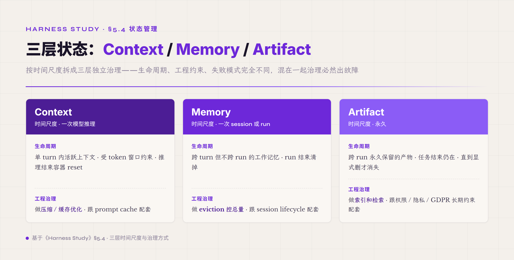
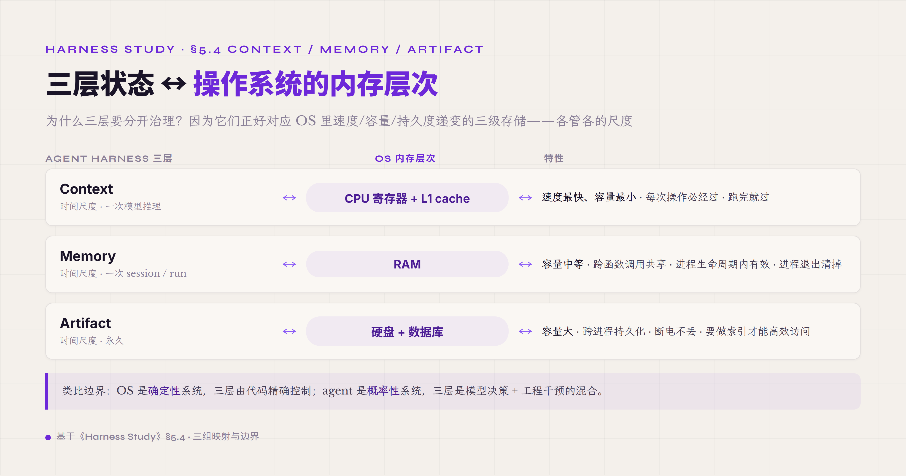
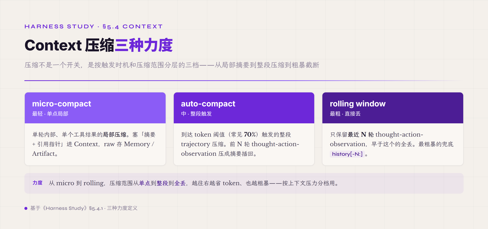
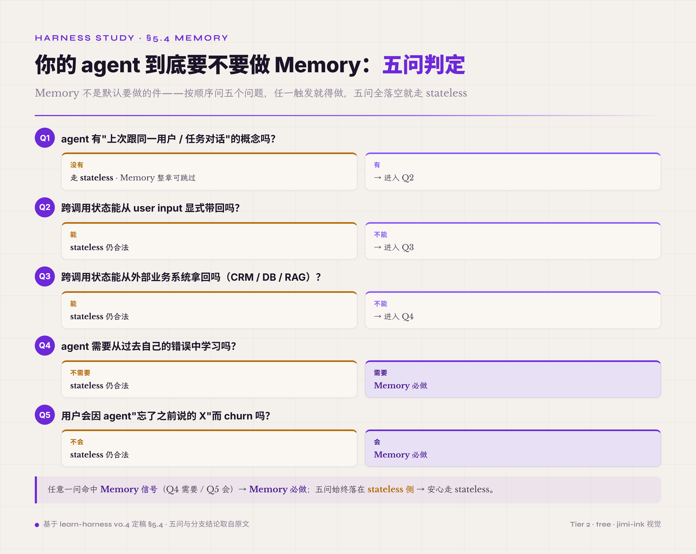

# 5.4 Context / Memory / Artifact · **P0 (Context) / P1 (Memory) / P2 (Artifact)**

第四件机制是 agent 的"状态管理"。但跟传统软件不一样，agent 的状态不能塞在一个袋子里管——必须按**时间尺度**拆成三块独立维护：**Context** 是当前 turn 内活跃的上下文（一次推理用完就过 · 受 token 窗口约束）、**Memory** 是跨 turn 但不跨 run 的工作记忆（session 内持久 · run 结束清掉）、**Artifact** 是跨 run 永久保留的产物（任务结束后仍在 · 直到显式删才消失）。这三块容易被混在"context 管理"一个袋子里讲，本卷显式拆开是因为业界踩过的坑很清楚——三种状态混在一起治理，最后同时出现"该清的没清 / 该留的留不下 / 三层互相污染"三种故障。**这一节是设计 harness 时容错率最低的一件**——状态机制设计错了，agent 行为出现的诡异 bug 跟模型 hallucination 表现一模一样，根因追查极难。

为什么必须按时间尺度拆？因为三种状态的生命周期完全不一样，统一治理就是用最短的生命周期管最长的——结果是要长期保留的产物被 turn 内压缩丢了、工作记忆被 run 结束清掉了、本来该清的 turn 内中间状态反而跑出了 run 边界还在影响下一次任务。这三种典型故障的根因都是同一件事——没按时间尺度分层。**Context** 的时间尺度是"一次模型推理"——agent 调一次模型用一次 Context、推理结束这个容器就 reset、下一轮重新组装。**Memory** 的时间尺度是"一次 session 或一次 run"——agent 干一件任务期间反复查看的中间状态、run 结束清掉。**Artifact** 的时间尺度是"永久"——任务做出来的产物以及以后类似任务还要复用的物件、直到显式删才消失。

*图 5.10 · Context / Memory / Artifact 三种时间尺度*

三种时间尺度决定三种工程治理方式完全不同。Context 受 token 窗口约束、要做压缩 / 缓存优化、跟 prompt cache 配套；Memory 受运行时内存约束、要做 eviction 控总量、跟 session lifecycle 配套；Artifact 受存储成本约束、要做索引和检索、跟权限 / 隐私 / GDPR 这类长期约束配套。混在一起治理就是要在同一个数据结构上同时满足三套互不兼容的约束——做不到。

这三层有一个跨域元类比能讲清楚——**操作系统的内存层次结构**。Context 类比 CPU 寄存器加 L1 cache——速度最快、容量最小、每次操作必经过、跑完就过；Memory 类比 RAM——容量中等、跨函数调用共享、进程生命周期内有效、进程退出清掉；Artifact 类比硬盘加数据库——容量大、跨进程持久化、断电不丢、要做索引才能高效访问。

*图 5.11 · 操作系统内存层次的跨域类比*

OS 工程里这三层有几十年成熟实践——什么数据放哪一层、层与层之间怎么 swap、cache 怎么 invalidate、文件系统怎么组织索引和事务——这些经验几乎可以直接迁移到 agent 状态管理工程。具体对应起来：OS 寄存器 / L1 → Context（都是计算单元最快能访问的位置、都受容量约束、都需要做 cache replacement 决策）；OS RAM → Memory（都是进程范围内共享的工作内存、都有 eviction 机制、都跟 cache 配合工作）；OS 硬盘 + 数据库 → Artifact（都是永久持久化、都需要索引才能高效访问、都有备份和访问控制问题）。

类比的边界要点一下——OS 是确定性系统，三层内容由代码精确控制；agent 是概率性系统，三层内容是模型决策 + 工程干预的混合结果。OS 经验提供的是结构性参考——状态按时间尺度分层这个 idea 直接借，具体每层怎么实现要按 agent 工程的实际约束重新设计。但**分层这个 idea 本身是确凿正确的**——任何不按时间尺度拆 agent 状态的设计最后都会陷入混乱。

这个三层分层有现代研究支撑——Artifacts as Memory Beyond the Agent Boundary[^artifacts-as-memory-2026] 的核心论点是：**记忆不局限在 agent 边界一侧 · 它的数据和功能可以横跨 agent-environment 边界、驻留在环境中**。这条论点对三层分层有个深刻含义——**Memory 跟 Artifact 不是两件不同的东西 · 是同一件记忆的两侧**：Memory 是 agent 边界内、agent 主动管理的内部状态；Artifact 是 agent 边界外、在环境中自然产出的"留下物"（文件、数据库行、知识图谱 entry、Skill 文件、code）。同一个事实可以以 Memory 形态在 agent 内部存一份、也可以以 Artifact 形态在环境中存一份 · 但工程治理方式不同。后面两块章节反复用到这条论点——不是讲两种不同的存储，是讲同一件记忆的两套工程治理范式。

论文还给了一个隐藏工程洞察——**artifact 比 internal memory 更省 agent 内部容量**。论文的 navigation 实验显示：agent 在路径（artifact）可见的环境里，学会同样策略所需的 memory 容量明显更小——把状态外化到环境 artifact 比塞 agent 内部 memory 更经济。这条洞察支撑了 Artifact 这一块的核心立场——长期持久化的状态优先用 Artifact 不用 Memory · Memory 留给真正 turn 间需要快速 read 的工作记忆。

下面 §5.4.1 / §5.4.2 / §5.4.3 分别详写三块各自的工程细节。每块按"为什么这块必须独立存在 / 工程治理的关键策略 / 常见误区 / 起步建议"展开。读者按自己当前阶段挑相应优先级阅读即可——做 PoC 阶段先把 Context 工程做对（不做 agent 跑不远），生产阶段考虑加 Memory（不一定要做 · 见下面 Memory 章首判定），规模化阶段加 Artifact（不做形成不了业务壁垒）。

但有三件事必须在章首先点透。

**第一 · Memory 不是所有 agent 都必须做**。大量垂直 agent（合规扫描、批处理、API 文档生成、单次分类、单次工具触发、行业研报生成）是合法的 stateless 架构 · stateless 路径相对 stateful 能省下相当一部分基础设施成本 + K8s 友好（K8s 本来就是为 stateless microservice 设计 · stateful 反而是它的常见误区）+ 失败模式少（没有 stale state / race condition / partial update / prompt drift 这些 stateful 独有的坑）。后面 §5.4.2 章首会给一个判定五问 · 让读者在投入 Memory 工程之前先确认"这一机制对我的 agent 是必要的"还是"被业界 memory-as-first-class 的口号让我误以为必要"。

**第二 · Artifact 这一机制有三种工程层级**。从 SMB 单租户到大型企业跨部门决策 · 工程复杂度跨三个数量级 · 选哪一层取决于业务复杂度跟数据治理要求 · 不是一刀切走最高端。这三层是——**Lightweight**（Postgres 加几个扩展 / 适合 PoC 和 SMB）、**Bitemporal Knowledge Graph**（Zep / Graphiti / Memento 这类带双时间轴的开源系统 / 适合状态变化频繁的中型 agent）、**Enterprise Decision Platform**（Palantir Foundry Ontology 这种把 schema 加业务逻辑加可执行 actions 加权限整合的重型平台 / 适合大型企业、政府、国防场景）。后面 §5.4.3 会逐层展开。

**第三 · §5.4 三段是一件还是三件**。严格说是同一件"agent 状态管理"抽象功能下按 lifetime 切的三段不同治理纲领——Context 是单 turn / Memory 是跨 turn / Artifact 是跨 run · 三段工程约束完全不同所以分章详写。这跟"三件独立件"不是一回事 · 也跟"全揉一个袋子"不是一回事。后面 §5.4.2 跟 §5.4.3 检索那一步常用的 RAG / GraphRAG 是**横切 Memory 跟 Artifact 两段的检索-注入工程模式 · 不是件**——backend 换 vector / graph / FTS / SQL / MCP server 都成立。这个边界 §5.4 章末"业界归位卡片"会展开。

#### 5.4.0 本节首次出现的术语

§一-§四 / §5.1-§5.3 已经解释过的术语（context 窗口、lost-in-the-middle、schema、tool_call、Adapter、policy、Skill 等）下面不再重复。这里只列 §5.4 本节首次出现的术语。

**三层状态术语** —— **Context**（agent 当前 turn 内活跃的对话上下文 · 受模型 token 窗口约束 · 包括 system prompt / 工具列表 / 对话历史 / 当前 tool_call 结果 · 一次推理完后部分内容可能进入 Memory · 但 Context 本身是个临时容器）。**Memory**（跨 turn 但不跨 run 的工作记忆 · 一个 session 或一次 run 内多轮共享但 run 结束清掉 · 用于存"这次任务里需要反复查看但不想每轮都塞 Context 的中间结果" · 类比 OS 里的 process memory）。**Artifact**（跨 run 永久保留的产物 · 任务结束 / session 关闭 / 进程退出后仍然存在 · 用于存"这次任务做出来的成果"或"以后类似任务可复用的物件" · 类比 OS 里的硬盘文件 + 数据库记录）。

**压缩与窗口管理术语** —— **micro-compact**（单轮内部局部压缩 · 例：工具返回 100KB 文件内容，micro-compact 只把"已读取 contract-2026.pdf · 文件 12 页 · 关键章节是第 3-5 节"这种摘要塞进 Context · 完整内容存到 Memory 或 Artifact）。**auto-compact**（到达 token 阈值时触发的整段压缩 · 例：Context 用到 70% 窗口时，把前 N 轮 thought-action-observation 压成一段摘要 · 用 LLM 做摘要 · 减少 token 占用）。**summarization**（auto-compact 内部用的摘要生成动作 · 通常用便宜模型跑而不是主模型 · 摘要质量直接决定压缩后 agent 还能不能继续完成任务）。**budget guard**（预算守卫 · 一种硬约束 · 比如 token 累计超过某个值就强制停推理 · 防止 agent 跑出失控成本）。**prompt caching**（Anthropic 2024 / OpenAI 2024 起的 cache 机制 · 把 prompt 前缀部分 cache 在 provider 侧 · 后续相同前缀的请求只算前缀以外部分 token · 大幅降本 · 要求 prompt 前缀稳定 · 频繁修改前缀会让 cache 失效）。**rolling window**（滚动窗口 · 一种简单压缩策略 · 只保留最近 N 轮 thought-action-observation · 早于这个的丢弃 · 简单但会丢早期关键信息）。

**Memory 工程术语** —— **scratchpad**（草稿板 · agent 用来"自己写笔记给自己"的 Memory 区 · 比如 agent 主动写"用户偏好午餐时间是 12:30"、"客户 X 项目最关心成本不是工期"等 · 跨 turn 复用 · 是 agent 主动 write 的 Memory · 跟系统自动 capture 的 Memory 不一样）。**stale memory / memory rot**（记忆腐坏 · Memory 里存了过时数据但没被 invalidate · agent 还按旧数据决策 · 是长跑 agent 反复出现的隐性 bug · 典型场景：agent 在 Memory 里存了"用户邮箱是 X" · 用户三个月后换了邮箱 · agent 还按旧邮箱发邮件）。**memory eviction**（记忆淘汰 · 控制 Memory 总量不无限增长的机制 · 类比 OS 的 cache eviction · 常见策略有 LRU / LFU / 重要性打分）。

**Artifact 工程术语** —— **artifact store**（产物仓库 · 存放跨 run artifact 的物理后端 · 可以是文件系统、对象存储 / S3、SQLite / Postgres、向量数据库 / Qdrant 或 pgvector · 选哪个取决于 artifact 类型和访问模式）。**knowledge graph**（知识图谱 · 一种 artifact 组织形态 · 把领域实体（合同、供应商、政策、客户）和它们之间的关系（"客户 A 跟供应商 B 签过合同 C"）存成图结构 · 适合需要做关系推理的领域 agent）。**RAG**（Retrieval-Augmented Generation · 一种把 artifact 拉回 Context 的检索机制 · 给一个 query · 从 artifact store 里检索相关条目 · 把检索结果注入下一次推理的 Context · 是 agent 跟长期 artifact 之间的桥）。**embedding 检索**（用向量空间相似度做 retrieval · 把每条 artifact 和 query 都向量化 · 按 cosine similarity 取 top-k · 是 RAG 最常见的实现）。

#### 5.4.1 Context · 单 turn 容器的工程治理

Context 是 agent 跟模型最直接打交道的层——每次推理都把 Context 整段塞进 prompt 让模型看。Context 这一机制要解决两个根本问题：**第一是 token 窗口约束**——即使是 1M token 的窗口也有上限，long-horizon agent 几十步累计就能撞到；**第二是注意力漂移**——前面提过的 lost-in-the-middle 现象让长 Context 中段信息召回率系统性下降。两个问题合起来意味着即使 token 还没用完，把所有东西都塞进去也不是好策略——必须主动管理：什么进 Context、什么不进、进了的什么时候压、压完了怎么衔接。这套主动管理的工程纪律就是 **context engineering**——它跟 Agent Loop 选哪种、模型选哪个一样重要，但常被低估，因为开发期跑 5 步的 PoC 不撞到这层问题，跑到生产 30 步任务才暴露。

**token 窗口的工程现实**

名义窗口跟有效窗口差很远，这是设计 Context 治理时必须先建立的认知。Anthropic Claude Opus / Sonnet 名义 200K，OpenAI GPT-5.5 与 Google Gemini 名义都到 1M——这些是"最多能塞进去"的上限，不是"塞到这个量级模型还能用好"的可用上限。实际 agent 跑起来，Context 里有几大块固定开销：**system prompt** 通常 1-5K（详尽的 system prompt 可能到 10K）；**tool descriptions** 占 5-20K（20-30 件工具的 description 加 schema 平均每件 200-500 tokens）；**模型 reasoning channel**（reasoning model 独立通道，不进 output 但占算力预算）；**对话历史的 thought-action-observation 累积**——这块是真正的可变项，agent 跑得越久涨得越快。一个 30 步 ReAct agent 在没做任何压缩的情况下，Context 跑到 50-80K 是常态，跑到 150K 不算少见。

这意味着设计 Context 治理时不能按"窗口总量"做容量规划，要按"有效窗口"。一个工程经验值：**预留 30-40% 窗口给当前 turn 的工具结果加模型 thinking 加输出**——也就是说 200K 窗口实际能给 conversation history 的上限大概是 120-140K，再上去当前 turn 处理就紧张。这个 30-40% 不是拍脑袋——一次 turn 模型要 reason 几千 tokens、可能调一次 read_file 拿回 50KB 文档、还要给输出留几千——20-30% 不够，40-50% 多余。

另一个常被忽略的事实是 **context overhead 在长 prompt 里会被算两次**。模型每次推理都要把整段 Context 重新过一遍（attention 计算 O(n²)），即使有 KV cache 也只省一部分。意思是 Context 涨到 100K 后，每一次 turn 的延迟和算力开销都会随长度增长——不只是钱的问题，是 latency 也涨。生产 agent 在 100K context 上做一次推理的 wall-clock time 可能是 30K context 上的 2-3 倍。这层成本在 PoC 阶段感觉不到，到生产规模化才暴露。

**micro-compact · 单工具结果的局部压缩**

Context 压缩分三种力度，按触发时机和压缩范围分层。最轻的一种是 **micro-compact**——单轮内部、单个工具调用结果的局部压缩。最典型场景是工具返回大块内容：agent 调 `read_file` 读了一份 12 页合同，工具实际返回 100KB 文本；调 `search_files` 拿回 50 个文件候选；调 `extract_clauses` 拿回一份合同的全部条款。如果直接把这些 raw 返回塞进 Context，Context 一下子被一个 tool result 撑爆，后续 turn 几乎没空间了。

*图 5.12 · Context 压缩的三种力度*

micro-compact 的做法是**不直接塞 raw**——而是塞一个**摘要加引用指针**进 Context（"已读取 contract-2026.pdf · 12 页 · 关键章节第 3-5 节 · 涉及付款条款、违约责任、保密义务 · 完整内容索引：memory:doc-contract-2026"），完整 raw 内容存到 Memory（如果后续可能回查）或 Artifact（如果是产物的一部分）。micro-compact 是单轮单工具调用的局部决策，**每件工具按自己语义配 micro-compact 策略**——`read_file` 的摘要 schema 包括 file path / page count / key sections，`search_files` 的摘要 schema 包括 query / total results / top-N path list，`extract_clauses` 的摘要 schema 包括 clause count / per-clause id 加 summary。

工程实现上 micro-compact 有两种典型路径。**第一种是 tool 自己负责**——tool 实现里同时返回 raw 内容加摘要，harness 根据 Context 当前压力决定塞哪个。优点是每件工具语义最清楚自己该怎么摘要；缺点是每件工具都要写两份逻辑。**第二种是 harness 用通用模型摘要**——tool 返回 raw，harness 在塞 Context 前用便宜模型生成摘要。优点是工具实现简单；缺点是通用模型摘要质量参差，特别在结构化返回（如 50 个文件 path 列表）上摘要质量很差。生产 harness 大多走第一种加通用模型作 fallback——重要工具（read_file / extract / search 这种高频长返回）自己实现摘要，边缘工具用通用模型摘要兜底。

实现层在 2025 年还多了一个 provider 侧的新成员：Anthropic 2025-09 在 API 层推出 context editing（按策略自动清理早期 tool result）和 memory tool（平台托管的跨对话记忆，beta）——前者就是 micro-compact 这件抽象功能被做进了 API，后者是 Memory 写入职能的平台版。按"件 vs 实现"的框架归位即可：平台把件做进 API 不改变件本身的职责划分，清什么、留什么、什么时候清这些决策仍然是 harness 的事——执行可以交给 provider，判断不能交出去。

工业级 harness 在两条路径之外还有第三条更扎实的工程做法——**把工具结果从消息主干彻底剥离 · 拆成 raw artifact / structured observation / artifact ref 三层**。raw 原始内容进 artifact store 不进消息流 · 模型默认看到的是结构化的 observation pack（batch_id / batch_mode / items / artifact_refs / estimated_tokens 五个最小字段）· 需要全文时通过 artifact ref 主动 recall。这条路径的工程价值在于把"工具结果摘要"跟"消息历史"两件事解耦——摘要质量是 observation pack 的事 · 消息流是稳定 prefix 的事 · 两者不再耦合在同一条 token 预算上。本教程的配套实现案例把这件事作为默认回注单位明确写进 spec · `kind` 字段用英文 snake_case 不用中文 telemetry · estimated_tokens 直接进 ContextPacker 预算 · 是这条路径的一个工程参考样本。

常见误区是**把所有工具返回都通用 truncate**——"超过 5K 字符就截断"。截断不是摘要，截断会把关键信息（合同的违约条款可能正好在第 10 页被截断点之后）一刀切掉，agent 后续推理拿不到。truncate 是开发期的偷懒做法，生产里几乎一定要换成正经摘要。

**auto-compact · 整段历史的中等强度压缩**

第二种力度是 **auto-compact**——到达 token 阈值时触发的整段 trajectory 压缩。常见阈值是 Context 使用率达到 70%（也有项目用 80% 或 60%）时启动压缩动作：把前 N 轮 thought-action-observation 压成一段摘要，把摘要插回 Context 替代原始内容，给后续 turn 腾出空间，这个步骤可以视场景需求选用旗舰模型或者通用模型。

auto-compact 的关键工程难点不是"压"，是**摘要要保留什么**。agent 后续推理可能要用的信息必须保留，否则 agent 进入 hallucination 模式。必须保留的元素有四类：**关键决策**（"turn 5 选了候选 A 不是候选 B 因为 X" · agent 之后还要基于这个决策推进）；**未闭合的 tool_call**（agent 在 turn 8 调了某工具但 turn 12 触发压缩时还没拿到结果 · 压缩动作必须显式标记这个 id 还在等结果）；**artifact 引用**（产物已经存到 Artifact 的索引指针 · agent 后面要用 artifact id 去 retrieval）；**verifier 失败信息**（agent 之前撞过的错 · 避免再撞同一坑）。

摘要丢了任何一类，agent 后续推理就开始幻觉——拿不到关键决策就忘了为什么选 A 改去选别的；拿不到未闭合 tool_call 就编一个假 observation 假装已经看到结果；拿不到 artifact 引用就编一个 id 自圆其说；拿不到 verifier 失败信息就再撞一次同样的错。这些幻觉是工具调用相关 bug 里**最难调的**——表面看 agent 在按既有信息推理，实际它在编且自己也不知道在编。

四类元素不是写进压缩 prompt 就完事——**压缩质量要有回归测试**。可操作的做法：留一组有代表性的历史 run 当金标集，每次改压缩 prompt 或换压缩模型，重跑压缩并自动比对四类元素的存活率——未闭合 tool_call 是否还在、关键决策是否还在、artifact 引用是否仍可解析、verifier 失败记录是否保留，存活率掉了就挡住这次变更。压缩是 harness 里"静默劣化"风险最高的机制之一——它出错不报错，只让 agent 慢慢变笨，没有回归测试你永远不知道是哪次改坏的。

工程化的摘要 prompt 要显式列出"必须保留的元素清单"——不能只说"请压成摘要"。一个能用的模板大致是这样："以下是 N 轮 trajectory 内容（拼接进来）。请压成 ≤500 tokens 的摘要。**必须保留**：所有未闭合 tool_call_id 及其当前状态、每个 turn 的关键决策及其理由、所有 artifact 引用 id、所有 verifier 失败的判定及原因。**可以丢**：重复内容、过期中间状态、与最终决策无关的探索分支、已闭合 tool_call 的完整 raw observation（可以摘要替代）。" 这种模板让便宜模型也能做出基本可用的摘要。

摘要质量评测是 auto-compact 必须做的一道工程——把摘要加后续 trajectory 喂给一个 oracle agent 看能不能继续推完任务。oracle 推不完，说明摘要丢了关键信息，回去调摘要 prompt 直到 oracle 能推完。这种 offline 评测可以在每次 harness 升级时跑一遍，避免摘要 prompt 慢慢退化。

压缩用什么模型也是一个直接的取舍——用便宜模型（GPT-5.4 nano / Claude Haiku 4.5 / Qwen Flash / DeepSeek V4 Flash）按字数算能比主模型省 5-20 倍；用主模型质量最高但每次压缩都是一次额外的主模型调用，成本明显高。工业级 harness 大多走便宜模型配合严格摘要 prompt 设计这条路——理由是摘要这件工作（拿一段 trajectory 写摘要）相对单纯，便宜模型也能做得 OK，关键是 prompt 设计要好。高 stakes 任务（合同 / 医疗 / 财务）把压缩模型升级到主模型同档的便宜版（比如 Claude Opus 跑主线、Claude Sonnet 跑压缩）是合理的工程加固——压缩失败的代价比省的成本高得多。

**rolling window · 最粗暴的兜底**

第三种力度是 **rolling window**——只保留最近 N 轮 thought-action-observation，早于这个的全丢。简单到可以一行 Python 写完（`history[-N:]`），但代价是早期关键信息直接丢。生产 harness 一般不单用 rolling window，要么搭配 Memory（早期信息进 Memory 而不是直接丢）、要么搭配 auto-compact（早期信息压成摘要而不是直接丢）。

rolling window 唯一合理的纯用场景是**长对话型 agent**——任务没有明确"项目终点"的持续 chitchat、customer service bot、persona companion 这种应用。这类 agent 对话可能几百轮但每轮上下文都比较独立，丢早期对话 agent 也能正常工作。task-oriented agent（明确产出目标、需要 long-horizon 推进的任务）几乎一定不能纯用 rolling window——丢早期意味着丢任务目标本身。

**prompt caching 协同**

Context 治理还有一件大事是**跟 prompt caching 协同**。Anthropic 2024 / OpenAI 2024 起的 prompt caching 机制让相同前缀的请求只算前缀以外的部分 token——前缀部分按 cache 价（约 1/10 全价）计费，cache hit 时整次推理成本可以降到原本 1/3 或更低。但 cache 要求 prompt 前缀稳定——前缀只要有一个 byte 变了 cache 就失效。auto-compact 直接破坏前缀稳定性——压缩动作改写中段让 cache 全部失效。

工程上的折衷是**分层处理**：把 Context 切成三层不同稳定度的段。**最稳定的前缀（system prompt 加工具列表加高频 reference）放最前面绝不动**——这一段长度往往 10-30K，是 cache 收益的主要载体。**中间稳定段（已经发生过的对话历史）允许做 auto-compact**——压缩动作改写这一段，cache 在这一段失效但前缀仍然 cache 命中。**最不稳定的尾部（当前 turn 的临时内容）每次都重组**——这一段本来就没 cache 价值。这样 cache hit 集中在最长的稳定前缀上，压缩只动中段不动头部。

实际生产里 cache hit rate 应该达到 60-80% 才算 cache 设计成功。掉到 30% 以下就要查为什么前缀不稳定——常见原因是 system prompt 里放了时间戳或随机 id（"current time is 2026-05-20 14:30:00"这种），或者 tool list 顺序每次重排（dict 转 list 不保证顺序）。这种坑通常发现时已经多付几倍 API 费一段时间了，所以 cache hit rate 监控要做成实时面板。cache miss 时的降级路径也要设计——如果 cache 突然集体失效（provider 侧维护 / 前缀意外变动），整次推理成本恢复 1x，要有预警和降级机制避免没监控就翻几倍账单。

前缀稳定性具体怎么落地有一套硬骨架——可以拆成 **6 条强制约束**：system prompt 一次 run 内不得变异、工具定义顺序必须稳定、skill 跟 profile fragments 必须稳定排序、runtime state 不得拼入 system prompt、压缩摘要不得替换稳定前缀里的任何块、recall 内容只进 working set 不进 prefix。这 6 条每一条都是从已踩过的坑反推出来的——某条没遵守的常见后果是 cache hit 突然从 80%+ 掉到 30% 以下 · 账单翻几倍后才被发现。配套要 day 1 就接入 4 个观测指标（cached_input_tokens / prompt_cache_hit_tokens / 首次 miss 的步骤号 / prefix drift 原因）做成实时面板 · 这样 prefix 任何漂移都能立刻定位是哪一条规则被破坏了。前缀工程做对的 harness · 生产里 cache hit rate 稳定在 80% 以上是可达的 · 这是"前缀工程做对"的可见信号。

**lost-in-the-middle · 注意力漂移的工程应对**

token 窗口装得下不等于模型能用好。Lost in the Middle[^lost-in-middle-2024] 在多家模型证实了 **lost-in-the-middle** 现象——同样一段关键信息，放在 prompt 头部或尾部召回率明显更高，放到中段会掉 20 个百分点以上（Liu 2023 的多文档实验里中段比两端低约 20 个百分点）。这意味着 1M context 装得下整个仓库不等于模型能高质量利用——关键信息塞在中段一样找不到。

工程化应对有四种主要做法。**第一是把关键信息放头尾**——system prompt 的最重要部分放在 system prompt 末尾（紧邻 user message 的位置）加当前任务说明放在 user message 最末（紧邻模型回答位置）。**第二是重复关键信息**——同一份关键说明放头一次加尾一次，让模型至少有一次见到。代价是字数翻倍但收益往往值得。**第三是显式 anchor**——用 `# IMPORTANT` / `# 必须遵守` 等显式标记让模型多次注意这段。简单但有效。**第四是 retrieval 替代直塞**——关键 artifact 不直接塞 Context，而是给一个引用 id（"已审条款见 artifact:contract-2026"），让 agent 真正需要时用 retrieval 工具主动取——retrieval 拿到的内容会进当前 turn 的尾部（紧邻模型回答位置），处于召回率最高的区域。

反例就是把 50 页合同 raw 塞进 Context 让 agent 找异常条款——80% 的异常如果分布在中段（页 10-40），召回率会掉到 60% 以下，agent 漏掉一半。生产里这种任务正确做法是先 micro-compact 把合同摘要加关键 anchor 进 Context，原始合同存 Artifact，agent 真要看具体某条款再 retrieval 取——这样关键内容总是在尾部位置被使用，召回率高。

**Context 跟 Agent Loop 形态的配合**

不同 Agent Loop 形态对 Context 治理的要求不同，必须配套设计。**vanilla ReAct** 是 Context 增长最快的——每轮 +1 个 thought-action-observation，没有任何天然的 reset 点。20 轮后 Context 已经几万 tokens 是常态，30 轮后撞压缩阈值。**Plan-Execute** 把 Context 分两阶段——plan 阶段 Context 是 task brief 加 5-15 步骨架（紧凑、不增长）；execute 阶段每一步 Context 带 plan 骨架加当前步骤的局部历史，每步执行完 Context 可以 reset 到 plan 骨架加下一步开始。execute 阶段的 Context 治理压力比 vanilla ReAct 轻得多。**Reflexion** 在 Context 里多出一个独立的 "reflection" 通道——每隔 N 轮把已有 trajectory 反思一次的结果作为单独段进入 Context。reflection 段本身要做压缩否则反思多了 Context 翻倍。**Skill-Based Hierarchical** 让 Agent Loop 在 Skill 层调度而不是原始工具——Context 里出现的不是 "调 read_file → 调 search_files → 调 extract_clauses" 序列，而是 "调 extract_contract_terms skill"（内部封装多个工具）一行。Context 体积明显小，但 skill 内部的细节如果失败要 debug 就拿不到。

一个常见误区是**用 vanilla ReAct 在 long-horizon 任务里且不做 compaction**。这是 PoC 直接搬到生产最容易出的坑——开发期跑 5 步任务，token 跑到 20K 就完了，开发者觉得"Context 没问题"；上线后跑 40 步任务，token 跑到 200K 还在累加，撞 lost-in-the-middle 区，agent 质量掉。这个坑的根因不是"Agent Loop 选错了"而是"没意识到 Agent Loop 形态决定 Context 增长速度，必须配套做 compaction"。

**多模态 Context 处理**

多模态让 Context 治理多一层复杂度。图片 token 远比文本贵——Anthropic Claude 一张高分辨率图大约 1500 tokens，一份扫描 PDF 每页约 2-3K tokens。截图 / PDF page / 文档扫描这类如果 inline 塞 Context，一两张就占大头。

工程化做法是**截图先做分析加把分析结果回 Context · 原图存 Artifact**——例如截图调 vision 模型分析返回结构化描述，描述（几百 tokens）进 Context，原图（几千 tokens）存 Artifact 加索引。视频 / 音频更夸张：1 分钟视频按 1fps 取帧可能几万 tokens，必须先在 Adapter 层做降采样 / 关键帧提取 / 自动摘要，得到几百 tokens 描述后才能塞 Context。多模态场景里的 micro-compact 跟纯文本场景不一样——文本场景压缩是把长文本变短文本，多模态场景压缩是把图 / 视频 / 音频变文本（带索引）。后者依赖一个独立的"多模态摘要"工具链，是多模态 agent 工程的隐藏复杂度。

**常见误区 · 把 Context 当无限内存**

Context 治理最常见的误区是**开发期当无限内存用 · 生产期撞墙**。

机制层面：开发期 token 看起来不缺——PoC 任务跑 5 步还在 20K，开发者觉得 200K 窗口绰绰有余，把所有"以备万一"的信息全塞 Context · 不做主动管理。这种做法在 PoC 阶段没痛感，到生产规模化任务（合同审核 30 步、月度报告 40 步、客户咨询 50 步）跑下去，Context 就常态化撞 70-80% 阈值。撞阈值之后即使有 auto-compact 触发，agent 已经在 lost-in-the-middle 区跑了多轮——很多关键决策已经在中段被模型注意力漂移漏掉，后续推理基于不完整的"模型记得的部分"，结果不可靠。

一个工程经验：生产 agent 跑半年以上的项目里，Context 治理失误是任务通过率掉的主要原因之一（另外两个常见来源是 verifier 缺失和 tool description 没按 ACI 写）。具体表现是 long-horizon 任务（≥20 步）通过率明显低于 short 任务（≤10 步），并且通过率掉的原因调查到最后多半是"模型在 turn 15+ 后开始忽略 turn 3-5 的关键发现"——这就是 lost-in-the-middle 在作祟。

判定线：用一个 N=50 步的端到端 dry-run 看 token 增长曲线。**第 30 步还在 30K 以下属健康** · 第 30 步已经在 80K+ 就是没做 Context 工程 · 第 30 步在 150K+ 就是已经撞墙。这个 dry-run 应该作为 harness 上 production 前的必跑测试。边界要点出来——纯短对话 agent（≤5 步完成）可以不做 Context 工程；long-horizon 任务（≥20 步）必做；介于中间的 10-20 步任务看任务密度（每步是否大 tool result 多）。

**起步建议 · 四维度**

**注意什么**——token 窗口要预留 30-40% 给当前 turn，不要按"窗口总量"做容量规划；micro-compact / auto-compact / rolling window 三种策略各有自己适用面，不要一刀切用 rolling；prompt cache 跟 compact 有耦合，设 cache 时要先想压缩怎么不破坏稳定前缀；lost-in-the-middle 现象在 200K context 一样存在，1M 不是万能解。最容易被低估的是"开发期看不到的问题"——PoC 跑不到的 token 量在生产会跑到。

**怎么设计**——Context 切三层（稳定前缀 / 中间历史段 / 尾部当前 turn）各自不同治理策略；每件工具按自己语义配 micro-compact 摘要 schema 不是统一 truncate；auto-compact 摘要 prompt 必须显式列出"必须保留的元素清单"（未闭合 tool_call_id / 关键决策 / artifact 引用 / verifier 失败信息）；Context 增长曲线监控做成可观测 metric，出问题能立刻发现；多模态内容默认走"分析后摘要 · 原图存 Artifact"路径。

**怎么测试**——token 增长曲线 dry-run（N=50 步任务跑完看 token 曲线是否健康）；压缩前后 agent 任务通过率不掉 5pp（掉了说明摘要 prompt 设计差，回去调）；cache hit rate 监控（应该 60-80%，掉到 30% 以下查前缀稳定性）；lost-in-the-middle 召回测试（在 100K-200K context 中段塞已知关键信息看 agent 能不能用上）。这四个测试串起来构成 Context 治理的工程闭环——没这套闭环就只能凭直觉调，撞坑的概率高。

**写什么 prompt**——auto-compact 摘要 prompt 模板要写明"必须保留的元素"和"可以丢的元素"，让便宜模型也能产出可用摘要；agent system prompt 里告诉 agent "Context 容量有限，长内容不要直接重复，引用 artifact 索引即可"，让 agent 主动配合 Context 治理而不是依赖 harness 兜底；reasoning model 的 thinking budget 上限要在 system prompt 提示模型（"复杂决策时可以多想，但 thinking 不要超过 X tokens 否则会被截断"），避免 thinking 失控吞掉 Context。

Context 这一机制是 §5.4 三层里**容错率最低、坑最隐蔽**的一层——做对了 agent 长跑稳定，做错了所有 long-horizon 任务通过率都受影响，根因还很难追。从 day 1 就把 Context 当一件独立工程来设计，不要等任务在生产撞墙再回头补——补的成本远高于开始时就做对。

#### 5.4.2 Memory · 跨 turn 工作记忆

Memory 是 agent 跟自己打交道的层——不是模型自己的层，是 harness 在模型之外维护的、agent 多 turn 之间共享的工作状态。Context 是模型每次推理都要看一遍的临时容器，Memory 是 agent 主动 write / 主动 read 的持久工作区。两者最大的区别是**生命周期**——Context 一次推理后部分进入下一轮、推理结束容器 reset；Memory 在整个 run 期间持续存在、run 结束才清掉。

Memory 这一机制要解决什么具体问题？三个根本场景。**第一是减负 Context**——agent 在 turn 3 算出的一个关键数字、turn 15 又要用，如果一直累在 Context 里到 turn 15 又被压缩动作摘要掉，不如直接进 Memory 等 turn 15 主动读。**第二是跨 turn 共识**——agent 在某轮主动判断"用户偏好午餐时间 12:30"、"客户 X 项目最关心成本"，把这类判断写进 Memory 是 agent 主动建立的 working belief，下次决策时主动 read 出来用。**第三是 tool_call 状态显式化**——前面 Context 块讲过"压缩丢未闭合 tool_call"是隐性 bug · Memory 这一层是这类状态的正确归属，tool_call_id 跟它当前状态显式存 Memory，跟 Context 压缩动作解耦。

Memory 不是 Context 的延展，是 agent 工程里独立的一层 working storage——理解这件事，跟把 Context 当无限内存的常见误区是同源问题：状态没分层。

**Memory 必要性判定 · 你的 agent 真的需要 Memory 吗**

Memory 这一机制在 2026 业界被推为 "first-class architectural component"（Mem0 / Letta / Zep 等业界综述统一口径）—— 但这条口号会误导读者以为"任何 agent 都要做 Memory"。实际工程图景远更复杂：大量垂直 agent 是合法的 stateless 架构 · 不做 Memory 反而更经济。

值得指出的是 Mem0 团队自己的立场也很克制。Mem0[^mem0-2025] 在 LongMemEval 长期记忆 benchmark 上测试分数较高 · 是 production-ready 长期记忆系统的代表 · 但它把长期记忆定位成**按需启用的 feature 而不是默认必备** —— 这是反"memory-first 口号"很有分量的内部声音。把 memory 当 first-class architectural component 跟把 memory 当 default 是两件不同的事 · "任何 agent 都要做 Memory"跟"90% agent 不需要长期记忆"是同一件事的两个方向 · 业界共识更接近后者而不是前者。

**stateless agent 的典型场景**——这些场景里 Memory 整章可以跳过。**单次分类 / 评分**（垃圾邮件过滤、内容打标签、风险评级、合规扫描、文档分类 · 每条独立 · 输入输出一一对应）。**单次转换**（翻译 agent、格式转换、代码 lint、ETL 数据清洗 · 函数式：input → output）。**单次问答**（FAQ bot / 客服查知识库 / RAG 兜底 · 用 RAG 替代 Memory · 每条独立查 KB）。**单次工具触发**（设 timer / 播音乐 / 查天气 · 命令式工具调用无状态）。**批处理任务**（凌晨批量审核 / 数据清洗 / 月度报告生成 · 每个 record 独立处理）。**单次产物生成**（行业研报 / API 文档 / 代码 review 这种 PR 独立任务）。

stateless 路径的硬收益不是次要的——相对 stateful 能省下可观的 **基础设施成本**（无 session store / 无 state DB / 无一致性处理 / 无 stateful sync），**K8s 友好**（Kubernetes 本来就是为 stateless microservice 设计 · stateful agent 反而是 K8s 的常见误区 · stateful workload 在 K8s 上的部署复杂度远高于 stateless），**失败模式少**（没有 stale state from parallel overwrite / partial update / race condition / prompt drift / lost state on retry 这些 stateful 独有的坑），**debug 跟运维简单**（crash 无 data loss · 重启不丢任务 · 水平扩展无状态同步问题）。

但有些场景 stateless 走不通必须 Memory——**多轮对话型**（客服 chatbot 跟用户多轮 / IDE 代码助理跨 turn 上下文）、**个人助理**（学用户偏好"我午餐 12:30" / 客户档案）、**长任务工作记忆**（合同审核 30 步 / 月度报告生成 40 步 · turn 间大量中间状态）、**持续学习 agent**（research agent 跑 N 天累计经验）、**需要断点续跑**（长任务中断后从上次位置 resume）、**自反思迭代学习**（meta-loop · 记住之前撞过哪些错避免再撞）。

读者判定自己 agent 走哪条路，按下面五问顺序回答（任意一问"是"就进 Memory 路径，全部"否"就 stateless 路径）。

**判定五问**——**第一 · agent 有"上次跟同一用户 / 任务对话"的概念吗**？没有（每个请求独立 · 像 REST API）→ stateless · 五问停在这里 · Memory 整章可跳过；有 → 进第二问。**第二 · 跨调用的状态能从 user input 显式带回吗**？能（每次 user 重新告诉 agent 所有 context · 像 API 调用每次带完整 payload）→ stateless 仍合法；不能 → 进第三问。**第三 · 跨调用的状态能从外部业务系统拿回吗（CRM / DB / RAG）**？能（agent 跑时直接 RAG 查 CRM · 把记忆外包给业务系统）→ stateless 仍合法；不能 → 进第四问。**第四 · agent 需要从过去自己的错误中学习吗**？不需要（每次都是新任务 · 不需要积累经验）→ stateless 仍合法；需要 → Memory 必做。**第五 · 用户会因 agent "忘了之前说的 X" 而 churn 吗**？不会（用户预期就是每次独立）→ stateless 仍合法；会 → Memory 必做。

*图 5.13 · 该不该上 Memory 的判定五问*

判定完之后边界要明示——**hybrid 模式是大规模生产系统的实际答案**。stateless frontend（K8s 水平扩展 · 无 session state）+ stateful orchestrator（独立服务 · 维护任务状态）· 用 correlation id 在两层之间传递。frontend 接 user 请求拿水平扩展的好处 · orchestrator 维护长任务状态拿连续性的好处。这种 hybrid pattern 是高并发 toB agent 的事实标准——纯 stateless 跟纯 stateful 都是极端 · 真实生产介于两者之间。

下面假设你的 agent 在判定五问后落在 Memory 路径里，继续看 Memory 工程怎么做。如果你判定走 stateless 路径，可以直接跳到 §5.4.3 看 Artifact 部分（很多 stateless agent 仍需要 Artifact 这一层做产物归档）。

**Memory 二级判定 · 要做几类记忆**

判定五问回答"需要 Memory"之后跟进一个二级判定——**Memory 不是一套要做就全做 · 是按 4 类分场景做**。认知心理学把记忆拆成几类——working（当前工作集 · Baddeley & Hitch 1974）/ episodic（具体事件 · "what happened"）/ semantic（事实概念 · "what is true"）/ procedural（技能工作流 · "how to do"）· 其中 episodic 跟 semantic 的区分是 Tulving 1972 的经典工作（working memory 来自 Baddeley · procedural 属非陈述性记忆）· 这套抽象在 agent 工程里直接对应——working 是 Context 加 short-lived session state · episodic 是事件流走 vector + timestamp · semantic 是领域事实走 graph 或结构化存储 · procedural 是 verified skill 走 skill library。

4 类不必都做：通用 chatbot 一般只要 episodic · 专业 agent（research / coding）要 episodic + procedural · 领域 agent（医疗 / 法律 / 民航）要 episodic + semantic（领域事实集）· 玩具 prototype 4 类都不需要。

最常见的实施错误是"用 vector DB 解决所有 memory 需求"——找类似事件 vector 适用（这类系统的主力检索方式）· 但"找跟用户 X 相关的所有记忆"vector 不擅长（graph 才行）· "找最近 30 天事件"vector 没时序概念 · "复用 verified 代码"不该靠 vector retrieve 应该 skill library。

配合这条判定还有一条——**谁管 memory 是另一条二分**：系统自动 capture（Mem0 模式 · 工程复杂度中）· agent 自己调 tool（Letta 模式 · 工程复杂度低）· 混合（工程复杂度高但工业级最佳）。

**写入策略**

Memory 写入的工程难点是**写什么 / 什么时候写 / 写在哪个后端**——这三件事一起决定 Memory 是有用的工作记忆还是无序的垃圾堆。

**写什么进 Memory** 是个工程判断题。前面 Context 块讲过判断要点，这里展开到机制层面。**会被多个 turn 反复读取的中间结果进 Memory**——比如 agent 算了一个统计数字（成本：去年同期 +18%）后续 5 轮都要 reference，进 Memory 比留 Context 累积省 token 又省幻觉风险。**Context 装不下的大块原始内容进 Memory**——一份 50KB 合同的 raw 文本，micro-compact 决定不进 Context 时存 Memory 等 agent 真要看具体某条款再读。**agent 主动判断"我以后会再用"的判断进 Memory**——这是 scratchpad 模式 · agent 自己写笔记给自己，比如"这个客户偏好 ROI 三年回本不是五年"这种 working belief。**tool_call 状态进 Memory**——未闭合的 tool_call_id 加当前状态显式存，避免压缩动作丢工具调用导致幻觉。**verifier 失败记录进 Memory**——agent 之前撞过的错（"试过 path X 不存在"），避免重复尝试。

什么不进 Memory？**单 turn 内用完就丢的不进**——当前 tool_call 的临时拼接参数、模型生成的 candidate 列表（最后只选一个）等。**能从其他源重算的不进**——比如"当前时间"每次直接调 system clock，不存 Memory 避免 stale。**敏感 / PII 数据不进或处理后再进**——如果 Memory 后端有跨用户访问可能、或 GDPR 边界需要"被遗忘权"，PII 直接进 Memory 是合规风险。

**什么时候写**有三种 trigger。**手动 write**——tool 调用 `memory_store(key, value)` 主动写。**自动 capture**——harness 在某些固定 hook 点比如 tool_call 完成、verifier 触发时自动 capture 上下文进 Memory。**threshold 触发**——达到某个 token 阈值时自动把已有 trajectory 关键段 sync 到 Memory。生产 harness 通常三种混用——agent 在 prompt 里被教会"用 memory_store 主动记重要发现"、harness 在 tool_call 完成时自动 capture 必要的 tool result 摘要、达到 token 阈值时 sync 关键决策。

**写在哪个后端**取决于这条数据的访问模式。结构化（有明确字段）走 SQLite；KV 高频且要 TTL 走 Redis；非结构化自然语言走向量库；关系性多维查询走图库。harness 上层提供统一 `memory.store()` 接口，内部按数据 type 路由到对应后端——agent 看到的是统一 Memory，工程内部按访问模式分层。Memory 物理后端不展开 · §5.4 章首 framing 已经讲过 OS RAM 类比；这里不重复 SQLite / Redis / 向量库 / 图库的对比（跟 Artifact 章节有重叠）· 重点放在 Memory 特有的工程治理上。

**检索策略**

Memory 写好之后怎么读？检索策略跟物理后端配套，但本质是问"agent 这次推理需要什么 Memory 内容"。

**第一种 · 显式 key 读** —— agent 在 prompt 里被教会 `memory_get("contract-2026-key-findings")` 这种直接读 key 的方式，常配关系库或 KV 后端。优点是精确、快、可预测；缺点是 agent 要记住 key 长什么样、key 起错就读不到。适合 Memory 结构高度规范化的场景。

**第二种 · 字段查询** —— `memory_query(category="supplier", risk="high")` 这种带条件的 SQL-like 查询，从结构化 Memory 里筛符合条件的记录。常配 SQLite / Postgres。适合 Memory 内容有清楚 schema 的场景（供应商档案、条款库、客户档案）。

**第三种 · 全文检索** —— 给一段关键词，从 Memory 里搜匹配的条目。常配 SQLite FTS5 / Postgres full-text。比向量检索精确（关键词必须出现）、比 key 读灵活（不用记 key）；缺点是无法跨表述匹配（"客户偏好低价"找不到"客户在意性价比"）。适合术语稳定的领域。

**第四种 · 向量检索** —— `memory_search("跟低价偏好相关的客户")` 这种自然语言 query，向量化后按 cosine similarity 拿 top-k。配向量库。优点是跨表述匹配自然；缺点是排序结果可能跑偏（top-1 不一定真相关）、精确匹配反而差。

**第五种 · 图遍历** —— `memory_traverse(from="customer-A", relation="signed_contract", depth=2)` 这种关系导航查询。配图数据库。适合 multi-hop 关系推理。

**第六种 · 混合检索** —— 先用关键词 / 字段筛一遍候选（精度高），再用向量 / 排序加权（召回率高），最后用 LLM rerank 取 top-k。这是工业级 RAG-style Memory 检索的标准做法。单用任一种都有边界，混合才能在精确率跟召回率之间平衡。

检索策略选什么，跟 agent system prompt 怎么教强相关——agent 在 prompt 里被告知"你有 memory_get / memory_query / memory_search 三种检索工具，结构化精确查 memory_query、模糊语义查 memory_search、知道精确 key 用 memory_get"。检索接口的 ACI 设计（前面 §5.3 讲过）跟工具调用一样重要——名字、参数、错误返回都要按 agent 认知方式设计。

一个常见错是**只给 agent 一个 memory_search 工具**——什么场景都用向量检索。结果是精确查询（"我刚才存的 key X 在哪"）也被向量化绕路 · 准确率不稳。给 agent 至少两种检索接口（精确 key 加 模糊 search），让模型自己判断该用哪种。

**生命周期 · TTL · invalidation**

Memory 跟 Context 最大的差别是**生命周期更长**——run 期间持续存在。但"持续存在"不等于"永远不动"，Memory 必须有失效机制，否则会变成 stale memory 让 agent 拿过时数据决策。

失效机制有三种主要工程实现。**第一是固定 TTL**——每条 Memory 配一个 time-to-live，过期自动清。Redis 内置 TTL 字段是最简实现。固定 TTL 的难点是**TTL 时长怎么定**——5 分钟太短（agent 还没用就过期），24 小时太长（数据已经变了 agent 还在用）。一般按数据类型分层：高频变动数据（当前价格、库存）TTL 5-30 分钟，中频变动数据（客户偏好、供应商档案）TTL 1-7 天，低频变动数据（合规规则、政策库）TTL 30 天或更长。

**第二是业务事件触发**——某个事件发生时主动 invalidate 一组相关 Memory。比如"客户档案被更新"事件触发 → invalidate 所有 cache 了这个客户偏好的 Memory entry。这种触发机制需要 harness 跟业务系统集成（订阅业务事件），但准确性最高——数据真变了才清，不变就一直可用，没有 TTL 那种"过期但其实没变"的浪费。

**第三是 dependency tracking**——Memory entry 之间有依赖关系（"基于合同 X 算出的总成本"依赖合同 X），合同 X 变化时所有依赖它的 Memory 都 invalidate。dependency tracking 准确性极高但工程复杂——每个 entry 写入时要显式标依赖，业务变化时要追踪依赖链。

工业 harness 大多走**固定 TTL 加 业务事件触发**的组合——TTL 是兜底（没人触发也能保证不会无限 stale），业务事件触发是精准更新（数据真变了立刻清）。dependency tracking 一般只对关键 Memory 做（合同审核里"合同条款 = ground truth"这种关键级数据）。

**生命周期 · consolidation · Claude Code Auto Dream 工业样板**

TTL 跟 invalidation 处理的是"过期 / 推翻"的失效场景 · 但 Memory 还有一个工程问题这两件机制覆盖不了——**记忆碎片化**。agent 跑久了 Memory 里堆积大量重复的 / 冗余的 / 相互矛盾的 entry · 单条 entry 都没"过期"也没"被推翻" · 但整体 Memory 已经成了无序信息堆 · retrieval 准确率掉。

Anthropic 2026 年初给 Claude Code 加的 **Auto Dream**[^claude-code-auto-dream]（也叫 `/dream` 命令）是这件事的工程化样板。Auto Dream 的核心机制类比 REM 睡眠——agent 跑完一段时间之后定期触发一次"consolidation"动作：read 最近 N 次 session 的 transcripts → prune 已经过时的事实 → merge 重复的 entry → rebuild MEMORY.md 索引 → 把相对日期转绝对日期（"昨天决定用 Redis" → "2026-05-20 决定用 Redis"）。Auto Dream 在背景跑、不阻塞用户当前 session、只能 write memory files 不能改 source code 配置——这套 capability 边界让 consolidation 安全：consolidation 模型再不准也只会改 Memory · 不会污染 agent 的可执行环境。

触发条件 Anthropic 给的是 24 小时加 ≥5 sessions 自动触发 / 也可以手动 `/dream`。MEMORY.md 维护在 200 行以下（这是 startup load 截止）· consolidation 的输出标准是"keep facts that still hold · delete contradicted · merge duplicates · rebuild index"。

Auto Dream 这一机制在 §5.4.2 的工程意义有三层。**第一**——它给"memory rot 没有彻底解法只能让发生频率从每次都出降到很久才出一次"这件事一个工业化答案：定期 consolidation 不能彻底防 rot 但能显著降低发生频率。**第二**——它把"Memory lifecycle"扩展到了 TTL / invalidation 之外——TTL 处理"过期"、invalidation 处理"被推翻"、consolidation 处理"碎片化"，三件机制覆盖 Memory 生命周期的三种失败模式。**第三**——它给了"consolidation 用什么模型"一个工程经验值：用主模型同档的便宜版（Claude Code 里是 Sonnet 跑 consolidation · 主线跑 Opus 这一档）· 不能用便宜模型乱合并丢 fact · 也不必用主模型多花钱。

Auto Dream 的边界要点出来——这是 Claude Code 内置给自己用的 · 不是通用 agent memory 框架。它对 markdown 文件级 memory 有效 · 不适合 SQL / graph 这种结构化 Memory。其他 agent 系统要复制这一机制 · 要自己实现 consolidation pipeline · prompt 设计跟 capability 边界都要重新设计。但 Auto Dream 这件事印证了一个事实——Memory consolidation 是工业级 stateful agent 必备的一件机制 · 不是 nice to have。

**consolidation 不是无风险动作 · 它自己有一类失败模式**

Auto Dream 这类机制把"碎片化"治理好了 · 但 consolidation 动作本身会引入一类新退化——**即使巩固进去的是正确内容 · 巩固后的记忆也可能让模型表现变差**。Useful Memories Become Faulty[^faulty-memory-2026] 给了硬证据：GPT-5.4 在 19 道 ARC-AGI 题上不带记忆先解一遍 · 全部解对（100%）· 再用这些题**自己的 ground-truth 解法**巩固成记忆解第二遍 · 准确率掉到 54%。退化不来自 stale 也不来自矛盾 entry——巩固进去的是正确解法 · 是 consolidation 这个动作改变了模型用记忆的方式。

这对前面 memory rot 三原因是补充不是重复——那三原因（外部变化没感知 / 依赖链断 / working belief 没更新）讲的是**记忆内容变 stale** · 这一类讲的是**内容仍正确但 consolidation 后模型反而用不好**。工程上落两条。**第一** · consolidation pipeline 上线必须带回归测试——跑完 consolidation 拿一组之前能解对的任务重跑 · 通过率不许掉（前面起步建议里"consolidation 质量测试"那条 · 这篇 paper 把它从"建议"坐实成"不能省"）。**第二** · 别默认"记下正确答案一定有用"——怎么 prune / merge / 重建索引会直接决定巩固后的记忆是帮模型还是拖模型 · 拿数据验不拿直觉定。

**memory rot 防御**

即使有 TTL 加 invalidation 加 consolidation 机制，**memory rot**（记忆腐坏）仍然是长跑 agent 反复出现的隐性 bug。机制层面这件事怎么发生？通常是这三个原因。

**第一是数据源外部变化没被感知**——agent 在 Memory 里存了"用户邮箱 X"，用户三个月后在另一个系统改了邮箱，但你的 agent 系统没订阅这个变化事件，Memory 里还是旧邮箱。TTL 设了 30 天看似合理 · 但三个月才变一次的邮箱 TTL 30 天意味着用户改后最多 30 天 agent 才感知 · 这 30 天里 agent 持续给旧邮箱发东西。

**第二是 dependency 链断了**——Memory entry "总成本 = 100 万" 依赖 "合同 X 单价 加 数量"，合同 X 在某轮被更新了单价但触发 invalidate 时没 cascade 到"总成本"（依赖关系没显式 declare），结果 agent 还在用旧总成本决策。

**第三是 agent 自己写入的 working belief 没机制更新**——agent 在 turn 5 写"客户偏好供应商 Y"，turn 30 客户在跟 agent 对话时说"我现在更倾向供应商 Z"，但 agent 只把这次对话进 Context · 没主动 update 之前那条 Memory · turn 50 agent 又读那条 Memory 还在按"偏好 Y"决策。

防御 memory rot 的工程化做法。**第一 · 每条 Memory 配 metadata**——写入时间、来源（手动 / 自动 capture / 自动 sync）、置信度（agent 自己写的 vs 业务系统同步的）、最后验证时间。读 Memory 时除了读 value 也要看 metadata，过老或低置信度的优先重新验证。**第二 · 关键 Memory 加 refresh trigger**——agent 在 prompt 里被教会"读到这条 Memory 时如果觉得跟当前对话内容矛盾、或写入时间超过 N 天、立刻用工具重新验证"。**第三 · staleness check 工具**——给 agent 一个 `memory_check_freshness(key)` 工具，agent 怀疑时主动调用确认。**第四 · 关键 Memory 不存 working belief 只存事实** —— agent 主动写"客户偏好"这种 working belief 容易过时，应该存"客户最近一次对话原文"这种 raw 事实 加 让 agent 每次基于事实重新 infer。

memory rot 没有彻底解法，只能让它发生的概率从"每次任务都出"降到"很久才出一次"。Memory 这一机制本身就有这个固有失败模式——不要追求"永不 stale"的完美 · 追求"出问题时能快速发现 加 快速修复"的工程闭环。

**scratchpad 跟 system-captured Memory 的边界**

Memory 有两个来源——agent 主动 write 的 scratchpad，跟 harness 在 hook 点自动 capture 的 system Memory。这两类来源工程治理完全不同，混在一起治理会让两边都失控。

**scratchpad** 是 agent 自己的笔记本——agent 在 prompt 里被教会"重要发现写进 scratchpad 后续 turn 可以读到"。agent 写什么完全由 agent 自己判断，是 working belief / 假设 / 任务进度等 agent 主观判断。scratchpad 的工程治理特点是**容量小、写入频繁、内容自由、agent 完全可控**。读取也由 agent 主动 `scratchpad_get()`。

**system-captured Memory** 是 harness 在固定 hook 点自动写入的——tool_call 完成后 capture tool result 摘要、verifier 触发时 capture 失败详情、plan 阶段完成时 capture plan 骨架。agent 不直接看到这个写入动作 · 但读取 Memory 时拿得到。工程治理特点是**写入规则固定、内容结构化、harness 完全可控**、agent 不能修改。

两类边界要清楚划。**scratchpad 不能放结构化关键状态**（tool_call 状态 / verifier 失败信息 / artifact 引用这种 harness 必须可信的事实）——agent 自己写的内容不可信、agent 也可能漏写或写错。**system-captured 不能存 working belief**——working belief 是 agent 主观判断该 agent 自己负责 · harness 不能 capture 一份 agent 没声明过的"我们认为客户偏好 X"。

这条边界跟前面 §5.3 ACI 那里讲的 raw error vs sanitized error 同源——agent 写的归 agent / harness 写的归 harness，混存就分不清谁负责谁。

**多 agent 共享 Memory**

agent 工程里有时候不只一个 agent——一个 lead agent 拆任务给多个 sub-agent，sub-agent 之间需要共享某些信息（同一个客户的资料、同一个合同的条款）。这时候 Memory 就有了**共享层**的工程需求。

多 agent 共享 Memory 的典型实现是**单一 Memory backend 加 命名空间隔离**——Redis 或 SQLite 是单实例、按 agent_id / task_id / scope 等字段做 namespace。lead agent 写入到 task-level namespace、sub-agent 读取同 namespace 但各自有 agent-level namespace 存自己的 scratchpad、跨 agent 共享的数据明确 declare 在 task namespace。

共享 Memory 的工程难点是**一致性**——多个 sub-agent 同时读写同一条 Memory 怎么办（race condition）、一个 sub-agent 改了 lead 怎么感知（消息传递）、sub-agent A 写的内容 sub-agent B 应不应该看到（visibility）。这些都是分布式系统的经典问题，agent 工程要面对的是把它们映射到 Memory 这一层。

一般做法是**写入加锁 加 事件通知**——共享 Memory 写入用乐观锁或事务保证一致性 · sub-agent 通过 pub/sub 订阅自己关心的 Memory entry 变化。Redis 内置 pub/sub 是这件事最常用的实现 · SQLite 要自己实现轮询或外接消息系统。

但前面讲过 multi-agent over-decomposition 是常见误区——单 agent 加 工程优化几乎一定更划算。所以共享 Memory 这一机制只有在你**确实需要多 agent**（任务能自然拆 加 verifier 分开 加 并行节省的 wall-clock 真的值 orchestration 开销）时才设计 · 早期不要因为"以后可能要"就预留共享 Memory 接口。

**toB productionization · 六件必备加五件未解**

Memory 这一机制从 PoC 跑到 production 之间有一个明显的工程鸿沟——PoC 阶段写一个简单 KV store + manual store / get 就能跑 · 但 toB 规模化部署后会暴露一系列只在大数据量、多租户、跨 session、跨设备场景才出现的问题。Mem0 团队 2026 年初公开过他们 18 个月生产运维积累的 **6 件 productionization 必备清单**——这 6 件每一件都是从"已经跑出问题"反推出来的工程约束 · 不是设计时凭直觉能想到的。

**第一 · async writes 默认**——同步写阻塞 agent loop。生产环境 Memory write 平均延迟 50-200ms · 在 agent loop 里同步 await 直接把每轮 turn 拖慢一档。所有 Memory write 必须默认走 async（写入队列 · agent loop 不等待 · 后台 worker 处理写入）。

**第二 · reranking 必备**——vector 单用排序差。生产环境向量检索 top-5 召回率大约 60-70% · 不够用。必须配 rerank 模型（Cohere rerank / BGE rerank v2 等）做二次精排——retrieval 拿出 top-50 候选 · rerank 精筛到 top-5。这一步在生产 Memory 检索里几乎必备。

**第三 · metadata filtering**——scope / time / property 过滤。生产 Memory 不能"全库查"——每次 query 必须先按 user_id / session_id / time range / category 过滤一道再做向量检索 · 不然召回率掉得厉害（无关数据稀释 top-k）。metadata filter 是 schema 设计要支持的字段 · 不是 query 时临时加的。

**第四 · timestamp on update**——temporal accuracy。Memory 写入时记 created_at 不够 · 还要记 updated_at（每次内容修改时更新）。这样跨 session migrations / data export / audit 都能精确知道一条 Memory 的最后修改时间 · 时序推理（"先发生的 A 还是 B"）才靠谱。

**第五 · per-app memory depth config**——inclusion / exclusion prompts tuned per application。不同应用对 Memory 的"该记什么 / 该忘什么"需求差异大——客服 agent 该记用户偏好 / 不该记单次抱怨；研究 agent 该记任务进度 / 不该记中间探索 candidate；个人助理该记所有用户决策 / 不该记 sensitive PII。这套 "记什么 / 忘什么" 的配置不能 hard-code · 必须 per-app 可调。

**第六 · structured exceptions**——error codes 不是 unparseable strings。Memory 操作出错时（write 冲突 / retrieval 超时 / 后端不可用）· error response 必须是结构化的 error code + machine-readable detail · agent 才能在上层做对应处理（自动重试 / 降级 / 通知人审）。返回 free-text error message agent 看不懂 · 也无法可靠地写 retry 逻辑。

除了这 6 件必备之外，Mem0 还公开了 5 件 **2026 仍未解的 toB 规模化问题**——这些是业界共同卡在的工程开放问题 · 没现成最佳实践。**第一 · temporal abstraction**——1M token 数据量到 10M token 量级时 Memory 性能掉 25%。规模一阶问题 · 单纯加机器扛不住 · 需要时序抽象 / 分层 / cold-hot 分级新机制。**第二 · cross-session structure**——modeling evolution not replacement。用户偏好是渐变不是覆盖（"我以前喜欢供应商 Y · 但近半年开始倾向 Z"）· 当前 Memory 系统大多只能覆盖式更新 · 不会建模偏好演变曲线。**第三 · application-level evaluation**——benchmark 不对应业务表现。LongMemEval / LoCoMo 这种 benchmark 表现好不等于业务任务表现好 · domain-specific 评测怎么自动化是开放问题。**第四 · privacy 跟 consent architecture**——retention / deletion / inspection policies 怎么 enforce。Memory 里有用户 PII · 用户要求删除时所有相关 Memory 包括 vector embedding 都要能删 · 各 backend 支持程度不一。**第五 · cross-session identity resolution**——用户改名 / 合并账号 / 跨设备同步时 · Memory 怎么 reconcile 同一个人在不同 session 留下的 entry。

这 6 件必备 + 5 件未解可以作为 Memory 工程的成熟度自检——你的 Memory 系统 6 件必备做了几件？做不到 6 件就不算 production-ready。5 件未解你撞到几件？撞到了就是规模化的真实约束 · 不是"以后再考虑"的远期问题。

**业界实现对照**

业界 Memory 系统的主要实现路径有几种典型 · 选哪一种取决于你的业务复杂度 / 部署形态 / 团队栈匹配。

**Mem0**（managed API / 三层 scope user-session-agent / hybrid vector-graph-KV）——最适合 drop-in personalization API · 1 周可接入 · LongMemEval 49.0%。适合简单 chatbot personalization · 团队不想自己维护 Memory infra。

**Letta（formerly MemGPT）**（OS 风格三级 core-recall-archival 内存层级 / agent 自己控 context）——适合长跑独立 agent · agent 需要自己决定什么 swap 进 working memory。

**Zep + Graphiti**（Bitemporal KG + Neo4j / 三层子图 episode-semantic-community）——LongMemEval 63.8%（比 Mem0 高 15pp · 主要来自 temporal reasoning）。适合状态变化频繁的企业 agent（合同、订单、客户偏好都会随时间变）· 需要"as_of 时间查询"能力。

**Oracle AI Agent Memory**（multi-tenant 隔离 enforced at store layer / governed unified memory core）——适合大企业 toB 部署 · 严格隔离防 cross-tenant leakage · 整合 conversation 加 user feedback 加 interaction trajectory 加 business context。

**Claude Code Auto Dream**（前面深写过 · markdown 文件级 memory 加 consolidation）——适合开发者助理 / IDE agent · 不适合通用 agent memory（只对 markdown 有效 · 不适合 SQL / graph）。是 consolidation 工业化样板。

**Cognee**（graph reasoning + 本地优先）——适合 privacy-critical 本地部署 · 数据不出本机。

**Memento**（个人开源项目 / bitemporal + SQLite FTS5 + 三级 fallback）——LongMemEval 90.8% 是作者自报数据 · 证据等级低于 Zep 这种同行评议 · 但 schema 思路扎实 · 适合作高匹配度的原型参考。

实际工业级路径 · 大多走 **包装他人引擎 + 自定上层** 这条中间道路——前面 Context 块讲过 strict schema 加 ToolPolicy 的解耦思路 · Memory 这一层也是同样原则：底层用现成 Memory 引擎（Mem0 / Zep / Graphiti / Letta 中选一家 · 借用它的 entity resolution / conflict detection / 增量更新）· 上层包装一层自己的接口（关系类型封闭枚举 / metadata filter / per-app config / bitemporal 查询封装）· 保留差异化能力的工程空间。

**常见误区 · 把 Memory 当 dump 区**

Memory 这一机制最常见的误区是**把 Memory 当 dump 区**——agent 跑到一半工程师觉得"以备万一存一下"，把所有中间状态都 store · 半年后 Memory 长到几万条不可用。

机制层面这件事怎么发生？通常是这两个原因。**第一是开发期的"防丢心理"**——agent 跑出来的中间结果工程师拿不准是不是关键，怕丢了后面调不出来，干脆全存。这种心态从单元测试 / 日志里来 · log 写多了不算错（log 是只追加的）· 但 Memory 不一样——Memory 进了 agent 决策回路 · 写多了 retrieval 准确率掉。**第二是写入接口太轻**——`memory.store(key, value)` 一行代码就能写 · 比起删 / 清 / 过期那些要专门写代码的事 · 写 Memory 几乎零成本 · 结果工程师懒得做 invalidation。

业界数据这个常见误区的代价：实际跑过半年以上的生产 agent 项目里，Memory dump 失控是最常见的运维问题之一。具体表现是 **检索时间线性退化**（Memory 长到几万条后每个 query 要扫描全 Memory 慢得不可用）、**stale memory 频发**（旧数据没清 · agent 拿过时信息决策）、**检索准确率下降**（无关数据稀释相关数据 · retrieval top-k 里全是噪声 · 真正相关的 entry 反而排不到 top）、**写入成本失控**（每条 store 操作都要更新索引 · 一万条 Memory 后写入延迟 100ms+ 开始拖累 agent loop）。

判定线 · 什么场景写入合理、什么场景过度？**这条信息会被未来 N 次 turn 读取吗？N≥3 写入，N≤1 不写入，N=2 看其他因素**。**这条信息有明确的失效条件吗？没有就不要写入持久 Memory，最多放 TTL ≤ 1 小时的临时 cache**。**这条信息能从其他源重算出来吗？能就不要存，需要时重算更安全（避免 stale）**。**这条信息是事实还是 working belief？working belief 优先存 raw 事实让 agent 每次重新 infer**。这四个问题答完，能把"该不该写入"判断收敛到 1-2 个明确选择。不答这四个问题就写入，半年后必定 Memory 失控。

**起步建议 · 四维度**

**注意什么**——先按 §5.4.2 章首"必要性判定五问"确认你的 agent 真的需要 Memory 不是 stateless 路径；Memory 是个独立工程层不是 Context 的延展；TTL 跟 invalidation 跟 consolidation 三件机制要 day 1 设计 · 不能等"以后再加"；memory rot 是固有失败模式 · 工程化降低发生频率 · 不要追求"永不 stale"；toB productionization 六件必备（async / rerank / metadata / timestamp / per-app config / structured exceptions）从一开始就纳入设计。

**怎么设计**——Memory 后端按数据类型分层（结构化走 SQLite · 高频 TTL 走 Redis · 模糊语义走向量库 · 关系性走图库）· harness 上层统一 `memory` 接口路由；写入策略走"reads ≥ 3 才写入 加 必须有失效机制 加 不写敏感字段未脱敏"三条原则；检索接口至少给 agent 两种（精确 key 加 模糊 search）让模型按场景选；scratchpad 跟 system-captured Memory 分 namespace 不混存；memory rot 防御做 metadata 加 refresh trigger 加 staleness check 三件套；consolidation 用主模型同档便宜版（参考 Claude Code Auto Dream）；包装他人引擎（Mem0 / Zep / Graphiti / Letta 选一家）做底层 · 上层自定接口保留差异化空间。

**怎么测试**——Memory 一致性测试（agent 在 N=20 轮后查询 Memory 拿到的状态跟实际写入一致 · 不一致说明有写入或读取 bug）；TTL / invalidation 测试（写入一条带 TTL 的 entry · 等过期 · 确认确实清了 · 业务事件触发也要测）；retrieval 准确率测试（已知 query 应找到的 entry 在 top-5 召回内 · 召回率掉说明 Memory 噪声多）；并发安全测试（多 sub-agent 同时写同一 namespace 不出 race condition）；stale check 测试（伪造一条 stale entry · 看 agent 能不能用 refresh trigger / staleness check 工具发现）；consolidation 质量测试（consolidation 跑完 · 跟 consolidation 之前 trajectory 对照 · agent 后续推理任务通过率不掉）。

**写什么 prompt**——agent system prompt 应该告诉 agent 三件事：**Memory 是什么**（"你有一个跨 turn 持续的工作记忆 · 推理时主动 read · 重要发现主动 write"）、**怎么用 Memory**（"用 memory_get 读精确 key · 用 memory_search 模糊查 · 不确定就先 search 再 get"）、**什么进 Memory**（"会被多个 turn 反复用到的关键发现进 Memory · 单 turn 用完就丢的不进 · agent 主动判断的 working belief 跟系统自动 capture 的事实分开存"）。scratchpad 用法要单独教（"重要假设、任务进度、个人观察写到 scratchpad · 下次 turn 你自己可以读到"）。memory rot 防御要进 prompt（"读到 Memory 里的内容时如果觉得跟当前对话矛盾或写入时间超过 N 天 · 调 memory_check_freshness 重新验证"）。

Memory 是 §5.4 三层里**生命周期居中、工程纪律最重的一层**——Context 的工程纪律是窗口 / 压缩 / cache · Artifact 的工程纪律是 schema / RAG / 数据治理 · Memory 的工程纪律是**写入边界 加 失效机制 加 consolidation 加 toB productionization 六件套**。这套纪律没做好 · Memory 一定变 dump 区 · agent 长跑一定出 stale 决策。但纪律做好之前 · 先回到章首的必要性判定五问——**你的 agent 真的需要 Memory 这一整套吗** · 还是 stateless 路径就够了。这个问题答错了 · 后续所有工程纪律都白搭。

#### 5.4.3 Artifact · 跨 run 永久产物

Artifact 是 agent 跟未来打交道的层——这次任务做出来的产物存进 Artifact，以后类似任务能找到、能复用、能基于它继续推进。Memory 服务"这次 run 的 agent"、Artifact 服务"未来 run 的 agent"。这是 §5.4 三层里**时间尺度最长、工程治理最重**的一层。

Artifact 跟 Memory 的根本差别在前面 §5.4 章首已经讲过 arXiv 论点——**两者是同一件记忆的两侧 · 不是两件不同的东西**。Memory 在 agent 边界内部、是 agent 主动管理的工作状态；Artifact 在 agent 边界外部、是环境中自然产出的留下物。同一个事实可以两边各存一份 · 但治理方式不同。实操判定靠三问。**第一 · 谁在主动写**？agent 显式调 `memory_store` 接口 → Memory；agent 调业务工具产出文件 / DB row / KG entry → Artifact。**第二 · 目的是什么**？"让自己后续 turn 能 read 回" → Memory；"完成任务的产出物 / 未来 run 可复用的物" → Artifact。**第三 · 谁在主动读**？主要是当前 agent / 同一 agent 跨 session → Memory；任意未来 agent / 不同 agent / 人 / 业务系统 → Artifact。三问答完边界就清晰——Memory 是 agent 的工作笔记本、Artifact 是企业的领域资产库。

Artifact 这一机制要解决什么？三个根本场景。**第一是任务产物的归档**——一份审完的合同、生成的报告、推断出的判断 · 这次任务结束了但产物要留下供后续使用。**第二是领域资产的积累**——agent 在某个领域跑得越久越多积累 · 历史方案库、客户档案、政策规则库、踩过的坑 · 这些是 To B agent 形成业务壁垒的核心载体。**第三是任务间复用**——下次类似任务来了能找到上次怎么做的、能避免重复工作、能基于历史经验做更好决策。

Artifact 是 P2（数据闭环）这件事是因为——没 Artifact agent 也能跑、但 agent 不能积累。所有跑 6 个月以上的生产 agent 都会撞到这一层 · 但 PoC 阶段往往看不到它的重要性。

**Artifact 业务场景分类**

Artifact 的具体形态因业务场景而异。把场景按结构分四类能让选型清楚——结构化、非结构化、关系性、时序性。

**结构化 Artifact** —— 有明确字段、可以按列查询的数据。典型例子：合同审核 agent 的**已审条款库**（每条条款的来源合同 / 风险等级 / 审核结论 / 人工修订 / 审核时间字段都明确）；**供应商档案**（每个供应商的名字 / 业务类型 / 合作历史 / 价格趋势 / 投诉记录字段化存）；**客户档案**（客户公司 / 行业 / 项目历史 / 决策风格 / 关键关注点）。结构化 Artifact 的特点是写入时 schema 已经定好 · 按字段查询效率高 · 适合存关系库（SQLite / Postgres / MongoDB）。

**非结构化 Artifact** —— 任意长文本、原始文档、报告全文。典型例子：**合同原文归档**（每次审核完保留 PDF 原始内容）、**审核报告全文**（每次任务最终生成的 markdown / docx 报告）、**对话记录全文**（每次任务的完整 trajectory 加 用户对话）。非结构化 Artifact 的特点是写入时没明确字段 · 查询主要靠全文搜索或语义检索 · 适合存对象存储（S3 / 文件系统）加 索引层（Elasticsearch / Solr / 向量库）。

**关系性 Artifact** —— 实体加关系组成的领域知识图谱。典型例子：合同领域的关系图（**客户 A 跟供应商 B 在 2024-2025 签过合同 C·D·E · 涉及 F·G 类型条款 · 由 H 律所审过**）、政策规则的依赖图（**规则 X 引用规则 Y · Y 在 2026-Q1 修订**）。关系性 Artifact 的特点是查询是多 hop 遍历（"客户 A 链到的所有供应商"）· 适合存知识图谱（Neo4j / Postgres 图扩展 / 内部 RDF store）。

**时序性 Artifact** —— 按时间排列、序列敏感的数据。典型例子：**价格走势**（某商品过去 24 个月的报价）、**事件流**（某客户过去 3 年的所有重要事件）、**审计日志**（agent 每次决策的 timeline）。时序性 Artifact 的特点是查询是时间窗口（"过去 N 天"、"自某事件之后"）· 适合存时序库（InfluxDB / TimescaleDB）或 partition 过的关系库。

实际 To B agent 落地时 · Artifact 往往是这四类的**混合**——一个合同审核 agent 的 Artifact 同时包括结构化条款库 加 非结构化原文 加 关系性供应商-客户图 加 时序性价格走势。Artifact 物理后端往往因此是多个数据库混用 加 一个统一的 Artifact 访问层做路由。

**Artifact 三种工程实现层级**

Artifact 这一机制的工程复杂度跨三个数量级——从 SMB 单租户到大型企业跨部门决策 · 选哪一层取决于业务复杂度跟数据治理要求 · 不是一刀切走最高端。下面三层是当前业界主流的三种实现路径 · 每一层都有它对应的典型场景跟实现样板。

**第一层 · Lightweight**（Postgres 加几个扩展 / 适合 PoC 和 SMB）。基本盘是 Postgres 加 jsonb（半结构化字段）加 pgvector（向量检索扩展）加 TimescaleDB（时序扩展）加 AGE（图扩展）加 FTS（全文检索 tsvector）。一个 Postgres 实例加这套扩展能覆盖前面四类业务场景的 80%。优点是运维简单（一个 DB 进程就够）、备份恢复简单（pg_dump 一份）、SQL 工程师熟悉、生态成熟。缺点是性能上限低（向量检索 ≥ 100 万条规模时性能掉、图遍历 multi-hop 慢）、专门扩展功能比专门库浅（pgvector 没有 Qdrant 全面、AGE 没有 Neo4j 成熟）。这一层适合 PoC 阶段、SMB 客户、Artifact 数据量 ≤ 1TB 的场景 —— 绝大多数 toB agent 在前 2 年都落在这一层。

**第二层 · Bitemporal Knowledge Graph**（Zep / Graphiti / Memento 这类带双时间轴的开源系统 / 适合状态变化频繁的中型 agent）。基本盘是知识图谱加 bitemporal model——每条边（事实）带两个时间轴：**valid time**（现实中何时为真）加 **system time**（系统何时知道这个事实）。这套机制最早是 McCarthy 1963 年 situation calculus 的 fluent 问题——世界上有些事实是不变的（"张三是李四的儿子"）、有些是 fluent 时变的（"张三在凯亚工作 · 会变"）。bitemporal model 用四时间戳统一处理：`t_valid_start / t_valid_end / t_created / t_expired` · 现实状态变化时改 valid timeline（旧边的 t_valid_end 设为新事实的 t_valid_start · 不删旧边）· 系统纠错时改 system timeline（旧记录的 t_expired 设为 now · valid timeline 不动）。这两条 timeline **必须分开处理**否则 bitemporal 失去意义——混用就分不清"现实何时变化"跟"系统何时改主意"。

bitemporal KG 的工程价值在哪？三件事——**第一**支持 as-of 查询（"半年前张三在哪工作" / "诊断 agent 之前为什么给了错建议"），不只能答"现在"还能答"那时候"。**第二**支持冲突处理两类语义分开（"客户离职"跟"系统抽取错"用不同 timeline 表达），避免历史失真。**第三**给关系类型治理一个框架——关系类型枚举封闭（不让 LLM 自由生成新关系类型）加 taxonomy 分四类（permanent / long-lived fluent / short-lived fluent / event）每类有自己的工程处理策略。

Zep[^zep-2025] 在 LongMemEval 上比 Mem0 高约 15 个百分点（63.8% vs 49.0% temporal retrieval · GPT-4o）· 延迟 -90% · 性能优势主要来自 bitemporal temporal reasoning 能力（注：这是 Zep 方 benchmark 的对比数字 · 出自 Zep 反驳 Mem0 SOTA 的立场）。Graphiti 是 Zep 的开源核心引擎（Neo4j 后端）· Memento 是个人开源项目（SQLite FTS5 + 向量 三级 fallback · 作者自报 LongMemEval 90.8% · 但**证据等级低于 Zep 这种同行评议** · 当原型参考可用 · 不作业界基准）。

bitemporal 查询模板有个关键工程纪律——**任何基于 valid time 的查询都必须同时叠加 system time 过滤**否则会把已被推翻的旧记录也查出来。SQL 写法是 `WHERE t_valid_start <= :as_of AND (t_valid_end IS NULL OR t_valid_end > :as_of) AND t_created <= :system_as_of AND (t_expired IS NULL OR t_expired > :system_as_of)`。这个模板要封装成查询函数 · 禁止业务代码裸写——"只过滤 valid time 不过滤 system time"是 bitemporal model 最常见的实现错误。

这一层适合什么场景？业务里有大量状态变化频繁的实体（合同、客户偏好、供应商关系、订单状态）· 而且 agent 需要做时序推理（"半年前 X 的状态" / "诊断之前为什么给了某建议"）。一般客户档案管理、合同生命周期管理、CRM 类 agent 落在这一层。

**第三层 · Enterprise Decision Platform**（Palantir Foundry Ontology 这种把 schema 加业务逻辑加可执行 actions 加权限整合的重型平台 / 适合大型企业、政府、国防场景）。Palantir Ontology 的官方定义是这样的——它不是数据仓库 · "is designed to represent the complex, interconnected **decisions** of an enterprise, not simply the data"。它是**决策模型** · 不是 agent 的工作记忆。它的多模态架构整合四件事：**数据**（来自各种 source 系统的 raw data）加 **逻辑**（业务规则、计算逻辑、推断模型）加 **actions**（可执行操作 · 比如"approve 这笔订单" / "下发这条工单"）加 **security**（权限、访问控制、审计）。

Palantir Ontology 跟前面两层的根本差别是它有 **kinetic dimension**——官方原话是 "semantics must be paired with kinetics"。普通 Artifact 是被动信息载体（agent retrieval 取信息）· Palantir Ontology 是主动决策载体（agent retrieval 加 invoke actions · 调用挂在 ontology object 上的可执行操作）。AIP（Palantir 的 agent 平台）让 agent 既 read from Ontology 也 write to Ontology · 而且 agent 跨任务跨 session 共享同一个 Ontology · agent 是 Ontology 的 client、不是 Ontology 内嵌于 agent —— 这是典型 Artifact 跨 run 持久化行为而不是 Memory 跨 turn 行为。

这一层适合什么场景？大型企业跨部门决策（金融机构跨业务线风险评估、制造业全链路供应商管理、政府跨部门数据整合、国防情报融合）· 数据治理跟权限管理要求极高（多租户隔离、行级权限、审计可追溯）· 业务逻辑跟数据要紧耦合（不只查数据 · 还要直接基于数据触发业务动作）。一般大企业级 AI 部署、政府/国防场景落在这一层。

三层之间不是严格替代关系 · 是**业务复杂度跟工程复杂度匹配**的关系。SMB 用 Lightweight 就够 · 上 Bitemporal KG 是过度工程；中型 agent 状态变化频繁就要 Bitemporal KG · 用 Lightweight 会撞时序推理墙；大型企业跨部门决策要 Enterprise Decision Platform · 用前两层会撞数据治理跟可执行 actions 的墙。选哪一层不是"哪个最先进选哪个" · 是"业务复杂度匹配哪一层选哪一层"。

**RAG · 把 Artifact 拉回 Context 的检索实现**

RAG 解决的问题是：Artifact 永久持久化 · agent 推理临时 · 怎么把 Artifact 内容拉回 Context 用。作为这个问题的检索实现 · RAG 业界声量大 · 但实战收益常被高估——作者自己项目里收益有限 · 没怎么用。这里不展开 chunking 加 embedding 加 retrieval 加 rerank 加 injection 的 pipeline 教程 · 需要的读者去找专门资料。要记住的只有一句：RAG 是横切 Memory 跟 Artifact 两段的检索-注入工程模式 · 不是 Artifact 内嵌的一件机制。

**索引维护**

Artifact 不是写完就完 · 索引要长期维护。**Reindex 触发**有四种主要场景。

**第一 · embedding 模型升级** —— 你从 OpenAI text-embedding-3-small 升级到 large、或从某家换到另一家 · 整个 Artifact 库要重新 embedding。几百 GB 数据 reindex 时间几天到几周 · 期间 retrieval 走旧 embedding 索引 · 切换时要原子 swap。

**第二 · schema migration** —— Artifact 字段定义改了（加新字段、改字段类型、拆字段）· 关系库要 ALTER TABLE · 全文检索索引要 reindex · 向量索引可能要按新 schema 重新分块再 embedding。

**第三 · 增量索引** —— 每次新 Artifact 写入时索引同步更新。如果是高频写入（agent 每 5 分钟写一条）· 索引 update 频率不能 lag · 否则新写的 Artifact retrieval 拿不到。常见做法是**写入立刻同步索引**（小数据量 · 强一致）或**buffer 加 批量 flush**（大数据量 · 最终一致 · 容忍秒级 lag）。

**第四 · index optimization** —— 长期写入会让索引碎片化 · retrieval 性能掉。需要定期 vacuum / reindex（关系库）、merge segments（向量库）、optimize（Elasticsearch）。一般 quarterly schedule 跑一次。

索引维护的工程负担很重——一份生产 Artifact 库（几十万条以上）每年的 reindex 加 migration 加 optimization 工作量大约是 0.2-0.5 个工程师全职。这个成本在 PoC 阶段完全看不到 · 到 production 跑半年后才慢慢累积出来。

**toB 1TB+ 规模化纪律**

Artifact 跑到 toB 大规模（1TB+ 数据量 / 1 万+ 用户 / 多租户）会暴露一系列只在这个量级才出现的工程问题。这些问题在 PoC 跟 SMB 阶段完全看不到 · 但到这一步必须解决否则系统跑不动。

**第一 · 多租户强制隔离**。如果 agent 服务多个用户（B2B 多租户 / B2C 多用户）· 用户 A 的 Artifact 不能让用户 B 的 agent 访问到。Oracle Agent Memory 的路径是 "multi-tenant isolation enforced at the store layer" —— 单 schema 多 deployment · 隔离 enforced 在 store 这一层而不是上层。这件事**不能依赖 agent 自己遵守 · 必须在 harness 跟 store 层强制**。漏一次 leak 跨用户数据可能是大事故（合规罚款 / 客户流失 / 媒体危机）。工程做法是**Artifact 写入时强制 tenant_id 标记** · retrieval 必须按 tenant_id 过滤 · 这条 query 路径不能绕过。

**第二 · PII vault 分离存**。Artifact 里可能有用户 PII（姓名、邮箱、手机、身份证号、地址）。直接存原文是合规风险——GDPR / 国内个保法都要求 PII 处理有明确边界。工程做法是**写入时分离**：核心业务数据存 Artifact · PII 字段存独立的 PII vault 加密 · 用 hash 或 reference 关联。retrieval 时按需 join · 让访问 PII 经过明确的权限检查。

**第三 · cold-hot 分层 day 1 就设计**。实际跑过 1 年以上的生产 agent 项目里 · Artifact 累积量很容易长到 1TB 以上 · 其中 80-90% 是冷数据（过去 6 个月没被 retrieval 过）。热数据是最近 30 天高频被 retrieval 的（agent 一周 read 几十次）· 冷数据是 6 个月前以上几乎没人访问的（一年 read 不到几次）。两者用同一套高性能存储 · 冷数据占用宝贵的 SSD / RAM / 索引空间 · 系统成本翻倍 · retrieval 效率反而掉。工程做法是**≥ 30 天没访问的 Artifact 自动归档冷层** · 冷层用对象存储（S3 / MinIO）不用高性能数据库 · retrieval 时按需 promote 回热层。

**第四 · GDPR deletion API 加 cascade**。用户要求删除自己所有数据时 · 你要能找到所有跟这个用户相关的 Artifact 并删除。这要求 Artifact 写入时**显式标 user_id** · 有 deletion API 跟踪。embedding 库里的 vector 也要能按 user_id 删（不是所有向量库都支持高效删除——Qdrant 支持、有些早期向量库不支持要重建）。delete 操作要 cascade 到所有索引层（FTS 索引 / vector 索引 / cache）· 删了 raw 没删索引等于没删。

**第五 · memory scaling 效应**。Databricks 2026 也公开讨论过 toB 场景 memory / Artifact 量增加直接驱动 agent 性能——tribal knowledge 优势（一个 agent 服务多用户 · 单用户经验累积成全用户共享资产）。结构化 Memory + Artifact 比非结构化更能稳定提升 agent 跨用户的一致性。规模化场景下 · Artifact 不只是被动存储 · 是 agent 性能增长曲线的关键驱动。

**第六 · 备份恢复跟演练**。Artifact 是永久数据 · 备份不能省。常见做法是**写入实时副本到二级存储 加 每日全量快照 加 每周异地备份**。恢复演练要定期做（季度或月度）· 因为"我们有备份"跟"我们能从备份恢复"是两件事——很多团队备份是有的但从来没演练过恢复 · 真要恢复时发现备份缺关键文件或格式不兼容。

**第七 · 审计日志**。谁在什么时候访问了哪个 Artifact 都要留 audit 链。这对合规跟安全事件追溯都关键。审计日志本身也是一种 Artifact（时序性）· 但要单独存（不能跟业务 Artifact 同库 · 否则 agent 漏 delete 业务 Artifact 时审计日志也被删了）。

**第八 · 访问控制**。谁能查谁的 Artifact / agent 跨任务 retrieval 时哪些 Artifact 可见。一般做 RBAC（role-based access control）或 ABAC（attribute-based）· 在 Artifact 层强制 access policy。Palantir Ontology 这种 Enterprise Decision Platform 把访问控制做到了 ontology object 级别——每个 object 上挂权限规则 · agent 调用任何 retrieval / action 都经过权限检查。

**Build vs Buy · 三阶段决策**

Artifact 这一机制特别是中高层（bitemporal KG / Enterprise Decision Platform）有个 build vs buy 的工程决策——**直接用开源 / 包装他人引擎 / 完全自建** 三条路。

**直接用开源**（如 Graphiti / Memento / Letta 等）——1 周可跑通最小闭环 · 起步快 · 性能 SOTA 通用优化已做。代价是被上游设计哲学绑定 · 黑盒调试一定深度后要读上游代码 · 上游 breaking change / 停止维护时被动。

**完全自建** —— 4-8 周才到同等可用度 · 每个决策自己拿 · 性能上限理论高（但前 6 个月做不到）。被低估的工程量是**抽取 pipeline 是水下 80% 工作量**——之前讨论的都是 schema（怎么存）· 但工程里 80% 复杂度在"非结构化文本 → schema"这一步：entity resolution 同名消歧（两个老李）、别名识别（李工 / 老李 / Li）、增量更新 vs 全量重算、冲突检测（新事实 vs 旧事实）、多源同事实合并。这些 Graphiti 已经做完 · 自建意味着把这 80% 也从零搭起来 · 把"关系链分析"的差异化时间吃光。

**包装他人引擎**（第三条路 · 业界推荐）—— 借力上游的 80%（抽取 pipeline）· 留住自己最关心的 20%（关系治理 + 查询接口 + 应用层）。具体形态是上层自己掌控的 schema 治理（关系类型封闭枚举 / taxonomy / layer 分层 / bitemporal 查询封装）通过 HTTP / IPC 调底层的 Graphiti 这类引擎（实体抽取 / resolution / conflict 检测 / bitemporal 存储 / 增量更新）。关键好处是**第一周就能跑通端到端 · 包装层是天然迁移点 · 未来换底层时只换那一层应用代码不动**。

三条路的陷阱各不相同。**完全自建** 最大陷阱是机会成本——本应花在差异化能力（关系链分析、博弈推理）的时间全花在造车轮上。**直接用开源** 最大陷阱是被锁定——上游设计哲学可能跟你的产品方向渐行渐远。**包装他人引擎** 最大陷阱是包装层失去意义——如果只是薄薄一层透传 · 等于直接用开源。

业界推荐路径是三阶段。**第 1 阶段（第 1-2 周）**：直接用开源跑通最小闭环 · 不要急着写包装层——先看真实痛点是什么。**第 2 阶段（第 3-4 周）**：根据第 1 阶段真实痛点 · 加包装层（schema 治理 / 查询封装 / 中文预处理 / 等）。**第 3 阶段（自建）**：**只在开源真的成为瓶颈时**才走这一步 · 触发条件是需求跟上游设计哲学根本冲突 / 上游停摆 / 性能或本地化无法接受。此时已经有清晰需求清单（来自前两阶段真实使用）· 自建效率高得多。

一句话决策框架——想 1 周看到东西跑起来 → 直接用 Graphiti；想保留 schema 治理加长期掌控加不想造抽取轮子 → 包装 Graphiti（推荐）；想完全掌控加可接受 2 个月才有东西看 → 完全自建（不推荐 · 机会成本太高）；只需简单 fact 存储不需要复杂关系 → 用 Mem0（轻量）。

关键警示——坚持完全自建的唯一合理理由是开源引擎在你的具体场景下根本不可用（比如中文 entity resolution 质量差）。这是**实证问题** · 必须先用第 1 周验证 · **不能凭推理决定**。第 1 周实验比所有架构讨论都更有价值。

**Skill 作为 Artifact 的特例**

前面 §5.3 讲过 Skill-Based Hierarchical 是 Agent Loop 的一种进化方向 · Skill 是把常用动作打包成更高抽象。Skill 这件事跟 Artifact 这一机制有特殊关联——**Skill 本身就是一种 Artifact**。

Skill 跟普通 Artifact 的不同在于**它是可执行的**——不只是被 retrieval 的内容 · 是 agent 直接调用的高阶工具。但它的存储 / 版本 / 索引 / 发现机制跟其他 Artifact 完全同构——Skill 有 metadata（名字、描述、参数、版本）· 有版本化（v1 / v2 / v3）· 有依赖（Skill A 调用 Skill B）· 有 retrieval（"找跟当前任务相关的 Skill"）。

Anthropic 2025-10 出的 Skills spec 把这件事标准化——Skill 的 metadata 用一个 markdown frontmatter 描述、Skill 的实现用 markdown / 代码混合写、Skill 之间的依赖用 import 声明。这套 spec 本质上把 Skill 当成"一类特殊的 Artifact"——可执行的、有版本的、可被 retrieval 的。

如果你的 harness 走 Skill-Based 路径 · Artifact 这一机制的工程价值会自然外延到 Skill 这一层——Skill 的 retrieval（按当前 query 找相关 Skill 子集 · 即 Skill-RA）跟 Artifact retrieval 用同一套 embedding 加 rerank pipeline · Skill 的版本化跟 Artifact 的版本化用同一套 migration 工程。Artifact 工程做扎实了 · Skill 工程几乎自动 follow。

Skill 跟 Palantir Ontology 也有共性——两者都把"可执行"维度叠加在"信息载体"之上。Skill 是 markdown 文件级 + 代码混合的轻量可执行 Artifact · Palantir Ontology 是企业级 schema + 业务逻辑 + actions 的重型可执行 Artifact。两者印证了 §5.4.3 的一个核心立场——**Artifact 不只是被动信息载体 · 高级形态都带 kinetic dimension**。

**跟 Verifier 的配合 · Artifact 作为 ground truth 来源**

后面会讲的 verifier 这一机制（agent 这次跑得对不对的客观判定）需要 ground truth——agent 输出对不对要跟"正确答案"比对。这个 ground truth 从哪来？很多时候来自 Artifact。

典型场景。**合同审核 agent** 的 verifier 要判定"agent 找出来的违约条款对不对" · ground truth 是已审核过的条款库——之前类似合同的条款 加 人工修订 加 审核结论已经存在 Artifact 里 · verifier 直接从 Artifact 查这条款 · 跟 agent 输出比对。**RFP 响应 agent** 的 verifier 要判定"agent 提出的方案是否符合客户偏好" · ground truth 是客户偏好档案 加 历史方案库 · verifier 从这些 Artifact 取信息做判定。**代码 agent** 的 verifier 要判定"agent 改的代码是否通过测试" · 测试用例本身是 Artifact。

Artifact 跟 verifier 的配合机制是——**verifier 不自己产生 ground truth · 它从 Artifact 取**。这件事让 verifier 的逻辑简单（只做比对不做生成）· 也让 ground truth 可被追溯（每次 verifier 判定都能 trace 到具体 Artifact entry · agent 申诉时人可以查）。

但要注意：**Artifact 不能被 agent 在当前 run 污染**。如果 agent 在 turn 5 写了一条 Artifact · turn 20 verifier 用这条 Artifact 做判定 · 这是循环论证 · agent 自我评分。Artifact 作为 verifier ground truth 的前提是**这条 Artifact 是 prior run 留下的 加 经过人工审核或外部校验过的可信内容** · 不是当前 agent 自己生成的。这件事的工程实现是**给 Artifact 加 confidence 加 audit 字段** · verifier 只用 audit=human-verified 或 audit=external-source 的 Artifact 作 ground truth · agent 自己生成的 Artifact 不能直接用。

**常见误区 · 把 Artifact 当 dump 区 加 不分 cold-hot 数据**

Artifact 这一机制有两个常见误区——dump 失控 跟 cold-hot 不分层。

**dump 失控** 是 §5.4.2 Memory 那个常见误区的放大版——agent 跑出来的任何中间结果都进 Artifact · "以备万一以后能查"。半年后 Artifact 长到几百 GB · 备份成本翻倍、retrieval 准确率下降（无关数据稀释相关数据）、索引维护工作量爆炸。

机制层面这件事怎么发生？跟 Memory 同源——开发期"防丢心理"加 写入接口太轻。但 Artifact 比 Memory 严重——Memory run 结束清掉自动收敛 · Artifact 永久持久化没有自动收敛机制 · 写一条就永远多一条 · 错也错得永久。

**cold-hot 不分层** 是 Artifact 特有的常见误区——把所有 Artifact 都存在同一个高性能存储层（pgvector / Elasticsearch / 主 Postgres）· 不区分热数据跟冷数据。前面 toB 大规模那段算过这笔账：跑过 1 年以上的项目 80-90% 是冷数据 · 全压在同一套高性能存储上让成本翻倍、retrieval 效率反而掉 · 备份和索引成本也跟着冷数据线性涨。

判定线 · Artifact 该不该写、写到哪个层？四个问题答完。**这条信息会被未来 ≥ 1 次类似任务 retrieval 吗？是 → 写 · 否 → 不写**。**这条信息会高频被访问吗？≥ 一周一次 → 热层 · ≤ 每月一次 → 冷层**。**这条信息涉及 PII / GDPR 边界吗？是 → 走 PII vault 分离存 · 否 → 主 Artifact 存**。**这条信息有明确的失效条件或保留期吗？有 → 设 retention policy 自动过期 · 否 → 标 immutable 永久保留**。

边界要明示——dump 失控跟过度严苛是两个极端 · 严苛到"什么都不存"也错（agent 不能积累领域资产）· 关键是建立**写入判断纪律 加 cold-hot 分层 加 retention policy** 三件套 · 让 Artifact 成为有序的领域资产而不是无序的垃圾堆。

**起步建议 · 四维度**

**注意什么**——Artifact 是永久数据 · 错了不容易撤回 · day 1 就要把数据治理（PII / 隔离 / GDPR / 备份）想清楚 · 不要等"以后再合规"；三种工程层级（Lightweight / Bitemporal KG / Enterprise Decision Platform）按业务复杂度选 · 不一刀切；把 Artifact 内容拉回 Context 的检索（RAG）实战收益常被高估 · 别当银弹 · 真要用先找专门资料；索引维护工作量被低估 · 一年 0.2-0.5 个工程师全职 · 早期估算成本要算进去；cold-hot 分层从第一天就设计 · 不能等 Artifact 长大后再补；Build vs Buy 三阶段——直接用开源 → 加包装层 → 自建 · 不要跳过前两阶段直接自建。

**怎么设计**——业务复杂度 ≤ SMB / Artifact 数据量 ≤ 1TB → Lightweight（Postgres 全家桶）· 业务复杂度中型 / 状态变化频繁 → Bitemporal KG（包装 Graphiti / Memento）· 大型企业跨部门决策 → Enterprise Decision Platform（Palantir Foundry 或 self-host KG 加 数据治理团队）；写入策略走"reads ≥ 1 才写入 加 必有 retention policy 加 PII 分离存 加 tenant_id 强制标"；数据治理八件套（tenant 强制隔离 / PII vault / cold-hot 分层 / GDPR deletion API / memory scaling / 备份演练 / 审计日志 / 访问控制 RBAC 或 ABAC）；bitemporal 查询必须封装函数 · 禁止业务代码裸写双时间过滤。

**怎么测试**——Artifact retrieval 准确率（已知 query 应找到的 Artifact 在 top-5 召回内 · MRR ≥ 0.8）；写入跟读取的事务一致性（写完立刻读能读到）；PII 隔离测试（用 user A 的 agent 尝试 retrieval user B 的 Artifact · 必须被拦下）；GDPR deletion 测试（执行 user_id deletion 后这个用户的 Artifact 在所有索引里都查不到）；bitemporal 查询测试（"as_of 半年前查 X" 应该跟 "as_of 现在查 X 的历史快照" 一致）；备份恢复演练（季度或月度模拟数据丢失 · 从备份恢复 · 验证数据完整）；reindex 跟 migration 兼容性测试（embedding 模型升级 / schema migration 时做 dry-run）；冷热分层验证（≥ 30 天没访问的自动归档 / promote 回热层时性能不掉）。

**写什么 prompt**——agent system prompt 应该告诉 agent 三件事：**Artifact 是什么**（"你有一个领域资产库 · 历史方案 / 客户档案 / 已审条款 / 政策规则都在里面"）、**怎么 retrieval**（"用 artifact_search 模糊查 · 用 artifact_get 按 id 取详细内容 · retrieval 拿到的内容跟当前对话拼接前先 reason 一下是否相关 · 不相关的别引用"）、**怎么写 Artifact**（"任务最终产物用 artifact_store 写 · 写之前想清楚以后是否真会用 · 不要写中间过程"）。如果走 bitemporal KG 路径 · prompt 要教 agent "你查的是历史状态还是当前状态 · 不确定就先问用户"。RAG 工程细节（chunking / rerank）agent 不需要知道——那是 harness 工程师的事 · agent 只用 high-level 接口。

Artifact 是 §5.4 三层里**P2 等级但工程量最大**的一层——P2 是因为 PoC 不需要它 agent 也能跑 · 但工程量大是因为它涉及数据治理 / 物理选型 / RAG pipeline / 索引维护 / cold-hot 分层 / 备份恢复 / 三层工程实现 / Build vs Buy 决策 这么多子系统。Context 跟 Memory 是 agent 工程师的事 · Artifact 是 agent 工程师跟数据工程师跟 SRE 一起的事。这一机制做对 · agent 能积累领域资产形成业务壁垒 · 做错 · agent 跑 6 个月后变成数据黑洞 · 性能掉 加 成本飞 加 合规风险叠加。从 day 1 就把 Artifact 当一件数据工程严肃对待 · 不要等踩坑了再回头补。最后再呼应章首 arXiv 论点——Memory 跟 Artifact 是同一件记忆的两侧 · Artifact 是 agent 把状态外化到环境的工程化形态 · 比塞 agent 内部 memory 更经济 · 也更可治理。

#### 业界归位卡片 · §5.4 三段涉及的实现层

状态管理这件抽象功能在 2026 业界主流被这几个技术覆盖——

| 业界名字 | 在 §5.4 是什么 |
|---|---|
| **RAG（Retrieval-Augmented Generation）** | 横切 Memory + Artifact 两段检索一步的工程模式 · **不是件** · backend 可换 vector / graph / FTS / SQL / MCP server |
| **GraphRAG / HippoRAG / LightRAG** | RAG 的 backend 变体 · 用图谱替代单纯向量 · 适合 multi-hop 关系推理 |
| **vector DB（Pinecone / Chroma / Weaviate / Qdrant）** | Memory / Artifact 件的检索 backend · 服务 RAG 模式 |
| **知识图谱（Neo4j / KG-RAG / Memento）** | Memory / Artifact 件的检索 backend · 关系推理强 |
| **Memory framework（Mem0 / Letta / Memori）** | §5.4.2 Memory 件的工程封装 · 抽象 lifecycle 治理 |
| **Karpathy LLM Knowledge Base / Markdown wiki** | §5.4.2 + §5.4.3 的混合形态 · 用 Markdown 文件做持久层 |
| **Bitemporal KG（Zep / Graphiti）** | §5.4.3 Artifact 中型工程层级的封装 |
| **Enterprise Decision Platform（Palantir Foundry Ontology）** | §5.4.3 Artifact 重型工程层级 |
| **Auto Dream / `/dream`** | §5.4.2 Memory consolidation lifecycle 实现 |

这几件都在落地"agent 怎么保存跟检索状态"——属于 §5.4 三段的**实现技术层**。**RAG 是横切模式不是件**——这是业界最常见的归类错误。Memory 件跟 Artifact 件本身的工程职能（lifecycle 治理 / TTL / invalidation / consolidation / data governance / cold-hot 分层 / PII vault / GDPR deletion）**不是 RAG 能涵盖**——RAG 只管检索一步 · 其他都是件本身的职能。完整反向查表见 §99 附录 §D。

---

## 引用脚注

[^artifacts-as-memory-2026]: Artifacts as Memory Beyond the Agent Boundary · arxiv 2604.08756 · 预印本
[^lost-in-middle-2024]: Lost in the Middle: How Language Models Use Long Contexts · arxiv 2307.03172 · Liu 等（Stanford）· TACL 2024
[^mem0-2025]: Mem0 · Building Production-Ready AI Agents with Scalable Long-Term Memory · arxiv 2504.19413 · 预印本
[^claude-code-auto-dream]: Claude Code Auto Dream（`/dream`）· Anthropic · 2026 年初
[^faulty-memory-2026]: Useful Memories Become Faulty · arxiv 2605.12978 · UIUC + 清华 IIIS（Work done at UIUC）· Dylan Zhang 等 · 预印本 · 2026-05
[^zep-2025]: Zep · arxiv 2501.13956 · 预印本
