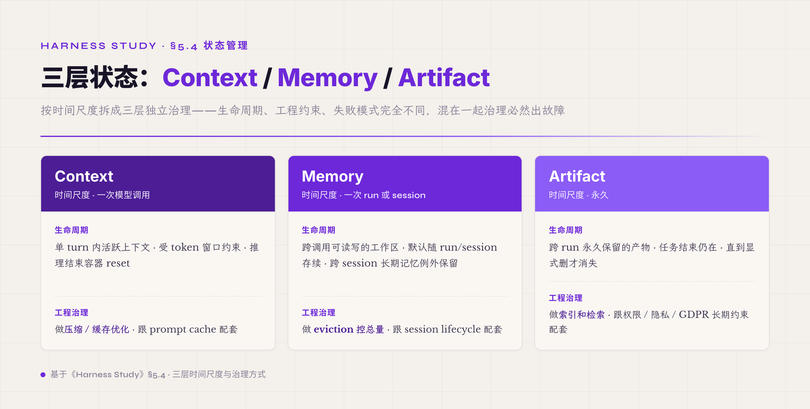
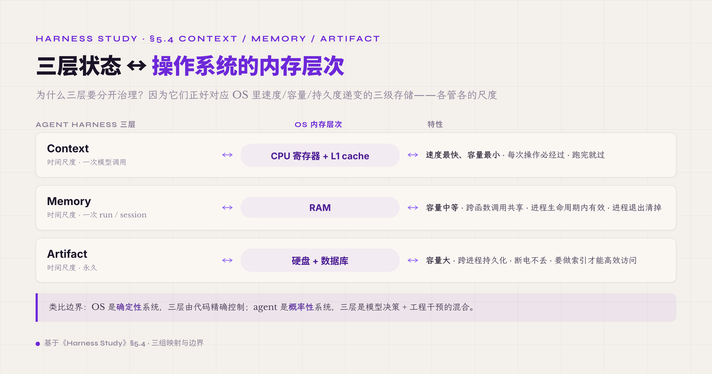
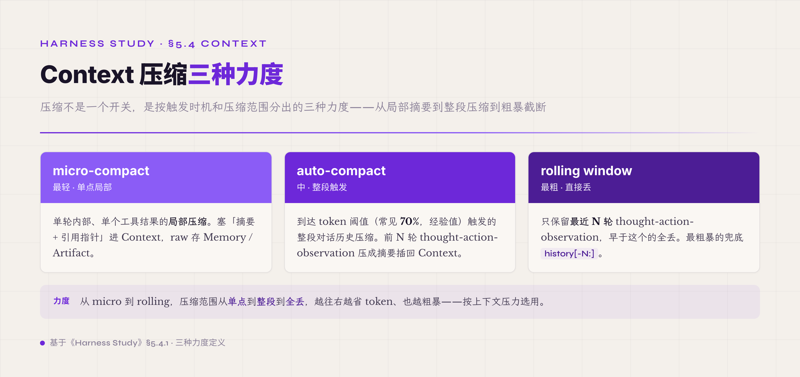
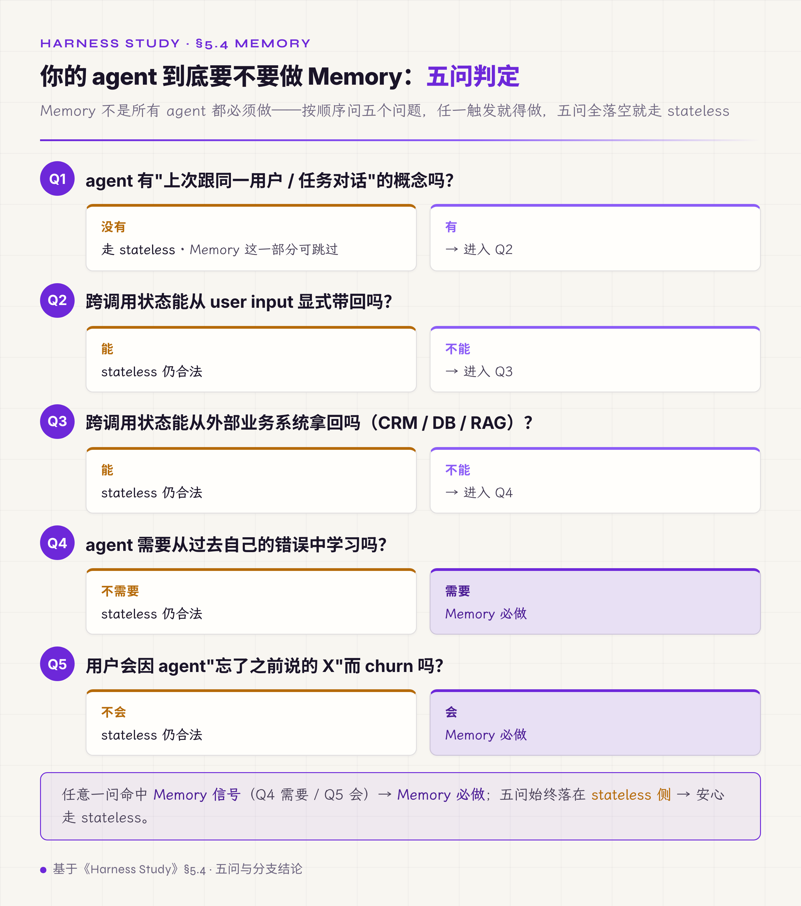

# 5.4 Context / Memory / Artifact · **P0 (Context) / P1 (Memory) / P2 (Artifact)**

第四个机制是 agent 的"状态管理"。跟传统软件不一样，agent 的状态不能塞在一个袋子里管，而要按**时间尺度**拆成三块分别维护：

- **Context** 是每次调用模型时临时组装的那份输入。它的内容（包括对话历史）会跨轮延续，但每一轮都重新组装一次，并受上下文窗口限制。
- **Memory** 是 harness 在模型外维护的、跨多次调用可读写的状态。默认随一次 run 或一个 session 存续，任务结束后清理；需要跨 session 保留的长期记忆也归这一块（5.4.0 会交代边界）。
- **Artifact** 是跨 run 保留的产物。任务结束后仍在，直到显式删除才消失。

这三块容易被混在"context 管理"一个袋子里讲。本卷把它们显式拆开，是因为业界踩过的坑很清楚：三种状态混在一起治理，最后会同时出现三种故障，该清的没清，该留的留不下，三层互相污染。**这一节是设计 harness 时容错率最低的一个机制。** 状态机制设计错了，agent 行为上出现的诡异 bug 跟模型幻觉（hallucination）的表现一模一样，根因极难追查。

为什么要按时间尺度拆？因为三种状态的生命周期完全不一样，统一治理就是用最短的生命周期去管最长的。结果是：要长期保留的产物在单轮压缩时被丢掉，该跨 run 保留的记忆随 run 结束被清掉，本来该清的单轮中间状态反而越过 run 边界，还在影响下一次任务。这三种典型故障的根因是同一个：没按时间尺度分层。

- **Context** 的时间尺度是"一次模型调用"。agent 每调一次模型，harness 就组装一次 Context；调用结束后这份输入不再使用，下一轮从历史重新组装。
- **Memory** 的时间尺度是"一次 run 或一个 session"。agent 做一个任务期间反复查看的中间状态放在这里，run 结束时清掉。
- **Artifact** 的时间尺度是"长期"。任务做出来的产物，以及以后类似任务还要复用的东西，直到显式删除才消失。

*图 5.10 · Context / Memory / Artifact 三种时间尺度*

三种时间尺度决定了三种完全不同的工程治理方式：

- Context 受 token 窗口约束，要做压缩和缓存优化，跟提示词缓存（prompt caching）配套；
- Memory 受运行时资源约束，要做淘汰（eviction）控制总量，跟 session 的生命周期配套；
- Artifact 受存储成本约束，要做索引和检索，跟权限、隐私、GDPR 这类长期约束配套。

混在一起治理，就是要在同一个数据结构上同时满足三套互不兼容的约束，这做不到。

这三层可以用一个跨领域的类比讲清楚：**操作系统的存储层次结构**。Context 类比 CPU 寄存器加 L1 缓存，速度最快、容量最小，每次操作都要经过，用完即过；Memory 类比内存（RAM），容量中等，跨函数调用共享，在进程生命周期内有效，进程退出就清掉；Artifact 类比硬盘加数据库，容量大，跨进程持久保存，断电不丢，要建索引才能高效访问。

*图 5.11 · 操作系统内存层次的跨域类比*

操作系统工程里这三层有几十年的成熟实践：什么数据放哪一层，层与层之间怎么换入换出（swap），缓存怎么失效（invalidate），文件系统怎么组织索引和事务。这些经验大多可以迁移到 agent 状态管理上。具体对应起来：

- 寄存器和 L1 对应 Context：都是计算单元最快能访问的位置，都受容量约束，都要决定替换什么；
- 内存对应 Memory：都是进程范围内共享的工作区，都有淘汰机制，都跟缓存配合工作；
- 硬盘加数据库对应 Artifact：都是持久保存，都要索引才能高效访问，都有备份和访问控制问题。

类比的边界要交代一下。操作系统是确定性系统，三层内容由代码精确控制；agent 是概率性系统，三层内容是模型决策加工程干预的混合结果。操作系统的经验提供的是结构上的参考："状态按时间尺度分层"这个思路可以直接借，每层具体怎么实现，要按 agent 工程的实际约束重新设计。本书的判断是，**分层这个思路本身站得住**：不按时间尺度拆 agent 状态的设计，最后多半会陷入混乱。

一篇 2026 年的预印本 Artifacts as Memory Beyond the Agent Boundary[^artifacts-as-memory-2026] 为这种分层提供了支撑。它的核心论点是：**记忆不局限在 agent 边界的一侧，它的数据和功能可以跨过 agent 与环境的边界，驻留在环境中。** 这对三层分层有一个重要含义：**Memory 跟 Artifact 不是两种不同的东西，而是同一份记忆的两侧。** Memory 在 agent 边界内，是 agent 主动管理的内部状态；Artifact 在 agent 边界外，是在环境中自然产出的"留下物"（文件、数据库行、知识图谱条目、Skill 文件、代码）。同一个事实可以以 Memory 的形态在 agent 内部存一份，也可以以 Artifact 的形态在环境中存一份，只是工程治理方式不同。后面两块反复用到这个论点：讲的不是两种不同的存储，而是同一份记忆的两套治理方式。

论文还给出一个工程上的启发：**Artifact 比内部 Memory 更省 agent 自身的容量。** 论文的导航实验显示，在路径（Artifact）可见的环境里，agent 学会同样策略所需的记忆容量明显更小，把状态外化到环境中比塞进 agent 内部更经济。这支撑了 Artifact 一块的核心立场：需要长期保存的状态优先放 Artifact，Memory 留给确实需要在轮与轮之间快速读取的工作状态。

下面 §5.4.1、§5.4.2、§5.4.3 分别详写三块的工程细节，每块按"为什么这块必须独立存在、工程治理的关键策略、反模式、起步建议"展开。读者按自己当前阶段挑相应优先级阅读即可：PoC 阶段先把 Context 工程做对（不做，agent 跑不远）；生产阶段考虑加 Memory（不一定要做，见 §5.4.2 开头的判定）；规模化阶段加 Artifact（不做，形成不了业务壁垒）。

但有三件事要在开头先讲清楚。

**第一，Memory 不是所有 agent 都必须做。** 大量垂直 agent（合规扫描、批处理、API 文档生成、单次分类、单次工具触发、行业研报生成）采用无状态（stateless）架构完全合理。相对有状态（stateful）路径，无状态路径能省下相当一部分基础设施成本；对 K8s 也更友好（K8s 最初面向无状态服务设计，有状态负载要额外用 StatefulSet、持久卷等机制）；失效模式也更少，没有过时状态、竞态、部分更新、提示词漂移这些有状态系统独有的坑。§5.4.2 开头会给出判定五问，让读者在投入 Memory 工程之前先确认：这个机制对我的 agent 是真的必要，还是被"memory 是一等架构组件"的口号带着以为必要。

**第二，Artifact 有三种工程层级。** 从中小企业（SMB）单租户到大型企业跨部门决策，工程复杂度相差几个数量级。选哪一层取决于业务复杂度和数据治理要求，不是一律上最高配。三层分别是：

- **轻量级（Lightweight）**：Postgres 加几个扩展，适合 PoC 和 SMB；
- **双时态知识图谱（Bitemporal Knowledge Graph）**：Zep、Graphiti、Memento 这类带两条时间轴的开源系统，适合状态变化频繁的中型 agent；
- **企业决策平台（Enterprise Decision Platform）**：Palantir Foundry Ontology 这种把 schema、业务逻辑、可执行动作和权限整合在一起的重型平台，适合大型企业、政府、国防场景。

§5.4.3 会逐层展开。

**第三，§5.4 这三块是一个机制还是三个。** 严格说，它们是同一个"agent 状态管理"抽象功能下按生命周期切出的三段，治理原则各不相同：Context 管单次调用的输入，Memory 管跨轮、跨调用的状态，Artifact 管跨 run 的产物。三段的工程约束完全不同，所以分开详写。这既不是"三个独立机制"，也不是"全揉在一个袋子里"。§5.4.2 和 §5.4.3 在检索一步常用的 RAG、GraphRAG，是**横切 Memory 和 Artifact 两段的"检索-注入"工程模式，本身不是一个机制**，后端换成向量库、图数据库、全文检索、SQL 或 MCP server 都成立。§5.4 末尾的"业界归位卡片"会展开这个边界。

#### 5.4.0 本节首次出现的术语

§一至 §四、§5.1 至 §5.3 已经解释过的术语（上下文窗口、lost-in-the-middle、schema、tool_call、Adapter、policy、Skill 等）下面不再重复，这里只列 §5.4 首次出现的术语。

**运行单位术语**（turn 与 run 在 §5.0 开头已定义，这里一并列出，并补上 session）

- **turn（轮）**：一次模型调用，加上它触发的工具执行。只思考、不调工具的一次调用也算一轮。
- **run（运行）**：一次任务从开始到终态（完成、失败、取消）的全过程，通常包含多轮。
- **session（会话）**：同一用户与同一 agent 的一段连续交互，可以包含多次 run。例如在同一个 IDE 窗口里先让 agent 修一个 bug、再让它写一段测试，是一个 session 里的两次 run。

**三层状态术语**

- **Context（上下文）**：每次调用模型时临时组装的那份输入，包括 system prompt、工具列表、对话历史、本轮的工具结果。它的内容（尤其是对话历史）会跨轮延续，但每一轮都由 harness 重新组装一次，并受模型上下文窗口限制。按全书约定，Context 是由历史派生的视图：历史是持久保存的完整消息与事件记录，Context 是每一轮从历史算出、实际发给模型的那一份。
- **Memory（记忆）**：harness 在模型外维护的、跨多次调用可读写的状态，用来存"这次任务里要反复查看、但不想每轮都塞进 Context 的中间结果"，类比操作系统里的进程内存。注意，它跟认知科学里的"工作记忆"（working memory，Baddeley & Hitch 1974）不是一回事：工作记忆指当下正在加工的少量信息，在本书里对应的是 Context。Memory 默认随一次 run 或一个 session 存续。跨 session 的长期记忆（同一用户的偏好、同一 agent 积累的经验，例如 Mem0 这类记忆系统、Claude Code 的 MEMORY.md）在本章也归 Memory，因为它仍由这个 agent 自己读写、主要服务这个 agent；与 Artifact 的判别见 §5.4.3 开头的三问。
- **Artifact（产物）**：跨 run 保留的产物，任务结束、session 关闭、进程退出后仍然存在，直到显式删除。用来存"这次任务做出来的成果"或"以后类似任务可复用的东西"，读取方可以是未来任意 agent、人或业务系统。类比操作系统里的硬盘文件加数据库记录。

**压缩与窗口管理术语**

- **micro-compact（局部压缩）**：对单个工具结果做的局部压缩。例如工具返回 100KB 文件内容，micro-compact 只把"已读取 contract-2026.pdf，共 12 页，关键章节是第 3 至 5 节"这类摘要放进 Context，完整内容存到 Memory 或 Artifact。
- **auto-compact（自动压缩）**：到达 token 阈值时触发的整段压缩。例如 Context 用到窗口的 70% 时，用模型把前 N 轮的思考、动作、观测压成一段摘要，减少 token 占用。
- **summarization（摘要生成）**：auto-compact 内部生成摘要的那一步。通常用比主模型便宜的模型来跑，摘要质量直接决定压缩后 agent 还能不能继续完成任务。
- **budget guard（预算守卫）**：一种硬约束，例如 token 累计超过某个值就强制停止，防止 agent 跑出失控的成本。
- **prompt caching（提示词缓存，也称前缀缓存）**：Anthropic、OpenAI 等厂商自 2024 年起提供的缓存机制。厂商在服务端缓存 prompt 前缀的计算结果，后续请求只要前缀相同，这部分就不必重新计算。**命中缓存的部分仍然计费，只是按折扣价**：以 Anthropic 为例，读取缓存约为正常输入价的 0.1 倍，写入缓存按缓存时长为 1.25 倍（5 分钟）或 2 倍（1 小时）；各家价格与规则不同。它要求 prompt 前缀稳定，前缀一变，缓存就失效。它只缓存输入的计算结果，不缓存输出，也不改变采样分布。
- **rolling window（滚动窗口）**：一种简单的压缩策略，只保留最近 N 轮，更早的直接丢弃。简单，但会丢早期的关键信息。
- **稳定前缀**：Context 开头那一段每轮都不变的内容（system prompt、工具列表、常驻参考资料），是提示词缓存能命中的部分。
- **预填充（prefill）与首 token 延迟**：模型生成回复之前，要先把整段输入读一遍、算出中间结果，这一步叫预填充；从发出请求到收到第一个输出 token 的时间叫首 token 延迟（time to first token）。输入越长，两者越大。
- **位置偏置（position bias）**：模型对上下文不同位置的信息利用程度不同。最有名的表现是 lost-in-the-middle：放在中段的信息比放在头尾的更容易被忽略。
- **观测包（observation pack）**：harness 每轮为模型组装的一份结构化观测，列出本轮各项工具结果的摘要、状态、完整内容的引用和估算的 token 数；原始内容不直接进消息历史。§5.4.1 的"工具结果分层"一段会讲它的用法。

**Memory 工程术语**

- **scratchpad（草稿板）**：agent 用来"自己给自己写笔记"的 Memory 区域。例如 agent 主动记下"用户偏好的午餐时间是 12:30""客户 X 的项目最关心成本而不是工期"。它跨轮复用，由 agent 主动写入，跟系统自动捕获（capture）的 Memory 不同。
- **stale memory / memory rot（过时记忆 / 记忆腐坏）**：Memory 里存了过时数据，却没有被标为失效，agent 还按旧数据决策。这是长期运行的 agent 反复出现的隐性 bug。典型场景：agent 在 Memory 里存了"用户邮箱是 X"，用户三个月后换了邮箱，agent 还往旧邮箱发邮件。
- **memory eviction（记忆淘汰）**：控制 Memory 总量、不让它无限增长的机制，类比操作系统的缓存淘汰。常见策略有 LRU（最近最少使用）、LFU（最不经常使用）和按重要性打分。

**Artifact 工程术语**

- **artifact store（产物仓库）**：存放跨 run 产物的物理后端，可以是文件系统、对象存储（如 S3）、SQLite 或 Postgres、向量数据库（如 Qdrant 或 pgvector），选哪个取决于产物类型和访问模式。
- **knowledge graph（知识图谱）**：一种产物组织形态，把领域实体（合同、供应商、政策、客户）和它们之间的关系（"客户 A 跟供应商 B 签过合同 C"）存成图结构，适合需要做关系推理的领域 agent。
- **RAG（检索增强生成，Retrieval-Augmented Generation）**：把 Artifact 拉回 Context 的检索机制。给一个查询，从产物仓库里检索相关条目，把结果注入下一次调用的 Context。它是 agent 访问长期产物的检索通道。
- **embedding 检索（向量检索）**：用向量空间的相似度做检索。把每条产物和查询都转成向量，按余弦相似度取前 k 条（top-k），是 RAG 最常见的实现。

#### 5.4.1 Context · 每轮重新组装的输入

Context 是 agent 跟模型最直接打交道的一层：每次调用模型，harness 都把整段 Context 作为输入发给模型。这个机制要解决两个根本问题。**第一是 token 窗口约束**：即使是 1M token 的窗口也有上限，长程（long-horizon）agent 跑几十步，累积起来就能撞到。**第二是位置偏置**：前面提过的 lost-in-the-middle 现象，让长 Context 中段信息的利用准确率系统性下降。两个问题合起来意味着，即使 token 还没用完，把所有东西都塞进去也不是好策略，必须主动管理：什么进 Context，什么不进，进了的什么时候压缩，压完之后怎么衔接。这套主动管理的工程做法就是**上下文工程（context engineering）**。它跟选哪种 Agent Loop、选哪个模型一样重要，却常被低估，因为开发期只跑 5 步的 PoC 碰不到这层问题，跑到生产上 30 步的任务才会暴露。

**token 窗口的工程现实**

名义窗口跟有效窗口差得很远，这是设计 Context 治理时要先建立的认知。Anthropic Claude Opus、Sonnet 名义 200K，OpenAI GPT-5.5 与 Google Gemini 名义都到 1M。这些是"最多能塞进去"的上限，而不是"塞到这个量级模型还能用好"的可用上限。实际 agent 跑起来，Context 里有几大块固定开销（以下数字是常见量级，属经验值）：

- **system prompt**：通常 1K 至 5K，写得详尽的可能到 10K；
- **工具描述**：占 5K 至 20K，20 到 30 个工具的描述加 schema，平均每个 200 到 500 tokens；
- **模型的推理通道**：推理模型（reasoning model）有独立的思考通道，不计入最终输出文本，但占用算力和 token 预算；
- **对话历史中累积的思考、动作、观测**：这一块是真正的可变项，agent 跑得越久涨得越快。

一个 30 步的 ReAct agent 在不做任何压缩的情况下，Context 跑到 50K 至 80K 是常态，跑到 150K 也不算少见。

这意味着设计 Context 治理时，不能按"窗口总量"做容量规划，而要按"有效窗口"。一个工程经验值：**预留 30% 至 40% 的窗口给当前这一轮的工具结果、模型思考和输出**（经验值，按场景调整）。也就是说，200K 窗口实际能分给对话历史的上限大约是 120K 至 140K，再多，当前这一轮的处理就紧张了。这样估算的理由是：一轮里模型要思考几千 tokens，可能调一次 read_file 拿回 50KB 文档，还要给输出留几千 tokens；按这个量算，留 20% 至 30% 不够，留 40% 至 50% 又偏多。

另一个常被忽略的事实是：**上下文越长，每一轮的计算量和延迟都越高。** 模型每次调用都要先对整段输入做一遍预填充，注意力计算量随长度增长；输入越长，首 token 延迟越高。跨请求复用同一段前缀的计算结果，要靠提示词缓存：前缀命中缓存的部分不必重新计算，前缀之后新增的部分仍要照常计算。所以 Context 涨到 100K 之后，每一轮的延迟和费用都会随长度上涨，这不只是钱的问题，延迟也在涨。按经验，生产 agent 在 100K 上下文上完成一轮的实际耗时，可能是 30K 上下文时的 2 至 3 倍（经验值，随模型、服务商和缓存命中情况变化）。这层成本在 PoC 阶段感觉不到，到生产规模化才暴露。

**micro-compact · 单个工具结果的局部压缩**

Context 压缩按触发时机和压缩范围分三种力度。最轻的一种是 **micro-compact**：在单轮内，对单个工具调用结果做局部压缩。最典型的场景是工具返回大块内容：agent 调 `read_file` 读了一份 12 页合同，工具实际返回 100KB 文本；调 `search_files` 拿回 50 个候选文件；调 `extract_clauses` 拿回一份合同的全部条款。如果把这些原始返回直接塞进 Context，一个工具结果就能把 Context 撑满，后续几轮几乎没有空间了。

*图 5.12 · Context 压缩的三种力度*

micro-compact 的做法是**不直接塞原始内容**，而是往 Context 里放一段**摘要加引用指针**（"已读取 contract-2026.pdf，共 12 页，关键章节第 3 至 5 节，涉及付款条款、违约责任、保密义务；完整内容索引：memory:doc-contract-2026"），完整的原始内容存到 Memory（后续可能回查时）或 Artifact（属于产物的一部分时）。micro-compact 是单轮、单个工具调用的局部决策，**每个工具按自己的语义配置摘要策略**：`read_file` 的摘要包括文件路径、页数、关键章节；`search_files` 的摘要包括查询词、结果总数、前 N 条路径；`extract_clauses` 的摘要包括条款数、每条的编号和摘要。

工程实现上，micro-compact 有两条典型路径。

- **工具自己负责**：工具实现里同时返回原始内容和摘要，harness 根据 Context 当前的压力决定放哪个。优点是每个工具最清楚自己的语义、知道该怎么摘要；缺点是每个工具都要写两份逻辑。
- **harness 用通用模型做摘要**：工具只返回原始内容，harness 在放进 Context 之前用便宜模型生成摘要。优点是工具实现简单；缺点是通用模型的摘要质量参差不齐，在结构化返回（如 50 个文件路径的列表）上尤其差。

生产 harness 大多以第一条为主、第二条兜底：高频且返回内容长的重要工具（read_file、extract、search 这类）自己实现摘要，边缘工具用通用模型摘要兜底。

2025 年，实现层还多了一个服务商侧的新成员。Anthropic 2025-09 在 API 层推出了 [context editing](https://platform.claude.com/docs/en/build-with-claude/context-editing)（按配置的策略自动清理早期的工具结果）和 memory tool（跨对话记忆：Claude 通过工具读写，存储放在开发者自己的后端）。前者就是 micro-compact 这个抽象功能被做进了 API，后者是 Memory 读写职能的工具化。按 §5.0 "抽象功能 vs 实现"的框架归类即可：平台把某个抽象功能做进 API，不改变这个功能的职责划分。清什么、留什么、什么时候清，这些决策仍然是 harness 的事：执行可以交给服务商，判断不能交出去。

**工具结果分层**

在上面两条路径之外，工业级 harness 还有一种更扎实的做法：**把工具结果从消息主干里彻底剥离，拆成三层**：

- **原始内容**：存进产物仓库，不进消息流；
- **观测包**：模型默认看到的是一份结构化的观测包，列出每项结果的摘要、状态、完整内容的引用和估算的 token 数；
- **引用**：模型需要全文时，按引用主动取回。

这种做法的价值在于，把"工具结果怎么摘要"和"消息历史怎么保持稳定"这两件事解耦：摘要质量由观测包负责，消息流只负责保持前缀稳定，两者不再挤在同一份 token 预算里互相牵制。本书配套的实现案例就把观测包作为工具结果回注给模型的默认形式，可以作为这条路径的一个参考。

一个反模式是**对所有工具返回一律截断**，比如"超过 5K 字符就截断"。截断不是摘要，它会把关键信息一刀切掉（合同的违约条款可能正好在第 10 页，落在截断点之后），agent 后续推理就拿不到。截断是开发期的偷懒做法，到生产几乎一定要换成正经的摘要。

**auto-compact · 整段历史的中等强度压缩**

第二种力度是 **auto-compact**：到达 token 阈值时触发的整段对话历史压缩。常见的阈值是 Context 使用率达到 70%（也有项目用 80% 或 60%，都是经验值）时启动：把前 N 轮的思考、动作、观测压成一段摘要，插回 Context 替代原始内容，给后续几轮腾出空间。这一步可以按场景需要，选旗舰模型或通用模型来做。

auto-compact 的关键难点不在"压"，而在于**摘要要保留什么**。agent 后续推理可能要用的信息必须保留，否则 agent 就会开始编造。必须保留的元素有四类：

- **关键决策**：例如"第 5 轮选了候选 A 而不是 B，理由是 X"，agent 之后还要基于这个决策往下推进；
- **未闭合的工具调用**：前提是工具以异步或后台方式执行（例如长时间运行的构建、外部审批），结果可能过几轮才回来。比如 agent 在第 8 轮发起了某个后台任务，第 12 轮触发压缩时结果还没回来，压缩必须显式标记这个调用 ID 还在等结果。同步执行的工具在同一轮内就拿到结果，不存在跨轮未闭合的问题；
- **产物引用**：已经存进 Artifact 的索引指针，agent 后面要按产物 ID 去取；
- **verifier 的失败信息**：agent 之前踩过的错，保留下来避免再踩同一个坑。

摘要丢了任何一类，agent 后续推理就开始编造：拿不到关键决策，就忘了当初为什么选 A，改去选别的；拿不到未闭合的工具调用，就编一个假观测，假装已经看到结果；拿不到产物引用，就编一个 ID 自圆其说；拿不到 verifier 失败信息，就再踩一次同样的错。这些问题是工具调用相关 bug 里**最难调的**：表面上 agent 在按已有信息推理，实际上它在编，而且自己也不知道。

四类元素不是写进压缩 prompt 就完事，**压缩质量要有回归测试**。可操作的做法是：留一组有代表性的历史 run 作为金标集，每次改压缩 prompt 或换压缩模型，都重跑压缩，自动比对四类元素的保留率（未闭合的工具调用是否还在，关键决策是否还在，产物引用是否仍可解析，verifier 失败记录是否保留），保留率下降就挡住这次变更。压缩是 harness 里"静默劣化"风险最高的机制之一：它出错时不报错，只让 agent 表现慢慢变差，没有回归测试，就永远不知道是哪次改坏的。

工程化的摘要 prompt 要显式列出"必须保留的元素清单"，不能只说"请压成摘要"。一个能用的模板大致是："以下是 N 轮的对话历史（拼接进来）。请压成不超过 500 tokens 的摘要。**必须保留**：所有未闭合的 tool_call_id 及其当前状态、每一轮的关键决策及理由、所有产物引用 ID、所有 verifier 失败的判定及原因。**可以丢弃**：重复内容、过期的中间状态、与最终决策无关的探索分支、已闭合工具调用的完整原始观测（可以用摘要替代）。"这种模板能让便宜模型也做出基本可用的摘要。

摘要质量评测是 auto-compact 必须做的一道工序：把摘要加上后续的执行记录交给一个参照 agent（oracle agent），看它能不能接着把任务做完。做不完，说明摘要丢了关键信息，就回去调摘要 prompt，直到它能做完。这种离线评测可以在每次 harness 升级时跑一遍，避免摘要 prompt 慢慢退化。

压缩用什么模型，也是一个直接的取舍。用便宜模型（GPT-5.4 nano、Claude Haiku 4.5、Qwen Flash、DeepSeek V4 Flash）按公开价目粗算，能比主模型便宜 5 到 20 倍（随模型组合变化）；用主模型质量最高，但每次压缩都是一次额外的主模型调用，成本明显更高。工业级 harness 大多走"便宜模型加严格的摘要 prompt"这条路，理由是摘要这项工作（拿一段对话历史写摘要）相对单纯，便宜模型也能做得不错，关键在 prompt 设计。高风险任务（合同、医疗、财务）可以把压缩模型升级到**比主模型低一级、但明显强于最便宜那一级的模型**（比如 Claude Opus 跑主线、Claude Sonnet 跑压缩），这是合理的工程加固：压缩失败的代价比省下的成本高得多。

**rolling window · 最粗暴的兜底**

第三种力度是 **rolling window**：只保留最近 N 轮，更早的全丢。简单到一行 Python 就能写完（`history[-N:]`），代价是早期的关键信息直接丢掉。生产 harness 一般不单用 rolling window，要么搭配 Memory（早期信息转存 Memory，而不是直接丢），要么搭配 auto-compact（早期信息压成摘要，而不是直接丢）。

rolling window 唯一适合单独使用的场景是**长对话型 agent**：没有明确"项目终点"的持续闲聊、客服机器人、陪伴类应用。这类 agent 可能对话几百轮，但每轮的上下文相对独立，丢掉早期对话也能正常工作。任务型 agent（有明确产出目标、需要长程推进的任务）几乎一定不能单用 rolling window，因为丢掉早期内容就意味着丢掉任务目标本身。

**与提示词缓存协同**

Context 治理还有一件大事：**跟提示词缓存协同。** Anthropic、OpenAI 自 2024 年起提供的提示词缓存，让前缀相同的请求可以复用前缀的计算结果：命中缓存的前缀按折扣价计费（Anthropic 读取约为正常输入价的 0.1 倍），前缀之后的部分按正常价计费。命中率高时，整体输入成本可以明显下降，下降多少取决于前缀占输入的比例和命中率。但缓存要求 prompt 前缀稳定，前缀里只要有一个字节变了，缓存就失效。auto-compact 会直接破坏前缀稳定性：压缩改写了中段，从改写处往后的缓存全部失效。

工程上的折中是**分层处理**，把 Context 切成稳定程度不同的三段：

- **最稳定的前缀**（system prompt、工具列表、高频参考资料）放在最前面，绝不改动。这一段往往有 10K 至 30K，是缓存收益的主要来源；
- **中间的稳定段**（已经发生过的对话历史）允许做 auto-compact。压缩改写这一段时，这一段的缓存失效，但前缀仍然命中；
- **最不稳定的尾部**（当前这一轮的临时内容）每次重新组装，这一段本来就没有缓存价值。

这样，缓存命中集中在最长的稳定前缀上，压缩只动中段，不动头部。

生产中，缓存命中率达到 60% 至 80%（经验值，按场景调整）才算缓存设计成功；掉到 30% 以下就要查前缀为什么不稳定。常见原因是 system prompt 里放了时间戳或随机 ID（"current time is 2026-05-20 14:30:00"之类），或者工具列表的顺序每次重排（字典转列表时不保证顺序）。这种问题往往在多付了一段时间的 API 费用之后才被发现，所以缓存命中率要做成实时监控面板。缓存未命中时的降级路径也要设计：如果缓存突然集体失效（服务商侧维护、前缀意外变动），输入成本会回到全价，要有预警和降级机制，避免在没有监控的情况下账单翻几倍。

前缀稳定性具体怎么保证，可以拆成 **6 条硬性约束**：

1. 一次 run 内，system prompt 不得改动；
2. 工具定义的顺序必须稳定；
3. Skill 和各类配置片段必须按固定顺序排列；
4. 运行时状态（当前时间、进度等）不得拼进 system prompt；
5. 压缩摘要不得替换稳定前缀里的任何部分；
6. 按需取回的内容只放在前缀之后的动态部分，不插进稳定前缀。

这 6 条都是从踩过的坑反推出来的。违反其中任何一条，常见后果是缓存命中率突然从 80% 以上掉到 30% 以下，账单翻几倍之后才被发现。配套要从第一天就接入 4 个观测指标，做成实时面板：缓存命中的输入 token 数、缓存命中占比、第一次未命中出现在第几步、前缀变动的原因。这样前缀一旦漂移，就能立刻定位是哪条约束被破坏了。前缀工程做对的 harness，生产中缓存命中率稳定在 80% 以上是可以做到的（经验值），这是"前缀工程做对了"的可见信号。

**lost-in-the-middle · 位置偏置的工程应对**

窗口装得下，不等于模型能用好。Lost in the Middle[^lost-in-middle-2024]（Liu et al. 2023）在多个模型上观察到 **lost-in-the-middle** 现象：在多文档问答中，同一段关键信息放在输入的头部或尾部时，回答准确率明显更高；放到中段时，准确率下降，降幅可超过 20 个百分点，形成一条 U 形曲线。之后的新模型上这个效应有所减弱，但没有消失。这意味着 1M 的上下文装得下整个仓库，不等于模型能高质量利用；关键信息放在中段，依然容易被忽略。

工程上的应对主要有四种做法：

- **把关键信息放在头尾**：system prompt 里最重要的部分放在 system prompt 末尾（紧邻用户消息的位置），当前任务说明放在用户消息的最末尾（紧邻模型回答的位置）。
- **重复关键信息**：同一份关键说明在头部放一次、尾部再放一次，让模型至少有一次在有利位置看到。代价是字数翻倍，但收益往往值得。
- **显式标记**：用 `# IMPORTANT`、`# 必须遵守` 这类显式标记，提醒模型注意这一段。简单但有效。
- **用检索代替直接塞入**：关键产物不直接塞进 Context，而是给一个引用 ID（"已审条款见 artifact:contract-2026"），让 agent 真正需要时用检索工具主动去取。取回的内容会进入当前这一轮的尾部（紧邻模型回答的位置），处在模型利用最好的位置。

一个反例是：把 50 页合同的原文整个塞进 Context，让 agent 找异常条款。假设异常条款大多分布在中段（第 10 至 40 页），它们正好落在模型最容易忽略的位置，漏检的风险明显上升。生产中这类任务的正确做法是：先用 micro-compact 把合同摘要和关键标记放进 Context，原始合同存进 Artifact，agent 真要看某一条款时再去检索。这样关键内容总是在尾部被使用，利用效果更好。

**Context 跟 Agent Loop 形态的配合**

不同的 Agent Loop 形态对 Context 治理的要求不同，必须配套设计。

- **vanilla ReAct**（原始 ReAct）是 Context 增长最快的：每轮增加一组思考、动作、观测，没有任何天然的重置点。20 轮后 Context 到几万 tokens 是常态，30 轮后就会撞到压缩阈值。
- **Plan-Execute** 把 Context 分成两个阶段。计划阶段的 Context 是任务简述加 5 至 15 步的骨架，紧凑、不增长；执行阶段每一步的 Context 带着计划骨架和当前步骤的局部历史，每步执行完，Context 可以重置到"计划骨架加下一步"重新开始。执行阶段的 Context 治理压力比 vanilla ReAct 轻得多。
- **Reflexion** 在 Context 里多出一个独立的"反思"通道：每隔 N 轮，把对已有执行记录的反思结果作为单独一段放进 Context。反思段本身也要压缩，否则反思多了 Context 会翻倍。
- **Skill-Based Hierarchical** 让 Agent Loop 在 Skill 层调度，而不是直接调原始工具。Context 里出现的不再是"调 read_file → 调 search_files → 调 extract_clauses"这样一串，而是一行"调 extract_contract_terms skill"（内部封装了多个工具）。Context 体积明显变小，但 Skill 内部如果出错，调试时拿不到细节。

一个反模式是**在长程任务里用 vanilla ReAct，而且不做压缩**。这是把 PoC 直接搬到生产时最容易踩的坑：开发期跑 5 步的任务，token 到 20K 就结束了，开发者觉得"Context 没问题"；上线后跑 40 步的任务，token 到 200K 还在累加，关键信息落进中段，agent 质量下降。这个坑的根因不是"选错了 Agent Loop"，而是没意识到 Agent Loop 的形态决定了 Context 的增长速度，必须配套做压缩。

**多模态 Context 处理**

多模态让 Context 治理又多了一层复杂度。图片的 token 开销远比文本大：Anthropic Claude 一张高分辨率图大约 1500 tokens，一份扫描 PDF 每页约 2K 至 3K tokens。截图、PDF 页面、文档扫描件如果直接放进 Context，一两张就占掉一大块。

工程上的做法是**先分析截图，只把分析结果放回 Context，原图存进 Artifact**。例如截图交给视觉模型分析，返回结构化描述，几百 tokens 的描述进 Context，几千 tokens 的原图存进 Artifact 并建索引。视频和音频的体量更大：1 分钟视频按每秒 1 帧取帧，可能就有几万 tokens，必须先在 Adapter 层做降采样、关键帧提取或自动摘要，得到几百 tokens 的描述后才能放进 Context。多模态场景里的 micro-compact 跟纯文本不同：文本场景是把长文本变短文本，多模态场景是把图片、视频、音频变成文本（带索引）。后者依赖一条独立的"多模态摘要"工具链，这是多模态 agent 工程里容易被忽视的复杂度。

**反模式 · 把 Context 当无限内存**

Context 治理最常见的反模式是**开发期把 Context 当无限内存用，到生产期撞墙**，即上下文膨胀（Context Bloat，AP08，见附录 F）。

它是这样发生的：开发期 token 看起来不缺，PoC 任务跑 5 步还在 20K，开发者觉得 200K 窗口绰绰有余，就把所有"以备万一"的信息全塞进 Context，不做主动管理。这种做法在 PoC 阶段暴露不出来；到生产规模化任务（合同审核 30 步、月度报告 40 步、客户咨询 50 步）跑下去，Context 就常态化地撞到窗口的 70% 至 80%。撞到阈值之后，即使 auto-compact 被触发，agent 也已经在很长的上下文里跑了多轮：很多关键决策落在中段，受位置偏置影响被模型忽略，后续推理只基于模型"还记得的部分"，结果不可靠。

一个工程经验（经验观察，未经系统统计）：在上线运行半年以上的生产 agent 项目里，Context 治理失误是任务通过率下降的主要原因之一，另外两个常见来源是缺少 verifier、工具描述没有按 ACI 原则写。具体表现是：长程任务（20 步以上）的通过率明显低于短任务（10 步以内）；排查通过率下降的原因，最后多半发现是"模型在第 15 轮之后开始忽略第 3 至 5 轮的关键发现"。这与位置偏置、以及上下文整体变长后模型表现下降（上下文腐化，context rot）都有关。

判断标准：用一个 50 步的端到端试运行（dry-run）看 token 增长曲线。以 200K 窗口为例，**第 30 步时占用不到窗口的 15% 属于健康**；第 30 步已经占到 40% 以上，说明没做 Context 工程；第 30 步占到 75% 以上，就是已经撞墙（均为经验值，按场景调整）。这个试运行应该作为 harness 上生产前的必跑测试。边界也要说清楚：纯短对话 agent（5 步以内完成）可以不做 Context 工程；长程任务（20 步以上）必须做；介于中间的 10 至 20 步任务，看任务密度（每步是否有很多大块的工具结果）。

**起步建议 · 四个维度**

**注意什么。** token 窗口要预留 30% 至 40% 给当前这一轮（经验值），不要按"窗口总量"做容量规划；micro-compact、auto-compact、rolling window 三种策略各有适用面，不要一律用 rolling window；提示词缓存跟压缩相互耦合，设计缓存时要先想好压缩怎样不破坏稳定前缀；lost-in-the-middle 在 200K 的上下文里同样存在，1M 窗口也不是万能解。最容易被低估的是"开发期看不到的问题"：PoC 跑不到的 token 量，生产里会跑到。

**怎么设计。**

- Context 切成三段（稳定前缀、中间历史段、尾部当前轮），各用不同的治理策略；
- 每个工具按自己的语义配置 micro-compact 摘要格式，而不是统一截断；
- auto-compact 的摘要 prompt 要显式列出"必须保留的元素清单"（未闭合的 tool_call_id、关键决策、产物引用、verifier 失败信息）；
- 把 Context 增长曲线做成可观测的指标，出问题能立刻发现；
- 多模态内容默认走"分析后摘要、原图存 Artifact"的路径。

**怎么测试。**

- token 增长曲线试运行：跑完一个 50 步的任务，看 token 曲线是否健康；
- 压缩前后对比：agent 任务通过率下降不超过 5 个百分点（经验值），下降更多说明摘要 prompt 设计得差，回去调；
- 缓存命中率监控：应在 60% 至 80%（经验值），掉到 30% 以下就查前缀稳定性；
- 中段信息利用测试：在 100K 至 200K 的上下文中段放入已知的关键信息，看 agent 能不能用上。

这四个测试串起来，构成 Context 治理的工程闭环。没有这套闭环，就只能凭直觉调，踩坑的概率很高。

**写什么 prompt。** auto-compact 的摘要 prompt 模板要写明"必须保留的元素"和"可以丢弃的元素"，让便宜模型也能产出可用的摘要；agent 的 system prompt 里告诉 agent"Context 容量有限，长内容不要直接重复，引用产物索引即可"，让 agent 主动配合 Context 治理，而不是全靠 harness 兜底；推理模型的思考预算（thinking budget）上限要在 system prompt 里提示模型（"复杂决策时可以多想，但思考不要超过 X tokens，否则会被截断"），避免思考过程失控、吞掉 Context。

Context 是 §5.4 三层里**容错率最低、坑最隐蔽**的一层：做对了，agent 长跑稳定；做错了，所有长程任务的通过率都受影响，根因还很难追。从第一天起就把 Context 当作一项独立的工程来设计，不要等任务在生产中撞墙再回头补，补的成本远高于一开始就做对。

#### 5.4.2 Memory · 模型外的可读写状态

Memory 是 agent 跟自己打交道的一层。它不属于模型本身，而是 harness 在模型之外维护的、多轮之间共享的状态。Context 是每次调用模型时临时组装、模型都要从头读一遍的输入；Memory 是 agent 主动写、主动读的持久工作区。两者最大的区别在于**生命周期**：Context 每轮重新组装，其中的内容能不能延续到下一轮，取决于 harness 怎么从历史里组装；Memory 在整个 run（或 session）期间一直存在，结束时才清理，跨 session 的长期记忆则按自己的失效规则管理。

这个机制要解决什么具体问题？有三个根本场景。

- **给 Context 减负**：agent 在第 3 轮算出的一个关键数字，第 15 轮还要用。与其一直留在 Context 里、到第 15 轮前又被压缩摘要掉，不如直接存进 Memory，等第 15 轮主动读取。
- **跨轮保留判断**：agent 在某一轮主动判断"用户偏好的午餐时间是 12:30""客户 X 的项目最关心成本"，把这类判断写进 Memory，就是 agent 主动建立的工作判断（working belief），下次决策时主动读出来用。
- **显式保存工具调用状态**：§5.4.1 讲过，压缩时丢掉未闭合的工具调用会造成隐性 bug。这类状态的正确归属是 Memory：把 tool_call_id 和它的当前状态显式存进 Memory，与 Context 的压缩解耦。

Memory 不是 Context 的延伸，而是 agent 工程里独立的一层存储。理解这一点，跟避开"把 Context 当无限内存"那个反模式是同一个问题：状态没有分层。

**Memory 必要性判定 · 你的 agent 真的需要 Memory 吗**

2026 年，Mem0、Letta、Zep 等记忆系统的厂商都把 Memory 推为"一等架构组件"（first-class architectural component）。这个口号容易让读者以为任何 agent 都要做 Memory。实际的工程图景要复杂得多：大量垂直 agent 采用无状态架构完全合理，不做 Memory 反而更经济。

把 Memory 当作一等组件来设计，跟把它当作每个 agent 的默认配置，是两回事。Mem0 的论文[^mem0-2025]在长对话记忆评测 LoCoMo 上报告了较好的成绩，但**有 Memory 能力，不等于每个 agent 都该默认启用它**。是否启用，要按下面的判定来定。

**无状态 agent 的典型场景**：这些场景里，Memory 这一部分可以整个跳过。

- **单次分类、评分**：垃圾邮件过滤、内容打标签、风险评级、合规扫描、文档分类。每条独立，输入输出一一对应。
- **单次转换**：翻译、格式转换、代码 lint、ETL 数据清洗。函数式的"输入 → 输出"。
- **单次问答**：FAQ 机器人、客服查知识库。用 RAG 代替 Memory，每条独立查知识库。
- **单次工具触发**：设定时器、播音乐、查天气。命令式的工具调用，没有状态。
- **批处理任务**：凌晨批量审核、数据清洗、月度报告生成。每条记录独立处理。
- **单次产物生成**：行业研报、API 文档、针对单个 PR 的代码评审这类独立任务。

无状态路径的收益不是次要的：

- **基础设施成本**：相对有状态路径能省下可观的成本，不需要 session 存储、状态数据库、一致性处理和状态同步；
- **对 K8s 友好**：K8s 最初面向无状态服务设计，有状态负载要额外用 StatefulSet、持久卷等机制，部署复杂度高得多；
- **失效模式少**：没有并行覆盖写导致的过时状态、部分更新、竞态、提示词漂移、重试时状态丢失这些有状态系统独有的坑；
- **调试和运维简单**：崩溃不丢数据，重启不丢任务，水平扩展没有状态同步问题。

但有些场景，无状态走不通，必须有 Memory：

- **多轮对话型**：客服机器人跟用户多轮交流，IDE 代码助手跨轮保持上下文；
- **个人助理**：学习用户偏好（"我午餐在 12:30"），维护客户档案；
- **长任务的中间状态**：合同审核 30 步、月度报告生成 40 步，轮与轮之间有大量中间状态；
- **持续学习的 agent**：研究型 agent 连续跑多天，累积经验；
- **需要断点续跑**：长任务中断后从上次的位置恢复；
- **自我反思、迭代学习**：外层循环记住之前踩过哪些错，避免再踩。

判断自己的 agent 走哪条路，按下面五个问题依次回答：任意一问答"是"，就进入 Memory 路径；全部答"否"，就走无状态路径。

**判定五问**

1. **agent 有"上次跟同一用户、同一任务对话过"的概念吗？** 没有（每个请求独立，像 REST API）→ 无状态，判定到此结束，Memory 这一部分可以跳过；有 → 进入第二问。
2. **跨调用的状态能由用户输入显式带回来吗？** 能（用户每次都重新告诉 agent 全部背景，像 API 调用每次都带完整数据）→ 无状态仍然可行；不能 → 进入第三问。
3. **跨调用的状态能从外部业务系统取回来吗（CRM、数据库、RAG）？** 能（agent 运行时直接查 CRM，把记忆交给业务系统保管）→ 无状态仍然可行；不能 → 进入第四问。
4. **agent 需要从自己过去的错误中学习吗？** 不需要（每次都是新任务，不需要积累经验）→ 无状态仍然可行；需要 → 必须做 Memory。
5. **用户会因为 agent"忘了之前说过的 X"而流失吗？** 不会（用户本来就预期每次独立）→ 无状态仍然可行；会 → 必须做 Memory。

*图 5.13 · 该不该上 Memory 的判定五问*

判定完之后，边界要说清楚：**大规模生产系统的实际答案往往是混合模式。** 前端无状态（K8s 水平扩展，不保存 session 状态），编排层有状态（独立服务，维护任务状态），两层之间用关联标识（correlation ID）传递。前端接用户请求，享受水平扩展的好处；编排层维护长任务的状态，保证连续性。这种混合模式是高并发 toB agent 的常见做法：纯无状态和纯有状态都是极端，真实生产介于两者之间。

下面假设你的 agent 经过判定五问，走的是 Memory 路径，继续看 Memory 工程怎么做。如果判定走无状态路径，可以直接跳到 §5.4.3 看 Artifact（很多无状态 agent 仍需要 Artifact 这一层做产物归档）。

**Memory 二级判定 · 要做几类记忆**

判定五问答出"需要 Memory"之后，还要做一个二级判定：**Memory 不是要做就全做，而是按四类分场景做。** 这四类借自认知心理学对记忆的分类：

- **工作记忆（working memory）**：当前正在加工的信息，Baddeley & Hitch 1974；
- **情景记忆（episodic）**：具体发生过的事件，"发生了什么"；
- **语义记忆（semantic）**：事实与概念，"什么是真的"；
- **程序性记忆（procedural）**：技能与工作流程，"怎么做"。

其中情景记忆与语义记忆的区分出自 Tulving 1972 的经典工作，程序性记忆属于非陈述性记忆。CoALA（Sumers et al. 2023，arXiv 2309.02427，一个语言智能体的认知架构框架）把这套分类借用到了语言智能体上。放到 agent 工程里，大致可以这样对应：工作记忆对应 Context，加上少量短期的 session 状态；情景记忆对应事件流，用向量加时间戳存；语义记忆对应领域事实，用图或结构化存储；程序性记忆对应经过验证的技能，放在技能库（skill library）里。要注意，**这是类比，不是等价**：agent 的这几类存储借用了认知科学的名字和划分思路，并不具备人类记忆的机制与特性。

四类不必都做：通用聊天机器人一般只要情景记忆；专业 agent（研究、编码）要情景记忆加程序性记忆；领域 agent（医疗、法律、民航）要情景记忆加语义记忆（领域事实集）；玩具原型四类都不需要。

最常见的实施错误是"用向量数据库解决所有记忆需求"。找相似事件，向量检索合适（这是这类系统的主力检索方式）；但"找跟用户 X 相关的所有记忆"，向量检索不擅长，要靠图；"找最近 30 天的事件"，向量没有时序概念；"复用经过验证的代码"，不该靠向量检索，而应该用技能库。

和这个判定配套的还有一个二分：**谁来管 Memory**。系统自动捕获（Mem0 的做法，工程复杂度中等）；agent 自己调工具读写（Letta 的做法，工程复杂度低）；两者混合（工程复杂度高，但工业级效果最好）。

**写入策略**

Memory 写入的工程难点是**写什么、什么时候写、写到哪个后端**，这三件事一起决定 Memory 是有用的工作区，还是无序的堆放区。

**写什么进 Memory**是一道工程判断题。§5.4.1 讲过判断要点，这里展开到机制层面。

- **会被多轮反复读取的中间结果**：比如 agent 算出一个统计数字（成本比去年同期 +18%），后续 5 轮都要引用，存进 Memory 比留在 Context 里累积更省 token，也降低编造的风险。
- **Context 装不下的大块原始内容**：一份 50KB 合同的原文，micro-compact 决定不放进 Context 时，存进 Memory，等 agent 真要看某个条款时再读。
- **agent 主动判断"以后还会用"的判断**：这是 scratchpad 模式，agent 自己给自己写笔记，比如"这个客户偏好三年回本的 ROI，而不是五年"这类工作判断。
- **工具调用状态**：把未闭合的 tool_call_id 和当前状态显式存下来，避免压缩丢掉工具调用、导致编造。
- **verifier 失败记录**：agent 之前踩过的错（"试过路径 X，不存在"），避免重复尝试。

什么不进 Memory？

- **单轮内用完就丢的**：当前工具调用临时拼接的参数、模型生成的候选列表（最后只选一个）等。
- **能从其他来源重算的**：比如"当前时间"，每次直接读系统时钟，不存 Memory，避免过时。
- **敏感信息与个人身份信息（PII）**：不进，或处理后再进。如果 Memory 后端存在跨用户访问的可能，或者受 GDPR"被遗忘权"约束，PII 直接进 Memory 就是合规风险。

**什么时候写**，有三种触发方式。

- **手动写入**：agent 调用 `memory_store(key, value)` 主动写。
- **自动捕获**：harness 在固定的钩子（hook）点，比如工具调用完成、verifier 触发时，自动把相关上下文写进 Memory。
- **阈值触发**：达到某个 token 阈值时，自动把已有执行记录中的关键段同步到 Memory。

生产 harness 通常三种混用：在 prompt 里教会 agent"用 memory_store 主动记下重要发现"；harness 在工具调用完成时自动捕获必要的工具结果摘要；达到 token 阈值时同步关键决策。

**写到哪个后端**，取决于这条数据的访问模式：有明确字段的结构化数据用 SQLite；高频读写且需要过期时间（TTL）的键值数据用 Redis；非结构化的自然语言用向量库；需要多维关系查询的用图数据库。harness 上层提供统一的 `memory.store()` 接口，内部按数据类型路由到对应后端：agent 看到的是统一的 Memory，工程内部按访问模式分层。Memory 的物理后端这里不展开，§5.4 开头已经讲过内存类比；SQLite、Redis、向量库、图数据库的对比也不重复（与 Artifact 部分有重叠），重点放在 Memory 特有的工程治理上。

**检索策略**

Memory 写好之后怎么读？检索策略跟物理后端配套，但本质问题是"agent 这次调用需要哪些 Memory 内容"。

**第一种，按键精确读取。** 在 prompt 里教会 agent 用 `memory_get("contract-2026-key-findings")` 这种方式直接按键读取，常配关系库或键值后端。优点是精确、快、可预测；缺点是 agent 要记住键长什么样，键起错了就读不到。适合 Memory 结构高度规范的场景。

**第二种，字段查询。** 用 `memory_query(category="supplier", risk="high")` 这种带条件、类似 SQL 的查询，从结构化 Memory 里筛出符合条件的记录，常配 SQLite 或 Postgres。适合 Memory 内容有清楚 schema 的场景（供应商档案、条款库、客户档案）。

**第三种，全文检索。** 给一段关键词，从 Memory 里搜匹配的条目，常配 SQLite FTS5 或 Postgres 全文检索。比向量检索精确（关键词必须出现），比按键读取灵活（不用记键）；缺点是无法跨表述匹配（搜"客户偏好低价"找不到"客户在意性价比"）。适合术语稳定的领域。

**第四种，向量检索。** 用 `memory_search("跟低价偏好相关的客户")` 这种自然语言查询，向量化后按余弦相似度取前 k 条，配向量库。优点是能自然地跨表述匹配；缺点是排序可能跑偏（第一条不一定真相关），精确匹配反而差。

**第五种，图遍历。** 用 `memory_traverse(from="customer-A", relation="signed_contract", depth=2)` 这种关系导航查询，配图数据库，适合多跳（multi-hop）关系推理。

**第六种，混合检索。** 先用关键词或字段筛一遍候选（精确率高），再用向量相似度排序加权（召回率高），最后用模型重排（rerank）取前 k 条。这是工业级 RAG 式 Memory 检索的常见做法。单用任何一种都有边界，混合才能在精确率和召回率之间取得平衡。

检索策略怎么选，跟 agent 的 system prompt 怎么教密切相关。agent 在 prompt 里被告知："你有 memory_get、memory_query、memory_search 三种检索工具：结构化精确查询用 memory_query，模糊语义查询用 memory_search，知道确切的键就用 memory_get。"检索接口的 ACI 设计（§5.3 讲过的"按 agent 的使用方式设计工具接口"）跟其他工具一样重要：名字、参数、错误返回，都要按 agent 的理解方式设计。

一个常见错误是**只给 agent 一个 memory_search 工具**，什么场景都用向量检索。结果是精确查询（"我刚才存的键 X 在哪"）也被向量化绕一圈，准确率不稳定。至少给 agent 两种检索接口（按键精确读取和模糊搜索），让模型自己判断该用哪种。

**生命周期 · TTL · 失效**

Memory 跟 Context 最大的差别是**生命周期更长**：在 run 期间一直存在，长期记忆甚至跨 session 存在。但"一直存在"不等于"永远不变"。Memory 必须有失效机制，否则会变成过时记忆，让 agent 拿过时数据做决策。

失效机制主要有三种工程实现。

**第一，固定 TTL。** 每条 Memory 配一个存活时间（time-to-live），到期自动清除，Redis 内置的 TTL 是最简单的实现。固定 TTL 的难点是**时长怎么定**：5 分钟太短（agent 还没用就过期了），24 小时又可能太长（数据已经变了，agent 还在用）。一般按数据类型分层（以下为经验值，按场景调整）：高频变动的数据（当前价格、库存）TTL 5 至 30 分钟；中频变动的数据（客户偏好、供应商档案）TTL 1 至 7 天；低频变动的数据（合规规则、政策库）TTL 30 天或更长。

**第二，业务事件触发。** 某个事件发生时，主动让一组相关的 Memory 失效。比如"客户档案被更新"这个事件，触发所有缓存了该客户偏好的 Memory 条目失效。这种机制需要 harness 跟业务系统集成（订阅业务事件），但准确性最高：数据真变了才清，不变就一直可用，没有 TTL 那种"过期了但其实没变"的浪费。

**第三，依赖追踪（dependency tracking）。** Memory 条目之间有依赖关系（"基于合同 X 算出的总成本"依赖合同 X），合同 X 变化时，所有依赖它的 Memory 都失效。依赖追踪准确性极高，但工程上复杂：每个条目写入时要显式标注依赖，业务变化时要沿依赖链追踪。

工业 harness 大多采用**固定 TTL 加业务事件触发**的组合：TTL 兜底（没有事件触发也能保证不会无限期过时），业务事件负责精准更新（数据真变了立刻清）。依赖追踪一般只对关键 Memory 做（比如合同审核里"合同条款是事实依据"这类关键数据）。

**生命周期 · 巩固 · Claude Code 的 Auto Dream（第三方描述）**

TTL 和失效处理的是"过期"和"被推翻"两种情形，但 Memory 还有一个问题是这两种机制覆盖不了的：**记忆碎片化**。agent 跑久了，Memory 里会堆积大量重复、冗余、互相矛盾的条目。单条条目既没"过期"，也没"被推翻"，但整个 Memory 已经成了无序的堆放区，检索准确率下降。

处理碎片化的思路叫**巩固（consolidation）**。一个常被引用的例子是 Claude Code 的 **Auto Dream**[^claude-code-auto-dream]（也称 `/dream` 命令），但要先说明：**Anthropic 的官方文档与更新日志均无关于它的记载，以下内容据第三方博客描述。** 官方能核实的是 Claude Code 的自动记忆（auto memory）：会话开始时加载 MEMORY.md 的前 200 行或前 25KB。

据该博客描述，Auto Dream 借用了"睡眠期记忆巩固"的类比：agent 运行一段时间后，定期触发一次巩固，依次是：

1. 读取最近若干次 session 的对话记录；
2. 删除已经过时的事实；
3. 合并重复的条目；
4. 重建 MEMORY.md 索引；
5. 把相对日期改成绝对日期（"昨天决定用 Redis" → "2026-05-20 决定用 Redis"）。

巩固在后台运行，不阻塞用户当前的 session，只能写记忆文件，不能改源代码或配置。这样的能力边界让巩固是安全的：巩固用的模型再不准，也只会改 Memory，不会污染 agent 的可执行环境。

同一博客称，触发条件是距上次巩固满 24 小时且累计至少 5 个 session，也可以手动执行 `/dream`；巩固的输出标准是"保留仍然成立的事实，删除被推翻的，合并重复的，重建索引"。MEMORY.md 要控制在上面说的加载上限以内，超出的部分在会话开始时不会被加载。

无论 Auto Dream 的具体细节如何，这类巩固机制在 §5.4.2 里的工程意义有三层。

- **第一**，它给"memory rot"一个工程化的应对。下文"memory rot 防御"一段会讲到，记忆腐坏没有彻底的解法，只能把发生频率从"每次都出"降到"很久才出一次"；定期巩固不能彻底防止腐坏，但能显著降低发生频率。
- **第二**，它把 Memory 的生命周期管理扩展到了 TTL 和失效之外：TTL 处理"过期"，失效处理"被推翻"，巩固处理"碎片化"，三种机制覆盖 Memory 生命周期的三种失效模式。
- **第三**，它提示了"巩固用什么模型"的取舍：用**比主模型低一级、但明显强于最便宜那一级的模型**。太便宜的模型容易在合并时乱合、丢事实，而用主模型又没必要多花钱。

边界也要说明：即便按博客的描述，这也是 Claude Code 为自己内置的功能，不是通用的 agent 记忆框架。它面向 Markdown 文件形式的记忆，不适合 SQL、图这类结构化 Memory。其他 agent 系统要复制这个机制，得自己实现巩固流程，prompt 和能力边界都要重新设计。但它说明了一点：对长期运行、有状态的 agent，记忆巩固值得作为一项独立机制认真设计，而不是可有可无的附加功能。

**巩固本身也有风险 · 它有自己的一类失效模式**

巩固能治理碎片化，但巩固动作本身会引入一类新的退化：**即使巩固进去的是正确内容，巩固后的记忆也可能让模型表现变差。** 一项小样本预印本实验显示了这一点。Useful Memories Become Faulty[^faulty-memory-2026] 让 GPT-5.4 先在 19 道 ARC-AGI 题上不带记忆解一遍，全部解对（100%）；再把这些题**自己的标准解法**巩固成记忆，解第二遍，准确率掉到 54%。退化既不来自过时内容，也不来自互相矛盾的条目：巩固进去的是正确解法，是巩固这个动作改变了模型使用记忆的方式。

这是对下文"memory rot 防御"一段所讲三个原因的补充，而不是重复。那三个原因（外部变化没被感知、依赖链断了、工作判断没更新）讲的是**记忆内容过时**，这一类讲的是**内容仍然正确，但巩固后模型反而用不好**。工程上有两点要落实。

- **第一**，巩固流程上线必须带回归测试：跑完巩固，拿一组之前能解对的任务重跑，通过率不许下降。下文起步建议里"巩固质量测试"那一条，这项研究提示它不能省。
- **第二**，不要默认"记下正确答案一定有用"。怎么删、怎么合并、怎么重建索引，直接决定巩固后的记忆是在帮模型还是在拖累模型，要拿数据验证，而不是凭直觉决定。

**memory rot 防御**

即使有 TTL、失效和巩固机制，**memory rot**（记忆腐坏）仍然是长期运行的 agent 反复出现的隐性 bug。它通常有三个原因。

**第一，外部数据源的变化没被感知。** agent 在 Memory 里存了"用户邮箱是 X"，三个月后用户在另一个系统里改了邮箱，但你的 agent 系统没有订阅这个变化事件，Memory 里还是旧邮箱。TTL 设成 30 天看似合理，但对一个三个月才变一次的邮箱来说，TTL 30 天意味着用户改完之后，最长要 30 天 agent 才能感知到，这 30 天里 agent 一直往旧邮箱发东西。

**第二，依赖链断了。** Memory 条目"总成本 = 100 万"依赖"合同 X 的单价和数量"。合同 X 在某一轮更新了单价，但触发失效时没有级联到"总成本"（依赖关系没有显式声明），结果 agent 还在用旧的总成本做决策。

**第三，agent 自己写入的工作判断没有更新机制。** agent 在第 5 轮写下"客户偏好供应商 Y"；第 30 轮客户在对话中说"我现在更倾向供应商 Z"，但 agent 只把这次对话放进了 Context，没有主动更新那条 Memory；到第 50 轮，agent 又读到那条 Memory，还在按"偏好 Y"做决策。

防御 memory rot 的工程做法有四条。

- **每条 Memory 配元数据**：写入时间、来源（手动、自动捕获、自动同步）、置信度（agent 自己写的还是业务系统同步的）、最后验证时间。读 Memory 时除了读值，也要看元数据，过旧或置信度低的优先重新验证。
- **关键 Memory 加刷新触发**：在 prompt 里教会 agent"读到这条 Memory 时，如果觉得跟当前对话矛盾，或者写入时间超过 N 天，立刻用工具重新验证"。
- **提供新鲜度检查工具**：给 agent 一个 `memory_check_freshness(key)` 工具，怀疑时主动调用确认。
- **关键 Memory 只存事实，不存工作判断**：agent 主动写下的"客户偏好"这类工作判断容易过时，应该存"客户最近一次对话的原文"这类原始事实，让 agent 每次基于事实重新推断。

memory rot 没有彻底的解法，只能把它的发生概率从"每次任务都出"降到"很久才出一次"。这是 Memory 机制固有的失效模式：不要追求"永不过时"的完美，而要追求"出了问题能快速发现、快速修复"的工程闭环。

**scratchpad 跟系统捕获的 Memory 的边界**

Memory 有两个来源：agent 主动写的 scratchpad，以及 harness 在钩子点自动捕获的系统 Memory。这两类来源的工程治理完全不同，混在一起治理会让两边都失控。

**scratchpad** 是 agent 自己的草稿板：agent 在 prompt 里被教会"重要发现写进 scratchpad，后续几轮可以读到"。写什么完全由 agent 自己判断，内容是工作判断、假设、任务进度等 agent 的主观判断。scratchpad 的特点是**容量小、写入频繁、内容自由、完全由 agent 控制**，读取也由 agent 主动调用 `scratchpad_get()`。

**系统捕获的 Memory** 由 harness 在固定钩子点自动写入：工具调用完成后捕获结果摘要，verifier 触发时捕获失败详情，计划阶段完成时捕获计划骨架。agent 看不到这个写入动作，但读取 Memory 时能拿到。它的特点是**写入规则固定、内容结构化、完全由 harness 控制**，agent 不能修改。

两类的边界要划清楚。**scratchpad 不能放结构化的关键状态**（工具调用状态、verifier 失败信息、产物引用这类 harness 必须能信任的事实）：agent 自己写的内容不可信，agent 也可能漏写或写错。**系统捕获的 Memory 不能存工作判断**：工作判断是 agent 的主观判断，应由 agent 自己负责，harness 不能替 agent 记下一条它从没声明过的"我们认为客户偏好 X"。

这条边界跟 §5.3 讲 ACI 时"原始错误与处理后错误分开"的道理相同：agent 写的归 agent，harness 写的归 harness，混在一起存，就分不清谁该为什么负责。

**多 agent 共享 Memory**

agent 工程里有时不只一个 agent：一个主 agent 把任务拆给多个子 agent，子 agent 之间要共享某些信息（同一个客户的资料、同一份合同的条款）。这时 Memory 就有了**共享层**的需求。

多 agent 共享 Memory 的典型实现是**单一 Memory 后端加命名空间隔离**：Redis 或 SQLite 单实例，按 agent_id、task_id、scope 等字段划分命名空间。主 agent 写入任务级命名空间；子 agent 读取同一个任务级命名空间，同时各自有 agent 级命名空间存放自己的 scratchpad；跨 agent 共享的数据明确放在任务级命名空间里。

共享 Memory 的工程难点是**一致性**：多个子 agent 同时读写同一条 Memory 怎么办（竞态）；一个子 agent 改了，主 agent 怎么感知（消息传递）；子 agent A 写的内容，子 agent B 该不该看到（可见性）。这些都是分布式系统的经典问题，agent 工程要做的是把它们映射到 Memory 这一层。

一般做法是**写入加锁，加上事件通知**：共享 Memory 的写入用乐观锁或事务保证一致性，子 agent 通过发布-订阅（pub/sub）订阅自己关心的 Memory 条目的变化。Redis 内置的 pub/sub 是最常用的实现；SQLite 要自己实现轮询，或外接消息系统。

但多 agent 过度拆分（Multi-Agent Over-Decomposition，AP09，见附录 F）是一个反模式：单 agent 加工程优化，多数时候更划算。所以共享 Memory 只在你**确实需要多 agent** 时才设计，也就是任务能自然拆分、verifier 能分开、并行节省的实际耗时真的抵得过编排开销。早期不要因为"以后可能要"就预留共享 Memory 接口。

**面向企业的生产化 · 六项必备与六项未解**

Memory 从 PoC 到生产之间有一道明显的工程鸿沟。PoC 阶段写一个简单的键值存储，手动 store、get 就能跑；但面向企业（toB）规模化部署之后，会暴露一系列只在大数据量、多租户、跨 session、跨设备场景才出现的问题。Mem0 团队 2026 年 4 月公开过他们在 18 个月生产运维中积累的 **6 项生产化必备清单**（Mem0《State of AI Agent Memory 2026》，2026-04 发布：mem0.ai/blog/state-of-ai-agent-memory-2026）。这 6 项都是从"已经出过问题"反推出来的工程约束，不是设计时凭直觉能想到的。

**第一，默认异步写入。** 同步写入会阻塞 agent 循环。据该清单，生产环境 Memory 写入的平均延迟在 50 至 200 毫秒，在 agent 循环里同步等待，会让每一轮都明显变慢。所有 Memory 写入默认都应走异步：写进队列，agent 循环不等待，由后台 worker 处理。

**第二，重排必备。** 单用向量检索，排序质量差。生产环境中，向量检索前 5 条的召回率大约只有 60% 至 70%（经验值），不够用。需要配一个重排模型（Cohere rerank、BGE rerank v2 等）做二次精排：先检索出前 50 条候选，再由重排模型精筛出前 5 条。这一步在生产 Memory 检索里几乎必备。

**第三，按元数据过滤。** 按范围、时间、属性过滤。生产 Memory 不能"全库查"，每次查询都要先按 user_id、session_id、时间范围、类别过滤一遍，再做向量检索，否则无关数据会稀释前 k 条结果，召回率掉得厉害。元数据过滤要在 schema 设计时就支持相应字段，而不是查询时临时加。

**第四，更新时记录时间戳。** 为了时序上的准确性，Memory 写入时只记创建时间（created_at）不够，还要记更新时间（updated_at，每次内容修改时更新）。这样跨 session 迁移、数据导出、审计时，都能准确知道一条 Memory 最后一次修改的时间，时序推理（"A 和 B 哪个先发生"）才可靠。

**第五，按应用配置记忆深度。** 每个应用分别调整"该记什么、该忘什么"的规则。不同应用对此的需求差异很大：客服 agent 该记用户偏好，不该记单次抱怨；研究 agent 该记任务进度，不该记中间探索的候选；个人助理该记用户的所有决策，不该记敏感的 PII。这套"记什么、忘什么"的配置不能写死，要能按应用调整。

**第六，结构化异常。** 错误码，而不是无法解析的字符串。Memory 操作出错时（写入冲突、检索超时、后端不可用），错误响应必须是结构化的错误码加机器可读的详情，agent 才能在上层做相应处理（自动重试、降级、通知人工审核）。返回自由文本的错误信息，agent 看不懂，也没法可靠地写重试逻辑。

除了这 6 项必备，同一篇文章还列了 6 项 **仍未解决的开放问题**，目前还没有现成的最佳实践。

- **第一，时序抽象**：据 Mem0 所述，数据量从 1M token 增长到 10M token 量级时，Memory 性能下降 25%。这是规模上的一阶问题，单纯加机器扛不住，需要时序抽象、分层、冷热分级这类新机制。
- **第二，跨 session 的结构**：要建模"演变"，而不是"替换"。用户偏好是渐变的，不是一次覆盖（"我以前喜欢供应商 Y，但近半年开始倾向 Z"），而当前大多数 Memory 系统只能覆盖式更新，不会建模偏好的演变曲线。
- **第三，应用层评测**：基准测试分数不对应业务表现。LongMemEval、LoCoMo 这类基准上表现好，不等于业务任务上表现好；领域专属的评测怎么自动化，还是开放问题。
- **第四，隐私与授权架构**：保留、删除、查阅策略怎么强制执行。Memory 里有用户的 PII，用户要求删除时，所有相关 Memory（包括向量嵌入）都要能删掉，而各个后端的支持程度不一。
- **第五，跨 session 的身份解析**：用户改名、合并账号、跨设备同步时，同一个人在不同 session 留下的条目怎么对齐合并。
- **第六，记忆过时**：条目写入后不会自己失效，事实已经变了而记忆还在，需要判断哪些记忆该降权或淘汰。

这 6 项必备加 6 项未解，可以作为 Memory 工程的成熟度自检：6 项必备你做了几项？做不到 6 项，就不算达到生产可用。6 项未解你撞到了几项？撞到了，就是规模化的真实约束，而不是"以后再考虑"的远期问题。

**业界实现对照**

业界 Memory 系统有几种典型实现路径，选哪一种取决于业务复杂度、部署形态和团队技术栈。

- **Mem0**（托管 API；用户、session、agent 三层作用域；向量、图、键值混合）：最适合即插即用的个性化 API，接入快。适合简单的聊天机器人个性化，团队不想自己维护记忆基础设施的情况。
- **Letta（原名 MemGPT）**：操作系统风格的三级内存层次（核心、回忆、归档），由 agent 自己管理上下文。适合长期独立运行的 agent，由 agent 自己决定什么内容换入工作区。
- **Zep 加 Graphiti**（双时态知识图谱加 Neo4j；情景、语义、社区三层子图）：Zep 的论文[^zep-2025]（预印本）在 LongMemEval 上报告，相对"把全部历史放进上下文"的基线，gpt-4o-mini 从 55.4% 提升到 63.8%，gpt-4o 从 60.2% 提升到 71.2%。适合状态变化频繁的企业 agent（合同、订单、客户偏好都会随时间变化），需要"按某个时间点查询"（as-of 查询）的能力。
- **Oracle AI Agent Memory**（多租户隔离在存储层强制执行；统一受治理的记忆核心）：适合大企业 toB 部署，严格隔离防止跨租户泄露，整合对话、用户反馈、交互记录和业务背景。
- **Claude Code Auto Dream**（上文讲过，据第三方博客描述；Markdown 文件形式的记忆加巩固）：适合开发者助理、IDE agent，不适合通用 agent 记忆（只面向 Markdown，不适合 SQL、图）。可以作为巩固机制的参考样本。
- **Cognee**（图推理加本地优先）：适合对隐私要求极高的本地部署，数据不出本机。
- **Memento**（个人开源项目；双时态加 SQLite FTS5，三级回退检索）：LongMemEval 90.8% 是作者自报数据，证据等级低于 Zep 这类公开了方法与评测细节的论文；但它的 schema 思路扎实，适合作为原型参考。

实际的工业级路径，大多走**包装他人引擎、自定上层**这条中间道路。§5.3 讲过严格 schema 与 ToolPolicy（工具的独立策略对象）解耦的思路，Memory 这一层也是同样的原则：底层用现成的记忆引擎（在 Mem0、Zep、Graphiti、Letta 中选一家，借用它的实体解析、冲突检测、增量更新），上层包一层自己的接口（关系类型的封闭枚举、元数据过滤、按应用的配置、双时态查询的封装），为差异化能力保留工程空间。

**反模式 · 把 Memory 当堆放区**

Memory 最常见的反模式是**把 Memory 当堆放区**，即记忆污染（Memory Pollution，AP14，见附录 F）：agent 跑到一半，工程师觉得"以备万一存一下"，把所有中间状态都存进去，半年后 Memory 长到几万条，不可用了。

这通常有两个原因。**第一是开发期的"防丢心理"**：agent 跑出来的中间结果，工程师拿不准是不是关键，怕丢了以后调不出来，干脆全存。这种心态来自单元测试和日志：日志写多了不算错（日志只追加），但 Memory 不一样，它进入了 agent 的决策回路，写多了检索准确率就下降。**第二是写入接口太轻**：`memory.store(key, value)` 一行代码就能写，比起删除、清理、过期这些要专门写代码的事，写 Memory 几乎零成本，结果工程师懒得做失效处理。

这个反模式的代价，从经验上看（经验观察，未经系统统计）：在上线运行半年以上的生产 agent 项目里，Memory 堆积失控是最常见的运维问题之一。具体表现有四种：

- **检索时间线性退化**：Memory 长到几万条后，每次查询都要扫描全部 Memory，慢得不可用；
- **过时记忆频发**：旧数据没清，agent 拿过时信息做决策；
- **检索准确率下降**：无关数据稀释相关数据，检索出的前 k 条全是噪声，真正相关的条目反而排不进去；
- **写入成本失控**：每次写入都要更新索引，一万条 Memory 之后，写入延迟到 100 毫秒以上，开始拖累 agent 循环。

判断标准：什么情况下写入合理，什么情况下过度？回答四个问题。

1. **这条信息会被未来 N 轮读取吗？** N ≥ 3 就写，N ≤ 1 就不写，N = 2 看其他因素（阈值为经验值）。
2. **这条信息有明确的失效条件吗？** 没有，就不要写入持久 Memory，最多放进 TTL 不超过 1 小时的临时缓存。
3. **这条信息能从其他来源重算吗？** 能，就不要存，需要时重算更安全（避免过时）。
4. **这条信息是事实还是工作判断？** 工作判断优先改存原始事实，让 agent 每次重新推断。

这四个问题答完，"该不该写"的判断就能收敛到一两个明确的选项。不答这四个问题就写，半年后 Memory 大概率失控。

**起步建议 · 四个维度**

**注意什么。** 先按 §5.4.2 开头的"必要性判定五问"确认你的 agent 真的需要 Memory，而不是走无状态路径；Memory 是一个独立的工程层，不是 Context 的延伸；TTL、失效、巩固三种机制要在第一天就设计，不能等"以后再加"；memory rot 是固有的失效模式，工程上只能降低它的发生频率，不要追求"永不过时"；面向企业的六项生产化必备（异步写入、重排、元数据过滤、时间戳、按应用配置、结构化异常）从一开始就纳入设计。

**怎么设计。**

- Memory 后端按数据类型分层（结构化用 SQLite，高频且需 TTL 用 Redis，模糊语义用向量库，关系型用图数据库），harness 上层用统一的 `memory` 接口路由；
- 写入遵循三条原则：预计读取 3 次以上才写入，必须有失效机制，敏感字段未脱敏不写入；
- 检索接口至少给 agent 两种（按键精确读取和模糊搜索），让模型按场景选；
- scratchpad 和系统捕获的 Memory 分命名空间存放，不混存；
- memory rot 防御做三项：元数据、刷新触发、新鲜度检查；
- 巩固用比主模型低一级、但明显强于最便宜那一级的模型；
- 底层包装他人的引擎（Mem0、Zep、Graphiti、Letta 选一家），上层自定接口，保留差异化空间。

**怎么测试。**

- Memory 一致性测试：agent 跑 20 轮后查询 Memory，拿到的状态应与实际写入一致，不一致说明有写入或读取 bug；
- TTL 与失效测试：写入一条带 TTL 的条目，等它过期，确认确实被清除；业务事件触发的失效也要测；
- 检索准确率测试：已知查询应找到的条目要出现在前 5 条结果里，召回率下降说明 Memory 噪声多；
- 并发安全测试：多个子 agent 同时写同一个命名空间，不出现竞态；
- 过时检查测试：伪造一条过时条目，看 agent 能不能通过刷新触发或新鲜度检查工具发现它；
- 巩固质量测试：巩固跑完后，与巩固之前的执行记录对照，agent 后续任务的通过率不下降。

**写什么 prompt。** agent 的 system prompt 应该告诉 agent 三件事：

- **Memory 是什么**："你有一个跨轮持续存在的记忆区，推理时主动读取，重要发现主动写入。"
- **怎么用 Memory**："用 memory_get 按确切的键读取，用 memory_search 模糊查询；不确定时先 search 再 get。"
- **什么进 Memory**："会被多轮反复用到的关键发现写进 Memory；单轮用完就丢的不写；你自己的工作判断和系统自动记录的事实分开存。"

scratchpad 的用法要单独教（"重要假设、任务进度、个人观察写进 scratchpad，下一轮你自己可以读到"）。memory rot 的防御也要写进 prompt（"读到 Memory 里的内容时，如果觉得跟当前对话矛盾，或者写入时间超过 N 天，调用 memory_check_freshness 重新验证"）。

Memory 是 §5.4 三层里**生命周期居中、工程约束最多**的一层。Context 的工程重点是窗口、压缩和缓存，Artifact 的工程重点是 schema、RAG 和数据治理，Memory 的工程重点是**写入边界、失效机制、巩固，以及面向企业的六项生产化要求**。这些没做好，Memory 一定会变成堆放区，agent 长期运行一定会做出基于过时信息的决策。但在做这些之前，先回到本节开头的必要性判定五问：**你的 agent 真的需要 Memory 这一整套吗**，还是无状态路径就够了？这个问题答错了，后面的工程投入都白费。

#### 5.4.3 Artifact · 跨 run 永久产物

Artifact 是 agent 跟未来打交道的一层：这次任务做出来的产物存进 Artifact，以后类似的任务能找到它、复用它、在它的基础上继续推进。Memory 服务"这次 run（或同一个 agent）"，Artifact 服务"未来的 run，以及其他 agent、人和业务系统"。这是 §5.4 三层里**时间尺度最长、工程治理最重**的一层。

Artifact 跟 Memory 的根本差别，§5.4 开头引用那篇预印本时已经讲过：**两者是同一份记忆的两侧，而不是两种不同的东西。** Memory 在 agent 边界内，是 agent 主动管理的工作状态；Artifact 在 agent 边界外，是环境中自然产出的留下物。同一个事实可以两边各存一份，只是治理方式不同。实际判别靠三个问题。

1. **谁在主动写？** agent 显式调用 `memory_store` 接口 → Memory；agent 调业务工具产出文件、数据库行、知识图谱条目 → Artifact。
2. **目的是什么？** 为了让自己后续几轮能读回来 → Memory；是完成任务的产出物，或未来的 run 可以复用的东西 → Artifact。
3. **谁在主动读？** 主要是当前 agent，或同一个 agent 跨 session 读取 → Memory；未来任意 agent、其他 agent、人、业务系统 → Artifact。

三个问题答完，边界就清楚了：Memory 存 agent 的工作状态（包括同一个 agent 跨 session 的长期记忆），Artifact 存企业的领域资产。

Artifact 要解决什么问题？有三个根本场景。

- **任务产物的归档**：一份审完的合同、一份生成的报告、一个推断出的结论。这次任务结束了，但产物要留下来供后续使用。
- **领域资产的积累**：agent 在某个领域跑得越久，积累越多，历史方案库、客户档案、政策规则库、踩过的坑，都是 toB agent 形成业务壁垒的核心载体。
- **任务间复用**：下次类似任务来了，能找到上次是怎么做的，避免重复工作，基于历史经验做出更好的决策。

Artifact 之所以是 P2（数据闭环），是因为没有 Artifact，agent 也能跑，只是没法积累。运行 6 个月以上的生产 agent 大多会碰到这一层，但 PoC 阶段往往看不到它的重要性。

**Artifact 业务场景分类**

Artifact 的具体形态因业务场景而异。按数据结构把场景分成四类，选型会清楚得多：结构化、非结构化、关系型、时序型。

**结构化 Artifact**：有明确字段、可以按列查询的数据。典型例子有合同审核 agent 的**已审条款库**（每条条款的来源合同、风险等级、审核结论、人工修订、审核时间都是明确字段）；**供应商档案**（每个供应商的名称、业务类型、合作历史、价格趋势、投诉记录按字段存）；**客户档案**（客户公司、行业、项目历史、决策风格、关键关注点）。结构化 Artifact 的特点是写入时 schema 已经定好，按字段查询效率高，适合存数据库（SQLite、Postgres、MongoDB）。

**非结构化 Artifact**：任意长度的文本、原始文档、报告全文。典型例子有**合同原文归档**（每次审核完保留 PDF 原件）、**审核报告全文**（每次任务最终生成的 Markdown 或 docx 报告）、**对话记录全文**（每次任务的完整执行记录加用户对话）。非结构化 Artifact 的特点是写入时没有明确字段，查询主要靠全文搜索或语义检索，适合存对象存储（S3、文件系统）加索引层（Elasticsearch、Solr、向量库）。

**关系型 Artifact**：由实体和关系组成的领域知识图谱。典型例子有合同领域的关系图（**客户 A 跟供应商 B 在 2024 至 2025 年签过合同 C、D、E，涉及 F、G 两类条款，由 H 律所审过**），政策规则的依赖图（**规则 X 引用规则 Y，Y 在 2026 年第一季度修订**）。关系型 Artifact 的特点是查询要做多跳遍历（"客户 A 关联的所有供应商"），适合存知识图谱（Neo4j、Postgres 图扩展、内部的 RDF 存储）。

**时序型 Artifact**：按时间排列、对顺序敏感的数据。典型例子有**价格走势**（某商品过去 24 个月的报价）、**事件流**（某客户过去 3 年的所有重要事件）、**审计日志**（agent 每次决策的时间线）。时序型 Artifact 的特点是按时间窗口查询（"过去 N 天""某事件之后"），适合存时序库（InfluxDB、TimescaleDB）或按时间分区的关系库。

实际的 toB agent 在实现时，Artifact 往往是这四类的**混合**：一个合同审核 agent 的 Artifact 同时包括结构化的条款库、非结构化的原文、关系型的供应商-客户图和时序型的价格走势。因此 Artifact 的物理后端往往是多个数据库混用，再加一个统一的 Artifact 访问层负责路由。

**Artifact 三种工程实现层级**

Artifact 的工程复杂度相差几个数量级：从 SMB 单租户到大型企业跨部门决策，选哪一层取决于业务复杂度和数据治理要求，不是一律上最高配。下面三层是当前业界主流的三种实现路径，每一层都有对应的典型场景和实现样本。

**第一层，轻量级（Lightweight）**，Postgres 加几个扩展，适合 PoC 和 SMB。基本组合是 Postgres 加 jsonb（半结构化字段）、pgvector（向量检索扩展）、TimescaleDB（时序扩展）、AGE（图扩展）和内置全文检索（tsvector）。一个 Postgres 实例加上这套扩展，能覆盖上面四类业务场景的大部分需求（经验判断）。优点是运维简单（一个数据库进程就够）、备份恢复简单（pg_dump 一份）、SQL 工程师熟悉、生态成熟。缺点是性能上限低（向量规模到百万条以上时性能下降，多跳图遍历慢），各项扩展的功能也比专门的数据库浅（pgvector 不如 Qdrant 全面，AGE 不如 Neo4j 成熟）。这一层适合 PoC 阶段、SMB 客户、Artifact 数据量在 1TB 以内的场景。多数 toB agent 在头两年都处在这一层（经验判断）。

**第二层，双时态知识图谱（Bitemporal Knowledge Graph）**，Zep、Graphiti、Memento 这类带两条时间轴的开源系统，适合状态变化频繁的中型 agent。基本组合是知识图谱加双时态模型：每条边（事实）带两条时间轴，**有效时间（valid time）**记录这个事实在现实中何时为真，**事务时间（transaction time）**记录系统何时知道、何时改动了这条记录（本书也称系统时间，system time）。这套区分出自时态数据库研究：Snodgrass & Ahn 1985 年在 SIGMOD 上系统区分了有效时间与事务时间，"bitemporal"（双时态）这个词出现得更晚。McCarthy 1963 年在情境演算（situation calculus）里讨论的"流"（fluent）问题，可以作为概念上的类比：世界上有些事实不变（"张三是李四的儿子"），有些会随时间变化（"张三在凯亚工作"，这会变）。双时态模型用四个时间戳统一处理：`t_valid_start / t_valid_end / t_created / t_expired`。现实状态变化时，改有效时间线（把旧边的 t_valid_end 设为新事实的 t_valid_start，不删旧边）；系统纠错时，改事务时间线（把旧记录的 t_expired 设为当前时间，有效时间线不动）。这两条时间线**必须分开处理**，否则双时态就失去了意义：混在一起，就分不清"现实何时变了"和"系统何时改了主意"。

双时态知识图谱的工程价值在哪？有三点。

- **支持按时间点查询**（"半年前张三在哪工作""诊断 agent 之前为什么给了错误建议"），不只能回答"现在"，还能回答"那时候"。
- **把两类冲突的语义分开处理**："客户离职"和"系统抽取错了"用不同的时间线表达，避免历史失真。
- **为关系类型治理提供框架**：关系类型的枚举是封闭的（不让模型自由生成新的关系类型），并按分类法（taxonomy）分成四类：永久关系、长期可变关系、短期可变关系、事件，每类有自己的工程处理策略。

Zep 的论文[^zep-2025]（预印本）报告，在 LongMemEval 上，相对"把全部历史放进上下文"的基线，gpt-4o-mini 的准确率从 55.4% 提升到 63.8%，gpt-4o 从 60.2% 提升到 71.2%；响应延迟约降低 90%，也是相对同一个全上下文基线而言。论文没有与 Mem0 做比较。Graphiti 是 Zep 开源的核心引擎（Neo4j 后端）。Memento 是个人开源项目（SQLite FTS5 加向量，三级回退检索），作者自报 LongMemEval 90.8%，但**证据等级低于 Zep 这类公开了方法与评测细节的论文**，可以作为原型参考，不宜作为业界基准。

双时态查询模板有一条关键的工程规则：**任何基于有效时间的查询，都必须同时叠加事务时间的过滤**，否则会把已经被推翻的旧记录也查出来。SQL 写法是 `WHERE t_valid_start <= :as_of AND (t_valid_end IS NULL OR t_valid_end > :as_of) AND t_created <= :system_as_of AND (t_expired IS NULL OR t_expired > :system_as_of)`。这个模板要封装成查询函数，禁止业务代码直接手写。"只过滤有效时间、不过滤事务时间"是双时态模型最常见的实现错误。

这一层适合什么场景？业务里有大量状态频繁变化的实体（合同、客户偏好、供应商关系、订单状态），而且 agent 需要做时序推理（"半年前 X 的状态""诊断之前为什么给了某个建议"）。客户档案管理、合同生命周期管理、CRM 类的 agent 一般处在这一层。

**第三层，企业决策平台（Enterprise Decision Platform）**，Palantir Foundry Ontology 这种把 schema、业务逻辑、可执行动作和权限整合在一起的重型平台，适合大型企业、政府、国防场景。Palantir 官方对 Ontology 的定义是：它不是数据仓库，而是"用来表示企业中复杂、相互关联的**决策**，而不只是数据"。它是**决策模型**，不是 agent 的工作区。它的多模态架构整合了四样东西：

- **数据**：来自各个源系统的原始数据；
- **逻辑**：业务规则、计算逻辑、推断模型；
- **动作（actions）**：可执行的操作，比如"批准这笔订单""下发这张工单"；
- **安全**：权限、访问控制、审计。

Palantir Ontology 跟前两层的根本差别在于它有**执行维度**（kinetic dimension），官方的原话是"语义必须与执行配对"（semantics must be paired with kinetics）。普通的 Artifact 是被动的信息载体（agent 检索、取信息），Palantir Ontology 是主动的决策载体（agent 既检索，也调用挂在 ontology 对象上的可执行操作）。AIP（Palantir 的 agent 平台）让 agent 既能从 Ontology 读，也能往 Ontology 写，而且多个 agent 跨任务、跨 session 共享同一个 Ontology。agent 是 Ontology 的客户端，Ontology 并不内嵌在 agent 里。这是典型的 Artifact 跨 run 持久化行为，而不是 Memory 跨轮的行为。

这一层适合什么场景？大型企业跨部门决策（金融机构跨业务线的风险评估、制造业全链路的供应商管理、政府跨部门数据整合、国防情报融合）；对数据治理和权限管理要求极高（多租户隔离、行级权限、审计可追溯）；业务逻辑与数据紧密耦合（不只查数据，还要直接基于数据触发业务动作）。大企业级的 AI 部署、政府和国防场景一般处在这一层。

三层之间不是严格的替代关系，而是**业务复杂度与工程复杂度相匹配**的关系。SMB 用轻量级就够了，上双时态知识图谱是过度工程；中型 agent 状态变化频繁，就要用双时态知识图谱，用轻量级会在时序推理上碰壁；大型企业跨部门决策要用企业决策平台，用前两层会在数据治理和可执行动作上碰壁。选哪一层，不看"哪个最先进"，而看"业务复杂度匹配哪一层"。

**RAG · 把 Artifact 拉回 Context 的检索实现**

RAG 解决的问题是：Artifact 长期保存，agent 的每次调用是临时的，怎么把 Artifact 的内容拉回 Context 来用。作为这个问题的检索实现，RAG 在业界声量很大，但实战收益常被高估，作者自己的项目里收益有限，没怎么用。这里不展开切块（chunking）、嵌入、检索、重排、注入这条流水线的教程，需要的读者可以去找专门资料。要记住的只有一句：RAG 是横切 Memory 和 Artifact 两段的"检索-注入"工程模式，而不是 Artifact 内部的一个机制。

**索引维护**

Artifact 不是写完就完，索引要长期维护。**需要重建索引（reindex）**的场景主要有四种。

**第一，嵌入模型升级。** 从 OpenAI text-embedding-3-small 升级到 large，或者从一家换到另一家，整个 Artifact 库都要重新做嵌入。几百 GB 的数据重建索引要几天到几周，期间检索走旧的嵌入索引，切换时要原子替换。

**第二，schema 迁移。** Artifact 的字段定义改了（加新字段、改字段类型、拆字段），关系库要 ALTER TABLE，全文检索索引要重建，向量索引可能要按新 schema 重新切块、重新做嵌入。

**第三，增量索引。** 每次写入新的 Artifact，索引要同步更新。如果写入频率高（agent 每 5 分钟写一条），索引更新不能滞后，否则新写的 Artifact 检索不到。常见做法是**写入后立刻同步索引**（数据量小，强一致），或**先缓冲再批量刷新**（数据量大，最终一致，容忍秒级延迟）。

**第四，索引优化。** 长期写入会让索引碎片化，检索性能下降，需要定期做 vacuum 或重建索引（关系库）、合并分段（向量库）、optimize（Elasticsearch），一般每季度跑一次。

索引维护的工程负担很重：一份生产 Artifact 库（几十万条以上），每年的重建索引、迁移和优化工作量，大约相当于 0.2 至 0.5 个工程师全职（经验值，按规模调整）。这个成本在 PoC 阶段完全看不到，要到生产跑了半年之后才慢慢显现。

**toB 1TB 以上规模的治理要求**

Artifact 跑到 toB 大规模（1TB 以上数据量、1 万以上用户、多租户），会暴露一系列只在这个量级才出现的工程问题。这些问题在 PoC 和 SMB 阶段完全看不到，但到了这一步必须解决，否则系统跑不动。

**第一，多租户强制隔离。** 如果 agent 服务多个用户（B2B 多租户或 B2C 多用户），用户 A 的 Artifact 不能被用户 B 的 agent 访问到。Oracle Agent Memory 的做法是"在存储层强制多租户隔离"：单一 schema、多个部署，隔离在存储这一层强制执行，而不是在上层。这件事**不能依赖 agent 自觉遵守，必须在 harness 和存储层强制**。跨用户数据泄露一次就可能是大事故（合规罚款、客户流失、舆论危机）。工程做法是**Artifact 写入时强制标记 tenant_id**，检索必须按 tenant_id 过滤，这条查询路径不能被绕过。

**第二，PII 单独存放（PII vault）。** Artifact 里可能有用户 PII（姓名、邮箱、手机号、身份证号、地址），直接存原文是合规风险，GDPR 和国内的个人信息保护法都要求 PII 的处理有明确边界。工程做法是**写入时分离**：核心业务数据存 Artifact，PII 字段加密存进独立的 PII 库，用哈希或引用关联；检索时按需关联，让对 PII 的访问经过明确的权限检查。

**第三，冷热分层第一天就设计。** 在运行一年以上的生产 agent 项目里，Artifact 累积量很容易超过 1TB，其中大部分是冷数据（按经验常占 80% 至 90%，指过去 6 个月没被检索过的数据）。热数据是最近 30 天被频繁检索的（agent 一周读几十次），冷数据是半年以前、几乎没人访问的（一年读不了几次）。两者放在同一套高性能存储上，冷数据占着宝贵的 SSD、内存和索引空间，系统成本翻倍，检索效率反而下降。工程做法是**超过 30 天没被访问的 Artifact 自动归档到冷层**（阈值为经验值），冷层用对象存储（S3、MinIO），不用高性能数据库，检索时按需提升回热层。

**第四，GDPR 删除接口与级联删除。** 用户要求删除自己的全部数据时，你要能找到所有与这个用户相关的 Artifact 并删掉。这要求 Artifact 写入时**显式标记 user_id**，并有可追踪的删除接口。嵌入库里的向量也要能按 user_id 删除（不是所有向量库都支持高效删除：Qdrant 支持，有些早期向量库不支持，只能重建）。删除操作要级联到所有索引层（全文索引、向量索引、缓存），删了原文没删索引，等于没删。

**第五，记忆规模效应。** Databricks 2026 年也公开讨论过：在 toB 场景中，Memory 和 Artifact 的积累量增加，会直接带动 agent 性能提升，这是一种"部落知识"（tribal knowledge）优势：一个 agent 服务多个用户，单个用户的经验累积成所有用户共享的资产。结构化的 Memory 加 Artifact，比非结构化的更能稳定提升 agent 在不同用户之间的一致性。在规模化场景下，Artifact 不只是被动存储，还是 agent 性能增长曲线的关键驱动力。

**第六，备份恢复与演练。** Artifact 是永久数据，备份不能省。常见做法是**写入时实时复制到二级存储，每日全量快照，每周异地备份**。恢复演练要定期做（每季度或每月），因为"我们有备份"和"我们能从备份恢复"是两回事：很多团队有备份，但从没演练过恢复，真要恢复时才发现备份缺关键文件，或格式不兼容。

**第七，审计日志。** 谁在什么时候访问了哪个 Artifact，都要留下审计链。这对合规和安全事件追溯都很关键。审计日志本身也是一种 Artifact（时序型），但要单独存放，不能跟业务 Artifact 放在同一个库里，否则 agent 误删业务 Artifact 时，审计日志也会被一起删掉。

**第八，访问控制。** 谁能查谁的 Artifact，agent 跨任务检索时哪些 Artifact 可见。一般用 RBAC（基于角色的访问控制）或 ABAC（基于属性的访问控制），在 Artifact 层强制执行访问策略。Palantir Ontology 这类企业决策平台把访问控制做到了 ontology 对象级别：每个对象上挂着权限规则，agent 的任何检索或动作调用都要经过权限检查。

**自建还是采用现成方案 · 三阶段决策**

Artifact，特别是中高两层（双时态知识图谱、企业决策平台），有一个自建还是采用现成方案（build vs buy）的工程决策，有三条路：**直接用开源、包装他人引擎、完全自建**。

**直接用开源**（如 Graphiti、Memento、Letta 等）：一周左右就能跑通最小闭环，起步快，通用的性能优化上游已经做了。代价是被上游的设计理念绑定：黑盒调试到一定深度就得去读上游代码；上游出现破坏性变更或停止维护时，只能被动应对。

**完全自建**：要 4 到 8 周才能达到同等的可用程度（经验值），每个决策都由自己掌握，理论上性能上限更高（但前 6 个月做不到）。被低估的工作量是：**抽取流水线占了水面以下约 80% 的工作量**（经验估计）。前面讨论的都是 schema（怎么存），但工程上的大部分复杂度在"非结构化文本 → schema"这一步：同名实体消歧（两个"老李"）、别名识别（李工、老李、Li）、增量更新还是全量重算、冲突检测（新事实与旧事实）、多来源同一事实的合并。这些 Graphiti 已经做完了，自建意味着这部分也要从零搭起，把本该用来做"关系链分析"这类差异化能力的时间吃光。

**包装他人引擎**（第三条路，本书推荐）：借用上游已经做好的大部分（抽取流水线），留住自己最关心的那一部分（关系治理、查询接口、应用层）。具体形态是：上层由自己掌控 schema 治理（关系类型的封闭枚举、分类法、分层、双时态查询的封装），通过 HTTP 或进程间通信（IPC）调用底层的 Graphiti 这类引擎（实体抽取、实体解析、冲突检测、双时态存储、增量更新）。关键好处是**第一周就能跑通端到端，包装层天然就是迁移点，将来换底层时只换这一层，应用代码不动**。

三条路的陷阱各不相同。**完全自建**最大的陷阱是机会成本：本该花在差异化能力（关系链分析、博弈推理）上的时间，全花在了重复造轮子上。**直接用开源**最大的陷阱是被锁定：上游的设计理念可能跟你的产品方向越走越远。**包装他人引擎**最大的陷阱是包装层失去意义：如果只是薄薄一层透传，就等于直接用开源。

本书推荐的路径分三个阶段。

1. **第 1 阶段（第 1 至 2 周）**：直接用开源跑通最小闭环，不要急着写包装层，先看清真实的痛点是什么。
2. **第 2 阶段（第 3 至 4 周）**：根据第 1 阶段的真实痛点，加上包装层（schema 治理、查询封装、中文预处理等）。
3. **第 3 阶段（自建）**：**只在开源真的成为瓶颈时**才走这一步。触发条件是需求与上游设计理念根本冲突、上游停止维护，或者性能、本地化无法接受。此时已经有了清晰的需求清单（来自前两个阶段的真实使用），自建效率会高得多。

一句话的决策框架：想一周内看到东西跑起来 → 直接用 Graphiti；想保留 schema 治理和长期掌控、又不想自己造抽取的轮子 → 包装 Graphiti（推荐）；想完全掌控、能接受两个月后才看到东西 → 完全自建（不推荐，机会成本太高）；只需要简单的事实存储、不需要复杂关系 → 用 Mem0（轻量）。

关键提醒：坚持完全自建，唯一合理的理由是开源引擎在你的具体场景下根本不可用（比如中文实体解析质量太差）。这是一个**实证问题**，必须先用第一周去验证，**不能凭推理决定**。第一周的实验比所有架构讨论都更有价值。

**Skill 与 Artifact 的关系**

§5.1 讲过，Skill-Based Hierarchical 是 Agent Loop 的一个演进方向：把常用动作打包成更高层的抽象，也就是 Skill。按 §5.0 的归类，Skill 的内容属于 Prompt Assets（§5.5），是指令性内容的一种组织方式；但从**存储、版本和检索**的角度看，Skill 文件完全可以当作一类特殊的 Artifact 来管理。

Skill 跟普通 Artifact 的不同在于**它是可执行的**：它不只是被检索的内容，还是 agent 直接调用的高层能力。但它的存储、版本、索引、发现机制跟其他 Artifact 同构：Skill 有元数据（名称、描述、参数、版本），有版本迭代（v1、v2、v3），有依赖（Skill A 调用 Skill B），也要检索（"找跟当前任务相关的 Skill"）。

Anthropic 2025-10 推出的 Skills 规范把这件事标准化了：每个 Skill 是一个目录，用 SKILL.md 开头的 YAML frontmatter 描述名称和用途，正文写指令，可以附带脚本和资源文件。这套规范实际上把 Skill 当成了一种可执行、有版本、可被检索的文件形态的产物。

如果你的 harness 走 Skill-Based 路径，Artifact 的工程价值会自然延伸到 Skill 这一层：Skill 的检索（按当前查询挑出相关的 Skill 子集，本书称 Skill-RA，业界常称工具检索，tool retrieval）跟 Artifact 检索用同一套嵌入加重排流水线，Skill 的版本管理跟 Artifact 的版本管理用同一套迁移工程。Artifact 工程做扎实了，Skill 的存储和检索几乎自然就有了。

Skill 跟 Palantir Ontology 也有共同点：两者都在"信息载体"之上叠加了"可执行"的维度。Skill 是文件级、Markdown 加代码混合的轻量可执行产物，Palantir Ontology 是企业级、schema 加业务逻辑加动作的重型可执行产物。两者印证了 §5.4.3 的一个核心立场：**Artifact 不只是被动的信息载体，高级形态都带有执行维度。**

**跟 Verifier 的配合 · Artifact 作为事实依据的来源**

后面会讲的 verifier（客观判定 agent 这次做得对不对的机制，§5.8）需要事实依据（ground truth）：agent 的输出对不对，要跟"正确答案"比对。这个事实依据从哪来？很多时候来自 Artifact。

几个典型场景：

- **合同审核 agent** 的 verifier 要判定"agent 找出的违约条款对不对"，事实依据是已审条款库：之前类似合同的条款、人工修订和审核结论都已存在 Artifact 里，verifier 直接从 Artifact 查这条条款，跟 agent 的输出比对。
- **RFP 响应 agent** 的 verifier 要判定"agent 提出的方案是否符合客户偏好"，事实依据是客户偏好档案加历史方案库，verifier 从这些 Artifact 里取信息做判定。
- **代码 agent** 的 verifier 要判定"agent 改的代码能否通过测试"，测试用例本身就是 Artifact。

Artifact 与 verifier 的配合方式是：**verifier 不自己生成事实依据，而是从 Artifact 里取。** 这让 verifier 的逻辑简单（只做比对，不做生成），也让事实依据可以追溯（每次判定都能追到具体的 Artifact 条目，agent 的结果有争议时，人可以去查）。

但要注意：**Artifact 不能被 agent 在当前 run 里污染。** 如果 agent 在第 5 轮写了一条 Artifact，第 20 轮 verifier 用这条 Artifact 做判定，这就是循环论证，等于 agent 给自己打分。Artifact 能作为 verifier 的事实依据，前提是**这条 Artifact 是之前的 run 留下的，并且经过人工审核或外部校验**，而不是当前 agent 自己生成的。工程上的实现方式是**给 Artifact 加置信度和审核字段**：verifier 只用审核状态为"人工已验证"或"外部来源"的 Artifact 作为事实依据，agent 自己生成的 Artifact 不能直接使用。

**反模式 · 把 Artifact 当堆放区，不分冷热数据**

Artifact 有两个反模式：堆放失控，以及冷热不分层。

**堆放失控**是 §5.4.2 Memory 那个反模式的放大版：agent 跑出来的任何中间结果都存进 Artifact，"以备万一以后能查"。半年后 Artifact 长到几百 GB，备份成本翻倍，检索准确率下降（无关数据稀释相关数据），索引维护的工作量暴增。

它的成因跟 Memory 相同：开发期的"防丢心理"，加上写入接口太轻。但 Artifact 比 Memory 更严重。Memory 的工作状态在 run 结束时清掉，长期记忆也有 TTL 和巩固，会自动收敛；Artifact 永久保存，没有自动收敛机制，写一条就永远多一条，写错了也永远错着。

**冷热不分层**是 Artifact 特有的反模式：把所有 Artifact 都放在同一个高性能存储层（pgvector、Elasticsearch、主 Postgres），不区分热数据和冷数据。上面"toB 1TB 以上规模"一段算过这笔账：运行一年以上的项目，大部分是冷数据，全压在同一套高性能存储上，成本翻倍，检索效率反而下降，备份和索引成本也随冷数据线性上涨。

判断标准：Artifact 该不该写，写到哪一层？回答四个问题。

1. **这条信息会被未来至少一次类似任务检索吗？** 是 → 写；否 → 不写。
2. **这条信息会被高频访问吗？** 至少每周一次 → 热层；每月不到一次 → 冷层（阈值为经验值）。
3. **这条信息涉及 PII 或 GDPR 边界吗？** 是 → 走 PII 库单独存放；否 → 存主 Artifact。
4. **这条信息有明确的失效条件或保留期吗？** 有 → 设置保留策略（retention policy），到期自动过期；没有 → 标为不可变（immutable），永久保留。

边界也要说清楚：堆放失控和过度严苛是两个极端。严苛到"什么都不存"也是错的，agent 就无法积累领域资产。关键是建立**写入判断规则、冷热分层、保留策略**这三项，让 Artifact 成为有序的领域资产，而不是无序的垃圾堆。

**起步建议 · 四个维度**

**注意什么。**

- Artifact 是永久数据，错了不容易撤回，第一天就要把数据治理（PII、隔离、GDPR、备份）想清楚，不要等"以后再合规"；
- 三种工程层级（轻量级、双时态知识图谱、企业决策平台）按业务复杂度选，不要一刀切；
- 把 Artifact 内容拉回 Context 的检索（RAG）实战收益常被高估，别当成万能解，真要用先找专门资料；
- 索引维护的工作量常被低估，一年大约 0.2 至 0.5 个工程师全职（经验值），早期估算成本时要算进去；
- 冷热分层从第一天就设计，不要等 Artifact 长大后再补；
- 自建还是采用现成方案，按三阶段走：直接用开源 → 加包装层 → 自建，不要跳过前两个阶段直接自建。

**怎么设计。**

- 按业务复杂度选层级：SMB 规模、Artifact 数据量 1TB 以内 → 轻量级（Postgres 加扩展）；中型业务、状态变化频繁 → 双时态知识图谱（包装 Graphiti 或 Memento）；大型企业跨部门决策 → 企业决策平台（Palantir Foundry，或自托管知识图谱加数据治理团队）；
- 写入遵循四条：预计至少被读取一次才写入，必须有保留策略，PII 单独存放，强制标记 tenant_id；
- 数据治理做齐八项：租户强制隔离、PII 单独存放、冷热分层、GDPR 删除接口、记忆规模效应、备份演练、审计日志、访问控制（RBAC 或 ABAC）；
- 双时态查询必须封装成函数，禁止业务代码直接手写双时间过滤。

**怎么测试。**

- Artifact 检索准确率：已知查询应找到的 Artifact 要出现在前 5 条结果里，平均倒数排名（MRR，正确结果排名倒数的平均值）不低于 0.8（经验值）；
- 写入与读取的事务一致性：写完立刻读，能读到；
- PII 与租户隔离测试：用用户 A 的 agent 尝试检索用户 B 的 Artifact，必须被拦下；
- GDPR 删除测试：按 user_id 执行删除后，这个用户的 Artifact 在所有索引里都查不到；
- 双时态查询测试："以半年前为时间点查 X"应与"现在查 X 的历史状态"一致；
- 备份恢复演练：每季度或每月模拟一次数据丢失，从备份恢复，验证数据完整；
- 重建索引与迁移的兼容性测试：嵌入模型升级、schema 迁移时先做试运行；
- 冷热分层验证：超过 30 天未访问的自动归档；提升回热层时性能不下降。

**写什么 prompt。** agent 的 system prompt 应该告诉 agent 三件事：

- **Artifact 是什么**："你有一个领域资产库，历史方案、客户档案、已审条款、政策规则都在里面。"
- **怎么检索**："用 artifact_search 模糊查询，用 artifact_get 按 ID 取详细内容；检索到的内容在跟当前对话结合之前，先判断是否相关，不相关的不要引用。"
- **怎么写 Artifact**："任务的最终产物用 artifact_store 写入；写之前想清楚以后是否真会用到，不要写中间过程。"

如果走双时态知识图谱的路径，prompt 还要教 agent："先弄清你查的是历史状态还是当前状态，不确定就先问用户。"RAG 的工程细节（切块、重排）agent 不需要知道，那是 harness 工程师的事，agent 只用高层接口。

Artifact 是 §5.4 三层里**优先级为 P2、但工程量最大**的一层。说它是 P2，是因为 PoC 阶段没有它 agent 也能跑；说它工程量大，是因为它涉及数据治理、物理选型、RAG 流水线、索引维护、冷热分层、备份恢复、三种实现层级、自建还是采用现成方案等一系列子系统。Context 和 Memory 是 agent 工程师的事，Artifact 是 agent 工程师、数据工程师和 SRE 一起的事。这个机制做对了，agent 能积累领域资产，形成业务壁垒；做错了，agent 跑 6 个月后就变成失控的堆放区，性能下降、成本上涨、合规风险叠加。从第一天起就把 Artifact 当作一项严肃的数据工程对待，不要等踩了坑再回头补。最后再呼应开头引用的那篇预印本：Memory 和 Artifact 是同一份记忆的两侧，Artifact 是 agent 把状态外化到环境中的工程形态，比塞进 agent 内部的 Memory 更经济，也更可治理。

#### 业界归位卡片 · §5.4 三段涉及的实现层

2026 年，"状态管理"这个抽象功能在业界主要由下面这些技术覆盖：

| 业界名字 | 在 §5.4 是什么 |
|---|---|
| **RAG（Retrieval-Augmented Generation）** | 横切 Memory 与 Artifact 两段检索一步的工程模式，**本身不是一个机制**；后端可换向量库、图数据库、全文检索、SQL、MCP server |
| **GraphRAG / HippoRAG / LightRAG** | RAG 的后端变体，用图谱代替单纯的向量，适合多跳关系推理 |
| **vector DB（Pinecone / Chroma / Weaviate / Qdrant）** | Memory 与 Artifact 的检索后端，服务 RAG 模式 |
| **知识图谱（Neo4j / KG-RAG / Memento）** | Memory 与 Artifact 的检索后端，擅长关系推理 |
| **Memory framework（Mem0 / Letta / Memori）** | §5.4.2 Memory 机制的工程封装，抽象出生命周期治理 |
| **Karpathy LLM Knowledge Base / Markdown wiki** | §5.4.2 与 §5.4.3 的混合形态，用 Markdown 文件做持久层 |
| **Bitemporal KG（Zep / Graphiti）** | §5.4.3 Artifact 中型工程层级的封装 |
| **Enterprise Decision Platform（Palantir Foundry Ontology）** | §5.4.3 Artifact 的重型工程层级 |
| **Auto Dream / `/dream`** | §5.4.2 Memory 巩固（生命周期管理）的一种实现（据第三方描述） |

这几项都在实现"agent 怎么保存和检索状态"，属于 §5.4 三段的**实现技术层**。**RAG 是横切模式，不是一个独立机制**，这是业界最常见的归类错误。Memory 和 Artifact 这两个机制本身的工程职能（生命周期治理、TTL、失效、巩固、数据治理、冷热分层、PII 单独存放、GDPR 删除）**不是 RAG 能涵盖的**：RAG 只管检索这一步，其余都是机制本身的职能。完整的反向查表见附录 D。

---

## 引用脚注

[^artifacts-as-memory-2026]: Artifacts as Memory Beyond the Agent Boundary · arxiv 2604.08756 · 预印本
[^lost-in-middle-2024]: Lost in the Middle: How Language Models Use Long Contexts · arxiv 2307.03172 · Liu 等（Stanford）· TACL 2024
[^mem0-2025]: Mem0 · Building Production-Ready AI Agents with Scalable Long-Term Memory · arxiv 2504.19413 · 预印本（评测基准为 LoCoMo）
[^claude-code-auto-dream]: Claude Code Auto Dream（`/dream`）· 仅见第三方博客描述，Anthropic 官方文档与更新日志均无记载。官方可核实的是 auto memory（会话开始时加载 MEMORY.md 前 200 行或 25KB）：code.claude.com/docs/en/memory
[^faulty-memory-2026]: Useful Memories Become Faulty · arxiv 2605.12978 · UIUC + 清华 IIIS（Work done at UIUC）· Dylan Zhang 等 · 预印本 · 2026-05
[^zep-2025]: Zep · arxiv 2501.13956 · 预印本
