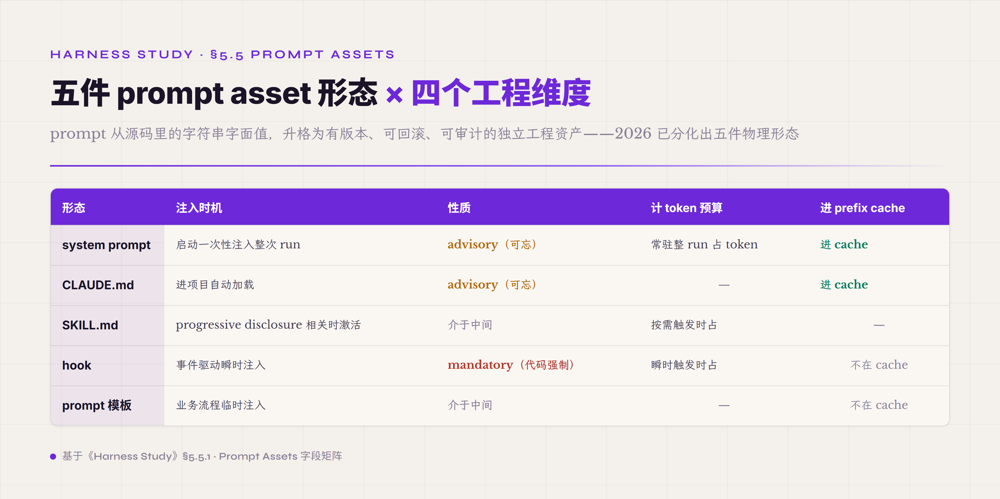
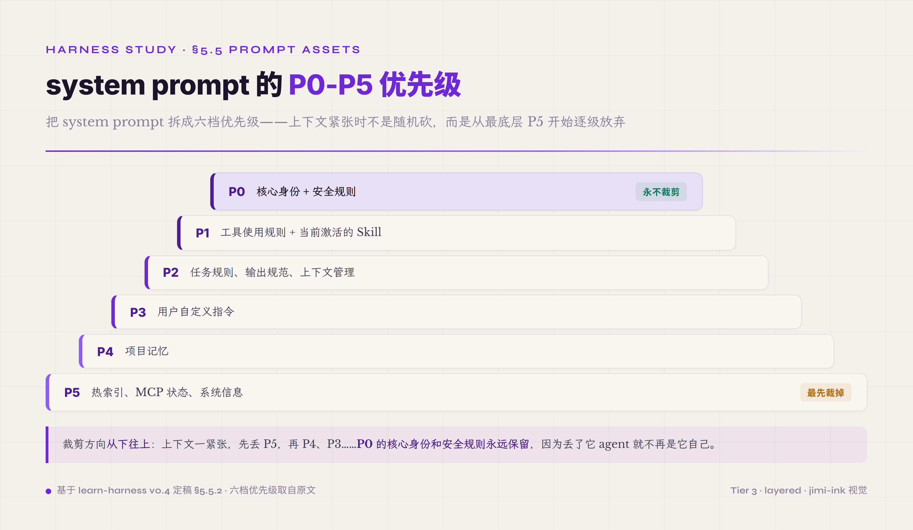

# 5.5 Prompt Assets · Instruction Layer · **P0**

第五件机制是 agent 拿到的"指令性内容"——也就是模型从 prompt 里读到的一切非用户消息内容：角色定位、任务约束、工具说明书、输出规范、业务规则、错误处理提示、agent 当前所在项目的 context、能调用的 Skill 列表、即将触发的 hook 等等。前面讨论 Tool Registry 时点过一条规律——工具 description 是单点 ROI 最高的优化。这条规律往外扩一格就到了这一节的根本论点：整个 harness 给 agent 的所有指令性内容（system prompt、tool description、hook 注入、Skill 加载、错误返回的解释、工作区 README 等等）都需要按工程资产管理——拥有版本号、可被回滚、可被 A/B test、可被精确审计。Prompt Assets 这一机制命名的内在来由就在这里：把指令性内容从源代码里的字符串字面值升格为独立工程对象，这件升格本身就是 prompt 工程治理的起点。

prompt 在 2026 年被单独抽出来作为一类工程资产管理，根因有两层相互叠加的工程压力。第一层来自杠杆效应——同一个模型同一套工具，仅仅改一句 system prompt 就可能让任务通过率出现以十个百分点计的波动。一个有这么大效果系数的工程对象，如果它的物理形态只是源代码里散落的字符串字面值，产品质量就要承受"哪个工程师最后碰过这段字符串"的随机性；在十人以上协作场景里这种随机性会被各种 merge 路径放大成难以溯源的回归。第二层来自审计需求——hard-code 形态的 prompt 改完没有留痕：什么时间改的、谁改的、为什么改、改完前后 agent 行为差异如何，这些问题在源代码字面值的承载形态里都没有答案。把 prompt 抽到独立的 asset 载体之后，这四个问题立即有了对应的工程机制承接——每次改动进版本管理、每次部署走 A/B test、每次回归能秒级回滚到上一版本。两层压力合起来推动 prompt 从源代码内嵌字符串脱离出去成为一个独立工程对象，这件升格的内核是工程治理对象变了——prompt 从"代码顺手写的辅助物"被识别为"需要独立生命周期管理的资产"。

prompt asset 在 2026 业界已经分化出五件相对稳定的物理形态。**第一件是 system prompt**——最经典的一件，agent 启动时注入模型 context 顶端，包含角色定位、任务约束、工具说明书、输出规范四件套。**第二件是 CLAUDE.md / AGENTS.md** 这一类项目级 context file——Anthropic 2024 推出 / 2026 已成行业事实标准，agent 每次进新项目时读一份"项目说明书"，内容是 advisory 性质（agent 可能忘）不是 mandatory。**第三件是 SKILL.md** 这种 skill 包格式——Anthropic 2025-10 初版推出、2025-12-18 升级为 open standard，至 2026-03 已被 32 个工具采纳（Claude Code / OpenAI Codex / Cursor / VS Code / Gemini CLI / Kiro / Goose 等），progressive disclosure 三层加载（name 加 description 启动加载约 100 token 每 skill / 完整 SKILL.md body 激活才加载推荐 ≤5K token / 支持文件按需 explicitly 引用才加载）。**第四件是 hook 注入**——deterministic callback 不依赖模型记忆，PreToolUse / PostToolUse / SessionStart 等十几种 lifecycle event 在精准时刻由代码强制把规则注入对话流，跟 CLAUDE.md 的 advisory 性质相反、是 mandatory 强制执行。**第五件是 prompt 模板**——业务规则、错误消息、用户提示等通用 prompt 片段，按用途分类（prompt family）作为 SDK / 配置层资产管理，支持模板变量替换 加 版本化 加 A/B testing（Maxim AI、LangSmith、PromptLayer、Promptfoo、Langfuse 等平台 2026 已普及）。

五件物理形态背后有一条共同设计哲学——**写给 agent 不写给人**。这条原则在 §5.3 ACI 设计学已经讲过一次——工具描述、工具命名要按 agent 认知不按人认知。同样的原则适用于这五件 prompt asset：prompt asset 设计时不能把"工程师读懂"当达标——一段 prompt 工程师读起来"清楚明白"，但 agent 跑下来发现误读、忽略、不知道触发条件，这段 prompt 就是失败的。判定标准应该是 agent 跑 trajectory 实测——加这段 prompt 前后 agent 行为有没有按预期变化。这条原则跟 §5.3.9 讲的"description 写给 agent 不写给人"是同一条原则在不同 prompt asset 类型上的应用，不重新论证。

prompt asset 这一机制跟其他 harness 件不是平行关系是渗透关系。tool description 本质上是 Tool Registry 里嵌的一类 prompt asset，Skill 是 Tool Registry 加 Memory 加 prompt asset 三件耦合的复合体，hook 是 prompt asset 跟 Safety 控制面共用的工程载体，Adapter 决定 prompt asset 在 wire 层的具体编码（OpenAI 格式跟 Anthropic 格式细节不同）。Prompt asset 单独抽成一件 P0 机制是因为"指令性内容"的资产化治理本身有独立工程价值——不抽出来就会散落到各个 harness 件里没人统一管。后面几个子节按"五件物理形态对比 → 设计原则 → 版本化跟 A/B test → 多语种多场景 → 反 prompt-injection → 常见误区 → 业界实现对照 → 起步建议"八步展开。

#### 5.5.0 本节首次出现的术语

§一-§四 / §5.1-§5.4 已经解释过的术语（schema / system prompt 概念 / tool description / hook 概念 / Skill 概念 / function calling / trajectory / ACI 等）下面不再重复。这里只列 §5.5 本节首次出现的术语。

**prompt asset 工程术语** —— **prompt asset**（把 prompt 当资产管理 · 有版本 / 有所有者 / 有 A/B test / 有 rollback / 有 retrieval · 跟 hard-code prompt 的根本差别是把"指令性内容"从代码里抽出来作独立工程对象 · 2026 业界事实标准）。**prompt family**（按用途分类的 prompt 集合 · 比如"工具调用前提醒"family / "错误恢复"family / "结果聚合"family · 每个 family 内部有多个 variants 配合 A/B test）。**hard-code prompt**（写死在代码里的 prompt 字符串 · prompt asset 的反例 · 改一次要发新版本 · 没有 A/B test / 没有 rollback / 没有 retrieval · 是早期 agent 工程的默认做法）。

**prompt asset 物理形态术语** —— **CLAUDE.md / AGENTS.md**（项目级 context file · Anthropic 2024 推出 / 2026 行业事实标准 · agent 每次进项目时读一份"项目说明书" · 包含 tech stack / 入口 / naming / commands / 常见坑 / 风格偏好 · advisory 性质 agent 可能忘 · 跟 hook 的 mandatory 性质相反）。**SKILL.md frontmatter**（YAML 元数据头 · 必填 name 最多 64 char 加 description 最多 1024 char · 选填 license / compatibility / metadata / allowed-tools · 是 progressive disclosure 三层加载的最顶层）。**Agent Skills open standard**（Anthropic 2025-12-18 发布的 open spec · 至 2026 已被 32 个工具采纳含 Claude Code / OpenAI Codex / Cursor / VS Code / Gemini CLI / Kiro / Goose · 定义 SKILL.md 文件结构 / 元数据格式 / 指令格式 / 支持文件目录 / progressive disclosure 加载机制）。**progressive disclosure**（按需加载减 context bloat · 三层结构：metadata 启动加载约 100 token 每 skill / 完整 body 激活才加载推荐 ≤5K token / 支持文件按需 explicitly 引用才加载 · 让一个 agent 装 50 个 skill 也只要约 5K token 启动开销）。**hook**（deterministic callback 不依赖模型记忆 · 在 lifecycle 事件触发时由代码强制执行的规则注入 · Claude Code 公开十几种 lifecycle event（PreToolUse / PostToolUse / UserPromptSubmit / SessionStart / Stop / SubagentStop / Notification 等 · 随版本持续增加）· 跟 CLAUDE.md 的 advisory 性质相反 · 是 mandatory 强制执行）。

**prompt 工程纪律术语** —— **system prompt 衰减**（长对话后开头规则被模型忽略 · 跟 lost-in-the-middle 同源 · agent 跑十几轮二十几轮之后开头那段规则模型基本就忘了 · 是反对"业务规则全堆 system prompt"的核心机制理由）。**调用前注入**（业务规则不写 system prompt 而做成"模型即将调用某工具时即时注入结构化提醒" · 利用模型对"当下要做的具体事"的注意力远高于"系统级抽象规则" · §5.3.5 已讲过 PolicyRegistry 在 Tool Registry 层的实现 · 本节讲它作为 prompt asset 的工程纪律 · 两面是同一件事）。**prompt 版本化**（每次 prompt 改动进版本管理 · 支持 A/B test / canary release / gradual rollout / automatic rollback on quality degradation · 2026 业界平台 Maxim AI / LangSmith / PromptLayer / Promptfoo / Langfuse 都做这件事）。**prompt injection**（恶意输入注入指令 · 通过 tool output / user message / RAG retrieval 等通道把恶意 prompt 塞进 agent context · 让 agent 执行原本不该执行的动作 · 是 §5.9 Safety 控制面的核心议题之一 · 本节讲 prompt 层的防御纪律）。**few-shot examples**（嵌入 prompt 给模型示范 · 让模型从例子里学习预期输出形态 · 比文字描述更有效 · 是 prompt asset 设计中提升 agent 行为稳定性的常用工程手段）。

#### 5.5.1 五件物理形态对比

章首已经点出五件物理形态——system prompt、CLAUDE.md、SKILL.md、hook、prompt 模板。这一段把它们在工程维度上的差异讲清楚，让读者能选哪件用哪件。

五件形态有四个工程维度可以对照看。**第一是注入时机**：system prompt 是 agent 启动时一次性注入、整次 run 跟着走；CLAUDE.md 跟 SKILL.md 也是常驻型但更接近"按需激活"（CLAUDE.md 在进项目时自动加载 / SKILL.md 通过 progressive disclosure 三层只在相关时激活完整内容）；hook 是事件驱动的瞬时注入（PreToolUse 触发时把规则塞进对话流）；prompt 模板是按业务流程展开时的临时注入（错误恢复模板 / 用户提示模板等）。**第二是性质**：system prompt 跟 CLAUDE.md 是 advisory 性质（模型可以忘 · 长 context 衰减后会被忽略），hook 是 mandatory 性质（代码强制执行 · 不依赖模型记忆），SKILL.md 跟 prompt 模板介于中间。**第三是是否计算 token 预算**：常驻的 system prompt 整次 run 都在占 token · 按需的 Skill 跟瞬时的 hook 注入只在触发时占 token。**第四是是否进 prefix cache**：稳定前缀部分的 system prompt 跟 CLAUDE.md 进 cache 拿命中率收益 · 动态注入的 hook 跟模板因为位置不稳定一般不在 cache 范围内。

*图 5.14 · Prompt Asset 五件物理形态的四维对照*

真正交付到生产的 prompt asset 不是一段写死的字符串常量，而是按优先级拼装的片段集合。本教程作者自己写的 agent prompt 集把 system prompt 拆成 P0 到 P5 六个优先级、十二类片段——P0 是核心身份加安全规则，永不裁剪；P1 是工具使用规则加当前激活的 Skill；P2 是任务规则、输出规范、上下文管理；P3 是用户自定义指令；P4 是项目记忆；P5 是热索引、MCP 状态、系统信息，最先被裁掉。这种结构让 prompt 在上下文紧张时按价值放弃低层片段而不是从尾巴上无差别截断，核心身份和安全规则不会因为上下文挤压而丢失。

*图 5.15 · system prompt 六档优先级 P0–P5 与裁剪顺序*

把 prompt asset 等同于"system prompt 文件"是窄化。同一套 prompt 工程纪律实际上同时管三种形态：常驻型的 system prompt 片段，按相关性激活的 Skill，按事件触发的 hook 注入。Anthropic 2025-10 公开的 Skills 规范规定 SKILL.md 必须有 frontmatter 头（name 加 description 两个必填字段），正文写 Overview 跟 Usage。hook 的物理形态则是配置文件里的事件块——Claude Code 的 hook 体系覆盖十几种 lifecycle event（PreToolUse、PostToolUse、UserPromptSubmit、Stop、SubagentStop、SessionStart、SessionEnd、PreCompact 等 · 随版本持续增加），每个事件挂一组 matcher 加 action。这三种形态本质都是把指令外置成文件，差别只在哪个时机注入。

#### 5.5.2 设计原则 · 写给 agent 不写给人

prompt asset 的第一原则是写给 agent 看的不是写给人看的。同一句"认真做事，全面思考"，给人看是动员口号，给 agent 看是纯浪费 token。每一轮调用 prompt 都进入 context 窗口跟工具描述、对话历史、工具结果争抢空间，业界普遍把 15% 以内当不管、50% 当警戒、70% 当该压缩、90% 当临崩盘——这意味着 prompt 里每一个无信息量的句子都在挤压核心规则的注意力。所以 prompt asset 必须可执行、可验证、可拆分到具体片段；只描述态度不给行为的"保持好奇心 / 不要焦虑"一类指令在 agent prompt 里就是负资产。

第二条设计原则是不要信任模型的记忆力但信任模型的推理力。把"取消订单前必须检查四个条件"写在 system prompt 一开始，模型在五十轮工具调用之后大概率会忘——不是模型偷懒，是固定位置的长指令在长 context 里注意力自然衰减。正确做法是把这条规则做成 hook：检测到模型即将调用 cancel_reservation 工具的那一刻再注入一条临时提醒，列出四个条件。这相当于柜员按"转账"按钮之前系统弹一个合规确认框，而不是入职培训时讲一遍就完事。这条纪律推到极致就是一句话：system prompt 是起跑线不是终点线，越是关键的业务规则越要在调用前注入而不是在 prompt 头部多写两遍。这条原则跟 §5.3.5 讲的 PolicyRegistry 调用前注入是同一件事的两面——那一段从 Tool Registry 视角讲、这一段从 prompt asset 视角讲。

这两条原则合起来界定了 prompt asset 工程跟一般 prompt template 教学之间的工程层次差。prompt template 教学的着眼点是在一段文字里如何用更准确的措辞引导模型——它假设 prompt 是一段静态文字，关注的是文字本身的清晰度、举例方式、术语选择。prompt asset 工程把同样的问题切换了一格——它假设 prompt 是一组分布在不同载体上的指令片段，关注的是哪一条规则该挂在哪一种载体上才不被 context 衰减、不被覆盖、不被模型忘掉。两件事不在同一层优化：前者优化语义传递效率，后者优化指令在系统中的稳定性跟可治理性。

#### 5.5.3 版本化跟 A/B 测试

prompt 一旦当成 asset 管，版本化跟 A/B 测试就自然变成 P0 工程能力。2026 业界平台已经分化出一批专门做这件事的工具——Maxim AI、LangSmith、PromptLayer、Promptfoo、Langfuse——核心能力都包括环境分层部署、canary release、gradual rollout、自动 rollback on quality degradation。意思是 prompt 改动可以像代码改动一样走 CI、上灰度、出问题秒回滚。但这些平台只是基础设施，真正的工程纪律比"上一个版本化平台"严格得多。

prompt 版本化的工程纪律比"git 多分支"严格得多。第一条规则是 report 只存 hash 不存原文——任何对外可见的 run 报告只记录 system_prompt_hash、system_prompt_chars、prompt_family 三个字段，原文留在私有目录或加密制品库。这既避免 prompt IP 在公开报告里泄露，也避免 git diff 在几千字的 prompt 上做无意义对比。第二条是 prompt family 切换必须发生在 run 或 profile 边界，不能在同一 run 的 turn 之间偷偷改——一旦改了 stable prefix，prefix cache 命中率立刻坏掉，对照实验数据也同时被污染，看起来是 prompt 调优实际是基础设施漂移。把这两条纪律落到位，prompt 才能进入跟 model checkpoint 同级的实验对照体系。

A/B 测试 prompt 还有一条容易被忽略的方法论纪律——必须有 trajectory 级别的对照评测不只是输出级别的对照。换 prompt 后 agent 可能输出看起来差不多，但调工具的顺序、参数选择、错误恢复路径都不一样——这些 trajectory 级别的差异在长 horizon 任务里会累积放大。所以 prompt A/B test 不只看任务通过率，还要看 trajectory 形态（工具调用次数 / 失败率 / 总 token / cache hit / 决策点分布）的多维对照。

#### 5.5.4 多语种 / 多场景 prompt 抽象

agent 上 production 之后会撞到两个工程问题——多语种支持跟多场景切换。两者的工程纪律有相同有不同。

多语种 prompt 工程有两条主流路径。**第一条是每语言一份独立 prompt**——中文 system prompt 一份、英文 system prompt 一份、日文一份、各自维护各自版本。优点是每份 prompt 都可以做语言习惯的细化（中文 prompt 用中文标点跟句式 / 英文 prompt 用英文 idioms），缺点是核心规则跨语言保持一致变得困难——改一条核心规则要在 N 份 prompt 里都改一遍且语义对齐，工程负担随语言数线性涨。**第二条是 anchor 加 per-language tail**——把跨语言不变的核心规则（身份 / 安全 / 工具使用纪律）抽成一份 anchor，每种语言只维护一段 per-language tail（语言习惯 / 用户称呼 / 时区 / 货币符号等）。优点是核心规则只在 anchor 里维护一份，缺点是 per-language tail 跟 anchor 拼接时上下文衔接可能不自然，需要 prompt engineer 额外打磨过渡句。生产 harness 多走第二条——anchor 加 tail——理由是规则一致性比表达自然度更重要。

多场景 prompt 抽象用的是 prompt family 范式。把 prompt 按业务场景分类——比如 "office RFP 响应" 是一个 family、"coding refactor" 是另一个 family、"research deep-dive" 又一个 family。每个 family 内部有多个 variant（v1 / v2 / experimental 等）配合 A/B test。Family 之间共享 anchor（agent 身份 / 安全规则）+ 各自维护场景特化的 tail（任务约束 / 输出规范 / 工具子集）。family 切换发生在 run 入口处——根据用户任务类型 routing 到对应 family，不在 run 中间切换。这条切换边界纪律跟前面 §5.5.3 讲的"family 切换必须在 run 或 profile 边界"是同一件事。

#### 5.5.5 反 prompt-injection 在 prompt 层的纪律

prompt injection 是 §5.9 Safety 控制面的核心议题之一——攻击者通过 tool output、user message、RAG retrieval 等通道把恶意指令塞进 agent context，让 agent 执行原本不该执行的动作。完整的 prompt injection 防御要跨 Adapter / Tool Registry / Memory / Artifact 多层做，§5.9 会展开。这一段只讲 prompt asset 这一层能做的事——出口侧清洗跟历史侧纪律两条。

反 prompt-injection 不只是过滤用户输入。同样重要的是出口处的 prompt 清洗——如果对话的另一端也是 LLM（评测里的 user simulator、流水线里的下游 agent、做总结的 reviewer），agent 输出里的 thinking 块跟 tool_call 标签必须剥离。τ-bench 实战记录显示曾经出现过 user simulator 回复变怪的现象，原因是 adapter 把 agent 的原始文本直接传过去没剥离推理前缀，simulator 把 chain-of-thought 当成回复内容读，对话立刻偏离正常轨迹。解法是在 agent 输出跟下一个 LLM 之间加一层清洗函数，剥离推理前缀加 `<tool_call>` 残留标签——这就是消息可见性边界，本质上是 prompt 在出口侧的版本化。

同一条出口侧的纪律推广到对话历史就是：tool_call 跟 tool_result 必须保持结构化配对，绝对不能在历史里出现"我读取了文件，内容是..."这种文字描述。一旦工具调用在压缩或清洗过程中被降级成文字，模型在后续轮次里会开始伪造工具执行结果——它从历史里学到的模式是"工具操作可以用文字描述"，于是下一轮跳过工具直接编"我刚刚执行了 X，结果是 Y"。所以压缩 prompt 必须有一条绝对禁止：tool_call 跟 tool_result 要么完整保留，要么整对删除，绝不可用文字替代。这是对话历史作为隐式 prompt 的版本化纪律。

这两条纪律合起来定义了 prompt asset 的边界处理——出口侧剥离推理给下游、历史侧保持工具调用结构化。任何一条破了，agent 在多轮对话或多 agent 协作里都会出现"伪造执行""幻觉证据""结果污染"等隐性 bug，且很难追根。

#### 5.5.6 常见误区 · 业务规则全堆 system prompt

prompt asset 这一机制最常见的误区是把所有业务规则堆进 system prompt。结果 prompt 越写越长，关键规则越埋越深，模型忘得越来越快。一个广为流传的 τ-bench 实战教训：模型连续四次调用 book_reservation 工具失败，原因是字段名错——用了 baggages 不是 total_baggages，用了 travel_insurance 不是 insurance。修复路径不是在 system prompt 里多写一段"请注意字段名"，而是把字段名加类型加枚举值直接写进工具 description。同样一句"用 total_baggages"，写在 system prompt 里模型五十轮后就忘，写在工具 description 里每次工具调用前都看见。这条经验背后是更普遍的工程定律：指令该挂在最接近它生效场景的载体上，工具规则进工具 description，业务策略进 hook 注入，长期身份进 system prompt。

机制层面这件事怎么发生？通常是开发期"防御性写作"——工程师每次撞到一个 bug 就在 system prompt 里加一段"如果遇到 X 请...如果遇到 Y 请..."。半年后 system prompt 从几百字长到几千字。每条规则单独看都合理，合起来就是稀释——模型在五十轮对话之后开头那段规则基本忘掉一半，加更多规则只会让 prompt 更长、衰减更快、形成恶性循环。

这条规律落到可操作层面，比"绝对字符数"更准的判定维度有三个。最实用的一条是按比例占用——经验上把 system prompt 控制在总 context 窗口的一个较小比例（个位数百分点量级）以内比较安全。这条按比例的标准跟上下文窗口规模自动适配：上下文窗口越大、能容纳的常驻指令绝对量越高，不会因为模型上下文升级就要重新定字符阈值。第二条是按位置注意力——模型对 prompt 开头跟末尾的注意力远高于中段（lost-in-the-middle 现象），同一条规则放 system prompt 开头跟埋在 system prompt 中段，被遵守的概率有显著差距。第三条是按指令数累积——业界量化研究普遍记录到 prompt 越长、注意力被稀释得越厉害：超过几千 token 后准确率开始下滑、过长 prompt 倾向给出更笼统的回答（"Same Task, More Tokens" 等研究在 input 几千 token 量级就观察到 reasoning 能力下降），规则数累积到一定程度会出现"指令稀释"现象。三条维度任一条撞线都说明继续往 system prompt 加规则已经进入负 ROI 区间——正确的工程动作不是改写已有规则措辞或拼更长 prompt，而是把新增规则迁移到 hook 注入或工具 description 这种调用前精准注入的载体上。这三条维度都跟模型能力跟上下文窗口规模耦合，没有一个跨模型通用的固定字符数阈值——具体到自己的 harness，可以按"system prompt token 数 / 当前模型 context 窗口"算占比作为定期审查项。

还有一件跟 prompt asset 工程纪律配套的常见误区——**Schema Coupling · 规则 + 测试 fixture + verifier 三件强耦合**。这件常见误区机制层面是 prompt 里的 output schema / 数据字段名 / 工具调用 schema 跟下游 fixture 跟 verifier classifier 三件硬连——其中任一件改动 · 另外两件跟着崩 · 而且崩得无声（pass rate 反转 / verifier pass 但实际错 / classifier 把 code 当 docs）。本教程配套实现项目 2026-05-10 跑出过一个具体案例—— v4-holdout-20.json scenario 跟 classifier 共动 · 60% pass rate 直接反转到 75-87% · 之前一周的 ablation 数据全部要重跑。机制级原因是 prompt schema 改动没有对应的回归测试套件——schema 是隐式契约 · 改动跨多个组件但 verifier 无法发现。业界系统化讨论这件事的 paper 是 AHE[^ahe-2026] schema 稳定性段——schema 稳定性是 agent harness 长期演化的硬约束 · 改 schema 必须配套改 fixture + classifier + verifier 三件 · 不能只改一处。这件常见误区跟"调几百本提示词"这类把 prompt 当万能调节器的误区同源——每改一档都希望靠 prompt 兜底 · 实际上是把 schema 隐式契约推到 prompt 层 · 让 prompt 越改越长 + 工程治理越来越难。判定线：每改一次 prompt schema · 先列出依赖这件 schema 的下游组件（fixture / verifier / classifier 等）· 每一件都跑回归测试 · 跨 release 看 pass rate 漂移——漂移显著说明 schema coupling 严重 · 需要 schema 显式契约化（前面 §5.4 Artifact Store 那种）。

#### 5.5.7 业界实现对照

业界目前已经收敛到一组公开的 prompt asset 形态。CLAUDE.md 管项目级常驻指令——把项目命名规则、构建命令、风格偏好写在仓库根目录的一份 markdown 文件里，agent 启动时自动加载。SKILL.md 管按相关性激活的能力片段——文件头带 frontmatter（name 加 description 必填字段），文件正文写 Overview 跟 Usage，agent 在用户意图匹配上时把整份 SKILL.md 注入 context。settings.json 里的 hooks 块管事件触发的指令注入——以 event 字段（PreToolUse、PostToolUse、UserPromptSubmit、Stop、SessionStart 等十几种 lifecycle event）加 matcher 加 action 三段定义。这三种形态共同构成一套从常驻到按需到瞬时的 prompt 资产体系。

跨产品对照来看，几家主流 harness 走的路径相通但物理形态有差异。**Anthropic 的 Claude Code** 走 CLAUDE.md 加 SKILL.md 加 settings.json hook 三件套——CLAUDE.md 跟 SKILL.md 是 markdown 文件、hook 在 settings.json 配置。**OpenAI 的 Codex CLI** 2026 已采纳 Agent Skills open standard 支持同样的 SKILL.md 格式。**Cursor** 走 .cursorrules 跟 Cursor Rules 格式管项目级指令。**LangChain** 的 prompt templates 走 LangSmith 平台管 prompt versioning。**Letta** 的 system memory blocks 走 agent 自管的 memory blocks（agent 可以调 tool 改自己的 system prompt 内容）。这五条路径在物理介质上不同但工程哲学相通——都把 prompt 从 hard-code 字符串升级成 asset，都支持版本化、A/B test、按相关性激活。

业界还有两个反例值得标出来作警示。一端是 prompt-only ——只靠 prompt 描述工具用法、五个以上工具互相重叠、没有 trajectory 评测，上线之后只能等用户报告 bug。另一端是 over-framework——直接上 LangGraph 全套但不理解 ReAct loop，框架的抽象层反而挡住了对真实问题的认知。Vercel 2026 公开案例显示，他们把 text-to-SQL agent 的 16 个专用工具换成单一 bash 加文件系统能力，成功率从 80% 升到 100%、token 少 40%、响应快 3.5 倍——工具数本身就是隐式的 prompt 长度，减少工具数本身就是 prompt 减负。两个反例放一起说明 prompt asset 工程的着力点不在"做得多"而在"挂得准"。

#### 5.5.8 起步建议 · 四维度

**注意什么**——prompt asset 工程最大的坑是开发期把 prompt 当代码里的常量写、上线后才意识到 prompt 是 agent 行为的最大杠杆。从 day 1 就把 prompt 抽出成 markdown 或 YAML 文件、走版本管理、不要直接写在源代码里。两端常见误区都要避——prompt-only（不做工具、eval、observability 只靠 prompt 写得漂亮）跟 over-framework（直接上重型 framework 但不理解底层 ReAct loop）都会让 agent 跑不出预期。system prompt 撞线 §5.5.6 三条判定维度任意一条还在加规则就是已经走错路——继续加是负 ROI，应该改为迁移规则到 hook 或工具 description。

**怎么设计**——五件物理形态各有用武之地：长期身份跟安全规则进 system prompt（永不裁剪的 P0 片段），项目级 advisory 信息进 CLAUDE.md（agent 自动加载），按相关性激活的能力进 SKILL.md（progressive disclosure 三层 ≤5K token），事件触发的强制规则进 hook（PreToolUse 调用前注入），业务流程模板进 prompt 模板（配合变量替换跟 A/B test）。设计时多语种走 anchor 加 per-language tail 模式（核心规则一致 + 语言习惯特化）、多场景走 prompt family（每场景一个 family + 多 variant 配合 A/B）、切换发生在 run 或 profile 边界不在 turn 中间切。

**怎么测试**——A/B 测试 prompt 不只看任务通过率还看 trajectory 形态（工具调用次数 / 失败率 / 总 token / cache hit / 决策点分布）的多维对照。MRR（mean reciprocal rank）跟 task completion rate 是两层不同评测——MRR 看检索准确性、task completion 看端到端任务能不能完成，prompt 改动要在两层都验证。reference baseline 跟 ablation 是更深的方法论——同一任务跟同一组 baseline prompt 跑、看变体相对 baseline 的提升 / 退化 / 不变三种情况，跨 run 用同一 random seed 跟同一组 task 保证可比性。

**写什么 prompt**——这一节本身就是 meta-prompt 设计指南，但具体到 agent 自己的 system prompt 该写什么，建议三件事。第一，**显式告诉 agent 自己当前用的什么 prompt asset 体系**——"你有 5 个 Skill 可激活、3 类 hook 会在工具调用前后触发、tool description 是当前工具调用的权威说明"。让 agent 知道 harness 的能力地图。第二，**显式告诉 agent 不要相信自己的记忆**——"长对话后忘掉开头规则是正常的，重要规则会通过 hook 在调用前再提醒"。让 agent 不为遗忘焦虑。第三，**显式告诉 agent 怎么跟历史共处**——"历史里的 tool_call 跟 tool_result 配对是真的，不要伪造工具执行结果，需要新结果就主动调工具"。让 agent 跟自己的对话历史保持诚实。这三条 prompt 跟前面 §5.5.1-§5.5.7 讲的工程纪律配套——工程纪律保证 prompt asset 体系本身可靠，agent prompt 让 agent 懂得用这套体系。

这一机制经常被读者第一眼归类成"写 prompt 的细节技巧"，但当一个 agent 系统从 demo 阶段进入 To B production 阶段时，它真实的位置才显出来：把 prompt 从源代码里的字面值升格为可工程治理对象的那一道工程门槛。版本管理、A/B test、灰度发布、自动回滚这套工业级运维流程都需要 prompt 拥有独立的工程身份才能挂载上去——以字面值形式散落在源代码里的 prompt 没有这个身份，也没有任何运维流程能挂载的接口。Prompt Assets 在八件 runtime 机制里排到 P0 的根本原因就在这里——一个 agent 系统能不能进入工业级运维流程，由这一机制是否到位决定。

#### 业界归位卡片 · §5.5 涉及的实现层

Prompt Asset 这件抽象功能在 2026 业界主流被这几个技术覆盖——

| 业界名字 | 在 §5.5 是什么 |
|---|---|
| **system prompt**（厂商内置） | LLM 启动注入 · 模型族 hardcode · 永不裁剪 |
| **CLAUDE.md / .cursorrules / AGENTS.md** | 项目级 prompt asset · startup 自动加载 |
| **Anthropic Agent Skills open standard（SKILL.md frontmatter）** | Prompt asset 三层加载模式——metadata 前置 + body 激活加载 + 支持文件按需引用 · progressive disclosure ≤5K token |
| **hook（Claude Code / OpenCode / settings.json）** | 调用前 / 调用后注入 · prompt asset 的动态形态 · 也常做 §5.9 Safety check |
| **few-shot examples** | inline prompt asset · 写在 user message 里 |
| **LangChain prompt templates / LangSmith** | prompt 版本化管理平台 · 支持 A/B test |
| **Cursor Rules format** | 项目级 prompt asset · IDE 内嵌 |

这几件都在解决"指令资产怎么组织 + 什么时机注入"——属于 §5.5 Prompt Assets 这件的**物理形态层**。**Skill 是 prompt 资产的组织模式 · 不是件**——Anthropic 2025-10 推出 Skills、2025-12-18 升级为 Agent Skills open standard，是把这套模式标准化 · 但本质还是 Prompt Asset 件的一种物理形态。完整反向查表见 §99 附录 §D。

---

## 引用脚注

[^ahe-2026]: Agentic Harness Engineering: Observability-Driven Automatic Evolution of Coding-Agent Harnesses · arxiv 2604.25850 · Lin / Liu / Pan 等（复旦 + 北大 + 奇绩智峰 11 人）· 2026 · 预印本
