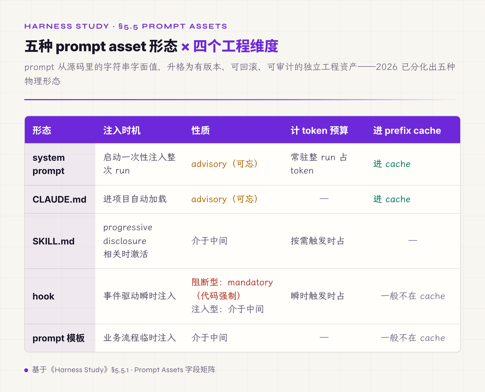
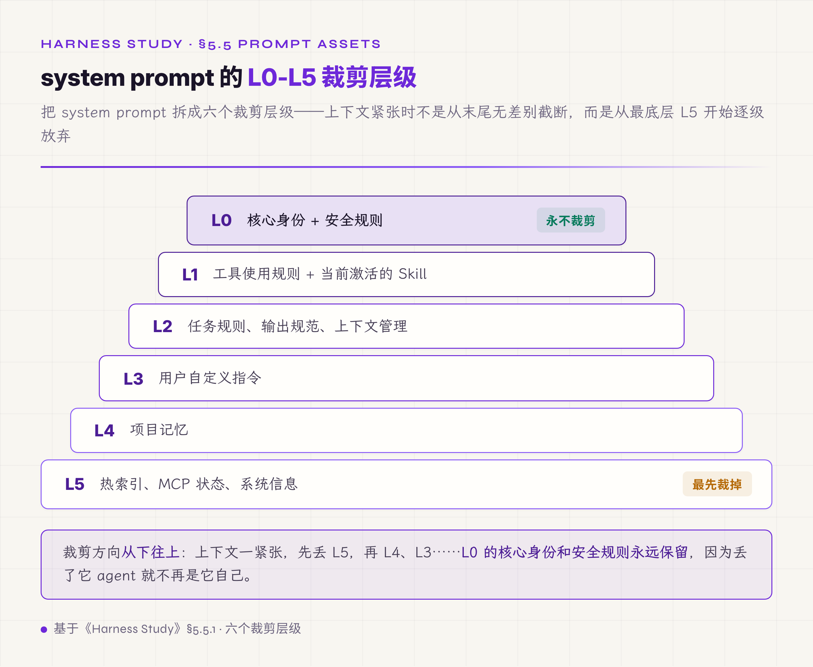

# 5.5 Prompt Assets · Instruction Layer · **P0**

第五个机制管的是 agent 拿到的"指令性内容"，也就是模型从 prompt 里读到的一切非用户消息内容：角色定位、任务约束、工具说明书、输出规范、业务规则、错误处理提示、agent 当前所在项目的背景信息、能调用的 Skill 列表、即将触发的 hook 等等。§5.3 讨论 Tool Registry 时提到过一条规律：工具 description 是单点投入产出比最高的优化。这条规律再往外推一步，就是这一节的根本论点：harness 给 agent 的所有指令性内容（system prompt、tool description、hook 注入、Skill 加载、错误返回的解释、工作区 README 等）都需要按工程资产管理，有版本号，可以回滚、做 A/B 测试、精确审计。Prompt Assets 这个名字就是这么来的：把指令性内容从源代码里的字符串字面值，升格为独立的工程对象。这一步本身就是 prompt 工程治理的起点。

prompt 被单独抽出来作为一类工程资产管理，根因是两层互相叠加的工程压力。

- **杠杆效应。** 同一个模型、同一套工具，只改一句 system prompt，任务通过率就可能出现以十个百分点计的波动（作者经验观察）。效果系数这么大的工程对象，如果它的物理形态只是源代码里散落的字符串字面值，产品质量就要承受"哪个工程师最后碰过这段字符串"的随机性；在十人以上协作的场景里，这种随机性会被各种合并路径放大成难以溯源的回归。
- **审计需求。** 写死在代码里的 prompt 改完不留痕：什么时间改的、谁改的、为什么改、改完前后 agent 行为有什么差异，这些问题在源代码字面值这种载体里都没有答案。

把 prompt 抽到独立的资产载体之后，这四个问题都有了对应的工程机制：每次改动进版本管理，每次部署走 A/B 测试，出了回归能秒级回滚到上一版本。两层压力合起来，推动 prompt 从源代码内嵌的字符串中脱离出来。这一步的实质是工程治理的对象变了：prompt 从"代码里顺手写的辅助物"，变成了"需要独立生命周期管理的资产"。

到 2026 年，prompt asset 已经分化出五种相对稳定的物理形态：

1. **system prompt**：最经典的一种，agent 启动时放在模型上下文的最前面，包含角色定位、任务约束、工具说明书、输出规范四部分。
2. **CLAUDE.md / AGENTS.md 这类项目级说明文件**：agent 每次进入新项目时读的一份"项目说明书"。CLAUDE.md 是 Claude Code 的项目说明约定，随 2025-02 的 Claude Code 研究预览出现；AGENTS.md 由 OpenAI 于 2025-08 发布，Codex、Amp、Jules、Cursor、Factory 等共同推动，2025-12 起由 Linux Foundation 旗下的 Agentic AI Foundation 托管。它们的内容是建议性的（advisory），agent 可能忘，不是强制执行的（mandatory）。
3. **SKILL.md 这种技能包格式**：Anthropic 2025-10 首次推出，2025-12-18 发布为开放标准，Claude Code、OpenAI Codex、Cursor、VS Code、Gemini CLI、Kiro、Goose 等多个工具已经支持。加载方式是渐进式披露（progressive disclosure），分三层：name 和 description 在启动时加载，每个 skill 约 100 token；完整的 SKILL.md 正文在激活时才加载，推荐不超过 5K token；支持文件只在被明确引用时按需加载。
4. **hook 注入**：由代码在确定时刻触发的回调，不依赖模型记忆。Claude Code 的 PreToolUse、PostToolUse、SessionStart 等十几种生命周期事件都可以挂 hook。hook 按作用分两类：**阻断型**由代码直接拦截或放行某个动作（例如 Claude Code 的 hook 以退出码 2 退出时，该次工具调用被阻断），这才是强制执行；**注入型**只保证在正确的时刻把规则注入对话流，模型是否遵循仍是概率性的。两类都比 CLAUDE.md 更可靠，但只有阻断型算得上强制。
5. **prompt 模板**：业务规则、错误消息、用户提示等通用 prompt 片段，按用途分类，作为 SDK 或配置层的资产管理，支持模板变量替换、版本化和 A/B 测试。Maxim AI、LangSmith、PromptLayer、Promptfoo、Langfuse 等平台都提供这类能力。

五种形态背后有一条共同的设计哲学：**写给 agent，而不是写给人**。这条原则在 §5.3 讲 ACI（智能体-计算机接口）设计时已经讲过一次：工具描述、工具命名要按 agent 的认知来写，而不是按人的认知。同样的原则适用于这五种 prompt asset。设计 prompt asset 时，不能把"工程师读得懂"当作达标：一段 prompt 工程师读起来清楚明白，但 agent 跑下来出现误读、忽略、不知道何时触发，这段 prompt 就是失败的。判定标准应该是用 agent 实际跑出的 trajectory 来测：加这段 prompt 前后，agent 的行为有没有按预期变化。这条原则跟 §5.3.9 讲的"description 写给 agent，而不是写给人"是同一条原则在不同 prompt asset 类型上的应用，这里不再重新论证。

prompt asset 跟其他 harness 机制不是平行关系，而是渗透关系：

- tool description 本质上是嵌在 Tool Registry 里的一类 prompt asset；
- Skill 在本书中归入 Prompt Assets，是 prompt 资产的一种组织方式（本节是它的主定义，见 §5.5.7 末尾）；它同时牵涉 Tool Registry（可以内嵌工具定义、按需检索）和 Artifact（存储与版本化方式与 Artifact 相同，见 §5.4）；
- hook 是 prompt asset 与 Safety 控制面共用的工程载体；
- Model Adapter 决定 prompt asset 在传输层（wire format）的具体编码，OpenAI 格式跟 Anthropic 格式的细节不同。

Prompt asset 单独抽成一个 P0 机制，是因为指令性内容的资产化治理本身有独立的工程价值：不抽出来，它就会散落到各个机制里，没人统一管。后面几个小节按八步展开：五种形态对比、设计原则、版本化与 A/B 测试、多语种与多场景、消息边界与历史完整性、反模式、业界实现对照、起步建议。

#### 5.5.0 本节首次出现的术语

§一至 §四 和 §5.1 至 §5.4 已经解释过的术语（schema、system prompt、tool description、hook、Skill、function calling、trajectory、ACI 等）下面不再重复，这里只列本节首次出现的术语。

**prompt asset 工程术语**

- **prompt asset（提示词资产）**：把 prompt 当资产管理，有版本、有负责人，可以做 A/B 测试、回滚和检索。跟写死的 prompt 相比，根本差别是把指令性内容从代码里抽出来，作为独立的工程对象。
- **prompt family（提示词族）**：面向同一类业务场景的一整套 prompt，例如"RFP 响应""代码重构""深度调研"各是一个 family（§5.5.4 详讲）。family 之间共享核心规则，各自维护与场景相关的部分；每个 family 内部有多个变体（variant）配合 A/B 测试。"工具调用前提醒""错误恢复""结果聚合"这类按功能划分的片段，是 family 内部的组成部分（多以 prompt 模板的形式存在），本书不把它们单独叫作 family。
- **hard-code prompt（硬编码 prompt）**：写死在代码里的 prompt 字符串，是 prompt asset 的反面。改一次就要发一次新版本，没有 A/B 测试、回滚和检索，是早期 agent 工程的默认做法。

**prompt asset 物理形态术语**

- **CLAUDE.md / AGENTS.md**：项目级说明文件，agent 每次进入项目时读的一份"项目说明书"，通常包含技术栈、入口、命名约定、常用命令、常见坑、风格偏好。CLAUDE.md 是 Claude Code 的项目说明约定（随 2025-02 的 Claude Code 研究预览出现）；AGENTS.md 由 OpenAI 于 2025-08 发布，Codex、Amp、Jules、Cursor、Factory 等共同推动，2025-12 起由 Linux Foundation 旗下的 Agentic AI Foundation 托管。两者都是建议性的，agent 可能忘，这一点跟阻断型 hook 的强制性相反。
- **SKILL.md frontmatter**：SKILL.md 文件开头的 YAML 元数据头。必填 name（最多 64 字符）和 description（最多 1024 字符），选填 license、compatibility、metadata、allowed-tools，是渐进式披露三层加载中的最顶层。
- **Agent Skills open standard（Agent Skills 开放标准）**：Anthropic 2025-12-18 发布的开放规范，已被 Claude Code、OpenAI Codex、Cursor、VS Code、Gemini CLI、Kiro、Goose 等多个工具支持。它定义了 SKILL.md 的文件结构、元数据格式、指令格式、支持文件目录和渐进式披露的加载机制。
- **progressive disclosure（渐进式披露）**：按需加载，减少上下文膨胀。三层结构：元数据在启动时加载，每个 skill 约 100 token；完整正文在激活时加载，推荐不超过 5K token；支持文件只在被明确引用时加载。这样一个 agent 装 50 个 skill，启动开销也只有约 5K token。
- **hook（钩子）**：在生命周期事件触发时由代码执行的回调，不依赖模型记忆。Claude Code 公开了十几种生命周期事件（PreToolUse、PostToolUse、UserPromptSubmit、SessionStart、Stop、SubagentStop、Notification 等，随版本持续增加）。按作用分两类：
  - **阻断型**：由代码直接拦截或放行动作（例如 Claude Code 的 hook 以退出码 2 退出时阻断该次工具调用），属于强制执行；
  - **注入型**：保证在正确的时刻把规则注入对话流，但模型是否遵循仍是概率性的。

**prompt 工程规则术语**

- **system prompt 衰减**：长对话之后，模型对 system prompt 里规则的遵循率下降；agent 跑到十几、二十几轮时，开头那段规则常常不再被遵守（作者经验观察）。它的机制与中段遗失（lost in the middle）相关，但并不相同。中段遗失说的是关键信息位于长上下文中部时，模型的准确率低于位于头尾时（Liu et al. 2023）；system prompt 位于上下文开头，开头这个位置本身并不吃亏。system prompt 衰减更接近上下文腐化（context rot，上下文整体变长时模型表现下降）：对话越长，中间堆积的历史越多，早先的规则离当前动作越远。这是反对"把业务规则全堆进 system prompt"的核心理由。
- **调用前注入**：业务规则不写进 system prompt，而是在模型即将调用某个工具时，即时注入一条结构化提醒，这是注入型 hook 的典型用法。它利用的是：模型对"当下要做的具体事"的注意力，通常高于对"系统级抽象规则"的注意力（经验观察）。§5.3.5 已经讲过 PolicyRegistry 在 Tool Registry 层的实现，本节讲它作为 prompt asset 的工程规则，两者是同一件事的两面。
- **prompt 版本化**：每次 prompt 改动都进版本管理，支持 A/B 测试、金丝雀发布（canary release）、渐进放量（gradual rollout），质量下降时自动回滚。Maxim AI、LangSmith、PromptLayer、Promptfoo、Langfuse 等平台都提供这类能力。
- **提示词注入（prompt injection）**：恶意内容经由工具输出、用户消息、RAG 检索结果等通道进入 agent 的上下文，让 agent 执行原本不该执行的动作。真正的防御在 §5.9 Safety 控制面；本节只讲 prompt 层与之相邻的消息边界规则（§5.5.5）。
- **few-shot examples（少样本示例）**：嵌在 prompt 里给模型的示范，让模型从例子里学到预期的输出形态，通常比文字描述更有效，是提升 agent 行为稳定性的常用手段。

#### 5.5.1 五种物理形态对比

章首已经列出五种物理形态：system prompt、CLAUDE.md、SKILL.md、hook、prompt 模板。这一段讲清它们在工程维度上的差异，帮读者判断什么内容该用哪一种。

五种形态可以从四个工程维度对照：

- **注入时机**：system prompt 在 agent 启动时一次性注入，整个 run 都在；CLAUDE.md 和 SKILL.md 也是常驻型，但更接近"按需激活"（CLAUDE.md 在进入项目时自动加载，SKILL.md 通过渐进式披露只在相关时才激活完整内容）；hook 是事件驱动的瞬时注入（例如 PreToolUse 触发时把规则塞进对话流）；prompt 模板在业务流程展开时临时注入（错误恢复模板、用户提示模板等）。
- **约束强度**：system prompt 和 CLAUDE.md 是建议性的，模型可能忘，长对话里遵循率会下降；阻断型 hook 是强制的，由代码拦截，不依赖模型记忆；注入型 hook、SKILL.md 和 prompt 模板介于两者之间，注入更有针对性，但遵循与否仍是概率性的。
- **token 预算占用**：常驻的 system prompt 整个 run 都占 token；按需的 Skill 和瞬时的 hook 注入只在触发时占。
- **能否命中提示词缓存**：位于稳定前缀里的 system prompt 和 CLAUDE.md 能进缓存、拿到命中收益；动态注入的 hook 和模板位置不稳定，一般不在缓存范围内。

*图 5.14 · Prompt Asset 五种物理形态的四维对照*

真正交付到生产的 prompt asset 不是一段写死的字符串常量，而是按优先级拼装的一组片段。本教程作者自己的 agent prompt 集，把 system prompt 拆成六个裁剪层级、十二类片段。为了不与全书的 P0 / P1 / P2 实施优先级混淆，这里记作 L0 到 L5：

- L0：核心身份加安全规则，永不裁剪；
- L1：工具使用规则加当前激活的 Skill；
- L2：任务规则、输出规范、上下文管理；
- L3：用户自定义指令；
- L4：项目记忆；
- L5：热索引、MCP 状态、系统信息，最先被裁掉。

这种结构让 prompt 在上下文紧张时按价值放弃低层片段，而不是从末尾无差别截断，核心身份和安全规则不会因为上下文挤压而丢失。

*图 5.15 · system prompt 的六个裁剪层级与裁剪顺序*

把 prompt asset 等同于"system prompt 文件"是一种窄化。同一套 prompt 工程规则实际上同时管三种形态：常驻的 system prompt 片段、按相关性激活的 Skill、按事件触发的 hook 注入。Anthropic 2025-10 公开的 Skills 规范规定，SKILL.md 必须有 frontmatter 头（name 和 description 两个必填字段），正文写概述（Overview）和用法（Usage）。hook 的物理形态则是配置文件里的事件块：Claude Code 的 hook 体系覆盖十几种生命周期事件（PreToolUse、PostToolUse、UserPromptSubmit、Stop、SubagentStop、SessionStart、SessionEnd、PreCompact 等，随版本持续增加），每个事件挂一组匹配条件（matcher）和动作（action）。这三种形态本质上都是把指令外置成文件，差别主要在注入的时机，以及阻断型 hook 多出的那一层代码强制。

#### 5.5.2 设计原则 · 写给 agent，而不是写给人

prompt asset 的第一条原则是：写给 agent 看，而不是写给人看。同一句"认真做事，全面思考"，给人看是动员口号，给 agent 看纯属浪费 token。每一轮调用时，prompt 都要进入上下文窗口，跟工具描述、对话历史、工具结果争抢空间。按上下文窗口的占用率，一个常见的经验划分是：15% 以内不用管，50% 需要警惕，70% 该压缩，90% 进入临界（经验值，按场景调整；与 §5.4 的压缩阈值对应）。这意味着 prompt 里每一句没有信息量的话，都在挤压核心规则能得到的注意力。所以 prompt asset 必须可执行、可验证、可拆分成具体片段；"保持好奇心""不要焦虑"这类只描述态度、不给行为的指令，在 agent prompt 里是负资产。

第二条原则是：不要信任模型的记忆力，但可以信任它的推理力。把"取消订单前必须检查四个条件"写在 system prompt 开头，模型在五十轮工具调用之后很可能不再遵守。这不是模型偷懒，而是长对话里早先规则的遵循率会下降（见 §5.5.0 的"system prompt 衰减"）。更好的做法是把这条规则做成 hook：检测到模型即将调用 cancel_reservation 工具的那一刻，再注入一条临时提醒，列出四个条件。这相当于柜员按下"转账"按钮之前，系统弹出一个合规确认框，而不是入职培训时讲一遍就完事。要注意这是注入型 hook：它让规则在最相关的时刻出现，提高了被遵守的概率，但不保证一定遵守；如果这四个条件可以用代码判定，就应该再加一个阻断型检查，条件不满足时直接拦下调用。把这条原则推到极致就是一句话：system prompt 是起跑线，不是终点线；越关键的业务规则，越要在调用前注入（能用代码判定的再加代码拦截），而不是在 prompt 开头多写两遍。它跟 §5.3.5 讲的 PolicyRegistry 调用前注入是同一件事的两面：那一段从 Tool Registry 的角度讲，这一段从 prompt asset 的角度讲。

这两条原则合起来，划清了 prompt asset 工程与一般 prompt 模板教学之间的层次差别。prompt 模板教学关心的是在一段文字里如何用更准确的措辞引导模型：它假设 prompt 是一段静态文字，关注文字本身的清晰度、举例方式和术语选择。prompt asset 工程换了一层看同样的问题：它假设 prompt 是分布在不同载体上的一组指令片段，关注哪条规则该挂在哪种载体上，才不会在长上下文里被稀释、被覆盖、被模型忘掉。两者优化的不是同一层：前者优化语义传递的效率，后者优化指令在系统中的稳定性和可治理性。

#### 5.5.3 版本化与 A/B 测试

prompt 一旦当成资产来管，版本化和 A/B 测试就自然成为 P0 级的工程能力。已经有一批专门做这件事的平台，如 Maxim AI、LangSmith、PromptLayer、Promptfoo、Langfuse，核心能力都包括按环境分层部署、金丝雀发布、渐进放量、质量下降时自动回滚。也就是说，prompt 改动可以像代码改动一样走 CI、上灰度、出问题秒级回滚。但这些平台只是基础设施，真正要守的工程规则比"接一个版本化平台"严格得多。

prompt 版本化的规则也比"git 多分支"严格：

- **第一条：报告里只存哈希，不存原文。** 任何对外可见的 run 报告只记录 system_prompt_hash（system prompt 文本的哈希，与 §5.10 中每轮完整 prompt 的指纹 prompt_hash 不是一回事）、system_prompt_chars、prompt_family 三个字段，原文留在私有目录或加密的制品库里。这既避免 prompt 这类知识产权在公开报告里泄露，也避免在几千字的 prompt 上做无意义的 git diff。
- **第二条：prompt family 的切换只能发生在 run 或 profile（一组固定配置）的边界，不能在同一个 run 的两轮之间悄悄改。** 一旦改了稳定前缀，提示词缓存的命中率立刻下降，对照实验的数据也同时被污染：看起来是 prompt 调优，实际是基础设施漂移。

把这两条规则做到位，prompt 才能进入跟模型检查点（model checkpoint）同级的实验对照体系。

A/B 测试 prompt 还有一条容易被忽略的方法论要求：要做 trajectory 级别的对照评测，不能只做输出级别的对照。换了 prompt 之后，agent 的输出可能看起来差不多，但调工具的顺序、参数选择、错误恢复路径都不一样，这些差异在长程（long-horizon）任务里会累积放大。所以 prompt 的 A/B 测试不只看任务通过率，还要从多个维度对照 trajectory 的形态：工具调用次数、失败率、总 token、缓存命中率、决策点分布。

版本化还缺一个常被漏掉的触发条件：**模型侧的变更**。prompt 行为漂移最大的来源，往往不是你改了 prompt，而是模型升级了。同一份 prompt 在新模型上的语气、格式遵循、工具触发率都可能漂移；云端端点静默升级时，连"换了模型"这个事实都未必有人通知你。所以 prompt asset 的元数据里要有 tested_models 字段，记录这份 prompt 在哪些模型版本上跑过回归；模型切换或端点升级时，自动触发对应 prompt family 的金标任务回归。版本化真正要锁定的是"prompt × 模型"这个组合，而不只是 prompt 文本：prompt 没动，不代表行为没动。

#### 5.5.4 多语种与多场景的 prompt 抽象

agent 上生产之后会碰到两个工程问题：多语种支持和多场景切换。两者的处理方式有同有异。

多语种 prompt 有两条主流路径：

- **每种语言一份独立 prompt。** 中文、英文、日文 system prompt 各一份，各自维护版本。优点是每份都可以按语言习惯细化（中文 prompt 用中文标点和句式，英文 prompt 用英文惯用语）；缺点是核心规则很难跨语言保持一致：改一条核心规则要在 N 份 prompt 里都改一遍且语义对齐，工作量随语言数线性增长。
- **公共锚点加各语言尾段（anchor + per-language tail）。** 把跨语言不变的核心规则（身份、安全、工具使用规则）抽成一份 anchor，每种语言只维护一段尾段（语言习惯、用户称呼、时区、货币符号等）。优点是核心规则只在 anchor 里维护一份；缺点是尾段跟 anchor 拼接时衔接可能不自然，需要额外打磨过渡句。

生产 harness 多走第二条，理由是规则一致性比表达自然度更重要。

多场景的 prompt 抽象用的是 prompt family（定义见 §5.5.0）。把 prompt 按业务场景归组：例如"办公场景的 RFP 响应"是一个 family，"代码重构"是另一个，"深度调研"又是一个。每个 family 内部有多个变体（v1、v2、experimental 等）配合 A/B 测试。family 之间共享 anchor（agent 身份、安全规则），各自维护场景相关的尾段（任务约束、输出规范、工具子集）。family 在 run 的入口处选定：根据用户的任务类型路由到对应的 family，不在 run 中间切换。这跟 §5.5.3 第二条规则说的"family 切换只能在 run 或 profile 边界"是同一件事。

#### 5.5.5 消息边界与历史完整性

提示词注入是 §5.9 Safety 控制面的核心议题之一：攻击者通过工具输出、用户消息、RAG 检索结果等通道，把恶意指令塞进 agent 的上下文，让 agent 执行原本不该执行的动作。真正的注入防御要跨 Adapter、Tool Registry、Memory、Artifact 多层做，见 §5.9。这一节讲的是 prompt asset 这一层与之相邻、但性质不同的两条规则：出口侧的消息边界，和历史侧的工具调用完整性。它们主要防的是格式污染和模型被自己的历史误导，而不是恶意注入。

消息边界不只关乎输入，出口处的清洗同样重要：如果对话的另一端也是 LLM（评测里的用户模拟器、流水线里的下游 agent、做总结的 reviewer），agent 输出里的 thinking 块和 tool_call 标签必须剥离。作者在 τ-bench 实验中观察到过用户模拟器（user simulator）回复变怪的现象：adapter 把 agent 的原始文本直接传了过去，没有剥离推理前缀，模拟器把思维链（chain-of-thought）当成回复内容来读，对话立刻偏离正常轨迹。解法是在 agent 输出和下一个 LLM 之间加一层清洗函数，剥离推理前缀和残留的 `<tool_call>` 标签。这就是消息可见性边界，本质上是 prompt 在出口侧的边界控制。

同样的出口侧规则推广到对话历史，就是：tool_call 和 tool_result 必须保持结构化配对，历史里不能出现"我读取了文件，内容是……"这种文字描述。一旦工具调用在压缩或清洗过程中被降级成文字，模型在后续轮次里会开始伪造工具执行结果：它从历史里学到的模式是"工具操作可以用文字描述"，于是下一轮跳过工具，直接编出"我刚刚执行了 X，结果是 Y"。所以压缩 prompt 必须有一条硬性禁令：tool_call 和 tool_result 要么完整保留，要么整对删除，不能用文字替代。对话历史也是一种隐式的 prompt，这是它的版本化规则。

这两条规则合起来，定义了 prompt asset 的边界处理：出口侧把推理内容剥离后再交给下游，历史侧保持工具调用的结构化。任何一条被破坏，agent 在多轮对话或多 agent 协作里都会出现伪造执行、幻觉证据、结果污染这类隐性 bug，而且很难溯源。

#### 5.5.6 反模式 · 业务规则全堆 system prompt

这个机制最常见的反模式（anti-pattern），是把所有业务规则都堆进 system prompt。结果是 prompt 越写越长，关键规则越埋越深，模型忘得越来越快。τ-bench 实验中有一个教训：模型连续四次调用 book_reservation 工具失败，原因是字段名写错，用了 baggages 而不是 total_baggages，用了 travel_insurance 而不是 insurance。修复办法不是在 system prompt 里多写一段"请注意字段名"，而是把字段名、类型、枚举值直接写进工具 description。同样一句"用 total_baggages"，写在 system prompt 里，模型几十轮后就可能不再遵守；写在工具 description 里，每次调用工具前都看得见。背后是一条更普遍的工程规律：指令要挂在最接近它生效场景的载体上。工具规则进工具 description，业务策略进 hook 注入，长期身份进 system prompt。

这个反模式是怎么形成的？通常源于开发期的"防御性写作"：工程师每碰到一个 bug，就在 system prompt 里加一段"如果遇到 X 请……如果遇到 Y 请……"。半年后，system prompt 从几百字长到几千字。每条规则单独看都合理，合起来就是稀释：五十轮对话之后，开头那段规则大概有一半不再被遵守（作者经验观察）；再加规则只会让 prompt 更长、遵循率下降得更快，形成恶性循环。

落到可操作层面，比"绝对字符数"更准的判断维度有三个：

- **按比例占用。** 经验上把 system prompt 控制在上下文窗口的一个较小比例（个位数百分点量级，经验值）以内比较安全。按比例的标准会随窗口大小自动适配：窗口越大，能容纳的常驻指令绝对量越高，不会因为模型换了更大的窗口就要重新定字符阈值。
- **按位置。** 这一条要说准确。中段遗失研究发现，关键信息位于长上下文中部时，模型的准确率低于位于开头或末尾时（Liu et al. 2023）。system prompt 本身就在上下文开头，这个位置并不吃亏；但在一份很长的 system prompt 内部，排在前面的规则和埋在中段的规则，被遵守的概率可能有差距（经验观察，因模型而异）。另外，对话越长，system prompt 里的规则遵循率越低，这是 §5.5.0 说的"system prompt 衰减"，跟中段遗失相关，但不是同一回事。
- **按指令数累积。** 一批研究记录到 prompt 越长，注意力被稀释得越厉害：输入超过几千 token 后准确率开始下滑，过长的 prompt 倾向于给出更笼统的回答（"Same Task, More Tokens" 等研究在输入几千 token 的量级就观察到推理能力下降）。规则数累积到一定程度，就会出现"指令稀释"。

三个维度中任何一个触线，都说明继续往 system prompt 加规则已经进入负收益区间。正确的做法不是改写已有规则的措辞或拼出更长的 prompt，而是把新增规则迁移到 hook 注入或工具 description 这类调用前精准注入的载体上。这三个维度都与模型能力和上下文窗口大小有关，没有跨模型通用的固定字符阈值。具体到自己的 harness，可以把"system prompt 的 token 数 / 当前模型的上下文窗口"这个占比作为定期审查项。

还有一个跟 prompt asset 配套的反模式：**Schema 耦合（schema coupling，AP16，见附录 F）**：prompt 里的 schema、测试用例与 verifier 强耦合。

- **现象**：prompt 里的输出 schema、数据字段名、工具调用 schema，跟下游的测试用例（fixture）和 verifier 分类器三者硬连在一起。任何一处改动，另外两处跟着出错，而且出错是无声的：通过率突然反转，verifier 判为通过但实际是错的，分类器把代码当成文档。本教程的配套实现项目在 2026-05 就遇到过一次：一组留出测试场景和分类器同时改动后，通过率从 60% 直接跳到 75%–87%，之前一周的消融数据全部要重跑。
- **原因**：schema 是一份隐式契约，改动会跨越多个组件，但 prompt schema 的改动没有配套的回归测试，verifier 自己也发现不了。AHE[^ahe-2026] 论文讨论过 schema 稳定性，把它当作 harness 长期演化必须守住的约束：改 schema 必须同时改测试用例、分类器和 verifier，不能只改一处。这个反模式跟"调几百版提示词"那种把 prompt 当万能调节器的做法同源：每遇到问题都指望 prompt 兜底，实际上是把 schema 的隐式契约推到了 prompt 层，让 prompt 越改越长、治理越来越难。
- **对策**：每改一次 prompt schema，先列出依赖这个 schema 的下游组件（测试用例、verifier、分类器等），每一个都跑回归测试，并跨版本观察通过率的漂移。漂移显著，说明耦合严重，需要把 schema 显式契约化（做法类似 §5.4 的 Artifact Store）。

#### 5.5.7 业界实现对照

业界已经有一组公开的 prompt asset 形态，以 Claude Code 为例：

- **CLAUDE.md 管项目级常驻指令**：把项目命名规则、构建命令、风格偏好写在仓库根目录的一份 Markdown 文件里，agent 启动时自动加载。
- **SKILL.md 管按相关性激活的能力片段**：文件头带 frontmatter（name 和 description 为必填字段），正文写概述和用法，agent 在用户意图匹配时把整份 SKILL.md 注入上下文。
- **settings.json 里的 hooks 块管事件触发的注入与拦截**：由 event 字段（PreToolUse、PostToolUse、UserPromptSubmit、Stop、SessionStart 等十几种生命周期事件）、matcher 和 action 三段定义。

这三种形态共同构成一套从常驻、到按需、到瞬时的 prompt 资产体系。

跨产品对照来看，几家主流 harness 走的路径相通，物理形态有差异：

- **Anthropic 的 Claude Code**：CLAUDE.md、SKILL.md 和 settings.json 里的 hook 三者配合，前两者是 Markdown 文件，hook 在 settings.json 里配置。
- **OpenAI 的 Codex CLI**：读取 AGENTS.md 作为项目级说明，并已采纳 Agent Skills 开放标准，支持同样的 SKILL.md 格式。
- **Cursor**：用 .cursorrules 和 Cursor Rules 格式管项目级指令。
- **LangChain**：prompt templates 通过 LangSmith 平台做版本管理。
- **Letta**：用 system memory blocks，由 agent 自己管理（agent 可以调用工具改写自己 system prompt 的内容）。

这五条路径的物理介质不同，工程思路相通：都把 prompt 从硬编码字符串升级成资产，都支持版本化、A/B 测试和按相关性激活。

业界还有两个反例值得标出来。一端是只靠 prompt：只用 prompt 描述工具用法，五个以上的工具功能互相重叠，没有 trajectory 评测，上线之后只能等用户报 bug。另一端是过度依赖框架（over-framework）：直接上 LangGraph 全套，却不理解 ReAct 循环本身，框架的抽象层反而挡住了对真实问题的认识。Vercel 2026 年公开的案例显示，他们把 text-to-SQL agent 的 16 个专用工具换成单一的 bash 加文件系统能力后，成功率从 80% 升到 100%，token 少了 40%，响应快了 3.5 倍。工具数本身就是隐式的 prompt 长度，减少工具数就是给 prompt 减负。两个反例放在一起说明，prompt asset 工程的着力点不在"做得多"，而在"挂得准"。

#### 5.5.8 起步建议 · 四个维度

**注意什么**：prompt asset 工程最大的坑，是开发期把 prompt 当成代码里的常量来写，上线后才意识到 prompt 是 agent 行为最大的杠杆。从第一天起就把 prompt 抽成 Markdown 或 YAML 文件，走版本管理，不要直接写在源代码里。两端的反模式都要避开：只靠 prompt（不做工具、评测和可观测性，只求 prompt 写得漂亮），以及过度依赖框架（直接上重型框架，却不理解底层的 ReAct 循环），都会让 agent 跑不出预期。如果 system prompt 已经触及 §5.5.6 三个判断维度中的任何一个，还在继续加规则，就已经走错了路：继续加是负收益，应该把规则迁移到 hook 或工具 description。

**怎么设计**：五种形态各有用处。

- 长期身份和安全规则进 system prompt（永不裁剪的 L0 片段）；
- 项目级的建议性信息进 CLAUDE.md / AGENTS.md（agent 自动加载）；
- 按相关性激活的能力进 SKILL.md（渐进式披露三层，正文不超过 5K token）；
- 事件触发的规则进 hook：必须保证的规则用阻断型 hook 由代码拦截，需要在正确时机提醒的规则用注入型 hook（如 PreToolUse 调用前注入）；
- 业务流程模板进 prompt 模板（配合变量替换和 A/B 测试）。

多语种走 anchor 加各语言尾段的模式（核心规则一致，语言习惯各自细化）；多场景走 prompt family（每个场景一个 family，内含多个变体做 A/B 测试）；family 的切换发生在 run 或 profile 的边界，不在两轮之间切。

**怎么测试**：A/B 测试 prompt 不只看任务通过率，还要从多个维度对照 trajectory 的形态（工具调用次数、失败率、总 token、缓存命中率、决策点分布）。如果 prompt 改动涉及检索类工具（例如 Skill 检索、文档检索），先单独评测检索质量，再看端到端任务能不能完成，两层都要验证。更深一层的方法是基线对照与消融：同一组任务用同一份基线 prompt 跑，看变体相对基线是提升、退化还是不变；为了保证可比，要固定任务集，每个配置多次采样取均值，而不是只看单次结果。

**写什么 prompt**：这一节本身就是 prompt 设计指南。具体到 agent 自己的 system prompt 该写什么，建议写三点：

1. **明确告诉 agent 当前的 prompt asset 体系**，例如"你有 5 个 Skill 可以激活，3 类 hook 会在工具调用前后触发，tool description 是当前工具调用的权威说明"，让 agent 知道 harness 的能力地图。
2. **明确告诉 agent 不要依赖自己的记忆**，例如"长对话后忘掉开头的规则是正常的，重要规则会通过 hook 在调用前再次提醒"，让 agent 不把遗忘当成异常。
3. **明确告诉 agent 怎么对待历史**，例如"历史里 tool_call 和 tool_result 的配对是真实的，不要伪造工具执行结果，需要新结果就主动调用工具"，让 agent 对自己的对话历史保持诚实。

这三点跟 §5.5.1 至 §5.5.7 讲的工程规则配套：工程规则保证 prompt asset 体系本身可靠，agent prompt 让 agent 懂得使用这套体系。

这个机制常被读者第一眼归类为"写 prompt 的细节技巧"，但当 agent 系统从 demo 阶段进入面向企业（To B）的生产阶段时，它的真实位置才显出来：它是把 prompt 从源代码里的字面值，升格为可治理的工程对象的那道门槛。版本管理、A/B 测试、灰度发布、自动回滚这套工业级运维流程，都需要 prompt 有独立的工程身份才能挂上去；以字面值形式散落在源代码里的 prompt 没有这个身份，也就没有任何运维流程能挂载的接口。Prompt Assets 在 8 个 runtime 机制里被列为 P0，根本原因就在这里：一个 agent 系统能不能进入工业级运维流程，取决于这个机制是否到位。

#### 业界归位卡片 · §5.5 涉及的实现层

Prompt Asset 这个抽象功能，目前主要由下面这些技术实现：

| 业界名字 | 在 §5.5 是什么 |
|---|---|
| **system prompt** | harness 编写的常驻指令，启动时注入，核心部分永不裁剪 |
| **CLAUDE.md / .cursorrules / AGENTS.md** | 项目级 prompt asset，启动时自动加载 |
| **Anthropic Agent Skills open standard（SKILL.md frontmatter）** | Prompt asset 的三层加载模式：元数据前置、正文激活时加载、支持文件按需引用，即渐进式披露，正文不超过 5K token |
| **hook（Claude Code / OpenCode / settings.json）** | 调用前、调用后的注入或拦截，是 prompt asset 的动态形态；阻断型 hook 也常用来做 §5.9 的 Safety 检查 |
| **few-shot examples** | 内联的 prompt asset，写在 user message 里 |
| **LangChain prompt templates / LangSmith** | prompt 版本化管理平台，支持 A/B 测试 |
| **Cursor Rules format** | 项目级 prompt asset，内嵌于 IDE |

这几项都在解决"指令资产怎么组织、在什么时机注入"，属于 §5.5 Prompt Assets 的**物理形态层**。**Skill 是 prompt 资产的一种组织方式，不是一个独立的机制。** 本书以这里为 Skill 归类的主定义：Skill 归入 Prompt Assets。Anthropic 2025-10 推出 Skills、2025-12-18 将其发布为 Agent Skills 开放标准，是把这种组织方式标准化，但它本质上仍是 Prompt Asset 的一种物理形态。Skill 也和其他机制有交叉：它可以内嵌工具定义、按需检索（§5.3），存储和版本化的方式与 Artifact 相同（§5.4），这些交叉关系不改变它的归类。完整的反向查表见附录 D。

---

## 引用脚注

[^ahe-2026]: Agentic Harness Engineering: Observability-Driven Automatic Evolution of Coding-Agent Harnesses · arxiv 2604.25850 · Lin / Liu / Pan 等（复旦 + 北大 + 奇绩智峰 11 人）· 2026 · 预印本
