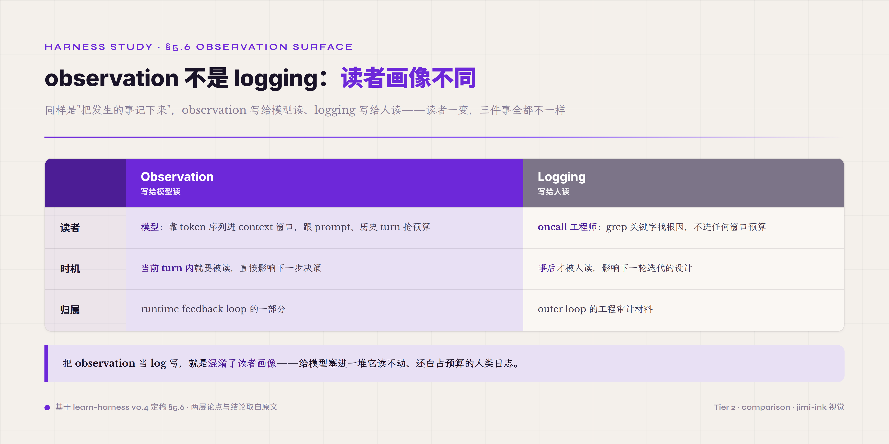
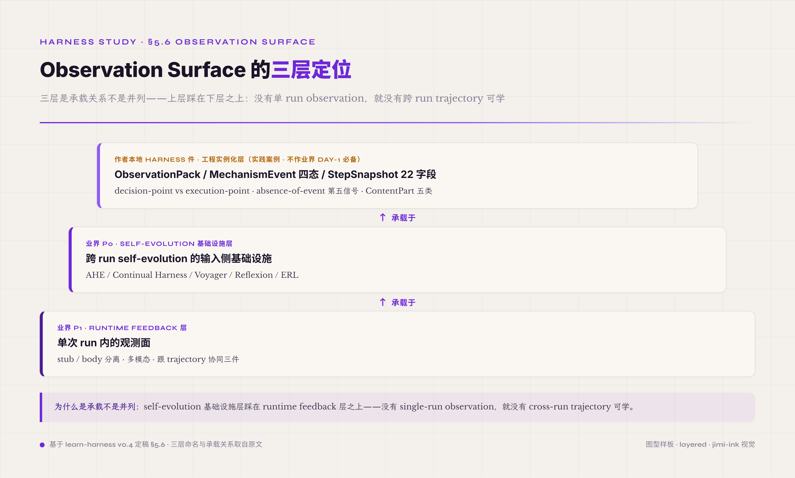
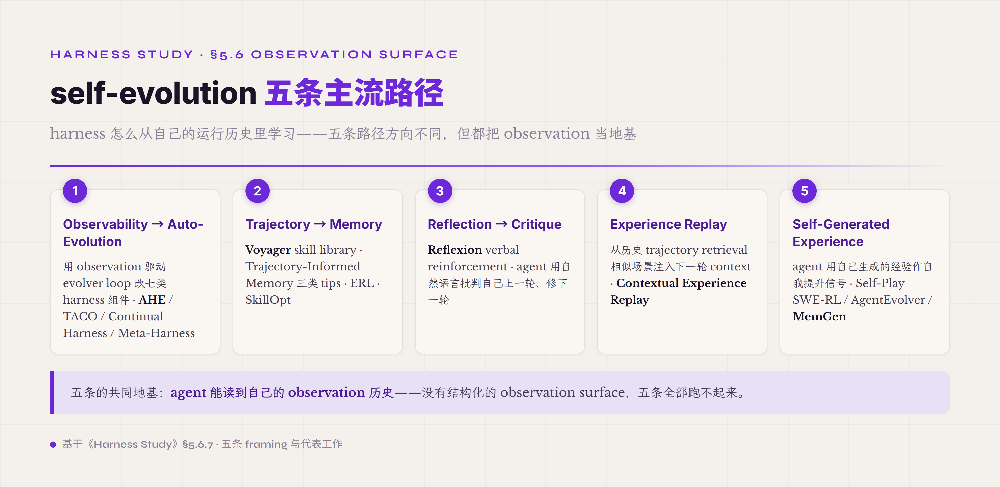

# 5.6 Observation Surface · **三层定位 · self-evolution 基础设施层 + runtime feedback 层 + 作者工程实例化层**

第六件机制是 agent 调用工具之后拿到的"环境反馈" —— 工具执行的输出、读到的文件内容、抓取的网页正文、运行测试的结果、看到的图片、生成的报告。这些反馈合起来组成 observation surface 这一层。前面 §5.5 末尾点过一句"指令该挂在最容易生效的载体上"——这句话往反方向延伸就到了 §5.6 的根本论点：**agent 看见环境的方式 · 跟人看 log 的方式根本不是一件事**。一个能跑的 production agent 跟一个能跑得稳、能跨 run 进化的 production agent 之间 · observation surface 这一层的成熟度往往是决定差别。

为什么 observation 不是 logging？两层论点叠加。第一层论点来自读者——observation 的读者是模型 · log 的读者是人。模型读 observation 要靠 token 序列 · 进 context 窗口 · 跟 prompt 跟历史 turn 抢预算 · 单条 observation 5000 行的 grep 输出直接塞进 context · 几轮之后整个 context 就爆了；log 的读者是 oncall 工程师 · 出问题时 grep 关键字找根因 · 不需要进任何窗口预算。两类读者对同一份数据的处理需求完全不同 · 把 observation 当 log 写就是混淆了读者画像。第二层论点来自时机——observation 在 agent 当前 turn 内就要被读 · 影响下一步的决策；log 在事后才被人读 · 影响下一轮迭代的设计。前者是 runtime feedback loop 的一部分 · 后者是 outer loop 的工程审计材料。

*图 5.16 · Observation 与 logging 的本质区别*

这两层论点只是 single-run 视角下的差别。**observation surface 真实的 surface 远不止单次 run**——它同时是跨 run 的 self-evolution loop 的输入侧基础设施。2026 业界已经把这件事作为事实标准。AHE（Agentic Harness Engineering）[^ahe-2026]的标题直接命名为 "Observability-Driven Automatic Evolution of Coding-Agent Harnesses"——10 次 AHE 迭代把 GPT-5.4 上的 Terminal-Bench 2 通过率从 seed harness 的 69.7% 提到 77.0%（+7.3 pp）——模型不变，自动进化出的 harness 反超人工设计的 Codex-CLI harness（71.9%）· 用 observation 数据驱动 evolver loop 同时优化 system prompt / tool description / tool implementation / middleware / skill / sub-agent 配置 / long-term memory 七类正交组件。Continual Harness[^continual-harness-2026]走得更远——reset-free self-improving harness 让 embodied agent 自动在 acting 跟 refining 自己的 prompt / sub-agents / skills / memory 之间 alternate。早期工作 Voyager[^voyager-2305]引入 skill library 模式 · 累积 reusable code artifacts 从过去 task 应用到未来；Reflexion[^reflexion-shinn-2023]引入 verbal reinforcement · agent 用自然语言批判自己上一轮 · 修下一轮策略；ERL（Experiential Reflective Learning）[^erl-2026]合起来形成业界 reflective agent 的标准范式。不同研究和部署报告各自记录到反思类 agent 在 SE / 规划 / 科研 / 客服等复杂多步任务上有可观提升——具体幅度因任务和基线而异，从单位数到数十个百分点不等（如 ERL 在 Gaia2 上 +7.8%）。

把这两件事合起来 · §5.6 实际上有**三层定位**——

- **第一层 · self-evolution 基础设施层**：observation surface 是跨 run self-evolution 的输入侧基础设施 · AHE / Continual Harness / Voyager / Reflexion / ERL 这些 2026 业界主流路径都建立在这一层。任何追求 long-term capability 增长的 harness 都需要先把这一层打稳。
- **第二层 · runtime feedback 层**：observation surface 在单次 run 内做 stub/body 分离 / 多模态 / 跟 trajectory 协同三件 · 这是 v0.3 §5.4 已经锁定的 P1 业界共识——Trivedy "Bundled Infrastructure" / Augment Code "Feedback Loops" / SWE-agent .traj / Anthropic Claude vision / OpenAI GPT-4V 都做这件事。
- **作者本地 harness 件工程实例化层**：ObservationPack 抽象 / MechanismEvent 四态分类（Activated / Skipped / Blocked / Error）/ StepSnapshot 22 字段化结构 / decision-point vs execution-point 的区分纪律 / absence-of-event 作为第五信号 / ContentPart 五类多模态抽象——这些是作者沿 AHE / Voyager / Reflexion 等业界 self-evolution 主流方向做的具体工程实例化 · **全部是 harness 内部件**。本节只展开 harness 件实例化部分 · 明标"作为本教程作者的实践案例 · 不作业界 day-1 必备"。harness 件之上还可对接一套 meta-工作台（作者本地实例化叫 Harness Lab 工作台 · 类比 W&B 之于 ML 实验追踪 / GitLab CI 之于 DevOps）做跨任务跨配置的系统化调优——但这是 bonus 进阶路径不是 self-evolution 唯一形态 · 工作台本身在后面 Harness Lab 章节展开 · 本节不展开。

三层之间不是并列关系是承载关系——self-evolution 基础设施层踩在 runtime feedback 层之上（没有 single-run observation 就没有 cross-run trajectory 可学）· 作者本地工程实例化层是这两层在作者实际工程语境下的具体落地。这三层都是 **harness 内部件** · 跨 run self-evolution 是 harness 自身能力 · 不需要外部工作台才能跑。三层合起来印证一件事——observation surface 这一机制的设计驱动从来不是"把工具输出存下来给人 debug" · 是"把 agent 跟环境的交互建模成既能喂当前推理也能喂跨 run 优化引擎的双向数据流"。后面九子节按"observation vs logging 的差别 + stub/body 分离 → 多模态 observation → observation 跟 trajectory 协同 → schema 设计 → 常见误区 → 业界实现对照 → self-evolution 基础设施层（NEW）→ 作者本地工程实例化层 → 起步建议"展开。前六子节属基础两层 · 第七子节专门讲 self-evolution · 第八子节讲作者实例化 · 第九子节给四维度起步建议。

*图 5.17 · Observation Surface 的三层承载关系*

#### 5.6.0 本节首次出现的术语

§一-§五前面已经解释过的术语（schema / trajectory / verifier / ablation / context / artifact / lost-in-the-middle / prompt asset / hook / tool description 等）下面不再重复。这里只列 §5.6 本节首次出现的术语。

**observation surface 核心术语** —— **observation**（agent 调用工具或感知环境之后拿到的反馈数据 · 读者是模型不是人 · 在当前 turn 内被读 · 影响下一步决策 · 跟给 oncall 看的 log 在读者跟时机两件事上根本不同）。**observation surface**（observation 在 harness 中的物理层 · 包括 schema 设计 / 物理存储 / 跟 trajectory 协同三件 · 本卷把原本的"Observation 序列化"概念升级为"surface"概念 · 凸显这一层不只是数据格式 · 是 agent 跟环境之间的整面交互层）。**stub/body 物理分离**（observation 物理结构的基础切分 · stub 是小摘要进 context · body 是完整内容进 ArtifactStore · 模型看 stub 判断要不要调 `read_observation(obs_id)` 取完整 body · 业界 Trivedy "Bundled Infrastructure" / Augment Code "Feedback Loops" 都做这件分离）。

**multimodal observation 术语** —— **multimodal observation**（多模态反馈 · 包括图片 / PDF / 音频 / 视频 / 表格等非纯文本数据 · 2026 业界一等公民 · Anthropic Claude vision / OpenAI GPT-4V / Google Gemini multimodal API 都在 wire format 层支持 · 抽象一致但具体格式有差异）。**ContentPart**（多模态 observation 的类型抽象 · Anthropic Claude API 的 content block 是业界同类抽象 · 作者从 Harness Lab 工作台借鉴的 5 类分类是 Text / Image / FileContent（完整读 · 小文件）/ FileRef（引用 · 大文件）/ PreprocessError（显式 modal 失败信号）· 作为本教程的配套实现案例 · 不作业界 day-1 标准）。

**self-evolution 基础设施术语** —— **self-evolving agent / self-improving agent**（agent 在跨 run 边界基于历史 trajectory / observation / outcome 自动改进 prompt / tools / memory / skills / harness 配置 · 不依赖人介入 · 2026 业界主流方向 · 已出业界综述[^self-evolving-survey-2026]）。**observability-driven evolution**（AHE[^ahe-2026] 提出的 framing · observation 作为 self-evolution 的输入侧基础设施 · evolver loop 用 observation 数据驱动改 prompt / tools / middleware / memory / skills）。**skill library**（Voyager[^voyager-2305] 引入的 pattern · 累积 reusable code artifacts 从过去 task 应用到未来）。**verbal reinforcement / reflection**（Reflexion[^reflexion-shinn-2023] 引入的 pattern · agent 用自然语言批判自己上一轮 · 修下一轮策略）。**experience replay**（agent 从历史 trajectory retrieval 相似场景 · 注入下一轮 context · Contextual Experience Replay 是 2026 主流变体）。**trajectory-informed memory**[^trajectory-informed-memory-2026]（从 trajectory 提取 reusable skills / heuristics / lessons learned 写进 memory）。**continual harness**[^continual-harness-2026]（reset-free self-improving harness · agent 自动 alternate 在 acting 跟 refining prompt/sub-agents/skills/memory 之间）。**meta-harness**（agent 能改自己的 scaffolding · 不只是改自己的 code · 2026 业界关注方向）。

**作者本地工程实例化术语** —— **Harness Lab 工作台**（作者构建的 meta-工作台 · **不是 harness 件本身 · 是 harness 之上的层** · 工作台本身在后面 Harness Lab 章节展开 · 本节不展开 · 本节只展开 harness 件实例化部分）。**ObservationPack**（作者沿业界共识方向做的 stub/body 分离具体抽象 · 业界 OpenInference / Langfuse / Helicone / OTel GenAI semconv 都还没有形成同等抽象的统一规范 · 作为本教程作者的实践案例 · 不作业界标准）。**MechanismEvent 4-state**（作者沿业界 reflection / observability-driven evolution 方向做的 observation 状态分类 · Activated 触发 / Skipped 跳过 / Blocked 阻断 / Error 错误 · 每个决策点必须 emit 四态之一才算 observation 完整 · 作者本地工程实例化）。**absence-of-event**（observation 的第五信号 · "该 fire 没 fire" 意味着机制在 schema 里但 runtime 没接通 · 是反 schema-only-no-runtime 常见误区的核心信号 · 作者本地工程实例化）。**decision-point vs execution-point**（observation 应该 fire 在决策点而不是执行点 · 决策点回答"我刚做了什么决策"· 执行点只回答"我刚做了什么"· 前者比后者信息量高 · 作者本地工程实例化）。**OTel GenAI semconv**（OpenTelemetry GenAI semantic conventions · 2026 业界正在围绕的开放标准 · observation 作为 span attribute 或独立 event 进入 OTel pipeline · 跟 trajectory 用同一套 trace context · 这件标准属于业界共识基础层 · 不是作者本地实例化）。

#### 5.6.1 observation 跟 logging 的差别 + stub/body 分离

agent 跑工具调用的反馈数据有一个特殊性——大小分布两极化。一类是工具一次返回几十字符的小反馈（curl 状态码 / 写文件确认 / 简单计算结果）· 这类 observation 直接全留进 context 也不爆预算；另一类是工具一次返回几 KB 到几 MB 的大反馈（grep 命中 5000 行 / web fetch 50K 字符 / 文件全文读取 / 数据库 query 大结果集）· 这类如果全留进 context · 几轮调用之后整个上下文就被一两条 observation 吃满。

stub/body 物理分离从这件大小分布两极化里推出来——stub 是小摘要进 context（id / 类型 / 摘要 / size / 截断预览 / 关键 metadata · 通常 200 字符上下）· body 是完整内容进 ArtifactStore 等持久存储（让 agent 在后续 turn 通过 `read_observation(obs_id)` 主动取完整 body 而不进入开头那个固定的 context 预算）。这件物理结构让 agent 在大反馈到来时有"先看摘要 · 决定要不要进一步读"的工程能力 · 不被迫一次性把所有数据塞进 context。

body 全存的成本顾虑有一个简单的刀法：**按 run 结局分级**而不是一刀切采样。失败 run 的 observation body 100% 全保真——复盘和 self-evolution 的数据价值几乎全部集中在失败里；成功 run 跑完归档时 body 可以按 1/N 抽样留底（run 进行中 body 都在 · 这条分级管的是跨 run 留存）。这条分级还有个工程便利：run 结束时 verifier 的判定本来就有 · 存储策略直接挂在判定结果上 · 不需要任何新机制。

业界对这件分离层已经形成基础共识。Trivedy 2026-03 的 harness framework 把 filesystem / sandbox / browser 等列为 harness 必备组件—— observation 不是抽象概念 · 它必须落到具体的 sandbox / artifact store 等物理基础设施上。Augment Code 把这一层归为 "Feedback Loops"。这件分离层的工程价值不只是节省 token——更重要的是让"agent 自主决定信息深度"成为可能：stub 让 agent 看到一份反馈的轮廓 · body 让 agent 在需要更深时主动取。少了 stub/body 分离的 harness · agent 要么淹没在原始数据里 · 要么因为截断完全失去信息——两端都是常见误区。

本教程作者沿这件业界共识方向做的本地工程实例化叫 ObservationPack——它把 stub 跟 body 这件抽象关系具体化为一个 struct · stub 进 context 时用上面那组结构化字段 · body 通过 ArtifactStore 用 obs_id 索引存取。这种具体抽象不是业界标准——业界 OpenInference / Langfuse / Helicone / OTel GenAI semconv 都还没收敛到 stub/body 分离的统一规范。本教程作者的 ObservationPack 是沿业界共识方向做的具体落地一种 · 作为本教程作者的实践案例展示——读者自己 harness 落地时 stub 的字段 schema / body 的存储位置 / read_observation 的 API 签名都可以有不同选择 · 关键是分离这件物理结构必须有。

#### 5.6.2 多模态 observation

multimodal observation 是 2026 业界一等公民——agent 拿到的环境反馈不再只是文本流。Anthropic Claude API 的 content block 允许 image / document 直接作为 observation 的一类元素；OpenAI 的 GPT-4V / vision API 把图像作为 input 一等公民；Google Gemini 的 multimodal input 把 image / audio / video 统一进同一个 wire format。三家头部 provider 都在 API 层把多模态作为 observation 的一等抽象——这件事已经从早期"vision 模型作为单独 endpoint"升级到"多模态是 agent observation 通道的默认能力"。

多模态 observation 给 harness 设计带来两件特殊难点。第一件是大小爆炸——一张高分辨率图片在 base64 编码后可能是几百 KB 进 context · 一段 10 分钟音频可能是几 MB · 一个 PDF 含图可能是几 MB。这件大小爆炸让 stub/body 分离从"工程优化"升级为"工程必需"——多模态 observation 不分离基本不能上 production。第二件是 modal 失败信号必须显式——图片 OCR 失败 / 音频转录超时 / 视频抽帧失败这些 modal 层的失败 · 不能被静默吞掉 · 必须作为显式的 observation 信号传给 agent · 让 agent 决定下一步走纯文本路径还是重试 modal 处理。

本教程作者沿这件业界方向做的本地工程实例化是 ContentPart 抽象——一个 enum 把多模态 observation 统一为 Text / Image / FileContent（完整读 · 小文件）/ FileRef（引用 · 大文件）/ PreprocessError（显式 modal 失败信号）五类。Text 跟 Image 是基础类型；FileContent vs FileRef 的切分让大小文件走不同 observation 路径——FileContent 进 context 的 stub 直接含文件全部内容（小文件的高精度 observation 模式）· FileRef 进 context 的 stub 只含元数据（path / size / mime_type 等）等 agent 主动 read 时才取完整内容（大文件的 lazy observation 模式）。PreprocessError 是五类里最重要的一类——它显式把"图片处理失败 / OCR 超时 / 文件读取错"等 modal 级别的失败作为正常 observation 路径上的一个信号 · 不是 throw exception · 让 agent 在 prompt 层就能处理这件失败。这套 ContentPart enum 是作者沿业界 multimodal API 共识方向做的本地工程实例化 · 作为本教程作者的实践案例——业界其他 harness 可能用不同的 enum 切法（比如 LangChain BaseMessage content 用 list of 不同 type 而不是单个 enum）· 关键是多模态加显式 modal 失败信号这两件必须有。

#### 5.6.3 observation 跟 trajectory 协同

observation 不是孤立的数据点——它跟 trajectory（agent 的执行历史）协同存储。SWE-agent 把 trajectory 定义为一系列 thought / action / observation 三元组的 turn · 每个 turn 内 observation 跟当 turn 的 thought 跟 action 配对存储。这种配对不是数据结构上的方便 · 是 trajectory replay / ablation / regression 的根本前提——没有"这个 thought 之后对应那个 observation"这件配对 · trajectory 只是事件流 · 不是可分析的执行历史。

业界主流 harness 的 observation 跟 trajectory 协同有几种存储路径。SWE-agent 走单 JSON 文件 · 文件名 `<instance_id>.traj` · 内含全部 turn 的 thought/action/observation 三元组 · 配 .html 渲染做人工检查。业界对 Claude Code 的源码调研显示它走 JSONL 一行一事件 · observation 作为独立 event 类型。OpenAI Codex CLI 走 Rollout 文件格式。LangSmith 走云端 trajectory + UI 检视。OpenInference 走 OTel 兼容 schema · 把 observation 作为 span 的 attribute 或独立 event 进入 OTel pipeline。差异在 wire format 跟 storage backend——共同点是"observation 必须作为 trajectory 的一等组成 · 不另开一个 log stream"。

OTel GenAI semantic conventions 是 2026 业界正在收敛的开放标准 · 让 observation 跟 trajectory 走同一套 trace context · 跨 harness 跨 vendor 都能用同一份 telemetry pipeline 处理。这件标准还在演进——2026 中期 spec 仍在 evolve · 不同 vendor 的实现也有差异。但 OTel 跟 W3C trace context 同源 · 把 agent observation 标准化到 distributed tracing 已经成熟的工程基础设施上——这是 observation 工程治理走出 vendor lock-in 的关键基础设施。

#### 5.6.4 observation surface 的 schema 设计

observation 的 schema 设计决定一件事——observation 能不能被自动 evaluator 读。HAL（Holistic Agent Leaderboard）[^hal-2026]跑 21730 rollouts × 9 model × 9 benchmark 把"评测从周量级压到小时量级"——这件量级跨越的基础是 observation schema 必须结构化到能直接喂自动 evaluator 不需要人读 log。free-form 自然语言的 observation log 是评测自动化的根本障碍——人看得懂但 evaluator 跑不动。

schema 设计层面有四件事必须想清楚。第一件是字段的"哪些信号是 anomaly 触发器"——比如 token 用量超过 ceiling / reasoning 累积超过阈值 / 工具反复调用同一参数 / plan 反复翻来覆去都是常见的 anomaly。第二件是字段的"哪些信号是 cross-run 累积"——比如 cache hit % / batch size / artifact 引用数等需要跨 run 累积才能看出趋势的指标。第三件是字段的"哪些信号要进 prompt cache"——稳定的 schema 字段名跟字段顺序是 prompt cache 的必要条件。第四件是字段的"哪些信号能脱敏后再持久化"——PII / credential 必须在 observation 写出前脱敏 · 不能在事后 grep 时再清。

本教程作者沿这件业界方向做的本地工程实例化叫 StepSnapshot——把每 turn 的 observation 结构化为 22 个字段 · 包含 turn count / input tokens / output tokens / cache hit % / artifact references / model selection rationale / batch aggregation flags 等。22 字段不是固定数——是作者在工程实践里收敛出来的一个具体切分 · 业界其他 harness 可能用 15 字段 / 30 字段或别的切分。关键不是字段数 · 是 schema 要做到"每个字段对应一类可被自动 evaluator 读的信号"· 这样 observation 才能从单次 run 的 runtime feedback 升级为跨 run self-evolution 的输入。

#### 5.6.5 常见误区 · observation 过载跟 observation 失真

observation surface 工程治理有两个对偶常见误区——过载跟失真。前者是把工具反馈完整塞进 context 不做摘要；后者是用粗暴 truncate 截断丢信息。两端都是 stub/body 分离要避免的常见误区。

observation 过载常见在没做 stub/body 分离的 harness 里。一个 grep 工具返回 5000 行 · 一个 web fetch 返回 50K 字符 · 一个数据库 query 返回 1MB JSON · 这些反馈直接塞进 context 几轮就把整个上下文吃满。过载的隐性代价比显性 token 消耗更大——lost-in-the-middle 现象（前面 Context 跟 Memory 那节已展开）让中段大 observation 即使留下来模型也读不到 · 等于花了 token 没拿到 attention。判定条件简单：单次 turn observation 长度超过 system prompt 跟 tool descriptions 之和 · 或者让当前 context 占用率相对此前明显上跳 · 都是需要 stub/body 分离的工程信号。

observation 失真是另一端——用粗暴 truncate 截断丢信息。比如一个 web fetch 返回 50K 字符 · 工程师在 tool wrapper 里写 `if len(content) > 4096: content = content[:4096]` · 这条粗暴 truncate 看起来解决了过载 · 实际上让 agent 错过后半段关键信息——agent 不知道有后半段被截了 · 推理时把截断后的前 4K 字符当全部内容用。判定条件是看 truncate 后有没有给 agent 提示——好的 stub 必须含 `truncated: true / size: 50000 / preview_truncated_at: 4096` 这类元信息让 agent 知道"有更多内容可以 read_observation 取"· 不默默丢失。

两端常见误区的工程化对策都是 stub/body 分离——stub 带 truncated 标记跟 size 元信息不默默丢失 / body 进 ArtifactStore 完整保留 / agent 可通过 read_observation 主动取完整 body。这件结构同时解决两端——既不过载又不失真。一个常见的二次常见误区是只做 truncate 不存 body——读起来不过载 · 但 body 丢了之后 agent 想取也取不到 · 实际上还是失真。stub/body 分离的关键不是 stub · 是 body 必须可寻址持久存储。

observation 还有一类隐性常见误区是没做脱敏。工具返回里可能含 credential / PII（API key / 用户邮箱 / 个人身份证号 / 银行账户）· 这些数据进 observation 就进 context · 进 context 就进 trajectory · 进 trajectory 就跨 run 持久化。这件链条是 PII 泄漏的根因之一——脱敏必须在 observation 入口层做 · 不能等到事后 grep log 时再清。这条纪律跟后续 Safety 控制面那节是配套议题——observation 入口是 PII 第一道防线。

#### 5.6.6 业界实现对照

业界主流 harness 的 observation 跟 trajectory 实现路径有几条主流分支。业界对 Claude Code 的源码调研显示它走 JSONL event stream · observation 作为独立 event 类型 · 配 hook 在 PreToolUse / PostToolUse 等 lifecycle event 做精准注入跟脱敏。OpenAI Codex CLI 走 Rollout 文件格式 · 公开仓库可查 · observation 作为 turn 内部一个 part。SWE-agent 走单 JSON 文件 + .html 渲染做人工检查 · trajectory thought/action/observation 三元组结构。LangSmith 走云端 trajectory + UI 检视 · observation 作为 span 的 attribute 进入 LangSmith 的 observability stack。OpenInference 走 OTel 兼容 schema · observation 作为标准化 GenAI semconv 的 event。

差异在 wire format 跟 storage backend——共同点是几条业界共识。第一条是 observation 必须作为 trajectory 的一等组成不是 log。第二条是 stub/body 分离是 production-grade observation 的物理基础。第三条是多模态 observation 是 2026 默认能力 · 不是 add-on。第四条是 observation 的 schema 必须结构化能直接喂自动 evaluator。这四条业界共识就是 §5.6 的基础层。

业界还在演进的部分是 self-evolution 输入侧的 observation 抽象——OpenInference / Langfuse / Helicone / OTel GenAI semconv 都还没收敛到统一规范。这件未收敛不是业界懒——是 self-evolution 这件事本身在 2026 还在快速演进 · observation 作为它的输入侧基础设施一起在演进。下面一节展开 self-evolution 这件事跟 observation 的关系。

#### 5.6.7 observation surface 作为 self-evolution 基础设施层（NEW）

observation surface 在跨 run 视角下扮演的角色是 self-evolving agent 的输入侧基础设施——这种 self-evolution 是 **harness 自身的能力**。harness 不需要外部 meta-工作台就能基于历史 observation 做 prompt 优化 / tool description 调整 / context 策略改进 · observation 这一层 harness 内部件直接就是它的数据基础。2026 业界已经把这件事作为事实标准。AHE（Agentic Harness Engineering）[^ahe-2026]的标题直接命名为 "Observability-Driven Automatic Evolution of Coding-Agent Harnesses"——用 observation 数据驱动 evolver loop · 同时优化 system prompt / tool description / tool implementation / middleware / skill / sub-agent 配置 / long-term memory 七类正交组件 · 10 次 AHE 迭代把 GPT-5.4 上的 Terminal-Bench 2 通过率从 seed harness 的 69.7% 提到 77.0%。这篇 paper 把"observation 作为 self-evolution 输入侧"的 framing 第一次落到具体 benchmark 数据——注意 AHE 的 evolver loop 本身是 harness 内部的能力 · 不是 harness 之外的工作台层。

业界 self-evolution 主流路径有五条 · 全部以 observation 为基础设施。

*图 5.18 · 以 observation 为基础的 self-evolution 五条路径*

第一条是 Observability → Auto-Evolution 路径。AHE[^ahe-2026]用 observation 数据驱动 evolver loop 同时改上述七类 harness 组件。TACO（training-free 自进化 Terminal Agent 压缩框架）[^taco-2026]走 task-aware observation compression · 在 TerminalBench 带来约 1-4 个百分点提升（论文报绝对增益 · 个别配置更高 · 全 benchmark 区间 0.36-6.02 分）。Continual Harness[^continual-harness-2026]把这件事推到极限——reset-free self-improving harness 让 embodied agent 自动在 acting 跟 refining 自己的 prompt / sub-agents / skills / memory 之间 alternate · 完全去掉人介入。Meta-Harness 走得更远——agent 改的是包裹模型的外层 harness 代码（prompt 构造 / 检索逻辑 / 状态管理）· 而不是更新模型权重。这一路径的共同 framing 是 observation 数据是 self-evolution 的直接输入。

第二条是 Trajectory → Memory 路径。Voyager[^voyager-2305] 引入 skill library 模式——累积 reusable code artifacts 从过去 task 应用到未来。Trajectory-Informed Memory[^trajectory-informed-memory-2026] 自动从 trajectory 提取可复用的 strategy / recovery / optimization 三类 tips（策略 / 恢复 / 优化经验 · 文本型而非 Voyager 那种可执行 code）写进 memory。ERL（Experiential Reflective Learning）[^erl-2026] 把这件事 formalize 为 experiential memory framework · 在新环境里高效 self-improvement。SkillOpt[^skillopt-2026] 把 skill library 从"累积"推到"持续优化"——不只把 verified skill 存下来 · 还用一套 executive strategy 把每条 skill 当可被反复改写的对象 · 在六个 benchmark 七个模型上验证 skill 自进化的稳定增益（GPT-5.5 在无 skill 基线上提升约 +19 到 +25 分 · 随 chat / Codex / Claude Code 三种 harness 形态浮动）。这一路径的共同 framing 是 trajectory 是 self-evolution 的间接输入 · observation 是 trajectory 的组成。

第三条是 Reflection → Critique 路径。Reflexion[^reflexion-shinn-2023]引入 verbal reinforcement——agent 用自然语言批判自己上一轮 · 修下一轮策略。Stanford HAI 2026 研究显示 self-reflect 类 agent 在变化环境里表现显著更好。业界 2026 部署经验显示反思类 agent 在 SE / strategic planning / scientific research / customer ops 等复杂多步任务上能带来显著的成功率提升。这一路径的共同 framing 是 agent 自己读自己的 observation 历史做自我批判。

第四条是 Experience Replay 路径——agent 从历史 trajectory retrieval 相似场景 · 注入下一轮 context · Contextual Experience Replay 是 2026 主流变体。这一路径把 memory 那一层的 retrieval 跟 observation 协同起来用。

第五条是 Self-Generated Experience（自生成经验）路径。Self-Play SWE-RL（SSR）[^ssr-2026]让单个 LLM 在 bug injector 跟 solver 两个角色之间 alternate · agent 给真实 codebase 注入 bug · 然后训练自己修这些 bug（SWE-bench Verified +10.4 分）。AgentEvolver[^agent-evolver-2026]走 self-questioning / self-navigating / self-attributing 自主生成任务 · MemGen[^memgen-2026]走 generative latent memory · 都属 agent 用自己生成的经验作自我提升信号这一路径。这一路径的共同 framing 是减少对人工标注数据的依赖 · 让 agent 从自己的产出里学。同一思路也用在安全对齐而非提能力上——FATE[^fate-2026]让 agent 在自己跑出的失败轨迹上做 on-policy self-evolution（配 Pareto-Front Policy Optimization 平衡安全跟有用性）· 在 AgentDojo / AgentHarm / ATBench 上把 Qwen3-8B 的 attack success rate 相对降约 33.5% · harmful compliance 相对降约 82.6%。这说明 self-evolution 的优化目标不限于能力 · 安全对齐同样能拿 agent 自己的轨迹做训练信号。

五条路径的共同点很清楚——它们都建立在"agent 能读到自己的 observation 历史"这件事上。没有结构化的 observation surface · 这五条路径全部跑不起来。所以 observation surface 不只是 runtime feedback layer 的一部分 · 它是 self-evolving harness 的输入侧基础设施层——五条路径都是 harness 自身具备的 self-evolution 能力 · 不依赖外部工作台。这一层定位让 observation surface 在本卷 8+1 框架里从沿用章节升级为重头戏章。harness 件之上还可对接 meta-工作台做跨任务跨配置的系统化优化（作者本地实例化叫 Harness Lab 工作台 · 在后面 Harness Lab 章节展开）· 但工作台是 bonus 进阶路径 · 不是 self-evolution 唯一形态——harness 自身可独立 self-evolve · 也可对接工作台 · 两件不互斥都是合法路径。

#### 5.6.8 作者本地 harness 件工程实例化层

本教程作者沿这五条业界路径做的本地工程实例化是一组 **harness 内部 observation 件**——MechanismEvent 四态 / absence-of-event 第五信号 / decision-point vs execution-point / ObservationPack / StepSnapshot / ContentPart 五类多模态抽象等。这些 harness 件让 observation surface 既能喂当前推理 · 也能喂 harness 自身的跨 run self-evolution loop——这件 self-evolution 是 harness 内部能力 · 不需要外部工作台才能跑。接下来讲的四件 harness 件抽象都是 observation surface 这一层 harness 件的具体落地 · 设计沿用业界 AHE 的 framing（observability-driven automatic evolution）· 但选了几件具体的工程抽象——这些抽象不是业界标准 · 是作者沿业界共识方向做的本地落地一种。

harness 件之上还可对接一套 meta-工作台做跨任务跨配置的系统化调优（作者本地实例化叫 Harness Lab 工作台 · 类比 W&B 之于 ML 实验追踪 / GitLab CI 之于 DevOps · 5 层内部流水线 Observe→Reward→Ablate→Tune→Iterate · **不是 harness 件本身**）——但工作台是 bonus 进阶路径 · 在后面 Harness Lab 章节展开 · 本节不展开。本节只聚焦 harness 件实例化部分。

第一件抽象是 MechanismEvent 四态分类——每个 harness 决策点必须 emit 四态之一才算 observation 完整：Activated（机制触发）/ Skipped（机制存在但本次跳过）/ Blocked（机制阻断）/ Error（机制错误）。这四态让"机制有没有 fire"成为可被自动 evaluator 直接读的结构化信号。

第二件抽象是 absence-of-event 作为第五信号——某个决策点该 fire 但没 fire · 意味着这一机制在 schema 里但 runtime 没接通。这件第五信号是反"schema-only-no-runtime"常见误区的核心——没有 absence-of-event 监控 · 写在 design 文档里的机制可能从来没在 runtime 跑过 · agent 行为表面正常但实际上你以为有的机制其实是死的。

第三件抽象是 decision-point vs execution-point 的区分纪律——observation 应该 fire 在决策点（"我刚做了什么决策"）而不是执行点（"我刚做了什么"）。决策点的信息量比执行点高 · 因为决策点包含"为什么这样而不是那样"的机制依据 · 执行点只是结果。MechanismEvent 四态本身就是决策点 observation 的结构化形式。

第四件抽象是 ObservationPack——stub 进 context · body 进 ArtifactStore · agent 用 obs_id 取 body 的具体实现一种。这是 §5.6.1 讲过的 stub/body 分离的本地落地。

四件 harness 件抽象合起来让 observation surface 既能喂当前推理（runtime feedback 层）也能喂 harness 自身的跨 run self-evolution loop（self-evolution 输入侧）——这就是 observation surface 这一层 harness 件的设计驱动。

业界其他 self-evolution 引擎对 observation 这一层 harness 件会做不同的抽象选择。AHE paper 用别的 schema · Continual Harness 走 reset-free 路径 · Voyager 走 skill library 模式——这些都是同一个 framing 下不同的 harness 件具体工程选择。作者的本地 harness 件实例化（MechanismEvent 四态 / absence-of-event / decision-point / ObservationPack）是其中一种 · 作为本教程作者的实践案例展示——读者自己 harness 落地 self-evolution 时 · 上面四件 harness 件抽象可以借鉴 · 也可以根据自己的工程语境选别的具体形态。关键是 self-evolution 这件事的输入侧 observation 必须有结构化 schema 这件事不能省。

#### 5.6.9 起步建议 · 四维度

**注意什么**——observation surface 工程治理最大的坑是把 observation 当 logging 写。判定 observation 工程治理是否走对方向的几条简单标准：单次 turn observation 长度让当前 context 占用率显著上跳是过载红线；truncate 不存 body 是失真隐患；observation 里含 PII / credential 没脱敏是安全红线。从 day 1 就走 stub/body 分离 · 别一开始把全部 observation 塞进 context 想着以后再优化——优化时已经晚了 · context 已经被 observation 模式吃满。多模态 observation 上线之前必须做大小测算 · 高分辨率图片 / 长音频 / 大 PDF 不分离基本不能上 production。

**怎么设计**——observation 抽象层走 stub/body 分离三件套：stub 进 context（200 字符上下的小摘要 · 字段如前面 stub/body 分离那节所列）/ body 进 ArtifactStore 等持久存储 / read_observation API 让 agent 主动取 body。多模态 observation 走 ContentPart 一类 enum 抽象——Text / Image / FileContent（小文件完整读）/ FileRef（大文件引用）加显式 PreprocessError 信号。observation 跟 trajectory 协同存储走业界主流——JSONL 一行一事件（适合长 run · append 友好）或者单 JSON（适合短 run · 易渲染）按工具链选。OTel GenAI semconv 是 2026 业界正在收敛的开放标准 · 想避免 vendor lock-in 就跟着 OTel 跑。如果目标是 self-evolution-ready 的 observation surface · schema 要做到每个字段对应一类可被自动 evaluator 读的信号——这是 §5.6.4 跟 §5.6.7 那条主线的工程落地。

**怎么测试**——observation surface 的工程质量不靠肉眼检查 trajectory · 靠自动 evaluator 读结构化 schema。HAL paper[^hal-2026]把"评测从周量级压到小时量级"的基础就是 observation schema 结构化到能直接喂自动 evaluator。具体测试方法有几条：随机抽 10-20 个 run 看 observation stub 是否含必要 metadata（truncated 标记 / size / 时间戳）·  跑 lost-in-the-middle 测试看 observation 在 context 中段是否被忘 · 测 PII 脱敏覆盖率（合成数据注入已知 PII 看 observation 入口是否拦下）· 跨 run trajectory replay 跑 ablation 验证 observation schema 稳定性。如果想让 observation surface 喂 self-evolution 引擎 · 加一项跨 run trajectory aggregation 测试——同任务跑 N 次看 observation schema 是否稳定到能被 evolver 直接 diff。

**写什么 prompt**——给 agent 的 system prompt 里要显式说几件 observation 工程纪律。第一句是"observation 反馈大时只看 stub · 需要完整内容用 read_observation 主动取"——让 agent 知道 stub/body 分离这一机制存在 · 不假设所有反馈都是完整的。第二句是"observation 含 truncated 标记时 size 字段告诉你完整大小 · 决定是否需要 read_observation"——让 agent 学会读 stub 元信息判断后续行为。第三句是"observation 里 PreprocessError 类反馈是 modal 处理失败 · 不是工具调用失败 · 可以重试或换路径"——让 agent 区分两种失败类型。这三句配套 prompt 跟前面 Prompt Assets 那节讲的 prompt assets 工程纪律一起 · 让 agent 真的能用上 observation surface 的工程能力 · 不是 harness 写了机制但 agent prompt 不知道怎么用。

---

observation surface 这一机制看起来是"工具反馈怎么存"的工程细节 · 但当一个 agent 系统试图从 demo 阶段进入 production 阶段、再进入 long-term capability 进化阶段时 · 它真实的位置才显出来：observation surface 是 agent 跟环境的双向数据流——既给当前推理读 · 也给跨 run 优化引擎读。这件双向性让 observation 从单纯的 runtime feedback 件升级为 self-evolving agent 的输入侧基础设施层。这一节讲的三层 framing 加九子节 · 合起来就是 observation surface 工程治理的全景。

---

## 引用脚注

[^ahe-2026]: Agentic Harness Engineering: Observability-Driven Automatic Evolution of Coding-Agent Harnesses · arxiv 2604.25850 · Lin / Liu / Pan 等（复旦 + 北大 + 奇绩智峰 11 人）· 2026 · 预印本
[^continual-harness-2026]: Continual Harness: Online Adaptation for Self-Improving Foundation Agents · arxiv 2605.09998 · Karten / Zhang / Jin 等（Princeton + Google DeepMind）· 2026-05-11 · 预印本
[^voyager-2305]: Voyager: An Open-Ended Embodied Agent with LLMs · arxiv 2305.16291 · Wang 等（NVIDIA / Caltech）· 2023
[^reflexion-shinn-2023]: Reflexion: Language Agents with Verbal Reinforcement Learning · arxiv 2303.11366 · Shinn 等 · NeurIPS 2023
[^erl-2026]: ERL（Experiential Reflective Learning）· arxiv 2603.24639 · Illuin Technology · ICLR 2026 MemAgents Workshop · 预印本
[^self-evolving-survey-2026]: A Survey of Self-Evolving Agents · arxiv 2507.21046 · 2026 · 预印本（综述）
[^trajectory-informed-memory-2026]: Trajectory-Informed Memory · arxiv 2603.10600 · IBM Research（7 人）· 2026 · 预印本
[^hal-2026]: Holistic Agent Leaderboard (HAL) · arxiv 2510.11977 · Princeton · ICLR 2026
[^taco-2026]: TACO（training-free 自进化 Terminal Agent 压缩框架）· arxiv 2604.19572 · 曼彻斯特 + HKUST + 北航（11 人）· 2026 · 预印本
[^skillopt-2026]: SkillOpt: Executive Strategy for Self-Evolving Agent Skills · arxiv 2605.23904 · Microsoft + 上海交大 + 同济 + 复旦 · 2026-05-22 · 预印本
[^ssr-2026]: Self-Play SWE-RL (SSR) · arxiv 2512.18552 · Meta FAIR + CMU + UIUC · ICML 2026
[^agent-evolver-2026]: AgentEvolver · arxiv 2511.10395 · Tongyi-Alibaba（13 人）· 2026 · 预印本
[^memgen-2026]: MemGen: Generative Latent Memory · arxiv 2509.24704 · NUS · ICLR 2026
[^fate-2026]: On-Policy Self-Evolution via Failure Trajectories for Agentic Safety Alignment (FATE) · arxiv 2605.11882 · Bo Yin / Qi Li / Xinchao Wang（NUS）· 2026-05-12 · 预印本
