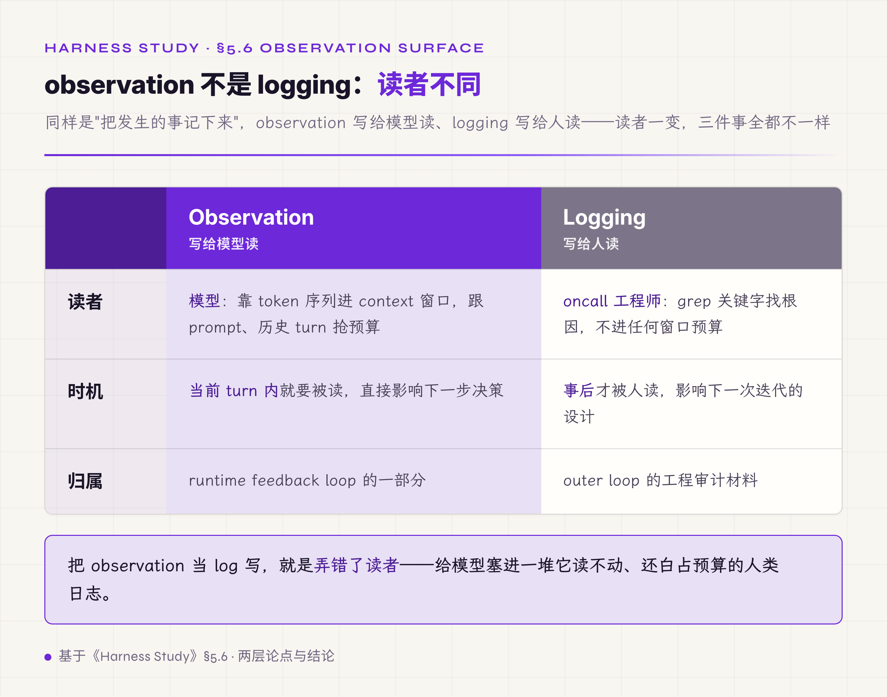
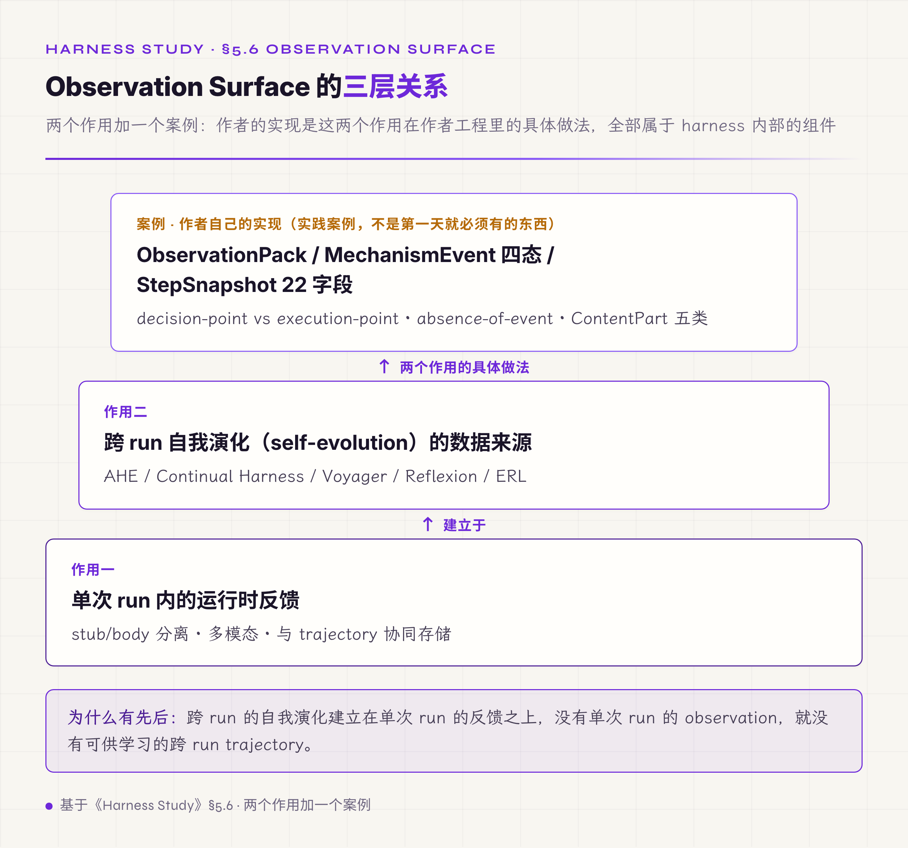
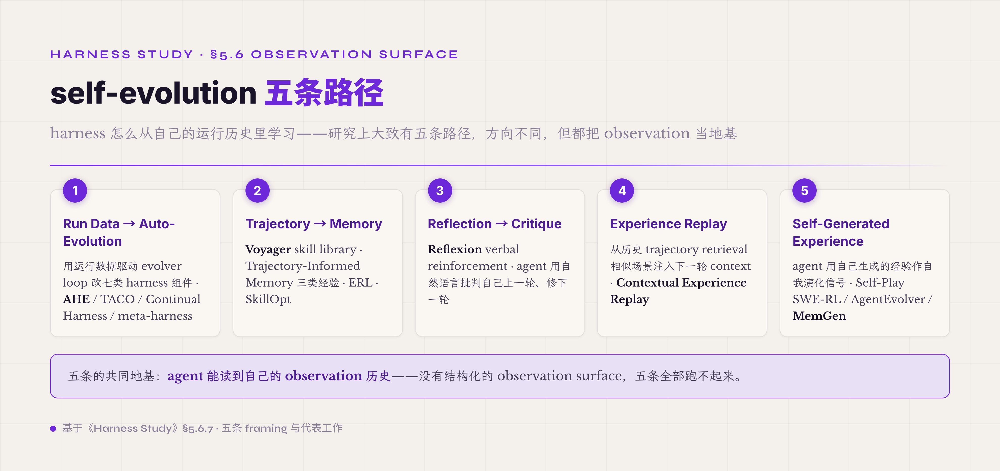

# 5.6 Observation Surface（观测面）· **两个作用加一个案例**

第六个机制是 agent 调用工具之后拿到的"环境反馈"：工具执行的输出、读到的文件内容、抓取的网页正文、运行测试的结果、看到的图片、生成的报告。这些反馈合起来组成观测面（observation surface）这一层，也就是 agent 从环境得到的反馈（工具结果、错误、状态）的设计面。本节的根本论点是：**agent 看见环境的方式，跟人看 log 的方式根本不是一回事**。一个能跑的生产 agent，和一个能跑得稳、还能跨 run 持续改进的生产 agent，差别往往就在观测面这一层的成熟度。

这里先分清两个英文相近的词。**observation**（观测）指喂给模型的环境反馈，读者是模型；**observability**（可观测性）指给人看的运行状态可见性，比如日志、指标、链路追踪，读者是工程师。本节讲的是前者。两者会用到同一批数据，但设计目标不同。

为什么 observation 不是 logging？有两层论点。

- **第一层来自读者**：observation 的读者是模型，log 的读者是人。模型读 observation 要靠 token 序列，要进上下文窗口，跟 prompt 和历史轮次抢预算。一条 5000 行的 grep 输出直接塞进上下文，几轮之后整个上下文就满了。log 的读者是值班（oncall）工程师，出问题时 grep 关键字找根因，不占任何窗口预算。两类读者对同一份数据的处理需求完全不同，把 observation 当 log 写，就是弄错了读者。
- **第二层来自时机**：observation 在 agent 当前这一轮内就要被读，影响下一步决策；log 在事后才被人读，影响下一次迭代的设计。前者是运行时反馈回路的一部分，后者是外层循环（outer loop）的工程审计材料。

*图 5.16 · Observation 与 logging 的本质区别*

这两层论点只讲了单次 run 内的差别。**观测面的作用远不止单次 run**，它同时是跨 run 自我演化（self-evolution）的数据来源。一批研究沿这个方向推进。AHE（Agentic Harness Engineering）[^ahe-2026]的标题就叫 "Observability-Driven Automatic Evolution of Coding-Agent Harnesses"（可观测性驱动的编码 agent harness 自动演化）。要说明的是，AHE 所说的 observability 范围比本节的 observation 大，覆盖整个运行过程留下的记录；本节只借它"用运行数据驱动 harness 改进"这一点。AHE 用运行数据驱动一个演化循环（evolver loop），同时优化 system prompt、工具描述、工具实现、中间件、skill、子 agent 配置、长期记忆七类组件；10 次迭代把 GPT-5.4 在 Terminal-Bench 2 上的通过率从初始 harness 的 69.7% 提到 77.0%（+7.3 个百分点）。模型不变，自动演化出的 harness 超过了人工设计的 Codex CLI harness（71.9%）。

其他工作也在这条线上：

- Continual Harness[^continual-harness-2026]提出不需要重置（reset-free）的自我演化 harness，让具身 agent 在"执行任务"和"修改自己的 prompt、子 agent、skill、记忆"之间交替进行。
- 更早的 Voyager[^voyager-2305]引入技能库（skill library），把可复用的代码积累下来，用到以后的任务上。
- Reflexion[^reflexion-shinn-2023]引入语言强化（verbal reinforcement）：agent 用自然语言批评自己上一轮的表现，据此修改下一轮策略。
- ERL（Experiential Reflective Learning）[^erl-2026]把经验与反思结合起来。

这些反思类 agent 在软件工程、规划、科研、客服等复杂多步任务上的提升，各研究报告的幅度因任务和基线而异，从个位数到数十个百分点不等（如 ERL 在 Gaia2 上 +7.8%）。

把以上合起来，本节讲的是**两个作用加一个案例**：

- **作用一：单次 run 内的运行时反馈**。观测面在单次 run 内要做三件事：stub/body 分离、多模态、与 trajectory 协同存储。Trivedy 的 "Bundled Infrastructure"、Augment Code 的 "Feedback Loops"、SWE-agent 的 .traj 文件、Claude 与 GPT-4V 的视觉输入，都涉及这部分。
- **作用二：跨 run 自我演化的数据来源**。AHE、Continual Harness、Voyager、Reflexion、ERL 这些研究都建立在"能读到历史运行数据"之上。想让 harness 的能力随时间增长，先要把这一层做扎实。
- **案例：作者自己的实现**。ObservationPack 抽象、MechanismEvent 四态分类（Activated / Skipped / Blocked / Error）、StepSnapshot 22 字段结构、决策点与执行点的区分原则、absence-of-event（该发生的事件没有发生）、ContentPart 五类多模态抽象。这些是作者沿 AHE、Voyager、Reflexion 等方向做的具体实现，**全部属于 harness 内部的组件**。本节只展开这部分，并注明"这是作者的实践案例，不是第一天就必须有的东西"。在 harness 之上，还可以接一套外层工作台，做跨任务、跨配置的系统化调优。作者把它叫 Harness Lab（本书对"用评测、消融、调参迭代改进 harness 的外层工作台"的命名，类比 W&B 之于机器学习实验追踪、GitLab CI 之于 DevOps）。但这是进阶选项，不是自我演化的唯一形态，第七章展开，本节不讲。

三者的关系是：跨 run 的自我演化建立在单次 run 的反馈之上（没有单次 run 的 observation，就没有可供学习的跨 run trajectory）；作者的实现是这两个作用在作者工程里的具体做法。这些都是 harness 内部的组件，跨 run 自我演化是 harness 自身的能力，不需要外部工作台也能跑。合起来说明一件事：观测面的设计出发点从来不是"把工具输出存下来给人 debug"，而是"把 agent 与环境的交互建模成一股双向数据流，既喂当前推理，也喂跨 run 的优化"。

后面九个小节依次是：observation 与 logging 的差别及 stub/body 分离、多模态 observation、observation 与 trajectory 协同、schema 设计、失效模式与反模式、业界实现对照、作为自我演化的数据来源、作者的实现案例、起步建议。前六个小节讲作用一，第七小节讲作用二，第八小节讲作者的案例，第九小节从四个方面给起步建议。

*图 5.17 · Observation Surface 的三层关系（两个作用加一个案例）*

#### 5.6.0 本节首次出现的术语

§一到§四及 §5.1 到 §5.5 已经解释过的术语（schema、trajectory、verifier、消融、上下文、artifact、中段遗失、prompt asset、hook、工具描述等）不再重复。这里只列本节首次出现的术语。

**观测面核心术语**

- **observation**（观测）：agent 调用工具或感知环境之后拿到的反馈数据。读者是模型而不是人，在当前这一轮内被读，影响下一步决策。它和给值班工程师看的 log 在"读者"和"时机"两点上根本不同，和面向人的可观测性（observability）也不是一回事。
- **observation surface**（观测面）：observation 在 harness 中的设计面，包括 schema 设计、存储、与 trajectory 协同三部分。本卷把原来的"Observation 序列化"扩展为"观测面"，强调这一层不只是数据格式，而是 agent 与环境之间的整个交互界面。
- **stub/body 分离**：observation 结构的基础切分。stub 是进上下文的小摘要，body 是存进 ArtifactStore 的完整内容。模型看 stub 判断要不要调 `read_observation(obs_id)` 取完整 body。Trivedy 的 "Bundled Infrastructure"、Augment Code 的 "Feedback Loops" 都做了这种分离。

**多模态 observation 术语**

- **多模态 observation**（multimodal observation）：图片、PDF、音频、视频、表格等非纯文本的反馈。Anthropic Claude 的视觉输入、OpenAI GPT-4V、Google Gemini 的多模态 API 都在请求格式层支持，抽象一致，具体格式有差异。
- **ContentPart**：多模态 observation 的类型抽象。Anthropic Claude API 的 content block 是同类抽象。作者从 Harness Lab 工作台借来的分法有五类：Text、Image、FileContent（小文件，完整读入）、FileRef（大文件，只放引用）、PreprocessError（显式的模态处理失败信号）。这是本书的配套实现案例，不是业界标准。

**自我演化相关术语**

- **自我演化 agent**（self-evolving agent，也称 self-improving agent）：agent 跨 run 基于历史 trajectory、observation 和结果，自动改进 prompt、工具、记忆、skill 或 harness 配置，不依赖人介入。已有综述[^self-evolving-survey-2026]。
- **可观测性驱动的演化**（observability-driven evolution）：AHE[^ahe-2026]的提法，用运行数据驱动演化循环去改 prompt、工具、中间件、记忆、skill。
- **技能库**（skill library）：Voyager[^voyager-2305]引入的做法，积累可复用的代码，用到以后的任务上。
- **语言强化 / 反思**（verbal reinforcement / reflection）：Reflexion[^reflexion-shinn-2023]引入的做法，agent 用自然语言批评自己上一轮，据此修改下一轮策略。
- **经验回放**（experience replay）：agent 从历史 trajectory 中检索相似场景，注入下一轮上下文。Contextual Experience Replay 是其中一种做法。
- **trajectory 驱动的记忆**（trajectory-informed memory）[^trajectory-informed-memory-2026]：从 trajectory 中提取可复用的技能、经验法则、教训，写进记忆。
- **Continual Harness**[^continual-harness-2026]：不需要重置的自我演化 harness，agent 在执行任务与修改自己的 prompt、子 agent、skill、记忆之间自动交替。
- **meta-harness**：有研究提出的做法，让 agent 修改包裹模型的 harness 代码（prompt 构造、检索逻辑、状态管理），而不是更新模型权重。

**作者实现案例的术语**

- **Harness Lab 工作台**：见上文定义。它**不是 harness 本身，而是 harness 之上的一层**，第七章展开，本节只讲 harness 内部的实现。
- **ObservationPack**：作者对 stub/body 分离的具体抽象。OpenInference、Langfuse、Helicone、OTel GenAI 语义约定都还没有同等抽象的统一规范。这是作者的实践案例，不是业界标准。
- **MechanismEvent 四态**：作者对 observation 状态的分类，每个 harness 机制在每次检查时都要报告四种状态之一：Activated（触发）、Skipped（存在但本次跳过）、Blocked（阻断）、Error（出错）。每个决策点都发出四态之一，observation 才算完整。它对应实战笔记卷第十二章所说的"决策事件"。
- **absence-of-event**（事件缺席）：某个决策点本该发出事件却什么都没发。这通常说明机制写进了设计，但运行时没有接上。它是发现"机制只存在于设计文档里"这一反模式的关键信号。
- **决策点与执行点**（decision-point vs execution-point）：observation 应该在决策点发出，而不是在执行点。决策点回答"我刚做了什么决策"，执行点只回答"我刚做了什么"，前者信息量更大。
- **OTel GenAI 语义约定**（OpenTelemetry GenAI semantic conventions）：OpenTelemetry 针对生成式 AI 的属性命名约定，仍在制定中。observation 可以作为 span 属性或独立 event 进入 OTel 管道，与 trajectory 共用同一套 trace 上下文。它属于公开标准，不是作者自己的实现。

#### 5.6.1 observation 跟 logging 的差别，以及 stub/body 分离

agent 调用工具得到的反馈有一个特点：大小两极分化。一类是几十个字符的小反馈（curl 状态码、写文件确认、简单计算结果），直接全放进上下文也不会超预算；另一类是几 KB 到几 MB 的大反馈（grep 命中 5000 行、网页抓取 50K 字符、整个文件读入、数据库查询的大结果集），如果全放进上下文，几轮调用之后整个上下文就被一两条 observation 占满。

stub/body 分离就是从这种两极分化推出来的：

- **stub** 是进上下文的小摘要：id、类型、摘要、大小、截断预览、关键元数据，通常 200 字符上下（经验值，按场景调整）。
- **body** 是完整内容，存进 ArtifactStore 等持久存储。agent 在后续轮次可以通过 `read_observation(obs_id)` 主动取完整 body，不必一开始就占用上下文预算。

有了这个结构，agent 面对大反馈时可以"先看摘要，再决定要不要深读"，不会被迫一次把所有数据塞进上下文。

body 全部保存的成本顾虑，有一个简单的分级办法：**按 run 的结局分级**，而不是一刀切抽样。失败 run 的 observation body 全部保留，因为复盘和自我演化的数据价值几乎全集中在失败里；成功 run 归档时，body 可以按 1/N 抽样留存（run 进行中 body 都在，这条分级管的是跨 run 留存）。这条分级还有个便利：run 结束时 verifier 的判定本来就有，存储策略直接挂在判定结果上，不需要新机制。

这种分离在业界已有不少做法。Trivedy 2026-03 的 harness 框架把文件系统、沙箱、浏览器等列为 harness 的必备组件：observation 不是抽象概念，必须有沙箱、artifact 存储这类具体基础设施承接。Augment Code 把这一层归为 "Feedback Loops"。这种分离的价值不只是省 token，更重要的是让"agent 自己决定读多深"成为可能：stub 让 agent 看到反馈的轮廓，body 让 agent 在需要时主动深读。没有 stub/body 分离的 harness，agent 要么淹没在原始数据里，要么因为截断丢掉信息，这是两种相反的失效模式（见 §5.6.5）。

本书作者对这一分离的具体实现叫 ObservationPack：它把 stub 与 body 的关系做成一个结构体，stub 进上下文时用上面那组字段，body 通过 ArtifactStore 按 obs_id 存取。这种具体抽象不是业界标准，OpenInference、Langfuse、Helicone、OTel GenAI 语义约定都还没有统一的 stub/body 规范。ObservationPack 只是一种实现，作为作者的实践案例展示。读者自己实现时，stub 的字段、body 的存储位置、`read_observation` 的接口签名都可以不同，关键是分离这个结构必须有。

#### 5.6.2 多模态 observation

多模态 observation 已经是主流 API 的默认能力，agent 拿到的环境反馈不再只是文本。Anthropic Claude API 的 content block 允许图片、文档直接作为消息内容；OpenAI 的 GPT-4V 与视觉 API 把图像作为正式输入；Google Gemini 把图片、音频、视频统一进同一种请求格式。三家主要厂商都在 API 层支持多模态，这件事已经从早期"视觉模型是单独的接口"变成了"多模态是 agent 观测通道的默认能力"。

多模态 observation 给 harness 设计带来两个难点：

1. **体积暴涨**：一张高分辨率图片经 base64 编码后可能有几百 KB，一段 10 分钟音频可能有几 MB，一个带图的 PDF 也可能有几 MB。这让 stub/body 分离从"优化"变成"必需"，多模态 observation 不做分离，基本上不了生产。
2. **模态处理失败必须显式报告**：图片 OCR 失败、音频转录超时、视频抽帧失败这类模态层的失败，不能被静默吞掉，必须作为显式的 observation 信号传给 agent，让 agent 决定是改走纯文本路径，还是重试模态处理。

作者对此的实现是 ContentPart 抽象：用一个枚举把多模态 observation 统一为五类，Text、Image、FileContent（小文件，完整读入）、FileRef（大文件，只放引用）、PreprocessError（显式的模态处理失败信号）。

- Text 和 Image 是基础类型。
- FileContent 与 FileRef 的切分让大小文件走不同路径：FileContent 的 stub 直接包含文件全部内容（小文件，精确读入）；FileRef 的 stub 只含元数据（路径、大小、MIME 类型等），等 agent 主动读取时才取完整内容（大文件，按需读取）。
- PreprocessError 是五类里最重要的一类。它把"图片处理失败、OCR 超时、文件读取出错"这类模态层失败，作为正常 observation 路径上的一个信号返回，而不是抛异常，让 agent 在 prompt 层面就能处理这种失败。

这套 ContentPart 枚举是作者的实践案例。其他 harness 可能有不同切法（比如 LangChain 的 BaseMessage content 用不同类型组成的列表，而不是单个枚举），关键是"支持多模态"和"显式的模态失败信号"这两点必须有。

#### 5.6.3 observation 跟 trajectory 协同

observation 不是孤立的数据点，它和 trajectory（agent 的执行历史）一起存储。SWE-agent 把 trajectory 定义为一系列由 thought、action、observation 三元组构成的轮次，每一轮内 observation 与该轮的 thought、action 配对存储。这种配对不只是数据结构上的方便，而是 trajectory 回放、消融、回归测试的前提：没有"这个 thought 之后对应那个 observation"的配对，trajectory 只是一串事件，而不是可分析的执行历史。

几种常见实现的存储方式不同：

- SWE-agent 用单个 JSON 文件，文件名 `<instance_id>.traj`，包含全部轮次的 thought/action/observation 三元组，配 .html 渲染供人工检查。
- 据公开分析，Claude Code 用 JSONL 一行一个事件，observation 是独立的事件类型。
- OpenAI Codex CLI 用 Rollout 文件格式。
- LangSmith 用云端 trajectory 加 UI 检视。
- OpenInference 用兼容 OTel 的 schema，把 observation 作为 span 的属性或独立 event 送入 OTel 管道。

差异在序列化格式和存储后端，共同点是：observation 是 trajectory 的正式组成部分，不另开一条 log 流。

OTel GenAI 语义约定正在制定中，目标是让 observation 与 trajectory 共用同一套 trace 上下文，不同 harness、不同厂商都能用同一条遥测管道处理。这套约定还在变化，不同厂商的实现也有差异。它与 W3C Trace Context 是两层东西：W3C Trace Context 是跨服务传递 trace 标识的请求头格式，GenAI 语义约定是 OTel 内部针对生成式 AI 的属性命名约定。两者配合，agent 的 observation 就能接进已经成熟的分布式追踪基础设施，这是 observation 摆脱厂商锁定的关键。

#### 5.6.4 观测面的 schema 设计

observation 的 schema 设计决定一件事：observation 能不能被自动评测程序读。HAL（Holistic Agent Leaderboard）[^hal-2026]跑了 21730 次 rollout（9 个模型 × 9 个 benchmark），把评测从以周计压到以小时计。提速的主因是统一的并行评测框架，把大量评测任务并行分发出去跑；前提之一是各 benchmark 的运行记录格式统一，能直接交给自动评测程序处理。反过来，自由格式的自然语言 observation 日志是评测自动化的障碍：人看得懂，评测程序处理不了。

schema 设计有四件事要想清楚：

1. **哪些信号是异常触发器**：比如 token 用量超上限、推理累积超阈值、同一参数反复调用同一工具、计划反复改写，都是常见的异常信号。
2. **哪些信号要跨 run 累积**：比如缓存命中率、批大小、artifact 引用数，这类指标要跨 run 累积才能看出趋势。
3. **哪些信号会进 prompt 缓存**：字段名和字段顺序保持稳定，是提高 prompt 缓存命中率的前提。
4. **哪些信号要脱敏后才能持久化**：PII 和凭据必须在 observation 写出之前脱敏，不能等事后 grep 时再清。

作者对此的实现叫 StepSnapshot：把每一轮的 observation 结构化为 22 个字段，包括轮次计数、输入 token、输出 token、缓存命中率、artifact 引用、模型选择理由、批量聚合标记等。22 不是固定数，只是作者在实践中形成的一种切分，其他 harness 可能用 15 个、30 个或别的切法。关键不在字段数，而在于每个字段都对应一类能被自动评测程序读的信号。这样 observation 才能从单次 run 的运行时反馈，变成跨 run 自我演化的输入。

#### 5.6.5 失效模式与反模式：observation 过载与失真

观测面有两个方向相反的失效模式：过载和失真。前者是把工具反馈完整塞进上下文、不做摘要；后者是粗暴截断，丢了信息。stub/body 分离要避免的正是这两端。

**过载**常见于没做 stub/body 分离的 harness。一个 grep 返回 5000 行，一次网页抓取返回 50K 字符，一次数据库查询返回 1MB JSON，这些反馈直接塞进上下文，几轮就把整个上下文占满。过载的隐性代价比显性的 token 消耗更大：由于中段遗失（lost in the middle，§5.4 已展开），留在上下文中段的大段 observation 即使还在，模型也不一定用得上，等于花了 token 却没换来注意力。判断方法（经验判断）：单轮 observation 长度超过 system prompt 与工具描述之和，或让当前上下文占用率明显上跳，都说明需要做 stub/body 分离。

**失真**是另一端：用粗暴截断丢掉信息。比如网页抓取返回 50K 字符，工程师在工具包装层写了 `if len(content) > 4096: content = content[:4096]`。这样看起来解决了过载，实际上让 agent 错过了后半段的关键信息：agent 不知道后面被截掉了，推理时把前 4K 字符当成全部内容。判断方法是看截断后有没有提示 agent。好的 stub 必须带 `truncated: true / size: 50000 / preview_truncated_at: 4096` 这类元信息，让 agent 知道"还有更多内容，可以用 read_observation 取"，而不是默默丢掉。

两种失效模式的对策都是 stub/body 分离：stub 带截断标记和大小元信息，不默默丢失；body 进 ArtifactStore 完整保留；agent 可以通过 `read_observation` 主动取完整 body。这个结构同时解决两端，既不过载也不失真。

一个常见的反模式（anti-pattern）是只截断、不保存 body。读起来不过载，但 body 丢了，agent 想取也取不到，实际上还是失真。stub/body 分离的关键不在 stub，而在 body 必须可寻址、持久保存。

另一个隐蔽的反模式是不做脱敏。工具返回的内容里可能有凭据或 PII（API key、用户邮箱、身份证号、银行账户）。这些数据一进 observation 就进了上下文，进了上下文就进了 trajectory，进了 trajectory 就跨 run 持久保存。这条链是 PII 泄漏的根因之一，所以脱敏必须在 observation 入口处做，不能等到事后 grep 日志时再清。这条要求与 §5.9 Safety 控制面配套：observation 入口是 PII 的第一道防线。

#### 5.6.6 业界实现对照

主要 harness 的 observation 与 trajectory 实现有几种路径：

- **Claude Code**：据公开分析，用 JSONL 事件流，observation 是独立的事件类型，并用 hook 在 PreToolUse、PostToolUse 等生命周期事件上做定点注入与脱敏。
- **OpenAI Codex CLI**：用 Rollout 文件格式，公开仓库可查，observation 是一轮内部的一部分。
- **SWE-agent**：单个 JSON 文件加 .html 渲染供人工检查，trajectory 是 thought/action/observation 三元组结构。
- **LangSmith**：云端 trajectory 加 UI 检视，observation 作为 span 属性进入 LangSmith 的可观测性体系。
- **OpenInference**：兼容 OTel 的 schema，observation 作为 GenAI 语义约定定义的 event。

差异在序列化格式和存储后端，共同的做法有几条：

1. observation 是 trajectory 的正式组成部分，而不是 log。
2. stub/body 分离是生产级 observation 的基础结构。
3. 多模态 observation 是默认能力，不是附加功能。
4. observation 的 schema 要结构化到能直接交给自动评测程序。

这四条就是本节前六个小节讲的基础部分。

还在演进的是作为自我演化输入的 observation 抽象，OpenInference、Langfuse、Helicone、OTel GenAI 语义约定都还没有统一规范。这不是因为业界没做，而是自我演化本身还在快速发展，observation 作为它的输入也跟着在变。下一节展开自我演化与 observation 的关系。

#### 5.6.7 观测面作为自我演化的数据来源

从跨 run 的角度看，观测面是自我演化 agent 的数据来源，而这种自我演化是 **harness 自身的能力**：harness 不需要外部工作台，就能基于历史 observation 优化 prompt、调整工具描述、改进上下文策略，observation 这一层直接就是它的数据基础。AHE[^ahe-2026]用运行数据驱动演化循环，同时优化 system prompt、工具描述、工具实现、中间件、skill、子 agent 配置、长期记忆七类组件，10 次迭代把 GPT-5.4 在 Terminal-Bench 2 上的通过率从初始 harness 的 69.7% 提到 77.0%。这篇论文把"用运行数据驱动 harness 改进"落到了具体的 benchmark 数据上。注意 AHE 的演化循环本身属于 harness 内部的能力，不是 harness 之外的工作台。

以 observation 为基础的自我演化，研究上大致有五条路径。

*图 5.18 · 以 observation 为基础的 self-evolution 五条路径*

**第一条：从运行数据到自动演化。** AHE[^ahe-2026]用运行数据驱动演化循环，同时改上述七类 harness 组件。TACO（免训练的自演化终端 agent 压缩框架）[^taco-2026]做按任务感知的 observation 压缩，在 TerminalBench 上带来约 1–4 个百分点的提升（论文报绝对增益，个别配置更高，全 benchmark 区间 0.36–6.02 分）。Continual Harness[^continual-harness-2026]更进一步：不需要重置的自我演化 harness，让具身 agent 在执行任务与修改自己的 prompt、子 agent、skill、记忆之间自动交替，不需要人介入。还有研究提出 meta-harness 的做法：让 agent 修改包裹模型的 harness 代码（prompt 构造、检索逻辑、状态管理），而不是更新模型权重。这条路径的共同点是：observation 数据是自我演化的直接输入。

**第二条：从 trajectory 到记忆。** Voyager[^voyager-2305]引入技能库，把可复用的代码积累下来用到以后的任务上。Trajectory-Informed Memory[^trajectory-informed-memory-2026]自动从 trajectory 中提取策略、恢复、优化三类经验（文本形式，不是 Voyager 那种可执行代码）写进记忆。ERL[^erl-2026]把这件事形式化为经验记忆框架，在新环境里高效地自我演化。SkillOpt[^skillopt-2026]把技能库从"积累"推进到"持续优化"：不只把验证过的 skill 存下来，还用一套执行策略把每条 skill 当成可以反复改写的对象，在六个 benchmark、七个模型上验证了 skill 自演化的稳定增益（GPT-5.5 相对无 skill 基线提升约 19 到 25 分，随 chat、Codex、Claude Code 三种 harness 形态浮动）。这条路径的共同点是：trajectory 是自我演化的间接输入，observation 是 trajectory 的组成部分。

**第三条：从反思到自我批评。** Reflexion[^reflexion-shinn-2023]引入语言强化：agent 用自然语言批评自己上一轮，据此修改下一轮策略。有研究认为，反思类 agent 在软件工程、战略规划、科学研究、客户运营等复杂多步任务上能提高成功率。这条路径的共同点是：agent 读自己的 observation 历史，做自我批评。

**第四条：经验回放。** agent 从历史 trajectory 中检索相似场景，注入下一轮上下文，Contextual Experience Replay 是其中一种做法。这条路径把记忆层的检索与 observation 结合起来用。

**第五条：自生成经验。** Self-Play SWE-RL（SSR）[^ssr-2026]让同一个 LLM 在"注入 bug"和"修 bug"两个角色之间交替：agent 给真实代码库注入 bug，再训练自己修这些 bug（SWE-bench Verified +10.4 分）。AgentEvolver[^agent-evolver-2026]通过自我提问、自我导航、自我归因自主生成任务，MemGen[^memgen-2026]用生成式隐式记忆，都属于"agent 用自己生成的经验作为自我提升信号"这一路径。这条路径的共同点是减少对人工标注数据的依赖，让 agent 从自己的产出里学。同一思路也被用在安全对齐上：FATE[^fate-2026]让 agent 在自己跑出的失败轨迹上做 on-policy 自我演化（配合 Pareto-Front Policy Optimization 平衡安全与有用性），在 AgentDojo、AgentHarm、ATBench 上把 Qwen3-8B 的攻击成功率相对降低约 33.5%，有害顺从相对降低约 82.6%。可见自我演化的优化目标不限于能力，安全对齐同样可以拿 agent 自己的轨迹做训练信号。

五条路径的共同点很清楚：都建立在"agent 能读到自己的 observation 历史"之上。没有结构化的观测面，这五条路径都跑不起来。所以观测面不只是运行时反馈的一部分，也是自我演化 harness 的数据来源；五条路径都是 harness 自身具备的自我演化能力，不依赖外部工作台。正因为这个定位，本卷把观测面作为重点章节来讲。harness 之上还可以接外层工作台做跨任务、跨配置的系统化优化（作者的实现叫 Harness Lab，第七章展开），但工作台是进阶选项，不是自我演化的唯一形态：harness 可以独立自我演化，也可以接工作台，两者不互斥。

#### 5.6.8 作者的实现案例

作者沿上述五条路径，在 harness 内部实现了一组观测组件：MechanismEvent 四态、absence-of-event、决策点与执行点的区分、ObservationPack、StepSnapshot、ContentPart 五类多模态抽象等。这些组件让观测面既能喂当前推理，也能喂 harness 自身的跨 run 自我演化循环，而这种自我演化不需要外部工作台。下面讲其中四个抽象。设计上沿用 AHE"用运行数据驱动 harness 改进"的思路，但具体抽象不是业界标准，只是作者的一种实现。

harness 之上还可以接一套外层工作台，做跨任务、跨配置的系统化调优。作者的实现叫 Harness Lab 工作台，类比 W&B 之于机器学习实验追踪、GitLab CI 之于 DevOps，内部是 Observe → Score → Ablate → Tune → Iterate 五层流水线，**它不是 harness 本身**。工作台是进阶选项，第七章展开，本节只讲 harness 内部的实现。

**第一个抽象：MechanismEvent 四态分类。** 每个 harness 决策点都必须发出四态之一，observation 才算完整：Activated（机制触发）、Skipped（机制存在但本次跳过）、Blocked（机制阻断）、Error（机制出错）。有了这四态，"机制有没有运行"就成了自动评测程序可以直接读的结构化信号。

**第二个抽象：把事件缺席（absence-of-event）也当作信号。** 四态说的是机制运行后的结果；还有一种情况是某个决策点本该发出事件，却什么都没发。这说明机制写进了设计，但运行时没接上。它是发现"机制只存在于设计文档里、运行时从未接通"这一反模式的关键。没有事件缺席的监控，设计文档里的机制可能从没在运行时跑过；agent 表面上行为正常，但你以为存在的机制其实是死的。

**第三个抽象：决策点与执行点的区分原则。** observation 应该在决策点（"我刚做了什么决策"）发出，而不是在执行点（"我刚做了什么"）。决策点的信息量更大，因为它包含"为什么这样做而不是那样做"的依据，执行点只有结果。MechanismEvent 四态本身就是决策点 observation 的结构化形式。

**第四个抽象：ObservationPack。** stub 进上下文，body 进 ArtifactStore，agent 用 obs_id 取 body。这是 §5.6.1 讲的 stub/body 分离的一种具体实现。

四个抽象合起来，让观测面既能喂当前推理（作用一），也能喂 harness 自身的跨 run 自我演化循环（作用二），这就是观测面这些组件的设计出发点。

其他自我演化方案对观测这一层会有不同的抽象选择：AHE 用自己的 schema，Continual Harness 走不需要重置的路线，Voyager 走技能库路线，都是同一思路下的不同工程选择。作者的实现（MechanismEvent 四态、事件缺席、决策点、ObservationPack）只是其中一种，作为实践案例展示。读者自己做自我演化时，这四个抽象可以借鉴，也可以按自己的工程情况选别的形态。不能省的是：作为自我演化输入的 observation 必须有结构化 schema。

#### 5.6.9 起步建议：四个方面

**注意什么**：观测面最大的坑是把 observation 当 logging 写。判断方向对不对，有几条简单标准：

- 单轮 observation 让当前上下文占用率显著上跳，是过载的红线；
- 截断了但不保存 body，是失真的隐患；
- observation 里有 PII 或凭据而没脱敏，是安全红线。

从第一天就做 stub/body 分离，别先把全部 observation 塞进上下文、打算以后再优化，到那时上下文已经被 observation 占满了。多模态 observation 上线之前必须先估算体积，高分辨率图片、长音频、大 PDF 不做分离，基本上不了生产。

**怎么设计**：

- observation 抽象层做 stub/body 分离的三项：stub 进上下文（200 字符上下的小摘要，经验值，字段见 §5.6.1）；body 进 ArtifactStore 等持久存储；提供 `read_observation` 接口让 agent 主动取 body。
- 多模态 observation 用 ContentPart 这类枚举抽象：Text、Image、FileContent（小文件完整读入）、FileRef（大文件引用），加上显式的 PreprocessError 信号。
- observation 与 trajectory 协同存储，按工具链选：JSONL 一行一个事件（适合长 run，便于追加），或单个 JSON（适合短 run，便于渲染）。
- OTel GenAI 语义约定仍在制定中，想避免厂商锁定，可以跟着 OTel 走。
- 如果目标是能支撑自我演化的观测面，schema 要做到每个字段对应一类能被自动评测程序读的信号，这是 §5.6.4 和 §5.6.7 那条主线的具体做法。

**怎么测试**：观测面的质量不靠肉眼翻 trajectory，而靠自动评测程序读结构化 schema。HAL[^hal-2026]把评测从以周计压到以小时计，主因是统一的并行评测框架，前提之一是运行记录格式统一，能直接交给自动评测程序。具体方法有几条：

- 随机抽 10–20 个 run（经验值），检查 observation stub 是否带必要元数据（截断标记、大小、时间戳）；
- 跑中段遗失测试，看放在上下文中段的 observation 会不会被忽略；
- 测 PII 脱敏覆盖率：用合成数据注入已知 PII，看 observation 入口能否拦下；
- 跨 run 回放 trajectory 做消融，验证 observation schema 的稳定性。

如果想让观测面喂自我演化，再加一项跨 run 聚合测试：同一任务跑 N 次，看 observation schema 是否稳定到可以直接做 diff。

**写什么 prompt**：system prompt 里要明确告诉 agent 几条与观测面相关的行为：

1. "observation 反馈较大时只看 stub，需要完整内容时用 read_observation 主动取"：让 agent 知道有 stub/body 分离，不假设所有反馈都是完整的。
2. "observation 带截断标记时，size 字段告诉你完整大小，据此决定是否调用 read_observation"：让 agent 学会读 stub 的元信息来决定下一步。
3. "PreprocessError 类反馈是模态处理失败，不是工具调用失败，可以重试或换路径"：让 agent 区分这两种失败。

这三句与 §5.5 Prompt Assets 讲的 prompt 资产管理规则配合，agent 才能真正用上观测面的能力，而不是 harness 实现了机制、agent 的 prompt 却不知道怎么用。

---

观测面看起来是"工具反馈怎么存"的工程细节，但当一个 agent 系统从 demo 走向生产，再走向长期持续改进时，它真正的位置才显出来：观测面是 agent 与环境之间的双向数据流，既给当前推理读，也给跨 run 的优化读。这种双向性让 observation 从单纯的运行时反馈，变成了自我演化 agent 的数据来源。本节的两个作用加一个案例、九个小节，合起来就是观测面的全貌。

---

## 引用脚注

[^ahe-2026]: Agentic Harness Engineering: Observability-Driven Automatic Evolution of Coding-Agent Harnesses · arxiv 2604.25850 · Lin / Liu / Pan 等（复旦 + 北大 + 奇绩智峰 11 人）· 2026 · 预印本
[^continual-harness-2026]: Continual Harness: Online Adaptation for Self-Improving Foundation Agents · arxiv 2605.09998 · Karten / Zhang / Jin 等（Princeton + Google DeepMind）· 2026-05-11 · 预印本
[^voyager-2305]: Voyager: An Open-Ended Embodied Agent with LLMs · arxiv 2305.16291 · Wang 等（NVIDIA / Caltech）· 2023
[^reflexion-shinn-2023]: Reflexion: Language Agents with Verbal Reinforcement Learning · arxiv 2303.11366 · Shinn 等 · NeurIPS 2023
[^erl-2026]: ERL（Experiential Reflective Learning）· arxiv 2603.24639 · Illuin Technology · ICLR 2026 MemAgents Workshop · 预印本
[^self-evolving-survey-2026]: A Survey of Self-Evolving Agents · arxiv 2507.21046 · 2026 · 预印本（综述）
[^trajectory-informed-memory-2026]: Trajectory-Informed Memory · arxiv 2603.10600 · IBM Research（7 人）· 2026 · 预印本
[^hal-2026]: Holistic Agent Leaderboard (HAL) · arxiv 2510.11977 · Princeton · ICLR 2026
[^taco-2026]: TACO（training-free 自进化 Terminal Agent 压缩框架）· arxiv 2604.19572 · 曼彻斯特 + HKUST + 北航（11 人）· 2026 · 预印本
[^skillopt-2026]: SkillOpt: Executive Strategy for Self-Evolving Agent Skills · arxiv 2605.23904 · Microsoft + 上海交大 + 同济 + 复旦 · 2026-05-22 · 预印本
[^ssr-2026]: Self-Play SWE-RL (SSR) · arxiv 2512.18552 · Meta FAIR + CMU + UIUC · ICML 2026
[^agent-evolver-2026]: AgentEvolver · arxiv 2511.10395 · Tongyi-Alibaba（13 人）· 2026 · 预印本
[^memgen-2026]: MemGen: Generative Latent Memory · arxiv 2509.24704 · NUS · ICLR 2026
[^fate-2026]: On-Policy Self-Evolution via Failure Trajectories for Agentic Safety Alignment (FATE) · arxiv 2605.11882 · Bo Yin / Qi Li / Xinchao Wang（NUS）· 2026-05-12 · 预印本
