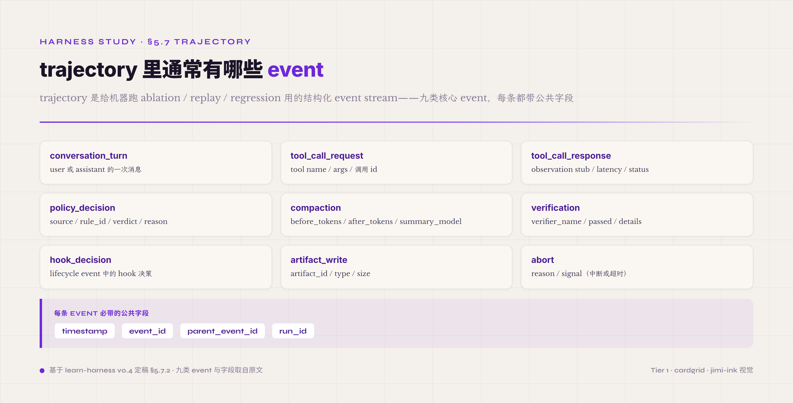

# 5.7 Trajectory · Event Stream · **P0 业界共识 · runtime + cross-run 两面 surface**

第七件机制是 agent 一次 run 跑完之后留下的执行历史——所有 turn 的 thought / action / observation 三元组 · 加上工具调用细节 · 加上 policy 判定 · 加上 compaction 触发 · 加上 verifier 结果——这些数据合起来组成 trajectory 这一层。前面 §5.6 末尾已经点过 observation 跟 trajectory 协同存储 · §5.7 主线就是 trajectory 本身的工程治理。

为什么 trajectory 不是 log？两层论点叠加 · 跟 §5.6 observation 的两层论点是同源结构。第一层论点来自读者——trajectory 的主要读者不是人 · 是 ablation 工具 / verifier debugger / replay engine / self-evolution evolver。这些读者读 trajectory 要靠结构化 event stream 跟严格的字段 schema · 不靠人类语义。这件事让 trajectory 文件不是给 oncall 看的 log · 是给"自动化分析"看的数据资产。第二层论点来自用途——trajectory 是 ablation / replay / regression / self-evolution 这四件工程能力的基础。没有 trajectory · 你不能消融某件机制看 agent 表现差异 · 不能重放 run 调试 verifier · 不能跑新版 harness 验证回归 · 也不能拿历史 trajectory 喂 self-evolution evolver。这四件能力合起来构成 harness 工程治理的核心闭环。

上面四件都是 run 跑完之后的**事后**用途。trajectory 还有一件常被忽略的**运行时**价值——**它是 agent 能"回退"的前提**。agent 跑长任务难免跑偏：context 被一批无关 observation 污染、顺着一条错路走了五六步、或整个上下文偏到了错误方向。没有回退，agent 只剩两条坏路——带着污染硬撑（越跑越偏），或整个任务推倒从头重来（前面几十轮全废）。harness 凭 trajectory 逐 turn 的结构化记录、加上 artifact 的版本，能把状态 checkpoint 在每个干净 turn 上；一旦 verifier 或人发现跑偏，就能把**消息（context 历史）跟产物（artifact）一起回退到某个正确的 turn**，从那里重新往下走。这件"存档读档"能力是 harness 可控性的直接体现——可观测（trajectory 看得见从哪个 turn 开始偏）、可控（能退回那个 turn）、闭环（退回后接着跑）三件控制论原则在这一个功能上集齐。工程上它有三条硬要求：trajectory 每个 turn 的状态必须可寻址（回退要定位到具体 turn）、artifact 必须有版本而不是原地覆盖（不然产物退不回去）、checkpoint 粒度要跟回退成本平衡（每 turn 都存档开销大，太疏又找不到合适的回退点）。

trajectory 跟 observation 的关系是一对多协同。trajectory 是 event stream 容器 · observation 是流里一类元素——一个 turn 里有 thought 事件 · 有 tool_call_request 事件 · 有 tool_call_response 事件（里面带 observation）· 有 policy_decision 事件 · 等等。业界主流 harness 的 trajectory event taxonomy 通常包含 10-15 类 event · 覆盖单 turn 内的所有结构化事件类型。这件 event taxonomy 跟前面 observation surface 的 stub/body 分离是承载关系——trajectory 是事件流容器 · observation 是流里一类元素。

业界对 trajectory 工程治理已经形成强共识 · 主流 5 家路径在 §5.6.6 已经对照过——SWE-agent 走单 JSON 文件 / Claude Code 走 JSONL 一行一事件 / Codex CLI 走 Rollout 格式 / LangSmith 走云端 trajectory + UI / OpenInference 走 OTel 兼容 schema。§5.7 这里聚焦的是 trajectory 自身的工程治理——event taxonomy / 存储格式 / replayability / 跟 OTel 的衔接 / 常见误区——不重复 §5.6 已讲过的 observation/trajectory 协同部分。

后面八子节按"trajectory 跟 log 的根本区别 → event taxonomy 11 类 → 单 JSON vs JSONL 两种存储路径 → OTel GenAI semconv 跟 W3C trace context 锚 → replayability 设计 → 常见误区（trajectory 缺失 / 冗余 / 不可 diff）→ trajectory 作为 self-evolution 训练数据 → 起步建议"展开。前五子节是业界共识的 trajectory 工程治理基础 · 第六子节专门讲常见误区 · 第七子节呼应 §5.6.7 的 self-evolution 基础设施层从 trajectory 角度展开 · 第八子节给四维度起步建议。

#### 5.7.0 本节首次出现的术语

§一-§六前面已经解释过的术语（schema / trajectory 概念 / verifier / ablation / observation / context / OTel GenAI semconv / W3C trace context / SWE-agent / JSONL / Rollout / self-evolving agent 等）下面不再重复。这里只列 §5.7 本节首次出现的术语。

**trajectory 工程术语** —— **event stream**（trajectory 的物理存储形态 · 一系列时间戳排序的结构化 event · 业界两种主流形态——一行一事件的 JSONL append-friendly 流式可处理 · 单 JSON 一个 run 一个文件易渲染易人审）。**event taxonomy**（trajectory 里各类 event 的分类 · 通常 10-15 类 · 覆盖单 turn 内的所有结构化事件类型——conversation_turn / tool_call_request / tool_call_response / policy_decision / compaction / verification / hook_decision / artifact_write / abort 等）。**span**（OTel 概念 · 一段时间内的工作单元 · 含 start 跟 end timestamp / status / attributes · trajectory 跟 OTel 对接时 turn 通常 map 到一个 span · event 通常 map 到 span attribute 或 span event）。**.traj**（SWE-agent trajectory 单 JSON 文件格式 · 文件名 `<instance_id>.traj` · 配 .html 渲染做人工检查）。

**trajectory 用途术语** —— **replayability**（trajectory 可重放属性 · 用 trajectory 里记录的 model 输入输出代替再次调用模型 · 让 ablation / verifier debug / 回归测试不消耗真实 LLM 调用预算 · 业界 SWE-agent 跟 Claude Code 都支持）。**replay**（用 trajectory 数据重新跑 agent · 不调真模型 · 是 ablation / verifier debug 的工程基础 · 跟 ablation 的关系是 ablation 必须依托 replay 才能跑得动）。**regression test**（对比新版 harness vs 旧版 harness 在同一组 trajectory 上是否结果一致 · 是 harness 改动前后质量门禁的核心机制 · 业界 LangSmith / Inspect AI 平台都内建这件能力）。**event_id 跟 parent_event_id**（trajectory 内 event 的因果关系字段 · 让 event stream 形成可追溯的 DAG 不只是时间序列 · 重要工程纪律是每条 event 都必须有这两个字段才能跨 turn 重建因果链）。

**inspect 工具术语** —— **Inspect AI**（UK AISI 英国 AI 安全研究院加 Meridian Labs 开发的开源 agent evaluation framework · GitHub 在 UKGovernmentBEIS · 内建 trajectory 记录加 replay 加 ablation 能力 · 是 2026 业界做严肃 agent eval 的主流平台之一）。**NexAU**（AHE paper 配套的 harness substrate · 把 harness 分解成 7 个 orthogonal file-level 组件 · 每个 git-tracked 可 audit 可 revert · 是 observability-driven evolution 落到具体 trajectory 加 observation pipeline 的技术实现）。

#### 5.7.1 trajectory 跟 log 的根本区别

trajectory 跟普通 log 的工程边界在 2026 已经清楚划开——同样是写到磁盘的执行历史 · 一个是给 oncall 工程师 grep 关键字找根因用的非结构化文本流 · 另一个是给自动化 pipeline 跑 ablation / replay / regression / self-evolution 用的结构化 event stream。两者的工程要求完全不同。普通 log 关心"人能不能读懂"——可读性 · grep 友好性 · timestamp 精度。trajectory 关心"机器能不能 replay"——schema 稳定性 · event 之间的因果关系字段 · 字段 wire format 跨版本兼容性。

把 trajectory 当 log 写是常见错误起点。最容易出现的具体表现是用 print 语句加 log4j 那一套写 trajectory——time + level + message 三件套就完事。这种 trajectory 让 ablation 跑不动：你想消融某件机制看 agent 表现差异 · 但 log 里没有结构化的 mechanism event · 只有"INFO: tool xxx called with args"这种半结构文本——机器解析不了。也让 verifier debug 跑不动：你想重放某次失败的 turn 看 verifier 哪一步出错 · 但 log 里没有 model 输入输出的完整记录 · 只有"WARN: verifier failed"这种结论级文本——重放不了。

trajectory 设计的工程基线是"replay-safe 字段集"——每个 turn 必须留下足够数据让 ablation 工具能完整重建那 turn 的执行状态。最低限度是 model 的完整输入（system prompt + tool descriptions + conversation history + user message）跟模型的完整输出（含 reasoning content / tool_calls / 文本响应）。少了这两件 · trajectory 就降级为只能给人看的 log。这件 replay-safe 基线是 SWE-agent .traj 跟 Claude Code JSONL 这些业界主流 trajectory 格式的隐含设计前提——它们之所以能支撑 ablation / replay 工程能力 · 是因为 trajectory 文件里 model 输入输出完整保留。

#### 5.7.2 event taxonomy · trajectory 里通常有哪些 event

trajectory 是 event stream · event 有分类。业界主流 harness 的 event taxonomy 通常包含十多类 · 覆盖单 turn 内的所有结构化事件类型。

最核心的几类 event 跨 harness 都通用：**conversation_turn**（user 或 assistant 一次消息）/ **tool_call_request**（agent 请求调用工具 · 含 tool name / args / 调用 id）/ **tool_call_response**（工具返回 · 含 observation stub / latency / status）/ **policy_decision**（safety 控制面或 ToolPolicy 一类机制的判定结果 · 含 source / rule_id / verdict / reason）/ **compaction**（context 压缩触发 · 含 before_tokens / after_tokens / summary_model）/ **verification**（verifier 判定结果 · 含 verifier_name / passed / details）/ **hook_decision**（lifecycle event 中的 hook 决策 · 跟 policy_decision 是不同 source 的同源结构）/ **artifact_write**（agent 写入持久 store · 含 artifact_id / type / size）/ **abort**（agent 中断或超时 · 含 reason / signal）。

*图 5.19 · trajectory 的九类 event 与公共字段*

每条 event 必须有几件公共字段——**timestamp**（毫秒级或微秒级精度 · 不能只到秒）/ **event_id**（这条 event 的唯一标识）/ **parent_event_id**（这条 event 的因果父 · 让 event stream 形成可追溯的 DAG 不只是时间序列）/ **run_id**（这条 event 所属 run）。run_id 让 event 在跨 trajectory 文件聚合时不会混淆；event_id / parent_event_id 让 trajectory replay 跟 ablation 能精确重建因果链——比如"这条 verification 失败是哪条 tool_call_response 触发的"这件因果关系不能靠时间戳 + 启发式重建 · 必须有显式字段。这件 DAG 设计纪律是 2026 业界 trajectory 工程治理跟早期 log 设计的关键分水岭。

#### 5.7.3 单 JSON vs JSONL · 两种主流存储路径取舍

业界 trajectory 存储路径分两条主流——单 JSON 文件（一个 run 一份）跟 JSONL（一行一事件）。两条路径在 ablation / replay / regression 这几件用途上各有取舍。

单 JSON 路径的代表是 SWE-agent 的 .traj 文件——文件名 `<instance_id>.traj` · 内含全部 turn 的 thought / action / observation 三元组 · 配 .html 渲染做人工检查。单 JSON 的优势是整体可读——把整个 run 当一份结构化文档处理 · 适合 ablation 时整批 trajectory 跑批量分析 · 适合人审时整 run 在一个 .html 里渲染。劣势是不友好 append——run 跑到一半时已经写了一半 trajectory · 想加新 event 必须重写整个 JSON · 或者用流式 JSON parser（业界普遍嫌麻烦）。这件结构让单 JSON 更适合短 run 跟人审场景。

JSONL 路径的代表是 Claude Code（业界对 Claude Code 的源码调研显示走 JSONL event stream · observation 作为独立 event 类型 · 配 hook 在 lifecycle event 做精准注入）以及 OpenAI Codex CLI（Rollout 文件格式）。JSONL 的优势是 append-friendly · 流式可处理——run 跑的过程中每条 event 直接追加到文件末尾 · 不需要重写整个文件 · 还能让分析工具流式跟踪 run 进度。劣势是单条 event 看不到全局——人审时需要工具把 JSONL 渲染成结构化视图（比如 Threads tab 或 .html）。这件结构让 JSONL 更适合长 run 跟自动化 pipeline 场景。

两条路径的选择标准跟 harness 的主要用途有关。run 普遍较短（10-30 turn）且需要人审的 evaluation harness 走单 JSON · 适合 SWE-agent 这种学术 benchmark 场景。run 普遍较长（50+ turn）且 production 量大的 coding agent harness 走 JSONL · 适合 Claude Code / Codex CLI 这种 production 工具场景。如果 harness 要同时支撑两种用途 · 业界主流做法是底层 JSONL 持久化加一个 .traj.json renderer 在请求时实时聚合——这样存储侧友好流式 · 消费侧友好整体审查。

#### 5.7.4 OTel GenAI semconv 跟 W3C trace context · 业界标准的收敛位置

2026 业界 trajectory 工程治理正在围绕 OpenTelemetry GenAI semantic conventions 收敛。OTel GenAI semconv 的官方 spec 把 agent observability 的 vocabulary 标准化——span 命名规范、attribute 字段键、metric 名称、event 形态都有 SIG 在定义。截至 2026 中期 · 客户端 span（LLM client spans）已经 exit experimental · agent spans / events / metrics 还在 experimental 但"通过 Q1 2026 实践已经非常稳定"。spec 覆盖四件——LLM client spans / agent spans / events for capturing prompt/completion content / metrics。

agent spans 部分给 trajectory 工程治理提供的具体 framing 是——agent 一次 run 跑下来 · 每个 tool call / LLM invocation / retrieval step 都成为一个 child span · 整 run 的 spans 形成完整的 reasoning chain trace。OTel 的 span 抽象跟前面讲过的 event_id / parent_event_id DAG 设计是直接对应——span 有 start_timestamp / end_timestamp / status / attributes / span_id / parent_span_id · attributes 字段承载 trajectory 的具体业务数据（model name / token usage / tool name / verifier verdict 等）。把 trajectory 跟 OTel 对接的具体技术路径就是 turn map 到 span / event map 到 span attribute 或 span event。

业界采纳层面三大 observability vendor（Datadog / Honeycomb / New Relic）已经原生支持 OTel GenAI semconv · 四大 framework（LangChain / CrewAI / AutoGen / AG2）原生 emit OTel-compliant spans 或通过 instrumentation 包接入。这件收敛度让 OTel 成为 2026 跨 harness 跨 vendor trajectory 工程治理的事实通用语言。

OTel GenAI semconv 跟 W3C Trace Context 同源——W3C Trace Context 是 distributed tracing 已经成熟多年的 web 标准 · OTel 在它上面扩展 GenAI 专用 attribute。这件同源关系让 agent trajectory 直接接入企业已经成熟的 distributed tracing pipeline——不需要为 agent 单独建一套 trace 基础设施。

#### 5.7.5 replayability 设计 · trajectory 工程能力的核心

trajectory 工程治理的核心能力是 replayability——用 trajectory 里记录的 model 输入输出代替再次调用模型 · 让 ablation / verifier debug / 回归测试不消耗真实 LLM 调用预算。这件能力让 harness 改动前后的对比变成"在历史 trajectory 上重跑新逻辑看输出差异"——不需要每次都跑真模型耗 token 等延迟。

replayability 设计的工程基线有三件。第一件是 model 输入输出完整持久化——前面 §5.7.1 已经讲过 · trajectory 必须保留完整 system prompt / tool descriptions / conversation history / model 输出（含 reasoning content / tool_calls / 文本响应）。少了这两件 replay 直接跑不动。第二件是确定性回放——同样输入给 replay engine · replay 出来的中间步骤跟原 trajectory 应该一致。这件确定性要求 trajectory 字段必须严格序列化 · 不能有"随机生成的对象 id"这种隐含不可重现状态。第三件是 patch 点暴露——replay 时如果要测试新版 harness · 必须能在 trajectory 某个点替换决策（比如换一个 verifier / 换一个 prompt / 换一个 tool 实现）继续往后跑 · 看新逻辑对后续 turn 的影响。这件 patch 点设计是 ablation 工程的工程基础。

2026 业界主流 trajectory 平台在 replayability 上各有具体形态。Phoenix（Arize）走 agent graph 可视化——把 trajectory 的 span 结构渲染成 node-based 调用图 · sub-agent 嵌套层级一眼可见 · 配 Agent Replay 重放 agent 交互调试 tool calling。LangSmith 走 step-by-step replay 加 thread_id 共享 · Claude Code 集成具体路径是同一 session 的所有 turn 用同一 thread_id 标注 · LangSmith 的 Threads tab 自动聚合渲染。Inspect AI（UK AISI 开源）走 trajectory 记录加 replay 加 ablation 一体化设计——这件平台是 2026 业界做严肃 agent eval 的主流路径之一。

业界还在演进的是 trajectory replay 跟 self-evolution 协同的具体路径——replay 不只是 debug 工具 · 也是 self-evolution evolver 跑实验的工程基础。AHE paper 的 NexAU substrate 就是这件协同的具体技术实现——observability-driven evolution 需要 replay 让 evolver 能在历史 trajectory 上跑反事实实验。

#### 5.7.6 常见误区 · trajectory 三类

trajectory 工程治理有三类常见误区——trajectory 缺失 / trajectory 冗余 / trajectory 不可 diff。

**trajectory 缺失**最常见——agent 跑完没留 trajectory · 或者只留摘要级 trajectory（"run 完成 · 总用 token 12345 · 总耗时 67s"）。这种 trajectory 让 ablation 跑不动 · replay 跑不动 · regression test 跑不动——本质上等于没有 trajectory。trajectory 缺失常见的根因是工程师把 trajectory 当 log 看 · 认为 production run 不需要那么详细 log——但 trajectory 不是 log · 它的用户是自动化 pipeline · production 反而比 dev 更需要 trajectory 完整。判定条件是 trajectory 文件能不能让一个新工程师重建出整个 run 的执行状态 · 不能就是缺失。

**trajectory 冗余**是另一端——什么都往 trajectory 里写 · 包括 debug 中间状态 / 临时变量 / 内部 trace 等。冗余 trajectory 的问题是后续分析跑不动 · ablation 工具读一个 run 要 parse 50MB JSON · 实际有用的字段只有几 KB。判定条件是 trajectory 文件大小跟有用 event 数的比值——如果一个 50 turn run 的 trajectory 超过 5MB 且其中绝大部分是字符串重复 / 中间状态 dump · 已经撞冗余红线。工程化对策是按 event taxonomy 严格分类 · 不在 trajectory 这一层做 debug log——debug 状态应该走单独 log channel 不进 trajectory。

**trajectory 不可 diff**是最隐蔽的——trajectory 字段里包含 random id / timestamp 精度太高（纳秒级）/ 浮点数序列化没规范 · 让同一组任务跑两次出来的 trajectory 文件 diff 出来一堆假阳性差异。这件常见误区让 regression test 完全跑不动——因为 ground truth trajectory 跟新版 trajectory 总是 diff 出差异 · 工程师区分不了哪些是真实回归哪些是噪声差异。工程化对策是 trajectory 字段必须分两类——稳定字段（model name / tool name / decision verdict / event_id 因果链等业务事实）跟 volatile 字段（timestamp / random id / latency 等环境状态）· regression test diff 时只 diff 稳定字段忽略 volatile 字段。这条纪律是业界做严肃 trajectory regression test 的基础设施前提。

trajectory 还有一类隐性常见误区跟 §5.6.5 PII 常见误区同源——trajectory 持久化时没做脱敏 · credential / PII / API key 进 trajectory 文件就跨 run 持久化。OTel GenAI semconv 把 PII tracing 当一件专门工程议题——业界已经形成"trajectory 写出前必须有脱敏 hook"的工程共识。trajectory 入口比 observation 入口更深一层——observation 进 context 是 turn 内 · trajectory 进文件是 run 后跨 turn 持久化 · 脱敏必须在 trajectory 写出前做不是事后清。

#### 5.7.7 trajectory 作为 self-evolution 训练数据

trajectory 在 cross-run 视角下扮演的角色跟 §5.6.7 observation surface 同源——它是 self-evolution 的输入侧基础设施。trajectory 不只是 ablation / replay / regression 的基础 · 也是 self-evolving agent 拿来当训练数据的具体载体。

业界已经把 trajectory 当训练数据这件事 formalize。AHE（Agentic Harness Engineering）[^ahe-2026]的 evolver loop 直接吃历史 trajectory 输入做 harness 配置优化（Terminal-Bench 2 上的具体增益前面 observation 那节给过）。AgentHER[^agent-her-2026]把这件事推得更具体——Hindsight Experience Replay for LLM Agent Trajectory Relabeling · 四阶段 pipeline（failure classification / outcome extraction / LLM-guided prompt relabeling / data packaging）把历史 trajectory 自动转成可训练的标注数据。AgentEvolver[^agent-evolver-2026]走 self-questioning 自主生成任务 · MemGen[^memgen-2026]走 generative latent memory——都属 agent 用自己生成的经验作自我提升信号这一路径 · 减少对人工标注的依赖。

trajectory 作为训练数据这件事对 trajectory 工程治理的额外要求有几条。第一条是 schema 稳定性必须保证跨 run 跨版本可比——如果 trajectory 字段在某次 harness 升级后字段名变了 · 旧 trajectory 就不能再喂新版 evolver。这件 schema migration 工程纪律业界还在演进。第二条是 outcome attribution 必须显式——trajectory 末尾必须明确标"这 run 是 pass 还是 fail · 哪几个 turn 是关键决策点" · 否则 evolver 不知道哪几条 trajectory 是正例哪几条是负例。第三条是 trajectory 跟 ground truth 的关联存储——self-evolution 需要 trajectory 跟任务 ground truth 配对 · 没有 ground truth 配对的 trajectory 只能做 unsupervised 探索 · 不能做 supervised 优化。

承载这件训练数据角色的本地工程抽象，就是前一节那组 harness 内部件（MechanismEvent 四态 / absence-of-event / decision-point / ObservationPack）——trajectory schema 既喂当前推理 · 也给 harness 跨 run 的 self-evolution loop 喂数据。跟 observation 那节一样 · 这是 harness 自身的能力 · 上面那层 meta-工作台（MODA-RL / Harness Lab）只是消费 trajectory 的进阶选项 · 不是前提。

#### 5.7.8 起步建议 · 四维度

**注意什么**——trajectory 工程治理最大的坑是把 trajectory 当 log 写。第一件实际指标是 trajectory 文件能不能让新工程师重建整个 run 的执行状态——不能就是缺失。第二件是 trajectory 大小跟有用 event 数比值——50 turn run 超过 5MB 且大部分是字符串重复就是冗余。第三件是 trajectory 字段有没有分稳定跟 volatile 两类——没有就是不可 diff 隐患。第四件是 trajectory 持久化前有没有 PII 脱敏 hook——没有就是 credential 跨 run 泄漏隐患。从 day 1 就按 replay-safe 字段集设计 trajectory · 别一开始把 trajectory 当 log 凑合着写——上线后想改 trajectory schema 涉及历史数据 migration · 工程代价很高。

**怎么设计**——event taxonomy 走 10-15 类业界主流分类（conversation_turn / tool_call_request / tool_call_response / policy_decision / compaction / verification / hook_decision / artifact_write / abort 等核心几类必有）· 每条 event 必有 timestamp / event_id / parent_event_id / run_id 公共字段。存储格式按 run 长度选——短 run 加人审需求走 SWE-agent .traj 单 JSON 路径 · 长 run 加 production 量大走 Claude Code / Codex CLI JSONL 路径。OTel GenAI semconv 是 2026 业界正在收敛的标准 · 想避免 vendor lock-in 就跟着 OTel 跑——turn map 到 span / event map 到 span attribute 或 span event。如果目标是 self-evolution-ready trajectory · schema 设计时 outcome attribution 字段跟稳定字段必须显式 · 字段 wire format 必须跨版本兼容。

**怎么测试**——trajectory 工程质量按业界 trajectory evaluation 三维度测——grounding 跟 context use（trajectory 里 model 看到的 context 跟实际任务相关性如何）/ user experience quality（trajectory 渲染出来人审能不能跟下 agent 推理过程）/ security 跟 safety（trajectory 有没有 PII 泄漏 / 有没有不该出现的 credential）。schema validation 是 regression test 的工程基础——schema validation catches structural regressions without requiring exact output matches。具体测试方法有几条：跑 replay engine 验证 trajectory 可重放性（同 trajectory 跑两次结果一致）· 跑 schema diff 验证字段稳定性跨 harness 版本一致 · 跑 PII 脱敏覆盖率测试（合成数据注入已知 PII 看 trajectory 持久化时是否拦下）· 跑 OTel 兼容性测试（trajectory 能不能完整 export 到 Datadog / Honeycomb / New Relic 等 OTel collector）。

**写什么 prompt**——给 agent 的 system prompt 里要显式说几件 trajectory 工程纪律相关的 agent 行为。第一句是"工具调用必须用结构化 tool_call · 不要用文字描述工具调用"——让 agent 知道 tool_call_request 跟 tool_call_response 这件 event 必须结构化产出。第二句是"agent 不要伪造工具执行结果 · 历史 trajectory 里的 tool_call 跟 tool_result 配对是真的 · 需要新结果就主动调工具"——这条跟 §5.5.5 反 prompt-injection 段讲的"历史侧 tool_call 不降级"是同一件 trajectory 完整性纪律的两面。第三句是"决策点要显式说理由 · 不只是说做了什么"——让 agent 在 reasoning content 里清楚标决策依据 · 让 trajectory 里的 decision_point 跟 execution_point 有信息量差别。这三句跟前面 §5.5 prompt assets 工程纪律配套 · 让 agent 真的能产生 self-evolution-ready 的 trajectory · 不只是产生能跑得动的 trajectory。

---

trajectory 这一机制看起来是"agent 跑完后留下个文件"的工程细节 · 但它的真实位置在于 trajectory 是 harness 工程治理核心闭环（ablation / replay / regression / self-evolution）的物理载体。没有结构化 trajectory · 你不能消融某件机制看差异 · 不能重放 run 调试 verifier · 不能跑新版 harness 验证回归 · 不能拿历史数据喂 self-evolution evolver——四件能力同时塌掉。OTel GenAI semconv 是 2026 业界正在收敛的通用语言 · agent harness 工程治理走向 vendor-neutral 的最稳路径就是把 trajectory 跟 OTel 接通。这一节讲的八子节合起来就是 trajectory 工程治理的全景。

---

## 引用脚注

[^ahe-2026]: Agentic Harness Engineering: Observability-Driven Automatic Evolution of Coding-Agent Harnesses · arxiv 2604.25850 · Lin / Liu / Pan 等（复旦 + 北大 + 奇绩智峰 11 人）· 2026 · 预印本
[^agent-her-2026]: AgentHER: Hindsight Experience Replay for LLM Agent Trajectory Relabeling · arxiv 2603.21357 · Alibaba · Liang Ding · 2026 · 预印本
[^agent-evolver-2026]: AgentEvolver · arxiv 2511.10395 · Tongyi-Alibaba（13 人）· 2026 · 预印本
[^memgen-2026]: MemGen: Generative Latent Memory · arxiv 2509.24704 · NUS · ICLR 2026
