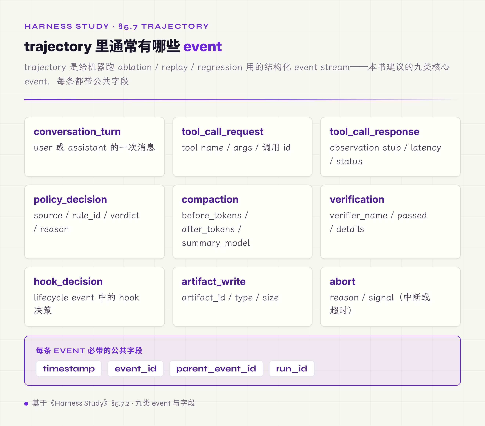

# 5.7 Trajectory · Event Stream · **P0 · 运行时与跨 run 两面**

第七个机制是 agent 一次 run 跑完之后留下的执行历史：所有轮次的 thought / action / observation 三元组，加上工具调用细节、policy 判定、上下文压缩（compaction）的触发、verifier 结果。这些数据合起来组成 trajectory（轨迹）这一层。§5.6 末尾已经讲过 observation 与 trajectory 协同存储，本节的主线是 trajectory 本身怎么设计和管理。

为什么 trajectory 不是 log？和 §5.6 讲 observation 时一样，有两层论点。

- **第一层来自读者**：trajectory 的主要读者不是人，而是消融工具、verifier 调试器、回放引擎、自我改进的演化程序（evolver）。这些读者靠结构化的事件流和严格的字段 schema 读 trajectory，不靠人类语义理解。所以 trajectory 文件不是给值班工程师看的 log，而是给自动化分析用的数据资产。
- **第二层来自用途**：trajectory 是消融、回放、回归测试、自我改进这四项工程能力的基础。没有 trajectory，你没法消融某个机制看 agent 表现有什么差别，没法重放一次 run 来调试 verifier，没法验证新版 harness 有没有回归，也没法拿历史 trajectory 喂给自我改进的演化程序。这四项能力合起来，构成改进 harness 的核心闭环。

上面四项都是 run 跑完之后的**事后**用途。trajectory 还有一个常被忽略的**运行时**价值：**它是 agent 能"回退"的前提**。agent 跑长任务难免跑偏：上下文被一批无关 observation 污染，顺着一条错路走了五六步，或者整个上下文偏到了错误方向。没有回退，agent 只剩两条坏路：带着污染继续跑（越跑越偏），或者整个任务推倒重来（前面几十轮全部作废）。harness 凭 trajectory 逐轮的结构化记录，加上 artifact 的版本，可以在每个干净的轮次上存检查点（checkpoint）；一旦 verifier 或人发现跑偏，就能把**消息（上下文历史）和产物（artifact）一起回退到某个正确的轮次**，从那里重新往下走。

这种回退能力直接体现了 harness 的可控性。这里借用控制论的三个说法（取工程义，第九章详述）：可观测（从 trajectory 能看出从哪一轮开始偏），可控（能退回那一轮），闭环（退回后接着跑），三者在这一个功能上同时成立。工程上它有三条硬要求：

1. trajectory 每一轮的状态必须可寻址，回退要能定位到具体轮次；
2. artifact 必须有版本，而不是原地覆盖，否则产物退不回去；
3. 检查点粒度要与回退成本平衡：每轮都存开销大，太稀又找不到合适的回退点。

trajectory 与 observation 是一对多的关系：trajectory 是事件流（event stream）的容器，observation 是流里的一类元素。一轮之内有 thought 事件、tool_call_request 事件、tool_call_response 事件（里面带 observation）、policy_decision 事件，等等。本书建议的事件分类核心有 9 类，完整实现通常有 10–15 类，覆盖一轮之内所有结构化事件。这套分类与 §5.6 观测面的 stub/body 分离是配合使用的：trajectory 装事件，observation 的 stub 作为其中一类事件的内容，body 另存。

主要的 trajectory 实现路径在 §5.6.6 已经对照过：SWE-agent 用单个 JSON 文件；据公开分析，Claude Code 用 JSONL 一行一个事件；Codex CLI 用 Rollout 格式；LangSmith 用云端 trajectory 加 UI；OpenInference 用兼容 OTel 的 schema。本节聚焦 trajectory 自身的设计：事件分类、存储格式、可回放性、与 OTel 的衔接、反模式，不重复 §5.6 讲过的 observation 与 trajectory 协同部分。

后面八个小节依次是：trajectory 与 log 的根本区别、事件分类（核心 9 类）、单 JSON 与 JSONL 两种存储路径、OTel GenAI 语义约定与 W3C Trace Context、可回放性设计、反模式（trajectory 缺失、冗余、不可 diff）、trajectory 作为自我改进的数据源、起步建议。前五个小节是 trajectory 设计的基础，第六小节讲反模式，第七小节呼应 §5.6.7，从 trajectory 的角度讲自我改进，第八小节从四个方面给起步建议。

#### 5.7.0 本节首次出现的术语

§一到§六已经解释过的术语（schema、trajectory 的概念、verifier、消融、observation、上下文、OTel GenAI 语义约定、W3C Trace Context、SWE-agent、JSONL、Rollout、自我改进 agent 等）不再重复。这里只列本节首次出现的术语。

**trajectory 设计术语**

- **事件流**（event stream）：trajectory 的存储形态，一系列按时间戳排序的结构化事件。常见两种形态：JSONL 一行一个事件，便于追加、可以流式处理；单个 JSON 一个 run 一个文件，便于渲染和人工审阅。
- **事件分类**（event taxonomy）：trajectory 里各类事件的分类。本书建议的命名核心有 9 类：conversation_turn、tool_call_request、tool_call_response、policy_decision、compaction、verification、hook_decision、artifact_write、abort；完整实现通常有 10–15 类。
- **span**：OpenTelemetry 的概念，一段时间内的一个工作单元，有开始和结束时间戳、状态、属性。trajectory 与 OTel 对接时，一轮通常对应一个 span，一个事件通常对应 span 的属性或 span event。注意本书的 trajectory 是持久化的事件流，OTel 的 trace 是由埋点直接产出的 span 树，两者可以互相映射，但不是一回事。
- **.traj**：SWE-agent 的 trajectory 单 JSON 文件格式，文件名 `<instance_id>.traj`，配 .html 渲染供人工检查。

**trajectory 用途术语**

- **可回放性**（replayability）：用 trajectory 里录下的模型输入输出代替再次调用模型，让消融、verifier 调试、回归测试少花真实的模型调用预算。要注意它的边界：回放只能复现到**分叉点**为止。一旦新逻辑让某一步的输入与录制时不同（换了 prompt、换了工具实现、换了 verifier），从这一步起模型面对的是录制里没有的输入，之后的轮次要么重新调用模型，要么用录制下来的响应做桩（mock，按输入匹配返回录制结果，只在输入没变时有效）。
- **回放**（replay）：用 trajectory 数据重新推进一次 run。在分叉点之前不调用真模型，是消融和 verifier 调试的基础工具。消融改变了某个机制，通常会很快产生分叉，所以回放能省下分叉点之前的调用，省不掉之后的。
- **回归测试**（regression test）：比较新旧两版 harness 在同一组任务上的结果是否一致，是 harness 改动前后的质量关口。
- **event_id 与 parent_event_id**：trajectory 内事件的因果关系字段，让事件流成为可追溯的有向无环图（DAG），而不只是时间序列。每条事件都要有这两个字段，才能跨轮次重建因果链。

**评测工具术语**

- **Inspect AI**：英国 AI Security Institute（AISI，2025-02-14 由 AI Safety Institute 更名）与 Meridian Labs 共同开发的开源 agent 评测框架，GitHub 仓库在 UKGovernmentBEIS 名下。它为每次评测记录日志，可以逐条查看每个样本的消息与工具调用，是常用的开源评测框架之一。
- **NexAU**：AHE 论文配套的 harness 底座。它把 harness 拆成 7 类相对独立、以文件为单位的组件，每个都纳入 git 管理，可审计、可回退，是 AHE"用运行数据驱动 harness 改进"落到具体 trajectory 与 observation 管道上的实现。

#### 5.7.1 trajectory 跟 log 的根本区别

trajectory 与普通 log 同样是写到磁盘的执行历史，但用途不同：log 是给值班工程师 grep 关键字找根因用的非结构化文本流，trajectory 是给自动化流程跑消融、回放、回归测试、自我改进用的结构化事件流。两者的工程要求也就完全不同。普通 log 关心"人能不能读懂"：可读性、便于 grep、时间戳精度。trajectory 关心"机器能不能回放"：schema 稳定、事件之间有因果关系字段、字段的序列化格式跨版本兼容。

把 trajectory 当 log 写是常见的错误起点。最典型的表现是用 print 语句或 log4j 那一套写 trajectory，时间、级别、消息三项就完事。这样的 trajectory 让消融做不了：你想消融某个机制看 agent 表现差异，但 log 里没有结构化的机制事件，只有"INFO: tool xxx called with args"这种半结构化文本，机器解析不了。也让 verifier 调试做不了：你想重放某次失败的轮次，看 verifier 哪一步出错，但 log 里没有模型输入输出的完整记录，只有"WARN: verifier failed"这种结论性文本，重放不了。

trajectory 设计的基本要求是一组"可回放的字段"：每一轮都要留下足够的数据，让消融工具能完整重建那一轮的执行状态。最低限度是两部分：

- **模型的完整输入**：system prompt、工具描述、对话历史、用户消息；
- **模型的完整输出**：推理内容、tool_calls、文本响应。

缺了其中任何一部分，trajectory 就退化成只能给人看的 log。完整输入每轮都存，体积会增长得很快；好在每一轮的输入大部分是上一轮输入的前缀，可以用前缀去重或只存增量来控制体积（见 §5.7.6 关于冗余的讨论）。

#### 5.7.2 事件分类：trajectory 里通常有哪些事件

trajectory 是事件流，事件有分类。完整实现通常有十多类，覆盖一轮之内所有结构化事件。

下面是本书建议的核心 9 类（命名是本书的建议，各 harness 叫法不同，但大多有对应物）：

1. **conversation_turn**：用户或 assistant 的一次消息。
2. **tool_call_request**：agent 请求调用工具，包含工具名、参数、调用 id。
3. **tool_call_response**：工具返回，包含 observation stub、延迟、状态。
4. **policy_decision**：Safety 控制面或 ToolPolicy 这类机制的判定结果，包含来源、规则 id、判定、理由。
5. **compaction**：上下文压缩触发，包含压缩前后的 token 数、生成摘要所用的模型。
6. **verification**：verifier 判定结果，包含 verifier 名称、是否通过、详情。
7. **hook_decision**：生命周期事件上 hook 的决策，与 policy_decision 结构相同，只是来源不同。
8. **artifact_write**：agent 写入持久存储，包含 artifact_id、类型、大小。
9. **abort**：agent 中断或超时，包含原因、信号。

*图 5.19 · trajectory 的九类 event 与公共字段*

每条事件都必须有几个公共字段：

- **timestamp**：毫秒级或微秒级精度，不能只到秒；
- **event_id**：这条事件的唯一标识；
- **parent_event_id**：这条事件的因果父事件，让事件流成为可追溯的 DAG，而不只是时间序列；
- **run_id**：这条事件所属的 run。

run_id 让事件在跨 trajectory 文件聚合时不会混淆；event_id 与 parent_event_id 让回放和消融能精确重建因果链。比如"这条 verification 失败是由哪条 tool_call_response 引起的"，这种因果关系不能靠时间戳加启发式规则去猜，必须有显式字段。这种按 DAG 设计的做法，是 trajectory 与早期日志设计的关键区别。

#### 5.7.3 单 JSON 与 JSONL：两种存储路径的取舍

trajectory 的存储主要有两条路径：单个 JSON 文件（一个 run 一份）和 JSONL（一行一个事件）。两者在消融、回放、回归测试这几种用途上各有取舍。

单 JSON 的代表是 SWE-agent 的 .traj 文件：文件名 `<instance_id>.traj`，包含全部轮次的 thought/action/observation 三元组，配 .html 渲染供人工检查。优势是整体可读：把整个 run 当一份结构化文档处理，适合消融时对整批 trajectory 做批量分析，也适合人审时把整个 run 渲染在一个 .html 里。劣势是不便追加：run 跑到一半时 trajectory 只写了一半，想加新事件就得重写整个 JSON，或者用流式 JSON 解析器（很多人嫌麻烦）。所以单 JSON 更适合短 run 和人工审阅的场景。

JSONL 的代表是 Claude Code（据公开分析，它用 JSONL 事件流，observation 是独立的事件类型，并用 hook 在生命周期事件上做定点注入）和 OpenAI Codex CLI（Rollout 文件格式）。优势是便于追加、可以流式处理：run 进行中每条事件直接追加到文件末尾，不用重写整个文件，分析工具还能流式跟踪 run 的进度。劣势是单看一行看不到全局，人审时需要工具把 JSONL 渲染成结构化视图（比如 LangSmith 的 Threads 标签页或 .html）。所以 JSONL 更适合长 run 和自动化流程。

怎么选取决于 harness 的主要用途。run 普遍较短（10–30 轮，经验值）且需要人审的评测 harness 用单 JSON，适合 SWE-agent 这类学术 benchmark 场景。run 普遍较长（50 轮以上，经验值）、生产量大的编码 agent harness 用 JSONL，适合 Claude Code、Codex CLI 这类生产工具。如果要同时支撑两种用途，一种常见做法是底层用 JSONL 持久化，再加一个渲染器在请求时实时聚合成 .traj.json：存储侧便于流式写，消费侧便于整体审阅。

#### 5.7.4 OTel GenAI 语义约定与 W3C Trace Context

不少厂商和框架正在向 OpenTelemetry GenAI 语义约定（GenAI semantic conventions）靠拢。这套约定为 agent 的可观测性统一用词：span 命名、属性键、指标名称、事件形态，都有 OTel 的特别兴趣小组（SIG）在制定。截至 2026 年中期，这套约定整体仍处于 Development 状态（OTel 现行成熟度体系中的最低一级，取代了旧称 experimental）：客户端 span 以及 agent 的 span、事件、指标都还没有稳定版，agent span 在 2026 年上半年仍有不兼容的改动（如 invoke_agent span 的拆分调整）。对接 OTel 是正确方向，但要按"约定还会变"来设计，这与 trajectory 自己的 schema 版本管理是同一个原则。约定覆盖四部分：LLM 客户端 span、agent span、用于记录 prompt 与输出内容的事件、指标。

agent span 部分给 trajectory 设计的具体思路是：agent 跑一次 run，每次工具调用、每次模型调用、每个检索步骤都成为一个子 span，整个 run 的 span 构成完整的推理链路。OTel 的 span 抽象与前面讲的 event_id / parent_event_id DAG 直接对应：span 有开始和结束时间戳、状态、属性、span_id、parent_span_id，属性字段承载 trajectory 的具体业务数据（模型名、token 用量、工具名、verifier 判定等）。trajectory 对接 OTel 的具体做法，就是一轮对应一个 span，一个事件对应 span 的属性或 span event。

在采纳层面，Datadog、Honeycomb、New Relic 等可观测性厂商已经支持 OTel GenAI 语义约定，LangChain、CrewAI、AutoGen、AG2 等框架可以原生发出符合 OTel 的 span，或通过埋点包接入。这让 OTel 正在成为跨 harness、跨厂商交换 trajectory 数据的一种通用接口。

OTel GenAI 语义约定与 W3C Trace Context 是两层东西，并不同源。W3C Trace Context 是跨服务传递 trace 标识的请求头格式，分布式追踪用了多年；GenAI 语义约定是 OTel 内部针对生成式 AI 的属性命名约定。前者管"trace 标识怎么在服务之间传下去"，后者管"span 上的属性叫什么名字"。两者配合，agent 的 trajectory 就能直接接入企业已有的分布式追踪管道，不需要为 agent 单独建一套追踪基础设施。

#### 5.7.5 可回放性设计：trajectory 的核心能力

trajectory 的核心能力是可回放性：用 trajectory 里录下的模型输入输出代替再次调用模型，让消融、verifier 调试、回归测试少花真实的模型调用预算。有了它，harness 改动前后的对比可以变成"在历史 trajectory 上重跑新逻辑，看输出差异"，至少在分叉点之前不必每次都调真模型、耗 token、等延迟。

可回放性设计有三项基本要求：

1. **模型输入输出完整持久化**。§5.7.1 已经讲过，trajectory 必须保留完整的 system prompt、工具描述、对话历史，以及模型输出（推理内容、tool_calls、文本响应）。缺了其中任何一项，回放就无从谈起。
2. **确定性回放**。同样的录制数据交给回放引擎，回放出的中间步骤应该与原 trajectory 一致。这要求 trajectory 字段严格序列化，不能有"随机生成的对象 id"这类无法复现的隐含状态。
3. **暴露替换点**。回放时要测试新版 harness，就得能在 trajectory 的某个位置替换决策（换一个 verifier、换一个 prompt、换一个工具实现）再往后跑，看新逻辑对后续轮次的影响。这一步有明确的边界：替换点就是分叉点。从这里往后，模型看到的输入与录制时不同，录制的响应不再对应，后续轮次要么重新调用模型，要么用录制响应做桩（只对输入没变的调用有效）。所以替换点的设计是消融的基础，但回放能省的只是分叉点之前的调用。

几个主要平台在可回放性上各有做法。Phoenix（Arize）做 agent 调用图可视化：把 trajectory 的 span 结构渲染成节点图，子 agent 的嵌套层级一目了然，配合 Agent Replay 重放 agent 交互、调试工具调用。LangSmith 提供逐步回放和 thread_id 共享，例如把同一会话的所有轮次标上同一个 thread_id，由 Threads 标签页自动聚合渲染。Inspect AI（AISI 与 Meridian Labs 共同开发）为每次评测记录完整日志，便于逐条检视和复查。

还在演进的是回放与自我改进的配合：回放不只是调试工具，也能降低自我改进的演化程序做实验的成本。AHE 论文的 NexAU 底座是这方面的一个例子：演化程序要在历史 trajectory 上比较不同 harness 配置，回放能复用分叉点之前的部分，分叉之后仍要真实运行。

#### 5.7.6 反模式：trajectory 缺失、冗余、不可 diff

trajectory 设计有三类常见的反模式（anti-pattern）：trajectory 缺失、trajectory 冗余、trajectory 不可 diff。

**trajectory 缺失**最常见：agent 跑完没留 trajectory，或者只留摘要级的记录（"run 完成，共用 token 12345，总耗时 67s"）。这样的 trajectory 让消融、回放、回归测试都做不了，等于没有 trajectory。常见根因是工程师把 trajectory 当 log，认为生产环境的 run 不需要那么详细的记录。但 trajectory 不是 log，它的用户是自动化流程，生产环境反而比开发环境更需要完整的 trajectory。判断条件：trajectory 文件能不能让一个新工程师重建出整个 run 的执行状态，不能就是缺失。

**trajectory 冗余**是另一端：什么都往 trajectory 里写，包括调试用的中间状态、临时变量、内部 trace 等。问题是后续分析跑不动，消融工具读一个 run 要解析 50MB 的 JSON，真正有用的字段只有几 KB。判断条件是 trajectory 文件大小与有用事件数的比值：一个 50 轮的 run，trajectory 超过 5MB（经验值，按场景调整）且大部分是重复字符串、中间状态转储，就已经冗余了。

这里要和 §5.7.1 的要求区分开：完整的模型输入是必须保存的，不算冗余；冗余指的是调试转储这类对回放和分析没有用的内容。完整输入本身的体积，用前缀去重或只存增量来控制，不要为了压体积去删必要字段。对策是按事件分类严格归类，不在 trajectory 这一层做调试日志，调试状态走单独的日志通道，不进 trajectory。

**trajectory 不可 diff**最隐蔽：trajectory 字段里有随机 id、精度过高的时间戳（纳秒级）、没有规范的浮点数序列化，结果同一组任务跑两次，trajectory 文件 diff 出一堆虚假差异。这会让回归测试完全失效：基准 trajectory 与新版 trajectory 总是有差异，工程师分不清哪些是真回归、哪些是噪声。对策是把 trajectory 字段分成两类：

- **稳定字段**：模型名、工具名、判定结果、event_id 因果链等业务事实；
- **易变字段**（volatile）：时间戳、随机 id、延迟等环境状态。

回归测试 diff 时只比稳定字段，忽略易变字段。这是认真做 trajectory 回归测试的前提。

diff 分类做对之后，最后一步是接进 CI：选一组基准任务，把它们的 trajectory 存进仓库；每次 harness 改动都用回放重跑这组任务，只 diff 稳定字段，这就是 harness 自己的回归测试。改动影响到的那一轮就是分叉点，之后的轮次要重新调用模型（或对输入未变的调用用录制响应做桩），diff 要从分叉点开始看。改了压缩策略，diff 会告诉你哪些轮次的上下文拼装变了；改了 ToolPolicy，diff 会告诉你哪些调用从放行变成了拦截。没有这一步，每次 harness 改动的影响范围全靠工程师猜；有了这一步，影响范围就是 CI 输出里一行行可读的差异。

还有一类隐蔽的反模式，与 §5.6.5 讲的 observation 不脱敏是同一个问题：trajectory 持久化时没做脱敏，凭据、PII、API key 一进 trajectory 文件就跨 run 持久保存。OTel GenAI 语义约定也把 prompt 与输出内容的采集当作敏感项单独处理。在 trajectory 写出之前挂一个脱敏 hook，是常见做法。trajectory 入口比 observation 入口更深一层：observation 进上下文是在一轮之内，trajectory 写进文件是 run 结束后跨轮次持久保存，所以脱敏必须在 trajectory 写出之前做，不能事后再清。

#### 5.7.7 trajectory 作为自我改进的数据源（含 harness 优化与模型训练）

从跨 run 的角度看，trajectory 的角色与 §5.6.7 讲的观测面一样，是自我改进的数据来源。trajectory 不只是消融、回放、回归测试的基础，也是自我改进 agent 用来优化 harness、甚至训练模型的具体数据。

一批研究已经把这件事做成了具体方法。AHE（Agentic Harness Engineering）[^ahe-2026]的演化循环直接读取历史 trajectory 来优化 harness 配置（Terminal-Bench 2 上的具体增益见 §5.6）。AgentHER[^agent-her-2026]（论文标题意为"用于 LLM agent 轨迹重标注的事后经验回放"）做得更具体：用四阶段流程（失败分类、结果提取、LLM 引导的 prompt 重标注、数据打包）把历史 trajectory 自动转成可训练的标注数据。AgentEvolver[^agent-evolver-2026]通过自我提问自主生成任务，MemGen[^memgen-2026]用生成式隐式记忆，都属于"agent 用自己生成的经验作为自我提升信号"这一路径，减少了对人工标注的依赖。

把 trajectory 用作自我改进的数据，对 trajectory 设计有几条额外要求：

1. **schema 稳定，保证跨 run、跨版本可比**。如果某次 harness 升级后字段名变了，旧 trajectory 就不能再喂给新版演化程序。这方面的 schema 迁移做法还在演进。
2. **结果归因必须显式**。trajectory 末尾要明确标注"这次 run 是通过还是失败，哪几轮是关键决策点"，否则演化程序不知道哪些 trajectory 是正例、哪些是负例。
3. **trajectory 与任务标准答案关联存储**。自我改进需要 trajectory 与任务的标准答案（ground truth）配对；没有配对的 trajectory 只能做无监督的探索，不能做有监督的优化。

第一条的 schema 稳定不能只靠自觉，要有具体机制：每条 trajectory 带一个 trajectory_schema_version 字段；schema 演进只加字段，不删字段、不改字段含义（新字段给默认值）；消费端按版本号选择读取器，旧读取器读新文件时忽略新字段，新读取器读旧文件时用默认值补上。什么时候允许不兼容的改动？答案接近"永不"：宁可新起一个 v2 事件类型并行写一段时间，也不要让半年前的 trajectory 变成读不动的死数据，它们是你积累下来最贵的资产。

承担这个数据源角色的，是 §5.6.8 讲的那组 harness 内部组件：MechanismEvent 四态（每个机制每次检查都报告触发、跳过、阻断、出错四种状态之一）、absence-of-event（本该发出的事件没有出现，说明机制在运行时没接上）、决策点记录（在做决策的地方记录"为什么这样做"，而不只记录"做了什么"）、ObservationPack（作者对 stub/body 分离的具体实现）。有了它们，trajectory 既能喂当前推理，也能给 harness 跨 run 的自我改进循环提供数据。和观测面一样，这是 harness 自身的能力；上面那层外层工作台（Harness Lab，第七章）只是消费 trajectory 的进阶选项，不是前提。

#### 5.7.8 起步建议：四个方面

**注意什么**：trajectory 设计最大的坑是把 trajectory 当 log 写。可以对照四个指标：

1. trajectory 文件能不能让新工程师重建整个 run 的执行状态，不能就是缺失；
2. trajectory 大小与有用事件数的比值，50 轮的 run 超过 5MB（经验值）且大部分是重复字符串，就是冗余；
3. trajectory 字段有没有分成稳定与易变两类，没有就埋下了不可 diff 的隐患；
4. trajectory 持久化之前有没有 PII 脱敏 hook，没有就有凭据跨 run 泄漏的隐患。

从第一天就按可回放的字段集设计 trajectory，别一开始按 log 的标准写。上线后再改 trajectory schema 要迁移历史数据，代价很高。

**怎么设计**：

- 事件分类用本书建议的核心 9 类（conversation_turn、tool_call_request、tool_call_response、policy_decision、compaction、verification、hook_decision、artifact_write、abort）打底，完整实现通常扩展到 10–15 类；每条事件都有 timestamp、event_id、parent_event_id、run_id 四个公共字段。
- 存储格式按 run 长度选：短 run 且需要人审，走 SWE-agent .traj 的单 JSON 路径；长 run 且生产量大，走 JSONL 路径（Codex CLI 的 Rollout 格式、Claude Code 的 JSONL 都是例子）。
- 完整模型输入用前缀去重或只存增量来控制体积。
- OTel GenAI 语义约定仍在制定中，想避免厂商锁定就跟着 OTel 走：一轮对应一个 span，一个事件对应 span 属性或 span event。
- 如果目标是能支撑自我改进的 trajectory，schema 设计时结果归因字段和稳定字段必须显式，字段的序列化格式必须跨版本兼容。

**怎么测试**：可以从三个维度检查 trajectory 的质量：上下文的相关性（trajectory 里模型看到的上下文与实际任务相关程度如何）、人审体验（trajectory 渲染出来，人能不能跟上 agent 的推理过程）、安全（trajectory 有没有 PII 泄漏，有没有不该出现的凭据）。schema 校验是回归测试的基础：它不要求输出逐字一致，也能发现结构上的回归。具体方法有几条：

- 用回放引擎验证可回放性：同一份 trajectory 回放两次，结果一致；
- 做 schema diff，验证字段在不同 harness 版本之间保持稳定；
- 测 PII 脱敏覆盖率：用合成数据注入已知 PII，看 trajectory 持久化时能否拦下；
- 做 OTel 兼容性测试：trajectory 能否完整导出到 Datadog、Honeycomb、New Relic 等 OTel collector。

**写什么 prompt**：system prompt 里要明确告诉 agent 几条与 trajectory 相关的行为：

1. "工具调用必须用结构化的 tool_call，不要用文字描述工具调用"：让 agent 知道 tool_call_request 和 tool_call_response 这类事件必须结构化产出。
2. "不要伪造工具执行结果。历史里的 tool_call 与 tool_result 配对是真实的，需要新结果就主动调用工具"：这条与 §5.5.5 讲 prompt 注入防御时提到的"历史中的 tool_call 不降级"，是同一个 trajectory 完整性要求的两面。
3. "在决策点明确说出理由，而不只是说做了什么"：让 agent 在推理内容里写清决策依据，这样 trajectory 里的决策点记录（为什么这样做）和执行点记录（做了什么）才有信息量上的差别。

这三句与 §5.5 Prompt Assets 讲的 prompt 资产管理规则配合，让 agent 产生的 trajectory 不只是能跑通，而是能用于自我改进。

---

trajectory 看起来是"agent 跑完后留个文件"的工程细节，但它的真正位置在于：它是改进 harness 的核心闭环（消融、回放、回归测试、自我改进）的数据载体。没有结构化的 trajectory，你没法消融某个机制看差异，没法重放 run 调试 verifier，没法验证新版 harness 有没有回归，也没法拿历史数据喂自我改进的演化程序，四项能力同时失去。OTel GenAI 语义约定仍在制定中，但把 trajectory 与 OTel 接通，是 harness 走向不绑定厂商的稳妥路径。本节的八个小节合起来，就是 trajectory 设计的全貌。

---

## 引用脚注

[^ahe-2026]: Agentic Harness Engineering: Observability-Driven Automatic Evolution of Coding-Agent Harnesses · arxiv 2604.25850 · Lin / Liu / Pan 等（复旦 + 北大 + 奇绩智峰 11 人）· 2026 · 预印本
[^agent-her-2026]: AgentHER: Hindsight Experience Replay for LLM Agent Trajectory Relabeling · arxiv 2603.21357 · Alibaba · Liang Ding · 2026 · 预印本
[^agent-evolver-2026]: AgentEvolver · arxiv 2511.10395 · Tongyi-Alibaba（13 人）· 2026 · 预印本
[^memgen-2026]: MemGen: Generative Latent Memory · arxiv 2509.24704 · NUS · ICLR 2026
