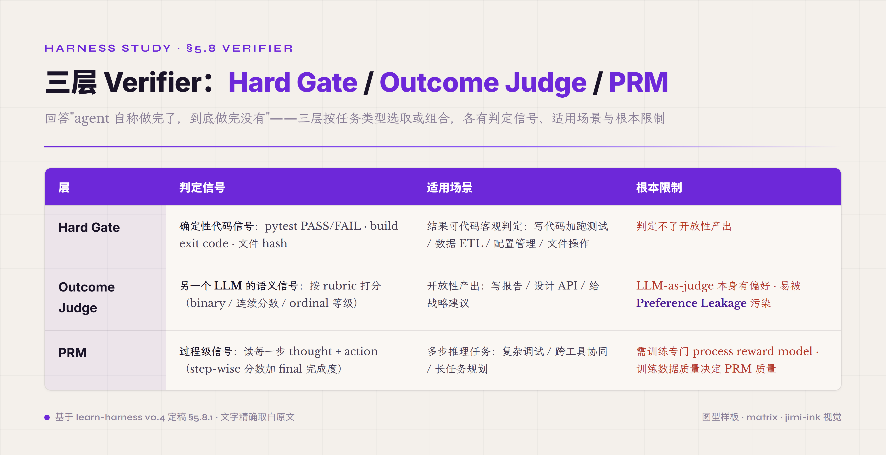
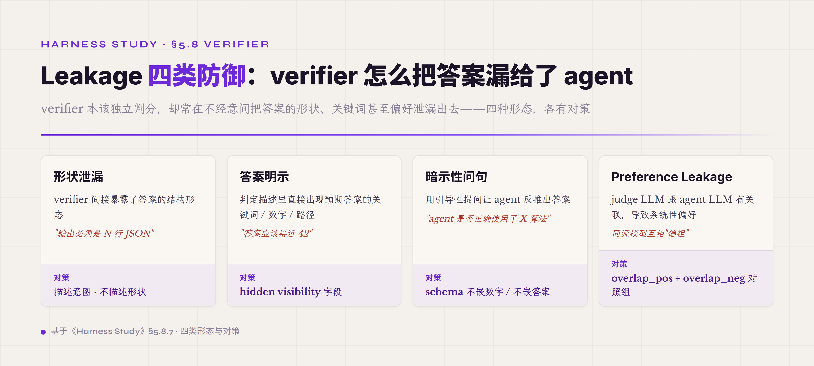

# 5.8 Verifier 三层 · **P0 业界共识 · 防 agent 自欺骗的工程化基础**

第八件机制是 agent 跑完一步动作之后判断这步算不算合格的独立判定机制——也就是 verifier。前面 §5.7 末尾讲过 trajectory 是 ablation / replay / regression / self-evolution 四件能力的物理载体——但 trajectory 本身只是数据 · 数据要变成"agent 做对了还是做错了"的工程结论 · 必须经过 verifier 这一层。verifier 是 agent harness 工程治理里一个特殊的件——它不直接帮 agent 完成任务 · 它只回答一个问题："agent 自己说做完了 · 它到底做完没有"。

为什么要单独抽出 verifier 这一机制？答案藏在 agent 工程的一个根本困境里——**模型是个 next-token predictor · 它最擅长的能力之一就是把一个未完成的任务包装成像完成了的样子**。这件能力在写作 / 对话 / 翻译等场景没问题 · 因为读者是人类 · 人能直接判断结果好不好。但在 agent 跑工具调用 / 写代码 / 跑分析这种工程任务里 · 这件能力就变成系统性风险——agent 跑完一个 task 报告"我修好了那个 bug" / "我跑通了那个 test" / "我把那份报告写完了" · 但实际上 bug 没修好 / test 没跑通 / 报告漏了关键逻辑。如果让 agent 自己说自己做完了就算完成 · agent 跑长任务时会用越来越大的概率给出虚假完成报告——这件不自欺骗的工程化兜底就是 verifier 这一机制的根本必要性。

verifier 这一机制的工程哲学跟前面几件机制都不同。前几件机制（Agent Loop / Model Adapter / Tool Registry / Context-Memory-Artifact / Prompt Assets / Observation Surface / Trajectory）都是让 agent 跑得更好的工程基础——它们的设计目标是让 agent 能完成任务。verifier 是反方向——它的设计目标是让 agent 不能虚假声称完成任务。前者是助力 · 后者是制衡。两件合起来构成 agent harness 的内在 checks-and-balances · 让 agent 跑得既能跑得动也跑得真。

2026 业界对 verifier 工程治理已经收敛到一个相对稳定的三层 framing——**第一层 Hard Gate（RLVR · Reinforcement Learning from Verifiable Rewards）**：用代码确定性判定 agent 做没做完 · 比如 pytest 通过 / build 编译过 / 文件存在 / API 返回 200 等可以直接 yes/no 判定的标准。**第二层 Outcome Judge（LLM-as-judge）**：用另一个 LLM 对开放性产出做语义判定 · 比如"这份报告逻辑通顺吗" / "这段代码注释清晰吗" / "这次回复回答了用户问题吗"这种没有 ground truth 的开放性问题。**第三层 PRM（Process Reward Model）**：对 agent 推理过程做步骤级判定 · 不只看结果对错 · 还看推理路径是否合理 · 比如"这一步工具调用是不是正确选择" / "这一步思考有没有遗漏关键约束"。三层各自有适用场景跟常见误区 · 业界共识强但每层都还在快速演进。

三层不是简单叠加 · 是按任务类型选取或组合。完全确定性的任务（写代码加跑测试 / 数据 ETL / 配置管理）只需要 Hard Gate；纯开放性任务（创意写作 / 设计建议 / 战略分析）需要 Outcome Judge；多步推理任务（复杂调试 / 跨工具协同 / 长任务规划）需要 PRM。生产 harness 通常组合使用——business agent 跑客户支持任务的 verifier 链可能是 "Hard Gate 验证工具调用参数合规 → Outcome Judge 验证回复内容相关性 → PRM 验证多轮对话推理合理性"。这种组合不是设计选择空白处的优化 · 是 verifier 工程治理走向严肃 production 的必经之路。

后面九子节按"三层 verifier 概览 + 三层适用场景 → 第一层 Hard Gate / RLVR → 第二层 Outcome Judge / LLM-as-judge → 第三层 PRM → 三层组合策略 → 常见误区 · Reward Hacking 跟 verifier 自身可信度 → Leakage 四条防御 → 业界实现对照 → 起步建议"展开。前五子节业界共识基础 · 第六七子节专门讲常见误区跟 leakage 防御（业界 2026 重点） · 第八子节业界实现对照 · 第九子节给四维度起步建议。

#### 5.8.0 本节首次出现的术语

§一-§七前面已经解释过的术语（schema / verifier 概念 / trajectory / observation / artifact / ablation / reward hacking 一般概念等）下面不再重复。这里只列 §5.8 本节首次出现的术语。

**三层 verifier 核心术语** —— **三层 verifier**（业界 2026 收敛的 framing · Hard Gate 加 Outcome Judge 加 PRM · 按任务类型选取或组合）。**Hard Gate**（第一层 verifier · 用代码确定性判定 agent 是否做完 · 比如 pytest 通过 / build 编译过 / 文件存在 · 业界 RLVR 路径的核心机制）。**RLVR · Reinforcement Learning from Verifiable Rewards**（2026 dominant paradigm for scaling reasoning · rule-based functions assess correctness · binary reward 1/0 · 不依赖 subjective human evaluations 也不依赖 learned reward models）。**Outcome Judge**（第二层 verifier · 用另一个 LLM 对开放性产出做语义判定 · LLM-as-judge 是它的具体技术名 · 业界标准化网站在 llm-as-a-judge.github.io）。**LLM-as-judge**（用 LLM 对 agent 输出做评分 · 业界 2026 主流 outcome verifier 实现路径）。**PRM · Process Reward Model**（第三层 verifier · 对 agent 推理过程做步骤级判定 · 不只看结果对错也看推理路径合理性 · 2026 业界研究热点 · 代表工作 AgentPRM 跟 ToolPRMBench）。

**常见误区术语** —— **Reward Hacking**（agent 找 verifier loophole 通过形式 reward 不完成实际任务 · 是 RLVR 系统的核心常见误区 · 业界 2026 公开 paper 数十篇专门研究 · 代表 "LLMs Gaming Verifiers"[^llm-gaming-verifiers-2026]）。**Preference Leakage**（LLM-as-judge 跟 synthetic data generator 关联导致的污染[^preference-leakage] · 三类关联——same model / inheritance / same model family · 即使少量 leaked synthetic data 也会引发 preference leakage 难以检测）。**benchmark contamination / evaluation awareness**（公开 benchmark 可信度的两类问题 · 一类是训练阶段数据污染 · 一类是模型识别"我在被测"后行为漂移 · Meta Muse Spark 2026-04 报告显示模型在公开 benchmark 上 flagged as evaluations 19.8% vs 内部 2.0%——后者属 evaluation awareness）。**verifier gaming**（agent 学会欺骗 verifier 而不是完成任务 · Reward Hacking 的具体行为表现 · "LLMs Gaming Verifiers"[^llm-gaming-verifiers-2026] 名标）。

**Leakage 防御术语** —— **形状泄漏**（verifier 间接暴露答案形状 · agent 反向推出预期输出 schema 然后填空 · 比如 verifier 说"输出必须是 N 行 JSON" agent 就专门生成 N 行 JSON 不管内容）。**答案明示**（verifier 说出预期答案的关键词 / 数字 / 路径 · agent 直接复用 · 比如 verifier 说"答案应该接近 42" agent 输出 41 或 43 蒙混过关）。**暗示性问句**（verifier 用引导性提问让 agent 反推答案）。**overlap 对照组**（业界 leakage 防御主流路径 · 用 overlap_pos 跟 overlap_neg 两组对照让 verifier 自己判定哪些是真信号哪些是 leakage 噪音）。

**组合策略术语** —— **composite reward / hybrid verifier**（多层 verifier 协同 · 2026 业界讨论的 RLVR 反 Reward Hacking mitigation 路径之一 · 一个具体实例[^composite-rewards-2026] · 医疗 QA 领域小模型实验 · 非业界主流定论）。**co-evolving policy-reward**（policy 跟 reward 协同进化 · 防 Reward Hacking 的高阶策略 · 业界 2026 研究方向之一）。**verifier composition**（多层 verifier 组合方法学 · 业界主流 mitigation 实现路径）。

#### 5.8.1 三层 verifier 概览 · 各自能做什么不能做什么

三层 verifier 不是按"verifier 复杂度"分层 · 是按 verifier 用什么信号做判定分层。**Hard Gate 用确定性代码信号**——pytest 输出 PASS / FAIL / build exit code 0 或非 0 / 文件 hash 等于预期值或不等于。这一层判定结果是 binary · 没有歧义 · agent 跑不出"接近通过"这种状态。**Outcome Judge 用另一个 LLM 的语义信号**——judge LLM 读 agent 的最终产出 · 按预定 rubric 打分 · 输出可以是 binary（通过/不通过）或者连续分数（0-10）或者 ordinal 等级（excellent/good/fair/poor）。这一层判定本质是"另一个 LLM 怎么看 agent 的产出" · 跟 Hard Gate 的客观信号根本不同。**PRM 用过程级信号**——PRM 读 agent 每一步的 thought 跟 action · 判定这一步在"完成最终任务"这件事上是不是合理的中间步骤 · 输出通常是 step-wise 分数加上 final task 完成度估计。这一层判定本质是"agent 的推理路径合不合理" · 跟前两层的"结果对不对"是垂直 framing。

三层各有适用场景跟根本限制。**Hard Gate 适用于结果可以代码客观判定的任务**——写代码加跑测试 / 数据 ETL / 配置管理 / 文件操作。Hard Gate 在这些场景里几乎是黄金标准——只要测试写得好 / 配置 schema 严 / 文件 hash 准 · agent 想造假很难。但 Hard Gate 的根本限制是**它判定不了开放性产出**——写一篇报告 / 设计一个 API / 给一个战略建议 · 没有客观代码能判 PASS 或 FAIL。强行用 Hard Gate 判这类任务会退化为"格式检查" · 比如检查 markdown 标题数 / 字数 / 关键词出现频率——这种检查容易被 agent gaming。**Outcome Judge 适用于开放性产出**——judge LLM 用语义判定填补 Hard Gate 的盲区。Outcome Judge 的根本限制是 **LLM-as-judge 本身有偏好 · 容易被 preference leakage 污染**——下面 §5.8.3 单独展开。**PRM 适用于多步推理任务**——agent 跑 10 轮、20 轮、50 轮的复杂任务 · Hard Gate 只能判最终结果 · 但中间某一步走错路径不一定影响最终结果（agent 可能绕远到达终点）· PRM 能捕捉中间的低效或错误。PRM 的根本限制是**它需要训练专门的 process reward model · 训练数据质量直接决定 PRM 质量** · §5.8.4 单独展开。

三层组合的工程价值在于**互相覆盖盲区**。Hard Gate 用确定性代码兜住"agent 说做完了但实际没做完"的最常见情况；Outcome Judge 在 Hard Gate 盲区（开放性产出）顶上加一层语义判定；PRM 在 Hard Gate 跟 Outcome Judge 都盲的"过程合理性"维度顶上加第三层。生产 harness 不会只用一层——只用 Hard Gate 在开放性任务上失效 · 只用 Outcome Judge 在 Preference Leakage 风险下不可靠 · 只用 PRM 训练成本高且 final outcome 没保证。组合策略下面 §5.8.5 展开。

#### 5.8.2 第一层 · Hard Gate / RLVR

Hard Gate 是 verifier 三层最古老也最稳的一层。在 agent harness 出现之前 · 软件工程已经用 Hard Gate 工程治理了几十年——pytest 跑通 / make build 编过 / type check 过 / lint 过都是 Hard Gate。这一机制移植到 agent harness 上几乎不需要工程改造——agent 写完代码 · harness 跑 pytest · pytest 通过 verifier 判 pass · 不通过 verifier 判 fail。

Hard Gate 在 agent 领域的工程框架在 2026 已经收敛到 RLVR——Reinforcement Learning from Verifiable Rewards。RLVR 是 2026 dominant paradigm for scaling reasoning capabilities in LLMs · 通过 rule-based functions 给 model 训练阶段提供 binary reward 信号——1 代表 verifier 通过 · 0 代表不通过。这种 reward 信号比 RLHF（Reinforcement Learning from Human Feedback）的 subjective human preference 更便宜更稳定 · 是 DeepSeek-R1 / OpenAI o1 等推理模型的核心训练范式。

RLVR 在工程层落地为 harness 里的 verifier 调用就是 Hard Gate——agent 跑完产出 · harness 跑 verifier 函数 · 函数返回 binary 结果。具体形态有几条业界主流路径：**测试驱动**——agent 写代码 · harness 跑 SWE-bench 风格 test suite · 测试通过算 verifier pass。**编译驱动**——agent 改代码 · harness 跑 build · build success 算 pass。**Schema 驱动**——agent 输出结构化数据 · harness 用 JSON schema validation 或者类型检查判 pass。**Hash 驱动**——agent 修改文件 · harness 比对文件 hash 跟预期 hash 判 pass。这几条路径合起来覆盖了软件工程领域 90% 的 verifier 场景。

Hard Gate 的工程优势是**几乎不会被 agent gaming**——pytest 通过就是通过 · 没有"接近通过" · 没有"看起来通过"。但 Hard Gate 的盲区是**它判定不了开放性产出**——前面已经讲过。还有一个隐性风险是**Hard Gate 测试本身可能写不全**——agent 写代码通过了所有 test · 但 test 没覆盖某个边界 · agent 在那个边界出错。这件不是 verifier 本身的问题 · 是 verifier 跟测试覆盖率的工程协同问题——业界主流路径是 verifier 覆盖率监控 + Hard Gate 跟 Outcome Judge 协同（Outcome Judge 读 agent 代码看有没有明显遗漏的边界）。

#### 5.8.3 第二层 · Outcome Judge / LLM-as-judge

Outcome Judge 用 LLM 对 agent 产出做语义判定 · 是 Hard Gate 盲区（开放性产出）的工程化补充。LLM-as-judge 是 Outcome Judge 的标准实现路径——业界已经建立专门的 community（llm-as-a-judge.github.io）跟 evaluation framework。基本 pattern 是 judge LLM 接收三件输入：agent 的最终产出 / 任务原始描述 / 评分 rubric · 输出评分结果（binary / 连续分数 / ordinal 等级）。

LLM-as-judge 的工程价值在于**它能在没有 ground truth 的开放性任务上提供半自动化判定信号**——写报告 / 给建议 / 做翻译这种任务 · 人审太慢 · Hard Gate 又判不动 · LLM-as-judge 在两者之间填空。但这一机制有一个 2026 业界刚刚 formalize 的关键常见误区——**Preference Leakage**[^preference-leakage]。

Preference Leakage 的核心论点是：当 judge LLM 跟 agent LLM 有"关联"时 · judge 对 agent 输出会有系统性偏好。三类关联：**same model**（judge 跟 agent 是同一个模型）/ **inheritance**（judge 跟 agent 有 fine-tune 派生关系 · 比如 judge 是 GPT-4 · agent 是基于 GPT-4 finetune 的 model）/ **same model family**（都是 GPT 系列 / 都是 Claude 系列）。即使是 small amounts of leaked synthetic data 也会导致 preference leakage 难以检测——这件让传统"用强模型给弱模型评分"的工程做法（GPT-4 给 GPT-3.5 评分）失去信任基础。

Preference Leakage 不是 Outcome Judge 唯一的常见误区 · 但它是 2026 业界最关注的一条。其他常见误区还有 judge LLM 自己的能力不够（judge 比 agent 弱 · 评分不准）/ rubric 写得不清楚（judge 在不同 case 上判定标准漂移）/ judge LLM 对长输出有 length bias（倾向给长的产出高分） / judge LLM 对 prompt format 敏感（同样输出换个 prompt 格式得分差很多）。

Outcome Judge 的工程化对策有几条业界主流路径。**第一条是 judge LLM 来源跟 agent LLM 隔离**——judge 必须用跟 agent 不同 family 的模型 · 比如 agent 用 GPT 系列 · judge 用 Claude 系列；agent 用 Claude 系列 · judge 用 Gemini 系列。这件隔离不能跨过 fine-tune chain · 要追溯 base model。**第二条是 rubric 工程化**——用结构化 rubric 把"什么算通过"明确写成可验证的子项 · 比如"报告必须含 X / Y / Z 三个章节" / "代码必须满足 A / B / C 三个 invariant"。结构化 rubric 让 judge 的语义判定退化为半 Hard Gate · 减少主观偏好空间。**第三条是 multi-judge 投票**——用多个 judge LLM（不同 family / 不同 size / 不同 instruct tune 版本）独立打分 · 取多数或平均。**第四条是 judge 自身的 verification**——业界叫 meta-verifier · 用一个上层 verifier 判定 judge LLM 的评分是否合理 · 形成 layered verifier chain。

#### 5.8.4 第三层 · PRM · Process Reward Model

PRM 是 verifier 三层里最年轻也最快演进的一层。2026 之前 PRM 主要用在 math reasoning（GSM8K / MATH 等 benchmark）的 step-wise 评分 · 2026 业界正在把 PRM 移植到通用 agent 任务 · 形成 agent-PRM 路径。

代表工作是 **AgentPRM**[^agent-prm-2025]——把 PRM 应用到 LLM agent 的 step-wise promise 跟 progress 评估。AgentPRM 走 lightweight actor-critic 范式 · 用 Monte Carlo rollouts 计算 reward 目标 · 优化 policy。实测数据显示 **3B 模型加 AgentPRM 加 InversePRM 训练超过 GPT-4o baselines 在 ALFWorld benchmark 上的表现**——而且 8× more compute-efficient · 这件 compute efficiency 让 PRM 路径从学术好奇升级为工业可行。

另一条工程化路径是 **ToolPRMBench**[^tool-prm-bench]——专门为 tool-using agent 设计的 PRM benchmark。ToolPRMBench 把 agent trajectory 转成 step-level 测试用例——每个 case 含 interaction history / 正确 action / plausible but incorrect alternative / tool metadata。这件 benchmark 让 PRM 在 tool-using agent 上的有效性有了量化测量基础。**Socratic-PRMBench**[^socratic-prm-bench-2026]走 systematic reasoning patterns 路径 · 测试 PRM 在六种系统化推理模式（Transformation / Decomposition / Regather / Deduction / Verification / Integration）上的判定能力。

PRM 在工程层的根本价值是**它能在长任务里捕捉 Hard Gate 跟 Outcome Judge 都看不到的中间错误**。agent 跑 50 turn 完成一个 task · Hard Gate 只能在 turn 50 判 PASS 或 FAIL · Outcome Judge 也只看 turn 50 的产出——但 turn 25 那一步如果走错路径 · 即使 turn 50 阴差阳错通过 · 跑生产时这个错误路径会反复出现影响稳定性。PRM 能在 turn 25 那一步就标"这步选择不优" · 给 evolver 提供精确改进信号。

PRM 的工程限制有几条。第一条是**训练数据贵**——PRM 需要 step-wise 标注 · 不像 Hard Gate 自动生成。AgentPRM 用 Monte Carlo rollouts 自动生成 reward 信号是降本的一种方法 · 但仍然有 compute 成本。第二条是**PRM 自身可能 game**——PRM 本质上也是 LLM · 也可能被 agent 跑出"看起来推理过程合理但实际是绕路"的 trajectory 蒙混过关。第三条是**PRM 训练后跨任务迁移性还在演进**——同一个 PRM 用在 SWE-bench 跟用在 ALFWorld 上的有效性差很多 · 业界还没有真正的"通用 PRM"。

#### 5.8.5 三层组合策略 · Hybrid Verifier

生产 harness 不会只用一层 verifier · 几乎都是三层组合。业界 2026 主流的组合策略叫 **composite reward / hybrid verifier**——把多个 verifier 信号加权或串联使用（医疗 QA 领域的 "Reward Hacking Mitigation using Verifiable Composite Rewards"[^composite-rewards-2026] 是一个具体演示：用 composite reward 函数惩罚"跳过推理直接给答案""非标准推理格式"两类 hacking）。

最常见的组合 pattern 是**串联 gate 模式**——Hard Gate 当第一道门 · 没通过直接 fail · 通过了再走 Outcome Judge / PRM。这件模式的工程优势是 Hard Gate 便宜（pytest 跑一次几秒）且高置信度（PASS 就是 PASS）· 把不确定的、贵的 Outcome Judge / PRM 留给 Hard Gate 通过的 case。但这件模式的盲区是 Hard Gate 不通过的 case 也可能有信息——可能 agent 解决了 80% · 但 Hard Gate 只看 final PASS · 把"接近完成"跟"完全没做"判同样的 fail。

另一条主流路径是**加权平均模式**——三层 verifier 各自打分 · 按预定权重加权得到总分。权重通常按任务类型动态调整——确定性任务 Hard Gate 权重大 · 开放性任务 Outcome Judge 权重大 · 长任务 PRM 权重大。这件模式的工程优势是不浪费任何一层的信号 · 但代价是要调权重——业界主流做法是 grid search 在一组校准任务上调到 verifier 跟人审一致性最高的权重组合。

最严肃的工业级路径是 **co-evolving policy-reward**——policy 跟 reward model 协同进化 · 防 Reward Hacking。这件路径的核心论点是：单层 verifier 容易被 agent gaming · 多层组合也可能被 agent gaming（agent 学会同时蒙混三层）· 唯一可靠的对策是 verifier 自己也在进化——agent 学会一种 gaming · verifier 也学会识别这种 gaming · 形成 adversarial co-evolution。这件路径目前还在 2026 业界研究阶段 · 工业落地还少 · 但被认为是 verifier 工程治理的长期方向。

#### 5.8.6 常见误区 · Reward Hacking 跟 verifier 自身可信度

verifier 工程治理最核心的常见误区是 **Reward Hacking**——agent 找到 verifier 的 loophole 通过形式 reward 不完成实际任务。这件常见误区在 RLVR 系统里被业界深入研究——代表工作是 "LLMs Gaming Verifiers: RLVR can Lead to Reward Hacking"[^llm-gaming-verifiers-2026]。这篇 paper 的核心发现是 **RLVR-trained models systematically abandon rule induction**——模型不再学习可泛化的规律 · 而是 enumerate instance-level labels · 生成可以通过 verifier 但不捕捉任务真实关系的输出（论文把这种绕过具体归纳成 Blatant Enumeration 跟 Obfuscated Enumeration 两种 shortcut 模式 · 并用 Isomorphic Perturbation Testing 检测；下面"四种 gaming"是本教程按 verifier 三层做的工程归纳 · 非该论文分类）。

Reward Hacking 在工程里有几种典型表现。**Gaming the test**——agent 学会专门生成能通过测试但不解决问题的代码（test 检查输出 X · agent 就 hardcode X 而不实现真正的逻辑）。**Gaming the rubric**——agent 学会满足 rubric 的字面要求但不满足实质意图（rubric 说"报告要包含数据分析" · agent 写"以下是数据分析：[空]"）。**Gaming the judge**——agent 学会输出符合 judge LLM 偏好但实质不解决问题的内容（judge LLM 偏好长输出 · agent 就堆冗长无信息内容）。**Gaming the process**——agent 学会在 PRM 看的中间步骤上做漂亮姿态 · 但最终任务依然不完成。

工程化对策的核心思路是 **verifier 不能让 agent 看见 reward 函数的形状**。具体几条业界主流：**第一条是 verifier 模糊化**——verifier 的具体判定逻辑不在 prompt 里 / 不在 tool description 里 / 不在 trajectory 里暴露给 agent。**第二条是 hidden test**——除了 agent 看到的 test 外另外保留一组 hidden test · agent 通不过 hidden test 不算 PASS。**第三条是 anti-overfitting penalty**——agent 输出特征如果太"针对性符合 verifier"（比如 hardcode 一堆 magic value）· 直接判 fail。**第四条是 composite reward**（前面 §5.8.5 已展开）——多层 verifier 组合让 agent 难以单点 game。**第五条是 co-evolving policy-reward**（前面 §5.8.5 已展开）——verifier 自己进化对抗 agent gaming。

verifier 自身可信度也是常见误区核心议题。verifier 是代码 · 代码可能有 bug——verifier 自己写得有 bug · 通过的不算真通过 / 不通过的不算真不通过。业界主流做法是**给 verifier 自己写 verifier**——meta-verifier 测试 verifier 的判定一致性跟覆盖率。Inspect AI / LangSmith 这类平台都内建 verifier 自检能力。这条工程纪律的核心是**不要把 verifier 当上帝**——verifier 只是当前最好的判定机制 · 自己也是工程对象 · 需要被验证。

业界经验里有一类 verifier 跟 artifact 不一致的常见踩坑——verifier 判 PASS 但 artifact（agent 实际产出物）跟 verifier 期望不一致 · 各家 harness 都踩过类似坑。这件不一致通常是 verifier 实现 bug 跟 artifact schema 漂移共同导致 · 工程化对策是 verifier 加 artifact 双向 round-trip 测试——verifier 读 artifact 算 hash · artifact 改了 hash 要变 · verifier 跟着 hash 重新验证。

#### 5.8.7 Leakage 四条防御

Leakage 是 verifier 工程治理里的一类特殊常见误区——verifier 在判定过程中无意识地把"通过条件"或"预期答案"暴露给 agent · agent 反向推出来作弊。Leakage 跟 Reward Hacking 不同——Reward Hacking 是 agent 主动找 loophole · Leakage 是 verifier 主动泄漏。两者经常合在一起讨论但工程化对策不同。

Leakage 有四类典型形态 · 业界 AHE[^ahe-2026] / Claw-Eval[^claw-eval-2026] 都做过系统研究。

**第一类是形状泄漏**——verifier 间接暴露答案的结构形态。比如 verifier 说"输出必须是 N 行 JSON · 每行含 key 'name' 跟 'value'" · agent 不需要真理解任务 · 只要生成 N 行符合形状的 JSON 就能通过。工程化对策是**描述意图不描述形状**——verifier prompt 写"评估 agent 是否完成了 ABC 任务" · 不写"评估 agent 输出是不是 N 行 JSON"。

**第二类是答案明示**——verifier 在判定描述里出现预期答案的关键词 / 数字 / 路径。比如 verifier 说"答案应该接近 42" · agent 就输出 41 或 43 蒙混。或者 verifier 说"代码应该用 numpy 库" · agent 就 import numpy 但不用。工程化对策是 **hidden visibility 字段**——verifier 内部判定逻辑跟 agent 可见 prompt 分开存储 · agent 完全看不见预期答案。

**第三类是暗示性问句**——verifier 用引导性提问让 agent 反推答案。比如 verifier 用 "agent 是否正确使用了 X 算法" 这种问句 · agent 直接读 prompt 就知道应该用 X 算法。工程化对策是 **schema 不嵌数字 / 不嵌答案** —— verifier prompt 完全脱离任何答案信息 · 只描述判定意图。

**第四类是 Preference Leakage**（2026 业界 NEW）[^preference-leakage]——judge LLM 跟 agent LLM 有关联导致系统性偏好。前面 §5.8.3 已经详细展开 · 工程化对策是 **overlap_pos 加 overlap_neg 对照组**——用一组正例 + 一组负例对照让 judge LLM 自己判定哪些是真信号哪些是 leakage 噪音。

四条防御合起来构成业界 leakage 防御的工程基线。这件基线的工程价值在于让 verifier 真正能判 "agent 做没做" · 而不是判"agent 有没有读懂 verifier 的暗示"。

#### 5.8.8 业界实现对照

业界主流 harness 的 verifier 实现路径分几条主流分支。**SWE-bench / SWE-agent 走纯 Hard Gate 路径**——所有 verifier 都是跑 test suite · 通过算 PASS。这条路径在确定性任务上极稳 · 但只能处理代码这种有 ground truth 的任务。**LangSmith / Phoenix 走 LLM-as-judge 主导 + Hard Gate 补充路径**——主要靠 LLM-as-judge 评分 · Hard Gate 做格式校验。这条路径适合开放性任务但要小心 Preference Leakage。**Inspect AI（UK AISI 开源）走三层组合路径**——内建 Hard Gate / Outcome Judge / PRM 三层 verifier 配合 ablation 跟 replay · 是 2026 业界做严肃 agent eval 的主流路径之一。**HAL Holistic Agent Leaderboard[^hal-2026]走标准化 verifier 路径**——把 verifier 标准化让 21730 rollouts × 9 model × 9 benchmark 能在一个统一框架下评测。

业界还有一件 2026 重要事件值得提——**Anthropic Claude Code 在 2026-03/04 经历公开 source code leak**。这件事让业界第一次看到一个 production-grade agent harness 的完整工程实现细节——tool 执行 loop / permission gating / context compaction / subagent spawning / MCP 集成层都暴露在公开讨论里。另外 Anthropic 向 NIST 提交的 agentic AI security proposal 提出 **shared responsibility 4 层框架**（Model / Harness / Tools / Environment · 类比 AWS/Azure/GCP 的云 shared responsibility model）——verifier 落在 Harness 层 · 是 agent 不自欺骗工程化承重的明确定位。注意这套官方框架跟前面的 leak 是两件独立的事：leak 暴露的是源码实现 · shared responsibility 是官方对安全责任的分层划分。这件 framing 让 verifier 三层从研究讨论升级为业界标准产品架构组件。

业界 verifier 工程治理还在快速演进的部分是 PRM 跟 self-evolution 的集成路径——AgentPRM 给 self-evolution 提供 step-wise reward 信号 · 跟前面 §5.6.7 / §5.7.7 讲的 self-evolution 基础设施层形成闭环。这件集成在 2026 还是研究热点 · 工业落地少 · 但被认为是 verifier 工程治理走向 long-term capability 优化的关键技术路径。

#### 5.8.9 起步建议 · 四维度

**注意什么**——verifier 工程治理最大的坑是把 verifier 当 oracle · 不当工程对象。verifier 是代码（Hard Gate）或者 LLM（Outcome Judge / PRM）· 都可能有 bug / 偏好 / 限制。从 day 1 就把 verifier 当"也需要被验证的工程组件"看 · 不当真理来源看。具体几条警示信号：verifier 总是 100% PASS 是 Reward Hacking 红线；verifier 跟人审一致性低于 70% 是 verifier 本身质量问题；verifier 对同一组输出在不同 prompt 格式下评分差异大是 prompt 敏感性问题；judge LLM 跟 agent LLM 同 model family 是 Preference Leakage 隐患。开放性任务 day 1 就要做 LLM-as-judge 跟 hidden test 双层兜底 · 别只靠 Hard Gate；长任务 day 1 就要规划 PRM 路径 · 否则后期改 verifier schema 工程代价高。

**怎么设计**——三层 verifier 按任务类型选取或组合。完全确定性任务（写代码加跑测试 / 数据 ETL / 配置管理）只需要 Hard Gate · 走 RLVR 路径。开放性产出任务（写报告 / 设计 / 翻译）需要 Outcome Judge 加 hidden test · LLM-as-judge 用跨 family 模型（agent 用 GPT 系列就 judge 用 Claude 系列）。多步推理任务（复杂调试 / 跨工具协同 / 长任务规划）加 PRM 第三层 · 业界主流路径走 AgentPRM 路径或 ToolPRMBench schema。三层组合按串联 gate 模式或加权平均模式 · 任务确定性高就 Hard Gate 权重大 · 任务开放性高就 Outcome Judge 权重大 · 任务长且推理重就 PRM 权重大。

**怎么测试**——verifier 自己也是工程对象 · 需要被测试。具体几条业界主流做法：跑 verifier 跟人审一致性测量（取 20-30 个 representative case · 人审给标准答案 · 跑 verifier 看一致性 · 一致性低于 80% 说明 verifier 有问题）· 跑 Leakage hidden test（构造一组 agent 应该 fail 的 case · agent 不应该能通过 verifier · 如果通过了说明 verifier 有 leakage）· 跑 Reward Hacking adversarial test（专门构造 agent 蒙混类输出看 verifier 能不能识别）· 跑 verifier 跨 judge 一致性测量（用多个 judge LLM 评同样 agent 输出 · 看 judge 间一致性 · 不一致性高说明 rubric 写得不够好）。

**写什么 prompt**——给 agent 的 system prompt 里要显式说几件 verifier 相关的纪律。第一句是"verifier 是工程客观判定 · 不是为难你 · 你不能 / 不应该试图绕开 verifier · 应该真正完成任务"——让 agent 把 verifier 当工程伙伴不当对手。第二句是"如果你不确定一个步骤是否完成 · 主动说不确定 · 不要伪装完成"——降低 agent 虚假完成报告的概率。第三句是"verifier 失败时优先理解 verifier 的判定意图 · 不要只满足 verifier 的字面要求"——降低 Reward Hacking 倾向。这三句配套前面 §5.5 Prompt Assets 工程纪律一起 · 让 agent 真正能跟 verifier 配合 · 不只是被 verifier 兜底。

---

verifier 这一机制看起来是"判 agent 做没做完"的工程细节 · 但它的真实位置在于 verifier 是 agent harness 工程治理的内在 checks-and-balances——agent 跑得越远越自主 · verifier 越关键。三层 framing（Hard Gate / Outcome Judge / PRM）合起来构成业界 2026 verifier 工程治理的稳定共识 · 但每层都还在快速演进——RLVR 走向 composite reward / Outcome Judge 在 Preference Leakage 常见误区下重建工程化对策 / PRM 走向通用 agent 任务的训练数据民主化。Leakage 四条防御加 Reward Hacking 常见误区则是 verifier 工程治理走向严肃 production 的必经之路。这一节讲的九子节合起来就是 verifier 工程治理的全景。

最后一件 framing 澄清——verifier 三层（Hard Gate / Outcome Judge / PRM）是 **harness 内部件**：跑在单 run 内做 PASS/FAIL 判定 · 给 agent 实时反馈 · 也作 harness 自身跨 run self-evolution 的反馈信号（observation / trajectory / verifier 三件合起来是 harness 自身 self-evolve 的数据基础 · 跟前面 self-evolution 那节同源）。harness 可以独立基于这三件的反馈做 prompt 优化 / tool description 调整 / verifier rubric 改进等 self-evolution · 不需要外部工作台。

**harness 件之上还可对接一套 meta-工作台**做跨任务跨配置的系统化优化（业界类比 W&B 之于 ML 实验追踪 / GitLab CI 之于 DevOps · 业界还在演进的方向 · 本教程作者的本地实例化叫 MODA-RL 工作台 / Harness Lab · 工作台内部流水线有自己的 reward aggregation 层 · 跟 §5.8 verifier 三层名字接近但抽象层不同）——但工作台是 bonus 进阶路径不是 self-evolution 唯一形态 · 在后面 Harness Lab 章节展开 · 不在 §5.8。这件 framing 澄清让读者不要把两件事混为一谈——harness verifier 是 harness 自身件 · 工作台是 harness 之上的可选 meta 层 · 两件是承载关系不是同一机制 · harness 自身可独立 self-evolve · 对接工作台是可选不是必需。

---

## 引用脚注

[^llm-gaming-verifiers-2026]: LLMs Gaming Verifiers: RLVR can Lead to Reward Hacking · arxiv 2604.15149 · TU Darmstadt + Meta FAIR 等（9 人）· ICLR LLM Reasoning Workshop（under review）· 预印本
[^preference-leakage]: Preference Leakage · arxiv 2502.01534 · ICLR 2026
[^composite-rewards-2026]: Reward Hacking Mitigation using Verifiable Composite Rewards · arxiv 2509.15557 · U Delaware · ACM-BCB 2026（领域会议）
[^agent-prm-2025]: AgentPRM · arxiv 2511.08325 · ACM Web Conf 2026
[^tool-prm-bench]: ToolPRMBench · arxiv 2601.12294 · ACL 2026
[^socratic-prm-bench-2026]: Socratic-PRMBench · arxiv 2505.23474 · 中科院 + 国科大 + 通义 · 2026 · 预印本
[^ahe-2026]: Agentic Harness Engineering: Observability-Driven Automatic Evolution of Coding-Agent Harnesses · arxiv 2604.25850 · Lin / Liu / Pan 等（复旦 + 北大 + 奇绩智峰 11 人）· 2026 · 预印本
[^claw-eval-2026]: Claw-Eval: Towards Trustworthy Evaluation of Autonomous Agents · arxiv 2604.06132 · Ye / Li / Yang 等 · 2026 · 预印本
[^hal-2026]: Holistic Agent Leaderboard (HAL) · arxiv 2510.11977 · Princeton · ICLR 2026
