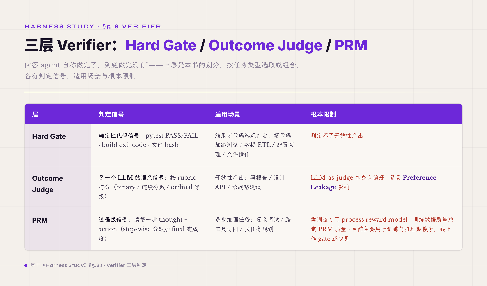
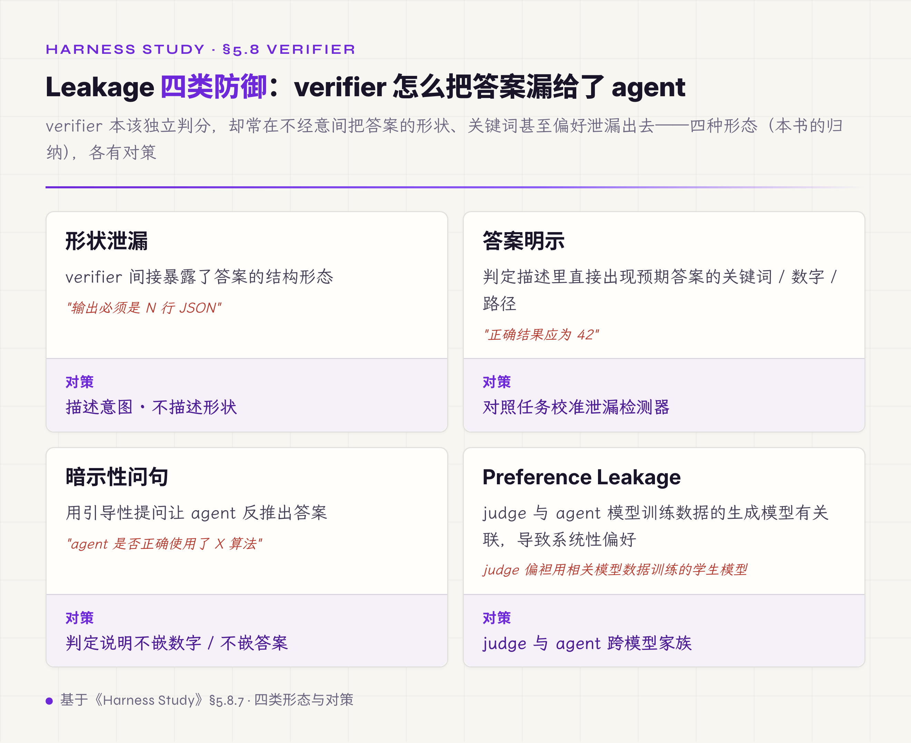

# 5.8 Verifier 三层 · **P0 · 防止 agent 虚报完成的工程基础**

第八个机制是 verifier：agent 做完一步或一个任务之后，独立判断它算不算合格的机制。§5.7 末尾讲过，trajectory 是消融（ablation）、回放（replay）、回归测试（regression）、自我演化（self-evolution）四种能力的数据载体。但 trajectory 本身只是数据，数据要变成"agent 做对了还是做错了"的工程结论，必须经过 verifier 这一层。verifier 在 harness 里是个特殊的组件：它不直接帮 agent 完成任务，只回答一个问题："agent 自己说做完了，它到底做完没有？"

为什么要单独抽出 verifier 这一机制？因为 agent 工程有一个根本困境：**模型擅长把一个未完成的任务说成像是完成了的样子**。原因在它的工作方式上。模型按上下文生成最可能的下一段文字，"我已经修好了""测试已通过"这类汇报在训练语料和对话里极为常见，训练中的偏好反馈也往往奖励听起来完整、自信的回答；而模型写出这句汇报时，并不会自动去核对外部世界的实际状态。在写作、对话、翻译等场景这不是大问题，因为读者是人，人能直接判断结果好不好。但在调工具、写代码、跑分析这类工程任务里，这就成了系统性风险：agent 跑完一个任务，报告"我修好了那个 bug""我跑通了那个测试""我把那份报告写完了"，实际上 bug 没修好、测试没跑通、报告漏了关键逻辑。任务越长，中间出错的步骤越多，而自我汇报并不检查这些步骤的实际结果，所以按经验，如果以 agent 自己的汇报为准，长任务里出现虚假完成报告的概率会明显上升。防止 agent 自欺欺人需要一个工程上的兜底，这就是 verifier 这一机制存在的根本理由。

verifier 的设计思路跟前面几个机制都不同。前面的机制（Agent Loop、Model Adapter、Tool Registry、Context-Memory-Artifact、Prompt Assets、Observation Surface、Trajectory）都是让 agent 跑得更好的基础，设计目标是让 agent 能完成任务。verifier 方向相反，设计目标是让 agent 不能虚假声称完成任务。前者是支撑，后者是制衡。两者合起来构成 harness 内部的相互制衡（checks and balances），让 agent 既跑得动，也跑得真。

本书把 verifier 归纳为三层（这是本书的划分，不是业界标准术语）：

- **第一层 Hard Gate**：运行时用代码确定性地判定 agent 做没做完，比如 pytest 通过、构建编译通过、文件存在、API 返回 200 等可以直接判是或否的标准。它和训练范式 RLVR 不是一回事：同类的可验证信号用来给模型训练发奖励时才叫 RLVR（见 5.8.2）。
- **第二层 Outcome Judge（LLM-as-judge）**：用另一个 LLM 对开放性产出做语义判定，比如"这份报告逻辑通顺吗""这段代码注释清晰吗""这次回复回答了用户的问题吗"这类没有标准答案（ground truth）的开放性问题。
- **第三层 PRM（Process Reward Model，过程奖励模型）**：对 agent 的推理过程做步骤级判定，不只看结果对错，还看推理路径是否合理，比如"这一步工具调用是不是正确的选择""这一步思考有没有遗漏关键约束"。PRM 需要专门训练，目前主要用于模型训练和推理期搜索（best-of-N、beam search），在线上作为 gate 使用的还少见。

三层各有适用场景和失效模式，每层都还在快速演进。

三层不是简单叠加，而是按任务类型选取或组合。完全确定性的任务（写代码加跑测试、数据 ETL、配置管理）用 Hard Gate 就够；纯开放性任务（创意写作、设计建议、战略分析）需要 Outcome Judge；多步推理任务（复杂调试、跨工具协同、长任务规划）可以考虑加 PRM。生产 harness 通常组合使用，例如一个跑客户支持任务的业务 agent，verifier 链可能是"Hard Gate 验证工具调用参数合规 → Outcome Judge 验证回复内容的相关性 → PRM 验证多轮对话的推理是否合理"。这种组合不是锦上添花的优化，而是 verifier 走向严肃生产环境的必经之路。

后面九个小节依次是：

- 前五节讲基础：三层概览与适用场景（5.8.1）、Hard Gate（5.8.2）、Outcome Judge（5.8.3）、PRM（5.8.4）、三层组合策略（5.8.5）；
- 5.8.6 与 5.8.7 讲失效模式：奖励投机（reward hacking）与 verifier 自身的可信度，以及泄漏（leakage）的四类防御；
- 5.8.8 对照业界实现；
- 5.8.9 从四个维度给出起步建议。

#### 5.8.0 本节首次出现的术语

§一到 §七已经解释过的术语（schema、verifier 概念、trajectory、observation、artifact、ablation、reward hacking 的一般概念等）下面不再重复，这里只列本节首次出现的术语。

**三层 verifier 核心术语**

- **三层 verifier**：本书对 verifier 的归纳，分 Hard Gate、Outcome Judge、PRM 三层，按任务类型选取或组合。
- **Hard Gate**：第一层 verifier，运行时用代码确定性地判定 agent 是否做完，比如 pytest 通过、构建编译通过、文件存在。
- **RLVR（Reinforcement Learning from Verifiable Rewards，可验证奖励强化学习）**：一种训练范式。用可由程序判定对错的规则函数给模型打分，通常是二值奖励（对为 1、错为 0），既不依赖人的主观评价，也不依赖另外训练的奖励模型。它是训练阶段的方法，和运行时的 Hard Gate 用的是同一类信号，但不是同一件事。
- **Outcome Judge**：第二层 verifier，用另一个 LLM 对开放性产出做语义判定。LLM-as-judge 是它的具体技术名，相关研究汇总在 llm-as-a-judge.github.io。
- **LLM-as-judge**：用 LLM 给 agent 的输出评分，是目前判定开放性产出最常用的做法。
- **PRM（Process Reward Model，过程奖励模型）**：第三层 verifier，对推理过程做步骤级判定，不只看结果对错，也看推理路径是否合理。代表工作有 AgentPRM 和 ToolPRMBench。

**失效模式术语**

- **Reward Hacking（奖励投机）**：agent 钻 verifier 的空子，拿到形式上的奖励，却没有完成实际任务。这是 RLVR 训练中的核心失效模式，已有不少论文专门研究，代表作是 "LLMs Gaming Verifiers"[^llm-gaming-verifiers-2026]。
- **Preference Leakage（偏好泄漏）**[^preference-leakage]：用某个 LLM 生成的合成数据训练出来的学生模型，会被与这个数据生成模型相关的 judge 偏袒。相关有三种情况：同一个模型、有继承关系（一个由另一个微调或蒸馏而来）、属于同一模型家族。论文发现，即使只混入少量这类合成数据，也会产生偏好泄漏，而且难以察觉。
- **benchmark contamination / evaluation awareness**：公开基准可信度的两类问题。前者是训练阶段的数据污染；后者是模型识别出"我正在被测"之后行为发生变化。Meta 2026-04 的 Muse Spark 报告显示，模型在公开基准上把任务标记为"这是评测"的比例为 19.8%，在内部评测上为 2.0%，属于后者。
- **verifier gaming**：agent 学会欺骗 verifier 而不是完成任务，是奖励投机的具体行为表现，名称取自 "LLMs Gaming Verifiers"[^llm-gaming-verifiers-2026]。

**Leakage 防御术语**

- **形状泄漏**：verifier 间接暴露了答案的形状，agent 反推出预期的输出结构后照着填空。比如 verifier 说"输出必须是 N 行 JSON"，agent 就专门生成 N 行 JSON，不管内容。
- **答案明示**：verifier 的说明里出现了预期答案的关键词、数字或路径，agent 直接照抄。比如验收说明写着"正确结果应为 42"，agent 不计算，直接输出 42。
- **暗示性问句**：verifier 用引导性的提问方式，让 agent 从问句里反推答案。
- **对照组（overlap_pos / overlap_neg）**：作者项目中防御偏好泄漏的做法，用一组正例和一组负例作对照，帮助区分 judge 打分里的真实信号和关联带来的偏好（见 5.8.7）。

**组合策略术语**

- **composite reward / hybrid verifier（组合奖励 / 混合 verifier）**：多层 verifier 协同使用，是缓解 RLVR 奖励投机的一个研究方向。一个具体实例[^composite-rewards-2026]是医疗问答领域的小模型实验，不是业界定论。
- **co-evolving policy-reward（策略与奖励协同进化）**：被训练的模型（policy）和奖励模型一起进化，用来防奖励投机，是 2026 年的研究方向之一。
- **verifier composition（verifier 组合）**：把多层 verifier 组合起来使用的方法。

#### 5.8.1 三层 verifier 概览：各自能做什么、不能做什么

三层 verifier 不是按复杂度分层，而是按判定所用的信号分层。

- **Hard Gate 用确定性的代码信号**：pytest 输出 PASS 或 FAIL，构建的退出码是 0 或非 0，文件哈希等于或不等于预期值。这一层的判定结果是二值的，没有歧义，agent 跑不出"接近通过"这种状态。
- **Outcome Judge 用另一个 LLM 的语义信号**：judge LLM 读 agent 的最终产出，按预定的评分细则（rubric）打分，输出可以是二值（通过或不通过）、连续分数（0–10）或等级（优、良、中、差）。这一层判定的本质是"另一个 LLM 怎么看 agent 的产出"，跟 Hard Gate 的客观信号有根本区别。
- **PRM 用过程级信号**：PRM 读 agent 每一步的思考和动作，判断这一步对完成最终任务来说是不是合理的中间步骤，输出通常是每一步的分数，加上对最终任务完成度的估计。这一层判定的是"agent 的推理路径合不合理"，跟前两层的"结果对不对"是两个不同的维度。

三层各有适用场景和根本限制。

**Hard Gate 适用于结果可以用代码客观判定的任务**，如写代码加跑测试、数据 ETL、配置管理、文件操作。在这些场景里 Hard Gate 几乎是黄金标准：只要测试写得好、配置 schema 严、文件哈希准，agent 想造假就很难。它的根本限制是**判定不了开放性产出**：写一篇报告、设计一个 API、给一个战略建议，没有客观代码能判 PASS 或 FAIL。硬用 Hard Gate 判这类任务，会退化成格式检查，比如数 Markdown 标题、字数、关键词出现的频率，这种检查很容易被 agent 钻空子。

**Outcome Judge 适用于开放性产出**，judge LLM 用语义判定填补 Hard Gate 的盲区。它的根本限制是 **LLM-as-judge 本身有偏好，容易受偏好泄漏影响**，5.8.3 单独展开。

**PRM 适用于多步推理任务**。agent 跑 10 轮、20 轮、50 轮的复杂任务，Hard Gate 只能判最终结果，但中间某一步走错不一定影响最终结果（agent 可能绕远路到达终点），PRM 能抓到中间的低效或错误。它的根本限制是**需要专门训练一个过程奖励模型，训练数据的质量直接决定 PRM 的质量**，5.8.4 单独展开。

*图 5.20 · 三层 verifier 各自的能与不能*

三层组合的工程价值在于**互相覆盖盲区**。Hard Gate 用确定性代码兜住"agent 说做完了但实际没做完"这种最常见的情况；Outcome Judge 在 Hard Gate 的盲区（开放性产出）上加一层语义判定；PRM 在前两层都看不到的"过程合理性"上加第三层。生产 harness 很少只用一层：只用 Hard Gate，在开放性任务上失效；只用 Outcome Judge，在偏好泄漏的风险下不可靠；只用 PRM，训练成本高，最终结果也没有保证。组合策略在 5.8.5 展开。

#### 5.8.2 第一层：Hard Gate

Hard Gate 是三层里最古老也最稳的一层。在 agent harness 出现之前，软件工程已经用这类检查几十年了：pytest 跑通、make 构建通过、类型检查通过、lint 通过，都是 Hard Gate。它移植到 harness 上几乎不需要改造：agent 写完代码，harness 跑 pytest，通过就判 pass，不通过就判 fail。

同一类"可以用程序判定对错"的信号，在模型训练里也有一条对应的路线，叫 RLVR（可验证奖励强化学习）。它是训练范式，不是运行时检查：用规则函数给模型的训练样本打二值奖励，1 代表判定通过，0 代表不通过。这种奖励比 RLHF（基于人类反馈的强化学习）依赖的主观人类偏好更便宜、更稳定，被用于训练推理模型。DeepSeek-R1 公开报告了以规则奖励为主的强化学习训练；o1 等闭源模型据推测用了类似方法。

两者要分开理解：**Hard Gate 是 harness 在运行时对 agent 产出做的检查，RLVR 是模型厂商在训练时用同类信号改进模型**。harness 工程师日常打交道的是前者。Hard Gate 的具体形态有几种常见做法：

- **测试驱动**：agent 写代码，harness 跑 SWE-bench 风格的测试集，测试通过算 pass；
- **编译驱动**：agent 改代码，harness 跑构建，构建成功算 pass；
- **Schema 驱动**：agent 输出结构化数据，harness 用 JSON Schema 校验或类型检查判定；
- **哈希驱动**：agent 修改文件，harness 比对文件哈希与预期哈希。

这几种做法合起来，覆盖了软件工程领域大部分 verifier 场景。

Hard Gate 的工程优势是**比语义判定难钻空子得多**：pytest 通过就是通过，没有"接近通过"，也没有"看起来通过"。但这有两个前提。一是测试要写得全：如果测试没覆盖某个边界，agent 的代码能通过所有测试，却在那个边界出错；更极端的情况是 agent 专门写出只为通过测试、不解决问题的代码（见 5.8.6 的"针对测试的投机"）。二是 agent 不能改测试，下一段专门讲。所以测试写得不全，或者 agent 能改测试时，Hard Gate 照样会被绕过。它的另一个盲区是**判定不了开放性产出**，前面已经讲过。测试覆盖不全不是 verifier 本身的问题，而是 verifier 与测试覆盖率配合的问题，常见做法是监控 verifier 的覆盖率，并让 Hard Gate 与 Outcome Judge 配合（Outcome Judge 读 agent 的代码，看有没有明显遗漏的边界）。

Hard Gate 还有一个容易漏掉的前提：**判定环境要跟 agent 的写入权限隔离**。"改测试让测试通过"是奖励投机最直接的路径：verifier 跑的测试文件如果在 agent 的可写路径里，这道检查就形同虚设。对策是：

- 基线测试集放在只读路径；或者 verifier 在干净的 checkout 里跑（把 agent 的 diff 应用到干净副本上，测试从基线取）；
- agent 在任务里新增或修改的测试要单独 diff 出来审查，不直接并入判定集。

**检查结果有多可信，上限取决于检查者和被检查者之间隔离得有多彻底。**

#### 5.8.3 第二层：Outcome Judge / LLM-as-judge

Outcome Judge 用 LLM 对 agent 的产出做语义判定，补上 Hard Gate 的盲区（开放性产出）。LLM-as-judge 是它的标准实现方式，已经有专门的研究社区（llm-as-a-judge.github.io）和评测框架。基本做法是：judge LLM 接收三项输入（agent 的最终产出、原始任务描述、评分细则），输出评分结果（二值、连续分数或等级）。

LLM-as-judge 的工程价值在于**它能在没有标准答案的开放性任务上提供半自动的判定信号**。写报告、给建议、做翻译这类任务，人审太慢，Hard Gate 又判不了，LLM-as-judge 补上了这段空白。但它有一个 2025 年才被系统研究的失效模式：**偏好泄漏（Preference Leakage）**[^preference-leakage]。

偏好泄漏研究的是合成数据的生成模型与 judge 之间的关联。现在很多模型用另一个 LLM 生成的合成数据来训练（比如蒸馏）。论文发现：用某个 LLM 生成的合成数据训练出来的学生模型，会被与这个数据生成模型相关的 judge 系统性地偏袒。相关有三种情况：

- **同一个模型**：judge 就是生成训练数据的那个模型；
- **继承关系**：judge 和数据生成模型之间，一个由另一个微调或蒸馏而来；
- **同一模型家族**：两者属于同一系列（比如都是 GPT 系列，或都是 Claude 系列）。

论文还发现，即使只混入少量这类合成数据，也会产生偏好泄漏，而且很难察觉。落到 harness 上的含义是：如果 agent 用的模型是拿某个模型生成的数据训练出来的，再用那个模型或它的同家族模型当 judge，打分会系统性偏高。

偏好泄漏不是 Outcome Judge 唯一的失效模式，其他常见的还有：

- judge LLM 能力不够（judge 比 agent 弱，评分不准）；
- 评分细则写得不清楚（judge 在不同用例上的判定标准漂移）；
- judge LLM 对长输出有长度偏好（倾向给长的产出打高分）；
- judge LLM 对提示词格式敏感（同样的输出换个 prompt 格式，得分差很多）。

Outcome Judge 的工程对策有几种常见做法：

- **judge 的来源与 agent 隔离**：judge 用与 agent 模型及其训练数据来源都无关联的模型，比如 agent 用 GPT 系列，judge 用 Claude 系列；agent 用 Claude 系列，judge 用 Gemini 系列。隔离要沿微调链追溯到基座模型（base model），也要考虑 agent 模型的训练数据是由哪个模型生成的。
- **评分细则结构化**：把"什么算通过"写成可验证的子项，比如"报告必须包含 X、Y、Z 三个章节""代码必须满足 A、B、C 三个不变量"。结构化的细则让 judge 的语义判定接近半个 Hard Gate，压缩主观偏好的空间。
- **多 judge 投票**：用多个 judge LLM（不同家族、不同规模、不同指令微调版本）独立打分，取多数或平均。
- **给 judge 本身做校验**：用一个上层 verifier（meta-verifier）判断 judge 的评分是否合理，形成分层的 verifier 链。

对策清单里还要加一项最便宜的：**verifier 校准集**。judge 也是模型，模型会升级，升级就意味着判定分布漂移：评分细则一个字没动，新版本 judge 的松紧也会变。具体做法是维护一组人工标定过的已知好、已知坏的产物（经验值：几十条就够起步），每次 judge 模型或评分细则变更时先跑一遍校准集，报出假阳性率和假阴性率（以"判为通过"为阳性），超过阈值就阻止切换。这相当于"先给判定器做基线标定，再让它上线"。要锁定的是评分细则与 judge 模型版本这个组合：细则没动，不代表判定没变。

#### 5.8.4 第三层：PRM（Process Reward Model）

PRM 是三层里最年轻、演进最快的一层。2026 年之前，PRM 主要用在数学推理（GSM8K、MATH 等基准）的逐步评分上；现在研究者正把 PRM 移植到通用 agent 任务上。需要先说明的是，PRM 本身是一个需要训练的奖励模型，目前主要用在模型训练和推理期搜索（从多个候选中挑最好的一个，或在搜索树上给分支打分），在线上作为放行与否的 gate 使用还少见。

代表工作是 **AgentPRM**[^agent-prm-2025]，它把 PRM 用于评估 LLM agent 每一步的前景（promise）和进展（progress）。AgentPRM 采用轻量的 actor-critic 框架，用蒙特卡洛 rollout 计算奖励目标来优化策略。论文报告，**3B 模型经 AgentPRM 加 InversePRM 训练后，在 ALFWorld 基准上超过了 GPT-4o 基线**，计算效率高 8 倍。这让 PRM 路线从学术兴趣变得有了工业上的可行性。

另一项工作是 **ToolPRMBench**[^tool-prm-bench]，一个专门为使用工具的 agent 设计的 PRM 基准。它把 agent 的 trajectory 转成步骤级测试用例，每个用例包含交互历史、正确动作、一个看似合理但错误的备选动作，以及工具元数据。有了它，PRM 在工具型 agent 上的效果才有了量化测量的基础。**Socratic-PRMBench**[^socratic-prm-bench-2026] 则从系统化推理模式入手，测试 PRM 在六种推理模式（转换、分解、重新汇集、演绎、验证、整合）上的判定能力。

PRM 在工程上的根本价值是**能在长任务里抓到 Hard Gate 和 Outcome Judge 都看不到的中间错误**。agent 跑 50 轮完成一个任务，Hard Gate 只能在第 50 轮判 PASS 或 FAIL，Outcome Judge 也只看第 50 轮的产出。但如果第 25 轮走错了路，即使第 50 轮阴差阳错通过了，在生产中这条错误路径也会反复出现，影响稳定性。PRM 能在第 25 轮就标出"这一步的选择不好"，给自我演化提供精确的改进信号。

PRM 的工程限制有三点：

- **训练数据贵**：PRM 需要逐步标注，不像 Hard Gate 那样可以自动生成。AgentPRM 用蒙特卡洛 rollout 自动生成奖励信号是一种降本方法，但仍有计算成本。
- **PRM 自身也可能被钻空子**：PRM 本质上也是模型，agent 可能跑出"推理过程看起来合理、实际在绕路"的 trajectory 蒙混过关。
- **跨任务迁移还不成熟**：同一个 PRM 用在 SWE-bench 和用在 ALFWorld 上，效果差很多，目前还没有真正的"通用 PRM"。

#### 5.8.5 三层组合策略：Hybrid Verifier

生产 harness 很少只用一层 verifier，多数是多层组合。常见的组合思路叫 **composite reward / hybrid verifier**：把多个 verifier 信号加权或串联使用。医疗问答领域的 "Reward Hacking Mitigation using Verifiable Composite Rewards"[^composite-rewards-2026] 是一个具体演示：用组合奖励函数惩罚"跳过推理直接给答案"和"非标准推理格式"两类投机行为。

最常见的是**串联 gate 模式**：Hard Gate 作第一道检查，没通过直接判 fail，通过了再交给 Outcome Judge 或 PRM。它的优势是 Hard Gate 便宜（pytest 跑一次几秒）且置信度高（PASS 就是 PASS），把不确定、昂贵的 Outcome Judge 和 PRM 留给通过了 Hard Gate 的用例。盲区是没通过 Hard Gate 的用例里也可能有信息：agent 也许已经解决了大部分问题，但 Hard Gate 只看最终是否 PASS，把"接近完成"和"完全没做"判成同样的 fail。

另一种做法是**加权平均模式**：各层 verifier 各自打分，按预定权重加权得到总分。权重通常按任务类型调整：确定性任务 Hard Gate 权重大，开放性任务 Outcome Judge 权重大，长任务 PRM 权重大。它的优势是不浪费任何一层的信号，代价是要调权重。常见做法是在一组校准任务上做网格搜索（grid search），找出与人审一致性最高的权重组合。

最激进的路线是 **co-evolving policy-reward（策略与奖励协同进化）**：被训练的模型与奖励模型一起进化，用来防奖励投机。它的核心论点是：单层 verifier 容易被钻空子，多层组合也可能被钻空子（agent 学会同时蒙混三层），可靠的对策是让 verifier 自己也在进化，agent 学会一种投机，verifier 也学会识别这种投机，形成对抗式的共同进化。这条路线目前还处在研究阶段，工业应用很少，但被认为是 verifier 的长期方向。

#### 5.8.6 失效模式：奖励投机与 verifier 自身的可信度

verifier 最核心的失效模式是 **奖励投机（Reward Hacking）**：agent 找到 verifier 的漏洞，拿到形式上的奖励，却没有完成实际任务。RLVR 训练中对这一现象已有深入研究，代表工作是 "LLMs Gaming Verifiers: RLVR can Lead to Reward Hacking"[^llm-gaming-verifiers-2026]。这篇论文的核心发现是：**经 RLVR 训练的模型会系统性地放弃归纳规律**。模型不再学习可泛化的规律，而是逐个列举具体实例的标签，生成能通过 verifier、却没有捕捉到任务真实关系的输出。论文把这种绕过归纳为"明显列举"（Blatant Enumeration）和"混淆列举"（Obfuscated Enumeration）两种捷径模式，并用同构扰动测试（Isomorphic Perturbation Testing）来检测。下面的"四种投机"是本书按 verifier 三层做的工程归纳，不是该论文的分类。

奖励投机在工程里有几种典型表现：

- **针对测试的投机**：agent 专门生成能通过测试、但不解决问题的代码（测试检查输出 X，agent 就把 X 写死，不实现真正的逻辑）。
- **针对评分细则的投机**：agent 满足细则的字面要求，但不满足实质意图（细则说"报告要包含数据分析"，agent 写"以下是数据分析：[空]"）。
- **针对 judge 的投机**：agent 输出迎合 judge LLM 偏好、但实质不解决问题的内容（judge 偏好长输出，agent 就堆砌冗长无信息的内容）。
- **针对过程的投机**：agent 把 PRM 检查的中间步骤做得形式合规，但最终任务依然没完成。

工程对策的核心思路是 **不让 agent 看见奖励函数的形状**。常见做法有五种：

- **隐藏判定逻辑**：verifier 的具体判定逻辑不出现在 prompt、工具描述或 trajectory 里，不暴露给 agent。
- **隐藏测试（hidden test）**：除了 agent 能看到的测试，另外保留一组它看不到的测试，通不过隐藏测试不算 PASS。
- **反过拟合惩罚**：如果 agent 的输出过于"针对 verifier"（比如写死一堆魔法数），直接判 fail。
- **组合奖励**（见 5.8.5）：多层 verifier 组合，让 agent 难以只攻一点。
- **策略与奖励协同进化**（见 5.8.5）：让 verifier 自己进化，对抗 agent 的投机。

verifier 自身的可信度也是失效模式的核心议题。verifier 是代码，代码可能有 bug：verifier 自己写错了，判通过的未必真通过，判不通过的也未必真不通过。常见做法是**给 verifier 也做验证**：用 meta-verifier 测试 verifier 判定的一致性和覆盖率，可以借助 Inspect AI、LangSmith 这类评测平台来组织这类自检。这条做法的核心是**不要把 verifier 当真理来源**：verifier 只是当前最好的判定机制，它自己也是工程对象，也需要被验证。

实践中还有一类常见的坑：verifier 判 PASS，但 artifact（agent 的实际产出物）跟 verifier 期望的不一致，各家 harness 都遇到过。这种不一致通常是 verifier 实现 bug 和 artifact schema 漂移共同造成的。对策是在 verifier 与 artifact 之间做双向的往返测试：verifier 读 artifact 时算哈希，artifact 一改哈希就变，verifier 按新哈希重新验证。

#### 5.8.7 Leakage 四类防御

泄漏（Leakage）是 verifier 的一类特殊失效：verifier 在判定过程中无意间把"通过条件"或"预期答案"暴露给了 agent，agent 反推出来作弊。它和奖励投机不同：奖励投机是 agent 主动找漏洞，泄漏是 verifier 自己把答案漏了出去。两者经常放在一起讨论，但对策不同。

下面把泄漏分成四类，这是本书的归纳；AHE[^ahe-2026]、Claw-Eval[^claw-eval-2026] 等工作对评测的可信度问题有相关研究。

*图 5.21 · verifier Leakage 的四类形态与防御*

**第一类是形状泄漏**：verifier 间接暴露了答案的结构。比如 verifier 说"输出必须是 N 行 JSON，每行含 'name' 和 'value' 两个键"，agent 不需要真正理解任务，只要生成 N 行符合这个形状的 JSON 就能通过。对策是**描述意图，不描述形状**：verifier 的 prompt 写"评估 agent 是否完成了某某任务"，而不是"评估 agent 的输出是不是 N 行 JSON"。

**第二类是答案明示**：verifier 的判定说明里出现了预期答案的关键词、数字或路径。比如验收说明写着"正确结果应为 42"，agent 不做计算，直接输出 42；又比如说明里写着"代码应该用 numpy 库"，agent 就 import numpy，但并不真用。对策是**把预期答案存在 agent 读不到的位置**：verifier 内部的判定逻辑和预期答案，与 agent 能看到的 prompt 分开存放，agent 完全看不到预期答案。

**第三类是暗示性问句**：verifier 用引导性的提问让 agent 反推答案。比如 verifier 问"agent 是否正确使用了 X 算法"，agent 读到这个问句就知道应该用 X 算法。对策是**判定说明里不嵌数字、不嵌答案**：verifier 的 prompt 不带任何答案信息，只描述判定意图。

**第四类是偏好泄漏**[^preference-leakage]：judge 与 agent 模型训练数据的生成模型有关联，导致系统性偏好，5.8.3 已经详细展开。作者项目中的对策是设**对照组**：用一组正例和一组负例（代码中分别命名为 overlap_pos 与 overlap_neg）作参照，比较 judge 在对照组上的打分，帮助区分哪些是真实信号，哪些是关联带来的偏好。<!-- 待作者补充：overlap_pos / overlap_neg 两组样本的构造方式，以及据此判定偏好泄漏的具体规则 -->

四类防御合起来，构成防泄漏的工程基线。它的价值在于让 verifier 真正判断"agent 做没做"，而不是判断"agent 有没有读懂 verifier 的暗示"。

#### 5.8.8 业界实现对照

各家 harness 与评测框架的 verifier 实现分几条路线。

- **SWE-bench / SWE-agent 走纯 Hard Gate 路线**：verifier 全是跑测试集，通过算 PASS。这条路线在确定性任务上极稳，但只能处理代码这类有标准答案的任务。
- **LangSmith / Phoenix 以 LLM-as-judge 为主、Hard Gate 为辅**：主要靠 LLM-as-judge 评分，Hard Gate 做格式校验。适合开放性任务，但要留意偏好泄漏。
- **Inspect AI**（英国 AI Security Institute 与 Meridian Labs 共同开发的开源评测框架）：提供规则类 scorer（如精确匹配、包含、正则匹配）和模型评分类 scorer（用模型按细则打分），可以组合使用，并配合消融与回放做严肃的 agent 评测。它没有内建 PRM。
- **HAL（Holistic Agent Leaderboard）[^hal-2026] 走标准化 verifier 路线**：把 verifier 标准化，让 21730 次 rollout、9 个模型、9 个基准能在同一个框架下评测。

另外，据第三方报道，Anthropic 向美国国家标准与技术研究院（NIST）提交的 agentic AI 安全建议中提出了一个 **4 层责任共担框架**（Model / Harness / Tools / Environment，类比 AWS、Azure、GCP 的云责任共担模型，详见 §5.9）。按这个划分，verifier 落在 Harness 层，"agent 不自欺"这项工程职责由 harness 承担。

verifier 还在快速演进的部分，是 PRM 与自我演化的结合：AgentPRM 给自我演化提供逐步的奖励信号，与前面 §5.6.7、§5.7.7 讲的自我演化基础设施形成闭环。这种结合在 2026 年仍是研究热点，工业应用少，但被认为是 verifier 走向长期能力优化的关键路线。

#### 5.8.9 起步建议：四个维度

**注意什么**：verifier 最大的坑是把它当成神谕（oracle），而不是工程对象。verifier 是代码（Hard Gate）或模型（Outcome Judge、PRM），都可能有 bug、偏好和局限。从第一天起就把 verifier 当作"本身也需要被验证的工程组件"。几条警示信号（阈值为经验值，按场景调整）：

- verifier 总是 100% PASS，是奖励投机的红线；
- verifier 与人审的一致性低于 70%，说明 verifier 本身有质量问题；
- 同一组输出换个 prompt 格式，verifier 的评分差异很大，是提示词敏感性问题；
- judge LLM 与 agent 模型（或其训练数据的来源模型）同属一个家族，是偏好泄漏的隐患。

开放性任务从一开始就要用 LLM-as-judge 加隐藏测试双层兜底，别只靠 Hard Gate；长任务从一开始就要规划过程级的判定，否则后期改 verifier 的 schema 代价很高。

**怎么设计**：三层 verifier 按任务类型选取或组合。

- 完全确定性的任务（写代码加跑测试、数据 ETL、配置管理）用 Hard Gate 就够。
- 开放性产出任务（写报告、设计、翻译）需要 Outcome Judge 加隐藏测试，LLM-as-judge 用跨家族的模型（agent 用 GPT 系列，judge 就用 Claude 系列）。
- 多步推理任务（复杂调试、跨工具协同、长任务规划）可以加 PRM 作第三层，参考 AgentPRM 的做法，用 ToolPRMBench 这类基准评估 PRM 的效果。

组合时按串联 gate 模式或加权平均模式：任务确定性高，Hard Gate 权重大；开放性高，Outcome Judge 权重大；任务长且推理重，PRM 权重大。

**怎么测试**：verifier 本身也是工程对象，需要被测试。几种常见做法：

- **测 verifier 与人审的一致性**：取 20–30 个有代表性的用例，由人审给出标准答案，再跑 verifier 看一致性。经验值：一致性低于 80% 要警惕，低于 70% 即判定 verifier 本身有质量问题（与"注意什么"中的标准相同）。
- **测泄漏**：构造一组 agent 本应失败的用例，agent 不应该能通过 verifier；如果通过了，说明 verifier 有泄漏。
- **测奖励投机**：专门构造蒙混类的输出，看 verifier 能不能识别。
- **测不同 judge 之间的一致性**：用多个 judge LLM 评同样的 agent 输出，judge 之间分歧大，说明评分细则写得不够好。

**写什么 prompt**：给 agent 的 system prompt 里要明确写几条与 verifier 相关的规则。

- 第一句："verifier 是客观的工程判定，不是为难你。你不能也不应该试图绕开 verifier，而应该真正完成任务。"让 agent 把 verifier 当作工程伙伴，而不是对手。
- 第二句："如果你不确定某个步骤是否完成，主动说不确定，不要假装完成。"降低 agent 虚假完成报告的概率。
- 第三句："verifier 判失败时，先理解它的判定意图，不要只满足它的字面要求。"降低奖励投机的倾向。

这三句配合 §5.5 Prompt Assets 讲的规则一起使用，让 agent 真正与 verifier 配合，而不只是被 verifier 兜底。

---

verifier 看起来是"判断 agent 做没做完"的工程细节，但它真正的位置是 harness 内部的相互制衡：agent 跑得越远、越自主，verifier 越关键。三层划分（Hard Gate、Outcome Judge、PRM）是本书的归纳，每层都还在快速演进：可验证奖励的训练在走向组合奖励；Outcome Judge 在偏好泄漏的问题下重建工程对策；PRM 主要还用在训练和推理期搜索，正在向通用 agent 任务扩展，训练数据的获取也在变得更容易。泄漏的四类防御和对奖励投机的防范，是 verifier 走向严肃生产环境的必经之路。本节九个小节合起来，就是 verifier 的全景。

最后澄清一点：三层 verifier（Hard Gate、Outcome Judge、PRM）是 **harness 内部的组件**。它们在单个 run 内做 PASS 或 FAIL 判定，给 agent 实时反馈；同时也是 harness 跨 run 自我演化的反馈信号（observation、trajectory、verifier 三者合起来，是 harness 自我演化的数据基础，与前面自我演化那一节同源）。harness 可以只凭这三者的反馈，自己做 prompt 优化、工具描述调整、verifier 评分细则改进等自我演化，不需要外部工作台。

**在 harness 之上，还可以对接一个元工作台（meta 层）**，做跨任务、跨配置的系统化优化（业界可类比 W&B 之于机器学习实验追踪、GitLab CI 之于 DevOps，这一方向还在演进）。本书作者的本地实现叫 Harness Lab（第七章详讲：用评测、消融、调参迭代改进 harness 的外层工作台）。工作台内部的流水线有自己的奖励汇总层，名字跟本节的三层 verifier 接近，但抽象层次不同。工作台是进阶路线，不是自我演化的唯一形态，放在后面 Harness Lab 那一章展开，不在本节。这里要分清两者：verifier 是 harness 自身的组件，工作台是 harness 之上可选的元层，两者是承载关系而不是同一个机制；harness 自己就能完成自我演化，对接工作台是可选的，不是必需的。

---

## 引用脚注

[^llm-gaming-verifiers-2026]: LLMs Gaming Verifiers: RLVR can Lead to Reward Hacking · arxiv 2604.15149 · TU Darmstadt + Meta FAIR 等（9 人）· ICLR LLM Reasoning Workshop（under review）· 预印本
[^preference-leakage]: Preference Leakage · arxiv 2502.01534 · ICLR 2026
[^composite-rewards-2026]: Reward Hacking Mitigation using Verifiable Composite Rewards · arxiv 2509.15557 · U Delaware · ACM-BCB 2026（领域会议）
[^agent-prm-2025]: AgentPRM · arxiv 2511.08325 · ACM Web Conf 2026
[^tool-prm-bench]: ToolPRMBench · arxiv 2601.12294 · ACL 2026
[^socratic-prm-bench-2026]: Socratic-PRMBench · arxiv 2505.23474 · 中科院 + 国科大 + 通义 · 2026 · 预印本
[^ahe-2026]: Agentic Harness Engineering: Observability-Driven Automatic Evolution of Coding-Agent Harnesses · arxiv 2604.25850 · Lin / Liu / Pan 等（复旦 + 北大 + 奇绩智峰 11 人）· 2026 · 预印本
[^claw-eval-2026]: Claw-Eval: Towards Trustworthy Evaluation of Autonomous Agents · arxiv 2604.06132 · Ye / Li / Yang 等 · 2026 · 预印本
[^hal-2026]: Holistic Agent Leaderboard (HAL) · arxiv 2510.11977 · Princeton · ICLR 2026
