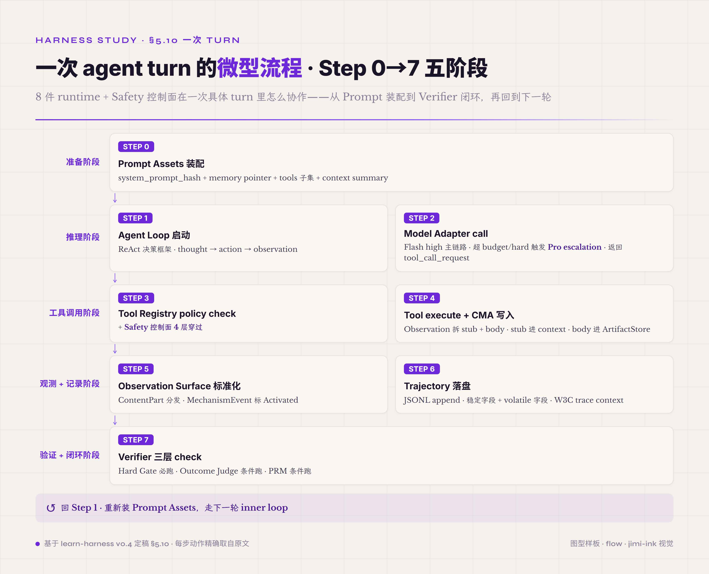

# 5.10 一次 turn 的微型流程 · 8 件 runtime + Safety 横切

前面 §5.1-§5.9 把 8 件 runtime + 1 件 Safety 控制面分别讲完——单看每件读者已经知道它是什么、为什么这么设计、怎么起步。但单独看每件读者不容易看到这些件**怎么在一次具体 agent turn 里协作**——这是本节要补的视角。

业界 agent harness 文献里很少给"一次 turn 的全机制协作"展示——大多数文献按机制分章 · 不画出协作图。这一节用作者构造的最小示例补足这件——示例是教学构造 · 不是某次真实运行的 trajectory · 数值用于展示机制协作关系。



*图 5.23 · 一次 agent turn 的 Step 0→7 五阶段流程*

```
[一次 agent turn 微型流程 · 8 件 runtime + Safety 横切]

══════ 准备阶段（每个 turn 都跑 · 但 turn 内只跑一次） ══════

Step 0 · Prompt Assets 装配
   system_prompt_hash = sha256(P0 system + P1 task + P2 memory + P3 tools snapshot + P4 examples)
   prompt 含：
     - system 指令（Safety 纪律 / 工具使用纪律 / instruction hierarchy）
     - 当前 task 描述
     - memory pointer（artifact_id 索引 · 不嵌完整产物）
     - tools registry 当前 turn 可见子集（select_for(query) 动态收窄）
     - context summary（上一轮 compaction 后的摘要 · 不是全 trajectory）
   trajectory: prompt_assets_load event { hash, family_breakdown, token_count }

══════ 推理阶段 ══════

Step 1 · Agent Loop 决策框架启动
   inner loop pattern = ReAct（业界主流默认 · 也可配 plan-execute / reflexion）
   生成 thought → action → observation 三元组准备
   trajectory: turn_boundary event + thought_start marker

Step 2 · Model Adapter call
   provider 路由：primary (Flash high) 走主链路 · 若超 token budget 或 task 标 hard 触发 Pro escalation
   strict tool schema 规范化 · request 发到 provider
   provider 返回 tool_call_request("write_file", { path: "src/x.py", content: "..." })
   trajectory: model_call event { provider, model, latency, prompt_tokens, completion_tokens, cache_hit_rate }

══════ 工具调用阶段（Safety 控制面在这里被穿过） ══════

Step 3 · Tool Registry policy check + Safety 控制面 4 层穿过
   3a. Tool Registry schema check → args 合法
   3b. ACI normalize → tool input 标准化（path 绝对化 / content 去 BOM 等）
   3c. Safety 控制面 4 层逐层穿过：
       Layer 1 permission mode = workspace-write → pass
       Layer 2 allow-deny-ask rule → "write_file in src/" 默认 allow（不在 deny list · 不要求 ask）
       Layer 3 PreToolUse hook fire → user-defined script return { decision: "allow" }
       Layer 4 sandbox bound check → cwd = /workspace/proj · target = src/x.py（在 workspace 内）· pass
   3d. requires_confirmation 字段 = false（write_file 在 src/ 默认不需要 HITL · git push 类才需要）
   trajectory: policy_decision event { tool, args_hash, layer_results: [pass, pass, pass, pass] }

Step 4 · Tool execute + Context-Memory-Artifact 写入
   tool.execute → 写入文件 · raw result { written_bytes: 1234, hash: "abc123..." }
   Observation 拆 stub + body：
     stub (≤80 token) = { type: "write_file_result", path, summary: "wrote 1234 bytes" }
     body (完整 raw result + 元数据) → ArtifactStore (artifact_id = "art_42")
     metadata → Memory schema_id 索引（按 artifact_id 反查 body）
   stub 进 context · body 不进 context · agent 用 artifact_id 引用
   trajectory: tool_call_response event { tool_call_id, stub, artifact_id, body_size }

══════ 观测 + 记录阶段 ══════

Step 5 · Observation Surface 标准化
   ContentPart 类型分发（text / image / file_ref / preprocess_error）
   stub schema 标准化 · OTel GenAI semconv 字段对齐
   MechanismEvent 标"Activated"（这个机制本 turn 真跑了 · 不是 Skipped/Blocked/Error）
   trajectory: observation event { content_parts, mechanism_state }

Step 6 · Trajectory · Event Stream 落盘
   JSONL append · 稳定字段（turn_id / tool_call_id / timestamp / event_type）+ volatile 字段（token / cache_hit / latency）分类
   W3C trace context 链路 ID 绑定 · 跨 sub-agent 可追溯
   trajectory: 本 turn 累计 5-7 行 JSONL（取决于是否触发 compaction）

══════ 验证 + 闭环阶段 ══════

Step 7 · Verifier 三层 check（按本 turn 是否任务完成 turn 决定跑哪层）
   Hard Gate（必跑）→ 文件 hash 存在 + 大小 > 0 + 在 expected path → pass
   Outcome Judge（条件跑）→ 本 turn 是工具调用 turn · 不是任务完成 turn · skip Outcome Judge
   PRM（条件跑）→ 多步推理任务 · process reward 累加 step-level score · 本步 score = 0.85（步骤合理）
   trajectory: verifier_decision event { hard_gate: pass, outcome_judge: skip, prm_score: 0.85 }

→ 进入下一轮：回 Step 1（重新装 Prompt Assets · 走 inner loop）

══════ Safety 控制面横切在每步默默穿过 ══════

   - Step 0 装载 prompt 时 · 外部数据（memory / tools snapshot）过 prompt injection scan
   - Step 2 模型推理时 · CoT length monitor + token budget cap 兜底
   - Step 3 工具调用时 · 4 层权限决策模型完整穿过（已展开）
   - Step 4 产物写入时 · sandbox file system 边界 + artifact PII 脱敏
   - Step 6 trajectory 落盘时 · PII / secret 脱敏 + audit log 同步
   - Step 7 verifier 判定时 · Outcome Judge 走 LLM 但 verifier rule 本身走代码
```

这一张图把 8 件 runtime + Safety 控制面在一次 turn 里的协作可见化——读者读完这张图能回答 "一次 agent turn 里 Prompt Assets / Agent Loop / Model Adapter / Tool Registry / Context-Memory-Artifact / Observation Surface / Trajectory / Verifier 八件分别在哪一步参与了什么 · Safety 控制面在哪几步穿过"。

几件 framing 在这张图里要点透。**第一件** —— 8 件 runtime 不是按 Step 1-Step 8 顺序跑——是按"agent 在这个 turn 想做什么"动态展开的。Prompt Assets 是每 turn 装一次（不变量是 system_prompt_hash · 变量是 task / memory / tools 子集）；Agent Loop 是 turn 的决策框架（思考结构 · 不是循环代码块）；Model Adapter 是单 turn 的推理一次；Tool Registry 在 agent 决定调工具时启动；Context-Memory-Artifact 在工具调用产物需要写入时启动；Observation Surface 在 stub 进 context 时启动；Trajectory 在事件需要落盘时启动；Verifier 在 turn 结束需要判定时启动。这些件不是序列 —— 是按事件触发协作的 **事件驱动框架**。**第二件** —— Safety 控制面在每一步都隐身在背后跑——agent 看不见 Safety · 但 Safety 穿过每个外部交互点。这是 cross-cutting 的工程本质——前面 Safety 那章已经讲过 cross-cutting 控制面跟 OS syscall gate 同构的原理 · 这张图给出具体落地形态。**第三件** —— 真实 production agent 的 turn 不会每步都画出来——8 件协作隐藏在 harness runtime 代码里 · agent 跑起来读者只看到 trajectory 里的 ~5-10 行事件输出。这张图是把 runtime 内部协作展开给读者看的教学视角 · 不是 production trajectory 的真实形态。

8 件 runtime 里有几件在**单 turn 微型流程里没显式出现** —— Context 管理的 auto-compact / Memory 的 invalidation / Verifier 的 Outcome Judge 复杂判定。这些件在 **跨 turn / 跨 run** 层面工作——单 turn 看不出协作价值。下面的中型流程示例补这个视角。
