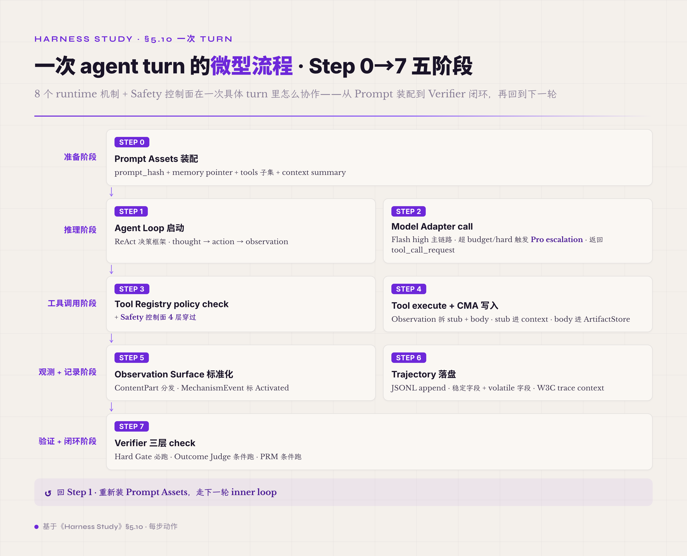

# 5.10 一次 turn 的微型流程 · 8 个 runtime 机制 + Safety 横切

前面 §5.1 至 §5.9 把 8 个 runtime 机制和 1 个 Safety 控制面分别讲完了。单看每个机制，读者已经知道它是什么、为什么这么设计、怎么起步；但不容易看到这些机制**在一次具体的 agent turn 里怎么协作**。这是本节要补的视角。

讲 agent harness 的资料很少展示"一次 turn 里所有机制怎么协作"，大多按机制分章，不画协作图。本节用作者构造的最小示例补上这一块。示例是教学构造，不是某次真实运行的 trajectory，数值只用于展示机制之间的协作关系。

**先把几个单位说清楚：**

- **turn（轮）**：一次模型调用，加上它触发的工具执行，与 OpenAI Agents SDK、Claude Agent SDK 中 `max_turns` 的计数方式一致。本节讲的就是一轮。
- **step（步骤）**：本节把一轮内部拆成 Step 0 到 Step 7 来讲，step 只是讲解用的环节编号，不是独立的计数单位。有些框架把"一次模型调用"也叫 step，与本书的 turn 同义，读资料时注意区分。
- **回合**：从一条用户消息开始、到模型给出最终回复为止，一个回合包含多轮。
- **run（运行）**：一次任务从开始到终态（完成、失败、取消）的全过程，通常包含多轮。§5.11 的示例就是一个完整的 run。

**图里还会出现几个新词：**

- **Flash / Pro**：同一家模型中轻量快速的一档和能力更强的一档（名字借自 Gemini 的命名习惯）。默认用 Flash 跑，超出预算或遇到难题时升级到 Pro，这就是 §5.2 讲的升级（escalation）路由。
- **HITL（Human-in-the-Loop，人在回路中）**：某些动作必须等人确认才能执行，§5.9 详讲。
- **ContentPart**：作者实现中对多模态观测的类型划分（文本、图片、文件引用、预处理错误等），类似 Anthropic API 的 content block，§5.6 详讲。
- **MechanismEvent**：作者实现中每个机制在决策点发出的状态事件，分 Activated（触发）、Skipped（跳过）、Blocked（阻断）、Error（出错）四种，用来区分"机制没运行"和"运行了但无事可报"，§5.6 详讲。
- **OTel GenAI semconv（OpenTelemetry 生成式 AI 语义约定）**：OpenTelemetry 为生成式 AI 调用规定的一套属性命名约定，让不同工具产出的追踪数据字段一致，§5.7 详讲。
- **W3C trace context**：W3C 标准化的请求头格式，用来在服务之间传递追踪标识（trace ID 等），让跨进程、跨子 agent 的调用能串成同一条链路。它跟 GenAI semconv 是两层：前者管标识怎么传，后者管属性怎么命名。



*图 5.27 · 一次 agent turn 的 Step 0→7 五阶段流程*

```
[一次 agent turn 微型流程 · 8 个 runtime + Safety 横切]

══════ 准备阶段（每个 turn 都跑 · 但 turn 内只跑一次） ══════

Step 0 · Prompt Assets 装配
   prompt_hash = sha256(system + task + memory + tools snapshot + examples)   # 本轮完整 prompt 的指纹
   prompt 含：
     - system 指令（Safety 规则 / 工具使用规则 / instruction hierarchy）
     - 当前 task 描述
     - memory pointer（artifact_id 索引 · 不嵌完整产物）
     - tools registry 当前 turn 可见子集（select_for(query) 动态收窄）
     - context summary（上一轮 compaction 后的摘要 · 不是全 trajectory）
   trajectory: prompt_assets_load event { hash, family_breakdown, token_count }

══════ 推理阶段 ══════

Step 1 · Agent Loop 决策框架启动
   inner loop pattern = ReAct（业界主流默认 · 也可配 plan-execute / reflexion）
   生成 thought → action → observation 三元组准备
   trajectory: turn_boundary event + thought_start marker

Step 2 · Model Adapter call
   provider 路由：primary (Flash high) 走主链路 · 若超 token budget 或 task 标 hard 触发 Pro escalation
   strict tool schema 规范化 · request 发到 provider
   provider 返回 tool_call_request("write_file", { path: "src/x.py", content: "..." })
   trajectory: model_call event { provider, model, latency, prompt_tokens, completion_tokens, cache_hit_rate }

══════ 工具调用阶段（Safety 控制面在这里被穿过） ══════

Step 3 · Tool Registry policy check + Safety 控制面 4 层穿过
   3a. Tool Registry schema check → args 合法
   3b. ACI normalize → tool input 标准化（path 绝对化 / content 去 BOM 等）
   3c. Safety 控制面 4 层逐层穿过：
       Layer 1 permission mode = workspace-write → pass
       Layer 2 allow-deny-ask rule → "write_file in src/" 默认 allow（不在 deny list · 不要求 ask）
       Layer 3 PreToolUse hook fire → user-defined script return { decision: "allow" }
       Layer 4 sandbox bound check → cwd = /workspace/proj · target = src/x.py（在 workspace 内）· pass
   3d. requires_confirmation 字段 = false（write_file 在 src/ 默认不需要 HITL · git push 类才需要）
   trajectory: policy_decision event { tool, args_hash, layer_results: [pass, pass, pass, pass] }

Step 4 · Tool execute + Context-Memory-Artifact 写入
   tool.execute → 写入文件 · raw result { written_bytes: 1234, hash: "abc123..." }
   Observation 拆 stub + body：
     stub (≤80 token) = { type: "write_file_result", path, summary: "wrote 1234 bytes" }
     body (完整 raw result + 元数据) → ArtifactStore (artifact_id = "art_42")
     metadata → Memory schema_id 索引（按 artifact_id 反查 body）
   stub 进 context · body 不进 context · agent 用 artifact_id 引用
   trajectory: tool_call_response event { tool_call_id, stub, artifact_id, body_size }

══════ 观测 + 记录阶段 ══════

Step 5 · Observation Surface 标准化
   ContentPart 类型分发（text / image / file_ref / preprocess_error）
   stub schema 标准化 · OTel GenAI semconv 字段对齐
   MechanismEvent 标"Activated"（这个机制本 turn 真跑了 · 不是 Skipped/Blocked/Error）
   trajectory: observation event { content_parts, mechanism_state }

Step 6 · Trajectory · Event Stream 落盘
   JSONL append · 稳定字段（turn_id / tool_call_id / timestamp / event_type）+ volatile 字段（token / cache_hit / latency）分类
   W3C trace context 链路 ID 绑定 · 跨 sub-agent 可追溯
   trajectory: 本 turn 累计 5-7 行 JSONL（取决于是否触发 compaction）

══════ 验证 + 闭环阶段 ══════

Step 7 · Verifier 三层 check（按本 turn 是否任务完成 turn 决定跑哪层）
   Hard Gate（必跑）→ 文件 hash 存在 + 大小 > 0 + 在 expected path → pass
   Outcome Judge（条件跑）→ 本 turn 是工具调用 turn · 不是任务完成 turn · skip Outcome Judge
   PRM（条件跑）→ 多步推理任务 · process reward 累加 step-level score · 本步 score = 0.85（步骤合理）
   trajectory: verifier_decision event { hard_gate: pass, outcome_judge: skip, prm_score: 0.85 }

→ 进入下一轮：回 Step 0（重新装 Prompt Assets · 走 inner loop）

══════ Safety 控制面横切在每步默默穿过 ══════

   - Step 0 装载 prompt 时 · 外部数据（memory / tools snapshot）过 prompt injection scan
   - Step 2 模型推理时 · CoT length monitor + token budget cap 兜底
   - Step 3 工具调用时 · 4 层权限决策模型完整穿过（已展开）
   - Step 4 产物写入时 · sandbox file system 边界 + artifact PII 脱敏
   - Step 6 trajectory 落盘时 · PII / secret 脱敏 + audit log 同步
   - Step 7 verifier 判定时 · Outcome Judge 走 LLM 但 verifier rule 本身走代码
```

这张图把 8 个 runtime 机制和 Safety 控制面在一轮里的协作展开给读者看。读完之后应该能回答：一轮 agent turn 里，Prompt Assets、Agent Loop、Model Adapter、Tool Registry、Context-Memory-Artifact、Observation Surface、Trajectory、Verifier 这八个机制分别在哪一步做了什么，Safety 控制面在哪几步经过。

这张图有几点要交代清楚。

**第一，Step 0 到 Step 7 的编号是讲解顺序，也是"调用了一次工具的那一轮"里最常见的先后顺序，但不是每一轮都要走完全部步骤。** 哪些机制参与、何时参与，取决于这一轮模型输出了什么：

- Prompt Assets 每轮装配一次；
- Agent Loop 是这一轮的决策框架（思考结构，不是一段循环代码）；
- Model Adapter 每轮调用一次模型；
- Tool Registry 在模型决定调用工具时才介入；
- Context-Memory-Artifact 在工具产物需要写入时介入；
- Observation Surface 在观测结果进入上下文时介入；
- Trajectory 在有事件需要落盘时介入；
- Verifier 在需要判定时介入。

所以更准确的说法是：步骤之间有固定的先后，但某一步是否发生，由这一轮的事件触发。例如只思考、不调工具的一轮，就会跳过 Step 3 和 Step 4。

Step 0 里的 `prompt_hash` 也要说明一下。它是对本轮完整 prompt（system、task、memory、工具子集、示例）取的哈希，是这一轮 prompt 的指纹，记进 trajectory，用于回放和审计时确认"这一轮模型看到的到底是什么"。它不是跨轮不变的量：memory、工具子集、上下文摘要一变，哈希就跟着变。跨轮真正稳定的是 system 和 task 这段前缀，也只有这段稳定前缀才可能命中提示词缓存（§5.11 会在多轮的例子里再看一次）。

**第二，Safety 控制面在每一步都在背后运行。** agent 看不见 Safety，但 Safety 经过每一个与外部交互的点。这就是横切（cross-cutting）的工程本质：§5.9 已经讲过横切控制面与操作系统系统调用关口（syscall gate）的类比，这张图给出了具体的实现形态。

**第三，真实生产环境中的 agent 不会把每一轮都这样画出来。** 8 个机制的协作藏在 harness 的运行时代码里，agent 跑起来之后，读者在 trajectory 里只看到大约 5 到 10 行事件。这张图是把运行时内部的协作展开给读者看的教学视角，不是生产 trajectory 的真实形态。

8 个 runtime 机制里，有几项在单轮微型流程里没有显式出现：Context 管理的自动压缩（auto-compact）、Memory 的失效处理（invalidation）、Verifier 中 Outcome Judge 的复杂判定。它们在**跨轮、跨 run** 的层面工作，只看一轮看不出协作价值。下一节（§5.11）的中型流程示例补上这个视角。
