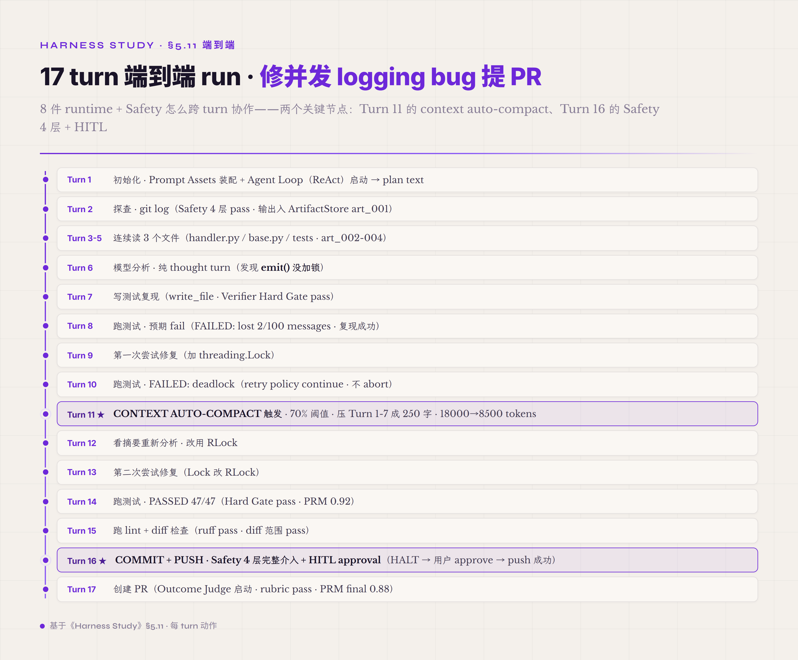
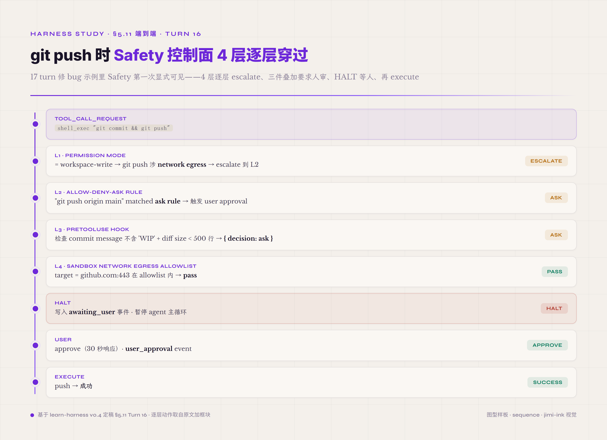

# 5.11 中型端到端流程示例 · 17 turn 修 logging bug

要把 8 件 runtime + Safety 控制面在跨 turn / 跨 run 层面的协作讲清楚 · 单 turn 微型流程不够——需要一个有真实复杂度的任务展开。下面示例任务是 "修一个 Python 项目的并发 logging bug 并提交 PR" —— bug 描述 "logger.emit() 在多线程下偶尔丢消息" · agent 要 定位 → 写测试复现 → 修 → 跑测试 → 跑 lint → commit → push → 创建 PR。任务长度约 17 turn —— 这是 single-agent 任务长度的典型生产区间（前面 Safety 常见误区 AP12 段讲过 30 turn 内单 agent 单进程足够 · 这个示例落在该区间）。



*图 5.28 · 17 个 turn 端到端修 logging bug 并提 PR*

示例是作者构造的教学示例 · 不是某次真实运行 trajectory · 数值用于展示机制协作关系。

```
═══════════════════════════════════════════════════════════
[单个 run · 约 17 turn]
═══════════════════════════════════════════════════════════

Turn 1 · 初始化 · Prompt Assets + Agent Loop 启动
   Prompt Assets 装配：
     P0 system: Safety 纪律 + 工具使用纪律 + instruction hierarchy
     P1 task: "修 src/logging/handler.py 的并发 bug · 提 PR"
     P2 memory: 空（fresh run · 没有 prior context）
     P3 tools: shell_exec / read_file / write_file / edit_file / create_pr
     P4 examples: 2 个 prior debug case（pattern 借鉴）
   system_prompt_hash = sha256(P0+P1+P2+P3+P4) = "abc123..."
   Agent Loop = ReAct mode（task 是 multi-step debug · ReAct 默认适用）
   Model Adapter call → 返回 plan text:
     "先看 git log 了解最近改动 · 再读 logging 模块"
   Trajectory: turn boundary + thought + model_call

Turn 2 · 探查 · git log
   Agent thought: "git log 看哪些 commit 动过 logging"
   tool_call_request("shell_exec", "git log --oneline -20 src/logging/")
   Safety 4 层穿过：
     L1 workspace-write → pass
     L2 shell_exec git read-only commands 默认 allow
     L3 PreToolUse hook → allow
     L4 sandbox cwd in workspace → pass
   Execute → 100 行 git log 输出
   Observation: stub("git log 100 行 · 最近 20 commits · 提到 'add threading support'")
                body 入 ArtifactStore (art_001)
   Trajectory: 3 行（request / policy / response）

Turn 3-5 · 连续读 3 个文件
   Agent thought（每轮）: "读 handler.py / base.py / tests/__init__.py 看实现细节"
   read_file × 3（handler.py 800 行 + base.py 300 行 + tests/__init__.py 50 行）
   每次 Observation: stub 进 context · body 进 ArtifactStore（art_002, art_003, art_004）
   Safety 4 层穿过每次 · pass
   Trajectory: 9 行

Turn 6 · 模型分析 · 纯 thought turn
   Agent Loop · model_call → text only · 不调工具:
     "看到 logger.emit() 在 ThreadSafeHandler 里没加锁。
      并发场景下两个线程同时写 buffer 会丢消息。"
   Trajectory: 1 行 turn boundary + thought（没有 tool call）

Turn 7 · 写测试复现
   Agent thought: "写测试复现 bug · 先让测试 fail · 修了再让测试 pass"
   tool_call_request("write_file", "tests/test_concurrency.py", content=80 行)
   Safety 4 层穿过 · tests/ 在 workspace-write 内 · pass
   Execute → 写入成功 · raw result { written_bytes: 2456, hash: "def456..." }
   Observation stub + body 拆 · body 入 ArtifactStore (art_005)
   Verifier Hard Gate: 文件存在 · 大小 > 0 · pass
   Trajectory: 4 行（request / policy / response / verifier）

Turn 8 · 跑测试 · 预期 fail（复现 bug）
   tool_call_request("shell_exec", "pytest tests/test_concurrency.py -v")
   Safety 穿过 · pass
   Execute → "FAILED: assertion: lost 2/100 messages"
   Verifier Hard Gate（这个 turn 期望 fail）: post-run test fail = 复现成功 · continue
   Trajectory: 3 行

Turn 9 · 第一次尝试修复
   Agent thought: "加 threading.Lock 保护 buffer 写入"
   tool_call_request("edit_file", "src/logging/handler.py", patch=加 threading.Lock)
   Safety 4 层穿过：
     L2 edit_file in src/ → workspace-write mode 默认 allow
     L3 Hook 检查 patch 是否涉及 sensitive file → handler.py 不在 sensitive list · allow
     L4 sandbox file system bound check · pass
   Execute → patch 应用
   Trajectory: 3 行

Turn 10 · 跑测试 · 期望 pass
   tool_call_request("shell_exec", "pytest")
   Execute → "FAILED: deadlock detected · test timeout 60s"
   Verifier Hard Gate: 失败 · 但 retry policy 决定 continue · 不 abort
   Trajectory: 3 行

╔═════════════════════════════════════════════════════════╗
║ Turn 11 · CONTEXT AUTO-COMPACT 触发                       ║
║                                                            ║
║ context 总 tokens 达预算 70% 阈值（auto-compact 触发条件）║
║ Compactor 启动（Context-Memory-Artifact 协作）:           ║
║   - 选 Turn 1-7 作为压缩范围（早期 + 已完成阶段）         ║
║   - 调便宜模型（gpt-5.4-nano）把 7 轮压成 250 字摘要     ║
║   - 保留 Turn 8-10 完整（最近 + 跟当前 deadlock 问题相关）║
║   - 标 mark 所有未闭合 tool_call_id 避免压缩后幻觉       ║
║   - 摘要保留 artifact_id 引用（agent 仍能查 body）        ║
║                                                            ║
║ Trajectory: compaction event                              ║
║   { before_tokens: 18000, after_tokens: 8500,             ║
║     summary_model: gpt-5.4-nano, range: turns_1_to_7 }   ║
║                                                            ║
║ ★ Context-Memory-Artifact 在此 turn 第一次显式出现 ★     ║
╚═════════════════════════════════════════════════════════╝

Turn 12 · 看摘要重新分析 · 修正方向
   Agent Loop · 模型读 compaction 后 context + Turn 8-10 失败信息
   thought:
     "之前用 Lock 死锁 · 因为 handler.emit() 内部又调了 self.acquire()。
      改用 RLock（reentrant lock）即可。"
   Trajectory: 1 行

Turn 13 · 第二次尝试修复
   tool_call_request("edit_file", path, refined_patch=改 Lock 为 RLock)
   Safety 4 层穿过 · pass
   Execute → 写入
   Trajectory: 3 行

Turn 14 · 跑测试 · 通过
   tool_call_request("shell_exec", "pytest")
   Execute → "PASSED 47/47 in 3.2s"
   Verifier Hard Gate: pass
   Outcome Judge: 这个 turn 是 task 中段 · skip outcome judge
   PRM: step score 0.92（合理）
   Trajectory: 3 行 + verifier

Turn 15 · 跑 lint + diff 检查
   tool_call_request("shell_exec", "ruff check src/ && git diff")
   Execute → "All checks passed" + diff 输出
   Verifier Hard Gate: diff 只在 handler.py + tests/ · 没动其他文件 · pass
   Trajectory: 3 行

╔═════════════════════════════════════════════════════════╗
║ Turn 16 · COMMIT + PUSH · Safety 控制面 4 层完整介入       ║
║                                                            ║
║ tool_call_request("shell_exec", "git commit && git push") ║
║                                                            ║
║ Safety 4 层逐层穿过：                                     ║
║   L1 permission mode = workspace-write                    ║
║      → git commit 本地 OK · git push 涉及 network egress  ║
║      → escalate 到 L2                                     ║
║   L2 allow-deny-ask rule:                                 ║
║      "git push origin main" matched ask rule              ║
║      → 触发 user approval                                 ║
║   L3 PreToolUse hook fire:                                ║
║      user-defined script 读 commit message + diff size    ║
║      检查 commit message 不含 'WIP' · 通过                 ║
║      检查 diff size < 500 行 · 通过                       ║
║      返回 { decision: "ask" } （hook 也要求 user ask）     ║
║   L4 sandbox network egress allowlist:                    ║
║      target = github.com:443 · 在 allowlist 内 · pass     ║
║                                                            ║
║ HALT · 写入 awaiting_user 事件 · 暂停 agent 主循环         ║
║                                                            ║
║ Trajectory: policy_decision (halted · awaiting_user)      ║
║             + hook_decision (require_user_ask)             ║
║                                                            ║
║ [用户 approve · 30 秒响应]                                ║
║                                                            ║
║ Trajectory: user_approval event                           ║
║             { approver: dev-user, decision: approve,         ║
║               timestamp, audit_log_id }                    ║
║                                                            ║
║ Execute push → 成功                                        ║
║ Trajectory: tool_call_response                            ║
║                                                            ║
║ ★ Safety 控制面 4 层在此 turn 第一次显式可见 ★            ║
╚═════════════════════════════════════════════════════════╝

Turn 17 · 创建 PR
   tool_call_request("create_pr", title, body=含修复说明 + 测试结果)
   Safety 4 层穿过 · create_pr 工具配 requires_confirmation = false（已经在 Turn 16 approve push 后视为整体任务批准）· allow
   Execute → PR URL 返回 "https://github.com/org/repo/pull/123"
   Verifier Outcome Judge（这个 turn 是 task 结束 turn · 启动 outcome judge）:
     judge LLM 读 PR body + commit diff + test result
     judge LLM rubric: "PR 是否包含 bug fix + 测试 + 描述" · pass
   PRM: final task score 0.88
   Trajectory: 3 行 + outcome judge verdict + prm final score

═══════════════════════════════════════════════════════════
End of run.
═══════════════════════════════════════════════════════════
```

**单 run 总结**：17 turn · 约 50 行 trajectory 事件 · 1 次 context auto-compact（Turn 11）· 1 次 verifier Hard Gate 失败后 retry（Turn 10）· 1 次 Safety 4 层完整介入 + HITL approval（Turn 16）· Outcome Judge 在 final turn 启动 · PRM 累加全程 step score。

这个示例把 8 件 runtime + Safety 控制面在跨 turn 协作的几个关键观察点显式画出。

**Prompt Assets 的稳定前缀（P0 system + P1 task）跨 turn 复用 · 动态部分（P2 memory / P3 tools 子集 / context summary）每 turn 按需更新** —— prompt 装配不是每 turn 从头重做 · 但也不是「一份 hash 跨 turn 不变」：能命中 prompt cache 的是 system + task 这段稳定前缀；memory / tools / summary 一变 · system_prompt_hash 就跟着变（前面 Context 那章讲过 · compaction 改写中段会让 cache 失效）。所以那个 hash 的角色是「这一 turn prompt 的完整指纹」进 trajectory 供 replay 与审计 · 不是跨 turn 不变的 cache key。

**Agent Loop 决策框架（ReAct mode）显式在每个 model call 之前展开** —— thought 段是 agent 推理的外化 · 不是隐藏在 model call 里。这件外化让 trajectory 可读 · 也是前面 Observation Surface / Trajectory 两章讲的 evolver loop 能消费 trajectory 做 self-evolution 的前提（trajectory 含 thought 就含决策依据）。

**Context-Memory-Artifact 三件协作隐身在 stub + body 拆分里** —— 每次 tool 调用产物自动拆 stub（进 context）+ body（进 ArtifactStore）。agent 看到 stub 知道做了什么 · 用 artifact_id 引用 body 不挤 context。Turn 11 auto-compact 把 7 轮历史压成 250 字摘要 + 保留 artifact_id 引用——agent 仍能查 body · 只是不在 context 里。这件 stub + body + compact + retrieval 协作是 Context-Memory-Artifact 三件运作的核心 pattern。

**Observation Surface + Trajectory 跨 turn 累积 evidence** —— 每个 stub 进 context + 每个 event 进 trajectory · 17 turn 累计约 50 个事件。这些事件支持 trajectory replay（用同样 prompt assets 跑 agent 看是否同结果 · 验证 determinism）· 也支持 self-evolution（evolver loop 读 trajectory 找出 "哪些 turn 是浪费 / 哪些决策是错的 / 哪些工具调用本可以合并"）。

**Verifier 三层按 turn 类型选择性启动** —— Hard Gate 每个工具调用 turn 都跑（文件存在 / 命令 exit code 等）· Outcome Judge 只在 task 结束 turn 启动一次（Turn 17）· PRM 全程累加 step score（每个 model call 都打分）。三层按场景配 · 不是每 turn 三层都跑。

**Safety 控制面 4 层每 turn 都穿过但通常隐身** —— Turn 2/3/4/5/7/9/13/15 等常规工具调用（workspace-write 模式下）都过 4 层但都 pass · 读者看不到 Safety 显式存在；Turn 16 git push 触发 network egress + ask rule + Hook 同时 require user approval 三件叠加 · Safety 4 层完整介入显式可见。这种"通常隐身 · 关键 case 显式" 的 pattern 是 Safety 控制面工程化的核心 — Safety 不应该让 user 每个工具调用都被打断 · 但关键 high-impact 操作必须可见。



*图 5.29 · git push 时 Safety 四层逐层穿过*

跨 run 的 ablation 视角（前面 Observation Surface / Trajectory 两章讲的 self-evolution 基础设施 · 在后面 Harness Lab 章节系统展开）展示同一任务在不同 harness 配置下的成功率差异（hypothetical ablation matrix · 作者构造的教学示例 · 不是实证数据 · 仅用于说明机制贡献逻辑）：

| Run | 配置 | 成功率 | 备注 |
|---|---|---|---|
| A | 全机制开（8 件 runtime + Safety 4 层 + HITL approval） | 5/5 | 基线 |
| B | 关 Verifier post-run test | 3/5 | 2 次 silent failure（编译过但功能错） |
| C | 关 Context auto-compact | 2/5 | 3 次 context overflow · 模型被截断遗忘任务 |
| D | 关 Safety approval（自动允许 git push） | 5/5 | 速度更快 · 但有 1 次 push 了未通过 review 的代码——风险更高 |
| E | 关 Trajectory recorder | 5/5 | 跑得通 · 但**事后 ablation 也跑不了**——这一条 ablation 本身需要 trajectory 才能做 |
| F | 关 Prompt Assets P4 examples | 4/5 | 1 次走错 debug 方向（少了 prior debug case 借鉴） |
| G | 关 Agent Loop ReAct mode（改 plain mode · 不外化 thought）| 3/5 | 2 次决策不可审 · 后期不知道为什么走错 |

从这张表能看到几件 framing。**第一件** —— Verifier 跟 Context 管理是该任务的正贡献机制——关掉成功率明显下降。**第二件** —— Safety approval 对速度是负贡献（HITL 等人审）· 但对**风险**是正贡献——这种取舍 ablation 数据本身不能下结论 · 要看业务对 "快 vs 稳" 的权重。**第三件** —— Trajectory recorder 是**前提性机制**——它不影响成功率 · 但关掉就没办法做后续任何 ablation。这种"基础设施"机制不能用 ablation 直接评 · 要作为前提保留。**第四件** —— Agent Loop 跟 Prompt Assets 是本卷新加的两件——ablation 显示它们都有可观察贡献（Agent Loop ReAct mode 让决策可审 · Prompt Assets examples 让 prior pattern 可借）。

跨 run 的 ablation 是 Harness Lab 章节的主题——本节只点到为止 · 让读者看到"单 run 内的 17 turn 协作"跟"跨 run 的 ablation 矩阵"是两个互补视角。前者是 runtime 协作 · 后者是 outer loop 优化。两者合起来构成完整的 harness 工程实践。

---

> **第一大章结束 · 第二大章接续 part5**
>
> §一-§五 全本（导论 + 8 件 runtime + 1 件 Safety 控制面 + 微型 + 端到端 17 turn）共 part1-4 累计约 ~115K 字 · 第一大章导论部分到此完整闭环。
>
