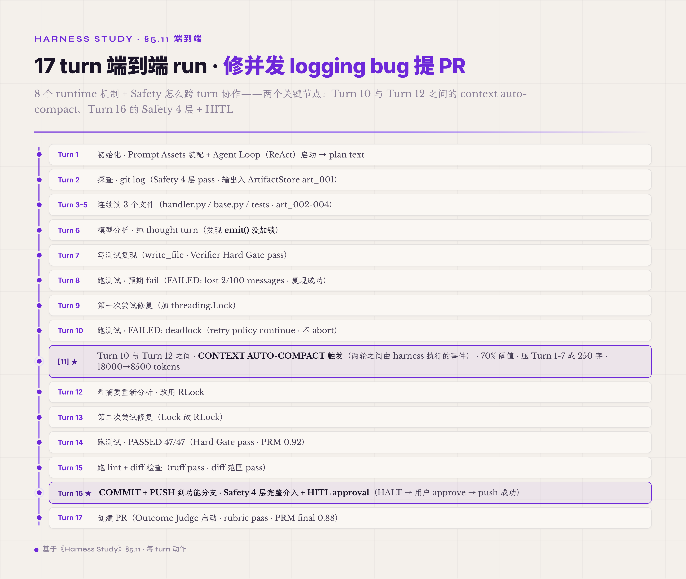
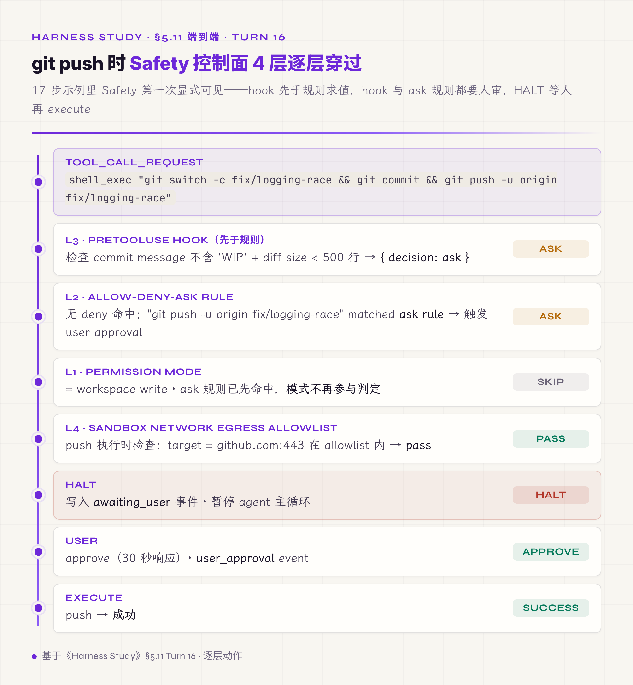

# 5.11 中型端到端流程示例 · 17 步修 logging bug

要把 8 个 runtime 机制和 Safety 控制面在跨轮、跨 run 层面的协作讲清楚，单轮的微型流程不够，需要一个有真实复杂度的任务。下面的示例任务是"修一个 Python 项目的并发 logging bug 并提交 PR"，bug 描述是"logger.emit() 在多线程下偶尔丢消息"。agent 要依次定位问题、写测试复现、修复、跑测试、跑 lint、commit、推送到功能分支，再向 main 创建 PR。

时间线上共有 17 个编号：16 轮 agent 调用，加上编号 11 处的一次上下文压缩。压缩发生在 Turn 10 结束之后、Turn 12 开始之前，是两轮之间由 harness 执行的事件，不是一轮 agent 调用；为了和图 5.28 的时间线对应，这里沿用 17 个编号。这个长度落在单 agent 任务常见的区间里：§6.6 讨论 fork-join 时给过判断线，30 轮以内的任务用单 agent 单进程通常就够（经验值）；§5.9 讲子 agent 深度爆炸（Sub-agent Depth Explosion，AP12，见附录 F）时，又从 Safety 一侧补了上限约束。



*图 5.28 · 17 步端到端修 logging bug 并提 PR*

示例是作者构造的教学示例，不是某次真实运行的 trajectory，数值只用于展示机制之间的协作关系。

```
═══════════════════════════════════════════════════════════
[单个 run · 16 轮 agent 调用 + 1 次两轮之间的压缩 · 共 17 个编号]
═══════════════════════════════════════════════════════════

Turn 1 · 初始化 · Prompt Assets + Agent Loop 启动
   Prompt Assets 装配：
     system: Safety 规则 + 工具使用规则 + instruction hierarchy
     task: "修 src/logging/handler.py 的并发 bug · 提 PR"
     memory: 空（fresh run · 没有 prior context）
     tools: shell_exec / read_file / write_file / edit_file / create_pr
     examples: 2 个 prior debug case（pattern 借鉴）
   prompt_hash = sha256(system+task+memory+tools+examples) = "abc123..."   # 本轮完整 prompt 的指纹
   Agent Loop = ReAct mode（task 是 multi-step debug · ReAct 默认适用）
   Model Adapter call → 返回 plan text:
     "先看 git log 了解最近改动 · 再读 logging 模块"
   Trajectory: turn boundary + thought + model_call

Turn 2 · 探查 · git log
   Agent thought: "git log 看哪些 commit 动过 logging"
   tool_call_request("shell_exec", "git log --oneline -20 src/logging/")
   Safety 4 层穿过（按求值顺序，hook 先于规则）：
     L3 PreToolUse hook → allow
     L2 shell_exec git read-only commands 默认 allow
     L1 workspace-write → pass
     L4 sandbox cwd in workspace → pass
   Execute → 20 行 git log 输出
   Observation: stub("git log 20 行 · 最近 20 个 commit · 提到 'add threading support'")
                body 入 ArtifactStore (art_001)
   Trajectory: 3 行（request / policy / response）

Turn 3-5 · 连续读 3 个文件
   Agent thought（每轮）: "读 handler.py / base.py / tests/__init__.py 看实现细节"
   read_file × 3（handler.py 800 行 + base.py 300 行 + tests/__init__.py 50 行）
   每次 Observation: stub 进 context · body 进 ArtifactStore（art_002, art_003, art_004）
   Safety 4 层穿过每次 · pass
   Trajectory: 9 行

Turn 6 · 模型分析 · 纯 thought turn
   Agent Loop · model_call → text only · 不调工具:
     "看到 logger.emit() 在 ThreadSafeHandler 里没加锁。
      并发场景下两个线程同时写 buffer 会丢消息。"
   Trajectory: 1 行 turn boundary + thought（没有 tool call）

Turn 7 · 写测试复现
   Agent thought: "写测试复现 bug · 先让测试 fail · 修了再让测试 pass"
   tool_call_request("write_file", "tests/test_concurrency.py", content=80 行)
   Safety 4 层穿过 · tests/ 在 workspace-write 内 · pass
   Execute → 写入成功 · raw result { written_bytes: 2456, hash: "def456..." }
   Observation stub + body 拆 · body 入 ArtifactStore (art_005)
   Verifier Hard Gate: 文件存在 · 大小 > 0 · pass
   Trajectory: 4 行（request / policy / response / verifier）

Turn 8 · 跑测试 · 预期 fail（复现 bug）
   tool_call_request("shell_exec", "pytest tests/test_concurrency.py -v")
   Safety 穿过 · pass
   Execute → "FAILED: assertion: lost 2/100 messages"
   Verifier Hard Gate（这个 turn 期望 fail）: post-run test fail = 复现成功 · continue
   Trajectory: 3 行

Turn 9 · 第一次尝试修复
   Agent thought: "加 threading.Lock 保护 buffer 写入"
   tool_call_request("edit_file", "src/logging/handler.py", patch=加 threading.Lock)
   Safety 4 层穿过：
     L3 Hook 检查 patch 是否涉及 sensitive file → handler.py 不在 sensitive list · allow
     L2 edit_file in src/ → workspace-write mode 默认 allow
     L4 sandbox file system bound check · pass
   Execute → patch 应用
   Trajectory: 3 行

Turn 10 · 跑测试 · 期望 pass
   tool_call_request("shell_exec", "pytest")
   Execute → "FAILED: deadlock detected · test timeout 60s"
   Verifier Hard Gate: 失败 · 但 retry policy 决定 continue · 不 abort
   Trajectory: 3 行

╔═════════════════════════════════════════════════════════╗
║ [11] Turn 10 与 Turn 12 之间 · CONTEXT AUTO-COMPACT 触发 ║
║ （两轮之间由 harness 执行的事件 · 不是一轮 agent 调用） ║
║                                                            ║
║ 上下文占用达到上下文预算的 70%（auto-compact 触发条件 ·  ║
║ 经验值 · 本例不设具体预算数）                             ║
║ Compactor 启动（Context-Memory-Artifact 协作）:           ║
║   - 选 Turn 1-7 作为压缩范围（早期 + 已完成阶段）         ║
║   - 调便宜模型（gpt-5.4-nano）把 7 轮压成 250 字摘要     ║
║   - 保留 Turn 8-10 完整（最近 + 跟当前 deadlock 问题相关）║
║   - 标 mark 所有未闭合 tool_call_id 避免压缩后幻觉       ║
║   - 摘要保留 artifact_id 引用（agent 仍能查 body）        ║
║                                                            ║
║ Trajectory: compaction event                              ║
║   { before_tokens: 18000, after_tokens: 8500,             ║
║     summary_model: gpt-5.4-nano, range: turns_1_to_7 }   ║
║                                                            ║
║ ★ compaction 在本 run 中第一次出现 ★                      ║
╚═════════════════════════════════════════════════════════╝

Turn 12 · 看摘要重新分析 · 修正方向
   Agent Loop · 模型读 compaction 后 context + Turn 8-10 失败信息
   thought:
     "之前加 Lock 后死锁：emit() 内部调用的辅助方法
      又去获取同一把新加的 Lock，而 threading.Lock 不可重入。
      改用 RLock（reentrant lock，可重入锁）即可。"
     （标准库 logging.Handler 自带的 self.lock 默认就是 RLock，
      出问题的是这次新加的那把锁）
   Trajectory: 1 行

Turn 13 · 第二次尝试修复
   tool_call_request("edit_file", path, refined_patch=改 Lock 为 RLock)
   Safety 4 层穿过 · pass
   Execute → 写入
   Trajectory: 3 行

Turn 14 · 跑测试 · 通过
   tool_call_request("shell_exec", "pytest")
   Execute → "PASSED 47/47 in 3.2s"
   Verifier Hard Gate: pass
   Outcome Judge: 这个 turn 是 task 中段 · skip outcome judge
   PRM: step score 0.92（合理）
   Trajectory: 3 行 + verifier

Turn 15 · 跑 lint + diff 检查
   tool_call_request("shell_exec", "ruff check src/ && git diff")
   Execute → "All checks passed" + diff 输出
   Verifier Hard Gate: diff 只在 handler.py + tests/ · 没动其他文件 · pass
   Trajectory: 3 行

╔═════════════════════════════════════════════════════════╗
║ Turn 16 · COMMIT + PUSH 到功能分支 · Safety 4 层完整介入   ║
║                                                            ║
║ tool_call_request("shell_exec",                           ║
║   "git switch -c fix/logging-race && git commit           ║
║    && git push -u origin fix/logging-race")                ║
║                                                            ║
║ Safety 4 层按求值顺序穿过（hook 先于规则）：              ║
║   L3 PreToolUse hook fire:                                ║
║      user-defined script 读 commit message + diff size    ║
║      检查 commit message 不含 'WIP' · 通过                ║
║      检查 diff size < 500 行 · 通过                       ║
║      返回 { decision: "ask" }（hook 要求 user ask）       ║
║   L2 allow-deny-ask rule:                                 ║
║      "git push -u origin fix/logging-race"                ║
║      无 deny 命中 · matched ask rule                      ║
║      （git push 一律需人工确认）→ 触发 user approval      ║
║   L1 permission mode = workspace-write                    ║
║      ask 规则已先命中，模式不再参与判定                   ║
║   L4 sandbox network egress allowlist（push 执行时）:     ║
║      target = github.com:443 · 在 allowlist 内 · pass     ║
║                                                            ║
║ HALT · 写入 awaiting_user 事件 · 暂停 agent 主循环         ║
║                                                            ║
║ Trajectory: policy_decision (halted · awaiting_user)      ║
║             + hook_decision (require_user_ask)             ║
║                                                            ║
║ [用户 approve · 30 秒响应]                                ║
║                                                            ║
║ Trajectory: user_approval event                           ║
║             { approver: dev-user, decision: approve,         ║
║               timestamp, audit_log_id }                    ║
║                                                            ║
║ Execute push → 成功                                        ║
║ Trajectory: tool_call_response                            ║
║                                                            ║
║ ★ Safety 控制面 4 层在此 turn 第一次显式可见 ★            ║
╚═════════════════════════════════════════════════════════╝

Turn 17 · 创建 PR
   tool_call_request("create_pr", head="fix/logging-race", base="main",
                     title, body=含修复说明 + 测试结果)
   Safety 4 层穿过 · create_pr 工具配 requires_confirmation = true
     Turn 16 批准的是 push · 不等于批准建 PR（§5.3：批准 X 不等于批准 Y）
     → HALT · 写入 awaiting_user 事件 · 用户 approve
   Trajectory: policy_decision (awaiting_user) + user_approval event
   Execute → 向 main 提交 PR · PR URL 返回 "https://github.com/org/repo/pull/123"
   Verifier Outcome Judge（这个 turn 是 task 结束 turn · 启动 outcome judge）:
     judge LLM 读 PR body + commit diff + test result
     judge LLM rubric: "PR 是否包含 bug fix + 测试 + 描述" · pass
   PRM: final task score 0.88
   Trajectory: 3 行 + outcome judge verdict + prm final score

═══════════════════════════════════════════════════════════
End of run.
═══════════════════════════════════════════════════════════
```

**单 run 总结**：16 轮 agent 调用，加 1 次两轮之间的上下文压缩（编号 11），共约 50 行 trajectory 事件。其中：

- 1 次 verifier Hard Gate 失败后按重试策略继续（Turn 10）；
- 2 次人工确认（HITL）：Turn 16 的 push 触发 Safety 4 层完整介入，Turn 17 建 PR 再单独确认一次；
- Outcome Judge 在最后一轮启动；
- PRM 全程累加每步得分。

这个示例把 8 个 runtime 机制和 Safety 控制面跨轮协作的几个关键观察点显式画了出来。

**Prompt Assets：稳定前缀（system + task）跨轮复用，动态部分（memory、工具子集、上下文摘要）每轮按需更新。** prompt 装配不是每轮从头重做，但也不是"一个哈希跨轮不变"。能命中提示词缓存的只有 system 加 task 这段稳定前缀；memory、工具子集、摘要一变，prompt_hash 就跟着变（§5.4 讲过，compaction 改写中段会让其后的缓存失效）。所以 prompt_hash 的角色是"这一轮完整 prompt 的指纹"，记进 trajectory 供回放与审计，而不是跨轮不变的缓存键。这与 §5.10 对 prompt_hash 的说明一致。

**Agent Loop 的决策框架（ReAct 模式）在每次模型调用之前显式展开。** thought 段是 agent 推理过程的外化，而不是藏在模型调用里。这种外化让 trajectory 可读，也是 §5.6、§5.7 讲的演化循环（evolver loop）能用 trajectory 做自我演化的前提：trajectory 里有 thought，就有决策依据。

**Context-Memory-Artifact 三个机制的协作藏在 stub 与 body 的拆分里。** 每次工具调用的产物自动拆成 stub（进上下文）和 body（进 ArtifactStore）。agent 看 stub 就知道做了什么，用 artifact_id 引用 body，不占上下文。编号 11 的自动压缩把 7 轮历史压成 250 字摘要，同时保留 artifact_id 引用：agent 仍能查到 body，只是 body 不在上下文里。stub、body、压缩、检索四者的配合，是 Context-Memory-Artifact 运作的核心模式。

**Observation Surface 与 Trajectory 跨轮累积证据。** 每个 stub 进上下文，每个事件进 trajectory，整个 run 累计约 50 个事件。这些事件支持两件事：

- **回放（replay）**：按 trajectory 里已记录的 observation 重放这次 run，不重新执行工具，用来逐步复盘模型当时看到了什么、做了什么决策，或者在固定输入下调试 verifier；
- **自我演化**：演化循环读 trajectory，找出哪些轮次是浪费、哪些决策是错的、哪些工具调用本可以合并。

**Verifier 三层按轮次类型选择性启动。** Hard Gate 在每个调用工具的轮次都跑（文件是否存在、命令退出码等）；Outcome Judge 只在任务结束的那一轮启动一次（Turn 17）；PRM 全程累加每步得分（每次模型调用都打分）。三层按场景配置，不是每轮都全跑。需要说明的是，PRM（过程奖励模型）主要用于训练和推理期搜索，线上逐步打分的做法较少见，这里只为展示三层的分工（见 §5.8）。

**Safety 控制面的 4 层每轮都经过，但通常不显形。** Turn 2、3、4、5、7、9、13、15 等常规工具调用（workspace-write 模式下）都经过 4 层且全部放行，读者看不到 Safety 的存在。Turn 16 的 git push 同时触发了 hook 要求人工确认、ask 规则和网络出口检查三项，Safety 4 层的完整介入才显式可见。Turn 17 建 PR 是另一个动作，按 §5.3 说的"批准 X 不等于批准 Y"，再确认一次。这种"平时不显形、关键操作显式"的模式是 Safety 控制面工程化的核心：不应该让用户在每次工具调用时都被打断，但高影响的关键操作必须让人看见。



*图 5.29 · git push 时 Safety 四层逐层穿过*

再看跨 run 的消融（ablation）视角（§5.6、§5.7 讲的自我演化基础设施，第七章 Harness Lab 会系统展开）：同一个任务在不同 harness 配置下，成功率差多少。下面这张表是作者构造的假设性消融矩阵，不是实测数据，只用来说明怎么读机制的贡献：

| Run | 配置 | 成功率 | 备注 |
|---|---|---|---|
| A | 全机制开（8 个 runtime 机制 + Safety 4 层 + HITL 确认） | 5/5 | 基线 |
| B | 关 Verifier 的运行后测试 | 3/5 | 2 次无声失败（编译通过但功能错） |
| C | 关 Context 自动压缩 | 2/5 | 3 次上下文溢出，上下文被截断后模型遗忘任务 |
| D | 关 Safety 确认（自动允许 git push） | 5/5 | 速度更快，但有 1 次 push 了未经 review 的代码，风险更高 |
| E | 关 Trajectory 记录器 | 5/5 | 示意值；关掉后无法做事后消融与复盘 |
| F | 关 Prompt Assets 中的示例（examples） | 4/5 | 1 次走错调试方向（示意） |
| G | 关 Agent Loop 的 ReAct 模式（改为不外化 thought 的普通模式）| 3/5 | 示意值；决策过程不可审 |

这张表示意的是作者预期的贡献方向，不是测得的结果，不能据此下结论。按这个预期，读表时注意几点：

- Verifier 和上下文压缩预期是这个任务的正贡献机制，关掉后成功率预期明显下降；
- Safety 确认对速度是负贡献（要等人审），对风险是正贡献，这种取舍消融数据本身给不出结论，要看业务对"快"与"稳"的权重；
- Trajectory 记录器是前提性机制：没有它，后续的消融和复盘都没有数据可用，所以它不适合用消融来评，应作为前提保留；
- Prompt Assets 的示例（F 行）和 Agent Loop 的 ReAct 模式（G 行）有没有贡献、贡献多大，要靠真实的多次复跑消融来测。

跨 run 的消融是第七章 Harness Lab 的主题，本节只点到为止，让读者看到"单个 run 内 17 步的协作"和"跨 run 的消融矩阵"是两个互补的视角：前者是运行时的协作，后者是外层循环（outer loop）的优化。两者合起来构成完整的 harness 工程实践。

---

> **§一至 §五 到此结束**：导论、8 个 runtime 机制、1 个 Safety 控制面、单轮微型流程和端到端示例。下一章（§六）讲工程模式。
