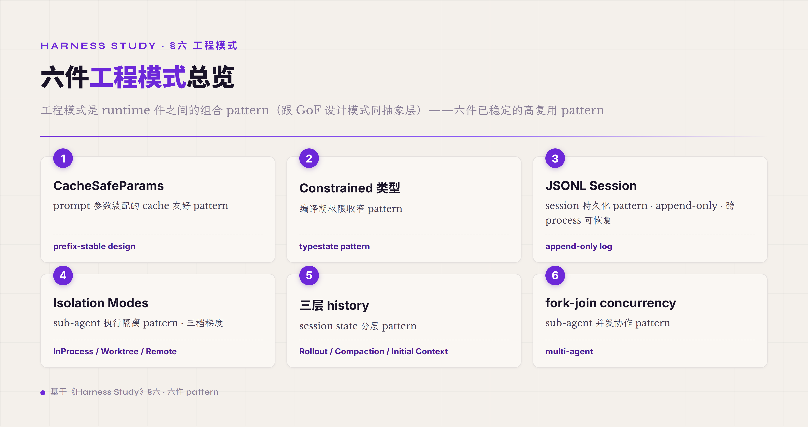
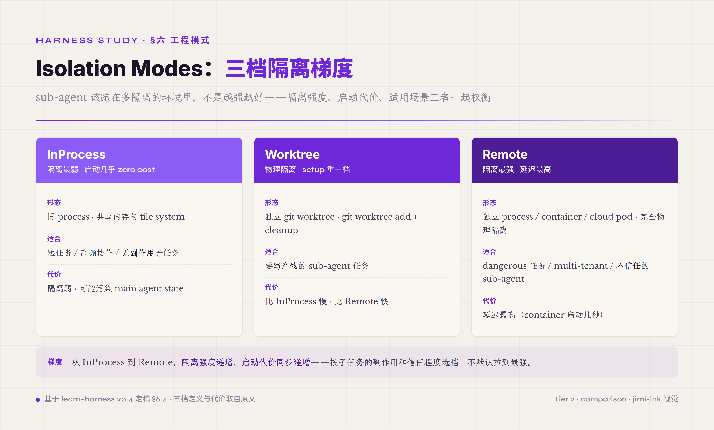
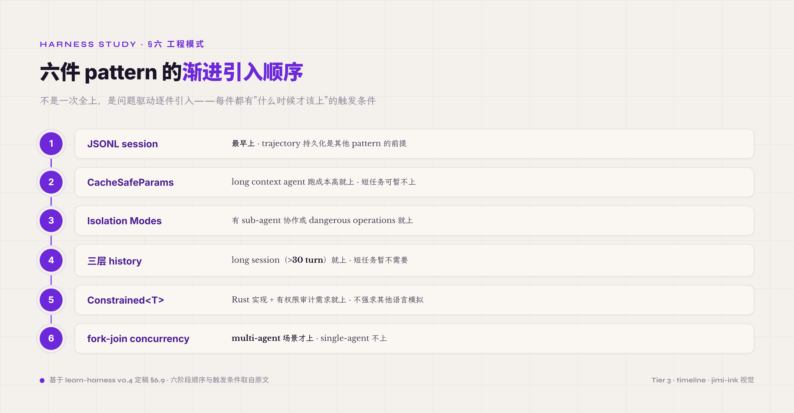

# 六、工程模式 · 跨件复用的工程组合 pattern

前面 §五 讲 8 件 runtime + 1 件 Safety 控制面——单件单件讲的是机制。但生产 agent harness 不是机制堆出来的——是机制 + 工程模式两层叠起来跑的。工程模式比机制小一档——不构成完整组件 · 是组件之间的组合 pattern · 跨多件 runtime 复用。这一章把 agent harness 工程里跑出来的几件高复用 pattern 单独抽出来讲。

工程模式跟设计模式（GoF）是同一类抽象——把工程实践里反复出现的"问题 + 解法"抽象成可复用形态。GoF 1994 把面向对象编程里的 23 件 pattern（Singleton / Observer / Factory 等）系统化 · 让后来的工程师不用每次重新发明。agent harness 工程也在沉淀类似的 pattern 序列——业界 2026 还在收敛期 · 没有像 GoF 那样的标准命名共识 · 但几件 pattern 已经在 Claude Code / Codex / OpenHands 等业界主流 harness 里反复出现。本章选 6 件已经稳定的工程模式展开——前 5 件是业界共识的 pattern（CacheSafeParams / Constrained 类型 / JSONL Session / Isolation Modes / 三层 history）· 第 6 件 fork-join concurrency 是 multi-agent 场景的工程组合 pattern · 前面 Safety 章已点指针。

工程模式跟 runtime 件的边界要分清。**runtime 件是 agent 一次 turn 实打实使用的组件**——Tool Registry / Verifier / Trajectory 这些是机制。**工程模式是机制之间的组合 pattern**——比如 prompt 怎么装让 prompt cache 能命中（CacheSafeParams 跨 Prompt Assets + Model Adapter + Context 三件协作）/ 工具权限怎么编码让编译期就拦住误调（Constrained 类型跨 Tool Registry + Safety 控制面两件协作）。pattern 不是组件——是"组件怎么搭"的工程经验沉淀。读完这一章读者应该知道几件常见组合 pattern 长什么样子 · 跑生产 agent 时能识别并复用。

#### 6.0 本节首次出现的术语

前面 §一-§五 已经解释过的术语（runtime 件 / cache / Tool Registry / Trajectory / sandbox / fork-join 等）下面不再重复。这里只列 §六 本节首次出现的术语。

**工程模式核心术语** —— **工程模式**（engineering pattern · 跨多件 runtime 件复用的组合 pattern · 跟 GoF 设计模式同抽象层 · 业界 2026 还在收敛期没标准命名）。**prefix-stable design**（Anthropic / OpenAI 等 prompt cache 的核心 cache-aware pattern · 保持 prompt prefix 跨 turn 字节级一致 · 让 cache 命中 · [Prompt caching · Claude API Docs](https://platform.claude.com/docs/en/build-with-claude/prompt-caching)）。**cache-safe forking**（Anthropic Claude Code 的 compaction pattern · 保持 system prompt + tools + prefix 不变 · 把 summary 续在末尾 · 让 cached prefix 在 compaction 后仍能 hit · [How Claude Code uses prompt caching](https://code.claude.com/docs/en/prompt-caching)）。

**Constrained 类型相关术语** —— **typestate pattern**（业界主流 Rust pattern · 把运行时状态编码进编译期类型 · 让 invalid 状态转换无法在代码里表达 · [The Typestate Pattern in Rust · Cliffle](https://cliffle.com/blog/rust-typestate/)）。**phantom type / PhantomData**（zero-sized marker type · 不占内存 · 在编译期标关系不在运行时表示 · [Phantom Types in Rust · Ben Ashby](https://www.benashby.com/phantom-types-in-rust/)）。**compile-time enforcement**（编译期强制约束 · 跟 runtime check 相对 · 不通过的代码根本编译不过 · 比 runtime 检查少一档可绕过性）。

**JSONL Session 术语** —— **JSONL session file**（一次 agent run 的事件流持久化文件 · 每行一个 JSON event · append-only · 跨 process 可恢复 · Claude Code 默认 session 格式 + Codex Rollout 格式 · 前面 Trajectory 那章已经讲 trajectory event taxonomy · 本节讲 session 作为 pattern 的复用维度）。**append-only**（事件流写入只允许追加 · 不允许修改历史 · 让 trajectory 不可篡改 + 可 diff）。

**Isolation Modes 术语** —— **execution isolation**（agent 跑任务时跟物理工作目录的隔离层次 · 三档梯度：dry-run / git worktree / clone 复制）。**git worktree**（Git 原生机制 · 一个 repo 多个工作目录 · agent 在独立 worktree 跑不影响主分支 · 跑完合并或丢弃）。**dry-run**（agent 跑但不真写产物 · 只输出"会写什么"的预演 · 适合 high-impact 操作）。

**三层 history 术语** —— **三层 history**（agent session 内部状态分层 pattern · 三层 = Rollout + Compaction + Initial Context · 每层独立 compaction / cache / 持久化策略 · 业界源头是 OpenAI Codex 的做法 · `core/src/session/turn.rs`）。**Rollout layer**（session 全量历史层 · append-only · 完整 turn-by-turn 记录 · 跨 process 可恢复 · 业界 Codex / Claude Code / OpenCode 等主流 CLI agent 都用 JSONL append-only 格式）。**Compaction layer**（压缩后摘要历史层 · 滚动更新 · 早期 turn 被压缩 / 近期 turn 完整保留 · 让 prompt context 在长 session 不超 budget）。**Initial Context layer**（不变上下文层 · 比如 system prompt / 项目元数据 / 工具集 · 跨 turn 不变 · 跟 prefix-stable design 配套让 prompt cache 命中）。

**fork-join 术语** —— **fork-join concurrency**（main agent 把任务拆给多个 sub-agent 并行跑 · 然后聚合结果回 main agent · 业界 multi-agent 主流 pattern · 也是 Anthropic multi-agent research 报告的核心 framing）。**provider 并发槽自适应**（不同 model provider 给的 API rate limit 不同 · provider 之间能并发跑的 sub-agent 数量也不同 · pattern 是按 provider 的 concurrent slot 数量动态调度 sub-agent · 不超 rate limit）。

#### 6.1 CacheSafeParams · prompt 参数装配的 cache 友好 pattern

**第一件工程模式** —— prompt 装配方式直接决定 prompt cache 命中率 · 命中率直接决定 agent 跑起来的成本跟延迟。**prefix-stable design** 是业界 2026 收敛的 pattern · 内部命名 CacheSafeParams · 业界叫 "cache-aware parameter passing" · 本质相同。

工程层面这件 pattern 解决什么问题—— prompt cache 是 Anthropic / OpenAI / DeepSeek 等 provider 都在用的 latency 优化机制 · 同样 prompt prefix 重复出现时 provider 缓存中间状态 · 后续请求复用缓存大幅降本（Anthropic 官方数字 · 命中后延迟最高省 ~85% · 命中的 cached token 价格是 base input 的 0.1x · 即省 ~90%）。但 cache 命中条件极严—— **prompt prefix 必须 byte-for-byte identical**（[Claude API Prompt Caching Docs](https://platform.claude.com/docs/en/build-with-claude/prompt-caching)）· 任何一字节不同 cache 就 miss。这件严苛性导致 agent harness 装 prompt 时如果不注意 cache-aware design · 每次 turn 都 cache miss · 跑起来又慢又贵。

prefix-stable design 的核心机制是 **把 prompt 拆成稳定段 + 变化段** —— 稳定段（system prompt / tools registry / few-shot examples）放前面 · 变化段（当前 task / latest user input / 最近 turn 历史）放后面。这样跨 turn 时稳定段不变 cache 能 hit · 变化段才让 cache 续接。Anthropic Claude Code 把这件 pattern 进一步做到 **"cache-safe forking"** —— 当 context compaction 触发时（前面端到端 17 turn 那章 Turn 11 已经讲过）· compaction 不重写 prompt prefix · 只把 summary 续在末尾 · 让 cached prefix 在 compaction 后仍能命中（[How Claude Code uses prompt caching](https://code.claude.com/docs/en/prompt-caching)）。

工程实现细节几条要点透。**第一条 · model 是 cache key 一部分** —— 切换 model（比如 Flash → Pro escalation）会让整个 cached prefix invalidate · 因为不同 model 有独立 cache pool。这件 framing 让 escalation 决策不只是"换更强 model" · 还要 weigh 进 "失去 cache 的成本"。**第二条 · tools 是 prefix 一部分** —— 加一个 tool 或改一个 tool description 会让那个 tool 之后的所有 cache invalidate。这件让 Tool Registry 的 `select_for(query)` 动态子集机制（前面 Tool Registry 那章讲过）变成 cache-aware 必须的——但子集变化会 cache miss · pattern 是把"通用工具 stable subset"放前面 / "task-specific subset" 放后面 · 让 stable subset 跨 turn 复用。**第三条 · 内容字节序敏感** —— JSON 字段顺序 / 空格 / 换行 / 编码（UTF-8 vs UTF-16）都影响 cache · agent harness 装 prompt 时要标准化 serializer（pretty-print 或固定 key 顺序）让序列化输出 byte-for-byte 稳定。

**provider 的 cache 接口形态不同 · DeepSeek 式自动前缀缓存的适配**。上面 cache_control 断点、cache-safe forking 是 Anthropic 路径——但不是所有 provider 都走手动 cache 管理。**DeepSeek 走 Context Caching on Disk** · 默认对所有用户开启 / 无需改代码 / 客户端没有也不发 `cache_control` · 后端自动按前缀匹配判定命中（"只有完全匹配某个 cache prefix unit 才命中" · 以 **64 token 为存储单元 · 不足 64 token 不缓存**）（[DeepSeek API · Context Caching](https://api-docs.deepseek.com/guides/kv_cache) · [2024-08 发布公告](https://api-docs.deepseek.com/news/news0802)）。这跟 Anthropic 显式声明 cache_control 断点（最多 4 个）正好相反——一个后端全自动 / 一个客户端手动 opt-in。接口更省心 · 但前缀稳定性的纪律一样严（命中要前缀整单匹配）· 两条适配要点：**第一 · system prompt 会话内彻底静态** —— system 是前缀最前段 · 任何每请求变动的字段（日期 / 时间戳 / 动态状态）让整条缓存从头失效 · 工程对策是把这类信息从 system 前段下沉到 system 末尾独立片段（其前所有静态段仍命中 · 只重算末尾那行）· 或下沉到首条 user message。**第二 · 严格 append-only** —— 重写对话前缀（把前段历史替换成摘要 / 改变前缀位置）是最隐蔽的缓存杀手 · 会让压缩后第一轮缓存大面积 miss · 工程对策是摘要锚点固定（压一次后位置不再变 · 后续只在尾部 append）/ 只摘要最新输出不改写历史 / prompt 裁剪只删不重排。

这里 **reasoning_content 的跨轮处理是个容易踩坑的工程权衡 · 不能一刀切**。官方契约是基线：deepseek-reasoner 输入带 reasoning_content 直接报 400（下一轮请求前必须删掉）· deepseek-v4 thinking mode（flash / pro 同）**工具调用轮必须把 reasoning_content 完整回传**、否则报 400 · 非工具轮回传则被服务端忽略（中性）（[DeepSeek API · reasoning model](https://api-docs.deepseek.com/guides/reasoning_model) · [thinking mode](https://api-docs.deepseek.com/guides/thinking_mode)）。基线之上有个真实权衡：按 DeepSeek-V4 技术报告 Interleaved Thinking · 工具场景跨轮保留 reasoning 能维持长周期 agent 的累积 CoT（有收益）· 但 reasoning 进前缀会占 billable prompt token · 还可能扰动缓存稳定。**agent reasonix（"engineered around prefix-cache stability"）选了相反一侧**——回传时剥离 reasoning_content（response-only field · 不为重传付费）· 用 thought harvesting（把 reasoning 蒸馏成结构化 state 再用）补偿 · 把 cache 稳定 + 省 token 放在 reasoning 累积之上（[esengine/DeepSeek-Reasonix](https://github.com/esengine/DeepSeek-Reasonix)）。但有个坑：relay / proxy（litellm、claude-code-router 都报过）若在**工具轮**简单剥离 reasoning_content 会撞上那条 400——剥离要么只在非工具轮 · 要么配 harvesting · 不能无脑删。

CacheSafeParams pattern 适用边界要分清。**适用场景** —— long context agent 任务（context 跨 turn 累积大）/ 高频 short turn agent（每 turn cache 节省累积可观）/ 长上下文 system prompt（CC 风格的大 system prompt 装 1000+ token）。**不适用场景** —— short single-turn 任务（cache 没机会累积价值）/ context 跨 turn 频繁大改的 task（cache 总是 miss · pattern 反而引入复杂度没收益）/ provider 不支持 prompt cache 的（比如某些早期 open-source model · 或者只支持 KV cache 不支持 prefix cache 的）。

这件 pattern 在 multi-agent 场景的实测效益值得单独提。**Claude Code 的做法是**用一个 `CacheSafeParams` 数据结构封装 systemPrompt / userContext / systemContext / toolUseContext / forkContextMessages 五个字段——sub-agent 启动时通过 CacheSafeParams **继承 parent agent 的 cache prefix**——也就是 sub-agent 不重新计算 system prompt + tools registry 这些 stable 段 · 直接复用 parent 已经缓存好的 prefix。这件做下来 **sub-agent cost 比从头跑省下可观一块**（system prompt + tools registry 这些 stable 段直接复用 parent 缓存 · 不重算）—— 这是 multi-agent 场景里 cache-aware design 最大的工程价值。也是为什么主流 CLI agent harness 都把 cache-safe forking 当作 compaction 的核心 invariant —— 不只是 cache 命中省钱 · 是让 multi-agent fork 在 cost 上可行。

#### 6.2 Constrained 类型 · 编译期权限收窄 pattern

**第二件工程模式** —— 把工具权限编码进编译期类型 · 让 invalid 权限调用根本写不出来 · 不依赖运行时检查兜底。业界主流叫 **typestate pattern**（[Cliffle blog 经典讲解](https://cliffle.com/blog/rust-typestate/) · [Microsoft RustTraining book Ch 3](https://microsoft.github.io/RustTraining/rust-patterns-book/ch03-the-newtype-and-type-state-patterns.html)）· OpenAI Codex 源码用这件 pattern 给 tool 权限封装 · 命名是 `Constrained<T>` · 本节按业界主流名 typestate pattern 讲 + 引 Codex 作为业界案例点缀。

工程层面这件 pattern 解决什么问题—— Tool Registry 给 agent 提供工具集 · 但不同工具有不同权限（read-only / workspace-write / dangerous）· 如果用 runtime check（每次工具调用前问 "你有这个权限吗"）· 检查逻辑分散在代码各处 · 容易漏检 / 容易被 bypass / 容易 hot-path 引入开销。typestate pattern 把权限编码进**工具的类型**——比如 `Tool<ReadOnly>` 跟 `Tool<WorkspaceWrite>` 是两个不同类型 · `git_status: Tool<ReadOnly>` / `write_file: Tool<WorkspaceWrite>` · agent harness 的 dispatcher 只接受跟当前 permission mode 类型匹配的工具 · 类型不匹配的代码根本编译不过。

Rust 实现的核心 mechanism 是 **phantom type + PhantomData** —— phantom type 是 zero-sized marker · 不占内存也不在运行时存在 · 只在编译期参与类型检查。**编译期强制的优势** —— invalid 状态在代码里写不出来 · 不需要 runtime check · zero overhead · audit 时只要 review 类型签名就知道权限边界。**对应到 agent harness 几个工程价值**：第一 · permission gating 不会被某段忘记 check 的代码 bypass（前面 Safety 常见误区 AP13 Hook Bypass 的工程对策之一就是 typestate pattern）；第二 · 工具集变化时 IDE 自动报错 · 不会被某个不熟悉权限边界的 contributor 误调到 dangerous tool；第三 · audit log 跟权限边界对齐 · 因为权限是类型 · 类型在编译产物 metadata 里都能看到。

工程实现的几个细节。**第一 · permission mode 用 phantom type 标** —— Rust 用 `Tool<ReadOnly>` / `Tool<WorkspaceWrite>` / `Tool<Dangerous>` 三档 phantom type · ToolPolicy registry 按 mode 给 agent 暴露对应子集（agent 跑在 ReadOnly mode 时只看到 `Tool<ReadOnly>` 集合 · 看不到 dangerous 工具的类型也意味着不可能调）。**第二 · state transition 显式建模** —— 从 `Tool<Unverified>` 经过 `verify()` 转 `Tool<Verified>` · 没 verify 过的工具不可调（编译错误）。**第三 · 权限提升要 explicit ceremony** —— 提权（比如临时给某个工具 dangerous 权限）必须显式走 `Tool<ReadOnly>::elevate(approval_token) -> Tool<WorkspaceWrite>` · approval_token 是来自 HITL approval 的不可伪造凭证 · 没 token 的代码升不了权。

这件 pattern 不适用的语言要点透。**typestate pattern 强依赖语言的类型系统强度** —— Rust / Haskell / OCaml / TypeScript（部分） 这种类型系统足够表达的语言能完整实施 · Python / JavaScript / Go 等动态类型或类型系统受限的语言只能用 runtime check 模拟 · 失去编译期保证。这件不可移植性是 typestate pattern 的工程限制——选语言 / 选框架时要 weigh 进。OpenAI Codex 用 Rust 写 harness 一部分原因就是要拿 typestate pattern 的编译期保证 · Anthropic Claude Code 用 TypeScript 写 harness 用 branded type 模拟 typestate（弱化版 · 但仍有 IDE 静态检查）。

业界实现对照值得看。**OpenAI Codex 用 `Constrained<T>` newtype pattern** 把工具权限 + Safe/Write/Dangerous 三档编码进类型 · 配 `AskForApproval` 三档触发 HITL approval · 这件设计是 Codex Rust 实现的核心 invariant 之一。**OpenCode 走 Go 实现** —— Go 类型系统比 Rust 弱一档 · 不能完整实施 typestate · OpenCode 用 interface + role-based check 走 runtime 路径 + 把权限策略放进 SQLite session storage 让 audit 可查（[opencode-ai/opencode GitHub](https://github.com/opencode-ai/opencode) · [OpenCode Docs](https://opencode.ai/docs/cli/)）。**OpenHands Python 走 runtime check + decorator** 模拟权限 · 没法做编译期保证 · 全靠 import-time + call-time check（[OpenHands Agent Control Plane](https://www.openhands.dev/blog/agent-control-plane)）。三档实现强度从强到弱 —— Rust（编译期）> Go（半运行时 + 持久化）> Python（纯运行时）—— 跟语言类型系统强度直接相关。这件 framing 让 harness 选语言不只是性能 / 团队偏好考虑 · Safety 边界的编译期保证也是真实约束。

#### 6.3 JSONL Session · session 持久化 pattern

**第三件工程模式** —— 一个 agent run 的全部事件流写到一个 JSONL 文件里 · 每行一个 JSON event · append-only · 跨 process 可恢复。这件 pattern 业界 CLI agent 主流都在用 —— Codex 的 Rollout / Claude Code 的 sessionStorage / OpenCode 的 SQLite-backed session 都是 JSONL session 这件 pattern 的不同实现。

工程层面这件 pattern 解决什么问题—— agent run 跑下来产生大量事件（前面 Trajectory 那章详细讲过 event taxonomy）· 这些事件要持久化下来才能 trajectory replay / debug / audit / self-evolution。持久化的格式选择有几条路径：**单 JSON 文件**（短 run + 人审场景 · SWE-agent 用）/ **JSONL append-only**（长 run + production 量大 · 业界主流）/ **数据库**（结构化查询场景 · 比如 OpenCode 用 SQLite）。JSONL append-only 是业界共识的工程默认 —— 三件工程优势让它成为主流。

**第一件优势 · append-only 性能** —— append 是文件系统最便宜的写操作 · 不需要 seek / 不需要 rewrite · 1KB 事件 append 通常 < 1ms · 即使长 run 累积几千事件也不影响 agent turn latency。**第二件优势 · 流式恢复** —— agent run 中途断电 / 进程崩溃 · JSONL 文件已写到第 N 行 · restart 时从第 N+1 行接续 · 不需要 replay 整个 session。流式恢复通常很快 · 用户基本无感（业界 CLI agent 普遍走这条路径）。**第三件优势 · git diff 友好** —— JSONL 每行一个独立 JSON · 跨 turn diff 时只显示新增行 · 不像 JSON 改一个 key 整个文件重排。这件 diff 友好性让 trajectory 可以进 git · 支持跨 commit 的 audit / 多人协作 / replay。

JSONL session 的工程实现有几个细节要点透。**第一 · Entry 类型分类** —— JSONL 不是单一 event type · 通常按 5-8 类 entry 分类。Claude Code 的做法是用 5 类 entry —— TranscriptMessage（user/assistant 消息）/ FileHistorySnapshot（文件状态快照）/ ContextCollapseCommit（compaction 事件）/ ContentReplacement（context 内容替换）/ AttributionSnapshot（产物归属）。每类有独立 schema · 反序列化时按 type 字段 dispatch。**第二 · 长 session 的 bounded with spillover pattern** —— session 文件不能无限增长 · 实现上通常给一个行数 / 字节上限 · 超限自动截断 + 警告 + 拆分指导。bounded with spillover 让 session 文件不会无限增长拖垮 agent restart。**第三 · session 跨 session 关联** —— 一个长任务可能跨多个 session 文件（前一个 session 的 compaction 摘要作为下一个 session 的 initial context）· 这件关联通过 session-id 链 + summary checkpoint 实现。

JSONL session 这件 pattern 的工程价值最终落到 **跨 run audit 跟 replay 都依赖它**。前面 Trajectory 那章讲过 trajectory 是 agent harness 的 first-class data · 这件"first-class"性质就是通过 JSONL session 的持久化具体落地的——session 文件不只是 debug 工具 · 是 agent run 的 audit log / training data / self-evolution input 三重身份合一的载体。

#### 6.4 Isolation Modes · sub-agent 执行隔离 pattern

**第四件工程模式** —— sub-agent 跑任务时跟 main agent 工作目录的物理隔离 pattern · 业界主流三档梯度。这件 pattern 跟 Safety 那章讲的 sandbox 物理隔离是同一类工程思路 · 但作用对象不同 —— sandbox 隔离 agent 跟 host system · Isolation Modes 隔离 sub-agent 跟 main agent。

业界主流的三档 Isolation Mode 是 **InProcess / Worktree / Remote**。

**InProcess** —— sub-agent 跑在跟 main agent 同一个 process · 共享内存 / 共享 file system · 只在逻辑上分 agent boundary。这件 mode 最轻量 —— sub-agent 启动几乎 zero cost · 跟 main agent 直接 share data structure · 适合**短任务 / 高频协作 / 没有副作用风险的子任务**（比如 sub-agent 只是分析 main agent 的 context 给 review 意见 · 不写产物）。InProcess 的代价是隔离弱 —— sub-agent 跑错可能污染 main agent state · multi-agent 并发要小心 thread safety。

**Worktree** —— sub-agent 跑在独立 git worktree 目录 · 跟 main agent 的工作目录物理隔离。git worktree 是 Git 原生机制（一个 repo 多个工作目录 · 共享 .git 但工作目录独立）· 让 sub-agent 在独立分支跑实验性改动 · 跑完合并或丢弃 · 不影响 main agent 当前工作目录。Claude Code 的做法是把 sub-agent worktree 放在 `.claude/worktrees/<agent-id>/` 下面 · 用 sub-agent ID 标识。这件 mode 适合**写产物的 sub-agent 任务**（比如 sub-agent 要 edit file / 跑 build / 跑 test · 需要独立 workspace 不污染 main agent）。Worktree 的代价是 setup 重一档 —— 每个 sub-agent 启动要 git worktree add · 完成后要 cleanup · 比 InProcess 慢但比 Remote 快。

**Remote** —— sub-agent 跑在独立 process / container / cloud worker pod · 完全跟 main agent 物理隔离。OpenHands Agent Control Plane 推荐 enterprise scale 走 K8s container 路径 · 每个 sub-agent run 在独立 container · 配 per-container resource quota + network policy。这件 mode 隔离最强 —— sub-agent 跑死了 / 跑爆 memory / 跑越权 都不影响 main agent · 适合**dangerous 任务 / multi-tenant 部署 / 不信任的 sub-agent**（比如 user 给的 task spec 不可信 · 或者 sub-agent 用第三方插件）。Remote 的代价是延迟最高 —— container 启动几秒 + 跨 process 通信 latency + 数据传递 serialization 开销。

三档 Isolation Mode 选哪个的判断流程几条。**第一 · sub-agent 写不写产物** —— 不写（只读 / 给意见）走 InProcess；写（edit file / 创建产物）走 Worktree 或 Remote。**第二 · sub-agent 信任度** —— main agent 自己 spawn 的 sub-agent 信任高 · 走 Worktree；user 给的 task spec / 第三方插件信任低 · 走 Remote。**第三 · 部署场景** —— local dev 单 user · Worktree 够；enterprise multi-tenant · 必须 Remote container。OpenCode 在这件上走 client/server 架构 · server 端可以按部署模式选 Worktree 或 Remote · client 端透明（[OpenCode v1.3.3 Deep Dive · sanj.dev](https://sanj.dev/post/opencode-deep-dive-2026)）。

#### 6.5 三层 history · session state 分层 pattern

**第五件工程模式** —— 把 session state 按"变化速率 + 持久化策略"分三层管理 · 不是一个数组装所有 history。业界源头是 OpenAI Codex 的做法 · `core/src/session/turn.rs` 里把 session history 显式拆成 Rollout / Compaction / Initial Context 三层 · 每层独立 compaction / cache / 持久化策略。

工程层面这件 pattern 解决什么问题—— 早期 agent harness 把 session history 当一个数组装所有事件 —— user 消息 / assistant 回复 / tool call / tool result / system note 全堆在一起。这件做法在 short session 工作 · 但 long session（10+ turn / 100K+ token）开始出问题 —— context 不断膨胀 / cache 不断 miss / compaction 选哪段压不清楚 / 跨 session 复用没有 anchor。三层 history 把 session history 按抽象层分开 · 每层有不同的工程策略。

**第一层 · Rollout** —— session 全量历史。完整 turn-by-turn 记录 · append-only · 跨 process 可恢复。这一层是 audit / replay / debug 的 ground truth · 不能丢任何细节。持久化策略是 JSONL append-only（前面 JSONL Session 那节讲过）· 不参与 prompt context 装配。Rollout 是"所有事件最终归宿" · 但 agent 跑下一 turn 时不直接读 Rollout · 读的是经过 Compaction 处理后的 context。

**第二层 · Compaction** —— 压缩后摘要历史。Rollout 里早期 turn 经过 LLM 摘要后形成 Compaction layer · 滚动更新 · 近期 turn 完整保留。这一层是真正参与下一 turn prompt 装配的 context。Compaction 策略有几种 —— Anthropic Claude Code 走 AutoCompact（threshold-based · 默认 70% token 阈值 + `CLAUDE_AUTOCOMPACT_PCT_OVERRIDE` 调整）+ MicroCompact（time-based · 工具结果按 retentionMs 单独 expire · 8 类 COMPACTABLE_TOOLS：FILE_READ / SHELL / GREP / GLOB / WEB_SEARCH / WEB_FETCH / FILE_EDIT / FILE_WRITE）。Codex 走 turn-based + budget-based 双触发。三层 history 的核心 invariant 之一是 **Compaction 不破坏 cache prefix** —— compaction 后的 context 必须能跟 Initial Context 拼成 cache-friendly prefix · 否则 compaction 每次都 invalidate cache 反而更贵。

**第三层 · Initial Context** —— 不变上下文。system prompt / 项目元数据（CLAUDE.md / AGENTS.md / project README） / 工具集 schema 等跨 turn 不变的内容。这一层放在 prompt 装配的最前面 · 跟 prefix-stable design 配套让 prompt cache 命中率最大化。Initial Context 几乎不变 —— 除非 user 显式改 CLAUDE.md 或加新工具 · 否则跨整个 session 稳定。这件稳定性让 prompt provider 的 cache 能跨多个 session 复用 · 不只是同 session 内复用。

三层 history 的工程价值在于**让每层有独立优化空间**。Rollout 优化 audit + storage（JSONL 压缩 / 归档 / cross-session 链）· Compaction 优化 prompt 装配（threshold / 摘要 LLM 选 / 保留 recent turn 数）· Initial Context 优化 cache（prefix-stable / 跨 session 共享）。如果三层混在一起 · 任何一件优化都互相牵制 —— compaction 改一下 cache miss / 改 cache 让 audit 不完整 / 改 audit storage 影响 prompt latency。三层分开后每件独立工程化 · 跨 release 演进风险也小。

业界 CLI agent 主流都在走三层 history 这条路径 —— 不一定都用 "Rollout / Compaction / Initial Context" 这套命名 · 但语义都是同一件。这件命名跟分层是 Codex 实现的精确 framing · 但 OpenCode / 主流框架都在走类似分层 · 只是术语略不同。

#### 6.6 fork-join concurrency · sub-agent 并发协作 pattern

**第六件工程模式** —— main agent 把任务拆给多个 sub-agent 并行跑 · 然后聚合结果回 main agent。这件是本卷在前面 Safety 那章已经点过指针的 pattern —— Safety 维度的两个约束（approval mode 父子传递 + sub-agent 深度 / token budget 必须 hard cap）已经讲了 · 这一节展开工程实现细节。

工程层面这件 pattern 解决什么问题—— single-agent 跑长任务（>30 turn）容易出几件事：context 累积超 budget / 推理路径线性串行慢 / 失败一次整个 session 都要 rollback。fork-join 把一件大任务拆成多件可并行的子任务 · sub-agent 各跑各的 · 结果聚合回 main agent 决策。理论上能拿到 2-5x 吞吐量提升（取决于任务可并行度）。**但 fork-join 不是免费的**——multi-agent 比普通对话多用约 15 倍 token，放大来自 orchestration（前面 Multi-Agent Over-Decomposition 那节拆过 token 烧在哪、为什么 coding 任务尤其不划算）。这一节不重复算账，只展开 fork-join 真要落地时的工程实现。

fork-join 的工程实现有几个关键 mechanism。**第一 · fork 触发条件** —— main agent 在什么决策点决定 spawn sub-agent。业界主流走两条路径：**显式 tool call**（main agent 调一个 `spawn_subagent` 工具显式指定 sub-agent 任务）/ **隐式 LLM 决策**（main agent 在 reasoning 阶段判断"这件任务适合 sub-agent"自己 spawn）。Claude Code 走显式 tool call 路径 · Codex 走隐式决策路径。**第二 · sub-agent 任务边界** —— sub-agent 拿到什么 context / 输出什么。业界主流是 main agent 给 sub-agent 一段 task spec（natural language description）+ 关键 artifact_id 指针 + tools subset · sub-agent 跑完返回 final answer + 完整 trajectory。**第三 · 结果聚合策略** —— 多个 sub-agent 返回的结果怎么合并。简单场景走 concatenation（每个 sub-agent 一段总结 · main agent 读全部）· 复杂场景走 LLM-as-aggregator（main agent 用 LLM 把多 sub-agent 结果合并成 coherent 答案）。**第四 · 错误传播** —— sub-agent 跑失败怎么处理。业界主流走 graceful degradation（一个 sub-agent fail · 其他成功的结果仍然给 main agent · main agent 决定是否 retry 失败的）· 不走 fail-fast（一个 fail 全部 abort）—— 因为 fail-fast 在 multi-agent 场景里浪费成功 sub-agent 的产出。

**provider 并发槽自适应**是 fork-join 在生产 agent harness 里必备的工程考虑。不同 model provider 给的 API rate limit 不同 —— 各家按 usage tier 给 RPM / TPM 限额 · 并发能力是这些限额隐含出来的 · 没有统一的固定并发数。fork-join 的 sub-agent 数量如果不按 provider 当前 rate limit 动态调度 · 容易撞限流。业界主流的工程对策是 **dynamic slot pool** —— harness 维护一个 provider × concurrent_slot 的池子 · sub-agent spawn 时从池子取 slot · 完成后归还 slot · slot 全占用时 spawn 排队等 · 不让 sub-agent 超 provider 当前 rate limit。这件 pattern 让 multi-agent 系统在限流条件下 graceful 退化 · 不直接报 429。

fork-join 适用场景跟前面 Safety 常见误区段讲过的判定条件一致 —— **任务长度 ≤30 turn 单 agent 单进程足够** · **任务长度 30-60 turn 慎用 multi-agent · 需要明确 single-agent 跑不通的瓶颈** · **任务长度 >60 turn 才考虑 multi-agent · 必须配 sub-agent depth cap（≤2-3）+ token budget cap + early abort**。这件判定不是任意约束 · 是从 Anthropic 实测 15x cost 数据反推的工程线。OpenCode 在 fork-join 设计上更保守 —— OpenCode 主打 Build + Plan 两个 agent 协作 · 不深度 fork sub-agent · 这件设计取舍是开源 CLI agent 在 multi-agent overhead 权衡上的另一条路径。

#### 6.7 常见误区 · 工程模式落地的三类典型

工程模式落地最容易踩的常见误区有三类——这一节单独展开 · 让读者识别。

**第一类 · 假落地** —— pattern 在仓库代码里 · 在 README / design doc 里都有 · 但生产 runtime 路径上不真生效。这跟前面 Safety 那章的 AP06 假落地同根——根因（配置层跟运行时层接线缺失）和三条判定（trace 里 pattern 有没有 fire / 改配置行为变不变 / 开关 benchmark 有没有差异）那节已展开 · 这里不重复。要补的是工程模式特有的接线断点——比 Safety 控制面更容易踩，因为 pattern 是"应该这样设计"不是"这样设计就跑通"：typestate pattern 写好了 · 但 ToolPolicy registry 没按 phantom type 分发 · agent 仍能调 dangerous tool；CacheSafeParams 定义好了 · 但 Model Adapter 装 prompt 时没用 stable prefix · cache miss 仍然 100%。

**第二类 · 过度抽象** —— pattern 用了好处但抽象掉了 too much · 让代码不可读 / 不可调 / 不可演进。机制层面这件踩坑的根因是 **pattern 被当作目的而不是工具** —— 工程师为了"用 typestate pattern" 把所有工具都包成 typestate · 包括根本不需要权限分级的 read-only 工具 · 反而让代码膨胀。数据层面业界经验显示生产 agent 项目里有一部分 pattern application 属于 over-engineering · 拿走没影响。判定条件三件——**第一**这件 pattern 在代码里有没有真的解决一个具体 case（具体的 bug / 攻击面 / 性能问题）· 如果只有"看起来更优雅" 是过度抽象；**第二**移除这件 pattern 有没有让代码退化（编译不过 / 测试 fail / 功能丢）· 没退化就是装饰品；**第三**新 contributor 上手时间——pattern 多到让新人花一周看代码才能改一行 · 是过度抽象信号。

**第三类 · Silent Try/Catch** —— 工程模式的 happy path 写好了 · 但 error path 用 silent try/catch 吞了 · 让 pattern 在 error case 下静默失效。机制层面这件踩坑的根因是 **error 处理在 pattern 应用时被当 afterthought** —— CacheSafeParams 装载失败 fallback 到 unsafe params · 没 log / 没 alarm；Constrained\<T\> 类型转换失败 catch 后用 default permission · 没人知道权限降级了。这件常见误区的工程化对策是 **每个 pattern 的 error path 显式建模 + 必须 log + 不允许 silent fallback** —— Rust 用 Result + ? 强制 propagate · Go 用 error return 显式 check · Python 用 typed exception。Agent-Z 工程实践里踩过一个具体 case · poison-safe lock 修复后变成 §6 常见误区的正面对照——原来的 lock 实现 panic 后 lock state 被 poison · runtime 走 silent fallback；修复版本走 explicit error propagation + 上层 graceful degradation · 让 lock poison 在 audit trail 里清晰可见。

这三类常见误区合起来构成 §6 工程模式落地的核心警示。pattern 不是写到代码里就生效——必须配假落地检测 + 抽象度审计 + error path 显式建模三件齐 · 才是真正生产可用的 pattern。

#### 6.8 业界实现对照

业界主流 agent harness 在 §6 这六件工程模式上的实现路径各有侧重。

**Codex（OpenAI）的工程模式实现**走 Rust 强类型路径 —— Constrained\<T\> typestate 是核心 invariant / 三层 history Rollout-Compaction-InitialContext 是 session 管理基础 / Rollout JSONL append-only 持久化 / sub-agent fork-join 走隐式 LLM 决策。Codex 选 Rust 一部分原因就是要让 typestate / phantom type 这些 pattern 有编译期保证 · 不依赖 runtime check。Rust 类型系统的强度让 Constrained\<T\> 这套 ceremony 写出来 · 这是其他语言（Python / JavaScript）做不到的。

**OpenCode（开源）的工程模式实现**走 client/server 多 provider 路径 —— Go TUI + Bun/JS HTTP server 客户端服务器分离 · SQLite 作 session storage 替代 JSONL（结构化 query 友好 · 但失去一些 git diff 友好性）/ 75+ provider adapter 配统一接口 / 两个内置 agent（Build full-access + Plan read-only）走轻量 fork-join。OpenCode 的开源属性让它的工程模式有公开可读的实现细节——任何团队都能 fork 学这些 pattern。它的取舍跟 Codex 不同——Codex 走 strong type + 单一 provider；OpenCode 走 multi-provider + runtime check。两条路径各有 trade-off。

**Claude Code 的工程模式实现**走 TypeScript 灵活路径 —— branded type 模拟 typestate / sessionStorage JSONL 持久化 / 十几种 Hook event 支持用户扩展 / Forked Agent + 三档 Isolation Mode。Claude Code 在工程模式的工程化深度上是业界先行者之一 · 但要注意 **2026-03/04 公开 leak 的版本经过明显降智 + 简化** · 这版的代码细节不能直接拿来作 SOTA 标杆 · 应该当作"业界主流走过这条路径的旧版 case"理解。后续闭源版本的工程模式实现细节业界看不到 · 只能从官方 doc + blog 推测。

**OpenHands（开源）的工程模式实现**走 Python + K8s container 路径 —— Python 类型系统弱 · 主要靠 runtime check + decorator 模拟 typestate · 但 K8s container Remote Isolation Mode 强 · 用物理隔离弥补语言层的弱保证（[OpenHands Agent Control Plane](https://www.openhands.dev/blog/agent-control-plane)）。这件设计取舍是 "用部署架构补语言不足" 的工程示范。

业界 2026 整体趋势是 **工程模式正在收敛但还没标准化**——CacheSafeParams 类的 cache-aware design 是普遍共识 · typestate 在 Rust 系 harness 里成主流 · JSONL session 已是事实标准 · 但 Isolation Modes 三档 / 三层 history 命名 / fork-join 细节各家还有差异。这件不收敛性让 §6 工程模式比 §5 runtime 件演进得更快——未来 2-3 年可能新加几件 pattern · 也可能某几件被淘汰。读者读这一章应该建工程模式 mental model · 不应该当成长期不变的 SOP。

#### 6.9 起步建议 · 四维度

**注意什么** —— 工程模式落地最大的坑是 **追潮流不追问题** —— 看到业界 SOTA 用 typestate 就跟着用 typestate · 不问"我项目有没有 typestate 解决的具体问题"。这件追潮流让 pattern 变装饰品 · 反而拖累工程演进。具体几条警示信号：**第一** pattern 引入后没有可观察的指标改善（latency 不变 / cost 不变 / bug 不减少）· 是装饰品红线；**第二** pattern 让新人上手时间增加 · 比 pattern 自身收益还大 · 是 over-engineering 红线；**第三** pattern 跟当前项目的语言 / runtime / 部署架构不匹配（在 Python 项目硬上 typestate · 在 short-session 任务硬上 三层 history）· 是错配红线。

**怎么设计** —— 按"问题驱动 + 渐进引入"路径选 pattern。从 day 1 就把六件 pattern 全部上 production 是 over-engineering · 也是不可维护的。业界主流的渐进引入顺序——**第一阶段** JSONL session（最早上 · trajectory 持久化是其他 pattern 的前提）；**第二阶段** CacheSafeParams（如果 long context agent 跑成本高就上 · 短任务可以暂不上）；**第三阶段** Isolation Modes（如果有 sub-agent 协作或 dangerous operations 就上）；**第四阶段** 三层 history（long session > 30 turn 就上 · 短任务暂不需要）；**第五阶段** Constrained\<T\>（如果 Rust 实现 + 有权限审计需求 就上 · 不强求其他语言模拟）；**第六阶段** fork-join concurrency（multi-agent 场景才上 · single-agent 不上）。这件渐进顺序让每件 pattern 都解决一个真实问题 · 不是为了"用全六件"上 pattern。

**怎么测试** —— 工程模式都要 adversarial test + 性能 benchmark 双轨。**第一类测试 · pattern 假落地 test** —— 关掉 pattern 跟开启 pattern 的 benchmark 看有没有可观察差异（cost / latency / cache hit rate / bug count）· 没差异说明 pattern 是装饰品。**第二类测试 · pattern bypass test** —— 用 adversarial 输入试图绕过 pattern 边界（Constrained\<T\> 试图传 wrong type / CacheSafeParams 故意改 prefix 看 cache hit rate / Isolation Modes 试图越界访问 main agent state）· 看 pattern 能不能拦住。**第三类测试 · pattern 演进 test** —— pattern 一段时间后看代码 review 时新人能不能看懂 · 看不懂就是抽象度过高的早期信号。**第四类测试 · production trace 验证** —— 跑 representative agent run · 在 trace 里看每个 pattern 应该 fire 的事件次数 · 0 次 fire 的 pattern 是 dead code 或假落地。

**写什么 prompt** —— 工程模式大部分跟 agent 自身 prompt 关系不大（pattern 在 harness runtime 层 · agent 看不到）· 但有几条 prompt 纪律值得跟前面 Prompt Assets 那章配套。**第一**给 agent 写 system prompt 时提一句 "你跑在一个用 typestate / Constrained 等强类型 pattern 的 harness 里 · 你的工具调用会被编译期类型检查 · 调错类型直接编译错误而不是 runtime fail · 这件让 you should expect 工具调用边界很硬"——让 agent 不试图绕过类型边界。**第二**fork-join 场景下 system prompt 里说 "你可以 spawn sub-agent · 但 multi-agent 很烧 token（普通 chat 的约 15 倍）· 慎用 · 任务长度 ≤30 turn 单 agent 跑完不要 fork"——把成本数据让 agent 自身感知 · 不依赖 harness 一刀切兜底。**第三**JSONL session 持久化让 agent 知道"你的 trajectory 全部被持久化 · 后续 audit 可查 · 也是 self-evolution 训练数据"——让 agent 写 reasoning 时更负责 · 不写敷衍的 thought。

---

§六 工程模式的核心 framing 收束在三件上。**第一件** —— 工程模式是机制之间的组合 pattern · 不是 runtime 件。前面 §五 8 件 runtime + 1 件 Safety 控制面是 agent 跑起来的零件 · §六 六件 pattern 是这些零件的组合方式。pattern 跟 GoF 设计模式同抽象层——是工程实践沉淀 · 不是产品功能列表。**第二件** —— 业界 2026 在工程模式上正在收敛但还没标准化 —— Codex / OpenCode / Claude Code / OpenHands 各家的实现路径各有侧重 · 共同的 pattern 是 cache-aware design / 强类型权限 / JSONL session / 多档 isolation / 三层 history / fork-join 这六件 · 但命名 / 细节 / 取舍 各家不同。**第三件** —— 工程模式落地的核心警示是 **追问题不追潮流** + **假落地检测** + **error path 显式建模** 三件齐 · 三件缺一件 pattern 都容易变装饰品反而拖累工程演进。

这六件工程模式不构成"完整的 agent harness 工程"——是工程实践沉淀的可复用组合。生产 agent harness 项目走完这六件之后还有大量项目特定的工程取舍——provider 选型 / runtime 选语言 / 部署架构 / observability 工具链 / CI/CD 集成等。这些都是项目维度的 trade-off · 不是通用 pattern · 本章不展开。读完这一章读者应该建工程模式 mental model · 在自己项目里识别哪几件 pattern 能用 + 怎么按渐进顺序引入 + 怎么避开三类常见误区。
