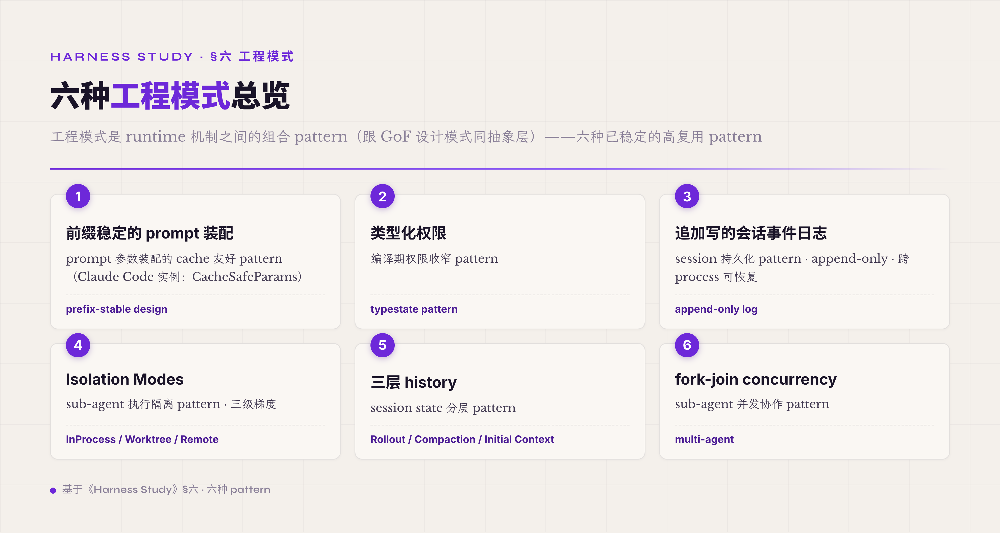
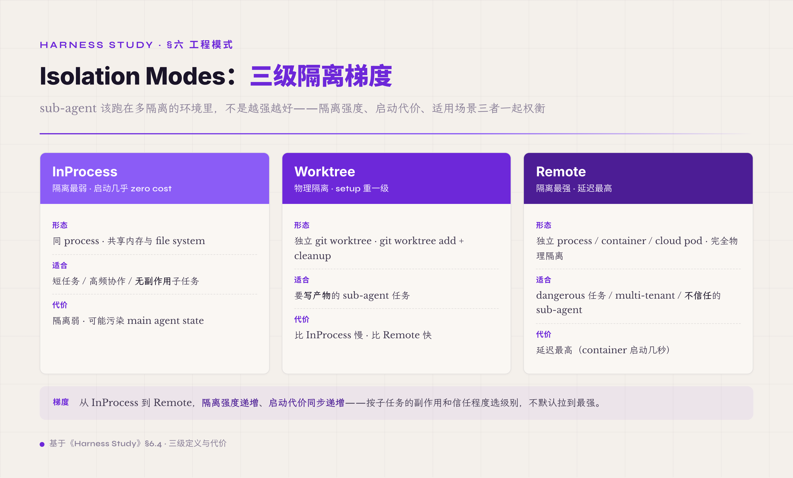
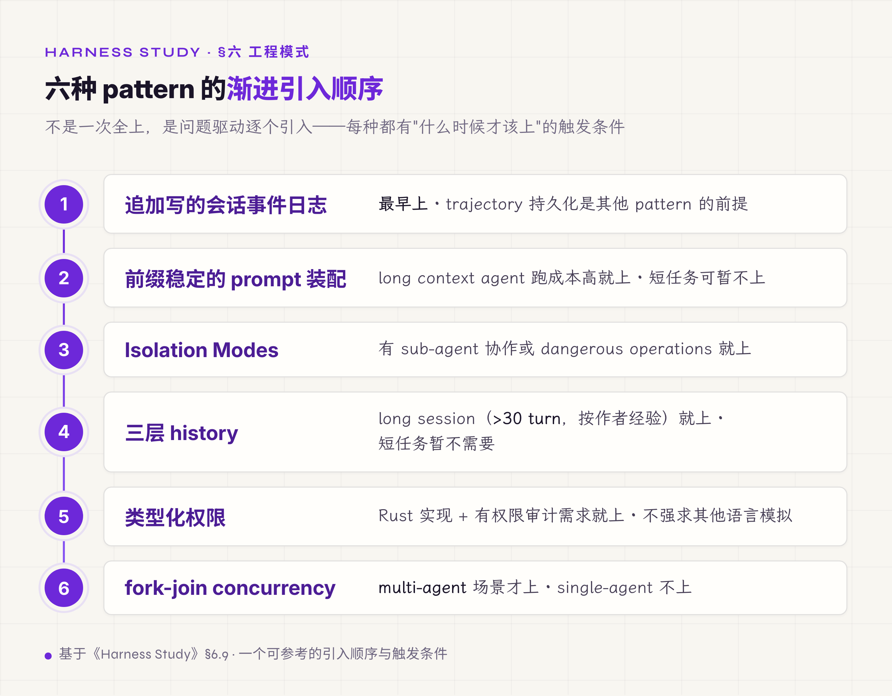

# 六、工程模式 · 跨机制复用的工程组合 pattern

前面第五章讲了 8 个 runtime 机制加 1 个 Safety 控制面，逐个讲的是机制。但生产环境的 agent harness 并不是机制堆出来的，而是机制和工程模式两层叠在一起跑的。工程模式比机制小一级：它不构成完整组件，而是组件之间的组合方式，跨多个 runtime 机制复用。这一章把 agent harness 工程里反复出现、复用度高的几种模式单独抽出来讲。

工程模式跟设计模式（GoF）是同一类抽象：把工程实践里反复出现的"问题加解法"提炼成可复用的形态。GoF 1994 年把面向对象编程里的 23 种设计模式（Singleton、Observer、Factory Method 等）系统化，后来的工程师就不用每次重新发明。agent harness 工程也在沉淀类似的模式，但 2026 年还处在收敛期，没有 GoF 那样公认的命名；不过有几种模式已经在 Claude Code、Codex、OpenHands 等主流 harness 里反复出现。本章选 6 种较稳定的工程模式展开。前 5 种在多个主流 harness 中可见：

1. 前缀稳定的 prompt 装配（Claude Code 源码里的实例是 `CacheSafeParams`）；
2. 类型化权限（typestate）；
3. 追加写的会话事件日志（常见实现是 JSONL 文件，也有用 SQLite 的）；
4. sub-agent 执行隔离模式；
5. 三层 history。

第 6 种 fork-join 并发是多智能体场景的工程组合模式，前面 Safety 那章已经提过。

*图 6.1 · 跨件复用的六个工程模式*

工程模式跟 runtime 机制的边界要分清。**runtime 机制是 agent 每一轮实际用到的组件**，Tool Registry、Verifier、Trajectory 这些都是机制。**工程模式是机制之间的组合方式**，例如：

- prompt 怎么装配才能让提示词缓存命中（前缀稳定的 prompt 装配，需要 Prompt Assets、Model Adapter、Context 三个机制协作）；
- 工具权限怎么编码，才能让 harness 开发者写不出跳过权限检查的代码（类型化权限，需要 Tool Registry 与 Safety 控制面协作）。

模式不是组件，而是"组件怎么搭"的工程经验。读完这一章，读者应该认得出几种常见的组合模式，在做生产 agent 时能识别并复用。

#### 6.0 本节首次出现的术语

第一至五章已经解释过的术语（runtime 机制、cache、Tool Registry、Trajectory、sandbox、fork-join 等）下面不再重复，这里只列第六章首次出现的术语。

**工程模式核心术语**

- **工程模式**（engineering pattern）：跨多个 runtime 机制复用的组合方式，跟 GoF 设计模式处在同一抽象层；2026 年业界还在收敛期，没有标准命名。
- **前缀稳定设计**（prefix-stable design）：让 prompt 前缀在各轮之间逐字节保持一致，从而命中提示词缓存（prompt caching）。Anthropic、OpenAI 等厂商的缓存都按前缀匹配，见 [Prompt caching · Claude API Docs](https://platform.claude.com/docs/en/build-with-claude/prompt-caching)。
- **cache-safe forking**：Claude Code 在 compaction 时的做法，system prompt、工具集和已有前缀保持不变，只把摘要接在末尾，使已缓存的前缀在 compaction 后仍能命中，见 [How Claude Code uses prompt caching](https://code.claude.com/docs/en/prompt-caching)。

**类型化权限相关术语**

- **类型状态模式**（typestate pattern）：Rust 中常见的写法，把对象的状态编码进类型，非法的状态转移在代码里写出来就编译不过，见 [The Typestate Pattern in Rust · Cliffle](https://cliffle.com/blog/rust-typestate/)。它约束的是开发者写的代码，不是程序运行时收到的数据。
- **幻影类型**（phantom type / PhantomData）：零大小的标记类型，不占内存，只在编译期标注关系，运行时不存在，见 [Phantom Types in Rust · Ben Ashby](https://www.benashby.com/phantom-types-in-rust/)。
- **编译期强制**（compile-time enforcement）：与运行时检查相对，不满足约束的代码根本编译不过。它能挡住的是开发者写错的代码路径；模型在运行时发出什么调用，编译器看不到。

**会话事件日志术语**

- **追加写的会话事件日志**：把一次 agent run 的事件流持久化下来，只追加、不改写，进程重启后可以据此恢复。常见的存储是 JSONL 文件（每行一个 JSON 事件，Claude Code 与 Codex 的 Rollout 都用这种格式）；也有把事件存进 SQLite 的（如 OpenCode）。JSONL 与 SQLite 是两种不同的存储，下文分开说。第五章 Trajectory 那节讲过事件分类，本章讲会话日志作为一种模式怎么复用。
- **只追加**（append-only）：事件流只允许追加，不允许修改已写入的记录，使 trajectory 不被应用层覆写，也便于 diff。

**执行隔离术语**

- **执行隔离**（execution isolation）：agent 跑任务时与主工作目录的隔离程度，分 InProcess、Worktree、Remote 三种，§6.4 详讲。
- **git worktree**：Git 原生机制，一个仓库可以有多个工作目录。agent 在独立 worktree 里改动不影响主工作目录，跑完再合并或丢弃。

**三层 history 术语**

- **三层 history**：把 agent session 的内部状态分三层管理，分别是 Rollout、Compaction、Initial Context，每层有各自的压缩、缓存与持久化策略。这套分法来自 OpenAI Codex 的实现（`core/src/session/turn.rs`）。
- **Rollout 层**：session 的全量历史，只追加，逐轮完整记录，进程重启后可以恢复。Codex、Claude Code 等 CLI agent 用 JSONL 文件保存这一层。
- **Compaction 层**：压缩后的摘要历史，滚动更新，早期轮次被压缩，近期轮次完整保留，使长 session 的上下文不超出预算。
- **Initial Context 层**：基本不变的上下文，比如 system prompt、项目元数据、工具集，各轮之间保持不变，配合前缀稳定设计让提示词缓存命中。

**fork-join 术语**

- **fork-join 并发**（fork-join concurrency）：主 agent 把任务拆给多个 sub-agent 并行执行，再把结果汇总回主 agent。这是常见的多智能体组织方式，也是 Anthropic 多智能体研究系统文章的核心结构。
- **provider 并发槽自适应**：不同模型服务商给的 API 限流额度不同，能同时跑的 sub-agent 数也不同；做法是按各服务商当前可用的并发槽动态调度 sub-agent，不超出限流。

#### 6.1 前缀稳定的 prompt 装配 · 让提示词缓存命中

**第一种工程模式**：prompt 的装配方式直接决定提示词缓存的命中率，命中率又直接决定 agent 的成本和延迟。前缀稳定设计（prefix-stable design）在多个主流 harness 中可见；Claude Code 源码里对应的数据结构叫 `CacheSafeParams`（本节末再讲），这里只把它当作一个实例。

这种模式要解决的问题是：提示词缓存是 Anthropic、OpenAI、DeepSeek 等厂商都提供的优化机制，同样的 prompt 前缀重复出现时，服务端缓存中间计算结果，后续请求直接复用，大幅降本（Anthropic 官方数字：命中后延迟最多可降约 85%；命中部分的价格是基础输入价的 0.1 倍，即省约 90%）。但命中条件极严：**prompt 前缀必须逐字节一致**（[Claude API Prompt Caching Docs](https://platform.claude.com/docs/en/build-with-claude/prompt-caching)），差一个字节就不命中。harness 装配 prompt 时如果不考虑缓存，每一轮都可能不命中，跑起来又慢又贵。

前缀稳定设计的核心做法是 **把 prompt 拆成稳定段和变化段**：稳定段（system prompt、工具注册表、few-shot 示例）放前面，变化段（当前任务、最新的用户输入、最近几轮历史）放后面。这样各轮之间稳定段不变，缓存能命中，变化段接在后面。Claude Code 把这种模式进一步做成 **cache-safe forking**：触发上下文压缩时（第五章端到端 17 轮示例的 Turn 11 讲过），压缩不重写 prompt 前缀，只把摘要接在末尾，已缓存的前缀在压缩后仍能命中（[How Claude Code uses prompt caching](https://code.claude.com/docs/en/prompt-caching)）。

实现上有三条细节要讲清楚：

- **模型是缓存键的一部分。** 切换模型（比如从 Flash 升级到 Pro）会让整段已缓存前缀失效，因为不同模型的缓存彼此独立。所以升级模型的决策不只是"换更强的模型"，还要算上"失去缓存的成本"。
- **工具定义是前缀的一部分。** 加一个工具或改一个工具的描述，会让它之后的所有缓存失效。这让 Tool Registry 的 `select_for(query)` 动态子集机制（第五章 Tool Registry 那节讲过）必须考虑缓存：子集一变就不命中。做法是把"通用工具的稳定子集"放前面、"与任务相关的子集"放后面，让稳定子集在各轮之间复用。
- **内容对字节顺序敏感。** JSON 字段顺序、空格、换行、编码（UTF-8 还是 UTF-16）都会影响缓存命中。harness 装配 prompt 时要统一序列化方式（固定缩进与字段顺序），让序列化结果逐字节稳定。

**不同厂商的缓存接口不同：DeepSeek 式自动前缀缓存的适配。** 上面讲的 cache_control 断点和 cache-safe forking 是 Anthropic 的做法，但并非所有厂商都需要手动管理缓存。**DeepSeek 用硬盘上的上下文缓存（Context Caching on Disk）**：默认对所有用户开启，无需改代码，客户端也不发 `cache_control`，服务端按前缀自动判定是否命中（"只有完全匹配某个缓存前缀单元才命中"，以 **64 token 为存储单元，不足 64 token 的部分不缓存**）（[DeepSeek API · Context Caching](https://api-docs.deepseek.com/guides/kv_cache)，[2024-08 发布公告](https://api-docs.deepseek.com/news/news0802)）。这跟 Anthropic 由客户端显式声明 cache_control 断点（最多 4 个）正好相反：一个由服务端全自动处理，一个由客户端手动开启。DeepSeek 的接口更省心，但对前缀稳定性的要求一样严（命中要求前缀完全匹配）。适配要点有两条：

- **system prompt 在会话内保持完全静态。** system 位于前缀最前面，任何每次请求都会变的字段（日期、时间戳、动态状态）都会让整段缓存从头失效。对策是把这类信息从 system 前部移到 system 末尾的独立片段（它之前的静态段仍能命中，只重算末尾那一段），或者移到第一条 user 消息里。
- **严格只追加。** 重写对话前缀（把前面的历史替换成摘要，或改变前缀位置）是最隐蔽的缓存杀手，会让压缩后第一轮大面积不命中。对策是：摘要锚点固定（压缩一次后位置不再变，之后只在尾部追加）；只摘要最新输出，不改写已发送的前缀；裁剪 prompt 时只删不重排。

这里 **reasoning_content 的跨轮处理是一个容易踩坑的权衡，不能一刀切**。官方约定是底线：deepseek-reasoner 的输入如果带 reasoning_content 会直接报 400（下一轮请求前必须删掉）；deepseek-v4 的思考模式（flash 与 pro 相同）在**工具调用轮必须把 reasoning_content 完整回传**，否则报 400，非工具轮回传则被服务端忽略（[DeepSeek API · reasoning model](https://api-docs.deepseek.com/guides/reasoning_model)，[thinking mode](https://api-docs.deepseek.com/guides/thinking_mode)）。在这条底线之上有一个真实的权衡：按 DeepSeek-V4 技术报告中的交错思考（Interleaved Thinking），工具场景下跨轮保留推理内容能维持长周期 agent 累积的思维链，有收益；但推理内容进入前缀会占用计费的 prompt token，还可能影响缓存稳定。**Reasonix 这个 agent（自述"engineered around prefix-cache stability"，即围绕前缀缓存稳定性设计）选了另一边**：回传时剥离 reasoning_content（它只是响应字段，不为重传付费），再用"思考收割"（thought harvesting，把推理内容提炼成结构化状态再利用）来补偿，把缓存稳定和省 token 放在推理累积之上（[esengine/DeepSeek-Reasonix](https://github.com/esengine/DeepSeek-Reasonix)）。但有一个坑：中转服务或代理（litellm、claude-code-router 都有人报过）如果在**工具轮**简单剥离 reasoning_content，会撞上前面那条 400。剥离要么只在非工具轮做，要么配合思考收割，不能一律删掉。

这种模式的适用边界要分清：

- **适用场景**：长上下文 agent 任务（上下文跨轮累积大）；高频短轮次的 agent（每轮省下的缓存费用累积可观）；system prompt 很长的场景（Claude Code 风格的 system prompt 动辄上千 token）。
- **不适用场景**：单轮短任务（缓存没机会累积价值）；上下文每轮都大幅改动的任务（缓存总是不命中，这种模式只增加复杂度、没有收益）；不支持提示词缓存的服务（比如某些早期开源模型的部署，或只有单次请求内 KV cache、不支持跨请求前缀缓存的服务）。

这种模式在多智能体场景的收益值得单独提。**Claude Code 的做法**是用一个 `CacheSafeParams` 数据结构封装 systemPrompt、userContext、systemContext、toolUseContext、forkContextMessages 五个字段；sub-agent 启动时通过它**继承父 agent 的缓存前缀**，也就是不重新计算 system prompt、工具注册表这些稳定段，直接复用父 agent 已经缓存好的前缀。这样 **sub-agent 的成本比从头跑省下可观的一块**。这是多智能体场景里缓存友好设计最大的工程价值，也是 Claude Code 把 cache-safe forking 作为 compaction 核心约束的原因之一：它不只是省缓存费，还让多智能体 fork 在成本上可行。

#### 6.2 类型化权限 · 用类型约束权限相关的代码路径

**第二种工程模式**：把工具权限编码进类型，让 harness 开发者写不出"没经过权限检查就执行工具"的代码。通用的名字是 **类型状态模式（typestate pattern）**（[Cliffle blog 经典讲解](https://cliffle.com/blog/rust-typestate/)，[Microsoft RustTraining book Ch 3](https://microsoft.github.io/RustTraining/rust-patterns-book/ch03-the-newtype-and-type-state-patterns.html)）。

先把它的作用范围说清楚：**typestate 只约束 harness 开发者写的代码，约束不了模型运行时发出的调用。** 模型每一轮发出调用哪个工具、带什么参数，是运行时才出现的数据，编译器看不到。类型能保证的是：执行工具的函数只接受"已通过策略检查"的类型，开发者不可能漏掉检查这一步；但检查本身（这个调用在当前权限模式下允不允许）仍然要在运行时做。所以它是运行时策略检查的补充，不是替代。

这种模式要解决的问题是：Tool Registry 给 agent 提供工具集，但不同工具权限不同（只读、可写工作区、危险操作）。如果只靠散落在各处的运行时检查（每次调用前问一句"有没有这个权限"），检查逻辑分散，容易有代码路径漏检，热路径上也有开销。typestate 把权限编码进**工具的类型**，例如 `Tool<ReadOnly>` 与 `Tool<WorkspaceWrite>` 是两个不同类型，`git_status: Tool<ReadOnly>`、`write_file: Tool<WorkspaceWrite>`；harness 的分发器只接受与当前权限模式匹配的类型，开发者把类型用错的代码编译不过。

Rust 实现的核心是 **幻影类型（phantom type）加 PhantomData**：幻影类型是零大小的标记，不占内存，运行时也不存在，只在编译期参与类型检查。**编译期强制的好处**是：非法状态在代码里写不出来，这部分不需要额外的运行时检查，零开销，审计时看类型签名就知道代码层面的权限边界。对应到 agent harness，有几项工程价值：

- 权限相关的代码路径不会因为某段代码忘了调用检查而被跳过；
- 工具集变化时 IDE 直接报错，不熟悉权限边界的贡献者不会在代码里误把危险工具接进只读路径；
- 审计记录与权限边界对齐，因为权限就是类型，读代码时一目了然。

下面是一种可能的实现，用来说明思路，不代表某个产品的真实代码：

- **用幻影类型标注权限模式。** 用 `Tool<ReadOnly>`、`Tool<WorkspaceWrite>`、`Tool<Dangerous>` 三种幻影类型区分权限级别，ToolPolicy 注册表按模式向 agent 暴露对应子集（agent 在 ReadOnly 模式下只看到 `Tool<ReadOnly>` 集合）。模型如果仍然发出调用危险工具的请求，由运行时的策略检查拒绝。
- **显式建模状态转换。** 从 `Tool<Unverified>` 经 `verify()` 转成 `Tool<Verified>`，执行函数只接受 `Tool<Verified>`，开发者不可能写出跳过验证就执行的代码（写出来编译不过）。
- **提权要显式走流程。** 临时给某个工具更高权限，必须显式调用 `Tool<ReadOnly>::elevate(approval_token) -> Tool<WorkspaceWrite>`，approval_token 只能从人工审批（HITL）流程拿到，代码里拿不到 token 就升不了权。审批本身仍是运行时发生的事。

这种模式对语言有要求，这一点要讲清楚。**typestate 依赖语言类型系统的表达能力**：

- Rust、Haskell、OCaml 能完整实施；TypeScript 可以用品牌类型（branded type）部分实现。
- Go 是静态类型语言，可以用不同的类型表示不同状态，但没有 Rust 那样的所有权转移，状态转换后旧状态的值仍然能被使用，约束力弱一些。
- Python、JavaScript 是动态类型，主要只能靠运行时检查模拟（Python 可借类型标注加静态检查工具补一部分），拿不到编译期保证。

这种不可移植性是 typestate 的工程限制，选语言、选框架时要考虑进去。OpenAI Codex 用 Rust 写 harness，一种可能的考量就是能拿到这类编译期保证。

业界实现对照值得看。**OpenAI Codex 的源码里有一个名为 `Constrained<T>` 的 newtype 包装**，并有审批策略 `AskForApproval` 控制何时触发人工审批。`Constrained<T>` 是否用来把权限级别编码进类型，本书未能核实，所以上面的三级示例只当作一种可能的实现，不当作 Codex 的实际设计。**OpenCode 用 Go 实现**：Go 是静态类型语言，但缺少所有权转移，完整实施 typestate 较难；OpenCode 用接口加基于角色的检查走运行时路径，并把会话存进 SQLite，便于审计查询（[opencode-ai/opencode GitHub](https://github.com/opencode-ai/opencode)，[OpenCode Docs](https://opencode.ai/docs/cli/)）。**OpenHands 用 Python**，靠运行时检查加装饰器实现权限控制，拿不到编译期保证，全靠导入时和调用时的检查（[OpenHands Agent Control Plane](https://www.openhands.dev/blog/agent-control-plane)）。三者在编译期能约束的范围上 Rust 最大、Go 次之、Python 主要靠运行时，跟语言类型系统的表达能力直接相关。但不管用哪种语言，模型发出的工具调用都必须经过运行时策略检查；语言差异影响的只是"开发者会不会写出绕过检查的代码"这一层。所以选 harness 的实现语言时，除了性能和团队偏好，这层编译期保证也是一个真实的考量。

#### 6.3 追加写的会话事件日志 · session 持久化模式

**第三种工程模式**：把一次 agent run 的全部事件按顺序追加写入日志，只追加、不改写，进程重启后可以据此恢复。CLI agent 普遍在用这种模式，存储有两种：

- **JSONL 文件**：每行一个 JSON 事件。Codex 的 Rollout、Claude Code 的会话记录都是这种。
- **数据库**：OpenCode 把会话存在 SQLite 里。SQLite 不是 JSONL，是另一种存储选择，下面分开讨论。

这种模式要解决的问题是：agent run 跑下来会产生大量事件（第五章 Trajectory 那节详细讲过事件分类），这些事件要持久化，才能做 trajectory 回放、调试、审计和自我演进。持久化格式有几条路：

- **单个 JSON 文件**：适合短 run 加人工审阅的场景，SWE-agent 用这种；
- **JSONL 只追加文件**：适合长 run、生产环境量大的场景，在 CLI agent 中最常见；
- **数据库**：适合需要结构化查询的场景，比如 OpenCode 用 SQLite。

JSONL 只追加文件之所以常见，有三项工程优势：

- **追加写性能好。** 追加是文件系统最便宜的写操作，不需要 seek，也不需要重写，1KB 的事件追加通常不到 1 毫秒，长 run 累积几千个事件也不影响每一轮的延迟。
- **恢复简单。** agent run 中途断电或进程崩溃时，已写入的事件都在文件里。重启后读出全部已写入的完整事件、重建状态，再从下一步接着跑；已经完成的工具调用不需要重新执行，结果直接从日志里读。读一遍日志通常很快，用户基本感觉不到。
- **便于 git diff。** JSONL 每行一个独立的 JSON，跨轮 diff 时只显示新增的行，不像单个 JSON 文件改一个 key 可能整个文件重排。所以 trajectory 可以进 git，支持跨提交的审计、多人协作和回放。

实现上有几个细节要讲清楚：

- **事件类型分类。** 日志里不是单一的事件类型，通常分 5 到 8 类。Claude Code 的做法是 5 类：TranscriptMessage（user 与 assistant 消息）、FileHistorySnapshot（文件状态快照）、ContextCollapseCommit（compaction 事件）、ContentReplacement（上下文内容替换）、AttributionSnapshot（产物归属）。每类有独立的 schema，反序列化时按 type 字段分发。
- **长 session 的"有界加溢出"（bounded with spillover）。** session 文件不能无限增长，实现上通常设一个行数或字节上限，超限时截断、告警，并提示如何拆分，避免 session 文件过大拖慢 agent 重启。
- **跨 session 关联。** 一个长任务可能跨多个 session 文件（前一个 session 的压缩摘要作为下一个 session 的初始上下文），靠 session-id 链加摘要检查点关联起来。

这种模式的工程价值最终体现在：**跨 run 的审计和回放都依赖它**。第五章 Trajectory 那节讲过，trajectory 是 agent harness 需要单独设计的一类数据，这一点正是靠会话事件日志的持久化来实现的。session 文件不只是调试工具，同时是 agent run 的审计日志、训练数据和自我演进的输入。

在会话事件日志之上还能再搭一个组合模式：**检查点与续跑（checkpoint / resume）**，也就是长任务断点续跑。它需要三样东西配合：

- 会话事件日志恢复执行状态：读出全部已写入的完整事件，重建状态；
- 产物版本恢复产物状态：第五章 Trajectory 那节讲过的"回退"能力；
- 工具幂等防止重复副作用：恢复时最后一个工具调用可能"已执行但未记录"，重新执行前先和执行记录对账。

三样缺一样，续跑就只是"从头再跑一遍"的另一个名字。这里还有一个只追加写法本身的细节坑，即**崩溃一致性**：进程在写到半行时死掉，恢复逻辑要能容忍丢掉尾行（按最后一个完整事件截断，半行丢弃），fsync 策略决定你最多丢几个事件。只追加不等于崩溃安全，这两者经常被混为一谈。

#### 6.4 Isolation Modes · sub-agent 执行隔离模式

**第四种工程模式**：sub-agent 跑任务时，与主 agent 的工作目录隔离开。常见的有三个层次。这种模式跟 Safety 那章讲的 OS 级沙箱是同一类思路，但作用对象不同：沙箱隔离的是 agent 与宿主系统，执行隔离隔离的是 sub-agent 与主 agent。

常见的三种隔离模式是 **InProcess、Worktree、Remote**。

*图 6.2 · sub-agent 执行隔离的三档模式*

**InProcess**：sub-agent 与主 agent 跑在同一个进程里，共享内存和文件系统，只在逻辑上划分 agent 边界。这种模式最轻量，sub-agent 启动几乎没有开销，可以直接共享数据结构，适合**短任务、高频协作、没有副作用风险的子任务**（比如 sub-agent 只是分析主 agent 的上下文、给出审阅意见，不写产物）。代价是隔离弱：sub-agent 出错可能污染主 agent 的状态，多个 agent 并发时要小心线程安全。

**Worktree**：sub-agent 跑在独立的 git worktree 目录里，与主 agent 的工作目录分开。git worktree 是 Git 的原生机制（一个仓库多个工作目录，共享 .git，工作目录各自独立），sub-agent 可以在独立分支上做实验性改动，跑完合并或丢弃，不影响主 agent 当前的工作目录。Claude Code 的做法是把 sub-agent 的 worktree 放在 `.claude/worktrees/<agent-id>/` 下，用 sub-agent ID 标识。这种模式适合**要写产物的 sub-agent 任务**（比如要改文件、跑构建、跑测试，需要独立的工作区，不能污染主 agent）。代价是准备工作更重：每个 sub-agent 启动要 `git worktree add`，完成后要清理，比 InProcess 慢，但比 Remote 快。

**Remote**：sub-agent 跑在独立的进程、容器或云端 worker pod 里，与主 agent 完全隔离。OpenHands Agent Control Plane 推荐企业规模部署走 K8s 容器路线：每个 sub-agent run 一个独立容器，配每容器的资源配额和网络策略。这种模式隔离最强，sub-agent 崩溃、内存爆掉、越权操作都不影响主 agent，适合**危险任务、多租户部署、不可信的 sub-agent**（比如用户给的任务描述不可信，或 sub-agent 用了第三方插件）。代价是延迟最高：容器启动要几秒，加上跨进程通信延迟和数据序列化开销。

选哪种隔离模式，可以按下面几条判断：

- **sub-agent 写不写产物**：不写（只读、给意见）用 InProcess；要写（改文件、生成产物）用 Worktree 或 Remote。
- **sub-agent 的可信度**：主 agent 自己派生的 sub-agent 可信度高，用 Worktree；用户给的任务描述或第三方插件可信度低，用 Remote。
- **部署场景**：本地开发、单用户，Worktree 就够；企业多租户，必须用 Remote 容器。

OpenCode 在这点上用客户端/服务端架构，服务端可以按部署模式选 Worktree 或 Remote，对客户端透明（[OpenCode v1.3.3 Deep Dive · sanj.dev](https://sanj.dev/post/opencode-deep-dive-2026)）。

#### 6.5 三层 history · session 状态分层模式

**第五种工程模式**：把 session 状态按"变化速度和持久化策略"分三层管理，而不是用一个数组装下所有历史。这套分法来自 OpenAI Codex：`core/src/session/turn.rs` 里把 session history 显式拆成 Rollout、Compaction、Initial Context 三层，每层有各自的压缩、缓存和持久化策略。

这种模式要解决的问题是：早期的 agent harness 用一个数组装 session 里的所有事件，用户消息、assistant 回复、工具调用、工具结果、系统提示全堆在一起。这种做法在短 session 里没问题，但到了长 session（十几轮以上、10 万 token 以上）就开始出问题：上下文不断膨胀，缓存不断不命中，压缩时不清楚该压哪一段，跨 session 复用也没有锚点。三层 history 按抽象层把 session history 分开，每层用不同的工程策略。

**第一层 Rollout：session 的全量历史。** 逐轮完整记录，只追加，进程重启后可以恢复。这一层是审计、回放、调试的真相源，不能丢任何细节。持久化方式是 JSONL 只追加文件（见 §6.3 追加写的会话事件日志），不直接参与 prompt 装配。Rollout 是所有事件的最终归宿，但 agent 跑下一轮时不直接读 Rollout，读的是经过 Compaction 处理后的上下文。

**第二层 Compaction：压缩后的摘要历史。** Rollout 里的早期轮次经模型摘要后形成这一层，滚动更新，近期轮次完整保留。这一层才真正参与下一轮的 prompt 装配。压缩策略各家不同：Claude Code 既有按上下文占用比例触发的自动压缩，也有按时间单独清理旧工具结果的轻量压缩，具体阈值和适用的工具范围随版本变化，以官方文档为准；Codex 用按轮数和按预算两种条件触发。三层 history 的核心约束之一是 **压缩不破坏缓存前缀**：压缩后的上下文必须能和 Initial Context 拼成缓存友好的前缀，否则每次压缩都让缓存失效，反而更贵。

**第三层 Initial Context：基本不变的上下文。** 包括 system prompt、项目元数据（CLAUDE.md、AGENTS.md、项目 README）、工具集 schema 等各轮之间不变的内容。这一层放在 prompt 装配的最前面，配合前缀稳定设计让缓存命中率最高。除非用户显式修改 CLAUDE.md 或新增工具，这一层在整个 session 内保持稳定。只要前缀逐字节一致，且仍在缓存有效期内（Anthropic 默认 5 分钟，可选 1 小时），新开的 session 也能命中同一段缓存；超出有效期就要重新写入。

三层 history 的工程价值在于**每层都有独立的优化空间**：

- Rollout 优化审计与存储（JSONL 压缩、归档、跨 session 链接）；
- Compaction 优化 prompt 装配（触发阈值、摘要用哪个模型、保留多少近期轮次）；
- Initial Context 优化缓存（前缀稳定、在缓存有效期内跨 session 复用）。

如果三层混在一起，任何一处优化都会互相牵制：改压缩导致缓存不命中，改缓存让审计不完整，改审计存储又影响 prompt 延迟。三层分开后各自独立演进，跨版本升级的风险也更小。

多个 CLI agent 中可以看到类似的分层，不一定都叫 Rollout、Compaction、Initial Context，但含义相近。这套命名和分法是 Codex 实现里的具体做法，OpenCode 等也有类似分层，只是术语略有不同。

#### 6.6 fork-join concurrency · sub-agent 并发协作模式

**第六种工程模式**：主 agent 把任务拆给多个 sub-agent 并行执行，再把结果汇总回主 agent。前面 Safety 那章已经讲过这种模式在安全上的两条约束（审批模式沿父子链传递；sub-agent 的深度与 token 预算必须设硬上限），这一节展开工程实现细节。

这种模式要解决的问题是：单个 agent 跑长任务（按作者经验，30 轮以上）容易出几类问题：上下文累积超出预算；推理路径线性串行，速度慢；一次失败整个 session 都要回滚。fork-join 把一个大任务拆成多个可并行的子任务，sub-agent 各跑各的，结果汇总回主 agent 决策；能提升多少吞吐量取决于任务的可并行程度。**但 fork-join 不是免费的**：多智能体系统消耗的 token 约为普通对话的 15 倍（Anthropic 多智能体研究系统文章，2025-06），多出来的部分来自编排。第五章 §5.1 讲多智能体过度分解（AP09，见附录 F）时拆过 token 花在哪里，以及为什么编码任务往往不划算（多数编码任务可真正并行的部分较少）。这一节不重复算账，只讲 fork-join 真要落地时的工程实现。

fork-join 的工程实现有几个关键环节：

- **fork 触发条件**：主 agent 在什么决策点派生 sub-agent。常见两种做法：**显式工具调用**（主 agent 调一个 `spawn_subagent` 之类的工具，明确指定 sub-agent 的任务）；**隐式由模型决定**（主 agent 在推理过程中判断"这个任务适合交给 sub-agent"，自行派生）。Claude Code 用显式工具调用，Codex 用隐式决策。
- **sub-agent 任务边界**：sub-agent 拿到什么上下文、输出什么。常见做法是主 agent 给 sub-agent 一段任务描述（自然语言）、关键 artifact_id 指针和工具子集，sub-agent 跑完返回最终答案和完整 trajectory。
- **结果汇总策略**：多个 sub-agent 的结果怎么合并。简单场景直接拼接（每个 sub-agent 一段总结，主 agent 全部读一遍）；复杂场景用模型汇总（主 agent 调用模型把多个结果合并成一份连贯的答案）。
- **错误传播**：sub-agent 失败了怎么处理。常见做法是优雅降级（graceful degradation）：一个 sub-agent 失败，其他成功的结果照样交给主 agent，由主 agent 决定要不要重试失败的那个；不采用快速失败（一个失败就全部中止），因为那样会浪费其他 sub-agent 已经成功的产出。

**provider 并发槽自适应**是生产环境里 fork-join 必须考虑的一点。不同模型服务商给的 API 限流额度不同，各家按使用等级给出每分钟请求数（RPM）、每分钟 token 数（TPM）的上限，并发能力是由这些上限间接决定的，没有统一的固定并发数。如果 sub-agent 数量不按服务商当前的限流动态调度，很容易被限流。常见对策是 **动态槽位池（dynamic slot pool）**：harness 维护一个"服务商 × 并发槽位"的池子，派生 sub-agent 时从池里取槽位，完成后归还，槽位占满时新的派生请求排队，保证 sub-agent 不超出服务商当前的限流。这样多智能体系统在限流条件下能平稳降级，而不是直接报 429。

fork-join 的适用范围，跟 §5.9 反模式段讲过的判断条件一致。下面的轮数阈值是作者的经验值，按场景调整：

- **任务长度在 30 轮以内**：单 agent、单进程就够；
- **30 到 60 轮**：慎用多智能体，先明确单 agent 跑不通的瓶颈在哪；
- **60 轮以上**：才考虑多智能体，并且必须配 sub-agent 深度上限（2 到 3 层）、token 预算上限和提前中止。

OpenCode 在 fork-join 上更保守：它主打 Build 与 Plan 两个 agent 协作，不做深层的 sub-agent 派生。这是开源 CLI agent 在多智能体开销上做的另一种取舍。

#### 6.7 反模式 · 工程模式落地的三类典型

工程模式落地时最容易出现的反模式（anti-pattern）有三类，这一节单独展开，帮读者识别。

**第一类：假落地。** 模式在仓库代码里有，在 README 和设计文档里也有，但在生产运行路径上并没有真正生效。这跟 Safety 那章讲的假落地机制（AP06，见附录 F）同根：根因是配置层与运行时层之间的接线缺失，三条判断条件（trace 里模式有没有触发；改配置后行为变不变；开关前后的评测有没有差异）那一节已经展开，这里不重复。要补充的是工程模式特有的接线断点，它们比 Safety 控制面更容易出问题，因为模式说的是"应该这样设计"，而不是"这样设计就一定跑通"。例如：类型化权限写好了，但运行时的策略检查没有接上，模型发出的危险工具调用照样被执行；`CacheSafeParams` 定义好了，但 Model Adapter 装配 prompt 时没用稳定前缀，缓存照样全部不命中。

**第二类：过度抽象。** 用了模式，但抽象过头，代码变得难读、难调、难演进。根因是 **把模式当成了目的而不是工具**：工程师为了"用上 typestate"，把所有工具都包成 typestate，包括根本不需要权限分级的只读工具，反而让代码膨胀。按作者经验，生产 agent 项目里有一部分模式的应用属于过度工程，拿掉也没影响。判断条件有三条：

- 这个模式在代码里有没有真正解决一个具体问题（一个具体的 bug、攻击面或性能问题）。如果只是"看起来更优雅"，就是过度抽象。
- 移除这个模式后代码有没有退化（编译不过、测试失败、功能丢失）。没有退化，它就是装饰品。
- 新贡献者上手要多久。模式多到新人要花一周读代码才敢改一行，就是过度抽象的信号。

**第三类：静默吞异常（Silent Try/Catch，AP10，见附录 F）。** 工程模式的正常路径写好了，但错误路径被一个静默的 try/catch 吞掉，模式在出错时悄悄失效。根因是 **错误处理在应用模式时被当成事后补充**：`CacheSafeParams` 装载失败，回落到不安全的参数，既没有日志也没有告警；权限类型转换失败，被 catch 后改用默认权限，没人知道权限已经降级。对策是 **给每个模式的错误路径显式建模，必须记日志，不允许静默回落**：Rust 用 `Result` 加 `?` 强制向上传递，Go 显式检查返回的 error，Python 用带类型的异常。本教程的配套实现项目遇到过一个具体例子，修复后成了这一反模式的正面对照：原来的锁实现在 panic 后锁状态被毒化（poison），运行时静默回落；修复版改为显式传递错误，由上层优雅降级，让锁被毒化这件事在审计记录里清晰可见。

这三类反模式合起来，是本章工程模式落地的核心警示：模式不是写进代码就会生效，必须同时做到假落地检测、抽象程度审查、错误路径显式建模这三点，才算真正可以上生产。

#### 6.8 业界实现对照

主流 agent harness 在本章这六种工程模式上的实现路线各有侧重。

**Codex（OpenAI）** 走 Rust 强类型路线：三层 history（Rollout、Compaction、Initial Context）是 session 管理的基础；Rollout 用 JSONL 只追加文件持久化；sub-agent 的 fork-join 由模型隐式决定。源码里有 `Constrained<T>` 这样的类型包装，但它是否用于类型化权限，本书未能核实。Codex 选 Rust 的考量里，一种可能是让 typestate、幻影类型这类写法拿到编译期保证；在 Python、JavaScript 里，同样的约束只能靠运行时检查。

**OpenCode（开源）** 走客户端/服务端、多服务商路线：Go 写的终端界面加 Bun/JS 写的 HTTP 服务端，客户端与服务端分离；会话存在 SQLite 里而不是 JSONL 文件（结构化查询方便，但少了一些 git diff 上的便利）；通过统一接口适配 75 个以上的服务商；两个内置 agent（完全权限的 Build 与只读的 Plan）做轻量的 fork-join。OpenCode 开源，实现细节公开可读，任何团队都能拿来学习这些模式。它的取舍跟 Codex 不同：Codex 侧重强类型、单一服务商；OpenCode 侧重多服务商、运行时检查。两条路线各有利弊。

**Claude Code** 走 TypeScript 路线：用 JSONL 文件保存会话记录；十几种 Hook 事件供用户扩展；Forked Agent 加多种执行隔离方式。Claude Code 在工程模式的工程化深度上是业界先行者之一。但要注意，2026 年 3、4 月公开泄露的那一版源码未必代表当前实现，代码细节不宜直接当作最新标杆，更适合当作"主流产品走过这条路的某个旧版本"来看。之后的闭源版本细节外界看不到，只能从官方文档和博客推测。

**OpenHands（开源）** 走 Python 加 K8s 容器路线：Python 是动态类型，权限主要靠运行时检查加装饰器；但 K8s 容器的 Remote 隔离很强，用部署层的隔离弥补语言层保证的不足（[OpenHands Agent Control Plane](https://www.openhands.dev/blog/agent-control-plane)）。这是"用部署架构补语言不足"的一个工程示范。

2026 年的整体趋势是 **工程模式正在收敛，但还没有标准化**：前缀稳定的 prompt 装配在多个主流 harness 中可见；类型化权限在 Rust 实现的 harness 里更容易做到；追加写的会话事件日志在 CLI agent 中很常见（存储有 JSONL 也有 SQLite）；但隔离模式怎么分、三层 history 怎么命名、fork-join 的细节，各家仍有差异。正因为还没收敛，第六章的工程模式比第五章的 runtime 机制演进得更快，未来两三年可能新增几种，也可能有几种被淘汰。读者读这一章，应该是建立关于工程模式的思维框架，而不是把它当成长期不变的操作规程。

#### 6.9 起步建议 · 四维度

**注意什么**：工程模式落地最大的坑是 **追潮流而不追问题**。看到业界领先产品用 typestate 就跟着用，不问"我的项目有没有 typestate 能解决的具体问题"。这样引入的模式只是装饰品，反而拖累工程演进。几条警示信号：

- 模式引入后没有可观察的指标改善（延迟没变、成本没变、bug 没减少），说明它是装饰品；
- 模式让新人上手的时间增加得比它本身的收益还多，说明过度工程；
- 模式跟项目的语言、运行时、部署架构不匹配（在 Python 项目里硬上 typestate，在短 session 任务里硬上三层 history），说明错配。

**怎么设计**：按"问题驱动、渐进引入"的思路选模式。第一天就把六种模式全部上生产，是过度工程，也难以维护。一个可参考的渐进引入顺序：

1. **会话事件日志**：最早上，trajectory 持久化是其他模式的前提；
2. **前缀稳定的 prompt 装配**：长上下文 agent 成本高时上，短任务可以暂时不上；
3. **执行隔离模式**：有 sub-agent 协作或危险操作时上；
4. **三层 history**：长 session（按作者经验，超过 30 轮）时上，短任务暂时不需要；
5. **类型化权限**：用 Rust 实现、且有权限审计需求时上，其他语言不必强行模拟；
6. **fork-join 并发**：多智能体场景才上，单 agent 不上。

这个顺序让每种模式都在解决一个真实问题时才引入，而不是为了"凑齐六种"。

*图 6.3 · 六件工程模式的渐进引入顺序*

**怎么测试**：工程模式都要做对抗测试和性能基准两类测试，具体分四种：

- **假落地测试**：对比模式开和关时的评测结果，看有没有可观察的差异（成本、延迟、缓存命中率、bug 数）。没有差异，说明模式是装饰品。
- **绕过测试**：用对抗输入试图绕过模式的边界，看它能不能拦住。例如：类型化权限要检查代码里是否存在不经策略检查就能执行工具的路径，同时让模型发出越权调用，确认运行时检查能拦下；前缀稳定装配要故意改动前缀，看缓存命中率的变化；执行隔离要试图越界访问主 agent 的状态。
- **演进测试**：模式用了一段时间后，看新人在代码审查时能不能看懂，看不懂就是抽象程度过高的早期信号。
- **生产 trace 验证**：跑一批有代表性的 agent run，在 trace 里数每个模式应当触发的事件次数。触发 0 次的模式是死代码或假落地。

**写什么 prompt**：工程模式大多跟 agent 自身的 prompt 关系不大（模式在 harness 运行时层，agent 看不到），但有两条做法值得跟第五章 Prompt Assets 那节配套：

- fork-join 场景下，在 system prompt 里说明"你可以派生 sub-agent，但多智能体很耗 token（约为普通对话的 15 倍），要慎用；任务长度在 30 轮以内（经验值）就由你自己跑完，不要派生"，让 agent 自己感知成本，而不是全靠 harness 一刀切兜底。
- 让 agent 知道"你的 trajectory 会被完整持久化，之后可以审计，也会作为自我演进的训练数据"，促使它在推理内容里写得更认真，不敷衍。

---

本章的核心观点可以归结为三点：

1. **工程模式是机制之间的组合方式，不是 runtime 机制。** 第五章的 8 个 runtime 机制加 1 个 Safety 控制面是 agent 跑起来所需的部件，本章的六种模式是这些部件的组合方式。模式跟 GoF 设计模式处在同一抽象层，是工程实践的沉淀，不是产品功能清单。
2. **2026 年业界在工程模式上正在收敛，但还没有标准化。** Codex、OpenCode、Claude Code、OpenHands 的实现路线各有侧重，共同可见的是这六种：前缀稳定的 prompt 装配、类型化权限、追加写的会话事件日志、多层次的执行隔离、三层 history、fork-join；命名、细节和取舍各家不同。
3. **工程模式落地的核心警示是三点同时做到：追问题而不追潮流、做假落地检测、给错误路径显式建模。** 缺任何一点，模式都容易变成装饰品，反而拖累工程演进。

这六种工程模式并不构成"完整的 agent harness 工程"，只是工程实践中可复用的组合。生产 agent harness 项目在这六种之外，还有大量项目特有的取舍：选哪家服务商、用什么语言写 runtime、怎么部署、用什么可观测性工具链、怎么接入 CI/CD 等。这些是具体项目层面的权衡，不是通用模式，本章不展开。读完这一章，读者应该建立起关于工程模式的思维框架，能在自己的项目里识别哪几种模式用得上、按什么顺序引入，以及怎么避开这三类反模式。
