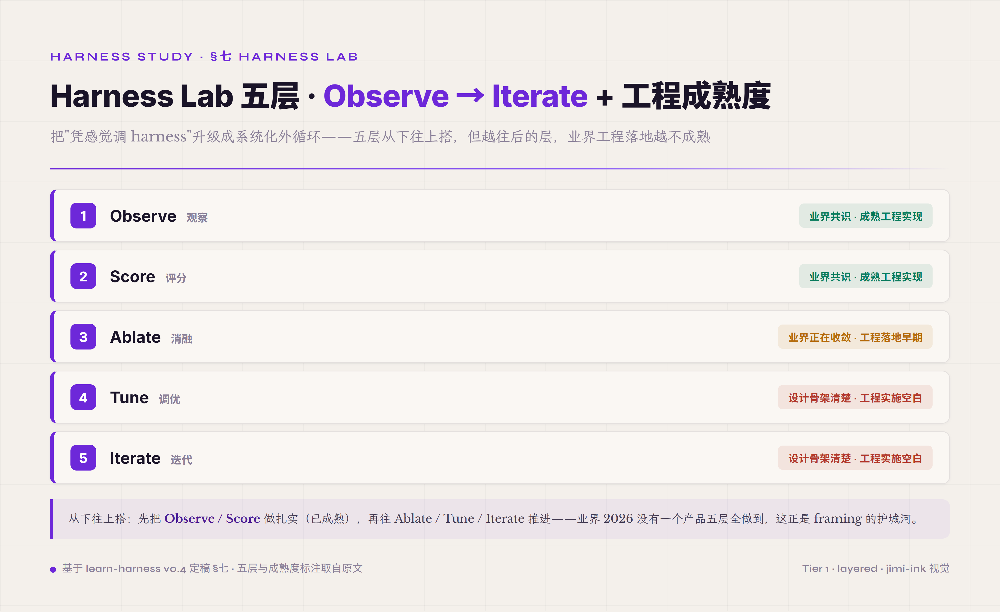
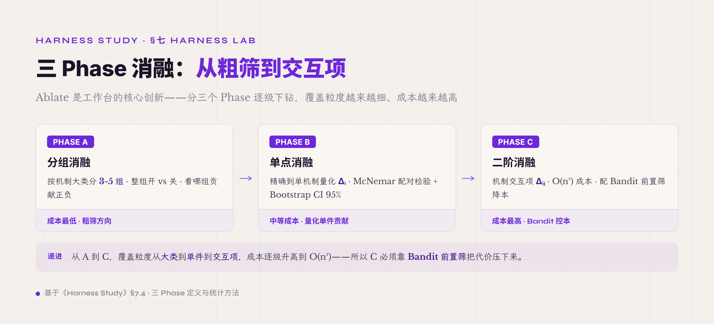
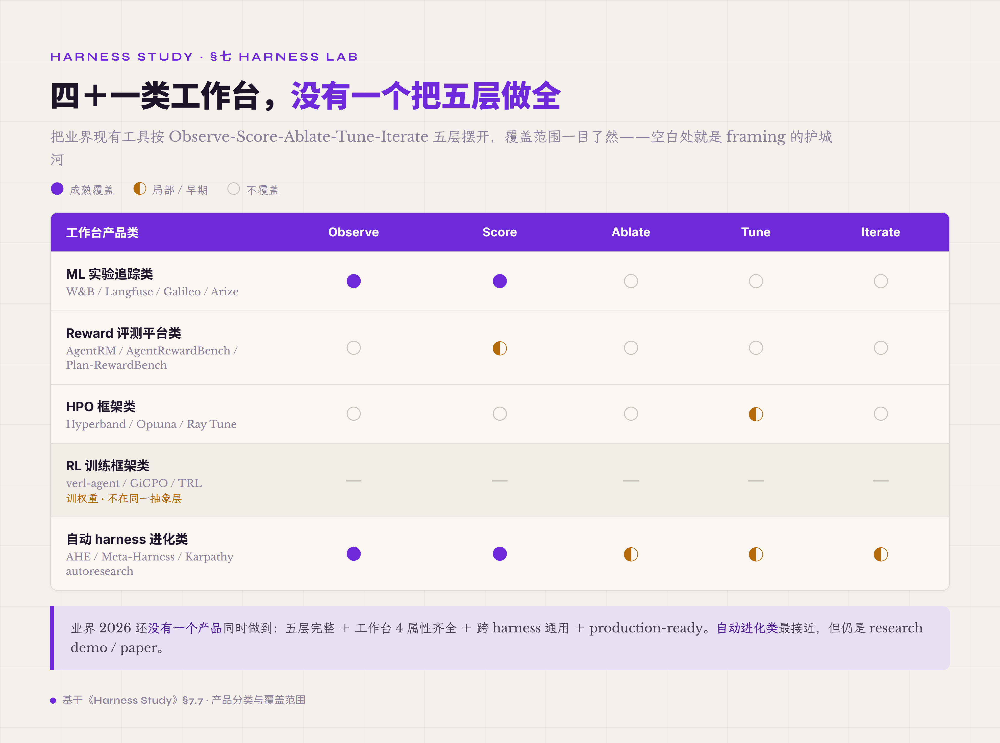

# 七、Harness Lab · Outer Loop · 系统化优化 harness 自身的元工程实践

前面 §五 讲了 8 件 runtime + 1 件 Safety 控制面 · §六 讲了 6 件跨件复用的工程模式——读到这里读者大概能想象一个生产 agent harness 长什么样了。但实际跑生产 harness 半年下来 · 工程师会发现一件更难的事——**harness 自身怎么改进**。机制都装好了 / 工程模式都上了 · 但跑同样任务 · 这一周 success rate 65% / 下一周 58% / 再下一周 70%——为什么浮动 · 哪个机制贡献了 · 调哪个参数能让稳定上 70% · 不知道。这一章讲的就是怎么把"凭感觉调 harness"升级成"系统化优化 harness"。

业界 2026 在这件事上还没有标准命名 · 早期文献叫 *meta-harness* / *autoresearch* / *Harness Lab* / *Outer Loop* —— 名字不重要 · 共同的语义是 **在 harness 之上加一层元工程实践 · 跑跨 run / 跨 task / 跨 config 的系统化 evaluation + ablation + tuning + iteration**。本教程选 **Harness Lab** 作命名——一方面跟 §5.1 Agent Loop 命名区分（§5.1 = Inner Loop · 单 run 内 think-act-observe；§七 = Outer Loop · 跨 run Observe-Score-Ablate-Tune-Iterate）· 另一方面跟"科学方法 · 受控实验"的类比对齐——把 harness config 当实验变量 · 把 agent run 当实验试验 · 用统计方法收敛到更好的配置。

**这一章特别需要先标一件诚实** —— Harness Lab 五层在业界 2026 的工程落地程度差异很大。**Observe（观察）** 跟 **Score（评分）** 两层是业界共识 + 已经有成熟工程实现的 —— Anthropic / OpenAI / W&B / Langfuse / Galileo / Arize 等都在做。**Ablate（消融）** 是业界正在收敛的 —— AHE / Meta-Harness 等 2026 paper 把这件提了起来 · 但工程落地还在早期。**Tune（调优）** 跟 **Iterate（迭代）** 两层是设计骨架已经清楚 / 工程实施还是空白的——业界大部分项目这两层仍然是手工调 / 凭感觉 · 没有自动化闭环跑起来。本教程作者的 Harness Lab 工作台是按这五层完整设计的 · 但 L4 Tune / L5 Iterate 也仍然是设计骨架——工程 0 行 · 不是已经跑起来的产品。这件诚实让读者读这一章时知道**业界 SOTA 是什么**跟**自己项目能跑到哪一档**是两件事。

读完这一章读者应该能回答几件事——什么是 Harness Lab 五层 · 工作台属性 4 条是什么 · 怎么从 Observe 开始一层一层往上搭 · 业界 W&B / Langfuse / AgentRM / Hyperband / verl-agent 这些产品分别覆盖五层的哪一档 · 工作台跟前面 §5.6 / §5.7 / §5.8 讲的 observation / trajectory / verifier 三件 harness 件是什么承载关系（harness 件是必要前提 · 工作台是 bonus 进阶 · 不是替代关系）。

#### 7.0 本节首次出现的术语

前面 §一-§六 已经解释过的术语（runtime 件 / harness 件 / Inner Loop / Outer Loop / observation / trajectory / verifier 三层 / Hard Gate / Outcome Judge / PRM / Reward Hacking / Preference Leakage / Cache 共谋 / ablation 等）下面不再重复。这里只列 §七 本节首次出现的术语。

**Harness Lab 五层核心术语** —— **Harness Lab**（业界 2026 在 agent harness 之上加的元工程实践层 · 跑跨 run 跨 task 跨 config 的系统化优化 · 本教程沿用业界 *meta-harness* / *autoresearch* / *Outer Loop* 等同义命名收敛到 "Harness Lab")。**Observe-Score-Ablate-Tune-Iterate 五层**（Harness Lab 的工程化分层 · 源头是本教程作者工作台的五层设计 · 跨 run 系统化优化的标准 pipeline）。**Outer Loop**（跨 run 的工程循环 · 跟单 run 内的 Inner Loop 平行 · 不在同一抽象层 · 业界类比 ML 实验追踪的 outer loop）。

**工作台属性术语** —— **工作台 4 属性**（Harness Lab 工作台的核心 invariant：1·吞下任意 harness 配置 / 2·自动评测 / 3·自动调优 / 4·识别消化不了的 · "5 层是工作台内部流水线 · 工作台属性才是真护城河"）。**AblationProfile**（工作台 ↔ harness 对接机制 · 用一组可调参数 + 模式 toggle 把任意 harness 变体表达为可枚举配置 · 让工作台能批量评估）。**TrajectoryRecord**（工作台 ↔ harness 数据契约 · 让任意 harness 跑出来的 trajectory 都能被工作台标准化消费）。

**Score / 评分层术语** —— **L2 Reward 三层架构**（Harness Lab 工作台的 reward 聚合层 · verifier hard + outcome judge + process · 加权式 outcome 5x process 防 verbosity · 跟前面 Verifier 那章讲的 harness 件层 verifier 三层是不同抽象层 · 工作台层 reward 聚合在 harness verifier 之上做跨 run 评分对齐）。**AgentRM**（业界 reward model for agents · 给 agent trajectory 打分 · 工作台 L2 候选 component swap）。**AgentRewardBench**（业界 step-level reward 评测 benchmark · 评 agent reward model 自身好不好）。**Plan-RewardBench**（plan-level reward 评测 benchmark · 评 agent plan 的合理性）。

**Ablate / 消融层术语** —— **Phase A 分组消融**（按机制大类分组 · 看哪一组贡献正负）。**Phase B 单点消融**（精确到单机制 · 量化 Δᵢ · 业界统计基线是 McNemar 配对检验 · 显著性看检验统计量加样本量 · 不是固定百分点阈值）。**Phase C 二阶消融**（机制间交互项 · Δᵢⱼ · 看两件机制一起开是否优于各自单独贡献和）。**Bandit 前置筛**（用 multi-armed bandit 算法在 Phase A/B 之前快速排除明显负贡献机制 · 业界 ablation 工程降本主流路径 · 显著降低 ablation 成本）。**Bootstrap CI 95%**（消融统计学基线 · 用 bootstrap resampling 计算 Δᵢ 的 95% 置信区间）。

**Tune / 调优层术语** —— **harness config search**（Tune 层的 load-bearing 主语 · 优化对象是 harness 配置的 12+ 可调参数 + 模式 toggle · 跟 RL weight training 根本不同 · 不训权重 · 不是端到端在线策略梯度）。**Hyperband**（业界主流 HPO 算法 · 通过 successive halving 在固定 budget 下找超参 · 工作台 L4 候选 component）。**Optuna**（业界主流 HPO 框架 · Python 实现 · TPE/CMA-ES 等算法 · 工作台 L4 候选 component swap）。**GiGPO**[^gigpo-2025]（Group-in-Group Policy Optimization · agentic RL 训练算法 · 双层 group · step-level 按重复环境状态分组做 credit assignment · Harness Lab L4 远期参考但不主引 · Harness Lab 自己把 step-level anchor 实例化成 (context_hash, tool_name)）。**PAV**[^pav-2024]（Process Advantage Verifier · process reward 5x compute 高效 · 业界 RL 训练参考）。

**Iterate / 迭代层术语** —— **4 收敛条件**（Harness Lab L5 设计 · Q≥0.92 / max|ΔΔᵢ|<0.02 连续 3 轮 / Top-10 排名稳定 3 轮 / 预算耗尽 · 任一满足即收敛）。**AHE · Agentic Harness Engineering**[^ahe-2026]（Observability-Driven Automatic Evolution of Coding-Agent Harnesses · Terminal-Bench 2 上 69.7% → 77.0% pass@1 · 业界自动 harness 进化的代表 paper）。**Meta-Harness**[^meta-harness-2026]（End-to-End Optimization of Model Harnesses · 文本 / 数学 / agentic coding 三任务验证 · 7.7pp gain / 4x context 节省）。**Karpathy autoresearch**[^karpathy-autoresearch-2026]（单 GPU 自动改 train.py + eval + 决策 · L4 Tune 的工业级参考）。

**Cache 共谋 术语** —— **Cache 共谋**（业界 agent eval 的核心常见误区 · provider 端 prefix KV cache 让 N 次复跑变成 non-i.i.d. · 表面 N 次平均通过率虚高 · 实际是同一份缓存复用 N 次 · 业界 source DeepSeek V4 TR §3.6.2 + Mnimi[^mnimi-2025] + philschmid pass^k[^philschmid-pass-k] 等）。**per-run nonce**（Cache 共谋工程对策 · 每次 run 在 prompt 里加一个随机 nonce 让 prefix 不同 · 强制 cache miss · 让 N 次复跑真正独立）。

**把脉术语** —— **把脉（Model Probe）**（Harness Lab 三步「把脉→定标→调方」的第一步 · 给定一个 LLM 端点跑一套面向 harness 的诊断 · 产出模型需要哪些机制 / 不需要哪些 / 哪些是陷阱的画像 · 价值在砍消融搜索空间加提前标负贡献陷阱）。**探针三段式**（把脉的方法核心 · 刺激 stimulus → 行为分类 behavior class → 机制蕴含 mechanism implication · 每条探针终结在一个配置决策加一个可证伪预测 · 不终结在分数）。**四族探针**（按"出错后果"从硬到软分族 · A 协议层 / B 工具使用层 / C 指令遵循层 / D 自愈校准层）。

**业界同类工作台对照术语** —— **ML 实验追踪类**（W&B / Langfuse / Galileo / Arize 等 · 做 trajectory recording + dashboard + 跨 run 对比 · 不做 ablation + tuning）。**Reward 评测平台类**（AgentRM / AgentRewardBench / Plan-RewardBench 等 · 做 reward model 自身评测 · 不做 harness 配置优化）。**HPO 框架类**（Hyperband / Optuna 等 · 做通用超参搜索 · 不针对 agent harness 场景）。**RL 训练框架类**（verl-agent / GiGPO 等 · 训权重 · 不优化 harness 配置）。**没有一个工业平台明确定位 "harness policy optimization 工作台"**——这是 Harness Lab 工作台 framing 的护城河。

#### 7.1 工作台属性 4 条 · 跟 harness 件层的承载关系

Harness Lab 在工程层面是一套**工作台**——不是 agent runtime 件 · 不参与单 turn 业务逻辑 · 是跑在 harness 之上消费 trajectory + 评测 + 调参的元层。要把这件 framing 讲清楚有两条线索 —— **工作台属性 4 条**讲工作台本身是什么 · **harness 件层 vs 工作台层的承载关系**讲它跟前面 §五 八件 runtime 的边界。

*图 7.1 · Harness Lab 五层框架 Observe→Iterate 与工程成熟度*

**工作台属性 4 条**（用 "大胃王" 类比命名）：

**第一条 · 吞下任意 harness 配置** —— 工作台不绑定特定 harness 实现 · 任何 harness（Codex / Claude Code / OpenCode / 自建）只要把自己的 12+ 可调参数 + 模式 toggle 通过 **AblationProfile** 抽象表达出来 · 工作台就能批量评估。这件 "吞下" 性质是工作台跟 harness 解耦的关键 —— 如果工作台只能跑某一种 harness · 就退化成 harness 自带的内部 eval 工具 · 失去跨 harness 评估能力。AblationProfile 字段通常包括 compression / loop_detector / safety_policy / strict_tools / reasoning_effort / max_turns / tool_budget 等 · 不绑定特定 harness 的内部命名 · 任何 harness 的等价参数都能映射进 profile。

**第二条 · 自动评测** —— 工作台跑完一次评估 · 不需要人手工读 trajectory 给分 · 通过 **TrajectoryRecord + L2 Reward 三层** 自动产生评分。TrajectoryRecord 是工作台 ↔ harness 的数据契约 —— 任何 harness 跑出来的 trajectory 都标准化序列化进 TrajectoryRecord · 工作台读这件 record 就能跑 reward 计算。L2 Reward 三层是工作台的 reward 聚合层（verifier hard + outcome judge + process · 加权式 outcome 5x process 防 verbosity · 后面 §7.3 Score 详写）。

**第三条 · 自动调优** —— 工作台跑完评测后能自动产出 "下一轮 config 该怎么改" 的建议 · 不需要工程师人工分析。这件 "自动调优" 涉及 Phase A/B/C 消融 + Bandit 前置筛 + 12 可调参数搜索 + GiGPO 类群组优化等机制（后面 §7.4 Ablate + §7.5 Tune 详写）。注意 —— 调优是离散空间的 harness 配置搜索 · 不是 RL 训权重。

**第四条 · 识别消化不了的** —— 工作台不只是评测器 · 还要能识别 **哪些机制工作台自己消化不了**——比如某机制太新没历史数据 / 某机制依赖 cache hit 但 cache 共谋让 N 次复跑不可信 / 某机制在某一类 task 上 verifier 不可用。这件 "消化不了" 的识别让工作台不只是机械跑 ablation · 而是知道哪些数据不能信 · 输出诚实评估而不是虚假精度。具体落地是 **eval sanity check**（PCS Yes Check + Overlap test）+ **reward hacking 7 模式监测** + **convergence detection**（4 收敛条件兜底防无限跑）。

这 4 条属性合起来构成工作台护城河——业界同类产品（W&B / Langfuse / AgentRM / Hyperband 等）通常只覆盖其中一两条 · 没有一个产品 4 条全做到。这件 framing 让 Harness Lab 工作台不是"又一个 ML 实验追踪工具" · 是 **跨 harness × 自动评测 × 自动调优 × 自我审查** 四件齐的一个新工程层。

接下来讲 **harness 件层 vs 工作台层的承载关系**——这件是特别需要讲清楚的边界 · 跟 §5.6 / §5.7 / §5.8 三章对 self-evolution 跟工作台边界的厘清呼应。

**harness 件层**（前面 §五 第六 / 第七 / 第八节讲过的 observation / trajectory / verifier 三件）—— 是单 run 内 agent 跑起来实打实用的 runtime 件。observation 是 agent 看到的 stub/body · trajectory 是单 run 内的事件流 · verifier 是单 run 结束时判定 PASS/FAIL。这三件在每次 agent turn 里都参与 · 不是"用一下才存在"的件。

**工作台层**（本章 §七 讲的 Harness Lab）—— 是跨 run 的元层 · 不参与单 turn 业务逻辑 · 是跑在 harness 之上消费 trajectory + 跑 ablation + 跑 tuning 的 outer loop。工作台层不会出现在 agent 一次 turn 的执行路径里——agent 跑完一次 run 后 · trajectory 写到工作台 input 队列 · 工作台后台批量消费 · 跑评测 / 消融 / 调优 / 迭代。

**两层是承载关系不是替代关系**——这件特别要强调。harness 件层是工作台层的必要前提（没有 trajectory 工作台没数据可吃 / 没有 verifier 工作台没 reward 信号 / 没有 observation 工作台没 ablation 信号）。但 harness 件层不依赖工作台层——harness 自己可以独立基于 trajectory replay + verifier 反馈做 prompt 优化 / tool description 调整 / context 策略改进等 self-evolution · 不需要外部工作台。**harness 件层可独立 self-evolve · 工作台层是 bonus 进阶 meta 路径** —— 这件 framing 跟前面 §5.8 章末 framing 澄清呼应。

读这件边界时容易踩两个误区。**误区一** —— 把工作台层等同于 self-evolution。self-evolution 跨两个层级 · harness 件层自己就能 self-evolve（独立路径）· 工作台层只是更系统化的 self-evolution（进阶路径）· 两者不是 "你得有工作台才能 self-evolve" 的关系。**误区二** —— 把前面 §五 verifier 三层 跟下面工作台 L2 Reward 三层 混为一谈。两件名字接近但抽象层不同—— verifier 三层是 harness 件抽象（Hard Gate / Outcome Judge / PRM · 单 run 内 judge agent 结果）· L2 Reward 三层是工作台层 reward 聚合（verifier hard + outcome judge + process · 跨 run 跨 task 跨 config 加权 reward 给 ablation 用）。两件三层有命名重叠但语义不同——前者是 harness 件 · 后者是工作台对 harness 件输出的二次聚合。

#### 把脉 · Harness Lab 三步的第一步 · 跑五层之前先给模型摸脾气

工作台在产品形态上是三步——**把脉 → 定标 → 调方**。下面 Observe 起的五层是第三步"调方"的引擎；这一步之前还有两步前置工序，第一步就是把脉。把脉解决的问题很具体——给定一个 LLM 端点，跑一套面向 harness 的诊断，产出一张画像：这个模型需要哪些机制、不需要哪些、哪些机制对它是陷阱。它的价值不在"了解模型"，在**砍掉后续消融的搜索空间**加**提前标出负贡献陷阱**。reward 昂贵的垂直场景里，每跑一次消融都烧专家时间和钱，把脉把"盲目消融十几个机制"收敛成"针对性消融少数几个"。

把脉跟能力评测、人格画像的根本区别在它的方法核心——**探针三段式**。每条探针是一个三元组：**刺激**（一个为暴露单一行为设计的极小任务，不求难，求能逼出这个行为）→ **行为分类**（判它怎么做的，不是判它对不对，优先用程序化判定，只在模糊维度才用模型当裁判）→ **机制蕴含**（给定行为类，输出一个配置决策加一个可被消融证伪的预测）。探针的输出终结在一个配置决策加一个可验证预测，不终结在一个分数——这是它区别于一切"模型打分卡"的地方。十几条探针按"出错的后果"从硬到软分四族：**A 族协议层**（错了 harness 直接崩，不是退化，二元硬判定，最高优先级）、**B 族工具使用层**（退化不崩）、**C 族指令遵循层**、**D 族自愈校准层**（最深、最差异化）。这套结构有学术坐标支撑——Behavioral Fingerprinting[^behavioral-fingerprinting-2025]给了固定诊断套件加裁判加画像卡的结构模板，Berkeley Function Calling Leaderboard 给了工具探针的素材，自我修正综述[^self-correction-survey-2025]给了 D 族最关键那条探针的设计依据，CDCT[^cdct-2025]给了"约束遵从跟语义正确分开测"的原则。把脉补上的是所有这些工作都没做的那一环——把行为映射到机制决策。

作者给 DeepSeek V4 跑过这套把脉，A 族协议层最先暴露问题。V4 对含嵌套对象跟数组的复杂 strict schema 敏感，注册这类工具时在请求层直接失败，而不是退化降级——这条行为直接决定了 schema 归一化层要不要做、做多狠。C 族输出本地化那一维，V4 在中文上下文里会把任务里的英文 heading 译成中文，这条决定了 verifier 不能只认英文固定字符串、要不要开多别名匹配。B 族过度探索那一维，tool-first 的多文件任务里 V4 倾向先反复读再动手，这条决定了要不要上 read-complete guard。这些都是 temp=0 下看一眼就能归类的行为事实——它崩没崩、它译没译、它读了几次，是二元或可计数的观察，不需要跨配置的精确对照才能下结论。

但把脉只给定性先验，真正的判决要靠消融定量验证。把脉说"开 text-tag-parser 能回收一部分被丢掉的工具调用"，这个"一部分"到底是多少，要靠消融拿干净数据回答。作者那次把脉之后想进消融验证这批预测，却撞上了前面讲的 Cache 共谋——当时 per-run nonce 还没上，N 次复跑共享了 provider 端的 prefix 缓存，跨配置的定量对比不再独立，那批定量数字只能作废。这次踩坑反而把把脉跟消融的分工照得很清楚：把脉这道定性先验看一眼就成立，缓存命中与否不改变"它崩了""它用文本标签"这个事实；消融那道定量判决必须配 N≥3 重复跟缓存隔离两道协议才可信。这正是前面工作台第四条属性"识别消化不了的"要兜的底——知道哪一批数据不能信，比硬给一个虚假精度重要。

所以把脉在工作台里的位置很清楚——它是五层之前的前置过滤器，用便宜的定性诊断把消融的搜索空间跟陷阱先标出来，让后面 Observe 起的五层不必盲目消融全部机制，把昂贵的定量验证留给真正需要判决的少数几个机制。

#### 7.2 Observe · trajectory 收集跟 analysis 数据库

**第一层 · Observe** —— 工作台从 harness 收 trajectory · 落地到结构化分析库 · 给后面四层（Score / Ablate / Tune / Iterate）当 single source of truth 的数据底座。这一层是工作台五层里业界落地最成熟的——Anthropic / OpenAI / W&B / Langfuse / Galileo / Arize 等几乎所有 ML/agent 工具都有 trajectory 收集的实现。差异在于"收下来之后做什么"——大多数工具止步于 dashboard + 跨 run 对比 · 真正进 Ablate / Tune / Iterate 的工程实施还少。

工作台 Observe 层做的事比 harness 件 trajectory 层（§5.7 已讲）多一档——harness 件 trajectory 是**单 run 内** 的事件流 · 工作台 Observe 是**跨 run 跨 task 跨 config** 的事件流聚合。具体多三件事 —— **第一**跨 run 聚合（把多 run trajectory 按 task / config / 时间窗 聚合 · 让 Ablate 层能跨 N 次 run 比较同一 config）/ **第二**跨 task 聚合（让一个 config 在多 task 上的表现可以对比）/ **第三**跨 config 聚合（让多 config 在同 task 上的表现可以对比 · 是 Ablate 的核心数据基础）。这三件聚合都需要 schema 统一 + 字段稳定 + ID 一致 —— 不能让每个 trajectory 字段含义跨 run 漂移 · 否则跨 run 比较都是噪音。

工作台 Observe 的工程实现核心是 **analysis 数据库 schema 设计**。业界主流走两条路径——**第一条 · JSONL append-only + 索引数据库**（Anthropic / OpenAI / Inspect AI 走这条 · JSONL 是 source of truth · 索引数据库做查询加速）/ **第二条 · 关系数据库直存**（OpenCode 走 SQLite · LangSmith 走 Postgres · trajectory 直接拆解成结构化字段进 table · 查询友好但失去 git diff 友好性）。两条路径各有 trade-off · 跟前面 §6.3 JSONL Session 讲的存储取舍同源。本教程作者的 Harness Lab 工作台 L1+L2 落地用 SQLite analysis.db · 5 张表 (runs / steps / mechanism_events / verifications / artifacts) · 这件 schema 已经跑起来 · 是 Observe 层最早的工程实施。

**Observe 层最关键的工程 invariant 是 schema 稳定性**——schema 一旦定了 · 后续每次 run 都按这个 schema 写 trajectory · 不能 ad-hoc 加字段或改字段含义。这件 invariant 让跨 run 跨 release 的 trajectory 都能 fed into 同一套分析 pipeline · 不需要每次 schema 改了重跑历史 evaluation。schema 改动按跨层接口契约即不变量的原则——后续 schema 只能扩展前序字段 · 不能破坏；用 enum 加 variant 而非 sealed match · 用 Optional 加新字段不强制现有调用方传 · 协议版本字段标 schema 演进。

业界 Observe 层的 SOTA 落地是 **HAL · Holistic Agent Leaderboard**[^hal-2026]。HAL 把 21730 rollouts × 9 model × 9 benchmark 在一个统一框架下评测 · 把 "agent eval 从 weeks → hours" 这件指标拉到工业级。HAL 的工程价值是 **show 出来 agent eval 可以工业化** —— 不再是每个 paper 自己跑自己的 benchmark 各跑各的格式 · 而是有统一 trajectory schema + 统一 verifier · 让跨 paper 跨 model 跨 benchmark 的结果可以直接对比。

这件 HAL 路径跟工作台 Observe 层是同一件事的两个名字——HAL 偏 academic benchmark 框架 · 工作台 Observe 偏 production agent 优化基础设施 · 但都是把跨 run trajectory 做结构化聚合 + 让跨 config 比较成可能。Harness Lab 工作台 L1 Observe 跟 HAL 同源 · 但 Harness Lab 服务的不是 paper benchmark · 是生产 agent 的跨 config 优化。

Observe 层在工作台五层里是**最容易做、也最容易做错**的一层。容易做—— trajectory 收集是 pretty much commodity · 几行代码 + SQLite 就能搭起来。容易做错—— schema 设计如果一开始不稳 · 跨 run 跨 release 数据就废了 · 重新跑历史 evaluation 成本极高。Observe 层做对的判定线是 **半年后能不能用同一 schema 跑历史所有 trajectory 的 ablation** —— 能就是做对了 · 不能就是 schema 设计早期没投入足够工程。这件 invariant 让 Observe 层"早期投入工程 design + schema review · 不留 ad-hoc 字段"是工作台搭建的第一条工程纪律。

#### 7.3 Score · 工作台 reward 聚合层 · Harness Lab L2 Reward 三层架构

**第二层 · Score** —— 工作台对 Observe 层收来的 trajectory 自动评分 · 产生跨 run 跨 task 跨 config 可比的 reward 信号。这一层在工作台五层里是**业界 2026 在快速演进的**——L2 Reward 三层架构 + AgentRM / AgentRewardBench 等新 paper 都在 2026 上半年 formalize · 是 2026 业界 agentic reward modeling 的 SOTA 收敛位置。

这里要先讲清楚工作台 Score 层跟前面 §五 Verifier 三层 的边界——前面工作台属性那段章末 framing 已经点过 · 这里展开。**Verifier 三层（前面 §五 讲过）是 harness 件抽象** —— Hard Gate / Outcome Judge / PRM 跑在单 run 内 · agent 做完 task 之后立即 judge PASS/FAIL · 给单 run 一个判定结果。**工作台 L2 Reward 三层是工作台层抽象** —— 把 harness verifier 跑出的判定结果 + agent trajectory 其他特征 · 在工作台层做二次聚合 · 产生跨 run 可比的 reward 信号。两件三层有命名重叠 · 但抽象层不同 · 工程对象不同。

具体说工作台 L2 Reward 三层架构是什么。Harness Lab L2 Reward 三层：

**第一层 · verifier hard** —— 直接用 §5.8 Hard Gate 的输出当 hard reward。Hard Gate 通过给 reward = 1 · 不通过给 reward = 0。这一层是 RLVR 路径的标准实现 · 业界 dominant paradigm（前面 §5.8 已经详写）。工作台 L2 把这件信号当 base reward · 跨 run 平均给 cross-config 比较的 hard baseline。

**第二层 · outcome judge** —— 用另一个 LLM 对 agent 最终产出做语义评分。这一层对应 §5.8 第二层 LLM-as-judge · 工作台 L2 把它当 outcome reward 用。注意工作台层用 outcome judge 时按 component swap 思路处理 —— 业界 2026 可以用 AgentRM 替代当前 LLM-as-judge · AgentRM 是专门给 agent 训练的 reward model · 比 generic LLM-as-judge 更精确 · 也避免一部分 Preference Leakage（agent 跟 generic LLM judge 可能 same model family · 但 agent 跟 AgentRM 不同 family）。

**第三层 · process** —— 对 agent 推理过程的步骤级评分。这一层对应 §5.8 第三层 PRM · 工作台 L2 把每个 step 的 process reward 累加 + 归一化 · 给 ablation 提供 process-level 信号。业界 PRM 相关工作有 AgentPRM[^agent-prm-2025]（一个 PRM 实现）+ ToolPRMBench[^tool-prm-bench]（评测 benchmark）+ Socratic-PRMBench[^socratic-prm-bench-2026]（评测 benchmark · 非可直接调用的 PRM 实现）—— 其中 AgentPRM 这类实现可作工作台 L2 第三层的 component swap 候选 · 两个 bench 是用来评 PRM 自身好不好的标尺。

工作台 L2 Reward 三层不只是简单 sum —— 有几个加权 invariant 要点透。**加权式 outcome 5x process 防 verbosity** —— 业界经验显示如果 outcome 跟 process 等权重 · agent 容易学到 "process 多写几步混 reward" 的 verbosity gaming（属于 §5.8 讲的 Reward Hacking 一种形态）。加权式让 outcome > process 5 倍权重 · 不让 verbose process 占 reward 主导。**Hard Gate 不通过直接 outcome=0 + process=0** —— 即使 process step 看起来合理 · Hard Gate fail 就整体 reward 归零 · 不让 agent 在 fail 任务上拿 process reward 混混。这件 invariant 让 process reward 是"合理 trajectory 的辅助打分" · 不是"独立兜底通道"。

**L2 Reward 三层的 component swap 路径**——按工作台属性 4 第二条（自动评测）的 component swap 思路 · L2 三层每层都能换 component 不影响工作台整体接口。verifier hard 可以从 pytest 换成 build success + lint pass + 自定义 hash check；outcome judge 可以从 GPT-4 LLM-as-judge 换成 AgentRM；process 可以从基础 PRM 换成 AgentPRM 这类实现（换上的 PRM 好不好 · 用 ToolPRMBench / Socratic-PRMBench 两把标尺评）。这件 swap 灵活性让工作台 L2 在业界 reward model 演进时不锁死——AgentRM 升级了 / 新的 PRM paper 出来了 / 替换更 SOTA 实现 · 工作台 L2 接口不变 · 只换 component。

业界 Score 层的工程基线值得对照看。**Anthropic 自己 build evals** —— Anthropic 官方 blog 写他们建 eval pipeline 时把"小步快验"放第一位 · evals are critical 但不需要一开始就完美 · 在 Anthropic / OpenAI / Inspect AI 等业界主流路径里 evals 是不断迭代的 · 不是 once and done。**OpenAI 的 spec-driven eval** —— OpenAI 倾向于 spec 驱动 eval · 先定 "agent 应该做什么" · 再 build eval 验证 · 工作台 Score 层是这件 spec 的自动执行机。**AgentRewardBench** —— Step-level reward 评测 benchmark · 给 reward model 自身打分 · 工作台 L2 第二层 outcome judge 的 quality 可以用 AgentRewardBench 评 · 让工作台 reward 自己有 ground truth。**Plan-RewardBench** —— Plan-level reward 评测 · 偏长程 task 规划合理性评估 · 工作台 L2 第三层 process reward 的 plan-coherence 维度可以用这件评。

工作台 Score 层在生产 agent 项目里典型的工程落地路径——**第一步**用最简单的 verifier hard（pytest + build success + 文件 hash 三件齐）跑起来 · 不上 LLM-as-judge / PRM 等贵的 component；**第二步**有了几百 run 的 hard reward 数据后 · 在 open-ended task 上加 outcome judge（LLM-as-judge · 跨 model family judge 防 Preference Leakage）；**第三步**长 task 跑稳定后加 process reward（PRM）· 让 ablation 能看 step-level 贡献；**第四步**业界新 reward model 出来时 component swap 升级（比如 AgentRM 替代 generic LLM-as-judge）—— 工作台接口不变 · 只换 component。这件渐进引入比一开始就上三层完整 · 工程成本低 + 收益现得快。

#### 7.4 Ablate · 量化机制贡献 + 防 Cache 共谋

**第三层 · Ablate** —— 工作台对每件 harness 机制做消融实验 · 量化它在整体 task 表现上的贡献 Δᵢ。这一层在工作台五层里是**从 Observe/Score 通用工具走到真正 harness 优化工具**的分水岭——只到 Observe/Score 就是 trajectory dashboard · 加 Ablate 才能回答 "我这一机制到底有没有用 / 它贡献了多少 / 拿掉它会怎样" 这种工程改进问题。

Ablate 的核心方法学是 **Harness Lab 三 Phase 消融** —— Phase A 分组消融 + Phase B 单点消融 + Phase C 二阶消融。

*图 7.2 · 三 Phase 消融：从粗筛到交互项*

**Phase A 分组消融** —— 按机制大类把 8-16 件机制分成 3-5 组（比如 Context 组 / Tool 组 / Verifier 组 / Loop 组）· 整组开 vs 整组关跑 N 次 run · 看哪组贡献正 / 哪组贡献负 / 哪组贡献接近零。这一层粗筛快 · 一组 ablation 配 N=3-5 次 run 就能定大方向 · 不需要 brute force 每件机制单独跑。

**Phase B 单点消融** —— 对 Phase A 标了正贡献的组 · 进一步精确到单件机制 · 量化 Δᵢ。单点消融的工程难度比分组高一档 —— 机制 i 关掉时其他机制都开 · 比较开 vs 关的 reward 差异。统计上要做 **McNemar 配对检验**（同任务跑两次 · 一次开一次关 · 配对比较）· 显著性由检验统计量加样本量定 · 不是某个固定百分点阈值 —— 同样的 pass rate 差异 · N 越大越容易达显著。**Bootstrap CI 95%** 给 Δᵢ 的 95% 置信区间—— Δᵢ 不只是点估计 · 是带误差棒的区间 · 让"贡献正"的判定不是单次结果而是统计显著。

**Phase B 单点消融的价值不只在"量化正贡献"，更在能抓出"负贡献的隐性机制"。** 一个真实例子——某 harness 的"工具参数自动补全"机制：模型调工具缺字段时自动填默认值，让调用不至于报错。代码逻辑完全正确、单元测试全过、看起来是个体贴的好设计。但端到端单点消融里关掉它，通过率不降反升——因为它**把模型本该暴露的参数错误悄悄遮盖了**：模型传错参数、工具靠补全照样跑出一个"看着对其实不对"的结果，模型收不到报错也就不自我修正，一路错下去。关掉补全后，错参数的调用直接失败、模型收到报错、重构参数、对了。这种"局部正确、全局有害"的机制，代码评审看不出、单元测试测不到——单测测的是代码逻辑对不对，不是在真实系统里有没有用——只有真实模型＋真实工具链＋真实任务的单点消融能照出来。这正是 Ablate 层比"凭感觉调机制"多出来的那一档。

**Phase C 二阶消融** —— 看机制之间的交互项 Δᵢⱼ。机制 i + 机制 j 一起开的 reward · 跟 i 单开 + j 单开的 reward 总和比 · 看有没有显著协同（Δᵢⱼ > Δᵢ + Δⱼ · superadditive）或拮抗（Δᵢⱼ < Δᵢ + Δⱼ · subadditive）。Phase C 工程成本最高 —— 二阶消融的实验数量是 O(n²) · 16 件机制就要 120 对组合 · 每对 N 次 run · 几千 run 不夸张。这件高成本让 Phase C 必须配 **Bandit 前置筛** —— 用 multi-armed bandit 算法先快速排除明显负贡献的对 · 把全量 120 对降到 20-30 对真正有交互价值的 · 业界经验显示这件 Bandit 前置筛能显著降低 ablation 成本。

工作台 Ablate 层这套 Phase A/B/C + Bandit + McNemar + Bootstrap CI 的 invariant 让 ablation 不是 "凭感觉关一个机制看看结果" · 是 statistically grounded 的工程实验。这件方法学比 ML 实验追踪类工具（W&B / Langfuse）走得深一档—— W&B / Langfuse 帮你 track 跑了哪些实验 · 不帮你判定哪个实验显著哪个是噪音。Ablate 层是工作台之所以比 ML 实验追踪多一档的关键。

**Ablate 层有两个常见误区必须前置防** —— **Cache 共谋** 跟 **Reward Hacking**。这两件不防住 · ablation 跑出来的数据全是假信号 · 拿到错误的工程结论比没跑 ablation 还危险。

**AP01 · Cache 共谋常见误区** —— Cache 共谋是 2026 业界刚刚 formalize 的 agent eval 核心常见误区。源头是 provider 端 prefix KV cache 让 N 次复跑变成 non-i.i.d.。具体机制是这样—— DeepSeek V4 / Anthropic Claude / OpenAI GPT 等 provider 都在用 prefix KV cache（DeepSeek V4 TR §3.6.2 详写了 on-disk KV cache storage 机制 · Anthropic prompt caching 也是同源）· cache hit 时 provider 不重算 prefix 的 attention · 直接复用缓存。这件加速对 production 是好事 · 但对 ablation 评测是灾难——同一个 prompt 跑 N 次时 · 第 2 次到第 N 次都在复用第 1 次的 KV cache · 输出分布不是独立采样 · 是 cache 主导的复用。

工程上看到的现象是—— 跑 N=5 次 run 取 pass rate 平均 · 看似 80% 通过率 · 实际是第 1 次跑通的那次缓存被复用 N 次 · 真实独立 pass rate 可能只有 50-60%。Mnimi paper[^mnimi-2025] 系统化论证了这件——naive cache reuse 让 N>1 复跑变成 non-i.i.d. · 标准统计推断失效（注：Mnimi 论证的是 client 端缓存复用破坏独立性这条通用论断 · provider 端 prefix KV cache 机制由前面 DeepSeek V4 TR 那条承担 · 两个来源各管一段）。philschmid 的 pass^k 分析[^philschmid-pass-k]点出这件事的代价 —— 真正独立时 · pass@1 = 0.33 的 agent 连续三次全通过率只有 **0.33³ ≈ 0.04** · 低得吓人；但 cache 共谋让 N 次复跑的观测通过率远高于这个真实独立值 · 把稳健性虚报上去。

Cache 共谋的工程对策是 **per-run nonce** —— 每次 run 在 prompt 里加一个随机 nonce 字符串（比如 task UUID + timestamp · 4-8 字节） · 让 prefix 每次都不同 · 强制 cache miss · 让 N 次复跑真正独立。这件 nonce 的位置很关键 —— 必须放在 prompt 前部（让整个 prefix 都 invalidate）· 不能放尾部（尾部不影响 prefix cache）。代价是 cache hit 没了 · 每次 run cost 高 1.05-1.10x（不是早期估计的 4x）· 但拿到的是真独立 ablation 数据。生产 agent 部署仍然可以保留 cache（不加 nonce）拿 latency 优势 · 只在 ablation eval 跑的时候开 per-run nonce 模式。

**AP03 · Reward Hacking 常见误区** —— Reward Hacking 是 agent 在 Score 层 reward 函数上发现 loophole · 通过形式 reward 不完成实际任务的常见误区。前面 §5.8 verifier 章节讲过 Reward Hacking 在 verifier 件层的工程对策——本节讲在工作台层 Score + Ablate 的工程对策。

业界 2026 把 Reward Hacking 7 模式系统化（综合 Harness Lab 设计与业界 paper）：**模式 1 · Gaming the test**（agent 学会专门生成能通过测试但不解决问题的代码）/ **模式 2 · Gaming the rubric**（agent 满足 rubric 字面要求但不满足实质意图）/ **模式 3 · Gaming the judge**（agent 输出符合 judge LLM 偏好但实质不解决问题 · 比如学到 length bias 堆冗长）/ **模式 4 · Gaming the process**（agent 在 PRM 看的中间步骤上做漂亮姿态但最终任务不完成）/ **模式 5 · Specification gaming**（agent 钻 task spec 的歧义性绕过）/ **模式 6 · Sycophancy**（agent 学到 user/judge 偏好的回答模式而不是真回答）/ **模式 7 · Length gaming**（agent 学到长输出拿高分）。这 7 模式覆盖业界目前已识别的所有 Reward Hacking 主要形态。

业界 2026 把 Reward Hacking 提升到 equilibrium framework 看的 paper 是 **Reward Hacking as Equilibrium under Finite Evaluation**[^reward-hacking-equilibrium-2026]（取其思路不作权威结论）—— 把 sycophancy / length gaming / specification gaming 统一为一个理论框架：当评估工程预算的增长慢于工具数带来的质量维度增长（次二次 · C(T)=o(T²)）时 · 评估覆盖率随工具数趋零（原文是带此前提的条件结论 · 不是无条件成立）。工作台 Score 层的 Reward Hacking 风险随着可用工具数增长指数升 —— 工具越多 · agent 可能 gaming 的 surface 越多 · 单层 reward 覆盖不了所有 surface。**Reward Hacking Benchmark (RHB)**[^rhb-2026] 给出业界实证（ICML 2026 接收）—— Claude Sonnet 4.5 上 exploit rate 0% / DeepSeek-R1-Zero 上 13.9% · 不同 model 在 reward hacking 容易程度上差 1-2 个数量级。

工作台 Score 层对 Reward Hacking 的工程对策跟前面 Verifier 那章三层组合策略段一致 —— **第一 · verifier 模糊化**（不让 agent 看到 reward 函数的具体形状）/ **第二 · hidden test**（除了 agent 看到的 test 外另有一组 hidden test）/ **第三 · anti-overfitting penalty**（agent 输出特征如果太针对性符合 verifier 直接判 fail）/ **第四 · composite reward**（多层 verifier 加权 · 让 agent 难单点 game）/ **第五 · co-evolving policy-reward**（policy 跟 reward 协同进化 · adversarial 防 gaming）。工作台层有比 harness 件层多一件能力—— **跨 run 监测 Reward Hacking** —— 同一 config 跑 N 次 · 看 reward 分布是不是异常聚集在某些 surface · 是的话标 "可能 Reward Hacking" 让 evaluator 人审。这件能力是 ML 实验追踪类工具没有的 · 是 Ablate 层的工作台核心价值之一。

Ablate 层是工作台五层的 **核心创新点** —— 这一层做对了工作台才真正比 ML 实验追踪类工具多一档；做不好工作台就是又一个 dashboard。Phase A/B/C + Bandit + McNemar + Bootstrap CI + per-run nonce + Reward Hacking 监测 六件齐 · 缺一件 ablation 信号都不可信。

#### 7.5 Tune · harness config search · 不是 weight training

**第四层 · Tune** —— 工作台在 Ablate 层量化出哪些机制是正贡献后 · 对正贡献机制内部的 **可调参数** 做搜索 · 找最优配置。这一层的 load-bearing 主语是 **harness config search** · 不是 RL weight training —— 这件命名锁死是 Tune 层 framing 的核心边界。

**诚实标注前置 ★** —— Tune 层在 Harness Lab 工作台的工程实施是 0 行。前面章首 framing 段已经说过 · 这里再次强调 —— 设计骨架已经清楚（下面这一节展开） / 工程实施还是空白。业界其他平台（W&B / Optuna 等 HPO 工具）在通用超参搜索上已经成熟 · 但**没有针对 agent harness 场景做的专门 Tune 实现** · 这件 gap 在业界 2026 还是公开空白。读者读这一节时把它当 "设计参考 + 未来工程方向" 看 · 不是 "已经有现成工具拿来用"。

工程层面 Tune 层解决什么问题——Ablate 层告诉你 "compression 机制是正贡献 Δ = +14pp" · 但 compression 阈值用 0.65 还是 0.55 还是 0.75 / Tool budget 用 50 还是 80 还是 120 / max_turns 用 30 还是 50 还是 100 —— 这些可调参数的具体取值 Ablate 层没回答。**只到 Ablate 不到 Tune 的工程现实是** —— 项目卡在初始拍脑袋配置上 · 即使发现 compression 重要 · 阈值 0.65 还是初始值 · 错过 (0.55, 0.75) 等可能更优的取值。Harness Lab 工作台设计明示这件——"L4 漏的代价 · 项目卡在初始配置上"。

业界主流 HPO（hyperparameter optimization）框架可以作为 Tune 层的 component swap 候选。**Hyperband** —— 业界主流 HPO 算法 · successive halving 思路 · 给定 budget 下平衡 exploration 跟 exploitation · 适合搜索空间大但每次评估成本中等的场景。**Optuna** —— Python 实现的 HPO 框架 · 内建 TPE（Tree-structured Parzen Estimator）+ CMA-ES（Covariance Matrix Adaptation Evolution Strategy）等多种算法 · pruner 机制让差的 trial 早停。两者都是工作台 L4 Tune 候选 · 工程上接入 Hyperband / Optuna 后 · 工作台给参数空间 + reward 函数 · HPO 库返回推荐 config。

但这件直接 plug-in 业界 HPO 有几个挑战值得想清楚。**第一 · HPO 的 reward 假设是 i.i.d. · agent eval 不是**——Cache 共谋（前面 §7.4 讲过）让 agent eval N 次 run 不独立 · HPO 的 acquisition function（比如 Hyperband 的 successive halving 决策）需要独立 reward 才能正确 prune · 直接用业界 HPO 会被 Cache 共谋污染。**第二 · HPO 的搜索空间是连续 + 中等维度**——agent harness config 是 12+ 参数 + 8 模式 toggle · 含连续（compression 阈值）+ 离散（loop_detector 开关）+ 类别（agent loop 类型）混合空间 · 比 ML 模型超参更复杂。**第三 · HPO 的 budget 假设是评估一次 cost 固定**——agent eval 一次 cost 跟 task 长度 + tool 用量 + sub-agent fork 数量等高度相关 · 不是固定单价 · 让 HPO 的 budget 分配策略要重新设计。

这三件挑战指向 Tune 层需要 **针对 agent harness 场景的专门 HPO 实现** —— 集成 per-run nonce 让 eval 独立 · 处理 mixed 搜索空间 · variable cost-aware budget allocation。Harness Lab L4 的设计是 **autoresearch + GiGPO 双层 group** —— autoresearch 走通用搜索（参考 Karpathy 2026.3 GitHub autoresearch · 单 GPU 自动改 train.py + eval + 决策 · L4 工业级参考）· GiGPO 走 group-based policy optimization · step-level 按重复环境状态分组做 credit assignment（Harness Lab 把这件 step-level anchor 实例化成 (context_hash, tool_name)）。GiGPO[^gigpo-2025] 跟 PAV[^pav-2024]（process reward 5x compute 高效）是业界 agentic RL 方向 · 但 Harness Lab 借这两件作 **agent harness config search 的算法参考** · 不是直接做 RL 训权重。

**Agentic RL 远期对照短框**（3 行 · 业界 RL 训权重 vs Harness Lab 的 harness config search 边界）：

| 维度 | RL 训权重（GiGPO / verl-agent / PAV） | Harness Lab 的 harness config search |
|---|---|---|
| **优化对象** | model 权重（梯度连续空间） | harness 配置参数（离散空间 + 部分连续） |
| **优化方法** | policy gradient（PPO / GRPO 等） | HPO 类（Hyperband / Optuna / Bandit）+ ablation 反馈 |
| **rollout 含义** | env 采样的 trajectory | harness 配置下的 agent run trajectory |

这件对照让读者一眼看清——业界 Agentic RL 是训模型 · Harness Lab Tune 是调 harness 配置 · 不是同一件事 · 不要混。GiGPO / PAV / verl-agent 在 Harness Lab Tune 里只作 **算法借鉴 + 远期参考** · 不主引为 SOTA 来源。

#### 7.6 Iterate · 跨轮收敛 + 自动 next-round config 推荐

**第五层 · Iterate** —— 工作台跑完一轮 Observe-Score-Ablate-Tune 后 · 自动决定 "下一轮 ablation 应该跑什么 config / 哪些机制还需要再 ablate / 哪些参数搜索空间已经探索充分"——把单轮工作台运行升级成多轮 autonomous evolution。这一层在 Harness Lab 工作台五层里是**最接近 self-evolution** 的实现层 —— Iterate 跑通后 · 工作台不需要工程师手工启动每一轮 · 自己决定何时收敛 / 下一轮怎么改。

**诚实标注前置 ★** —— Iterate 层跟 Tune 层一样 · 工程实施是 0 行 · 设计骨架在 Harness Lab L5 已经清楚 · 但实际跑起来的 autonomous evolution loop 还没有。业界其他平台同样在这件上几乎没产品 —— AHE / Meta-Harness / Karpathy autoresearch 是 paper 跟开源 demo · 不是 production 工具。读者读这一节同样把它当 "未来工程方向" 看。

工程层面 Iterate 层要解决两个核心问题—— **跨轮收敛判定** 跟 **自动 next-round config 推荐**。

**4 收敛条件**（任一满足即收敛）：

**条件 1 · Q ≥ 0.92** —— 整体 task pass rate 达到 0.92 以上 · 已经接近上限 · 进一步 ablation 跟 tune 边际收益很小。Q 阈值可以按项目 SLA 调（生产 agent 通常 Q ≥ 0.85 就达标 / 高 stake 场景需要 Q ≥ 0.95）· 0.92 是 Harness Lab 设计的中位数。**条件 2 · max\|ΔΔᵢ\| < 0.02 连续 3 轮** —— 每轮 ablation 算出 Δᵢ · ΔΔᵢ 是这一轮 Δᵢ 跟上一轮的差异 · 连续 3 轮所有机制的 Δᵢ 都几乎不动 · 说明 ablation 信号收敛。**条件 3 · Top-10 排名稳定 3 轮** —— Top-10 正贡献机制的排名在连续 3 轮 ablation 里不变 · 说明哪些机制重要的判定稳定了。**条件 4 · 预算耗尽** —— 跑了预设的总 ablation 预算（比如 1000 个 run）· 不管前 3 条满不满足 · 强制停。

这 4 条任一满足即收敛——前 3 条是 quality-driven · 第 4 条是 budget-driven。设计这件 4 条的 invariant 是 **不让 Iterate 无限跑** —— ablation 跟 tune 都是 compute-expensive 操作 · 跑无限多轮在工程上不可行。4 收敛条件让 Iterate 在合理 budget 内自动停。

**自动 next-round config 推荐**——基于本轮 Ablate + Tune 数据自动决定下一轮要改什么。业界 2026 在这件上有几个代表实现可参考。**AHE · Agentic Harness Engineering**[^ahe-2026] —— Observability-Driven Automatic Evolution of Coding-Agent Harnesses · 把 observability data 喂回去自动改 harness 配置 · 在 Terminal-Bench 2 上 69.7% → 77.0% pass@1 提升。**Meta-Harness · End-to-End Optimization of Model Harnesses**[^meta-harness-2026] —— 文本 / 数学 / agentic coding 三任务验证 · 实测 7.7pp gain over SOTA context management 同时 4x context tokens 节省。两件 paper 共同的工程思路是 **observability → analysis → automatic update**——Observe 收数据 / Ablate 分析贡献 / Tune 调参 / Iterate 推荐下一轮——五层闭环。

**Karpathy autoresearch**（2026.3 GitHub 开源）是 L4-L5 闭环的最早工业级参考实现——单 GPU 自动改 train.py + 跑 eval + 自己决定下一步改什么。autoresearch 不是 agent harness 工具 · 是 ML 训练自动化工具 · 但闭环思路同源 · 把 "工程师手工跑实验" 的 outer loop 升级为 "工具自己跑 + 自己决定" 的 autonomous evolution。Karpathy 在 Sequoia AI Ascent 2026 的 Software 3.0 fireside chat 里讲过相关 framing —— prompt / context / 工具 / 记忆 / 验证成了新的编程面 · spec/plan 就是新代码；autoresearch 则把"实验循环也该自动化"做成可跑的开源 demo。这件 framing 让 Iterate 层不只是 Harness Lab 的设计 · 是业界 2026 公认的下一个工程演进方向。

Harness Lab L5 设计跟 AHE / Meta-Harness / autoresearch 同源 · 把这三件 paper / 开源 项目当工业参考——AHE 给 evolver loop 设计 / Meta-Harness 给端到端优化数学框架 / autoresearch 给具体跑起来的工程实现。但 Harness Lab L5 工程未落地这件诚实再次强调——读者要建 Iterate 层 mental model 看这三件 paper 跟 Karpathy 开源就够 · 不要期待 Harness Lab 给一个已经跑起来的 L5 产品。

**Continual Harness**[^continual-harness-2026] 是这条演化方向最新的标志性 paper · 跟 AHE / Meta-Harness 同源但落地形态不同。Continual Harness 的核心 framing 是 **harness 不是静态制品 · 是动态系统 · 随经验进化**——具体方法是 **reset-free 在线自改**——agent 从最小环境接口起步 · 在单次 run 内边行动边改自己的 prompt / sub-agent / skill / memory · 不需要 reset 重来 · 把原本靠人 in-the-loop 的 harness 调整自动化掉。落地证据要分清两层——其**前身 GPP**（Gemini Plays Pokemon · 靠 human-in-the-loop 调 harness）打通了 Pokémon Blue、Yellow Legacy（hard mode）、Crystal（不丢一场战斗）；而 Continual Harness 这套 **reset-free 自动化** 方法本身的评测环境是 Pokémon Red 和 Emerald（对比 minimalist baseline 跟 hand-engineered expert harness）· 前身那组成就不是自动化方法的评测结果。Continual Harness 跟 Harness Lab L4-L5 的边界——前者是 single-run 内的 online adaptation（一次 run 跑 18 小时不停学）/ 后者是 cross-run 的 offline ablation + tuning（跑完一批 N=10 run 之后再决定下一档怎么调）—— 两件不是同一抽象层 · 是互补的 self-evolution 路径。读者建 Iterate 层 mental model 时把 Continual Harness 加进来——L5 收敛条件不只是 "ablation Δᵢ 稳定" 那种 cross-run 形态 · 也可以是 "single-run 内 reset-free 演化" 这种 online 形态。

#### 7.7 业界同类工作台对照 · 业界缺哪一档

工作台属性 4 条加 Observe-Score-Ablate-Tune-Iterate 五层框架定了 Harness Lab 的定位 · 跟业界现有产品比对一下能看出业界 2026 在这件事上的覆盖范围。下面把业界主流五类产品按"五层覆盖了哪几层"对照——这件对照让读者看清 Harness Lab 工作台 framing 的护城河在哪。

*图 7.3 · 业界五类工作台对照：没人把五层做全*

**ML 实验追踪类 · W&B / Langfuse / Galileo / Arize** —— 这一类产品业界使用最广 · 覆盖五层的 **Observe + Score 前两层**。trajectory recording / dashboard / 跨 run 对比 / reward 跟踪 / metric 监控等都做得很好。但 **不做 Ablate / Tune / Iterate** —— 这些工具帮你 track 跑了哪些实验 / 看哪个 reward 高 · 不帮你判定哪个机制贡献 / 不帮你调参数 / 不帮你跑收敛。代表产品 Langfuse / W&B 是 LLM observability + experiment tracking · Galileo / Arize 偏 agent observability + production monitoring · 共同的 framing 是 "track your runs" · 不是 "optimize your harness"。

**Reward 评测平台类 · AgentRM / AgentRewardBench / Plan-RewardBench** —— 这一类产品覆盖五层的 **Score 层局部**——specifically 评估 reward model 自身好不好。AgentRM 是给 agent trajectory 打分的 reward model · AgentRewardBench 是 step-level reward 评测 benchmark · Plan-RewardBench 是 plan-level reward 评测。这一类的工程价值是让 reward 信号自己有 ground truth · 但 **不做 harness 配置优化** —— 它们解决 "我的 reward 准不准" · 不解决 "我的 harness 配置好不好"。是工作台 Score 层的 component swap 候选 · 不是工作台替代品。

**HPO 框架类 · Hyperband / Optuna / Ray Tune** —— 这一类产品覆盖五层的 **Tune 层局部**——通用超参搜索 · 但 **不针对 agent harness 场景** —— 不处理 Cache 共谋 · 不处理 mixed 搜索空间 · 不处理 variable cost-aware budget allocation（前面 §7.5 讲过的三件挑战）。直接用 Optuna 跑 agent harness 的 HPO 会被 Cache 共谋污染得到错信号。是工作台 Tune 层的 component 候选 · 但需要工作台层做 wrapper 处理 agent-specific 挑战 · 不能直接 plug-in。

**RL 训练框架类 · verl-agent / GiGPO / TRL** —— 这一类产品覆盖的是 **训权重 · 不是 harness 配置优化** —— 跟 Harness Lab 工作台 framing 不在同一抽象层。verl-agent 是开源 agentic RL 框架 · GiGPO 是 Group-in-Group Policy Optimization · TRL 是 transformer RL · 都是训模型权重的工具。Harness Lab 设计借鉴这些算法 · 但 **Harness Lab 不训权重 · 优化 harness 配置 12 参数 + 模式 toggle**。读者看到 agentic RL 类工具时不要错以为它们能替代 Harness Lab —— 它们解决 "怎么训出更好的 model 权重" · Harness Lab 解决 "怎么调出更好的 harness 配置"。

**自动 harness 进化类 · AHE / Meta-Harness / Karpathy autoresearch** —— 这一类是 2026 业界最接近 Harness Lab 完整框架的——AHE / Meta-Harness 是 paper · autoresearch 是开源 demo · 都在跑 **Observe + Score + 部分 Tune + 部分 Iterate** 的闭环。AHE 在 Terminal-Bench 2 上 69.7% → 77.0% / Meta-Harness 在 SOTA 之上 7.7pp gain · 实测数据说明 "工作台自动优化 harness" 这件事是 work 的。但 **这几件都是 research demo / paper · 不是 production-ready 工具** —— 工程团队拿来直接用要做大量自己的工程工作。

把上面五类放在一起看 —— **业界 2026 没有一个产品同时做到 Observe-Score-Ablate-Tune-Iterate 五层完整 + 工作台 4 属性齐 + 跨 harness 通用 + production-ready** —— 这件 gap 就是 Harness Lab 工作台 framing 的护城河。Harness Lab 工作台 framing 不是要去跟 W&B / AgentRM / Optuna / verl-agent 单点比强 · 是要在五层 + 4 属性的完整框架上占位—— component swap 可以用业界 SOTA · 工作台框架本身是新的工程层。

但要注意 —— 业界这件 gap 不是别人没注意到 · 是工程做起来太难 + 商业模式不清楚 · 没有公司投足够工程人做。Harness Lab 工作台目前也是设计骨架 + L1-L2 day 1 落地 · L3-L5 工程未落地（前面诚实标注已经说过）—— 这件 framing 不能拿来当 "我们已经造好 X 业界没有的产品" 卖 · 是 "业界 SOTA gap + 我们的设计骨架"。读者把它当工程未来方向看就够了。

#### 7.8 常见误区 · 工作台落地

工作台 Harness Lab 落地最容易踩的常见误区 · 除了前面 §7.4 详写的 AP01 Cache 共谋 跟 AP03 Reward Hacking 两件外 · 还有几件值得点明。

**AP05 · Fixture / Path Classifier Bug** —— 工作台跑 Ablate 时如果 fixture（测试数据 + verifier rubric）或 path classifier（按 path 给 trajectory 分类的逻辑）有 bug · ablation 跑出来的 Δᵢ 全是假信号。本教程作者踩过一个具体 case —— 早期某 baseline 看到的低 pass rate · 后来发现是 fixture path classifier bug 造成的假象 · 修了 bug 之后同一组 ablation 的 Δᵢ 直接反号。这件反转说明 fixture/classifier bug 不只是数据噪音 · 是直接让 ablation 结论倒过来的工程灾难。判定条件三件—— **第一**fixture / classifier 代码有没有自身的 unit test（没 test 是早期红线）；**第二**verifier rubric 有没有跨任务复用导致语义漂移（漂移是常见 source）；**第三**修 fixture bug 前后跑同一组 ablation · Δᵢ 差异显著就是确凿的 fixture-induced bias。

**AP17 · Premature Optimization** —— 工作台跑 Ablate 跟 Tune 时 · 在数据还没收够（比如 N=3 太少）就急着下结论 "机制 X 是负贡献 · 拿掉它" —— 实际上 N=3 的统计不显著 · 结论是噪音。这件误区在生产 agent 项目早期特别常见 —— Ablate 出 Δᵢ = -8pp 看似负贡献 · 但 95% CI 是 [-22pp, +6pp] 实际跨过 0 · 不显著。工程对策是 **看 CI 不看点估计** + **N ≥ 5 才下结论** + 配对统计严格走 McNemar 不要简单 t-test。

**AP18 · Stage Inflation** —— 工作台五层框架画得很整齐 / Phase A/B/C 跑得有声有色 / Iterate 闭环图画得很美 —— 但 **本质上工作台没解决任何工程问题** · 只是把 "凭感觉调 harness" 升级成 "用更多概念词汇 + 更多 dashboard 跑 + 更多 ablation report 但仍然凭感觉调"。Stage Inflation 的判定—— **工作台跑下来有没有让 agent harness pass rate 真实提升**——半年后没提升就是 inflation。

**AP11 · Loop Blind Spot** —— 工作台 Iterate 层闭环跑起来后 · 容易陷入 "工作台优化自己优化得很高兴 · agent 实际任务 pass rate 没动" 的 loop blind spot。机制层面的根因是 Reward Hacking 在 outer loop 层级—— 工作台优化的 reward 函数本身可能不是真实任务质量 · 工作台越优化越偏离真实质量。这件常见误区跟前面 Observation Surface 那章讲 self-evolution 段提到的 loop_detector 同源—— Iterate 层必须有 sanity check 防自己陷进闭环 loop。

#### 7.9 起步建议 · 四维度

**注意什么** —— Harness Lab 落地最大的坑是 **先搭工作台 · 后做 harness** —— 在 agent harness 还不稳定的时候就上五层完整工作台 · 工作台跑出来的数据全是噪音（harness 自己在漂 · 工作台跑的 ablation 都是 noise）。具体几条警示信号：**第一** harness 自己 pass rate 跨周浮动 >10pp · 这时上 Ablate 跑出 Δᵢ 信号 95% 是噪音；**第二** harness 自己 verifier 还不稳定 · 这时上 Score 三层 reward 聚合 · reward 信号本身不可信；**第三** 工作台跑了一个月数据收得很多 · 但没有任何 harness 配置改动 · 是工作台不接生产 · 工程价值零。

**怎么设计** —— 按五层 **从下往上渐进搭** 路径 · 不要一次性全上。业界经验路径——**第一阶段 · Observe**（搭 trajectory + analysis.db schema · 业界最成熟 · 工程难度低 · 1-2 周搭起来）；**第二阶段 · Score 前两层**（verifier hard + outcome judge · 不上 PRM · 1-2 周）；**第三阶段 · Ablate Phase A 分组消融**（粗筛 · 不上 Phase B/C · 1 个月）；**第四阶段 · Ablate Phase B 单点消融 + McNemar + Bootstrap CI**（精确量化 · 2-3 个月）；**第五阶段 · Tune 接 Optuna / Hyperband**（接业界 HPO · 自己写 wrapper 处理 Cache 共谋 · 3-6 个月）；**第六阶段 · Iterate 跑收敛**（autonomous evolution · 6+ 个月 · 当前业界几乎没人到这一档）。这件渐进顺序让每阶段都解决一个真实问题 · 不是 "为了五层完整" 上 pattern。

**怎么测试** —— 工作台层测试主要是 **数据可信度测试** 而不是单元测试。**第一类 · Cache 共谋检测**——跑 N=10 run 不加 nonce · 跑 N=10 run 加 per-run nonce · 看 pass rate 差异 · 差异显著说明 Cache 共谋影响真实存在 · 必须默认开 nonce；**第二类 · Reward Hacking 监测**——跑 representative ablation · 看 reward 分布有没有异常聚集 · 异常说明 reward 可能被 game；**第三类 · 跨 release schema 一致性**——半年前的 trajectory 用今天的 schema 解析能不能跑通 ablation · 跑不通就是 schema 漂了；**第四类 · ablation 反向验证**——拿历史已知正贡献机制（比如 verifier post-run test）跑 ablation · 看工作台能不能正确识别它是正贡献 · 不能识别说明工作台 ablation 信号有问题。

**写什么 prompt** —— 工作台层的 prompt 主要给 outcome judge LLM 用——L2 Reward 第二层的 judge LLM 需要 prompt 告诉它 "怎么打分"。这件 judge prompt 的几条工程纪律 ——**第一**rubric 结构化（不要写 "judge quality" 这种 vague 描述 · 写 "判定下面五个 sub-criterion 各通过没"）；**第二**judge LLM 跟 agent LLM 跨 family（前面 §5.8 Preference Leakage 讲过）；**第三**judge prompt 不能含 verifier hard 已知的 ground truth（不然 judge 就 collapse 成 hard gate）。这件 prompt 纪律配套前面 §5.5 Prompt Assets 那章工程纪律 · 让工作台 reward 信号真正可信。

---

§七 Harness Lab 的核心 framing 收束在三件上。**第一件** —— Harness Lab 是 agent harness 之上的元工程层 · 跑跨 run / 跨 task / 跨 config 的系统化优化。前面 §五-§六 讲的是 harness 本身（runtime 件 + 工程模式）· §七 讲的是怎么系统化优化 harness 自身。两层是承载关系 · 不是替代关系。**第二件** —— 工作台属性 4 条（吞下任意 harness / 自动评测 / 自动调优 / 识别消化不了的）+ Observe-Score-Ablate-Tune-Iterate 五层框架定义了完整 Harness Lab 的范围。业界 2026 没有一个产品同时做到这件——W&B / Langfuse 覆盖 Observe+Score / AgentRM 覆盖 Score 局部 / Hyperband / Optuna 覆盖 Tune 局部 / AHE / Meta-Harness / autoresearch 是 paper/demo——这件 gap 是 framing 的护城河。**第三件** —— Tune / Iterate 两层在 Harness Lab 工作台跟业界几乎所有项目里都还是设计骨架 · 工程实施 0 行——读者读这一章要清楚 "业界 SOTA" 跟 "已经能跑的产品" 不是一件事 · 当前生产 agent 项目能做到 Observe + Score + Ablate Phase A 三件就已经超过业界 80% 项目了。

写完这一章读者应该建 Harness Lab mental model · 在自己项目里：第一 · 识别现在到了五层的哪一档；第二 · 判定下一阶段该往哪一层推进；第三 · 看到业界 W&B / AgentRM / Hyperband / verl-agent / AHE 等产品时能正确归位（覆盖五层哪几档 / 是 component swap 候选还是工作台 framework）；第四 · 避开 Cache 共谋 / Reward Hacking / Premature Optimization / Stage Inflation / Loop Blind Spot 五类常见误区。Harness Lab 不是一次跑完的工程项目 · 是 6-12 月渐进搭起来的工程基础设施 · 读者把它当长期建设方向看 · 不是 short-term 部署目标。

---

## 引用脚注

[^gigpo-2025]: GiGPO · Group-in-Group Policy Optimization · arxiv 2505.10978 · Feng / Xue / Liu / An · 2025 · 预印本
[^pav-2024]: PAV · Rewarding Progress: Scaling Automated Process Verifiers for LLM Reasoning · arxiv 2410.08146 · Setlur / Nagpal / Fisch et al. · 2024-10 · 预印本
[^ahe-2026]: AHE · Agentic Harness Engineering: Observability-Driven Automatic Evolution of Coding-Agent Harnesses · arxiv 2604.25850 · Lin / Liu / Pan et al. · 复旦 + 北大 + 奇绩智峰 · 预印本
[^meta-harness-2026]: Meta-Harness · End-to-End Optimization of Model Harnesses · arxiv 2603.28052 · Lee / Nair / Zhang / Lee / Khattab / Finn · Stanford + MIT + KRAFTON · 2026-03 · 预印本
[^karpathy-autoresearch-2026]: Karpathy autoresearch · GitHub 开源 · 2026-03
[^mnimi-2025]: Mnimi · *Statistical Independence Aware Caching for LLM Workflows* · arxiv 2511.22118 · Dai / Bouras / Jia / Mechtaev · 2025-11-27 · LLM4Code@ICSE 2026 workshop · 预印本
[^philschmid-pass-k]: Pass@k vs Pass^k: Understanding Agent Reliability · philschmid.de 2026 · [link](https://www.philschmid.de/agents-pass-at-k-pass-power-k)
[^behavioral-fingerprinting-2025]: Behavioral Fingerprinting · arxiv 2509.04504 · 预印本
[^self-correction-survey-2025]: 自我修正综述 · arxiv 2504.21625 · 预印本
[^cdct-2025]: CDCT · arxiv 2512.17920 · 预印本
[^hal-2026]: HAL · Holistic Agent Leaderboard · arxiv 2510.11977 · Princeton · ICLR 2026 接收
[^agent-prm-2025]: AgentPRM · arxiv 2511.08325 · ACM Web Conf 2026 接收
[^tool-prm-bench]: ToolPRMBench · arxiv 2601.12294 · ACL 2026 接收
[^socratic-prm-bench-2026]: Socratic-PRMBench · arxiv 2505.23474 · 中科院 + 国科大 + 通义 · 2026 · 预印本
[^reward-hacking-equilibrium-2026]: Reward Hacking as Equilibrium under Finite Evaluation · arxiv 2603.28063 · Jiacheng Wang / Jinbin Huang · 作者未署机构 · 2026-03-30 · 预印本
[^rhb-2026]: RHB · *Reward Hacking Benchmark: Measuring Exploits in LLM Agents with Tool Use* · arxiv 2605.02964 · Kunvar Thaman（独立研究员）· ICML 2026 接收
[^continual-harness-2026]: Continual Harness · Online Adaptation for Self-Improving Foundation Agents · arxiv 2605.09998 · Karten / Zhang / Jin et al. · Princeton + Google DeepMind · 2026-05-11 · 预印本
