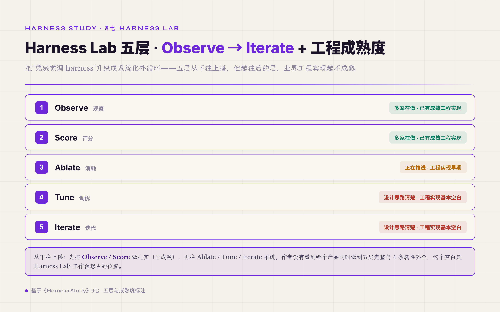
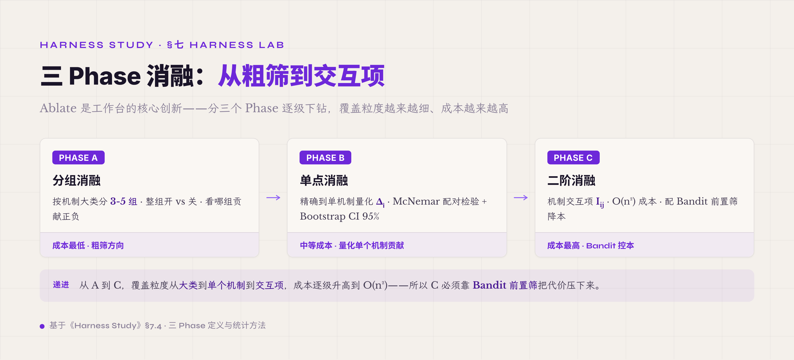
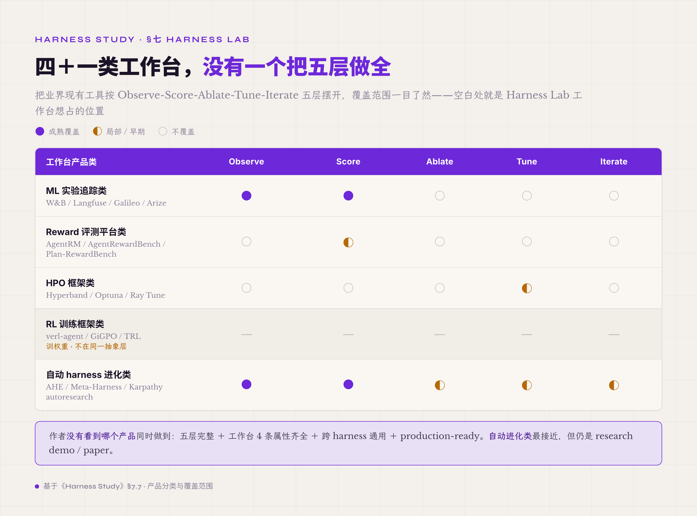

# 七、Harness Lab · Outer Loop · 系统化优化 harness 自身的元工程实践

第五章讲了 8 个 runtime 机制加 1 个 Safety 控制面，第六章讲了 6 种跨机制复用的工程模式。读到这里，读者大概能想象一个生产 agent harness 长什么样了。但生产 harness 跑上半年，工程师会碰到一件更难的事：**harness 自身怎么改进**。机制都装好了，工程模式也都上了，可同样的任务，比如这一周成功率 65%，下一周 58%，再下一周 70%。为什么浮动？哪个机制起了作用？调哪个参数能稳定在 70%？不知道。这一章讲的就是怎么把"凭感觉调 harness"升级成"系统化优化 harness"。

**Harness Lab** 是本书对这套做法的命名：在 harness 之上加一层元工程实践，跨 run、跨任务、跨配置，系统地做评测、消融（ablation）、调参和迭代。业界对此还没有统一叫法，相近的说法有 meta-harness、autoresearch、outer loop（外层循环）。选这个名字有两层考虑：一是和 §5.1 的 Agent Loop 区分开（§5.1 是内层循环（inner loop），即单个 run 内的思考、行动、观察；本章是外层循环，即跨 run 的 Observe-Score-Ablate-Tune-Iterate）；二是和"科学方法、受控实验"的类比对齐：把 harness 配置当实验变量，把一次 agent run 当一次试验，用统计方法逐步找到更好的配置。

**这一章要先交代清楚一点**：Harness Lab 五层在业界的工程成熟度差别很大。

- **Observe（观察）** 和 **Score（评分）** 两层已有成熟的工程实现，Anthropic、OpenAI、W&B、Langfuse、Galileo、Arize 等都在做。
- **Ablate（消融）** 还在早期：统计方法是现成的，但作者没有看到把消融做成工作台功能的产品；AHE、Meta-Harness 等 2026 年的论文走的是自动演化路线，覆盖的是 Tune 和 Iterate 的一部分（§7.7）。
- **Tune（调优）** 和 **Iterate（迭代）** 两层设计思路已经清楚，工程实现基本空白：业界大部分项目这两层仍靠手工和感觉，没有跑起来的自动化闭环。

本书作者的 Harness Lab 工作台按五层完整设计，但 L4 Tune、L5 Iterate 也只是设计骨架，一行代码还没写，不是已经跑起来的产品。读这一章时要分清**业界最前沿做到了什么**和**自己的项目能做到哪一层**，这是两回事。

读完这一章，读者应该能回答：

- Harness Lab 五层是什么，工作台的 4 条属性是什么；
- 怎么从 Observe 开始一层一层往上搭；
- W&B、Langfuse、AgentRM、Hyperband、verl-agent 这些产品分别覆盖五层中的哪几层；
- 工作台和 §5.6、§5.7、§5.8 讲的 observation、trajectory、verifier 三个 harness 机制是什么关系（harness 机制是必要前提，工作台是进阶选项，两者不是替代关系）。

#### 7.0 本章首次出现的术语

第一至六章已经解释过的术语（runtime 机制、harness 机制、内层循环与外层循环、observation、trajectory、verifier 三层、Hard Gate、Outcome Judge、PRM、reward hacking、Preference Leakage、复跑不独立、消融等）这里不再重复，只列本章首次出现的术语。

**Harness Lab 五层核心术语**

- **Harness Lab**：本书的命名，指在 harness 之上、用评测、消融、调参迭代改进 harness 的外层工作台，跨 run、跨任务、跨配置做系统化优化。业界相近的叫法有 meta-harness、autoresearch、outer loop。
- **Observe-Score-Ablate-Tune-Iterate 五层**：Harness Lab 的工程分层，依次编号 L1 到 L5，来自本书作者工作台的五层设计，是一条跨 run 系统化优化的流水线。
- **外层循环（outer loop）**：跨 run 的工程循环，与单个 run 内的内层循环（inner loop）平行，不在同一抽象层；可以类比机器学习实验追踪里的外层循环。

**工作台属性术语**

- **工作台的 4 条属性**：Harness Lab 工作台的核心要求：①接入任意 harness 配置；②自动评测；③自动调优；④识别自己处理不了的情况。作者的看法是："五层是工作台内部的流水线，4 条属性才是真正的壁垒"。
- **AblationProfile**：工作台与 harness 的对接机制。用一组可调参数加若干模式开关，把任意 harness 变体表达成可枚举的配置，工作台就能批量评估。
- **TrajectoryRecord**：工作台与 harness 之间的数据契约。任何 harness 跑出的 trajectory 都转成这个格式，工作台统一读取。

**Score（评分层）术语**

- **L2 Reward 三层**：Harness Lab 工作台的 reward 聚合层，由 verifier 硬判定（verifier hard）、结果评审（outcome judge）、过程评分（process）三层加权组成。outcome 的权重高于 process（作者的设计取 5 倍，经验值），用来抑制靠堆步骤拿分（verbosity）。它和第五章 Verifier 一节讲的 harness 机制层 verifier 三层不在同一抽象层：工作台在 harness verifier 的输出之上，再做跨 run 的聚合与评分对齐。
- **AgentRM**：给 agent trajectory 打分的奖励模型（reward model），可作工作台 L2 的候选替换组件。
- **AgentRewardBench**：步骤级（step-level）reward 的评测基准，用来评估 agent 奖励模型本身好不好。
- **Plan-RewardBench**：计划级（plan-level）reward 的评测基准，评估 agent 计划是否合理。

**Ablate（消融层）术语**

- **Phase A 分组消融**：按机制大类分组，整组开关，看哪一组的贡献为正、为负或接近零。
- **Phase B 单点消融**：精确到单个机制，量化其贡献 Δᵢ。常用检验是 McNemar 配对检验；显著与否看检验统计量和样本量，不看固定的百分点阈值。
- **Phase C 二阶消融**：量化机制间的交互项 Iᵢⱼ = Δᵢⱼ^joint − Δᵢ − Δⱼ，即两个机制一起开带来的提升，减去各自单开带来的提升之和。Iᵢⱼ > 0 为协同（正交互），Iᵢⱼ < 0 为负交互。
- **Bandit 前置筛**：在 Phase A/B 之前，用多臂老虎机（multi-armed bandit）算法快速排除明显负贡献的机制，是降低消融成本的一种做法。
- **Bootstrap 95% 置信区间**：消融的常用统计方法，用 bootstrap 重采样给 Δᵢ 算 95% 置信区间（confidence interval，CI）。

**Tune（调优层）术语**

- **harness 配置搜索（harness config search）**：Tune 层的核心对象。优化的是 harness 配置里的可调参数（AblationProfile 中的十几个参数，如压缩阈值、max_turns、工具预算）加模式开关。它和强化学习训练权重根本不同：不训权重，也不是端到端的在线策略梯度。
- **Hyperband**：常用的超参数优化（hyperparameter optimization，HPO）算法，用逐次减半（successive halving）在固定预算下分配评估资源，可作工作台 L4 的候选组件。
- **Optuna**：常用的 Python HPO 框架，内置 TPE、CMA-ES 等算法，可作工作台 L4 的候选替换组件。
- **GiGPO**[^gigpo-2025]（Group-in-Group Policy Optimization）：agentic RL 的训练算法，采用双层分组，在步骤级按重复出现的环境状态分组做信用分配（credit assignment）。Harness Lab L4 只把它作远期参考，不作主要依据；Harness Lab 自己把步骤级锚点实现为 (context_hash, tool_name)。
- **PAV**[^pav-2024]（Process Advantage Verifier，过程优势验证器）：据原论文，在测试时搜索中比结果奖励模型（ORM）计算效率高 1.5–5 倍。它属于 RL 训练方向，本章只作参考。

**Iterate（迭代层）术语**

- **4 个收敛条件**：Harness Lab L5 的设计：Q ≥ 0.92；max|ΔΔᵢ| < 0.02 连续 3 轮；Top-10 排名连续 3 轮不变；预算耗尽。任一满足即收敛（阈值为设计取值，经验值）。
- **AHE（Agentic Harness Engineering）**[^ahe-2026]：论文标题为 Observability-Driven Automatic Evolution of Coding-Agent Harnesses，在 Terminal-Bench 2 上把 pass@1 从 69.7% 提到 77.0%，是自动进化 harness 的代表论文。
- **Meta-Harness**[^meta-harness-2026]（End-to-End Optimization of Model Harnesses）：在文本、数学、agentic coding 三类任务上验证，据论文报告提升 7.7 个百分点，上下文 token 约节省 4 倍。
- **Karpathy autoresearch**[^karpathy-autoresearch-2026]：单 GPU 上自动修改 train.py、跑评测、决定下一步，是 L4 Tune 可参考的开源实现。

**复跑与测评可信度术语**

- **复跑不独立（AP01，见附录 F）**：N 次复跑之间不独立，导致通过率与稳定性被高估。来源有四种：客户端或评测工具的响应缓存；固定 seed；复跑之间共享的文件、记忆与工作区；temperature 0 时缓存命中带来的逐字复现。模型服务的前缀缓存只复用输入前缀的计算，不改变输出，不是来源。详见 §7.4。
- **对固定测试集过拟合（AP20，见附录 F）**：反复对着同一套测试集调 prompt、规则与工具描述，测评成功率高，上线后表现差。详见 §7.4。
- **输入扰动测试**：给输入加入不改变任务含义的微小变化（随机 nonce、同义改写、格式变化），测 agent 结果的稳定性。
- **per-run nonce**：每次 run 在 prompt 里加一个随机字符串，是输入扰动测试最简单的实现；放在 prompt 开头时，也会让不同 run 之间的提示词缓存失效。

**把脉术语**

- **把脉（行为探测，behavioral probing；工作台里称 Model Probe）**：Harness Lab 三步"把脉 → 定标 → 调方"的第一步。给定一个 LLM 端点，跑一套面向 harness 的诊断，产出一张画像：模型需要哪些机制、不需要哪些、哪些是陷阱。价值在于缩小消融的搜索空间，并提前标出负贡献的陷阱。
- **探针三段式**：把脉的方法核心：刺激（stimulus）→ 行为分类（behavior class）→ 机制蕴含（mechanism implication）。每条探针的结果是一个配置决策加一个可证伪的预测，而不是一个分数。
- **四族探针**：按"出错后果"从硬到软分为四族：A 协议层、B 工具使用层、C 指令遵循层、D 自愈校准层。

**业界同类工作台对照术语**

- **ML 实验追踪类**（W&B、Langfuse、Galileo、Arize 等）：做 trajectory 记录、看板与跨 run 对比，不做消融和调优。
- **Reward 评测平台类**（AgentRM、AgentRewardBench、Plan-RewardBench 等）：评测奖励模型本身，不做 harness 配置优化。
- **HPO 框架类**（Hyperband、Optuna 等）：做通用超参搜索，不针对 agent harness 场景。
- **RL 训练框架类**（verl-agent、GiGPO 等）：训练权重，不优化 harness 配置。

作者没有找到明确定位为"harness 配置优化工作台"的工业平台，这正是 Harness Lab 工作台想占的位置。

#### 7.1 工作台属性 4 条 · 跟 harness 机制层的承载关系

Harness Lab 在工程上是一套**工作台**：它不是 agent runtime 的一个机制，不参与单轮的业务逻辑，而是跑在 harness 之上、消费 trajectory、做评测与调参的元层。讲清这一点有两条线索：**工作台的 4 条属性**讲工作台本身是什么；**harness 机制层与工作台层的承载关系**讲它和第五章 8 个 runtime 机制的边界。

*图 7.1 · Harness Lab 五层框架 Observe→Iterate 与工程成熟度*

**工作台的 4 条属性**：

**第一条，接入任意 harness 配置**。工作台不绑定特定的 harness 实现。任何 harness（Codex、Claude Code、OpenCode、自建）只要把自己的可调参数（通常十几个）和模式开关通过 **AblationProfile** 表达出来，工作台就能批量评估。这是工作台与 harness 解耦的关键：如果工作台只能跑某一种 harness，它就退化成那个 harness 自带的内部评测工具，失去跨 harness 评估的能力。AblationProfile 的字段通常包括 compression、loop_detector、safety_policy、strict_tools、reasoning_effort、max_turns、tool_budget 等，不绑定特定 harness 的内部命名，任何 harness 的等价参数都能映射进来。

**第二条，自动评测**。工作台跑完一次评估，不需要人工读 trajectory 打分，而是通过 **TrajectoryRecord** 和 **L2 Reward 三层**自动评分。TrajectoryRecord 是工作台与 harness 之间的数据契约：任何 harness 跑出的 trajectory 都序列化成 TrajectoryRecord，工作台读它就能算 reward。L2 Reward 三层是工作台的 reward 聚合层（verifier 硬判定、结果评审、过程评分三层，outcome 权重高于 process，以抑制堆步骤拿分，详见 §7.3 Score）。

**第三条，自动调优**。工作台评测完，能自动给出"下一轮配置该怎么改"的建议，不需要工程师人工分析。这涉及 Phase A/B/C 消融、Bandit 前置筛、可调参数搜索、GiGPO 类分组优化等机制（详见 §7.4 Ablate 与 §7.5 Tune）。注意：调优是在以离散为主的 harness 配置空间里搜索，不是用强化学习训练权重。

**第四条，识别自己处理不了的情况**。工作台不只是评测器，还要能识别**哪些情况它自己处理不了**：比如某个机制太新，没有历史数据；复跑之间不独立（AP01，见 §7.4），N 次结果不可信；某个机制在某类任务上没有可用的 verifier。有了这种识别，工作台就不是机械地跑消融，而是知道哪些数据不能信，给出如实的评估，而不是虚假的精度。具体做法包括：**评测自检**（借用 PCS 框架（可预测性、可计算性、稳定性）给出的两项检验：Yes Check 用 bootstrap 检验重复运行下的平均得分是否显著高于量表中点，防止一次走运；Overlap test 计算打乱的对照组与真实数据两个得分分布的重叠程度，看评测能不能把信号和噪声分开；详见第二卷第二章）、**reward hacking 监测**、**收敛检测**（用 4 个收敛条件兜底，防止无限跑下去）。

这 4 条属性合起来，构成工作台区别于同类产品的地方。业界同类产品（W&B、Langfuse、AgentRM、Hyperband 等）通常只覆盖其中一两条，作者没有看到哪个产品 4 条都做到。所以 Harness Lab 工作台不是"又一个 ML 实验追踪工具"，而是**跨 harness、自动评测、自动调优、自我审查**四项俱全的一个新工程层。

接下来讲 **harness 机制层与工作台层的承载关系**。这条边界特别需要讲清楚，它和 §5.6、§5.7、§5.8 三节对自我进化（self-evolution）与工作台边界的厘清相呼应。

**harness 机制层**（第五章第六、七、八节讲的 observation、trajectory、verifier 三个机制）：单个 run 内 agent 实际用到的 runtime 机制。observation 是 agent 看到的 stub/body，trajectory 是单个 run 内的事件流，verifier 在单个 run 结束时判定 PASS/FAIL。这三个机制在 agent 的每一轮里都参与，不是"用到时才存在"的。

**工作台层**（本章讲的 Harness Lab）：跨 run 的元层，不参与单轮业务逻辑，是跑在 harness 之上、消费 trajectory、跑消融、跑调优的外层循环。工作台层不在 agent 任何一轮的执行路径里：agent 跑完一次 run，trajectory 写进工作台的输入队列，工作台在后台批量消费，做评测、消融、调优和迭代。

**两层是承载关系，不是替代关系**，这一点要特别强调。harness 机制层是工作台层的必要前提：没有 trajectory，工作台没有数据；没有 verifier，工作台没有 reward 信号；没有 observation，工作台没有消融信号。但 harness 机制层不依赖工作台层：harness 可以独立基于 trajectory 回放和 verifier 反馈，做 prompt 优化、工具描述调整、上下文策略改进等自我进化，不需要外部工作台。**harness 机制层可以独立自我进化，工作台层是进阶的元路径**，这与 §5.8 章末的澄清一致。

理解这条边界时容易有两个误区。**误区一**：把工作台层等同于自我进化。自我进化跨两个层级：harness 机制层自己就能进化（独立路径），工作台层只是更系统化的自我进化（进阶路径），并不是"必须有工作台才能自我进化"。**误区二**：把第五章的 verifier 三层和下面的工作台 L2 Reward 三层混为一谈。两者名字接近，但抽象层不同：verifier 三层是 harness 机制（Hard Gate、Outcome Judge、PRM，在单个 run 内评判 agent 的结果）；L2 Reward 三层是工作台层的 reward 聚合（verifier 硬判定、结果评审、过程评分，跨 run、跨任务、跨配置加权，供消融使用）。前者是 harness 机制，后者是工作台对 harness 机制输出的二次聚合。

#### 把脉 · Harness Lab 三步的第一步 · 跑五层之前先给模型摸脾气

工作台在产品形态上分三步：**把脉 → 定标 → 调方**。下面从 Observe 开始的五层是第三步"调方"的引擎；在它之前还有两步前置工序，第一步就是把脉（行为探测，behavioral probing）。把脉要解决的问题很具体：给定一个 LLM 端点，跑一套面向 harness 的诊断，产出一张画像，写明这个模型需要哪些机制、不需要哪些、哪些机制对它是陷阱。它的价值不在"了解模型"，而在**缩小后续消融的搜索空间**，并**提前标出负贡献的陷阱**。在 reward 昂贵的垂直场景里，每跑一次消融都要花专家时间和钱；把脉把"盲目消融十几个机制"缩小成"有针对性地消融少数几个"。

把脉和能力评测、人格画像的根本区别在于它的方法核心：**探针三段式**。每条探针是一个三元组：

- **刺激**：一个专为暴露单一行为设计的极小任务，不求难，只求能逼出这个行为；
- **行为分类**：判断它是怎么做的，而不是做得对不对；优先用程序判定，只在模糊的维度才用模型当裁判；
- **机制蕴含**：给定行为类别，输出一个配置决策，加一个可以被消融证伪的预测。

探针的输出是一个配置决策加一个可验证的预测，而不是一个分数，这是它区别于各种"模型打分卡"的地方。十几条探针按"出错的后果"从硬到软分成四族：

- **A 族，协议层**：出错时 harness 直接崩溃，而不是退化；二元硬判定，优先级最高；
- **B 族，工具使用层**：出错会退化，但不崩溃；
- **C 族，指令遵循层**；
- **D 族，自愈校准层**：最深，也最能拉开模型之间的差异。

这套结构有学术上的依据：Behavioral Fingerprinting[^behavioral-fingerprinting-2025] 提供了"固定诊断套件加裁判加画像卡"的结构模板，Berkeley Function Calling Leaderboard 提供了工具探针的素材，自我修正综述[^self-correction-survey-2025]为 D 族最关键的那条探针提供了设计依据，CDCT[^cdct-2025] 提供了"约束遵从与语义正确分开测"的原则。把脉补上的是这些工作都没做的一环：把行为映射到机制决策。

作者给 DeepSeek V4 跑过这套把脉，A 族协议层最先暴露问题。V4 对含嵌套对象和数组的复杂 strict schema 敏感，注册这类工具时请求直接失败，而不是降级运行；这条行为直接决定了要不要做 schema 归一化层、做到什么程度。C 族的输出本地化维度上，V4 在中文上下文里会把任务里的英文标题译成中文，这决定了 verifier 不能只认英文固定字符串，要考虑多别名匹配。B 族的过度探索维度上，在以工具为先的多文件任务里，V4 倾向于先反复读文件再动手，这决定了要不要加"读完再改"的防护（read-complete guard）。这些都是 temperature 为 0 时看一眼就能归类的行为事实：崩没崩、译没译、读了几次，都是二元或可计数的观察，不需要跨配置的精确对照就能下结论。

但把脉只给定性的先验，真正的判决要靠消融定量验证。把脉说"开 text-tag-parser 能回收一部分被丢掉的工具调用"，这个"一部分"到底是多少，要靠消融拿干净的数据回答。作者那次把脉之后想用消融验证这批预测，当时 per-run nonce 还没加，作者认为 N 次复跑共享了服务端的前缀缓存、结果不独立，于是把那批定量数字作废了。后来经对照调研，这个归因被纠正：前缀缓存命中不改变输出，问题不在缓存；后来加上 nonce 暴露出的不稳定，来自 agent 对输入微小变化的敏感，以及对固定测试集的过拟合（见 §7.4 的 AP20）。不过那批数字确实不能用：没有做输入扰动，复跑只能测到同一输入下的采样波动，测不到这种敏感度。这次踩坑反而让把脉和消融的分工变得清楚：把脉给的定性先验看一眼就能确认，"它崩了""它用文本标签"这类事实不受复跑协议影响；消融给的定量判决，必须有足够的重复次数（按统计功效估算）、复跑之间真正独立、结果在测试集之外也站得住，才可信。这正是前面工作台第四条属性"识别自己处理不了的情况"要兜住的：知道哪一批数据不能信，比硬给一个虚假的精度重要。

所以把脉在工作台里的位置很清楚：它是五层之前的前置过滤器，用便宜的定性诊断先把消融的搜索空间和陷阱标出来，让后面从 Observe 开始的五层不必盲目消融全部机制，把昂贵的定量验证留给真正需要判决的少数几个机制。

把脉报告还要标一个有效期锚点：**模型快照标识**。云端端点会静默升级，服务商不改名只改权重的事这几年反复发生，画像会随之过期。工程做法：把脉结果记录模型 ID、把脉日期和一组行为指纹（挑几条最敏感的探针，把它们的输出特征存下来）；每日例行运行中发现指纹漂移，就自动重跑整套探针。画像是有保质期的诊断，不是一次性的体检报告：端点在变，先验也要跟着更新。

#### 7.2 Observe · trajectory 收集与分析数据库

**第一层，Observe**：工作台从 harness 收集 trajectory，存进结构化的分析库，作为后面四层（Score、Ablate、Tune、Iterate）的唯一数据来源（single source of truth）。这一层是五层里业界最成熟的：Anthropic、OpenAI、W&B、Langfuse、Galileo、Arize 等几乎所有 ML 与 agent 工具都实现了 trajectory 收集。差别在于"收下来之后做什么"：大多数工具止步于看板和跨 run 对比，真正进入 Ablate、Tune、Iterate 的工程实现还很少。

工作台 Observe 层比 harness 机制层的 trajectory（§5.7 已讲）多做一层：harness 的 trajectory 是**单个 run 内**的事件流，工作台 Observe 是**跨 run、跨任务、跨配置**的聚合。具体多三件事：

- **跨 run 聚合**：把多个 run 的 trajectory 按任务、配置、时间窗聚合，让 Ablate 层能在 N 次 run 上比较同一配置；
- **跨任务聚合**：让同一配置在多个任务上的表现可以对比；
- **跨配置聚合**：让多个配置在同一任务上的表现可以对比，这是 Ablate 的核心数据基础。

这三种聚合都要求 schema 统一、字段稳定、ID 一致：trajectory 字段的含义不能跨 run 漂移，否则跨 run 比较全是噪音。

工作台 Observe 的工程核心是**分析数据库的 schema 设计**。常见有两条路径：

- **JSONL 只追加（append-only）加索引数据库**：Anthropic、OpenAI、Inspect AI 走这条，JSONL 是真相源，索引数据库负责加速查询；
- **关系数据库直存**：OpenCode 用 SQLite，LangSmith 用 Postgres，trajectory 直接拆成结构化字段存进表里，查询方便，但失去了用 git diff 对比的便利。

两条路径各有取舍，与 §6.3"追加写的会话事件日志"讲的存储取舍是同一个问题。本书作者的 Harness Lab 工作台 L1、L2 用 SQLite 的 analysis.db，共 5 张表（runs、steps、mechanism_events、verifications、artifacts）。这套 schema 已经跑起来，是 Observe 层最早的工程实现。

**Observe 层最关键的工程不变量是 schema 稳定**。schema 一旦定下，后续每次 run 都按它写 trajectory，不能临时加字段或改字段含义。这样跨 run、跨版本的 trajectory 都能送进同一套分析流水线，不需要每次改了 schema 就重跑历史评测。schema 改动遵循"跨层接口契约即不变量"的原则：后续 schema 只能扩展已有字段，不能破坏；用枚举新增变体，而不是封闭的穷举匹配（sealed match）；新字段用 Optional，不强制现有调用方传入；用协议版本字段标记 schema 的演进。

业界 Observe 层的代表是 **HAL（Holistic Agent Leaderboard）**[^hal-2026]。HAL 在一个统一框架下完成了 21730 次 rollout、9 个模型、9 个基准的评测，把 agent 评测从"几周"缩短到"几小时"。HAL 的工程价值在于**证明了 agent 评测可以工业化**：不再是每篇论文各跑各的基准、各用各的格式，而是有统一的 trajectory schema 和统一的 verifier，跨论文、跨模型、跨基准的结果可以直接对比。

HAL 这条路径和工作台 Observe 层做的是同一件事，只是侧重不同：HAL 偏学术基准框架，工作台 Observe 偏生产 agent 的优化基础设施，但都是把跨 run 的 trajectory 结构化聚合，让跨配置比较成为可能。Harness Lab 工作台的 L1 Observe 和 HAL 思路相同，但服务对象不是论文基准，而是生产 agent 的跨配置优化。

Observe 层在五层里**最容易做，也最容易做错**。容易做，是因为 trajectory 收集已经很普及，几行代码加 SQLite 就能搭起来。容易做错，是因为 schema 如果一开始不稳，跨 run、跨版本的数据就废了，重跑历史评测的成本极高。Observe 层做对的判断标准是：**半年后还能不能用同一个 schema 对所有历史 trajectory 做消融**。能，就是做对了；不能，就是早期在 schema 设计上投入不够。所以搭工作台的第一条工程原则是：Observe 层早期就要投入 schema 设计与评审，不留临时字段。

#### 7.3 Score · 工作台 reward 聚合层 · Harness Lab L2 Reward 三层架构

**第二层，Score**：工作台对 Observe 层收来的 trajectory 自动评分，产生跨 run、跨任务、跨配置可比的 reward 信号。这一层在 2026 年演进很快：L2 Reward 三层架构，以及 AgentRM、AgentRewardBench 等新论文，都在 2026 年上半年陆续提出，是 agentic reward 建模的前沿方向。

这里先讲清工作台 Score 层与第五章 Verifier 三层的边界（7.1 末尾已经点过，这里展开）。**Verifier 三层是 harness 机制的抽象**：Hard Gate、Outcome Judge、PRM 在单个 run 内运行，agent 做完任务后立即判定 PASS/FAIL，给这个 run 一个判定结果。**工作台 L2 Reward 三层是工作台层的抽象**：把 harness verifier 的判定结果和 trajectory 的其他特征，在工作台层做二次聚合，产生跨 run 可比的 reward 信号。两者都叫"三层"，但抽象层不同，工程对象也不同。

下面具体讲工作台 L2 Reward 三层。

**第一层，verifier 硬判定（verifier hard）**：直接用 §5.8 Hard Gate 的输出作为硬 reward，通过记 1，不通过记 0。这类可由程序判定对错的信号，用在训练时就是可验证奖励强化学习（RLVR）的奖励（§5.8 已详写）。工作台 L2 把它作为基础 reward，在多个 run 上取平均，作为跨配置比较的硬基线。

**第二层，结果评审（outcome judge）**：用另一个 LLM 对 agent 的最终产出做语义评分，对应 §5.8 第二层的 LLM-as-a-judge，工作台 L2 把它作为 outcome reward。工作台层用 outcome judge 时按可替换组件处理：比如可以用 AgentRM 替代当前的 LLM 评审。AgentRM 是专门为 agent 训练的奖励模型，比通用的 LLM 评审更有针对性，也能减少评审与被评对象同源带来的偏袒：通用 LLM 评审可能与 agent 同属一个模型家族，AgentRM 则不同（这是把偏好泄漏（Preference Leakage）的思路推广到这里；原论文研究的是合成数据的生成模型与评审模型相关时的偏袒）。

**第三层，过程评分（process）**：对 agent 推理过程做步骤级评分，对应 §5.8 第三层 PRM。工作台 L2 把每一步的 process reward 累加并归一化，给消融提供过程层面的信号。相关工作有：

- AgentPRM[^agent-prm-2025]：一个 PRM 实现；
- ToolPRMBench[^tool-prm-bench]：评测基准；
- Socratic-PRMBench[^socratic-prm-bench-2026]：评测基准，不是可以直接调用的 PRM 实现。

其中 AgentPRM 这类实现可作工作台 L2 第三层的候选替换组件，两个基准则是用来评估 PRM 本身好不好的标尺。

工作台 L2 Reward 三层不是简单相加，有几条加权规则要讲清楚。**outcome 权重高于 process，抑制堆步骤拿分**：实践中常见，如果 outcome 与 process 等权，agent 容易学会"过程多写几步混 reward"的冗长投机（verbosity gaming，属于 §5.8 讲的 reward hacking 的一种）。作者的设计让 outcome 的权重是 process 的 5 倍（经验值，按场景调整），不让冗长的过程主导 reward。**Hard Gate 不通过，outcome 和 process 都记 0**：即使过程步骤看起来合理，Hard Gate 失败时整体 reward 也归零，不让 agent 在失败的任务上靠过程分混分。这样 process reward 只是"对合理 trajectory 的辅助打分"，而不是"独立的兜底通道"。

**L2 Reward 三层的组件替换**：按工作台第二条属性（自动评测）的思路，L2 三层每层都可以换组件，不影响工作台的整体接口。verifier 硬判定可以从 pytest 换成"构建成功加 lint 通过加自定义哈希校验"；outcome judge 可以从 GPT-4 这类 LLM 评审换成 AgentRM；process 可以从基础 PRM 换成 AgentPRM 这类实现（换上的 PRM 好不好，用 ToolPRMBench、Socratic-PRMBench 两把标尺评）。这种灵活性让工作台 L2 不会被 reward 模型的演进锁死：AgentRM 升级了，新的 PRM 论文出来了，换上更好的实现即可，工作台 L2 的接口不变。

业界 Score 层的工程做法值得对照看：

- **Anthropic 的评测建设**：Anthropic 官方博客讲他们建评测流水线时把"小步快验"放在第一位：评测很关键，但不需要一开始就完美。在 Anthropic、OpenAI、Inspect AI 等的做法里，评测是持续迭代的，不是一次性工作。
- **OpenAI 的规格驱动评测**：OpenAI 倾向于先定"agent 应该做什么"的规格，再建评测来验证；工作台 Score 层就是这份规格的自动执行者。
- **AgentRewardBench**：步骤级 reward 评测基准，给奖励模型本身打分。工作台 L2 第二层 outcome judge 的质量可以用它来评，让工作台的 reward 本身也有标准答案可以对照。
- **Plan-RewardBench**：计划级 reward 评测，偏重长程任务的规划合理性。工作台 L2 第三层 process reward 的计划连贯性维度可以用它来评。

工作台 Score 层在生产 agent 项目里典型的推进路径：

1. 先用最简单的 verifier 硬判定（pytest、构建成功、文件哈希三项）跑起来，不上 LLM 评审、PRM 这些昂贵的组件；
2. 积累了几百个 run 的硬 reward 数据后，在开放式任务上加 outcome judge（LLM 评审，选与 agent 不同家族的模型，防偏好泄漏）；
3. 长任务跑稳后加 process reward（PRM），让消融能看到步骤级的贡献；
4. 业界出现新的奖励模型时替换组件升级（比如用 AgentRM 替代通用 LLM 评审），工作台接口不变。

这样渐进引入，比一开始就上完整的三层工程成本低，收益也来得快。

#### 7.4 Ablate · 量化机制贡献 · 防复跑不独立与测试集过拟合

**第三层，Ablate**：工作台对每个 harness 机制做消融实验，量化它对整体任务表现的贡献 Δᵢ。在五层里，这一层是**从通用的 Observe/Score 工具走向真正的 harness 优化工具**的分水岭：只做到 Observe/Score，就是一个 trajectory 看板；加上 Ablate，才能回答"这个机制到底有没有用、贡献多少、拿掉会怎样"这类工程改进问题。

Ablate 的核心方法是 **Harness Lab 三阶段消融**：Phase A 分组消融、Phase B 单点消融、Phase C 二阶消融。

*图 7.2 · 三 Phase 消融：从粗筛到交互项*

**Phase A 分组消融**：按机制大类把 8–16 个机制分成 3–5 组（比如 Context 组、Tool 组、Verifier 组、Loop 组），整组开和整组关各跑 N 次 run，看哪组贡献为正、哪组为负、哪组接近零。这一步是快速粗筛，每组配少量重复（经验起点 3–5 次）就能看出大方向，不需要把每个机制都单独跑一遍。少量重复只够看方向，要下结论仍以置信区间为准（见下文的功效前置）。

**Phase B 单点消融**：对 Phase A 中贡献不接近零的组，**正贡献和负贡献的都要拆**，精确到单个机制，量化 Δᵢ。单点消融比分组消融难一层：关掉机制 i，其他机制全开，比较开和关的 reward 差异（留一消融，leave-one-out ablation）。统计上用 **McNemar 配对检验**（同一批任务开、关各跑一次，配对比较）；显著与否由检验统计量和样本量决定，不看某个固定的百分点阈值：同样的通过率差异，N 越大越容易显著。**Bootstrap 95% 置信区间**给出 Δᵢ 的误差范围：Δᵢ 不只是一个点估计，而是一个带误差棒的区间，"贡献为正"要以区间不跨 0 为准，而不是看单次结果。

统计检验之前还有一道更早的关卡：**功效（power）前置**。改配置之前先问：我这组"任务数 × 重复数"能检出多大的 Δᵢ？按二项方差粗算就行：二十个任务乘三次重复这种量级，能可靠分辨的通过率差大致在两位数百分点；想看清 5 个百分点以内的差异，样本量要再翻几倍。这笔账不先算，小样本消融的典型结局是把噪声当信号：Δᵢ 的符号在两轮之间翻转，并不是机制不稳定，而是样本量根本不够分辨它。所以需要多少次重复没有固定门槛：按想检出的最小可检测效应（MDE）估算样本量，下结论时以置信区间不跨 0 为准。N=3 的快速消融可以跑，但只能当方向参考，不要让它直接改默认 profile。

**Phase B 单点消融的价值不只在"量化正贡献"，更在于能抓出"隐性的负贡献机制"。** 一个真实例子来自工程记录：某 harness 在模型传来的工具参数解析失败时，把参数换成空对象，照常调用工具；参数不符合 schema 时也不校验。代码逻辑没有错，看起来是个周到的容错设计，在代码里留了四个多月，直到一次专项代码审计才被发现。它**把模型本该暴露的参数错误悄悄盖住了**：模型传错参数，工具照样跑出一个"看着对、其实不对"的结果，模型收不到报错，也就不会自我修正，一路错下去。改成把错误回给模型之后，模型收到报错，重新构造参数，就能做对。这种"局部正确、全局有害"的机制，单元测试测不到（单测只测代码逻辑对不对，不测它在真实系统里有没有用），日常代码评审也容易放过。这一例靠专项审计发现，没有做过开关对比；要系统地找出这类机制并给出贡献值，就得在真实模型、真实工具链、真实任务上做单点消融。这正是 Ablate 层比"凭感觉调机制"多出来的一步。

**Phase C 二阶消融**：看机制之间的交互项。其余机制保持不变，以 i、j 都关为基准：Δᵢ、Δⱼ 分别是只开 i、只开 j 带来的 reward 提升，Δᵢⱼ^joint 是 i、j 同时开带来的提升，交互项 Iᵢⱼ = Δᵢⱼ^joint − Δᵢ − Δⱼ。Iᵢⱼ 显著大于 0 是协同（正交互，一起开的效果超过两者单开之和）；显著小于 0 是负交互，来源可能是冗余（两个机制互相替代）或干扰（互相冲突）。Phase C 的工程成本最高：二阶消融的实验数量是 O(n²)，16 个机制就有 120 对组合，每对跑 N 次，几千个 run 不算夸张。成本这么高，Phase C 需要配 **Bandit 前置筛**：先用多臂老虎机算法快速排除明显负贡献的组合，把全量 120 对降到 20–30 对（经验值）真正值得测交互的组合，能明显降低消融成本。

工作台 Ablate 层这套 Phase A/B/C 加 Bandit、McNemar、Bootstrap CI 的做法，让消融不再是"凭感觉关一个机制看看结果"，而是有统计依据的工程实验。这套方法比 ML 实验追踪工具（W&B、Langfuse）走得更深：W&B、Langfuse 帮你记录跑了哪些实验，但不帮你判定哪个实验结果显著、哪个是噪音。这是工作台比 ML 实验追踪多出来的关键一层。

**Ablate 层有三个反模式必须提前防住**：**复跑不独立**、**对固定测试集过拟合**和 **reward hacking**。前两个让消融和测评的数字失真，第三个让 reward 信号本身被钻空子。不防住它们，消融跑出来的就是假信号，拿到错误的工程结论比没跑消融还危险。

**复跑不独立（AP01）**：跑 N 次取平均通过率，前提是这 N 次互相独立。如果复跑之间共享了什么，N 次结果就不是 N 次独立采样，而是同一个结果被数了好几遍，通过率和稳定性都会被高估。常见来源有四种：

- **响应缓存**：客户端、评测工具或中间的代理层，对相同请求直接返回之前生成的完整输出；
- **固定 seed**：每次复跑用同一个随机种子；
- **共享状态**：复跑之间共用文件、记忆或工作区，上一次 run 留下的产物被下一次读到；
- **temperature 0 时的逐字复现**：temperature 设为 0 时，缓存命中会减少数值上的不确定性，同一输入更容易逐字复现同一输出。

这里要澄清一个常见误解：模型服务的**前缀缓存**（prompt caching / prefix caching）不是来源。DeepSeek、OpenAI 的官方文档都写明，前缀缓存只匹配输入前缀、复用这部分的计算，输出照样逐 token 生成，命中与否不改变输出；temperature 大于 0 时，命中缓存和未命中的请求来自同一个采样分布。另外，DeepSeek 当前模型默认开启思考模式，此时 temperature 参数不生效，每次本来就是随机采样。

真正的来源在客户端与评测环境这一侧。Mnimi 论文[^mnimi-2025]系统论证了客户端缓存的简单复用会破坏复跑之间的独立性，使标准的统计推断失效。这件事的代价可以用 pass^k（连续 k 次全部通过的概率）来看，philschmid 的 pass^k 分析[^philschmid-pass-k]给出了算术：各次独立时，pass@1 = 0.33 的 agent 连续三次全部通过的概率只有 **0.33³ ≈ 0.04**。如果复跑不独立，比如命中响应缓存而逐字复现，观测到的"连续通过"会远高于这个值，把稳健性报高。对策是让每次试验从干净的环境开始：关掉客户端和评测工具的响应缓存，不固定 seed，为每次 run 准备独立的工作区、文件和记忆；在 temperature 0 下做复跑统计时，要意识到逐字复现的可能。

**per-run nonce 与输入扰动测试**：per-run nonce 是每次 run 在 prompt 里加一个随机字符串（比如任务 UUID 加时间戳，4–8 字节）。对响应缓存来说，nonce 让每次请求都不同，确实能避免直接拿到旧输出；但它的主要价值在另一处：它是**输入扰动测试**最简单的实现，即给输入加一个不改变任务含义的微小变化，看 agent 的结果稳不稳。nonce 放在 prompt 开头时，每次复跑的输入都不一样，测到的结果多样性里就混进了"agent 对输入微小变化的敏感度"，这恰恰是固定输入的复跑测不出来的；同时，开头变了，不同 run 之间的提示词缓存也会失效。同一个 run 内的后续轮次仍然命中缓存（前缀里是同一个 nonce），所以成本只涨一成左右（经验值）。生产部署不加 nonce，照常利用缓存降低延迟和成本；评测时把输入扰动作为一项常规测试，与固定输入的复跑分开报告。

**对固定测试集过拟合（AP20）**：反复对着同一套测试集调 prompt、规则和工具描述，测评成功率越来越高，上线后却表现差，出的问题五花八门。测试集本来是用来估计线上表现的样本，被反复拿来做开发决策之后，它实际上变成了训练数据：每次改动都朝"让这套测试通过"的方向走，最后得到的是一套专门适配这些用例的配置。

**案例**。作者早期用一套固定测试集开发 harness，测评成功率很高，上线后问题频出，线上表现和测评成功率差距很大。后来在评测里加入 per-run nonce，复跑立刻暴露出大量不稳定：同一个用例，输入开头多了一串随机字符，结果就时好时坏。当时作者把这归因为缓存，认为之前的复跑命中了服务端的前缀缓存，N 次结果不独立，所以测评分数虚高。后来做了对照调研，纠正为另一种解释：前缀缓存命中不改变输出，问题不在缓存；nonce 作为输入扰动，暴露出 agent 对输入微小变化的敏感，再加上 harness 对那套固定测试集过拟合，两者合起来造成了测评与线上的落差。

**成因**。测评好、线上差，常见原因有五类：

- **过拟合**：配置被反复调到适配这批用例，换一批用例就不灵；
- **线上输入分布不同**：真实用户的措辞、任务类型、上下文长度与测试集不一样；
- **对输入微小变化敏感**：换个说法、多一个空格或一串无关字符，结果就变；
- **测评与生产环境不一致**：模型版本、参数（temperature、思考模式）、工具实现、权限、网络、数据不同；
- **统计噪声与模型版本漂移**：样本量小时测评分数本身波动很大；云端模型静默升级后，旧的测评结果也会过期。

**诊断方法**：

- **分析线上失败输入与测试集的差异**：把线上失败的输入收集起来，和测试集对比措辞、任务类型、长度、上下文，找出测试集没覆盖到的部分；
- **改写测试**：保持任务含义不变，把测试用例换个说法、调整格式或顺序，看成功率掉多少；掉得多，说明配置过拟合了原来的表述；
- **看 pass^k**：同一用例连续 k 次全部通过的比例，比 pass@1 更能暴露不稳定；
- **核对测评与生产配置**：模型名与版本、temperature、思考模式、工具版本、系统提示词是否一致；
- **状态隔离**：确认每次试验不继承上一次的文件、记忆和工作区（这也是排除复跑不独立的前提）；
- **区分输入扰动与缓存的四组对照实验**：同一套用例跑四组：①不加 nonce；②nonce 放在 prompt 开头；③nonce 放在第一条用户消息末尾；④prompt 开头放一个固定字符串。四组在同一天交替运行，固定模型名，每组 N ≥ 10，并记录每次请求返回的 prompt_cache_hit_tokens（DeepSeek 返回的缓存命中 token 数），确认各组的缓存状态与设计一致。读法：②③两组每次的输入都不同，但③的系统提示词部分仍能跨 run 命中缓存，②不能；如果②③结果相近，且都比①更不稳定，差异来自输入扰动，而不是缓存。④的开头变了但每次相同，缓存照常命中，用来检查"开头多一段文字"本身的影响。

**预防方法**：

- **开发集与留出集分开**：日常调 prompt、规则、工具描述只看开发集；留出集不根据它做调整，每次改动前后都跑，只用来检查开发集上的提升是否还在；
- **线上失败回流为判例**：把线上出过的问题整理成判例（真实发生过的故障案例，带编号，用作评测用例的来源），补进测试集；
- **同时报告 pass@1 与 pass^k**：只报平均成功率会掩盖不稳定；
- **每次试验从干净环境开始**：独立的工作区、文件和记忆，关掉响应缓存；
- **固定模型版本**：测评与生产用同一个带日期或版本号的模型名，升级时重跑测评。

**reward hacking（奖励投机，AP03，见附录 F）**：agent 在 Score 层的 reward 函数上找到漏洞，拿到形式上的 reward，却没有完成实际任务。§5.8 verifier 一节讲过它在 verifier 机制层的对策，本节讲工作台层 Score 与 Ablate 的对策。

综合 Harness Lab 的设计与相关论文，reward hacking 常见的形态可以归成以下几种。规格投机（specification gaming）是这类现象的总称，下面各项都是它的具体形态：

- **钻测试的空子（gaming the test）**：专门生成能通过测试、但不解决问题的代码；
- **钻评分细则的空子（gaming the rubric）**：满足 rubric 的字面要求，不满足实质意图；
- **迎合评审模型（gaming the judge）**：输出符合评审 LLM 的偏好，但没解决问题，典型如利用长度偏好（length bias）堆长输出拿高分；
- **钻过程评分的空子（gaming the process）**：在 PRM 看的中间步骤上做得漂亮，最终任务没完成；
- **钻任务规格的歧义**：利用任务描述的模糊之处，绕过真正的要求；
- **谄媚（sycophancy）**：学会用户或评审喜欢听的回答方式，而不是真正回答问题。

这份清单是本书的归纳，列的是目前常见的主要形态，不是完整的分类。

把 reward hacking 放进均衡框架分析的论文是 **Reward Hacking as Equilibrium under Finite Evaluation**[^reward-hacking-equilibrium-2026]（这里取其思路，不作权威结论）。它把谄媚、长度投机、规格投机放进一个统一的理论框架：当评估投入的增长慢于工具数带来的质量维度增长（次二次，C(T) = o(T²)）时，评估覆盖率随工具数增加趋于零（原文是带这个前提的条件结论，不是无条件成立）。放到工作台 Score 层：可用工具越多，agent 能钻空子的地方越多，单层 reward 越难全部覆盖，reward hacking 的风险随之上升。**Reward Hacking Benchmark（RHB）**[^rhb-2026] 给出了实证（ICML 2026 接收）：Claude Sonnet 4.5 的漏洞利用率（exploit rate）为 0%，DeepSeek-R1-Zero 为 13.9%，不同模型在 reward hacking 倾向上差别很大。

工作台 Score 层对 reward hacking 的对策，与第五章 Verifier 一节的三层组合策略一致：

- **verifier 模糊化**：不让 agent 看到 reward 函数的具体形状；
- **隐藏测试（hidden test）**：除了 agent 看得到的测试，另有一组它看不到的；
- **反过拟合惩罚**：输出特征过于针对性地迎合 verifier 时，直接判失败；
- **组合 reward**：多层 verifier 加权，让 agent 难以单点钻空子；
- **策略与奖励协同进化（co-evolving policy-reward）**：policy 与 reward 对抗式地共同演进，防止被钻空子。

工作台层比 harness 机制层多一种能力：**跨 run 监测 reward hacking**。同一配置跑 N 次，看 reward 分布是否异常集中在某些可钻空子的地方；如果是，标记"可能存在 reward hacking"，交给评测人员人工审查。这是 ML 实验追踪类工具没有的能力，也是 Ablate 层对工作台的核心价值之一。

Ablate 层是工作台五层的**核心创新点**：这一层做对了，工作台才真正比 ML 实验追踪工具多出一层；做不好，工作台就是又一个看板。Phase A/B/C、Bandit、McNemar、Bootstrap CI、复跑独立与输入扰动测试、reward hacking 监测，缺了任何一项，消融信号都不可信。

#### 7.5 Tune · harness 配置搜索 · 不是训练权重

**第四层，Tune**：工作台在 Ablate 层量化出哪些机制是正贡献之后，对这些机制内部的**可调参数**做搜索，找最优配置。这一层的核心对象是 **harness 配置搜索**，不是强化学习训练权重，这条边界是理解 Tune 层的关键。

**先说明现状**：Tune 层在 Harness Lab 工作台里还没有写代码。本章开头已经说过，这里再强调一次：设计骨架已经清楚（下文展开），工程实现还是空白。其他平台（W&B、Optuna 等 HPO 工具）在通用超参搜索上已经成熟，但**作者没有看到专门针对 agent harness 场景的 Tune 实现**。读这一节时，把它当作"设计参考加未来的工程方向"，而不是"已有现成工具可用"。

Tune 层解决什么问题？Ablate 层告诉你"compression 机制是正贡献，Δ = +14pp"，但 compression 阈值用 0.65、0.55 还是 0.75，工具预算用 50、80 还是 120，max_turns 用 30、50 还是 100，这些可调参数的具体取值 Ablate 层回答不了。**只做到 Ablate、不做 Tune 的现实结果是**：项目卡在最初拍脑袋定的配置上，即使发现 compression 很重要，阈值还是初始的 0.65，错过了 0.55 到 0.75 之间可能更好的取值。Harness Lab 工作台的设计文档明确写了这一点："缺了 L4，项目就卡在初始配置上"。

常用的超参数优化框架可以作为 Tune 层的候选组件。**Hyperband**：常用的 HPO 算法，用逐次减半（successive halving）分配评估资源，在给定预算下兼顾探索与利用，适合搜索空间大、单次评估成本中等的场景。**Optuna**：Python 实现的 HPO 框架，内置 TPE（Tree-structured Parzen Estimator，树结构 Parzen 估计器）、CMA-ES（协方差矩阵自适应进化策略）等多种算法，剪枝器（pruner）可以让表现差的试验提前停止。两者都可作工作台 L4 的候选：接入后，工作台提供参数空间和 reward 函数，HPO 库返回推荐配置。

但直接把现成的 HPO 接进来，有几个问题要想清楚：

- **第一，HPO 假设每次评估是独立的带噪样本，agent 评测未必满足**。复跑不独立（AP01，见 §7.4）会让 N 次 run 的结果不再独立，agent 评测本身的方差又大。贝叶斯优化和 TPE 靠采集函数（acquisition function）决定下一组试哪些参数；Hyperband 靠逐次减半决定淘汰哪些配置，它没有采集函数。两类方法都依赖可信的评估结果，喂进去有偏的结果，就会做出错误的取舍。
- **第二，搜索空间是混合的**。agent harness 配置有十几个参数加若干模式开关，既有连续参数（compression 阈值），也有离散开关（loop_detector 开或关）和类别参数（agent loop 类型），参数之间还有依赖（某个机制关掉时，它的参数就没有意义）。定义搜索空间时，要把这些类型和依赖关系表达清楚。
- **第三，单次评估成本不固定**。HPO 的预算分配通常假设评估一次的成本固定，而 agent 评测一次的成本与任务长度、工具用量、子 agent 数量高度相关，预算分配策略需要重新设计。

这三个问题说明 Tune 层需要**针对 agent harness 场景的专门实现**：保证复跑独立并纳入输入扰动测试，处理混合搜索空间，按实际成本分配预算。Harness Lab L4 的设计是 **autoresearch 加 GiGPO 双层分组**：autoresearch 负责通用搜索（参考 Karpathy 2026 年 3 月在 GitHub 开源的 autoresearch：单 GPU 上自动改 train.py、跑评测、做决策）；GiGPO 负责基于分组的策略优化，在步骤级按重复出现的环境状态分组做信用分配（Harness Lab 把步骤级锚点实现为 (context_hash, tool_name)）。GiGPO[^gigpo-2025] 和 PAV[^pav-2024]（据原论文，在测试时搜索中比结果奖励模型计算效率高 1.5–5 倍）属于 agentic RL 方向，Harness Lab 只把它们当作 **harness 配置搜索的算法参考**，并不直接用强化学习训练权重。

**Agentic RL 与 harness 配置搜索的对照**（3 行，说明 RL 训练权重与 Harness Lab 配置搜索的边界）：

| 维度 | RL 训练权重（GiGPO、verl-agent、PAV） | Harness Lab 的 harness 配置搜索 |
|---|---|---|
| **优化对象** | 模型权重（连续空间，用梯度优化） | harness 配置参数（以离散为主，部分连续） |
| **优化方法** | 策略梯度（PPO、GRPO 等） | HPO 类方法（Hyperband、Optuna、Bandit）加消融反馈 |
| **rollout 含义** | 环境采样得到的 trajectory | 某个 harness 配置下 agent run 的 trajectory |

这张对照表说明：agentic RL 是训练模型，Harness Lab 的 Tune 是调 harness 配置，两者不是一回事，不要混淆。GiGPO、PAV、verl-agent 在 Harness Lab Tune 中只作**算法借鉴和远期参考**，不作为主要依据。

#### 7.6 Iterate · 跨轮收敛与下一轮配置的自动推荐

**第五层，Iterate**：工作台跑完一轮 Observe-Score-Ablate-Tune 后，自动决定"下一轮消融跑哪些配置、哪些机制还要再消融、哪些参数空间已经探索充分"，把单轮运行升级成多轮的自主演进。这一层是五层里**最接近自我进化**的实现层：Iterate 跑通后，工作台不需要工程师手动启动每一轮，自己决定何时收敛、下一轮怎么改。

**先说明现状**：Iterate 层和 Tune 层一样，还没有写代码。设计骨架在 Harness Lab L5 中已经清楚，但真正跑起来的自主演进循环还没有。业界在这方面也几乎没有产品：AHE、Meta-Harness、Karpathy autoresearch 是论文和开源演示，不是生产工具。读这一节同样把它当作"未来的工程方向"。

Iterate 层要解决两个核心问题：**跨轮收敛判定**和**下一轮配置的自动推荐**。

**4 个收敛条件**（任一满足即收敛；阈值是 Harness Lab 的设计取值，属经验值，按项目调整）：

- **条件 1，Q ≥ 0.92**：整体任务通过率达到 0.92 以上，已经接近上限，继续消融和调优的边际收益很小。Q 的阈值可以按项目的服务等级（SLA）调整：生产 agent 通常 Q ≥ 0.85 就达标，高风险场景需要 Q ≥ 0.95；0.92 是 Harness Lab 设计取的中间值。
- **条件 2，max\|ΔΔᵢ\| < 0.02 连续 3 轮**：每轮消融算出 Δᵢ，ΔΔᵢ 是本轮 Δᵢ 与上一轮的差；连续 3 轮所有机制的 Δᵢ 几乎不动，说明消融信号收敛了。
- **条件 3，Top-10 排名连续 3 轮稳定**：正贡献前十的机制排名在连续 3 轮消融里不变，说明"哪些机制重要"的判定稳定了。
- **条件 4，预算耗尽**：跑完预设的总消融预算（比如 1000 个 run），不管前 3 条是否满足，都强制停止。

这 4 条任一满足即收敛：前 3 条由质量驱动，第 4 条由预算驱动。这样设计是为了**不让 Iterate 无限跑下去**：消融和调优都很耗算力，无限轮次在工程上不可行，4 个收敛条件让 Iterate 在合理的预算内自动停止。

**下一轮配置的自动推荐**：根据本轮 Ablate 与 Tune 的数据，自动决定下一轮改什么。2026 年有几个代表性的实现可以参考。**AHE（Agentic Harness Engineering）**[^ahe-2026]：标题为 Observability-Driven Automatic Evolution of Coding-Agent Harnesses，把可观测性数据反馈回去，自动修改 harness 配置，在 Terminal-Bench 2 上把 pass@1 从 69.7% 提到 77.0%。**Meta-Harness（End-to-End Optimization of Model Harnesses）**[^meta-harness-2026]：在文本、数学、agentic coding 三类任务上验证，据论文报告比当前最好的上下文管理方法高 7.7 个百分点，同时上下文 token 约节省 4 倍。两篇论文共同的工程思路是**可观测数据 → 分析 → 自动更新**，对应工作台的闭环：Observe 收数据，Ablate 分析贡献，Tune 调参，Iterate 推荐下一轮。

**Karpathy autoresearch**（2026 年 3 月在 GitHub 开源）是 L4 到 L5 闭环最早可参考的实现：单 GPU 上自动改 train.py、跑评测、自己决定下一步改什么。autoresearch 不是 agent harness 工具，而是 ML 训练自动化工具，但闭环思路相同：把"工程师手工跑实验"的外层循环，升级为"工具自己跑、自己决定"的自主演进。Karpathy 在 Sequoia AI Ascent 2026 的 Software 3.0 炉边对话里讲过相关看法：prompt、上下文、工具、记忆、验证成了新的编程对象，规格和计划就是新的代码；autoresearch 则把"实验循环也该自动化"做成了可以跑的开源演示。所以 Iterate 层不只是 Harness Lab 自己的设计，也是业界不少人看好的下一步演进方向。

Harness Lab L5 的设计与 AHE、Meta-Harness、autoresearch 思路相同，把这三个项目当作参考：AHE 提供进化循环（evolver loop）的设计，Meta-Harness 提供端到端优化的数学框架，autoresearch 提供具体跑起来的工程实现。但还要再强调一次，Harness Lab L5 还没有工程实现：读者要建立 Iterate 层的整体认识，看这两篇论文和 Karpathy 的开源项目就够了，不要期待 Harness Lab 给出一个已经跑起来的 L5 产品。

**Continual Harness**[^continual-harness-2026] 是这个方向上最新的代表论文，与 AHE、Meta-Harness 思路相近，但实现形态不同。它的核心观点是 **harness 不是静态制品，而是随经验进化的动态系统**。具体方法是**不重置的在线自我修改（reset-free）**：agent 从最小的环境接口起步，在一次 run 内边行动边修改自己的 prompt、子 agent、skill 和记忆，不需要重置重来，把原本靠人参与的 harness 调整自动化。落地证据要分两层看：它的**前身 GPP**（Gemini Plays Pokemon，靠人参与调 harness）打通了 Pokémon Blue、Yellow Legacy（困难模式）和 Crystal（一场战斗都没输）；而 Continual Harness 这套不重置的自动化方法本身，评测环境是 Pokémon Red 和 Emerald（对比极简基线和人工精调的专家 harness），前身那组成就不是自动化方法的评测结果。Continual Harness 与 Harness Lab L4–L5 的边界在于：前者是单个 run 内的在线适应（一次 run 连续跑 18 小时，边跑边学），后者是跨 run 的离线消融与调优（跑完一批 N=10 的 run，再决定下一步怎么调）。两者不在同一抽象层，是互补的两条自我进化路径。建立 Iterate 层的整体认识时，把 Continual Harness 也考虑进来：L5 的收敛不只有"消融 Δᵢ 稳定"这种跨 run 形态，也可以是"单个 run 内不重置地演化"这种在线形态。

#### 7.7 业界同类工作台对照 · 业界缺哪一层

工作台的 4 条属性，加上 Observe-Score-Ablate-Tune-Iterate 五层框架，确定了 Harness Lab 的定位。和业界现有产品对照，可以看出 2026 年业界在这件事上覆盖到了哪里。下面把五类主流产品按"覆盖五层中的哪几层"对照，看 Harness Lab 工作台的不同之处。

*图 7.3 · 业界五类工作台对照：作者没有看到把五层做全的*

**ML 实验追踪类（W&B、Langfuse、Galileo、Arize）**：这一类使用最广，覆盖五层中的 **Observe 和 Score 前两层**，trajectory 记录、看板、跨 run 对比、reward 跟踪、指标监控都做得很好，但**不做 Ablate、Tune、Iterate**：它们帮你记录跑了哪些实验、看哪个 reward 高，但不帮你判定哪个机制有贡献，不帮你调参，也不帮你跑到收敛。Langfuse、W&B 是 LLM 可观测性加实验追踪，Galileo、Arize 偏 agent 可观测性与生产监控，共同的定位是"记录你的 run"，而不是"优化你的 harness"。

**Reward 评测平台类（AgentRM、AgentRewardBench、Plan-RewardBench）**：覆盖五层中 **Score 层的一部分**，专门评估奖励模型本身好不好。AgentRM 是给 agent trajectory 打分的奖励模型，AgentRewardBench 是步骤级 reward 评测基准，Plan-RewardBench 是计划级 reward 评测。这一类的价值是让 reward 信号本身有标准答案可以对照，但**不做 harness 配置优化**：它们解决"我的 reward 准不准"，不解决"我的 harness 配置好不好"。它们是工作台 Score 层的候选替换组件，不是工作台的替代品。

**HPO 框架类（Hyperband、Optuna、Ray Tune）**：覆盖五层中 **Tune 层的一部分**，做通用超参搜索，但**不针对 agent harness 场景**：不处理复跑独立与输入扰动，不处理混合搜索空间，不按实际成本分配预算（§7.5 讲的三个问题）。直接用 Optuna 跑 agent harness 的超参搜索，复跑不独立、或测评与线上脱节时，会得到错误的信号。它们可以作为工作台 Tune 层的组件，但需要工作台层做一层封装来处理 agent 特有的问题，不能直接接入。

**RL 训练框架类（verl-agent、GiGPO、TRL）**：这一类做的是**训练权重，不是 harness 配置优化**，和 Harness Lab 工作台不在同一抽象层。verl-agent 是开源的 agentic RL 框架，GiGPO 是 Group-in-Group Policy Optimization 算法，TRL 是 Transformer 强化学习库，都是训练模型权重的工具。Harness Lab 的设计借鉴了这些算法，但 **Harness Lab 不训练权重，优化的是 harness 配置里的十几个参数和模式开关**。看到 agentic RL 类工具时，不要误以为它们能替代 Harness Lab：它们解决"怎么训出更好的模型权重"，Harness Lab 解决"怎么调出更好的 harness 配置"。

**自动 harness 进化类（AHE、Meta-Harness、Karpathy autoresearch）**：这一类是 2026 年最接近 Harness Lab 完整框架的。AHE、Meta-Harness 是论文，autoresearch 是开源演示，都在跑 **Observe、Score 加部分 Tune、部分 Iterate** 的闭环。AHE 在 Terminal-Bench 2 上从 69.7% 提到 77.0%，Meta-Harness 比当前最好的方法高 7.7 个百分点，实测数据说明"工作台自动优化 harness"这条路走得通。但**它们都是研究演示或论文，不是可以直接用于生产的工具**，工程团队拿来用，还要做大量自己的工程工作。

把五类放在一起看：**作者没有看到哪个产品同时做到五层完整、4 条属性齐全、跨 harness 通用、可以直接用于生产**。这个空白就是 Harness Lab 工作台想占的位置。它不是要和 W&B、AgentRM、Optuna、verl-agent 逐项比强，而是在"五层加 4 条属性"的完整框架上占一个位置：各层组件可以用业界最好的实现，工作台框架本身是新的工程层。

但要注意：这个空白不是别人没注意到，而是工程上太难、商业模式也不清楚，还没有公司投入足够的工程力量。Harness Lab 工作台目前也只是设计骨架，加上已经落地的 L1、L2，L3 到 L5 还没有工程实现（前面已说明）。所以这套思路不能拿来宣传成"我们已经造好了业界没有的产品"，它是"业界现有的空白，加上我们的设计骨架"。读者把它当作工程上的未来方向看就够了。

#### 7.8 反模式 · 工作台落地

Harness Lab 工作台落地时最容易踩的反模式，除了 §7.4 详写的复跑不独立（AP01）、对固定测试集过拟合（AP20）和 reward hacking（AP03）之外，还有几个值得点明。

**测试夹具与路径分类器缺陷（fixture / path classifier bug，AP05，见附录 F）**：工作台跑 Ablate 时，如果测试夹具（fixture，即测试数据加 verifier 评分细则）或路径分类器（按路径给 trajectory 分类的逻辑）有缺陷，消融跑出来的 Δᵢ 全是假信号。本书作者踩过一个具体的坑：早期某个基线看到的低通过率，后来发现是 fixture 路径分类器的缺陷造成的假象；修好之后，同一组消融的 Δᵢ 直接反号。这说明 fixture 或分类器的缺陷不只是数据噪音，而是会让消融结论倒过来的工程事故。判断条件有三条：

- fixture、分类器代码本身有没有单元测试（没有测试是早期的红线）；
- verifier 评分细则有没有因跨任务复用而发生语义漂移（漂移是常见来源）；
- 修 fixture 缺陷前后跑同一组消融，Δᵢ 差异显著，就可以确认是 fixture 引起的偏差。

**过早优化（premature optimization，AP17，见附录 F）**：工作台跑 Ablate 和 Tune 时，数据还没收够（比如 N=3）就急着下结论"机制 X 是负贡献，拿掉它"，而 N=3 的统计并不显著，结论只是噪音。这个反模式在生产 agent 项目早期特别常见：消融得到 Δᵢ = −8pp，看似负贡献，但 95% CI 是 [−22pp, +6pp]，跨过了 0，并不显著。对策是**看置信区间，不看点估计**：需要多少次重复不设固定门槛，按想检出的最小效应估算样本量（见 §7.4 的功效前置），以置信区间不跨 0 为准下结论；配对比较用 McNemar 检验，不要简单地用 t 检验。

**阶段虚标（stage inflation，AP18，见附录 F）**：工作台五层框架画得很整齐，Phase A/B/C 一轮一轮跑完，Iterate 闭环图也画得很完整，但**工作台本质上没解决任何工程问题**，只是把"凭感觉调 harness"变成了"用更多概念、更多看板、更多消融报告，但仍然凭感觉调"。判断方法：**工作台跑下来，agent harness 的通过率有没有真实提升**；半年后没有提升，就是阶段虚标。

**循环盲区（loop blind spot，AP11，见附录 F）**：工作台的 Iterate 闭环跑起来后，容易陷入"工作台自己的指标越优化越好，agent 实际任务的通过率却没动"的循环盲区。根因是外层循环上的 reward hacking：工作台优化的 reward 函数本身可能不等于真实的任务质量，工作台越优化，离真实质量越远。这个反模式和第三章 AutoGPT"无限循环"那次翻车讲的循环检测是同一类问题：Iterate 层必须有自检，防止自己陷进闭环。

#### 7.9 起步建议 · 四维度

**注意什么**：Harness Lab 落地最大的坑是**先搭工作台，后做 harness**：agent harness 还不稳定时就上完整的五层工作台，跑出来的数据全是噪音（harness 自己在漂，工作台跑的消融也就都是噪音）。几个警示信号：

- harness 自己的通过率跨周浮动很大（比如超过 10 个百分点，经验值），这时上 Ablate 跑出的 Δᵢ 大多是噪音；
- harness 自己的 verifier 还不稳定，这时上 Score 三层 reward 聚合，reward 信号本身就不可信；
- 工作台跑了一个月，数据收了很多，却没有带来任何 harness 配置改动，说明工作台没接进生产，工程价值为零。

**怎么设计**：按五层**从下往上渐进搭**，不要一次全上。一条经验路径（各阶段时长为经验值）：

1. **Observe**：搭 trajectory 和 analysis.db 的 schema，业界最成熟，工程难度低，1–2 周；
2. **Score 前两层**：verifier 硬判定加 outcome judge，不上 PRM，1–2 周；
3. **Ablate Phase A 分组消融**：粗筛，不上 Phase B/C，1 个月；
4. **Ablate Phase B 单点消融加 McNemar、Bootstrap CI**：精确量化，2–3 个月；
5. **Tune 接 Optuna 或 Hyperband**：接现成的 HPO，自己写封装处理复跑独立、输入扰动和混合搜索空间，3–6 个月；
6. **Iterate 跑收敛**：自主演进，6 个月以上，目前业界几乎没人做到这一步。

这样渐进，每个阶段都解决一个真实问题，而不是"为了五层完整"而堆模式。

**怎么测试**：工作台层的测试主要是**数据可信度测试**，而不是单元测试。

- **复跑独立性与输入敏感度检测**：先确认复跑之间没有共享响应缓存、固定 seed、文件、记忆和工作区；再按 §7.4 的四组对照实验（不加 nonce、nonce 放开头、nonce 放第一条用户消息末尾、开头放固定字符串）区分输入扰动和缓存的影响。加 nonce 后结果变差，多半说明 agent 对输入的微小变化敏感，应把输入扰动测试列为评测的常规项，而不是归因于缓存；
- **reward hacking 监测**：跑有代表性的消融，看 reward 分布有没有异常集中，异常说明 reward 可能被钻了空子；
- **跨版本 schema 一致性**：半年前的 trajectory 用今天的 schema 解析，能不能跑通消融；跑不通，就是 schema 漂移了；
- **消融反向验证**：拿历史上已知是正贡献的机制（比如 run 结束后的 verifier 测试）跑消融，看工作台能不能正确识别它是正贡献；识别不出，说明工作台的消融信号有问题。

**写什么 prompt**：工作台层的 prompt 主要给 outcome judge 用：L2 Reward 第二层的评审 LLM 需要 prompt 告诉它怎么打分。评审 prompt 的几条工程规则：

- rubric 要结构化：不要写"judge quality"这种含糊的描述，而要写"逐项判定下面五个子标准是否通过"；
- 评审 LLM 与 agent LLM 用不同家族的模型（§5.8 讲偏好泄漏时讲过）；
- 评审 prompt 里不能包含 verifier 硬判定已知的标准答案，否则评审就退化成了 Hard Gate。

这些规则与 §5.5 Prompt Assets 一节的工程规则配套，让工作台的 reward 信号真正可信。

---

本章的要点可以归成三条：

- **Harness Lab 是 agent harness 之上的元工程层**，跨 run、跨任务、跨配置做系统化优化。第五、六章讲的是 harness 本身（runtime 机制和工程模式），本章讲的是怎么系统化地优化 harness。两层是承载关系，不是替代关系。
- **工作台的 4 条属性（接入任意 harness 配置、自动评测、自动调优、识别自己处理不了的情况），加上 Observe-Score-Ablate-Tune-Iterate 五层框架**，界定了完整 Harness Lab 的范围。作者没有看到哪个产品同时做到这些：W&B、Langfuse 覆盖 Observe 和 Score，AgentRM 覆盖 Score 的一部分，Hyperband、Optuna 覆盖 Tune 的一部分，AHE、Meta-Harness、autoresearch 是论文和演示。这个空白就是 Harness Lab 想占的位置。
- **Tune、Iterate 两层**在 Harness Lab 工作台和业界几乎所有项目里都还是设计骨架，没有工程实现。读这一章要分清"业界最前沿"和"已经能跑的产品"。当前的生产 agent 项目能做到 Observe、Score 加 Ablate Phase A，就已经走在多数项目前面了。

读完这一章，读者应该建立起 Harness Lab 的整体认识，并能在自己的项目里：

1. 判断现在处在五层中的哪一层；
2. 判断下一阶段该往哪一层推进；
3. 看到 W&B、AgentRM、Hyperband、verl-agent、AHE 等产品时能正确归类（覆盖五层中的哪几层，是可替换组件还是工作台框架）；
4. 避开复跑不独立、对固定测试集过拟合、reward hacking、过早优化、阶段虚标、循环盲区这几类反模式。

Harness Lab 不是一次做完的工程项目，而是需要较长时间（作者估计 6–12 个月，经验值）渐进搭建的工程基础设施。把它当作长期建设的方向，而不是短期的部署目标。

---

## 引用脚注

[^gigpo-2025]: GiGPO · Group-in-Group Policy Optimization · arxiv 2505.10978 · Feng / Xue / Liu / An · 2025 · 预印本
[^pav-2024]: PAV · Rewarding Progress: Scaling Automated Process Verifiers for LLM Reasoning · arxiv 2410.08146 · Setlur / Nagpal / Fisch et al. · 2024-10 · 预印本
[^ahe-2026]: AHE · Agentic Harness Engineering: Observability-Driven Automatic Evolution of Coding-Agent Harnesses · arxiv 2604.25850 · Lin / Liu / Pan et al. · 复旦 + 北大 + 奇绩智峰 · 预印本
[^meta-harness-2026]: Meta-Harness · End-to-End Optimization of Model Harnesses · arxiv 2603.28052 · Lee / Nair / Zhang / Lee / Khattab / Finn · Stanford + MIT + KRAFTON · 2026-03 · 预印本
[^karpathy-autoresearch-2026]: Karpathy autoresearch · GitHub 开源 · 2026-03
[^mnimi-2025]: Mnimi · *Statistical Independence Aware Caching for LLM Workflows* · arxiv 2511.22118 · Dai / Bouras / Jia / Mechtaev · 2025-11-27 · LLM4Code@ICSE 2026 workshop · 预印本
[^philschmid-pass-k]: Pass@k vs Pass^k: Understanding Agent Reliability · philschmid.de 2026 · [link](https://www.philschmid.de/agents-pass-at-k-pass-power-k)
[^behavioral-fingerprinting-2025]: Behavioral Fingerprinting · arxiv 2509.04504 · 预印本
[^self-correction-survey-2025]: 自我修正综述 · arxiv 2504.21625 · 预印本
[^cdct-2025]: CDCT · arxiv 2512.17920 · 预印本
[^hal-2026]: HAL · Holistic Agent Leaderboard · arxiv 2510.11977 · Princeton · ICLR 2026 接收
[^agent-prm-2025]: AgentPRM · arxiv 2511.08325 · ACM Web Conf 2026 接收
[^tool-prm-bench]: ToolPRMBench · arxiv 2601.12294 · ACL 2026 接收
[^socratic-prm-bench-2026]: Socratic-PRMBench · arxiv 2505.23474 · 中科院 + 国科大 + 通义 · 2026 · 预印本
[^reward-hacking-equilibrium-2026]: Reward Hacking as Equilibrium under Finite Evaluation · arxiv 2603.28063 · Jiacheng Wang / Jinbin Huang · 作者未署机构 · 2026-03-30 · 预印本
[^rhb-2026]: RHB · *Reward Hacking Benchmark: Measuring Exploits in LLM Agents with Tool Use* · arxiv 2605.02964 · Kunvar Thaman（独立研究员）· ICML 2026 接收
[^continual-harness-2026]: Continual Harness · Online Adaptation for Self-Improving Foundation Agents · arxiv 2605.09998 · Karten / Zhang / Jin et al. · Princeton + Google DeepMind · 2026-05-11 · 预印本
