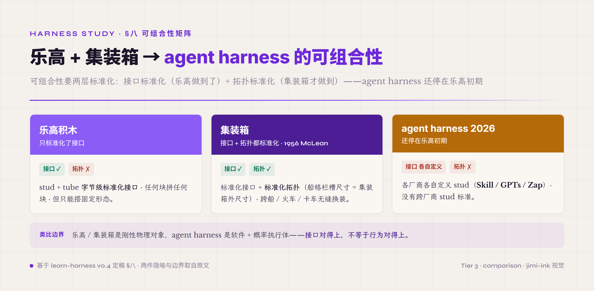
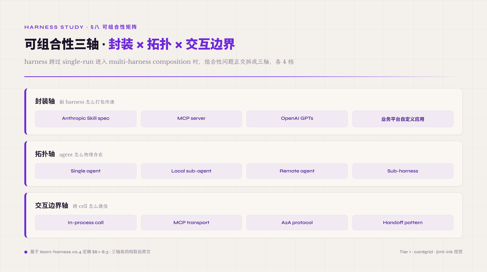
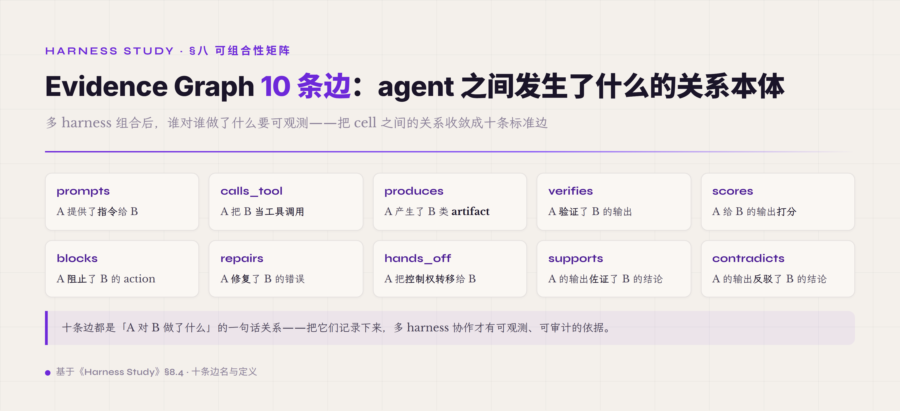
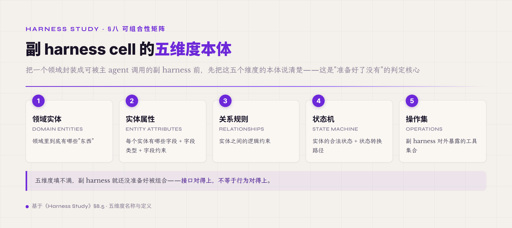

# 八、可组合性矩阵 · 封装 × 拓扑 × 交互边界

前面 §五-§七 把 agent harness 一次 run 跑起来的所有件都讲完了——8 件 runtime + 1 件 Safety 控制面 + 工程模式 + Harness Lab 工作台。但还有一个工程问题没回答 —— 一个跑得起来的 harness 怎么"打包发给别人"·怎么"在另一个 harness 里被调用"·怎么"跟其他 harness 拼出更复杂的系统"。这件事在业界 2026 没有共识答案——MCP / A2A / handoff 三个 protocol 各家都在推 · Anthropic Skill / OpenAI GPTs / Zapier zap / n8n workflow 几个封装格式各有各的死忠用户 · CrewAI / AutoGen / Letta 几个多 agent 框架在 topology 层各自做不同选择。读者读完前面七章建起的 harness mental model · 到这一档应该清楚——这件 fragmentation 不是临时现象 · 是 agent harness 工程跨过 single-run 边界后进入 cross-harness composition 的内在结构问题。本章把这件结构拆成三轴。

可组合性问题最直观的类比是 **乐高 + 集装箱** 两件叠在一起。乐高积木有 stud + tube 两件标准接口——任何乐高块都能跟任何乐高块拼 · 因为接口字节级标准化（横竖间距 + 圆柱直径 + 高度公差全部锁死）。但乐高只能搭固定形态——拼出来的东西是死的 · 不会自己往外伸接口。集装箱 1956 年 Malcolm McLean 标准化（20 ft / 40 ft × 8 ft × 8.5 ft 三件长宽高 + 角件 + 锁扣机制）· 让任何货物在任何运输方式之间（船 / 火车 / 卡车）能无缝换装。集装箱的关键不在装什么 · 在标准化接口 + 标准化拓扑（一艘船的格栏槽尺寸 = 集装箱外尺寸）· 接口 + 拓扑两件齐了 · 全球供应链才跑得起来。agent harness 可组合性在 2026 还停在乐高初期——几个厂商各自定义 stud（自己的 Skill / GPTs / Zap 格式）· 但没有跨厂商的 stud 标准。这件事让"副 harness 发给别人能跑起来"变成一个不能假设有解的工程问题 · 是本章三轴拆解的起点。类比的边界要注意——乐高 / 集装箱都是刚性物理对象 · agent harness 是软件 + 概率执行体 · 接口对得上不等于行为对得上——这是为什么三轴之外还要专门讲 Evidence Graph 跟 5 维度本体两件事。

*图 8.1 · 乐高与集装箱：接口标准化与拓扑标准化*

可组合性的工程价值不是"组件多就好"——是**封装边界 + 跨边界互操作两件配套**。封装边界让一个 harness 能独立演化 · 不污染其他 harness。跨边界互操作让独立演化出来的件能拼回来跑端到端任务。两件缺一件——只有边界没有互操作 · 系统等于一堆孤岛；只有互操作没有边界 · 改一个件全系统抖动。本章三轴分别对应 **打包传递怎么标准化**（封装轴）/ **跑起来怎么部署存在**（拓扑轴）/ **跨边界怎么通信**（交互边界轴）三件正交工程决策。这是 agent harness 工程从 single-run 跨入 multi-harness composition 的核心 framing。

*图 8.2 · 可组合性三轴：封装 × 拓扑 × 交互边界*

#### 8.0 本节首次出现的术语

前面 §一-§七 已经解释过的术语（harness 件 / Tool Registry / Skill / fork-join 等）下面不再重复。这里只列 §八 本节首次出现的术语。

**封装轴术语** —— **bundle**（配置打包格式 · 跟代码二进制相对 · 把一个副 harness 的 5 维度本体 + tool 选型 + prompt asset + verifier 配置打包成可传递的单元 · 跟 Docker 镜像同抽象层但内容不同）。**Skill spec**（Anthropic [Agent Skills](https://agentskills.io) 2025-10 初版 / 2025-12-18 open standard · frontmatter + body 两段式 · frontmatter 仅 name/description 必填 + allowed-tools/metadata 等少数可选字段 · 作者借它作副 harness 本体的简化载体）。**MCP server**（[Model Context Protocol](https://modelcontextprotocol.io) · Anthropic 2024-11 推 · 工具 + 资源 + prompt 三类 capability 标准化）。**OA 自定义应用**（钉钉 / 飞书 / 企业微信的自定义 API 工作流 · 业界办公场景副 harness 的事实标准）。

**拓扑轴术语** —— **拓扑**（topology · agent / harness 怎么物理存在 + 怎么相互连接 · 跟封装格式正交——同一封装可以不同拓扑跑 · 同一拓扑可以装不同封装件）。**single agent**（一个 harness 独立跑 · 没有 sub-agent · 业界 2026 主流 coding agent 起手式）。**local sub-agent**（fork-join 派生 · 同进程同 harness 配置 · 前面 §6.6 已讲）。**remote agent**（独立 process / service · 跨网络通信 · A2A 协议 / Anthropic Claude Code Bridge / OpenAI Responses API 这一类）。**sub-harness**（也叫副 harness · 独立部署的另一个 harness · 自带 5 维度本体 · 跟 sub-agent 同一进程同一 harness 配置不同）。**需要说明**：副 harness 跟下面的 5 维度本体是本教程提出的工程概念 · 不是业界统一术语 —— 业界有相近实践（领域特化 agent 封装 / Anthropic Skill 之类）但没有统一命名 · 这里用它来锚定"领域特化 harness 的最小完整单位"这件事。

**交互边界术语** —— **in-process call**（同进程函数调用 · 最快 · 最紧耦合 · 工程上跟 sub-agent 同档）。**MCP transport**（stdio / SSE / WebSocket 三档 · MCP server 跟 host 之间的通信方式）。**A2A protocol**（[Agent-to-Agent Protocol](https://a2aprotocol.com) · 跨厂商 agent 互操作标准 · 2025 提出 · 还在 evolve 中）。**handoff pattern**（OpenAI Agents SDK 2025-03 推的 multi-agent 协作 pattern · 前身是 2024-10 的实验性 Swarm · agent A 把控制权交给 agent B · 不是函数调用是 control flow transfer）。**Evidence Graph 10 边**（agent 系统跨件 + 跨 cell 关系本体 · 10 种边 · prompts / calls_tool / produces / verifies / scores / blocks / repairs / hands_off / supports / contradicts · 不进协议轴是独立的"可观测关系本体"）。

**5 维度本体术语** —— **副 harness cell**（一个领域特化 harness 的最小完整单位 · 5 维度本体齐才算是 cell · 缺维度的不算）。**5 维度本体**（领域实体 / 实体属性 / 关系规则 / 状态机 / 操作集 · 副 harness 的核心 schema · 跟"万能 prompt"常见误区相对）。**业务工作流 agent**（C 类 agent · 跟 coding agent / 办公自动化 agent / 客服 agent / RAG / multi-agent 并列六类之一 · 投标处理副 harness（9 状态机）/ 航旅订单处理 / 数据治理副 harness 都是典型）。

#### 8.1 第一轴 · 封装 · 副 harness 怎么打包传递

**封装是工程意义上的"打包格式"——副 harness 5 维度本体 + tool 选型 + prompt asset + verifier 配置等所有跑起来需要的东西怎么塞进一个可传递的单元里**。这件事在副 harness 产品化实践中是明确的——**传递的不是代码 · 可能是配置 bundle**。这件 framing 把封装问题从"怎么传二进制"换成"怎么传配置"——前者是部署问题 · 后者是工程接口问题。

封装的核心机制是**用配置代替代码 + 用标准化 schema 代替自由形式**。配置代替代码让副 harness 不绑 runtime 实现——同一个 Skill spec 在 Anthropic Claude / OpenAI GPT / DeepSeek V4 几个不同 provider 上跑出来都应该行为一致（虽然实际有 drift · 后面讲）。标准化 schema 让 LLM 能识别副 harness 的边界——什么时候该 invoke 这个 Skill / 该传什么参数 / 期望什么输出 · 不靠模糊推断靠明确字段。这两件结合让"副 harness 可传递"从 vague 想法变成可工程化的产物——发给别人一个 Skill bundle 文件 · 别人在自己的 harness 里 mount 起来 · 副 harness 就能跑。

封装轴在 2026 业界有四档主流格式 · 跟办公场景 + coding 场景两类 agent 的渊源不同。**第一档 · Anthropic Skill spec**（2025-10 初版 / 2025-12-18 open standard · frontmatter + body 两段式）—— 起源于 Claude Code 的 persistent instructions · 后扩展到所有 Claude 系列。Skill 的 frontmatter 字段不多（name / description 必填 + allowed-tools / metadata 等可选）· 作者把它当 5 维度本体的简化载体——真要表达完整本体得靠 body 正文跟挂上去的工具集 · 不是 frontmatter 字段本身。**第二档 · MCP server**（Anthropic 2024-11 推 · tools / resources / prompts 三类 capability · stdio / SSE / WebSocket 三档 transport）—— 起源于 IDE 集成场景 · 后扩展到通用 agent capability。MCP 的核心 framing 是 **provider 跟 consumer 分离**——server 提供能力 · host 决定怎么用 · 双方靠 JSON-RPC 协议契约。**第三档 · OpenAI GPTs / Custom GPTs**（2023-11 推 · instructions + tools + knowledge 三件式）—— 起源于 ChatGPT 平台 · 是消费者端最大规模副 harness 实验（百万级 GPTs 发布）。GPTs 跟 Skill 的关键区别——GPTs 强绑定 ChatGPT runtime · 不可移植到其他 provider。**第四档 · 业务平台自定义应用**（钉钉 / 飞书 / 企业微信 / Zapier / n8n / Make 等）—— 起源于 SaaS 工作流 · 不是为 agent 设计的 · 但事实上承担了 To B 办公场景副 harness 的角色。这一档跟前三档的关键区别——它是**workflow-first** 不是 **agent-first** · 流程编排在前 · LLM 调用在后。

四档格式哪一档值得当主要封装路径 · 取决于具体 harness 跑什么场景 + 部署在哪。Coding agent 场景 + Anthropic / OpenAI provider · Skill / MCP 是首选（这两档是为 agent 设计的标准化封装 · 直接对得上 5 维度本体）。To B 办公场景 + 已有钉钉 / 飞书集成 · 业务平台自定义应用是首选（不要绕开已有的企业基础设施）。需要跨多个 provider 传递的——MCP 是当前最接近"跨厂商"的（虽然实际跨厂商 adoption 还在早期）· 自己定义 JSON schema 是兜底方案。GPTs 当前不建议作主要封装——绑定太死 · 不可移植。这件选型流程不是抽象哲学——是工程上必须解决的 "**别人用我的副 harness 时该怎么 mount**" 问题。

封装轴常见误区有两件。**第一件 · 把封装格式当代码语言选**——业界经常看到讨论 "Skill 还是 MCP 好" 像在讨论 "Python 还是 Rust" 一样 · 把两件事当对立选项。机制级原因——Skill 跟 MCP 不在同一抽象层。Skill 是**指令 + 工具配套**的封装格式（一份 Skill 描述"做什么 + 用什么工具"）· MCP 是**工具能力**的传输协议（一个 MCP server 提供工具但不绑指令）。一个副 harness 完全可以——用 Skill 描述意图 + 调用 MCP server 提供的工具。判定线：当工程师讨论"Skill 还是 MCP"时 · 让他先回答"你副 harness 缺的是指令封装还是工具能力" · 大部分情况两件都缺 · 答案是两件都用。**第二件 · 业务平台自定义应用低估**——技术圈讨论 agent 封装基本不提钉钉 / 飞书 / 企业微信自定义应用 · 但 To B 实际落地 80% 在这上面。机制级原因——技术圈天然偏好"代码就在我手上 · 我能改的东西" · 而企业 SaaS 平台的"自定义应用"看起来像配置不像代码。但工程数据说明——企业实际部署的 agent 80% 跑在已有 OA / 协作平台上 · 不是单独部署 · 这件事不接受就跟不上 To B 实际场景。判定线：副 harness 准备给企业客户的——别绕开他们已有的 OA / 协作平台 · 否则部署阻力会让落地失败。

#### 8.2 第二轴 · 拓扑 · agent 怎么物理存在

**拓扑是工程意义上的"部署形态"——agent / harness 在生产里怎么物理存在 + 怎么相互连接**。工程实践里这一点是明确的——**副 harness 落地形态模块化**——独立 agent / 程序接口 / 后台模块 / 通用 UI 对话四类形态都是合法选择 · 落地形态本身就是产品决策。封装轴 + 拓扑轴正交——同一封装可以不同拓扑跑（一个 Skill 既能 inline 跑也能跑成独立 service）· 同一拓扑可以装不同封装件（一个 sub-agent 进程里能 mount Skill 也能 mount MCP）。

拓扑的核心机制是**用"独立程度"换"协作紧密度"**。Single agent 独立程度最低（什么都自己来）· 协作紧密度最高（所有 state 在一个进程里 · 没有跨边界开销）。Remote agent 独立程度最高（完全独立部署 · 独立 lifecycle）· 协作紧密度最低（每次跨边界通信都是一次 IPC / RPC）。这件 trade-off 让拓扑选择不能用"哪个好"回答——必须用"我这个 harness 在哪个 trade-off 点上"回答。Coding agent 跑 single-shot 任务的——single agent 最快最简单 · 别上 sub-agent。Multi-domain agent 跨多个领域的——sub-agent 或 sub-harness 是必要的 · 因为单个 agent 的 context 装不下所有领域知识。跨组织 agent 跨企业边界的——remote agent + A2A 是唯一选项 · 因为 in-process 跨组织没法做。

拓扑轴在业界 2026 有四档稳定形态 · 每档对应不同工程场景。**第一档 · Single agent**——一个 harness 独立跑 · 没有 sub-agent · 没有跨进程通信。这一档是业界 2026 主流 coding agent 的起手式（Claude Code 默认配置 / Codex 默认配置 / Cursor 默认配置 都是 single agent）。前面 fork-join 那节讲过 multi-agent 比普通 chat 多用约 15 倍 token——这件成本差让"什么时候上 sub-agent"成为高门槛工程决策 · 不该默认上。**第二档 · Local sub-agent**——fork-join 派生 · 同进程同 harness 配置 · 通过任务范围切分换并行。前面 §6.6 已经讲透了——3-5 个子任务并行写代码场景 ROI 是正的 · 单 token 增长任务（如纯写一段代码）ROI 是负的。**第三档 · Remote agent**——独立 process / service · 跨网络通信 · 跨 lifecycle 管理。这一档的代表是 Anthropic Claude Code Bridge（跨机器 agent 协作）/ OpenAI Responses API（agent-as-a-service）/ LangGraph Cloud（agent runtime hosting）。Remote agent 的关键工程问题——失败模式翻倍（网络故障 + agent 故障两层）· 必须有 retry / circuit breaker / fallback 三件齐。**第四档 · Sub-harness**——独立部署的另一个 harness · 自带 5 维度本体 · 通过 handoff / MCP / A2A 跟主 harness 协作。这一档是副 harness 产品化的核心 framing——一个 PPT harness 跟一个 Excel harness 是两个不同副 harness · 各自 5 维度本体不同 · 在主 harness 里被 handoff 调起来。Sub-harness 跟 sub-agent 的关键区别——sub-agent 是"同 harness 配置 + 不同任务范围"· sub-harness 是"不同 harness 配置 + 不同领域本体"。

拓扑轴选型流程要回答四个顺序问题。**第一**——你副 harness 跑的是单领域还是跨领域任务？单领域用 single agent 起步。**第二**——单领域里需不需要并行子任务加速？需要 + 子任务真正独立 + token 成本可接受 · 上 local sub-agent；其他情况留 single agent。**第三**——跨领域里副 harness 是不是需要独立 lifecycle？需要 · 上 sub-harness；不需要（只是 task scoping）· local sub-agent 已经够。**第四**——sub-harness 部署在哪？同机同进程——sub-harness inline mount；同组织不同 service——remote agent；跨组织——A2A protocol（但当前 A2A 还在 evolve · 跨组织 agent 协作建议保守）。这四问的顺序很重要——倒着回答容易跳过 "single agent 是不是已经够" 这个最关键的判断 · 直接上 multi-agent 是业界最常见的过度工程。

拓扑轴常见误区有两件。**第一件 · 把"agent 数量越多越显得 sophisticated"当工程标准**——业界 demo 经常看到 5-7 个 agent 协作的 fancy 架构 · 看起来很 sophisticated · 但跑同样任务 single agent 经常做得更好 + 成本更低。机制级原因——agent 数量增加带来三件成本（context 同步 / 决策 routing / 错误传播）都跟 agent 数量的平方增长。判定线——agent 数量 ≤2 + 任务真正可并行 + 子任务 ≥3 倍单 agent token——上 multi-agent 才有正 ROI；其他情况 single agent 更好。**第二件 · Sub-harness 跟 sub-agent 不分**——很多技术讨论把这两件混用 · 实际是两件不同的工程决策。机制级原因——sub-agent 跟主 harness 共享所有配置（同 model / 同 tool registry / 同 prompt asset）· sub-harness 自带独立 5 维度本体（不同领域 + 不同工具集 + 不同 prompt strategy）。判定线：你需要的是"任务范围切分"还是"领域知识切分"——前者用 sub-agent · 后者用 sub-harness。混用的代价——把领域知识硬塞进 sub-agent context 让主 harness context 爆 · 或者把同领域任务切成 sub-harness 让 handoff 开销吃掉性能。

#### 8.3 第三轴 · 交互边界 · 跨 cell 怎么通信

**交互边界是工程意义上的"通信协议层"——一个 harness cell 跟另一个 cell（sub-agent / sub-harness / remote agent / external tool）之间怎么传数据 + 怎么传控制权**。封装轴讲打包格式 · 拓扑轴讲部署形态 · 交互边界轴讲跨边界通信。三轴正交——同一封装 + 同一拓扑下 · 交互边界仍有四档选择。

交互边界的核心机制是**用"耦合紧密度"换"边界清晰度"**。In-process call 耦合最紧（同地址空间 · 直接函数调用 · 数据共享）· 边界最不清晰（一个件出错容易污染另一个件）。Handoff 耦合最松（控制权完全转移 · 不共享 runtime state）· 边界最清晰（每次 handoff 都是一次明确的 control transfer event）。这件 trade-off 让"什么时候用哪一档"变成具体工程问题——耦合紧密度跟错误隔离需求成反比 · 耦合紧密度跟通信效率成正比。

交互边界轴在业界 2026 有四档稳定协议 · 每档对应不同 isolation 需求。**第一档 · In-process call**——同进程函数调用 · 最快 · 最紧耦合。Local sub-agent 跟主 agent 之间走这一档 · 因为同 harness 配置不需要边界保护。前面 §6.4 Isolation Modes 那章讲过——InProcess 是默认起手 · 测试环境 + 同进程隔离已经够。**第二档 · MCP transport**（stdio / Streamable HTTP 两档 · 2025-03 spec 起用 Streamable HTTP 取代了初版的 HTTP+SSE）——Anthropic 2024-11 推的 Model Context Protocol · provider 跟 consumer 分离 · JSON-RPC 协议契约。MCP 的关键 framing 是 **工具能力跨 host 标准化**——一个 MCP server 实现一次 · 任何 MCP-compatible host（Claude Code / Cursor / IDE plugin）都能调。MCP 不传控制权——主 host 始终持有 agent loop · MCP server 只回答 capability invocation。**第三档 · A2A protocol**（Agent-to-Agent · 跨厂商 agent 互操作标准 · 2025 提出还在 evolve）——双向通信 · 双方都是 agent · 双方都有自己的 reasoning loop。A2A 比 MCP 高一档抽象——MCP 是 host-to-capability · A2A 是 agent-to-agent。A2A 的工程现状（2026）——spec 还在快速演化 · 实际 cross-vendor adoption 稀少 · 建议保守评估。**第四档 · Handoff pattern**（OpenAI Agents SDK 2025-03 推 · 前身是实验性 Swarm 2024-10）——agent A 把控制权完全转移给 agent B · 不是函数调用是 control flow transfer。Handoff 跟 A2A 的关键区别——A2A 双方对等 · Handoff 是单向 transfer · 转移后 agent A 不再持有控制权。Handoff 工程上的优势——错误隔离最强（agent A 出错不会污染 agent B）· 调试链路最清晰（每次 handoff 都是一次明确的 transition event）。

交互边界选型 vs 拓扑选型怎么对应。Single agent + local sub-agent——通常 in-process call 就够 · 不需要 MCP / A2A 这种重协议。Remote agent / sub-harness——必须有协议层 · 在 MCP / A2A / Handoff 三档里选。**Single capability provider 调用**（一个 service 提供工具能力 · 不持有控制权）——MCP 最契合。**双向 reasoning agent 协作**（两个 agent 都有自己的 loop · 互相 query）——A2A 是设计意图但 spec 不成熟时建议自己定义 JSON-RPC 兜底。**串行任务移交**（agent A 完成一段 · 完全转给 agent B）——Handoff pattern 最契合 · 隔离最强。这件对应关系不是绝对——业界看到很多 hybrid 实现（一个系统里同时跑 MCP + Handoff）· 但起步选一个主要协议比较好。

交互边界常见误区有两件。**第一件 · 把 MCP 当通用 agent 协议**——MCP 火了之后业界经常看到 "agent A 跟 agent B 通过 MCP 通信" 这种说法 · 是用法错位。机制级原因——MCP 的设计前提是 **host 持有 agent loop · server 只回答 capability**——server 不应该有自己的 reasoning loop · 不应该 push 控制权回 host。两个 agent 互相通信不符合这个前提——双方都有 reasoning loop · 没有明确的 host / capability 角色。判定线：你的通信场景里 · 谁持有 reasoning loop 谁不持有 · 持有方 = host · 不持有方 = capability provider · 这件分清后 MCP 适用 / 不适用就清楚了。**第二件 · A2A 协议过早 commit**——A2A spec 2025 提出 · 2026 还在快速演化（命名 / 字段 / 状态机几乎每个季度都改）· 但业界已经有项目把整个 cross-agent 通信架构建在 A2A 上。机制级原因——A2A 试图统一一件未成熟的领域（跨厂商 agent 协作） · 在 adopters 稳定之前 spec 难稳定。判定线：当前阶段（2026）跨厂商 agent 协作 · 建议自己定义 JSON-RPC schema + 把 schema 文档化作为内部标准 · 不要把整个架构绑在外部 evolving 标准上 · 等 A2A spec 稳定（adopters 收敛 + spec 半年不大改）再 migrate。治理面有一个值得记的更新——A2A 2025-06 已捐入 Linux Foundation · 从单厂商主导转为中立基金会治理。这是"等 spec 稳定"判定线上的正向信号（治理中立通常是 adopters 收敛的前置条件）· 但截至本卷成稿 spec 仍在演化 · 判定线不变。

#### 8.4 Evidence Graph 10 边 · 可观测关系本体

前面 8.1 / 8.2 / 8.3 讲三轴——封装 + 拓扑 + 交互边界。但还有一件**跨件 + 跨 cell 关系本体**没装进任何一轴——一个 agent 系统跑起来后 · "谁调谁 / 谁产生什么 / 谁验证什么 / 谁挡了什么" 这件关系网络不是协议（不是 MCP / A2A / Handoff）· 不是拓扑（不是 single / sub-agent / remote）· 也不是封装（不是 Skill / MCP / GPTs）——是 **agent 系统跑起来后的可观测关系本体**。这件事独立于三轴 · 单独作为一段讲。

Evidence Graph 10 边把 agent 系统跑起来后的关系网络系统化。每条边对应一种 "**A 件 / cell 对 B 件 / cell 做了什么**" 的可观测关系——前面 §5.7 trajectory 那章每个 event 都能映射到 Evidence Graph 的某条边上。**第一条 · prompts**——A prompts B 表示 "A 件 / cell 提供了指令给 B 件 / cell"。最典型——Prompt Assets 件 prompts Agent Loop 件（前面 §5.5 讲）；主 harness prompts sub-harness（一个 PPT harness 拿到主 harness 的"做幻灯片"指令）。**第二条 · calls_tool**——A calls_tool B 表示 "A 件 / cell invoked 了 B 件 / cell 作为工具"。最典型——Agent Loop 件 calls_tool Tool Registry 件；主 agent calls_tool sub-agent（通过 handoff）。**第三条 · produces**——A produces B 表示 "A 件 / cell 产生了 B 类 artifact"。最典型——Agent Loop produces TrajectoryRecord；Verifier produces score；副 harness produces report artifact。**第四条 · verifies**——A verifies B 表示 "A 件 / cell 验证了 B 件 / cell 的输出"。最典型——Verifier 件 verifies Agent Loop 件 produces 的 artifact；前面 §5.8 讲的 verifier 三层都对应 verifies 边。**第五条 · scores**——A scores B 表示 "A 件 / cell 给 B 件 / cell 输出打分"。最典型——Outcome Judge LLM scores agent run；reward model scores trajectory（前面 §7.3 Score 那章讲）。

剩余五条边补完可观测关系本体的另一半。**第六条 · blocks**——A blocks B 表示 "A 件 / cell 阻止了 B 件 / cell 的 action"。最典型——Safety 控制面 blocks Agent Loop（前面 §5.9 ToolBlocked 那段讲）；hook 拒绝某个 tool invocation。Blocks 边在 trajectory 里是非常重要的信号——absence of blocks 也是信号（前面"absence-of-event-as-bug-signal"那段讲）· 该 block 没 block 是一类 bug · 不该 block 却 block 是另一类 bug。**第七条 · repairs**——A repairs B 表示 "A 件 / cell 修复了 B 件 / cell 的错误"。最典型——前面 §5.2 讲的 contract repair（model adapter 修复 schema violation）；前面 §6.6 fork-join 失败后的 retry 路径。**第八条 · hands_off**——A hands_off B 表示 "A 件 / cell 把控制权转移给了 B 件 / cell"。最典型——main agent hands_off sub-harness；sub-task agent hands_off back to main agent after completion。Hands_off 边是前面 8.3 讲的 Handoff pattern 的可观测投影——每次 handoff 在 trajectory 里都对应一条 hands_off 边。**第九条 · supports**——A supports B 表示 "A 件 / cell 的输出佐证了 B 件 / cell 的结论"。最典型——多个 verifier source 都同意一个结论；前面 §5.8 讲的 Claw-Eval 三路证据互相 supports。**第十条 · contradicts**——A contradicts B 表示 "A 件 / cell 的输出反驳了 B 件 / cell 的结论"。最典型——agent 自报"任务完成"但 verifier contradicts；两个 sub-agent 给出冲突结论。Contradicts 边是 agent 系统里**最有价值的诊断信号之一**——所有 silent failure / artifact claim mismatch 类问题都对应 contradicts 边没被检测到的情况。

*图 8.3 · Evidence Graph 的十条关系边*

10 边为什么不进三轴而单独抽出来——核心原因是抽象层不同。三轴讲**系统怎么搭起来**（静态结构）· Evidence Graph 讲**系统跑起来后发生什么**（动态关系）。同一个系统结构能产生不同的 Evidence Graph 实例——比如同一个 main agent + sub-agent 拓扑 · 一次 run 产生 5 条 calls_tool + 2 条 hands_off · 另一次 run 产生 8 条 calls_tool + 3 条 hands_off · 这件 graph 形态变化反映了 agent 实际行为的变化 · 不反映系统结构变化。Evidence Graph 是前面 §5.7 trajectory 跟 §七 Harness Lab Observe 层的核心数据 schema——每条 trajectory event 都应该映射到一条 Evidence Graph 边 · 让 trajectory 不只是 raw log 而是 structured relational data · 这是工业级 trajectory replayability + ablation 的前提条件。

#### 8.5 副 harness cell 5 维度本体

前面 8.1 封装轴讲过——副 harness 5 维度本体是 Skill spec / 业务平台自定义应用等封装格式的核心 schema。这里把 5 维度展开讲——副 harness 跟"万能 prompt"的工程区别就在这 5 维度齐不齐上。

**第一维度 · 领域实体**（domain entities）——副 harness 服务的领域里有哪些"东西"。PPT 制作副 harness 的实体——slide / layout / content_block / animation / theme 五类。数据治理副 harness 的实体——table / column / metric / dimension / time_filter 五类。机制级原因——实体定义让 LLM 在副 harness 里有明确的"操作对象" · 不是面对模糊的 "做 PPT" 而是明确的 "操作 slide 实体上的 content_block 属性"。**第二维度 · 实体属性**（entity attributes）——每个实体有哪些字段 + 字段类型 + 字段约束。slide 实体的属性——title (string) / layout_type (enum) / content (block[]) / animations (list)。column 实体的属性——null_pct (float 0-1) / distinct_count (int) / type (sql_type) / sample (string) / family (string)。属性定义让 LLM 知道操作实体时 **能改什么 / 不能改什么 / 改了什么意思** · 不靠模糊推断靠明确 schema。**第三维度 · 关系规则**（relationships）——实体之间的逻辑约束。PPT 副 harness 的关系规则——layout 决定 content_block 类型 + animation 必须匹配 theme + slide 顺序必须连续。数据治理副 harness 的关系规则——KNOWN_PREFIXES 跟 dimension family 对应 + CONTAMINATED_FILTERS 不允许出现。关系规则让 LLM 在生成内容时不违反领域约束——不是写代码硬 enforce · 是 schema 层指引让 LLM "做对了的概率" 提高。**第四维度 · 状态机**（state machine）——实体的合法状态 + 状态转换路径。PPT 副 harness 状态机——slide: draft → review → approved → exported。投标处理副 harness 状态机——9 个状态（CREATED → BID_UPLOADED → BID_ANALYZED → ... → ARCHIVED）。机制级原因——状态机让 agent 知道"现在在哪一档 / 下一步能去哪 / 不能去哪" · 防止 agent 跳过中间环节直接到末态（最常见的副 harness bug）。**第五维度 · 操作集**（operations）——副 harness 暴露的工具集合。PPT 副 harness 操作——create_slide / update_layout / apply_theme / export_pptx 等。数据治理副 harness 操作——一组脚本对应 6 phase 流水线。操作集让副 harness 边界明确——LLM 知道在这个副 harness 里**只能做这些事** · 不会越界做其他。

*图 8.4 · 副 harness cell 的五维度本体*

5 维度齐了 vs 只齐 1-2 维度的工程差距非常显著。本教程配套实现项目早期设计记录过一个反例——**IntentRouter 常见误区**。早期设计 IntentRouter 让 LLM 自己决定走哪条 prompt path · 没有 5 维度本体——LLM 自由发挥 · 跑下来 Skill 频率高 + Tool 频率低 · IntentRouter 没价值。后改成 Skill 即副 harness——每个 Skill 自带 frontmatter（name / description + 可选字段）加 body 正文承载 5 维度本体的简化形式——结果跨实例一致性 + 可演化性 + 可独立迭代三件齐了。这件正反对照说明——5 维度本体不是"哲学正确" · 是工程上"副 harness 能不能稳定跑起来"的硬约束。

副 harness cell 5 维度本体跟三轴的关系——三轴是**怎么传 / 怎么部署 / 怎么通信**（外部接口）· 5 维度是**cell 内部装什么**（内部结构）。两件配套才让副 harness 工程化——外部接口让别人用得起来 · 内部结构让自己改得动。常见误区——只关注外部接口（搞 Skill spec / MCP server）忽略内部结构（不写 5 维度只写 prompt）。机制级原因——内部 5 维度才是副 harness 的真实价值——外部接口是表层 · 接口标准化了不代表 cell 内部就 work。判定线——副 harness 设计完成度 ≈ 5 维度齐全度。少 1 维度算 80% 完成 · 少 2 维度算 40% · 少 3 维度算"还在 prompt 阶段"——这件判定线让"副 harness 准备好了没"从主观判断变成可数维度。

#### 8.6 常见误区 · 工作台组合三类

可组合性矩阵在业界 2026 落地最常见的三件常见误区 · 每件机制 + 数据 + 判定三件齐。

**第一件 · 万能 prompt 替代 5 维度本体** —— 工程师面对一个新场景常见做法是写一个 5000 字 system prompt 描述领域 + 让 LLM 自由发挥 · 不建副 harness cell · 没有 5 维度本体。为什么 5 维度本体比万能 prompt 一致性高（prompt 每次 invocation 重新解释领域规则 · 本体把规则固化在 schema 里每次按同一份跑），前面 5 维度本体那节连 IntentRouter 反例一起讲过 · 这里只给判定线：副 harness 设计文档里有没有 5 维度本体 schema · 没有 → 还在 prompt 阶段 · 不算副 harness。

**第二件 · 拓扑选过头** —— 工程师上来就上 multi-agent / sub-harness 架构 · 没先验证 single agent 是不是够。机制级原因——技术圈把 multi-agent 当 sophistication 标志 · 把 single agent 当 "naive" 起点 · 这件偏见让选型阶段直接跳过 single agent 评估。但 single agent 是 agent 工程的 Pareto 起点——80% 场景 single agent 已经够 · 而 multi-agent 比普通 chat 多用约 15 倍 token（成本拆解和"coding 任务尤其别上"的理由，前面 Over-Decomposition 与 fork-join 两节都讲过）。判定线：上 sub-agent / sub-harness 之前先回答两件——第一 · single agent 跑这个任务 N=10 run 通过率是多少？没跑过 → 先跑 single agent；跑过了 + 通过率 ≥80%——别上 multi-agent · 优化 single agent 更值。

**第三件 · 协议选过早** —— 工程师在 cross-agent 通信场景上来就 commit A2A 这种 evolving 标准 · 没保留 fallback 路径。机制级原因——业界 2026 跨厂商 agent 协作还在标准化早期——A2A spec 几个月改一次 / MCP 主要服务 host-capability 不是 agent-agent · 没有稳定的跨厂商协议。Commit 到 evolving 标准的代价——spec 改了系统要跟着改 · ROI 非常低。业界数据——MCP 2024-11 推出后到 2026-05 出了 4 个 dated spec 版本（2024-11 / 2025-03 / 2025-06 / 2025-11）· 其中 2025-03（换 transport + 加 auth）跟 2025-06（删 JSON-RPC batching）都带 breaking change · 早期 adopter 跟着改了好几轮。判定线：跨厂商 agent 通信 · 当前阶段（2026）建议自己定义 JSON-RPC schema · 文档化作内部标准 · 等外部 spec 稳定（adopters 收敛 + 半年不大改）再 migrate · 不要直接 commit 在 evolving 标准上。

#### 8.7 起步建议 · 四维度

**注意什么** —— 可组合性矩阵落地最大的坑是 **过早做组合**——在主 harness 还没稳定的时候就上副 harness + multi-agent + cross-vendor 协议。具体几条警示信号：**第一**主 harness 自己单 task 通过率 <80% · 这时上副 harness · 副 harness 的不稳定性叠加主 harness 的不稳定性 · 整体通过率会更差；**第二**还没有 stable Skill / MCP server / GPTs 任何一档封装跑 production · 这时讨论 "用哪一档封装" 没有意义——先在自己 harness 里跑 inline 副 harness（不打包不传递）· 跑稳了再讨论封装；**第三**没有 trajectory + Evidence Graph 基础设施 · 上 multi-agent 跨件 call 的 debug 链路会断 · 多 agent 互相 blame 没办法定位。这三件信号任一中招——回到 single agent + inline 副 harness · 别上组合架构。

**怎么设计** —— 按 **5 阶段渐进引入** 路径 · 不一次性上三轴。**第一阶段 · Single agent + inline 副 harness 5 维度本体**（写 5 维度本体当代码内部 schema · 不打包不传递 · 1-2 周）——这是验证副 harness mental model 的最快路径。**第二阶段 · 单独封装 Skill / 平台自定义应用**（把 5 维度本体打包成 Skill spec 或 钉钉 / 飞书自定义应用 · 1-2 周）——验证封装格式跑得通。**第三阶段 · MCP server 提供共享工具**（把工具能力从 inline 抽到 MCP server · 让多个 host 都能用 · 2-4 周）——验证跨 host 互操作。**第四阶段 · Local sub-agent fork-join 加并行**（前面 §6.6 讲过 · 3-5 个子任务真正可并行 · 2-4 周）——验证拓扑层的并行模式。**第五阶段 · Remote agent / sub-harness 跨进程**（独立 lifecycle + Handoff / 自定义 JSON-RPC · 1-2 月）——验证跨进程组合。第六阶段（跨厂商 A2A）当前不建议上——等 spec 稳定。这件渐进顺序让每阶段都解决一个真实问题 · 不是"为了三轴齐全"上 pattern。

**怎么测试** —— 可组合性矩阵的测试主要是 **跨件 / 跨 cell 行为测试** 而不是单元测试。**第一类 · 5 维度本体覆盖测试**——给副 harness 跑 30+ task instance · 看 5 维度（实体 / 属性 / 关系规则 / 状态机 / 操作集）每一维度都被 invocation 覆盖到没——某维度从来没被用到 · 说明这维度可能是 over-engineering · 或者 task 集没覆盖到它的使用场景；**第二类 · 跨封装格式可移植性测试**——同一个副 harness 5 维度本体打包成 Skill / MCP / 自定义应用三档分别在不同 host 上跑——行为不一致说明封装层有 leak；**第三类 · 拓扑切换回归测试**——同一个副 harness 在 single agent 跟 sub-agent 两种拓扑下跑同一份 task 集——通过率差异显著说明拓扑层有耦合问题（理论上同副 harness 不同拓扑应该结果一致）；**第四类 · Evidence Graph 完整性测试**——拿 trajectory replay · 看 10 条边是不是都有 event 映射到——某条边从来没出现（比如永远没有 contradicts 边）说明 trajectory schema 漏了 · 或者副 harness 系统设计漏了 verifier 关键件。

**写什么 prompt** —— 可组合性矩阵层的 prompt 主要分两类。**第一类 · 副 harness 自己的 prompt asset**——按前面 §5.5 讲的 P0-P5 优先级写 · 但要在 prompt 里**明示这个副 harness 的 5 维度本体边界**（"你正在 PPT 副 harness 里 · 实体只有 slide / layout / content_block / animation / theme 五类 · 操作只能从 create_slide / update_layout / apply_theme / export_pptx 集合里选"）· 这件 prompt 纪律让 LLM 知道副 harness 边界 · 不在副 harness 里越权操作其他领域；**第二类 · 主 harness 跟副 harness 之间的 routing prompt**——告诉主 harness LLM "什么时候 invoke 哪个副 harness"——这件 prompt 的几条工程纪律 ——**第一**routing 决策基于 task 实体特征不基于 task 描述模糊文本（"这个 task 涉及 PPT 实体 → 走 PPT 副 harness"比"这个 task 看起来像做 PPT → 走 PPT 副 harness"更稳定）；**第二**routing 不引入新副 harness——主 harness 只能 invoke 已经 mount 的副 harness · 不能凭空创建；**第三**每次 routing 决策写进 trajectory · 让"主 harness 为什么走 A 副 harness 不走 B" 可审计。这件 prompt 纪律配套前面 §5.5 Prompt Assets 那章工程纪律 · 让组合架构跑起来后路由决策可解释。

---

§八 可组合性矩阵的核心 framing 收束在三件上。**第一件** —— 三轴正交（封装 × 拓扑 × 交互边界）是 agent harness 跨过 single-run 进入 multi-harness composition 的核心结构。封装讲 "怎么打包传递" · 拓扑讲 "怎么部署存在" · 交互边界讲 "跨边界怎么通信"——三轴正交意味着同一个副 harness 在三轴上能独立选择 · 不互相绑定。理解这件正交性是工程上"用三轴矩阵设计副 harness"的前提——把封装跟拓扑混在一起选 / 把拓扑跟协议混在一起选 · 都会让某一轴的选项无端被锁死。**第二件** —— Evidence Graph 10 边 + 副 harness cell 5 维度本体 是三轴之外的两件配套抽象——10 边讲 agent 系统跑起来后的动态关系本体 · 5 维度讲副 harness cell 内部静态结构。三轴 + 10 边 + 5 维度三件齐才是 agent harness 可组合性的完整 mental model · 缺任一件读者建不起完整模型。**第三件** —— 业界 2026 在可组合性上还在乐高早期——几个厂商各自做 stud 但没有跨厂商标准（Skill / GPTs / Zap / 自定义应用都不互通）。读者读这一章要清楚 "现在业界这件 fragmentation 是预期不是 bug"——不是某一家做得不好——是整个领域还没收敛到集装箱式标准化。工程上的应对策略是**保守 commit + 内部标准化**：在公司 / 项目内部按一套自己的副 harness schema 跑——5 维度本体齐 + 至少一档封装 + 至少一档拓扑跑 production · 等业界跨厂商标准稳定后再 migrate。

写完这一章读者应该建可组合性矩阵 mental model · 在自己项目里：第一 · 识别现在副 harness 在三轴上各自选了哪一档；第二 · 判定 5 维度本体齐了几维度；第三 · 看到业界 Skill / MCP / GPTs / A2A / Handoff 等抽象时能正确归位（哪一轴 / 哪一档 / 是否 evolving）；第四 · 避开万能 prompt / 拓扑选过头 / 协议选过早三件常见误区；第五 · 按 5 阶段渐进引入路径搭可组合架构 · 不一次性全上。可组合性矩阵不是一次跑完的工程项目——是 3-6 月渐进搭起来的工程基础设施 · 读者把它当长期建设方向看 · 不是 short-term 部署目标。
