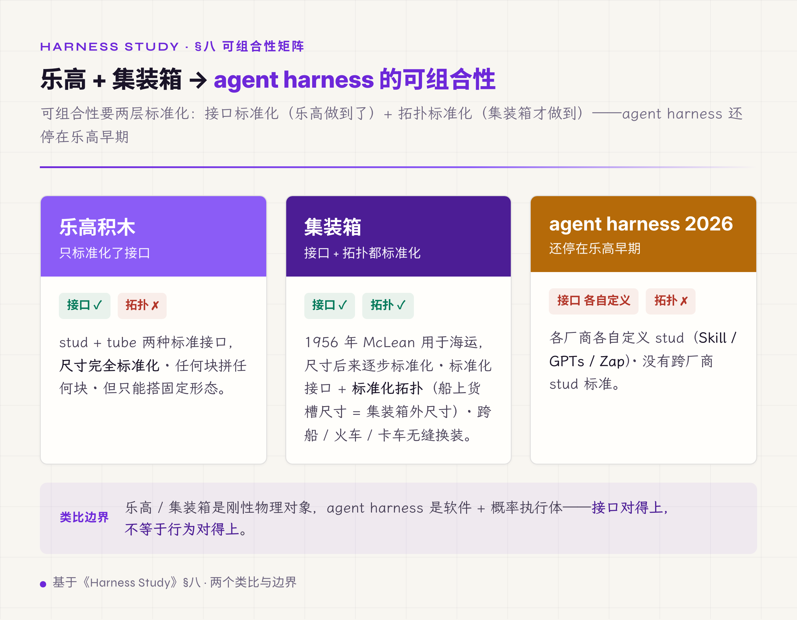
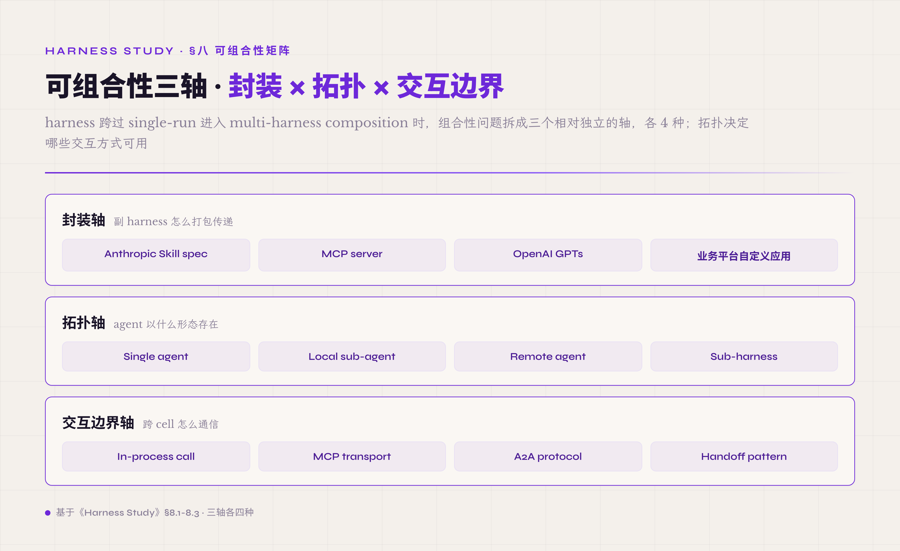
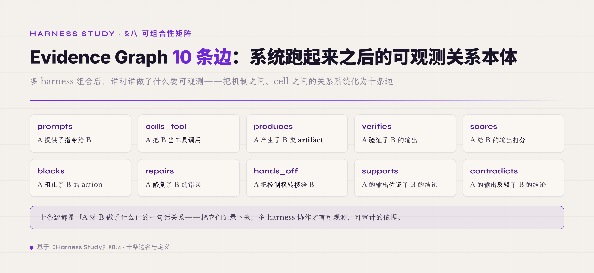
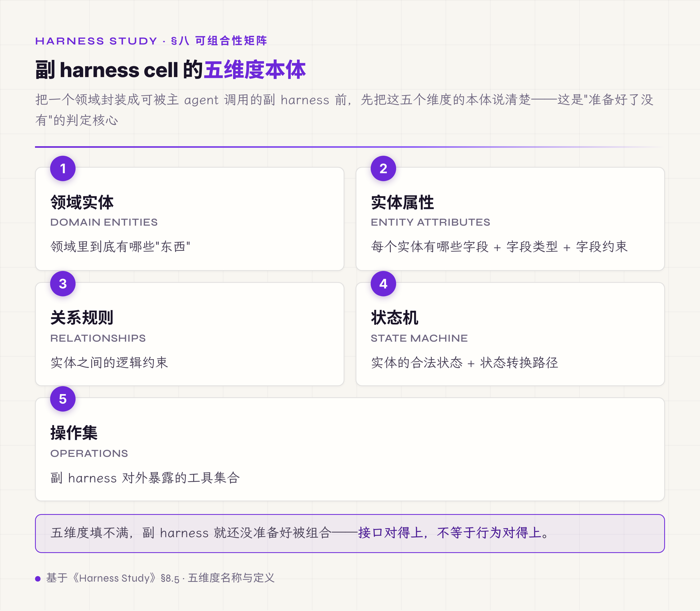

# 八、可组合性矩阵 · 封装 × 拓扑 × 交互边界

前面第五到七章把 agent harness 跑一次 run 所需的部分都讲完了：8 个 runtime 机制、1 个 Safety 控制面、工程模式和 Harness Lab 工作台。但还有一个工程问题没回答：一个跑得起来的 harness，怎么"打包发给别人"，怎么"在另一个 harness 里被调用"，怎么"和其他 harness 拼出更复杂的系统"。2026 年业界在这件事上没有共识：

- 协议：MCP、A2A、handoff 三种各有厂商在推；
- 封装格式：Anthropic Skill、OpenAI GPTs、Zapier zap、n8n workflow 各有各的忠实用户；
- 多 agent 框架：CrewAI、AutoGen、Letta 在拓扑上各自做了不同选择。

读完前七章、建立起 harness 的整体模型之后，读者应当能看清：这种碎片化不是临时现象，而是 agent harness 工程跨出单次 run、进入跨 harness 组合之后的内在结构问题。本章把这个结构拆成三个轴。

可组合性最直观的类比是**乐高加集装箱**。乐高积木靠凸点（stud）和底管（tube）两种标准接口，任何一块都能和另一块拼上，因为接口尺寸完全标准化（间距、圆柱直径、高度公差全部锁死）。但乐高只能搭固定形态，拼出来的东西不会自己往外伸接口。集装箱从 1956 年 Malcolm McLean 用于海运开始推广，尺寸后来逐步标准化（长 20 英尺或 40 英尺、宽 8 英尺、高 8.5 英尺，加上角件与锁扣），任何货物都能在船、火车、卡车之间无缝换装。集装箱的关键不在装什么，而在接口和拓扑同时标准化（船上货槽的尺寸就等于集装箱外尺寸），两者齐了，全球供应链才跑得起来。2026 年 agent harness 的可组合性还停在乐高早期：几个厂商各自定义自己的"凸点"（Skill、GPTs、Zap 格式），但没有跨厂商的标准。所以"副 harness 发给别人就能跑"不能假设有解，这是本章三轴拆解的起点。

类比也有边界：乐高和集装箱都是刚性物理对象，agent harness 是软件加概率性的执行体，接口对得上不等于行为对得上。这就是为什么三轴之外，本章还要专门讲 Evidence Graph 和五维度本体。

*图 8.1 · 乐高与集装箱：接口标准化与拓扑标准化*

可组合性的工程价值不在于组件多，而在于**封装边界与跨边界互操作两者配套**。封装边界让一个 harness 能独立演化，不污染其他 harness；跨边界互操作让独立演化出来的部分能重新拼起来，跑端到端任务。缺了任何一个都不行：只有边界没有互操作，系统是一堆孤岛；只有互操作没有边界，改一处全系统跟着抖。本章的三个轴对应三个相对独立的工程决策：

- **封装轴**：打包传递怎么标准化；
- **拓扑轴**：跑起来以什么形态部署；
- **交互边界轴**：跨边界怎么通信。

这是 agent harness 工程从单次 run 进入多 harness 组合时的核心框架。

*图 8.2 · 可组合性三轴：封装 × 拓扑 × 交互边界*

#### 8.0 本节首次出现的术语

第一到七章已经解释过的术语（harness 的各个机制、Tool Registry、Skill、fork-join 等）下面不再重复，这里只列本章首次出现的术语。

**封装轴术语**

- **bundle**：配置打包格式，与代码二进制相对。它把一个副 harness 的五维度本体、工具选型、prompt 资产和 verifier 配置打包成可传递的单元，和 Docker 镜像处在同一抽象层，但装的内容不同。
- **Skill spec**：Anthropic 的 [Agent Skills](https://agentskills.io)，2025-10 发布初版，2025-12-18 成为开放标准。采用 frontmatter 加正文两段式；frontmatter 只有 name、description 必填，另有 allowed-tools、metadata 等少数可选字段。作者用它作为副 harness 本体的简化载体。
- **MCP server**：[Model Context Protocol](https://modelcontextprotocol.io)，Anthropic 2024-11 推出，把工具、资源、prompt 三类能力标准化。
- **OA 自定义应用**：钉钉、飞书、企业微信上的自定义 API 工作流，是国内办公场景承载副 harness 的常见做法。

**拓扑轴术语**

- **拓扑（topology）**：agent 或 harness 以什么形态存在、彼此怎么连接。它和封装格式相对独立：同一种封装可以用不同拓扑跑，同一种拓扑也可以装不同封装。
- **single agent**：一个 harness 独立运行，没有子 agent。这是 2026 年主流 coding agent 的起步形态。
- **local sub-agent**：用 fork-join 派生，与主 agent 同进程、同一套 harness 配置（见 §6.6）。
- **remote agent**：独立的进程或服务，跨网络通信，例如 A2A 协议、Anthropic Claude Code Bridge、OpenAI Responses API 这一类。
- **sub-harness**（本书也称"副 harness"）：独立部署的另一个 harness，带自己的五维度本体。它和 sub-agent 的区别在于：sub-agent 与主 harness 同进程、同配置，sub-harness 配置不同。

需要说明：副 harness 和下面的五维度本体是本书提出的工程概念，不是业界统一术语。业界有相近实践（领域特化的 agent 封装、Anthropic Skill 等），但没有统一命名。本书用"副 harness"指**按任务调起的、带领域规则的子 harness，是领域特化 harness 的最小完整单位**。

**交互边界术语**

- **进程内调用（in-process call）**：同进程函数调用，最快，耦合最紧，工程上与 sub-agent 属于同一类。
- **MCP 传输（MCP transport）**：MCP server 与 host 之间的通信方式。标准传输只有两种：stdio 与 Streamable HTTP（2025-03-26 版规范起取代了初版的 HTTP+SSE）。
- **A2A 协议**（Agent-to-Agent Protocol）：跨厂商的 agent 互操作协议，Google 2025 年提出，现由 Linux Foundation 托管，仍在演进。
- **handoff 模式**：OpenAI Agents SDK 2025-03 推出的多 agent 协作模式，前身是 2024-10 的实验性项目 Swarm。agent A 把控制权交给 agent B，这是控制流的转移，而不是函数调用。
- **Evidence Graph 十条边**：描述 agent 系统中机制之间、cell 之间关系的一组边，共十种：prompts、calls_tool、produces、verifies、scores、blocks、repairs、hands_off、supports、contradicts。它不属于协议轴，是独立的"可观测关系本体"。

**五维度本体术语**

- **本体**：借用知识工程中"本体（ontology）"一词，那里指概念、关系及语义约束的形式化体系；本书用它指**领域模型的 schema**。
- **副 harness cell**：一个领域特化 harness 的最小完整单位。五个维度的本体都齐才算一个 cell，缺维度的不算。
- **五维度本体**：领域实体、实体属性、关系规则、状态机、操作集，是副 harness 的核心 schema，与"万能 prompt"这种反模式相对。
- **业务工作流 agent**：本书划分的六类 agent 之一（C 类），与 coding agent、办公自动化 agent、客服 agent、RAG、多 agent 系统并列。投标处理副 harness（9 个状态的状态机）、航旅订单处理、数据治理副 harness 都是典型例子。

#### 8.1 第一轴 · 封装 · 副 harness 怎么打包传递

**封装在工程上就是"打包格式"：副 harness 的五维度本体、工具选型、prompt 资产、verifier 配置等跑起来所需的一切，怎么装进一个可传递的单元。** 在副 harness 的产品化实践中，这一点是明确的：**传递的不是代码，更可能是配置 bundle**。这样一来，封装问题就从"怎么传二进制"变成了"怎么传配置"：前者是部署问题，后者是工程接口问题。

封装的核心机制是**用配置代替代码，用标准化 schema 代替自由形式**：

- 用配置代替代码，副 harness 就不绑定某个 runtime 实现。同一个 Skill spec 在 Anthropic Claude、OpenAI GPT、DeepSeek V4 等不同 provider 上跑，行为理应一致（实际会有漂移，后面讲）。
- 用标准化 schema，LLM 能识别副 harness 的边界：什么时候该调用这个 Skill、该传什么参数、期望什么输出，都靠明确字段，而不靠模糊推断。

两者结合，"副 harness 可传递"就从一个模糊想法变成了可以工程化的产物：发给别人一个 Skill bundle 文件，对方在自己的 harness 里挂载（mount）起来，副 harness 就能跑。

2026 年业界的封装格式主要有四类，分别来自办公场景和 coding 场景：

1. **Anthropic Skill spec**（2025-10 初版，2025-12-18 成为开放标准，frontmatter 加正文两段式）。起源于 Claude Code 的持久指令，后来扩展到整个 Claude 产品线。Skill 的 frontmatter 字段不多（name、description 必填，allowed-tools、metadata 等可选），作者把它当作五维度本体的简化载体：真要表达完整本体，靠的是正文和挂上去的工具集，而不是 frontmatter 字段本身。
2. **MCP server**（Anthropic 2024-11 推出，提供 tools、resources、prompts 三类能力，标准传输为 stdio 与 Streamable HTTP）。起源于 IDE 集成场景，后来扩展为通用的 agent 能力接口。MCP 的核心思路是**提供方与使用方分离**：server 提供能力，host 决定怎么用，双方靠 JSON-RPC 协议约定。
3. **OpenAI GPTs / Custom GPTs**（2023-11 推出，由 instructions、tools、knowledge 三部分组成）。起源于 ChatGPT 平台，是消费者端规模最大的副 harness 实验。它和 Skill 的关键区别在于强绑定 ChatGPT runtime，不能移植到其他 provider。
4. **业务平台自定义应用**（钉钉、飞书、企业微信、Zapier、n8n、Make 等）。起源于 SaaS 工作流，本来不是为 agent 设计的，但实际承担了 To B 办公场景的副 harness 角色。它和前三类的关键区别是**先有工作流，再接 agent**：流程编排在前，LLM 调用在后。

四类格式里选哪一类作为主要封装路径，取决于 harness 跑什么场景、部署在哪：

- coding agent 场景，provider 是 Anthropic 或 OpenAI：首选 Skill 或 MCP。这两类是为 agent 设计的标准化封装，能直接对应五维度本体。
- To B 办公场景，客户已有钉钉或飞书集成：首选业务平台自定义应用，不要绕开企业已有的基础设施。
- 需要跨多个 provider 传递：MCP 是目前最接近跨厂商的方案（尽管跨厂商的实际采用还在早期），自己定义 JSON schema 作兜底。
- GPTs 目前不建议作为主要封装：绑定太死，不可移植。

这个选型流程不是抽象讨论，它要解决的是一个实际问题：**别人用我的副 harness 时，该怎么挂载**。

封装轴有两个反模式。

**第一个：把封装格式当编程语言来选。** 业界常见"Skill 好还是 MCP 好"的讨论，就像讨论"Python 好还是 Rust 好"，把两者当成对立选项。原因在于 Skill 和 MCP 不在同一抽象层：Skill 是**指令加配套工具**的封装格式（一份 Skill 描述"做什么、用什么工具"），MCP 是**工具能力**的传输协议（一个 MCP server 提供工具，但不带指令）。一个副 harness 完全可以用 Skill 描述意图，再调用 MCP server 提供的工具。判断方法：有人讨论"Skill 还是 MCP"时，先请他回答"你的副 harness 缺的是指令封装还是工具能力"。多数情况下两者都缺，答案是两者都用。

**第二个：低估业务平台自定义应用。** 技术圈讨论 agent 封装时基本不提钉钉、飞书、企业微信的自定义应用，但在作者观察到的 To B 项目中，多数 agent 跑在客户已有的 OA 或协作平台上，而不是单独部署。原因在于技术圈天然偏好"代码在自己手上、自己能改"的东西，而企业 SaaS 平台的自定义应用看起来像配置、不像代码。不接受这个现实，就跟不上 To B 的实际场景。判断方法：副 harness 如果要交付给企业客户，不要绕开客户已有的 OA 或协作平台，否则部署阻力会让项目落不了地。

#### 8.2 第二轴 · 拓扑 · agent 以什么形态存在

**拓扑在工程上就是"部署形态"：agent 或 harness 在生产环境里以什么形态存在，彼此怎么连接。** 工程实践里这一点也是明确的：**副 harness 的部署形态是模块化的**，独立 agent、程序接口、后台模块、通用对话界面四种形态都是合法选择，选哪种本身就是产品决策。封装轴与拓扑轴相对独立，但有约束：同一种封装可以用不同拓扑跑（一个 Skill 既能内联运行，也能跑成独立服务），同一种拓扑也能装不同封装（一个 sub-agent 进程既能挂载 Skill，也能挂载 MCP）；而拓扑会限定哪些交互方式可用（8.3 展开）。

拓扑的核心机制是**用"独立程度"换"协作紧密度"**。single agent 独立程度最低（什么都自己来），协作紧密度最高（所有状态在一个进程里，没有跨边界开销）；remote agent 独立程度最高（完全独立部署，生命周期独立），协作紧密度最低（每次跨边界通信都是一次 IPC 或 RPC）。所以拓扑选择不能用"哪个好"来回答，只能回答"我的 harness 处在这个取舍的哪个位置"：

- coding agent 跑单次任务：single agent 最快最简单，不要上 sub-agent。
- 跨多个领域的 agent：sub-agent 或 sub-harness 是必要的，因为单个 agent 的上下文装不下所有领域知识。
- 跨企业边界的 agent：remote agent 加 A2A 是唯一选项，因为进程内调用没法跨组织。

2026 年业界的拓扑有四种稳定形态，各自对应不同的工程场景：

1. **single agent**：一个 harness 独立运行，没有 sub-agent，没有跨进程通信。这是 2026 年主流 coding agent 的起步形态（Claude Code、Codex、Cursor 的默认配置都是 single agent）。5.1.5 讲过，Anthropic 2025-06 的数据是多 agent 系统比普通对话多用约 15 倍 token，这个成本差让"什么时候上 sub-agent"成为门槛很高的决策，不应默认就上。
2. **local sub-agent**：用 fork-join 派生，与主 agent 同进程、同配置，通过切分任务范围换取并行。§6.6 已经讲过：3–5 个子任务并行写代码的场景收益为正，而像写一段代码这样只会增加 token 的任务，收益为负。
3. **remote agent**：独立的进程或服务，跨网络通信，生命周期单独管理。代表有 Anthropic Claude Code Bridge（跨机器的 agent 协作）、OpenAI Responses API（agent 即服务）、LangGraph Cloud（agent runtime 托管）。它的关键工程问题是失败方式翻倍（网络故障加 agent 故障两层），重试、熔断、降级三项必须齐备。
4. **sub-harness**：独立部署的另一个 harness，带自己的五维度本体，通过 handoff、MCP 或 A2A 与主 harness 协作。这是副 harness 产品化的核心形态：PPT harness 和 Excel harness 是两个不同的副 harness，各自的五维度本体不同，由主 harness 通过 handoff 调起。它和 sub-agent 的关键区别是：sub-agent 是"同一套配置、不同任务范围"，sub-harness 是"不同配置、不同领域本体"。

拓扑选型要按顺序回答四个问题：

1. 副 harness 跑的是单领域还是跨领域任务？单领域先用 single agent。
2. 单领域里需不需要并行子任务来加速？需要，且子任务真正独立、token 成本可以接受，就上 local sub-agent；否则留在 single agent。
3. 跨领域时，副 harness 需不需要独立的生命周期？需要就上 sub-harness；不需要（只是切分任务范围），local sub-agent 就够。
4. sub-harness 部署在哪？同机同进程，内联挂载；同一组织内的不同服务，用 remote agent；跨组织，用 A2A 协议（但 A2A 仍在演进，跨组织协作建议保守）。

顺序很重要。倒着回答，容易跳过"single agent 是不是已经够用"这个最关键的判断；直接上多 agent，是业界最常见的过度设计。

拓扑轴有两个反模式。

**第一个：把"agent 越多越高级"当工程标准。** 业界 demo 里常见五到七个 agent 协作的复杂架构，看起来很高级，但同样的任务 single agent 常常做得更好、成本更低。原因在于 agent 数量增加会带来三种成本：上下文同步、决策路由、错误传播。其中同步成本在 agent 之间两两通信时随数量的平方增长（n 个 agent 有 n(n−1)/2 条通信链路）。判断标准：同时满足下面三个条件，才考虑多 agent，否则 single agent 更好。

- 子任务相互独立，彼此不需要对方的中间结果；
- 单个 agent 的上下文装不下完成任务所需的信息；
- 并行节省的时间，值得付出额外的 token 成本。

**第二个：不区分 sub-harness 和 sub-agent。** 很多技术讨论把两者混用，其实是两个不同的工程决策。sub-agent 与主 harness 共享全部配置（同一模型、同一工具注册表、同一套 prompt 资产），sub-harness 带独立的五维度本体（不同领域、不同工具集、不同 prompt 策略）。判断方法：你需要的是"任务范围切分"还是"领域知识切分"？前者用 sub-agent，后者用 sub-harness。混用的代价是：把领域知识硬塞进 sub-agent，主 harness 的上下文会爆；把同领域的任务切成 sub-harness，handoff 开销会吃掉性能。

#### 8.3 第三轴 · 交互边界 · 跨 cell 怎么通信

**交互边界在工程上就是"通信协议层"：一个 harness cell 与另一个 cell（sub-agent、sub-harness、remote agent、外部工具）之间怎么传数据、怎么传控制权。** 封装轴讲打包格式，拓扑轴讲部署形态，交互边界轴讲跨边界通信。三轴相对独立，但有约束：拓扑决定了哪些交互方式可用。同一封装、同一拓扑下，交互方式通常仍有几种可选；但同进程的 local sub-agent 用不上 A2A，跨组织的 remote agent 也用不了进程内调用。

交互边界的核心机制是**用"耦合紧密度"换"边界清晰度"**。进程内调用耦合最紧（同一地址空间，直接函数调用，共享数据），边界最不清晰（一个组件出错容易污染另一个）。handoff 在控制流上边界最清晰：每次 handoff 都是一次明确的控制权转移事件。但它在数据上并不隔离：OpenAI Agents SDK 默认把完整对话历史交给接收方，需要裁剪时要用 input_filter。所以"什么时候用哪一种"是具体的工程问题：耦合越紧，通信效率越高，出错时的隔离越弱。

2026 年业界的交互方式有四种，对应不同的隔离需求：

1. **进程内调用**：同进程函数调用，最快，耦合最紧。local sub-agent 与主 agent 之间走这一种，因为配置相同，不需要边界保护。§6.4 讲隔离模式（Isolation Modes）时说过：InProcess 是默认起点，测试环境加同进程隔离已经够用。
2. **MCP 传输**：Anthropic 2024-11 推出的 Model Context Protocol，提供方与使用方分离，靠 JSON-RPC 约定。标准传输是 stdio 与 Streamable HTTP 两种（2025-03-26 版规范起，Streamable HTTP 取代了初版的 HTTP+SSE）；2026-07-28 版规范又按 SEP-2567 去掉了会话 ID（`Mcp-Session-Id`），协议改为无会话。MCP 的关键思路是**工具能力跨 host 标准化**：一个 MCP server 实现一次，任何兼容 MCP 的 host（Claude Code、Cursor、IDE 插件）都能调用。MCP 不转移控制权：host 始终持有 agent loop，MCP server 只响应能力调用。
3. **A2A 协议**（Agent-to-Agent，Google 2025 年提出、现由 Linux Foundation 托管，仍在演进）：双向通信，双方都是 agent，各有自己的推理循环。A2A 比 MCP 高一层抽象：MCP 是 host 调能力，A2A 是 agent 对 agent。2026 年的现状是规范仍在快速演化，实际的跨厂商采用很少，建议保守评估。
4. **handoff 模式**（OpenAI Agents SDK 2025-03 推出，前身是 2024-10 的实验性 Swarm）：agent A 把控制权完全转给 agent B，是控制流转移而不是函数调用。它和 A2A 的关键区别是：A2A 双方对等，handoff 是单向转移，转移后 agent A 不再持有控制权。handoff 在工程上的优势是调试链路清晰（每次 handoff 都是一次明确的转移事件）；但默认情况下接收方拿到的是完整对话历史，需要隔离上下文时要自己用 input_filter 裁剪。

交互边界与拓扑的对应关系：

- single agent 加 local sub-agent：通常进程内调用就够，不需要 MCP、A2A 这类重协议。
- remote agent 与 sub-harness：必须有协议层，在 MCP、A2A、handoff 三种里选。
  - **调用单一能力提供方**（一个服务提供工具能力，不持有控制权）：MCP 最合适。
  - **双向协作的推理 agent**（两个 agent 各有自己的循环，互相查询）：A2A 是为此设计的，但规范不成熟时，建议自己定义 JSON-RPC 作兜底。
  - **串行任务移交**（agent A 完成一段，完整转给 agent B）：handoff 最合适。

这种对应不是绝对的，业界有很多混合实现（一个系统里同时跑 MCP 和 handoff），但起步时先选一个主要协议比较好。

交互边界轴有两个反模式。

**第一个：把 MCP 当通用 agent 协议。** MCP 流行之后，常能看到"agent A 和 agent B 通过 MCP 通信"的说法，这是用错了地方。MCP 的设计前提是 **host 持有 agent loop，server 只提供能力**：server 不应有自己的推理循环，也不应把控制权推回 host。两个 agent 互相通信不符合这个前提，双方都有推理循环，没有明确的 host 与能力提供方之分。判断方法：看你的通信场景里谁持有推理循环。持有方是 host，不持有的是能力提供方；分清之后，MCP 适不适用就清楚了。

**第二个：过早押注 A2A 协议。** A2A 规范 2025 年提出，2026 年还在快速演化（命名、字段、状态机几乎每个季度都改），但已经有项目把整个跨 agent 通信架构建在 A2A 上。原因在于 A2A 试图统一一个尚未成熟的领域（跨厂商 agent 协作），采用方稳定之前，规范很难稳定。判断标准：现阶段（2026）做跨厂商 agent 协作，建议自己定义 JSON-RPC schema，并把它文档化作为内部标准，不要把整个架构绑在还在演进的外部标准上；等 A2A 规范稳定（采用方趋于一致，规范半年内没有大改）再迁移。治理上有一个值得记下的变化：A2A 2025-06 已[捐给 Linux Foundation](https://developers.googleblog.com/en/google-cloud-donates-a2a-to-linux-foundation/)，从单一厂商主导转为中立基金会治理。这对"等规范稳定"是个正面信号（治理中立通常是采用方趋于一致的前提），但截至本卷成稿规范仍在演化，上面的判断标准不变。

#### 8.4 Evidence Graph 十条边 · 可观测关系本体

8.1 到 8.3 讲了封装、拓扑、交互边界三个轴。但还有一样东西没装进任何一个轴：**机制之间、cell 之间的关系**。一个 agent 系统跑起来之后，"谁调了谁、谁产出了什么、谁验证了什么、谁拦下了什么"这张关系网，不是协议（不是 MCP、A2A、handoff），不是拓扑（不是 single agent、sub-agent、remote agent），也不是封装（不是 Skill、MCP、GPTs），而是**系统跑起来之后的可观测关系本体**。它独立于三轴，所以单独讲。

Evidence Graph 的十条边把这张关系网系统化。每条边对应一种"A（机制或 cell）对 B 做了什么"的可观测关系，§5.7 讲的 trajectory 里每个事件都能映射到其中某条边上。前五条：

1. **prompts**：A 向 B 提供了指令。典型例子是 Prompt Assets 机制 prompts Agent Loop 机制（§5.5）；主 harness prompts sub-harness（PPT harness 收到主 harness"做幻灯片"的指令）。
2. **calls_tool**：A 把 B 当作工具调用。典型例子是 Agent Loop calls_tool Tool Registry；主 agent 通过 handoff calls_tool sub-agent。
3. **produces**：A 产出了 B 类产物（artifact）。典型例子是 Agent Loop produces TrajectoryRecord；Verifier produces 分数；副 harness produces 报告。
4. **verifies**：A 验证了 B 的输出。典型例子是 Verifier verifies Agent Loop 产出的 artifact；§5.8 讲的 verifier 三层都对应 verifies 边。
5. **scores**：A 给 B 的输出打分。典型例子是 Outcome Judge scores 一次 agent run；奖励模型 scores trajectory（§7.3 讲评分 Score 层时讲过）。

后五条补上关系本体的另一半：

6. **blocks**：A 阻止了 B 的动作。典型例子是 Safety 控制面 blocks Agent Loop（§5.9 讲 ToolBlocked 的部分）；hook 拒绝某次工具调用。blocks 边在 trajectory 里是很重要的信号，没有 blocks 也是信号（前面讲过"缺失的事件本身就是 bug 信号"）：该拦没拦是一类 bug，不该拦却拦了是另一类。
7. **repairs**：A 修复了 B 的错误。典型例子是 §5.2 讲的契约修复（model adapter 修复 schema 违规）；§6.6 fork-join 失败后的重试路径。
8. **hands_off**：A 把控制权转给了 B。典型例子是主 agent hands_off sub-harness；子任务 agent 完成后 hands_off 回主 agent。它是 8.3 所讲 handoff 模式在 trajectory 里的可观测记录，每次 handoff 都对应一条 hands_off 边。
9. **supports**：A 的输出佐证了 B 的结论。典型例子是多个 verifier 来源都同意同一结论；§5.8 讲的 Claw-Eval 三路证据相互 supports。
10. **contradicts**：A 的输出反驳了 B 的结论。典型例子是 agent 自报"任务完成"，但 verifier 的结论与之矛盾；两个 sub-agent 给出冲突的结论。contradicts 边是 agent 系统里**最有价值的诊断信号之一**：所有静默失败（silent failure）、产物声称不符（artifact claim mismatch）一类的问题，都对应"contradicts 边没被检测到"的情况。

*图 8.3 · Evidence Graph 的十条关系边*

十条边为什么不归入三轴、而要单独抽出来？核心原因是抽象层不同：三轴讲**系统怎么搭起来**（静态结构），Evidence Graph 讲**系统跑起来后发生了什么**（动态关系）。同一个系统结构能产生不同的 Evidence Graph 实例。比如同一个主 agent 加 sub-agent 的拓扑，一次 run 产生 5 条 calls_tool 和 2 条 hands_off，另一次产生 8 条 calls_tool 和 3 条 hands_off，图形态的变化反映的是 agent 实际行为的变化，而不是系统结构的变化。Evidence Graph 是 §5.7 trajectory 和第七章 Harness Lab 观察（Observe）层的核心数据 schema：每条 trajectory 事件都应该映射到一条边上，trajectory 才不只是原始日志，而是结构化的关系数据。这是生产级 trajectory 能回放、能做消融的前提。

#### 8.5 副 harness cell 的五维度本体

8.1 讲封装轴时说过，副 harness 的五维度本体是 Skill spec、业务平台自定义应用等封装格式的核心 schema。这里把五个维度展开。副 harness 和"万能 prompt"的工程区别，就在五个维度齐不齐。

1. **领域实体**（domain entities）：副 harness 服务的领域里有哪些"东西"。PPT 制作副 harness 的实体有 slide、layout、content_block、animation、theme 五类；数据治理副 harness 的实体有 table、column、metric、dimension、time_filter 五类。实体定义让 LLM 在副 harness 里有明确的操作对象：面对的不是模糊的"做 PPT"，而是明确的"修改 slide 实体上的 content_block 属性"。
2. **实体属性**（entity attributes）：每个实体有哪些字段、字段类型和字段约束。slide 的属性有 title（string）、layout_type（enum）、content（block[]）、animations（list）；column 的属性有 null_pct（0–1 的 float）、distinct_count（int）、type（sql_type）、sample（string）、family（string）。属性定义让 LLM 知道操作实体时**能改什么、不能改什么、改了意味着什么**，靠的是明确的 schema，而不是模糊推断。
3. **关系规则**（relationships）：实体之间的逻辑约束。PPT 副 harness 的规则有：layout 决定 content_block 的类型，animation 必须与 theme 匹配，slide 顺序必须连续。数据治理副 harness 的规则有：KNOWN_PREFIXES 与 dimension family 对应，不允许出现 CONTAMINATED_FILTERS。关系规则让 LLM 生成内容时不违反领域约束；它不是写代码硬性强制，而是在 schema 层给出指引，提高 LLM"做对"的概率。
4. **状态机**（state machine）：实体的合法状态和状态转换路径。PPT 副 harness 的状态机是 slide：draft → review → approved → exported；投标处理副 harness 有 9 个状态（CREATED → BID_UPLOADED → BID_ANALYZED → … → ARCHIVED）。状态机让 agent 知道"现在在哪一步、下一步能去哪、不能去哪"，防止它跳过中间环节直接到终态，这是副 harness 最常见的 bug。
5. **操作集**（operations）：副 harness 暴露的工具集合。PPT 副 harness 的操作有 create_slide、update_layout、apply_theme、export_pptx 等；数据治理副 harness 的操作是一组脚本，对应 6 个阶段的流水线。操作集让副 harness 边界明确：LLM 知道在这个副 harness 里**只能做这些事**，不会越界。

*图 8.4 · 副 harness cell 的五维度本体*

五个维度齐全与只有一两个维度，工程上差距很大。本书配套实现项目的早期设计记录过一个反例：**IntentRouter**。早期设计让 LLM 自己决定走哪条 prompt 路径，没有五维度本体，LLM 自由发挥；跑下来 Skill 调用频率高、Tool 调用频率低，IntentRouter 没有发挥价值。后来改成"Skill 即副 harness"：每个 Skill 带 frontmatter（name、description 及可选字段），正文承载五维度本体的简化形式。结果跨实例的一致性、可演化性、可独立迭代三方面都达到了。这组正反对照说明，五维度本体不是为了概念上的正确，而是副 harness 能不能稳定运行的前提。

五维度本体与三轴的关系是：三轴讲**怎么传、怎么部署、怎么通信**（外部接口），五维度讲 **cell 内部装什么**（内部结构）。两者配套，副 harness 才能工程化：外部接口让别人用得起来，内部结构让自己改得动。常见的反模式是只关注外部接口（做 Skill spec、做 MCP server），忽略内部结构（不写五维度本体，只写 prompt）。原因在于副 harness 的真正价值在内部的五个维度，外部接口只是表层，接口标准化了，不代表 cell 内部就能正常工作。判断标准：**五个维度齐了，副 harness 的设计才算完成；缺哪一维就补哪一维**。这样"副 harness 准备好了没有"就从主观判断变成了可以逐项核对的清单。

#### 8.6 反模式 · 组合时的三类

可组合性矩阵在 2026 年的实际应用中，最容易出现三个反模式。

**第一个：用万能 prompt 代替五维度本体。** 面对新场景，常见做法是写一个 5000 字的 system prompt 描述领域，让 LLM 自由发挥，不建副 harness cell，也没有五维度本体。为什么五维度本体比万能 prompt 一致性高（prompt 每次调用都要重新解释一遍领域规则，本体把规则固定在 schema 里，每次按同一份执行），8.5 已经连同 IntentRouter 反例一起讲过，这里只给判断标准：副 harness 的设计文档里有没有五维度本体 schema？没有，就还停在 prompt 阶段，不算副 harness。

**第二个：拓扑选过头。** 一上来就用多 agent 或 sub-harness 架构，没有先验证 single agent 够不够。原因在于技术圈把多 agent 当作高级的标志，把 single agent 当作"幼稚"的起点，这种偏见让选型阶段直接跳过了 single agent 评估。但 single agent 是 agent 工程的最优起点：多数场景下 single agent 已经够用（经验判断），而多 agent 系统比普通对话多用约 15 倍 token（成本拆解，以及 Anthropic 提到的"多数编码任务可真正并行的部分比研究任务少"，见 5.1.5 与 §6.6）。判断标准：上 sub-agent 或 sub-harness 之前，先回答 single agent 跑这个任务 10 次的通过率是多少。没跑过，就先跑 single agent；跑过且通过率在 80% 以上（经验值，按场景调整），就不要上多 agent，优化 single agent 更值得。

**第三个：协议选得过早。** 在跨 agent 通信场景一上来就押注 A2A 这类还在演进的标准，没有保留退路。原因在于 2026 年跨厂商 agent 协作还处在标准化早期：A2A 规范几个月改一次，MCP 主要服务 host 调能力，而不是 agent 对 agent，没有稳定的跨厂商协议。押注一个还在演进的标准，代价是规范一改系统就得跟着改，收益很低。实际情况是：MCP 2024-11 推出后，到 2026-05 出了 4 个带日期的规范版本（2024-11、2025-03、2025-06、2025-11），其中 2025-03（换传输方式、加鉴权）和 2025-06（删除 JSON-RPC 批处理）都带不兼容变更，早期采用者跟着改了好几轮；2026-07-28 版又去掉了会话 ID，改为无会话协议。判断标准：现阶段（2026）做跨厂商 agent 通信，建议自己定义 JSON-RPC schema，文档化后作为内部标准；等外部规范稳定（采用方趋于一致，半年内没有大改）再迁移，不要直接押注在还在演进的标准上。

#### 8.7 起步建议 · 四个方面

**注意什么**：可组合性矩阵落地的最大陷阱是**过早做组合**，即主 harness 还没稳定就上副 harness、多 agent 和跨厂商协议。具体有三个警示信号：

1. 主 harness 自己的单任务通过率低于 80%（经验值）。这时上副 harness，副 harness 的不稳定会叠加在主 harness 的不稳定上，整体通过率更差。
2. Skill、MCP server、GPTs 任何一种封装都还没有稳定跑在生产上。这时讨论"用哪种封装"没有意义，应先在自己的 harness 里跑内联的副 harness（不打包、不传递），跑稳了再讨论封装。
3. 没有 trajectory 和 Evidence Graph 基础设施。这时上多 agent，跨组件调用的调试链路会断，多个 agent 互相推诿，问题无法定位。

任一信号出现，就退回 single agent 加内联副 harness，不要上组合架构。

**怎么设计**：按 **5 个阶段渐进引入**，不要一次把三个轴全上（各阶段时长为经验估计）：

1. **single agent 加内联副 harness 的五维度本体**（把五维度本体写成代码内部的 schema，不打包、不传递，1–2 周）：验证副 harness 这套思路最快的路径。
2. **单独封装成 Skill 或平台自定义应用**（把五维度本体打包成 Skill spec，或钉钉、飞书的自定义应用，1–2 周）：验证封装格式能跑通。
3. **用 MCP server 提供共享工具**（把工具能力从内联抽到 MCP server，让多个 host 都能用，2–4 周）：验证跨 host 互操作。
4. **用 local sub-agent 的 fork-join 做并行**（§6.6 讲过，3–5 个子任务真正可并行时，2–4 周）：验证拓扑层的并行模式。
5. **跨进程的 remote agent 或 sub-harness**（独立生命周期，加 handoff 或自定义 JSON-RPC，1–2 个月）：验证跨进程组合。

第六阶段（跨厂商的 A2A）目前不建议上，等规范稳定。这个渐进顺序让每个阶段都解决一个真实问题，而不是为了三轴齐全去套模式。

**怎么测试**：可组合性矩阵的测试主要是**跨组件、跨 cell 的行为测试**，而不是单元测试。分四类：

1. **五维度本体覆盖测试**：给副 harness 跑 30 个以上任务实例（经验值），看实体、属性、关系规则、状态机、操作集五个维度是否都被调用覆盖到。某个维度从来没被用到，说明它可能是过度设计，或者任务集没覆盖到它的使用场景。
2. **跨封装格式的可移植性测试**：把同一个副 harness 的五维度本体分别打包成 Skill、MCP、自定义应用三种，在不同 host 上跑。行为不一致，说明封装层有泄漏。
3. **拓扑切换回归测试**：同一个副 harness 在 single agent 和 sub-agent 两种拓扑下跑同一份任务集。通过率差异显著，说明拓扑层有耦合问题（理论上同一副 harness 换拓扑，结果应当一致）。
4. **Evidence Graph 完整性测试**：拿 trajectory 回放，看十条边是否都有事件映射。某条边从来没出现（比如从来没有 contradicts 边），说明 trajectory schema 有遗漏，或者系统设计漏了关键的 verifier。

**写什么 prompt**：可组合性这一层的 prompt 主要有两类。

1. **副 harness 自己的 prompt 资产**：按 §5.5 讲的 P0–P5 六级优先级写（P0 是核心身份与安全规则，永不裁剪；P5 最先被裁），但要在 prompt 里**写明这个副 harness 的五维度本体边界**，例如"你正在 PPT 副 harness 里，实体只有 slide、layout、content_block、animation、theme 五类，操作只能从 create_slide、update_layout、apply_theme、export_pptx 中选"。这样 LLM 知道副 harness 的边界，不会在副 harness 里越权操作其他领域。
2. **主 harness 与副 harness 之间的路由 prompt**：告诉主 harness 的 LLM"什么时候调用哪个副 harness"。这类 prompt 有三条工程规则：
   - 路由依据任务的实体特征，而不是任务描述的模糊文本（"这个任务涉及 PPT 实体，走 PPT 副 harness"比"这个任务看起来像做 PPT，走 PPT 副 harness"更稳定）；
   - 路由不引入新的副 harness：主 harness 只能调用已经挂载的副 harness，不能凭空创建；
   - 每次路由决策都写进 trajectory，"主 harness 为什么走 A 不走 B"可以审计。

这些规则与 §5.5 Prompt Assets 一章的工程规则配套，让组合架构跑起来之后，路由决策是可解释的。

---

本章的核心结论有三点。

**第一，三轴（封装 × 拓扑 × 交互边界）是 agent harness 从单次 run 进入多 harness 组合的核心结构。** 封装讲"怎么打包传递"，拓扑讲"怎么部署存在"，交互边界讲"跨边界怎么通信"。三轴相对独立但有约束：同一个副 harness 在各轴上大体可以分别选择，但拓扑决定了哪些交互方式可用。理解这一点，是用三轴矩阵设计副 harness 的前提：把封装和拓扑混在一起选，或把拓扑和协议混在一起选，都会让某一轴的选项被无端锁死；反过来，忽视拓扑对交互方式的约束，又会选出跑不通的组合。

**第二，Evidence Graph 十条边与副 harness cell 的五维度本体，是三轴之外的两个配套抽象。** 十条边讲系统跑起来之后的动态关系，五维度讲 cell 内部的静态结构。三轴、十条边、五维度三者齐全，才是 agent harness 可组合性的完整模型，缺任何一个都建不起完整的理解。

**第三，2026 年业界的可组合性还在乐高早期。** 几个厂商各做各的"凸点"，没有跨厂商标准（Skill、GPTs、Zap、自定义应用彼此不互通）。读者要清楚，这种碎片化是意料之中的，不是某一家做得不好，而是整个领域还没收敛到集装箱式的标准化。工程上的应对是**保守押注、内部标准化**：在公司或项目内部按自己的一套副 harness schema 跑，五维度本体齐全，至少一种封装、至少一种拓扑跑在生产上；等业界跨厂商标准稳定后再迁移。

读完本章，读者在自己的项目里应当能做到：

1. 识别现有副 harness 在三个轴上各选了哪一种；
2. 判断五维度本体齐了几个维度，缺哪一维补哪一维；
3. 看到 Skill、MCP、GPTs、A2A、handoff 这些抽象时，能正确归类（属于哪个轴、哪一种、是否还在演进）；
4. 避开万能 prompt、拓扑选过头、协议选得过早三个反模式；
5. 按 5 个阶段渐进搭建可组合架构，不一次性全上。

可组合性矩阵不是一次做完的项目，而是要花 3–6 个月（经验估计）渐进搭起来的工程基础设施，应当当作长期建设方向，而不是短期部署目标。
