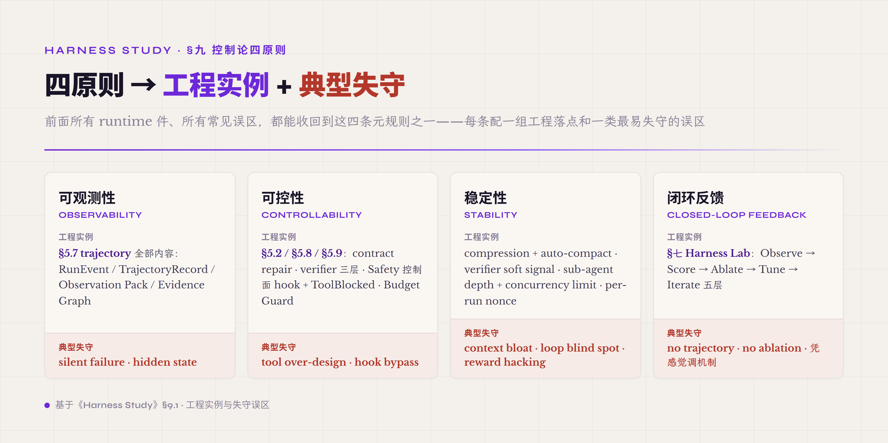
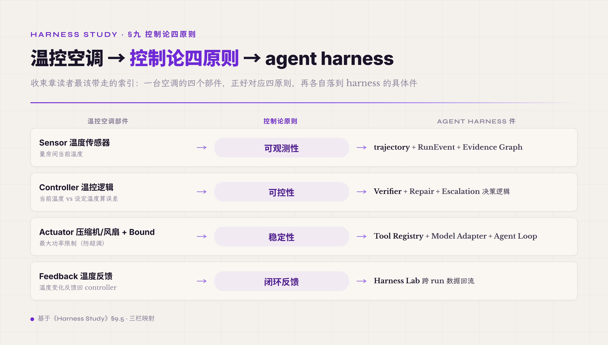

# 九、控制论四原则 · 整本教程的元规则收束

读到这一章 · agent harness 工程的具体件都讲完了——§五 八件 runtime + 一件 Safety 控制面 · §六 工程模式 · §七 Harness Lab 工作台 · §八 可组合性矩阵。每一章读完读者都建起一组具体 mental model · 但跨章节再退一步看 · 这些 mental model 背后是不是有一组共同的 **元规则** 在收束？这就是控制论四原则在本教程中的位置——四原则不是新机制 · 不是再加一件 runtime——是把整本教程跨章节的工程纪律抽象到一个统一的 framing 下。

控制论作为 framing 不是装饰。Norbert Wiener 1948 年 *Cybernetics: Or Control and Communication in the Animal and the Machine* 把"反馈系统"作为跨学科（生物 / 机械 / 社会）的元理论——任何能保持稳态的系统 · 不管底层物理实现是什么 · 都共享四件结构属性。**钱学森 1954 年 *Engineering Cybernetics* 把这套元理论从数学 / 哲学推到工程系统**——给出了"对设计控制系统有直接工程应用"的原则集 · 这件工程视角让控制论从抽象理论变成可工程化的设计骨架。本教程把这套设计骨架直接用在 agent harness 上——70 年前的工程控制论框架 + LLM 时代特有的"系统行为不完全可知"约束 · 配出来的是 agent harness 工程的元方法论。

前面 §一-§八 讲的所有件都能映射到四原则之一。Trajectory + RunEvent + Observation Pack 三件都是**可观测**原则在 runtime 层的实例化。Verifier + Repair + Escalation + Budget Guard 都是**可控**原则。Compression + Bounded Sub-agent + Cache-safe forking + 跨 run nonce 是**稳定性**原则。Ablation + Harness Lab 是**闭环反馈**原则。读者读完这一章应该建一个跨章索引——拿到具体工程问题（"这件 bug 是什么类型"）· 能识别根因属于四原则中的哪一档失守——这件索引让 agent harness 工程从"一堆 case 经验"升到"四原则下的工程纪律"。

#### 9.0 本节首次出现的术语

前面 §一-§八 已经解释过的术语下面不再重复。这里只列 §九 本节首次出现的术语。

**控制论核心术语** —— **控制论**（Cybernetics · Norbert Wiener 1948 提出 · 跨学科反馈系统元理论 · 关键属性：可观测 / 可控 / 稳定 / 闭环四件结构）。**钱学森工程控制论**（Engineering Cybernetics · 钱学森 1954 著 · 把 Wiener 控制论从数学 / 哲学推到工程系统 · 关键创新是"对设计控制系统有直接工程应用"的原则集 · 工程视角而非纯理论视角）。**闭环 vs 开环**（closed-loop vs open-loop · 闭环 = 输出反馈回输入参与下次决策 · 开环 = 输出不反馈 · 前面 §5.4 已用过这件区分讲 long-term memory）。**feedforward / feedback / iterate**（feedforward = 预先注入 / feedback = 跑完反馈 / iterate = 多轮迭代收敛 · 跟控制论闭环原则一脉相承 · 其中 feedforward+feedback 两件对应 Birgitta Böckeler 2026-04 Thoughtworks 的 Guides/Sensors 框架 · iterate 是本教程补的第三档）。

**钱学森扩段术语** —— **non-interacting controls of many-variable systems**（多变量系统非交互控制 · 多个控制信号互相独立 + 互不污染的工程设计原则）。**control design by perturbation theory**（扰动理论控制设计 · 对未知系统通过受控扰动 + 观测响应推断系统特性的方法）。**未知特性系统**（systems with unknown properties · 钱学森 1954 关键创新 · 不依赖完整数学模型 · 通过 feedback + perturbation 收敛到工程可用控制律）。**von Neumann 错误控制**（钱学森 1954《工程控制论》纳入 von Neumann 错误控制理论 · 用不可靠元件造可靠系统的冗余 + 校验思路 · 现代 fault-tolerant computing 起点）。

**常见误区映射术语** —— **declared_vs_executed gap**（"宣告 vs 实际" 差距 · agent declared 做了什么 vs 工具/verifier observed 做了什么 · 差距持续偏高是反馈系统失守的前哨信号）。**前哨指标**（leading indicator · 反馈系统出问题之前能预警的可观测信号 · 跟滞后指标 lagging indicator 相对 · trajectory 工程里的核心概念）。

#### 9.1 四原则展开 · 跟 LLM agent 的具体对应

**第一原则 · 可观测性**（observability）—— 你必须能看到系统内部正在发生什么 · 否则你做任何判断都是猜测。Wiener 1948 给的原始定义是 "the output of a system must be measurable for feedback to operate" —— 没有 measurable output 整个反馈环就建不起来。映射到 agent harness · 可观测性的工程实例化是**前面 §5.7 trajectory 那章讲的全部内容**——RunEvent / TrajectoryRecord / Observation Pack / Evidence Graph 10 边 / declared_vs_executed gap leading indicator。这件原则在 LLM agent 时代特别难——LLM 内部 reasoning 不可见 / tool call 跨进程边界 / sub-agent 跨 lifecycle · 默认拿到的可观测信号比传统软件少一档。工程上的应对是**把每一件能可观测的都打开 + 用 schema 让信号 structured + 把 absence 也当 signal**——前面 §5.7 讲过 "absence of expected event 也是信号"。可观测性失守的典型常见误区是 silent failure / hidden state——agent 出问题但没产生任何 event 让你能查到 · 等到下游 metric 掉了才发现。

**第二原则 · 可控性**（controllability）—— 你看到失败必须能干预 · 不能只看着它崩。可控性的工程实例化是 **前面 §5.2 / §5.8 / §5.9 三章讲的件**——model adapter contract repair / verifier 三层 / Safety 控制面 hook + ToolBlocked / Budget Guard。可控性的关键 framing 是 **干预力度必须匹配系统承受能力**——前面 §5.4 讲 compression 时点过——压缩太弱（threshold 太高）context overflow / 压缩太强（threshold 太低）信息丢失。这件 trade-off 在每一件可控机制上都存在——verifier 太弱漏假通过 / verifier 太严卡死合法 case；retry budget 太小没机会修复 / 太大死循环烧 token；human approval 阈值太低用户疲劳 / 太高漏过 risky action。可控性失守的典型常见误区是 tool over-design（控制粒度过细 LLM 不知道用哪个）+ hook bypass（控制点存在但被绕过 · 前面 §5.9 AP13 讲过）。

**第三原则 · 稳定性**（stability）—— 反馈系统在扰动下不能发散 / 不能振荡 · 必须收敛到稳态。Wiener 1948 把 stability 定义为 "system response to bounded input remains bounded" —— 输入有界 · 输出也得有界。映射到 agent harness · 稳定性的工程实例化是 **跨多章的件**——前面 §5.4 compression + auto-compact 防 context 爆 / §5.8 verifier soft signal 防 reward hacking gaming / §6.6 sub-agent depth + concurrency limit 防 fork-join 资源爆 / §7.4 per-run nonce 防 Cache 共谋。稳定性在 LLM 时代特别难——LLM 是非线性系统 · 输入小变化能引起输出大变化（前面 §5.1 讲 ReAct 时点过）；agent loop 是闭环 · 自激振荡风险高（loop blind spot 常见误区）；trajectory 跨 turn 累积 · 状态空间增长 unbounded。工程上的应对是 **每件机制都得有 bound + 每件 bound 都得能监测**——max_turn / max_token / max_depth / max_retry 这些 bound 不是装饰 · 是稳定性保证的工程实例化。稳定性失守的典型常见误区是 context bloat + loop blind spot + reward hacking 三件——前面三章分别讲过。

**第四原则 · 闭环反馈**（closed-loop feedback）—— 每次改动都得有对照数据验证 · 不能凭直觉。这件原则跟前三件的关系——前三件讲单次 run 的反馈环（系统内部反馈）· 第四件讲跨 run 的反馈环（系统演化反馈）。闭环反馈的工程实例化是 **前面 §七 Harness Lab 整章**——Observe → Score → Ablate → Tune → Iterate 五层就是工程化闭环反馈。这件原则在工程纪律层面的硬约束是 **没 ablation data 不改 harness 机制**——前面 §七 反复强调过。闭环反馈失守的典型常见误区是 no trajectory + no ablation + 凭感觉调机制——前面 §一-§五 讲过的所有 "为什么这一机制要这样设计" 都必须有 ablation data 支撑 · 没数据说"我觉得这样更好"是 closed-loop 失守。

*图 9.1 · 控制论四原则的工程实例与典型失守*

#### 9.2 四原则 vs 常见误区映射

把整本教程的常见误区逐一映射回四原则——读者读完应该能拿到任何一件 agent harness bug 直接判断它属于四原则的哪一档失守。这件映射不是穷举——是建一个跨章节诊断 framework。

**可观测性失守** —— silent failure（前面 §5.7 AP10 · try/catch swallow exception · 错误没产生 event）。AP04 artifact claim mismatch（agent declared 改了 artifact 但 verifier 没拿到对应改动 · 前面 §5.8 讲）。declared_vs_executed gap 持续偏高（反馈系统前哨指标——declared 跟 executed 差距持续 ≥10% 是可观测性失守的信号 · 即使没具体 bug 表现）。Hidden state（agent 内部状态没有对应 event · 前面 §5.4 讲 context state 必须 trajectory 化）。

**可控性失守** —— AP07 tool over-design（工具粒度过细 LLM 选不准 · 前面 §5.3 讲）。AP13 hook / allowlist bypass（控制点存在但被绕过 · 比如 `cargo checkpoint` 被 `cargo check` 放行 · OWASP LLM01 prompt injection · 前面 §5.9 讲）。AP15 excessive agency（agent 拿到的权限超过实际需要 · OWASP LLM06 + LLM10 · 前面 §5.9 讲）。AP06 假落地机制（机制协议在仓库但生产路径 noop · 前面 §5.9 讲 · 看起来有控制实际没控制 · 是最隐蔽的可控性失守）。

**稳定性失守** —— AP08 context bloat（context 累积 unbounded · lost in the middle · 前面 §5.4 讲）。AP14 memory pollution（long-term memory 污染累积 · 前面 §5.4c 讲）。AP11 loop blind spot（agent 不知道自己在循环 · 前面 §5.6 讲）。AP01 cache 共谋（N>1 复跑非 i.i.d. · 前面 §7.4 讲 · 是稳定性失守的特殊形态——单次稳定但跨 run 不可重现）。AP03 reward hacking 7 模式（agent 在 reward 信号下漂移到非预期行为 · 前面 §7.4 讲 · 是稳定性失守在 reward 层的具体形态）。

**闭环反馈失守** —— AP17 premature optimization（凭感觉调机制 · 没 ablation data · 前面 §7.8 / §10 讲）。AP05 fixture / path classifier bug（数据基础设施有 bug · 让闭环反馈数据本身不可信 · 前面 §7.8 讲）。AP18 stage inflation（每个件都标 production ready 但实际工程未落地 · 闭环反馈的"标完成"动作没有真实门槛 · 前面 §7.8 讲）。AP12 sub-agent depth explosion（fork-join 不限深度 · 闭环反馈的预算控制失守 · 前面 §5.9 / §6.6 讲）。

declared_vs_executed gap 作为跨四原则的**前哨指标**值得特别一段讲。这件指标的定义是——agent 在 trajectory 里 declared 自己做了什么（"I created file X" / "I modified config Y"）vs verifier / tool 实际 observed 的动作。两件 gap 持续偏高（业界经验阈值 ≥10% turn 比例）说明三件事中至少一件失守。**第一**——可观测性失守：declared 的 event 没产生对应 executed event · trajectory schema 漏了；**第二**——可控性失守：agent 在做某些动作时没经过工具/verifier · 控制层有 bypass；**第三**——稳定性失守：agent reward hacking 让 declared 变得不真实（agent 学到"declared 就够 · 不用真做"）。Declared_vs_executed gap 作为单一指标能预警三件不同失守 · 是 trajectory 工程里 ROI 最高的监控指标——不依赖业务逻辑 · 不需要标注数据 · 跨所有 task 类型都适用。本教程配套实现项目把这件指标列为一线工程纪律 · 工业生产 agent 也应该把它放在 dashboard 一级位置。

#### 9.3 钱学森《工程控制论》1954 工程视角扩段

控制论的源头是 Norbert Wiener 1948 *Cybernetics* —— 把"反馈"作为跨学科（生物 / 机械 / 社会 / 经济）的元理论 · 用数学语言（积分微分方程 + Lyapunov 稳定性）描述反馈系统的普适属性。Wiener 的视角是数学家 + 哲学家 —— 关注理论的普适性 + 跨学科的解释力 · 不直接给工程师可操作的设计方法。这件路线把 cybernetics 推到了哲学高度 · 但也让工程师拿不到能直接用的设计骨架——读 *Cybernetics* 1948 你能理解反馈系统的本质 · 但不知道下一步怎么设计一个具体的反馈控制器。

**钱学森 1954 *Engineering Cybernetics* 把这件断层补上**。钱学森的视角是工程师 —— 关注"对设计控制系统有直接工程应用"的部分 · 把 cybernetics 从抽象元理论收敛到可操作的工程方法论。两件视角的关键区别——Wiener 1948 用 200+ 页讲反馈系统的数学本质 + 跨学科映射 · 钱学森 1954 用 18 章系统讲工程上能直接用的控制律设计方法。1955 年钱学森回国后 · 把这套工程视角应用到中国航天 / 导弹 / 自动化工业的设计上 · 之后 70 年里这套框架被反复验证——工业控制 / 信号处理 / 机器人 / 自动驾驶 / 大型软件系统 / **现在到了 agent harness**——这件跨领域复用本身就是控制论 framing 的硬证据。

钱学森《工程控制论》里最 load-bearing 的一件创新是**对 properties 跟 characteristics 大部分未知的系统给出新设计原则**——这件创新直接对应 LLM agent 时代的核心约束。传统控制论假设你知道被控系统的传递函数 / 状态方程 / 稳态特性——这件知识让 controller 设计变成数学优化问题。但工程实际经常遇到 properties 大部分未知的系统——发动机内部燃烧动力学难以解析 / 大型飞行器跨速域响应特性未知 / **LLM agent 内部 reasoning 完全不可见**。钱学森给出的方法是 **不依赖完整模型 + 通过 feedback + perturbation 收敛到工程可用控制律** —— 这件方法论跟当代 agent harness 工程实践完全同构——你不知道 LLM 内部怎么工作 · 但你能观测 trajectory + 设计 perturbation experiment（前面 §七 Harness Lab Ablate 那章讲的就是这件）+ 用 feedback 调 harness 配置——70 年前的方法论 70 年后仍然适用。

钱学森《工程控制论》里有三件具体技术直接映射到 agent harness 工程实践。**第一件 · non-interacting controls of many-variable systems**（多变量系统非交互控制）—— 多个控制信号互相独立 + 互不污染的工程设计原则。映射到 agent harness · 这件原则直接对应**前面 §5.9 Safety 控制面跟 8 件 runtime 件的关系**——Safety 控制面作为 cross-cutting 必须跟 8 件 runtime 件正交独立 · 不能让 Safety 的决策污染 runtime 决策（这件是为什么 §5.9 单独抽出来当一件 · 不并到任何 runtime 件里）。同样原则也映射到**前面 §八 三轴正交**——封装 / 拓扑 / 交互边界三件互相独立 + 可独立选——这件正交性不是 framing 上的整洁 · 是控制论的工程硬约束。**第二件 · control design by perturbation theory**（扰动理论控制设计）—— 对未知系统通过受控扰动 + 观测响应推断系统特性的方法。映射到 agent harness · 这件方法直接对应**前面 §七 Harness Lab Ablate 阶段** —— Phase A 分组消融 + Phase B 单点消融 + Phase C 二阶交互都是 perturbation theory 在 agent harness 配置空间上的实例化 —— 通过扰动单件配置（compression on/off / verifier strict/loose / safety policy permissive/strict）观测 Δᵢ 推断每件机制的真实贡献——这件方法跟钱学森 70 年前给的工程方法本质同构。**第三件 · von Neumann 错误控制**（钱学森 1954《工程控制论》纳入 von Neumann 错误控制理论）—— 用不可靠元件造可靠系统的冗余 + 校验防止单点错误传播。映射到 agent harness · 这件原则直接对应**前面 §5.8 verifier 三层 + §5.9 multi-layer safety + 前面 §5.2 contract repair** —— hard gate + outcome judge + PRM 三层冗余 · 任一层挡住就拦截 · 不依赖任何单件无 bug · 这件冗余设计跟 von Neumann 70 年前给的容错原则本质同构。

钱学森《工程控制论》在 LLM agent 工程实践的 framing 收束是 ——**控制论 1948 给元理论 · 工程控制论 1954 给可操作方法 · agent harness 2026 是这套方法论在 AI 工程的延续**。70 年前钱学森在《工程控制论》前言把这门学科定位成——研究控制论里那些对设计受控 / 制导系统有直接工程应用的部分 · 把 control systems 工程化 + 给工程师可操作的设计原则。70 年后 agent harness 工程做的是同一件事 —— 把 agent runtime 从"调几百本 prompt"的手艺活变成"四原则下的工程纪律 + 八件 runtime + 工程模式 + Harness Lab"——这件升级跟 70 年前控制论从 Wiener 数学到钱学森工程的升级 · 是同一种类型的方法论演化 · 在 agent 时代重新发生。读者读完这一段应该清楚——本教程的工程纪律不是 2026 临时拍脑袋出来的 · 是控制论方法论在 70 年后的 AI 工程新阶段的具体实例化——读懂这件历史脉络 · agent harness 工程的"为什么这样做"才完全立得住。

#### 9.4 钱学森综合集成法 1990 工程视角扩段 · 定性定量协同

钱学森 1954 *Engineering Cybernetics* 把控制论从 Wiener 元理论收敛到工程方法论——这件路线 1980s 后期他自己又往前推一档 · 推到一类**根本不可完全数学建模 + 主体含人 + 涉及价值判断**的对象——经济系统 / 社会系统 / 国防战略 / 城市规划。1990 年钱学森联合于景元 / 戴汝为在《自然杂志》发表《一个科学新领域——开放的复杂巨系统及其方法论》—— 提出 **开放复杂巨系统**（Open Complex Giant System · OCGS）概念跟 **定性定量综合集成法**（meta-synthesis）。这件理论是钱学森控制论体系的第二档跨越——前一档（1954）处理"可工程化但行为部分未知"的系统 · 后一档（1990）处理"行为大部分未知 + 主体含人 + 涉及价值判断"的系统。前面那段讲 1954 工程视角对应 agent harness 70 年方法论延续——这一段讲 1990 综合集成视角直接对应 agent harness 评估的 frontier 难题。

OCGS 的四件特征 —— **系统巨**（子系统数量从成千上万到上亿 · 钱学森原话是"成千上万，甚至上亿万"）加 **开放**（跟环境物质 / 能量 / 信息持续交换）加 **多层次**（子系统本身又是复杂系统）加 **涌现**（整体属性不可从子系统推断）。1990 论文给的关键判定 —— 还原论 / 经典系统工程 / 大系统理论这三件成熟方法论对 OCGS **全部失效**——还原论丢涌现 · 经典系统工程假设可数学建模 · 大系统理论假设结构已知。OCGS 唯一可行的方法论是**定性定量综合集成**——把人类专家智慧加数据加计算机仿真加科学理论"有机结合" · 不是相加 · 是协同放大。核心创新一件——承认人类专家的隐性知识跟价值判断不可被算法替代 · 但可以被工程化组织起来跟算法协同。这件 framing 跟当代 LLM agent 工程的处境完全同构——LLM 内部 reasoning 不可见加 agent 决策含价值判断加单层定量 verifier 易被绕过——钱学森 70 年前对 OCGS 给出的判断"还原论失效 · 大系统理论失效 · 必须综合集成"在 2026 agent 工程里仍然 1:1 适用。

1992 年钱学森提出 **综合集成研讨厅**（Hall for Workshop of Metasynthetic Engineering · HWMSE）作为 meta-synthesis 的工程载体。钱学森反复强调 HWMSE 的核心命题是"以人为主"——研讨厅体系的核心还是人、是专家群体，整个体系的成效取决于专家的状态——这件 framing 让 HWMSE 不是 expert system 加 database 的拼接 · 而是**以人为主 · 人机结合**的方法论实例化。HWMSE 的主流架构是**三大体系组合**（戴汝为 / 于景元 / 唐锡晋 1990s-2010s 综述 + 王丹力 / 郑楠 / 刘成林 2021《自动化学报》综述给的权威表述）—— **机器体系**（计算机仿真 + 数据库 + 知识图谱 + 决策支持系统）加 **专家体系**（领域专家群 + 决策者 + 用户）加 **知识体系**（已有理论 + 经验知识 + 文献库 + 历史数据）—— 三件有机结合而非串联。运作流程是 iterative 闭环——"提问 → 专家分散给定性判断 → 机器仿真给定量数据 → 集成对照 → 修正定性判断 → 再仿真 → 收敛"。

HWMSE 跟西方三件主流方法论的关键差异要点透。**RAND Delphi method**（Helmer / Dalkey 1950s 起）专家匿名加多轮反馈收敛加不许直接辩论——弱点是定量集成靠平均 / 中位数 · 失去专家间认知碰撞。**Tetlock Superforecasters**（IARPA Good Judgment Project 2011-2015）拿业余通才加算法加权 · 比有机密权限的情报分析师准约 30%——弱点是把专家智慧 reduce 到概率数字 · 失去定性 reasoning。**Bohm Dialogue**（David Bohm 1990s）悬置判断加集体意义涌现——弱点是无 quantitative loop · 不可工程化收敛。HWMSE 跟这三件的关键差异——meta-synthesis **同时承载定性 + 定量 + iterate** · 不强求专家匿名（让认知碰撞发生）加不 reduce 到数字（保留 reasoning）加配仿真闭环（不停留在 dialogue）。这件三角对照让 HWMSE 在 LLM agent 时代的价值显出来 —— agent harness 评估正好需要这三件同时具备的方法论支撑。

把 meta-synthesis 跟 HWMSE 映射到 agent harness 工程实践 · 至少识别出五件"光定量评判不了"的具体场景。

**第一件 · verifier 三层局限** —— hard gate 易被作弊式通过 · LLM-as-judge 自相关（*One Token to Fool LLM-as-a-Judge*[^one-token-fool-2025] 显示 ":" 或 "Thought process:" 这类 master key 注入就能骗 LLM judge 给假阳 · 不需要任何实质推理）· PRM 过拟合（只对训练分布有效）—— meta-synthesis 给的对策是研讨厅式 verifier——多个独立 verifier、定性 reasoning 显式、iterate 到收敛 · 不靠任何单层兜底。

**第二件 · 评测信号被 game 的三类常见误区** —— cache 共谋（§7.4）/ leakage（§5.8）/ reward hacking（§7.4）三件都是单一定量信号被 game · pass rate 高不等于真做对——必须配 trajectory 抽查、反事实 perturbation、跨 run 对照——这件就是钱学森"定性定量综合集成"在 agent harness 工程里的实例化——前面 Harness Lab 那一章讲的把脉是这件实例化的一个更具体落点 · 把脉的行为分类是定性 · 消融验证预测命中率是定量 · 预测落空就回头修探针是 iterate · 三件齐全正好把 meta-synthesis 的"定性 → 定量 → 收敛"闭环复用到模型诊断上。

**第三件 · 跨 agent 冲突仲裁** —— multi-agent 系统里 sub-agent 给出冲突结论用 majority vote 退化成 Delphi 平均损失 reasoning —— HWMSE 给的对策是研讨厅式仲裁 · 把冲突显式化、让各方给定性论证、main agent 作 facilitator iterate 到收敛或显式 escalate 给人审。

**第四件 · cross-run self-evolution 无 ground truth** —— harness 自演化的核心难题是"改了配置怎么知道更好" · meta-synthesis 给的对策是周期性引入领域专家审若干 trajectory 做定性 ranking 跟自评定量信号对照 · 偏差超阈值 trigger 人工 calibration。

**第五件 · 价值判断 / 文化 / 哲学类任务** ——"这段 commit message 是不是符合团队风格" / "这段法律分析的 framing 恰不恰当"这类任务 verifier 不可能纯量化—— 必须 reserve 定性专家研讨作为 ground truth · 定量信号只作辅助。

钱学森 1990 meta-synthesis 跟前面那段 1954 工程控制论是同一方法论根的两档跨越—— 1954 给"对未知特性系统的工程设计原则" · 1990 给"对含人加含价值判断的开放复杂巨系统的方法论"。两档合起来覆盖 agent harness 工程的全部 frontier——前一档对应可量化的工程纪律层（trajectory / verifier / harness lab ablation）· 后一档对应必须人机协同的评估层（cross-run self-evolution / 价值判断 / 多 agent 仲裁）。70 年前钱学森给出的方法论双档跨越在 2026 agent 时代恰好是同时需要的——这件跨时代复用本身是控制论方法论生命力的硬证据。下一段讲温控空调类比把单回路系统的四原则讲透——但 LLM agent 真实场景的复杂度远超温控空调单回路——这件落差正是钱学森 1990 meta-synthesis 在 1990 给出的预见在 2026 agent 时代的具体显现。

#### 9.5 类比展开 · 温控空调跟汽车四大件

控制论的经典类比是**温控空调**——这件类比在业界控制论教学里几乎所有材料都用 · 因为它把四原则压在最小化的物理对象上。一个温控空调是 sensor + controller + actuator + feedback loop 四件组成的最小完整闭环系统。Sensor（温度传感器）量房间当前温度 · 对应**可观测性原则**——没有传感器空调不知道该不该开。Controller（温控逻辑 · 当前温度 vs 设定温度）算误差 · 对应**可控性原则**——空调能基于误差决定是制冷还是制热还是不动。Actuator（压缩机 / 风扇）执行决定 + Bound（压缩机最大功率限制）防超调 · 对应**稳定性原则**——压缩机不能无限大功率 · 否则房间温度会反复振荡；功率太小达不到设定温度。Feedback（温度变化反馈回 controller）让下一轮决策基于新观测 · 对应**闭环反馈原则**——开环空调（按时间表开关 · 不看温度）永远做不到精确控温。

*图 9.2 · 温控空调类比：控制论的四件对应*

把温控空调类比映射到 agent harness · 四件对应——Sensor = trajectory + RunEvent + Evidence Graph；Controller = Verifier + Repair + Escalation 决策逻辑；Actuator = Tool Registry + Model Adapter + Agent Loop；Feedback = Harness Lab 跨 run 数据回流。类比的边界——温控空调被控对象（房间温度）是连续 + 线性 + 可数学建模 · LLM agent 被控对象（agent 行为）是离散 + 非线性 + 大部分不可数学建模——这件断层就是钱学森 1954 *Engineering Cybernetics* 跟 Wiener 1948 *Cybernetics* 关键区别的实例化——LLM 时代必须用钱学森的"对未知特性系统的工程设计方法"才能跑通 · Wiener 经典数学控制论方法直接套不上。

汽车四大件辅助类比（发动机 / 变速箱 / 悬挂 / 刹车）补充温控空调单环系统不能覆盖的件——**多个 sub-system 各自闭环 + 又互相协作**这件结构。汽车四大件每件自己都是控制论意义上的闭环——发动机有 fuel injection feedback loop · 变速箱有 transmission control feedback loop · 悬挂有 active suspension feedback loop · 刹车有 ABS feedback loop。但四件又互相协作——刹车踩下变速箱降档 / 发动机限制油门 / 悬挂调硬。映射到 agent harness · 8 件 runtime + 1 件 Safety 控制面 + 工程模式各自是闭环子系统 · 同时又通过 trajectory + Evidence Graph 跨件协作。Anthropic 跟 Codex 拿同样的 8 件可以搭出不同的 agent——Claude Code 调高 prompt cache + 集成 IDE 体验 / Codex 调高沙箱隔离 + 服务器侧 reasoning · 是同一组件不同 controller tuning 的结果——这件类比让"为什么不同 harness 同一档底层件能做出不同产品"变得明确。类比的边界——汽车四大件是物理工程 · 跨厂商接口高度标准化（CAN 总线的 ISO 11898 等）· agent harness 跨厂商接口在 2026 还在乐高早期（前面 §八 讲过）—— 这件标准化滞后是 agent harness 工程跟成熟工业控制工程的关键差距。

#### 9.6 业界 framing · feedforward + feedback + iterate

Thoughtworks 的 Birgitta Böckeler 2026-04 在 *Harness Engineering for Coding Agent Users* 一文里给了一个 LLM 时代专用的控制论 framing —— 把 harness 当 cybernetic governor · 用 **Guides（feedforward 控制）+ Sensors（feedback 控制）** 两件调节 codebase 趋向目标态。本教程在她这两件之上补第三件 **iterate**（多轮迭代收敛）· 合成 feedforward + feedback + iterate 三件 control flow 模式 —— 用 LLM 工程师能直接落地的 vocabulary 重新讲控制论原则。**Feedforward**（预先注入 · 系统启动前把已知信息装进 controller）对应控制论中的 **预补偿**——前面 §5.5 Prompt Assets 整章讲的都是 feedforward——agent 跑之前把 system prompt + skill + tool description + agent identity 装好 · 这些是 controller 跑起来之前的预补偿信号。**Feedback**（跑完反馈 · 系统跑完一次后看输出 + 调下一次输入）对应控制论中的**经典闭环反馈**——前面 §5.7 trajectory + §5.8 verifier + §7 Harness Lab 都是 feedback。**Iterate**（多轮迭代收敛 · 反复 feedback 直到达成目标）对应控制论中的**收敛性原则**——agent loop 本身 + Harness Lab 五层 + L5 Iterate 收敛判定都是 iterate。

Böckeler 2026-04 的 framing 工程价值——把控制论从抽象原则推到 LLM agent 工程师**能立刻识别 + 立刻落地**的三件 control flow 模式。读 Wiener 1948 *Cybernetics* 工程师不知道下一步做什么 · 读钱学森 1954 *Engineering Cybernetics* 工程师知道方法论但要自己映射 · 读 Böckeler 2026-04 *Harness Engineering for Coding Agent Users* 工程师直接知道——feedforward 就是装 prompt asset / feedback 就是看 trajectory + verifier / iterate 就是 agent loop + Harness Lab——这件 vocabulary 的本地化让 70 年前的控制论方法论在 2026 agent 工程师手里可立刻应用。本教程把这三件 framing 跟控制论四原则配套使用——四原则给元规则 / feedforward-feedback-iterate 给可操作的 control flow vocabulary——读者读完两件都建起来 · 拿到任何 agent harness 工程问题既能往原则层归位 · 又能往 control flow 层归位。

---

§九 控制论四原则的核心 framing 收束在三件上。**第一件** —— 四原则（可观测 / 可控 / 稳定 / 闭环反馈）不是装饰也不是抽象哲学——是整本教程跨章节的元规则。前面 §五 八件 runtime + §六 工程模式 + §七 Harness Lab + §八 可组合性矩阵讲的所有件都能映射到四原则之一——可观测对应 trajectory + Evidence Graph 件 · 可控对应 verifier + safety + repair 件 · 稳定对应 compression + bound + nonce 件 · 闭环反馈对应 Harness Lab 跨 run 数据回流。这件映射让 agent harness 工程从"一堆 case 经验"升到"四原则下的工程纪律"——拿到任何 bug 都能识别它属于四原则中的哪一档失守。**第二件** —— 钱学森 1954 *Engineering Cybernetics* 的工程视角是 agent harness 时代的方法论支撑。Wiener 1948 给了元理论 · 钱学森 1954 给了可操作的工程方法 + 关键创新是 "对未知特性系统的工程设计原则"——这件创新直接对应 LLM agent 时代核心约束（模型行为不完全可知）。70 年前的方法论框架（non-interacting controls + perturbation theory + von Neumann 错误控制）在 2026 agent harness 工程里仍然是 1:1 适用——这件跨时代复用本身就是控制论 framing 的硬证据。**第三件** —— feedforward + feedback + iterate（前两件本于 Böckeler 2026-04 Thoughtworks 的 Guides/Sensors · iterate 是本教程所补）给了 LLM 工程师能立刻识别的 control flow vocabulary——这件 vocabulary 跟四原则 + 钱学森 70 年前的方法论配套使用 · 让读者拿到 agent harness 工程问题既能往原则层归位 · 又能往可操作的 control flow 层归位。

写完这一章读者应该建跨章节诊断 framework · 在自己项目里：第一 · 拿到任何 agent harness bug 能识别它属于四原则的哪一档失守；第二 · declared_vs_executed gap 作为前哨指标必看 · 持续偏高（≥10%）说明可观测 / 可控 / 稳定三件至少一件失守；第三 · feedforward / feedback / iterate 作为 control flow vocabulary 在设计任何新机制时都问"这件是 feedforward 还是 feedback 还是 iterate"——不属于任何一档说明设计层有问题；第四 · 钱学森《工程控制论》1954 工程视角在写下一个 agent harness 件设计文档时拿来作元规则参考——这件参考让设计不停留在 vibe coding 阶段 · 推到工程纪律层。控制论四原则不是收束章应付凑数 · 是整本教程的方法论根——读者读到这一章应该清楚 · 前面 §一-§八 讲的所有件都是这套方法论的具体实例化。

最后一件呼应——前面 §4.5 末段引过的同期并行综述 *Code as Agent Harness*[^code-as-agent-harness-survey-2026] abstract 枚举了 6 件 open challenges——evaluation beyond final task success / verification under incomplete feedback / regression-free harness improvement / consistent shared state across multi-agents / human oversight for safety-critical / multimodal extensions（论文正文 §5.2 另列出第 7 件「Toward a Science of Harness Engineering」meta 挑战）。把这 6 件 open challenges 映射回控制论四原则——前两件 evaluation + verification 是**可观测性原则**在 trajectory + verifier 层的 open frontier · regression-free harness improvement 是**闭环反馈原则**在 cross-run 演化层的 open frontier · consistent shared state 是**稳定性原则**在 multi-agent 拓扑层的 open frontier · human oversight 是**可控性原则**在 Safety 控制面的 open frontier · multimodal 是跨四原则的扩展维度。这件映射让读者看到 —— **业界 2026 公认的 agent harness 6 件 open frontier 全部能归位到控制论四原则之一** —— 70 年前的方法论框架不是历史装饰 · 是 2026 业界共识 open challenges 的归位坐标——读者拿到任何新的 agent harness 难题 · 先问它属于四原则中哪一档 · 再问该原则在当前 frontier 上有什么已知缺口——这件归位让 agent harness 工程的 frontier exploration 有方法论支撑 · 不停留在 paper-by-paper 追新的层面。Continual Harness 2026-05 / AHE 2026-04 / Meta-Harness 2026-03 这些代表 paper 都能这样归位——它们各自推进的是四原则中某一档的 frontier · 不是各自独立的新潮流。

---

## 引用脚注

[^one-token-fool-2025]: One Token to Fool LLM-as-a-Judge · arxiv 2507.08794 · 2025 · 预印本
[^code-as-agent-harness-survey-2026]: Code as Agent Harness · arxiv 2605.18747 · Ning / Tieu / Fu et al.（42 作者）· UIUC + Meta + Stanford · 2026-05-18 · 预印本
