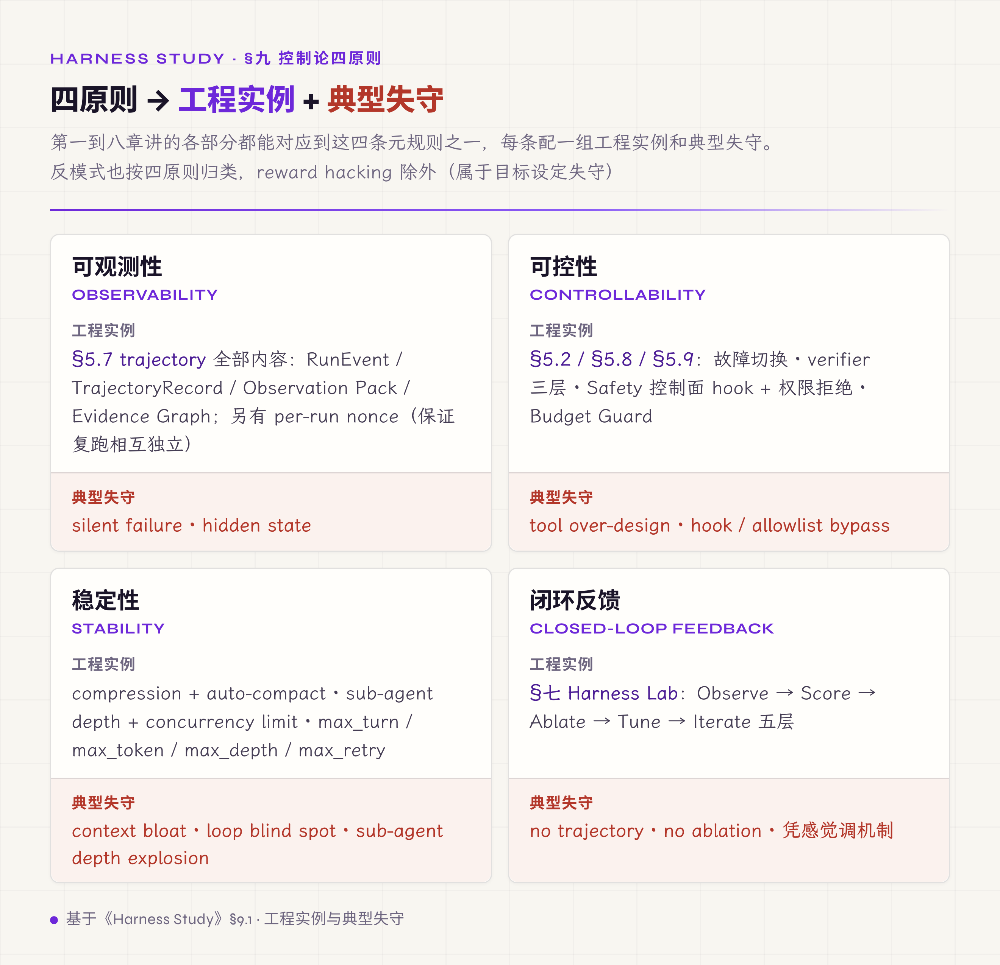
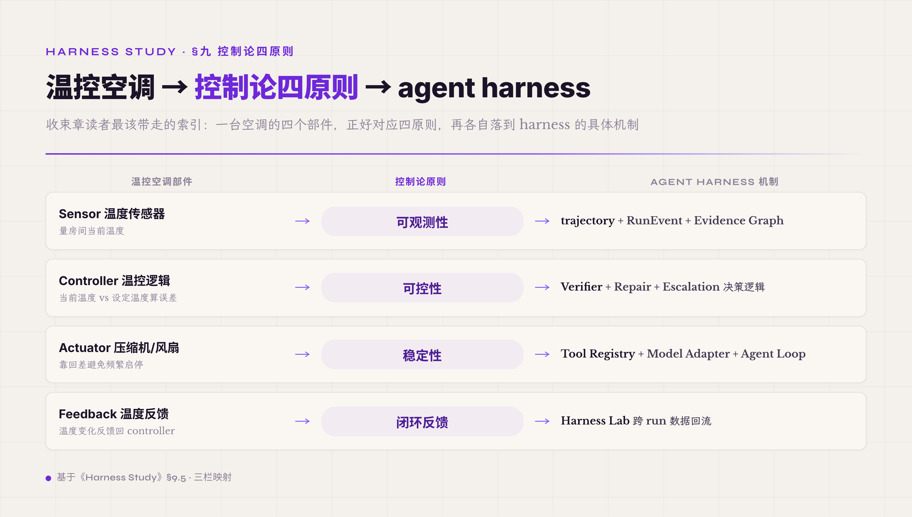

# 九、控制论四原则 · 整本教程的元规则收束

读到这一章，agent harness 工程的具体部分都已讲完：第五章的 8 个 runtime 机制和 Safety 控制面，第六章的工程模式，第七章的 Harness Lab 工作台，第八章的可组合性矩阵。每一章都让读者建立起一组具体的理解。但跨章节再退一步看，这些理解背后是不是有一组共同的**元规则**？这就是控制论四原则在本书中的位置：四原则不是新机制，也不是再加一个 runtime 组件，而是把全书跨章节的工程原则放到一个统一的框架下。

用控制论做框架，不是为了装饰。先说明来源：**本书借用控制论的若干概念作类比，"四原则"是本书的归纳**，把控制论与控制理论中的几个核心概念整理成四个组织原则，并不是某位学者提出的一组原则。四个概念各有出处：

- **反馈与闭环**：Norbert Wiener 1948 年的《控制论》（*Cybernetics: Or Control and Communication in the Animal and the Machine*）以反馈为核心，把它作为理解动物与机器中控制与通信的统一视角。
- **稳定性**：经典控制理论的核心问题。
- **可观测性与可控性**：Rudolf Kalman 1960 年在第一届 IFAC 大会上的论文 "On the general theory of control systems" 中提出。

**钱学森 1954 年的 *Engineering Cybernetics*（《工程控制论》）把控制论从数学与哲学层面推向工程系统**：它关注的是控制论中"对设计控制系统有直接工程应用"的部分，让控制论从抽象理论变成可以用于设计的框架。本书把这套框架借来看 agent harness：1954 年的工程控制论框架，加上大模型时代特有的"系统行为不完全可知"这一约束，构成 agent harness 工程的方法论。

第一到八章讲的所有部分，都能对应到四原则之一：

- trajectory、RunEvent、Observation Pack 是**可观测性**原则在 runtime 层的实例；让复跑相互独立的 per-run nonce 等做法，保证测量本身不失真，也属于这一原则。
- Verifier、Repair、Escalation、Budget Guard 属于**可控性**原则。
- 上下文压缩（compression）、有边界的 sub-agent、不破坏缓存的 fork（cache-safe forking）属于**稳定性**原则。
- 消融（ablation）与 Harness Lab 属于**闭环反馈**原则。

读完本章，读者应当能建立一个跨章节的索引：拿到一个具体的工程问题（"这个 bug 是什么类型"），能判断它的根因是四原则中哪一个失守。有了这个索引，agent harness 工程就从"一堆案例经验"变成"四原则之下的工程原则"。

#### 9.0 本节首次出现的术语

第一到八章已经解释过的术语下面不再重复，这里只列本章首次出现的术语。

**控制论核心术语**

- **控制论（cybernetics）**：Norbert Wiener 1948 年提出，研究动物与机器中的控制与通信，核心是反馈。本书借用其中若干概念作类比。
- **钱学森的工程控制论（Engineering Cybernetics）**：钱学森 1954 年著，把控制论从数学与哲学层面推向工程系统，着眼于"对设计控制系统有直接工程应用"的部分，是工程视角而非纯理论视角。
- **闭环与开环（closed-loop / open-loop）**：闭环是输出反馈回输入、参与下一次决策；开环是输出不反馈。§5.4 讲长期记忆时已用过这组区分。
- **前馈、反馈、迭代（feedforward / feedback / iterate）**：前馈指预先注入，反馈指跑完之后根据结果修正，迭代指多轮修正直到收敛。前馈与反馈两项借用自 Thoughtworks 的 Birgitta Böckeler 2026-04 提出的 Guides / Sensors 框架，是她的类比；迭代是本书补充的第三项，在控制理论里最接近迭代学习控制（iterative learning control，ILC）。
- **必要多样性定律（law of requisite variety）**：W. Ross Ashby 1956 年在《控制论导论》（*An Introduction to Cybernetics*）中提出：调节器的多样性不能小于被调节对象的扰动多样性。9.2 用它解释为什么单层 verifier 挡不住多样的 reward hacking。

**《工程控制论》相关术语**

- **不互相影响的控制（non-interacting control）**：《工程控制论》第 5 章，多变量系统中设计控制器，使每个输入只影响对应的输出，即解耦控制。本书只把它当作"职责分离"的类比。
- **利用摄动理论的控制设计（control design by perturbation theory）**：《工程控制论》第 13 章。摄动理论（原稿译作"扰动理论"）是数学上在标称解附近展开、求近似解的方法，与消融实验不是一回事。
- **系统辨识（system identification）**：通过施加输入、观察输出来推断系统特性。消融、行为探测（本书也称"把脉"，见第七章）在控制理论里对应的是它，或者说是受控实验。
- **未知特性系统（systems with unknown properties）**：《工程控制论》关注的一类对象，不依赖完整的数学模型，靠反馈把系统维持在工程可用的范围内。
- **von Neumann 错误控制**：《工程控制论》纳入了 von Neumann 的错误控制理论，即用不可靠的元件构造可靠系统的冗余与校验思路，是容错计算（fault-tolerant computing）的早期源头之一。

**反模式对应术语**

- **声称与执行差距（declared_vs_executed gap）**：agent 声称做了什么，与工具或 verifier 实际观察到它做了什么之间的差距。计算方法见 9.2。差距持续偏高，是反馈系统失守的前哨信号。
- **前哨指标（leading indicator）**：在反馈系统出问题之前就能预警的可观测信号，与滞后指标（lagging indicator）相对，是 trajectory 工程里的核心概念。

#### 9.1 四原则展开 · 与 LLM agent 的具体对应

下文括号里的 AP 编号，指附录 F 反模式速查表中的编号。

**第一原则：可观测性**（observability。此处取工程义：能看见系统在做什么；控制理论中指能否由系统输出推断其内部状态）。你必须能看到系统内部正在发生什么，否则任何判断都是猜测；没有可测量的输出，反馈环就建不起来。映射到 agent harness，可观测性的工程实例就是 **§5.7 trajectory 一章的全部内容**：RunEvent、TrajectoryRecord、Observation Pack、Evidence Graph 十条边、声称与执行差距这一前哨指标。这个原则在 LLM agent 时代特别难做到：LLM 内部的推理不可见，工具调用跨进程边界，sub-agent 跨生命周期，默认拿到的可观测信号比传统软件少一个层次。工程上的应对是**能打开的信号都打开，用 schema 让信号结构化，把"缺失"也当作信号**（§5.7 讲过"该出现的事件没出现，本身就是信号"）。可观测性失守的典型表现是静默失败（silent failure）和隐藏状态（hidden state）：agent 出了问题，却没有产生任何能查到的事件，等下游指标掉了才发现。

**第二原则：可控性**（controllability。此处取工程义：出错时能不能干预；控制理论中指能否通过输入把系统状态驱动到任意目标状态）。看到失败必须能干预，不能只看着它崩。可控性的工程实例是 **§5.2、§5.8、§5.9 讲的机制**：model adapter 的契约修复、verifier 三层、Safety 控制面的 hook 与 ToolBlocked、Budget Guard。可控性的关键是**干预力度要与系统的承受能力相匹配**。§5.4 讲压缩时提过：压缩太弱（阈值太高），上下文溢出；压缩太强（阈值太低），信息丢失。这种取舍在每个可控机制上都存在：

- verifier 太弱会漏掉假通过，太严会卡死合法用例；
- 重试预算太小没有机会修复，太大会陷入死循环、白烧 token；
- 人工审批阈值太低让用户疲劳，太高会漏过高风险动作。

可控性失守的典型表现是工具过度设计（tool over-design，AP07，见附录 F），即控制粒度过细，LLM 不知道该用哪个；以及 hook 与白名单被绕过（hook / allowlist bypass，AP13），即控制点存在但被绕开（§5.9 讲过）。

**第三原则：稳定性**（stability。控制理论中指系统在扰动下不发散、不持续振荡，最终收敛到稳态；线性系统常用 BIBO 稳定，即有界输入产生有界输出，这是线性系统理论中的标准定义，1950–60 年代逐步形成。本书借用时取工程义：循环能停下来，成本不失控）。映射到 agent harness，稳定性的工程实例分布在多章：

- §5.4 的压缩与自动压缩（auto-compact），防止上下文爆掉；
- §6.6 对 sub-agent 深度与并发的上限，防止 fork-join 资源爆掉；
- max_turn、max_token、max_depth、max_retry 这些上限。

稳定性在 LLM 时代特别难保证：LLM 是非线性系统，输入的小变化能引起输出的大变化（§5.1 讲 ReAct 时提过）；agent loop 本身是闭环，存在自激振荡的风险；trajectory 跨轮累积，状态空间不断增长。工程上的应对是**每个机制都要有上限，每个上限都要能被监测**。上面那些上限不是装饰，是稳定性的工程实现。稳定性失守的典型表现有三个：上下文膨胀（context bloat，AP08）、循环盲区（loop blind spot，AP11）、子 agent 深度爆炸（sub-agent depth explosion，AP12），前面几章分别讲过。

需要说明的是，"跨 run 结果不可复现"和 reward hacking 不归入稳定性：前者是测量问题，归可观测性；后者是目标设定问题，9.2 单独讲。

**第四原则：闭环反馈**（closed-loop feedback）。每次改动都要有对照数据验证，不能凭直觉。它与前三个原则的关系是：前三个讲单次 run 内的反馈环（系统内部的反馈），第四个讲跨 run 的反馈环（系统演化的反馈）。闭环反馈的工程实例是**第七章 Harness Lab 整章**：观察（Observe）、评分（Score）、消融（Ablate）、调优（Tune）、迭代（Iterate）五层，就是工程化的闭环反馈。这个原则落到工程上的硬性要求是**没有消融数据，就不改 harness 机制**，第七章反复强调过。闭环反馈失守的典型表现是没有 trajectory、没有消融、凭感觉调机制。第一到五章讲过的每一个"这个机制为什么这样设计"，都要有消融数据支撑；没有数据就说"我觉得这样更好"，就是闭环失守。

*图 9.1 · 控制论四原则的工程实例与典型失守*

#### 9.2 四原则与反模式的对应

把全书的反模式逐一对应回四原则，读者拿到任何一个 agent harness 的 bug，都应当能判断它是四原则中哪一个失守。这个对应不求穷举，目的是建立一个跨章节的诊断框架。

**可观测性失守**

- 静默吞错（silent try/catch，AP10）：try/catch 吞掉异常，错误没有产生事件（§5.7）。
- 产物声称不符（artifact claim mismatch，AP04）：agent 声称改了某个产物，但 verifier 拿不到对应的改动（§5.8）。
- 声称与执行差距持续偏高：即使没有具体的 bug 表现，这也是可观测性失守的信号（计算方法见本节末）。
- 隐藏状态：agent 的内部状态没有对应的事件（§5.4 讲过，上下文状态必须进 trajectory）。
- **测量失真**：复跑不独立（AP01），N 次复跑之间不独立，通过率与稳定性被高估（§7.4）。来源包括客户端或评测工具的响应缓存、固定的随机种子（seed）、复跑之间共享的文件、记忆与工作区，以及 temperature 0 时缓存命中带来的逐字复现。前缀缓存命中本身不改变输出。它让"看到的"不等于"实际的"，所以归可观测性，而不是稳定性。

**可控性失守**

- 工具过度设计（AP07）：工具粒度过细，LLM 选不准（§5.3）。
- hook 与白名单被绕过（AP13）：控制点存在但被绕开，比如作者配套项目中真实出现过：白名单按字符串前缀匹配，`cargo checkpoint` 被 `cargo check` 的放行规则放过（第二卷 2.7 节）；OWASP LLM Top 10（2025 版）的 LLM01 提示词注入也属此类（§5.9）。
- 过度代理（excessive agency，AP15）：agent 拿到的权限超过实际需要，对应 OWASP LLM Top 10（2025 版）的 LLM06 过度代理与 LLM10 无界消耗（§5.9）。
- 假落地机制（AP06）：机制的协议写在仓库里，但生产路径上是空操作（§5.9）。看起来有控制，实际没有，是最隐蔽的可控性失守。

**稳定性失守**

- 上下文膨胀（AP08）：上下文无限累积，出现中段遗失（lost in the middle）（§5.4）。
- 记忆污染（memory pollution，AP14）：长期记忆里的污染不断累积（§5.4c）。
- 循环盲区（AP11）：agent 不知道自己在绕圈（§5.6）。
- 子 agent 深度爆炸（AP12）：fork-join 不限深度、不限 token，资源发散（§5.9、§6.6）。

**闭环反馈失守**

- 过早优化（premature optimization，AP17）：凭感觉调机制，没有消融数据（§7.8、第十章）。
- fixture 与路径分类器缺陷（AP05）：数据基础设施有 bug，闭环反馈用的数据本身不可信（§7.8）。
- 阶段虚标（stage inflation，AP18）：每个机制都标着"可上生产"，实际工程没有完成，闭环里"标记完成"这一步没有真实门槛（§7.8）。
- 对固定测试集过拟合（AP20）：反复对着同一套测试集调 prompt 和规则，测评成功率高、上线后问题多，闭环所用的测评信号与线上脱节（§7.4）。

**目标设定失守：reward hacking 为什么不归入四原则中的任何一个**

reward hacking 的七种模式（AP03，§7.4）不属于稳定性问题：agent 的行为可能完全稳定，只是稳定地朝着一个错误的目标优化。它的根子在目标设定上：用来判断"做对了没有"的信号，与真正想要的结果不一致，agent 学会了满足信号而不是完成任务。本书把它单独归为**目标设定失守**。

这里可以借用 Ashby 的必要多样性定律来理解：调节器的多样性不能小于被调节对象的扰动多样性。reward hacking 的手法多种多样（七种模式只是已归纳出来的部分），而单层 verifier 能识别的偏差种类是有限的。只靠一层检查，"调节器"的多样性注定不够，总有手法能从它没覆盖的方向钻过去。所以对策不是把一层 verifier 做得越来越复杂，而是让检查的种类跟上被检查行为的种类：Hard Gate、Outcome Judge、trajectory 抽查、跨 run 对照等多种互相独立的检查一起用（§5.8 的 verifier 三层是这个思路的起点）。

**声称与执行差距：计算方法与前哨作用**

声称与执行差距（declared_vs_executed gap）的一个好处是可以直接计算，不需要新增埋点，用 §8.4 Evidence Graph 的现有边就够：

- **声称集合**：agent 在回复和计划里声称完成的产物与动作，从结束轮的文本中抽取，加上 produces 边的声称一侧；
- **执行集合**：trajectory 里有 artifact_write 或 tool_result 证据支撑的部分；
- **差距**：声称集合中缺少执行证据的部分，占声称集合的比例。

每个 run 结束时算一次，按周聚合画趋势；某类任务的差距持续在 10% 以上就触发告警（10% 是本书配套项目的起步默认值，按场景调整）。这样，前哨指标就从一句口号变成了监控面板上的一条线，中间只隔一次集合差运算。

它之所以值得单独讲，是因为差距持续偏高说明下面几种失守中至少有一种发生了：

1. **可观测性失守**：声称的动作没有对应的执行事件，trajectory schema 有遗漏；
2. **可控性失守**：agent 执行某些动作时没有经过工具或 verifier，控制层存在旁路；
3. **目标设定失守**：reward hacking 让声称变得不真实，agent 学会了"声称就够，不用真做"。

一个指标能对几种不同的失守给出预警，而且不依赖业务逻辑、不需要标注数据、适用于所有任务类型。本书配套实现项目把它列为一线工程要求，生产环境中的 agent 也值得把它放在监控面板的显眼位置。

#### 9.3 钱学森《工程控制论》（1954）：工程视角

控制论的源头是 Norbert Wiener 1948 年的《控制论》：它把"反馈"作为跨学科（生物、机械、社会、经济）的统一视角，用数学语言描述反馈系统的一般性质。Wiener 的视角是数学家和哲学家的视角，关注理论的普适性与跨学科的解释力，不直接给工程师可操作的设计方法。这条路线把控制论推到了哲学高度，但也让工程师拿不到能直接用的设计框架：读《控制论》能理解反馈系统的本质，却不知道下一步怎么设计一个具体的反馈控制器。

**钱学森 1954 年的 *Engineering Cybernetics* 补上了这个断层。** 钱学森的视角是工程师的视角：关注"对设计控制系统有直接工程应用"的部分，把控制论从抽象的元理论收敛为可操作的工程方法。两者的关键区别在于：Wiener 用两百多页讲反馈系统的数学本质与跨学科对应，钱学森用 18 章系统地讲工程上能直接用的控制设计方法。1955 年钱学森回国后，把这套工程视角用到中国航天、导弹和自动化工业的设计上。此后七十年，控制论的思路先后用于工业控制、信号处理、机器人、自动驾驶、大型软件系统，现在又被借来理解 agent harness。

《工程控制论》里最关键的一点，是**为特性大部分未知的系统给出设计原则**，这正对应 LLM agent 时代的核心约束。传统控制设计假设你知道被控系统的传递函数、状态方程和稳态特性，有了这些知识，控制器设计就变成数学优化问题。但工程上常常遇到特性大部分未知的系统：发动机内部的燃烧动力学难以解析，大型飞行器跨速域的响应特性未知，**LLM agent 内部的推理则完全不可见**。钱学森给出的思路是**不依赖完整模型，靠反馈把系统维持在工程可用的范围内**。这与当代 agent harness 工程实践的思路相近：你不知道 LLM 内部怎么工作，但能观测 trajectory、设计受控实验（第七章 Harness Lab 的消融层讲的就是这个），再用反馈来调 harness 的配置。

《工程控制论》里有三处内容，可以作为 agent harness 工程实践的类比：

1. **不互相影响的控制**（non-interacting control，第 5 章），即解耦控制：在多变量系统中设计控制器，使每个输入只影响对应的输出。它可以类比 **§5.9 Safety 控制面与 8 个 runtime 机制之间的职责分离**：Safety 控制面作为横切层，与 runtime 机制各管各的，不让安全决策与 runtime 决策互相干扰（这也是 §5.9 把它单独抽出来、不并入任何 runtime 机制的原因）。第八章三轴"相对独立但有约束"的关系也可以这样类比。但这只是类比，控制理论中的解耦是对传递函数的数学设计，不能把它当作 harness 设计必须遵守的工程约束。
2. **利用摄动理论的控制设计**（control design by perturbation theory，第 13 章）：摄动理论是数学上在标称解附近展开、求近似解的方法。它和消融只是名字相近，不是一回事。**第七章 Harness Lab 的消融阶段**（A 阶段分组消融、B 阶段单点消融、C 阶段二阶交互）在控制理论里对应的是**系统辨识**，或者说受控实验：逐项改动单个配置（压缩开或关、verifier 严或松、安全策略宽或严），观察 Δᵢ，推断每个机制的真实贡献。
3. **von Neumann 错误控制**（《工程控制论》纳入了 von Neumann 的错误控制理论）：用不可靠的元件构造可靠的系统，靠冗余加校验防止单点错误扩散。它可以类比 **§5.8 的 verifier 三层、§5.9 的多层安全防护和 §5.2 的契约修复**：Hard Gate、Outcome Judge、PRM 三层冗余，任何一层挡住就拦截，不依赖任何单个组件没有 bug。两者的思路相通。

这一节可以归结为：**控制论（1948）给出元理论，工程控制论（1954）给出可操作的方法，agent harness（2026）是这套方法论在 AI 工程中的延续**。钱学森在《工程控制论》的序言里，把这门学科定位为研究控制论中那些对设计受控与制导系统有直接工程应用的部分，把控制系统工程化，给工程师可操作的设计原则。今天 agent harness 工程做的是同一类事：把 agent runtime 从"调几百版 prompt"的手艺活，变成"四原则下的工程原则，加上 8 个 runtime 机制、工程模式和 Harness Lab"。这次升级与当年控制论从 Wiener 的数学走到钱学森的工程，是同一类方法论演化，在 agent 时代又发生了一次。理解这条历史脉络，有助于理解本书的工程原则为什么这样设计：它们不是 2026 年临时拍脑袋想出来的，而是控制论方法论在 AI 工程新阶段的具体应用。

#### 9.4 钱学森综合集成法（1990）：定性与定量协同

钱学森 1954 年的 *Engineering Cybernetics* 把控制论从 Wiener 的元理论收敛为工程方法。1980 年代后期，他又往前推了一步，推向一类**根本无法完全用数学建模、主体中有人、涉及价值判断**的对象：经济系统、社会系统、国防战略、城市规划。1990 年，钱学森与于景元、戴汝为在《自然杂志》（第 13 卷第 1 期）发表《一个科学新领域——开放的复杂巨系统及其方法论》，提出**开放的复杂巨系统**（Open Complex Giant System，OCGS）概念和**定性定量相结合的综合集成法**（meta-synthesis）。这是钱学森控制论体系的第二步跨越：1954 年处理的是"可以工程化、但行为部分未知"的系统，1990 年处理的是"行为大部分未知、主体中有人、涉及价值判断"的系统。9.3 讲 1954 年的工程视角如何延续到 agent harness；这一节讲 1990 年的综合集成视角，它直接对应 agent harness 评估中的前沿难题。

OCGS 有四个特征：

- **巨**：子系统数量极多，用钱学森的原话是"成千上万，甚至上亿万"；
- **开放**：与环境持续交换物质、能量和信息；
- **多层次**：子系统本身又是复杂系统；
- **涌现**：整体属性不能从子系统推断出来。

1990 年论文的关键判断是：还原论、经典系统工程、大系统理论这三种成熟方法对 OCGS **都不适用**。还原论丢掉了涌现，经典系统工程假设能数学建模，大系统理论假设结构已知。对 OCGS 可行的方法是**定性定量综合集成**：把专家智慧、数据、计算机仿真和科学理论"有机结合"，不是简单相加，而是协同放大。它的核心在于承认专家的隐性知识与价值判断无法被算法替代，但可以被工程化地组织起来，与算法协同。这与当代 LLM agent 工程的处境相似：LLM 内部推理不可见，agent 的决策涉及价值判断，单层的定量 verifier 容易被绕过。钱学森等人 1990 年对 OCGS 的判断（还原论不适用，大系统理论不适用，必须综合集成），对 2026 年的 agent 工程仍有参考价值。

1992 年，钱学森提出**综合集成研讨厅**（Hall for Workshop of Metasynthetic Engineering，HWMSE）作为综合集成法的工程载体。钱学森反复强调，研讨厅的核心命题是"以人为主"：研讨厅体系的核心还是人、是专家群体，整个体系的成效取决于专家的状态。所以 HWMSE 不是专家系统加数据库的拼接，而是**以人为主、人机结合**的方法论实例。HWMSE 的主流架构是**三大体系的组合**（据戴汝为、于景元、唐锡晋 1990 年代到 2010 年代的综述，以及王丹力、郑楠、刘成林 2021 年《自动化学报》综述的表述）：

- **机器体系**：计算机仿真、数据库、知识图谱、决策支持系统；
- **专家体系**：领域专家群、决策者、用户；
- **知识体系**：已有理论、经验知识、文献库、历史数据。

三者是有机结合，而不是串联。运作流程是一个迭代闭环：提问，专家分头给出定性判断，机器仿真给出定量数据，两者对照集成，修正定性判断，再仿真，直到收敛。

HWMSE 与西方三种主流方法的差异要讲清楚：

- **RAND 德尔菲法**（Delphi method，Helmer、Dalkey，1950 年代起）：专家匿名、多轮反馈收敛、不许直接辩论。弱点是定量集成只靠平均数或中位数，失去了专家之间的认知碰撞。
- **Tetlock 的超级预测者**（Superforecasters，IARPA Good Judgment Project，2011–2015）：用业余通才加算法加权，比有机密权限的情报分析师准约 30%。弱点是把专家智慧化约成概率数字，失去了定性推理。
- **Bohm 对话**（Bohm Dialogue，David Bohm，1990 年代）：悬置判断，让集体意义自然涌现。弱点是没有定量闭环，无法工程化地收敛。

HWMSE 与这三者的关键差异在于，综合集成**同时包含定性、定量和迭代**：不要求专家匿名（让认知碰撞发生），不化约成数字（保留推理过程），并配有仿真闭环（不停留在对话）。这个三方对照让 HWMSE 在 LLM agent 时代的价值显现出来：agent harness 的评估恰好需要同时具备这三点的方法论。

把综合集成法与 HWMSE 对应到 agent harness 工程实践，至少能找出五个"光靠定量评判不了"的具体场景。

**第一个：verifier 三层的局限。** Hard Gate 容易被作弊式通过；LLM 作评审（LLM-as-a-judge）存在自相关问题（*One Token to Fool LLM-as-a-Judge*[^one-token-fool-2025] 显示，注入 ":" 或 "Thought process:" 这类"万能钥匙"就能骗评审模型判为通过，不需要任何实质推理）；PRM 容易过拟合（只对训练分布有效）。综合集成法给出的对策是研讨厅式的 verifier：多个互相独立的 verifier，定性推理显式写出，迭代到收敛，不靠任何单层兜底。这也是 9.2 必要多样性定律的体现。

**第二个：评测信号失真的三类问题。** 复跑不独立（AP01，§7.4）、泄漏（leakage，AP02，§5.8）、reward hacking（AP03，§7.4）三类都会让单一的定量信号失真：通过率高，不等于真做对了。其中复跑不独立属于测量失真，后两者是信号被钻了空子；此外，对固定测试集过拟合（AP20，§7.4）会让测评结果与线上表现脱节。对策是必须配合 trajectory 抽查、反事实扰动、跨 run 对照，这正是钱学森"定性定量综合集成"在 agent harness 工程里的体现。第七章 Harness Lab 讲的行为探测（把脉）是一个更具体的应用：行为分类是定性，用消融验证预测的命中率是定量，预测落空就回头修改探针是迭代，三者齐全，正好把综合集成"定性、定量、收敛"的闭环用到了模型诊断上。

**第三个：多 agent 冲突的仲裁。** 多 agent 系统里，sub-agent 给出相互冲突的结论时，用多数投票（majority vote）就退化成了德尔菲式的平均，丢掉了推理过程。HWMSE 给出的对策是研讨厅式仲裁：把冲突显式化，让各方给出定性论证，由主 agent 担任主持人迭代到收敛，或者明确升级给人审。

**第四个：跨 run 自演化缺少标准答案。** harness 自演化的核心难题是"改了配置，怎么知道更好了"。综合集成法给出的对策是：周期性地请领域专家审阅若干条 trajectory，给出定性排序，与自评的定量信号对照；偏差超过阈值就触发人工校准。

**第五个：涉及价值判断、文化、哲学的任务。** "这段 commit message 是否符合团队风格""这段法律分析的切入角度是否恰当"这类任务，verifier 不可能纯粹量化，必须保留专家的定性研讨作为标准答案，定量信号只作辅助。

1990 年的综合集成法与 9.3 讲的 1954 年工程控制论，出自同一个方法论源头，是两步跨越：1954 年给出"未知特性系统的工程设计原则"，1990 年给出"含人、含价值判断的开放复杂巨系统的方法论"。两者合起来，覆盖了 agent harness 工程的主要前沿：前者对应可量化的工程原则层（trajectory、verifier、Harness Lab 的消融），后者对应必须人机协同的评估层（跨 run 自演化、价值判断、多 agent 仲裁）。钱学森在 1954 年与 1990 年给出的这两步，在 2026 年的 agent 工程里恰好同时用得上。下一节用恒温器类比把单回路系统的四原则讲透；但 LLM agent 的真实复杂度远超恒温器这种单回路系统，这个落差，正是 1990 年综合集成法所预见的问题在 agent 时代的具体体现。

#### 9.5 类比展开 · 恒温器与汽车四大件

控制论的经典类比是**恒温器**（温控空调）。控制论教学材料几乎都用它，因为它把几个核心概念压缩到了最小的物理对象上。一台温控空调由传感器、控制器、执行器和反馈回路四部分组成，是最小的完整闭环系统：

- **传感器**（温度传感器）测量房间当前温度，对应**可观测性**：没有传感器，空调不知道该不该开。
- **控制器**（温控逻辑）比较当前温度与设定温度，决定制冷、制热还是不动。它是决策与干预的环节，本身不等于"可控性"；可控性问的是：有没有足够的手段，把房间温度推到目标值。
- **执行器**（压缩机、风扇）执行决策，让干预真正作用到房间上，这是可控性得以成立的条件：功率太小，达不到设定温度。
- **稳定性**靠的是回差：例如温度在设定值 ±0.5°C 内不动作，避免压缩机频繁启停。温度振荡主要来自延迟（传感器滞后、房间的热惯性）和调节过猛。
- **反馈**（温度变化再传回控制器）让下一次决策基于新的观测，对应**闭环反馈**：开环空调（按时间表开关、不看温度）永远做不到精确控温。

*图 9.2 · 温控空调类比：控制论的四件对应*

把恒温器类比对应到 agent harness：

- 传感器：trajectory、RunEvent、Evidence Graph；
- 控制器（决策与干预）：Verifier、Repair、Escalation 的决策逻辑；
- 执行器：Tool Registry、Model Adapter、Agent Loop；
- 反馈：Harness Lab 的跨 run 数据回流。

类比的边界在于：恒温器的被控对象（房间温度）是连续的、近似线性的、可以用数学建模；LLM agent 的被控对象（agent 行为）是离散的、非线性的、大部分无法用数学建模。这正是钱学森在《工程控制论》中关注的"特性大部分未知的系统"这类问题：经典控制理论中依赖精确模型的设计方法，很难直接套到 LLM agent 上。

汽车四大件（发动机、变速箱、悬挂、刹车）作为辅助类比，补上恒温器单回路覆盖不到的部分：**多个子系统各自闭环，又相互协作**。四大件各自都是控制论意义上的闭环：发动机有燃油喷射的反馈回路，变速箱有换挡控制的反馈回路，悬挂有主动悬挂的反馈回路，刹车有 ABS 的反馈回路。同时它们又相互协作：踩下刹车，变速箱降档，发动机限制油门，悬挂调硬。对应到 agent harness，8 个 runtime 机制、Safety 控制面和工程模式各自是闭环子系统，同时又通过 trajectory 和 Evidence Graph 跨组件协作。不同厂商拿同样几类组件，可以搭出侧重不同的 agent，差别主要在各组件的参数与取舍，相当于同一组部件的控制器整定（tuning）不同。这个类比说明了"为什么底层组件相同，不同的 harness 能做出不同的产品"。

类比的边界在于：汽车是物理工程，跨厂商接口高度标准化（例如 CAN 总线的 ISO 11898）；agent harness 的跨厂商接口在 2026 年还处在乐高早期（第八章讲过）。标准化的滞后，是 agent harness 工程与成熟工业控制工程之间的关键差距。

#### 9.6 业界框架 · 前馈、反馈、迭代

Thoughtworks 的 Birgitta Böckeler 在 2026-04 的 *Harness Engineering for Coding Agent Users* 一文中，给出了一个面向 LLM 时代的控制论类比：把 harness 看作控制论意义上的调节器（cybernetic governor），用 **Guides（前馈控制）和 Sensors（反馈控制）** 两类手段把代码库调向目标状态。本书在这两项之上补了第三项**迭代**（多轮修正直到收敛），合成前馈、反馈、迭代三种控制流模式，用 LLM 工程师能直接上手的说法重新讲控制论原则。

- **前馈**（feedforward）：在系统启动前把已知信息装进控制器。控制理论中的前馈，是在扰动作用到输出之前先行补偿；把 system prompt、规则等"事前约束"称为前馈，是 Böckeler 的类比。§5.5 Prompt Assets 整章讲的都属于这一类：agent 运行之前，把 system prompt、Skill、工具描述、agent 身份装好，这些是控制器运行前的预先补偿。
- **反馈**（feedback）：系统跑完一次后看输出，再调整下一次输入，对应控制论中的**经典闭环反馈**。§5.7 trajectory、§5.8 verifier 和第七章 Harness Lab 都属于反馈。
- **迭代**（iterate）：反复反馈，直到达成目标。它在控制理论里最接近**迭代学习控制**（ILC），即在重复执行同一任务的过程中逐轮修正；Harness Lab 的多轮调参与 L5 迭代层的收敛判定最贴近这一点，agent loop 内的反复尝试则更像普通的反馈闭环。

Böckeler 这个框架的工程价值，在于把控制论从抽象原则推到 LLM agent 工程师**能立刻识别、立刻上手**的三种控制流模式。读 Wiener 1948 年的《控制论》，工程师不知道下一步做什么；读钱学森 1954 年的《工程控制论》，工程师知道方法论，但要自己做映射；读 Böckeler 2026-04 的文章，工程师直接知道：前馈就是装好 prompt 资产，反馈就是看 trajectory 和 verifier，迭代就是 agent loop 与 Harness Lab。这套说法的本地化，让经典控制论的方法在 2026 年 agent 工程师手里能立即用上。本书把这三种模式与控制论四原则配套使用：四原则给出元规则，前馈、反馈、迭代给出可操作的控制流说法。两者都建立起来，读者拿到任何 agent harness 工程问题，既能归到原则层，又能归到控制流层。

---

本章的核心结论有三点。

**第一，四原则（可观测性、可控性、稳定性、闭环反馈）是本书归纳的、贯穿全书的元规则，不是装饰，也不是抽象哲学。** 第五章的 8 个 runtime 机制、第六章的工程模式、第七章的 Harness Lab、第八章的可组合性矩阵，都能对应到四原则之一：可观测性对应 trajectory 与 Evidence Graph，可控性对应 verifier、Safety 与 Repair，稳定性对应压缩与各类上限，闭环反馈对应 Harness Lab 的跨 run 数据回流。reward hacking 这类目标设定问题不在四原则之内，需要单独对待。有了这个对应，agent harness 工程就从"一堆案例经验"变成"四原则之下的工程原则"，拿到任何 bug 都能判断它是哪个原则失守。

**第二，钱学森 1954 年《工程控制论》的工程视角，为 agent harness 时代提供了方法论上的参照。** Wiener 1948 年给出元理论，钱学森 1954 年给出可操作的工程方法，其中关键的一点是"为特性未知的系统给出设计原则"，这正对应 LLM agent 时代的核心约束（模型行为不完全可知）。书中的几处对应（不互相影响的控制对应职责分离，von Neumann 错误控制对应多层冗余，消融对应系统辨识）都是类比，帮助理解，而不是严格的等价。

**第三，前馈、反馈、迭代给了 LLM 工程师一套能立刻识别的控制流说法**（前两项借用 Böckeler 2026-04 的 Guides / Sensors 类比，迭代是本书补充的）。它与四原则配套使用，读者拿到 agent harness 工程问题，既能归到原则层，又能归到可操作的控制流层。

读完本章，读者应当建立起跨章节的诊断框架，在自己的项目里做到：

1. 拿到任何 agent harness 的 bug，能判断它是四原则中哪一个失守，或者属于目标设定问题；
2. 把声称与执行差距作为必看的前哨指标：持续偏高（起步默认值 10%）说明可观测性、可控性、目标设定中至少一个出了问题；
3. 设计任何新机制时，先问"它属于前馈、反馈还是迭代"，哪一类都不属于，说明设计层面有问题；
4. 写下一个 agent harness 组件的设计文档时，把《工程控制论》的工程视角当作元规则参考，让设计不停留在凭感觉写代码（vibe coding）的阶段，而是落到工程原则层面。

控制论四原则不是收尾章的补白，而是全书的方法论根基。读到这一章，读者应当清楚：第一到八章讲的所有部分，都是这套方法论的具体应用。

最后呼应一下 §4.5 末段引过的同期综述 *Code as Agent Harness*[^code-as-agent-harness-survey-2026]。它在摘要里列出了 6 项开放问题：超越最终任务成功率的评测、反馈不完整时的验证、不引入回归的 harness 改进、多 agent 之间一致的共享状态、安全攸关场景下的人工监督、多模态扩展（正文 §5.2 另列出第 7 项"Toward a Science of Harness Engineering"这一元挑战）。把这 6 项对应回四原则：

- 前两项（评测与验证）是**可观测性**在 trajectory 与 verifier 层的前沿；
- 不引入回归的 harness 改进是**闭环反馈**在跨 run 演化层的前沿；
- 一致的共享状态是**稳定性**在多 agent 拓扑层的前沿；
- 人工监督是**可控性**在 Safety 控制面的前沿；
- 多模态是跨四原则的扩展维度。

也就是说，**这篇综述列出的 6 项开放问题，都能在控制论四原则中找到对应位置**。经典控制论的框架不是历史装饰，而是给新难题定位的坐标：拿到一个新的 agent harness 难题，先问它属于四原则中的哪一个，再问这个原则在当前前沿上有哪些已知缺口。这样，agent harness 工程的前沿探索就有了方法论支撑，而不是停留在一篇篇追新论文的层面。Continual Harness（2026-05）、AHE（2026-04）、Meta-Harness（2026-03）这些代表性论文都能这样定位：它们各自推进的是四原则中某一个的前沿，而不是各自独立的新潮流。

---

## 引用脚注

[^one-token-fool-2025]: One Token to Fool LLM-as-a-Judge · arxiv 2507.08794 · 2025 · 预印本
[^code-as-agent-harness-survey-2026]: Code as Agent Harness · arxiv 2605.18747 · Ning / Tieu / Fu et al.（42 作者）· UIUC + Meta + Stanford · 2026-05-18 · 预印本
