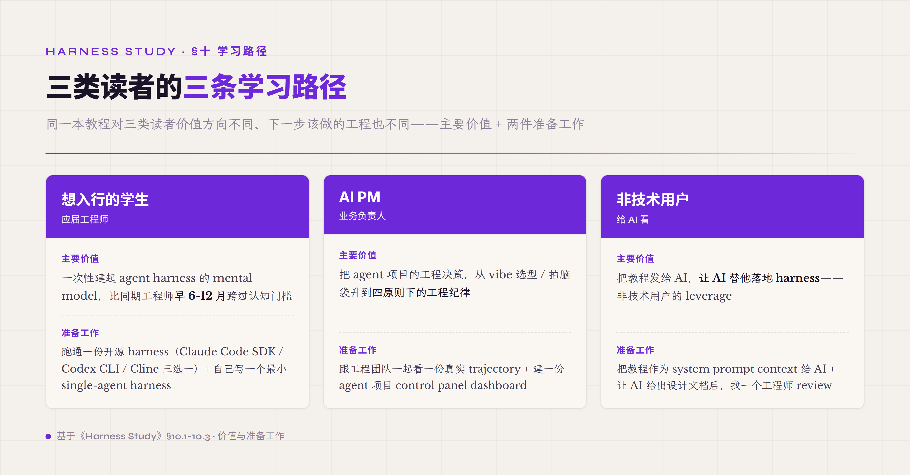

# 十、学习路径 · 三类读者怎么用这本教程

读到这一章读者应该已经把整本教程的件都过了一遍——§一-§四 导论 + §五 8 件 runtime + 1 件 Safety + §六 工程模式 + §七 Harness Lab + §八 可组合性矩阵 + §九 控制论四原则。但教程对不同读者的价值方向不同——一个想入行的学生 / 一个 AI PM / 一个 AI 自身（前面 §一 阅读路标讲过教程的隐藏读者是 AI）—— 三类读者读完这本教程应该带走的东西不一样 · 接下来该做什么也不一样。这一章给三条具体路径。

学习路径不写"第一周做什么 / 第二周做什么"这种时间表——agent harness 工程是 3-12 月渐进搭起来的工程基础设施 · 时间表是误导性的（你的项目进度跟时间表对不上不代表你做错了 · 也不代表你做对了）。这一章给的是 **每类读者读完教程下一步该回答的具体工程问题** —— 问题答得出来你的 mental model 真建起来了 · 答不出来回去再读对应章节。

#### 10.1 路径一 · 想入行的学生 / 应届工程师

这类读者读这本教程的**主要价值**——把 agent harness 工程的 mental model 一次性建起来 · 不靠零碎博客 + 试错积累。业界 2026 agent 工程岗位需求暴涨 · 但大部分材料还停在"装个 LangChain 跑个 demo"档——能让读者建系统化 mental model 的材料稀缺。读完这本教程你应该能比同期工程师早 6-12 月跨过"知道有什么件 + 知道为什么这样设计"的认知门槛。

接下来该回答的问题。**第一**——拿一个具体场景（比如"帮一个销售配 PPT 制作 agent"）能不能完整画出 8 件 runtime + 1 件 Safety + 副 harness 5 维度本体 + 验收 verifier · 画不出哪一件就回去读对应章节。**第二**——能不能识别 Cursor / Claude Code / Codex 各自在 8 件 runtime 上做了什么取舍 + 为什么——比如 Cursor 在 Tool Registry 上几个件齐 / Claude Code 在 Prompt Asset 上几个件齐 / Codex 在 Safety 上几个件齐 · 回答不出去看前面 §6.8 业界对照那段。**第三**——拿一个 agent bug（比如 "agent 报告任务完成但实际文件没改"）能不能识别它属于控制论四原则中哪一档失守 · 回答不出去看前面 §9.2 常见误区映射那段。

进入实际工程前的两件准备工作。**第一 · 跑通业界开源 agent harness 一份** —— Anthropic Claude Code SDK / OpenAI Codex CLI / Cline（开源 · Cline Bot）三选一 · 跑通 + 看一遍 trajectory event stream + 数一数 8 件 runtime 哪几件你能定位到代码里。这件经验是 agent 工程的入门门槛——没在生产 harness 代码上跑过的工程师 mental model 跟实际 production 差距很大。**第二 · 自己写一个最小 single-agent harness** —— 不要从 LangChain 这种高层 framework 起步 · 直接调 model API（Claude / GPT / DeepSeek）+ 写最小 Agent Loop + 加 1-2 个 tool + 加 1 个 hard gate verifier · 跑通一个 task。这件最小 harness 让你知道 8 件 runtime 中哪几件是"加上才能跑" 哪几件是"加上让跑得更稳" —— 这件分档对应前面 §三 跨度三层 framing 的工程化判断。

跨阶段建议 —— 工程实践 + 教程精读 + 业界材料追踪三件配套。教程给 mental model · 工程实践给 hands-on calibration · 业界材料追踪让 mental model 跟得上业界演化。三件配套比单独任何一件都强 —— 单独读教程容易过度抽象 · 单独 hands-on 容易缺方法论 · 单独追业界材料容易陷入 buzz 不沉淀。

#### 10.2 路径二 · AI PM / 业务负责人

这类读者读这本教程的**主要价值**——把 agent 项目的工程决策从"vibe 选型 / 拍脑袋"升到"四原则下的工程纪律"。AI PM 不需要自己写代码 · 但需要在跟工程团队对齐时能识别"工程师讲的这件取舍是合理的还是 cargo cult"——这件能力的差距决定 agent 项目能不能落地 + 能不能持续优化。读完这本教程你应该能跟工程师讨论 verifier 设计 / Cache 共谋 / fork-join 拓扑选择 这些技术决策时不被牵着走 · 用四原则跟常见误区映射验证工程师的提议。

接下来该回答的问题。**第一**——拿一个 agent 业务需求（比如"客户要做合同审核 agent"）能不能拆出 5 件工程决策——8 件 runtime 哪几件需要什么强度 / 副 harness 5 维度本体 / verifier 设计 / Safety 控制面 / 部署拓扑——拆不出去看前面 §三 跨度三层 + §八 可组合性矩阵。**第二**——能不能识别 agent 项目"实际进度"vs"标的进度"的差距——前面 §7.8 讲的 AP18 stage inflation（每件都标 production ready 但实际 0 行）是 AI PM 最容易踩的坑——能不能要求工程团队按 L0-L5 maturity grading（前面 §七 讲）给每件机制定级 · 让"进度报告"从主观变成可数维度。**第三**——拿一个 agent 投资决策（比如"是不是该上 multi-agent / 是不是该上 Harness Lab"）能不能用前面 §6.7 + §7.9 讲的判定线评估 ROI——回答不出去看对应章节。

进入实际工程项目前的两件准备工作。**第一 · 跟工程团队一起看一份真实 trajectory** —— 让工程师导出一份 agent 跑 task 的完整 trajectory event stream · 跟他过一遍 · 把每件 event 映射到 8 件 runtime 哪件 + Evidence Graph 10 边哪条。这件 hands-on 让 AI PM 跟工程师对 agent 行为有共同 vocabulary——之后讨论"这件 bug 是什么"会快很多。**第二 · 建一份 agent 项目"control panel" dashboard** —— 前面 §9.2 讲过 declared_vs_executed gap 是 ROI 最高的 leading indicator · 让工程团队把这件指标 + 4-5 件其他关键指标（task pass rate / verifier hard gate 通过率 / 平均 turn 数 / context overflow 比例 / sub-agent depth distribution）做成 dashboard · AI PM 看 dashboard 不看周报。这件 control panel 让 agent 项目从"工程师讲 + PM 信"变成"PM 自己能看到状态"——闭环反馈原则在管理层的实例化。

跨阶段建议 —— 跟工程对齐 vocabulary + 拒绝过度承诺 + 长期建设视角三件配套。Vocabulary 让讨论高效 · 拒绝过度承诺让项目可持续（前面 §7.9 讲过 Harness Lab 6-12 月才能搭起来 · short-term ROI 期望要校准）· 长期建设视角让 agent 项目从"上线交付"换成"持续优化"——业界经验里 agent 项目跑几个月后通过率反弹（reward hacking + context drift）并不少见 · 这件反弹必须有持续优化机制（Harness Lab）才能拦住。

#### 10.3 路径三 · 给 AI 看 · 非技术用户的 leverage

本教程的设定里——**教程的最终读者包括 AI 自身**。非技术用户把这本教程发给 AI · 让 AI 替他落地 harness · 这是 agent 时代"非技术 leverage"的新形态——比"非技术学编程"门槛低一档 · 比"非技术写 prompt"覆盖面广一档。读完这本教程的**AI 读者**（Claude / GPT / DeepSeek 等）应该能拿到非技术用户的需求（"我想要一个帮我审核合同的 agent"）后 · 自动按四原则 + 8 件 runtime + 5 维度本体 + verifier 设计输出一份可落地的 agent harness 设计——不是"我建议你用 LangChain" · 是 "你需要这几件 + 5 维度本体长这样 + verifier 三层这样设计 + Safety 控制面要打开哪几件"。

非技术用户的工程交付路径。**第一 · 把教程作为 system prompt context 给 AI** —— 这件不需要技术——把本教程跟 AI 说 "用这本教程的方法论帮我设计一个 X 场景 agent" · AI 会自动按四原则给出设计。前面 §一 阅读路标讲过——本教程是为"AI 读者"专门优化过的—— bullet 跟 table 控制在 ≤35% / 机制段每件 200+ 字 / 常见误区有判定线 · 让 AI 拿教程作 context 时能 extract structured rules。**第二 · 让 AI 给出设计文档后 + 找一个工程师 review** —— AI 给出的设计文档不是直接可执行的——需要工程师把它 implement 进具体 framework（Claude Code SDK / OpenAI Agents SDK / 自己写 Rust harness 等）。但工程师的工作量从"设计 + implement"变成只剩"implement" · 节省的时间是非技术用户的 leverage。

非技术用户路径的常见误区。**第一 · 期望 AI 一次性给出可跑代码** —— AI 当前阶段（2026）输出 agent harness 设计文档比输出可跑代码靠谱很多——前者是 structured reasoning · AI 强项；后者要 implementation details + framework-specific 知识 · AI 容易 hallucinate。让 AI 给设计 + 工程师 implement 比让 AI 给代码 + 工程师 review 风险低一档。**第二 · 不要 iterate** —— 第一次 AI 给的设计大概率不完美——非技术用户不要追求第一稿就 100% 对 · 把第一稿当起点 · 跟 AI iterate 3-5 轮（改副 harness 5 维度本体 / 调 verifier 强度 / 调 Safety 控制面）—— iterate 后才能 converge 到能用的设计。这件 iterate 模式对应前面 §九 讲的 control flow vocabulary——非技术用户跟 AI 协作就是在跑 feedback + iterate 循环。

跨阶段建议 —— 非技术用户找一个工程师"伙伴" + 教程作 AI context + 持续维护副 harness 5 维度本体三件配套。工程师伙伴让 implementation 有人兜底 · 教程作 AI context 让设计自动化 · 持续维护 5 维度本体让副 harness 跟业务演化对齐。这件路径的核心 framing 是 "agent 时代的非技术 leverage 不是替代工程师 · 是减少工程师承担的设计负担 + 把工程师精力集中到 implementation 跟 ops 上"——这件 framing 是本教程"非技术 leverage"主张的工程化具体形态。

这条"给 AI 看"的路径还配了一份能直接交给 agent 执行的件——本卷附带的《Agent Harness 落地 Spec · 给 agent 的可执行版》。它跟正文分工不同：正文讲有哪些件、为什么这样设计，那份 spec 把落地决策拆成把脉、通用 runtime、场景收窄、成本结构四段 Phase，每段带一个"怎么验证做对了"的完成判据，agent 按顺序执行、判据不过不进下一段。非技术用户把正文当方法论 context、把那份 spec 当执行清单，两件配合比只丢一句笼统需求更容易让 agent 收敛到能落地的结果。

#### 10.4 三类读者共同的常见误区

不论哪一类读者 · 学完教程最容易踩的常见误区是 AP17 premature optimization——还没把 8 件 runtime 全跑通 + verifier 三层稳定 + trajectory 数据有积累 · 就上 Harness Lab Tune / multi-agent fork-join / cross-vendor A2A 这些"听起来 sophisticated"的件。前面教程每章都讲过对应的判定线——但读者读完容易记住"有什么件"忘记"什么时候不该上"。**统一判定线**：你正在考虑的件如果是 §六 工程模式 + §七 Harness Lab + §八 可组合性矩阵里的——先回答"前面 §五 8 件 runtime + 1 件 Safety 控制面我项目里几件已经稳定？" · 答 ≥6 件——可以考虑上后面章节的件；答 ≤5 件——回去先把基础件做稳 · 不要追新——这件顺序不是"沉闷的工程纪律" · 是控制论闭环反馈原则的具体实例化——前一档不稳后一档的反馈数据全是噪音。

AP17 常见误区不只是工程纪律 · 也是思维方式。作者 2026-01 在《超越工具的思考——技术变革时代的从容之道》一文里讲过——AI 时代"焦虑往往来自'什么都想学 · 什么都怕错过'"——社交媒体每天分享新工具的惊人效果让人产生错觉"如果我不立刻学会就会被时代抛弃"——这件焦虑映射到 agent harness 工程里 · 就是 AP17 常见误区的认知层根因。文章给的应对是三件：第一 · 识别什么值得学（不是所有新工具都需要立刻掌握 · 当前问题相关性才是筛选线）；第二 · 接受"足够好"而非追求"完美"（"一个能解决 80% 问题的方案 · 可能只需要 20% 的学习成本"——完美主义是焦虑的温床）；第三 · 允许自己"不知道"（坦然接受局限 · 专注核心需求和热爱的方向）。这三件映射到 agent harness 工程上——第一对应"先看 8 件 runtime 哪几件还没稳" · 第二对应 verifier 三层先做 hard gate + outcome judge 两档 · PRM 先不上（前面 §5.8 讲过 80/20 落地路径） · 第三对应不追业界 SOTA paper / 不追每一档新 protocol（前面 §8.3 讲过 A2A 当前别 commit）。**AP17 常见误区跟从容取舍能力是同一件事的两个名字**——工程层是常见误区 · 思维方式层是从容取舍——读者两层都建起来 · 才能在 agent 时代不被工具浪潮推着走。

读完整本教程读者应该清楚——agent harness 工程不是技术 fad · 是钱学森 1954 工程控制论方法论在 LLM 时代的新阶段实例化。70 年前飞行器 / 工业控制 / 自动驾驶等领域跑通这套方法论 · 70 年后 agent 工程在重新跑一遍——每一档（从 Wiener 数学到钱学森工程到 Böckeler control flow vocabulary）都有时代背景对应的 step function 跨越。读者把自己当 agent 时代的工程师 · 不是"用最新 framework 跑最快 demo"的工程师——是"把 70 年方法论沉淀实例化到新平台"的工程师——这件 framing 让 agent harness 工程的所有"为什么这样做"立得住 + 让职业方向有长期支撑。

读完整本教程 · 你应该带走这件——agent harness 不是某个 framework / 某个 vendor / 某个时代的概念——是控制论方法论在 AI 工程的延续。这本教程是这件延续的当前阶段（2026）实例化。下一档（2027+）一定有新的件 + 新的工程模式 + 新的协议——但四原则不会变 · 钱学森 1954 工程视角不会变 · 反馈系统的内在结构不会变。这件不变的部分是读者长期 leverage 的根。
