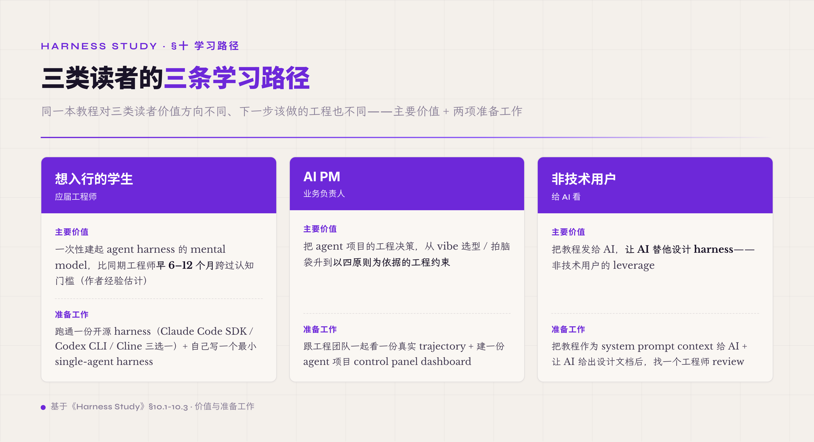

# 十、学习路径 · 三类读者怎么用这本教程

读到这一章，读者应该已经把整本教程的内容过了一遍：§一至§四 是导论；§五 讲 8 个 runtime 机制和 Safety 控制面；§六 讲工程模式；§七 讲 Harness Lab（用评测、消融、调参迭代改进 harness 的外层工作台）；§八 讲可组合性矩阵；§九 讲控制论四原则（可观测、可控、稳定、闭环反馈）。但这本教程对不同读者的价值不同。想入行的学生、AI 产品经理（PM），还有 AI 本身（本教程在写法上也考虑了 AI 读者，见 10.3），读完应该带走的东西不一样，接下来该做的事也不一样。这一章给出三条具体路径。

*图 10.1 · 三类读者的三条学习路径*

这一章不写"第一周做什么、第二周做什么"这样的时间表。agent harness 是要花几个月到一年（经验值，3–12 个月）逐步搭起来的工程基础设施，给出时间表反而误导人，进度快慢也说明不了做得对不对。这一章给的是**每类读者读完教程后，下一步该回答的具体工程问题**。答得出来，说明心智模型（mental model）真的建起来了；答不出来，就回到对应章节重读。

#### 10.1 路径一 · 想入行的学生 / 应届工程师

对这类读者，本教程的**主要价值**是把 agent harness 工程的心智模型一次建起来，不必靠零散的博客和反复试错慢慢拼凑。2026 年 agent 工程岗位的需求增长很快，但大部分材料还停留在"装个 LangChain 跑个 demo"的层次，能帮人建立系统化认识的材料很少。读完这本教程，你应该能比同期工程师更早跨过"知道有哪些机制，也知道为什么这样设计"这道认知门槛（作者的经验估计是早 6–12 个月）。

接下来要回答三个问题。

1. 拿一个具体场景（比如"给销售配一个制作 PPT 的 agent"），能不能完整画出 8 个 runtime 机制、Safety 控制面、副 harness 的 5 维度本体和验收用的 verifier？副 harness 指按任务动态调起、带领域规则的子 harness；5 维度本体借用了"本体"一词，指它的领域模型 schema，由实体、属性、关系规则、状态机、操作集五部分组成（见 §8.5）。哪一部分画不出来，就回去读对应章节。
2. 能不能说清 Cursor、Claude Code、Codex 各自在 8 个 runtime 机制上做了什么取舍、为什么？比如 Cursor 的 Tool Registry 做到了哪些，Claude Code 的 Prompt Assets 做到了哪些，Codex 的 Safety 做到了哪些。答不出来，去看 §6.8 的业界实现对照。
3. 拿一个 agent 缺陷（比如"agent 报告任务完成，但文件实际没改"），能不能判断它是控制论四原则里哪一条失守？答不出来，去看 §9.2 把各类反模式映射到四原则的那一节。

进入实际工程之前，先做两项准备。

**第一，跑通一个开源的 agent harness。** 在 Anthropic Claude Code SDK、OpenAI Codex CLI、Cline（开源，出品方 Cline Bot）里任选一个，跑通它，看一遍它产生的 trajectory 事件流，再数一数 8 个 runtime 机制里有几个你能在它的代码里找到。这是 agent 工程的入门门槛：没在生产级 harness 代码上跑过的工程师，脑子里的模型和真实生产环境差距很大。

**第二，自己写一个最小的单 agent harness。** 不要从 LangChain 这类高层框架起步，而是直接调用模型 API（Claude、GPT、DeepSeek 均可），写一个最小的 Agent Loop，加 1–2 个工具，再加 1 个 Hard Gate（代码可判定的硬性检查）作为 verifier，跑通一个任务。写完这个最小 harness，你就知道 8 个机制里哪些是"加上才能跑"，哪些是"加上跑得更稳"。这个区分对应 §五 给每个机制标的 P0 / P1 / P2 优先级：先有能跑起来的最小集合，再往上加让系统更稳的部分。

贯穿各阶段的建议是三件事配合着做：工程实践、精读教程、跟踪业界材料。教程提供心智模型，工程实践让你亲手校准这个模型，跟踪业界材料让它跟得上业界的变化。三者配合比单做任何一项都强：只读教程容易过度抽象，只动手容易缺方法论，只追业界材料容易被热词带着走，不成体系。

#### 10.2 路径二 · AI PM / 业务负责人

对这类读者，本教程的**主要价值**是把 agent 项目的工程决策从凭感觉选型、拍脑袋，提升到以四原则为依据的工程约束。AI PM 不需要自己写代码，但跟工程团队对齐时需要判断：工程师讲的某个取舍是合理的，还是只学了形式、没学到原因的照搬（cargo cult）。这种判断力的差距，决定 agent 项目能不能落地、能不能持续优化。读完这本教程，你跟工程师讨论 verifier 设计、复跑不独立（AP01，见附录 F）、fork-join 拓扑（主 agent 分出多个子 agent 并行执行再汇总，见 §6.6）这些技术决策时，应该不会被牵着走，能用四原则和反模式映射去检验工程师的提议。

接下来要回答三个问题。

1. 拿一个 agent 业务需求（比如"客户要做一个合同审核 agent"），能不能拆出 5 项工程决策：8 个 runtime 机制各需要做到什么强度、副 harness 的 5 维度本体、verifier 怎么设计、Safety 控制面怎么设、部署拓扑怎么选？拆不出来，回头看 §五 各机制的优先级和 §八 可组合性矩阵。
2. 能不能看出 agent 项目"实际进度"和"报告进度"之间的差距？§7.8 讲的阶段虚标（stage inflation，AP18，见附录 F），即每个机制都标着"可上生产"、实际一行代码都没写，是 AI PM 最容易踩的坑。你能不能要求工程团队按 L0–L5 成熟度分级给每个机制定级？这是第二卷《架构与工程卷》提出的机制成熟度尺：L1 表示项目里有这个机制，L2 表示 trajectory 里能看到它产生的事件，级别越高越接近经过验证、可上生产。有了它，进度报告就从主观描述变成可以逐项核对的清单。
3. 拿一个 agent 投资决策（比如"该不该上多 agent""该不该建 Harness Lab"），能不能用 §6.6 和 §7.9 给出的判断标准评估投入产出？答不出来，去看对应章节。

进入实际项目之前，先做两项准备。

**第一，跟工程团队一起看一份真实的 trajectory。** 请工程师导出一份 agent 执行任务的完整 trajectory 事件流，和他一起过一遍：每个事件对应 8 个 runtime 机制里的哪一个，又对应 Evidence Graph 里的哪条边。Evidence Graph 是 §8.4 定义的 10 种关系边（如 calls_tool、produces、verifies），用来描述 agent 运行时谁对谁做了什么。一起做过这件事，AI PM 和工程师在描述 agent 行为时就有了共同的词汇，以后讨论"这个缺陷是怎么回事"会快很多。

**第二，建一个 agent 项目的"控制面板"（dashboard）。** §9.2 讲过，declared_vs_executed 差距持续偏高是反馈系统失守的前哨信号（leading indicator，出问题之前就能预警的信号），而且用 Evidence Graph 现有的边就能直接算出，不需要新增埋点。它衡量的是 agent 声称完成的动作，与 trajectory 里有证据支撑的动作之间差了多少。让工程团队把这项指标和另外 4–5 项关键指标一起做成 dashboard：任务通过率、verifier 硬性检查（Hard Gate）通过率、平均轮数、上下文溢出比例、子 agent 嵌套深度分布。AI PM 看 dashboard，不看周报。有了这块面板，agent 项目就从"工程师讲、PM 信"变成"PM 自己能看到状态"，这是闭环反馈原则在管理层面的体现。

贯穿各阶段的建议也是三件事配合：跟工程团队统一词汇，拒绝过度承诺，用长期建设的眼光看项目。统一词汇让讨论高效。拒绝过度承诺让项目可持续：§7.9 讲过，Harness Lab 要 6–12 个月才能搭起来（经验值），对短期投入产出的期望要相应校准。长期建设的眼光，让 agent 项目的目标从"上线交付"变成"持续优化"。从业界经验看，agent 项目运行几个月后通过率回落的情况并不少见，原因包括奖励投机（reward hacking）和上下文漂移（context drift）；要拦住这种回落，必须有持续优化机制，也就是 Harness Lab。

#### 10.3 路径三 · 交给 AI 执行 · 非技术用户的杠杆

本教程的设定里，**读者也包括 AI 本身**。非技术用户把这本教程交给 AI，让 AI 替自己设计 harness，这是 agent 时代非技术用户借力的一种新形态：门槛比"非技术人员学编程"低，覆盖面比"非技术人员写 prompt"广。读完这本教程的 **AI 读者**（Claude、GPT、DeepSeek 等），拿到非技术用户的需求（"我想要一个帮我审核合同的 agent"）后，应该能按四原则、8 个 runtime 机制、5 维度本体和 verifier 设计，输出一份可实现的 agent harness 设计。它给出的不应该是"我建议你用 LangChain"，而是"你需要这几个机制，5 维度本体长这样，verifier 三层这样设计，Safety 控制面要打开这几项"。

非技术用户的交付路径分两步。

**第一，把教程作为上下文交给 AI。** 这一步不需要技术：把本教程交给 AI，告诉它"用这本教程的方法帮我设计一个 X 场景的 agent"，AI 就会按四原则给出设计。本教程在写法上专门考虑了 AI 读者：列表和表格的篇幅控制在 35% 以内，每个机制的段落在 200 字以上，每个反模式都配有判断标准。这样 AI 把教程当上下文时，能从中提取出结构化的规则。

**第二，拿到 AI 的设计文档后，找一个工程师审阅。** AI 给出的设计文档不能直接执行，需要工程师把它实现到具体框架里（Claude Code SDK、OpenAI Agents SDK，或自己用 Rust 写的 harness 等）。但工程师的工作量从"设计加实现"减少到只剩"实现"，省下的时间就是非技术用户借到的力。

这条路径上，非技术用户容易陷入两个误区。

**第一，期望 AI 一次给出能跑的代码。** 在当前阶段（2026 年），AI 输出 agent harness 的设计文档比输出能跑的代码可靠得多。前者是结构化推理，是 AI 的强项；后者需要大量实现细节和特定框架的知识，AI 容易产生幻觉。让 AI 出设计、工程师来实现，比让 AI 出代码、工程师来审阅风险更低。

**第二，不做迭代。** AI 第一次给的设计大概率不完美。非技术用户不要追求第一稿就完全正确，而是把第一稿当起点，跟 AI 来回改几轮（经验上 3–5 轮）：调整副 harness 的 5 维度本体，调整 verifier 的强度，调整 Safety 控制面。迭代之后，设计才会收敛到能用的程度。这种迭代方式对应 §9.6 的前馈、反馈、迭代三种控制流模式（前两项借自 Böckeler，迭代是本书补充的）：非技术用户跟 AI 协作，本身就是在跑一个"反馈加迭代"的循环。

贯穿各阶段的建议同样是三件事配合：非技术用户找一个工程师作伙伴，把教程作为 AI 的上下文，持续维护副 harness 的 5 维度本体。工程师伙伴让实现有人兜底，教程作上下文让设计工作可以交给 AI，持续维护 5 维度本体让副 harness 跟着业务一起演化。这条路径的核心主张是：agent 时代非技术用户借到的力，不是替代工程师，而是减轻工程师承担的设计负担，把工程师的精力集中到实现和运维上。这也是本教程"非技术用户借力"这一主张的具体形态。

这条"交给 AI 执行"的路径还配了一份能直接交给 agent 执行的文件：本卷附带的《Agent Harness 实施 Spec · 给 agent 的可执行版》（第十一章）。它跟正文分工不同。正文讲有哪些机制、为什么这样设计；那份 Spec 把实现决策拆成四个阶段（Phase）：行为探测（behavioral probing，本书也称"把脉"）、通用 runtime、场景收窄、成本结构。每个阶段都带一条"怎么验证做对了"的完成标准，agent 按顺序执行，不达标就不进入下一阶段。非技术用户把正文当方法论上下文，把那份 Spec 当执行清单，两者配合，比只给一句笼统的需求更容易让 agent 得出能实现的结果。

#### 10.4 三类读者共同的反模式

不论哪一类读者，学完教程最容易踩的坑都是过早优化（premature optimization，AP17，见附录 F）：8 个 runtime 机制还没全部跑通，verifier 三层还没稳定，trajectory 数据也还没积累起来，就去上 Harness Lab 的调参（Tune）、多 agent 的 fork-join、跨厂商的 agent 互操作协议 A2A 这些"听起来很高级"的东西。教程每一章都讲过对应的判断标准，但读者读完容易记住"有什么"，忘了"什么时候不该上"。

**统一的判断标准**是：如果你正在考虑的东西属于 §六 工程模式、§七 Harness Lab 或 §八 可组合性矩阵，先回答一个问题："§五 的 8 个 runtime 机制加 Safety 控制面，我的项目里已经有几个稳定了？"答案是 6 个或更多，可以考虑后面章节的内容；5 个或更少，先回去把基础机制做稳，不要追新（这条分界是经验值）。这个顺序不是"沉闷的工程规矩"，而是控制论闭环反馈原则的具体体现：前一层不稳，后一层拿到的反馈数据全是噪声。

AP17 不只是一个工程上的反模式，也关乎思维方式。作者 2026 年 1 月在《超越工具的思考——技术变革时代的从容之道》一文里讲过：AI 时代的"焦虑往往来自'什么都想学，什么都怕错过'"。社交媒体每天都在分享新工具的惊人效果，让人产生一种错觉："如果我不立刻学会，就会被时代抛弃。"这种焦虑落到 agent harness 工程里，就是 AP17 在认知层面的根源。文章给出的应对有三条：

1. 识别什么值得学：不是所有新工具都需要立刻掌握，跟当前问题是否相关才是筛选标准。
2. 接受"足够好"，而不是追求"完美"："一个能解决 80% 问题的方案，可能只需要 20% 的学习成本"，完美主义是焦虑的温床。
3. 允许自己"不知道"：坦然接受局限，专注于核心需求和热爱的方向。

这三条对应到 agent harness 工程上：第一条是先看 8 个 runtime 机制里哪几个还没稳；第二条是 verifier 三层先做 Hard Gate 和 Outcome Judge（模型评审）两层，过程奖励模型（PRM）先不上（§5.8.9 的起步建议讲过，PRM 这第三层只在多步推理任务上才加）；第三条是不追业界最新的论文，也不追每一个新协议（§8.3 讲过，A2A 目前先不要押注）。**AP17 和从容取舍的能力，是同一件事的两个名字**：在工程层面它是一个反模式，在思维方式层面它是从容取舍。两层都建立起来，读者才能在 agent 时代不被工具浪潮推着走。

读完整本教程，读者应该清楚：agent harness 工程不是一阵技术风潮，而是钱学森 1954 年《工程控制论》那套方法在大模型时代的新阶段。1950 年代前后，飞行器、工业控制、自动驾驶仪（autopilot）等领域把这套方法跑通了；如今，agent 工程在重新跑一遍。每一步（从 Wiener 的数学理论，到钱学森的工程方法，再到 Böckeler 借用的前馈/反馈控制词汇）都对应一次与时代背景相连的跃升。读者可以把自己看作 agent 时代的工程师：不是"用最新框架跑出最快 demo"的工程师，而是"把几十年的方法论积累落到新平台上"的工程师。这样看，agent harness 工程里所有"为什么这样做"都有了依据，职业方向也有了长期的支撑。

读完整本教程，你应该带走这样一个认识：agent harness 不属于某个框架、某家厂商或某个时代，它是控制论方法在 AI 工程中的延续，这本教程是这一延续在当前阶段（2026 年）的具体形态。下一阶段（2027 年以后）一定会有新的机制、新的工程模式、新的协议，但四原则不会变，钱学森 1954 年的工程视角不会变，反馈系统的内在结构也不会变。这些不变的部分，才是读者可以长期依靠的根基。
