# 一、参考架构与检验坐标系

> v4.0 · 2026-07-20 · 依据 SPEC.md §八 章 spec v2.1（三幕结构：全景→展开→回望）重写 · 待用户审
> 章名由"参考架构与统一语言"改为现名（cybernetic 评审建议：标题应命名本章第一交付物——坐标系）；过审后需回写大纲 v5.4 与 README，统一语言职责由附录 A/B 承担不变。
> 旧稿 `01-architecture-v3.0.md`（v3.0）、`01-architecture.md`（v2.1）留档对照（已迁 Agent-Z 仓 what-is-harness/volume2/archive/）。配图 3 张待补（六契约×四原则矩阵 / 组件图 / 时序图），占位以文字图代。（本版本注与"审稿日志""引用来源"两节同属编辑工作区，出版前整体删除。）

## 1.0 全景：先把地形看一遍

在 Harness Study 入门卷里我们主要展示了一张部件蓝图——agent loop、model adapter、tool registry、context 与 memory、trajectory、verifier，外加 safety 控制面。大家读完会对八件东西是什么、为什么存在、在一次 turn 里怎么咬合，有了一定的概念。多数读者接下来做的事也一样：照着蓝图，让 AI 动手，把一个属于自己的 agent 搭了起来。检查一遍，该有的都有——loop 在转，工具挂上了，压缩、验证一样不少。

然后真正的问题出现了，agent loop 的架构使得每次输入都有有效响应，每次对话 agent 都能进行工具调用、输出点结果，但总感觉这个智能体笨笨的。有的读者还会遇到 agent 声称任务做完了，翻开工作区，其实没做。同一个工具悄悄跑了两遍，token 账单和产物都翻倍。界面卡在"生成中"，后台的进程其实早就死了。这些事没有一件的原因是我的智能体缺东西，明明每一个部件都有，但每个部件好像都有点问题；更麻烦的是，干没干到好、还有没有提升空间，从外面看不出来。

遇到这些情况，按照传统的软件开发思路“能跑就不要动代码”，首先选择在外面打补丁，但智能体内和大模型交互的过程就那么几个，改几十版系统提示词好像提升也不大？然后读者的另一个反应是怀疑自己的手艺，接着是怀疑模型不够强。两个方向都值得先放一放，有研究结果证明是其他地方出问题了。基准研究 Harness-Bench 专门为量化 harness 的影响设计过一个控制实验：把 8 个模型后端接进 6 个 harness，跑同一组 106 个沙箱任务——模型不动，只换 harness，最好与最差差 23.8 分（NanoBot 76.2 对 OpenClaw 52.4）。那是 0-100 的复合分，完成度、安全与执行过程质量相乘得出，不是通过率【预印，arXiv:2605.27922】。另一头，故障分类研究 MAST 做的是事后剖析：分类法先由专家在 150 条轨迹上人工标出来，三轮标注者间一致性 Kappa 0.88，不系于单个标注者。再由一个与人工专家一致性 Kappa 0.77 的 LLM 标注器把分类法铺到 7 个框架的 1642 条轨迹上，得到数据集 MAST-Data。三类故障全落在系统设计层：规范缺陷 44.2%、协调失败 32.3%、验证缺失 23.5%。不换模型，只给 ChatDev 加一道高层任务目标的验证，任务成功率回来 15.6 个百分点——那是该文所有干预里最大的一档【评审，arXiv:2503.13657 v3，NeurIPS 2025 D&B；三占比取自 v3 图 1】。

两份研究结果指向同一个观点，也是这一卷的命题：**harness 的工程质量是独立变量**，即在模型能力之外独立决定系统表现、值得独立投入的那个变量。部件蓝图管"零件齐不齐"，这个变量管"零件之间的约定成不成立"——本卷把这些从来没写下来的约定一条条写成明文，再用故障证明它们真的成立。

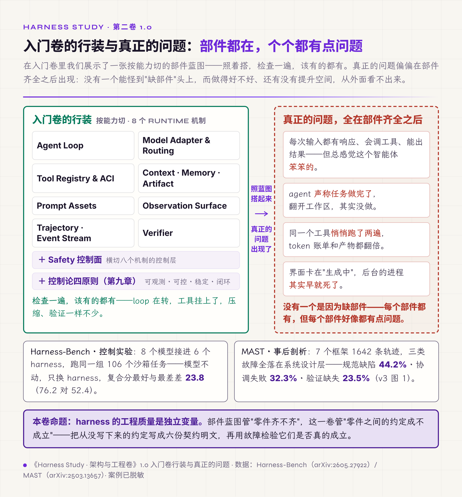

*图 1.0 · 入门卷的行装与真正的问题：部件都在、个个都有点问题，两份研究结果把病根钉在部件之外*

Harness-Bench 的同一份数据里还藏着一条对选型的提示：越强的模型，跨 harness 方差越小——前沿模型能在较差的 runtime 里自我补救，弱一档的模型没这个本事。由此可推：runtime 质量对中小模型与私有化部署的价值最高。换句话说，模型越是不顶级，这一卷讲的东西越有价值，这正是多数企业级场景所需要的。

在 Harness 工程实践中，我们总结了六个契约，契约可以理解为系统与外界的合同，每个合同承诺一个事情。

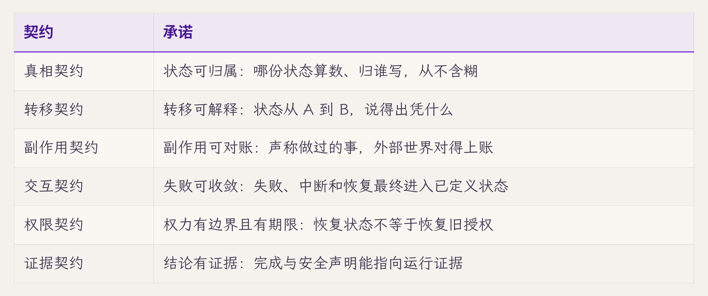

合同之外还有一层：每份合同签了之后，我们还得回答四个问题——**看得见吗（可观测）、管得住吗（可控）、扰动下稳吗（稳定）、改进有数据吗（闭环）**。六份契约是横轴，四个问题是纵轴，交出一张检验矩阵。这张矩阵是全卷的地图：第一章做一个概述，第二章教怎么把四个问题变成可操作的测量，第三章用一次真实事故检验它，第四章把整张架构蓝图展开，第五章到第十四章每章对矩阵的几个格子进行详解，第十五章横轴不动、纵轴换成评审用的追问面，去审核已有的智能体。

这张矩阵现在只需要记个轮廓，六份契约的名字、四个问题的问法。每一格里装什么，后面各章会逐个带进去。读到这里，手里应该有三样东西：一个命题（工程质量是独立变量）、一张地图的轮廓、一个悬念：部件明明都对，约定为什么会不成立？下面三节把这个悬念拆开。

## 1.1 三个失效的默认值

这个悬念要从一个更早的问题拆起：把 agent runtime 当普通在线服务来搭，错在哪里？在线服务二十年攒下的可靠性工程——框架、重试中间件、发布流程、SRE 手册——押在三个默认值上：进程可弃、重试无害、行为可复现。这三个默认值不写在任何文档里，它们以出厂设置的形式活在每一层基础设施中。agent 一来，三个默认值逐个失效，而失效是无声的。

进程可弃的默认，活在发布流程里。滚动发布随手杀进程，因为在途请求毫秒级结完，杀掉的损失一次重试就补回来；业务进程无状态，真相全在数据库，挂了拉起来就是——重启是运维的万能药。agent 把两个前提同时抽掉。它一次运行分钟到小时级，横跨部署、重启、断连；服务照旧随手发布，每次发布都以用户跑到一半的任务为代价。loop 又恰恰满身状态——半轮输出、工具结果、下一步计划全在内存里攒着。重启大法照吃不误，结果是库里只剩开头几步，用户半小时的推进凭空蒸发。**执行跨越故障边界**，"进程活着"从隐含前提变成撑不满全程的运气。传统计算机科学处理过长活任务——长事务、工作流引擎、durable execution 是一整个领域——但那从来没进过 web 框架的默认件，得自己去研究。

重试无害的默认，活在超时逻辑里。超时了就重发，反正 GET 幂等、去重键兜底，重试次数是个随手填三的配置项。agent 的每一步都可能改文件、发消息、消耗 token，超时重试一个"发邮件"工具，客户收到两封。**副作用泄向外部世界**，幂等从基础设施的附加品变成每一步的显式义务，而没人通知过重试逻辑这件事。

传统开发默认行为是可复现的，出了 bug 复现一遍，改了代码回归一遍，怀疑哪里不对 diff 一遍——全部以"同一输入给同一输出"为前提。模型偏偏在这里例外：同一份输入，两次输出可能不同。虽然在命中大模型缓存的情况下输出相同的概率会高一些，但智能体开发的过程中往往会在请求头加入随机字符来避免命中缓存。所以会出现**核心组件的输出不确定**，回归测试不能穷举，重放不能逐字节比对，"预期行为"从一个值变成一个分布。软件工程几乎全部验证手段都建立在确定性上，这个概念在智能体开发中变成了概率游戏。

麻烦不止三个变量各自，更在相乘：执行足够长，崩溃就会落在任意一步；每一步都有副作用，重试就可能重复任意动作；输出不确定，事后就无法靠重放判定当时发生了什么。到这里，1.0 的悬念解开了一半：约定之所以不成立，因为传统工程压根没为这三个变量立过约定。三个变量具体会破坏什么，得逐个说清——这是下一节六份契约的来路。

## 1.2 威胁清单与六类契约

上一节的三个变量，各自深入探究，我们逐个来分析。

跨故障执行的本质是**状态撕裂**：执行的中间成果住在内存，真相住在磁盘，两者随时分家；进程死在分家的瞬间，数据差异就会永久化。开头的"卡在生成中"、"界面早死"都是撕裂的真实运行故障。

副作用外泄的问题是**结果对不上**：工具返回成功不等于外部世界成功；重试造出第二笔副作用；agent 声称做完不等于真做完。"工具悄悄跑两遍"、"说做完了其实没做"往往是这一类维度的问题。

输出不确定会导致**无从归因**：传统排障的两板斧，重放复现和对照预期，重放不出同一条轨迹，预期本身是个分布。"日志翻半天不知道怪哪一层"是这类威胁的日常形态，而查看智能体执行轨迹大部分时候无法找到明确的问题节点。

为了避免这三类问题，靠在出事的地方打补丁行不通，补丁治的是上一次的路径，威胁下次换一条路进来就会失效。最典型的情况是不让智能体读项目外的文档，管住了对应工具、管住了 Bash，LLM 跑去用 Node 或者 Python。所以要挡住一类威胁，系统得给出一种在所有路径上都成立、并且可检验的承诺。哪六份承诺？我们尝试靠反推得出，如果崩溃已经发生、账已经乱了、轨迹已经无法重放，此刻系统最少要守住什么？

先对着状态撕裂问：进程死在半路无法根绝，那重启后的修复依托什么来展开？第一要明确以谁为准——**真相契约**：每个持久状态都有 owner、ID、版本和合法读写路径，"哪份算数"从不含糊。第二要保证悬着的东西有终点——**交互契约**：失败、中断和恢复最终进入已定义状态，不能恢复时明确终结。撕裂无法根绝，悬而不决可以根绝；而悬而不决的东西最后都暴露在用户眼前——卡住的"生成中"、断掉的输出，所以这份契约要放在交互面上。

再处理结果对不上的情况，事后对账的前提，是当时记过账。意图、尝试、结果、真实 outcome，四样少记一样，对账就多一个盲区——"工具返回成功"顶多算工具的一面之词，少了 outcome，盲区恰好盖住最贵的一类事故。四样记全就是**副作用契约**。

最后对着无从归因问：重放这条路死了，剩下的路只有两条。一条是原因当场记：每次状态变化带上触发事件、前置条件和终结原因，不指望事后推——**转移契约**。另一条是信任换成证据：完成、失败和安全声明都能指向运行证据，组件的话不可全信——**证据契约**。

第六份来自变量的组合：输出不确定的组件在长时执行中持有权力。不确定意味着权限不能靠 prompt 维持——模型可能被输入操纵，也可能单纯犯错，边界不能靠自觉；长时执行意味着授权要跨越崩溃、恢复与 fork——批过的事过了多久、换了上下文还算不算数，成了绕不开的问题。**权限契约**：权力有边界且有期限（第十一章）。

反推给出了六份，还差一个交代：凭什么至少是这六份，一份不缺？我们用一个三维网格查漏——**对象**（状态、副作用、权限、证据）×**事件**（创建、读取、修改、并发、失败、中断、恢复、删除）×**边界**（进程、worker、agent/subagent、网络、数据库、provider、工具、用户）。任何一个运行时问题都能落进某个格子。副作用 × 恢复 × 网络边界，问的是"请求超时但远端已成功，恢复后会不会重复执行"。权限 × 并发 × subagent 边界，问的是"并行子任务会不会扩大父任务权限"。状态 × 中断 × 进程边界，问的是"kill -9 之后 running 由谁收敛"。逐格扫过去，每个格子的问题都能归到六份契约之一的名下，没有哪个格子六份都管不着【经验/推导；本卷不穷举笛卡尔积，只用它查漏】。

这套反推可以整理成一条工程方法论：智能体调用大模型的整个流程里，我们把每个机制可能失效的情况逐个列出来，为每种失效设置防护。有一处得先交代清楚：单个机制怎么失效，列得出来；多个机制交互出的失效，组合太多，列不完，模型输出又不确定，设计时总有想不到的路径。所以防护设两道——列得出来的，写成契约，在设计时挡住；列不出来的，靠运行时的检验把违约暴露出来，这就是下一节四个问题要干的事。保障的目标也要说准确：每一次运行都收场可信——跑完的，有证据；跑不完的，有归宿。

六份契约压成一句话：**每个状态有归宿，每个故障有路径，每个中断可恢复或诚实终结。**这三句到 1.4 会各自兑现成时序上具体的落盘点，兑现不了的就是空承诺。到这里手里多了六份契约的来路。但合同有了问题可能还悬在半空。

## 1.3 合同之外：谁来检验合同

合同写了"什么不能坏"，可你怎么知道它真没坏？我们先看两个真实案例，都来自本教程配套实现项目。

第一个案例发生在一次交接审计里。当时项目刚结束一轮高速开发——3.5 小时合并 11 个 commit，声称一批新机制全部上线；换手接续开发之前，照例逐项对账：合并的机制有多少真的在工作。审计之前，这个项目的 hook 体系看上去无懈可击：commit message 完整，7 种 hook event 的 schema 定义齐全，trait 和 register 方法都写了，单元测试 `cargo test --workspace --lib` 287/287 全绿。审计跑了一遍 grep，结论是：hook 的注册线没有接进 session 引擎的创建路径，七种 event 里六种从不 emit——schema、trait、注册方法、单测样样齐全，agent 真正跑起来时，这套 hook 对那六种 event 全程是 noop。同一批机制逐项对账后真验收 29/44。同批还抓到两个同构问题：policy 层的判定逻辑是把 safety 字段恒等派生一遍，改 policy 配置不改变任何行为；后端双发 run-event 事件，前端 23 个 listener 无一订阅——协议在 UI 层是死代码。

第二个案例发生在评测线上。这个项目用一组宏观基准测 agent 独立干活的能力：在真实仓库里完成一个改代码任务，跑完由 harness 自动判定通过与否、写进报告。一次跑批的报告写着 `pass=1/1`，人工复盘判定为假通过：`git status` 里两个 dirty 文件没有进入 diff.patch，final JSON（agent 运行结束时输出的结构化结果声明）声称改了多个代码文件，真实 diff 里只有一份 dev log。报告说通过，外部世界说没有。

两个案例的共同结构值得盯住：**每一项自动化检查都通过了，被检查的东西却不存在。**单测绕过了没接的线，报告相信了模型的话。这里工程师和模型犯的是同一种认知错误——把内部自洽当成外部正确。模型声称"做完了"，因为它的推理链内部自洽；工程师相信"机制上线了"，因为 commit、schema、测试这些内部信号全绿。两次错误同构：检查器信任了被检查者递上来的内部信号，没有去问外部世界。六份契约如果只是写在设计文档里的承诺句，它们的下场就是这两个案例：看起来被履行，实际上悬空，而且没有任何信号提醒悬空。这也不是单个项目的偶发——1.0 引过的 MAST 里那 23.5% 的"验证缺失"，正是同一形态在千余条多 agent 轨迹上的统计画像：检查执行了，被检查的东西不在。两个案例是这条行业模式的近景切片。

值得补一句这两个案例的后续，因为后续才是工程形态。假通过复盘之后，那个项目把"什么算通过"收敛成一组硬门：diff.patch 非空、`git diff --check` 通过、post-run 测试通过、没有未进 patch 的 untracked 文件、tracked dirty 文件必须出现在 `git diff --name-status`、final JSON 声称的每个路径必须能在 diff 中找到——六条全过才计入报告【经验】。注意这组门的性质：它一条都不信任模型的话，也不信任报告字段，每一条都拿外部世界（git、测试进程）的独立证据来对。这就是"检验合同"的具体长相——不靠再写一份更严格的承诺，靠把承诺接到承诺者管不着的证据源上。

所以合同之外还差最后一件东西：**检验合同的合同**。本卷把它写成四个问题，每份契约、每个机制都要挨个过一遍。第一问，看得见吗——履行与违约，运行时有没有对应的事件或 trace？没有事件，违约就无声（可观测性）。第二问，管得住吗——真发现了违约，有没有独立于模型自觉的干预手段？干预点被绕过，等于没有（可控性）。第三问，扰动下稳吗——换个输入、重跑一次、并发一下，履行还成立吗？只在演示路径上成立的契约不算数（稳定性）。第四问，改进有数据吗——机制调过之后，有没有对照数据撑着？没有数据的"改好了"，是下一轮自欺（闭环反馈）。

为什么恰好四问？因为一个反馈闭环只有四处会失守——感知端，看不见就无从反馈；决策端，看得见却干预不了；扰动之下，单次成立、换个条件就发散；跨轮演化端，改了却不知道有没有改好。看得见、管得住、稳得住、比得出，是反馈环的最小完备分解：少一问漏掉一处失守，多一问只是前四问的细分。

这四问正是控制论四原则——可观测性、可控性、稳定性、闭环反馈。谱系入门卷第九章已经讲透：Wiener 1948 的元理论，到钱学森 1954 对未知特性系统的工程方法，恰好对上"核心组件行为不完全可知"的 agent 处境。这里只锚定完备性，不重述来历。本卷把用法换个方向：入门卷问"这些部件对上原则了吗"，本卷问"怎么证明系统没有骗我"。四原则怎么落到日常操作面，入门卷第九章已用前馈／反馈／迭代讲过一轮；本卷不另立词表，正文统一用四原则。

四问之外再配一把日常仪表：**declared_vs_executed gap（声称-实际差）**——agent 声称做了的动作和产物（declared），减去轨迹里有独立证据支撑的部分（executed），差额占声称的比例就是 gap。这个比例持续超过 10% 就该报警；阈值怎么定的、"一个指标预警三档失守"为什么成立，入门卷第九章已经讲透，这里不重述，只把它接进本卷的坐标系——gap 就是矩阵"看得见吗"那一列最先亮起的红灯。上面两个案例，正是这个 gap 的两种极端形态：hook 案例的 gap 落在工程师侧（声称机制上线，trajectory 里事件为零），假通过案例的 gap 落在模型侧（声称改了文件，git diff 里没有）。同一个前哨指标，一头照工程师的自欺，一头照模型的自欺。

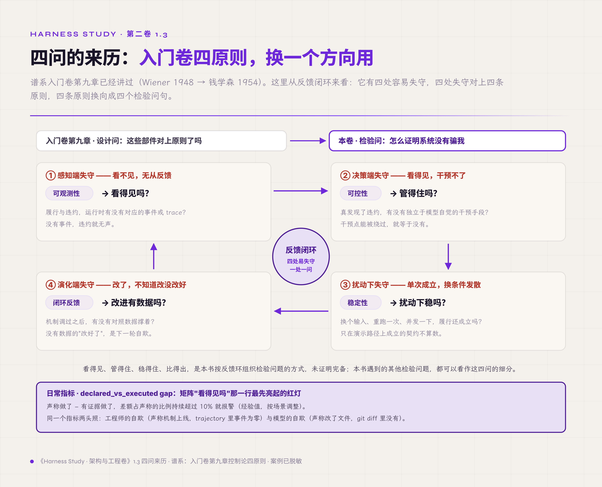

*图 1.3 · 四问的来历：反馈环四处失守，四原则换向成四个检验问句，外加一枚前哨仪表*

四个问题回答到什么程度，我们用一把统一的刻度尺来量——机制成熟度 L0-L5【经验/推导，本书系分级，非业界通则】：

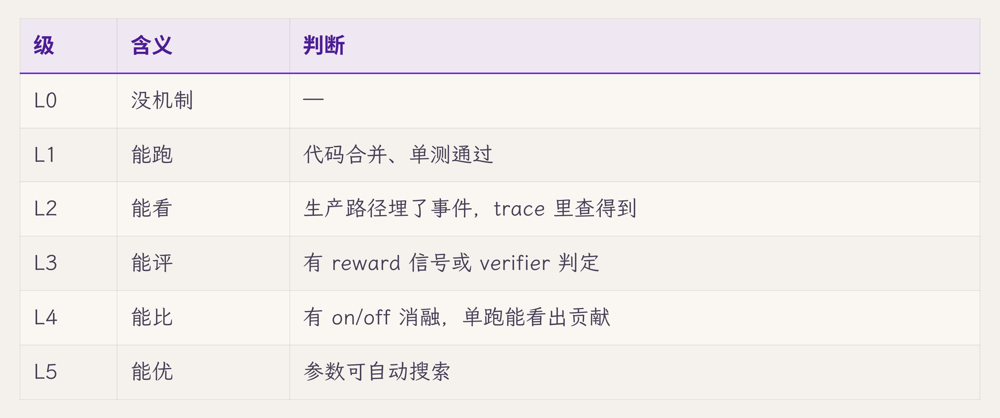

这把尺上藏着一条便宜得不像话的诊断公式：**项目里有名字（L1 在），trajectory 里没事件（L2 缺），假落地嫌疑高。**上面 hook 案例正是这个形态——机制有名字两个月，事件一条没有。L1 升 L2 大约只要 L1 五分之一的工作量，收益却是"这机制是真在工作还是死代码"从此一眼可查。本卷各章末尾都会用这把尺自检一次。

纪律只在脑子里想没用，得写进流水线才算数。配套实现项目在 hook 审计之后给 PR 模板加了"机制接通验证"段，新机制合并前四项必填【经验】：生产路径接通点（具体到 file:line 的调用处）、on/off 消融的测试名、机器可读的 trace 字段（source enum 加 rule_id，不靠中文字符串前缀）、同任务 N=3 复跑的稳定性。四项恰好对应四个问题的操作面，缺一项就阻塞 review。这一改的成本是写一次模板半小时、每个 PR 多花五到十分钟；对面摆着的是一次假落地的下游代价——评测全错、报告重做、按周计的排障。这笔账是单项目的成本画像，量级供参照，各家按自己流水线里假落地的真实代价重算即可。本卷不要求照抄这份模板，但每章末尾的 L 级自检，读者都可以翻译成自己流水线里的一道门。

现在 1.0 那张地图可以下正式定义了：横轴六份契约，纵轴四个问题，每一格填"这份契约的这个问题，靠什么回答"。拿副作用契约示范一列——看得见吗：每次外部动作有意图与结果事件落盘；管得住吗：声称与 git diff 机器对账，对不上硬门拒绝；扰动下稳吗：同任务 N 次复跑，对账结论不漂移；改进有数据吗：失败按 taxonomy 归类，机制调整前后可对比。其余二十格不在本章穷举——每章讲透自己那几格。第十五章接过的是六契约这条横轴；纵轴换成五个追问面，审别人的系统更顺手。

这套检验体系还回应着一句最根深蒂固的行话。传统运维的第一格言：系统能跑，就不要去动它。这句话在它的时代成立——行为可复现的系统，跑着的每一天都在重复被验证过的行为，改动的风险大于收益。agent 把这句格言两头同时拆掉。一头，"能跑"失去了信息量：agent core 搭好之后无论如何都能跑起来，loop 会转完，模型总会返回点什么，demo 总能挑出一条好看的轨迹——能跑成了零门槛，质量藏在通过率的分布里。另一头，"不要动"锁住的东西换了：从稳定，换成了智能水平。core 的首次搭建离最优很远，而在外围修补的杠杆，测量给过几次冷冰冰的答案——同一个模型换 harness core，复合分平均差 23.8（1.0 引过，不是通过率）；我们的一个客服 agent 消融里，关掉工具协议这一格 core 修复，通过率掉 10 个百分点【经验】；换一版 prompt 措辞这类外围动作，测出的差异常常沉在噪声地板之下。效果差的 agent，很少能靠在外面包一层救回来，出路是回到 core：大量测试、调优、必要时局部重构——每一样都是那句格言禁止的事。

敢动也不等于乱动。配套实现项目踩过这个坑：盯着单个任务连改七个 commit，通过率在 0/3 与 1/3 之间漂移，全部沉在噪声里，最后的处置是冻结调参、先建测量底座【经验】。这正是四问里"改进有数据吗"存在的理由。所以 agent 时代的格言得倒过来写：**不敢动 core 的系统，会停在它第一天的智能水平；敢动的全部前提，是检验体系让每一次动都看得见后果。**矩阵在这里露出真实身份：给必须持续动手术的人准备的无影灯。

这一节手里多了两样东西，都是本卷区别于入门卷的：一句判断——**契约不自证，检验要另建**；一句反格言——**能跑，不再是不动的理由**。四个问题眼下还停在问句，怎么把它们变成可操作的测量与判据，是第二章的全部内容。在那之前，先看坐标系能不能干活——用它推一遍结构。

## 1.4 坐标系的第一次应用：八个组件与一条时序

坐标系的第一个用途，是把"谁来守约"问清楚。我们逐份契约问下去，结构会自己长出来——这一节的组件没有一个是发明出来的，全是被失效逼出来的。

先看真相契约。想一想没人设计时，状态自己会长成什么样：loop 在内存数组里攒消息，攒够一轮写库；前端为了显示快，自己留一份会话状态；工具把结果顺手写进文件。三份记录平时相安无事——直到进程在写库前被杀。重启之后，内存那份没了，前端那份还显示"生成中"，文件那份没人说得清归属哪条消息。病根在于"该信哪份"从来没人回答过：写的时候人人能写，读的时候份份都像真的。所以真相契约的第一条硬约束落在写权上：真相只放一处，允许写它的组件只有一个——**状态层**。数据工程里这条纪律叫单源真相（SSOT），即每个数据元素只在一处被 mastered，其余位置只许只读引用【规范/官方文档】。单机参考实现选 SQLite（WAL 预写日志模式）单写者，看中的是它的不宽容：单写者天然串行，写冲突、共识、分布式事务这一整类问题直接不存在；代价是吞吐有上限，将来多实例要迁 Postgres 加 lease（租约，带时限的写权凭据，第五章展开）。这笔交换划算——原型期死于状态撕裂的系统，远多于死于吞吐不足的。

再看交互契约和权限契约，它们的失效长在同一个地方。不设防的系统里，每个入口各自为政：UI 直接调 loop，API 也调，scheduler 也调，各自实现自己的取消、自己的权限检查。用不了多久，同一个"取消"长出三种语义——UI 的取消只断了流，run 还在后台跑；API 的取消杀了 run，没记原因；双击"发送"，两个 run 同时写一个会话。崩溃后满地的孤儿 run 没人认领，因为"谁负责扫尾"从来没被指定过。病根一句话：同一种语义实现了 N 份，就会漂移成 N 种。解法是收口：所有执行，无论从哪个入口来，过同一道闸——准入、互斥、policy、limit 在这里判，孤儿 run 的发现和收尾也归这里。这道闸叫 **run manager**，这个决策叫**单执行内核**：permission、cancel、resume、工具执行四种语义只在内核实现一次，入口只剩两件事——适配意图、转发流。

真相集中了，历史还没着落。最直接的做法是状态行就地 UPDATE：run 从 running 改成 failed，一改了之。排障的人半夜对着库问"它怎么变成 failed 的"，库里只有现在的样子，没有来路；文本日志倒是有，但那是给人读的散文，格式随手、字段残缺，恢复扫描没法拿它当依据。根因在于：解释和证据一旦允许事后修订，就都不可信。所以第二条硬约束是只追加：历史永不改写，记错了追加更正，指向原处。载体两件——**事件流**，发生过什么的机器可读记录，供恢复扫描、UI 订阅、审计回放；**证据存储**，trajectory、policy 决策、verifier 结论、artifact 来历的归档处。状态层回答"现在是什么"，这两件回答"凭什么相信"——1.3 那四个问题的地基全在这里。根基不新：数据库的 WAL、金融的复式账簿，同一条纪律——历史可信，靠的是改不了。代价是存储上涨；哪天成本真扛不住，事件可以稀疏，不可以改写。

副作用契约的失效方式要慢放才看得清。最直接的执行顺序：模型说调工具，executor 直接调，返回后把结果写库——账也记了，只是记在动作之后。账与动作之间于是有一条缝：崩溃恰好落在"邮件已发出、记录未写下"的瞬间，系统苏醒后完全不知道自己发过邮件，它能做的最"负责任"的事，恰恰是再发一遍。堵这条缝只有一个办法，把顺序定死：先落盘意图，再执行，再落盘结果；工具返回成功也只算一面之词，外部世界是否真的变了，要另取证据——1.3 那组 hard gate 拿 git 对账，就是这个原则在评测线上的形态。外部动作一律走这道门，门就是入门卷已有的 **tool executor**——本卷给它加的是这份先记账再动手的合同（第八章是它的主场）。

剩下三件的失效方式与解法同构，收进一张表：

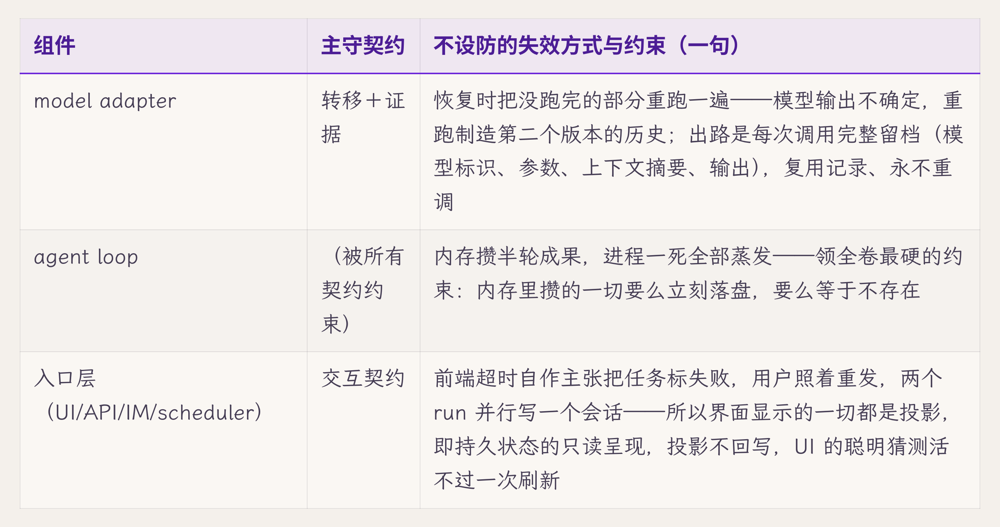

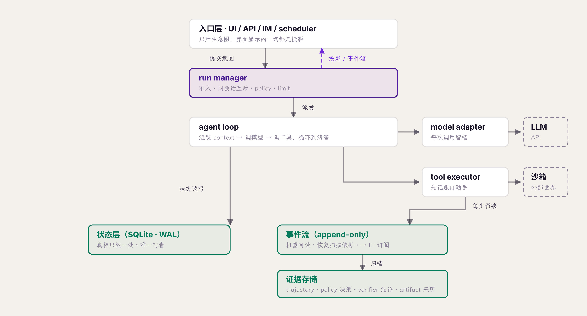

数一数恰好八个。八是单机的最低充分解：抽走任何一个，某份契约失去履行人——抽走事件流，转移契约无处落笔；抽走 run manager，互斥和准入散落进各入口；抽走证据存储，1.3 的四个问题全部答不出。这八件与入门卷开篇那八件部件不是同一张清单——那张按能力切，这张按守约职责切，名字重合的只有一部分；逐行对照见附录 A，两张清单怎么接，第四章会说透。

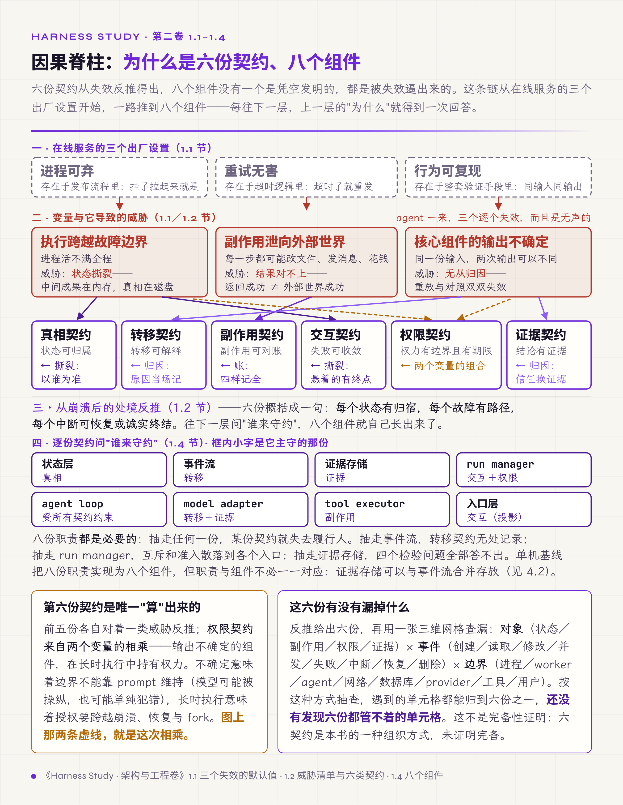

*图 1.4a · 因果脊柱：三个失效的默认值 → 三类口子 → 六份契约 → 八个组件*

结构是静态的，判断它对错还要看动线。我们走一遍最顺利的时序：用户发一条消息，任务顺利完成。**加粗处是落盘点**——数一数有几个、都在谁手里，这张架构的正确性一半押在这上面。

1. 入口收到消息，提交 run manager；
2. run manager 准入：同会话互斥、policy、limit 检查；**落盘：run 记录建立，事件流记 run.created**；
3. **落盘：用户消息入库**——从这一刻起消息归系统管，之后任何崩溃都丢不掉它；
4. agent loop 组装 context：从状态层读消息、摘要、记忆，生成给模型的投影（不落盘——投影可重建）；
5. model adapter 调模型；**落盘：调用记录（模型标识、参数、上下文摘要）**；流式输出按事件节流更新消息，同时经事件流推给 UI；
6. 模型要求调工具：tool executor **先落盘意图（含幂等 key），再执行，再落盘结果与事件**；
7. 循环 4-6，直到模型给出终答；
8. run 收尾：**落盘：消息终态、run 置 succeeded，事件流记 run.finalized**；
9. 事件流推送完成通知；UI 不在线也无妨——下次读库，看到的就是全部。

九步里每一个落盘点，都是将来某次崩溃的救命锚（恢复时序是第七章的主场）。本章立一个全卷通用的判断标准：**任何机制设计完，都要能在这条时序上标出自己的位置——哪一步写了什么，将来被谁读到。**标不出位置的机制，多半就是 1.3 里那种"存在但没干活"的部件。

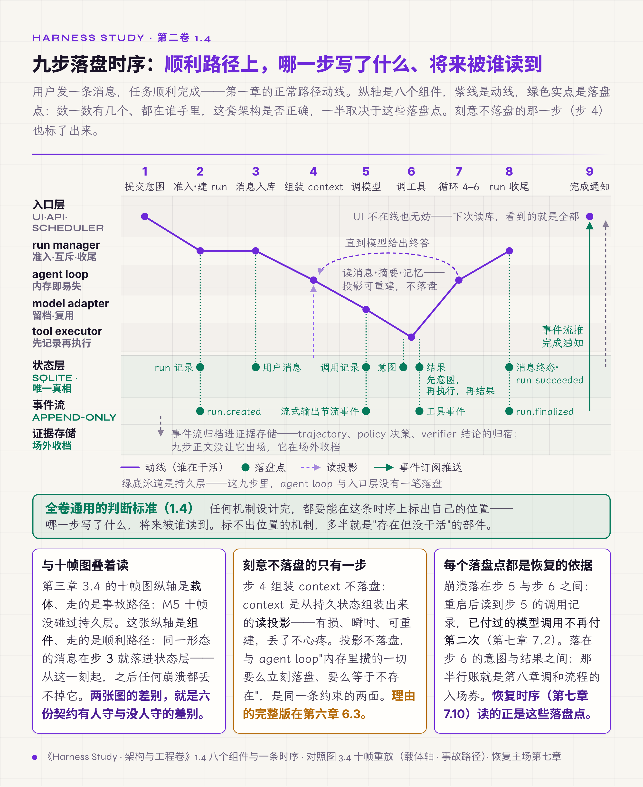

*图 1.4b · 九步落盘时序：八组件泳道上的一条顺利动线，绿色实点是落盘点*

坐标系的第二个用途，是把业界方案摆进同一张矩阵，看清各家把力气花在哪些格子。轮廓级对照三家【厂商实践，依据各家公开文档整理；轮廓级对照】：

**Temporal** 把转移契约和真相契约的格子做到最实：全部执行历史进 event history，崩溃后靠确定性重放重建状态，模型调用这类不确定操作收进 activity、结果记录在案、重放时复用不重调——"复用记录、永不重跑"有工业先例。空格子同样清楚：它假设 workflow 代码确定性，验证"输出对不对"的证据契约、agent 特有的权限时效，都不在它的模型里——重放保证的是"执行到了哪一步"，不是"这一步做得对"。

**LangGraph** 在真相契约的格子给了三档 durability（exit/async/sync）：async 档 checkpoint 异步落盘换性能，代价是崩溃窗口里的 checkpoint 可能丢——这正是 1.1"进程可弃"默认值的残留形态被明码标价。而 state 本身是开发者自定义的字典，谁能写、副作用怎么对账，框架不强制——真相与副作用两份契约的履行推给了使用者。

**Claude Code** 把交互与权限契约的格子做得厚：session 以 append-only jsonl 落盘、可 resume，hook 与 permission 体系给了可控性的干预点。证据契约一侧薄一些：transcript 记录了过程，但"声称与实际的机器对账"没有硬门——1.3 第二个案例那类假通过，要靠 harness 之外的检查兜底。

三家没有一家六格全实。这不构成对谁的指控——每家的取舍都对应自己的负载画像——但它说明矩阵的空格子是真实的工程债，也是本卷后面十三章要逐格填的内容。

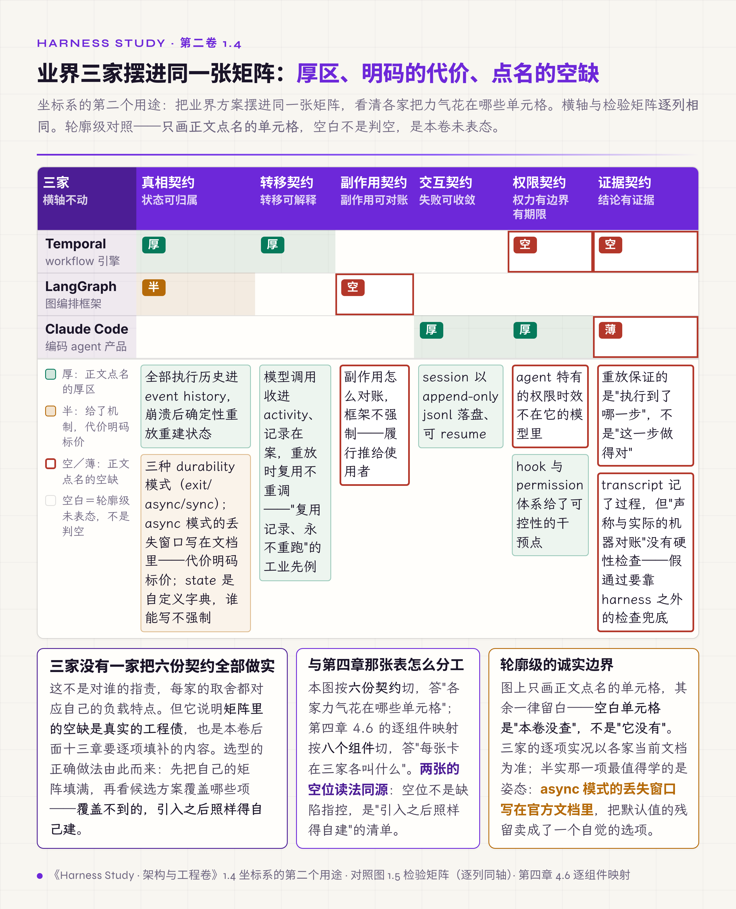

*图 1.4c · 业界三家摆进同一张矩阵：厚区、明码的代价、点名的空格*

## 1.5 全卷地图与两条读法

1.0 只给了轮廓、1.3 给了正式定义，到这里这张矩阵终于能填上内容、合拢成分章地图：

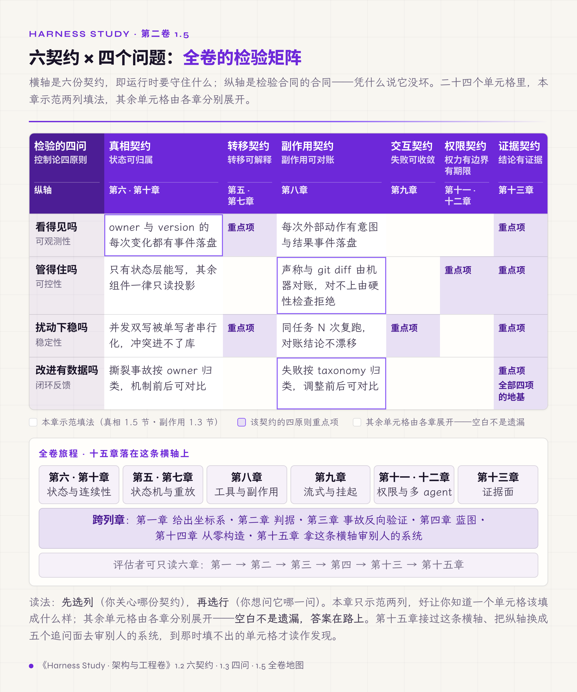

*图 1.5 · 六契约 × 四个问题：全卷的检验矩阵*

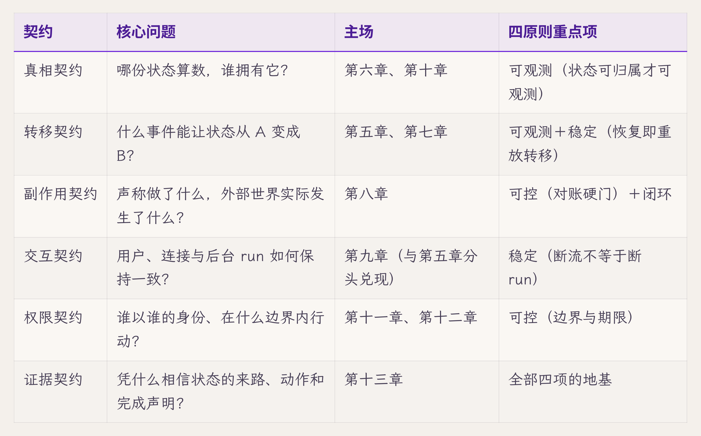

我们在 1.3 拿副作用契约示范过一列，这里再示范一列，挑与它相对的真相契约：看得见吗——每个持久对象的 owner 与 version 变化都有事件落盘；管得住吗——只有状态层能写，其余组件一律只读投影；扰动下稳吗——并发双写被单写者串行化，冲突进不了库；改进有数据吗——状态撕裂类事故按 owner 归类，SSOT 收紧前后可对比。两列示范之后，其余格子的填法已经可以仿写——每章认领自己那几格，就是这么填的。

每章的动线固定：症状 → 契约归属 → 机制展开 → 业界对照 → 破坏一次（四步协议）→ L 级自检。第二章先把四个问题变成判据，第三章用一次真实事故反向验证判据，第十四章把八个组件从零构造一遍，第十五章拿六契约这条横轴去审现存系统。

读法有两条。**搭 runtime 的工程师**按章序顺读，每章的破坏实验在自己系统上跑一遍。**评估别人系统的架构师或顾问**走近道：第一章拿矩阵，第二章拿判据，第三章拿一次实战校准，第四章拿组件卡，第十三章拿证据链，第十五章拿评审流程——六章读完就能带着问题清单进场，中间各章按被评审系统的薄弱格子选读。

开场那批问题里还剩一件没安放："改好一处，别的地方又塌。"它的病根是暗契约——部件之间没写下来的假设，改动踩上谁都不知道。这件事没有单份契约可认领，解法是把六份契约全部写成明文，也就是本卷的全部内容。就近举一处暗契约：1.6 那个"超时该由谁标 failed"——UI 以为自己能标，run manager 以为归自己，两边都没写下来，改动一踩就塌。这类假设本章各节已经埋了好几处，第三章会给它们一张定量画像。

读完全卷，读者应该能做到五件事。任何一条消息，说得清它此刻在哪个载体里、哪份算数。进程在任意一行被杀，说得清重启后系统怎么收敛。agent 声称"做完了"，拿得出独立于这句话的证据。每个机制，说得出它在 L 几、违约时哪个事件会报警。拿到任何一个 agent 系统，能按同一套六契约审出它的缺口。前四件是 builder 的收获，第五件属于两类读者共有。

最后交代每章末尾的几件固定装置——就是上面动线里"破坏一次、L 级自检"之后的部分。它们不是附录，是每章的验收面，全卷用法相同：

- **破坏实验**：把本章立的机制故意破坏一次，按四步写明：破坏动作、观测点、判定、复跑。这是"契约不自证，检验要另建"用在本书自己身上——每章讲完机制，马上给出证伪它的办法。下面 1.6 就是第一个。
- **L 级自检**（第二章起）：拿 1.3 那把成熟度尺，给本章机制在配套实现项目里的现状定级，到哪级是哪级，缺的照实列成待办。
- **交付物**：本章产出的登记表或清单，逐章累积，第十四章从零构造和工作制品附录都要用它们。
- **立即可做的一个动作（五分钟）**：builder 和 assessor 各一条，读完本章马上能在自己项目上做的最小一步。
- **下一章**：本章故意按下未答的问题，以及答案在哪一章。

怎么算用完？破坏实验有判定结果，自检有诚实的级别，五分钟动作真的做了——和正文一样，以证据为准。个别章另有练习，用法随题面走。

## 1.6 破坏实验：真相源分叉

每章一次主动破坏，本章打"投影不回写"。按全卷统一的四步测量协议执行：

1. **破坏动作**：在 UI 里故意保留一份本地 run 状态副本；启动一个 run，断开事件流，在 UI 本地把状态改成 completed（模拟一个"贴心的"前端根据超时猜状态）。此时数据库里 run 仍是 running。然后刷新页面，并等 run 真正结束。
2. **观测点**：数据库写路径审计（状态层是否出现来自 UI 侧的写入）；事件流中的投影拉取记录（刷新后 UI 从哪份数据重建显示）。
3. **判定**：通过=刷新后 UI 无条件回到数据库投影（显示 running），本地猜测被丢弃，全程数据库从未被 UI 侧写入；失败=存在任何一条"UI 状态回写数据库"的路径。
4. **复跑**：同场景 N=3，判定结论不漂移。

本章此实验为**思想实验**——参考实现到第十四章才成形，实跑产物届时回填此处；判定口径先立在这里，是为了让 1.4 的"投影不回写"从设计偏好变成可证伪的承诺。失败时修复方向只有一个：删掉回写路径，"超时该标 failed"交给 run manager 的看门狗（第五章）——UI 的职责是显示真相，判定真相轮不到它。

## 交付物

- **六契约×四原则检验矩阵**（1.0 轮廓、1.3 定义、1.5 地图）——全卷的坐标系与分章索引；
- **组件图与正常时序**（1.4）——后续每章新机制都要能在时序上标出位置；
- **L0-L5 成熟度尺与假落地诊断公式**（1.3）——每章末自检用；
- **术语速查**：附录 A 入门卷对照。

另交代一个全卷通用的约定：本卷各章交付的登记表——状态注册表、副作用账本、事件表结构、转移表等——统一收录进一份"工作制品"汇编（出版形态为书末附录，按 A、B、C……编节，汇编开篇有一张节号目录，每节标名称、用途与交付章）。正文引用时写"工作制品＋节号＋名称"，如"工作制品 B（Effect Ledger，副作用账本）"。评审时按节号翻到即用，各章正文只放节选、不重复全表。

## 立即可做的一个动作（五分钟）

拿 1.5 那张地图，对一个系统把六个核心问题问一遍——builder 问自己正在搭的那个，assessor 问手上要评的那个：哪份状态算数？什么事件能改它？外部动作有账吗？断连之后谁收场？谁批的权限、现在还有效吗？完成声明有证据吗？答不出的行标红。然后对标红的行追问 1.3 的第一问：它的违约在 trajectory 里有事件吗？没有事件的行，按假落地嫌疑处理——那就是系统里部件都在、但没人签也没人验的合同。

## 下一章

四个检验问题眼下还是问句。"看得见吗"怎么变成事件清单，"扰动下稳吗"怎么变成 N 与判定线，"通过"与"假通过"怎么在报告层分开——判据的操作化，交给第二章。

## 附录 A：与入门卷的术语对照

入门卷读者带着"8 件 runtime + Safety 控制面"的地图来，两张图的接线如下，防两卷漂移：

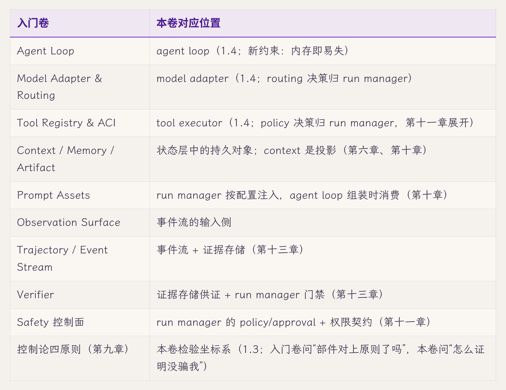

两条裁决：入门卷的 Evidence Graph 由本卷第十三章继承扩展，同名同物；两卷冲突以本表为准。

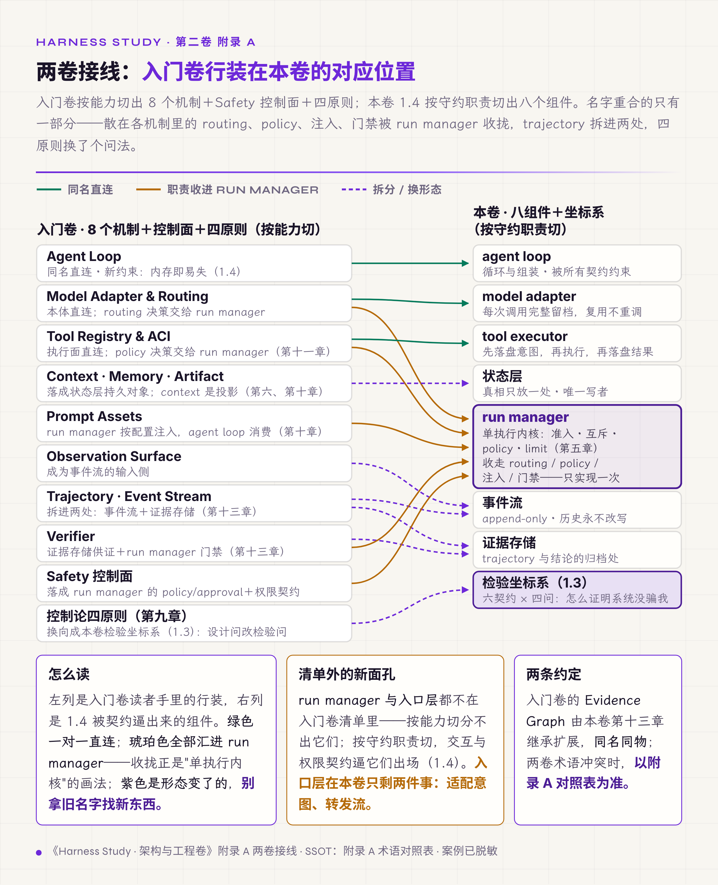

*图 1.A · 两卷接线：入门卷行装在本卷的落位——同名直连、职责收进 run manager、拆分换形态*

## 附录 B：业界命名对照（近似映射）

各家边界不完全重合，写作一律以本卷定义为准；实体的正式定义在第六章。**核对状态：依据各家公开官方文档整理，终稿前逐格回核最新文档后替换本行为核对日期。**

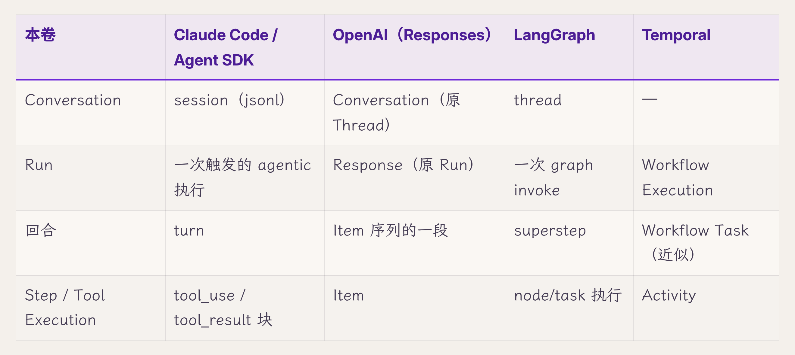

## 审稿日志

> （编辑工作区：本节与"引用来源"节出版前整体删除。内部索引不随稿出版：调研指针 research/volume2/03-05、核对记录 research/volume2/02、评审文档 volume2-review-20260720.md。）

| 轮 | 检查 | 命中与修改 |
|---|---|---|
| 版本史 | — | v1.x（多视图）审回：散。v2.0（推理链）审回：苍白。v2.1（因果叙事）审回：不对劲→大纲 v5.4 手术。v3.0（瘦身版）未过审，用户总体判断"单薄/没系统性/维度不高"→ 两轮多 agent 评审（`../volume2-review-20260720.md`）→ SPEC §七方法论修订＋§八章 spec v2.1（三幕：全景→展开→回望）→ 本稿 v4.0 |
| 章级验收自测 | SPEC §八 v2.1 清单 | 全景先行：矩阵与旅程图在 1.0 出现（前 1/5）✓。老师声部：各节首有定位句、节末有盘点句 ✓。一手证据 7 处（hook 六 event 假落地／287-287 对 29-44／23 listener 零订阅／policy 恒等派生／macro 假通过（pass=1/1 对 diff 仅 dev-log）／hard gate 六条口径／PR 四问模板）✓。外部权威 ≥4 处（Harness-Bench／MAST／Temporal／LangGraph／Wiener-钱学森谱系回指）✓。业界对照 3 家各带失效点 ✓。全局装置：矩阵＋组件图＋时序＋分章地图＋前哨指标 ✓。体量 271 行／16.4K 字符（v3.0 的 1.33 倍）：低于 spec 350-450 行的行数目标，字符量接近入门卷承重章下限——密度是否达标交四维评审与用户判定，不以注水凑行数。预警照记：新概念约 15（六契约名、四原则、检验矩阵、L0-L5、假落地、declared_vs_executed gap、状态层、事件流、证据存储、run manager、单执行内核、投影、SSOT、暗契约、三维网格——超 v5.4 旧上限 12，按 SPEC §七.1 降档为预警不拦稿）；前向引用约 12 |
| R1 grep 红线 | 全套（2026-07-20 修订后复跑） | "你"系 0（1.3 节首设问属问句钩子，合规）；"在这个/让我们/本章将/综上所述"0；模糊词（显著/大量/很多）0；"而不是/不仅…还"0；对比修辞人工计 2 处（1.4 Temporal 段"保证的是……不是……"、1.3 hard gate 段"不靠……靠……"），达红线上限 ≤2，均为承重句；标题超长 0；体量终版（含 2026-07-21 用户增补段）281 行／19.1K 字符 |
| 用户增补 | 2026-07-21，用户过审 v4.0（"质量大幅提高"）后提出 | 1.3 节末新增文化收束段："能跑就不要动"格言在 agent 时代两头失效（能跑零门槛／不动锁死智能水平）、外围补丁低杠杆（23.8pp／-10pp／噪声地板三数支撑）、敢动≠乱动（七 commit 噪声漂移教训）、反格言＝检验体系是敢动的前提。节末盘点由一件扩为两件（判断＋反格言）。SPEC §八 1.3 已同步 |
| 过审后增量 | 2026-07-21，§三 v2.0 business 评审发现 assessor 近道（原 §一→§二→§十二→§十四）与 §三 的 assessor 备料自相矛盾 | 1.5 近道纳入 §三（四章改五章，"§三 拿一次实战校准"）；SPEC §七.6 同步；属过审后小幅增量。2026-07-21 §四 business 评审再纳入 §四（五章改六章，"§四 拿组件卡"——Component Register 为 §十五 对照物，产地不能绕）。**两次扩容已随 §三/§四 过审（2026-07-21"继续下一章"）一并确认** |
| 语域清理＋八件指路 | 2026-07-21 用户裁决（SPEC §七.10）：粗鲁比喻退出正文 | 1.0"验尸工作"→"事后剖析"；1.1"献祭"→"为代价"；1.4"第一刀/第二刀"→"第一/二条硬约束"、"死法长在"→"失效长在"、"送终"→"收尾"；1.4 末补两张"八件"清单指路句（按能力切 vs 按守约职责切，对照见附录 A、接线见 §四）。"死法"系 4 处为硬规则 4 锚词，留待用户裁决。**同日用户裁决执行**：锚链正式化（朴素做法→失效方式→失效根因→设计出场），1.4 四处"死法/死因/天真的"改"失效方式/根因/不设防的（或最直接的）" |
| v5.5 编号顺移 | 2026-07-21，大纲 v5.5 手术（新增 §四 蓝图章，原 §四–§十四 → §五–§十五） | 正文前向引用全部顺移（1.0 地图句、1.2 权限契约、1.5 分章地图与近道、附录 A、遗留问题等约 25 处）；本表历史行保留旧编号，按大纲读法规则映射 |
| STAR 完备性 | 2026-07-21 用户审 §二 开场后立 SPEC §七.9（事实段完备性检查：STAR＋指向，检查表执行），全章事实段回扫 | 命中 3 处补最小 S/T：1.0 Harness-Bench／MAST 补研究身份句（控制实验／验尸工作，Kappa 补用途）；1.3 案例一补审计动机（3.5 小时 11 commit 高速开发批次、换手前逐项对账；"并行代码审计"改"交接审计"，经 Agent-Z 源文档 2026-04-26 回核）；1.3 案例二补评测线背景（宏观基准一句）。其余事实段 S/T 已在位不动；红线 grep 复跑无回归 |
| 四维评审 | **四路已跑齐并全部落实（2026-07-20）：technical B+／style B+／cybernetic A-／business A-，零 P0 遗留** | technical P0：hook 案例沿用 ch10 已被 2026-04-27 更正条目下调的旧口径（"永远 noop"）→ 按更正后口径收窄（注册线未接、6/7 event 从不 emit）；P1：+15.6pp 加"验证类干预＋终稿逐字回核"限定；P2：一手证据计数 8→7、组件图补第八框（证据存储）、对照出处标注统一。business P0：内部 research 路径从正文与出版附录剥离（3 处）→ 移入本节编辑工作区；P1：1.3 接 MAST 21.30% 做外部三角、五分钟动作改双读者口径、谱系与 gap 压成入门卷回指；P2：PR ROI 账加 N=1 边界。style P1：1.3 四问列表由规格书腔改老师递推 prose、1.0/1.1 两处巨句拆分、四原则段拆句；P2："不靠 X 靠 Y"删 X 直写、1.3 节首补转折设问、五件事收束拆短句、三维网格示例拆句、六契约压缩句加落盘点锚。cybernetic（方法论比例实测 58%，7 条章级验收全过）P1：补"为什么恰好四问"反馈环完备性推导、gap 段改回指＋接坐标系、章名改"参考架构与检验坐标系"（待回写大纲）、1.5 补真相契约第二行 worked 示范；P2：两案例同构句点明"检查器信任被检查者"、暗契约补就近实例 |
| 终稿回核清单 | 2026-07-27 正文【】标注清理（用户指令） | 1.4 业界三家对照——终稿前逐格回核三家格（正文标注保留"轮廓级对照"）；另 1.2 三维网格标注中"网格详表见大纲 0.5"内部指针已删（读者不可达），"不穷举笛卡尔积只用它查漏"保留 |

## 引用来源

- 【预印】Harness-Bench — arXiv:2605.27922。aggregate score 差 23.8 分、跨 harness 方差随模型强度收窄（1.0）。
- 【评审】MAST — arXiv:2503.13657（NeurIPS 2025 D&B）。三类占比、干预实验（1.0、1.2）。
- 【规范/官方文档】SSOT 定义（1.4）；Temporal event history 与确定性重放约束、LangGraph durability 三档（1.4，终稿前逐格回核）。
- 【经验】本教程配套实现项目：hook 假落地审计（287/287 与 29/44、set_hook_registry 零调用、23 listener 零订阅、policy 恒等派生）、macro 假通过复盘（v8 pass 与 git diff --check 矛盾、Pro v1 声称与 diff 不符）（1.3）。
- 【经验/推导】L0-L5 机制成熟度分级、六契约×四原则矩阵、对象×事件×边界网格（1.2、1.3；本书系框架）。
- 素材真实指针（不出版）：`91-material-index.md`、`../volume2-review-20260720.md` 附录 A/B。
