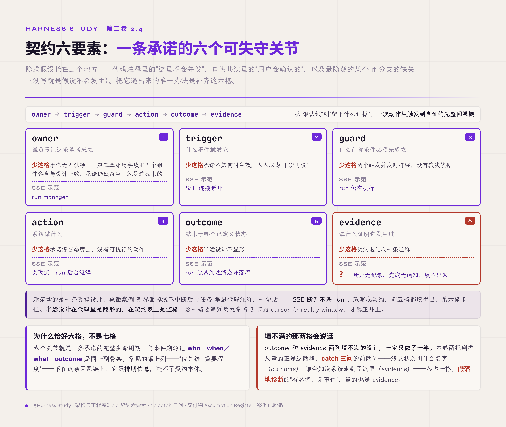

# 二、什么叫"正确的 runtime"

> v1.0 · 2026-07-21 · 依据 SPEC.md §九 章 spec（v0.4 底稿重构：开场更换、新增判据测量学 2.6 与实跑破坏实验、术语与脱敏对齐 v4.0 方法论）· 待用户审
> 旧稿 `02-correct-runtime.md`（v0.4）留档对照。（本版本注与"审稿日志""引用来源"两节同属编辑工作区，出版前整体删除。）

2026 年 5 月，本教程配套实现项目的 harness 主链路刚刚打通，下一步是成批调优。调优之前得先有一个参照：什么都不改，系统能过多少任务——后面每次改动的好坏都拿这个数字比。参照来自 holdout 基线：留出 20 个不参与调优的固定任务，每个跑两遍以摊薄单次运气，共 40 次。结果通过 24 次，60%。

这个数字本会立刻定下随后几周的调优方向。定方向之前，为了看清失败都输在哪，先给 10 个失败案例做了一轮人工归档。归档撞见的东西让结论翻了盘：只有 4 个真是模型没做对，另外 6 个错在判卷的评测器身上——它按文件路径给改动分类，把测试夹具误判成了文档改动，模型做对的任务被判了负。修复分类器、每任务重跑五次（k=5）重验后，真实水平在 80% 以上（当时初估 75-87%）。若不是在第一份基线上就做了深挖，接下来整轮消融都会建在错误的前提上【经验】。

这次事故里没有任何组件宕机，也没有任何模型退步。出错的是判据本身——而判据出错时，不会有报警器响，因为报警器就是它。外部同行记录过更极端的形态：一套生产 agent 系统里，67 个不变量检查（该系统的 invariant check）实际执行的是空命令，空跑数月无人察觉，直到引入"故意破坏必须导致检查失败"的反向验证才暴露。该系统约七成故障是人工看输出发现的，最长一次静默持续 60 天【预印，arXiv:2606.14589，单作者单系统，外推有限】。

§一 立了检验合同的四个问题，收尾时它们还是问句。本章把问句变成工程。先分清"正确"的三层（2.1-2.3），再学会把隐式假设写成可检验的契约（2.4-2.5），然后回答开场事故指向的那个更深的问题——判据本身凭什么可信（2.6）。读完之后手里应当多四样东西：三层正确的判别力、契约六要素的写法、四档确定性的标尺、给判据自身做体检的三件套——外加一件想清楚的事：判据会失效、系统会自欺，两者的根子是同一种认知缺陷（2.9 收口）。

## 2.1 输出正确、状态正确、系统正确

"正确"至少有三层，混用它们是评审桌上最常见的误会。

**输出正确**：这一次的回答质量好、任务完成了。这是最容易观察的一层，也是唯一能靠"看结果"判断的一层。

**状态正确**：系统记录的与实际发生的一致。§三 要解剖的事故里有个标准镜头：用户重问后拿到的第二个回答无可挑剔，当场满意；同一时刻，上一轮的提问已从所有载体消失，数据库声称这个会话"一切正常"。输出好看，账本是错的。状态正确只能靠对账判断：拿记录去对实际，拿实际去对记录。

**系统正确**：系统声明的全部承诺，在全部执行路径下成立——包括没人走过的路径：进程在任意一行被杀、两个入口同时写、工具结果传到一半。输出正确是一次抽样，状态正确是一个时刻的快照，系统正确是对所有路径的全称命题。全称命题没法靠观察确立，只能靠两样东西：把承诺写成契约，再用破坏实验去证伪它。

三层的依赖是单向的：系统正确覆盖状态正确——状态一致本来就是系统承诺里的一条；状态正确再往上只保证输出可信，即"系统关于这次输出的说法与实际相符"，不保证这一次回答本身对，回答质量另受模型能力支配。反过来不成立——§一 1.0 引过的 MAST 数据已经给过量化版本：1642 条故障轨迹里，三大类故障全部落在系统层【评审，arXiv:2503.13657 v3】。盯着输出调 prompt，修的是最上面那层的抽样质量，下面两层原样不动。

## 2.2 "写了错误处理"不等于故障有归宿

2.1 说系统正确是全称命题，只能靠契约兜底。这一节起连看两条最常被误当"已处理"的故障路径——正是没有契约时，全称命题破在哪里。先给"归宿"下定义：一条故障路径有归宿，指它的终点是一个**已定义状态**，并且这个状态**有人负责**——由机制接管，或者明确升级给人。两个条件缺一即无归宿。

本卷的桌面案例项目（一个桌面 agent 应用，§三 将解剖它的一次数据丢失事故；案例真实，可识别信息已隐去，数字与代码坐标未改动）在收进案例线之前，先接受过一轮代码摸底——想知道除了那次事故，它还欠着多少没兑现的承诺。摸底里有个标本：SQLite 写入失败（磁盘满、锁冲突）在两处落盘路径被 catch 住，处理方式是 `console.error`（`chat.ts:2166-2169`）——然后继续。用户看到"已完成"，实际没写库【经验】。catch 写了，故障没有归宿：它的终点状态没有名字（系统不知道自己丢了数据），也没人负责（console 里那行日志不会被任何人看到）。错误处理代码的存在，反而让这条路径在 code review 里显得"已处理"。

§一 1.3 的 hook 案例是同一件事的放大版：不只错误处理，整个机制体系都可能"写了但没接线"。写了、接通、生效，是三件事。那一节立的 PR 四问，就是为这个缺口设的门——四问答不全的机制，保留为实验开关，不默认启用【经验】。

实操判据，本卷叫它 **catch 三问**（builder 代码侧）：对代码里每一条 catch、fallback、默认分支，问三个问题——这条路径的终点状态叫什么名字？谁会知道系统走到了这里？走到这里之后，系统对用户的承诺还成立吗？三问有一问答不出，就登记进本章末尾的 Assumption Register。

## 2.3 有 checkpoint 不等于可恢复

归宿说的是故障路径的终点；恢复说的是终点之后怎么接着跑。同一个"看起来有"的陷阱换到恢复上，是三个经常混用的词，按强度排开：

- **snapshot**：存在一份数据副本；
- **checkpoint**：存在一个已知一致的恢复点；
- **durable execution**：恢复语义被定义并被验证——从哪个点恢复、恢复后哪些动作保证不重复、哪些数据保证不丢失、不能恢复时进入什么终态。

"有 checkpoint 文件"只证明第一件。桌面案例的备份链路把这三者的差距演了一遍。那个应用带一个定时备份功能 autoBackup，定期把 SQLite 数据库拷进备份目录——听起来数据是安全的。摸底发现它只拷主 db 文件，不做 checkpoint、不带 -wal/-shm 边车（WAL 模式下最近的写入正暂存在这两个伴生文件里），非正常关闭后那份"备份"会静默丢掉最近的写入。对同一链路的第二轮复审又挖出一层：另一条备份路径倒是做 checkpoint，但用的是 PASSIVE 模式，一遇争用就放弃，拷贝却照常进行，谁也不知道拷出来的库缺了 WAL 里的数据。还原路径更糟，直接覆盖被活跃连接持有的库文件，失败后单例僵尸化，全部路由连锁 500，直到重启【经验】。每一步都"有备份机制"，合起来却没有一条恢复承诺成立。

durable execution 的严格定义和实现留给 §七。这里先立一块界碑：传统持久化理论——WAL、ARIES、saga（补偿事务）、workflow recovery——有几十年同行评审文献托底，可以放心借用；agent 带来的三个新问题是另一回事：模型调用不能重新执行并期待相同输出、工具副作用需要对账而非重放、上下文压缩边界与 checkpoint 边界纠缠。截至 2026-07 的检索，agent 专属的运行时状态持久化几乎没有评审级研究，只有一簇预印本触及【经验/推导，检索记录见编辑工作区索引】。这块空白意味着：§六、§七 的做法是"传统理论降维借用 + 工程实证"，读者不必等一篇权威论文来背书——它暂时不存在。

## 2.4 隐式假设怎样改写成契约

2.1-2.3 反复撞的是同一堵墙——终点状态、恢复语义、备份承诺，全藏在没写下来的假设里，出事才显形。把假设逼出来的唯一办法是写成契约。隐式假设长在三种地方：代码注释（"这里不会并发"）、口头共识（"用户会确认的"）、以及最隐蔽的——某个 if 分支的缺失（没写就是假设不会发生）。改写成契约，需要补齐六个要素：

| 要素 | 回答的问题 |
|---|---|
| owner | 谁负责让这条承诺成立 |
| trigger | 什么事件触发它 |
| guard | 什么前置条件必须先成立 |
| action | 系统做什么 |
| outcome | 结束于哪个已定义状态 |
| evidence | 拿什么证明它发生过 |

拿桌面案例的一条真实设计做示范。那个应用用 SSE（server-sent events）把生成中的回答流式推到界面；设计者考虑过连接断开的场景——用户关页面、断网——决定界面掉线不中断后台任务。这条决定在代码注释里是一句话："SSE 断开不杀 run"；写成契约是一行表格：owner = run manager；trigger = SSE 连接断开；guard = run 仍在执行；action = 剥离流、run 后台继续；outcome = run 照常到达终态并落库；evidence = ？

填到最后一格卡住了。断开事件没有记录，run 后台完成没有通知，用户侧没有任何证据能确认这条承诺兑现过。§三 会看到这是典型的半途设计——现在可以说得更精确：**半途设计在代码里是隐形的，在契约表上是空格**。outcome 和 evidence 两列填不满的设计，一定只做了一半。

为什么恰好六个要素？因为一条承诺的生命周期只有六个可失守的关节——从"谁认领"到"留下什么证据"，恰是一次动作从触发到自证的完整因果链，与事件溯源记 who／when／what／outcome 是同一副骨架。六个关节一个都省不掉：少 owner，承诺无人认领——§三 五个组件各自与设计一致、承诺仍然落空，就是这么来的；少 trigger，承诺不知何时生效，人人以为"下次再说"；少 guard，两个触发并发时打架没有裁决依据；少 action，承诺停在态度，没有可执行的动作；少 outcome，半途设计不显形；少 evidence，契约退化成一条注释。至于常见的第七列——"优先级""重要程度"——它不在这条因果链上，是排期信息，进不了契约本体。

*图 2.4 · 契约六要素：每一格少了会怎样，以及那格填不出来的 evidence*

一个旁证：腾讯 HY LLM Frontier 团队与高校合作、2026 年 7 月开源的 Harness Handbook 做的是反方向的事——把既有 harness 代码库自动整理成 L1-L3 分层文档，最细的 L3 一条一个行为单元。它给 L3 定的输出 schema 是 locator_role、stage_context、synopsis、interface（signature／params／reads_state／returns／side_effects）、execution_flow、design_decisions、relations【预印，arXiv:2607.13285 附录 D.1.4，终稿前回核仓库现状】。与契约六要素部分重叠：stage_context 交代这条单元何时被调到，接近 trigger；execution_flow 对 action；interface 的 returns 与 side_effects 对 outcome；reads_state 标出它碰哪些状态。对不上的几格更说明问题——没有 owner，也没有 guard，代码测绘不必回答"谁认领""并发时谁裁决"；evidence 也不是一格字段，它的"凭什么相信"落在 locator 上：每条 L3 条目必须解析到当前仓库的源码，解析不到就冻结、不再参与定位。测绘实然与声明应然只在这条因果链的中段重合，两端得靠契约自己补。

## 2.5 保证、尽力、推断、未知

runtime 对外说的每一句话，都应当携带确定性档位：

- **保证**：结构强制 + 破坏实验验证过。例：effect 的 intent 先于执行落盘（§八 的副作用账本，本卷工作制品 B，规则一）——结构上不写就执行不了，无须任何人记得。
- **尽力（best effort）**：尽力而为，失败可见。例：完成通知送达——送不到不影响正确性，但送没送到有记录。
- **推断**：从间接信号推出，可能错。例：工具调用超时且远端不可查，"大概没执行"是推断，重试与否要按推断的代价算。
- **未知**：诚实标注。Effect Ledger 里 `unknown` 是合法状态而非缺失值——超时且无法对账时，标 unknown 交给调和流程，不假装可以自动回滚（副作用账本规则四）。

为什么恰好四档？按"系统能拿出什么"排：拿得出结构强制加验证，是保证；拿得出执行路径但结果不打包票、失败可见，是尽力；拿不出执行保证、只有间接信号，是推断；连信号都没有，是未知。四格闭合，第五档没有位置；砍掉任何一档，就有一类声明无处安放——砍掉"未知"，超时且远端不可查的副作用就只能被迫谎报成前三档之一。代价也直说：分档要求每条承诺多带一个标签，文档和接口都变啰嗦。这笔成本买的是把"确定性的均匀化"从语气问题变成类型问题——2.9 会解释这为什么值。

分档的敌人是均匀化：用同样笃定的语气说出保证和猜测，听者无从分辨哪句能压上身家。工程上的对策很直接——档位跟着声明走。文档里每条承诺后缀档位；API 返回里区分 `confirmed` 与 `assumed`；评审时对每句"没问题"追问一句：哪一档？降一档要出示什么证据？

## 2.6 判据的测量学：四个问题落地

到这里，承诺会写了、档位会标了。§一 那四个问题里，前两问已经有了着落——"看得见吗"落在 evidence 列的观测面登记，"管得住吗"落在 owner 与 guard 的干预点。剩下两问——"扰动下稳吗""改进有数据吗"——落在另一门手艺上：测量。这一节把开场事故欠下的账补上：判据本身凭什么可信。

一个通过率数字，可能在三种情形下彻底失去证据力。最常见的是只跑了一次——输出不确定的系统里，单次通过只是一次抽样，对"下一次"几乎没有约束力。更隐蔽的是答案泄漏：配套实现项目为测检索能力设计过一组"针在草堆"任务——在长文档里埋一条事实，要求 agent 找出来。早期版本把期望答案直接写进了 agent 可见的 prompt，通过率很漂亮，检索却退化成了字符串匹配——答案就摆在题面里，抄下来就能通过。直到把期望值改成 hidden、补上泄漏检查才暴露【经验】。最容易被忽略的是判据从没受过扰动：只在演示路径上验证过的判据，对换个说法、换个顺序的同类输入不作任何担保。三种情形下，通过率都只是数字，够不上证据。

对策是给判据自己建一套体检。底子是 PCS（可预测性—可计算性—稳定性）框架给出的两项 sanity check【预印，arXiv:2604.11003】——入门卷 §七 已把它当"工作台怎么识别消化不了的数据"讲过一遍，本章换一个更前置的用途：给判据自己做体检。原文的两项是——Yes Check：用 bootstrap 检验重复运行下的平均响应是否显著高于量表中点，防一次走运；Overlap Check：算打乱对照组与真实数据两个响应分布的重叠系数，看被测对象能不能把信号和噪声分开。扰动不是第三项检验，是两项共用的输入：无关字段、匿名化、列名重排、正反诱导。本章挪用时改了三处，先说明白——Yes Check 换成同任务重复 N≥3、看结论是否稳定；Overlap Check 改成把期望值换成打乱的对照组、检查高分是不是泄漏换来的；扰动组单拎出来算一项，凑成给判据体检的 **sanity check 三件套**。这三处都是本书的工程口径，不是 PCS 论文的。原研究团队用原本那两项复检 11 个数据集，6 个的积极结论在 sanity check 下站不住——超过一半（"11／6"与判定口径终稿前逐字回核原文；本章开场讲的正是转述数字出错的教训，不给自己留同样的坑）。工程落点是报告里的三个强制字段：reliability（N 次重复的稳定性）、perturbation_drop（扰动后的跌幅）、leakage_risk（泄漏检查结论）。判据六要素登记的是系统的承诺，这三格登记的是判据自身的体检结果【经验】。

重复实验本身也会被悄悄破坏，有两个一手数字为证。prefix cache 是第一个陷阱——cache 共谋与 per-run nonce（一次性随机值）的机制入门卷 §七 已拆透，这里只补它落在判据可信度上的后果：配套实现项目一次实验里 96% 的 cache 命中，意味着 N 次复跑读的都是同一份缓存，形式上 N=3，统计上还是 N=1。按 run 加 nonce 让跨批缓存归零之后，成本只涨了 5% 到 10%【经验】。第二个数字关于效应量：hard 任务上 pass@1=0.33 时，"连续三次都过"的概率不到 0.05，绝大多数 prompt 级改动的效应根本测不出来——配套实现项目曾在一个任务上连改七个 commit，通过率就在 0/3 与 1/3 之间漂移，最后只能冻结调参、先建测量底座【经验】。§一 的反格言说"敢动的前提是检验体系"，这一段是它的定量版：没有统计底座，动与不动都是掷骰子。

归因还要分维度，taxonomy 不能直接当结论。公开客服基准 τ-bench 把这件事写进了记分公式：一次任务的 reward r = r_action × r_output——数据库最终状态与标准答案完全一致，但回复里漏掉必须告知用户的金额（论文图 2d 那条退货任务要求回复中出现 54.04 与 41.64），整单照样记 0，与"数据库全改错"同罪【评审，arXiv:2406.12045，ICLR 2025】。反过来，开场事故里 failure_taxonomy 显示一片"代码改动缺失"，实际是 verifier 统计口径错误。两个方向合成一条纪律：通过率之下必须有分维度的失败归因（工具参数／系统状态／沟通／流程四维起步），并且第一次建立基线时，失败案例必须人工深挖至少三个——静默的判据 bug 只有深挖抓得到【经验】。

最后一件，改进要用单变量消融证明。"改进有数据吗"的严格形态：一次只动一个机制，该机制的贡献 Δ = Q(全配置) − Q(去掉它的配置)；同时动两个，差分在数学上就无从归因【经验/推导】。§一 引过的工具协议单格 -10pp，就是这样量出来的。消融的算法细节见入门卷 §七，本章只取它的判据身份——没有单变量消融，"改进有数据吗"就答不上来。

业界对照放一家【厂商实践】：Inspect AI（UK AISI）把 agent 评测标准化成 Task／Solver／Scorer 三件套，相当于评测界的 pytest，是形制标准化做得最规整的一家。它的边界也清楚：形制不担保可信度——N、泄漏、扰动、统计效度，全部仍是使用者的责任；三件套写得再规整，N=1 的结论还是 N=1。这正好划出本节的分工：标准化框架管"怎么组织测量"，测量学管"测出来的数字凭什么信"。

到这里，四个问题全部落地成可执行的动作：事件登记（看得见）、门与 owner（管得住）、三件套与扰动（稳得住）、N、nonce 与消融（改进有据）——前两件在 2.4 的契约表上就有现成位置，后两件不在表上，只能靠测量另立。

## 2.7 六份契约承诺，逐条配反例

§一 1.2 推出六份契约，这里不重述由来，只做一件属于本章的事：给每份承诺配一个独立来源的反例，并标出检验它的方式——这份对照就是交付物 Runtime Contract Register 的底稿；§三 的事故还将展示六份承诺集体缺席的现场。反例的共同点值得先说：**违约的系统，当时全都"能用"**。这正是 §一 反格言的另一面：能用，从来不是没违约的证据。

**一、真相契约**（状态可归属）。反例：桌面案例的 messageQueue 纯内存、刷新即丢；RuntimeStore 全局单例不按会话隔离，切换会话可串台【经验】。状态在跑，没人拥有它。检验方式：逐个持久状态填六要素的 owner 列，填不出即违约。

**二、转移契约**（转移可解释）。反例：桌面案例修完 §三 那次事故之后，tryStart 仍存在 TOCTOU 间隙（time-of-check to time-of-use，检查与使用之间状态已被并发方改变）——双标签页并发时两个抢占都通过 recheck，后到者静默 abort 先到者，占位行永久卡"生成中"【经验】。两次状态转移都发生了，事后没有任何记录能解释哪次凭什么发生。检验方式：随机抽一次状态变化，问 trigger 与 guard 的记录在哪。

**三、副作用契约**（副作用可对账）。反例：配套实现项目一次运行，`pass=1/1`，post-run 测试通过，final JSON 声称创建了一份 README——真实 git diff 里没有这个文件【经验】。声称与外部世界脱钩，而验收链恰好只读声称。修复是在 harness 里用 `git diff --name-status` 对账语言声称（对账入口 `harness.rs:2463`），并把违例写进 `failure_taxonomy=artifact_claim_mismatch`。检验方式：evidence 列必须指向独立于声称的证据源，声称与 diff 机器对账。

**四、交互契约**（失败可收敛）。反例：桌面案例的 SSE 出错分支不发 `[DONE]`，前端适配器没有 error 事件分支——非预期异常导致流静默死亡，UI 永远"生成中"【经验】。失败发生了，系统没有为它定义过终点。检验方式：枚举流的全部退出路径，每条问 outcome 列的终态叫什么。

**五、权限契约**（权力有边界且有期限）。边界侧反例：配套实现项目的 shell allowlist 曾用裸 `starts_with` 做前缀匹配——`cargo checkpoint` 被 `cargo check` 的放行规则放过【经验】。字符串前缀当不了边界，修复是 token boundary 检查。同族的还有 §三 的导航逃逸：一个 `target="_blank"` 就能穿过的防线等于没有。期限侧的反例形态在 §十一 展开：resume 之后，崩溃前批过的 approval 还算不算数——安全默认值是不算。检验方式：拿一条 allowlist 规则构造贴边输入，看边界是字符串还是语义。

**六、证据契约**（结论有证据）。反例就是本章开场：判据自己说谎，60% 的结论由分类器 bug 决定，与模型能力无关，而分类器故障全程无声。配套的纪律一句话：`report.pass=true` 不能作为通过证据【经验】。检验方式：本章的破坏实验——判据必须抓得住假货。

契约承诺不是功能需求。功能需求描述系统平时做什么，契约描述出事之后系统还剩什么。平时两种系统看不出差别——这正是它们需要被显式声明、单独验证的原因。六个反例都出自作者经手的两个项目，样本窄；但并非孤例——2.1 引过的 MAST 三大类故障，正是这六类违约在行业尺度上的统计画像，本节只是它的近景【评审，arXiv:2503.13657】。

## 2.8 契约与生产 policy 的边界

契约和 policy 经常被混在一张配置表里，划开的判据只有一条：**换团队、换 SLA 会变的是 policy；换了系统本身才不成立的是契约**。

"stream 必须可取消、取消必有终态"是契约（§九）；超时设几秒、重试几次是 policy（第三卷）。"checkpoint 必须可识别完整性"是契约（§六）；备份保留几份、多久一备是 policy。"权限决策必须留痕"是契约（§十一）；哪些工具进 allowlist 是 policy。本卷只管契约，并在每章标注它暴露给第三卷的接口——meter、limit、version、compatibility metadata。policy 数值进 Assumption Register 的不多，契约被误当成"可调参数"的，每一条都要登记。

## 2.9 两个主体，同一种"看起来对"

本章反复出现一个结构：检查过了，东西是错的。§一 1.3 已经把它点破成一句——检查器信任了被检查者递上来的内部信号。这一节把那句话拆开：它有四层，而且模型和工程师各有一份。

**第一层，症状层归因**：治标循环。agent 回答不对，第一反应是改 prompt。改了，好转，过几天复发；再改一版，再好转，再复发；第四轮干脆换模型。每次调整都"有效"——症状确实缓解了。但病因可能压根不在 prompt 层：工具结果被截断，模型拿半截数据往下编；压缩丢了关键约束，它像失忆一样重犯老错。prompt 是可见的、改起来有即时反馈的那一层，于是本能永远先改它。§三 的三档修复会给出同一结构的完整工程版。识别信号只有一条：同性质的问题第二次出现，说明上次修的不是根因。

**第二层，自洽幻觉**：逻辑链闭合被当成外部正确。"写了错误处理，所以故障有归宿"——推理每一步都通，缺的变量（接没接线）不在推理链里，而缺失的变量不会在逻辑里留下空洞，逻辑会绕过它，用已有的变量编出一个完整、自洽、错误的故事。2.5 说的均匀化是它的放大器：自洽的猜测和自洽的事实听起来一样笃定。

**第三层，局部对整体错**：每部分都对，整体是错的。§三 的复盘里五个组件全部与设计一致、系统整体失约；消融实验里三个正收益组件单独共 +11.1pp、组合只剩 +7.3pp【预印，arXiv:2604.25850】。局部正确的组合在逻辑上就不等于全局正确，而人的注意力只能在局部操作——全局一致性不会自动维持，只能被刻意安排。

**第四层，知行鸿沟**：知道要验证，与真的去验证，是两件事。每条靠记忆执行的纪律都在争夺注意力带宽，随时间自然衰减。所以解法不能押在"更用力地记住"上；出路是把检验下沉为结构：与其要求工程师记得对账，不如让不对账就过不了门。

模型侧有整套平行版本。Harness-Bench 给它起了名字：execution-alignment failure——"看似合理的推理与工具反馈、工作区状态、证据或可验证的输出契约脱钩"。论文没给这个伞形概念一个占比，它统计的是失败轨迹里各类症状的出现率：契约／格式违规最高，36.4%；其后是工具／恢复 24.6%、证据／落地 14.6%、产物提交 11.1%、状态／续跑 9.3%。五档互不排斥，同一条轨迹可以同时命中几档【预印，arXiv:2605.27922】；2026 年 6 月还出现了一小簇专门研究"自信收尾、静默失败"的预印本【预印，arXiv:2606.09863 等】。§一 开头那件怪事——agent 声称做完了、其实没做——就是模型版的第二层：它的推理在自己的上下文里完全自洽，只是与磁盘脱钩了。

于是 §一 那句同构判断可以写完整了，我的判断是：**模型和工程师共享同一种认知缺陷——把内部自洽当作外部正确；契约体系对两者是同一种解法——把检验从注意力、记忆和意志力下沉为结构。**模型不会因为 prompt 里写了"要诚实"就停止假完成，这就是为什么 T4 把"控制机制独立于模型是否配合"列为 harness 的判定要件【预印，arXiv:2606.10106，单作者，引用标注局限】；工程师不会因为评审时提醒过就不再漏接线，这就是为什么配套实现项目把验收从 review 意见变成硬门。git diff 对账之于模型，恰好等于 grep 生产路径之于工程师——同一个动作，两个方向。

四层各有工程解，本卷各章逐一落地：四档确定性拆第二层的均匀化（2.5）；三件套和单变量消融把第三层的"全局审视"变成测量动作（2.6）；破坏实验把它变成流程节点，不跑不能通过（各章章末）；intent 先落盘、对账硬门是第四层"结构性约束"的样板（§八、§十三）。

## 2.10 文献坐标

论点讲完，最后把它摆回学术地图，看六契约与文献的切法怎么对上。学术侧把 harness 形式化为六元组 ℋ=⟨ℐ_obs, 𝒞, ℒ, ℐ_act, 𝒮, 𝒱⟩——观察接口、上下文管理、控制循环、动作接口、状态与产物存储、验证与治理【预印，arXiv:2606.20683】。这是**按组件**切分。本卷的六类契约**按保证**切分，一个契约横跨多个组件：真相 ≈ 𝒮+𝒞（context 是状态的投影）；转移 ≈ ℒ；副作用 ≈ ℐ_act；交互 ≈ ℒ 与 𝒱 的失败收敛面（综述把 rollback、retry、escalation、safe termination 与 approval gate 都归进 𝒱 的治理面）；权限与证据 ≈ 𝒱 的治理半边与验证半边。映射是多对多的——综述把功能操作对到六个组件时，也是这个判断。𝒱 一家要承接本卷三份契约的不同侧面；反过来，ℐ_obs 是模型看环境的观察接口，本卷没有哪一份契约整体对着它——它的关切散在 §八 的工具结果落盘与 §十 的 context 输入面。两种切法回答不同问题：组件切分回答"系统由什么构成"，保证切分回答"系统欠外界什么"。给出映射是为了与文献可对话，不是服从文献的切法。

T1-T4 四要件（agent loop、tool interface、context management、control mechanisms）来自同名判定性预印本，其中 T4 已在 2.9 引用——它是"硬控制与软约束之辨"目前最接近文献定义的表述。这一节只求与文献可对话，不改本卷按保证切分的坐标。

## 破坏实验：让判据必须亮一次红灯

本章要破坏的对象换了——轮到判据自己接受破坏。按全卷四步测量协议执行：

1. **破坏动作**：向评测集注入一条必然违约的对照任务——期望值被换成打乱对照组的 overlap negative。判据若还给它打通过，说明打分靠的是泄漏或宽松匹配。
2. **观测点**：报告的 `eval_sanity` 与 `leakage_risk` 字段；negative 任务的判定明细；期望值的 visibility 配置。
3. **判定**：positive 任务通过、negative 任务必须失败。negative 也"通过"，判据失效。
4. **复跑**：同组对照 N=3，判定结论不漂移。

这是全卷第一个带实跑产物的破坏实验：配套实现项目的一组对照里，overlap positive `pass=1/1`，negative `pass=0/1`——正确地失败了；期望值 `visibility=hidden`、`leakage_risk=no`、`eval_sanity=1.00`【经验】。"故意破坏必须导致检查失败"，正是那套 67 个空检查的系统最后补上的反向验证。判据的可信度，最终由它抓不抓得住假货来证明。

## L 级自检

本章机制按 §一 的成熟度尺自检：契约六要素登记到位、事件可查，是 L2（能看）；hard verifier 接上判定，是 L3（能评）；三件套、nonce 与单变量消融跑起来，才到 L4（能比）。本章通篇讲的就是从 L1 到 L4 的这段路。配套实现项目的现状照实记：判据链已到 L4（N=3、nonce、消融、negative control 俱在），三个强制字段里扰动组尚未全量覆盖——列作待办，不冒充【经验】。

## 练习

把下面三句常见的口头保证改写成六要素齐全的契约，填不满的格子按 2.5 标注档位：

1. "这个工具不会重复调用。"（提示：副作用契约。evidence 一栏想想 idempotency key 从哪来、谁校验。）
2. "用户可以继续上次会话。"（提示：真相契约 + 转移契约。guard 一栏想想"上次"精确指到哪个 step。）
3. "危险操作用户会确认的。"（提示：权限契约 + 交互契约。outcome 一栏想想确认超时、用户关窗、headless 三条路各终结于什么状态。）

## 交付物

1. **Runtime Contract Register v1**：六契约承诺的可检验改写 + 各自反例来源 + 检验方式（2.7 全文即底稿；§十四 的破坏实验将逐条对应）。
2. **Assumption Register v1**：隐式假设登记表，模板如下。术语以 §一 为准，各章发现的假设都归入此表——§一 五分钟动作里标红、trajectory 无事件的那些行，就是本表的第一批条目。
3. **判据体检三字段**：reliability / perturbation_drop / leakage_risk，接进自己评测报告的 schema（2.6）。

| 假设原文 | 所属契约 | 当前形态（注释/口头/分支缺失） | 确定性档位 | 六要素缺哪几格 | owner |
|---|---|---|---|---|---|
| "SSE 断开 run 继续跑" | 交互 | 代码注释 | 声称保证，实为 best effort | outcome、evidence | 无 |
| … | | | | | |

## 立即可做的一个动作（五分钟）

builder 版本：在自己项目里 grep 一遍 `catch`（或 `except`、`Err(_)`），挑感觉最安全的一条，回答 2.2 的三问：终点状态叫什么名字？谁会知道走到了这里？走到这里之后承诺还成立吗？答不全的那条，写进 Assumption Register 第一行。

assessor 版本（**报告三问**，评测侧）：拿被评系统最近一份评测报告，问三个数：N 是多少？有没有 negative control？泄漏检查做了吗？三个都答不出的报告，按 2.6 的三种失效状态对待——它给出的通过率只是数字。

## 遗留问题

判据立住了，还差一场实战：纸面判据碰上真实系统的一次真实事故，能不能提前圈出它的每一个根因？§三 用一次数据丢失事故做这个测试。

## 审稿日志

> （编辑工作区：本节与"引用来源"节出版前整体删除。内部索引不随稿出版：Howpot 摸底 research/volume2/08-*、学术核对 research/volume2/02、Agent-Z 事实库 _facts/2026-05-03／05-07／05-10、ch10、v4-research-report §17.3、v4-daily 2026-05-08／05-09。）

| 轮 | 检查 | 命中与修改 |
|---|---|---|
| 语域清理 | 2026-07-21 用户裁决（SPEC §七.10，同日两批） | 破坏实验节"挨打"→"接受破坏"；随 §三 庭审修辞收掉同步两处——2.4"五个组件集体无罪"→"各自与设计一致、承诺仍然落空"、2.9"全部无罪、系统有罪"→"全部与设计一致、系统整体失约" |
| v5.5 编号顺移 | 2026-07-21，大纲 v5.5 手术（新增 §四 蓝图章，原 §四–§十四 → §五–§十五） | 正文前向引用全部顺移（2.3 durable 界碑、2.5 副作用账本、2.7 反例表、2.9 各层、交付物等约 20 处）；本表历史行保留旧编号，按大纲读法规则映射 |
| 版本史 | — | v0.1-v0.4（2026-07-19 前）用户审回批次；2026-07-20 方法论修订后按 SPEC §九 重构为 v1.0：开场由 P0 Spine（已让 §一）换 fixture classifier；新增 2.6 测量学与实跑破坏实验；"六条不变量"改六契约承诺；脱敏改入门卷惯例（配套实现项目／桌面案例项目）；接通四问、-10pp、同构句改回指 §一 |
| 章级验收自测 | SPEC §九 清单 | 一手证据 8 处（fixture classifier 60%→≥80%／needle 泄漏／96% cache 与 nonce 成本／七 commit 噪声漂移／artifact claim 对账／shell allowlist 边界／桌面案例四则／negative control 实跑；$1628 经 technical 评审改标 τ-bench 外部实例，不计一手）；外部权威 ≥7（MAST／arXiv:2606.14589／PCS／Harness Handbook／Harness-Bench／六元组综述／T1-T4／τ-bench）；业界对照 1 家带失效点（Inspect AI）；破坏实验带实跑产物 ✓（全卷首个）；L 级自检 ✓（含"扰动组未全量"诚实待办）；双读者五分钟动作 ✓ |
| R1 grep 红线 | 全套（2026-07-21 修订后复跑） | "你"系 0；元叙述 0（"建在这个前提"假阳性已改写归零）；模糊词 0；对比修辞终计 1 处（2.7 收束句，断成两句合规形态）；标题超长 0；体量终版 216 行／14.9K 字符（v0.4 的约 1.3 倍，低于 350-450 行目标——密度已过四维评审，不注水） |
| STAR 完备性 | 2026-07-21 用户审开场反馈"整段事实描述，读者不知道说这句话是干什么的"→ 立 SPEC §七.9，全章事实段回扫 | 开场按用户过审示例改写（补主链路阶段、基线目的、holdout 与跑两遍解释、深挖动机、评测器角色；k=5 内联注解）；2.2 补摸底动机；2.3 补 autoBackup 身份与 -wal/-shm 边车一句解释，"另一条备份路径"经审计笔记回核成立（autoBackup 不 checkpoint 与备份/close 路径 PASSIVE 是两条路径）；2.4 补 SSE 设计场景；2.6 补"针在草堆"任务说明（对比句式收敛，未超红线）。红线 grep 复跑无回归 |
| 四维评审 | **四路已跑齐并全部落实（2026-07-21）：technical B+／style A-／cybernetic A-（方法论比例实测 64%）／business B+，零 P0 遗留** | technical P0：开场时间线纠正（"一周调优后作废"→实为次日深挖、抢在调优前拦下，教训是"早抓"）、run/task/失败案例三级口径分开（20 任务×2＝40 次）、PCS"11/6"加回核 caveat、AHE 编号核对无误；P1：$1628 改标 τ-bench、腾讯表述加"HY LLM Frontier 与高校合作"限定；P2：Inspect AI 去最高级、六契约序号对齐 §一（交互四、权限五）、"深挖"动机去 retcon、同构字段表述降档。style P1：2.6 五个整句加粗全部去粗改叙事段首（防 v2.0 清单腔复发）、三种失效状态段去双层枚举；P2：备份链路三分号长句拆四句、"其一其二"化入叙述、2.10 补首尾定位句、尽力（best effort）统一、外部"不变量检查"加注防混、开场长句断句。cybernetic P1：2.2/2.3/2.4 节间补因果过渡（四装置从并列变链条）、六要素补生成原理（承诺生命周期六关节＋trigger/action 死法）、2.7 改造为带检验方式的判据表（对齐"不重列六件事"）；P2：四问"两展开两回指"分工显化、开场四样东西补 2.9 前瞻、副作用账本通名前置、2.10 移位建议留终稿待议。business P1：PCS 转述加回核（与 technical 同源）、2.6 三处补入门卷回指＋换用途声明、2.7 补 MAST 外部三角；P2：编辑工作区标注补进版本注（两章同步）、catch 三问/报告三问分标读者、Register 与 §一 标红动作闭环、腾讯回核注 |

## 引用来源

- 【评审】MAST — arXiv:2503.13657（NeurIPS 2025 D&B）。三层正确单向关系的量化版（2.1）。
- 【预印】沉默失败纵向观察 — arXiv:2606.14589（单作者单系统）。67 空检查／60 天静默／约七成人工发现（开场、破坏实验）。
- 【预印】PCS sanity check — arXiv:2604.11003。Yes／Overlap 两项检验加共用的扰动族，本卷改写打包为三件套；"11 数据集 6 结论"待终稿逐字回核（2.6）。
- 【评审】τ-bench — arXiv:2406.12045（ICLR 2025）。r = r_action × r_output 的分维归因机制（2.6）。
- 【预印】Harness-Bench — arXiv:2605.27922。execution-alignment failure 定义；失败轨迹的症状出现率（契约／格式 36.4%，五档非互斥）（2.9）。
- 【预印】AHE — arXiv:2604.25850。非加性 +11.1→+7.3pp（2.9；主场 §三）。
- 【预印】六元组综述 — arXiv:2606.20683。ℋ 六元组（2.10）。
- 【预印】T1-T4 — arXiv:2606.10106（单作者）。T4 控制独立性（2.9、2.10）。
- 【预印】False Success 簇 — arXiv:2606.09863 等。自信收尾、静默失败（2.9）。
- 【预印+厂商实践】Harness Handbook — arXiv:2607.13285。L3 单元 schema 与契约六要素部分重叠（owner／guard 无对应）（2.4）。
- 【厂商实践】Inspect AI（UK AISI）。Task/Solver/Scorer 标准化及其边界（2.6，终稿前回核官方文档）。
- 【经验】本教程配套实现项目：fixture classifier 事故（60%→k=5 ≥80%）、needle 泄漏、96% cache 与 nonce、七 commit 漂移、artifact claim 对账、shell allowlist、negative control（eval_sanity=1.00）。
- 【经验】桌面案例项目：SQLite 静默吞写、备份三层缺口、SSE 无 [DONE]、TOCTOU、messageQueue/RuntimeStore。
- 素材真实指针（不出版）：见本节编辑工作区标注。
