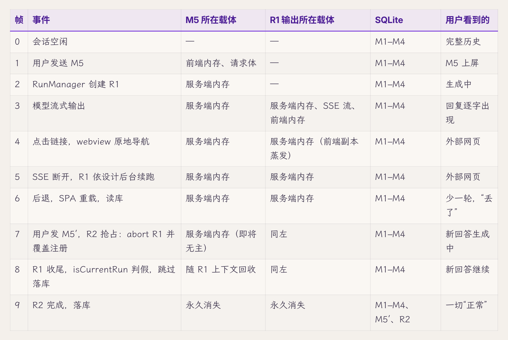
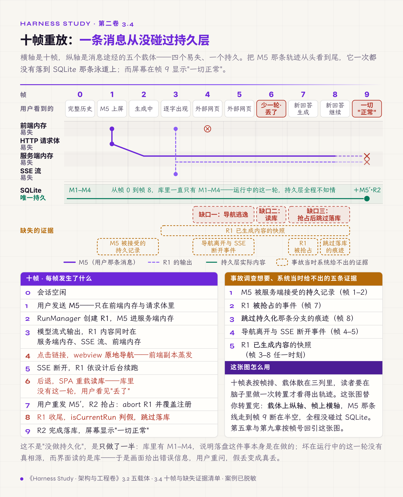
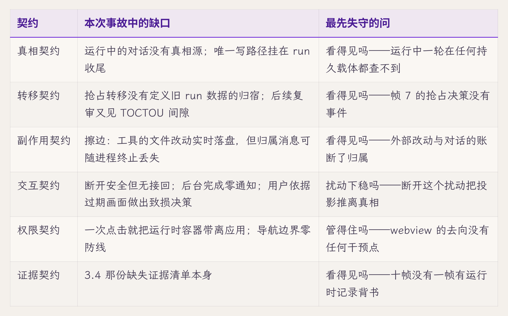
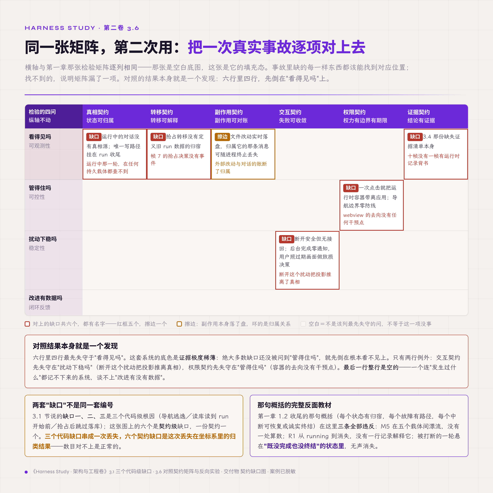

# 三、一次"数据丢失"事故：判据的反向验证

> v2.0 · 2026-07-21 · 依据 SPEC.md §十 章 spec（v1.0 重构：脱敏改入门卷惯例、新增反向验证主轴与业界对照、破坏实验升四步协议、AHE 主场化、STAR 完备性前置执行）· 四维评审四路已落实 · **用户过审（2026-07-21，"继续下一章"）**
> 章名由"一次'数据丢失'事故"增副题为现名（cybernetic 评审建议：标题应命名本章方法而不止原料事故，对齐 §一 改名先例）；章名副题已回写大纲与 README。
> 旧稿 `03-incident.md`（v1.0 压缩版）留档对照（已迁 Agent-Z 仓 what-is-harness/volume2/archive/）。（本版本注与"审稿日志""引用来源"两节同属编辑工作区，出版前整体删除。）

2026 年 7 月上旬，桌面案例项目（第二章里反复举例的那个桌面 agent 应用）收到一条用户报告。这个应用的结构在同类产品里很典型：Tauri 壳套 React 前端，Node 服务端，SQLite 存储，回复经 SSE 流式下推。用户在一个已有几轮历史的会话里提了问，回答正在逐字出现；回答里带一个链接，点了它，整个窗口跳去了那个网页。没有新标签页，没有浏览器工具栏，只能右键"后退"。退回来，应用重新加载，对话列表还在，刚才那一轮问答不见了。用户判断记录丢了，把问题重新问了一遍，这次顺利得到回答。后来核对才发现：第一次的提问和那半截回答，从此再也找不到。

复盘出现了一个矛盾的局面。UI 正常，连接层正常，run 正常，数据库正常，每一层都严格执行了自己的设计，消息仍然永久消失了。

第一章展开了地图，第二章把四个问题变成了判据。本章拿这次事故做一次双向检验：

- **前向**：把事故逐帧拆开，看缺失的每一样东西能不能在六契约×四问矩阵上找到对应位置。找不到对应位置的缺口，说明矩阵漏了一项，得补。
- **反向**：把时间拨回事发之前，拿第一章的六问和第二章的判据把这套系统审一遍，看每个根因能不能被提前圈出。圈不出的根因，先分辨它是结构缺口还是实现 bug：漏掉结构缺口，才说明这套坐标系失灵；实现 bug 圈不到，是坐标系本来的边界，应当标注出来，而不是硬把矩阵扩大。

本章的产出是一张十帧时间线、一份缺失证据清单、一张第一版契约缺口图，以及一个可以搬回自己系统的检验流程。评估别人系统的读者（assessor）尤其值得在本章多花些时间：事故是全卷最现成的评估素材，别人的每一份事故复盘（postmortem），都可以用同样的方法逐条归入矩阵。

## 3.1 事故还原：三个缺口串成一次丢失

还原要从摸底说起。团队同批收到的其实是两份报告：除了开头那份"点链接后记录全没了"，还有一份"切走再切回，运行中的会话一片空白"。两份报告的症状都指向状态，而状态问题最忌讳边猜边改。团队没有直接动代码，先做了一轮全面摸底：9 路专项审计（7 路主线加 2 路查漏），每条 P0/P1 发现由独立验证者以"默认是误报"的立场对抗核实，全部结论精确到 file:line（文件与行号）；摸底报告首页写着一句话："本报告未修改任何代码"【经验】。先诊断，后动手。以下机制还原全部出自这份报告。事故由三个互相独立的缺口串成。

**缺口一**：一次点击就能把应用带走。前端渲染链接的代码只有一行：`Thread.tsx:50` 输出 `<a target="_blank">`。markdown 里的链接总得能点，这一行再普通没有。问题在壳层：Tauri 壳没有装 opener 插件，`main.rs` 没有注册 on_navigation 回调，capabilities 只有 `core:default`。在该应用当时所用的 Tauri 与 WebView 组合下，`_blank` 没有打开新窗口，而是让主 webview 原地导航，整个 SPA（single-page application，单页应用）被外部网页替换，前端所有内存状态随之丢失。也没有 beforeunload 守卫拦一下。

**缺口二**：退回来之后，画面给出了错误的信息。SPA 重载后从 localStorage（浏览器本地存储）恢复会话选择，再 GET `/api/sessions/:id/messages` 读消息，这条路直读 SQLite（`sessions.ts:372-380`）。问题在于，被打断的那轮 run 还没结束，而这套系统唯一的落库点 `persistRunMessages()`（`chat.ts:2418-2544`）只在 run 收尾的 finally/catch 里被调用（`chat.ts:2166/2227`）。库里存的是 run 开始前的历史。于是画面缺了一轮，看起来就是"丢了"。此刻数据并没有丢：run 还在服务端后台跑，跑完会落库。那份"切走切回一片空白"的报告，根子也是这一条：读库永远读到 run 开始前的状态。

**缺口三**：用户的合理反应，把假丢变成真丢。用户在"空了一轮"的会话里重新提问。`RunManager.start()`（`run-manager.ts:43-49`）的抢占语义是：abort 旧 run，随即用新 run 覆盖注册表，不等旧 run 落盘。旧 run 的收尾逻辑走到 `isCurrentRun` 检查（`chat.ts:2219-2220`），发现自己已经不是当前 run，跳过整个持久化。被打断的那一轮（用户的提问加上已生成的半截回答）从未写入数据库。抢占的"替换"行为有单元测试锁定，但没有任何测试问过它对持久化的副作用。

有个细节值得停一下：服务端"SSE 断开不杀 run"是有意的设计。第二章 2.4 拿它示范过契约六要素，当时 evidence 一栏填不出来；这次事故正好说明了那一栏为什么空着。这个设计只做了一半。断开确实安全：`chat.ts:1642-1644` 的注释写得明明白白，还有专门的 safeWrite 保证流断了 agent 也能继续跑完。"接回来"却没有做，后台跑完也无人知晓。摸底报告把这一类问题命名为**半途设计**：机制只接了一半的线，比没有机制更危险，因为它制造"已保障"的假象【经验】。同一轮摸底与复审里，同类的还有三例：审计表建好了没接线，告警格式化了没发送，降级档位写进了文档却没实现。第一章 1.3 的 hook 案例（hook 的 schema、注册方法、单测齐全，却没有接进 session 引擎）是它在配套实现项目里的同类：写了、接通、生效，是三件事。

三个缺口各自独立，各自都不足以丢数据；串在一起，丢失就只差一个点链接的用户。根因链清楚了，下一节把它放到消息走过的路上看。

## 3.2 "丢消息"丢在哪一段路上

把根因链放到载体上看，会更清楚。一条消息从键盘到磁盘，途经五个载体：

1. 前端内存（React state），易失；
2. HTTP 请求体，易失；
3. 服务端内存（run 上下文），易失；
4. SSE 流（回复下行），易失；
5. SQLite，持久。

摸底报告的总诊断只有一句话："运行中的对话没有真相源（SSOT）。一轮 run 的过程态只存在于两个易失载体里——一条一次性 HTTP 流和 server 内存"【经验】。五个载体里前四个都是易失的，只有第五个持久。摸底那句"两个易失载体"，指的是其中承载 run 过程态的两个：服务端内存与下行的 SSE 流。而通往第五个载体的唯一写路径挂在 run 收尾。run 越长，这段无保护的窗口越宽，而 agentic 任务恰恰以长著称。

这个结构还制造了一个查询盲区。运行中的会话被读取时（切回、重载、从另一个入口查询），读到的永远是 run 开始前的状态。切回后唯一的"临场感"是一次性的 GET `/api/runtime-state/:id` 快照，只含 phase 和 token 计数，没有消息正文，而且不再更新。run 在后台跑完落了库，界面也没有任何机制自动重拉，用户要再切走一次、再切回，才能看到已经存在的东西。界面本应是一个投影（从持久状态派生出的只读视图，可随时重建，不回写真相源）；真相源缺席，投影就只能靠猜，而靠猜的投影迟早会让用户做出造成损失的决定。这个查询盲区属于交互契约，3.6 会用到它。

## 3.3 每一层都正常，系统仍然出错

载体查完，回到组件。把事故涉及的五个组件逐一核查，问同一个问题：它有没有违背自己的设计。

UI 与设计一致。它如实渲染了数据库里的内容。切换会话时整体销毁重建 runtime 是有意设计，`App.tsx:626` 的 key 注释自述"ensures the runtime is fully recreated on session switch"。

连接层与设计一致。SSE 断开不杀 run 是深思熟虑的决定，注释和 safeWrite 都在。断开这件事本身被处理得干净利落。

旧 run 与设计一致。它完整跑完了自己的 agent loop，收尾时按写好的分支走：`isCurrentRun` 判假，跳过持久化。这个守卫的本职是防止两个 run 同时写一个会话，单看是正确的防双写逻辑。

RunManager 与设计一致。抢占语义有单元测试，"新 run 替换旧 run"的行为与测试锁定的一致。

SQLite 与设计一致。没有写入失败，没有损坏。它只是从未收到那次写入。

五个组件各自守住了局部约定。"用户消息一旦被接受就不会消失"这条系统级承诺，却不在任何一层的职责清单上：没有 owner，没有测试，没有报警。三路独立审计撞上同一个结构缺陷【经验】，因为缺陷本来就在结构里：局部正确逐层相加，加不出系统正确。第二章 2.9 把这种情况列为"看起来对"的第三层，3.8 会给它配上定量版本。

## 3.4 十帧重放：状态、事件与副作用

逐一核查的结果是"谁都没错"；要看清"哪里错了"，得把 3.1 的叙事压成一张逐帧的状态表。M1–M4 是历史消息，M5 是事故中的提问，R1 是被打断的 run，M5′/R2 是重问后的新提问与新 run。

两个观察。

第一，丢不丢取决于时序，这是一个竞态（race condition）。帧 7 若发生在 R1 自然跑完之后，M5 已经落库，事故就不会发生。丢与不丢之间隔着一场竞速：用户重问的速度，对 R1 剩余的执行时间。这也是这类 bug 长期潜伏的原因：复现要同时凑齐导航逃逸、run 未完、用户重问三个条件，日常测试几乎不会同时碰上。

第二，这张表是事后人工重构的。系统本身没有记录帧 4 的导航离开、帧 7 的抢占决策、帧 8 的"跳过持久化"。审计者靠读代码推演加探针测试复现，才把十帧拼出来。顺手列一份**缺失证据清单**，即事故调查想要、系统当时给不出的东西：

1. M5 被服务端接受的持久记录；
2. R1 被抢占的事件：何时、被谁、依据什么；
3. "跳过持久化"分支被走到的任何痕迹；
4. 前端导航离开与 SSE 断开的事件；
5. R1 已生成内容在任一时刻的快照。

这份清单先记下，第十三章的证据面（Evidence Plane）会把它变成正式需求。用第一章 1.3 的成熟度尺来说，这份清单就是这套系统从 L1 升到 L2 要做的全部工作。

*图 3.4 · 十帧重放：一条消息从没碰过持久层*

## 3.5 症状修复、局部修复与契约修复

时间线拆完，接下来是修复。同一个事故有三种修法，桌面案例三种都做了：摸底方案的阶段 0 拆成三个独立 PR 并行推进【经验】。放在一起看，三者的差别一目了然。

**第一种，症状修复**：把触发器拆掉。第一个 PR 引入 plugin-opener，markdown 链接点击后交给系统浏览器打开；Rust 端补上 on_navigation 白名单，作为第二道防线。点链接再也不会把应用带走。局限同样明确：同类的触发器还有一串。托盘退出的 `kill_node()` 先 POST shutdown、再 sleep 2 秒强杀，全程不检查是否有 run 在跑；此外还有 OS 关机、进程崩溃。触发器拆得完吗？拆不完。

**第二种，局部修复**：堵住升级路径。第二个 PR 让抢占前先落盘：`start()` 替换旧 run 前，在 abort 之后加上 `await waitForFinish`，复用既有的 finishPromise 机制，并补上"抢占后旧轮已落库"的测试。假丢不再升级成真丢。但查询盲区原封不动：切回来画面照样缺一轮，用户照样误判、照样重问，只是重问的代价从"永久丢失"降到了"虚惊一场"。

**第三种，契约修复**：换掉承诺本身。第三个 PR 做增量持久化：run 开始即在一个事务里写入用户消息和一条"生成中"的 assistant 占位行（pending 态），运行中每 2 秒把已完成步骤的快照更新进这条占位行，run 收尾从"一次性写入"改成"终态更新"。系统从此多了一条可以宣称的承诺：run 进行中随时读库，看到的都是最近一次节流落盘时的状态。遇到导航逃逸、强杀、断电，读出来的画面顶多缺正在生成的那一步，外加最近两秒的进展，足够让用户判断"没丢"。

三种修法都做完，复审又有新发现。摸底方案四个阶段共 12 个功能 commit 合入后，团队对分支 diff（+1665 行、35 个文件）做了 7 维审查，每条发现照旧逐条对抗验证，确认 34 条、剔除 4 条误报【经验】。其中一条与本事故同类：`tryStart` 的同会话并发抢占存在检查与使用之间的间隙（TOCTOU，time-of-check to time-of-use，即检查之后、使用之前，状态已被并发方改变）。双标签页或快速双击时，两个抢占同时通过 recheck；后到者静默 abort 掉先到者刚建的 run，那条 run 写下的 pending 占位行就永久卡在"生成中"。修法是把 tryStart 按 sessionId 用 promise 链串行化。第二章 2.7 拿它当转移契约的反例，出处就在这里：它是修完事故主路径之后挖出来的第二层问题。

同一批复审里，更有讽刺意味的是另外几条。threadKey 回归是韧性建设自己引入的；回滚逻辑里的"安全快照"藏着毫秒时间戳碰撞，好快照先被坏内容覆盖，再被拷回去。还有一条经验值得单列：tryStart 串行化让 abort 晚一个微任务发生，两个既有测试的隐式时序假设当场失效。给并发原语加互斥，时序契约就跟着变，影响范围要 grep 全部调用方和测试【经验】。

这批新发现引出本节真正的结论：逐点修补没有**收敛判据**。修完一批，对抗审查再挖出一批，没有办法回答"修到什么程度算完"。回答这个问题需要一份完整的承诺清单：系统对外维持哪些保证，每条归谁负责，破坏它的路径有哪些。有了清单，"修完"才有定义：清单上每条都有 owner、有测试、有证据。这份清单的框架第一章已经给出，接下来把这次事故逐项对上去。

## 3.6 对照契约矩阵，并把判据倒着跑一遍

先做前向对照：事故里缺的每一样东西，都应当能在第一章 1.2 的六份契约名下找到位置，并说清四问里哪一问最先失守。

第一章 1.2 收尾的那句概括（**每个状态有归宿，每个故障有路径，每个中断可恢复或诚实终结**）在这里有了完整的反面教材：M5 在五个载体间漂流，没有一处算数；R1 从 running 到消失，没有一行记录解释它；被打断的一轮悬在"既没完成也没终结"的状态里，无声消失。三条全部违反。

对照表的形态本身也值得当成一个发现来读：六行里有四行最先失守于"看得见吗"。这套系统的底色是证据极度稀薄，绝大多数缺口还没被问到"管得住吗"，就先倒在"根本看不见"上。只有交互契约（扰动把界面这个投影推离了真相）和权限契约（容器的去向没有干预点）先在别的问题上失守。副作用契约那一行也没有落在第一章给它定的主要问题"管得住吗"上，因为本次事故里副作用本身已经落盘，坏的是它与对话之间的归属关系。这属于可观测性缺口，够不上对账硬门（把声称与实际机器比对、对不上就拒绝的硬性检查）要拦的那类缺口，所以标为擦边。

*图 3.6 · 同一张矩阵的第二次使用：六个缺口都有名字，四个先倒在"看得见吗"上*

前向对照通过：六个缺口都找得到名字，没有遗漏。但这只证明矩阵够用来**命名**，还没证明它够用来**预防**。所以要做反向实验：把时间拨回事发之前，逐条套用判据。

反向实验有一个必须先交代的方法论陷阱：根因已经诊断出来了，回头去找哪一问能圈住它，等于开卷考试，天然带着后见之明。这里给出的限定是：用来审的判据全是与本事故无关的通用问句（第一章的六问、第二章的 catch 三问与六要素表），要判断的只有一件事：一个事前逐项问过来、还没见过这次事故的评审员，会不会在这一项停下。下面三个缺口都按这条更严的标准审。

记分之前，还要先定一条独立于"矩阵抓没抓到"的判准，否则后面的记分就成了同义反复：

- **结构缺口**：契约的 owner、转移或边界在设计层就缺一块，不论用什么代码实现，它都存在。
- **实现级 bug**：契约齐备，只是在某段代码的某个时序窗口里被违反。

矩阵要对结构缺口负责；实现级 bug 圈不到，属于它的正常边界。

缺口二，六问的第一问就能抓住。第一章五分钟动作的第一问是"哪份状态算数？"对运行中的会话问这一问，答案是"没有哪份"，标红。第二章练习的第 2 题（把"用户可以继续上次会话"改写成契约）是同一个缺口的另一面：guard 一栏要求"上次"精确指到哪个 step，这套系统填不出来。判据抓得住，而且两条判据从不同方向指向同一个缺口。

缺口三，catch 三问一问都答不上。第二章 2.2 要求对代码里每一条 catch、fallback、默认分支都跑一遍三问；逐条跑下来，`isCurrentRun` 判假后跳过持久化的那条分支当场答不上来。这条路径的终点状态叫什么名字？没有名字，数据无声消失。谁会知道系统走到了这里？没人，没有事件。走到这里之后，承诺还成立吗？"消息不消失"从此不成立。按第二章的规矩，三问都答不出的分支，在事发前就该登记进 Assumption Register。

缺口一，按事前的标准，判据抓不住；差的不是问句，而是一种用法。六问的第五问是"谁批的权限、现在还有效吗？"常规读法只对模型、工具和 subagent 问这一问。把运行时容器本身（webview、进程、壳）也列为权限主体，再问"这个容器能去哪"，导航防线的缺席一问便知。缺的用法就是这一条：权限对象清单必须包含容器层。这不算矩阵漏项，算用法修正，记入第十一章的权限对象清单。

判据圈不到的，也要如实记下。threadKey 回归和毫秒时间戳碰撞，哪条契约判据都不会提前指到它们。按上面的判准，这两条属于实现级 bug：契约都在，坏在具体时序。抓住它们的是另一套东西：7 维复审、逐条对抗验证、"修复本身也要过复审"的做法，与第二章 2.6 的测量方法同属一类。

反向实验的结论是：

- 三个结构性根因，2/3 被事前判据原样圈出。
- 导航逃逸那个圈不到，要先补上"权限对象清单包含容器层"这条用法；而这条用法是看过根因之后才补的，不计命中，修正记入第十一章。
- 两个实现级回归，0/2，落在矩阵之外，归测量方法管。

矩阵是设计期的网，测量是改动期的网（也就是第二章的测量方法），按时间先后各管一段。两张网叠着用，缺了哪一张，都会有一类事故漏过去。

本节得到两样东西：一张被真实事故填过的契约缺口图，以及这套坐标系的第一份能力边界说明：它圈结构缺口，不圈实现 bug。第十五章的评审流程直接建在这两样上。

## 3.7 从一次事故到一类现象

一家小团队的一次事故，凭什么代表一类现象？单个事故可以归咎于工期、疏忽或运气，一类现象不能。

证据第一章 1.0 已经摆过：同一批模型只换 harness，复合分差 23.8；1642 条故障轨迹里三大类故障全落在系统层。这里只补一个对照：借 MAST 的三大类故障作类比，本次事故每一类都能找到对应。

- **规范缺陷**："消息不消失"这条承诺没人负责。
- **协调失败**：抢占与持久化两个机制互不知情。MAST 的这一类原指多 agent 系统中 agent 之间的失调，这里是单个应用内两个机制之间的问题，只能算类比。
- **验证缺失**：抢占有测试，它对持久化的副作用没有测试【评审，arXiv:2503.13657】。

一次桌面应用的事故，三类都能找到对应。

同类缺陷也不难在别处找到。配套实现项目早期的会话记录里留着同一句诊断：streaming 中途 abort 抛出 AbortError，异常直接冒出 for-await 循环，当前 step 的文本永远不会进入待持久化列表。落库的只有前几步，用户正在看的那一段恰好是丢的那一段【经验】。两个代码库出自同一位作者，算不上独立复现，只能作为同类缺陷再次出现的弱证据；但它印证的规律成立："过程态何时落盘"这个问题只要没被显式回答，答案就默认是"最后一刻"。

## 3.8 改进不可叠加：逐点修补的定量失效

3.5 的复审新发现说明逐点修补挖不到底；这一节给它配上测量数据。数字来自 AHE：一套让 agent 自动演化自己 coding harness 的系统，每代改动都跑消融来测贡献，因此积累了少见的"改动与效果"配对数据【预印，arXiv:2604.25850】。第二章 2.9 在认知层面引过它的结论，这里展开工程层面的数据。

第一组数字：三个正收益组件单独测量共 +11.1pp，组合后只剩 +7.3pp。论文给了机理：三个组件都把行为推向同类闭包式验证，叠加只是重复检查。改进互相抵消。

第二组更值得警惕，关于预测能力的不对称：agent 预测"这个改动会修好什么"的精度 33.7%、召回 51.4%；预测"会弄坏什么"的精度 11.8%、召回 11.1%。说清一个改动为什么有帮助，勉强及格；预判它即将破坏什么，接近瞎猜。桌面案例的复审就是这条统计的实例：韧性建设自己引入了 threadKey 回归，串行化 tryStart 让两个既有测试的时序假设当场失效。没人预测到，全靠对抗复审兜住【经验】。

两组数字合起来，就是 3.5"逐点修补没有收敛判据"的定量理由。局部改进不能线性外推，破坏面无法事前预测，那么可靠性只剩一条路径：显式声明每条承诺，给每条承诺配上独立于改动过程的验证。六契约在第一章是由失效场景反推出来的设计；到这里，它也是测量数据指向的结论。

## 3.9 业界对照：如果这套系统跑在 Temporal 上

坐标系搭好了，拿它做一次选型推演收尾。第一章 1.4 对照过 Temporal 在各项契约上的强弱，这里换个用途：把十帧表铺在它面前，逐帧问"这一帧会被记录吗"【厂商实践，依据官方文档整理】。

先把对方的优势说足。若 R1 是一个 Temporal workflow：M5 作为 workflow input，在 workflow 启动（帧 2）时即持久化，从此丢不掉；帧 7 的抢占必须走显式的 cancel 或 signal，会进入 event history；帧 8"跳过落库"这类分支决策可以通过重放审计。缺口三在它的模型里不成立。缺口二只能部分缓解：用户消息不会丢，但如果模型的流式输出发生在单个 activity 内，生成到一半的内容不会进入 event history，要靠 heartbeat 携带进度，或把生成拆成多个分片 activity，才能保留下来；运行中的状态要让界面读到，还得另写 Query。转移契约和真相契约这两列，它仍然比多数自研 runtime 做得扎实。

失效点同样清楚。帧 4 到帧 6 全程发生在它的边界之外：webview 被带走、UI 读到过期的投影、用户据此误判并重问，这些属于交互契约，workflow 引擎不管；帧 4 的导航权限更不在它的概念范围里。此外，给单机桌面应用配一套 workflow 集群，部署成本与产品形态不成比例。结论回到矩阵：名气最大的方案也只覆盖自己那几列。选型的正确做法是先把自己的矩阵填满，再看候选方案覆盖哪些项；覆盖不到的，引入之后照样得自己建。

## 破坏实验：四处强杀

每章做一次主动破坏，本章的对象是"消息不丢"这条承诺本身。按全卷的四步测量协议执行：

1. **破坏动作**：同一套系统，在四个时点分别 kill -9：模型调用前（用户消息已被接受、run 未开始）、流式中（回复已生成一半）、落库前（run 已完成、收尾持久化未执行）、工具执行后（副作用已发生、记录未落盘）。
2. **观测点**：重启后消息表的内容与终态标记；事件流里有无中断记录；工具改动（file_snapshots）的归属；UI 最终呈现。
3. **判定**：每次强杀之后，重启读库必须能回答四个问题：用户消息还在吗？这一轮以什么终态呈现？半写状态可识别吗？外部改动归属于哪一轮？四问都有已定义的答案为通过；任何一问的答案是"不知道"，这一次判失败。
4. **复跑**：每个时点 N=3，判定结论不漂移。

实证状态分层说明【经验】：修复前的失败形态，摸底与复审逐环对抗验证过缺口二、缺口三的路径（读完整代码上下文，必要时写探针测试复现）；修复后，验收清单实测过其中两条：任务运行中退出应用，重启后可见"[已中断]"标记；Stop 之后"[已停止]"落库，刷新重进可见。四个时点的完整矩阵尚未自动化，留给第十四章的故障注入；在读者自己的系统上，这四次强杀可以当作练习。四次强杀各自针对一类契约：第一次针对真相，第二次针对交互与真相，第三次针对转移，第四次针对副作用与证据。答不上来的那几次，就是自己系统契约缺口图的初稿。

## L 级自检

按第一章的成熟度尺（L1 能跑、L2 能看、L3 能评，全表见第一章 1.3）给本章的对象打分。

事故时点的桌面案例：SSE 断开保护有名字、有注释、随分支合并进主链路，是 L1；帧 4、帧 7、帧 8 在 trajectory 里没有任何事件，缺 L2。第一章 1.3 的假落地公式（有名字、没事件、嫌疑高）在这套系统上再次命中，半途设计正是假落地在桌面应用里的形态。

修复后：增量持久化让运行中的状态随时可查（以最近一次节流落盘为准），真相契约升到 L2。转移契约部分升级：增量持久化记下了 pending 与终态记录，但抢占决策本身（谁抢占、凭什么）仍无事件，只能算部分达到 L2。那条端到端集成测试（真实 RunManager 加真实 SQLite，贯穿验证"旧轮先终态化，新 run 才拿到手"）给的是接近 L3 的验证信号，但属于另一把尺，不能顶替 L2 要求的事件记录。缺失证据清单的五条就是剩下的工作，主要在第十三章处理。这套系统离 L3（能评）还差一个 verifier 层，本卷第十三章之前不把它算作 L3。

## 交付物

本章产出三项，全卷复用：

1. **十帧时间线**（3.4）：第五章讲 run 状态机、第九章讲断开与接回时，都会回来引用具体帧号；
2. **缺失证据清单**（3.4 末五条）：第十三章证据面的第一版需求，也是从 L1 升到 L2 的工作清单模板；
3. **契约缺口图**（3.6 对照表）：第十五章架构评审的原型，拿任何系统对六份契约过一遍，空白项就是风险清单。

## 立即可做的一个动作（五分钟）

builder 版本：打开自己的项目，grep 落库函数的全部调用点（persist、save、insert，名字不重要），然后回答一个问题：run 进行中，数据库里有什么？答案若是"run 开始前的状态"，3.4 那张表里的每一帧都可能在这套系统里发生，差的只是一个点链接的用户。

assessor 版本：向被评团队要最近一次事故的 postmortem，把每个根因归入 3.6 的对照表。三种结果各有含义：每个根因都能归入某一项，说明坐标系和团队的认知对上了；有根因归不进任何一项，先分辨它是结构缺口还是实现 bug，前者要质疑矩阵，后者该去查团队的复审做法；拿不出 postmortem 的团队，证据契约这一项已经有了答案。

## 下一章

帧 7 到帧 8 的抢占还留着一个问题：它是一次没有状态机支撑的状态转移。一个 running 的 run 能被谁、凭什么、转移到哪些终态，此刻全凭散落在各处的 if 分支决定。这类缺口怎么系统地补，要先看清整张架构。判据经受住了这次实战，下一章把蓝图完整摊开：八个组件各自长什么样、边界在哪、彼此怎么接。摊开之后，第一个要深入的，正是这台缺席的状态机。

## 审稿日志

> （编辑工作区：本节与"引用来源"节出版前整体删除。内部索引不随稿出版：事故素材 research/volume2/08-howpot-resilience-audit-2026-07-09.md 与 08-howpot-resilience-review-2026-07-09.md（快照，原件在案例项目仓库 docs/ 下）、学术核对 research/volume2/02、AbortError 旁证见配套实现项目会话记录。）

| 轮 | 检查 | 命中与修改 |
|---|---|---|
| 版本史 | — | v0.2-v1.0（2026-07-19 前）：卷首开场六拍数轮打磨后随 v5.4 手术移交 §一，本章压缩为验证案例，v1.0 用户审回（三章批次：叙述散、需脱敏）。2026-07-21 按 SPEC §十 重构为 v2.0：脱敏改入门卷惯例（Howpot→桌面案例项目、z-agent→配套实现项目，file:line 与真实数字保留）；新增反向验证主轴（3.6 判据倒跑：3/3 结构根因可圈出、0/2 实现回归，坐标系边界声明）与业界对照（3.9 Temporal 对十帧表逐帧对账）；破坏实验升四步协议并分层标注实证状态；AHE 从立论段升主场（3.8）并回指 §二 2.9；新增 L 级自检、assessor 五分钟动作、STAR 前置（摸底动机、两份报告背景、AHE 身份句）；交叉引用全部改指 §一 v4.0/§二 v1.0 实际节号 |
| 章级验收自测 | SPEC §十 清单 | 一手证据 9 处（三缺口 file:line／五载体与 SSOT 总诊断／三 PR 三档修复／12 commit+1665 行 7 维 34 条／TOCTOU 出身／threadKey 回归／毫秒时间戳碰撞／串行化时序涟漪／AbortError 旁证）；外部权威 3（MAST 对账、Harness-Bench 回指、AHE 四数）；业界对照 1 家带失效点（Temporal：帧 4-6 边界外＋部署形态）✓；破坏实验四步协议＋实证分层 ✓；L 级自检（含"离 L3 不冒充"）✓；双读者动作 ✓；回指不重列（六契约定义／压缩语／四问／23.8pp 均回指）✓ |
| R1 grep 红线 | 全套（四维评审落实后复跑） | "你"系 0；元叙述 0；模糊词 0；显式禁形（而不是/不仅…还/不靠…靠/不是…而是）0；对比修辞 style 评审逐条人工判定：广义 2 处（3.7"单个事故可以归咎…一类现象不能"、3.8"勉强及格…接近瞎猜"），均 motivated，恰达 ≤2 上限；3.3 分号三连（116 行压缩语反面教材）判为 motivated 排比不计；标题超长 0；体量终版 215 行 |
| 四维评审 | **四路已跑齐并全部落实（2026-07-21）：technical A-／style A-／cybernetic A-（方法论比例实测 55%）／business B+，零 P0 遗留** | cybernetic P1（本章最重的五条，全落在反向验证脊柱）：3.6 补后见之明披露段（开卷考试陷阱＋"事前逐格问过来的评审员会不会停下"的更严口径）、补结构/实现独立判准（防 3/3 与 0/2 同义反复）、引言判定口径改为与 3.6 执行一致（实现 bug 圈不到是正常边界该标注不该硬扩）、"两张网"补"第三套分类法并不存在"防框架增殖、章题增副题"判据的反向验证"（对齐 §一 改名先例，过审后回写大纲）；P2：catch 三问改"逐条跑全部分支"收后见之明尾巴、对账表补"四行收敛于看得见吗是结构底色"阅读注＋副作用擦边理由、L 级自检修"抢占有测试≠L2"的尺子混用。style P1：3.6 四段与 3.1 缺口段/3.5 档位段整句加粗全部去粗或收窄到标签词（§二 清单腔同款病）、3.5 续集密度墙拆两段断长句；P2：3.3 五无罪去粗、"三种"重复改"三档"、3.2 节末补盘点句、捞回 v1.0 技术栈定位句与"只做了一半"顿挫。technical（零 P0/P1，全部数字与 file:line 逐条核对无误）P2：三例同构改"摸底与复审"归属、hook 案例去"评测线"专名相撞、Temporal 帧 1→帧 2、SSE 保护"有单测"改"随分支合并"（快照未坐实）、探针测试改"必要时"口径、五载体与"两个易失载体"口径落差点破。business P1：开场补内联脱敏声明＋技术栈句、AHE 四数补终稿回核标注（正文＋引用来源）、引言补 assessor 卖点句、assessor 近道纳入 §三（§一 1.5 与 SPEC §七.6 已同步，§一 记过审后增量待用户确认）；P2：引用来源节补自带删除标注、L 级自检补成熟度尺最小锚定、jimi-ink 清除项进 README 脱敏 checklist。未采纳/待议：五无罪保留加粗（style 判"最站得住"）→ 已随全章统一去粗；开场与 §二 同起手式（style 判提示非必改，事故章正当）→ 不改；业务 P1-2 真实产品暴露面（threadKey/毫秒精度指纹）→ 保留现文待用户裁决 |
| 用户初审增量 | 2026-07-21 | business P1-1 的内联脱敏声明裸句撤回（用户裁决：落法破坏叙事）——声明上移卷级"关于案例"说明（README 记待办、SPEC §七.6 同步），开场技术栈定位句保留 |
| 语域清理 | 2026-07-21 用户裁决（SPEC §七.10，同日两批） | 3.2"裸奔的窗口"→"无保护的窗口"；庭审修辞按用户第二批裁决收掉——3.3"提审嫌疑人/过堂"→"逐一核查"、五处"X 无罪"→"X 与设计一致"、3.4 首句同步（§二 2.4/2.9 两处引用同步改写） |
| v5.5 编号顺移 | 2026-07-21，大纲 v5.5 手术（新增 §四 蓝图章，原 §四–§十四 → §五–§十五） | 正文前向引用全部顺移（3.4 清单归宿 §十三、3.6 权限对象清单 §十一、破坏实验 §十四、五分钟动作、遗留问题 §五 等约 15 处）；本表历史行保留旧编号，按大纲读法规则映射 |
| 暴露面裁决 | 2026-07-22 用户裁决（SPEC §七.6） | business P1-2 悬案（threadKey/毫秒时间戳指纹）关闭：脱敏标准＝关键名字脱敏＋产品功能作用照实说清，负面机制细节不删减；现文保留不动 |
| 终稿回核清单 | 2026-07-27 正文【】标注清理（用户指令） | ①AHE 四组数字终稿前逐字回核（arXiv:2604.25850，3.7）；②Temporal 十帧对照终稿前回核（3.9，标注保留"依据官方文档整理"） |

## 引用来源

> （编辑工作区：本节出版前整体删除。）

- 【评审】MAST — arXiv:2503.13657（NeurIPS 2025 D&B）。三类占比对账（3.7）。
- 【预印】Harness-Bench — arXiv:2605.27922。aggregate score 差 23.8 分（3.7，回指 §一 1.0）。
- 【预印】AHE — arXiv:2604.25850（v4）。+11.1→+7.3pp 非加性；fix-precision 33.7%/recall 51.4%，regression-precision 11.8%/recall 11.1%（3.8；四组数字终稿前逐字回核）。
- 【厂商实践】Temporal — event history、cancel/signal、workflow input 持久化（3.9，依据官方文档整理，终稿前逐格回核）。
- 【经验】桌面案例项目 2026-07 韧性摸底与复审：9 路审计、三缺口 file:line、五载体、S0 三 PR、12 commit/+1665 行/7 维/34 确认 4 误报、TOCTOU、threadKey 回归、毫秒时间戳碰撞、串行化时序涟漪、验收实测（[已中断]/[已停止]）。快照指针见编辑工作区。
- 【经验】配套实现项目：streaming AbortError 丢失诊断（3.7，同作者弱主张）。
