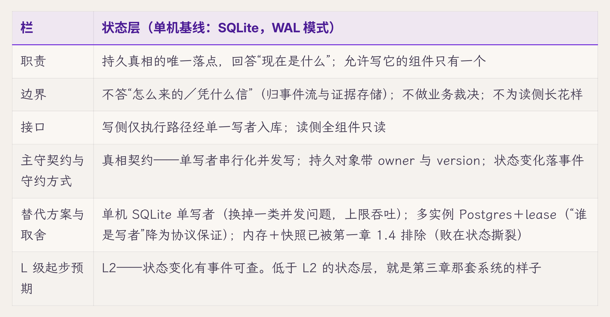
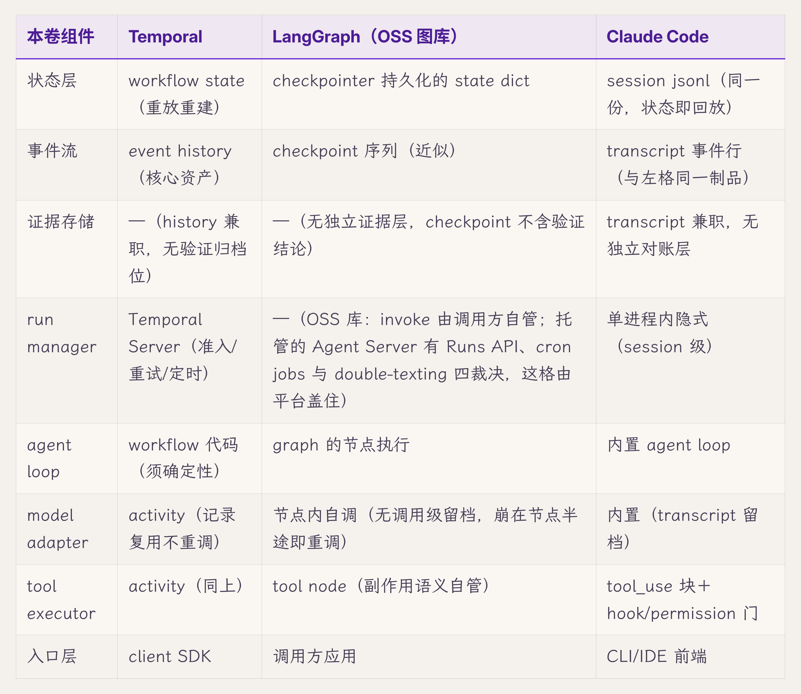

# 四、参考架构蓝图

> v1.0 · 2026-07-21 · 依据 SPEC.md §十一 章 spec（v5.5 新增枢纽章：组件卡×8、逐组件业界映射、部署概览；"设计空间占比"尺首个执行章）· 四维评审四路已落实 · **用户过审（2026-07-21，"继续下一章"）**
> （本版本注与"审稿日志""引用来源"两节同属编辑工作区，出版前整体删除。）

前三章把框架立完了：第一章的坐标系、第二章的判据、第三章的实战校验——判据已在一次真实事故上逐帧圈中根因，坐标系不再是纸上推演。那场事故还留了一个回望的角度：每个根因，都是某个组件的职责没人认领——图一模糊，事故就有缝可钻。从第五章起，本卷要一格一格地深潜——状态机、持久化、恢复、副作用，每章放大矩阵上的几个格子。深潜之前还差一样东西。第一章 1.4 由失效场景反推出八个组件，那一节回答的是"为什么恰好是这八个"；它没有回答的是"每一个长什么样"——职责边界画到哪里、跟谁怎么接、守约靠什么手段、换一种做法要付什么代价。读者马上要下到第五章的转移表和第六章的表结构里去了，手里的图得先从存在性证明升级成工程图纸。

本章就做这一件事：给八个组件各立一张**组件卡**。一张卡六栏——职责一句、边界（明确不做什么）、上下游接口、主守契约与守约方式、替代方案与取舍、L 级起步预期。八张卡合起来，是本章的核心交付物 **Component Register**：builder 深潜前拿它当全图，assessor 拿它当评审对照物——第十五章评审时，被评团队自画的组件图就是拿这八张卡逐张对位、对不上就标红的那把标尺。读完本章，手里应当多三样东西：八张组件卡、一张业界逐组件映射表、一页部署概览。

## 4.1 组件卡怎么读：拿状态层做样张

先立读法。第一张卡给状态层——第一章 1.4 第一条硬约束（真相只放一处）催生的组件：

六栏各有分工。前四栏让组件**可指认**：它是谁、不是谁、跟谁接、守什么约——评审时拿任何一个系统对着问，答不出哪栏就缺哪块。第五栏让蓝图保持为**设计空间**：每张卡记的是取舍现场，单机基线只是取舍后的一个落点，换负载画像就换落点。第六栏把第一章的成熟度尺落到组件粒度，是各深潜章的验收底线预告。八张卡的完整六栏收录在本卷工作制品 Component Register（附录 G），正文按组件群展开重点栏——尤其第五栏，深潜章不会再回头讲选型，取舍在这里说清。

还有两个疑问要先排除。为什么不另立"失效模式"栏——组件的失效已拆进两处：被否方案的失效原因写在取舍栏（内存快照败在状态撕裂、进程内执行败在工具崩溃拖垮 runtime），被选方案自身的失效画像归各深潜章的破坏实验，蓝图层不重收。也不另立"四问"栏：可观测、可控、稳定、闭环是矩阵的纵轴，落在每张卡进入深潜章后的动线里，不在卡面上。说到底，组件卡没有另立分类法：它是六契约×四问矩阵的按组件切片（主守契约栏就是挂在横轴上的钩子），也是 L0-L5 尺的按组件落点（第六栏挂刻度），三者是同一张架构的三个投影。接口栏同理只记到"谁写谁读"一层，接什么——事件 schema、实体链——收录在工作制品 Event Schema 与第六章，卡不重收。

最后交代两张"八件"清单的关系，入门卷读者到这里多半已经在心里比对了。入门卷的八件 runtime 部件——agent loop、model adapter 与 routing、tool registry 与 ACI、context/memory/artifact、prompt assets、observation surface、trajectory、verifier，外加 safety 控制面——按**能力**切分：一个 agent 要能做什么，每件承载一种能力。本章的八张卡按**守约职责**切分：六份契约各由谁承包。同一套系统的两种切法，接线有四种形态。同名承接的两件：agent loop 与 model adapter，本卷各加了新约束（内存即易失；routing 裁决移交 run manager）。职责重排的两件：tool registry 管"有哪些工具"，执行半边在本卷独立成 tool executor；observation surface 并入事件流的输入侧。升格的一件：trajectory 在入门卷是一份记录，本卷把它拆成事件流与证据存储——记录本身成了承约的组件。新增的三件：状态层、run manager、入口层——入门卷的单机单入口教学场景用不到它们，跨故障执行与多入口并发一来才非有不可；context、memory、artifact 与 prompt assets 相应归位，持久的归状态层，组装出来的是投影。safety 控制面没有消失，并入了 run manager 的 policy 裁决与第十一章的权限契约。逐行对照表在第一章附录 A，两卷冲突以那张表为准。

## 4.2 真相三件：状态层、事件流、证据存储

状态层的卡已经立了。真相还有两件，第一章 1.4 第二条硬约束——只追加——催生的。

**事件流**这张卡，取舍栏最有分量，先从它说。"发生过什么"的机器可读记录有三种做法。可变行加审计表已被第一章 1.4 排除——解释一旦允许事后修订，就都不可信。剩下两种都守只追加：单机 append-only 表，和消息队列（Kafka 一类）。队列带来投递语义和横向扩容，收走的是单机运维的简单和"一条 SQL 对完账"的可审计性——多实例之前，表赢。载体定了，职责随之清楚：每次状态转移都记在这里，trigger、guard、终结原因随行，恢复扫描、UI 订阅、审计回放都从这里取材——主守转移契约。两条边界要划明：它不当消息队列用，不承诺投递语义，完成通知这类"送没送到"的事按第二章的四档只算尽力；它也不存大负载，事件行放引用、正文外置，否则高频小事件和低频大内容挤同一条读写路径。起步 L2——它本身就是 L2 的载体，这张卡若不在，全系统的"能看"无处安放。

**证据存储**归档四样东西——trajectory、policy 决策、verifier 结论、artifact 来历——只存不判：verifier 的结论存在这里，判断动作在第十三章的证据面，实时呈现也不归它，那是事件流加投影的事。它主守证据契约。要不要跟事件流合储，是这张卡唯一的取舍：合则省一个组件，却把"高频小事件"与"低频大归档"压进同一套访问模式；分则各按各的读写画像建，代价是多一条归属线。单机基线选分储——第十三章要在归档上跑对账与回放，那套访问模式与事件订阅本就不是一回事。起步 L2，归档本身即事件账。

三件的分工第一章 1.4 立过，一句带过不重推：状态层答"现在"，事件流答"怎么来的"，证据存储答"凭什么信"。第三章的缺失证据清单五条，三条是事件流的空缺，两条压在状态层的写时机上——真相三件缺一角，那张清单就长一截。

## 4.3 执行两件：run manager 与 agent loop

真相有了落点，看执行侧的两张卡。

**run manager** 是单执行内核，准入、同会话互斥、policy 与 limit 裁决、孤儿 run 的发现与收尾全在这一道闸里；它是入口层的唯一下游，run 记录与终态的持有者。边界在两头划清——不碰模型不碰工具，执行细节归 agent loop 和 tool executor；也不长业务逻辑，它裁决"能不能跑"，不参与"跑什么"。转移契约与权限契约的裁决点在此，交互契约的收敛义务（悬而不决的 run 由它给终点）也押在这里。集中还是自治，是这张卡的取舍。自治的失效第一章 1.4 论证过——同一个"取消"长出三种语义。集中把代价换到另一头：内核成了单点，每种入口语义都得过它评审，路线图上它就是瓶颈；换回来的是 permission、cancel、resume、工具执行四种语义只实现一次。入口到内核的 Routing Matrix 细则在第五章 5.11。起步 L2，准入、互斥、抢占三类决策都要有事件——第三章帧 7 那次无声抢占（决策没留任何事件的那一帧），就是这张卡缺 L2 的现场。

**agent loop** 是一轮任务的编排者：组装 context、调模型、执行工具、循环到终答。它的卡最特殊：不单独主守哪份契约，它是全部契约的履约现场，因此领全卷最硬的约束——内存即易失，攒的一切要么立刻落盘，要么等于不存在（第一章 1.4）。它不持久真相、不自证正确，证据一律外置。写法上有两条路：手写同步循环，或交给声明式 graph 引擎。graph 引擎给声明式并行、内建重试和可视化，收走的是"每一行都能标出落盘点"的透明；本卷的判断标准（第一章 1.4：任何机制要能在时序上标出位置）恰好压在透明这一侧，所以单机基线手写循环。两种 graph 的完整之辨在第八章 8.12，不在这里展开。它的 L 级起步就一件事：loop 每步 emit 事件，即 L1 到 L2 那一步——第一章的假落地公式扫的就是它。

## 4.4 外界三件：入口层、model adapter、tool executor

剩下三张卡都站在系统与外界的边界上，各守一个方向。

**入口层**（UI、API、IM、scheduler）朝着用户，适配意图、转发流。边界即第一章 1.6 破坏实验立下的判定口径——投影不回写，界面显示的一切都是持久状态的只读呈现；也不实现任何 permission、cancel 捷径，四种语义只在内核。它主守交互契约的呈现半边。把界面做厚一直有诱惑——客户端缓存能给离线体验和更快的首屏——但它引进第二个真相源；桌面案例那条 localStorage 恢复线（第三章缺口二的一环）就站在客户端缓存的代价侧。所以单机基线守薄投影。起步 L1 即可——它的正确性押在"不写"上，靠第一章 1.6 那个破坏实验验，不靠自己的事件。

**model adapter** 朝着模型，是调用的记账员。每次调用完整留档——模型标识、参数、上下文摘要、输出——恢复时复用记录、永不重调，工业先例是 Temporal 把不确定操作收进 activity（第一章 1.4 已引）。它不做 routing 裁决（归 run manager，第一章附录 A 已裁），也不解释输出，那归 loop。主守转移与证据契约在模型调用上的那几格。另一条路是抽出独立的模型网关：集中计量、限流、多应用复用，代价是多一跳延迟、多一个单点。单机库内够用，多租户再谈网关。起步 L2，调用记录本身就是事件。

**tool executor** 朝着外部世界，是副作用的唯一大门，顺序定死——先落盘意图，再执行，再落盘结果，工具返回只算一面之词（第一章 1.4 定死的顺序）。policy 判定不在这张卡上，裁决归内核、它只执行裁决结果；结果解释也不归它。主守副作用契约。执行放在哪里，三档可选——进程内、子进程沙箱、远端 worker，隔离强度换执行开销。进程内执行的风险是工具崩溃连带拖垮整个 runtime；单机基线选子进程沙箱，远端 worker 留给多实例（4.7 的切换信号之一）。起步 L2，intent 与 result 两类事件缺一即假落地。

到这里八张卡立齐。每张卡的六栏全文在 Component Register；下面三节把八张卡串回整体——动线、业界、部署。

## 4.5 两条动线：每张卡在什么时候干活

静态的卡要靠动线检验。正常动线第一章 1.4 已给过九步走查，这里不重列，只补本章新增的一层——九步里每个落盘点归哪张卡：步 2 的 run 记录与步 8 的 run 置终态归 run manager；步 3 的用户消息与步 8 的消息终态走状态层单写者；步 5 的调用记录归 model adapter；步 6 的 intent 与 result 归 tool executor；事件流全程随行；agent loop 自己一处落盘点都没有——它的全部产出都经别的卡落地，这正是"内存即易失"约束的结构表达。

恢复动线是九步的镜像，概览级走一遍：进程重启，扫描从事件流开始（最后一个完整事件即截断点）；状态层里 status=running 的孤儿由 run manager 收敛——终态化或续跑，判据是第五章的状态机；续跑时已有的模型调用从 model adapter 的留档复用；已发出的副作用拿 tool executor 的账本对账；投影最后由入口层从库里重建。七步的完整时序、每步的失败分支，主场在第七章 7.10——这里只求看清一件事：恢复不是某个组件的专场，八张卡各有各的岗。

## 4.6 业界逐组件映射

蓝图立完，摆进业界坐标里对位。第一章 1.4 的三家对照是轮廓级（谁的哪块格子厚）；本章升格为逐组件映射——每张卡在三家各叫什么、空位在哪【厂商实践，依据各家公开文档整理】：

空位的读法沿第三章 3.9 的结论：空格不是缺陷指控，是"引入之后照样得自建"的清单。表里填的是各家最常被引入的形态——Temporal 那列是 Server，LangGraph 那列是 OSS 图库；同一家的托管平台若已经盖住某格（Agent Server 的 run 管理就是一例），选型时得按平台版重填这一行。三家各有成片的厚区——Temporal 的事件流与恢复、LangGraph 的图编排、Claude Code 的交互与权限门。证据存储一列，本表三家都没有给它独立位置：Temporal 由 history 兼职、Claude Code 由 transcript 兼职、LangGraph 无对应层，都得靠别的组件代偿。这与第一章 1.3 检验的合同没人签也没人验的诊断，在这三家身上对上了；是不是整个工业界的普遍空位，样本只有三家，本卷不外推。选型的正确姿势因此不变：先画满自己的八张卡，再看候选方案盖住几张，盖不住的格子提前进排期。

## 4.7 部署形态一页

八张卡是逻辑架构，放到哪里跑是物理架构。单机基线一句话说完：八件都在同一个进程边界内——SQLite 文件、子进程沙箱、进程内事件分发，逻辑图即物理图。

蓝图对部署的承诺是：**组件边界即迁移断口**。负载长大时逻辑架构不动，换的只是放法，四个切换信号各对应一条边界：多实例或出现多写者，状态层 SQLite 换 Postgres 加 lease；run manager 单例撑不住，互斥从进程内换分布式锁或 lease；工具执行要隔离出去，子进程沙箱换 worker queue（独立工作进程＋任务队列）；订阅方跨了机器，进程内事件分发换事件总线。四个信号的详表在第十四章部署基线，生产工程的完整处理在第三卷——本章只立这一页概览，因为取舍第五栏里写的每个"多实例再谈"，都要有这一页兜底才不算空头支票。

## 4.8 全图与下沉件索引

*图 4.8 · 八张组件卡：守什么约、起步几级、什么时候搬家*

最后把地图合拢。八张卡怎么分工，第一章 1.5 的分章地图已经给了契约到章的索引，这里补组件到详图的另一半：状态层与实体链的全局规则在第六章 6.0 冻结；run manager 的 Routing Matrix 在第五章 5.11 交付；权限的五平面与干预点在第十一章 11.7；多 agent 的双层控制流在第十二章 12.2；agent loop 与 graph 的完整之辨在第八章 8.12。这五件都是 v5.4 从旧第一章下沉的蓝图件——它们各自的主场在深潜章，本章只在图上标出位置。

开篇许的三样东西到齐了：八张组件卡、一张逐组件映射、一页部署概览，完整六栏住 Component Register（工作制品附录 G）——builder 拿它当全图，assessor 拿它当第十五章的对照标尺。深潜从下一章开始，顺序就是 4.5 正常动线的落盘点顺序：先 run 的生死（第五章），再状态的归属（第六章），再断了怎么接（第七章），再对外的账（第八章）。

## 破坏实验：逐组件抽除

本章的破坏对象是蓝图自身：第一章 1.4 说"八是单机的最低充分解"，当时只举了三例，这里逐一验证。**思想实验**，按四步协议执行。它验证的是职责集合里没有一个组件多余（最低性），不验证任何实现的质量——后者归各深潜章自己的破坏实验；至于"每份契约都有履行人"这个充分性半边，来自第一章从契约反推组件的失效推导，本实验借它当基线、不重证。

1. **破坏动作**：从蓝图上抽掉一个组件，其职责无人接管，逐一做八次。
2. **观测点**：六契约承诺句逐条问"履行人还在吗"；四问逐条问"哪一问从此答不出"。
3. **判定**：抽掉后至少一份契约失去履行人，该组件的必要性成立；若全部契约仍有人履行，蓝图该瘦身。
4. **复跑**：八次抽除即八次复跑，结论逐一登记。

结果：抽状态层，真相无 owner，"哪份算数"永无答案；抽事件流，转移契约无处落笔（第一章已示）；抽证据存储，四问全部答不出（第一章已示）；抽 run manager，互斥与准入散落进各入口（第一章已示）；抽 model adapter，恢复时重跑制造第二个版本的历史；抽 tool executor，副作用没有大门，账从源头就没有；抽 agent loop，无人编排，系统不成立；抽入口层，意图无从进入，系统无用。判定：8/8 必要性成立——但要诚实记一笔，后两件（loop、入口）的必要性是平凡的，抽掉它们系统根本不运转，论证不携带信息量；真正的证明压力在前六件，六次抽除各自击穿至少一份契约，无一落空。"八是最低充分解"的最低性半边，至此从三句示例升级为逐一验证。

## L 级自检

成熟度尺（L1 能跑、L2 能看，全表见第一章 1.3）在本章换一个用法：本章不给自己评级——L 尺量的是机制，本章交付的是图。它只做一件与 L 尺相关的事：把每个未来机制的 L 级起步预期写进卡的第六栏（六张定 L2、两张 L1），当作第五章到第十三章的验收底线预告。图本身对不对——状态机对不对、恢复语义成不成立——要等各深潜章的破坏实验兑现，本章不预支。

## 立即可做的一个动作（五分钟）

builder 版本：拿自己的系统对着八张卡过一遍，每张卡问一句——这张卡在我的系统里叫什么名字？找不到名字的卡，它的职责现在谁在干？答案是"散落在三处"的，每一处都是一个未来的第三章事故现场，记下来。

assessor 版本：拿被评系统已有的架构图（没有就请对方现画一张），五分钟只做一件事——问三个问题：单写者是谁？抢占决策记在哪？副作用的大门有几扇？回答与图对不上的地方标红——图上画了一道门、代码里有三条路的，按第一章的假落地公式处理。

## 下一章

八张卡里第一张要兑现的是 run manager：它的卡上写着"抢占决策要有事件"，但哪些状态、哪些转移、谁有权触发、终结原因怎么记——蓝图只标了位置，没给转移表。run 的完整生命周期状态机，第五章。

## 审稿日志

> （编辑工作区：本节与"引用来源"节出版前整体删除。）

| 轮 | 检查 | 命中与修改 |
|---|---|---|
| 版本史 | — | v1.0（2026-07-21）：v5.5 新增枢纽章，依 SPEC §十一 spec 首写。定位＝§一 1.4 存在性证明升级为工程图纸；"设计空间占比"尺首个执行章（每卡第五栏取舍必填）；案例全部回指 §一/§三 不引入新事故 |
| 章级验收自测 | SPEC §十一 清单 | 组件卡"替代方案与取舍"栏 8/8 不空 ✓（状态层样张卡＋4.2-4.4 prose 各带取舍，完整六栏住 90-artifacts Component Register）；前向引用均为地图性引用（指明哪章展开）✓；新概念 2（组件卡、Component Register；切换信号沿大纲既有）✓；破坏实验＝逐组件抽除思想实验，标注"验完备性不验实现"边界，8/8 判定＋两处平凡性诚实标注 ✓；业界对照升格为逐组件映射表、空位读法回指 §三 3.9 ✓；正文表格 2（样张卡＋业界映射）✓；双读者动作 ✓ |
| R1 grep 红线 | 全套（四维评审落实后复跑） | "你"系 0；元叙述 0；模糊词 0；显式禁形 0；对比修辞 style 逐条判定后终计 1 处（4.6"空格不是缺陷指控，是……清单"，motivated 回指 §三；原第 2 处 L 级自检句已随 cyber 改写去 punch 化）；"对阵"5 处全部清零（style 模板腔标记词）；标题超长 0；体量终版 136 行 |
| 用户初审增量 | 2026-07-21 用户两项反馈 | ①语域清理（SPEC §七.10 由此确立）："立完了骨"→"把框架立完了"、"第一刀/第二刀"→"硬约束"、"验尸/验过尸"→"排除"、"送终"→"收尾"、"死法"可换处→"失效"、"拖死"→"拖垮"（§一/§二/§三/90-artifacts/大纲同批清理）；②两张"八件"清单关系补明：4.1 末新增四形态接线段（同名承接/职责重排/升格/新出场，safety 面去向，附录 A 为准），§一 1.4 补指路句 |
| 四维评审 | **四路已跑齐并全部落实（2026-07-21）：technical A-／style B+／cybernetic A-（设计空间占比实测约 78%）／business A-，零 P0 遗留** | technical P1：入口层"投影不回写"破坏实验归属 §三→§一 1.6（两处，§三 的 UI 无罪从未回写、无从验证"不写"）；P2：localStorage"第二真相源"因果弱化为代价侧泛例、CC session jsonl 补"同一份，状态即回放"、LangGraph model adapter 改"无调用级留档（崩在节点半途即重调）"、4.5 补步 8 消息终态走状态层单写者、部署信号 3 措辞回写大纲对齐、"检验合同没人签"去引号改释义。style P1（模板腔三条）：六卡裸冒号"边界：/取舍："全部融进叙述、取舍句"对阵…买到…卖掉…"换框架（入口层代价侧起手、model adapter"另一条路"起手）、事件流改取舍领头＋证据存储补 L 级理由；P2：样张表边界/取舍单元格瘦身、4.1 六栏段与 run manager 取舍段两处巨句拆分、4.8 补"三样东西到齐"收束、帧 7 补 gloss、正文 `90-artifacts.md` 文件名改"工作制品附录 G"。cybernetic P1：行 8 §十五 承接债兑现（措辞改"对位标尺"＋大纲 §十五 工具清单补 Component Register 为第一件）、4.1 补反向收口段（为何不设失效模式栏/四问栏＋组件卡=矩阵按组件切片、L 尺按组件落点，三投影防增殖）；P2：破坏实验"完备性"双关改最低性/充分性分账（充分性借 §一 死法推导当基线不重证）、L 级自检改"不自评只预告"、开场补 §三 接力棒句。business P1：assessor 近道纳入 §四（§一 1.5 五章改六章、SPEC §七.6/§八 同步）、4.6"三家皆虚/工业界最普遍空位"收敛为 N=3 不外推（LangGraph 补明写依据）、90-artifacts G 节补逐行评审用法行；P2：LangGraph 裸"—"补括注、开场借 §三 拉张力、assessor 五分钟动作锚定在三问上 |
| 终稿回核清单 | 2026-07-27 正文【】标注清理（用户指令） | 4.6 逐组件映射表终稿前逐格回核（标注保留"依据各家公开文档整理"） |

## 引用来源

> （编辑工作区：本节出版前整体删除。）

- 【厂商实践】Temporal（workflow/activity/event history）、LangGraph（checkpointer/graph/tool node）、Claude Code（session jsonl/hook/permission）——4.6 逐组件映射，依据各家公开文档整理，终稿前逐格回核。
- 回指素材：§一 1.4（八组件失效推导、九步时序、三家轮廓对照、四个承重取舍）、§一 附录 A/B（术语与命名对照）、§三（帧 7 抢占、缺失证据清单、localStorage 恢复线、3.9 空位读法）。本章不引入新一手事故。
- Component Register v1 全表：`90-artifacts.md`。
