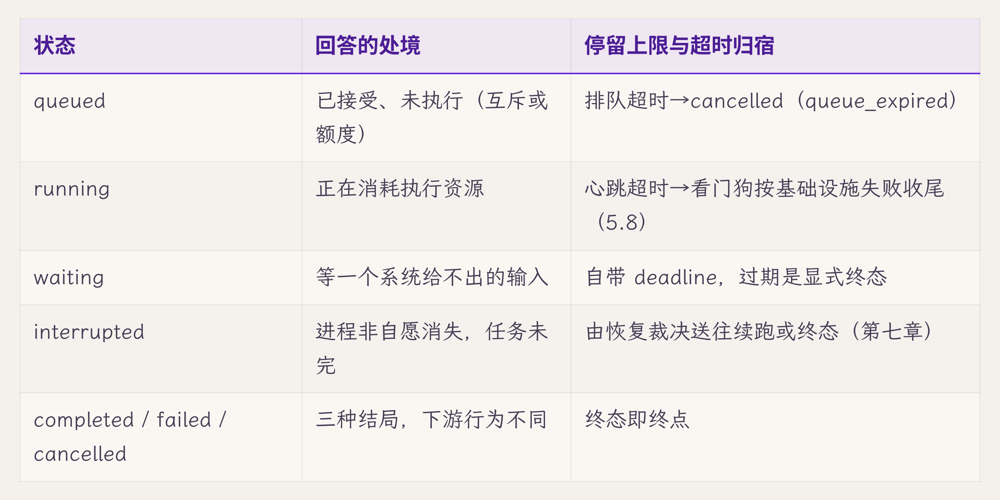
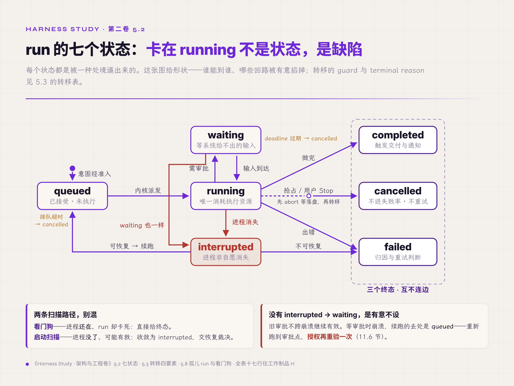
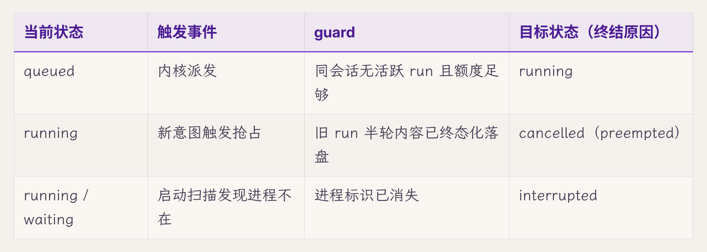
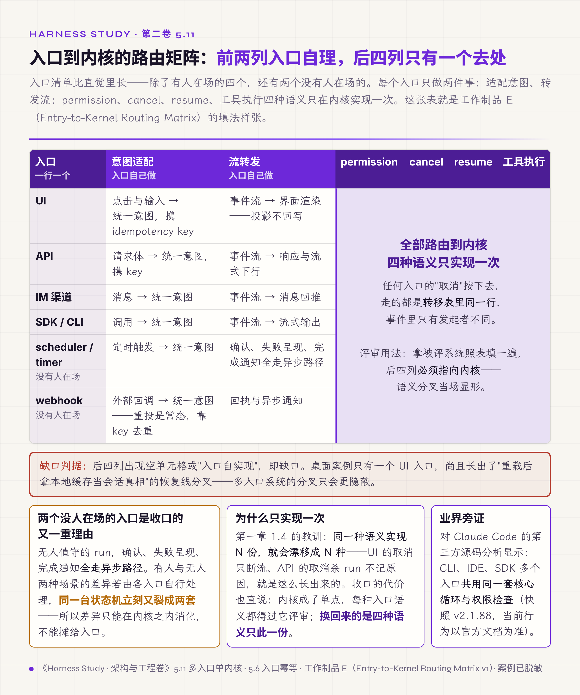

# 五、Run 生命周期状态机

> v1.0 · 2026-07-21 · 依据 SPEC.md §十二 章 spec（首个深潜章：七状态＋可执行转移表＋并发/幂等/orphan 收敛＋Routing Matrix v1）· 四维评审四路已落实 · **用户过审（2026-07-23，"进 §六"；章题维持现名，cyber 副题建议未采纳）**
> （本版本注与"审稿日志""引用来源"两节同属编辑工作区，出版前整体删除。）

第三章解剖过桌面案例项目的一次"数据丢失"事故：用户点了回答里的链接，整个应用被带走；回来发现少了一轮对话，重问一次之后，第一次的提问与半截回答从此永久消失。那一章把事故整理成一张十帧时间线，逐帧追踪消息在哪个载体上；其中有两帧至今没有解决。帧 7，用户重问触发抢占，旧 run 被 abort：这个决策改写了旧 run 的结局，系统里却没有任何事件记录它发生过。帧 8，旧 run 收尾时发现自己已不是"当前 run"，于是跳过持久化，用户的半轮成果就在这条没人知道的分支里悄悄消失。两次状态转移都真实发生了，却没有任何状态机约束它们。第四章把这两个遗留问题记到了 run manager 的组件卡上：卡面写着准入、互斥、抢占三类决策都要有事件，但有哪些状态、哪些转移、谁有权触发、终结原因怎么记，蓝图只标了位置。本章给出这张转移表。

逐个组件深入的章节从 run 开始，理由在第四章 4.5 的动线里：正常九步中第一个落盘点就是 run 记录。run 是 harness 中最重要的状态机。一次执行的其余状态，包括消息、调用记录、副作用记录，全部挂在 run 之下；run 的状态错了，其余一切都失去参照。本章的核心要求是：任何 run 在任何时刻都必须处于一个可解释的状态，**"卡在 running"是缺陷，而不是一种状态**。本章给出三样东西：七状态定义表、可执行的转移表（全表收录在工作制品 H）、入口到内核的路由矩阵（Routing Matrix）。

## 5.1 没有状态机的 run 长什么样

先看不设防的系统怎么管理 run 的状态，多数系统都从这里起步。`runs` 表加一个 `status` 字符串字段，哪段逻辑需要改状态，就地一句 UPDATE：收尾的地方写 `completed`，catch 里写 `failed`，抢占的地方写点别的，或者什么都不写。开发期一切正常，因为正常路径只有一条，每处 UPDATE 各管各的，互不干扰。

失效的样子第三章已经展示过：帧 7 的抢占改写了旧 run 的结局，没有事件；帧 8 的收尾分支跳过持久化，没有痕迹；同类症状里还有一批 run 永远停在 running，进程早死了，没有人回来改这个字段。三种表现背后是同一个根因：每一处 UPDATE 都自带一个隐式状态机，它默认"此刻状态是 X，改成 Y 是合法的"，而这些散落各处的默认互不知情，谁也不检查谁。第一章 1.4 在语义层见过同样的问题：同一种语义实现 N 份，就会漂移成 N 种。这里是它在转移层的版本：同一台状态机被 N 处代码各自实现，run 的生命周期就漂移成 N 条互相冲突的路径。

设计上只要两步。第一步，把状态集合显式枚举出来：run 允许处于哪几种状态，一个不多，一个不少。第二步，把全部转移收进唯一一张表：什么事件、在什么前提下、能把 run 从哪个状态送到哪个状态。前者是 5.2 的内容，后者是 5.3 的内容。状态机是计算机科学里最老的形式化工具之一，本章只是把它用到 run 上，并按第一章坐标系的要求让它可检验。

## 5.2 七个状态，每个都是被处境逼出来的

状态集合不能拍脑袋定。每个状态存在的理由，是有一类处境必须与其他处境区分开；区分不开，就有一类 run 要么被误杀，要么被谎报。逐个处境问过去，恰好七个。

一个意图通过了准入，但还不能立刻执行：同会话已有 run 在执行，或并发额度满了。这类 run 需要一个"已接受、未执行"的状态，即 **queued**。没有它，准入的裁决结果无处存放，内核只剩两个坏选项：当场拒绝（重试成本转嫁给用户），或当场硬跑（互斥失守）。

正在执行的 run 处于 **running**，这是唯一消耗模型与工具资源的状态。

run 停下来等一个系统给不出的输入：审批、追问的回答。这类处境要与 running 分开，记为 **waiting**，理由有两条。资源上，等人的 run 不该占模型并发额度。策略上，执行超时的标准不能拿来衡量等待：按 running 的超时杀掉一个等审批的 run，等于替用户拒绝了审批。桌面案例的摸底里有这条边界的反面实证：确认挂起没有超时，又叠加了全局单 run 锁，一次没人理的确认把整个系统锁死【经验】。waiting 必须携带自己的 deadline，超时后有明确的去向。

进程死了（kill -9、断电、崩溃），run 没有做完，也没有人取消它。这类处境需要一个如实的名字：**interrupted**。没有它，恢复扫描只能在两个错误标记里挑一个：标成 failed，用户以为任务本身出了错；留在 running，就是本章开头说的那种缺陷。第三章修复验收里实测的"[已中断]"标记，就是这个状态在界面上的呈现。

最后是三个终态，分开的理由是下游行为不同。**completed** 触发交付与通知；**failed** 进入归因与重试判断；**cancelled** 表示"不必再跑"，来自用户意志或时限策略的收尾，不计入失败率，不触发重试。三者若合并成一个"ended"，下游每个消费者都得自己推断这个 run 究竟是怎么结束的，推断的标准必然漂移。

状态数的代价也要说清：每多一个状态，转移表就多一组要维护的行，恢复扫描也多一类裁决。所以过渡性语义能由现有状态加事件标记、再配合转移的 guard 承载的，不单列状态；5.12 的业界对照里有一个具体例子。

最后一条硬规则：终态之间不许互转。把 completed 的 run 改成 failed 等于改写历史，这是第一章 1.4 只追加原则在转移层的版本。判错了怎么办？答案与事件流一致：追加一条更正记录指向原状态，历史本身不动。

*图 5.2 · run 的七个状态：卡在 running 不是状态，是缺陷*

## 5.3 转移表：event、guard 与唯一路径

七个状态定下来了，接下来管转移。一条转移由四个要素定义：触发**事件**（谁、以什么动作）、**guard**（什么前提必须先成立）、**目标状态**，以及进入终态时的**终结原因（terminal reason）**。全部合法转移收进一张表，每条一行。下面节选三行看格式，全表十七行收录在工作制品 H：

这张表要配一条执行规则，才称得上"可执行"：代码里修改 `run.status` 的路径只允许有一条，即内核的 transition 函数。它查表、验 guard、写状态，并写一条 `run.*` 事件（非终态转移写 `run.state_changed`，进入终态写 `run.finalized`），payload 携带触发事件、guard 结论和发起者。表外的转移直接拒绝，并写一条 `error.raised`。这是状态层单写者原则在转移层的再次应用：状态层管"谁能写这张表"，转移表管"写进去的变化是否合法"。第四章组件卡上"三类决策要有事件"的承诺，由这条规则整体落实。抢占为什么没有事件？因为在帧 7 那套系统里，抢占根本没走任何统一路径，各处 if 分支各自处理，想写事件都不知道该写在哪里。路径唯一了，事件才有唯一的写入位置。

这张表的结构读者其实见过。第二章的契约六要素（owner、trigger、guard、action、outcome、evidence）可以逐项对上：owner 是内核，trigger 与 guard 同名，action 是转移本身，outcome 是目标状态，evidence 是随转移写入的那条 `run.*` 事件。转移表就是转移契约的批量登记形式：一行一条契约，整张表就是这台状态机的全部契约。

## 5.4 终结原因：四类结局分开记录

终结原因单独成节，因为它最容易被偷懒成一个字段值。"全标 failed"会让三方受害：排障者分不清是任务错了还是网络断了；重试逻辑分不清该不该重试（模型超时值得再试，策略拒绝再试是浪费，反复触发还可能是攻击信号）；产品报表把用户取消算进失败率，数据从源头就脏了。根因是四类结局的下游动作不同，却被压进了同一个符号。

所以终结原因至少分四类记录：**业务失败**（任务本身没做成）、**基础设施失败**（模型 API、磁盘、网络）、**用户取消**、**策略拒绝**（权限、预算、政策拦截）。四类是分类框架，具体值可以更细，但每个值都要标明归属：

- 用户按下 Stop，归用户取消。
- preempted 按新意图的发起者归类，发起者记在转移事件里：用户重问、用户从另一个入口发起新意图而触发的抢占，归用户取消；scheduler、webhook 这类无人值守入口触发的抢占，是会话策略替系统做出的让路决定，归策略拒绝。
- queue_expired 与 hitl_expired 是时限耗尽，时限由系统策略决定，归策略拒绝，终态为 cancelled：被拦下的是继续等待，与 run 出错分开。
- unrecoverable 归基础设施失败。

全表见工作制品 H，terminal_reason 列逐值标明类别。分类的代价是每条终态转移要多回答一道归类题；这道题在事故复盘时终归要回答，区别只是事前答还是事后补。第三章对那条被抢占的旧 run（十帧表里的 R1）有一句追问："R1 从 running 到消失，没有一行记录解释它。"缺的正是这一列。

## 5.5 同会话第二个意图：互斥与抢占

转移表管单个 run 的一生；接下来是并发，先从最日常的处境开始：同一个会话，第二个意图到了。双击发送、双标签页、scheduler 撞上手动触发、webhook 重投，这些来源都不稀奇。

内核收到它，可选的裁决恰好四种：

- **reject**：拒绝并告知原因。拒绝必须对用户可见，静默丢弃意图等于把第三章的"假丢"搬到了入口。
- **enqueue**：排队等当前 run 结束。队列必须持久化，内存队列一刷新就丢；排进去的意图与消息享受同等的落盘待遇。
- **抢占（preempt）**：新意图更要紧，旧 run 让路。这是聊天场景的常见默认。
- **rollback**：把会话回退到某个检查点再接受新意图。这是重型选项，依赖第七章的 checkpoint 语义，此处只登记它的存在。

四选一是会话级策略，但裁决点只有一个：内核准入处，裁决本身要写事件。

抢占要展开讲，因为第三章那场事故的最后一环就出在这里。先复述缺口三的机制：旧 run 被 abort 后立即失去"当前 run"身份，收尾时 isCurrentRun 判为假，于是跳过持久化。抢占语义单看是正确的，但它对持久化有什么副作用，没有人问过。修复后，抢占必须先收尾，分两步完成：

1. **先发 abort，等待旧 run 落盘。** 内核向旧 run 发出 abort，等它把半轮内容标成终态并落盘。这段时间旧 run 仍记为 running，内核在事件里标记 cancel_requested，表示取消已经发出、收尾尚未完成；新 run 此时不能接手会话。
2. **落盘完成后再执行转移。** 内核执行 running→cancelled（preempted）这条转移，guard 检查"旧 run 半轮已落盘"；转移完成后，新 run 才接手会话。

guard 只检查前提是否成立，本身不包含等待，等待发生在第一步。半轮内容的去处已经不成问题：第三章三种修法中的契约修复（增量持久化）已经让运行中的每一轮随时在库，抢占要做的只是把 pending 行标上终态。帧 7 缺的决策事件与帧 8 丢掉的持久化，由这两步一起补上：abort 与转移各有事件，半轮内容在转移之前已经落盘。

## 5.6 入口幂等：第二个请求未必是第二个意图

抢占之前还有一道更便宜的检查：这个"第二个意图"，真的是第二个吗？客户端超时后重发同一个创建请求（第一章 1.1 里那个重试默认值），在网络层面理所当然；不设防的内核把每次请求都当成新意图，一次点击就产生两个 run。

解法是入口幂等：创建请求携带**幂等键（idempotency key）**，内核按 key 去重，命中时返回已有 run 的引用，接上同一条流。重试是网络的正常行为，回应它的应当是同一个 run。key 有三条细则：

1. **作用域**：绑定会话加客户端提交序列（或客户端生成的 UUID），跨会话不去重。
2. **保留期**：与 run 同寿，或取滚动窗口；过期后同一个 key 视为新意图。
3. **冲突应答**：同 key 不同 payload 时返回显式冲突。这是客户端 bug 的信号，静默吞掉等于替它藏错。

key 的生成方式不能照抄工作制品 B（Effect Ledger，副作用账本）。B 里那个 key 由运行时生成、供下游去重，依据是 run_id 加 step 与 effect 序号；入口这个 key 在 run 还不存在时就得生成（转移表的准入行把这道去重 guard 放在 run 创建之前），所以只能在客户端一侧生成：key 与待发请求一起持久化，刷新或重启后重发的仍是同一个 key。在内存里生成、一刷新就换一个，等于没有防护。服务端也不指望客户端自觉，去重靠 key 上的唯一约束。入口幂等把重复的请求挡在门外，5.5 的四种裁决从此只需面对真正的第二个意图。

## 5.7 并发原语：单机一种，多实例三种

互斥的语义定了，还剩实现它的原语。这一节把选择条件说清楚，后面的章节不再回头讲选型。

单机单写者阶段，答案只有一个：进程内串行化。桌面案例的教训说明了它的必要：tryStart 在检查与使用之间留了缝隙，双标签页的两个抢占同时通过 recheck，后到者静默 abort 先到者。第二章 2.7 登记过的 TOCTOU（检查时刻与使用时刻不一致）就出自这里。修法是把同会话的准入按 sessionId 排进 promise 链，天然串行，缝隙不再存在。代价也要记下：串行化让 abort 晚一个微任务发生，两个既有测试的隐式时序假设当场失效【经验】。并发原语的变更是接口变更，影响范围要 grep 全部调用方。

多实例阶段的原语有三种，按代价递增：

- **乐观并发（optimistic concurrency）**：run 行携带 version，更新走 compare-and-swap（CAS，写时校验版本），冲突者重读后重试。适合冲突少的短临界区。
- **锁或租约（lock / lease）**：带 TTL（存活时限）的租约，持有者靠心跳续租，适合跨进程的长临界区。"谁是写者"从进程内的事实变成协议保证，第四章状态层组件卡的取舍栏预告过这条迁移线。
- **围栏令牌（fencing token）**：租约每次授予都携带一个单调递增的编号，状态层拒绝旧编号的写入。它防的是租约自己防不了的一种失效：进程拿着租约陷入长停顿（GC、换页、网络分区），租约过期、别人接手，它苏醒后仍以为自己是持有者，带着旧授权继续写。这是一个不知道自己已经出局的写者。这一机制的经典阐述见 Kleppmann 2016 年的博文 How to do distributed locking 与《数据密集型应用系统设计》（DDIA）第 8 章；更早的 Chubby 论文（2006）把同类编号称为 sequencer【规范/官方文档】。

三种原语的适用条件：单机单写者一种都不需要，第四章部署一页说的"多实例再谈"就是指这里。迁移信号出现后，按临界区的性质选择：短小、冲突少的临界区用乐观并发；跨进程、长时间持有的临界区用租约，并同时配上 fencing token，fencing 不单独使用。

## 5.8 孤儿 run：谁替消失的进程收场

并发处理的是仍在运行的进程互相争抢；这一节处理已经消失的进程。kill -9、断电、OOM killer（内存耗尽时操作系统的强杀机制），进程连"我要退出"都来不及说。库里留着 status=running 的行，进程已经不在，没有任何代码路径会回来修改它。这就是孤儿 run（orphan run），本章开头说的那种缺陷大多出在这里。

处置的基础是一条老思路：crash-only【评审，Candea & Fox，HotOS IX 2003】。如果系统只有"崩溃"一种停止方式、"恢复"一种启动方式，这条唯一的路径会被每一次启动反复检验。优雅关闭与崩溃恢复两条路并存时，恢复代码很少被触发，也难以模拟，因而不可靠，真崩溃时更容易出问题。前提是重要状态全部外置到崩溃安全（crash-safe）的存储，本卷前四章已经确立了这个前提。落到 run 上，恢复方案只有一条：**启动扫描**。进程启动后的第一件事，是扫出全部 running 与 waiting 的行，一律收敛为 interrupted，转移表里这条转移没有分支；再由第七章的 resume 判据逐行裁决：可续跑的送回 queued，不可恢复的以 failed（unrecoverable）结束。每一次裁决都写事件。这条逻辑天然覆盖崩溃、强杀、断电、升级重启，一条路径管全部退出方式。桌面案例修复后的验收实测过它：任务运行中退出应用，重启后那一轮带着"[已中断]"标记完整可见【经验】。

waiting 的 run 也走这条路，而且不回到 waiting。等审批时崩溃，run 收敛为 interrupted，续跑的去处是 queued：重新跑到审批点，再次挂起。转移表里没有 interrupted→waiting 这条回路，这是有意不设的：旧审批不跨崩溃继续有效，恢复后授权要重新验证一次（第十一章 11.6）。代价是从续跑点到审批点这一段要再走一遍；换来的是没有一份旧授权能悄悄跨过重启继续生效。

启动扫描有个盲区：它只在启动时运行。进程活得好好的，某个 run 却卡死了（工具僵住、流断在半空、模型调用永不返回），没有崩溃，就没有启动扫描。补这个盲区的是**看门狗（watchdog）**，这里它只负责解除阻塞，不负责重启进程：周期扫描 running 的行，进程还在、run 却超过 deadline 没有任何活跃事件的（step 与 effect 事件的最近时刻就是存活信号，heartbeat 的完整定义见第七章 7.6），判为卡死，以 failed（infra_failure）结束。deadline 要大于单个步骤的最长合法耗时，即模型单步超时与工具调用超时中较大的那个，让操作级超时先触发并留下事件，看门狗只兜住超时机制本身失灵的情况。服务端静默思考的模型要单独放宽：配套项目的中继曾把空闲阈值定在 90 秒，一台设备的 15 次失败全部是健康的长思考被误判成断流【经验】。

看门狗与启动扫描是转移表里两条不同的行。看门狗处理进程还在、run 卡死的情况，直接给终态；启动扫描处理进程没了、run 可能还有救的情况，收敛为 interrupted，交给恢复裁决。看门狗不走 interrupted→queued 的续跑路径，是因为卡住的执行仍在同一个进程里：僵住的工具调用或模型调用随时可能返回并接着写入，这时再续跑一次，同一个 run 就会有两个执行者。直接进入终态后，迟到的那个执行者再想推进 run，走的就是表外转移，会被内核拒绝；要不要重试，交给 failed 之后的归因与重试判断，infra_failure 属于基础设施失败，通常值得再试。周期扫描有固定开销，换来的是覆盖启动扫描照不到的盲区。第一章 1.6 的破坏实验留下过一句"超时该标 failed，交给 run manager 的看门狗"，这里给出了具体做法：判定 run 死活的职责在内核，界面不能猜，也不该由它来猜。

还剩一个双重认领问题：两个进程同时扫到同一个孤儿。双实例部署，或者旧进程还没完全退出、新进程已经起来，两边同时认领、同时 resume，历史就被写成两份。单机的解法在状态机之外：单实例锁（端口、pidfile），第二个进程起不来。多实例的解法就是 5.7 准备好的原语：认领时取租约，写入带 fencing token，慢的那个被状态层拒绝。谁赢都行，但赢的只能有一个。

## 5.9 进程壳层：状态机的地基

启动扫描有一个没写出来的前提：进程死了，得有人把它拉起来。状态机管"拉起来之后知道干什么"，壳层管"死了有人拉起来"。两层缺一层，另一层的承诺都会落空。

壳层的做法是把 supervision（进程监管与自动重启体系）简化到单机【规范/官方文档，Erlang/OTP Supervisor】。主体是健康检查加退避重启；关键在重启强度上限：时间窗内重启次数超过限值，就停止重启，把"救不活"作为显式状态呈现给人，附上诊断信息与重试入口。无上限的自动重启比不重启更危险：救不活的进程被无限拉起，每次启动扫描都白跑一遍，故障被重启循环遮住，没人知道系统已经出了问题。上限的代价是把一部分本可自愈的偶发故障提前交给人处理，换来的是重启循环不再遮蔽真正的故障。子进程同理：工具子进程的生命周期绑定父进程（进程组、Windows 的作业对象（Job Object）），父进程一退出，子进程随之终止，孤儿清理只是兜底手段。

退出路径要给收尾留出时间。桌面案例的托盘退出曾经先 POST shutdown、sleep 两秒、再强杀进程，全程不检查是否有 run 在跑【经验】。两秒够不够收尾全凭运气，运气差的那次就是又一个帧 8。正确的顺序与状态机一致：停止接受新意图，活跃 run 收尾或显式进入终态，然后退出。二次启动的杂事（端口被占、pidfile 残留）也要有去处，处理不了就走"救不活"的呈现路径。壳层的完整故障谱（窗口管理、更新、诊断页交互）是工程细节，本章只规定它与状态机的接口：每一种退出方式，最终都必须汇入启动扫描这一条恢复路径。这就是 crash-only 的具体做法。

## 5.10 状态机要携带自己的版本

状态机自己也会变：加一个状态、改一条 guard、拆一个终结原因。变更上线时，库里还留着旧版本时代的 run（interrupted 的、waiting 的），等着被恢复。按哪一版语义恢复它们？不设防的答案是"总按最新版"，它会当场制造表外转移：旧 run 停在一个新表不认识的状态里，或者要走一条新表已经删掉的转移。

所以 run 行携带 **state_machine_version**。工作制品 A（State Registry）的 run 行为它预留了登记位，字段的正式收录随 State Registry 在第六章 6.0 交付；本章规定它的语义：恢复扫描先看版本，同版本按表走；跨版本先跑显式迁移，把旧 run 逐个映射到新表的合法状态，迁移本身写事件。规则只有一句：转移表的变更就是 schema 变更，按同样的方式做迁移。这条规则现在看着像过度设计，但第七章的 resume、第十章的 compaction 版本、第十一章的授权重验都要依赖它。

## 5.11 多入口，单执行内核

回到第一章 1.4 提出的那个决策（多个入口共用唯一的执行内核），把细则补齐。入口清单比直觉里长：UI、API、IM 渠道、SDK/CLI，再加两个没有人在场的：scheduler/timer 与 webhook。后两个是把语义收进内核的又一个理由：无人值守的 run，它的确认、失败呈现、完成通知全走异步路径；有人与无人两种场景的差异如果由各入口自行处理，同一台状态机立刻又裂成两套。

细则三条：

1. 入口只做两件事：把各自形态的输入适配成统一的意图（携带 idempotency key），把内核的事件流转发成各自形态的输出。
2. permission、cancel、resume、工具执行四种语义只在内核实现：任何入口的"取消"按钮按下去，走的都是转移表里同一行。
3. 入口不得持有 run 状态。这是"投影不回写"在入口上的对应要求（投影指由持久状态派生的只读视图，定义见第六章 6.3），第一章 1.6 已经给出判定标准。

实现层面的旁证：对 Claude Code 的第三方源码分析显示，CLI、IDE、SDK 多个入口共用同一套核心循环与权限检查【预印，arXiv:2604.14228 v2，快照 Claude Code v2.1.88，当前行为以官方文档为准】。

交付物是**入口到内核路由矩阵（Entry-to-Kernel Routing Matrix）**（工作制品 E 升为 v1）：每个入口一行，六列分别是意图适配、流转发、permission、cancel、resume、工具执行。后四列必须指向内核，出现空单元格或"入口自实现"即为缺口。评审时拿被评系统照表填一遍，语义分叉当场显现。桌面案例只有一个 UI 入口，尚且长出了"重载后拿本地缓存当会话真相"的恢复线分叉（第三章缺口二的一环），多入口系统的分叉只会更隐蔽。

*图 5.11 · 入口到内核的路由矩阵：前两列入口自理，后四列全部指向内核*

## 5.12 业界对照：一台公开状态机的一生

自研之外，业界有一个把 run 状态机做成 API 层显式契约的著名实现，值得整段细看，连同它的退役。OpenAI 的 Assistants API（2023 年推出）把 run 的状态集合直接写进产品契约：queued、in_progress、requires_action、cancelling、cancelled、failed、completed、incomplete、expired 九个状态公开可查【规范/官方文档】。对照本章：requires_action 就是 waiting；expired 是平台级看门狗的产品形态，没人管的挂起 run 由平台按超时收尾，与 5.2 "waiting 自带 deadline"是同一条原则；run 活跃期间锁定整个 thread 做互斥，在 5.7 的三种原语里，它选了锁。至于它的 cancelling 过渡态，本章七个状态里没有对应物。本章把取消（包括抢占）拆成两步（5.5）：先发 abort 并等待半轮落盘，这段时间 run 仍记为 running，事件里标记 cancel_requested；落盘完成后才执行 running→cancelled 转移，guard 检查"半轮已落盘"。Assistants 用显式过渡态承载的"收尾中"语义，在这里由 running 加 cancel_requested 事件标记承载，再由那条 guard 把关。5.2 说的"过渡性语义不单列状态"，这就是具体例子。

失效点有两条，都不在状态集合本身。第一条：社区故障报告里出现过 run 长时间停在 queued、in_progress，或 requires_action 反复循环【经验，社区故障归纳】。服务端状态机再完备，客户端不设超时兜底，照样会卡死。状态机契约约束的是两端：服务端保证转移合法，客户端保证挂起有界；只有一端做到，用户看到的还是那个转不完的圈。第二条更根本：这套 API 已被 OpenAI 宣布弃用（deprecated），计划 2026-08-26 关闭【规范/官方文档】，Run 概念由 Responses 取代。一台运行了三年的公开状态机整体退役，每个依赖它的客户端都要把自己的轮询、重试、恢复逻辑迁到新语义上。这是 5.10 版本问题在产品层面的放大：状态机是契约，契约会退役，而 run 数据比状态机版本活得久。选型结论与第三章 3.9、第四章 4.6 一致：状态机自研成本不高，对语义的自主控制却很重要；选托管方案，就要连它的退役时间表一起接受。

## 破坏实验：四路并发与分叉

本章的破坏对象是转移表与单内核决策本身。四个场景，各按四步测量协议执行：

1. **双入口同时触发同一会话**。破坏动作：UI 与 API 各提交一条意图，间隔压到毫秒级。观测点：events 里两条意图各自的裁决事件；runs 表的活跃行数。判定：恰有一个 run 进入 running，另一个落 reject/enqueue/interrupt 三者之一的显式事件，无双写。复跑 N=3。
2. **双进程同时 resume 同一孤儿**。破坏动作：制造一个 interrupted 的 run，同时启动两个进程实例。观测点：认领事件与写入路径。判定：恰一个实例认领成功；单机形态下第二个实例应因实例锁拒绝启动，多实例形态下慢者被 fencing token 拒写且有事件。复跑 N=3。
3. **同一创建请求重发两次**。破坏动作：携带同一 idempotency key 的创建请求连发两次。观测点：runs 表计数；两次应答的 run 引用。判定：库里恰一个 run，两次应答指向同一引用；同 key 不同 payload 时返回显式冲突。复跑 N=3。
4. **入口语义分叉 contract test**。破坏动作：从每个入口对同一 run 发起 cancel。观测点：随行 `run.*` 转移事件（`run.state_changed`／`run.finalized`）的发起者与转移行。判定：全部入口路由到转移表同一行，事件里只有发起者不同；任何入口出现独立的取消路径即失败。复跑覆盖全部入口。

实证状态分层如下【经验】：桌面案例修复后，场景 1 的单入口版（抢占先收尾）有端到端集成测试，tryStart 串行化有回归测试，"[已中断]"收敛有验收实测。四个场景的完整矩阵要到第十四章的标准故障包（各章破坏实验预置故障用例（fixture）的汇编）里实现，在那之前按思想实验执行，这里先给出判定标准。

## L 级自检

按第一章的成熟度尺（L1 能跑、L2 能看，全表见第一章 1.3）。本章机制的 L2 底线与第四章组件卡的预期一致：转移表存在，每次转移都写 `run.*` 事件，准入、互斥、抢占三类裁决都有事件，三项齐备才算 L2。看门狗与四类终结原因为 L3（能评）做准备，失败归因从此有了机器可读的维度。桌面案例的现状沿用第三章的结论：增量持久化让真相侧达到 L2，抢占决策事件仍然缺失，L2 只达到一部分，本章的转移表就是补齐这部分的工单。参考实现要到第十四章才成形，在那之前转移表的"可执行"只是规格，不当作已实现。对应到第一章的坐标系：本章落实了转移契约的可观测（转移即事件）与稳定（破坏实验 N=3 复跑）两项；可控性依托内核的唯一路径，闭环的消融数据留给第十四章的参考实现。

## 交付物

1. **Run 状态转移表 v1**（工作制品 H 全表十七行）：第十四章参考实现按表执行，第十五章评审逐行对照；
2. **并发裁决与原语选择**（5.5 四种裁决、5.7 三种原语与适用条件）：多实例迁移时的判断依据；
3. **孤儿 run 收敛测试标准**（破坏实验场景 2）：启动扫描与双 resume 的判定基线；
4. **Entry-to-Kernel Routing Matrix v1**（工作制品 E）：评审入口语义分叉的标尺。

只想拿评审工具的读者，可以只取第 1、4 项，不必通读全章；第四章 4.8 的索引已标出它们的位置。

## 立即可做的一个动作（五分钟）

builder 版本：grep 自己项目里 run 状态的全部赋值点（`status =`、`UPDATE runs SET status`，名字不重要），数出来的数字就是隐式状态机的份数。然后对着 5.3 的表逐个问：这个赋值点对应表里哪一行？触发事件是什么，guard 在哪里验？对不上的赋值点，就是自己系统里还没爆发的帧 7。

assessor 版本：一个问题加一条 SQL。问被评团队：一个 running 的 run 能以几种方式终结，每种的 terminal reason 叫什么？答案数对不上转移表行数的，按隐式状态机处理。再查（表名列名按被评系统的 schema 替换，语义是"活跃态但久未更新的 run"）：`SELECT count(*) FROM runs WHERE status='running' AND updated_at < 24 小时前`。这个数字大于零，就说明这套系统里确实存在"卡在 running"的缺陷。

## 下一章

转移表通篇在重复一件事：写事件、有记录、可解释。可是这些事件记在哪张表里，谁有权写，状态行与事件序列不一致时以谁为准，半轮消息又挂在哪个载体上？"记下来"三个字背后的归属问题，本章都没有展开。状态、事件与持久化的完整答案在第六章。

## 审稿日志

> （编辑工作区：本节与"引用来源"节出版前整体删除。）

| 轮 | 检查 | 命中与修改 |
|---|---|---|
| 版本史 | — | v1.0（2026-07-21）：依 SPEC §十二 spec 首写。大纲条目映射：5.1→本章 5.2；5.2→5.3；5.3→5.4；5.4→5.5；5.5→5.6；5.6→5.5（抢占并入互斥节）；5.7-5.11 与大纲同号；业界对照（Assistants 状态机与退役时间线）→5.12。外部引用锚点（工作制品 A"§5.8"、G 行与 §四"§五 5.11"）经节号对齐校核 |
| 章级验收自测 | SPEC §十二 清单 | 正文表格 2＋配图占位 1（七状态转移图）；全表住 90-artifacts H；新概念实计约 11-12（七状态组、terminal reason 四类、四裁决、idempotency key 细则、CAS/lease/fencing 拆计三项、启动扫描、看门狗、state_machine_version、Routing Matrix——超 ≤10 预警线，SPEC §七.1 照记不拦稿）；前向引用约 10 处/6 章（§六/§七/§十/§十一/§十四/§十五——超 ≤8 预警线，照记，均为指明主场章的地图性引用）；一手证据 6 处（挂起锁死／TOCTOU 串行化与时序涟漪／[已中断] 验收／托盘退出两秒强杀／localStorage 分叉回指／抢占先收尾集成测试）；外部权威 ≥4（crash-only／Erlang OTP／Assistants 状态机与退役／Kleppmann／Dive into CC）；业界对照 1 家带两条失效点 ✓；破坏实验四场景四步协议＋实证分层 ✓；L 级自检（含"半格补格工单"回接 §三＋四问落位句）✓；双读者动作 ✓ |
| R1 grep 红线 | 全套（四维评审落实后复跑） | "你"系 0；元叙述 0；模糊词 0；显式禁形 0；广义对比 1 处（主张句"不是状态，是缺陷"——大纲既定传播性短句，motivated，≤2 内）；标题超长 0（5.3 节名系英文术语撑长，中文 8 字）；整句加粗清零（6 处收窄至标签词或去粗）；语域复扫补杀 5.1"互相打架"→"互相冲突"（style 漏标同款）；体量终版 182 行 |
| 四维评审 | **四路已跑齐并全部落实（2026-07-21）：technical A-／style A-／cybernetic A-（方法论比例实测约 60%）／business B+，零 P0 遗留** | technical/cyber 共同 P1：看门狗归宿正文与 H 表分叉→H 拆两行（watchdog→failed(infra_failure) 独立行；启动扫描限定"进程已消失"→interrupted），5.8 补两行之辨、5.3 节选 guard 同步；cyber P1：state_machine_version 误归"§四 埋卡伏笔"→改工作制品 A（State Registry，§六 6.0 收录）。technical P2：run.state_changed/run.finalized 分开表述（5.3/L 级/破坏实验场景 4 三处）、cancelling 过渡态取舍句补入 5.12（与 5.2 状态数代价句呼应）、terminal_reason 逐值挂类（时限耗尽挂策略拒绝、终态走 cancelled；cancelled 定义随之扩为"用户意志或时限策略收尾"）、Assistants 宣布月份收口待回核、心跳=step/effect 最近事件（§七 7.6）、fencing token 引用升 DDIA【规范/官方文档】。style P1：整句加粗 6 处全部收窄/去粗；语域 2 处（"互相打架/处理死了的"→"互相争抢/已经消失的"、"最后一击就死在"→"收尾一环正落在"）；P2："按到 run 头上"→"落到 run 上"、"父亡子随"化开、fencing 巨句拆分、5.6 补盘点句、"两个谎言可选"孪生错开。cyber P2：七状态/终结原因/看门狗/supervision 各补一句代价、L 级补四问落位句、自测计数照实（超线照记）、90-artifacts v1.2 历史行加 v5.5 读法注。business P2：社区故障断言降语气＋检索范围指针、assessor SQL 垫 schema 句、补状态机图占位、交付物补近道面包屑 |
| 悬案（待用户裁决） | business 评审 | ①暴露面——**已裁决关闭（2026-07-22，SPEC §七.6）**：名字脱敏＋功能作用照实即可，不设台账；"确认挂起锁死"现文保留，§三 threadKey/毫秒指纹悬案一并关闭；②§十五 评审工具清单是否扩列 Routing Matrix（五件→六件，§十五 spec 时裁决）；③章题是否加方法副题（cyber 建议"可解释状态是恢复与并发的共同前提"，非强制，§四 纯 artifact 题有先例） |
| 用户初审增量 | 2026-07-22 用户反馈：开头"§三 的十帧表留下两帧欠条"式跨章引用要附背景帮读者回忆；其余按 STAR 回扫 | 开场重写：先两句复述 §三 事故（点链接被带走→重问→永久消失）与十帧表身份，帧 7/帧 8 各配"决策/分支的具体内容"再谈欠条；5.4 "R1"补"（十帧表里的 R1，被抢占的旧 run）"；5.5 "档三"改"三档修复里的契约档（增量持久化）"；5.11 "localStorage 恢复线"改功能描述"重载后拿本地缓存当会话真相"。全章其余跨章回指逐条扫过判定自足：缺口三（5.5 自带机制复述）、§一 1.1 重试默认值/1.4 语义漂移/1.6 看门狗（均内联引原句）、§二 2.7 TOCTOU（5.7 先述机制再回指）、§二 六要素（逐格列名）、§四 卡面/动线/部署信号（内容随引）——不再加垫 |
| 终稿回核清单 | — | Assistants 九状态逐字（cancelling/incomplete/expired 三个易错名）；deprecated 宣布时点；fencing token DDIA 页码与 2016 文链接；社区故障检索范围与代表性帖子补录编辑工作区 |
| 终稿回核清单 | 2026-07-27 正文【】标注清理（用户指令） | ①DDIA 第 8 章与 How to do distributed locking 页码终稿前回核（多实例装备段）；②OpenAI Assistants API 状态机与退役细节终稿前回核（业界对照）；③社区故障归纳的检索范围与代表性帖子终稿前补录编辑工作区（失效点段） |

## 引用来源

> （编辑工作区：本节出版前整体删除。）

- 【评审】Candea & Fox — Crash-Only Software（HotOS IX 2003）。唯一恢复路径论证（5.8）。
- 【规范/官方文档】Erlang/OTP Supervisor Behaviour——重启策略与 MaxR/MaxT 重启强度上限（5.9）；OpenAI Assistants API run 生命周期与 thread 锁语义、deprecation 时间线（2025-08 宣布、2026-08-26 计划关闭）（5.12，部分细节来自检索摘要与社区归纳，终稿前逐字回核官方文档）。
- 【预印】Dive into Claude Code — arXiv:2604.14228（v2，快照 Claude Code v2.1.88，第三方源码分析，当前行为以官方文档为准）。多入口共用核心循环（5.11）。
- 【规范/官方文档】fencing token——Kleppmann《Designing Data-Intensive Applications》第 8 章及 2016 年文章 How to do distributed locking，终稿前回核页码与链接（5.7）。
- 【经验】桌面案例项目 2026-07 摸底与复审：确认挂起无超时＋全局锁锁死（5.2）、tryStart TOCTOU 与 promise 链串行化及时序涟漪（5.7）、"[已中断]"验收实测（5.8）、托盘退出两秒强杀（5.9）、抢占先收尾集成测试（破坏实验）。快照指针见 §三 编辑工作区。
- 回指素材：§一 1.4（单执行内核决策、九步时序）、§一 1.6（看门狗欠条）、§二 2.7（TOCTOU 反例出身）、§三（帧 7/帧 8、缺口三、档三增量持久化、3.9 选型口径）、§四（run manager 卡、4.5 动线、4.7 部署信号）。
