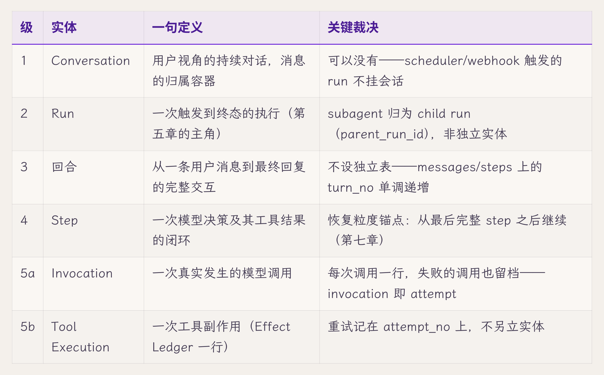
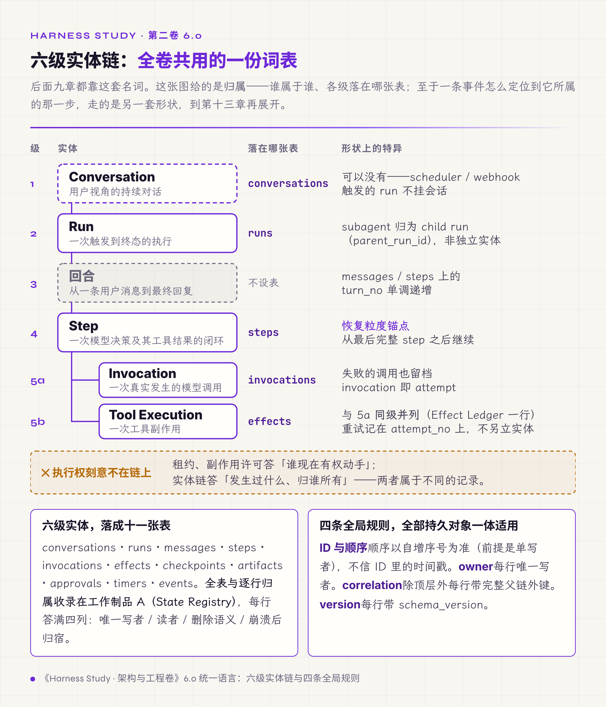
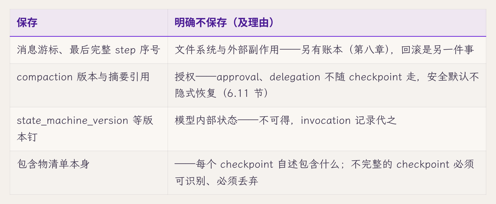
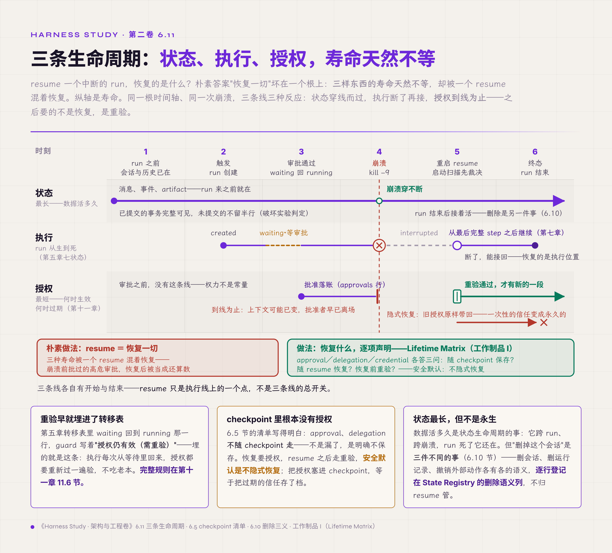

# 六、状态、事件与持久化

> v1.0 · 2026-07-23 · 依据 SPEC.md §十三 章 spec（统一语言冻结章：实体链＋四条全局规则＋SSOT/投影＋边界四件＋三生命周期＋Belief/World Model；章节引用文字化首个执行章）· 四维评审四路已落实 · **用户过审（2026-07-23，"继续"；Attempt 不设实体、lease 分层两项裁决随过审确认；章题维持原名；model-based harness 实名悬案留档待终稿）**
> （本版本注与"审稿日志""引用来源"两节同属编辑工作区，出版前整体删除。）

第五章给出了转移表，也留下四个没回答的问题：每次转移要写的事件，记在哪张表里？谁有权写它？状态行与事件序列不一致时，以谁为准？还有那条被抢占的半轮消息，究竟挂在哪个载体上？四个问题其实是同一个问题：状态的归属。

先把这个问题放回它最日常的形态。设想评审桌上有人问："进程重启之后，用户刚发的那条消息还在吗？"三个工程师给出三个答案。前端说在，界面状态里明明显示着；后端说在，run 的上下文里拿得到；数据库一侧说不在，落库点还没走到。三个人都没说错，错的是系统。第三章解剖的那次数据丢失事故，就是这场对话的事故版：一条消息从键盘到磁盘途经五个载体，前四个是易失的，"消息在吗"的答案取决于问的是哪个载体。病根在语言层面就已经埋下：每个人嘴里的"消息"指的是不同的东西，而系统从没规定过哪份算数、每样东西叫什么。

所以本章先补上全卷一直缺的一项基础工作：冻结统一语言，即六级实体链、十一张表、四条全局规则，然后回答"哪份算数"。本章的核心结论是：**context 是投影，不是真相**。投影（projection）一词借自事件溯源，在那里指由事件流确定性推导出的读模型；本书用它指从持久状态派生出的只读视图，可随时重建，不回写真相源。持久状态是唯一的真相源；context 是由它派生、为一次模型调用组装的有损只读视图，界面是给人看的另一种投影。投影可以丢、可以错、可以重建；真相必须唯一，必须保存到最后。本章给出四样东西：一条实体链、一份 State Registry v2、一份投影契约、一张三生命周期矩阵。

## 6.0 统一语言：六级实体链与四条全局规则

对话产品的直觉词汇只有两个："会话"和"消息"。这两个词撑不起一个运行时：第五章整章讲的 run 在这套词汇里没有位置，第八章要核对的工具执行更没有。运行时的实体链有六级，每一级都对应一类必须区分的东西：

第五级的两条裁决合起来是一项结构决定，来路要交代清楚。

**结论**：不设独立的 Attempt 实体。模型侧每次真实调用记一行 invocation，失败的调用也单独成行，序号与状态就是尝试的记录；工具侧由 Effect Ledger 的 attempt_no 承载，"尝试可多次、结果只记一次"在工作制品 B 里本来就是不变量。"失败输出不混入下一次尝试"这条执行约束，由 step 范围内的 context 组装来保证。

**理由**：这条约束来自本卷的桌面案例项目。该项目在后续一轮内部工程审计里，把统一状态链写成 Task→Run→Step→Attempt→Action，attempt 承载同一步的多次网络或模型尝试，并规定失败尝试的输出不得混入下一次尝试【经验，桌面案例项目内部审计，2026-07】。本卷完全接受这条约束，只是承载方式不同。独立的 Attempt 实体是多层共享重试预算的系统才需要的：那份审计所在的系统正是这种结构，中继层重试十一次、agent 层再重试三次，没有 attempt 实体就无法跨层核对；单机参考实现的重试层级少，负担不起这份登记成本。同一条约束，两种承载方式。

**推翻条件**：出现跨层共享重试预算（retry budget）的需求时，attempt 升为独立实体。

还有一样东西刻意不放在链上：执行权。

**结论**：第五章 5.7 节的租约、第八章将展开的副作用许可，都是授权对象。它们与实体链分开记录，不进 run 的七个状态，也不进 State Registry 的实体链。

**理由**：授权对象回答"谁现在有权动手"，实体链回答"发生过什么、归谁所有"，两者属于不同的记录。分层的依据是记录归属，持久与否只是实现属性：单机阶段租约驻留内存，重启即失效；多实例阶段租约变成协议保证，连同 fencing 编号的高水位（已发出的最大编号）一起写进授权记录的持久存储，但那仍是授权记录的内部事务。分层的代价是要同时追两条线：授权记录的生效、停止中、已收回，与 run 的七个状态，两者互不映射。

**推翻条件**：一旦需要对执行权的授予与收回做完整的历史审计，授权就不再只是授权记录的内部事务，届时在 Registry 另起一行登记。这条分层第八章会结合桌面案例项目的一次工程改造详细说明，fencing 高水位存在状态层的哪一处，也在那里交代。

六级实体对应十一张表：conversations、runs、messages、steps、invocations、effects、checkpoints、artifacts、approvals、timers、events，全表与逐行归属收录在工作制品 A（State Registry，状态注册表）。数目背后还有三条"不设表"的裁决：turn 不设表，由字段承载；compaction（上下文压缩）摘要暂作 messages 的特殊行，是否独立成表由第十章裁决；policy decision 并入 events，是否独立由第十一章裁决。表可以少，归属不能含糊：Registry 每行都要填满四列，即谁是唯一写者、谁在读、删除意味着什么、进程在写它的中途被杀之后它处于什么状态。

最后是四条全局规则，适用于全部持久对象：

1. **ID 与顺序**：每行带前缀 ID；顺序以数据库自增序号为准，不信 ID 里的时间戳。拿毫秒时间戳当序号而发生碰撞，第三章的复审里真实出过事故。自增序号等于提交顺序，前提是单写者：本卷的单机参考实现只有一个写入进程，这个前提成立。进入多写者阶段后，先拿到序号的事务可能后提交，序号顺序与提交顺序不再一致，按序号追读的一方可能漏读，需要另行处理，第三卷展开。
2. **owner**：每行有唯一写者组件，第一章的单写者原则落实到行级。
3. **correlation**：除顶层（conversation）外，每行携带完整的父链外键，允许为空的层级显式置空；event 行以全量冗余的关联链承载（工作制品 C，Event Schema）。一行数据能顺着链回溯到它的 run 与会话。本书用 correlation 统称这一组层级 ID，业界常说的关联标识（correlation ID）只是其中一个。
4. **version**：每行带 schema_version。第五章给状态机规定的版本规则是它的特例，这里推广到全局：读旧行先看版本，迁移显式做，并写事件。

State Registry v1 至此交付（工作制品 A），本章末尾随 6.12 节的信念工件（把 agent 对世界的理解保存成的版本化工件）升为 v2。这一节给出了全卷的名词表：从此"消息在吗"这类问题，先要问"哪一级、哪张表、哪个作用域（scope）"。开场那条被抢占的半轮消息也有了答案：它是 messages 表里的一行，由 run_id 加 turn_no 定位。它当初"消失"，只是因为它只存在于内存里的投影中，从未写入自己的载体（6.3 节）。

*图 6.0 · 六级实体链：全卷共用的一份词表*

## 6.1 真相的载体：事件表与状态行

名词定了，接下来看真相怎么存。只存当前状态的失效，第五章 5.1 节展示过：状态行就地更新，库里只有现在、没有来路，排障与恢复都无从下手；那里的解法是把散落的 UPDATE 收进转移表，每次转移都随之写一条事件。

本卷采用的做法是事件溯源（event sourcing）的常见形态，分三点：

- **事件表是权威账本**，回答"怎么来的"，从第一天起就是权威记录。
- **状态行是可重算的物化视图（materialized view）**，回答"现在是什么"。它是为了读取方便而预先算好、存下来的结果，随时可以由事件序列重算。
- **外部副作用不靠重放重建。** 工具副作用改变的是外部世界，重放事件重建不出磁盘上的文件；这部分由第八章的副作用记录与对账负责。Fowler 在同一篇文章里也专门讨论过外部更新（External Updates）的处理。

第五章的转移表是这套做法的第一个使用者。从第一天就建事件表，理由来自 Fowler 对事件溯源的论述：它的回报主要是审计日志和可暂停、可倒带的重放式排障；更重要的提醒是，这套结构极难事后补装到当初没按它设计的系统上，所以只要日后有合理可能用得着，就该现在建，不要留给以后重构【规范/官方文档，Fowler，Event Sourcing，When to Use It 节】。Fowler 在 Application State Storage 一节还说明，存下当前状态只是加速手段，权威记录选事件日志还是选当前状态，由建系统的人决定。本卷选事件日志，并承担事件 schema 版本化的成本（6.0 节第四条规则）。

这套做法需要一条事先规定的仲裁规则：状态行与事件序列不一致时，以事件序列重算的结果为准。工作制品 B 给 effect 规定过这条（不变量五），本章把它推广到全局：事件表是账本，状态行是由它算出来的结果；对不上时重算状态行，不改事件。这条仲裁只处理逻辑上的不一致；事件表自身的物理完整性是另一回事，由数据库文件层与备份保证，下一段交代。

事务边界只有一条规则：一个逻辑操作一个事务。run 记录与 run.created 在同一事务中写入，消息与 message.appended 在同一事务中写入。再往下的崩溃一致性交给数据库文件层，应用层守住两件事：事务边界和写入顺序。文件层的坑第二章 2.3 节演示过：备份只拷主库文件、不带预写日志（WAL）的边车文件，最近的写入静默丢失。本章不重讲，只指出它属于"文件层的契约也要读完"这一类。事件表、状态行与仲裁规则定下之后，第一章那份真相契约（状态可归属）就从一句承诺变成了表结构；本章通篇做的，就是这份契约的登记形式。

## 6.2 状态分五类，作用域也是归属

十一张表里存着五类性质不同的状态：业务状态（任务定义、评审结论）、运行状态（run、step、effect）、对话状态（messages）、工作记忆（notes、memory，可错、可丢、可重建）、artifact（工作成果）。分类的依据是三样东西都不同：写者、生命周期、删除语义。混在一起的失效，第二章的摸底给过典型例子：运行状态装进全局单例、不按会话隔离，切换会话就串台【经验】。

归属还有一个维度容易漏：作用域。同一份状态，活在会话范围、项目范围还是全局范围，行为天差地别。反例来自桌面案例项目后续一轮代码复核：技能激活状态的注释声称按会话隔离，实现却按项目路径缓存，激活状态跨会话共享，一个会话开启的技能在另一个会话里静默生效【经验】。注释与实现分叉是第二章指出过的隐式假设三种形态之一，这里的教训更进一步：scope 是登记项，要写进 Registry 的行，与 owner 并列。"这份状态活在哪个范围"要能核对，不能靠注释自述。

## 6.3 context 是投影，界面是另一种投影

第一章的九步时序里有一步刻意不落盘：步 4，agent loop 组装 context。现在可以把理由说全了。context 是从持久状态组装出来的**读投影**：从消息、摘要、记忆里各取一部分，按预算拼给这一次模型调用。它有损（装不下全部历史）、瞬时（下一次调用重新组装）、可重建（丢了也不可惜）。按全书的术语，持久保存的完整记录叫历史，context 就是由历史派生、实际发给模型的那一份上下文。界面同理，是给人看的另一种投影；第一章 1.6 节的破坏实验给它规定过判定标准：投影不回写。

投影的完整契约有三条，交付为工作制品 J（Projection Contract，投影契约）：

- **有来源**：投影的每个成分都能指回某个持久对象。组装是选材，而不是创作。
- **可重建**：任何投影都能从持久状态再生，不携带独有的信息。独有信息一旦存进投影，投影就变成了没人认领的真相源；agent loop 在内存里攒半轮成果，正是违反这一条的形态（第一章规定的"内存即易失"约束，从这里看就是投影契约的第二条）。
- **不回写**：投影侧的任何加工（缓存、猜测、超时标记）都不得进入真相；违反它的现场，第一章 1.6 节与第三章缺口二都展示过。

三条齐备，"哪份算数"才算答完：真相只有一份，投影可以任意多份，多出来的每一份"真相"都是未来的事故。

## 6.4 完整历史与三种视图

投影回答了"这一次给模型看什么"，还剩历史本身怎么存放。历史一直增长，窗口始终有限，完整历史与模型看到的视图必然分开；分开之后各自要有名字，混着叫就会修错层。

- **transcript**（也作 rollout）：完整历史，审计与恢复的基础记录，只追加（append-only）。唯一的例外是正在生成的那条消息：增量持久化期间，它的行会随生成进度被更新，标成终态之后不再改动。
- **trajectory**：面向评测与证据的视图，带判定锚点。
- **trace**：面向诊断的视图。它由事件派生，与 OpenTelemetry 中由埋点直接产出的 trace 不同。

三者同源，是同一串事件的不同投影。入门卷的 trajectory 部件在本卷拆成了事件流与证据存储（第四章的接线段交代过），这里补的是读法上的分离：模型不必每次看见完整历史，但完整历史必须存在。这条分离是压缩合法的前提：压缩改的是视图，历史原封不动，6.6 节展开。

## 6.5 checkpoint 保存什么、明确不保存什么

恢复要有锚点，锚点就是 checkpoint（检查点，这里指一致的恢复点）。对它的朴素想象是"把一切存下来"；可一切是存不下来的，因为有几样东西根本不归数据库管。清单如下：

业界有一套值得细看的产品契约。Anthropic 的 Agent SDK 把"状态存哪、怎么恢复"写进了文档：session 以 jsonl（每行一条 JSON 记录）追加写盘，continue、resume、fork 三种恢复语义齐备；官方文档的一句话把边界划得很清楚："session 持久化的是对话，不是文件系统"【规范/官方文档，Agent SDK 文档 2026-07 版】。

契约写得清楚，缝隙也真实存在，有两条。其一，session 按工作目录编码存储，换个目录 resume，得到的是一个空会话。"哪份状态算数"带着一个隐式的环境键；契约没坏，踩上的人却以为状态丢了。隐式键是投影契约"有来源"一条的边界情形：来源里藏着一个没写进文档标题的条件。其二，文件改动另有一套独立的 checkpoint，且文档明说只追踪经编辑工具的改动：经 shell 命令写下的文件不会被捕获，文件回滚也不回滚对话【规范/官方文档，同上】。两套 checkpoint 各自都说得清楚，缝隙在两者之间：对话状态与文件系统状态是两套独立的记录，恢复时各查各的。这道缝是 6.9 节那条根本限制在产品层的体现，与这家产品的实现质量无关。

## 6.6 压缩边界：改视图，不改历史

窗口逼近上限，压缩必然发生。机制与策略是第十章的主题，本章只规定两条边界性质，因为它们属于"状态的归属"。第一，压缩改变的是下一次 invocation 看见的视图，不反向覆盖完整历史：transcript 里原文还在，摘要是新增的行，同时登记来源（provenance），即由哪些消息压成、边界落在哪个序号。第二，读取时投影：组装 context 时按登记的 compaction 边界取"摘要＋边界之后的原文"，边界是有记录的序号；resume 时必须按压缩后的版本恢复，读到旧边界的恢复会把压缩前的全量历史重新交给模型。这条规则的完整形态在第十章。

## 6.7 配对不变量与半压缩禁令

模型视图里有一对必须成对出现的东西：tool_call 与 tool_result。孤立的 tool_call 会直接导致模型 API 报错。这是少数"违反就当场出错"的不变量，但出错点在下一次调用，写坏的那一刻没有任何动静。失效现场有两个。一是压缩只压掉一半：摘要吞掉了 result、留下了 call，即半压缩状态。二是回滚弹错了东西：桌面案例项目的异常回滚曾按数组末尾弹出，多步失败时可能弹掉 tool result、留下孤立的 call【经验，后续复核】；修法是按 step 序号回滚到登记的检查点，弹多少由登记决定，而不是看数组末尾。禁令只有一句：配对是原子单位，压缩、回滚、重放，都不许把它拆成两半。

## 6.8 artifact 的来历

工作成果不该藏在对话文本里，那是第十章的呈现问题；本章管登记，因为不登记的失效方式有名字：孤证。文件在磁盘上，问"谁把它改成这样"，对话里却翻不到那次 effect，排障与合规都无从下手。因此 artifact 行携带来历（lineage）：创建与修改它的 effect、输入引用、verifier 结论引用。核对是双向的：文件在而登记缺，来历不明；登记在而文件缺，有记录而无实物。两个方向都要扫描，扫描作业在第十三章。

## 6.9 数据库说成功，外部世界未必如此

本章一直在扩大持久层的权威，这一节给它划出终点。effects 表里 result=success，只是工具的一面之词写进了库；外部世界是否真的变成了那样，数据库无法担保。第二章的四级确定性（保证、尽力、推断、未知）在这里用得上：库里的 result 至多是"有记录的声称"，outcome 这一项要有独立证据。第一章的 hard gate 拿 git 核对，6.5 节那套产品把 shell 副作用明确排除在捕获范围之外，都是同一条边界的表现：持久层的权威止于自己的写路径。写路径之外的世界怎么对账、恢复时哪些动作能重放哪些不能，是第七章与第八章的全部内容；本章只负责把这条线画清楚，免得 Registry 的整洁给人"一切尽在掌握"的错觉。

## 6.10 删除是三件事

"删掉这个会话"在系统里是三个不同的动作。删会话：用户可见的容器消失，派生物（run、消息、摘要）按登记的传播规则处理。删运行记录：这是审计与合规的对象，是否保留副本是治理决策，放到第三卷。撤销外部动作：数据库做不到，发出去的邮件、改过的文件，撤销本身是一次新的副作用，走第八章的补偿路径。三件事混进一个"删除"按钮，用户以为世界回到了从前，系统其实只是删掉了自己的记录。对应到登记表：Registry 每行的删除语义列逐行填写；隐私与保留策略留出接口给第三卷。

## 6.11 三条生命周期：状态、执行、授权

resume 一个 interrupted 的 run，恢复的是什么？朴素答案"恢复一切"的失效，在授权上代价最大：崩溃前批过的高危操作审批，恢复后还算数吗？上下文可能已经变了，批准者早已离开；恢复旧授权，等于把一次性的信任变成永久的。根因是三样东西的寿命天然不等，却被一个 resume 混在一起恢复：**状态生命周期**（数据活多久，最长）、**执行生命周期**（run 从生到死，第五章）、**授权生命周期**（权限何时生效、何时过期，最短，第十一章）。

做法是把"恢复什么"从默认改成逐项声明：approval、delegation、credential 各自是否随 checkpoint 保存、是否随 resume 恢复、恢复前是否重新验证，每项都显式写进生命周期矩阵（Lifetime Matrix，交付为工作制品 I），安全默认值是不隐式恢复。第五章转移表里 waiting 回到 running 那一行的 guard 写着"授权仍有效（需重验）"，为的就是这条；完整规则在第十一章 11.6 节。

*图 6.11 · 三条生命周期：寿命天然不等，resume 不是三条线的总开关*

## 6.12 信念工件：可执行、可版本、可反驳

最后一类状态最容易越界。agent 对世界的理解（"这个 API 的行为规律""这个代码库的结构"）传统上是 prompt 里的隐式文字。一个公开项目的自述里描述了另一种做法。它自称 model-based harness，意思是先为环境建立一个可执行的模型、再据此规划行动的 harness：把 agent 当前的信念写成程序，每次规划前用完整交互历史回测这个模型，真实动作之后逐步比较预测与观察，一旦不符就立即废止剩余计划，把差异当作反例重新建模【预印/公开工件，项目自述】。本卷分两处吸收这个方向：带前提校验的提交（guarded commit，提交前复核计划所依据的前提仍然成立）与计划失效在第八章，证据边与模型证书（Model Certificate，记录一个模型版本经过了哪些检验、证明范围多大）在第十三章。本章只回答归属问题：这份"理解"是什么状态、归谁、能信到什么程度。

裁决如下：world model 是版本化的**派生可变工件（derived mutable artifact）**，即由历史派生、允许修改、按版本保存的工件，与真相分层记录。

- event history 记已发生的事实：只追加，是真相本身；
- world model 记当前信念：可变、可错、可反驳；
- notes 记工作假设：可变，不具权威；
- plan 是从特定模型版本派生的临时工件。

信念的每个版本必须携带四样东西：

- **历史游标（history cursor）**：它基于哪一段历史生成，即生成时读到的最后一个事件位置；
- **生成来源（provenance）**：模型、提示、工具版本；
- **证明范围（certificate scope）**：历史回测只证明它解释了已见样本，不证明它在未见状态上能泛化；
- **已知反例清单**。

任何情况下都不覆盖原始观察（observation）：信念修正产生新版本，历史一个字不动。

信念工件还有一种专属的失效方式，值得单独做一次破坏实验：状态表示本身漏了变量。如果状态表示（state representation，模型用来描述环境状态的那组变量）根本没记录那个决定未来的量，转移规则再怎么修，模型也只能永远靠补丁追赶。所以本章破坏实验的第二个场景是：故意遗漏一个决定未来的状态变量，看新反例能不能触发状态表示与转移规则的**共同**修订。只会在 notes 里打补丁的系统，回答不了这个问题。登记位置：belief/world model 行写入工作制品 A（State Registry）v2，登记模板在工作制品 K（Belief/World Model Registry）。

## 破坏实验：三处写入之间强杀，外加一次故意失忆

两个场景，各按四步测量协议执行：

1. **三处写入之间 kill -9**。破坏动作：在同一轮里制造三次相邻写入（消息落库、compaction 摘要写入、artifact 登记），分别在两两之间强杀进程，共强杀三次。观测点：重启后各表内容与事件表的最后一行；配对不变量扫描（孤立 tool_call、半压缩）；checkpoint 完整性标记；第五章启动扫描对 run 的裁决。判定：每一次强杀之后，已提交事务完整可见，未提交事务不留任何痕迹（有事务保护的 SQLite 不会出现写了一半的行），事件表的最后一行就是最后一个已提交事务写入的；状态行可由事件序列重建；配对不变量零违例；不完整的 checkpoint 被识别并丢弃。任何一处出现"来路说不清的半份状态"，这一次强杀即判失败。复跑：每个切点 N=3。
2. **故意遗漏状态变量**（6.12 的反例驱动实验）。破坏动作：在 world model 的状态表示里删去一个决定转移结果的变量，继续运行至反例出现。观测点：反例事件之后，修订发生在哪一层：只改 notes、只改转移规则，还是状态表示与规则共同修订；新模型版本的 history cursor 与反例登记。判定：通过＝表示层被触及，且旧版本连同反例留档；失败＝反例被 notes 吸收、模型版本不变。复跑：换三个不同变量各来一次。

实证状态分层如下【经验】：场景 1 按思想实验执行，完整矩阵要到第十四章的标准故障包里实现；其中"消息落库"切点有桌面案例项目修复后的验收实测（第三章记过），另两个切点未自动化。场景 2 依赖 world model 机制，参考实现完成之前留给读者自行练习，这里先给出判定标准。

## L 级自检

本章交付的是登记表与契约，L 级的尺子照样衡量机制（L1 能跑、L2 能看，全表见第一章 1.3 节）。L2 底线沿用第四章状态层组件卡的要求：每个持久对象的状态变化都写事件。Registry 每行的"崩溃后归宿"列填得出来，对应的事件类型在工作制品 C 里找得到，才算记录与实际相符。"假落地"（名义上有、实际没接上）在本章的表现是：表在 schema 里有名字，行为在事件里没有痕迹，这张表按未接线处理。桌面案例的现状沿用第三章的结论：增量持久化之后，消息侧已到 L2；memory 与 world model 两行在 v1 只是占位，按占位标注，不当作已实现。对应到第一章的坐标系：本章是真相契约的主要章节，落实了它的可观测（状态变化写事件、每行崩溃后归宿可查）与可控（唯一写者，其余都是只读投影）两项；扰动下的并发消融与撕裂类事故的闭环数据，留给第十四章的参考实现。

## 交付物

1. **State Registry v2**（工作制品 A）：新增 belief/world model 行与 scope 登记规则，attempt 裁决与三条"不设表"裁决记入表注；
2. **Projection Contract**（工作制品 J）：投影三条契约与违约形态对照；
3. **Lifetime Matrix**（工作制品 I）：checkpoint/resume 携带物逐项声明，安全默认不隐式恢复；
4. **Belief/World Model Registry 模板**（工作制品 K）：版本、history cursor、provenance、scope、反例五列，另附吊销与继任链一列；
5. **原子性故障用例（atomicity fixture）**（第十四章工单）：破坏实验场景 1 的可执行验证，三处相邻写入两两之间强杀，每次强杀后检查事务边界、事件表最后提交点、配对不变量与 checkpoint 完整性标记。

只想拿评审工具的读者，可以只取第 1、3 项，不必通读全章。State Registry 是第十五章评审用的第二个工具，出自本章，全表在工作制品 A；Lifetime Matrix 不在第十五章的工具清单里，作为 resume 场景的对照表按需取用。

## 立即可做的一个动作（五分钟）

builder 版本：对自己的系统问本章开场那个问题："重启之后，用户刚发的那条消息还在吗？"然后逐个载体追下去：它此刻存在于几个地方？每个地方是谁写的？哪份算数？"算数"的答案超过一份，State Registry 的第一行工单就有了。

assessor 版本：把工作制品 A 的表头（状态对象／owner／存储／读者／删除语义／崩溃后归宿）发给被评团队，请对方填自己系统的前五行。填不出 owner 的行、"崩溃后归宿"写着"不确定"的行，逐行记入风险清单。这张半小时就能发出的空表，往往比一天的架构访谈更接近实情。

## 下一章

到这里，归属问题都有了答案：状态有归属，事件有顺序，投影有契约，信念有版本。可是进程崩溃重启之后，具体怎么接着跑？事件表里最后一个已提交的位置怎么确定，已经付过钱的模型调用怎么避免再付一次，"重放记录"与"重新执行"差在哪里，两个 worker 同时来恢复怎么办？从最后一个完整点继续的全部语义，在第七章。

## 审稿日志

> （编辑工作区：本节与"引用来源"节出版前整体删除。）

| 轮 | 检查 | 命中与修改 |
|---|---|---|
| 版本史 | — | v1.0（2026-07-23）：依 SPEC §十三 spec 首写。大纲条目映射：6.0-6.12 与大纲同号（6.1 并入大纲 6.1 的 SSOT/事务/WAL/event log/projection 前半，projection 细化在 6.3-6.4）。章节引用文字化（SPEC §七.10.5）首个执行章：正文零"§"符号，跨章引用一律"第 N 章 X.Y 节" |
| 结构裁决 | SPEC §十三 两项 recommendation | ①Attempt 不设独立实体（6.0 实体链 5a/5b 行＋裁决段：invocation 即 attempt、Effect Ledger attempt_no 承载、推翻条件跨层 retry budget）；②lease 与 run 状态机分层（6.0"执行权不在链上"段：授权答谁有权动手、实体链答归属，主场第八章）——两项均为 recommendation，随本章终审由用户裁决 |
| 章级验收自测 | SPEC §十三 清单 | 正文表格 2（实体链表＋checkpoint 清单）＋配图占位 1（实体链图）；新概念实计约 13（实体链六级组、四条全局规则、五类状态、投影契约三条、transcript/trajectory/trace 三分、checkpoint 清单、compaction 边界、配对不变量、lineage、删除三义、三生命周期、belief 分层四件、scope 登记——≤14 达标）；前向引用约 10 处/5 章（第七/八/十/十一/十三/十四/十五——地图性引用，超 ≤10 线临界，照记）；一手证据 4 处（RuntimeStore 串台回指／技能激活 scope 泄漏／pop() 孤儿 tool_call／毫秒时间戳回指）；外部权威 ≥3（Fowler Event Sourcing／Agent SDK sessions＋file checkpointing／model-based harness 公开工件）；业界对照 1 家带两条契约缝 ✓；破坏实验两场景四步协议＋实证分层 ✓；L 级自检 ✓；双读者动作 ✓ |
| R1 grep 红线 | 全套（四维评审落实后复跑） | "你"系 0；元叙述 0；模糊词 0；显式禁形 0；广义对比终计 2 处（主张句"context 是投影，不是真相"＋6.3"组装是选材，不是创作"，均 motivated，≤2 达标；实体链表 subagent 行与 6.5 产品对照句两处经 style 修订去禁形）；整句加粗清零（5 处越线全部去粗，仅余章主张句一句＋标签词）；"§"符号正文 0；同章括号引用统一"X.Y 节"；体量终版约 165 行 |
| 四维评审 | **四路已跑齐并全部落实（2026-07-23）：technical A-／style A-（语言）／cybernetic A-（方法论比例实测约 60%）／business B+，零 P0 遗留** | technical/business 共同 P1：Attempt 层先例误标"业界工程审计"——实为桌面案例项目第一方内部审计，同章两副面具构成伪独立佐证→改第一方口径（6.0 两处＋引用来源勘误注；诚实版论证反而更硬："同一条约束、两种承载"）；technical P1＋cyber P1：lease 分层与第五章 5.7 多实例租约矛盾（多实例租约是协议保证、fencing 高水位需持久）→判准改"账目归属，持久与否只是实现属性"，补代价与推翻条件两件，第八章交代 fencing 高水位落点；技 P2：5.8 引句归属失实改释义、correlation 规则正文与 A 表统一（除顶层例外＋event 全量冗余）、仲裁规则补"只裁逻辑不一致"边界、Fowler 转述软化＋回核注、5.1 解法归属对齐、K 列数补"另附吊销继任链"。style P1：整句加粗 5 处去粗（仲裁/三视图/写路径/公式/裁决句收窄至术语）、广义对比 2 处改写（subagent 行、产品对照句）；P2：6.5 分段拆句、6.0 attempt 段分两段、L80 从严去粗；P3：括号引用统一"节"、"死而复生"→"崩溃重启"、"塞给"→"交给"（"一面之词"沿前四章口径保留）。cyber P1：真相契约命名绑定（6.1 末）＋四问落位句（L 级自检末）；P2：状态层卡归属改第四章、6.8 补"孤证"失效锚、Q4 半轮消息补直接兑付句（6.0 末）。business P2：行内"终稿前回核"标签移入编辑区（6.5/6.12 两处）、SDK 版本锚（2026-07 版）、面包屑对齐第五章先例＋Lifetime Matrix 定位说明 |
| 悬案（待用户裁决） | business/cyber 评审 | ①**model-based harness 项目（6.12）是否实名**——business 建议实名（公开第三方项目，与本卷实名 Fowler/Anthropic/Temporal 一致，匿名反成离群项；实名红线：不写"已开源"、不引分数、守 research/10 引用纪律）；现文暂维持匿名，待用户定"07-22 名字脱敏标准是否适用于第三方公开项目"；②章题是否加方法论副题（cyber 建议"真相唯一，投影任意"，置信度自评低——第五章有维持工程题名的先例）；③两项结构裁决（Attempt 不设实体、lease 分层）为 recommendation，随本章终审定夺 |
| 终稿回核清单 | — | Fowler 原文措辞；Agent SDK 文档 2026-07 版两条缝逐字（cwd 编码行为、Bash 不捕获表述）；model-based harness 转述（若实名则补出处与引用纪律限定）；工作制品 A 十一张实体表与 world_models 派生表的计数说明 |

## 引用来源

> （编辑工作区：本节出版前整体删除。）

- 【规范/官方文档】Martin Fowler — Event Sourcing（martinfowler.com/eaaDev/EventSourcing.html）。When to Use It 节的回报与 retrofit 提醒、Application State Storage 节的权威记录二选一（6.1；正文为转述，不逐字；终稿前回核原文措辞）。
- 【规范/官方文档】Anthropic Agent SDK — sessions（jsonl 落盘、cwd 编码、continue/resume/fork、"持久化的是对话，不是文件系统"）与 file checkpointing（仅编辑工具改动被追踪、Bash 副作用不捕获、文件回滚不回对话）（6.5、6.9；终稿前逐字回核，指针 research/volume2/03）。
- 【预印/公开工件】model-based harness 项目（可执行 world model、全历史回测、预测不符即废止计划；项目自述＋公开保留轨迹，终稿前回核；指针 research/volume2/10——正文脱敏，不出现项目名）（6.12）。
- 【经验】桌面案例项目内部工程审计（2026-07）：Task→Run→Step→Attempt→Action 统一状态链、"失败输出不混入下一 attempt"、11×3 跨层重试结构（6.0 attempt 裁决对照；指针 research/volume2/11 条 16/28。评审勘误：首稿误标"业界工程审计"，系同一桌面案例项目的第一方素材，已按认知诚实纪律改口径）。
- 【经验】桌面案例项目：RuntimeStore 串台（6.2，回指第二章）、技能激活状态跨会话泄漏（6.2，后续复核）、异常回滚 pop() 孤儿 tool_call（6.7，后续复核）、毫秒时间戳碰撞（6.0，回指第三章）、增量持久化验收（破坏实验实证分层）。指针 research/volume2/08、11。
- 回指素材：第一章 1.4 节（单写者、九步时序步 4、agent loop 内存约束）、1.6 节（投影不回写）；第二章 2.3 节（备份边车）、2.7 节（RuntimeStore）；第三章（五载体、复审续集）；第四章（接线段：trajectory 拆分）；第五章（转移表、5.7 租约、5.8 重启 lease、waiting guard、state_machine_version）。
